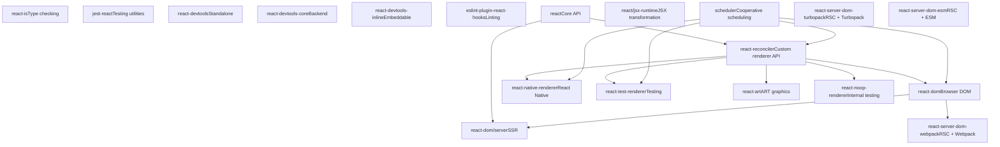
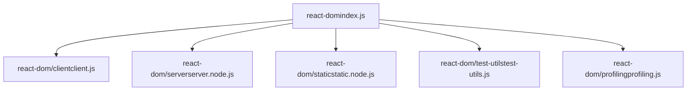
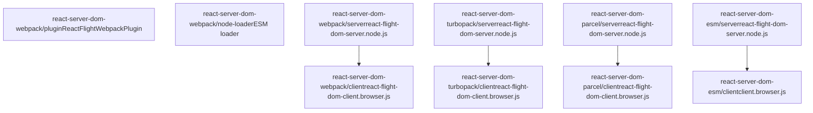
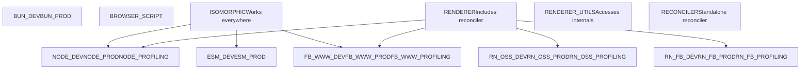
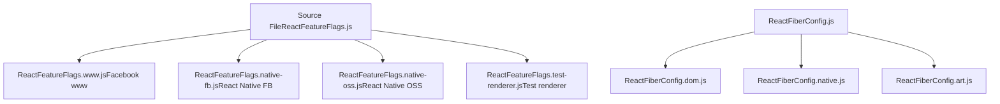
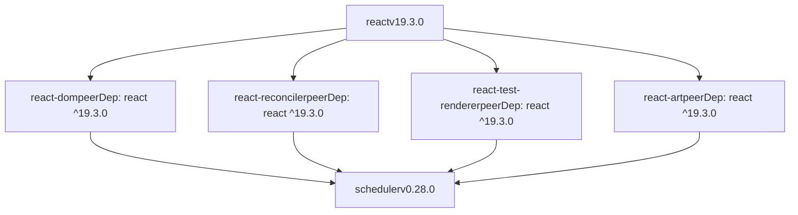

# Repository Structure and Packages

Relevant source files

-   [.gitignore](https://github.com/facebook/react/blob/65eec428/.gitignore)
-   [package.json](https://github.com/facebook/react/blob/65eec428/package.json)
-   [packages/eslint-plugin-react-hooks/package.json](https://github.com/facebook/react/blob/65eec428/packages/eslint-plugin-react-hooks/package.json)
-   [packages/jest-react/package.json](https://github.com/facebook/react/blob/65eec428/packages/jest-react/package.json)
-   [packages/react-art/package.json](https://github.com/facebook/react/blob/65eec428/packages/react-art/package.json)
-   [packages/react-devtools-core/package.json](https://github.com/facebook/react/blob/65eec428/packages/react-devtools-core/package.json)
-   [packages/react-devtools-extensions/chrome/manifest.json](https://github.com/facebook/react/blob/65eec428/packages/react-devtools-extensions/chrome/manifest.json)
-   [packages/react-devtools-extensions/edge/manifest.json](https://github.com/facebook/react/blob/65eec428/packages/react-devtools-extensions/edge/manifest.json)
-   [packages/react-devtools-extensions/firefox/manifest.json](https://github.com/facebook/react/blob/65eec428/packages/react-devtools-extensions/firefox/manifest.json)
-   [packages/react-devtools-inline/package.json](https://github.com/facebook/react/blob/65eec428/packages/react-devtools-inline/package.json)
-   [packages/react-devtools-shared/package.json](https://github.com/facebook/react/blob/65eec428/packages/react-devtools-shared/package.json)
-   [packages/react-devtools-timeline/package.json](https://github.com/facebook/react/blob/65eec428/packages/react-devtools-timeline/package.json)
-   [packages/react-devtools/CHANGELOG.md](https://github.com/facebook/react/blob/65eec428/packages/react-devtools/CHANGELOG.md)
-   [packages/react-devtools/package.json](https://github.com/facebook/react/blob/65eec428/packages/react-devtools/package.json)
-   [packages/react-dom/package.json](https://github.com/facebook/react/blob/65eec428/packages/react-dom/package.json)
-   [packages/react-dom/src/\_\_tests\_\_/ReactErrorLoggingRecovery-test.js](https://github.com/facebook/react/blob/65eec428/packages/react-dom/src/__tests__/ReactErrorLoggingRecovery-test.js)
-   [packages/react-is/package.json](https://github.com/facebook/react/blob/65eec428/packages/react-is/package.json)
-   [packages/react-native-renderer/package.json](https://github.com/facebook/react/blob/65eec428/packages/react-native-renderer/package.json)
-   [packages/react-noop-renderer/package.json](https://github.com/facebook/react/blob/65eec428/packages/react-noop-renderer/package.json)
-   [packages/react-reconciler/package.json](https://github.com/facebook/react/blob/65eec428/packages/react-reconciler/package.json)
-   [packages/react-test-renderer/package.json](https://github.com/facebook/react/blob/65eec428/packages/react-test-renderer/package.json)
-   [packages/react/package.json](https://github.com/facebook/react/blob/65eec428/packages/react/package.json)
-   [packages/scheduler/package.json](https://github.com/facebook/react/blob/65eec428/packages/scheduler/package.json)
-   [packages/shared/ReactVersion.js](https://github.com/facebook/react/blob/65eec428/packages/shared/ReactVersion.js)
-   [packages/shared/forks/ReactFeatureFlags.readonly.js](https://github.com/facebook/react/blob/65eec428/packages/shared/forks/ReactFeatureFlags.readonly.js)
-   [scripts/flow/config/flowconfig](https://github.com/facebook/react/blob/65eec428/scripts/flow/config/flowconfig)
-   [scripts/flow/createFlowConfigs.js](https://github.com/facebook/react/blob/65eec428/scripts/flow/createFlowConfigs.js)
-   [scripts/jest/config.build-devtools.js](https://github.com/facebook/react/blob/65eec428/scripts/jest/config.build-devtools.js)
-   [scripts/jest/config.build.js](https://github.com/facebook/react/blob/65eec428/scripts/jest/config.build.js)
-   [scripts/jest/setupHostConfigs.js](https://github.com/facebook/react/blob/65eec428/scripts/jest/setupHostConfigs.js)
-   [scripts/rollup/build.js](https://github.com/facebook/react/blob/65eec428/scripts/rollup/build.js)
-   [scripts/rollup/bundles.js](https://github.com/facebook/react/blob/65eec428/scripts/rollup/bundles.js)
-   [scripts/rollup/forks.js](https://github.com/facebook/react/blob/65eec428/scripts/rollup/forks.js)
-   [scripts/rollup/modules.js](https://github.com/facebook/react/blob/65eec428/scripts/rollup/modules.js)
-   [scripts/rollup/packaging.js](https://github.com/facebook/react/blob/65eec428/scripts/rollup/packaging.js)
-   [scripts/rollup/sync.js](https://github.com/facebook/react/blob/65eec428/scripts/rollup/sync.js)
-   [scripts/rollup/wrappers.js](https://github.com/facebook/react/blob/65eec428/scripts/rollup/wrappers.js)
-   [scripts/shared/inlinedHostConfigs.js](https://github.com/facebook/react/blob/65eec428/scripts/shared/inlinedHostConfigs.js)
-   [yarn.lock](https://github.com/facebook/react/blob/65eec428/yarn.lock)

## Purpose and Scope

This document describes the monorepo organization of the React codebase, the structure of packages within the `packages/` directory, their purposes, dependencies, and how they are configured for different build targets. For information about the build system that processes these packages, see [Build System and Package Distribution](/facebook/react/3-build-system-and-package-distribution). For details on the reconciler architecture that powers renderers, see [React Reconciler](/facebook/react/4-react-reconciler).

## Monorepo Architecture

The React repository is organized as a Yarn workspace monorepo. The root [package.json3-4](https://github.com/facebook/react/blob/65eec428/package.json#L3-L4) declares:

```
"workspaces": [
  "packages/*"
]
```
This structure allows all packages in the `packages/` directory to share dependencies and reference each other during development. The repository contains approximately 30+ packages that fall into distinct categories based on their role in the React ecosystem.

**Sources:** [package.json1-163](https://github.com/facebook/react/blob/65eec428/package.json#L1-L163)

## Package Categories


**Sources:** [scripts/rollup/bundles.js56-67](https://github.com/facebook/react/blob/65eec428/scripts/rollup/bundles.js#L56-L67) [packages/react/package.json](https://github.com/facebook/react/blob/65eec428/packages/react/package.json) [packages/react-dom/package.json](https://github.com/facebook/react/blob/65eec428/packages/react-dom/package.json) [packages/react-reconciler/package.json](https://github.com/facebook/react/blob/65eec428/packages/react-reconciler/package.json)

## Core Packages

### react

The `react` package provides the isomorphic core API that works in all environments (browser, server, native).

| Aspect | Details |
| --- | --- |
| **Version** | 19.3.0 |
| **Entry Points** | `index.js`, `jsx-runtime.js`, `jsx-dev-runtime.js`, `compiler-runtime.js` |
| **Exports** | Conditional exports for `react-server` vs default |
| **Dependencies** | None (peer-only) |
| **Module Type** | `ISOMORPHIC` |

Key exports structure from [packages/react/package.json24-42](https://github.com/facebook/react/blob/65eec428/packages/react/package.json#L24-L42):

```
"exports": {
  ".": {
    "react-server": "./react.react-server.js",
    "default": "./index.js"
  },
  "./jsx-runtime": {
    "react-server": "./jsx-runtime.react-server.js",
    "default": "./jsx-runtime.js"
  }
}
```
**Sources:** [packages/react/package.json1-52](https://github.com/facebook/react/blob/65eec428/packages/react/package.json#L1-L52) [scripts/rollup/bundles.js71-88](https://github.com/facebook/react/blob/65eec428/scripts/rollup/bundles.js#L71-L88)

### scheduler

The `scheduler` package implements cooperative scheduling for React's concurrent features.

| Property | Value |
| --- | --- |
| **Version** | 0.28.0 |
| **Entry Points** | `index.js`, `index.native.js`, `unstable_mock.js`, `unstable_post_task.js` |
| **Dependencies** | None |
| **Used By** | All renderer packages |

**Sources:** [packages/scheduler/package.json1-27](https://github.com/facebook/react/blob/65eec428/packages/scheduler/package.json#L1-L27)

### react-reconciler

The standalone reconciler package allows third-party developers to create custom React renderers.

| Property | Value |
| --- | --- |
| **Version** | 0.34.0 |
| **Entry Points** | `index.js`, `constants.js`, `reflection.js` |
| **Peer Dependencies** | `react ^19.3.0` |
| **Dependencies** | `scheduler ^0.28.0` |
| **Module Type** | `RECONCILER` |

**Sources:** [packages/react-reconciler/package.json1-34](https://github.com/facebook/react/blob/65eec428/packages/react-reconciler/package.json#L1-L34) [scripts/rollup/bundles.js64](https://github.com/facebook/react/blob/65eec428/scripts/rollup/bundles.js#L64-L64)

## Renderer Packages

### react-dom

The primary renderer for web applications, providing both client and server capabilities.


Entry point exports from [packages/react-dom/package.json51-125](https://github.com/facebook/react/blob/65eec428/packages/react-dom/package.json#L51-L125):

| Export | Conditions | File |
| --- | --- | --- |
| `.` | `react-server`, `default` | `react-dom.react-server.js`, `index.js` |
| `./client` | `react-server`, `default` | `client.react-server.js`, `client.js` |
| `./server` | `node`, `bun`, `edge-light`, `browser` | Environment-specific files |
| `./static` | `node`, `browser`, `edge-light` | Environment-specific files |
| `./profiling` | `react-server`, `default` | `profiling.react-server.js`, `profiling.js` |

**Sources:** [packages/react-dom/package.json1-126](https://github.com/facebook/react/blob/65eec428/packages/react-dom/package.json#L1-L126) [scripts/rollup/bundles.js181-396](https://github.com/facebook/react/blob/65eec428/scripts/rollup/bundles.js#L181-L396)

### react-native-renderer

Internal package for React Native rendering (not published to npm).

| Property | Value |
| --- | --- |
| **Version** | 16.0.0 (private) |
| **Peer Dependencies** | `react ^18.0.0` |
| **Dependencies** | `scheduler ^0.28.0` |

**Sources:** [packages/react-native-renderer/package.json1-16](https://github.com/facebook/react/blob/65eec428/packages/react-native-renderer/package.json#L1-L16)

### react-test-renderer

Renderer for unit testing that produces a JSON representation of the component tree.

| Property | Value |
| --- | --- |
| **Version** | 19.3.0 |
| **Entry Points** | `index.js`, `shallow.js` |
| **Peer Dependencies** | `react ^19.3.0` |
| **Dependencies** | `react-is ^19.3.0`, `scheduler ^0.28.0` |

**Sources:** [packages/react-test-renderer/package.json1-35](https://github.com/facebook/react/blob/65eec428/packages/react-test-renderer/package.json#L1-L35)

### react-art

Renderer for ART vector graphics library, supporting Canvas, SVG, and VML output.

| Property | Value |
| --- | --- |
| **Version** | 19.3.0 |
| **Entry Points** | `index.js`, `Circle.js`, `Rectangle.js`, `Wedge.js` |
| **Dependencies** | `art ^0.10.1`, `create-react-class ^15.6.2`, `scheduler ^0.28.0` |

**Sources:** [packages/react-art/package.json1-41](https://github.com/facebook/react/blob/65eec428/packages/react-art/package.json#L1-L41) [scripts/rollup/bundles.js828-847](https://github.com/facebook/react/blob/65eec428/scripts/rollup/bundles.js#L828-L847)

### react-noop-renderer

Internal testing renderer that produces an in-memory tree structure for React's own tests.

| Property | Value |
| --- | --- |
| **Version** | 16.0.0 (private) |
| **Entry Points** | `index.js`, `persistent.js`, `server.js`, `flight-client.js`, `flight-server.js` |
| **Dependencies** | `react-reconciler`, `react-client`, `react-server` |

**Sources:** [packages/react-noop-renderer/package.json1-32](https://github.com/facebook/react/blob/65eec428/packages/react-noop-renderer/package.json#L1-L32)

## Server-Side Packages

### React Server Components Packages

React Server Components (RSC) are bundled separately for different bundlers:


These packages implement the Flight protocol for streaming React Server Components. Bundle configurations are defined in [scripts/rollup/bundles.js448-814](https://github.com/facebook/react/blob/65eec428/scripts/rollup/bundles.js#L448-L814)

**Sources:** [scripts/rollup/bundles.js448-814](https://github.com/facebook/react/blob/65eec428/scripts/rollup/bundles.js#L448-L814) [scripts/shared/inlinedHostConfigs.js228-403](https://github.com/facebook/react/blob/65eec428/scripts/shared/inlinedHostConfigs.js#L228-L403)

## Developer Tools Packages

### react-devtools

Standalone Electron application for debugging React applications.

| Property | Value |
| --- | --- |
| **Version** | 7.0.1 |
| **Binary** | `react-devtools` |
| **Dependencies** | `electron ^23.1.2`, `react-devtools-core 7.0.1` |
| **Files** | `bin.js`, `app.html`, `app.js`, `preload.js` |

**Sources:** [packages/react-devtools/package.json1-32](https://github.com/facebook/react/blob/65eec428/packages/react-devtools/package.json#L1-L32)

### react-devtools-core

Backend and standalone server for React DevTools, used by the Electron app and integration tools.

| Property | Value |
| --- | --- |
| **Version** | 7.0.1 |
| **Main** | `./dist/backend.js` |
| **Exports** | `backend.js`, `standalone.js` |
| **Dependencies** | `shell-quote ^1.6.1`, `ws ^7` |

**Sources:** [packages/react-devtools-core/package.json1-38](https://github.com/facebook/react/blob/65eec428/packages/react-devtools-core/package.json#L1-L38)

### react-devtools-inline

Embeddable DevTools UI for integration into other tools and websites.

| Property | Value |
| --- | --- |
| **Version** | 7.0.1 |
| **Main** | `./dist/backend.js` |
| **Exports** | `backend.js`, `frontend.js`, `hookNames.js` |
| **Dependencies** | `@jridgewell/sourcemap-codec 1.5.5`, `source-map-js ^0.6.2` |

**Sources:** [packages/react-devtools-inline/package.json1-52](https://github.com/facebook/react/blob/65eec428/packages/react-devtools-inline/package.json#L1-L52)

### react-devtools-extensions

Browser extensions for Chrome, Firefox, and Edge. These are not npm packages but are built from source using webpack configurations.

Extension manifests:

-   Chrome: [packages/react-devtools-extensions/chrome/manifest.json1-65](https://github.com/facebook/react/blob/65eec428/packages/react-devtools-extensions/chrome/manifest.json#L1-L65)
-   Firefox: [packages/react-devtools-extensions/firefox/manifest.json1-70](https://github.com/facebook/react/blob/65eec428/packages/react-devtools-extensions/firefox/manifest.json#L1-L70)
-   Edge: [packages/react-devtools-extensions/edge/manifest.json1-65](https://github.com/facebook/react/blob/65eec428/packages/react-devtools-extensions/edge/manifest.json#L1-L65)

All use Manifest V3 and inject content scripts at `document_start`.

**Sources:** [packages/react-devtools-extensions/chrome/manifest.json](https://github.com/facebook/react/blob/65eec428/packages/react-devtools-extensions/chrome/manifest.json) [packages/react-devtools-extensions/firefox/manifest.json](https://github.com/facebook/react/blob/65eec428/packages/react-devtools-extensions/firefox/manifest.json) [packages/react-devtools-extensions/edge/manifest.json](https://github.com/facebook/react/blob/65eec428/packages/react-devtools-extensions/edge/manifest.json)

### eslint-plugin-react-hooks

ESLint plugin for enforcing Rules of Hooks and validating hook dependencies.

| Property | Value |
| --- | --- |
| **Version** | 7.0.0 |
| **Main** | `index.js` |
| **Types** | `index.d.ts` |
| **Peer Dependencies** | `eslint ^3.0.0 || ... || ^9.0.0` |
| **Key Dependencies** | `@babel/core`, `@babel/parser`, `hermes-parser`, `zod` |

**Sources:** [packages/eslint-plugin-react-hooks/package.json1-68](https://github.com/facebook/react/blob/65eec428/packages/eslint-plugin-react-hooks/package.json#L1-L68)

## Utility Packages

### react-is

Utility for type-checking React elements and component types.

| Property | Value |
| --- | --- |
| **Version** | 19.3.0 |
| **Main** | `index.js` |
| **Side Effects** | `false` |

**Sources:** [packages/react-is/package.json1-26](https://github.com/facebook/react/blob/65eec428/packages/react-is/package.json#L1-L26)

### jest-react

Jest matchers and utilities specifically for testing React components.

| Property | Value |
| --- | --- |
| **Version** | 0.17.0 |
| **Main** | `index.js` |
| **Peer Dependencies** | `jest`, `react`, `react-test-renderer` |

**Sources:** [packages/jest-react/package.json1-32](https://github.com/facebook/react/blob/65eec428/packages/jest-react/package.json#L1-L32)

## Build System Integration

### Bundle Types and Module Types

The build system defines distinct bundle types for different environments:


**Sources:** [scripts/rollup/bundles.js10-31](https://github.com/facebook/react/blob/65eec428/scripts/rollup/bundles.js#L10-L31) [scripts/rollup/bundles.js56-67](https://github.com/facebook/react/blob/65eec428/scripts/rollup/bundles.js#L56-L67)

### Output Path Structure

Package artifacts are organized by build target:

| Bundle Type | Output Path Pattern |
| --- | --- |
| `NODE_*`, `BUN_*` | `build/node_modules/{package}/cjs/{filename}` |
| `ESM_*` | `build/node_modules/{package}/esm/{filename}` |
| `FB_WWW_*` | `build/facebook-www/{filename}` |
| `RN_OSS_*` | `build/react-native/implementations/{filename}` |
| `RN_FB_*` | `build/facebook-react-native/{package}/cjs/{filename}` |

**Sources:** [scripts/rollup/packaging.js48-114](https://github.com/facebook/react/blob/65eec428/scripts/rollup/packaging.js#L48-L114)

### Module Forking System

The build system uses a sophisticated module forking mechanism to substitute different implementations based on environment:


Fork resolution logic is in [scripts/rollup/forks.js29-43](https://github.com/facebook/react/blob/65eec428/scripts/rollup/forks.js#L29-L43) with specific fork mappings defined in [scripts/rollup/forks.js52-450](https://github.com/facebook/react/blob/65eec428/scripts/rollup/forks.js#L52-L450)

**Sources:** [scripts/rollup/forks.js1-450](https://github.com/facebook/react/blob/65eec428/scripts/rollup/forks.js#L1-L450) [scripts/rollup/modules.js64-81](https://github.com/facebook/react/blob/65eec428/scripts/rollup/modules.js#L64-L81)

### Host Configuration System

Different renderers use inlined host configurations that define platform-specific behavior:

| Host Config | Entry Points | Purpose |
| --- | --- | --- |
| `dom-browser` | `react-dom`, `react-dom/client` | Browser DOM operations |
| `dom-node` | `react-dom/server.node` | Node.js SSR |
| `dom-edge` | `react-dom/server.edge` | Edge runtime SSR |
| `dom-bun` | `react-dom/server.bun` | Bun runtime SSR |
| `native-renderer` | `react-native-renderer` | React Native rendering |
| `test-renderer` | `react-test-renderer` | Testing infrastructure |
| `art` | `react-art` | ART graphics rendering |

Each host config is associated with specific entry points in [scripts/shared/inlinedHostConfigs.js9-403](https://github.com/facebook/react/blob/65eec428/scripts/shared/inlinedHostConfigs.js#L9-L403)

**Sources:** [scripts/shared/inlinedHostConfigs.js1-403](https://github.com/facebook/react/blob/65eec428/scripts/shared/inlinedHostConfigs.js#L1-L403)

## Package Dependency Patterns

### Peer Dependencies

Most packages declare `react` as a peer dependency to avoid version conflicts:


**Sources:** [packages/react/package.json44-51](https://github.com/facebook/react/blob/65eec428/packages/react/package.json#L44-L51) [packages/react-dom/package.json22-24](https://github.com/facebook/react/blob/65eec428/packages/react-dom/package.json#L22-L24) [packages/react-reconciler/package.json28-33](https://github.com/facebook/react/blob/65eec428/packages/react-reconciler/package.json#L28-L33)

### Internal Dependencies

Some packages have internal dependencies on other packages in the monorepo:

| Package | Dependencies |
| --- | --- |
| `react-devtools` | `react-devtools-core 7.0.1` |
| `react-noop-renderer` | `react-reconciler`, `react-client`, `react-server` |
| `react-test-renderer` | `react-is ^19.3.0`, `scheduler ^0.28.0` |

**Sources:** [packages/react-devtools/package.json24-30](https://github.com/facebook/react/blob/65eec428/packages/react-devtools/package.json#L24-L30) [packages/react-noop-renderer/package.json13-17](https://github.com/facebook/react/blob/65eec428/packages/react-noop-renderer/package.json#L13-L17) [packages/react-test-renderer/package.json21-24](https://github.com/facebook/react/blob/65eec428/packages/react-test-renderer/package.json#L21-L24)

## Version Management

The canonical React version is maintained in [packages/shared/ReactVersion.js15](https://github.com/facebook/react/blob/65eec428/packages/shared/ReactVersion.js#L15-L15):

```
export default '19.3.0';
```
This file is imported during the build process to inject version numbers into all packages. The version appears consistently across:

-   Core packages: `react`, `react-dom`, `react-is` (19.3.0)
-   Scheduler: `scheduler` (0.28.0)
-   Reconciler: `react-reconciler` (0.34.0)
-   DevTools: `react-devtools*` (7.0.1)

**Sources:** [packages/shared/ReactVersion.js1-16](https://github.com/facebook/react/blob/65eec428/packages/shared/ReactVersion.js#L1-L16) [packages/react/package.json7](https://github.com/facebook/react/blob/65eec428/packages/react/package.json#L7-L7) [packages/react-dom/package.json3](https://github.com/facebook/react/blob/65eec428/packages/react-dom/package.json#L3-L3)
