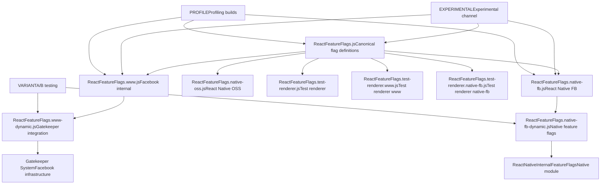
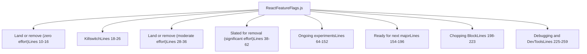
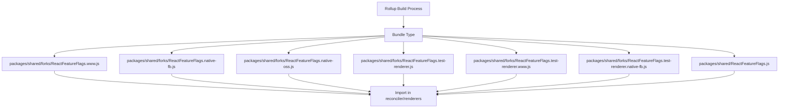
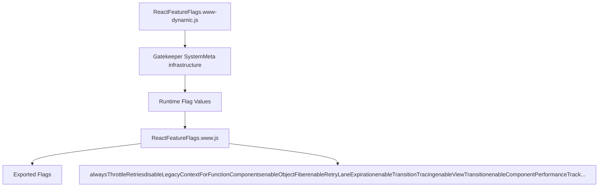
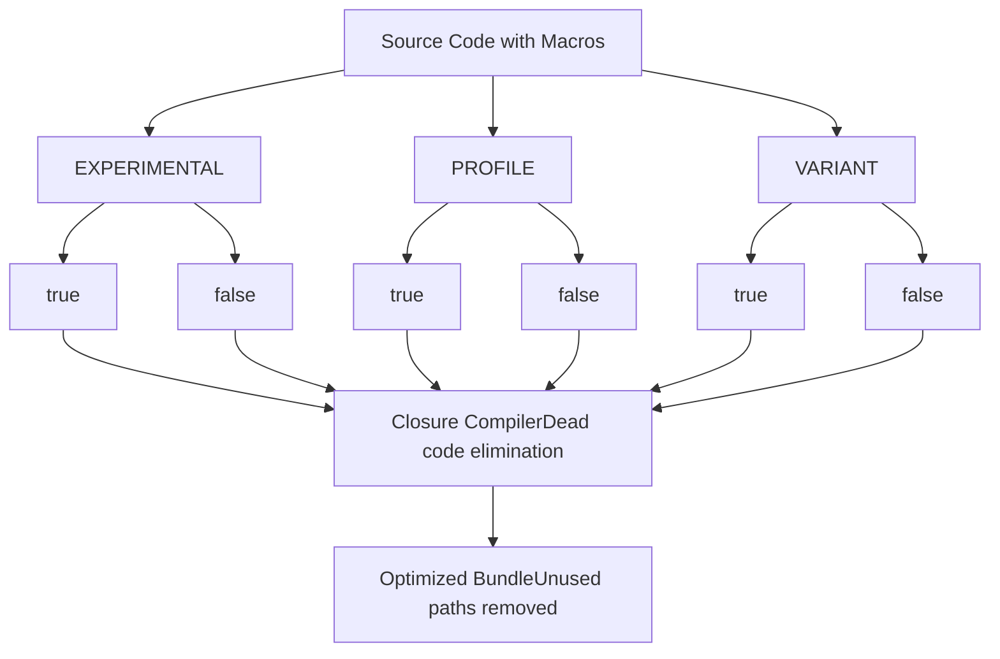
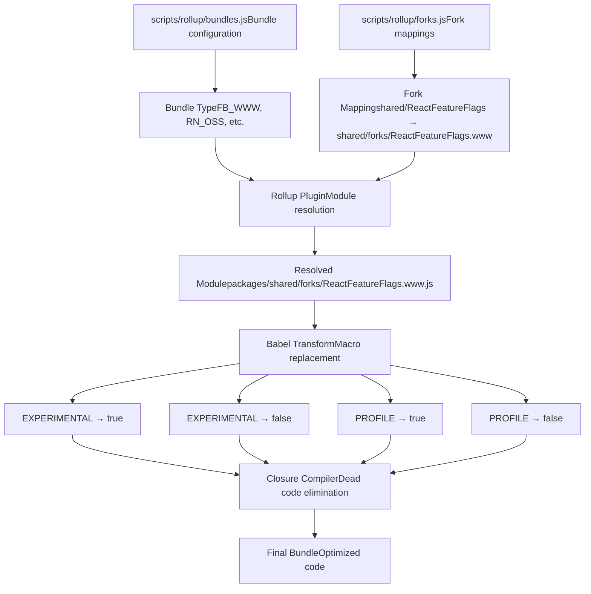

# Feature Flags System

Relevant source files

-   [packages/shared/ReactFeatureFlags.js](https://github.com/facebook/react/blob/65eec428/packages/shared/ReactFeatureFlags.js)
-   [packages/shared/forks/ReactFeatureFlags.native-fb-dynamic.js](https://github.com/facebook/react/blob/65eec428/packages/shared/forks/ReactFeatureFlags.native-fb-dynamic.js)
-   [packages/shared/forks/ReactFeatureFlags.native-fb.js](https://github.com/facebook/react/blob/65eec428/packages/shared/forks/ReactFeatureFlags.native-fb.js)
-   [packages/shared/forks/ReactFeatureFlags.native-oss.js](https://github.com/facebook/react/blob/65eec428/packages/shared/forks/ReactFeatureFlags.native-oss.js)
-   [packages/shared/forks/ReactFeatureFlags.test-renderer.js](https://github.com/facebook/react/blob/65eec428/packages/shared/forks/ReactFeatureFlags.test-renderer.js)
-   [packages/shared/forks/ReactFeatureFlags.test-renderer.native-fb.js](https://github.com/facebook/react/blob/65eec428/packages/shared/forks/ReactFeatureFlags.test-renderer.native-fb.js)
-   [packages/shared/forks/ReactFeatureFlags.test-renderer.www.js](https://github.com/facebook/react/blob/65eec428/packages/shared/forks/ReactFeatureFlags.test-renderer.www.js)
-   [packages/shared/forks/ReactFeatureFlags.www-dynamic.js](https://github.com/facebook/react/blob/65eec428/packages/shared/forks/ReactFeatureFlags.www-dynamic.js)
-   [packages/shared/forks/ReactFeatureFlags.www.js](https://github.com/facebook/react/blob/65eec428/packages/shared/forks/ReactFeatureFlags.www.js)
-   [scripts/flow/xplat.js](https://github.com/facebook/react/blob/65eec428/scripts/flow/xplat.js)

## Purpose and Scope

The Feature Flags System is React's comprehensive mechanism for controlling experimental features, platform-specific behavior, and gradual feature rollouts across different environments and release channels. It enables the same codebase to be compiled with different behaviors for Facebook's internal infrastructure (www), React Native Facebook internal (native-fb), React Native open source (native-oss), and test renderers, while also supporting A/B testing and runtime-controllable flags in production environments.

This document covers the flag definition structure, forking mechanism, dynamic flag integration, build-time macros, and flag lifecycle management. For information about how the build system processes these flags, see [Build System and Package Distribution](/facebook/react/3-build-system-and-package-distribution). For information about how flags affect reconciler behavior, see [React Reconciler](/facebook/react/4-react-reconciler).

## System Architecture

The feature flag system is structured as a base definition file with environment-specific forks that override default values. The system supports both static flags (determined at build time) and dynamic flags (controllable at runtime via gatekeepers or feature management systems).


**Sources:** [packages/shared/ReactFeatureFlags.js1-259](https://github.com/facebook/react/blob/65eec428/packages/shared/ReactFeatureFlags.js#L1-L259) [packages/shared/forks/ReactFeatureFlags.www.js1-121](https://github.com/facebook/react/blob/65eec428/packages/shared/forks/ReactFeatureFlags.www.js#L1-L121) [packages/shared/forks/ReactFeatureFlags.native-fb.js1-92](https://github.com/facebook/react/blob/65eec428/packages/shared/forks/ReactFeatureFlags.native-fb.js#L1-L92) [packages/shared/forks/ReactFeatureFlags.native-oss.js1-91](https://github.com/facebook/react/blob/65eec428/packages/shared/forks/ReactFeatureFlags.native-oss.js#L1-L91)

## Base Feature Flag Definitions

The base feature flag definitions reside in `ReactFeatureFlags.js` and serve as the canonical source of all flags with their default values for open source builds. This file organizes flags into explicit lifecycle categories that document their intended purpose and stability.

### Flag Organization Structure


**Sources:** [packages/shared/ReactFeatureFlags.js10-259](https://github.com/facebook/react/blob/65eec428/packages/shared/ReactFeatureFlags.js#L10-L259)

### Key Flag Categories

| Category | Purpose | Example Flags | Lines |
| --- | --- | --- | --- |
| **Killswitch** | Emergency disable switches for production issues | `enableHydrationLaneScheduling` | [25](https://github.com/facebook/react/blob/65eec428/25) |
| **Land or remove (moderate)** | Flags requiring migration effort | `disableSchedulerTimeoutInWorkLoop` | [35](https://github.com/facebook/react/blob/65eec428/35) |
| **Slated for removal** | Deprecated features awaiting migration | `enableSuspenseCallback`, `enableScopeAPI`, `enableCreateEventHandleAPI` | [52, 55, 58](https://github.com/facebook/react/blob/65eec428/52, 55, 58) |
| **Ongoing experiments** | Active feature development | `enableLegacyCache`, `enableTaint`, `enableViewTransition` | [77, 81, 85](https://github.com/facebook/react/blob/65eec428/77, 81, 85) |
| **Ready for next major** | Features planned for next major release | `disableLegacyContext`, `disableLegacyMode`, `renameElementSymbol` | [177, 195, 167](https://github.com/facebook/react/blob/65eec428/177, 195, 167) |
| **Debugging and DevTools** | Profiling and development tools | `enableProfilerTimer`, `enableComponentPerformanceTrack` | [229, 235](https://github.com/facebook/react/blob/65eec428/229, 235) |

**Sources:** [packages/shared/ReactFeatureFlags.js10-259](https://github.com/facebook/react/blob/65eec428/packages/shared/ReactFeatureFlags.js#L10-L259)

### Common Flag Patterns

The base file defines several patterns of flags:

**Boolean Feature Toggles:**

```
export const enableHalt: boolean = true;
export const enableViewTransition: boolean = true;
export const enableGestureTransition = __EXPERIMENTAL__;
```
**Expiration Timeouts:**

```
export const retryLaneExpirationMs = 5000;
export const syncLaneExpirationMs = 250;
export const transitionLaneExpirationMs = 5000;
```
**Limits and Thresholds:**

```
export const ownerStackLimit = 1e4;
```
**Sources:** [packages/shared/ReactFeatureFlags.js83-258](https://github.com/facebook/react/blob/65eec428/packages/shared/ReactFeatureFlags.js#L83-L258)

## Fork Mechanism

The fork mechanism allows different builds to use different implementations of the feature flags module. During the build process, Rollup's module resolution is configured to substitute the appropriate fork based on the target bundle type.

### Fork Resolution Process


**Sources:** [packages/shared/forks/ReactFeatureFlags.www.js1-121](https://github.com/facebook/react/blob/65eec428/packages/shared/forks/ReactFeatureFlags.www.js#L1-L121) [packages/shared/forks/ReactFeatureFlags.native-fb.js1-92](https://github.com/facebook/react/blob/65eec428/packages/shared/forks/ReactFeatureFlags.native-fb.js#L1-L92) [packages/shared/forks/ReactFeatureFlags.native-oss.js1-91](https://github.com/facebook/react/blob/65eec428/packages/shared/forks/ReactFeatureFlags.native-oss.js#L1-L91)

### Fork Type Verification

Each fork file includes Flow type verification at the end to ensure it exports the same interface as the base file:

```
((((null: any): ExportsType): FeatureFlagsType): ExportsType);
```
This type assertion ensures that:

1.  The fork exports all flags defined in the base
2.  The fork doesn't export extra flags not in the base
3.  Type signatures match exactly

**Sources:** [packages/shared/forks/ReactFeatureFlags.www.js120](https://github.com/facebook/react/blob/65eec428/packages/shared/forks/ReactFeatureFlags.www.js#L120-L120) [packages/shared/forks/ReactFeatureFlags.native-fb.js91](https://github.com/facebook/react/blob/65eec428/packages/shared/forks/ReactFeatureFlags.native-fb.js#L91-L91) [packages/shared/forks/ReactFeatureFlags.native-oss.js90](https://github.com/facebook/react/blob/65eec428/packages/shared/forks/ReactFeatureFlags.native-oss.js#L90-L90)

### Platform-Specific Flag Values

Different forks set different default values based on platform capabilities and requirements:

| Flag | Base | www | native-fb | native-oss |
| --- | --- | --- | --- | --- |
| `enableLegacyFBSupport` | false | true | false | false |
| `disableLegacyMode` | true | true | false | false |
| `enableMoveBefore` | false | false | true | true |
| `enableSuspenseCallback` | false | true | true | false |
| `enableScopeAPI` | false | true | false | false |
| `enableViewTransition` | true | true | false | true |

**Sources:** [packages/shared/ReactFeatureFlags.js52-195](https://github.com/facebook/react/blob/65eec428/packages/shared/ReactFeatureFlags.js#L52-L195) [packages/shared/forks/ReactFeatureFlags.www.js53-101](https://github.com/facebook/react/blob/65eec428/packages/shared/forks/ReactFeatureFlags.www.js#L53-L101) [packages/shared/forks/ReactFeatureFlags.native-fb.js39-62](https://github.com/facebook/react/blob/65eec428/packages/shared/forks/ReactFeatureFlags.native-fb.js#L39-L62) [packages/shared/forks/ReactFeatureFlags.native-oss.js24-65](https://github.com/facebook/react/blob/65eec428/packages/shared/forks/ReactFeatureFlags.native-oss.js#L24-L65)

## Dynamic Feature Flags

Dynamic feature flags enable runtime control of features in internal Meta builds through gatekeeper systems. These flags are re-exported from platform-specific feature flag modules and their values can change without redeploying code.

### www Dynamic Flags

The `ReactFeatureFlags.www.js` fork imports dynamic flags from a runtime module:


The www fork destructures and re-exports specific flags from the dynamic module:

```
export const {
  alwaysThrottleRetries,
  disableLegacyContextForFunctionComponents,
  disableSchedulerTimeoutInWorkLoop,
  enableHiddenSubtreeInsertionEffectCleanup,
  enableInfiniteRenderLoopDetection,
  enableNoCloningMemoCache,
  enableObjectFiber,
  enableRetryLaneExpiration,
  enableTransitionTracing,
  ...
} = dynamicFeatureFlags;
```
**Sources:** [packages/shared/forks/ReactFeatureFlags.www.js15-39](https://github.com/facebook/react/blob/65eec428/packages/shared/forks/ReactFeatureFlags.www.js#L15-L39)

### Native Facebook Dynamic Flags

The native-fb fork imports dynamic flags from the `ReactNativeInternalFeatureFlags` native module:

```
import * as dynamicFlagsUntyped from 'ReactNativeInternalFeatureFlags';
const dynamicFlags: DynamicExportsType = (dynamicFlagsUntyped: any);

export const {
  alwaysThrottleRetries,
  enableHiddenSubtreeInsertionEffectCleanup,
  enableObjectFiber,
  enableEagerAlternateStateNodeCleanup,
  passChildrenWhenCloningPersistedNodes,
  renameElementSymbol,
  enableFragmentRefs,
  enableFragmentRefsScrollIntoView,
  enableFragmentRefsInstanceHandles,
} = dynamicFlags;
```
**Sources:** [packages/shared/forks/ReactFeatureFlags.native-fb.js16-31](https://github.com/facebook/react/blob/65eec428/packages/shared/forks/ReactFeatureFlags.native-fb.js#L16-L31) [scripts/flow/xplat.js10-12](https://github.com/facebook/react/blob/65eec428/scripts/flow/xplat.js#L10-L12)

### **VARIANT** Testing Pattern

Dynamic flag definition files use the `__VARIANT__` macro to enable A/B testing during development. The build system runs tests twice: once with `__VARIANT__ = true` and once with `__VARIANT__ = false`:

```
export const alwaysThrottleRetries: boolean = __VARIANT__;
export const disableLegacyContextForFunctionComponents: boolean = __VARIANT__;
export const enableObjectFiber: boolean = __VARIANT__;
export const enableRetryLaneExpiration: boolean = __VARIANT__;
```
This allows testing both code paths for flags that will be dynamically controlled in production.

**Sources:** [packages/shared/forks/ReactFeatureFlags.www-dynamic.js13-42](https://github.com/facebook/react/blob/65eec428/packages/shared/forks/ReactFeatureFlags.www-dynamic.js#L13-L42) [packages/shared/forks/ReactFeatureFlags.native-fb-dynamic.js10-30](https://github.com/facebook/react/blob/65eec428/packages/shared/forks/ReactFeatureFlags.native-fb-dynamic.js#L10-L30)

## Build-Time Macros

Build-time macros are special identifiers that are replaced with boolean values during the build process. These enable conditional compilation based on build configuration.

### Macro Types and Usage


**Sources:** [packages/shared/ReactFeatureFlags.js77-256](https://github.com/facebook/react/blob/65eec428/packages/shared/ReactFeatureFlags.js#L77-L256) [packages/shared/forks/ReactFeatureFlags.www.js41-69](https://github.com/facebook/react/blob/65eec428/packages/shared/forks/ReactFeatureFlags.www.js#L41-L69)

### **EXPERIMENTAL** Macro

Used to enable features only in experimental release channels:

```
export const enableLegacyCache = __EXPERIMENTAL__;
export const enableAsyncIterableChildren = __EXPERIMENTAL__;
export const enableTaint = __EXPERIMENTAL__;
export const enableGestureTransition = __EXPERIMENTAL__;
```
In the www fork, `__EXPERIMENTAL__` is also used for the new modern build variant:

```
export const disableLegacyContext = __EXPERIMENTAL__;
export const disableTextareaChildren = __EXPERIMENTAL__;
```
**Sources:** [packages/shared/ReactFeatureFlags.js77-87](https://github.com/facebook/react/blob/65eec428/packages/shared/ReactFeatureFlags.js#L77-L87) [packages/shared/forks/ReactFeatureFlags.www.js69-91](https://github.com/facebook/react/blob/65eec428/packages/shared/forks/ReactFeatureFlags.www.js#L69-L91)

### **PROFILE** Macro

Used to enable profiling and performance measurement features:

```
export const enableProfilerTimer = __PROFILE__;
export const enableProfilerCommitHooks = __PROFILE__;
export const enableProfilerNestedUpdatePhase = __PROFILE__;
export const enableUpdaterTracking = __PROFILE__;
export const enableSchedulingProfiler: boolean =
  !enableComponentPerformanceTrack && __PROFILE__;
```
This enables React DevTools profiling capabilities without impacting production bundle size.

**Sources:** [packages/shared/ReactFeatureFlags.js229-256](https://github.com/facebook/react/blob/65eec428/packages/shared/ReactFeatureFlags.js#L229-L256) [packages/shared/forks/ReactFeatureFlags.www.js44-67](https://github.com/facebook/react/blob/65eec428/packages/shared/forks/ReactFeatureFlags.www.js#L44-L67)

### **VARIANT** Macro

Used in dynamic flag definition files to simulate gatekeepers during testing:

```
export const alwaysThrottleRetries: boolean = __VARIANT__;
export const enableObjectFiber: boolean = __VARIANT__;
export const enableRetryLaneExpiration: boolean = __VARIANT__;
export const enableTransitionTracing: boolean = __VARIANT__;
```
The test infrastructure runs tests multiple times with different `__VARIANT__` values to ensure both code paths work correctly.

**Sources:** [packages/shared/forks/ReactFeatureFlags.www-dynamic.js16-24](https://github.com/facebook/react/blob/65eec428/packages/shared/forks/ReactFeatureFlags.www-dynamic.js#L16-L24) [packages/shared/forks/ReactFeatureFlags.native-fb-dynamic.js20-29](https://github.com/facebook/react/blob/65eec428/packages/shared/forks/ReactFeatureFlags.native-fb-dynamic.js#L20-L29)

## Feature Flag Lifecycle

Flags move through different lifecycle stages as features are developed, stabilized, and eventually removed. The base file explicitly documents these stages through code comments and organization.

### Lifecycle Stage Flow

> **[Mermaid stateDiagram]**
> *(图表结构无法解析)*

**Sources:** [packages/shared/ReactFeatureFlags.js10-259](https://github.com/facebook/react/blob/65eec428/packages/shared/ReactFeatureFlags.js#L10-L259)

### Stage Definitions

**Ongoing Experiments (Lines 64-152):** Features under active development that may change or be reverted. Examples:

-   `enableYieldingBeforePassive`: Yield to browser event loop before passive effects
-   `enableThrottledScheduling`: Intentionally yield less to block high framerate animations
-   `enableViewTransition`: View transition API integration
-   `enableSuspenseyImages`: Enhanced image loading with Suspense

**Ready for Next Major (Lines 154-196):** Features that are stable and will be enabled by default in the next major release:

-   `disableLegacyContext`: Remove legacy context API
-   `disableLegacyMode`: Remove legacy rendering mode
-   `renameElementSymbol`: Update internal element representation
-   `enableReactTestRendererWarning`: Warn about test renderer usage

**Slated for Removal (Lines 38-62):** Deprecated features that didn't ship but can't be deleted until internal migrations complete:

-   `enableSuspenseCallback`: Legacy Suspense callback API
-   `enableScopeAPI`: Experimental Scope support
-   `enableCreateEventHandleAPI`: Experimental event handle API
-   `enableLegacyFBSupport`: Legacy Primer support on Facebook internal

**Killswitch (Lines 18-26):** Flags that exist to quickly disable features if they cause production issues:

-   `enableHydrationLaneScheduling`: Can be disabled if hydration scheduling causes issues

**Sources:** [packages/shared/ReactFeatureFlags.js18-196](https://github.com/facebook/react/blob/65eec428/packages/shared/ReactFeatureFlags.js#L18-L196)

## Integration with Build System

The feature flag system integrates deeply with the build pipeline through module forking and macro replacement. The build system selects the appropriate fork based on the bundle configuration.

### Build-Time Flag Resolution


**Sources:** [packages/shared/forks/ReactFeatureFlags.www.js1-121](https://github.com/facebook/react/blob/65eec428/packages/shared/forks/ReactFeatureFlags.www.js#L1-L121) [packages/shared/forks/ReactFeatureFlags.native-fb.js1-92](https://github.com/facebook/react/blob/65eec428/packages/shared/forks/ReactFeatureFlags.native-fb.js#L1-L92)

### Fork Selection Examples

Different bundle types resolve to different forks:

| Bundle Type | Fork Path | Purpose |
| --- | --- | --- |
| `FB_WWW` | `shared/forks/ReactFeatureFlags.www.js` | Facebook internal web |
| `RN_FB` | `shared/forks/ReactFeatureFlags.native-fb.js` | React Native Facebook internal |
| `RN_OSS` | `shared/forks/ReactFeatureFlags.native-oss.js` | React Native open source |
| `NODE_DEV`, `NODE_PROD` | `shared/ReactFeatureFlags.js` | Node.js builds (base) |
| `UMD_DEV`, `UMD_PROD` | `shared/ReactFeatureFlags.js` | Browser UMD builds (base) |

For test renderer builds, additional specialized forks are used:

| Bundle Type | Fork Path |
| --- | --- |
| Test renderer (www) | `shared/forks/ReactFeatureFlags.test-renderer.www.js` |
| Test renderer (native-fb) | `shared/forks/ReactFeatureFlags.test-renderer.native-fb.js` |
| Test renderer (default) | `shared/forks/ReactFeatureFlags.test-renderer.js` |

**Sources:** [packages/shared/forks/ReactFeatureFlags.www.js1](https://github.com/facebook/react/blob/65eec428/packages/shared/forks/ReactFeatureFlags.www.js#L1-L1) [packages/shared/forks/ReactFeatureFlags.native-fb.js1](https://github.com/facebook/react/blob/65eec428/packages/shared/forks/ReactFeatureFlags.native-fb.js#L1-L1) [packages/shared/forks/ReactFeatureFlags.native-oss.js1](https://github.com/facebook/react/blob/65eec428/packages/shared/forks/ReactFeatureFlags.native-oss.js#L1-L1) [packages/shared/forks/ReactFeatureFlags.test-renderer.www.js1](https://github.com/facebook/react/blob/65eec428/packages/shared/forks/ReactFeatureFlags.test-renderer.www.js#L1-L1) [packages/shared/forks/ReactFeatureFlags.test-renderer.native-fb.js1](https://github.com/facebook/react/blob/65eec428/packages/shared/forks/ReactFeatureFlags.test-renderer.native-fb.js#L1-L1) [packages/shared/forks/ReactFeatureFlags.test-renderer.js1](https://github.com/facebook/react/blob/65eec428/packages/shared/forks/ReactFeatureFlags.test-renderer.js#L1-L1)

## Flag Consumption in Runtime Code

Runtime code imports feature flags from `shared/ReactFeatureFlags` and the build system resolves this to the appropriate fork:

```
import {
  enableProfilerTimer,
  enableSuspenseCallback,
  enableTransitionTracing,
  enableLegacyHidden,
} from 'shared/ReactFeatureFlags';
```
The reconciler, renderers, and other systems check these flags to conditionally enable features:

```
if (enableTransitionTracing) {
  // Transition tracing logic
}

if (enableProfilerTimer) {
  // Profiling timer logic
}
```
After Babel macro replacement and Closure Compiler dead code elimination, only the active code path remains in the final bundle.

**Sources:** [packages/shared/ReactFeatureFlags.js1-259](https://github.com/facebook/react/blob/65eec428/packages/shared/ReactFeatureFlags.js#L1-L259)

## Special Flag Categories

### Profiling Flags

Profiling flags are controlled by the `__PROFILE__` macro and enable performance measurement features:

| Flag | Purpose | Lines |
| --- | --- | --- |
| `enableProfilerTimer` | Gather timing metrics for Profiler subtrees | [229](https://github.com/facebook/react/blob/65eec428/229) |
| `enableComponentPerformanceTrack` | Add performance.measure() marks for Chrome | [235](https://github.com/facebook/react/blob/65eec428/235) |
| `enableSchedulingProfiler` | User timing marks for experimental timeline | [244-245](https://github.com/facebook/react/blob/65eec428/244-245) |
| `enableProfilerCommitHooks` | Record commit phase durations | [248](https://github.com/facebook/react/blob/65eec428/248) |
| `enableProfilerNestedUpdatePhase` | Differentiate update vs cascading-update | [251](https://github.com/facebook/react/blob/65eec428/251) |
| `enableUpdaterTracking` | Track which Fibers schedule render work | [256](https://github.com/facebook/react/blob/65eec428/256) |

**Sources:** [packages/shared/ReactFeatureFlags.js229-256](https://github.com/facebook/react/blob/65eec428/packages/shared/ReactFeatureFlags.js#L229-L256)

### Expiration and Timeout Flags

These flags control timing behaviors in the scheduler and reconciler:

| Flag | Default Value | Purpose | Lines |
| --- | --- | --- | --- |
| `enableRetryLaneExpiration` | false | Enable expiration time for retry lanes | [137](https://github.com/facebook/react/blob/65eec428/137) |
| `retryLaneExpirationMs` | 5000 | Retry lane expiration timeout | [138](https://github.com/facebook/react/blob/65eec428/138) |
| `syncLaneExpirationMs` | 250 | Sync lane expiration timeout | [139](https://github.com/facebook/react/blob/65eec428/139) |
| `transitionLaneExpirationMs` | 5000 | Transition lane expiration timeout | [140](https://github.com/facebook/react/blob/65eec428/140) |

**Sources:** [packages/shared/ReactFeatureFlags.js137-140](https://github.com/facebook/react/blob/65eec428/packages/shared/ReactFeatureFlags.js#L137-L140)

### Legacy API Deprecation Flags

Flags controlling the removal of legacy APIs:

| Flag | Status | Purpose | Lines |
| --- | --- | --- | --- |
| `disableLegacyContext` | Ready for major | Remove static contextTypes API | [177](https://github.com/facebook/react/blob/65eec428/177) |
| `disableLegacyContextForFunctionComponents` | Ready for major | Remove legacy context from function components only | [181](https://github.com/facebook/react/blob/65eec428/181) |
| `disableLegacyMode` | Ready for major | Remove legacy rendering mode | [195](https://github.com/facebook/react/blob/65eec428/195) |
| `enableLegacyHidden` | Slated for removal | Legacy hidden subtree API (FB-only) | [111](https://github.com/facebook/react/blob/65eec428/111) |
| `enableLegacyFBSupport` | Slated for removal | Legacy Primer support | [61](https://github.com/facebook/react/blob/65eec428/61) |

**Sources:** [packages/shared/ReactFeatureFlags.js61-195](https://github.com/facebook/react/blob/65eec428/packages/shared/ReactFeatureFlags.js#L61-L195)

## Flag Naming Conventions

The codebase follows consistent naming conventions for feature flags:

**Enable/Disable Prefix:**

-   `enable*`: Positive feature flags (e.g., `enableViewTransition`, `enableTaint`)
-   `disable*`: Negative feature flags for deprecations (e.g., `disableLegacyContext`, `disableClientCache`)

**Lifecycle Indicators:**

-   Flags in "Slated for removal" section typically start with `enable` but are set to `false`
-   Flags in "Ready for next major" that deprecate features use `disable` prefix
-   Killswitch flags are typically feature enables that can be toggled to `false` for emergency rollback

**Timing/Configuration Suffixes:**

-   `*Ms`: Millisecond timeouts (e.g., `retryLaneExpirationMs`)
-   `*Limit`: Numeric limits (e.g., `ownerStackLimit`)

**Sources:** [packages/shared/ReactFeatureFlags.js1-259](https://github.com/facebook/react/blob/65eec428/packages/shared/ReactFeatureFlags.js#L1-L259)

## Summary Table: All Feature Flags

| Flag Name | Base | www | native-fb | native-oss | test-renderer | Category |
| --- | --- | --- | --- | --- | --- | --- |
| `enableHydrationLaneScheduling` | true | true | true | true | true | Killswitch |
| `disableSchedulerTimeoutInWorkLoop` | false | dynamic | false | false | false | Land/remove (moderate) |
| `enableSuspenseCallback` | false | true | true | false | false | Slated for removal |
| `enableScopeAPI` | false | true | false | false | false | Slated for removal |
| `enableCreateEventHandleAPI` | false | true | false | false | false | Slated for removal |
| `enableLegacyFBSupport` | false | true | false | false | false | Slated for removal |
| `enableYieldingBeforePassive` | false | false | false | false | true | Ongoing |
| `enableThrottledScheduling` | false | false | false | false | false | Ongoing |
| `enableLegacyCache` | **EXPERIMENTAL** | true | false | false | **EXPERIMENTAL** | Ongoing |
| `enableTaint` | **EXPERIMENTAL** | false | true | true | true | Ongoing |
| `enableHalt` | true | true | true | true | true | Ongoing |
| `enableViewTransition` | true | dynamic | false | true | false | Ongoing |
| `disableLegacyContext` | true | **EXPERIMENTAL** | false | true | true | Ready for major |
| `disableLegacyMode` | true | true | false | false | true | Ready for major |
| `renameElementSymbol` | true | dynamic | dynamic | true | false | Ready for major |

**Sources:** All ReactFeatureFlags files listed above
