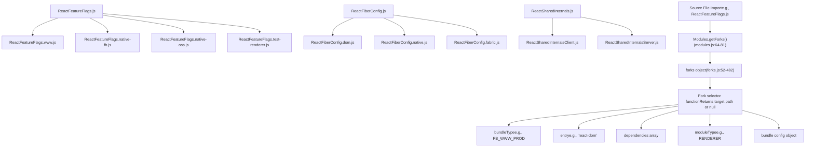
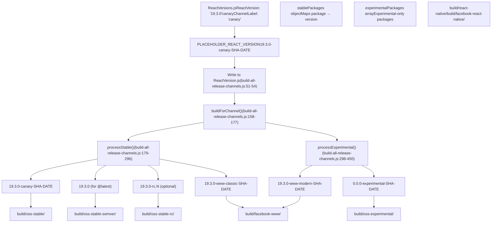
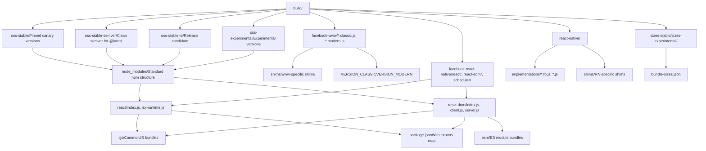
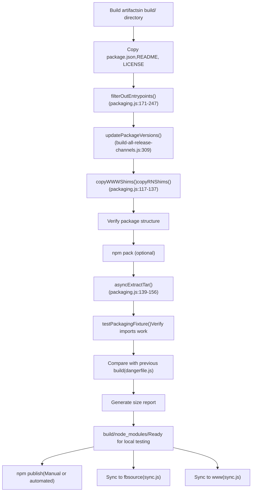
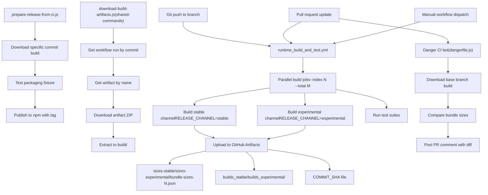

# Build System and Package Distribution

Relevant source files

-   [.gitignore](https://github.com/facebook/react/blob/65eec428/.gitignore)
-   [ReactVersions.js](https://github.com/facebook/react/blob/65eec428/ReactVersions.js)
-   [dangerfile.js](https://github.com/facebook/react/blob/65eec428/dangerfile.js)
-   [package.json](https://github.com/facebook/react/blob/65eec428/package.json)
-   [packages/eslint-plugin-react-hooks/package.json](https://github.com/facebook/react/blob/65eec428/packages/eslint-plugin-react-hooks/package.json)
-   [packages/jest-react/package.json](https://github.com/facebook/react/blob/65eec428/packages/jest-react/package.json)
-   [packages/react-art/package.json](https://github.com/facebook/react/blob/65eec428/packages/react-art/package.json)
-   [packages/react-dom/package.json](https://github.com/facebook/react/blob/65eec428/packages/react-dom/package.json)
-   [packages/react-is/package.json](https://github.com/facebook/react/blob/65eec428/packages/react-is/package.json)
-   [packages/react-native-renderer/package.json](https://github.com/facebook/react/blob/65eec428/packages/react-native-renderer/package.json)
-   [packages/react-native-renderer/src/ReactNativeAttributePayload.js](https://github.com/facebook/react/blob/65eec428/packages/react-native-renderer/src/ReactNativeAttributePayload.js)
-   [packages/react-native-renderer/src/\_\_mocks\_\_/react-native/Libraries/ReactPrivate/deepDiffer.js](https://github.com/facebook/react/blob/65eec428/packages/react-native-renderer/src/__mocks__/react-native/Libraries/ReactPrivate/deepDiffer.js)
-   [packages/react-noop-renderer/package.json](https://github.com/facebook/react/blob/65eec428/packages/react-noop-renderer/package.json)
-   [packages/react-reconciler/package.json](https://github.com/facebook/react/blob/65eec428/packages/react-reconciler/package.json)
-   [packages/react-test-renderer/package.json](https://github.com/facebook/react/blob/65eec428/packages/react-test-renderer/package.json)
-   [packages/react/package.json](https://github.com/facebook/react/blob/65eec428/packages/react/package.json)
-   [packages/scheduler/package.json](https://github.com/facebook/react/blob/65eec428/packages/scheduler/package.json)
-   [packages/shared/ReactVersion.js](https://github.com/facebook/react/blob/65eec428/packages/shared/ReactVersion.js)
-   [packages/use-sync-external-store/package.json](https://github.com/facebook/react/blob/65eec428/packages/use-sync-external-store/package.json)
-   [scripts/flow/config/flowconfig](https://github.com/facebook/react/blob/65eec428/scripts/flow/config/flowconfig)
-   [scripts/flow/createFlowConfigs.js](https://github.com/facebook/react/blob/65eec428/scripts/flow/createFlowConfigs.js)
-   [scripts/jest/jest-cli.js](https://github.com/facebook/react/blob/65eec428/scripts/jest/jest-cli.js)
-   [scripts/jest/setupHostConfigs.js](https://github.com/facebook/react/blob/65eec428/scripts/jest/setupHostConfigs.js)
-   [scripts/release/download-experimental-build-commands/print-summary.js](https://github.com/facebook/react/blob/65eec428/scripts/release/download-experimental-build-commands/print-summary.js)
-   [scripts/release/download-experimental-build.js](https://github.com/facebook/react/blob/65eec428/scripts/release/download-experimental-build.js)
-   [scripts/release/prepare-release-from-ci.js](https://github.com/facebook/react/blob/65eec428/scripts/release/prepare-release-from-ci.js)
-   [scripts/release/shared-commands/download-build-artifacts.js](https://github.com/facebook/react/blob/65eec428/scripts/release/shared-commands/download-build-artifacts.js)
-   [scripts/release/shared-commands/parse-params.js](https://github.com/facebook/react/blob/65eec428/scripts/release/shared-commands/parse-params.js)
-   [scripts/release/theme.js](https://github.com/facebook/react/blob/65eec428/scripts/release/theme.js)
-   [scripts/release/utils.js](https://github.com/facebook/react/blob/65eec428/scripts/release/utils.js)
-   [scripts/rollup/build-all-release-channels.js](https://github.com/facebook/react/blob/65eec428/scripts/rollup/build-all-release-channels.js)
-   [scripts/rollup/build.js](https://github.com/facebook/react/blob/65eec428/scripts/rollup/build.js)
-   [scripts/rollup/bundles.js](https://github.com/facebook/react/blob/65eec428/scripts/rollup/bundles.js)
-   [scripts/rollup/forks.js](https://github.com/facebook/react/blob/65eec428/scripts/rollup/forks.js)
-   [scripts/rollup/modules.js](https://github.com/facebook/react/blob/65eec428/scripts/rollup/modules.js)
-   [scripts/rollup/packaging.js](https://github.com/facebook/react/blob/65eec428/scripts/rollup/packaging.js)
-   [scripts/rollup/plugins/closure-plugin.js](https://github.com/facebook/react/blob/65eec428/scripts/rollup/plugins/closure-plugin.js)
-   [scripts/rollup/plugins/sizes-plugin.js](https://github.com/facebook/react/blob/65eec428/scripts/rollup/plugins/sizes-plugin.js)
-   [scripts/rollup/plugins/use-forks-plugin.js](https://github.com/facebook/react/blob/65eec428/scripts/rollup/plugins/use-forks-plugin.js)
-   [scripts/rollup/stats.js](https://github.com/facebook/react/blob/65eec428/scripts/rollup/stats.js)
-   [scripts/rollup/sync.js](https://github.com/facebook/react/blob/65eec428/scripts/rollup/sync.js)
-   [scripts/rollup/wrappers.js](https://github.com/facebook/react/blob/65eec428/scripts/rollup/wrappers.js)
-   [scripts/shared/inlinedHostConfigs.js](https://github.com/facebook/react/blob/65eec428/scripts/shared/inlinedHostConfigs.js)
-   [scripts/tasks/danger.js](https://github.com/facebook/react/blob/65eec428/scripts/tasks/danger.js)
-   [yarn.lock](https://github.com/facebook/react/blob/65eec428/yarn.lock)

## Purpose and Scope

This document describes React's sophisticated build system, which transforms source code into distributable packages for multiple platforms and release channels. The system handles bundle creation, module forking, multi-channel builds, versioning, and package preparation for npm publication.

For information about feature flags that control build-time behavior, see [Feature Flags System](/facebook/react/2-feature-flags-system). For CI/CD workflows that trigger builds, see [CI/CD and Artifact Management](/facebook/react/3.3-cicd-and-artifact-management).

## Overview

The React build system is centered around Rollup bundler and consists of several orchestrated components that produce optimized JavaScript bundles for different environments (Node.js, browsers, React Native), release channels (stable, experimental, canary), and internal/external consumers (OSS, Facebook www, React Native internal).

**Key Responsibilities:**

-   Transform source files through Babel and Closure Compiler
-   Fork modules based on target environment and bundle type
-   Generate multiple bundle variants from a single codebase
-   Apply appropriate versioning schemes per release channel
-   Organize output for npm package distribution
-   Support both development and production builds with different optimizations

Sources: [scripts/rollup/build.js1-800](https://github.com/facebook/react/blob/65eec428/scripts/rollup/build.js#L1-L800) [scripts/rollup/bundles.js1-1200](https://github.com/facebook/react/blob/65eec428/scripts/rollup/bundles.js#L1-L1200) [scripts/rollup/build-all-release-channels.js1-600](https://github.com/facebook/react/blob/65eec428/scripts/rollup/build-all-release-channels.js#L1-L600)

## Bundle Type System

The build system defines 17 distinct bundle types that control compilation targets, module formats, and optimization strategies. These types are defined as constants and used throughout the build pipeline.

```mermaid
flowchart TD
    BundleTypes["bundleTypes object(bundles.js:10-31)"]
    NODE_ES2015["NODE_ES2015ES2020 syntax"]
    NODE_DEV["NODE_DEVCommonJS dev"]
    NODE_PROD["NODE_PRODCommonJS prod"]
    NODE_PROFILING["NODE_PROFILINGWith profiling"]
    ESM_DEV["ESM_DEVES modules dev"]
    ESM_PROD["ESM_PRODES modules prod"]
    BUN_DEV["BUN_DEVBun runtime dev"]
    BUN_PROD["BUN_PRODBun runtime prod"]
    FB_WWW_DEV["FB_WWW_DEVwww development"]
    FB_WWW_PROD["FB_WWW_PRODwww production"]
    FB_WWW_PROFILING["FB_WWW_PROFILINGwww profiling"]
    RN_OSS_DEV["RN_OSS_DEVRN open source dev"]
    RN_OSS_PROD["RN_OSS_PRODRN open source prod"]
    RN_OSS_PROFILING["RN_OSS_PROFILINGRN open source profiling"]
    RN_FB_DEV["RN_FB_DEVRN Facebook dev"]
    RN_FB_PROD["RN_FB_PRODRN Facebook prod"]
    RN_FB_PROFILING["RN_FB_PROFILINGRN Facebook profiling"]
    BROWSER_SCRIPT["BROWSER_SCRIPTStandalone IIFE"]
    CJS_DTS["CJS_DTSTypeScript defs CJS"]
    ESM_DTS["ESM_DTSTypeScript defs ESM"]

    BundleTypes --> NODE_ES2015
    BundleTypes --> NODE_DEV
    BundleTypes --> NODE_PROD
    BundleTypes --> NODE_PROFILING
    BundleTypes --> ESM_DEV
    BundleTypes --> ESM_PROD
    BundleTypes --> BUN_DEV
    BundleTypes --> BUN_PROD
    BundleTypes --> FB_WWW_DEV
    BundleTypes --> FB_WWW_PROD
    BundleTypes --> FB_WWW_PROFILING
    BundleTypes --> RN_OSS_DEV
    BundleTypes --> RN_OSS_PROD
    BundleTypes --> RN_OSS_PROFILING
    BundleTypes --> RN_FB_DEV
    BundleTypes --> RN_FB_PROD
    BundleTypes --> RN_FB_PROFILING
    BundleTypes --> BROWSER_SCRIPT
    BundleTypes --> CJS_DTS
    BundleTypes --> ESM_DTS
```


Each bundle type determines:

-   **Output format**: CommonJS (`cjs`), ES modules (`es`), or IIFE (`iife`) via `getFormat()` [scripts/rollup/build.js225-251](https://github.com/facebook/react/blob/65eec428/scripts/rollup/build.js#L225-L251)
-   **Production flag**: Whether `isProductionBundleType()` returns true [scripts/rollup/build.js253-281](https://github.com/facebook/react/blob/65eec428/scripts/rollup/build.js#L253-L281)
-   **Profiling flag**: Whether `isProfilingBundleType()` returns true [scripts/rollup/build.js283-310](https://github.com/facebook/react/blob/65eec428/scripts/rollup/build.js#L283-L310)
-   **Module forks**: Which environment-specific implementations to use
-   **Babel transformations**: Applied via `getBabelConfig()` [scripts/rollup/build.js143-172](https://github.com/facebook/react/blob/65eec428/scripts/rollup/build.js#L143-L172)
-   **Closure Compiler**: Applied to production bundles [scripts/rollup/build.js469-500](https://github.com/facebook/react/blob/65eec428/scripts/rollup/build.js#L469-L500)

Sources: [scripts/rollup/bundles.js10-54](https://github.com/facebook/react/blob/65eec428/scripts/rollup/bundles.js#L10-L54) [scripts/rollup/build.js50-71](https://github.com/facebook/react/blob/65eec428/scripts/rollup/build.js#L50-L71) [scripts/rollup/build.js225-310](https://github.com/facebook/react/blob/65eec428/scripts/rollup/build.js#L225-L310)

## Bundle Configuration Schema

Each bundle in the React codebase is defined by a configuration object in the `bundles` array. The schema specifies what to build and how to build it.

| Property | Type | Description |
| --- | --- | --- |
| `bundleTypes` | Array | List of bundle types this entry should be built for |
| `moduleType` | String | One of: `ISOMORPHIC`, `RENDERER`, `RENDERER_UTILS`, `RECONCILER` |
| `entry` | String | Entry point file path (e.g., `'react'`, `'react-dom/client'`) |
| `global` | String | Global variable name for UMD builds |
| `externals` | Array | External dependencies not bundled |
| `name` | String | Optional custom output filename |
| `condition` | String | Optional package.json export condition |
| `minifyWithProdErrorCodes` | Boolean | Whether to replace error messages with codes |
| `wrapWithModuleBoundaries` | Boolean | Whether to wrap with module boundary code |

**Example Bundle Definition:**

```
{
  bundleTypes: [NODE_DEV, NODE_PROD, FB_WWW_DEV, FB_WWW_PROD],
  moduleType: ISOMORPHIC,
  entry: 'react',
  global: 'React',
  minifyWithProdErrorCodes: false,
  wrapWithModuleBoundaries: true,
  externals: ['ReactNativeInternalFeatureFlags'],
}
```
Sources: [scripts/rollup/bundles.js56-68](https://github.com/facebook/react/blob/65eec428/scripts/rollup/bundles.js#L56-L68) [scripts/rollup/bundles.js69-1200](https://github.com/facebook/react/blob/65eec428/scripts/rollup/bundles.js#L69-L1200)

## Module Forking System

The module forking system allows a single source file to be replaced with environment-specific implementations at build time. This is critical for supporting multiple platforms with different APIs.


**Fork Resolution Example:**

For `ReactFeatureFlags.js`, the fork selector function [scripts/rollup/forks.js134-191](https://github.com/facebook/react/blob/65eec428/scripts/rollup/forks.js#L134-L191):

```
'./packages/shared/ReactFeatureFlags.js': (bundleType, entry) => {
  switch (entry) {
    case 'react-native-renderer':
      // Returns native-fb or native-oss fork based on bundleType
    case 'react-test-renderer':
      // Returns test-renderer fork
    default:
      switch (bundleType) {
        case FB_WWW_DEV:
        case FB_WWW_PROD:
          return './packages/shared/forks/ReactFeatureFlags.www.js';
        // ... other cases
      }
  }
  return null; // Use original file
}
```
The `useForks()` plugin [scripts/rollup/plugins/use-forks-plugin.js1-100](https://github.com/facebook/react/blob/65eec428/scripts/rollup/plugins/use-forks-plugin.js#L1-L100) intercepts module resolution and applies these mappings during the Rollup build.

Sources: [scripts/rollup/forks.js1-485](https://github.com/facebook/react/blob/65eec428/scripts/rollup/forks.js#L1-L485) [scripts/rollup/modules.js64-81](https://github.com/facebook/react/blob/65eec428/scripts/rollup/modules.js#L64-L81) [scripts/rollup/plugins/use-forks-plugin.js1-100](https://github.com/facebook/react/blob/65eec428/scripts/rollup/plugins/use-forks-plugin.js#L1-L100)

## Critical Fork Mappings

| Source Module | Fork Purpose | Fork Paths |
| --- | --- | --- |
| `ReactFeatureFlags.js` | Platform feature flags | `*.www.js`, `*.native-fb.js`, `*.native-oss.js`, `*.test-renderer.js` |
| `ReactFiberConfig.js` | Host configuration (DOM vs Native) | `*.dom.js`, `*.native.js`, `*.fabric.js`, `*.custom.js` |
| `ReactSharedInternals.js` | Shared state management | `*Client.js`, `*Server.js` |
| `ReactFlightServerConfig.js` | Server Component config | `*.dom.js`, `*.webpack.js`, `*.turbopack.js` |
| `ReactFlightClientConfig.js` | Client Flight config | `*.dom.js`, `*.webpack.js`, `*.turbopack.js` |
| `EventListener.js` | Event handling | `*-www.js` for Facebook internal |

Sources: [scripts/rollup/forks.js52-482](https://github.com/facebook/react/blob/65eec428/scripts/rollup/forks.js#L52-L482)

## Build Pipeline Execution

The build process is orchestrated by multiple scripts that handle different phases of compilation and packaging.

```mermaid
flowchart TD
    YarnBuild["yarn build(package.json:125)"]
    BuildAllChannels["build-all-release-channels.jsMulti-channel orchestrator"]
    BuildScript["build.jsSingle channel builder"]
    ParseArgs["Parse CLI arguments--type, --release-channel"]
    SelectBundles["shouldSkipBundle()(build.js:548-583)"]
    ForEachBundle["Iterate bundles array"]
    ResolveEntry["resolveEntryFork()(build.js:585-633)"]
    CreateRollupConfig["Build rollup config(build.js:661-702)"]
    GetPlugins["getPlugins()(build.js:354-546)"]
    RollupBuild["rollup.rollup(config)"]
    RollupGenerate["bundle.generate(output)"]
    RollupWrite["bundle.write(output)"]
    DynamicImports["dynamicImports()Keep as externals"]
    FlowOrTS["Flow removal orTypeScript compilation"]
    UseForks["useForks()Apply module forks"]
    Resolve["resolve()Node resolution"]
    StripBanner["stripBanner()Remove licenses"]
    Babel["babel()ES2015 transform"]
    Replace["replace()DEV, EXPERIMENTAL"]
    TopLevelDefs["wrapWithTopLevelDefinitions(wrappers.js)"]
    Closure["closure()Production minification"]
    Prettier["prettier()Format output"]
    LicenseHeader["wrapWithLicenseHeader(wrappers.js)"]
    Sizes["sizes()Record bundle size"]
    OutputPath["getBundleOutputPath()(packaging.js:48-115)"]
    BuildDir["build/node_modules/build/facebook-www/build/react-native/"]

    YarnBuild --> BuildAllChannels
    BuildAllChannels --> BuildScript
    BuildScript --> ParseArgs
    ParseArgs --> SelectBundles
    SelectBundles --> ForEachBundle
    ForEachBundle --> ResolveEntry
    ResolveEntry --> CreateRollupConfig
    CreateRollupConfig --> GetPlugins
    GetPlugins --> RollupBuild
    RollupBuild --> DynamicImports
    DynamicImports --> FlowOrTS
    FlowOrTS --> UseForks
    UseForks --> Resolve
    Resolve --> StripBanner
    StripBanner --> Babel
    Babel --> Replace
    Replace --> TopLevelDefs
    TopLevelDefs --> Closure
    Closure --> Prettier
    Prettier --> LicenseHeader
    LicenseHeader --> Sizes
    Sizes --> RollupGenerate
    RollupGenerate --> RollupWrite
    RollupWrite --> OutputPath
    OutputPath --> BuildDir
```


**Key Build Functions:**

-   `createBundle(bundle, bundleType)` [scripts/rollup/build.js635-800](https://github.com/facebook/react/blob/65eec428/scripts/rollup/build.js#L635-L800): Main entry point for building a single bundle
-   `getPlugins(...)` [scripts/rollup/build.js354-546](https://github.com/facebook/react/blob/65eec428/scripts/rollup/build.js#L354-L546): Assembles the Rollup plugin chain based on bundle type
-   `getBabelConfig(...)` [scripts/rollup/build.js143-172](https://github.com/facebook/react/blob/65eec428/scripts/rollup/build.js#L143-L172): Configures Babel transformation with appropriate plugins
-   `getRollupOutputOptions(...)` [scripts/rollup/build.js203-223](https://github.com/facebook/react/blob/65eec428/scripts/rollup/build.js#L203-L223): Generates Rollup output configuration

**Environment Variables:**

-   `RELEASE_CHANNEL`: Set to `'stable'` or `'experimental'` to control which channel to build
-   `__EXPERIMENTAL__`: Derived from `RELEASE_CHANNEL`, used in fork selection and feature flags

Sources: [scripts/rollup/build.js1-800](https://github.com/facebook/react/blob/65eec428/scripts/rollup/build.js#L1-L800) [scripts/rollup/build-all-release-channels.js158-177](https://github.com/facebook/react/blob/65eec428/scripts/rollup/build-all-release-channels.js#L158-L177) [package.json125](https://github.com/facebook/react/blob/65eec428/package.json#L125-L125)

## Babel Transformation Pipeline

The build uses a custom Babel configuration with plugins targeting ES5 for maximum compatibility while preserving some modern syntax for Closure Compiler optimization.

**Plugins Applied:**

```
const babelPlugins = [
  ['@babel/plugin-proposal-class-properties', {loose: true}],
  'syntax-trailing-function-commas',
  ['@babel/plugin-proposal-object-rest-spread', {loose: true, useBuiltIns: true}],
  ['@babel/plugin-transform-template-literals', {loose: true}],
  '@babel/plugin-transform-for-of',
  ['@babel/plugin-transform-spread', {loose: true, useBuiltIns: true}],
  '@babel/plugin-transform-parameters',
  ['@babel/plugin-transform-destructuring', {loose: true, useBuiltIns: true}],
];
```
**Additional transformations for development builds:**

```
const babelToES5Plugins = [
  '@babel/plugin-transform-literals',
  '@babel/plugin-transform-arrow-functions',
  '@babel/plugin-transform-block-scoped-functions',
  '@babel/plugin-transform-shorthand-properties',
  '@babel/plugin-transform-computed-properties',
  ['@babel/plugin-transform-block-scoping', {throwIfClosureRequired: true}],
];
```
**Error Code Minification:**

Production bundles replace error messages with error codes using [scripts/error-codes/transform-error-messages.js](https://github.com/facebook/react/blob/65eec428/scripts/error-codes/transform-error-messages.js) to reduce bundle size while maintaining debuggability.

Sources: [scripts/rollup/build.js111-141](https://github.com/facebook/react/blob/65eec428/scripts/rollup/build.js#L111-L141) [scripts/rollup/build.js143-172](https://github.com/facebook/react/blob/65eec428/scripts/rollup/build.js#L143-L172) [scripts/error-codes/transform-error-messages.js](https://github.com/facebook/react/blob/65eec428/scripts/error-codes/transform-error-messages.js)

## Closure Compiler Integration

Production bundles use Google Closure Compiler for advanced optimization while preserving readability in published artifacts.

**Closure Configuration:**

```
closure({
  compilation_level: 'SIMPLE',
  language_in: 'ECMASCRIPT_2020',
  language_out: bundleType === NODE_ES2015
    ? 'ECMASCRIPT_2020'
    : 'ECMASCRIPT5_STRICT',
  emit_use_strict: true,
  env: 'CUSTOM',
  warning_level: 'QUIET',
  use_types_for_optimization: false,
  process_common_js_modules: false,
  rewrite_polyfills: false,
  inject_libraries: false,
  allow_dynamic_import: true,
  assume_function_wrapper: true,
  renaming: false, // Preserve symbol names
})
```
**Key Settings:**

-   `compilation_level: 'SIMPLE'`: Performs optimizations without aggressive renaming
-   `renaming: false`: Keeps original variable and function names for readability
-   `assume_function_wrapper: true`: Prevents global variable pollution

Closure is skipped for ESM bundles and TypeScript projects (which have their own optimization).

Sources: [scripts/rollup/build.js469-500](https://github.com/facebook/react/blob/65eec428/scripts/rollup/build.js#L469-L500) [scripts/rollup/plugins/closure-plugin.js1-100](https://github.com/facebook/react/blob/65eec428/scripts/rollup/plugins/closure-plugin.js#L1-L100)

## Release Channels and Versioning

React builds artifacts for multiple release channels, each with distinct versioning schemes and stability guarantees.


**Version String Formats:**

| Channel | Format | Example | npm Tag |
| --- | --- | --- | --- |
| Stable Canary | `VERSION-LABEL-SHA-DATE` | `19.3.0-canary-a1c2d3e4-20250115` | `@canary` |
| Stable Semver | `VERSION` | `19.3.0` | `@latest` |
| Stable RC | `VERSION-rc.N` | `19.3.0-rc.0` | `@rc` |
| Experimental | `0.0.0-experimental-SHA-DATE` | `0.0.0-experimental-a1c2d3e4-20250115` | `@experimental` |
| Facebook www (classic) | `VERSION-www-classic-SHA-DATE` | `19.3.0-www-classic-a1c2d3e4-20250115` | n/a |
| Facebook www (modern) | `VERSION-www-modern-SHA-DATE` | `19.3.0-www-modern-a1c2d3e4-20250115` | n/a |
| React Native FB | `VERSION-native-fb-SHA-DATE` | `19.3.0-native-fb-a1c2d3e4-20250115` | n/a |

**Version Update Process:**

1.  Build with placeholder version: `19.3.0-canary-SHA-DATE`
2.  For each channel, call `updatePackageVersions()` [scripts/rollup/build-all-release-channels.js309-314](https://github.com/facebook/react/blob/65eec428/scripts/rollup/build-all-release-channels.js#L309-L314)
3.  Update all `package.json` files in output directory
4.  Update version strings in compiled JavaScript via `updatePlaceholderReactVersionInCompiledArtifacts()` [scripts/rollup/build-all-release-channels.js209-212](https://github.com/facebook/react/blob/65eec428/scripts/rollup/build-all-release-channels.js#L209-L212)

Sources: [ReactVersions.js1-65](https://github.com/facebook/react/blob/65eec428/ReactVersions.js#L1-L65) [scripts/rollup/build-all-release-channels.js1-600](https://github.com/facebook/react/blob/65eec428/scripts/rollup/build-all-release-channels.js#L1-L600) [scripts/rollup/build-all-release-channels.js179-450](https://github.com/facebook/react/blob/65eec428/scripts/rollup/build-all-release-channels.js#L179-L450)

## Package Output Structure

The build system organizes compiled artifacts into a structured directory hierarchy for different distribution targets.


**Path Resolution:**

The `getBundleOutputPath()` function [scripts/rollup/packaging.js48-115](https://github.com/facebook/react/blob/65eec428/scripts/rollup/packaging.js#L48-L115) determines output location based on bundle type:

| Bundle Type | Output Pattern | Example |
| --- | --- | --- |
| `NODE_DEV/PROD` | `build/node_modules/PKG/cjs/FILE` | `build/node_modules/react-dom/cjs/react-dom.development.js` |
| `ESM_DEV/PROD` | `build/node_modules/PKG/esm/FILE` | `build/node_modules/react-dom/esm/react-dom.production.js` |
| `FB_WWW_*` | `build/facebook-www/FILE` | `build/facebook-www/ReactDOM-prod.classic.js` |
| `RN_OSS_*` | `build/react-native/implementations/FILE` | `build/react-native/implementations/ReactNativeRenderer-dev.js` |
| `RN_FB_*` | `build/facebook-react-native/PKG/cjs/FILE` | `build/facebook-react-native/react/cjs/react.production.js` |
| `BROWSER_SCRIPT` | `build/node_modules/PKG/OUTPUT_PATH` | `build/node_modules/react-dom/unstable_server-external-runtime.js` |

**Package.json Export Maps:**

Each package includes an `exports` field mapping entry points to files. The build process filters these based on which bundles were built via `filterOutEntrypoints()` [scripts/rollup/packaging.js171-247](https://github.com/facebook/react/blob/65eec428/scripts/rollup/packaging.js#L171-L247)

Sources: [scripts/rollup/packaging.js1-400](https://github.com/facebook/react/blob/65eec428/scripts/rollup/packaging.js#L1-L400) [scripts/rollup/packaging.js48-115](https://github.com/facebook/react/blob/65eec428/scripts/rollup/packaging.js#L48-L115) [scripts/rollup/build-all-release-channels.js179-450](https://github.com/facebook/react/blob/65eec428/scripts/rollup/build-all-release-channels.js#L179-L450)

## Package Distribution Workflow

After building, packages undergo additional processing before npm publication.


**Key Functions:**

-   `prepareNpmPackage(name)` [scripts/rollup/packaging.js159-297](https://github.com/facebook/react/blob/65eec428/scripts/rollup/packaging.js#L159-L297): Copies source files and filters entry points
-   `updatePackageVersions(buildDir, versionsMap)` [scripts/rollup/build-all-release-channels.js460-550](https://github.com/facebook/react/blob/65eec428/scripts/rollup/build-all-release-channels.js#L460-L550): Updates all `package.json` files with correct versions
-   `updatePlaceholderReactVersionInCompiledArtifacts()` [scripts/rollup/build-all-release-channels.js552-600](https://github.com/facebook/react/blob/65eec428/scripts/rollup/build-all-release-channels.js#L552-L600): Replaces placeholder version in JavaScript files

**Entry Point Filtering:**

The system removes entry points from `package.json` `files` and `exports` fields if they weren't built for the current channel. For example, experimental-only APIs are removed from stable builds.

Sources: [scripts/rollup/packaging.js159-297](https://github.com/facebook/react/blob/65eec428/scripts/rollup/packaging.js#L159-L297) [scripts/rollup/build-all-release-channels.js460-600](https://github.com/facebook/react/blob/65eec428/scripts/rollup/build-all-release-channels.js#L460-L600)

## CI/CD Integration

The build system integrates with CircleCI workflows for automated building, testing, and artifact management.


**CI Build Parallelization:**

The build can be split across multiple CI workers using `--index` and `--total` flags:

```
yarn build --ci --index=0 --total=5 --release-channel=stable
yarn build --ci --index=1 --total=5 --release-channel=stable
# ... etc
```
Each worker builds a subset of bundles, writing its sizes to `build/sizes/bundle-sizes-N.json`. The files are later merged.

**Artifact Management:**

-   **Upload**: CircleCI uploads artifacts via GitHub Actions workflow
-   **Download**: `download-build-artifacts.js` [scripts/release/shared-commands/download-build-artifacts.js1-200](https://github.com/facebook/react/blob/65eec428/scripts/release/shared-commands/download-build-artifacts.js#L1-L200) fetches by commit SHA
-   **Verification**: Checks `COMMIT_SHA` file matches expected commit

**Size Bot:**

The `dangerfile.js` [dangerfile.js1-283](https://github.com/facebook/react/blob/65eec428/dangerfile.js#L1-L283) script:

1.  Downloads base and head build artifacts
2.  Compares gzipped sizes for all bundles
3.  Identifies critical size changes (>2% threshold)
4.  Posts formatted table to PR comments

Sources: [scripts/release/shared-commands/download-build-artifacts.js1-200](https://github.com/facebook/react/blob/65eec428/scripts/release/shared-commands/download-build-artifacts.js#L1-L200) [dangerfile.js1-283](https://github.com/facebook/react/blob/65eec428/dangerfile.js#L1-L283) [scripts/rollup/build-all-release-channels.js110-156](https://github.com/facebook/react/blob/65eec428/scripts/rollup/build-all-release-channels.js#L110-L156)

## Build Command Reference

| Command | Description |
| --- | --- |
| `yarn build` | Build all channels with default settings |
| `yarn build --type=NODE_DEV` | Build only NODE\_DEV bundles |
| `yarn build react/index,react-dom/index` | Build specific entry points |
| `yarn build --release-channel=stable` | Build stable channel only |
| `yarn build --release-channel=experimental` | Build experimental channel only |
| `yarn build --ci --index=0 --total=5` | CI parallelization (build 1/5 of bundles) |
| `yarn build --pretty` | Force pretty output (skip minification) |
| `yarn build --watch` | Watch mode for development |
| `yarn build --sync-fbsource=PATH` | Sync output to fbsource location |
| `yarn build --sync-www=PATH` | Sync output to www location |
| `yarn build-for-devtools` | Build packages needed for DevTools |

**Environment Variables:**

-   `RELEASE_CHANNEL`: Set to `'stable'` or `'experimental'`
-   `CI`: Set to `true` for CI-specific behavior
-   `NODE_INDEX`: Worker index for parallel builds
-   `CI_TOTAL`: Total number of parallel workers

Sources: [package.json125-156](https://github.com/facebook/react/blob/65eec428/package.json#L125-L156) [scripts/rollup/build.js94-108](https://github.com/facebook/react/blob/65eec428/scripts/rollup/build.js#L94-L108) [scripts/rollup/build-all-release-channels.js56-109](https://github.com/facebook/react/blob/65eec428/scripts/rollup/build-all-release-channels.js#L56-L109)

## Build Performance Optimizations

The build system employs several strategies to optimize build times:

1.  **Conditional Compilation**: Bundles only include code paths relevant to their bundle type via `replace()` plugin
2.  **Parallel Execution**: Multiple bundles can be built concurrently when running locally
3.  **CI Parallelization**: Distributes work across multiple workers
4.  **Incremental Builds**: Watch mode rebuilds only changed bundles
5.  **Selective Building**: CLI flags filter which bundles to build
6.  **Plugin Ordering**: Fast plugins (strip-banner, replace) run before slow ones (Babel, Closure)
7.  **Tree Shaking**: Rollup removes unused code with `treeshake.moduleSideEffects` configuration

**Build Time Estimates:**

-   Full build (all channels): ~10-15 minutes
-   Single channel: ~5-7 minutes
-   Single bundle: ~10-30 seconds
-   CI parallel build (5 workers): ~3-5 minutes

Sources: [scripts/rollup/build.js354-546](https://github.com/facebook/react/blob/65eec428/scripts/rollup/build.js#L354-L546) [scripts/rollup/build.js661-702](https://github.com/facebook/react/blob/65eec428/scripts/rollup/build.js#L661-L702)
