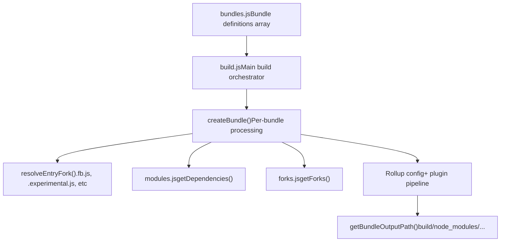
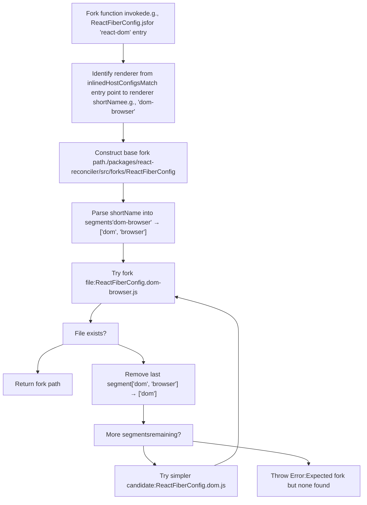
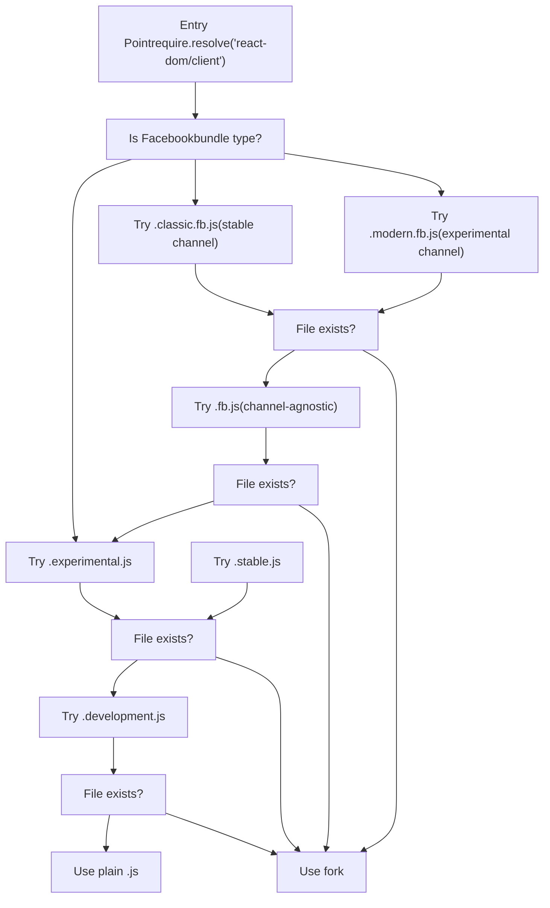
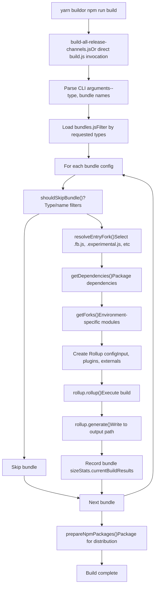

# Build Pipeline and Module Forking

Relevant source files

-   [.gitignore](https://github.com/facebook/react/blob/65eec428/.gitignore)
-   [package.json](https://github.com/facebook/react/blob/65eec428/package.json)
-   [packages/eslint-plugin-react-hooks/package.json](https://github.com/facebook/react/blob/65eec428/packages/eslint-plugin-react-hooks/package.json)
-   [packages/jest-react/package.json](https://github.com/facebook/react/blob/65eec428/packages/jest-react/package.json)
-   [packages/react-art/package.json](https://github.com/facebook/react/blob/65eec428/packages/react-art/package.json)
-   [packages/react-dom/package.json](https://github.com/facebook/react/blob/65eec428/packages/react-dom/package.json)
-   [packages/react-is/package.json](https://github.com/facebook/react/blob/65eec428/packages/react-is/package.json)
-   [packages/react-native-renderer/package.json](https://github.com/facebook/react/blob/65eec428/packages/react-native-renderer/package.json)
-   [packages/react-noop-renderer/package.json](https://github.com/facebook/react/blob/65eec428/packages/react-noop-renderer/package.json)
-   [packages/react-reconciler/package.json](https://github.com/facebook/react/blob/65eec428/packages/react-reconciler/package.json)
-   [packages/react-test-renderer/package.json](https://github.com/facebook/react/blob/65eec428/packages/react-test-renderer/package.json)
-   [packages/react/package.json](https://github.com/facebook/react/blob/65eec428/packages/react/package.json)
-   [packages/scheduler/package.json](https://github.com/facebook/react/blob/65eec428/packages/scheduler/package.json)
-   [packages/shared/ReactVersion.js](https://github.com/facebook/react/blob/65eec428/packages/shared/ReactVersion.js)
-   [scripts/flow/config/flowconfig](https://github.com/facebook/react/blob/65eec428/scripts/flow/config/flowconfig)
-   [scripts/flow/createFlowConfigs.js](https://github.com/facebook/react/blob/65eec428/scripts/flow/createFlowConfigs.js)
-   [scripts/jest/setupHostConfigs.js](https://github.com/facebook/react/blob/65eec428/scripts/jest/setupHostConfigs.js)
-   [scripts/rollup/build.js](https://github.com/facebook/react/blob/65eec428/scripts/rollup/build.js)
-   [scripts/rollup/bundles.js](https://github.com/facebook/react/blob/65eec428/scripts/rollup/bundles.js)
-   [scripts/rollup/forks.js](https://github.com/facebook/react/blob/65eec428/scripts/rollup/forks.js)
-   [scripts/rollup/modules.js](https://github.com/facebook/react/blob/65eec428/scripts/rollup/modules.js)
-   [scripts/rollup/packaging.js](https://github.com/facebook/react/blob/65eec428/scripts/rollup/packaging.js)
-   [scripts/rollup/sync.js](https://github.com/facebook/react/blob/65eec428/scripts/rollup/sync.js)
-   [scripts/rollup/wrappers.js](https://github.com/facebook/react/blob/65eec428/scripts/rollup/wrappers.js)
-   [scripts/shared/inlinedHostConfigs.js](https://github.com/facebook/react/blob/65eec428/scripts/shared/inlinedHostConfigs.js)
-   [yarn.lock](https://github.com/facebook/react/blob/65eec428/yarn.lock)

## Purpose and Scope

This document details React's Rollup-based build pipeline that compiles source code into distributable bundles for different environments. The build system's most distinctive feature is its module forking mechanism, which allows a single source tree to compile into environment-specific implementations without conditional imports. This page covers the Rollup plugin pipeline, bundle type matrix, fork resolution algorithm, and the sophisticated entry point selection system that enables React to ship optimized code for Facebook internal builds (FB\_WWW), React Native (both OSS and internal), Node.js, browsers, and other environments. For information about packaging the built artifacts for npm distribution, see [Release Channels and Versioning](/facebook/react/3.2-release-channels-and-versioning).

---

## Bundle Types Matrix

React generates over 20 different bundle types, each optimized for a specific environment and usage mode. The bundle types are defined as constants and determine compilation settings, module format, and optimization level.

### Core Bundle Type Categories

| Bundle Type | Format | Environment | Optimization | Use Case |
| --- | --- | --- | --- | --- |
| `NODE_DEV` | CJS | Node.js | Development | Local dev, testing |
| `NODE_PROD` | CJS | Node.js | Production | Production SSR |
| `NODE_PROFILING` | CJS | Node.js | Profiling | Performance analysis |
| `NODE_ES2015` | CJS | Node.js | ES2015 syntax | Internal tooling |
| `ESM_DEV` | ESM | Browsers | Development | Modern bundlers (dev) |
| `ESM_PROD` | ESM | Browsers | Production | Modern bundlers (prod) |
| `BUN_DEV` | CJS | Bun runtime | Development | Bun-specific dev |
| `BUN_PROD` | CJS | Bun runtime | Production | Bun-specific prod |
| `FB_WWW_DEV` | CJS | Facebook WWW | Development | Internal FB web dev |
| `FB_WWW_PROD` | CJS | Facebook WWW | Production | Internal FB web prod |
| `FB_WWW_PROFILING` | CJS | Facebook WWW | Profiling | Internal FB profiling |
| `RN_OSS_DEV` | CJS | React Native OSS | Development | RN community dev |
| `RN_OSS_PROD` | CJS | React Native OSS | Production | RN community prod |
| `RN_OSS_PROFILING` | CJS | React Native OSS | Profiling | RN community profiling |
| `RN_FB_DEV` | CJS | React Native FB | Development | Internal FB RN dev |
| `RN_FB_PROD` | CJS | React Native FB | Production | Internal FB RN prod |
| `RN_FB_PROFILING` | CJS | React Native FB | Profiling | Internal FB RN profiling |
| `BROWSER_SCRIPT` | IIFE | Browsers | Production | UMD/script tags |
| `CJS_DTS` | CJS | TypeScript | Types only | Type definitions |
| `ESM_DTS` | ESM | TypeScript | Types only | Type definitions |

**Sources:** [scripts/rollup/bundles.js10-31](https://github.com/facebook/react/blob/65eec428/scripts/rollup/bundles.js#L10-L31) [scripts/rollup/build.js50-71](https://github.com/facebook/react/blob/65eec428/scripts/rollup/build.js#L50-L71)

### Bundle Type Characteristics Diagram

```mermaid
flowchart TD
    NODE_PROFILING["NODE_PROFILINGPROFILE=trueInstrumented"]
    FB_WWW_PROFILING["FB_WWW_PROFILINGPROFILE=trueFB profiling"]
    NODE_PROD["NODE_PRODDEV=falseMinified"]
    ESM_PROD["ESM_PRODDEV=falseMinified"]
    FB_WWW_PROD["FB_WWW_PRODDEV=falseClosure minified"]
    RN_OSS_PROD["RN_OSS_PRODDEV=falseMinified"]
    NODE_DEV["NODE_DEVDEV=trueReadable output"]
    ESM_DEV["ESM_DEVDEV=trueNo minification"]
    FB_WWW_DEV["FB_WWW_DEVDEV=trueFB-specific"]
    RN_OSS_DEV["RN_OSS_DEVDEV=trueRN-specific"]
```


**Sources:** [scripts/rollup/build.js253-310](https://github.com/facebook/react/blob/65eec428/scripts/rollup/build.js#L253-L310) [scripts/rollup/bundles.js10-54](https://github.com/facebook/react/blob/65eec428/scripts/rollup/bundles.js#L10-L54)

---

## Bundle Configuration System

All bundles are configured in a single source of truth: the `bundles` array in [scripts/rollup/bundles.js](https://github.com/facebook/react/blob/65eec428/scripts/rollup/bundles.js)

### Bundle Configuration Structure

Each bundle entry defines:

-   **`bundleTypes`**: Array of bundle type constants indicating which variants to build
-   **`moduleType`**: One of `ISOMORPHIC`, `RENDERER`, `RENDERER_UTILS`, or `RECONCILER`
-   **`entry`**: Entry point path (e.g., `'react'`, `'react-dom/client'`)
-   **`global`**: Global variable name for UMD builds
-   **`externals`**: Dependencies that should remain external
-   **`minifyWithProdErrorCodes`**: Whether to replace error messages with codes
-   **`wrapWithModuleBoundaries`**: Whether to wrap with DevTools registration
-   **`name`** (optional): Custom output filename
-   **`condition`** (optional): Package.json export condition (e.g., `'react-server'`)
-   **`tsconfig`** (optional): Path to TypeScript config for TS packages

**Example Configuration:**

```
{
  bundleTypes: [NODE_DEV, NODE_PROD, FB_WWW_DEV, FB_WWW_PROD],
  moduleType: ISOMORPHIC,
  entry: 'react',
  global: 'React',
  minifyWithProdErrorCodes: false,
  wrapWithModuleBoundaries: true,
  externals: ['ReactNativeInternalFeatureFlags']
}
```
**Sources:** [scripts/rollup/bundles.js69-88](https://github.com/facebook/react/blob/65eec428/scripts/rollup/bundles.js#L69-L88) [scripts/rollup/bundles.js56-67](https://github.com/facebook/react/blob/65eec428/scripts/rollup/bundles.js#L56-L67)

### Module Types

Module types determine how the bundle interacts with the reconciler and host environment:

| Module Type | Description | Examples |
| --- | --- | --- |
| `ISOMORPHIC` | Can run on both client and server | `react`, `react/jsx-runtime` |
| `RENDERER` | Includes reconciler, targets specific host | `react-dom`, `react-native-renderer` |
| `RENDERER_UTILS` | Helper packages for renderers | `react-dom/test-utils` |
| `RECONCILER` | Standalone reconciler for custom renderers | `react-reconciler` |

**Sources:** [scripts/rollup/bundles.js56-65](https://github.com/facebook/react/blob/65eec428/scripts/rollup/bundles.js#L56-L65)

### Bundle Configuration Flow


**Sources:** [scripts/rollup/build.js635-758](https://github.com/facebook/react/blob/65eec428/scripts/rollup/build.js#L635-L758) [scripts/rollup/bundles.js1-1027](https://github.com/facebook/react/blob/65eec428/scripts/rollup/bundles.js#L1-L1027)

---

## Module Forking System

The module forking system is the cornerstone of React's build architecture. It enables environment-specific implementations without polluting source code with conditional logic. At build time, imports are redirected to specialized implementations based on bundle type, entry point, and host configuration.

### Fork Resolution Architecture

**Sources:** [scripts/rollup/forks.js52-482](https://github.com/facebook/react/blob/65eec428/scripts/rollup/forks.js#L52-L482) [scripts/rollup/plugins/use-forks-plugin.js1-56](https://github.com/facebook/react/blob/65eec428/scripts/rollup/plugins/use-forks-plugin.js#L1-L56) [scripts/rollup/modules.js64-81](https://github.com/facebook/react/blob/65eec428/scripts/rollup/modules.js#L64-L81)

### Fork Registry Structure

Forks are registered in [scripts/rollup/forks.js](https://github.com/facebook/react/blob/65eec428/scripts/rollup/forks.js) as a frozen object mapping original module paths to resolver functions:

```
const forks = Object.freeze({
  './packages/shared/ReactFeatureFlags.js': (bundleType, entry, deps, moduleType, bundle) => {
    // Returns path to forked implementation or null
  },
  './packages/react-reconciler/src/ReactFiberConfig.js': (bundleType, entry, deps, moduleType) => {
    // Returns host config fork based on renderer
  },
  // ... other forks
});
```
**Key Fork Categories:**

| Fork Module | Purpose | Variants |
| --- | --- | --- |
| `ReactFeatureFlags.js` | Feature flag values per environment | www, native-fb, native-oss, test-renderer |
| `ReactFiberConfig.js` | Host configuration for renderers | dom-browser, dom-node, native, custom |
| `ReactSharedInternals.js` | Avoid circular dependencies | client, server, react-server |
| `ReactFlightServerConfig.js` | Flight server configuration | dom, native, custom |
| `ReactFlightClientConfig.js` | Flight client configuration | dom, native, custom |
| `ReactFizzConfig.js` | SSR/Fizz configuration | dom-browser, dom-node, native |
| `SchedulerFeatureFlags.js` | Scheduler feature flags | www, native-fb, default |
| `EventListener.js` | Event listener integration | www (with TimeSlice profiling) |

**Sources:** [scripts/rollup/forks.js52-482](https://github.com/facebook/react/blob/65eec428/scripts/rollup/forks.js#L52-L482)

### Fork Resolution Algorithm

The fork resolver uses a hierarchical fallback system for host configurations, attempting progressively simpler fork names:


**Sources:** [scripts/rollup/forks.js29-43](https://github.com/facebook/react/blob/65eec428/scripts/rollup/forks.js#L29-L43) [scripts/rollup/forks.js242-274](https://github.com/facebook/react/blob/65eec428/scripts/rollup/forks.js#L242-L274)

### Critical Fork Examples

#### ReactFeatureFlags Fork Selection

The most frequently forked module, with different flag values per environment:

```
// In forks.js
'./packages/shared/ReactFeatureFlags.js': (bundleType, entry) => {
  switch (bundleType) {
    case FB_WWW_DEV:
    case FB_WWW_PROD:
    case FB_WWW_PROFILING:
      return './packages/shared/forks/ReactFeatureFlags.www.js';
    case RN_FB_DEV:
    case RN_FB_PROD:
    case RN_FB_PROFILING:
      return './packages/shared/forks/ReactFeatureFlags.native-fb.js';
    // ... other cases
  }
}
```
**Fork variants:**

-   [packages/shared/forks/ReactFeatureFlags.www.js](https://github.com/facebook/react/blob/65eec428/packages/shared/forks/ReactFeatureFlags.www.js) - Facebook web platform
-   [packages/shared/forks/ReactFeatureFlags.native-fb.js](https://github.com/facebook/react/blob/65eec428/packages/shared/forks/ReactFeatureFlags.native-fb.js) - Facebook React Native
-   [packages/shared/forks/ReactFeatureFlags.native-oss.js](https://github.com/facebook/react/blob/65eec428/packages/shared/forks/ReactFeatureFlags.native-oss.js) - React Native OSS
-   [packages/shared/forks/ReactFeatureFlags.test-renderer.js](https://github.com/facebook/react/blob/65eec428/packages/shared/forks/ReactFeatureFlags.test-renderer.js) - Test renderer
-   [packages/shared/forks/ReactFeatureFlags.test-renderer.www.js](https://github.com/facebook/react/blob/65eec428/packages/shared/forks/ReactFeatureFlags.test-renderer.www.js) - Test renderer for www
-   [packages/shared/forks/ReactFeatureFlags.test-renderer.native-fb.js](https://github.com/facebook/react/blob/65eec428/packages/shared/forks/ReactFeatureFlags.test-renderer.native-fb.js) - Test renderer for native-fb

**Sources:** [scripts/rollup/forks.js134-190](https://github.com/facebook/react/blob/65eec428/scripts/rollup/forks.js#L134-L190)

#### ReactFiberConfig (Host Configuration) Fork

The host configuration determines which renderer implementation the reconciler uses:

```
'./packages/react-reconciler/src/ReactFiberConfig.js': (bundleType, entry, deps, moduleType) => {
  // Find matching renderer from inlinedHostConfigs
  for (let rendererInfo of inlinedHostConfigs) {
    if (rendererInfo.entryPoints.indexOf(entry) !== -1) {
      const foundFork = findNearestExistingForkFile(
        './packages/react-reconciler/src/forks/ReactFiberConfig.',
        rendererInfo.shortName,  // e.g., 'dom-browser'
        '.js'
      );
      return foundFork; // e.g., ReactFiberConfig.dom.js
    }
  }
  throw new Error('Expected ReactFiberConfig fork');
}
```
**Available forks:**

-   [packages/react-reconciler/src/forks/ReactFiberConfig.dom.js](https://github.com/facebook/react/blob/65eec428/packages/react-reconciler/src/forks/ReactFiberConfig.dom.js) - DOM renderer
-   [packages/react-reconciler/src/forks/ReactFiberConfig.native.js](https://github.com/facebook/react/blob/65eec428/packages/react-reconciler/src/forks/ReactFiberConfig.native.js) - React Native
-   [packages/react-reconciler/src/forks/ReactFiberConfig.art.js](https://github.com/facebook/react/blob/65eec428/packages/react-reconciler/src/forks/ReactFiberConfig.art.js) - React ART

The fork is selected based on `inlinedHostConfigs` mappings in [scripts/shared/inlinedHostConfigs.js](https://github.com/facebook/react/blob/65eec428/scripts/shared/inlinedHostConfigs.js) which associate entry points with renderer configurations.

**Sources:** [scripts/rollup/forks.js242-274](https://github.com/facebook/react/blob/65eec428/scripts/rollup/forks.js#L242-L274) [scripts/shared/inlinedHostConfigs.js1-589](https://github.com/facebook/react/blob/65eec428/scripts/shared/inlinedHostConfigs.js#L1-L589)

#### ReactSharedInternals Fork

Resolves circular dependency issues by selecting different internals implementations:

```
'./packages/shared/ReactSharedInternals.js': (bundleType, entry, deps, _moduleType, bundle) => {
  if (entry === 'react') {
    return './packages/react/src/ReactSharedInternalsClient.js';
  }
  if (entry === 'react/src/ReactServer.js') {
    return './packages/react/src/ReactSharedInternalsServer.js';
  }
  if (bundle.condition === 'react-server') {
    return './packages/react-server/src/ReactSharedInternalsServer.js';
  }
  // ... error handling
}
```
**Sources:** [scripts/rollup/forks.js55-89](https://github.com/facebook/react/blob/65eec428/scripts/rollup/forks.js#L55-L89)

---

## Entry Point Fork Resolution

Beyond module-level forking, entry points themselves can have environment-specific variants selected at build time.

### Entry Point Fork Priority

When resolving an entry point (e.g., `react-dom/client`), the build system searches for forks in priority order:


**Sources:** [scripts/rollup/build.js585-633](https://github.com/facebook/react/blob/65eec428/scripts/rollup/build.js#L585-L633)

### Entry Fork Resolution Function

The `resolveEntryFork()` function implements this priority system:

```
function resolveEntryFork(resolvedEntry, isFBBundle, isDev) {
  if (isFBBundle) {
    const resolvedFBEntry = resolvedEntry.replace(
      '.js',
      __EXPERIMENTAL__ ? '.modern.fb.js' : '.classic.fb.js'
    );
    if (fs.existsSync(resolvedFBEntry)) {
      return resolvedFBEntry;
    }
    // Try generic .fb.js
    const resolvedGenericFBEntry = resolvedEntry.replace('.js', '.fb.js');
    if (fs.existsSync(resolvedGenericFBEntry)) {
      return resolvedGenericFBEntry;
    }
  }

  // Try release channel forks
  const resolvedForkedEntry = resolvedEntry.replace(
    '.js',
    __EXPERIMENTAL__ ? '.experimental.js' : '.stable.js'
  );
  if (fs.existsSync(resolvedForkedEntry)) {
    return resolvedForkedEntry;
  }

  // Fallback to plain .js
  return resolvedEntry;
}
```
**Sources:** [scripts/rollup/build.js585-633](https://github.com/facebook/react/blob/65eec428/scripts/rollup/build.js#L585-L633)

### Example: React DOM Entry Forks

For the `react-dom` entry point with `FB_WWW_DEV` bundle type:

1.  Checks `packages/react-dom/src/ReactDOMFB.modern.js` (if `__EXPERIMENTAL__`)
2.  Checks `packages/react-dom/src/ReactDOMFB.js`
3.  Uses the Facebook-specific implementation that integrates with internal infrastructure

For standard `NODE_DEV` builds:

1.  Checks `packages/react-dom/index.experimental.js` (if `__EXPERIMENTAL__`)
2.  Falls back to `packages/react-dom/index.js`

**Sources:** [scripts/rollup/build.js644-648](https://github.com/facebook/react/blob/65eec428/scripts/rollup/build.js#L644-L648)

---

## Rollup Plugin Pipeline

The build uses a sophisticated Rollup plugin pipeline that transforms code through multiple stages. The pipeline differs slightly between bundle types but follows a consistent pattern.

### Plugin Execution Order

```mermaid
flowchart TD
    Input["Entry Point(e.g., react-dom/client)"]
    DynamicImports["dynamicImports()Keep dynamic imports external"]
    TypeScript["typescript() orflowRemoveTypes()Type stripping"]
    CommonJS["commonjs()For TS bundles only"]
    UseForks["useForks()Environment-specific modules"]
    ForbidFBJS["forbidFBJSImports()Prevent fbjs imports"]
    Resolve["resolve()Node module resolution"]
    StripBanner["stripBanner()Remove license headers"]
    Babel["babel()ES2015+ transpilation"]
    RemoveUseStrict["Remove 'use strict'Per-module directives"]
    Replace["replace()DEV, PROFILE, etc"]
    ExternalRuntime["externalRuntime()For server external runtime"]
    TopLevelDefs["wrapWithTopLevelDefinitions()Add wrapper code"]
    Closure["closure()Google Closure Compiler"]
    Prettier["prettier()Format output"]
    LicenseHeader["wrapWithLicenseHeader()Add license"]
    SizesPlugin["sizes()Record bundle size"]
    Output["Output File(build/node_modules/...)"]

    Input --> DynamicImports
    DynamicImports --> TypeScript
    TypeScript --> CommonJS
    CommonJS --> UseForks
    UseForks --> ForbidFBJS
    ForbidFBJS --> Resolve
    Resolve --> StripBanner
    StripBanner --> Babel
    Babel --> RemoveUseStrict
    RemoveUseStrict --> Replace
    Replace --> ExternalRuntime
    ExternalRuntime --> TopLevelDefs
    TopLevelDefs --> Closure
    Closure --> Prettier
    Prettier --> LicenseHeader
    LicenseHeader --> SizesPlugin
    SizesPlugin --> Output
```


**Sources:** [scripts/rollup/build.js354-546](https://github.com/facebook/react/blob/65eec428/scripts/rollup/build.js#L354-L546)

### Key Plugins

#### 1\. Type Stripping (`typescript()` or `flowRemoveTypes()`)

For TypeScript packages, uses `@rollup/plugin-typescript`. For Flow packages, uses a custom plugin that calls `flow-remove-types`.

**Sources:** [scripts/rollup/build.js383-394](https://github.com/facebook/react/blob/65eec428/scripts/rollup/build.js#L383-L394)

#### 2\. Fork Resolution (`useForks()`)

Replaces module imports with environment-specific implementations. Controlled by [scripts/rollup/forks.js](https://github.com/facebook/react/blob/65eec428/scripts/rollup/forks.js)

**Sources:** [scripts/rollup/build.js398](https://github.com/facebook/react/blob/65eec428/scripts/rollup/build.js#L398-L398) [scripts/rollup/plugins/use-forks-plugin.js](https://github.com/facebook/react/blob/65eec428/scripts/rollup/plugins/use-forks-plugin.js)

#### 3\. Babel Transpilation (`babel()`)

Transforms modern JavaScript to ES5 (for development) or ES2015+ (for production, where Closure handles the rest). The Babel config is dynamically generated based on bundle type.

**Key transformations:**

-   Class properties (loose mode)
-   Object rest/spread (loose mode)
-   Template literals
-   For-of loops
-   Array spread
-   Destructuring
-   Object.assign transformation for object spread

For development builds, additional ES5 transformations are applied:

-   Arrow functions
-   Block scoping
-   Shorthand properties
-   Computed properties

**Sources:** [scripts/rollup/build.js111-172](https://github.com/facebook/react/blob/65eec428/scripts/rollup/build.js#L111-L172) [scripts/rollup/build.js410-419](https://github.com/facebook/react/blob/65eec428/scripts/rollup/build.js#L410-L419)

#### 4\. Constant Replacement (`replace()`)

Replaces compile-time constants with their values:

-   `__DEV__`: `true` for development, `false` for production
-   `__PROFILE__`: `true` for profiling builds
-   `process.env.NODE_ENV`: `'development'` or `'production'`
-   `__EXPERIMENTAL__`: Based on `RELEASE_CHANNEL` environment variable

**Sources:** [scripts/rollup/build.js432-442](https://github.com/facebook/react/blob/65eec428/scripts/rollup/build.js#L432-L442)

#### 5\. Closure Compiler (`closure()`)

For most bundle types (except ESM and TypeScript packages), applies Google Closure Compiler for advanced minification. Key settings:

-   Compilation level: `SIMPLE`
-   Language in: `ECMASCRIPT_2020`
-   Language out: `ECMASCRIPT5_STRICT` (or `ECMASCRIPT_2020` for `NODE_ES2015`)
-   Renaming: Disabled (application's responsibility)
-   Symbol preservation: Enabled

**Sources:** [scripts/rollup/build.js469-500](https://github.com/facebook/react/blob/65eec428/scripts/rollup/build.js#L469-L500)

#### 6\. Code Wrapping

Two wrapping stages:

-   **`wrapWithTopLevelDefinitions()`**: Adds environment-specific wrappers (e.g., `if (__DEV__)` guards for development code)
-   **`wrapWithLicenseHeader()`**: Adds MIT license header

**Sources:** [scripts/rollup/build.js446-456](https://github.com/facebook/react/blob/65eec428/scripts/rollup/build.js#L446-L456) [scripts/rollup/build.js510-519](https://github.com/facebook/react/blob/65eec428/scripts/rollup/build.js#L510-L519) [scripts/rollup/wrappers.js1-389](https://github.com/facebook/react/blob/65eec428/scripts/rollup/wrappers.js#L1-L389)

---

## Fork Resolution System

Fork resolution allows React to use different implementations of the same module for different environments without conditional imports in source code. This is a build-time module replacement system.

---

## Build Process Flow

### High-Level Build Flow


**Sources:** [scripts/rollup/build.js635-758](https://github.com/facebook/react/blob/65eec428/scripts/rollup/build.js#L635-L758) [scripts/rollup/build-all-release-channels.js](https://github.com/facebook/react/blob/65eec428/scripts/rollup/build-all-release-channels.js)

### Entry Point Fork Resolution

Entry points can have environment-specific forks selected at build time:

**Fork Priority Order:**

1.  `.modern.fb.js` or `.classic.fb.js` (Facebook builds)
2.  `.fb.js` (Generic Facebook fork)
3.  `.experimental.js` or `.stable.js` (Release channel fork)
4.  `.development.js` (Development-specific fork)
5.  `.js` (Default implementation)

**Sources:** [scripts/rollup/build.js585-633](https://github.com/facebook/react/blob/65eec428/scripts/rollup/build.js#L585-L633)

### Output Path Structure

Built bundles are written to `build/node_modules/` with paths determined by `getBundleOutputPath()`:

| Bundle Type | Output Path Pattern |
| --- | --- |
| `NODE_*`, `BUN_*` | `build/node_modules/{package}/cjs/{filename}` |
| `ESM_*` | `build/node_modules/{package}/esm/{filename}` |
| `FB_WWW_*` | `build/facebook-www/{filename}` |
| `RN_OSS_*` | `build/react-native/implementations/{filename}` |
| `RN_FB_*` | `build/facebook-react-native/{package}/cjs/{filename}` or `build/react-native/implementations/{filename}.fb.js` |
| `BROWSER_SCRIPT` | `build/node_modules/{package}/{bundle.outputPath}` |

**Sources:** [scripts/rollup/packaging.js48-115](https://github.com/facebook/react/blob/65eec428/scripts/rollup/packaging.js#L48-L115)

### Build Artifacts and Post-Processing

After building, the pipeline performs post-processing:

1.  **Records bundle sizes** in `Stats.currentBuildResults` via the `sizes-plugin`
2.  **Copies environment-specific shims**:
    -   WWW shims from [scripts/rollup/shims/facebook-www](https://github.com/facebook/react/blob/65eec428/scripts/rollup/shims/facebook-www) to `build/facebook-www/shims/`
    -   React Native shims from [scripts/rollup/shims/react-native](https://github.com/facebook/react/blob/65eec428/scripts/rollup/shims/react-native) to `build/react-native/shims/`
3.  **Prepares npm packages** via `prepareNpmPackages()`:
    -   Copies LICENSE, README, package.json to build output
    -   Filters entry points based on bundle availability
    -   Runs `npm pack` to create tarballs
    -   Extracts tarballs to final `build/node_modules/{package}/` structure

**Sources:** [scripts/rollup/build.js522-538](https://github.com/facebook/react/blob/65eec428/scripts/rollup/build.js#L522-L538) [scripts/rollup/packaging.js117-137](https://github.com/facebook/react/blob/65eec428/scripts/rollup/packaging.js#L117-L137) [scripts/rollup/packaging.js253-284](https://github.com/facebook/react/blob/65eec428/scripts/rollup/packaging.js#L253-L284)

---

## Build Optimization Strategies

### Development vs Production

| Aspect | Development | Production |
| --- | --- | --- |
| `__DEV__` | `true` | `false` |
| Minification | None | Closure Compiler |
| Error Messages | Full text | Error codes |
| Babel Output | ES5 | ES2015+ → Closure |
| Source Maps | Disabled | Disabled |
| Symbol Renaming | N/A | Disabled |
| Dead Code Elimination | Basic | Advanced |

**Sources:** [scripts/rollup/build.js253-281](https://github.com/facebook/react/blob/65eec428/scripts/rollup/build.js#L253-L281) [scripts/rollup/build.js432-442](https://github.com/facebook/react/blob/65eec428/scripts/rollup/build.js#L432-L442)

### Bundle Size Tracking

The `sizes-plugin` measures gzipped and uncompressed bundle sizes, storing results for comparison and regression detection.

**Sources:** [scripts/rollup/build.js522-538](https://github.com/facebook/react/blob/65eec428/scripts/rollup/build.js#L522-L538) [scripts/rollup/plugins/sizes-plugin.js](https://github.com/facebook/react/blob/65eec428/scripts/rollup/plugins/sizes-plugin.js)

### Treeshaking Configuration

Rollup's treeshaking is configured per-bundle:

```
treeshake: {
  moduleSideEffects: (id, external) =>
    !(external && pureExternalModules.includes(id)),
  propertyReadSideEffects: false
}
```
External modules without side effects (like `react`, `scheduler`) can be safely omitted if unused.

**Sources:** [scripts/rollup/build.js661-667](https://github.com/facebook/react/blob/65eec428/scripts/rollup/build.js#L661-L667) [scripts/rollup/modules.js8-28](https://github.com/facebook/react/blob/65eec428/scripts/rollup/modules.js#L8-L28)

---

## Integration Points

### Feature Flags System

The build pipeline integrates with the Feature Flags system through fork resolution, selecting the appropriate `ReactFeatureFlags.js` variant for each bundle type. See [Feature Flags System](/facebook/react/2-feature-flags-system) for details.

**Sources:** [scripts/rollup/forks.js134-190](https://github.com/facebook/react/blob/65eec428/scripts/rollup/forks.js#L134-L190)

### Package Distribution

Built artifacts are processed by the packaging system which structures them for npm publication with conditional exports. See [Package Management and npm Publishing](/facebook/react/3.2-release-channels-and-versioning) for details.

**Sources:** [scripts/rollup/packaging.js253-284](https://github.com/facebook/react/blob/65eec428/scripts/rollup/packaging.js#L253-L284)

### Validation

After building, `validate/index.js` lints all build artifacts to catch build pipeline bugs before publication.

**Sources:** [scripts/rollup/validate/index.js1-106](https://github.com/facebook/react/blob/65eec428/scripts/rollup/validate/index.js#L1-L106)
