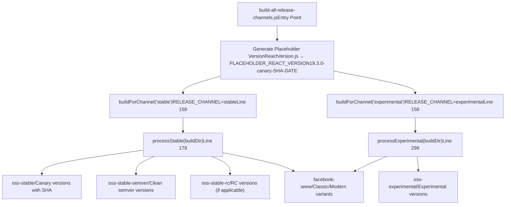
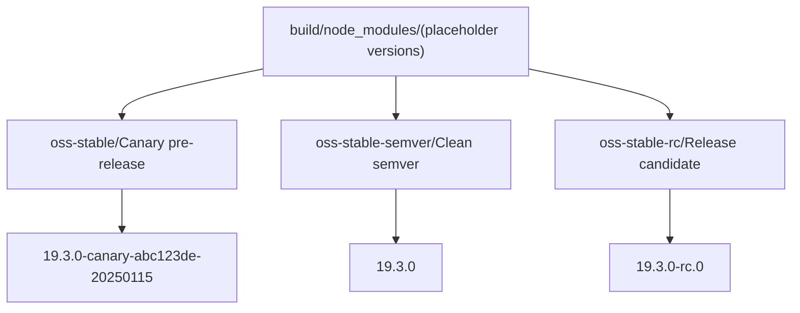
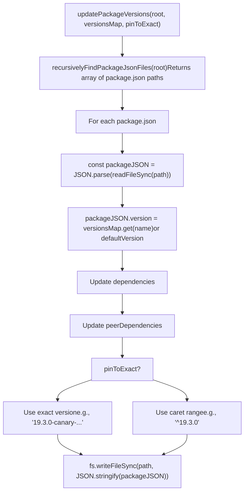

# Release Channels and Versioning

Relevant source files

-   [.gitignore](https://github.com/facebook/react/blob/65eec428/.gitignore)
-   [ReactVersions.js](https://github.com/facebook/react/blob/65eec428/ReactVersions.js)
-   [dangerfile.js](https://github.com/facebook/react/blob/65eec428/dangerfile.js)
-   [package.json](https://github.com/facebook/react/blob/65eec428/package.json)
-   [packages/eslint-plugin-react-hooks/package.json](https://github.com/facebook/react/blob/65eec428/packages/eslint-plugin-react-hooks/package.json)
-   [packages/jest-react/package.json](https://github.com/facebook/react/blob/65eec428/packages/jest-react/package.json)
-   [packages/react-art/package.json](https://github.com/facebook/react/blob/65eec428/packages/react-art/package.json)
-   [packages/react-dom/package.json](https://github.com/facebook/react/blob/65eec428/packages/react-dom/package.json)
-   [packages/react-is/package.json](https://github.com/facebook/react/blob/65eec428/packages/react-is/package.json)
-   [packages/react-native-renderer/package.json](https://github.com/facebook/react/blob/65eec428/packages/react-native-renderer/package.json)
-   [packages/react-native-renderer/src/ReactNativeAttributePayload.js](https://github.com/facebook/react/blob/65eec428/packages/react-native-renderer/src/ReactNativeAttributePayload.js)
-   [packages/react-native-renderer/src/\_\_mocks\_\_/react-native/Libraries/ReactPrivate/deepDiffer.js](https://github.com/facebook/react/blob/65eec428/packages/react-native-renderer/src/__mocks__/react-native/Libraries/ReactPrivate/deepDiffer.js)
-   [packages/react-noop-renderer/package.json](https://github.com/facebook/react/blob/65eec428/packages/react-noop-renderer/package.json)
-   [packages/react-reconciler/package.json](https://github.com/facebook/react/blob/65eec428/packages/react-reconciler/package.json)
-   [packages/react-test-renderer/package.json](https://github.com/facebook/react/blob/65eec428/packages/react-test-renderer/package.json)
-   [packages/react/package.json](https://github.com/facebook/react/blob/65eec428/packages/react/package.json)
-   [packages/scheduler/package.json](https://github.com/facebook/react/blob/65eec428/packages/scheduler/package.json)
-   [packages/shared/ReactVersion.js](https://github.com/facebook/react/blob/65eec428/packages/shared/ReactVersion.js)
-   [packages/use-sync-external-store/package.json](https://github.com/facebook/react/blob/65eec428/packages/use-sync-external-store/package.json)
-   [scripts/flow/config/flowconfig](https://github.com/facebook/react/blob/65eec428/scripts/flow/config/flowconfig)
-   [scripts/flow/createFlowConfigs.js](https://github.com/facebook/react/blob/65eec428/scripts/flow/createFlowConfigs.js)
-   [scripts/jest/jest-cli.js](https://github.com/facebook/react/blob/65eec428/scripts/jest/jest-cli.js)
-   [scripts/jest/setupHostConfigs.js](https://github.com/facebook/react/blob/65eec428/scripts/jest/setupHostConfigs.js)
-   [scripts/release/download-experimental-build-commands/print-summary.js](https://github.com/facebook/react/blob/65eec428/scripts/release/download-experimental-build-commands/print-summary.js)
-   [scripts/release/download-experimental-build.js](https://github.com/facebook/react/blob/65eec428/scripts/release/download-experimental-build.js)
-   [scripts/release/prepare-release-from-ci.js](https://github.com/facebook/react/blob/65eec428/scripts/release/prepare-release-from-ci.js)
-   [scripts/release/shared-commands/download-build-artifacts.js](https://github.com/facebook/react/blob/65eec428/scripts/release/shared-commands/download-build-artifacts.js)
-   [scripts/release/shared-commands/parse-params.js](https://github.com/facebook/react/blob/65eec428/scripts/release/shared-commands/parse-params.js)
-   [scripts/release/theme.js](https://github.com/facebook/react/blob/65eec428/scripts/release/theme.js)
-   [scripts/release/utils.js](https://github.com/facebook/react/blob/65eec428/scripts/release/utils.js)
-   [scripts/rollup/build-all-release-channels.js](https://github.com/facebook/react/blob/65eec428/scripts/rollup/build-all-release-channels.js)
-   [scripts/rollup/build.js](https://github.com/facebook/react/blob/65eec428/scripts/rollup/build.js)
-   [scripts/rollup/bundles.js](https://github.com/facebook/react/blob/65eec428/scripts/rollup/bundles.js)
-   [scripts/rollup/forks.js](https://github.com/facebook/react/blob/65eec428/scripts/rollup/forks.js)
-   [scripts/rollup/modules.js](https://github.com/facebook/react/blob/65eec428/scripts/rollup/modules.js)
-   [scripts/rollup/packaging.js](https://github.com/facebook/react/blob/65eec428/scripts/rollup/packaging.js)
-   [scripts/rollup/plugins/closure-plugin.js](https://github.com/facebook/react/blob/65eec428/scripts/rollup/plugins/closure-plugin.js)
-   [scripts/rollup/plugins/sizes-plugin.js](https://github.com/facebook/react/blob/65eec428/scripts/rollup/plugins/sizes-plugin.js)
-   [scripts/rollup/plugins/use-forks-plugin.js](https://github.com/facebook/react/blob/65eec428/scripts/rollup/plugins/use-forks-plugin.js)
-   [scripts/rollup/stats.js](https://github.com/facebook/react/blob/65eec428/scripts/rollup/stats.js)
-   [scripts/rollup/sync.js](https://github.com/facebook/react/blob/65eec428/scripts/rollup/sync.js)
-   [scripts/rollup/wrappers.js](https://github.com/facebook/react/blob/65eec428/scripts/rollup/wrappers.js)
-   [scripts/shared/inlinedHostConfigs.js](https://github.com/facebook/react/blob/65eec428/scripts/shared/inlinedHostConfigs.js)
-   [scripts/tasks/danger.js](https://github.com/facebook/react/blob/65eec428/scripts/tasks/danger.js)
-   [yarn.lock](https://github.com/facebook/react/blob/65eec428/yarn.lock)

This document explains React's release channel system, including how different channels (stable, experimental, canary, rc) are built, versioned, and organized. Release channels enable React to ship experimental features alongside stable releases while maintaining compatibility guarantees for production users.

For information about the build pipeline that produces these artifacts, see [Build Pipeline and Module Forking](/facebook/react/3.1-build-pipeline-and-module-forking). This page focuses specifically on how release channels are configured, versioned, and distinguished in the build output.

---

## Overview

React uses a multi-channel release strategy to support different stability guarantees and feature sets. The build system can produce artifacts for multiple channels from the same source code, with each channel having:

-   **Distinct versioning schemes**: Semver for stable, SHA-based for canary/experimental
-   **Different feature flags**: Experimental features enabled/disabled per channel
-   **Separate npm distributions**: Published to different npm dist-tags
-   **Isolated build directories**: Organized by channel in `build/`

The channel system is orchestrated by [scripts/rollup/build-all-release-channels.js1-544](https://github.com/facebook/react/blob/65eec428/scripts/rollup/build-all-release-channels.js#L1-L544) which spawns separate build processes for each requested channel and post-processes their outputs with channel-specific version numbers.

### Release Channel Types

React supports the following release channels:

| Channel | Stability | Version Format | npm Dist Tag | Purpose |
| --- | --- | --- | --- | --- |
| **stable** | Production-ready | `19.3.0` | `latest` | Production use with semantic versioning |
| **canary** | Pre-release | `19.3.0-canary-abc123de-20250115` | `canary` | Weekly pre-releases for early testing |
| **rc** | Release candidate | `19.3.0-rc.0` | `rc` | Final testing before stable release |
| **experimental** | Unstable | `0.0.0-experimental-abc123de-20250115` | `experimental` | Bleeding-edge features, may be removed |

The channel is determined by the `RELEASE_CHANNEL` environment variable during the build process. When not specified, the system defaults to building the experimental channel ([scripts/rollup/build.js31-38](https://github.com/facebook/react/blob/65eec428/scripts/rollup/build.js#L31-L38)).

Sources: [scripts/rollup/build-all-release-channels.js1-544](https://github.com/facebook/react/blob/65eec428/scripts/rollup/build-all-release-channels.js#L1-L544) [scripts/rollup/build.js31-38](https://github.com/facebook/react/blob/65eec428/scripts/rollup/build.js#L31-L38) [ReactVersions.js1-64](https://github.com/facebook/react/blob/65eec428/ReactVersions.js#L1-L64)

---

## Version Number Definitions

Version numbers are centrally defined in [ReactVersions.js1-64](https://github.com/facebook/react/blob/65eec428/ReactVersions.js#L1-L64) which serves as the single source of truth for all React package versions:

```
// ReactVersions.js structure
const ReactVersion = '19.3.0';
const canaryChannelLabel = 'canary';  // or 'rc' during RC phase
const rcNumber = 0;

const stablePackages = {
  'eslint-plugin-react-hooks': '7.1.0',
  react: ReactVersion,
  'react-dom': ReactVersion,
  'react-reconciler': '0.34.0',
  scheduler: '0.28.0',
  // ... other packages
};

const experimentalPackages = ['react-markup'];
```
Key aspects:

-   **ReactVersion**: Base version for most React packages (currently `19.3.0`)
-   **canaryChannelLabel**: Controls the pre-release label (`'canary'` or `'rc'`)
-   **rcNumber**: RC iteration number when in RC phase
-   **stablePackages**: Maps package names to their stable versions
-   **experimentalPackages**: Packages that only exist in experimental channel

Most packages share the same version number, but some (`scheduler`, `react-reconciler`, `eslint-plugin-react-hooks`) maintain independent versioning due to their standalone use cases.

Sources: [ReactVersions.js21-56](https://github.com/facebook/react/blob/65eec428/ReactVersions.js#L21-L56) [packages/shared/ReactVersion.js15](https://github.com/facebook/react/blob/65eec428/packages/shared/ReactVersion.js#L15-L15)

---

## Build Channel Orchestration

The [scripts/rollup/build-all-release-channels.js1-544](https://github.com/facebook/react/blob/65eec428/scripts/rollup/build-all-release-channels.js#L1-L544) script orchestrates multi-channel builds. It performs three main steps:

**Build and Post-Processing Pipeline**


### Step 1: Placeholder Version Generation

Before building, a placeholder version is written to [packages/shared/ReactVersion.js15](https://github.com/facebook/react/blob/65eec428/packages/shared/ReactVersion.js#L15-L15):

```
// Line 46-54 in build-all-release-channels.js
const PLACEHOLDER_REACT_VERSION =
  ReactVersion + '-' + canaryChannelLabel + '-' + sha + '-' + dateString;
// Example: '19.3.0-canary-a1c2d3e4-20250115'

fs.writeFileSync(
  './packages/shared/ReactVersion.js',
  `export default '${PLACEHOLDER_REACT_VERSION}';\n`
);
```
This placeholder is embedded in all built artifacts and will be replaced with channel-specific versions during post-processing.

### Step 2: Channel Build Execution

The `buildForChannel()` function spawns the main build script with the `RELEASE_CHANNEL` environment variable:

```
// Line 158-177 in build-all-release-channels.js
function buildForChannel(channel, total, index) {
  const {status} = spawnSync(
    'node',
    ['./scripts/rollup/build.js', ...process.argv.slice(2)],
    {
      env: {
        ...process.env,
        RELEASE_CHANNEL: channel,  // 'stable' or 'experimental'
      },
    }
  );
}
```
This causes the build system to:

-   Use channel-specific feature flags ([scripts/rollup/forks.js20-27](https://github.com/facebook/react/blob/65eec428/scripts/rollup/forks.js#L20-L27))
-   Apply different module forks based on bundle type
-   Produce artifacts in `build/node_modules/`, `build/facebook-www/`, etc.

### Step 3: Post-Processing and Versioning

After building, channel-specific post-processing applies the correct version numbers and organizes outputs.

Sources: [scripts/rollup/build-all-release-channels.js24-177](https://github.com/facebook/react/blob/65eec428/scripts/rollup/build-all-release-channels.js#L24-L177) [scripts/rollup/build.js31-38](https://github.com/facebook/react/blob/65eec428/scripts/rollup/build.js#L31-L38) [scripts/rollup/forks.js20-27](https://github.com/facebook/react/blob/65eec428/scripts/rollup/forks.js#L20-L27)

---

## Stable Channel Processing

The `processStable()` function at [scripts/rollup/build-all-release-channels.js179-295](https://github.com/facebook/react/blob/65eec428/scripts/rollup/build-all-release-channels.js#L179-L295) transforms the stable channel build output into multiple versioned distributions:

**Stable Channel Output Transformation**


### oss-stable: Canary Pre-releases

The primary stable output uses canary pre-release versions:

```
// Lines 192-212 in build-all-release-channels.js
const versionsMap = new Map();
for (const moduleName in stablePackages) {
  const version = stablePackages[moduleName];
  versionsMap.set(
    moduleName,
    version + '-' + canaryChannelLabel + '-' + sha + '-' + dateString
  );
  // Example: 'react' → '19.3.0-canary-a1c2d3e4-20250115'
}

updatePackageVersions(
  buildDir + '/node_modules',
  versionsMap,
  defaultVersionIfNotFound,
  true  // Pin dependencies to exact versions
);

fs.renameSync(buildDir + '/node_modules', buildDir + '/oss-stable');
```
This directory is published to npm with the `@canary` dist-tag for weekly pre-releases.

### oss-stable-semver: Clean Semantic Versions

For stable releases published to `@latest`:

```
// Lines 257-272 in build-all-release-channels.js
const semverVersionsMap = new Map();
for (const moduleName in stablePackages) {
  const version = stablePackages[moduleName];
  semverVersionsMap.set(moduleName, version);
  // Example: 'react' → '19.3.0'
}

updatePackageVersions(
  buildDir + '/oss-stable-semver',
  semverVersionsMap,
  defaultVersionIfNotFound,
  false  // Use caret ranges for dependencies (^19.3.0)
);
```
This produces packages with clean version numbers suitable for production npm releases.

### oss-stable-rc: Release Candidates

When `canaryChannelLabel === 'rc'`, an additional RC distribution is created:

```
// Lines 214-231 in build-all-release-channels.js
if (canaryChannelLabel === 'rc') {
  const rcVersionsMap = new Map();
  for (const moduleName in stablePackages) {
    const version = stablePackages[moduleName];
    rcVersionsMap.set(moduleName, version + `-rc.${rcNumber}`);
    // Example: 'react' → '19.3.0-rc.0'
  }

  updatePackageVersions(
    buildDir + '/oss-stable-rc',
    rcVersionsMap,
    defaultVersionIfNotFound,
    true  // Pin to exact versions
  );
}
```
RC builds are published with the `@rc` dist-tag for final testing before stable release.

### Version String Replacement

After updating `package.json` files, the placeholder version strings embedded in JavaScript bundles are replaced using `updatePlaceholderReactVersionInCompiledArtifacts()`:

```
// Lines 209-212, 269-272 in build-all-release-channels.js
updatePlaceholderReactVersionInCompiledArtifacts(
  buildDir + '/oss-stable',
  ReactVersion + '-' + canaryChannelLabel + '-' + sha + '-' + dateString
);

updatePlaceholderReactVersionInCompiledArtifacts(
  buildDir + '/oss-stable-semver',
  ReactVersion
);
```
This ensures that `ReactVersion` constants in the runtime code match the package version.

Sources: [scripts/rollup/build-all-release-channels.js179-295](https://github.com/facebook/react/blob/65eec428/scripts/rollup/build-all-release-channels.js#L179-L295) [ReactVersions.js21-33](https://github.com/facebook/react/blob/65eec428/ReactVersions.js#L21-L33)

---

## Experimental Channel Processing

The `processExperimental()` function at [scripts/rollup/build-all-release-channels.js298-382](https://github.com/facebook/react/blob/65eec428/scripts/rollup/build-all-release-channels.js#L298-L382) handles experimental builds with a different versioning scheme:

### Experimental Version Format

Experimental releases use `0.0.0` as the base version with experimental labels:

```
// Lines 300-314 in build-all-release-channels.js
const defaultVersionIfNotFound =
  '0.0.0' + '-experimental-' + sha + '-' + dateString;
  // Example: '0.0.0-experimental-a1c2d3e4-20250115'

const versionsMap = new Map();
for (const moduleName in stablePackages) {
  versionsMap.set(moduleName, defaultVersionIfNotFound);
}
for (const moduleName of experimentalPackages) {
  versionsMap.set(moduleName, defaultVersionIfNotFound);
}

fs.renameSync(buildDir + '/node_modules', buildDir + '/oss-experimental');
```
Key differences from stable:

-   **0.0.0 base version**: Clearly signals experimental status
-   **No semver compatibility**: Breaking changes allowed without version bumps
-   **Includes experimental-only packages**: Packages like `react-markup` that don't exist in stable
-   **SHA-based identification**: Commit hash and date for traceability

### Runtime vs. Package Versioning

A subtle distinction exists for experimental builds:

```
// Lines 316-322 in build-all-release-channels.js
updatePlaceholderReactVersionInCompiledArtifacts(
  buildDir + '/oss-experimental',
  // npm version does not include React version, but runtime does
  // for DevTools feature detection
  ReactVersion + '-experimental-' + sha + '-' + dateString
);
```
While the npm package version is `0.0.0-experimental-...`, the runtime `ReactVersion` constant is `19.3.0-experimental-...`. This allows React DevTools to detect the React version and available features even in experimental builds.

Sources: [scripts/rollup/build-all-release-channels.js298-382](https://github.com/facebook/react/blob/65eec428/scripts/rollup/build-all-release-channels.js#L298-L382) [ReactVersions.js53-56](https://github.com/facebook/react/blob/65eec428/ReactVersions.js#L53-L56)

---

## Facebook Internal Versioning

Facebook internal builds (WWW and React Native FB) receive special version strings:

### WWW Classic vs. Modern Builds

Facebook's internal web platform gets two build variants:

```
// Lines 276-290 in build-all-release-channels.js (stable)
if (fs.existsSync(buildDir + '/facebook-www')) {
  for (const fileName of fs.readdirSync(buildDir + '/facebook-www')) {
    const filePath = buildDir + '/facebook-www/' + fileName;
    if (!stats.isDirectory()) {
      // Stable: filename.classic.js
      fs.renameSync(filePath, filePath.replace('.js', '.classic.js'));
    }
  }

  const versionString =
    ReactVersion + '-www-classic-' + sha + '-' + dateString;
  updatePlaceholderReactVersionInCompiledArtifacts(
    buildDir + '/facebook-www',
    versionString
  );

  fs.writeFileSync(
    buildDir + '/facebook-www/VERSION_CLASSIC',
    versionString
  );
}
```
Experimental builds similarly create `.modern.js` variants with `VERSION_MODERN` files. This allows Facebook to run both classic (stable) and modern (experimental) React builds simultaneously.

### React Native Facebook Versioning

React Native internal builds use a unified version format:

```
// Lines 233-239 in build-all-release-channels.js
const rnVersionString =
  ReactVersion + '-native-fb-' + sha + '-' + dateString;
  // Example: '19.3.0-native-fb-a1c2d3e4-20250115'

if (fs.existsSync(buildDir + '/facebook-react-native')) {
  updatePlaceholderReactVersionInCompiledArtifacts(
    buildDir + '/facebook-react-native',
    rnVersionString
  );

  fs.writeFileSync(
    buildDir + '/facebook-react-native/VERSION_NATIVE_FB',
    rnVersionString
  );
}
```
The `VERSION_*` files serve as version markers that Facebook's internal build systems can read without parsing JavaScript.

Sources: [scripts/rollup/build-all-release-channels.js233-290](https://github.com/facebook/react/blob/65eec428/scripts/rollup/build-all-release-channels.js#L233-L290) [scripts/rollup/build-all-release-channels.js325-356](https://github.com/facebook/react/blob/65eec428/scripts/rollup/build-all-release-channels.js#L325-L356)

---

## Version Update Mechanism

The `updatePackageVersions()` function at [scripts/rollup/build-all-release-channels.js383-467](https://github.com/facebook/react/blob/65eec428/scripts/rollup/build-all-release-channels.js#L383-L467) updates `package.json` files throughout the build tree:

**Version Update Process**


### Dependency Version Handling

The function updates both the package's own version and its dependencies on other React packages:

```
// Lines 427-465 in build-all-release-channels.js
function updateDependencies(dependencies, versionsMap, pinToExact) {
  if (!dependencies) return;

  for (const dep in dependencies) {
    const assumedVersion = versionsMap.get(dep);
    if (!assumedVersion) continue;

    if (pinToExact) {
      // Canary/Experimental: Pin to exact SHA-based version
      dependencies[dep] = assumedVersion;
      // Example: "react": "19.3.0-canary-a1c2d3e4-20250115"
    } else {
      // Stable: Use caret range for compatible updates
      dependencies[dep] = '^' + assumedVersion;
      // Example: "react": "^19.3.0"
    }
  }
}
```
**Pinning Strategy**:

-   **Canary/Experimental/RC** (`pinToExact: true`): All dependencies use exact versions to ensure consistency
-   **Stable semver** (`pinToExact: false`): Caret ranges allow patch updates

This ensures that installing `react-dom@19.3.0-canary-abc123de-20250115` will resolve to the exact matching `react` version, while `react-dom@19.3.0` allows any compatible React 19.x.x version.

Sources: [scripts/rollup/build-all-release-channels.js383-467](https://github.com/facebook/react/blob/65eec428/scripts/rollup/build-all-release-channels.js#L383-L467)

---

## Build Artifact Organization

After post-processing, the `build/` directory contains channel-separated artifacts:

**Final Build Directory Structure**

```
build/
├── oss-stable/                      # Canary pre-releases
│   ├── react/
│   │   ├── package.json            # version: "19.3.0-canary-abc123de-20250115"
│   │   ├── cjs/
│   │   │   ├── react.development.js
│   │   │   └── react.production.js
│   │   └── ...
│   └── react-dom/
│       └── ...
│
├── oss-stable-semver/               # Clean stable releases
│   ├── react/
│   │   └── package.json            # version: "19.3.0"
│   └── ...
│
├── oss-stable-rc/                   # Release candidates (if RC phase)
│   ├── react/
│   │   └── package.json            # version: "19.3.0-rc.0"
│   └── ...
│
├── oss-experimental/                # Experimental builds
│   ├── react/
│   │   └── package.json            # version: "0.0.0-experimental-abc123de-20250115"
│   ├── react-markup/               # Experimental-only package
│   └── ...
│
├── facebook-www/                    # Facebook internal
│   ├── React-prod.classic.js       # Stable build
│   ├── React-prod.modern.js        # Experimental build
│   ├── VERSION_CLASSIC             # "19.3.0-www-classic-abc123de-20250115"
│   └── VERSION_MODERN              # "19.3.0-www-modern-abc123de-20250115"
│
├── facebook-react-native/           # RN internal
│   ├── react/
│   ├── react-dom/
│   └── VERSION_NATIVE_FB
│
├── react-native/                    # RN open source
│   ├── implementations/
│   │   ├── ReactFabric-prod.js
│   │   └── ReactNativeRenderer-prod.fb.js
│   └── shims/
│
├── sizes-stable/                    # Bundle size reports
└── sizes-experimental/
```
### Channel-Specific Characteristics

| Channel | Directory | Version Example | Dependency Style | Target Audience |
| --- | --- | --- | --- | --- |
| **Canary** | `oss-stable/` | `19.3.0-canary-a1c2d3e4-20250115` | Exact pins | Weekly testers |
| **Stable** | `oss-stable-semver/` | `19.3.0` | Caret ranges | Production users |
| **RC** | `oss-stable-rc/` | `19.3.0-rc.0` | Exact pins | Final testers |
| **Experimental** | `oss-experimental/` | `0.0.0-experimental-a1c2d3e4-20250115` | Exact pins | Early adopters |
| **WWW Classic** | `facebook-www/` | `19.3.0-www-classic-...` | N/A | FB production |
| **WWW Modern** | `facebook-www/` | `19.3.0-www-modern-...` | N/A | FB experimental |

Sources: [scripts/rollup/build-all-release-channels.js179-382](https://github.com/facebook/react/blob/65eec428/scripts/rollup/build-all-release-channels.js#L179-L382)

---

## Publishing to npm

Each channel directory represents a potential npm release target:

### npm Dist Tags

React uses npm dist tags to manage multiple release channels:

```
# Canary releases (weekly)
npm publish build/oss-stable/react --tag canary

# Stable releases
npm publish build/oss-stable-semver/react --tag latest

# Release candidates
npm publish build/oss-stable-rc/react --tag rc

# Experimental releases
npm publish build/oss-experimental/react --tag experimental
```
Users can install specific channels:

```
npm install react@latest          # Stable: 19.3.0
npm install react@canary           # Canary: 19.3.0-canary-abc123de-20250115
npm install react@experimental     # Experimental: 0.0.0-experimental-abc123de-20250115
npm install react@rc               # RC: 19.3.0-rc.0
```
### Version Resolution in Applications

When applications install React packages, npm resolves versions based on the channel:

**Stable Channel**:

```
{
  "dependencies": {
    "react": "^19.3.0",
    "react-dom": "^19.3.0"
  }
}
```
-   Uses caret ranges
-   Allows patch updates (19.3.1, 19.3.2, etc.)
-   Dependencies use compatible versions

**Canary/Experimental Channel**:

```
{
  "dependencies": {
    "react": "19.3.0-canary-a1c2d3e4-20250115",
    "react-dom": "19.3.0-canary-a1c2d3e4-20250115"
  }
}
```
-   Uses exact versions
-   Guarantees all packages from same build
-   No automatic updates

Sources: [scripts/rollup/build-all-release-channels.js192-272](https://github.com/facebook/react/blob/65eec428/scripts/rollup/build-all-release-channels.js#L192-L272) [ReactVersions.js1-64](https://github.com/facebook/react/blob/65eec428/ReactVersions.js#L1-L64)

---

## Release Workflow Example

A typical React release involves building and publishing multiple channels:

**Multi-Channel Release Flow**

> **[Mermaid sequence]**
> *(图表结构无法解析)*

### Release Cadence

| Channel | Frequency | Purpose |
| --- | --- | --- |
| **Canary** | Weekly | Regular pre-releases from main branch |
| **Experimental** | Continuous | Every commit, for testing unreleased features |
| **RC** | As needed | Final testing before major/minor releases |
| **Stable** | Major/minor | Production releases after RC testing |
| **Patch** | As needed | Bug fixes to stable versions |

Sources: [scripts/rollup/build-all-release-channels.js1-544](https://github.com/facebook/react/blob/65eec428/scripts/rollup/build-all-release-channels.js#L1-L544)

---

## CI Integration

GitHub Actions workflows automate the multi-channel build process:

### Build Artifacts in CI

The [.circleci/config.yml](https://github.com/facebook/react/blob/65eec428/.circleci/config.yml) or GitHub Actions workflows orchestrate builds:

```
# Conceptual CI workflow
jobs:
  build_stable:
    runs-on: ubuntu-latest
    steps:
      - name: Build Stable Channel
        run: |
          yarn build --releaseChannel=stable --ci

  build_experimental:
    runs-on: ubuntu-latest
    steps:
      - name: Build Experimental Channel
        run: |
          yarn build --releaseChannel=experimental --ci
```
The `--ci` flag causes the build script to:

-   Generate separate artifact files per channel
-   Store them in `build/sizes/` directories
-   Upload as CI artifacts for later download

### Artifact Download for Publishing

The [scripts/release/download-experimental-build.js1-55](https://github.com/facebook/react/blob/65eec428/scripts/release/download-experimental-build.js#L1-L55) script downloads pre-built artifacts from CI:

```
# Download artifacts for a specific commit
node scripts/release/download-experimental-build.js --commit=abc123de

# This downloads and extracts:
# - build/oss-stable/
# - build/oss-stable-semver/
# - build/oss-experimental/
```
This workflow enables:

-   **Reproducible releases**: Exact commit can be built and published later
-   **Separation of concerns**: Building happens in CI, publishing is manual
-   **Testing before publish**: Downloaded artifacts can be tested locally

Sources: [scripts/release/download-experimental-build.js1-55](https://github.com/facebook/react/blob/65eec428/scripts/release/download-experimental-build.js#L1-L55) [scripts/release/shared-commands/download-build-artifacts.js1-232](https://github.com/facebook/react/blob/65eec428/scripts/release/shared-commands/download-build-artifacts.js#L1-L232)

---

## Version Constraints and Compatibility

### Semantic Versioning Strategy

React follows semantic versioning for stable releases:

| Version Component | Meaning | Breaking Changes |
| --- | --- | --- |
| **Major** (19.x.x) | Major features, breaking changes | Yes |
| **Minor** (x.3.x) | New features, no breaking changes | No |
| **Patch** (x.x.0) | Bug fixes only | No |

Pre-release channels extend this with additional identifiers:

-   **Canary**: `19.3.0-canary-SHA-DATE` (pre-release of 19.3.0)
-   **RC**: `19.3.0-rc.N` (release candidate N for 19.3.0)
-   **Experimental**: `0.0.0-experimental-SHA-DATE` (no semver guarantees)

### Package Interdependencies

Most React packages share the same version and depend on each other:

```
// react-dom/package.json (version 19.3.0)
{
  "dependencies": {
    "scheduler": "^0.28.0"
  },
  "peerDependencies": {
    "react": "^19.3.0"
  }
}
```
**Key Relationships**:

-   `react-dom` requires matching `react` major version via peer dependency
-   `scheduler` has independent versioning (0.28.0 vs 19.3.0)
-   `react-reconciler` uses independent versioning (0.34.0) for third-party renderers
-   Most other packages follow `react`'s version number

The version map in [ReactVersions.js35-51](https://github.com/facebook/react/blob/65eec428/ReactVersions.js#L35-L51) defines these relationships explicitly.

Sources: [ReactVersions.js35-51](https://github.com/facebook/react/blob/65eec428/ReactVersions.js#L35-L51) [packages/react-dom/package.json19-24](https://github.com/facebook/react/blob/65eec428/packages/react-dom/package.json#L19-L24) [packages/scheduler/package.json3](https://github.com/facebook/react/blob/65eec428/packages/scheduler/package.json#L3-L3) [packages/react-reconciler/package.json4](https://github.com/facebook/react/blob/65eec428/packages/react-reconciler/package.json#L4-L4)

---

## Summary

The packaging system transforms React's build artifacts into publishable npm packages through a multi-stage process:

1.  **Output Resolution**: Each bundle type maps to a specific directory structure via `getBundleOutputPath`
2.  **Metadata Copying**: LICENSE, README, and package.json files are copied from source
3.  **Entrypoint Filtering**: Package.json is modified to remove unbuildable entrypoints for the current release channel
4.  **npm Normalization**: `npm pack` creates tarballs which are extracted to ensure consistency with published packages
5.  **Platform Shims**: Separate artifacts are prepared for Facebook WWW and React Native
6.  **Distribution**: Packages are ready for publishing to npm, while internal artifacts are synced to Facebook repositories

This architecture enables React to support multiple platforms and environments while maintaining a single source codebase and unified build pipeline.
