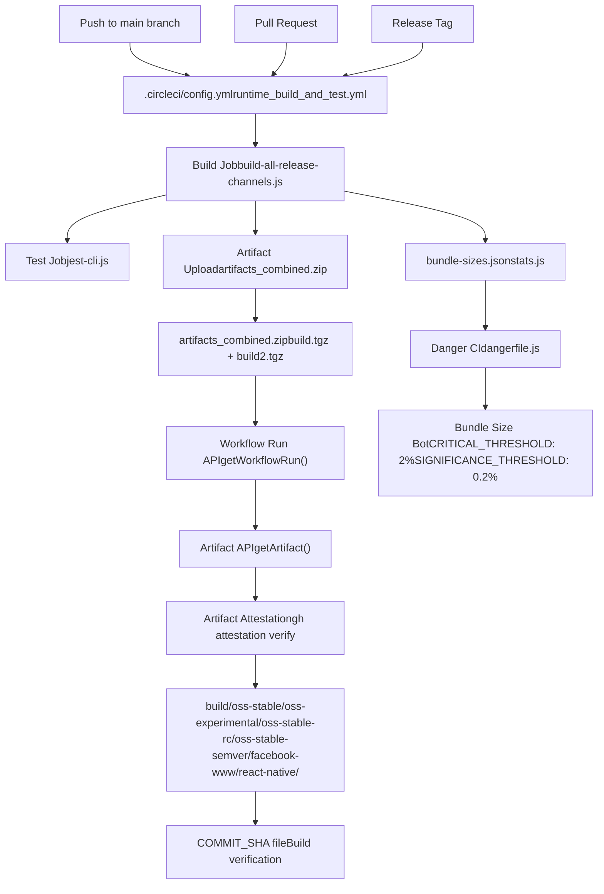
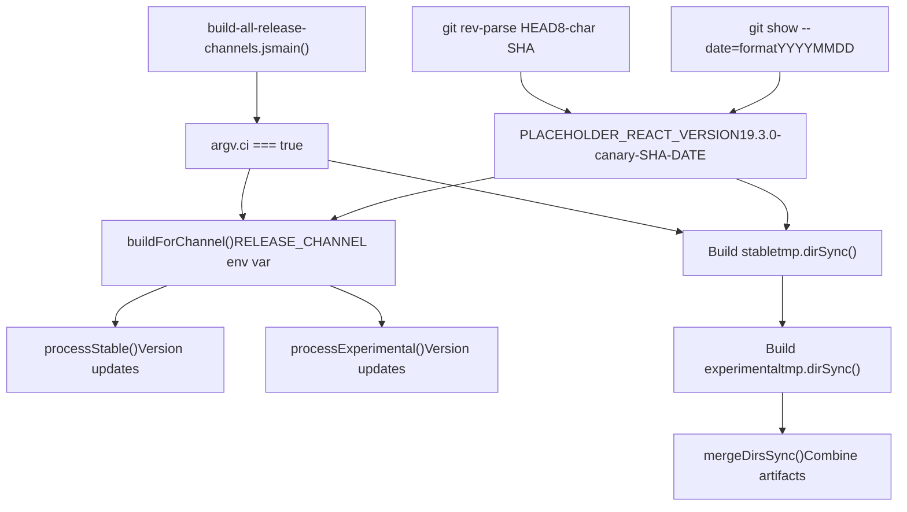
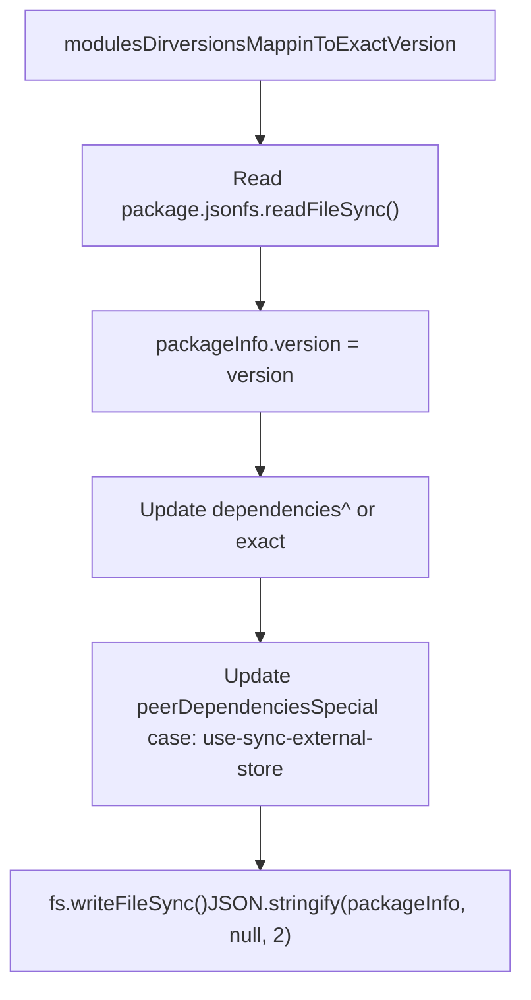
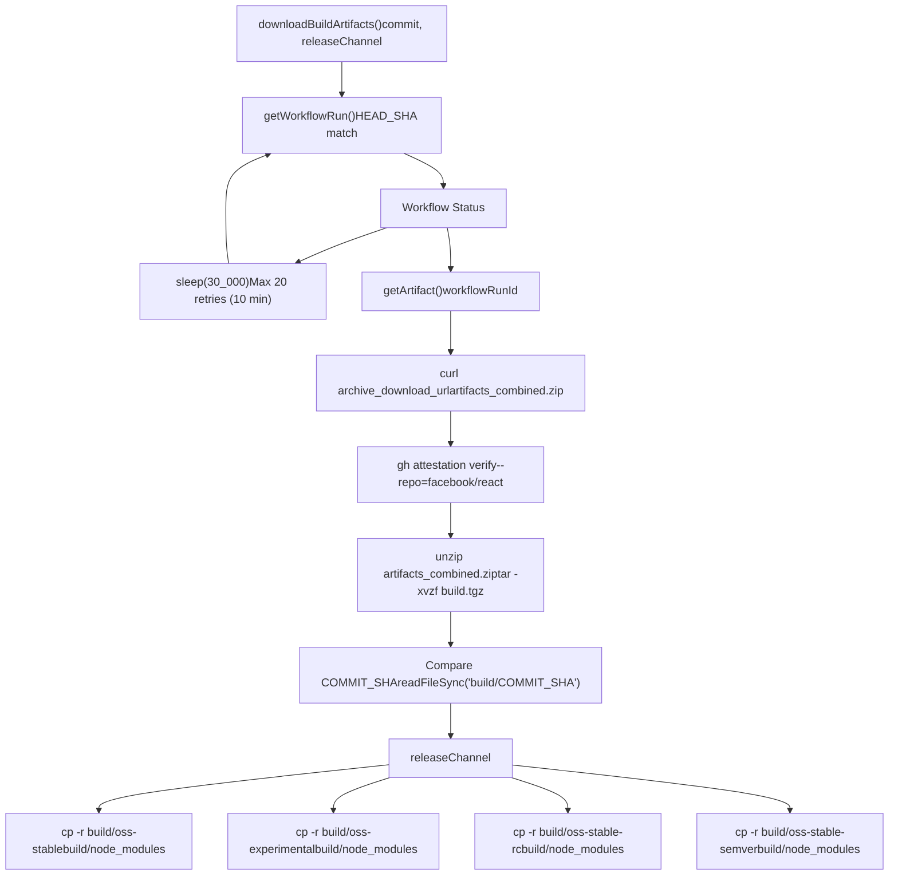
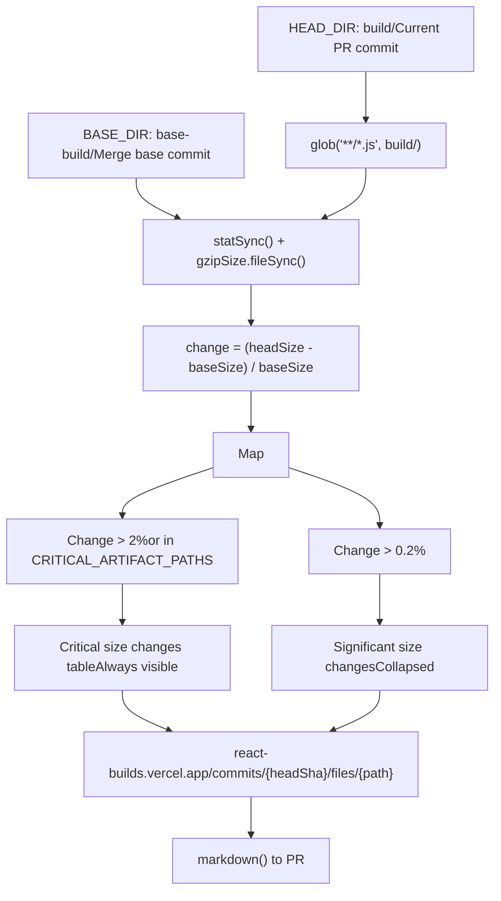
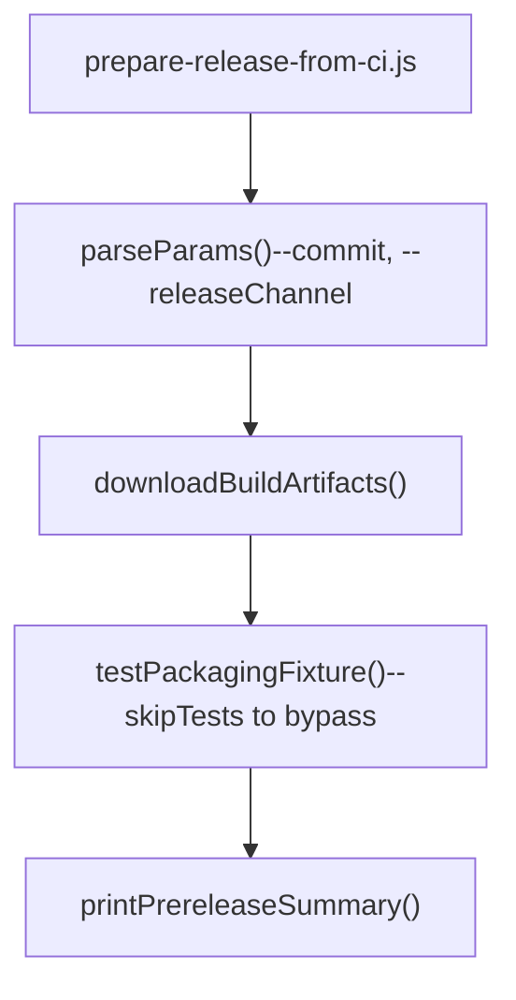
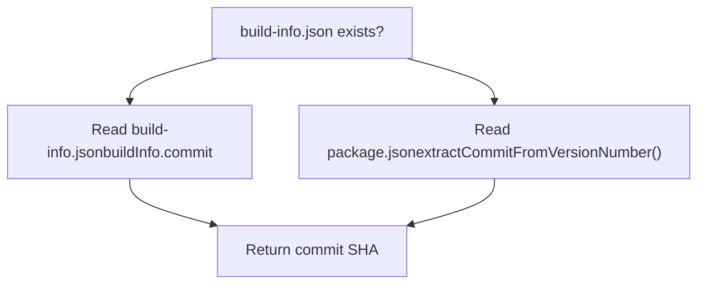
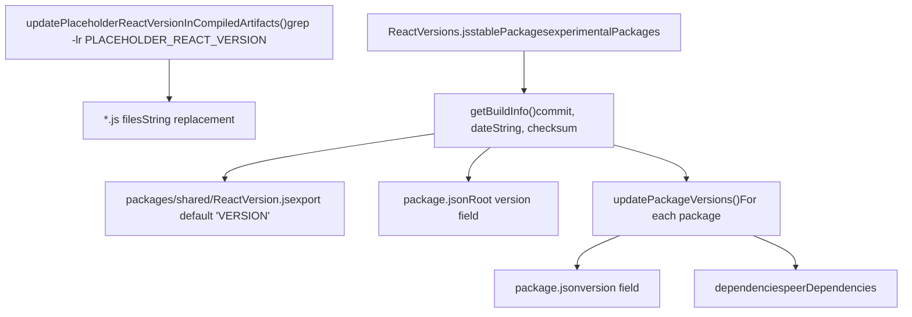

# CI/CD and Artifact Management

Relevant source files

-   [ReactVersions.js](https://github.com/facebook/react/blob/65eec428/ReactVersions.js)
-   [dangerfile.js](https://github.com/facebook/react/blob/65eec428/dangerfile.js)
-   [packages/react-native-renderer/src/ReactNativeAttributePayload.js](https://github.com/facebook/react/blob/65eec428/packages/react-native-renderer/src/ReactNativeAttributePayload.js)
-   [packages/react-native-renderer/src/\_\_mocks\_\_/react-native/Libraries/ReactPrivate/deepDiffer.js](https://github.com/facebook/react/blob/65eec428/packages/react-native-renderer/src/__mocks__/react-native/Libraries/ReactPrivate/deepDiffer.js)
-   [packages/use-sync-external-store/package.json](https://github.com/facebook/react/blob/65eec428/packages/use-sync-external-store/package.json)
-   [scripts/jest/jest-cli.js](https://github.com/facebook/react/blob/65eec428/scripts/jest/jest-cli.js)
-   [scripts/release/download-experimental-build-commands/print-summary.js](https://github.com/facebook/react/blob/65eec428/scripts/release/download-experimental-build-commands/print-summary.js)
-   [scripts/release/download-experimental-build.js](https://github.com/facebook/react/blob/65eec428/scripts/release/download-experimental-build.js)
-   [scripts/release/prepare-release-from-ci.js](https://github.com/facebook/react/blob/65eec428/scripts/release/prepare-release-from-ci.js)
-   [scripts/release/shared-commands/download-build-artifacts.js](https://github.com/facebook/react/blob/65eec428/scripts/release/shared-commands/download-build-artifacts.js)
-   [scripts/release/shared-commands/parse-params.js](https://github.com/facebook/react/blob/65eec428/scripts/release/shared-commands/parse-params.js)
-   [scripts/release/theme.js](https://github.com/facebook/react/blob/65eec428/scripts/release/theme.js)
-   [scripts/release/utils.js](https://github.com/facebook/react/blob/65eec428/scripts/release/utils.js)
-   [scripts/rollup/build-all-release-channels.js](https://github.com/facebook/react/blob/65eec428/scripts/rollup/build-all-release-channels.js)
-   [scripts/rollup/plugins/closure-plugin.js](https://github.com/facebook/react/blob/65eec428/scripts/rollup/plugins/closure-plugin.js)
-   [scripts/rollup/plugins/sizes-plugin.js](https://github.com/facebook/react/blob/65eec428/scripts/rollup/plugins/sizes-plugin.js)
-   [scripts/rollup/plugins/use-forks-plugin.js](https://github.com/facebook/react/blob/65eec428/scripts/rollup/plugins/use-forks-plugin.js)
-   [scripts/rollup/stats.js](https://github.com/facebook/react/blob/65eec428/scripts/rollup/stats.js)
-   [scripts/tasks/danger.js](https://github.com/facebook/react/blob/65eec428/scripts/tasks/danger.js)

## Purpose and Scope

This page documents React's continuous integration and continuous deployment (CI/CD) infrastructure, including build orchestration across release channels, artifact management via GitHub Actions, bundle size monitoring, and release preparation workflows. The CI/CD system automates the build pipeline described in [Build Pipeline and Module Forking](/facebook/react/3.1-build-pipeline-and-module-forking) and prepares artifacts for the release channels documented in [Release Channels and Versioning](/facebook/react/3.2-release-channels-and-versioning).

For information about the underlying build system that CI/CD orchestrates, see [Build System and Package Distribution](/facebook/react/3-build-system-and-package-distribution). For details about the runtime testing infrastructure, see [Developer Tools and Debugging](/facebook/react/7-developer-tools-and-debugging).

---

## CI/CD Architecture Overview

The React CI/CD system is built on CircleCI and GitHub Actions, with specialized tooling for artifact management, bundle size monitoring, and release preparation.


**Sources:** [scripts/rollup/build-all-release-channels.js1-515](https://github.com/facebook/react/blob/65eec428/scripts/rollup/build-all-release-channels.js#L1-L515) [scripts/release/shared-commands/download-build-artifacts.js1-227](https://github.com/facebook/react/blob/65eec428/scripts/release/shared-commands/download-build-artifacts.js#L1-L227) [dangerfile.js1-283](https://github.com/facebook/react/blob/65eec428/dangerfile.js#L1-L283) [scripts/tasks/danger.js1-40](https://github.com/facebook/react/blob/65eec428/scripts/tasks/danger.js#L1-L40)

---

## Build Orchestration Across Release Channels

The CI/CD system coordinates builds across multiple release channels using parallel execution and environment variable configuration.

### Main Build Script

The `build-all-release-channels.js` script serves as the entry point for CI builds:


**Sources:** [scripts/rollup/build-all-release-channels.js111-156](https://github.com/facebook/react/blob/65eec428/scripts/rollup/build-all-release-channels.js#L111-L156) [scripts/rollup/build-all-release-channels.js24-48](https://github.com/facebook/react/blob/65eec428/scripts/rollup/build-all-release-channels.js#L24-L48)

### Release Channel Processing

Each release channel produces distinct artifacts with specialized version strings:

| Channel | Directory | Version Format | Example |
| --- | --- | --- | --- |
| **stable (canary)** | `oss-stable/` | `VERSION-canary-SHA-DATE` | `19.3.0-canary-a1c2d3e4-20241215` |
| **stable (semver)** | `oss-stable-semver/` | `VERSION` | `19.3.0` |
| **stable (rc)** | `oss-stable-rc/` | `VERSION-rc.N` | `19.3.0-rc.0` |
| **experimental** | `oss-experimental/` | `0.0.0-experimental-SHA-DATE` | `0.0.0-experimental-a1c2d3e4-20241215` |
| **facebook-www (classic)** | `facebook-www/*.classic.js` | `VERSION-www-classic-SHA-DATE` | `19.3.0-www-classic-a1c2d3e4-20241215` |
| **facebook-www (modern)** | `facebook-www/*.modern.js` | `VERSION-www-modern-SHA-DATE` | `19.3.0-www-modern-a1c2d3e4-20241215` |
| **react-native (internal)** | `facebook-react-native/` | `VERSION-native-fb-SHA-DATE` | `19.3.0-native-fb-a1c2d3e4-20241215` |
| **react-native (oss)** | `react-native/*.js` | `VERSION` | `19.3.0` |

**Sources:** [scripts/rollup/build-all-release-channels.js179-296](https://github.com/facebook/react/blob/65eec428/scripts/rollup/build-all-release-channels.js#L179-L296) [scripts/rollup/build-all-release-channels.js298-389](https://github.com/facebook/react/blob/65eec428/scripts/rollup/build-all-release-channels.js#L298-L389) [ReactVersions.js1-65](https://github.com/facebook/react/blob/65eec428/ReactVersions.js#L1-L65)

### Package Version Management

The `updatePackageVersions()` function modifies `package.json` files for all packages in a build:


The function handles special cases for `use-sync-external-store` and `use-subscription`, which maintain broader React version compatibility ranges.

**Sources:** [scripts/rollup/build-all-release-channels.js402-459](https://github.com/facebook/react/blob/65eec428/scripts/rollup/build-all-release-channels.js#L402-L459) [ReactVersions.js35-51](https://github.com/facebook/react/blob/65eec428/ReactVersions.js#L35-L51)

---

## Artifact Management Workflow

Artifacts are managed through GitHub Actions with verification, download, and staging workflows.

### Download and Verification Process


**Sources:** [scripts/release/shared-commands/download-build-artifacts.js161-214](https://github.com/facebook/react/blob/65eec428/scripts/release/shared-commands/download-build-artifacts.js#L161-L214) [scripts/release/shared-commands/download-build-artifacts.js88-159](https://github.com/facebook/react/blob/65eec428/scripts/release/shared-commands/download-build-artifacts.js#L88-L159)

### Artifact Security and Verification

The system includes multiple layers of verification:

1.  **Workflow Run Matching**: Ensures the workflow run corresponds to the requested commit SHA ([scripts/release/shared-commands/download-build-artifacts.js50-66](https://github.com/facebook/react/blob/65eec428/scripts/release/shared-commands/download-build-artifacts.js#L50-L66))

2.  **GitHub Attestation**: Uses `gh attestation verify` to cryptographically verify artifact provenance ([scripts/release/shared-commands/download-build-artifacts.js104-111](https://github.com/facebook/react/blob/65eec428/scripts/release/shared-commands/download-build-artifacts.js#L104-L111))

3.  **Commit SHA Validation**: Cross-checks the `COMMIT_SHA` file inside the artifact against the requested commit ([scripts/release/shared-commands/download-build-artifacts.js150-158](https://github.com/facebook/react/blob/65eec428/scripts/release/shared-commands/download-build-artifacts.js#L150-L158))

4.  **Optional Bypass**: The `--noVerify` flag skips attestation verification for debugging broken builds ([scripts/release/shared-commands/download-build-artifacts.js100-101](https://github.com/facebook/react/blob/65eec428/scripts/release/shared-commands/download-build-artifacts.js#L100-L101))


**Sources:** [scripts/release/shared-commands/download-build-artifacts.js88-159](https://github.com/facebook/react/blob/65eec428/scripts/release/shared-commands/download-build-artifacts.js#L88-L159)

---

## Bundle Size Monitoring with Danger CI

Danger CI provides automated bundle size reporting on pull requests to catch performance regressions.

### Size Threshold Configuration

```
const CRITICAL_THRESHOLD = 0.02;      // 2% - Always reported
const SIGNIFICANCE_THRESHOLD = 0.002; // 0.2% - Reported in collapsed section

const CRITICAL_ARTIFACT_PATHS = [
  'oss-stable/react-dom/cjs/react-dom.production.js',
  'oss-stable/react-dom/cjs/react-dom-client.production.js',
  'oss-experimental/react-dom/cjs/react-dom.production.js',
  'oss-experimental/react-dom/cjs/react-dom-client.production.js',
  'facebook-www/ReactDOM-prod.classic.js',
  'facebook-www/ReactDOM-prod.modern.js',
];
```
**Sources:** [dangerfile.js41-52](https://github.com/facebook/react/blob/65eec428/dangerfile.js#L41-L52)

### Size Comparison Workflow


**Sources:** [dangerfile.js103-282](https://github.com/facebook/react/blob/65eec428/dangerfile.js#L103-L282) [scripts/tasks/danger.js1-40](https://github.com/facebook/react/blob/65eec428/scripts/tasks/danger.js#L1-L40)

### Bundle Size Results Structure

The size comparison generates detailed results for each artifact:

| Field | Description | Example |
| --- | --- | --- |
| `filename` | Artifact file path | `react-dom/cjs/react-dom.production.js` |
| `bundleType` | Bundle type identifier | `NODE_PROD` |
| `packageName` | Package name | `react-dom` |
| `prevSize` | Base branch size (formatted) | `139.45 kB` |
| `prevFileSize` | Current size (formatted) | `140.12 kB` |
| `prevFileSizeChange` | Fractional change | `0.0048` |
| `prevFileSizeAbsoluteChange` | Size difference in bytes | `670` |
| `prevGzipSize` | Current gzipped size | `44.23 kB` |
| `prevGzipSizeChange` | Gzipped fractional change | `0.0035` |

**Sources:** [dangerfile.js63-101](https://github.com/facebook/react/blob/65eec428/dangerfile.js#L63-L101) [scripts/rollup/stats.js1-127](https://github.com/facebook/react/blob/65eec428/scripts/rollup/stats.js#L1-L127)

### Danger CI Integration

The Danger CI task runs separately for stable and experimental channels:

```
spawn('danger-ci', [
  '--id',
  process.env.RELEASE_CHANNEL === 'experimental' ? 'experimental' : 'stable'
], {
  env: {
    DANGER_GITHUB_API_TOKEN: token,
  }
});
```
This allows separate size reports for each release channel on the same PR.

**Sources:** [scripts/tasks/danger.js17-31](https://github.com/facebook/react/blob/65eec428/scripts/tasks/danger.js#L17-L31)

---

## Release Preparation Process

The release preparation workflow downloads CI artifacts and prepares them for npm publishing.

### Release Preparation Entry Point


**Sources:** [scripts/release/prepare-release-from-ci.js1-39](https://github.com/facebook/react/blob/65eec428/scripts/release/prepare-release-from-ci.js#L1-L39) [scripts/release/shared-commands/parse-params.js1-67](https://github.com/facebook/react/blob/65eec428/scripts/release/shared-commands/parse-params.js#L1-L67)

### Release Channel Parameter Validation

The `parseParams()` function validates release channel parameters:

```
const channel = params.releaseChannel;
if (
  channel !== 'experimental' &&
  channel !== 'stable' &&
  channel !== 'rc' &&
  channel !== 'latest'
) {
  console.error(theme.error`Invalid release channel`);
  process.exit(1);
}
```
**Sources:** [scripts/release/shared-commands/parse-params.js44-58](https://github.com/facebook/react/blob/65eec428/scripts/release/shared-commands/parse-params.js#L44-L58)

### Build Information Extraction

The system extracts build metadata for verification:


The `extractCommitFromVersionNumber()` function parses commit SHAs from version strings using regex:

```
// Matches formats:
// 0.0.0-0e526bcec-20210202
// 0.0.0-experimental-0e526bcec-20210202
const match = version.match(/0\.0\.0\-([a-z]+\-){0,1}([^-]+).+/);
```
**Sources:** [scripts/release/utils.js111-138](https://github.com/facebook/react/blob/65eec428/scripts/release/utils.js#L111-L138) [scripts/release/utils.js50-58](https://github.com/facebook/react/blob/65eec428/scripts/release/utils.js#L50-L58)

---

## Version Management System

Version management coordinates versioning across packages, source files, and compiled artifacts.

### Version Update Pipeline


**Sources:** [scripts/release/utils.js207-256](https://github.com/facebook/react/blob/65eec428/scripts/release/utils.js#L207-L256) [scripts/rollup/build-all-release-channels.js461-492](https://github.com/facebook/react/blob/65eec428/scripts/rollup/build-all-release-channels.js#L461-L492) [ReactVersions.js1-65](https://github.com/facebook/react/blob/65eec428/ReactVersions.js#L1-L65)

### Placeholder Version Strategy

The build process uses a placeholder version that gets replaced per channel:

1.  **Initial Placeholder**: Written to `packages/shared/ReactVersion.js` ([scripts/rollup/build-all-release-channels.js46-54](https://github.com/facebook/react/blob/65eec428/scripts/rollup/build-all-release-channels.js#L46-L54))

    ```
    const PLACEHOLDER_REACT_VERSION =
      ReactVersion + '-' + canaryChannelLabel + '-' + sha + '-' + dateString;
    // e.g., "19.3.0-canary-a1c2d3e4-20241215"
    ```

2.  **Build Execution**: All bundles compiled with placeholder version

3.  **Post-Processing**: Placeholder replaced with channel-specific version

    -   Stable: `ReactVersion + '-canary-' + sha + '-' + dateString`
    -   Experimental: `ReactVersion + '-experimental-' + sha + '-' + dateString`
    -   RC: `ReactVersion + '-rc.' + rcNumber`
    -   Semver: `ReactVersion` (e.g., `19.3.0`)

**Sources:** [scripts/rollup/build-all-release-channels.js42-54](https://github.com/facebook/react/blob/65eec428/scripts/rollup/build-all-release-channels.js#L42-L54) [scripts/rollup/build-all-release-channels.js209-231](https://github.com/facebook/react/blob/65eec428/scripts/rollup/build-all-release-channels.js#L209-L231)

### Package Versioning Configuration

The `ReactVersions.js` module defines all publishable packages:

```
const stablePackages = {
  'eslint-plugin-react-hooks': '7.1.0',
  'jest-react': '0.18.0',
  'react': ReactVersion,  // 19.3.0
  'react-dom': ReactVersion,
  'react-reconciler': '0.34.0',
  'scheduler': '0.28.0',
  // ... more packages
};

const experimentalPackages = [
  'react-markup'  // Only in @experimental
];
```
This configuration controls which packages get published to npm and their version numbers.

**Sources:** [ReactVersions.js35-64](https://github.com/facebook/react/blob/65eec428/ReactVersions.js#L35-L64)

---

## Test Infrastructure Integration

The CI/CD system integrates with Jest for automated testing across build configurations.

### Test Configuration Matrix

The `jest-cli.js` orchestrator supports multiple test configurations:

| Flag | Options | Description |
| --- | --- | --- |
| `--project` | `default`, `devtools` | Test project selection |
| `--releaseChannel` | `experimental`, `stable`, `www-classic`, `www-modern`, `xplat` | Channel configuration |
| `--env` | `development`, `production` | Node environment |
| `--build` | boolean | Test against built artifacts |
| `--persistent` | boolean | Run persistence tests |
| `--ci` | boolean | CI mode with `maxConcurrency=10` |

**Sources:** [scripts/jest/jest-cli.js20-115](https://github.com/facebook/react/blob/65eec428/scripts/jest/jest-cli.js#L20-L115)

### Build Artifact Testing

When `--build` flag is used, the system validates build freshness:

```
const buildDir = path.resolve('./build');
if (!fs.existsSync(buildDir)) {
  logError('Build directory does not exist, please run `yarn build`');
} else if (Date.now() - fs.statSync(buildDir).mtimeMs > 1000 * 60 * 15) {
  logError('Warning: Build directory older than 15 minutes');
}
```
This prevents testing against stale artifacts.

**Sources:** [scripts/jest/jest-cli.js260-273](https://github.com/facebook/react/blob/65eec428/scripts/jest/jest-cli.js#L260-L273)

### Test Environment Configuration

Environment variables configure the test runtime:

```
const envars = {
  NODE_ENV: argv.env || 'development',
  RELEASE_CHANNEL: argv.releaseChannel.match(/modern|experimental/)
    ? 'experimental'
    : 'stable',
  VARIANT: argv.variant,  // www-specific variants
  REACT_VERSION: semver.coerce(argv.reactVersion),  // DevTools testing
};
```
**Sources:** [scripts/jest/jest-cli.js322-357](https://github.com/facebook/react/blob/65eec428/scripts/jest/jest-cli.js#L322-L357)

---

## Summary

The React CI/CD and artifact management system provides:

1.  **Multi-Channel Builds**: Parallel builds for stable, experimental, rc, canary, and internal channels
2.  **Secure Artifact Management**: GitHub Actions integration with attestation verification
3.  **Automated Quality Gates**: Bundle size monitoring with configurable thresholds
4.  **Version Management**: Coordinated versioning across packages and artifacts
5.  **Release Preparation**: Automated download, verification, and staging workflows
6.  **Test Integration**: Matrix testing across configurations and build artifacts

The system prioritizes reproducibility, security, and developer feedback throughout the build and release pipeline.

**Sources:** [scripts/rollup/build-all-release-channels.js1-515](https://github.com/facebook/react/blob/65eec428/scripts/rollup/build-all-release-channels.js#L1-L515) [scripts/release/shared-commands/download-build-artifacts.js1-227](https://github.com/facebook/react/blob/65eec428/scripts/release/shared-commands/download-build-artifacts.js#L1-L227) [dangerfile.js1-283](https://github.com/facebook/react/blob/65eec428/dangerfile.js#L1-L283) [ReactVersions.js1-65](https://github.com/facebook/react/blob/65eec428/ReactVersions.js#L1-L65)
