# React Reconciler

Relevant source files

-   [packages/react-client/src/ReactFlightPerformanceTrack.js](https://github.com/facebook/react/blob/65eec428/packages/react-client/src/ReactFlightPerformanceTrack.js)
-   [packages/react-debug-tools/src/ReactDebugHooks.js](https://github.com/facebook/react/blob/65eec428/packages/react-debug-tools/src/ReactDebugHooks.js)
-   [packages/react-debug-tools/src/\_\_tests\_\_/ReactHooksInspection-test.js](https://github.com/facebook/react/blob/65eec428/packages/react-debug-tools/src/__tests__/ReactHooksInspection-test.js)
-   [packages/react-debug-tools/src/\_\_tests\_\_/ReactHooksInspectionIntegration-test.js](https://github.com/facebook/react/blob/65eec428/packages/react-debug-tools/src/__tests__/ReactHooksInspectionIntegration-test.js)
-   [packages/react-debug-tools/src/\_\_tests\_\_/ReactHooksInspectionIntegrationDOM-test.js](https://github.com/facebook/react/blob/65eec428/packages/react-debug-tools/src/__tests__/ReactHooksInspectionIntegrationDOM-test.js)
-   [packages/react-devtools-shell/src/app/InspectableElements/CustomHooks.js](https://github.com/facebook/react/blob/65eec428/packages/react-devtools-shell/src/app/InspectableElements/CustomHooks.js)
-   [packages/react-devtools-timeline/src/content-views/utils/moduleFilters.js](https://github.com/facebook/react/blob/65eec428/packages/react-devtools-timeline/src/content-views/utils/moduleFilters.js)
-   [packages/react-dom/src/\_\_tests\_\_/ReactDOMFiberAsync-test.js](https://github.com/facebook/react/blob/65eec428/packages/react-dom/src/__tests__/ReactDOMFiberAsync-test.js)
-   [packages/react-dom/src/\_\_tests\_\_/ReactDOMNativeEventHeuristic-test.js](https://github.com/facebook/react/blob/65eec428/packages/react-dom/src/__tests__/ReactDOMNativeEventHeuristic-test.js)
-   [packages/react-dom/src/events/plugins/\_\_tests\_\_/ChangeEventPlugin-test.js](https://github.com/facebook/react/blob/65eec428/packages/react-dom/src/events/plugins/__tests__/ChangeEventPlugin-test.js)
-   [packages/react-dom/src/events/plugins/\_\_tests\_\_/SimpleEventPlugin-test.js](https://github.com/facebook/react/blob/65eec428/packages/react-dom/src/events/plugins/__tests__/SimpleEventPlugin-test.js)
-   [packages/react-reconciler/src/ReactFiber.js](https://github.com/facebook/react/blob/65eec428/packages/react-reconciler/src/ReactFiber.js)
-   [packages/react-reconciler/src/ReactFiberBeginWork.js](https://github.com/facebook/react/blob/65eec428/packages/react-reconciler/src/ReactFiberBeginWork.js)
-   [packages/react-reconciler/src/ReactFiberClassComponent.js](https://github.com/facebook/react/blob/65eec428/packages/react-reconciler/src/ReactFiberClassComponent.js)
-   [packages/react-reconciler/src/ReactFiberCommitWork.js](https://github.com/facebook/react/blob/65eec428/packages/react-reconciler/src/ReactFiberCommitWork.js)
-   [packages/react-reconciler/src/ReactFiberCompleteWork.js](https://github.com/facebook/react/blob/65eec428/packages/react-reconciler/src/ReactFiberCompleteWork.js)
-   [packages/react-reconciler/src/ReactFiberHooks.js](https://github.com/facebook/react/blob/65eec428/packages/react-reconciler/src/ReactFiberHooks.js)
-   [packages/react-reconciler/src/ReactFiberLane.js](https://github.com/facebook/react/blob/65eec428/packages/react-reconciler/src/ReactFiberLane.js)
-   [packages/react-reconciler/src/ReactFiberOffscreenComponent.js](https://github.com/facebook/react/blob/65eec428/packages/react-reconciler/src/ReactFiberOffscreenComponent.js)
-   [packages/react-reconciler/src/ReactFiberPerformanceTrack.js](https://github.com/facebook/react/blob/65eec428/packages/react-reconciler/src/ReactFiberPerformanceTrack.js)
-   [packages/react-reconciler/src/ReactFiberRootScheduler.js](https://github.com/facebook/react/blob/65eec428/packages/react-reconciler/src/ReactFiberRootScheduler.js)
-   [packages/react-reconciler/src/ReactFiberSuspenseComponent.js](https://github.com/facebook/react/blob/65eec428/packages/react-reconciler/src/ReactFiberSuspenseComponent.js)
-   [packages/react-reconciler/src/ReactFiberUnwindWork.js](https://github.com/facebook/react/blob/65eec428/packages/react-reconciler/src/ReactFiberUnwindWork.js)
-   [packages/react-reconciler/src/ReactFiberWorkLoop.js](https://github.com/facebook/react/blob/65eec428/packages/react-reconciler/src/ReactFiberWorkLoop.js)
-   [packages/react-reconciler/src/ReactInternalTypes.js](https://github.com/facebook/react/blob/65eec428/packages/react-reconciler/src/ReactInternalTypes.js)
-   [packages/react-reconciler/src/ReactProfilerTimer.js](https://github.com/facebook/react/blob/65eec428/packages/react-reconciler/src/ReactProfilerTimer.js)
-   [packages/react-reconciler/src/\_\_tests\_\_/ReactDeferredValue-test.js](https://github.com/facebook/react/blob/65eec428/packages/react-reconciler/src/__tests__/ReactDeferredValue-test.js)
-   [packages/react-reconciler/src/\_\_tests\_\_/ReactHooks-test.internal.js](https://github.com/facebook/react/blob/65eec428/packages/react-reconciler/src/__tests__/ReactHooks-test.internal.js)
-   [packages/react-reconciler/src/\_\_tests\_\_/ReactHooksWithNoopRenderer-test.js](https://github.com/facebook/react/blob/65eec428/packages/react-reconciler/src/__tests__/ReactHooksWithNoopRenderer-test.js)
-   [packages/react-reconciler/src/\_\_tests\_\_/ReactLazy-test.internal.js](https://github.com/facebook/react/blob/65eec428/packages/react-reconciler/src/__tests__/ReactLazy-test.internal.js)
-   [packages/react-reconciler/src/\_\_tests\_\_/ReactPerformanceTrack-test.js](https://github.com/facebook/react/blob/65eec428/packages/react-reconciler/src/__tests__/ReactPerformanceTrack-test.js)
-   [packages/react-reconciler/src/\_\_tests\_\_/ReactSiblingPrerendering-test.js](https://github.com/facebook/react/blob/65eec428/packages/react-reconciler/src/__tests__/ReactSiblingPrerendering-test.js)
-   [packages/react-reconciler/src/\_\_tests\_\_/ReactSuspense-test.internal.js](https://github.com/facebook/react/blob/65eec428/packages/react-reconciler/src/__tests__/ReactSuspense-test.internal.js)
-   [packages/react-reconciler/src/\_\_tests\_\_/ReactSuspensePlaceholder-test.internal.js](https://github.com/facebook/react/blob/65eec428/packages/react-reconciler/src/__tests__/ReactSuspensePlaceholder-test.internal.js)
-   [packages/react-reconciler/src/\_\_tests\_\_/ReactSuspenseWithNoopRenderer-test.js](https://github.com/facebook/react/blob/65eec428/packages/react-reconciler/src/__tests__/ReactSuspenseWithNoopRenderer-test.js)
-   [packages/react-reconciler/src/\_\_tests\_\_/ReactSuspenseyCommitPhase-test.js](https://github.com/facebook/react/blob/65eec428/packages/react-reconciler/src/__tests__/ReactSuspenseyCommitPhase-test.js)
-   [packages/react-server/src/ReactFizzHooks.js](https://github.com/facebook/react/blob/65eec428/packages/react-server/src/ReactFizzHooks.js)
-   [packages/react-server/src/ReactFlightAsyncSequence.js](https://github.com/facebook/react/blob/65eec428/packages/react-server/src/ReactFlightAsyncSequence.js)
-   [packages/react-server/src/ReactFlightServerConfigDebugNode.js](https://github.com/facebook/react/blob/65eec428/packages/react-server/src/ReactFlightServerConfigDebugNode.js)
-   [packages/react-server/src/ReactFlightServerConfigDebugNoop.js](https://github.com/facebook/react/blob/65eec428/packages/react-server/src/ReactFlightServerConfigDebugNoop.js)
-   [packages/react-server/src/ReactFlightStackConfigV8.js](https://github.com/facebook/react/blob/65eec428/packages/react-server/src/ReactFlightStackConfigV8.js)
-   [packages/react-server/src/\_\_tests\_\_/ReactFlightAsyncDebugInfo-test.js](https://github.com/facebook/react/blob/65eec428/packages/react-server/src/__tests__/ReactFlightAsyncDebugInfo-test.js)
-   [packages/react/src/ReactHooks.js](https://github.com/facebook/react/blob/65eec428/packages/react/src/ReactHooks.js)
-   [packages/react/src/ReactLazy.js](https://github.com/facebook/react/blob/65eec428/packages/react/src/ReactLazy.js)
-   [packages/react/src/\_\_tests\_\_/ReactProfiler-test.internal.js](https://github.com/facebook/react/blob/65eec428/packages/react/src/__tests__/ReactProfiler-test.internal.js)
-   [packages/shared/ReactPerformanceTrackProperties.js](https://github.com/facebook/react/blob/65eec428/packages/shared/ReactPerformanceTrackProperties.js)
-   [packages/shared/ReactSymbols.js](https://github.com/facebook/react/blob/65eec428/packages/shared/ReactSymbols.js)

The React Reconciler is the platform-agnostic core reconciliation algorithm that coordinates React updates. It implements the Fiber architecture, manages component lifecycles, schedules work, and delegates host-specific operations to pluggable renderers through the `ReactFiberConfig` interface.

**Scope**: This page covers the reconciler's architecture, work loop execution, phase separation, and coordination mechanisms. For specific renderer implementations (DOM, Native), see [Rendering Targets](/facebook/react/4-react-reconciler). For server-side rendering systems (Fizz, Flight), see [Server-Side Rendering](/facebook/react/5-server-side-rendering). For Hooks implementation details, see [React Hooks System](/facebook/react/3.2-release-channels-and-versioning). For scheduling and priority details, see [Lane-Based Priority and Scheduling](#3.4).

---

## Reconciler Architecture Overview

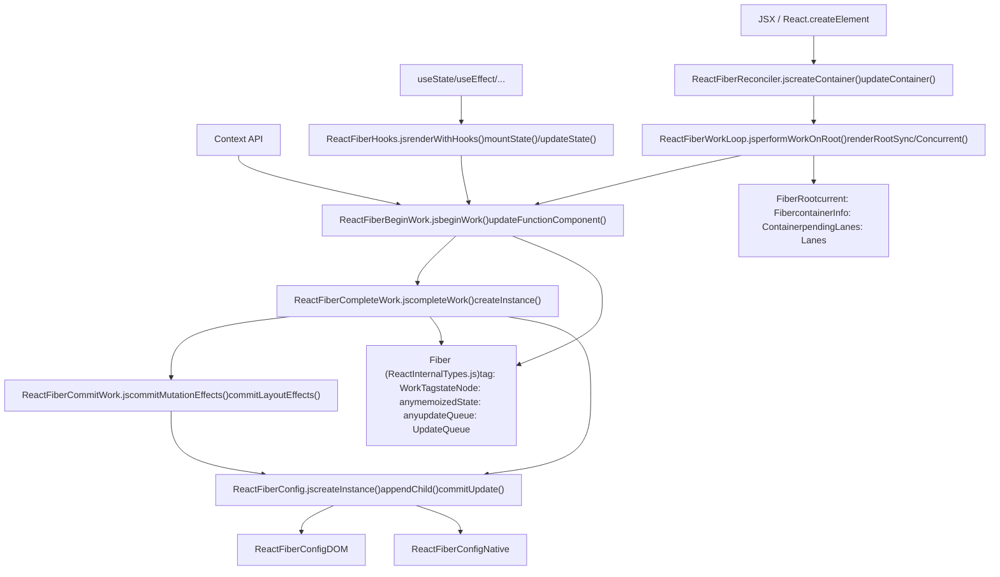
The reconciler operates through a two-phase render cycle: the **render phase** (interruptible) walks the Fiber tree calling `beginWork` and `completeWork`, and the **commit phase** (synchronous) applies changes to the host environment.

**Sources**: [packages/react-reconciler/src/ReactFiberWorkLoop.js1-1279](https://github.com/facebook/react/blob/65eec428/packages/react-reconciler/src/ReactFiberWorkLoop.js#L1-L1279) [packages/react-reconciler/src/ReactFiberReconciler.js1-354](https://github.com/facebook/react/blob/65eec428/packages/react-reconciler/src/ReactFiberReconciler.js#L1-L354) [packages/react-reconciler/src/ReactInternalTypes.js88-207](https://github.com/facebook/react/blob/65eec428/packages/react-reconciler/src/ReactInternalTypes.js#L88-L207)

---

## Fiber Data Structure

The **Fiber** is the fundamental unit of work in the reconciler. Each Fiber node represents a component instance and its associated work.

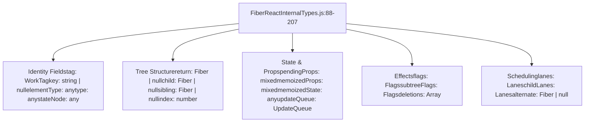
| Field | Purpose |
| --- | --- |
| `tag` | WorkTag identifying component type (FunctionComponent, ClassComponent, HostComponent, etc.) |
| `stateNode` | Reference to DOM node, class instance, or other host instance |
| `memoizedState` | Output state from last render; for hooks, this is the linked list of Hook objects |
| `updateQueue` | Queue of state updates and effects to process |
| `flags` | Side-effect flags (Placement, Update, Deletion, Passive, etc.) |
| `lanes` | Priority lanes representing pending work on this fiber |
| `alternate` | Double-buffering: points to the current tree's corresponding fiber during updates |

**Sources**: [packages/react-reconciler/src/ReactInternalTypes.js88-207](https://github.com/facebook/react/blob/65eec428/packages/react-reconciler/src/ReactInternalTypes.js#L88-L207) [packages/react-reconciler/src/ReactFiber.js136-209](https://github.com/facebook/react/blob/65eec428/packages/react-reconciler/src/ReactFiber.js#L136-L209)

---

## Work Loop Execution Model

The work loop is the heart of the reconciler, managing the progression through render and commit phases.

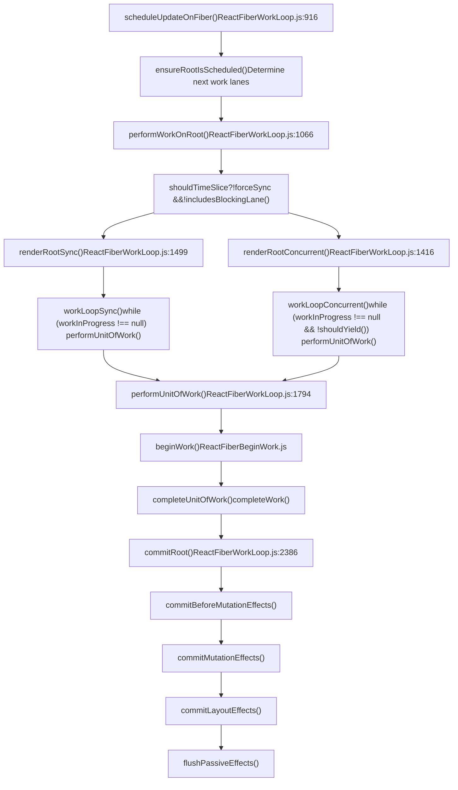
### Render Phase

The render phase walks the Fiber tree and determines what changes are needed. It consists of two sub-phases:

**Begin Work** ([ReactFiberBeginWork.js1400-2900](https://github.com/facebook/react/blob/65eec428/ReactFiberBeginWork.js#L1400-L2900)):

-   Processes the component (calls render, hooks, etc.)
-   Reconciles children using `reconcileChildren`
-   Returns the next child fiber to process
-   Key functions: `updateFunctionComponent`, `updateClassComponent`, `updateHostComponent`

**Complete Work** ([ReactFiberCompleteWork.js600-1200](https://github.com/facebook/react/blob/65eec428/ReactFiberCompleteWork.js#L600-L1200)):

-   Creates or updates host instances via `createInstance`, `finalizeInitialChildren`
-   Bubbles up side-effect flags from children
-   Returns to parent, then processes sibling

The render phase is **interruptible** in concurrent mode — `shouldYield()` allows pausing to handle higher-priority work.

### Commit Phase

The commit phase applies the work from the render phase. It is **synchronous and uninterruptible**:

1.  **Before Mutation** ([ReactFiberCommitWork.js343-591](https://github.com/facebook/react/blob/65eec428/ReactFiberCommitWork.js#L343-L591)): `getSnapshotBeforeUpdate`, prepare for DOM mutations
2.  **Mutation** ([ReactFiberCommitWork.js2400-3100](https://github.com/facebook/react/blob/65eec428/ReactFiberCommitWork.js#L2400-L3100)): Apply DOM changes (insert, update, delete nodes)
3.  **Layout** ([ReactFiberCommitWork.js593-870](https://github.com/facebook/react/blob/65eec428/ReactFiberCommitWork.js#L593-L870)): `componentDidMount`, `useLayoutEffect`, ref attachment
4.  **Passive** ([ReactFiberCommitWork.js2629-2800](https://github.com/facebook/react/blob/65eec428/ReactFiberCommitWork.js#L2629-L2800)): `useEffect` (scheduled after paint)

**Sources**: [packages/react-reconciler/src/ReactFiberWorkLoop.js1066-1800](https://github.com/facebook/react/blob/65eec428/packages/react-reconciler/src/ReactFiberWorkLoop.js#L1066-L1800) [packages/react-reconciler/src/ReactFiberBeginWork.js341-470](https://github.com/facebook/react/blob/65eec428/packages/react-reconciler/src/ReactFiberBeginWork.js#L341-L470) [packages/react-reconciler/src/ReactFiberCommitWork.js343-870](https://github.com/facebook/react/blob/65eec428/packages/react-reconciler/src/ReactFiberCommitWork.js#L343-L870)

---

## Host Configuration Abstraction

The reconciler delegates all platform-specific operations through the `ReactFiberConfig` interface. This enables React to target multiple platforms without modifying core logic.

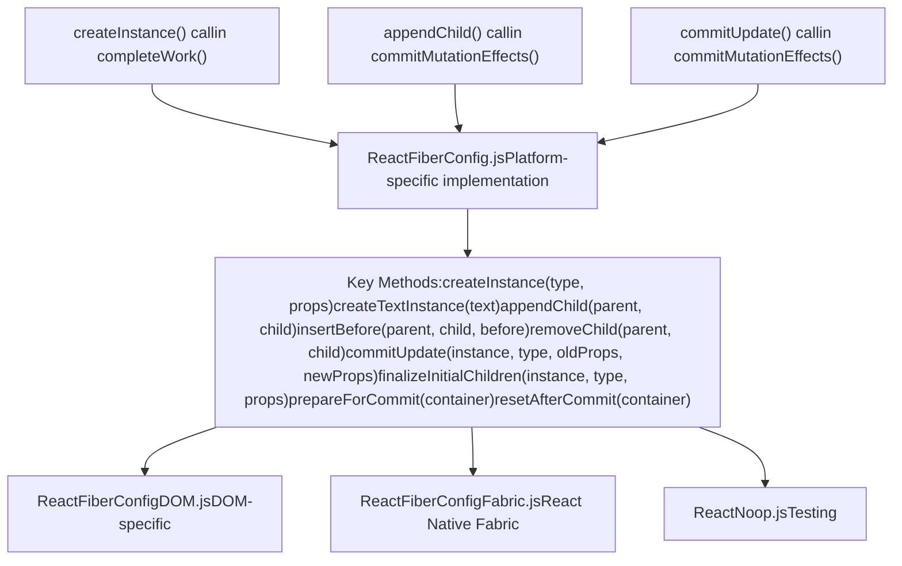
### Mutation vs Persistence

Renderers implement one of two strategies:

**Mutation Mode** (DOM, React Native Legacy):

-   `supportsMutation = true`
-   Modifies host instances in place
-   Methods: `appendChild`, `removeChild`, `commitUpdate`

**Persistence Mode** (React Native Fabric):

-   `supportsPersistence = true`
-   Clones and replaces entire subtrees
-   Methods: `cloneInstance`, `createContainerChildSet`, `replaceContainerChildren`

### Example: DOM Renderer Integration

```
completeWork() → createInstance() → document.createElement()
commitMutationEffects() → appendChild() → parentInstance.appendChild()
commitMutationEffects() → commitUpdate() → updateProperties()
```
The reconciler calls high-level operations like `createInstance`; the DOM renderer translates these to `document.createElement()`, `node.appendChild()`, etc.

**Sources**: [packages/react-reconciler/src/ReactFiberCompleteWork.js105-129](https://github.com/facebook/react/blob/65eec428/packages/react-reconciler/src/ReactFiberCompleteWork.js#L105-L129) [packages/react-dom-bindings/src/client/ReactFiberConfigDOM.js1-50](https://github.com/facebook/react/blob/65eec428/packages/react-dom-bindings/src/client/ReactFiberConfigDOM.js#L1-L50) [packages/react-reconciler/src/ReactFiberCommitWork.js154-186](https://github.com/facebook/react/blob/65eec428/packages/react-reconciler/src/ReactFiberCommitWork.js#L154-L186)

---

## Reconciliation and Diffing

When React updates a component, it reconciles the new children with the existing Fiber tree.

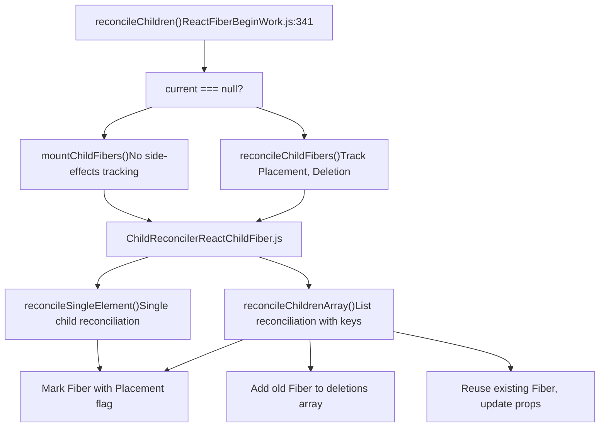
### Array Reconciliation Algorithm

When reconciling an array of children ([ReactChildFiber.js800-1200](https://github.com/facebook/react/blob/65eec428/ReactChildFiber.js#L800-L1200)):

1.  **First Pass**: Walk old and new children in parallel, matching by `key` (if provided) or `index`

    -   If `key` matches and `type` matches: reuse Fiber, update props
    -   If mismatch: break and proceed to repositioning
2.  **Deletions**: Remaining old children not matched are marked for deletion

3.  **Insertions**: Remaining new children create new Fibers with `Placement` flag

4.  **Key Map**: For complex reorderings, build a map of `key → Fiber` to efficiently find matches


The reconciler marks each Fiber with flags:

-   `Placement`: Needs to be inserted into DOM
-   `Update`: Props changed, needs DOM update
-   `Deletion`: Needs to be removed from DOM

**Sources**: [packages/react-reconciler/src/ReactFiberBeginWork.js341-404](https://github.com/facebook/react/blob/65eec428/packages/react-reconciler/src/ReactFiberBeginWork.js#L341-L404) [packages/react-reconciler/src/ReactChildFiber.js800-1200](https://github.com/facebook/react/blob/65eec428/packages/react-reconciler/src/ReactChildFiber.js#L800-L1200)

---

## Global State and Work-in-Progress

The reconciler maintains global mutable state during rendering:

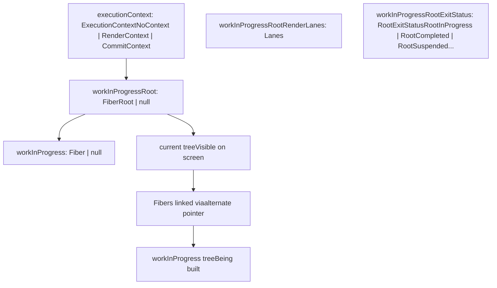
**Double Buffering**: React maintains two Fiber trees:

-   **Current tree**: The currently rendered tree, visible to the user
-   **Work-in-progress tree**: The tree being built during an update

Each Fiber's `alternate` pointer links to its counterpart in the other tree. After commit, the work-in-progress tree becomes the current tree via pointer swap ([ReactFiberWorkLoop.js2600-2650](https://github.com/facebook/react/blob/65eec428/ReactFiberWorkLoop.js#L2600-L2650)).

**Sources**: [packages/react-reconciler/src/ReactFiberWorkLoop.js406-526](https://github.com/facebook/react/blob/65eec428/packages/react-reconciler/src/ReactFiberWorkLoop.js#L406-L526) [packages/react-reconciler/src/ReactFiber.js360-480](https://github.com/facebook/react/blob/65eec428/packages/react-reconciler/src/ReactFiber.js#L360-L480)

---

## Render Exit Statuses

The render phase can exit in multiple states ([ReactFiberWorkLoop.js413-420](https://github.com/facebook/react/blob/65eec428/ReactFiberWorkLoop.js#L413-L420)):

| Status | Description |
| --- | --- |
| `RootInProgress` | Render is still in progress |
| `RootCompleted` | Render completed successfully |
| `RootErrored` | Render hit an error |
| `RootSuspended` | Render suspended waiting for data |
| `RootSuspendedWithDelay` | Suspended with throttling delay |
| `RootSuspendedAtTheShell` | Suspended during initial shell, show fallback immediately |
| `RootFatalErrored` | Fatal error, cannot recover |

The status determines whether to commit immediately, retry, or show a Suspense fallback.

---

## Error Handling and Boundaries

Error handling propagates up the Fiber tree until an error boundary is found.

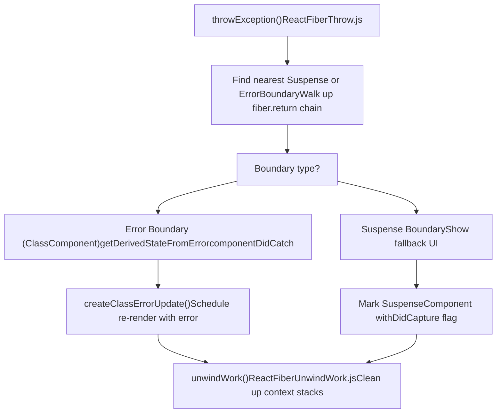
When an error or promise is thrown:

1.  `throwException()` is called with the thrown value
2.  Walk up the tree to find an appropriate boundary
3.  For errors: call `getDerivedStateFromError` on error boundary, schedule re-render
4.  For Suspense: mark boundary with `DidCapture`, prepare to show fallback
5.  `unwindWork()` cleans up any context stacks, unwinds to the boundary
6.  Restart render from the boundary

**Sources**: [packages/react-reconciler/src/ReactFiberThrow.js400-600](https://github.com/facebook/react/blob/65eec428/packages/react-reconciler/src/ReactFiberThrow.js#L400-L600) [packages/react-reconciler/src/ReactFiberUnwindWork.js63-180](https://github.com/facebook/react/blob/65eec428/packages/react-reconciler/src/ReactFiberUnwindWork.js#L63-L180) [packages/react-reconciler/src/ReactFiberWorkLoop.js1900-2100](https://github.com/facebook/react/blob/65eec428/packages/react-reconciler/src/ReactFiberWorkLoop.js#L1900-L2100)

---

## Concurrent Features and Interruption

In concurrent mode, the render phase can be interrupted to handle higher-priority updates.

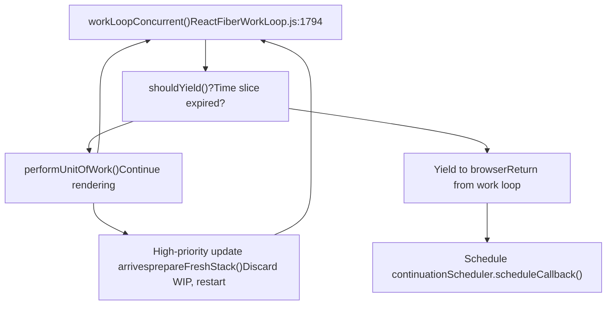
**Interruption points**:

-   Between units of work (fibers)
-   `shouldYield()` checks if time slice exhausted
-   New higher-priority updates can discard work-in-progress

**Resumption**:

-   Work-in-progress state is preserved
-   Can resume from `workInProgress` fiber
-   Or restart from root for higher priority

**Sources**: [packages/react-reconciler/src/ReactFiberWorkLoop.js1776-1850](https://github.com/facebook/react/blob/65eec428/packages/react-reconciler/src/ReactFiberWorkLoop.js#L1776-L1850) [packages/react-reconciler/src/ReactFiberWorkLoop.js1300-1400](https://github.com/facebook/react/blob/65eec428/packages/react-reconciler/src/ReactFiberWorkLoop.js#L1300-L1400)

---

## Component Types and Tags

The reconciler handles different component types via the `WorkTag` enum.

```mermaid
flowchart TD
    Fragment["Fragment = 7React.Fragment"]
    ContextProvider["ContextProvider = 10Context.Provider"]
    ContextConsumer["ContextConsumer = 9Context.Consumer"]
    Profiler["Profiler = 12React.Profiler"]
    SuspenseComponent["SuspenseComponent = 13React.Suspense"]
    SuspenseListComponent["SuspenseListComponent = 23React.SuspenseList"]
    OffscreenComponent["OffscreenComponent = 22Hidden content"]
    ActivityComponent["ActivityComponent = 25React.Activity"]
    FunctionComponent["FunctionComponent = 0Function components"]
    ClassComponent["ClassComponent = 1Class components"]
    ForwardRef["ForwardRef = 11React.forwardRef"]
    MemoComponent["MemoComponent = 14React.memo"]
    SimpleMemoComponent["SimpleMemoComponent = 15Memo with simple comparison"]
    HostRoot["HostRoot = 3Root of Fiber tree"]
    HostComponent["HostComponent = 5DOM element (div, span)"]
    HostText["HostText = 6Text node"]
    HostPortal["HostPortal = 4ReactDOM.createPortal"]
```
The `tag` field on each Fiber determines which code path `beginWork` and `completeWork` take.

**Example dispatching** ([ReactFiberBeginWork.js3800-4100](https://github.com/facebook/react/blob/65eec428/ReactFiberBeginWork.js#L3800-L4100)):

```
switch (workInProgress.tag) {
  case FunctionComponent:
    return updateFunctionComponent(...)
  case ClassComponent:
    return updateClassComponent(...)
  case HostComponent:
    return updateHostComponent(...)
  ...
}
```
**Sources**: [packages/react-reconciler/src/ReactWorkTags.js1-60](https://github.com/facebook/react/blob/65eec428/packages/react-reconciler/src/ReactWorkTags.js#L1-L60) [packages/react-reconciler/src/ReactFiberBeginWork.js3800-4100](https://github.com/facebook/react/blob/65eec428/packages/react-reconciler/src/ReactFiberBeginWork.js#L3800-L4100)

---

## Context System

React Context is implemented at the reconciler level.

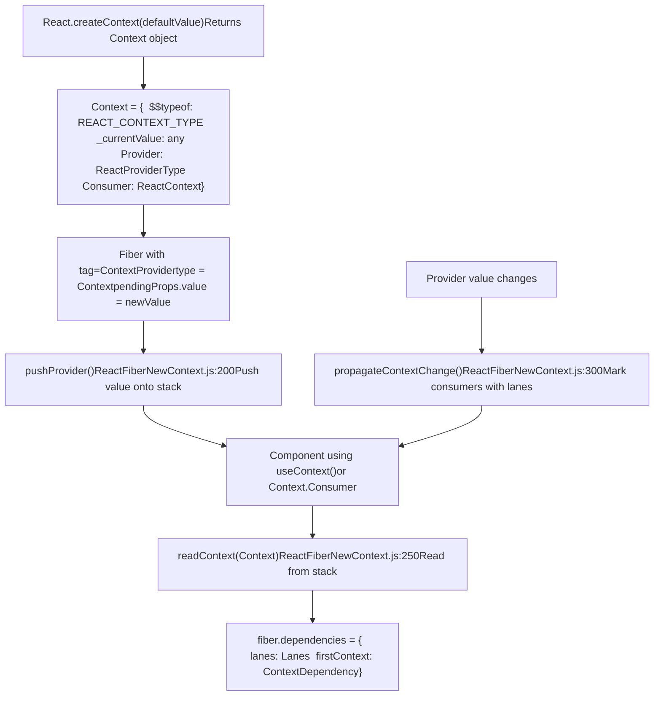
**Context mechanism**:

1.  **Stack-based**: Providers push values onto a stack as the tree is traversed
2.  **Dependencies**: Consuming components record a dependency in `fiber.dependencies`
3.  **Bailout prevention**: When context value changes, `propagateContextChange()` marks all consumers with update lanes, preventing bailout

**Key functions**:

-   `pushProvider()` - Push new context value onto stack ([ReactFiberNewContext.js200-250](https://github.com/facebook/react/blob/65eec428/ReactFiberNewContext.js#L200-L250))
-   `readContext()` - Read current context value and record dependency ([ReactFiberNewContext.js250-350](https://github.com/facebook/react/blob/65eec428/ReactFiberNewContext.js#L250-L350))
-   `propagateContextChange()` - Mark consumers for update when value changes ([ReactFiberNewContext.js400-550](https://github.com/facebook/react/blob/65eec428/ReactFiberNewContext.js#L400-L550))

**Sources**: [packages/react-reconciler/src/ReactFiberNewContext.js200-550](https://github.com/facebook/react/blob/65eec428/packages/react-reconciler/src/ReactFiberNewContext.js#L200-L550) [packages/react-reconciler/src/ReactFiberBeginWork.js3200-3350](https://github.com/facebook/react/blob/65eec428/packages/react-reconciler/src/ReactFiberBeginWork.js#L3200-L3350)

---

## Scheduling Entry Points

Updates enter the reconciler through several paths:

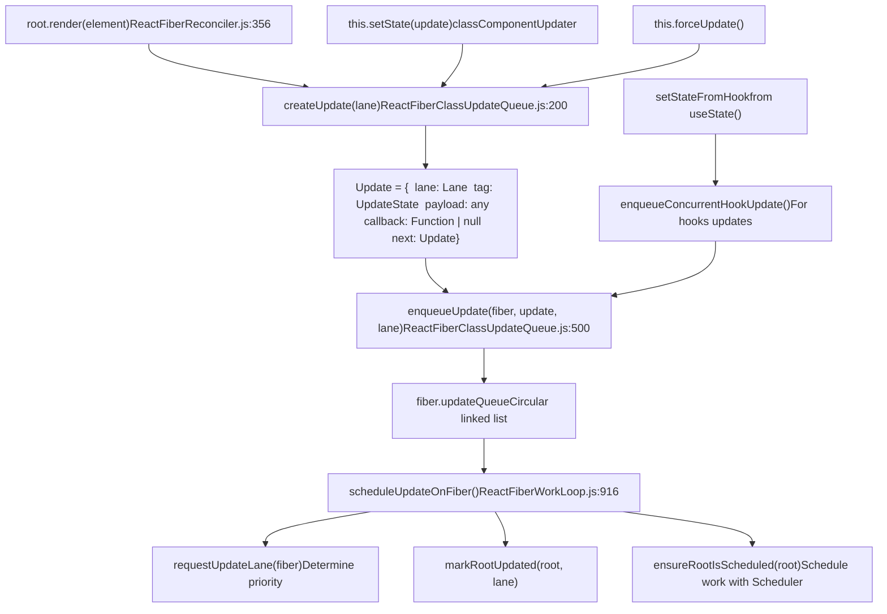
**Update lifecycle**:

1.  User calls `setState()` or `render()`
2.  Create an `Update` object with priority lane
3.  Enqueue update onto fiber's `updateQueue`
4.  Call `scheduleUpdateOnFiber()` with root and lane
5.  `ensureRootIsScheduled()` schedules work with Scheduler based on lanes

**Sources**: [packages/react-reconciler/src/ReactFiberReconciler.js356-461](https://github.com/facebook/react/blob/65eec428/packages/react-reconciler/src/ReactFiberReconciler.js#L356-L461) [packages/react-reconciler/src/ReactFiberWorkLoop.js916-1042](https://github.com/facebook/react/blob/65eec428/packages/react-reconciler/src/ReactFiberWorkLoop.js#L916-L1042) [packages/react-reconciler/src/ReactFiberClassUpdateQueue.js165-243](https://github.com/facebook/react/blob/65eec428/packages/react-reconciler/src/ReactFiberClassUpdateQueue.js#L165-L243)

---

## Batching and Synchronization

The reconciler batches updates to minimize renders.

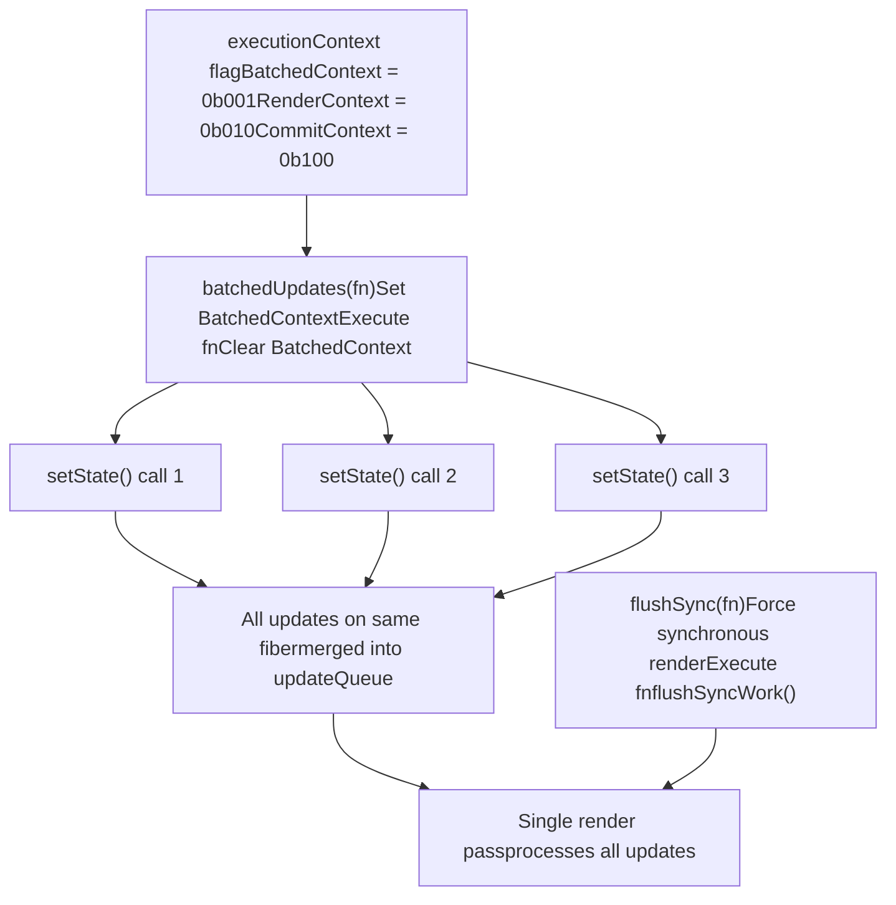
**Automatic batching**: In React 18+, all updates are automatically batched within a single event, timeout, or promise callback. The `executionContext` prevents nested flush operations.

**Manual control**:

-   `flushSync()` - Force synchronous rendering ([ReactFiberWorkLoop.js1244-1278](https://github.com/facebook/react/blob/65eec428/ReactFiberWorkLoop.js#L1244-L1278))
-   `batchedUpdates()` - Explicit batching (mostly legacy) ([ReactFiberWorkLoop.js2832-2850](https://github.com/facebook/react/blob/65eec428/ReactFiberWorkLoop.js#L2832-L2850))

**Sources**: [packages/react-reconciler/src/ReactFiberWorkLoop.js1244-1278](https://github.com/facebook/react/blob/65eec428/packages/react-reconciler/src/ReactFiberWorkLoop.js#L1244-L1278) [packages/react-reconciler/src/ReactFiberWorkLoop.js2832-2850](https://github.com/facebook/react/blob/65eec428/packages/react-reconciler/src/ReactFiberWorkLoop.js#L2832-L2850)

---

## Refs and Imperative Handles

The reconciler manages refs and provides imperative access to instances.

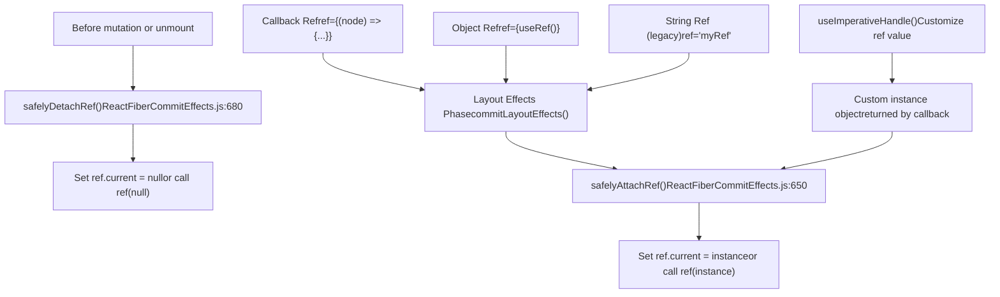
**Ref lifecycle**:

1.  **Detachment**: Before mutations, call `safelyDetachRef()` to clear old refs
2.  **Attachment**: In layout phase, call `safelyAttachRef()` to set new refs
3.  **Instance**: For host components, ref points to DOM node; for class components, to class instance; for function components with `useImperativeHandle`, to custom object

**Sources**: [packages/react-reconciler/src/ReactFiberCommitEffects.js650-720](https://github.com/facebook/react/blob/65eec428/packages/react-reconciler/src/ReactFiberCommitEffects.js#L650-L720) [packages/react-reconciler/src/ReactFiberHooks.js2100-2200](https://github.com/facebook/react/blob/65eec428/packages/react-reconciler/src/ReactFiberHooks.js#L2100-L2200)

---

## Profiler Integration

The reconciler integrates with React DevTools Profiler to track render times.

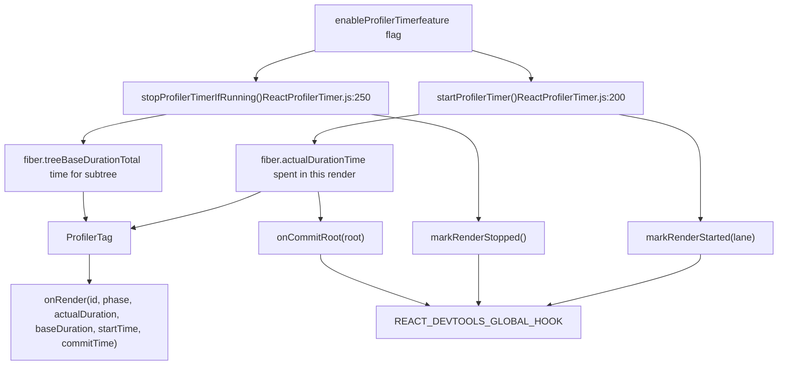
**Profiler mechanism**:

-   `actualDuration`: Time spent rendering this component in the current render
-   `treeBaseDuration`: Estimated time to re-render entire subtree (cached from previous render)
-   `startProfilerTimer()` / `stopProfilerTimerIfRunning()`: Record timing around component render
-   `<Profiler>` component invokes `onRender` callback with timing data after commit
-   DevTools hook receives notifications of render start/stop/commit

**Sources**: [packages/react-reconciler/src/ReactProfilerTimer.js150-350](https://github.com/facebook/react/blob/65eec428/packages/react-reconciler/src/ReactProfilerTimer.js#L150-L350) [packages/react-reconciler/src/ReactFiberCommitEffects.js720-780](https://github.com/facebook/react/blob/65eec428/packages/react-reconciler/src/ReactFiberCommitEffects.js#L720-L780) [packages/react-reconciler/src/ReactFiberDevToolsHook.js200-350](https://github.com/facebook/react/blob/65eec428/packages/react-reconciler/src/ReactFiberDevToolsHook.js#L200-L350)

---

## Concurrent Mode Rendering Patterns

### Selective Hydration

The reconciler supports hydrating server-rendered content selectively based on user interactions.

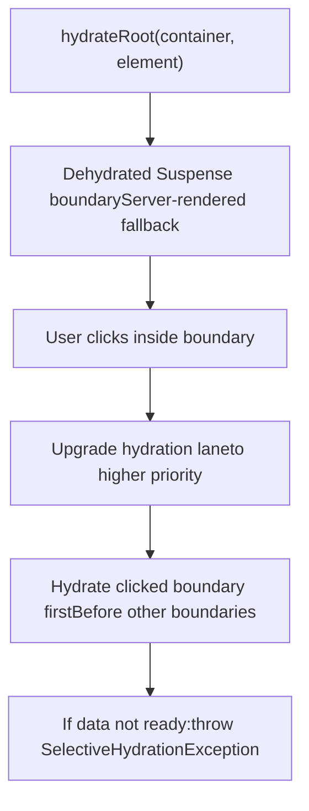
When a user interacts with a dehydrated boundary, React prioritizes hydrating that boundary to make it interactive quickly.

**Sources**: [packages/react-reconciler/src/ReactFiberBeginWork.js311-317](https://github.com/facebook/react/blob/65eec428/packages/react-reconciler/src/ReactFiberBeginWork.js#L311-L317) [packages/react-reconciler/src/ReactFiberReconciler.js489-520](https://github.com/facebook/react/blob/65eec428/packages/react-reconciler/src/ReactFiberReconciler.js#L489-L520)

### Offscreen Rendering

`OffscreenComponent` allows pre-rendering content that's not yet visible.

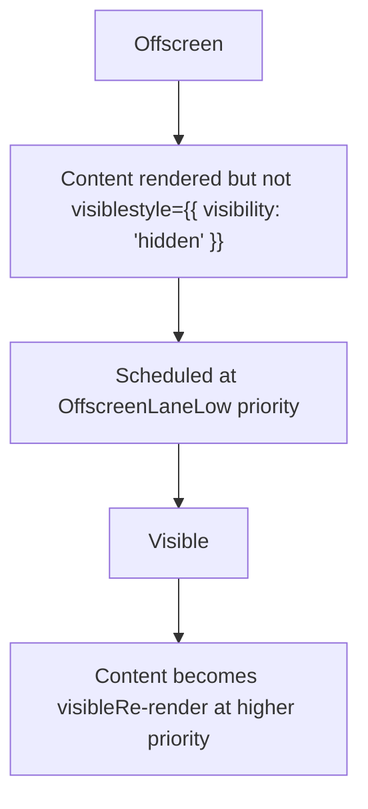
Offscreen components are rendered at low priority and kept in the DOM with `visibility: hidden`, then revealed instantly when needed.

**Sources**: [packages/react-reconciler/src/ReactFiberBeginWork.js613-871](https://github.com/facebook/react/blob/65eec428/packages/react-reconciler/src/ReactFiberBeginWork.js#L613-L871) [packages/react-reconciler/src/ReactFiberOffscreenComponent.js1-50](https://github.com/facebook/react/blob/65eec428/packages/react-reconciler/src/ReactFiberOffscreenComponent.js#L1-L50)

---

## Summary

The React Reconciler is the core reconciliation engine that:

-   **Manages Fiber trees**: Double-buffered trees with `current` and `workInProgress`
-   **Coordinates render phases**: Interruptible render phase, synchronous commit phase
-   **Abstracts platforms**: Delegates host operations through `ReactFiberConfig` interface
-   **Schedules work**: Priority-based scheduling using lanes and the Scheduler
-   **Handles updates**: Batches updates, processes update queues, reconciles children
-   **Supports features**: Hooks, Context, Suspense, Error Boundaries, Concurrent Rendering

Key entry points:

-   `createContainer()` / `updateContainer()` - Initialize and update roots
-   `scheduleUpdateOnFiber()` - Schedule work on a fiber
-   `performWorkOnRoot()` - Execute render and commit phases
-   `beginWork()` / `completeWork()` - Walk the fiber tree
-   `commitMutationEffects()` / `commitLayoutEffects()` - Apply changes to host

The reconciler is platform-agnostic, enabling React to target DOM, Native, Canvas, and custom renderers while maintaining a single core algorithm.
