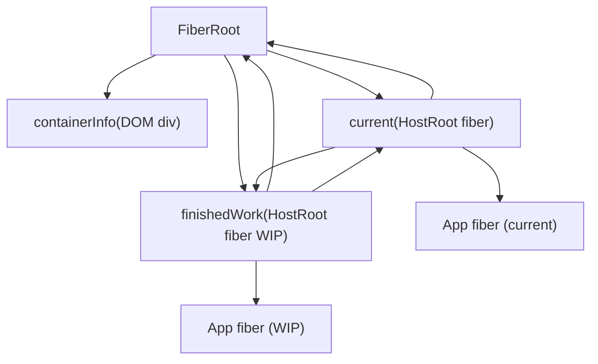
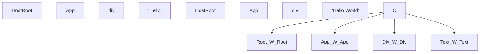
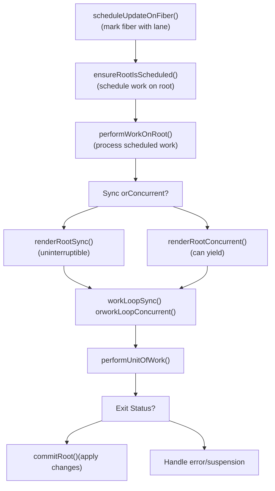
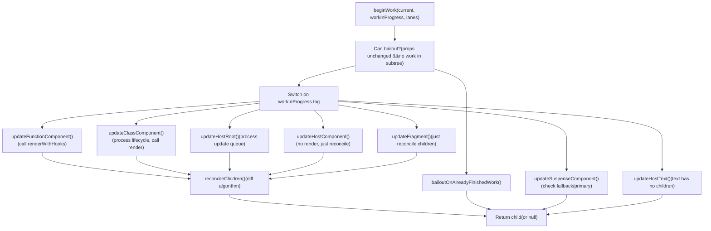
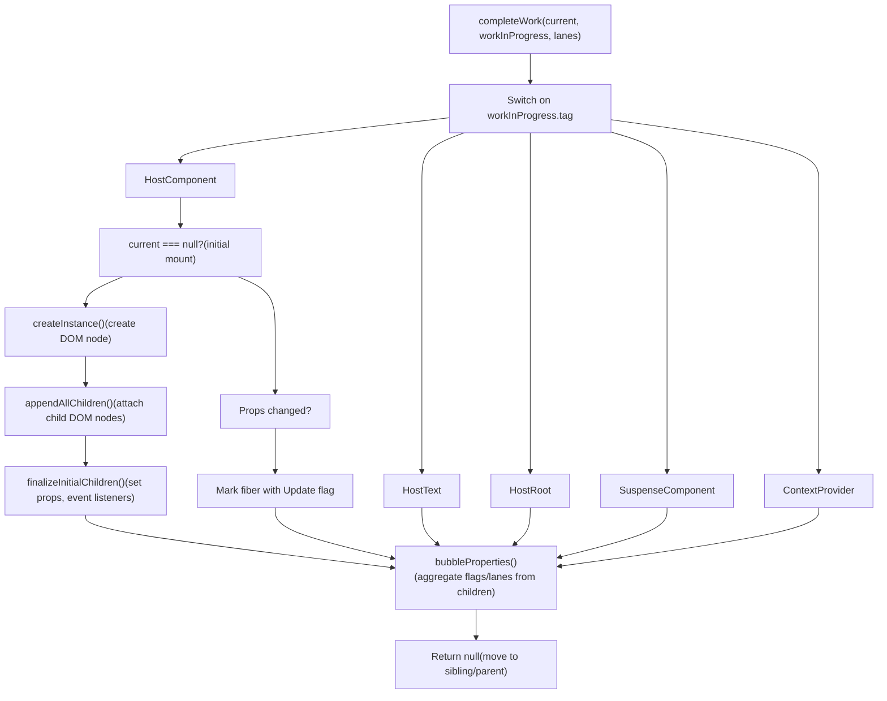
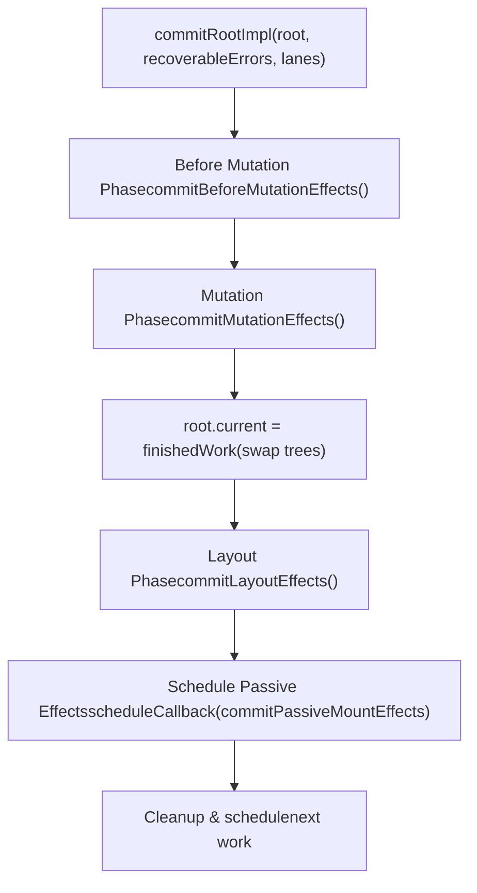
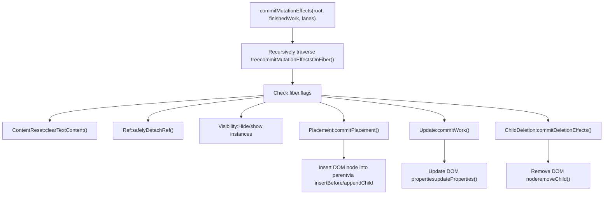

# Fiber Architecture and Data Structures

Relevant source files

-   [packages/react-client/src/ReactFlightPerformanceTrack.js](https://github.com/facebook/react/blob/65eec428/packages/react-client/src/ReactFlightPerformanceTrack.js)
-   [packages/react-debug-tools/src/ReactDebugHooks.js](https://github.com/facebook/react/blob/65eec428/packages/react-debug-tools/src/ReactDebugHooks.js)
-   [packages/react-debug-tools/src/\_\_tests\_\_/ReactHooksInspection-test.js](https://github.com/facebook/react/blob/65eec428/packages/react-debug-tools/src/__tests__/ReactHooksInspection-test.js)
-   [packages/react-debug-tools/src/\_\_tests\_\_/ReactHooksInspectionIntegration-test.js](https://github.com/facebook/react/blob/65eec428/packages/react-debug-tools/src/__tests__/ReactHooksInspectionIntegration-test.js)
-   [packages/react-debug-tools/src/\_\_tests\_\_/ReactHooksInspectionIntegrationDOM-test.js](https://github.com/facebook/react/blob/65eec428/packages/react-debug-tools/src/__tests__/ReactHooksInspectionIntegrationDOM-test.js)
-   [packages/react-devtools-shell/src/app/InspectableElements/CustomHooks.js](https://github.com/facebook/react/blob/65eec428/packages/react-devtools-shell/src/app/InspectableElements/CustomHooks.js)
-   [packages/react-devtools-timeline/src/content-views/utils/moduleFilters.js](https://github.com/facebook/react/blob/65eec428/packages/react-devtools-timeline/src/content-views/utils/moduleFilters.js)
-   [packages/react-dom/src/\_\_tests\_\_/ReactDOMFiberAsync-test.js](https://github.com/facebook/react/blob/65eec428/packages/react-dom/src/__tests__/ReactDOMFiberAsync-test.js)
-   [packages/react-dom/src/\_\_tests\_\_/ReactDOMNativeEventHeuristic-test.js](https://github.com/facebook/react/blob/65eec428/packages/react-dom/src/__tests__/ReactDOMNativeEventHeuristic-test.js)
-   [packages/react-dom/src/events/plugins/\_\_tests\_\_/ChangeEventPlugin-test.js](https://github.com/facebook/react/blob/65eec428/packages/react-dom/src/events/plugins/__tests__/ChangeEventPlugin-test.js)
-   [packages/react-dom/src/events/plugins/\_\_tests\_\_/SimpleEventPlugin-test.js](https://github.com/facebook/react/blob/65eec428/packages/react-dom/src/events/plugins/__tests__/SimpleEventPlugin-test.js)
-   [packages/react-reconciler/src/ReactFiber.js](https://github.com/facebook/react/blob/65eec428/packages/react-reconciler/src/ReactFiber.js)
-   [packages/react-reconciler/src/ReactFiberBeginWork.js](https://github.com/facebook/react/blob/65eec428/packages/react-reconciler/src/ReactFiberBeginWork.js)
-   [packages/react-reconciler/src/ReactFiberClassComponent.js](https://github.com/facebook/react/blob/65eec428/packages/react-reconciler/src/ReactFiberClassComponent.js)
-   [packages/react-reconciler/src/ReactFiberCommitWork.js](https://github.com/facebook/react/blob/65eec428/packages/react-reconciler/src/ReactFiberCommitWork.js)
-   [packages/react-reconciler/src/ReactFiberCompleteWork.js](https://github.com/facebook/react/blob/65eec428/packages/react-reconciler/src/ReactFiberCompleteWork.js)
-   [packages/react-reconciler/src/ReactFiberHooks.js](https://github.com/facebook/react/blob/65eec428/packages/react-reconciler/src/ReactFiberHooks.js)
-   [packages/react-reconciler/src/ReactFiberLane.js](https://github.com/facebook/react/blob/65eec428/packages/react-reconciler/src/ReactFiberLane.js)
-   [packages/react-reconciler/src/ReactFiberOffscreenComponent.js](https://github.com/facebook/react/blob/65eec428/packages/react-reconciler/src/ReactFiberOffscreenComponent.js)
-   [packages/react-reconciler/src/ReactFiberPerformanceTrack.js](https://github.com/facebook/react/blob/65eec428/packages/react-reconciler/src/ReactFiberPerformanceTrack.js)
-   [packages/react-reconciler/src/ReactFiberRootScheduler.js](https://github.com/facebook/react/blob/65eec428/packages/react-reconciler/src/ReactFiberRootScheduler.js)
-   [packages/react-reconciler/src/ReactFiberSuspenseComponent.js](https://github.com/facebook/react/blob/65eec428/packages/react-reconciler/src/ReactFiberSuspenseComponent.js)
-   [packages/react-reconciler/src/ReactFiberUnwindWork.js](https://github.com/facebook/react/blob/65eec428/packages/react-reconciler/src/ReactFiberUnwindWork.js)
-   [packages/react-reconciler/src/ReactFiberWorkLoop.js](https://github.com/facebook/react/blob/65eec428/packages/react-reconciler/src/ReactFiberWorkLoop.js)
-   [packages/react-reconciler/src/ReactInternalTypes.js](https://github.com/facebook/react/blob/65eec428/packages/react-reconciler/src/ReactInternalTypes.js)
-   [packages/react-reconciler/src/ReactProfilerTimer.js](https://github.com/facebook/react/blob/65eec428/packages/react-reconciler/src/ReactProfilerTimer.js)
-   [packages/react-reconciler/src/\_\_tests\_\_/ReactDeferredValue-test.js](https://github.com/facebook/react/blob/65eec428/packages/react-reconciler/src/__tests__/ReactDeferredValue-test.js)
-   [packages/react-reconciler/src/\_\_tests\_\_/ReactHooks-test.internal.js](https://github.com/facebook/react/blob/65eec428/packages/react-reconciler/src/__tests__/ReactHooks-test.internal.js)
-   [packages/react-reconciler/src/\_\_tests\_\_/ReactHooksWithNoopRenderer-test.js](https://github.com/facebook/react/blob/65eec428/packages/react-reconciler/src/__tests__/ReactHooksWithNoopRenderer-test.js)
-   [packages/react-reconciler/src/\_\_tests\_\_/ReactLazy-test.internal.js](https://github.com/facebook/react/blob/65eec428/packages/react-reconciler/src/__tests__/ReactLazy-test.internal.js)
-   [packages/react-reconciler/src/\_\_tests\_\_/ReactPerformanceTrack-test.js](https://github.com/facebook/react/blob/65eec428/packages/react-reconciler/src/__tests__/ReactPerformanceTrack-test.js)
-   [packages/react-reconciler/src/\_\_tests\_\_/ReactSiblingPrerendering-test.js](https://github.com/facebook/react/blob/65eec428/packages/react-reconciler/src/__tests__/ReactSiblingPrerendering-test.js)
-   [packages/react-reconciler/src/\_\_tests\_\_/ReactSuspense-test.internal.js](https://github.com/facebook/react/blob/65eec428/packages/react-reconciler/src/__tests__/ReactSuspense-test.internal.js)
-   [packages/react-reconciler/src/\_\_tests\_\_/ReactSuspensePlaceholder-test.internal.js](https://github.com/facebook/react/blob/65eec428/packages/react-reconciler/src/__tests__/ReactSuspensePlaceholder-test.internal.js)
-   [packages/react-reconciler/src/\_\_tests\_\_/ReactSuspenseWithNoopRenderer-test.js](https://github.com/facebook/react/blob/65eec428/packages/react-reconciler/src/__tests__/ReactSuspenseWithNoopRenderer-test.js)
-   [packages/react-reconciler/src/\_\_tests\_\_/ReactSuspenseyCommitPhase-test.js](https://github.com/facebook/react/blob/65eec428/packages/react-reconciler/src/__tests__/ReactSuspenseyCommitPhase-test.js)
-   [packages/react-server/src/ReactFizzHooks.js](https://github.com/facebook/react/blob/65eec428/packages/react-server/src/ReactFizzHooks.js)
-   [packages/react-server/src/ReactFlightAsyncSequence.js](https://github.com/facebook/react/blob/65eec428/packages/react-server/src/ReactFlightAsyncSequence.js)
-   [packages/react-server/src/ReactFlightServerConfigDebugNode.js](https://github.com/facebook/react/blob/65eec428/packages/react-server/src/ReactFlightServerConfigDebugNode.js)
-   [packages/react-server/src/ReactFlightServerConfigDebugNoop.js](https://github.com/facebook/react/blob/65eec428/packages/react-server/src/ReactFlightServerConfigDebugNoop.js)
-   [packages/react-server/src/ReactFlightStackConfigV8.js](https://github.com/facebook/react/blob/65eec428/packages/react-server/src/ReactFlightStackConfigV8.js)
-   [packages/react-server/src/\_\_tests\_\_/ReactFlightAsyncDebugInfo-test.js](https://github.com/facebook/react/blob/65eec428/packages/react-server/src/__tests__/ReactFlightAsyncDebugInfo-test.js)
-   [packages/react/src/ReactHooks.js](https://github.com/facebook/react/blob/65eec428/packages/react/src/ReactHooks.js)
-   [packages/react/src/ReactLazy.js](https://github.com/facebook/react/blob/65eec428/packages/react/src/ReactLazy.js)
-   [packages/react/src/\_\_tests\_\_/ReactProfiler-test.internal.js](https://github.com/facebook/react/blob/65eec428/packages/react/src/__tests__/ReactProfiler-test.internal.js)
-   [packages/shared/ReactPerformanceTrackProperties.js](https://github.com/facebook/react/blob/65eec428/packages/shared/ReactPerformanceTrackProperties.js)
-   [packages/shared/ReactSymbols.js](https://github.com/facebook/react/blob/65eec428/packages/shared/ReactSymbols.js)

## Purpose and Scope

This page documents React's Fiber data structure, the FiberRoot container, the double-buffering technique using current and work-in-progress trees, and the tree traversal mechanisms using child/sibling/return pointers. These are the foundational data structures that enable React's incremental reconciliation.

For related topics, see:

-   Work loop execution and render/commit phases: [Work Loop and Rendering Phases](/facebook/react/4.2-work-loop-and-rendering-phases)
-   Hooks implementation: [React Hooks System](/facebook/react/4.3-react-hooks-system)
-   Priority scheduling: [Lane-Based Scheduling and Priorities](/facebook/react/4.4-lane-based-scheduling-and-priorities)
-   Error and Suspense handling: [Suspense and Error Boundaries](/facebook/react/4.5-suspense-and-error-boundaries)
-   Host-specific operations: [Host Configuration Abstraction](/facebook/react/4.6-host-configuration-abstraction)

## FiberRoot: The Container

The `FiberRoot` is the container object that holds the entire fiber tree and coordinates rendering. It is created by `createFiberRoot` in [ReactFiberRoot.js109-225](https://github.com/facebook/react/blob/65eec428/ReactFiberRoot.js#L109-L225) when calling `createRoot()` or `createContainer()`.

### FiberRoot Structure

Key fields defined in [ReactInternalTypes.js253-334](https://github.com/facebook/react/blob/65eec428/ReactInternalTypes.js#L253-L334):

| Field | Type | Purpose |
| --- | --- | --- |
| `containerInfo` | `Container` | The host container (e.g., DOM node) |
| `current` | `Fiber` | Pointer to the current HostRoot fiber |
| `finishedWork` | `Fiber | null` | Work-in-progress root after render completes |
| `pendingLanes` | `Lanes` | Lanes with pending work |
| `suspendedLanes` | `Lanes` | Lanes suspended by promises |
| `pingedLanes` | `Lanes` | Lanes that have been pinged to retry |
| `expiredLanes` | `Lanes` | Lanes that have expired |
| `callbackNode` | `mixed` | Scheduler callback node |
| `callbackPriority` | `Lane` | Priority of scheduled callback |
| `hydrationCallbacks` | `null | SuspenseHydrationCallbacks` | Hydration callbacks |
| `context` | `Object | null` | Context object for legacy context |
| `pendingContext` | `Object | null` | Pending context updates |

**Diagram: FiberRoot and HostRoot Relationship**


The `HostRoot` fiber (tag = 3) is special:

-   Its `stateNode` points back to the `FiberRoot`
-   It has no React element (it's the root of the React tree)
-   Its `memoizedState` contains the initial element passed to `render()` [ReactInternalTypes.js246-251](https://github.com/facebook/react/blob/65eec428/ReactInternalTypes.js#L246-L251)

Sources: [ReactFiberRoot.js109-225](https://github.com/facebook/react/blob/65eec428/ReactFiberRoot.js#L109-L225) [ReactInternalTypes.js253-334](https://github.com/facebook/react/blob/65eec428/ReactInternalTypes.js#L253-L334) [ReactInternalTypes.js246-251](https://github.com/facebook/react/blob/65eec428/ReactInternalTypes.js#L246-L251)

## The Fiber Data Structure

### Fiber Node Definition

A Fiber is React's internal unit of work, representing a component instance, DOM node, or other React element. It is a mutable JavaScript object containing all information needed for reconciliation, scheduling, and effects.

The `FiberNode` constructor is defined in [ReactFiber.js138-211](https://github.com/facebook/react/blob/65eec428/ReactFiber.js#L138-L211) React provides two implementations:

-   Class-based: `createFiberImplClass` (default)
-   Object literal: `createFiberImplObject` (controlled by `enableObjectFiber` flag)

### Fiber Fields by Category

| Field Category | Key Fields | Purpose |
| --- | --- | --- |
| **Instance Identity** | `tag`, `key`, `elementType`, `type` | Identify what this fiber represents |
| **Instance State** | `stateNode` | Reference to component instance, DOM node, or other state |
| **Tree Structure** | `return`, `child`, `sibling`, `index` | Form the fiber tree via pointers |
| **Refs** | `ref`, `refCleanup` | Handle ref attachment and cleanup |
| **Props** | `pendingProps`, `memoizedProps` | Props being processed and last rendered props |
| **State** | `memoizedState`, `updateQueue` | Component state and pending updates |
| **Context** | `dependencies` | Context subscriptions |
| **Mode** | `mode` | Bitfield for ConcurrentMode, StrictMode, etc. |
| **Effects** | `flags`, `subtreeFlags`, `deletions` | Side-effects to perform in commit phase |
| **Scheduling** | `lanes`, `childLanes` | Work priority for this fiber and its subtree |
| **Double Buffering** | `alternate` | Link to counterpart fiber in other tree |
| **Profiling** | `actualDuration`, `selfBaseDuration`, etc. | Timing information (if enabled) |

**Fiber Creation:**

New fibers are created by `createFiber` [ReactFiber.js303-305](https://github.com/facebook/react/blob/65eec428/ReactFiber.js#L303-L305):

```
const createFiber = enableObjectFiber
  ? createFiberImplObject
  : createFiberImplClass;
```
Sources: [ReactFiber.js138-211](https://github.com/facebook/react/blob/65eec428/ReactFiber.js#L138-L211) [ReactFiber.js226-305](https://github.com/facebook/react/blob/65eec428/ReactFiber.js#L226-L305) [ReactInternalTypes.js89-205](https://github.com/facebook/react/blob/65eec428/ReactInternalTypes.js#L89-L205)

### Work Tags

Each fiber's `tag` field identifies its type, defined in [ReactWorkTags.js10-37](https://github.com/facebook/react/blob/65eec428/ReactWorkTags.js#L10-L37):

| Tag Constant | Value | Represents |
| --- | --- | --- |
| `FunctionComponent` | 0 | Function component |
| `ClassComponent` | 1 | Class component |
| `HostRoot` | 3 | Root of a fiber tree (container) |
| `HostComponent` | 5 | Platform element (e.g., DOM `<div>`) |
| `HostText` | 6 | Text node |
| `HostPortal` | 4 | Portal to different container |
| `Fragment` | 7 | `React.Fragment` |
| `Mode` | 8 | StrictMode, ConcurrentMode, etc. |
| `ContextProvider` | 10 | `Context.Provider` |
| `ContextConsumer` | 9 | `Context.Consumer` |
| `ForwardRef` | 11 | `React.forwardRef()` wrapper |
| `Profiler` | 12 | `<Profiler>` component |
| `SuspenseComponent` | 13 | `<Suspense>` boundary |
| `MemoComponent` | 14 | `React.memo()` wrapper |
| `SimpleMemoComponent` | 15 | Optimized memo for simple functions |
| `LazyComponent` | 16 | `React.lazy()` wrapper |
| `OffscreenComponent` | 22 | Hidden/deferred subtree |
| `CacheComponent` | 24 | Cache boundary |
| `TracingMarkerComponent` | 25 | Transition tracing marker |

The tag determines how the fiber is processed during reconciliation (in `beginWork`/`completeWork`) and what lifecycle methods or hooks it supports.

Sources: [ReactWorkTags.js10-37](https://github.com/facebook/react/blob/65eec428/ReactWorkTags.js#L10-L37) [ReactFiber.js146](https://github.com/facebook/react/blob/65eec428/ReactFiber.js#L146-L146)

## Double Buffering: Current and Work-in-Progress Trees

React maintains two fiber trees using a technique called double buffering:

-   **Current tree**: Reflects what's currently rendered on screen
-   **Work-in-progress tree**: Being constructed during the render phase

### The `alternate` Pointer

Each fiber has an `alternate` field pointing to its counterpart in the other tree [ReactFiber.js177](https://github.com/facebook/react/blob/65eec428/ReactFiber.js#L177-L177):


**Diagram: Alternate Pointers Between Trees**

### Creating Work-in-Progress Fibers

The `createWorkInProgress` function [ReactFiber.js327-383](https://github.com/facebook/react/blob/65eec428/ReactFiber.js#L327-L383) manages fiber reuse:

**On first update (alternate is null):**

1.  Creates new fiber with `createFiber()`
2.  Copies `elementType`, `type`, `stateNode` from current
3.  Sets up bidirectional `alternate` pointers
4.  Initializes with `pendingProps`

**On subsequent updates (alternate exists):**

1.  Reuses existing alternate fiber
2.  Resets flags: `flags = NoFlags`, `subtreeFlags = NoFlags`
3.  Clears `deletions` array
4.  Updates `pendingProps` to new props
5.  Resets `lanes` and `childLanes`

**Benefits of double buffering:**

-   Memory efficiency: reuses fiber objects across renders
-   Enables bailout optimizations by comparing to `current`
-   Allows interruption: work-in-progress can be discarded if superseded
-   Atomic updates: switch trees by updating single pointer (`FiberRoot.current`)

Sources: [ReactFiber.js327-383](https://github.com/facebook/react/blob/65eec428/ReactFiber.js#L327-L383) [ReactFiber.js177](https://github.com/facebook/react/blob/65eec428/ReactFiber.js#L177-L177)

### Tree Swap on Commit

After rendering completes successfully, the work-in-progress tree becomes current via a single pointer update in `commitRootImpl` [ReactFiberWorkLoop.js2268-2826](https://github.com/facebook/react/blob/65eec428/ReactFiberWorkLoop.js#L2268-L2826):

```
root.current = finishedWork;
```
The previous current tree becomes the new work-in-progress alternate for the next update.

Sources: [ReactFiberWorkLoop.js2268-2826](https://github.com/facebook/react/blob/65eec428/ReactFiberWorkLoop.js#L2268-L2826)

## Work Loop Architecture

### Overview: `performWorkOnRoot`

The work loop orchestrates rendering and committing. The main entry point is `performWorkOnRoot` [ReactFiberWorkLoop.js940-1089](https://github.com/facebook/react/blob/65eec428/ReactFiberWorkLoop.js#L940-L1089) which:

1.  Prepares the work-in-progress root
2.  Executes the render phase (`renderRootSync` or `renderRootConcurrent`)
3.  If successful, executes the commit phase (`commitRoot`)
4.  Handles errors and suspensions
5.  Schedules any remaining work


**Diagram: Work Loop Execution Flow**

Sources: [ReactFiberWorkLoop.js940-1089](https://github.com/facebook/react/blob/65eec428/ReactFiberWorkLoop.js#L940-L1089) [ReactFiberWorkLoop.js1643-1846](https://github.com/facebook/react/blob/65eec428/ReactFiberWorkLoop.js#L1643-L1846)

### Work Loop State Variables

Key module-level state in [ReactFiberWorkLoop.js423-496](https://github.com/facebook/react/blob/65eec428/ReactFiberWorkLoop.js#L423-L496):

```
let workInProgressRoot: FiberRoot | null = null;     // Root being rendered
let workInProgress: Fiber | null = null;             // Current fiber being processed
let workInProgressRootRenderLanes: Lanes = NoLanes; // Lanes being rendered

let workInProgressSuspendedReason: SuspendedReason = NotSuspended;
let workInProgressThrownValue: mixed = null;

let workInProgressRootExitStatus: RootExitStatus = RootInProgress;
```
These variables track the current render's state globally within the reconciler.

Sources: [ReactFiberWorkLoop.js423-496](https://github.com/facebook/react/blob/65eec428/ReactFiberWorkLoop.js#L423-L496)

## The Render Phase

The render phase builds the work-in-progress tree by traversing fibers depth-first. This phase is **interruptible** in concurrent mode.

### Work Loop Functions

Two variants exist [ReactFiberWorkLoop.js1848-1856](https://github.com/facebook/react/blob/65eec428/ReactFiberWorkLoop.js#L1848-L1856):

**Synchronous (uninterruptible):**

```
function workLoopSync() {
  while (workInProgress !== null) {
    performUnitOfWork(workInProgress);
  }
}
```
**Concurrent (interruptible):**

```
function workLoopConcurrent() {
  while (workInProgress !== null && !shouldYield()) {
    performUnitOfWork(workInProgress);
  }
}
```
The concurrent version checks `shouldYield()` from Scheduler to yield control back to the browser.

Sources: [ReactFiberWorkLoop.js1848-1856](https://github.com/facebook/react/blob/65eec428/ReactFiberWorkLoop.js#L1848-L1856)

### Unit of Work: `performUnitOfWork`

Each iteration processes one fiber [ReactFiberWorkLoop.js1858-1884](https://github.com/facebook/react/blob/65eec428/ReactFiberWorkLoop.js#L1858-L1884):

```
function performUnitOfWork(unitOfWork: Fiber): void {
  const current = unitOfWork.alternate;

  let next = beginWork(current, unitOfWork, renderLanes);

  unitOfWork.memoizedProps = unitOfWork.pendingProps;

  if (next === null) {
    completeUnitOfWork(unitOfWork);
  } else {
    workInProgress = next;
  }
}
```
**Flow:**

1.  Call `beginWork` to process the fiber and generate children
2.  If `beginWork` returns a child, set it as next `workInProgress`
3.  If no child, call `completeUnitOfWork` to finish this fiber and move to sibling/parent

Sources: [ReactFiberWorkLoop.js1858-1884](https://github.com/facebook/react/blob/65eec428/ReactFiberWorkLoop.js#L1858-L1884)

### Begin Work: `beginWork`

The `beginWork` function [ReactFiberBeginWork.js3649-4221](https://github.com/facebook/react/blob/65eec428/ReactFiberBeginWork.js#L3649-L4221) is a large switch statement that processes each fiber type:


**Diagram: beginWork Processing Flow**

#### Key Operations in `beginWork`:

1.  **Bailout optimization** [ReactFiberBeginWork.js3798-3823](https://github.com/facebook/react/blob/65eec428/ReactFiberBeginWork.js#L3798-L3823): If props haven't changed and there's no work scheduled in the subtree, skip processing

2.  **Component-specific updates**:

    -   `updateFunctionComponent` [ReactFiberBeginWork.js1363-1434](https://github.com/facebook/react/blob/65eec428/ReactFiberBeginWork.js#L1363-L1434): Calls `renderWithHooks` to execute the function
    -   `updateClassComponent` [ReactFiberBeginWork.js1179-1298](https://github.com/facebook/react/blob/65eec428/ReactFiberBeginWork.js#L1179-L1298): Processes lifecycle methods and calls `render()`
    -   `updateHostComponent` [ReactFiberBeginWork.js1745-1791](https://github.com/facebook/react/blob/65eec428/ReactFiberBeginWork.js#L1745-L1791): For DOM elements, just prepares for children reconciliation
3.  **Child reconciliation** [ReactFiberBeginWork.js340-371](https://github.com/facebook/react/blob/65eec428/ReactFiberBeginWork.js#L340-L371): Calls `reconcileChildren` which:

    -   Uses `mountChildFibers` for initial mount (no placement flags)
    -   Uses `reconcileChildFibers` for updates (tracks side-effects)
    -   Implements React's diffing algorithm in [ReactChildFiber.js](https://github.com/facebook/react/blob/65eec428/ReactChildFiber.js)

Sources: [ReactFiberBeginWork.js3649-4221](https://github.com/facebook/react/blob/65eec428/ReactFiberBeginWork.js#L3649-L4221) [ReactFiberBeginWork.js340-371](https://github.com/facebook/react/blob/65eec428/ReactFiberBeginWork.js#L340-L371) [ReactChildFiber.js](https://github.com/facebook/react/blob/65eec428/ReactChildFiber.js)

### Complete Work: `completeWork`

After all children are processed, `completeUnitOfWork` [ReactFiberWorkLoop.js1886-1949](https://github.com/facebook/react/blob/65eec428/ReactFiberWorkLoop.js#L1886-L1949) calls `completeWork` [ReactFiberCompleteWork.js652-1441](https://github.com/facebook/react/blob/65eec428/ReactFiberCompleteWork.js#L652-L1441) to finalize the fiber.


**Diagram: completeWork Processing Flow**

#### Key Operations in `completeWork`:

For **HostComponent** (DOM elements) on mount [ReactFiberCompleteWork.js652-1441](https://github.com/facebook/react/blob/65eec428/ReactFiberCompleteWork.js#L652-L1441):

1.  `createInstance` - Creates the DOM node via host config
2.  `appendAllChildren` - Walks the fiber tree and attaches child DOM nodes
3.  `finalizeInitialChildren` - Sets initial props and event listeners
4.  Marks with Update flag if needed (e.g., autoFocus)

For **HostComponent** on update:

1.  Calls `updateHostComponent` [ReactFiberCompleteWork.js455-540](https://github.com/facebook/react/blob/65eec428/ReactFiberCompleteWork.js#L455-L540)
2.  If old props !== new props, marks fiber with Update flag
3.  The actual prop update happens in commit phase

**Property Bubbling** [ReactFiberCompleteWork.js1443-1543](https://github.com/facebook/react/blob/65eec428/ReactFiberCompleteWork.js#L1443-L1543):

-   Aggregates all child `flags` into `subtreeFlags`
-   Aggregates all child `lanes` and `childLanes` into this fiber's `childLanes`
-   Enables efficient subtree skipping during traversal

Sources: [ReactFiberCompleteWork.js652-1441](https://github.com/facebook/react/blob/65eec428/ReactFiberCompleteWork.js#L652-L1441) [ReactFiberCompleteWork.js242-346](https://github.com/facebook/react/blob/65eec428/ReactFiberCompleteWork.js#L242-L346) [ReactFiberCompleteWork.js1443-1543](https://github.com/facebook/react/blob/65eec428/ReactFiberCompleteWork.js#L1443-L1543)

### Traversal Pattern: Depth-First with Siblings

The work loop implements depth-first traversal with sibling processing [ReactFiberWorkLoop.js1886-1949](https://github.com/facebook/react/blob/65eec428/ReactFiberWorkLoop.js#L1886-L1949):

```
1. Begin work on fiber A
2. If A has child B, begin work on B (go deeper)
3. If B has no child, complete work on B
4. If B has sibling C, begin work on C
5. If no sibling, complete parent A
6. Continue until root is complete
```
This ensures proper parent→child→sibling ordering.

Sources: [ReactFiberWorkLoop.js1886-1949](https://github.com/facebook/react/blob/65eec428/ReactFiberWorkLoop.js#L1886-L1949)

## The Commit Phase

Once render phase completes successfully (`RootCompleted`), the commit phase applies all changes to the host environment. This phase is **uninterruptible** and **synchronous**.

### Commit Phase Structure

The `commitRootImpl` function [ReactFiberWorkLoop.js2268-2826](https://github.com/facebook/react/blob/65eec428/ReactFiberWorkLoop.js#L2268-L2826) orchestrates commit in three sub-phases plus passive effects:


**Diagram: Commit Phase Sub-phases**

Sources: [ReactFiberWorkLoop.js2268-2826](https://github.com/facebook/react/blob/65eec428/ReactFiberWorkLoop.js#L2268-L2826)

### Before Mutation Phase

`commitBeforeMutationEffects` [ReactFiberCommitWork.js344-363](https://github.com/facebook/react/blob/65eec428/ReactFiberCommitWork.js#L344-L363) traverses the tree and:

1.  Calls `getSnapshotBeforeUpdate` on class components [ReactFiberCommitWork.js475-574](https://github.com/facebook/react/blob/65eec428/ReactFiberCommitWork.js#L475-L574)
2.  Schedules useEffect hooks (doesn't run them yet)
3.  Handles view transition tracking (if enabled)
4.  Detects focus changes for `beforeActiveInstanceBlur`

**Key point:** This phase reads from the DOM *before* any mutations, allowing components to capture information (e.g., scroll position).

Sources: [ReactFiberCommitWork.js344-363](https://github.com/facebook/react/blob/65eec428/ReactFiberCommitWork.js#L344-L363) [ReactFiberCommitWork.js475-574](https://github.com/facebook/react/blob/65eec428/ReactFiberCommitWork.js#L475-L574)

### Mutation Phase

`commitMutationEffects` [ReactFiberCommitWork.js856-1097](https://github.com/facebook/react/blob/65eec428/ReactFiberCommitWork.js#L856-L1097) applies actual DOM changes:


**Diagram: Mutation Phase Operations**

**Key operations:**

-   **Placement** [ReactFiberCommitWork.js](https://github.com/facebook/react/blob/65eec428/ReactFiberCommitWork.js): Inserts new or moved DOM nodes using `insertBefore` or `appendChild`
-   **Update** [ReactFiberCommitWork.js](https://github.com/facebook/react/blob/65eec428/ReactFiberCommitWork.js): Updates properties on existing DOM nodes via `updateProperties`
-   **Deletion** [ReactFiberCommitWork.js](https://github.com/facebook/react/blob/65eec428/ReactFiberCommitWork.js): Recursively unmounts components and removes DOM nodes
-   **Visibility** [ReactFiberCommitWork.js](https://github.com/facebook/react/blob/65eec428/ReactFiberCommitWork.js): Hides/shows DOM nodes for Suspense/Offscreen

Sources: [ReactFiberCommitWork.js856-1097](https://github.com/facebook/react/blob/65eec428/ReactFiberCommitWork.js#L856-L1097) [ReactFiberCommitHostEffects.js](https://github.com/facebook/react/blob/65eec428/ReactFiberCommitHostEffects.js)

### Tree Swap

Between mutation and layout phases [ReactFiberWorkLoop.js2268-2826](https://github.com/facebook/react/blob/65eec428/ReactFiberWorkLoop.js#L2268-L2826):

```
root.current = finishedWork;
```
This swaps the work-in-progress tree to become the current tree. From this point forward, the newly committed tree represents what's on screen.

Sources: [ReactFiberWorkLoop.js2268-2826](https://github.com/facebook/react/blob/65eec428/ReactFiberWorkLoop.js#L2268-L2826)

### Layout Phase

`commitLayoutEffects` [ReactFiberCommitWork.js594-854](https://github.com/facebook/react/blob/65eec428/ReactFiberCommitWork.js#L594-L854) runs immediately after DOM mutations, while browser is still processing layout:

1.  **Class components** [ReactFiberCommitWork.js607-638](https://github.com/facebook/react/blob/65eec428/ReactFiberCommitWork.js#L607-L638):

    -   Calls `componentDidMount` on mount
    -   Calls `componentDidUpdate` on update
    -   Invokes `setState` callbacks
2.  **Function components** [ReactFiberCommitWork.js607-619](https://github.com/facebook/react/blob/65eec428/ReactFiberCommitWork.js#L607-L619):

    -   Calls `useLayoutEffect` effect functions
3.  **Refs** [ReactFiberCommitWork.js635-637](https://github.com/facebook/react/blob/65eec428/ReactFiberCommitWork.js#L635-L637):

    -   Calls `safelyAttachRef` to set refs to current instances
4.  **Host components** [ReactFiberCommitWork.js657-697](https://github.com/facebook/react/blob/65eec428/ReactFiberCommitWork.js#L657-L697):

    -   Calls `commitMount` for initial mount side-effects (e.g., autoFocus)

**Key point:** This phase can synchronously read layout from the DOM. `useLayoutEffect` runs here specifically to allow synchronous DOM measurements before paint.

Sources: [ReactFiberCommitWork.js594-854](https://github.com/facebook/react/blob/65eec428/ReactFiberCommitWork.js#L594-L854) [ReactFiberCommitEffects.js](https://github.com/facebook/react/blob/65eec428/ReactFiberCommitEffects.js)

### Passive Effects Phase

`commitPassiveEffects` [ReactFiberWorkLoop.js2858-3025](https://github.com/facebook/react/blob/65eec428/ReactFiberWorkLoop.js#L2858-L3025) runs **asynchronously** after browser paint, scheduled via `scheduleCallback`:

```
scheduleCallback(NormalSchedulerPriority, () => {
  flushPassiveEffects();
  return null;
});
```
**Two passes:**

1.  **Unmount effects** [ReactFiberCommitWork.js2446-2593](https://github.com/facebook/react/blob/65eec428/ReactFiberCommitWork.js#L2446-L2593):

    -   Calls cleanup functions from previous `useEffect` hooks
    -   Invokes `componentWillUnmount` on unmounted class components
2.  **Mount effects** [ReactFiberCommitWork.js2595-2774](https://github.com/facebook/react/blob/65eec428/ReactFiberCommitWork.js#L2595-L2774):

    -   Calls effect functions from current `useEffect` hooks

**Key characteristics:**

-   Runs after paint (non-blocking)
-   Lower priority than layout effects
-   Ideal for side-effects that don't need synchronous DOM access (data fetching, subscriptions)

Sources: [ReactFiberWorkLoop.js2858-3025](https://github.com/facebook/react/blob/65eec428/ReactFiberWorkLoop.js#L2858-L3025) [ReactFiberCommitWork.js2446-2774](https://github.com/facebook/react/blob/65eec428/ReactFiberCommitWork.js#L2446-L2774)

## Error Handling and Suspension

### Unwinding on Errors/Suspensions

When `beginWork` or other code throws during render, React unwinds the stack using `unwindWork` [ReactFiberUnwindWork.js66-235](https://github.com/facebook/react/blob/65eec428/ReactFiberUnwindWork.js#L66-L235):

1.  Walks back up the tree via `return` pointers
2.  Pops context stacks to maintain consistency
3.  Looks for error boundaries (`ClassComponent` with `getDerivedStateFromError` or `componentDidCatch`)
4.  Looks for Suspense boundaries (`SuspenseComponent`)
5.  Marks boundary with `ShouldCapture` flag

```
// Simplified unwinding logic
function unwindWork(current, workInProgress, renderLanes) {
  switch (workInProgress.tag) {
    case ClassComponent:
      if (flags & ShouldCapture) {
        workInProgress.flags = (flags & ~ShouldCapture) | DidCapture;
        return workInProgress; // Re-render this boundary
      }
      return null;

    case SuspenseComponent:
      if (flags & ShouldCapture) {
        workInProgress.flags = (flags & ~ShouldCapture) | DidCapture;
        return workInProgress; // Show fallback
      }
      return null;

    // ... other cases pop context
  }
}
```
Sources: [ReactFiberUnwindWork.js66-235](https://github.com/facebook/react/blob/65eec428/ReactFiberUnwindWork.js#L66-L235)

### Handling Thrown Values

`throwException` [ReactFiberThrow.js](https://github.com/facebook/react/blob/65eec428/ReactFiberThrow.js) processes different types of thrown values:

**Promises (Suspense):**

-   Attaches ping listener to the promise
-   Finds nearest Suspense boundary
-   Marks boundary to show fallback

**Errors:**

-   Finds nearest error boundary
-   Creates error update with `getDerivedStateFromError` or `componentDidCatch`
-   Schedules re-render of boundary

**Special values:**

-   `SelectiveHydrationException`: Signals need to interrupt current render for hydration

Sources: [ReactFiberThrow.js](https://github.com/facebook/react/blob/65eec428/ReactFiberThrow.js)

### Suspended Work Tracking

When work suspends [ReactFiberWorkLoop.js1987-2134](https://github.com/facebook/react/blob/65eec428/ReactFiberWorkLoop.js#L1987-L2134):

```
workInProgressSuspendedReason = SuspendedOnData;
workInProgressThrownValue = thrownValue;
```
The work loop checks this state and:

-   Attempts to unwind to a Suspense boundary
-   May continue rendering siblings to "pre-warm" them
-   Marks lanes for retry when promise resolves

Sources: [ReactFiberWorkLoop.js1987-2134](https://github.com/facebook/react/blob/65eec428/ReactFiberWorkLoop.js#L1987-L2134)

## Integration with Scheduler

### Scheduling Root Work

`ensureRootIsScheduled` [ReactFiberRootScheduler.js185-403](https://github.com/facebook/react/blob/65eec428/ReactFiberRootScheduler.js#L185-L403) is called after updates are enqueued:

1.  Determines next lanes to process via `getNextLanes`
2.  Calculates Scheduler priority from lane priority via `lanesToEventPriority`
3.  Schedules callback:
    -   **Sync lanes**: Uses microtask or immediate callback
    -   **Concurrent lanes**: Uses `Scheduler_scheduleCallback` with appropriate priority

```
const schedulerPriorityLevel = lanesToEventPriority(nextLanes);
const newCallbackNode = scheduleCallback(
  schedulerPriorityLevel,
  performWorkOnRoot.bind(null, root)
);
```
Sources: [ReactFiberRootScheduler.js185-403](https://github.com/facebook/react/blob/65eec428/ReactFiberRootScheduler.js#L185-L403)

### Yielding to Browser

In concurrent mode, `workLoopConcurrent` [ReactFiberWorkLoop.js1851-1856](https://github.com/facebook/react/blob/65eec428/ReactFiberWorkLoop.js#L1851-L1856) checks `shouldYield()` from Scheduler:

```
function workLoopConcurrent() {
  while (workInProgress !== null && !shouldYield()) {
    performUnitOfWork(workInProgress);
  }
}
```
If `shouldYield()` returns true:

-   Work loop exits
-   Current render state is preserved in module variables
-   Scheduler callback is re-scheduled
-   When callback runs again, rendering resumes from `workInProgress`

This enables:

-   Responding to higher-priority user input
-   Keeping frame rate high during complex renders
-   Time-slicing long operations

Sources: [ReactFiberWorkLoop.js1851-1856](https://github.com/facebook/react/blob/65eec428/ReactFiberWorkLoop.js#L1851-L1856) [Scheduler.js](https://github.com/facebook/react/blob/65eec428/Scheduler.js)

### Priority Mapping

Lane priorities map to Scheduler priorities [ReactEventPriorities.js](https://github.com/facebook/react/blob/65eec428/ReactEventPriorities.js):

| React Lane | Scheduler Priority |
| --- | --- |
| `SyncLane` | `ImmediatePriority` |
| `InputContinuousLane` | `UserBlockingPriority` |
| `DefaultLane` | `NormalPriority` |
| `TransitionLanes` | `NormalPriority` |
| `RetryLanes` | `NormalPriority` |
| `IdleLane` | `IdlePriority` |

Sources: [ReactEventPriorities.js](https://github.com/facebook/react/blob/65eec428/ReactEventPriorities.js) [ReactFiberLane.js](https://github.com/facebook/react/blob/65eec428/ReactFiberLane.js)

## Profiling and Performance Tracking

### Profiler Timing

When `enableProfilerTimer` is enabled, each fiber tracks timing information [ReactFiber.js179-197](https://github.com/facebook/react/blob/65eec428/ReactFiber.js#L179-L197):

```
fiber.actualDuration = -0;        // Time spent rendering this update
fiber.actualStartTime = -1.1;     // When rendering started
fiber.selfBaseDuration = -0;      // Base time excluding children
fiber.treeBaseDuration = -0;      // Base time including children
```
These are updated during:

-   `performUnitOfWork` starts the timer
-   `completeWork` stops and accumulates duration
-   Child durations are subtracted to compute self time

The `Profiler` component [ReactFiberBeginWork.js1136-1177](https://github.com/facebook/react/blob/65eec428/ReactFiberBeginWork.js#L1136-L1177) uses these to report render times via the `onRender` callback.

Sources: [ReactFiber.js179-197](https://github.com/facebook/react/blob/65eec428/ReactFiber.js#L179-L197) [ReactProfilerTimer.js](https://github.com/facebook/react/blob/65eec428/ReactProfilerTimer.js)

### Performance Track Logging

`ReactFiberPerformanceTrack` [ReactFiberPerformanceTrack.js](https://github.com/facebook/react/blob/65eec428/ReactFiberPerformanceTrack.js) logs performance events to browser DevTools Performance panel:

**Component tracks:**

-   `logComponentRender` logs individual component render times with color-coded severity
-   `logComponentMount/Unmount` logs lifecycle events
-   Tracks props changes and deep equality warnings

**Lane tracks:**

-   Separate tracks for Blocking, Gesture, Transition, Suspense, Idle
-   Shows update propagation and priority changes
-   Visualizes which updates triggered renders

**Event tracking:**

-   Correlates user events with resulting updates
-   Tracks cascading updates (updates triggered during render)
-   Measures time from event to commit

Sources: [ReactFiberPerformanceTrack.js221-450](https://github.com/facebook/react/blob/65eec428/ReactFiberPerformanceTrack.js#L221-L450)

## Summary

The Fiber architecture and work loop provide React's reconciliation mechanism with these key characteristics:

**Fiber Structure:**

-   Mutable plain objects forming a linked tree
-   Double-buffered (current ↔ work-in-progress)
-   Tracks props, state, effects, and scheduling information

**Work Loop:**

-   Depth-first traversal via `performUnitOfWork`
-   **Render phase** (interruptible): `beginWork` → `completeWork`
-   **Commit phase** (uninterruptible): before-mutation → mutation → layout → passive

**Key Capabilities:**

-   Incremental rendering with yielding to browser
-   Priority-based scheduling via lanes
-   Efficient bailout and memoization
-   Error boundaries and Suspense
-   Profiling and performance tracking

This architecture enables React to:

-   Keep UIs responsive during complex updates
-   Prioritize user interactions over background work
-   Gracefully handle async operations and errors
-   Provide detailed performance insights

Sources: [ReactFiberWorkLoop.js](https://github.com/facebook/react/blob/65eec428/ReactFiberWorkLoop.js) [ReactFiberBeginWork.js](https://github.com/facebook/react/blob/65eec428/ReactFiberBeginWork.js) [ReactFiberCompleteWork.js](https://github.com/facebook/react/blob/65eec428/ReactFiberCompleteWork.js) [ReactFiberCommitWork.js](https://github.com/facebook/react/blob/65eec428/ReactFiberCommitWork.js) [ReactFiber.js](https://github.com/facebook/react/blob/65eec428/ReactFiber.js) [ReactProfilerTimer.js](https://github.com/facebook/react/blob/65eec428/ReactProfilerTimer.js) [ReactFiberPerformanceTrack.js](https://github.com/facebook/react/blob/65eec428/ReactFiberPerformanceTrack.js)
