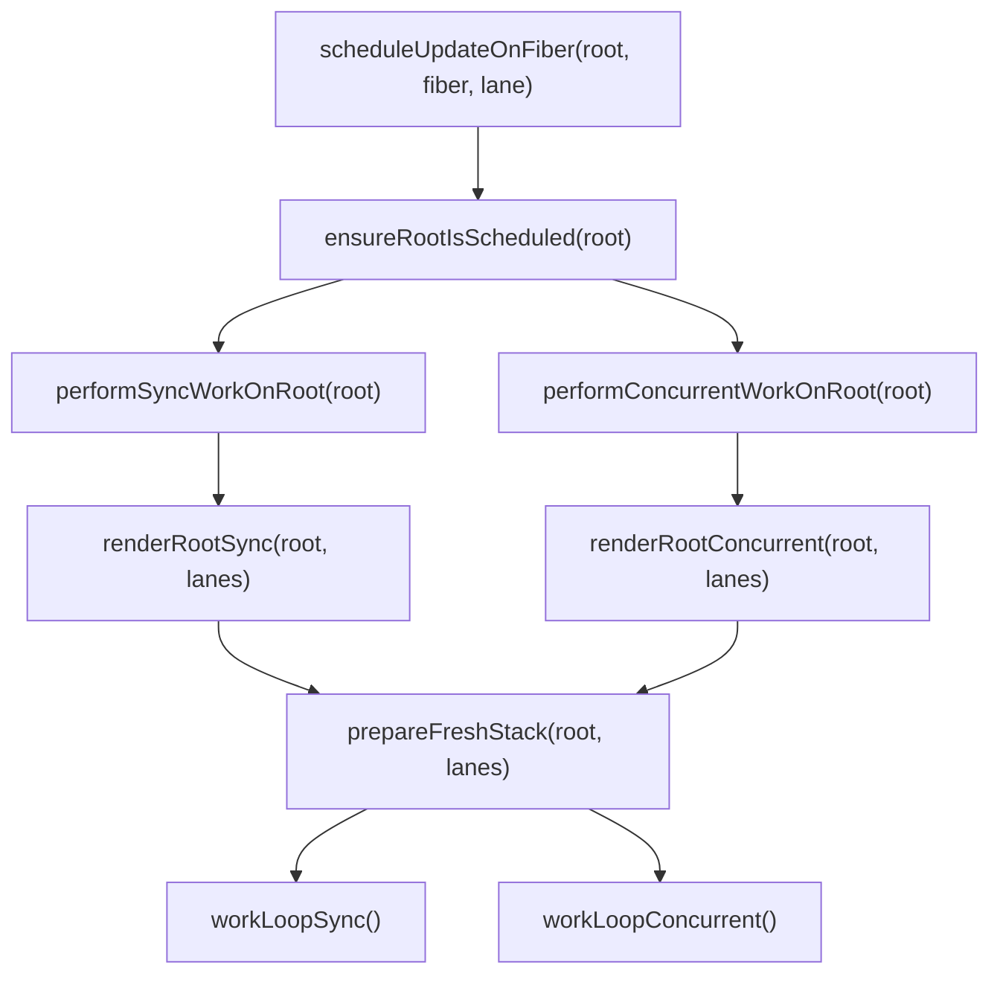
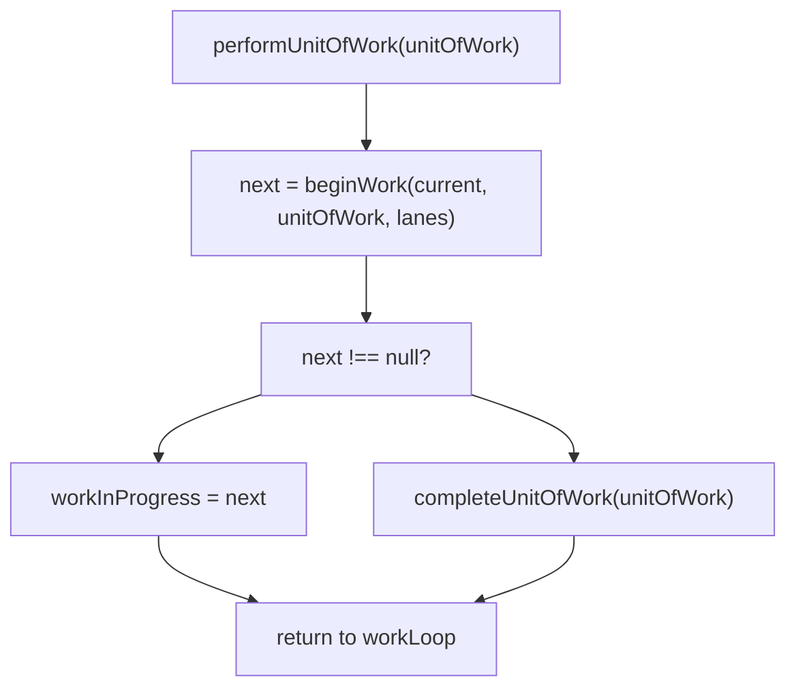
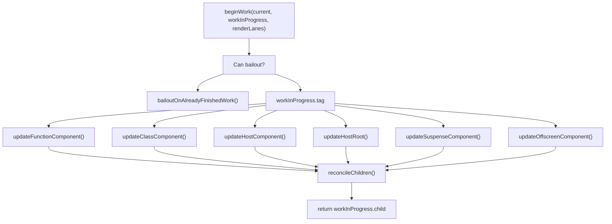
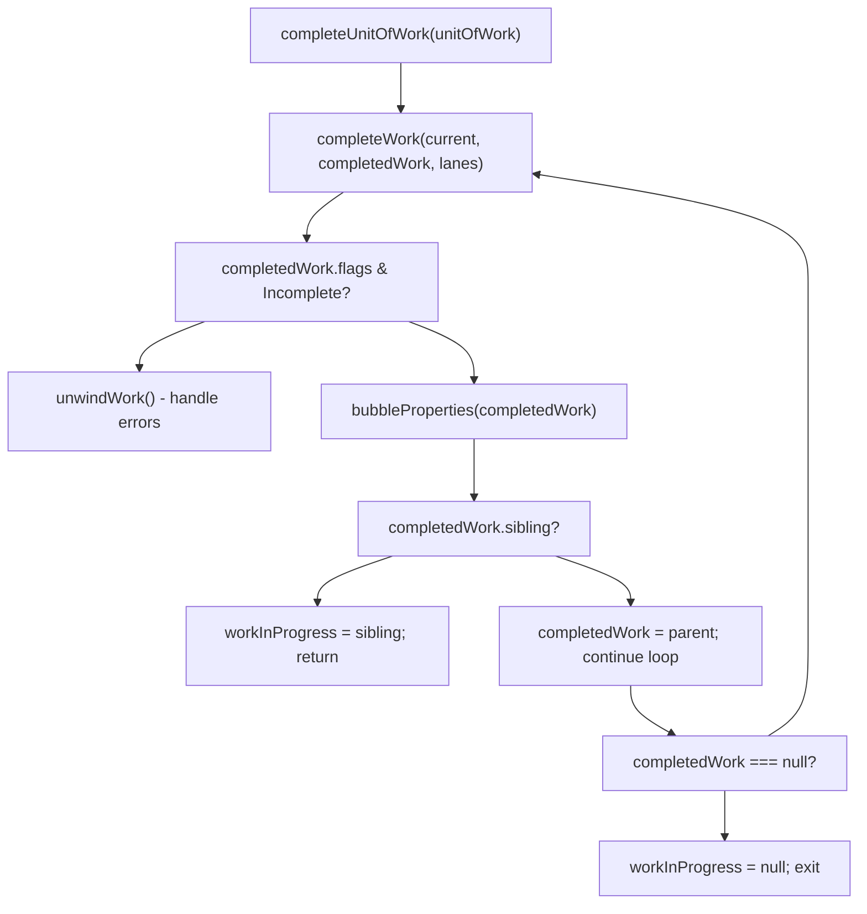
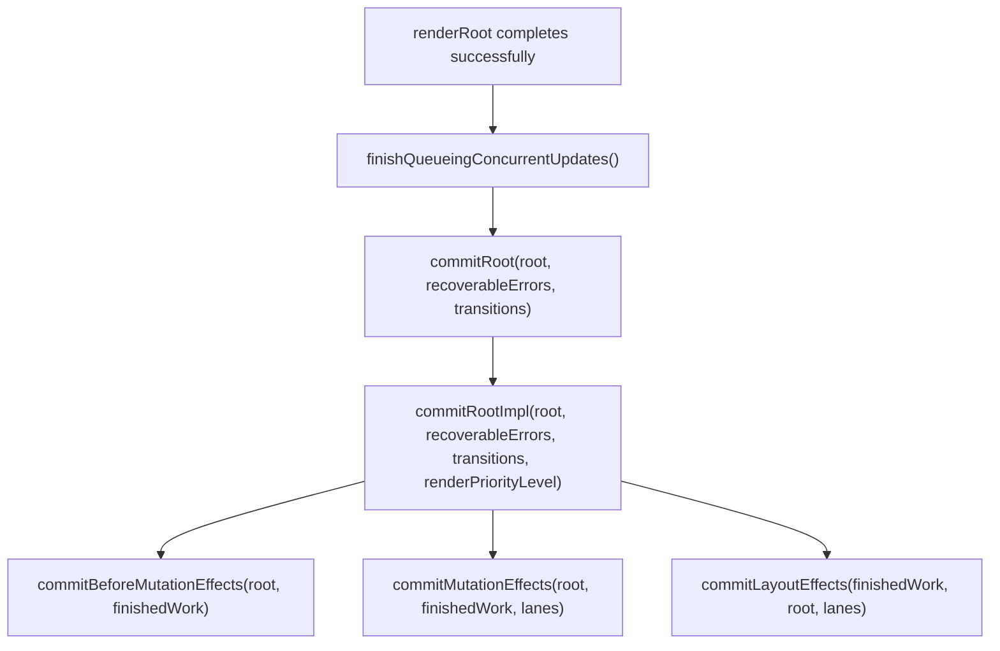
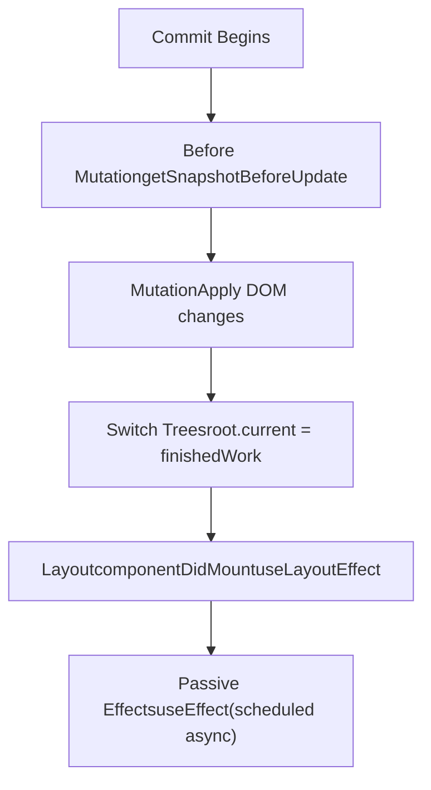
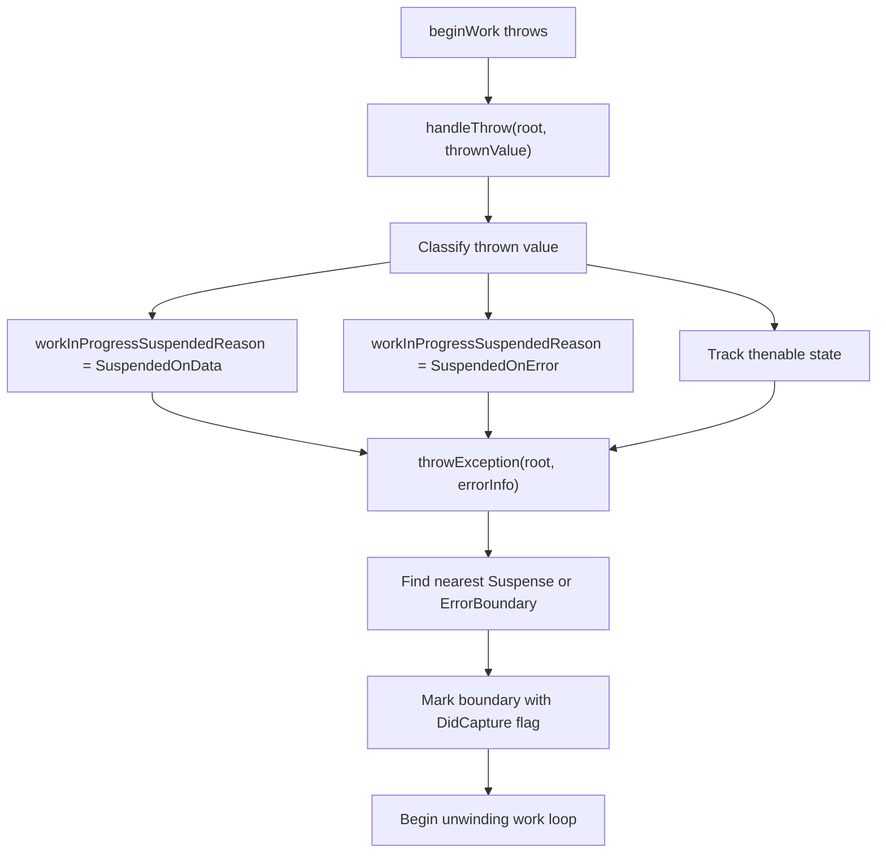
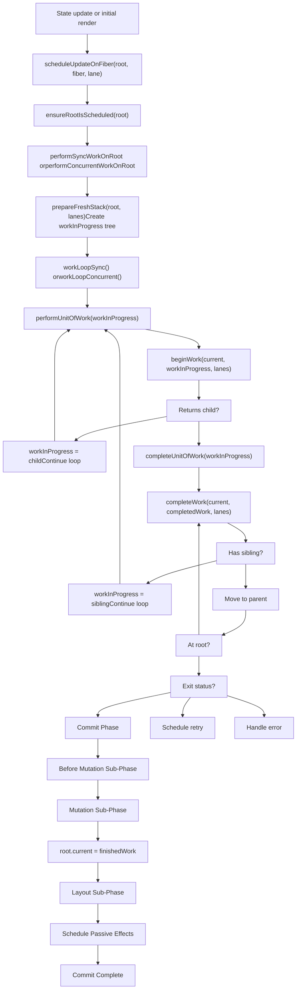

# Work Loop and Rendering Phases

Relevant source files

-   [packages/react-client/src/ReactFlightPerformanceTrack.js](https://github.com/facebook/react/blob/65eec428/packages/react-client/src/ReactFlightPerformanceTrack.js)
-   [packages/react-debug-tools/src/ReactDebugHooks.js](https://github.com/facebook/react/blob/65eec428/packages/react-debug-tools/src/ReactDebugHooks.js)
-   [packages/react-debug-tools/src/\_\_tests\_\_/ReactHooksInspection-test.js](https://github.com/facebook/react/blob/65eec428/packages/react-debug-tools/src/__tests__/ReactHooksInspection-test.js)
-   [packages/react-debug-tools/src/\_\_tests\_\_/ReactHooksInspectionIntegration-test.js](https://github.com/facebook/react/blob/65eec428/packages/react-debug-tools/src/__tests__/ReactHooksInspectionIntegration-test.js)
-   [packages/react-debug-tools/src/\_\_tests\_\_/ReactHooksInspectionIntegrationDOM-test.js](https://github.com/facebook/react/blob/65eec428/packages/react-debug-tools/src/__tests__/ReactHooksInspectionIntegrationDOM-test.js)
-   [packages/react-devtools-shell/src/app/InspectableElements/CustomHooks.js](https://github.com/facebook/react/blob/65eec428/packages/react-devtools-shell/src/app/InspectableElements/CustomHooks.js)
-   [packages/react-devtools-timeline/src/content-views/utils/moduleFilters.js](https://github.com/facebook/react/blob/65eec428/packages/react-devtools-timeline/src/content-views/utils/moduleFilters.js)
-   [packages/react-dom/src/\_\_tests\_\_/ReactDOMFiberAsync-test.js](https://github.com/facebook/react/blob/65eec428/packages/react-dom/src/__tests__/ReactDOMFiberAsync-test.js)
-   [packages/react-dom/src/\_\_tests\_\_/ReactDOMNativeEventHeuristic-test.js](https://github.com/facebook/react/blob/65eec428/packages/react-dom/src/__tests__/ReactDOMNativeEventHeuristic-test.js)
-   [packages/react-dom/src/events/plugins/\_\_tests\_\_/ChangeEventPlugin-test.js](https://github.com/facebook/react/blob/65eec428/packages/react-dom/src/events/plugins/__tests__/ChangeEventPlugin-test.js)
-   [packages/react-dom/src/events/plugins/\_\_tests\_\_/SimpleEventPlugin-test.js](https://github.com/facebook/react/blob/65eec428/packages/react-dom/src/events/plugins/__tests__/SimpleEventPlugin-test.js)
-   [packages/react-reconciler/src/ReactFiber.js](https://github.com/facebook/react/blob/65eec428/packages/react-reconciler/src/ReactFiber.js)
-   [packages/react-reconciler/src/ReactFiberBeginWork.js](https://github.com/facebook/react/blob/65eec428/packages/react-reconciler/src/ReactFiberBeginWork.js)
-   [packages/react-reconciler/src/ReactFiberClassComponent.js](https://github.com/facebook/react/blob/65eec428/packages/react-reconciler/src/ReactFiberClassComponent.js)
-   [packages/react-reconciler/src/ReactFiberCommitWork.js](https://github.com/facebook/react/blob/65eec428/packages/react-reconciler/src/ReactFiberCommitWork.js)
-   [packages/react-reconciler/src/ReactFiberCompleteWork.js](https://github.com/facebook/react/blob/65eec428/packages/react-reconciler/src/ReactFiberCompleteWork.js)
-   [packages/react-reconciler/src/ReactFiberHooks.js](https://github.com/facebook/react/blob/65eec428/packages/react-reconciler/src/ReactFiberHooks.js)
-   [packages/react-reconciler/src/ReactFiberLane.js](https://github.com/facebook/react/blob/65eec428/packages/react-reconciler/src/ReactFiberLane.js)
-   [packages/react-reconciler/src/ReactFiberOffscreenComponent.js](https://github.com/facebook/react/blob/65eec428/packages/react-reconciler/src/ReactFiberOffscreenComponent.js)
-   [packages/react-reconciler/src/ReactFiberPerformanceTrack.js](https://github.com/facebook/react/blob/65eec428/packages/react-reconciler/src/ReactFiberPerformanceTrack.js)
-   [packages/react-reconciler/src/ReactFiberRootScheduler.js](https://github.com/facebook/react/blob/65eec428/packages/react-reconciler/src/ReactFiberRootScheduler.js)
-   [packages/react-reconciler/src/ReactFiberSuspenseComponent.js](https://github.com/facebook/react/blob/65eec428/packages/react-reconciler/src/ReactFiberSuspenseComponent.js)
-   [packages/react-reconciler/src/ReactFiberUnwindWork.js](https://github.com/facebook/react/blob/65eec428/packages/react-reconciler/src/ReactFiberUnwindWork.js)
-   [packages/react-reconciler/src/ReactFiberWorkLoop.js](https://github.com/facebook/react/blob/65eec428/packages/react-reconciler/src/ReactFiberWorkLoop.js)
-   [packages/react-reconciler/src/ReactInternalTypes.js](https://github.com/facebook/react/blob/65eec428/packages/react-reconciler/src/ReactInternalTypes.js)
-   [packages/react-reconciler/src/ReactProfilerTimer.js](https://github.com/facebook/react/blob/65eec428/packages/react-reconciler/src/ReactProfilerTimer.js)
-   [packages/react-reconciler/src/\_\_tests\_\_/ReactDeferredValue-test.js](https://github.com/facebook/react/blob/65eec428/packages/react-reconciler/src/__tests__/ReactDeferredValue-test.js)
-   [packages/react-reconciler/src/\_\_tests\_\_/ReactHooks-test.internal.js](https://github.com/facebook/react/blob/65eec428/packages/react-reconciler/src/__tests__/ReactHooks-test.internal.js)
-   [packages/react-reconciler/src/\_\_tests\_\_/ReactHooksWithNoopRenderer-test.js](https://github.com/facebook/react/blob/65eec428/packages/react-reconciler/src/__tests__/ReactHooksWithNoopRenderer-test.js)
-   [packages/react-reconciler/src/\_\_tests\_\_/ReactLazy-test.internal.js](https://github.com/facebook/react/blob/65eec428/packages/react-reconciler/src/__tests__/ReactLazy-test.internal.js)
-   [packages/react-reconciler/src/\_\_tests\_\_/ReactPerformanceTrack-test.js](https://github.com/facebook/react/blob/65eec428/packages/react-reconciler/src/__tests__/ReactPerformanceTrack-test.js)
-   [packages/react-reconciler/src/\_\_tests\_\_/ReactSiblingPrerendering-test.js](https://github.com/facebook/react/blob/65eec428/packages/react-reconciler/src/__tests__/ReactSiblingPrerendering-test.js)
-   [packages/react-reconciler/src/\_\_tests\_\_/ReactSuspense-test.internal.js](https://github.com/facebook/react/blob/65eec428/packages/react-reconciler/src/__tests__/ReactSuspense-test.internal.js)
-   [packages/react-reconciler/src/\_\_tests\_\_/ReactSuspensePlaceholder-test.internal.js](https://github.com/facebook/react/blob/65eec428/packages/react-reconciler/src/__tests__/ReactSuspensePlaceholder-test.internal.js)
-   [packages/react-reconciler/src/\_\_tests\_\_/ReactSuspenseWithNoopRenderer-test.js](https://github.com/facebook/react/blob/65eec428/packages/react-reconciler/src/__tests__/ReactSuspenseWithNoopRenderer-test.js)
-   [packages/react-reconciler/src/\_\_tests\_\_/ReactSuspenseyCommitPhase-test.js](https://github.com/facebook/react/blob/65eec428/packages/react-reconciler/src/__tests__/ReactSuspenseyCommitPhase-test.js)
-   [packages/react-server/src/ReactFizzHooks.js](https://github.com/facebook/react/blob/65eec428/packages/react-server/src/ReactFizzHooks.js)
-   [packages/react-server/src/ReactFlightAsyncSequence.js](https://github.com/facebook/react/blob/65eec428/packages/react-server/src/ReactFlightAsyncSequence.js)
-   [packages/react-server/src/ReactFlightServerConfigDebugNode.js](https://github.com/facebook/react/blob/65eec428/packages/react-server/src/ReactFlightServerConfigDebugNode.js)
-   [packages/react-server/src/ReactFlightServerConfigDebugNoop.js](https://github.com/facebook/react/blob/65eec428/packages/react-server/src/ReactFlightServerConfigDebugNoop.js)
-   [packages/react-server/src/ReactFlightStackConfigV8.js](https://github.com/facebook/react/blob/65eec428/packages/react-server/src/ReactFlightStackConfigV8.js)
-   [packages/react-server/src/\_\_tests\_\_/ReactFlightAsyncDebugInfo-test.js](https://github.com/facebook/react/blob/65eec428/packages/react-server/src/__tests__/ReactFlightAsyncDebugInfo-test.js)
-   [packages/react/src/ReactHooks.js](https://github.com/facebook/react/blob/65eec428/packages/react/src/ReactHooks.js)
-   [packages/react/src/ReactLazy.js](https://github.com/facebook/react/blob/65eec428/packages/react/src/ReactLazy.js)
-   [packages/react/src/\_\_tests\_\_/ReactProfiler-test.internal.js](https://github.com/facebook/react/blob/65eec428/packages/react/src/__tests__/ReactProfiler-test.internal.js)
-   [packages/shared/ReactPerformanceTrackProperties.js](https://github.com/facebook/react/blob/65eec428/packages/shared/ReactPerformanceTrackProperties.js)
-   [packages/shared/ReactSymbols.js](https://github.com/facebook/react/blob/65eec428/packages/shared/ReactSymbols.js)

This document describes the reconciler's work loop execution and the three phases of processing the Fiber tree: **begin work**, **complete work**, and **commit work**. The work loop is the core mechanism that processes fibers, determines what changed, and applies updates to the host environment.

For information about the Fiber data structure itself, see [Fiber Architecture and Data Structures](/facebook/react/4.1-fiber-architecture-and-data-structures). For details on scheduling and priority management, see [Lane-Based Scheduling and Priorities](/facebook/react/4.4-lane-based-scheduling-and-priorities). For the commit phase effects system, see [React Hooks System](/facebook/react/4.3-react-hooks-system).

## Overview

The work loop is implemented in [packages/react-reconciler/src/ReactFiberWorkLoop.js](https://github.com/facebook/react/blob/65eec428/packages/react-reconciler/src/ReactFiberWorkLoop.js) It orchestrates two distinct phases:

| Phase | Purpose | Can be interrupted? |
| --- | --- | --- |
| **Render Phase** | Traverse the Fiber tree, compute changes, and mark effects | Yes (in concurrent mode) |
| **Commit Phase** | Apply computed changes to the host environment | No (synchronous) |

The render phase processes fibers through two sub-phases: `beginWork` and `completeWork`. The commit phase executes through three sub-phases: `commitBeforeMutationEffects`, `commitMutationEffects`, and `commitLayoutEffects`.

**Sources:** [packages/react-reconciler/src/ReactFiberWorkLoop.js1-3000](https://github.com/facebook/react/blob/65eec428/packages/react-reconciler/src/ReactFiberWorkLoop.js#L1-L3000)

## Work Loop Execution

### Entry Points and Root Processing

Work on a root begins through one of two main entry points:

```
performSyncWorkOnRoot(root)      // Synchronous, uninterruptible
performConcurrentWorkOnRoot(root) // Concurrent, can yield
```
Both functions follow this pattern:

1.  Prepare the work-in-progress root and lanes
2.  Enter the render phase (`renderRootSync` or `renderRootConcurrent`)
3.  If render completes successfully, enter commit phase (`commitRoot`)

**Render Phase Entry:**


**Sources:** [packages/react-reconciler/src/ReactFiberWorkLoop.js916-1100](https://github.com/facebook/react/blob/65eec428/packages/react-reconciler/src/ReactFiberWorkLoop.js#L916-L1100) [packages/react-reconciler/src/ReactFiberWorkLoop.js1102-1300](https://github.com/facebook/react/blob/65eec428/packages/react-reconciler/src/ReactFiberWorkLoop.js#L1102-L1300)

### The Work Loops

The actual work loop is remarkably simple:

```
// Synchronous mode - never yields
function workLoopSync() {
  while (workInProgress !== null) {
    performUnitOfWork(workInProgress);
  }
}

// Concurrent mode - yields when shouldYield() returns true
function workLoopConcurrent() {
  while (workInProgress !== null && !shouldYield()) {
    performUnitOfWork(workInProgress);
  }
}
```
The `workInProgress` variable points to the current Fiber being processed. `performUnitOfWork` processes one unit of work and advances to the next fiber.

**Sources:** [packages/react-reconciler/src/ReactFiberWorkLoop.js1801-1812](https://github.com/facebook/react/blob/65eec428/packages/react-reconciler/src/ReactFiberWorkLoop.js#L1801-L1812)

### Work Loop State Variables

The work loop maintains several module-level variables that track the current state:

| Variable | Type | Purpose |
| --- | --- | --- |
| `workInProgressRoot` | `FiberRoot | null` | The root currently being worked on |
| `workInProgress` | `Fiber | null` | The fiber currently being processed |
| `workInProgressRootRenderLanes` | `Lanes` | The lanes being rendered |
| `workInProgressSuspendedReason` | `SuspendedReason` | Why work is suspended (if applicable) |
| `workInProgressRootExitStatus` | `RootExitStatus` | Final status after render (Completed, Errored, Suspended, etc.) |

**Sources:** [packages/react-reconciler/src/ReactFiberWorkLoop.js423-496](https://github.com/facebook/react/blob/65eec428/packages/react-reconciler/src/ReactFiberWorkLoop.js#L423-L496)

## Render Phase: Begin Work and Complete Work

The render phase processes the Fiber tree in a depth-first traversal, calling `beginWork` on the way down and `completeWork` on the way up.

### performUnitOfWork Flow


**Sources:** [packages/react-reconciler/src/ReactFiberWorkLoop.js1814-1848](https://github.com/facebook/react/blob/65eec428/packages/react-reconciler/src/ReactFiberWorkLoop.js#L1814-L1848)

### Begin Work Phase

The `beginWork` function in [packages/react-reconciler/src/ReactFiberBeginWork.js](https://github.com/facebook/react/blob/65eec428/packages/react-reconciler/src/ReactFiberBeginWork.js) is responsible for:

1.  Determining if the fiber's work can be skipped (bailout optimization)
2.  Creating or updating child fibers based on the fiber's tag
3.  Returning the first child fiber to process next

**Begin Work Dispatch by Fiber Tag:**


**Key Begin Work Functions:**

-   `updateFunctionComponent` - Calls `renderWithHooks` to execute the function body
-   `updateClassComponent` - Processes class lifecycle methods and state updates
-   `updateHostComponent` - Processes DOM elements (div, span, etc.)
-   `reconcileChildren` - Reconciles the children by diffing current and new children

**Sources:** [packages/react-reconciler/src/ReactFiberBeginWork.js3746-4016](https://github.com/facebook/react/blob/65eec428/packages/react-reconciler/src/ReactFiberBeginWork.js#L3746-L4016) [packages/react-reconciler/src/ReactFiberBeginWork.js340-371](https://github.com/facebook/react/blob/65eec428/packages/react-reconciler/src/ReactFiberBeginWork.js#L340-L371)

### Complete Work Phase

When `beginWork` returns `null` (no more children to process), `completeUnitOfWork` is called. This function:

1.  Calls `completeWork` on the current fiber
2.  Collects subtree flags by bubbling them up
3.  Moves to the next sibling or returns to the parent

**Complete Unit of Work Flow:**


The `completeWork` function in [packages/react-reconciler/src/ReactFiberCompleteWork.js](https://github.com/facebook/react/blob/65eec428/packages/react-reconciler/src/ReactFiberCompleteWork.js) handles:

-   Creating host instances (DOM nodes) for new HostComponents
-   Updating props that changed
-   Marking Update flags when work is needed
-   Handling hydration for server-rendered content

**Key Complete Work Responsibilities:**

| Fiber Tag | Complete Work Action |
| --- | --- |
| HostComponent | Create DOM node, append children, finalize props |
| HostText | Create text node |
| HostRoot | Finalize container if using persistence mode |
| SuspenseComponent | Determine if showing fallback or primary content |
| OffscreenComponent | Handle visibility transitions |

**Sources:** [packages/react-reconciler/src/ReactFiberWorkLoop.js1850-1980](https://github.com/facebook/react/blob/65eec428/packages/react-reconciler/src/ReactFiberWorkLoop.js#L1850-L1980) [packages/react-reconciler/src/ReactFiberCompleteWork.js845-1400](https://github.com/facebook/react/blob/65eec428/packages/react-reconciler/src/ReactFiberCompleteWork.js#L845-L1400)

### Flags and Subtree Flags

During the render phase, fibers are marked with **flags** indicating what effects need to be applied during commit. The `bubbleProperties` function propagates these flags up the tree:

```
function bubbleProperties(completedWork) {
  let subtreeFlags = NoFlags;
  let child = completedWork.child;

  // Collect flags from all children
  while (child !== null) {
    subtreeFlags |= child.subtreeFlags;
    subtreeFlags |= child.flags;
    child = child.sibling;
  }

  completedWork.subtreeFlags = subtreeFlags;
}
```
This allows ancestor fibers to know if any descendant has effects, enabling efficient traversal during commit.

**Sources:** [packages/react-reconciler/src/ReactFiberCompleteWork.js662-724](https://github.com/facebook/react/blob/65eec428/packages/react-reconciler/src/ReactFiberCompleteWork.js#L662-L724)

## Commit Phase

Once the render phase completes successfully (`workInProgressRootExitStatus === RootCompleted`), the commit phase begins. The commit phase is **synchronous and uninterruptible** - it must complete once started.

### Commit Root Entry


**Sources:** [packages/react-reconciler/src/ReactFiberWorkLoop.js2210-2350](https://github.com/facebook/react/blob/65eec428/packages/react-reconciler/src/ReactFiberWorkLoop.js#L2210-L2350)

### Commit Sub-Phases

The commit phase executes in three sequential sub-phases:

#### 1\. Before Mutation Phase

**Purpose:** Run effects that read the DOM before mutations occur

-   Calls `getSnapshotBeforeUpdate` on class components
-   Handles focus management for Suspense boundaries
-   Schedules passive effects (useEffect) for later execution
-   Tracks ViewTransition elements (if enabled)

**Key Function:** `commitBeforeMutationEffects` in [packages/react-reconciler/src/ReactFiberCommitWork.js344-363](https://github.com/facebook/react/blob/65eec428/packages/react-reconciler/src/ReactFiberCommitWork.js#L344-L363)

#### 2\. Mutation Phase

**Purpose:** Apply all DOM mutations (insertions, updates, deletions)

-   Insert new nodes via `commitPlacement`
-   Update existing nodes via `commitUpdate`
-   Remove deleted nodes via `commitDeletion`
-   Update refs
-   Reset text content where needed

**Key Functions:**

-   `commitMutationEffects` - Main entry point [packages/react-reconciler/src/ReactFiberCommitWork.js1817-1900](https://github.com/facebook/react/blob/65eec428/packages/react-reconciler/src/ReactFiberCommitWork.js#L1817-L1900)
-   `commitPlacement` - Insert/move nodes [packages/react-reconciler/src/ReactFiberCommitHostEffects.js250-485](https://github.com/facebook/react/blob/65eec428/packages/react-reconciler/src/ReactFiberCommitHostEffects.js#L250-L485)
-   `commitUpdate` - Update props [packages/react-reconciler/src/ReactFiberCommitHostEffects.js132-150](https://github.com/facebook/react/blob/65eec428/packages/react-reconciler/src/ReactFiberCommitHostEffects.js#L132-L150)

After mutations complete, `root.current` is switched from the old tree to the new tree:

```
root.current = finishedWork;
```
This is when the work-in-progress tree becomes the current tree.

#### 3\. Layout Phase

**Purpose:** Run effects that need to read the updated DOM layout

-   Calls `componentDidMount` / `componentDidUpdate` on class components
-   Runs layout effects (`useLayoutEffect`)
-   Updates refs to point to new instances
-   Collects timing information for Profiler components

**Key Function:** `commitLayoutEffects` in [packages/react-reconciler/src/ReactFiberCommitWork.js594-800](https://github.com/facebook/react/blob/65eec428/packages/react-reconciler/src/ReactFiberCommitWork.js#L594-L800)

**Commit Phase Timeline:**


**Sources:** [packages/react-reconciler/src/ReactFiberWorkLoop.js2510-2900](https://github.com/facebook/react/blob/65eec428/packages/react-reconciler/src/ReactFiberWorkLoop.js#L2510-L2900)

### Passive Effects (useEffect)

Unlike layout effects which run synchronously during commit, passive effects (from `useEffect`) are scheduled to run **after** the commit phase completes. They run in a separate task:

1.  During before mutation: effects are detected and scheduled
2.  After layout phase completes: `flushPassiveEffects()` is scheduled
3.  Passive effects run: cleanup functions first, then create functions

**Sources:** [packages/react-reconciler/src/ReactFiberCommitWork.js2950-3200](https://github.com/facebook/react/blob/65eec428/packages/react-reconciler/src/ReactFiberCommitWork.js#L2950-L3200)

## Error Handling and Suspension

### Suspended Render

If during `beginWork` a component throws a promise (Suspense) or encounters an error, the work loop enters a suspended state:


The work loop then unwinds the stack until it reaches a boundary that can handle the suspension/error, then attempts to re-render from that point.

**Sources:** [packages/react-reconciler/src/ReactFiberWorkLoop.js1610-1800](https://github.com/facebook/react/blob/65eec428/packages/react-reconciler/src/ReactFiberWorkLoop.js#L1610-L1800) [packages/react-reconciler/src/ReactFiberThrow.js200-600](https://github.com/facebook/react/blob/65eec428/packages/react-reconciler/src/ReactFiberThrow.js#L200-L600)

### Unwind Work

When unwinding due to an error or suspension, `unwindWork` is called on each fiber to clean up:

-   Pop context stacks
-   Reset hydration state
-   Clear side effects that won't be committed

**Sources:** [packages/react-reconciler/src/ReactFiberUnwindWork.js66-200](https://github.com/facebook/react/blob/65eec428/packages/react-reconciler/src/ReactFiberUnwindWork.js#L66-L200)

## Complete Work Loop Diagram


**Sources:** [packages/react-reconciler/src/ReactFiberWorkLoop.js400-3000](https://github.com/facebook/react/blob/65eec428/packages/react-reconciler/src/ReactFiberWorkLoop.js#L400-L3000) [packages/react-reconciler/src/ReactFiberBeginWork.js1-4000](https://github.com/facebook/react/blob/65eec428/packages/react-reconciler/src/ReactFiberBeginWork.js#L1-L4000) [packages/react-reconciler/src/ReactFiberCompleteWork.js1-1400](https://github.com/facebook/react/blob/65eec428/packages/react-reconciler/src/ReactFiberCompleteWork.js#L1-L1400) [packages/react-reconciler/src/ReactFiberCommitWork.js1-3500](https://github.com/facebook/react/blob/65eec428/packages/react-reconciler/src/ReactFiberCommitWork.js#L1-L3500)
