# React Hooks System

Relevant source files

-   [packages/react-client/src/ReactFlightPerformanceTrack.js](https://github.com/facebook/react/blob/65eec428/packages/react-client/src/ReactFlightPerformanceTrack.js)
-   [packages/react-debug-tools/src/ReactDebugHooks.js](https://github.com/facebook/react/blob/65eec428/packages/react-debug-tools/src/ReactDebugHooks.js)
-   [packages/react-debug-tools/src/\_\_tests\_\_/ReactHooksInspection-test.js](https://github.com/facebook/react/blob/65eec428/packages/react-debug-tools/src/__tests__/ReactHooksInspection-test.js)
-   [packages/react-debug-tools/src/\_\_tests\_\_/ReactHooksInspectionIntegration-test.js](https://github.com/facebook/react/blob/65eec428/packages/react-debug-tools/src/__tests__/ReactHooksInspectionIntegration-test.js)
-   [packages/react-debug-tools/src/\_\_tests\_\_/ReactHooksInspectionIntegrationDOM-test.js](https://github.com/facebook/react/blob/65eec428/packages/react-debug-tools/src/__tests__/ReactHooksInspectionIntegrationDOM-test.js)
-   [packages/react-devtools-shell/src/app/InspectableElements/CustomHooks.js](https://github.com/facebook/react/blob/65eec428/packages/react-devtools-shell/src/app/InspectableElements/CustomHooks.js)
-   [packages/react-devtools-timeline/src/content-views/utils/moduleFilters.js](https://github.com/facebook/react/blob/65eec428/packages/react-devtools-timeline/src/content-views/utils/moduleFilters.js)
-   [packages/react-dom/src/\_\_tests\_\_/ReactDOMFiberAsync-test.js](https://github.com/facebook/react/blob/65eec428/packages/react-dom/src/__tests__/ReactDOMFiberAsync-test.js)
-   [packages/react-dom/src/\_\_tests\_\_/ReactDOMNativeEventHeuristic-test.js](https://github.com/facebook/react/blob/65eec428/packages/react-dom/src/__tests__/ReactDOMNativeEventHeuristic-test.js)
-   [packages/react-dom/src/events/plugins/\_\_tests\_\_/ChangeEventPlugin-test.js](https://github.com/facebook/react/blob/65eec428/packages/react-dom/src/events/plugins/__tests__/ChangeEventPlugin-test.js)
-   [packages/react-dom/src/events/plugins/\_\_tests\_\_/SimpleEventPlugin-test.js](https://github.com/facebook/react/blob/65eec428/packages/react-dom/src/events/plugins/__tests__/SimpleEventPlugin-test.js)
-   [packages/react-reconciler/src/ReactFiber.js](https://github.com/facebook/react/blob/65eec428/packages/react-reconciler/src/ReactFiber.js)
-   [packages/react-reconciler/src/ReactFiberBeginWork.js](https://github.com/facebook/react/blob/65eec428/packages/react-reconciler/src/ReactFiberBeginWork.js)
-   [packages/react-reconciler/src/ReactFiberClassComponent.js](https://github.com/facebook/react/blob/65eec428/packages/react-reconciler/src/ReactFiberClassComponent.js)
-   [packages/react-reconciler/src/ReactFiberCommitWork.js](https://github.com/facebook/react/blob/65eec428/packages/react-reconciler/src/ReactFiberCommitWork.js)
-   [packages/react-reconciler/src/ReactFiberCompleteWork.js](https://github.com/facebook/react/blob/65eec428/packages/react-reconciler/src/ReactFiberCompleteWork.js)
-   [packages/react-reconciler/src/ReactFiberHooks.js](https://github.com/facebook/react/blob/65eec428/packages/react-reconciler/src/ReactFiberHooks.js)
-   [packages/react-reconciler/src/ReactFiberLane.js](https://github.com/facebook/react/blob/65eec428/packages/react-reconciler/src/ReactFiberLane.js)
-   [packages/react-reconciler/src/ReactFiberOffscreenComponent.js](https://github.com/facebook/react/blob/65eec428/packages/react-reconciler/src/ReactFiberOffscreenComponent.js)
-   [packages/react-reconciler/src/ReactFiberPerformanceTrack.js](https://github.com/facebook/react/blob/65eec428/packages/react-reconciler/src/ReactFiberPerformanceTrack.js)
-   [packages/react-reconciler/src/ReactFiberRootScheduler.js](https://github.com/facebook/react/blob/65eec428/packages/react-reconciler/src/ReactFiberRootScheduler.js)
-   [packages/react-reconciler/src/ReactFiberSuspenseComponent.js](https://github.com/facebook/react/blob/65eec428/packages/react-reconciler/src/ReactFiberSuspenseComponent.js)
-   [packages/react-reconciler/src/ReactFiberUnwindWork.js](https://github.com/facebook/react/blob/65eec428/packages/react-reconciler/src/ReactFiberUnwindWork.js)
-   [packages/react-reconciler/src/ReactFiberWorkLoop.js](https://github.com/facebook/react/blob/65eec428/packages/react-reconciler/src/ReactFiberWorkLoop.js)
-   [packages/react-reconciler/src/ReactInternalTypes.js](https://github.com/facebook/react/blob/65eec428/packages/react-reconciler/src/ReactInternalTypes.js)
-   [packages/react-reconciler/src/ReactProfilerTimer.js](https://github.com/facebook/react/blob/65eec428/packages/react-reconciler/src/ReactProfilerTimer.js)
-   [packages/react-reconciler/src/\_\_tests\_\_/ReactDeferredValue-test.js](https://github.com/facebook/react/blob/65eec428/packages/react-reconciler/src/__tests__/ReactDeferredValue-test.js)
-   [packages/react-reconciler/src/\_\_tests\_\_/ReactHooks-test.internal.js](https://github.com/facebook/react/blob/65eec428/packages/react-reconciler/src/__tests__/ReactHooks-test.internal.js)
-   [packages/react-reconciler/src/\_\_tests\_\_/ReactHooksWithNoopRenderer-test.js](https://github.com/facebook/react/blob/65eec428/packages/react-reconciler/src/__tests__/ReactHooksWithNoopRenderer-test.js)
-   [packages/react-reconciler/src/\_\_tests\_\_/ReactLazy-test.internal.js](https://github.com/facebook/react/blob/65eec428/packages/react-reconciler/src/__tests__/ReactLazy-test.internal.js)
-   [packages/react-reconciler/src/\_\_tests\_\_/ReactPerformanceTrack-test.js](https://github.com/facebook/react/blob/65eec428/packages/react-reconciler/src/__tests__/ReactPerformanceTrack-test.js)
-   [packages/react-reconciler/src/\_\_tests\_\_/ReactSiblingPrerendering-test.js](https://github.com/facebook/react/blob/65eec428/packages/react-reconciler/src/__tests__/ReactSiblingPrerendering-test.js)
-   [packages/react-reconciler/src/\_\_tests\_\_/ReactSuspense-test.internal.js](https://github.com/facebook/react/blob/65eec428/packages/react-reconciler/src/__tests__/ReactSuspense-test.internal.js)
-   [packages/react-reconciler/src/\_\_tests\_\_/ReactSuspensePlaceholder-test.internal.js](https://github.com/facebook/react/blob/65eec428/packages/react-reconciler/src/__tests__/ReactSuspensePlaceholder-test.internal.js)
-   [packages/react-reconciler/src/\_\_tests\_\_/ReactSuspenseWithNoopRenderer-test.js](https://github.com/facebook/react/blob/65eec428/packages/react-reconciler/src/__tests__/ReactSuspenseWithNoopRenderer-test.js)
-   [packages/react-reconciler/src/\_\_tests\_\_/ReactSuspenseyCommitPhase-test.js](https://github.com/facebook/react/blob/65eec428/packages/react-reconciler/src/__tests__/ReactSuspenseyCommitPhase-test.js)
-   [packages/react-server/src/ReactFizzHooks.js](https://github.com/facebook/react/blob/65eec428/packages/react-server/src/ReactFizzHooks.js)
-   [packages/react-server/src/ReactFlightAsyncSequence.js](https://github.com/facebook/react/blob/65eec428/packages/react-server/src/ReactFlightAsyncSequence.js)
-   [packages/react-server/src/ReactFlightServerConfigDebugNode.js](https://github.com/facebook/react/blob/65eec428/packages/react-server/src/ReactFlightServerConfigDebugNode.js)
-   [packages/react-server/src/ReactFlightServerConfigDebugNoop.js](https://github.com/facebook/react/blob/65eec428/packages/react-server/src/ReactFlightServerConfigDebugNoop.js)
-   [packages/react-server/src/ReactFlightStackConfigV8.js](https://github.com/facebook/react/blob/65eec428/packages/react-server/src/ReactFlightStackConfigV8.js)
-   [packages/react-server/src/\_\_tests\_\_/ReactFlightAsyncDebugInfo-test.js](https://github.com/facebook/react/blob/65eec428/packages/react-server/src/__tests__/ReactFlightAsyncDebugInfo-test.js)
-   [packages/react/src/ReactHooks.js](https://github.com/facebook/react/blob/65eec428/packages/react/src/ReactHooks.js)
-   [packages/react/src/ReactLazy.js](https://github.com/facebook/react/blob/65eec428/packages/react/src/ReactLazy.js)
-   [packages/react/src/\_\_tests\_\_/ReactProfiler-test.internal.js](https://github.com/facebook/react/blob/65eec428/packages/react/src/__tests__/ReactProfiler-test.internal.js)
-   [packages/shared/ReactPerformanceTrackProperties.js](https://github.com/facebook/react/blob/65eec428/packages/shared/ReactPerformanceTrackProperties.js)
-   [packages/shared/ReactSymbols.js](https://github.com/facebook/react/blob/65eec428/packages/shared/ReactSymbols.js)

## Purpose and Scope

This document describes the React Hooks System implementation, including the dispatcher pattern, hook data structures, effect execution lifecycle, and debugging capabilities. Hooks enable function components to use state and lifecycle features without writing classes.

For information about the overall reconciliation process that invokes hooks, see [Fiber Architecture and Work Loop](/facebook/react/4.1-fiber-architecture-and-data-structures). For server-side rendering specifics, see [React Fizz (Streaming SSR)](/facebook/react/5.1-react-fizz-(streaming-ssr)). For static analysis of hook usage, see [ESLint Plugin for React Hooks](/facebook/react/7.2-devtools-distribution-and-integration).

## Architecture Overview

The hooks system uses a **dispatcher pattern** to provide different implementations based on component lifecycle phase. During render, hooks resolve to mount, update, or rerender dispatchers. Hook state is stored as a linked list on `fiber.memoizedState`, while effects form a circular list on `fiber.updateQueue.lastEffect`.

**Hooks System Architecture**

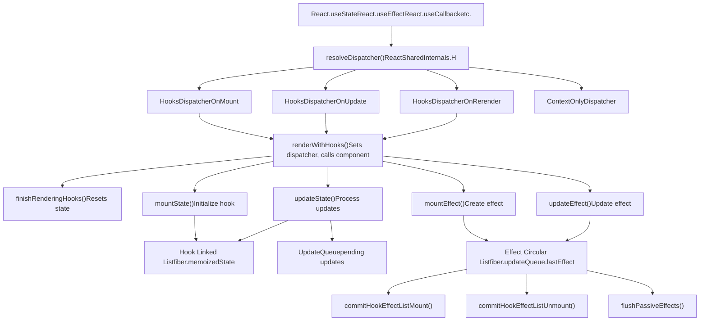
Sources: [packages/react-reconciler/src/ReactFiberHooks.js1-200](https://github.com/facebook/react/blob/65eec428/packages/react-reconciler/src/ReactFiberHooks.js#L1-L200) [packages/react/src/ReactHooks.js1-242](https://github.com/facebook/react/blob/65eec428/packages/react/src/ReactHooks.js#L1-L242)

## Public Hooks API

The public API is exposed through `packages/react/src/ReactHooks.js`. Each hook function calls `resolveDispatcher()` to obtain the current dispatcher from `ReactSharedInternals.H`, then delegates to the dispatcher implementation.

**Available Hooks**

| Hook | Purpose | Stateful |
| --- | --- | --- |
| `useState` | Local component state | Yes |
| `useReducer` | State with reducer logic | Yes |
| `useEffect` | Side effects after paint | No |
| `useLayoutEffect` | Side effects before paint | No |
| `useInsertionEffect` | CSS-in-JS insertions | No |
| `useContext` | Read context value | No |
| `useRef` | Mutable reference | Yes |
| `useMemo` | Memoized value | Yes |
| `useCallback` | Memoized callback | Yes |
| `useImperativeHandle` | Customize ref value | No |
| `useDebugValue` | DevTools label | No |
| `useId` | Stable unique ID | Yes |
| `useTransition` | Non-blocking updates | Yes |
| `useDeferredValue` | Defer value updates | Yes |
| `useSyncExternalStore` | Subscribe to external store | Yes |
| `useOptimistic` | Optimistic UI updates | Yes |
| `useActionState` | Form action state | Yes |
| `use` | Read Promise/Context | No |

**Dispatcher Resolution Flow**

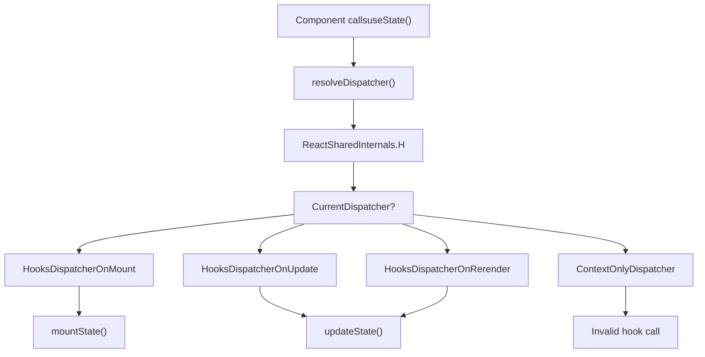
Sources: [packages/react/src/ReactHooks.js24-42](https://github.com/facebook/react/blob/65eec428/packages/react/src/ReactHooks.js#L24-L42) [packages/react/src/ReactHooks.js66-71](https://github.com/facebook/react/blob/65eec428/packages/react/src/ReactHooks.js#L66-L71)

## Dispatcher Pattern

The dispatcher is a dynamic vtable that changes based on component lifecycle phase. `renderWithHooks()` sets the appropriate dispatcher before calling the component function, ensuring hooks resolve to the correct implementation.

**Dispatcher Implementations**

| Dispatcher | When Used | Behavior |
| --- | --- | --- |
| `HooksDispatcherOnMount` | First render (`current === null`) | Initializes hook state, creates linked list |
| `HooksDispatcherOnUpdate` | Subsequent renders | Reuses existing hooks, processes updates |
| `HooksDispatcherOnRerender` | Render phase updates | Handles setState during render |
| `ContextOnlyDispatcher` | Outside component render | Throws "Invalid hook call" error |
| `HooksDispatcherOnMountInDEV` | DEV first render | Validates hook order, dependencies |
| `HooksDispatcherOnUpdateInDEV` | DEV subsequent render | Validates hook order changes |

**renderWithHooks Execution Flow**

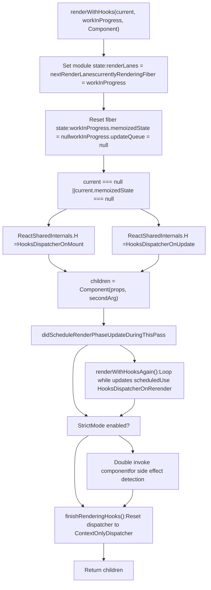
Sources: [packages/react-reconciler/src/ReactFiberHooks.js503-632](https://github.com/facebook/react/blob/65eec428/packages/react-reconciler/src/ReactFiberHooks.js#L503-L632) [packages/react-reconciler/src/ReactFiberHooks.js634-750](https://github.com/facebook/react/blob/65eec428/packages/react-reconciler/src/ReactFiberHooks.js#L634-L750)

## Hook Data Structures

### Hook Linked List

Each hook call appends a `Hook` object to a singly-linked list stored on `fiber.memoizedState`. The list order must remain constant across renders (enforced by DEV warnings).

**Hook Object Structure**

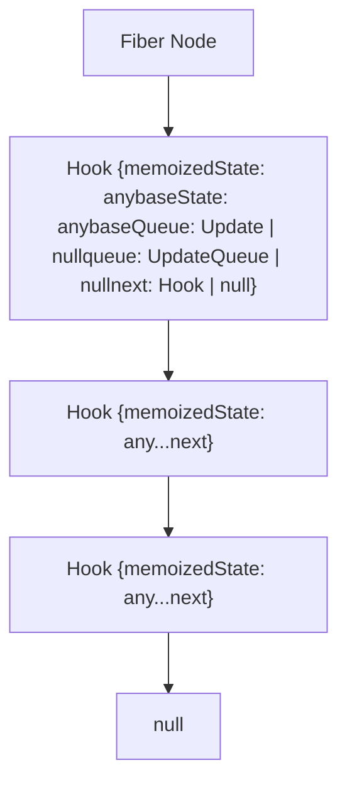
The `Hook` type definition:

```
type Hook = {
  memoizedState: any,      // Current state value or effect list
  baseState: any,          // State before pending updates
  baseQueue: Update | null, // Updates skipped by priority
  queue: any,              // UpdateQueue for useState/useReducer
  next: Hook | null        // Next hook in list
}
```
Sources: [packages/react-reconciler/src/ReactFiberHooks.js195-201](https://github.com/facebook/react/blob/65eec428/packages/react-reconciler/src/ReactFiberHooks.js#L195-L201) [packages/react-reconciler/src/ReactFiberHooks.js980-999](https://github.com/facebook/react/blob/65eec428/packages/react-reconciler/src/ReactFiberHooks.js#L980-L999)

### UpdateQueue Structure

State hooks (`useState`, `useReducer`) maintain an `UpdateQueue` to track pending updates. Updates form a circular linked list and are processed in order during render.

**UpdateQueue and Update Structure**

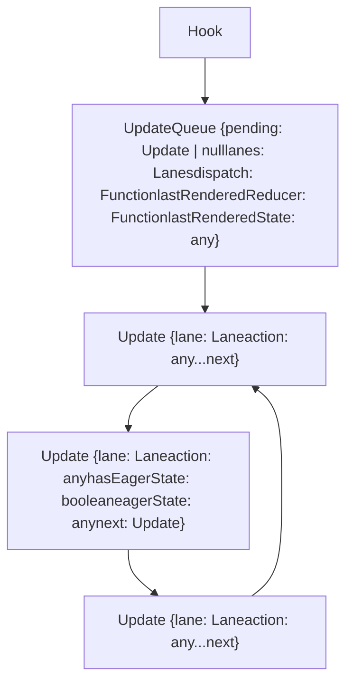
Sources: [packages/react-reconciler/src/ReactFiberHooks.js165-181](https://github.com/facebook/react/blob/65eec428/packages/react-reconciler/src/ReactFiberHooks.js#L165-L181) [packages/react-reconciler/src/ReactFiberHooks.js175-181](https://github.com/facebook/react/blob/65eec428/packages/react-reconciler/src/ReactFiberHooks.js#L175-L181)

### Effect Circular List

Effects (`useEffect`, `useLayoutEffect`, `useInsertionEffect`) are stored in a circular linked list on `fiber.updateQueue.lastEffect`. Each `Effect` object contains the effect function, cleanup function, dependencies, and flags.

**Effect Data Structure**

```
type Effect = {
  tag: HookFlags,              // HookPassive | HookLayout | HookInsertion
  inst: EffectInstance,        // { destroy: Function | void }
  create: () => (() => void) | void,  // Effect function
  deps: Array<mixed> | void | null,   // Dependency array
  next: Effect                 // Next effect in circular list
}

type FunctionComponentUpdateQueue = {
  lastEffect: Effect | null,   // Tail of circular effect list
  events: Array<any> | null,   // Event functions
  stores: Array<any> | null,   // Store consistency checks
  memoCache: MemoCache | null  // Compiler cache
}
```
The `lastEffect` pointer points to the **last** effect in the circular list, so `lastEffect.next` is the **first** effect.

Sources: [packages/react-reconciler/src/ReactFiberHooks.js217-227](https://github.com/facebook/react/blob/65eec428/packages/react-reconciler/src/ReactFiberHooks.js#L217-L227) [packages/react-reconciler/src/ReactFiberHooks.js247-252](https://github.com/facebook/react/blob/65eec428/packages/react-reconciler/src/ReactFiberHooks.js#L247-L252)

## Core Hook Implementations

### State Hooks: useState and useReducer

`useState` is implemented as a specialized `useReducer` with a basic state reducer. Both follow the mount/update pattern.

**useState/useReducer Implementation Flow**

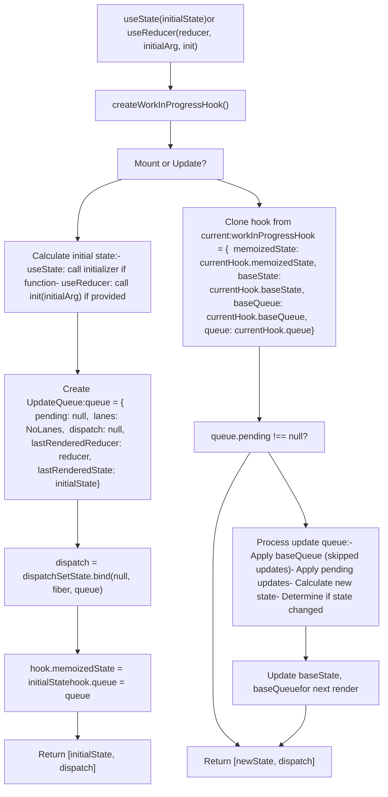
**Eager State Computation**

When `setState` is called, React attempts to compute the new state eagerly (outside render) if the queue is empty. If the new state equals the current state (using `Object.is`), React can bail out of the render entirely.

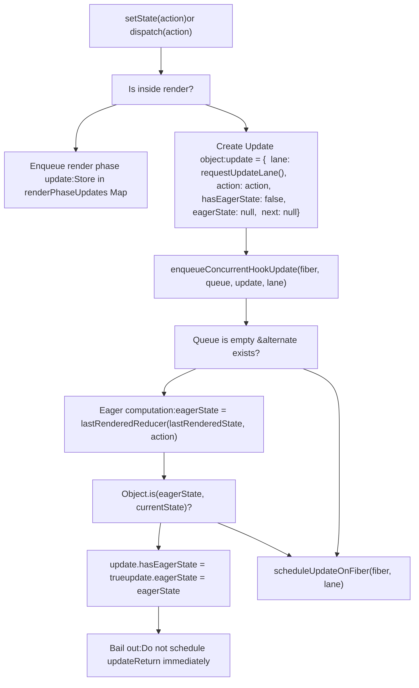
Sources: [packages/react-reconciler/src/ReactFiberHooks.js1095-1253](https://github.com/facebook/react/blob/65eec428/packages/react-reconciler/src/ReactFiberHooks.js#L1095-L1253) [packages/react-reconciler/src/ReactFiberHooks.js2648-2861](https://github.com/facebook/react/blob/65eec428/packages/react-reconciler/src/ReactFiberHooks.js#L2648-L2861)

### Effect Hooks: useEffect, useLayoutEffect, useInsertionEffect

Effect hooks create `Effect` objects and append them to the circular effect list. The `tag` field determines when the effect is executed:

-   `HookInsertion`: During commit before mutations (for CSS-in-JS)
-   `HookLayout`: During commit after mutations, before paint (sync)
-   `HookPassive`: After commit and paint (async via scheduler)

**Effect Mount and Update**

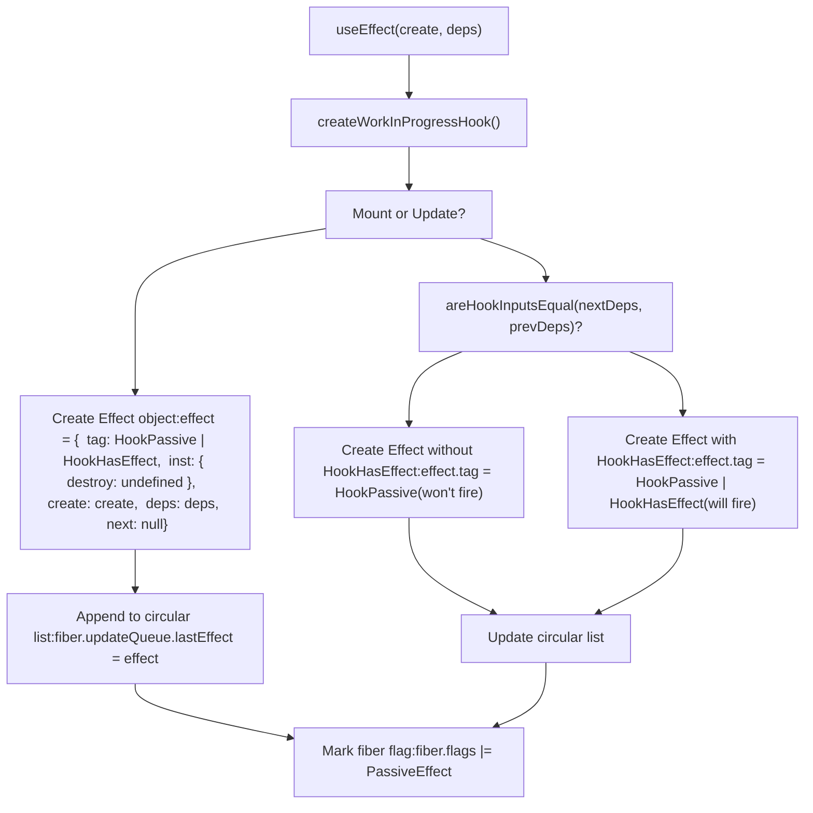
Sources: [packages/react-reconciler/src/ReactFiberHooks.js1956-2023](https://github.com/facebook/react/blob/65eec428/packages/react-reconciler/src/ReactFiberHooks.js#L1956-L2023) [packages/react-reconciler/src/ReactFiberHooks.js2025-2069](https://github.com/facebook/react/blob/65eec428/packages/react-reconciler/src/ReactFiberHooks.js#L2025-L2069)

### Ref Hook: useRef

`useRef` is a simple hook that stores a mutable object with a `current` property. The ref object identity remains stable across renders.

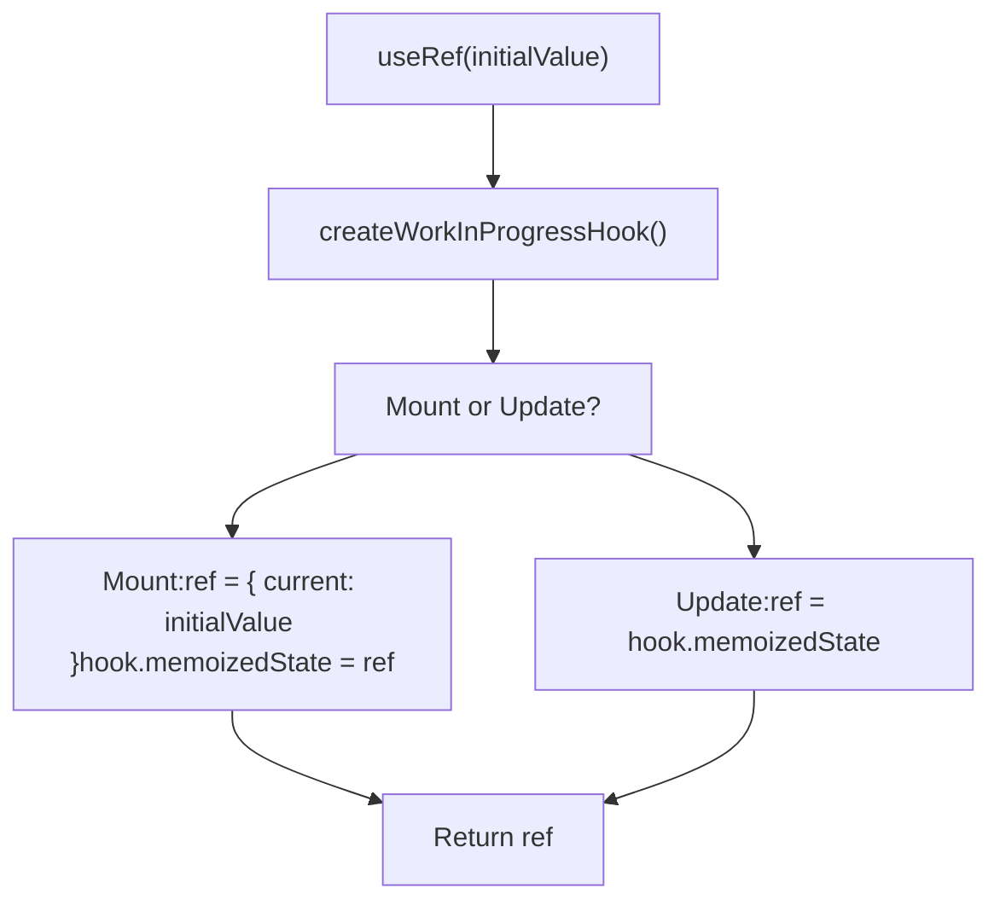
Sources: [packages/react-reconciler/src/ReactFiberHooks.js1764-1779](https://github.com/facebook/react/blob/65eec428/packages/react-reconciler/src/ReactFiberHooks.js#L1764-L1779)

### Memoization Hooks: useMemo and useCallback

`useMemo` and `useCallback` cache computed values based on dependency arrays. During mount, they compute and store the value. During update, they check dependencies and either reuse or recompute.

**useMemo Implementation**

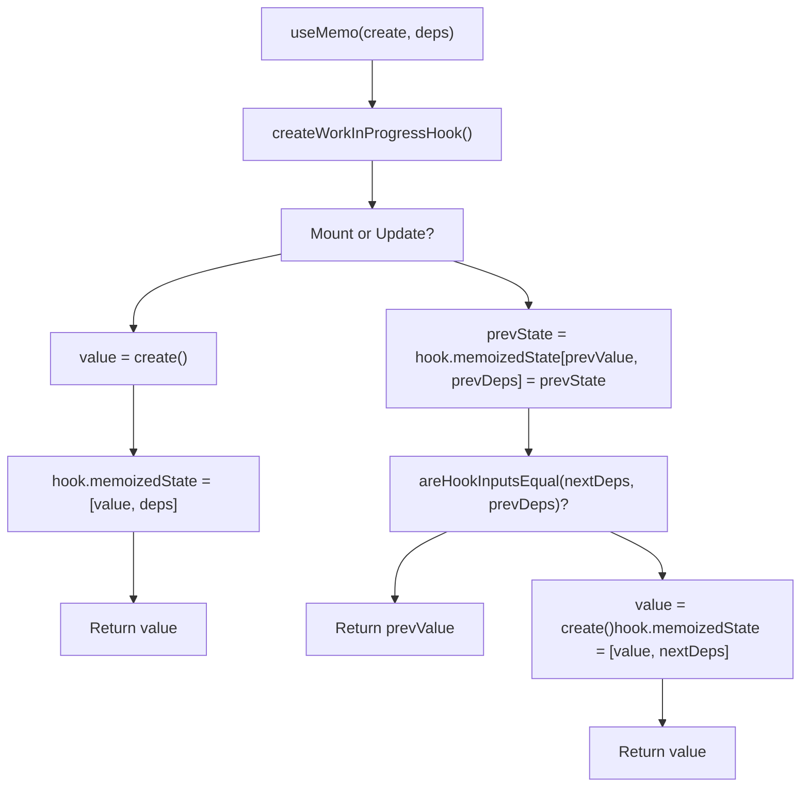
`useCallback(fn, deps)` is implemented as `useMemo(() => fn, deps)`.

Sources: [packages/react-reconciler/src/ReactFiberHooks.js1890-1931](https://github.com/facebook/react/blob/65eec428/packages/react-reconciler/src/ReactFiberHooks.js#L1890-L1931) [packages/react-reconciler/src/ReactFiberHooks.js1933-1954](https://github.com/facebook/react/blob/65eec428/packages/react-reconciler/src/ReactFiberHooks.js#L1933-L1954)

## Effect Execution Lifecycle

Effects are executed during the commit phase, but at different times based on their type. The fiber flags (`PassiveEffect`, `UpdateEffect`) indicate which effects need to be processed.

**Effect Execution Timeline**

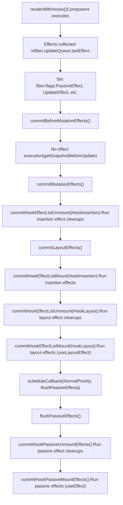
**Effect Tag Bits**

| Tag | Constant | Meaning |
| --- | --- | --- |
| `HookHasEffect` | `0b001` | Effect should fire this render |
| `HookInsertion` | `0b010` | Insertion effect (CSS-in-JS) |
| `HookLayout` | `0b100` | Layout effect (sync after mutations) |
| `HookPassive` | `0b1000` | Passive effect (async after paint) |

Effects only execute if `effect.tag & HookHasEffect !== 0`. During mount, all effects have `HookHasEffect`. During update, only effects with changed dependencies have `HookHasEffect`.

Sources: [packages/react-reconciler/src/ReactHookEffectTags.js1-21](https://github.com/facebook/react/blob/65eec428/packages/react-reconciler/src/ReactHookEffectTags.js#L1-L21) [packages/react-reconciler/src/ReactFiberHooks.js1956-2023](https://github.com/facebook/react/blob/65eec428/packages/react-reconciler/src/ReactFiberHooks.js#L1956-L2023)

## Server-Side Hooks Implementation

The Fizz server renderer (`packages/react-server/src/ReactFizzHooks.js`) provides a separate hooks implementation optimized for synchronous server rendering. Key differences:

-   **No effects**: `useEffect`, `useLayoutEffect`, `useInsertionEffect` are no-ops
-   **Simpler state management**: No concurrent updates or lanes
-   **Synchronous execution**: No scheduling or yielding
-   **Render phase updates**: Handled via re-render loop with `renderPhaseUpdates` Map

**Server Hook State Management**

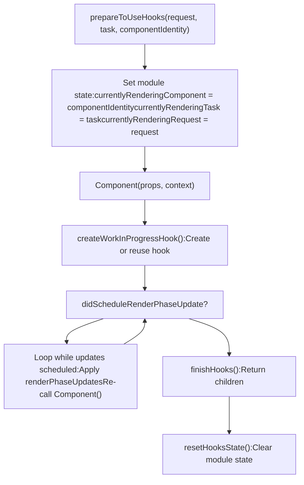
**Server useActionState Hook**

`useActionState` (formerly `useFormState`) is special on the server. It receives permalink information and action state from the request, enabling progressive enhancement of forms.

Sources: [packages/react-server/src/ReactFizzHooks.js207-316](https://github.com/facebook/react/blob/65eec428/packages/react-server/src/ReactFizzHooks.js#L207-L316) [packages/react-server/src/ReactFizzHooks.js665-831](https://github.com/facebook/react/blob/65eec428/packages/react-server/src/ReactFizzHooks.js#L665-L831)

## Debug and DevTools Integration

### ReactDebugHooks

The `react-debug-tools` package provides `inspectHooks()` and `inspectHooksOfFiber()` to extract hook information for DevTools. It uses a custom dispatcher that logs all hook calls.

**Hook Inspection Architecture**

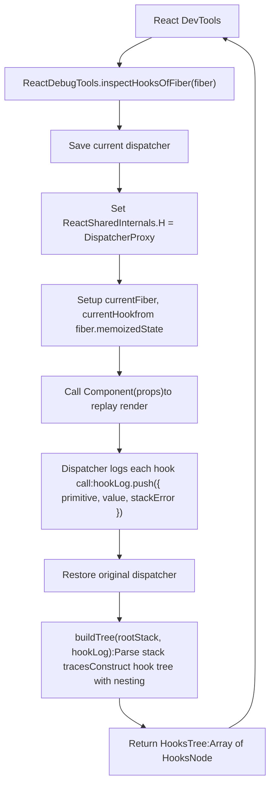
**HooksNode Structure**

```
type HooksNode = {
  id: number | null,              // Hook index for state hooks
  isStateEditable: boolean,       // Can DevTools edit this state?
  name: string,                   // Hook name (e.g., "State", "Effect", "Custom")
  value: mixed,                   // Hook value
  subHooks: Array<HooksNode>,     // Nested custom hook calls
  debugInfo: ReactDebugInfo | null, // Debug metadata
  hookSource: HookSource | null   // Source location { fileName, lineNumber, etc. }
}
```
The debug dispatcher intercepts every hook call, extracts its value from the fiber's hook list, and records it in `hookLog`. Stack trace parsing determines which hooks are nested inside custom hooks.

Sources: [packages/react-debug-tools/src/ReactDebugHooks.js1-300](https://github.com/facebook/react/blob/65eec428/packages/react-debug-tools/src/ReactDebugHooks.js#L1-L300) [packages/react-debug-tools/src/ReactDebugHooks.js996-1098](https://github.com/facebook/react/blob/65eec428/packages/react-debug-tools/src/ReactDebugHooks.js#L996-L1098)

### DEV-Only Validation

In development builds, React enforces the Rules of Hooks through several mechanisms:

**Hook Order Validation**

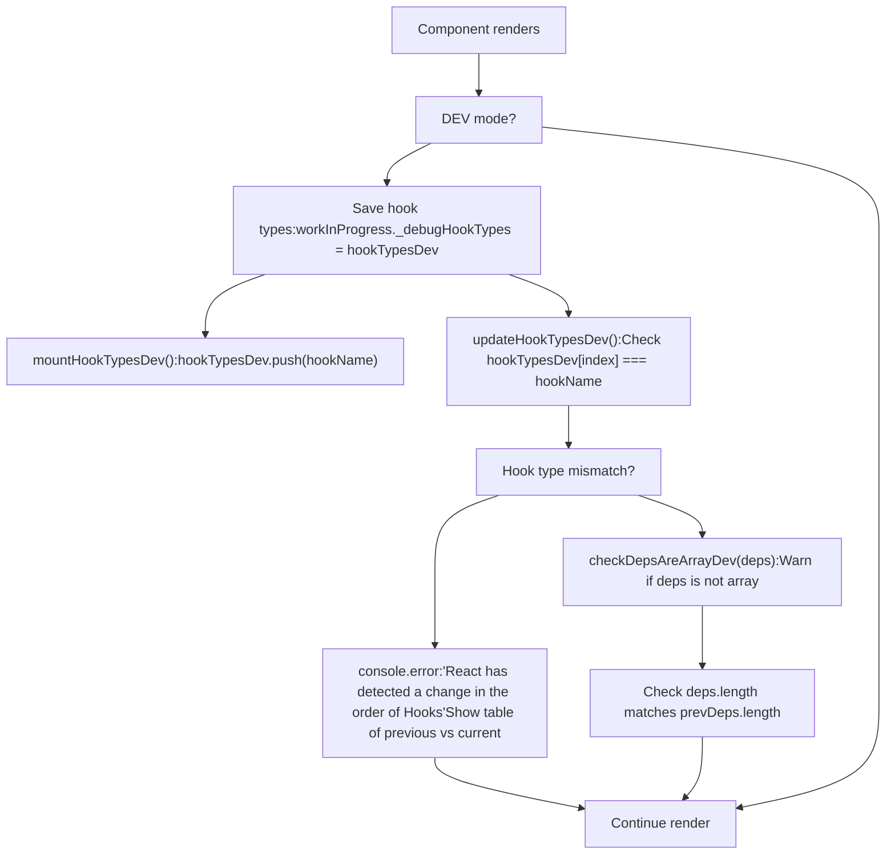
**Validated Conditions**

| Rule | Check | Error Message |
| --- | --- | --- |
| Hook order | `hookTypesDev[index] === currentHookName` | "React has detected a change in the order of Hooks" |
| Dependency array | `isArray(deps)` | "received a final argument that is not an array" |
| Dependency length | `nextDeps.length === prevDeps.length` | "changed size between renders" |
| Effect callback | `create != null` | "requires an effect callback" |
| Invalid context | `currentlyRenderingFiber !== null` | "Invalid hook call" |
| Async component | `Object.prototype.toString.call(Component) !== '[object AsyncFunction]'` | "is an async Client Component" |

Sources: [packages/react-reconciler/src/ReactFiberHooks.js309-394](https://github.com/facebook/react/blob/65eec428/packages/react-reconciler/src/ReactFiberHooks.js#L309-L394) [packages/react-reconciler/src/ReactFiberHooks.js334-347](https://github.com/facebook/react/blob/65eec428/packages/react-reconciler/src/ReactFiberHooks.js#L334-L347)

## Hook Lifecycle Summary

**Complete Hook Execution Flow**

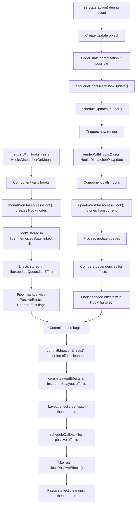
Sources: [packages/react-reconciler/src/ReactFiberHooks.js503-750](https://github.com/facebook/react/blob/65eec428/packages/react-reconciler/src/ReactFiberHooks.js#L503-L750) [packages/react-reconciler/src/ReactFiberHooks.js2648-2861](https://github.com/facebook/react/blob/65eec428/packages/react-reconciler/src/ReactFiberHooks.js#L2648-L2861)

## Key Implementation Files

| File | Purpose |
| --- | --- |
| [packages/react/src/ReactHooks.js](https://github.com/facebook/react/blob/65eec428/packages/react/src/ReactHooks.js) | Public hooks API, dispatcher resolution |
| [packages/react-reconciler/src/ReactFiberHooks.js](https://github.com/facebook/react/blob/65eec428/packages/react-reconciler/src/ReactFiberHooks.js) | Core hooks implementation for client-side rendering |
| [packages/react-reconciler/src/ReactInternalTypes.js46-66](https://github.com/facebook/react/blob/65eec428/packages/react-reconciler/src/ReactInternalTypes.js#L46-L66) | `HookType`, `Dispatcher`, `Hook` type definitions |
| [packages/react-reconciler/src/ReactInternalTypes.js398-459](https://github.com/facebook/react/blob/65eec428/packages/react-reconciler/src/ReactInternalTypes.js#L398-L459) | `Dispatcher` interface with all hook methods |
| [packages/react-server/src/ReactFizzHooks.js](https://github.com/facebook/react/blob/65eec428/packages/react-server/src/ReactFizzHooks.js) | Server-side hooks implementation for Fizz |
| [packages/react-debug-tools/src/ReactDebugHooks.js](https://github.com/facebook/react/blob/65eec428/packages/react-debug-tools/src/ReactDebugHooks.js) | Hook inspection for DevTools |
| [packages/react-reconciler/src/ReactHookEffectTags.js](https://github.com/facebook/react/blob/65eec428/packages/react-reconciler/src/ReactHookEffectTags.js) | Effect type flags and constants |
| [packages/react-reconciler/src/ReactFiberCommitWork.js](https://github.com/facebook/react/blob/65eec428/packages/react-reconciler/src/ReactFiberCommitWork.js) | Effect execution during commit phase |
