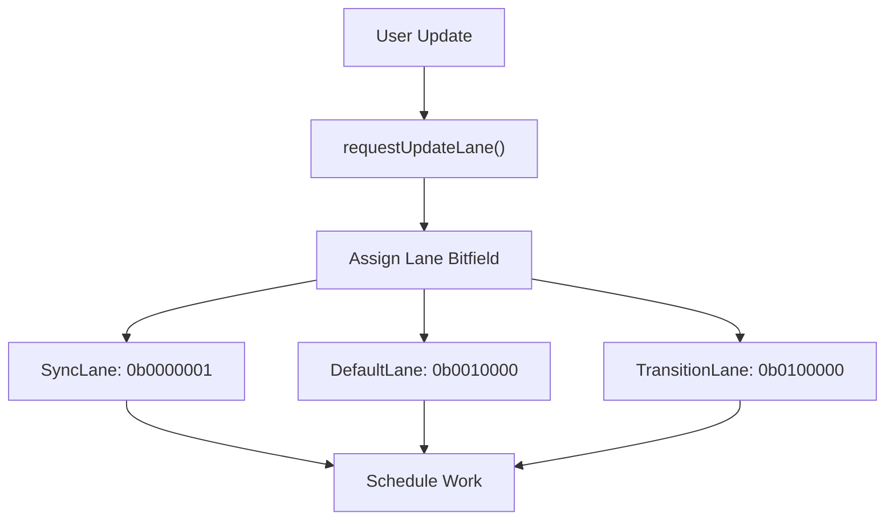
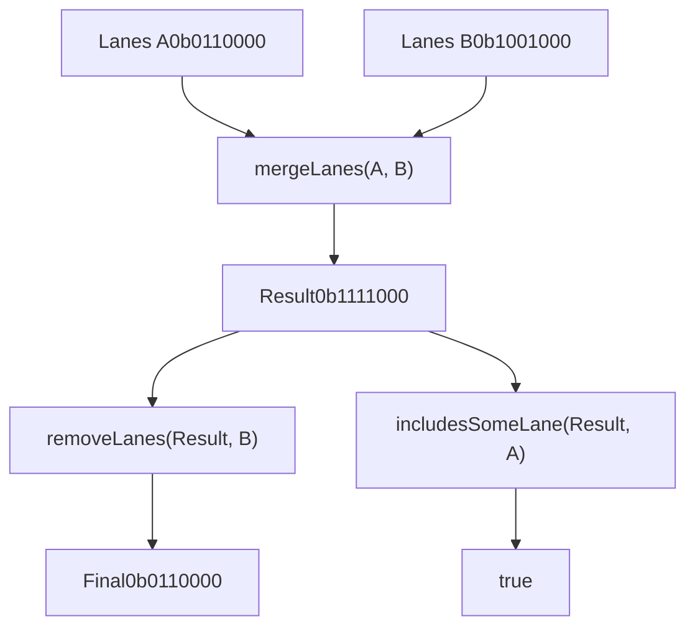
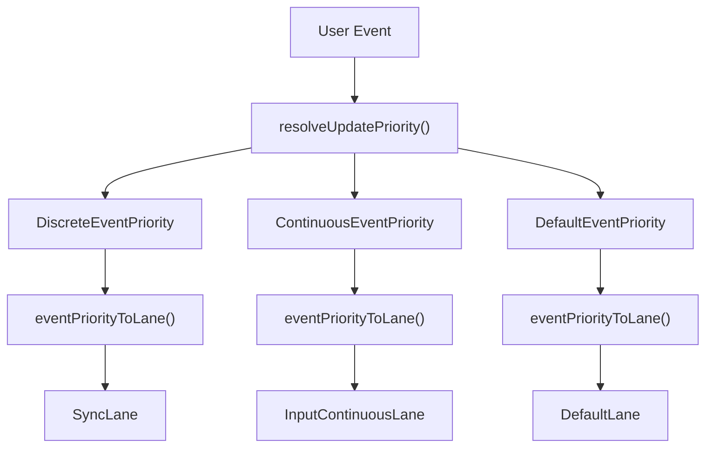
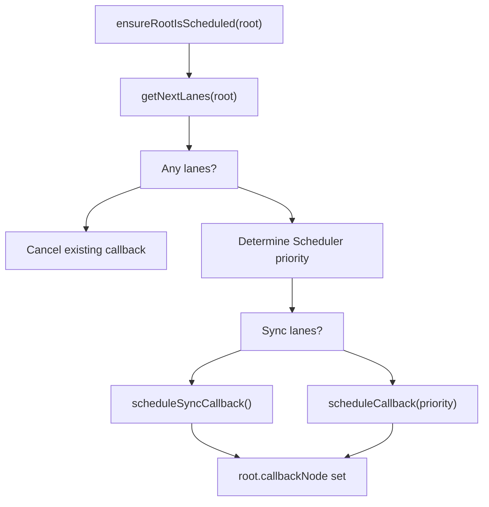
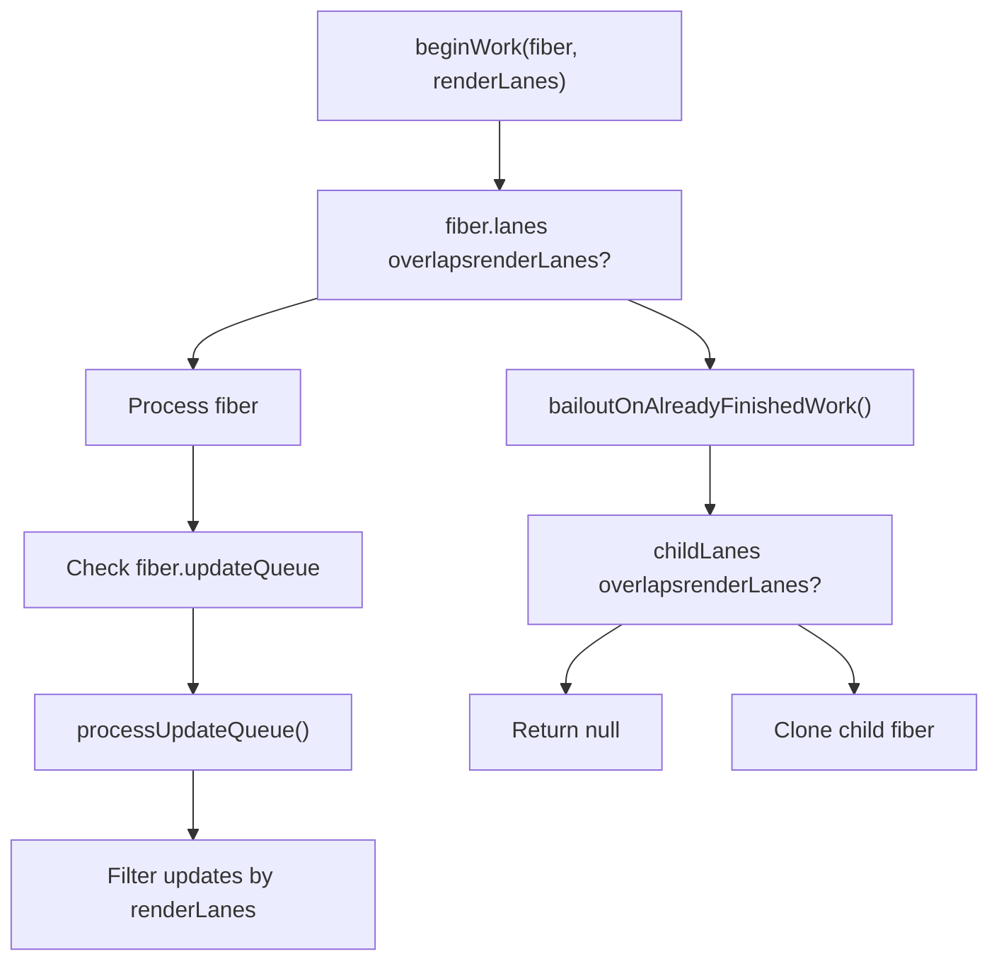
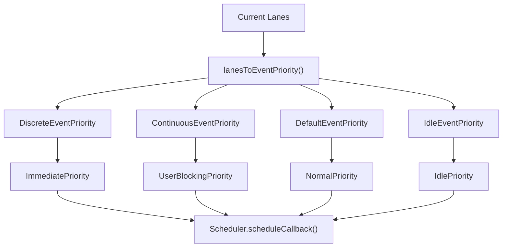
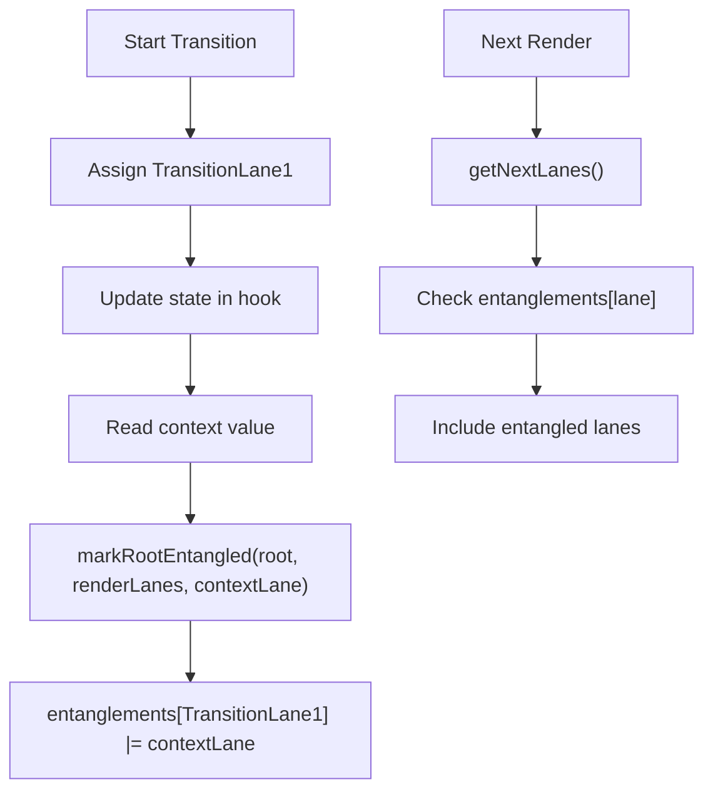

# Lane-Based Priority and Scheduling

Relevant source files

-   [packages/react-client/src/ReactFlightPerformanceTrack.js](https://github.com/facebook/react/blob/65eec428/packages/react-client/src/ReactFlightPerformanceTrack.js)
-   [packages/react-debug-tools/src/ReactDebugHooks.js](https://github.com/facebook/react/blob/65eec428/packages/react-debug-tools/src/ReactDebugHooks.js)
-   [packages/react-debug-tools/src/\_\_tests\_\_/ReactHooksInspection-test.js](https://github.com/facebook/react/blob/65eec428/packages/react-debug-tools/src/__tests__/ReactHooksInspection-test.js)
-   [packages/react-debug-tools/src/\_\_tests\_\_/ReactHooksInspectionIntegration-test.js](https://github.com/facebook/react/blob/65eec428/packages/react-debug-tools/src/__tests__/ReactHooksInspectionIntegration-test.js)
-   [packages/react-debug-tools/src/\_\_tests\_\_/ReactHooksInspectionIntegrationDOM-test.js](https://github.com/facebook/react/blob/65eec428/packages/react-debug-tools/src/__tests__/ReactHooksInspectionIntegrationDOM-test.js)
-   [packages/react-devtools-shell/src/app/InspectableElements/CustomHooks.js](https://github.com/facebook/react/blob/65eec428/packages/react-devtools-shell/src/app/InspectableElements/CustomHooks.js)
-   [packages/react-devtools-timeline/src/content-views/utils/moduleFilters.js](https://github.com/facebook/react/blob/65eec428/packages/react-devtools-timeline/src/content-views/utils/moduleFilters.js)
-   [packages/react-dom/src/\_\_tests\_\_/ReactDOMFiberAsync-test.js](https://github.com/facebook/react/blob/65eec428/packages/react-dom/src/__tests__/ReactDOMFiberAsync-test.js)
-   [packages/react-dom/src/\_\_tests\_\_/ReactDOMNativeEventHeuristic-test.js](https://github.com/facebook/react/blob/65eec428/packages/react-dom/src/__tests__/ReactDOMNativeEventHeuristic-test.js)
-   [packages/react-dom/src/events/plugins/\_\_tests\_\_/ChangeEventPlugin-test.js](https://github.com/facebook/react/blob/65eec428/packages/react-dom/src/events/plugins/__tests__/ChangeEventPlugin-test.js)
-   [packages/react-dom/src/events/plugins/\_\_tests\_\_/SimpleEventPlugin-test.js](https://github.com/facebook/react/blob/65eec428/packages/react-dom/src/events/plugins/__tests__/SimpleEventPlugin-test.js)
-   [packages/react-reconciler/src/ReactFiber.js](https://github.com/facebook/react/blob/65eec428/packages/react-reconciler/src/ReactFiber.js)
-   [packages/react-reconciler/src/ReactFiberBeginWork.js](https://github.com/facebook/react/blob/65eec428/packages/react-reconciler/src/ReactFiberBeginWork.js)
-   [packages/react-reconciler/src/ReactFiberClassComponent.js](https://github.com/facebook/react/blob/65eec428/packages/react-reconciler/src/ReactFiberClassComponent.js)
-   [packages/react-reconciler/src/ReactFiberCommitWork.js](https://github.com/facebook/react/blob/65eec428/packages/react-reconciler/src/ReactFiberCommitWork.js)
-   [packages/react-reconciler/src/ReactFiberCompleteWork.js](https://github.com/facebook/react/blob/65eec428/packages/react-reconciler/src/ReactFiberCompleteWork.js)
-   [packages/react-reconciler/src/ReactFiberHooks.js](https://github.com/facebook/react/blob/65eec428/packages/react-reconciler/src/ReactFiberHooks.js)
-   [packages/react-reconciler/src/ReactFiberLane.js](https://github.com/facebook/react/blob/65eec428/packages/react-reconciler/src/ReactFiberLane.js)
-   [packages/react-reconciler/src/ReactFiberOffscreenComponent.js](https://github.com/facebook/react/blob/65eec428/packages/react-reconciler/src/ReactFiberOffscreenComponent.js)
-   [packages/react-reconciler/src/ReactFiberPerformanceTrack.js](https://github.com/facebook/react/blob/65eec428/packages/react-reconciler/src/ReactFiberPerformanceTrack.js)
-   [packages/react-reconciler/src/ReactFiberRootScheduler.js](https://github.com/facebook/react/blob/65eec428/packages/react-reconciler/src/ReactFiberRootScheduler.js)
-   [packages/react-reconciler/src/ReactFiberSuspenseComponent.js](https://github.com/facebook/react/blob/65eec428/packages/react-reconciler/src/ReactFiberSuspenseComponent.js)
-   [packages/react-reconciler/src/ReactFiberUnwindWork.js](https://github.com/facebook/react/blob/65eec428/packages/react-reconciler/src/ReactFiberUnwindWork.js)
-   [packages/react-reconciler/src/ReactFiberWorkLoop.js](https://github.com/facebook/react/blob/65eec428/packages/react-reconciler/src/ReactFiberWorkLoop.js)
-   [packages/react-reconciler/src/ReactInternalTypes.js](https://github.com/facebook/react/blob/65eec428/packages/react-reconciler/src/ReactInternalTypes.js)
-   [packages/react-reconciler/src/ReactProfilerTimer.js](https://github.com/facebook/react/blob/65eec428/packages/react-reconciler/src/ReactProfilerTimer.js)
-   [packages/react-reconciler/src/\_\_tests\_\_/ReactDeferredValue-test.js](https://github.com/facebook/react/blob/65eec428/packages/react-reconciler/src/__tests__/ReactDeferredValue-test.js)
-   [packages/react-reconciler/src/\_\_tests\_\_/ReactHooks-test.internal.js](https://github.com/facebook/react/blob/65eec428/packages/react-reconciler/src/__tests__/ReactHooks-test.internal.js)
-   [packages/react-reconciler/src/\_\_tests\_\_/ReactHooksWithNoopRenderer-test.js](https://github.com/facebook/react/blob/65eec428/packages/react-reconciler/src/__tests__/ReactHooksWithNoopRenderer-test.js)
-   [packages/react-reconciler/src/\_\_tests\_\_/ReactLazy-test.internal.js](https://github.com/facebook/react/blob/65eec428/packages/react-reconciler/src/__tests__/ReactLazy-test.internal.js)
-   [packages/react-reconciler/src/\_\_tests\_\_/ReactPerformanceTrack-test.js](https://github.com/facebook/react/blob/65eec428/packages/react-reconciler/src/__tests__/ReactPerformanceTrack-test.js)
-   [packages/react-reconciler/src/\_\_tests\_\_/ReactSiblingPrerendering-test.js](https://github.com/facebook/react/blob/65eec428/packages/react-reconciler/src/__tests__/ReactSiblingPrerendering-test.js)
-   [packages/react-reconciler/src/\_\_tests\_\_/ReactSuspense-test.internal.js](https://github.com/facebook/react/blob/65eec428/packages/react-reconciler/src/__tests__/ReactSuspense-test.internal.js)
-   [packages/react-reconciler/src/\_\_tests\_\_/ReactSuspensePlaceholder-test.internal.js](https://github.com/facebook/react/blob/65eec428/packages/react-reconciler/src/__tests__/ReactSuspensePlaceholder-test.internal.js)
-   [packages/react-reconciler/src/\_\_tests\_\_/ReactSuspenseWithNoopRenderer-test.js](https://github.com/facebook/react/blob/65eec428/packages/react-reconciler/src/__tests__/ReactSuspenseWithNoopRenderer-test.js)
-   [packages/react-reconciler/src/\_\_tests\_\_/ReactSuspenseyCommitPhase-test.js](https://github.com/facebook/react/blob/65eec428/packages/react-reconciler/src/__tests__/ReactSuspenseyCommitPhase-test.js)
-   [packages/react-server/src/ReactFizzHooks.js](https://github.com/facebook/react/blob/65eec428/packages/react-server/src/ReactFizzHooks.js)
-   [packages/react-server/src/ReactFlightAsyncSequence.js](https://github.com/facebook/react/blob/65eec428/packages/react-server/src/ReactFlightAsyncSequence.js)
-   [packages/react-server/src/ReactFlightServerConfigDebugNode.js](https://github.com/facebook/react/blob/65eec428/packages/react-server/src/ReactFlightServerConfigDebugNode.js)
-   [packages/react-server/src/ReactFlightServerConfigDebugNoop.js](https://github.com/facebook/react/blob/65eec428/packages/react-server/src/ReactFlightServerConfigDebugNoop.js)
-   [packages/react-server/src/ReactFlightStackConfigV8.js](https://github.com/facebook/react/blob/65eec428/packages/react-server/src/ReactFlightStackConfigV8.js)
-   [packages/react-server/src/\_\_tests\_\_/ReactFlightAsyncDebugInfo-test.js](https://github.com/facebook/react/blob/65eec428/packages/react-server/src/__tests__/ReactFlightAsyncDebugInfo-test.js)
-   [packages/react/src/ReactHooks.js](https://github.com/facebook/react/blob/65eec428/packages/react/src/ReactHooks.js)
-   [packages/react/src/ReactLazy.js](https://github.com/facebook/react/blob/65eec428/packages/react/src/ReactLazy.js)
-   [packages/react/src/\_\_tests\_\_/ReactProfiler-test.internal.js](https://github.com/facebook/react/blob/65eec428/packages/react/src/__tests__/ReactProfiler-test.internal.js)
-   [packages/shared/ReactPerformanceTrackProperties.js](https://github.com/facebook/react/blob/65eec428/packages/shared/ReactPerformanceTrackProperties.js)
-   [packages/shared/ReactSymbols.js](https://github.com/facebook/react/blob/65eec428/packages/shared/ReactSymbols.js)

## Purpose and Scope

This document describes React's lane-based priority system and how it integrates with the Scheduler to manage concurrent rendering. Lanes are React's internal representation of work priority, implemented as a bitfield system that allows fine-grained control over when and how updates are processed.

For information about the core reconciler architecture and work loop, see [Fiber Architecture and Work Loop](/facebook/react/4.1-fiber-architecture-and-data-structures). For details about the Scheduler package itself, see the Scheduler section below. For information about hooks and state updates, see [React Hooks System](/facebook/react/4.2-work-loop-and-rendering-phases).

---

## Lane Fundamentals

### What is a Lane?

A **Lane** is React's unit of priority represented as a 32-bit integer where each bit position corresponds to a priority level. Multiple lanes can be combined into **Lanes** (plural) to represent multiple pending priorities simultaneously.


**Sources:** [packages/react-reconciler/src/ReactFiberLane.js1-100](https://github.com/facebook/react/blob/65eec428/packages/react-reconciler/src/ReactFiberLane.js#L1-L100)

### Lane Type Definitions

The lane system is defined with several key types:

-   `Lane` - A single priority lane (number)
-   `Lanes` - A bitmask representing multiple lanes (number)
-   `LaneMap<T>` - An array indexed by lane position for storing per-lane data

**Sources:** [packages/react-reconciler/src/ReactFiberLane.js10-20](https://github.com/facebook/react/blob/65eec428/packages/react-reconciler/src/ReactFiberLane.js#L10-L20)

### Lane Groups and Constants

React defines distinct lane groups for different priority levels:

| Lane Group | Bit Positions | Purpose |
| --- | --- | --- |
| `SyncLane` | 0b0000001 (bit 0) | Highest priority, sync rendering |
| `SyncUpdateLanes` | 0b0000110 (bits 1-2) | Sync updates during rendering |
| `InputContinuousLane` | 0b0001000 (bit 3) | Continuous user input (drag, scroll) |
| `DefaultLane` | 0b0010000 (bit 4) | Normal updates (clicks, etc.) |
| `GestureLane` | 0b0100000 (bit 5) | Gesture transitions |
| `TransitionLanes` | 0b0111111110000000 (bits 7-14) | Transition updates |
| `RetryLanes` | 0b0111110000000000000000000000 (bits 15-20) | Retrying suspended work |
| `IdleLane` | 0b0100000000000000000000000000000 (bit 30) | Lowest priority work |
| `OffscreenLane` | 0b1000000000000000000000000000000 (bit 31) | Prerendering/hidden content |

**Sources:** [packages/react-reconciler/src/ReactFiberLane.js40-150](https://github.com/facebook/react/blob/65eec428/packages/react-reconciler/src/ReactFiberLane.js#L40-L150)

---

## Lane Operations and Management

### Core Lane Operations


Key functions for manipulating lanes:

-   `mergeLanes(a, b)` - Bitwise OR to combine lanes
-   `removeLanes(set, subset)` - Removes lanes from a set
-   `intersectLanes(a, b)` - Bitwise AND to find common lanes
-   `includesSomeLane(set, subset)` - Checks if any lanes overlap
-   `isSubsetOfLanes(set, subset)` - Checks if all subset lanes are in set
-   `pickArbitraryLane(lanes)` - Selects a single lane from a set

**Sources:** [packages/react-reconciler/src/ReactFiberLane.js200-350](https://github.com/facebook/react/blob/65eec428/packages/react-reconciler/src/ReactFiberLane.js#L200-L350)

### Lane Priority Helpers

React provides functions to check lane characteristics:

-   `includesSyncLane(lanes)` - Contains sync work
-   `includesBlockingLane(lanes)` - Contains blocking/input work
-   `includesTransitionLane(lanes)` - Contains transition work
-   `includesOnlyRetries(lanes)` - Only retry lanes
-   `includesOnlyTransitions(lanes)` - Only transition lanes
-   `includesExpiredLane(root, lanes)` - Checks for expired lanes

**Sources:** [packages/react-reconciler/src/ReactFiberLane.js350-500](https://github.com/facebook/react/blob/65eec428/packages/react-reconciler/src/ReactFiberLane.js#L350-L500)

### Lane Map Structure

The `FiberRoot` maintains lane maps for tracking metadata:

```
// Conceptual structure
type FiberRoot = {
  pendingLanes: Lanes,           // All pending work
  suspendedLanes: Lanes,         // Suspended work
  pingedLanes: Lanes,            // Recently unblocked work
  expiredLanes: Lanes,           // Work that has expired

  // Lane maps (arrays indexed by lane)
  entangledLanes: LaneMap<Lanes>,     // Entangled lanes
  entanglements: LaneMap<Lanes>,      // Lane entanglements
  eventTimes: LaneMap<number>,        // When work was scheduled
  expirationTimes: LaneMap<number>,   // When work expires
  ...
}
```
**Sources:** [packages/react-reconciler/src/ReactFiberRoot.js50-150](https://github.com/facebook/react/blob/65eec428/packages/react-reconciler/src/ReactFiberRoot.js#L50-L150) [packages/react-reconciler/src/ReactInternalTypes.js200-250](https://github.com/facebook/react/blob/65eec428/packages/react-reconciler/src/ReactInternalTypes.js#L200-L250)

---

## Priority System

### Event Priority to Lane Mapping


React defines three event priority levels that map to lanes:

| Event Priority | Lane Assignment | Use Case |
| --- | --- | --- |
| `DiscreteEventPriority` | `SyncLane` or `InputContinuousLane` | Clicks, key presses |
| `ContinuousEventPriority` | `InputContinuousLane` | Drag, scroll, mouse move |
| `DefaultEventPriority` | `DefaultLane` | Network responses, timers |

**Sources:** [packages/react-reconciler/src/ReactEventPriorities.js20-100](https://github.com/facebook/react/blob/65eec428/packages/react-reconciler/src/ReactEventPriorities.js#L20-L100) [packages/react-reconciler/src/ReactFiberWorkLoop.js792-836](https://github.com/facebook/react/blob/65eec428/packages/react-reconciler/src/ReactFiberWorkLoop.js#L792-L836)

### Requesting an Update Lane

The `requestUpdateLane()` function determines which lane to use for a new update:

1.  **Legacy Mode Check**: If not in concurrent mode, returns `SyncLane`
2.  **Render Phase Check**: If updating during render, reuses current render lanes
3.  **Transition Check**: If inside a transition, claims a transition lane
4.  **Event Priority**: Otherwise, converts current event priority to a lane

**Sources:** [packages/react-reconciler/src/ReactFiberWorkLoop.js792-836](https://github.com/facebook/react/blob/65eec428/packages/react-reconciler/src/ReactFiberWorkLoop.js#L792-L836)

### Transition Lane Management

React maintains a pool of transition lanes (bits 7-14) and allocates them using:

-   `claimNextTransitionLane()` - Claims next available transition lane, cycling through the pool
-   `claimNextTransitionDeferredLane()` - Claims deferred transition lane
-   `requestTransitionLane(transition)` - Requests a lane for a specific transition

**Sources:** [packages/react-reconciler/src/ReactFiberLane.js600-700](https://github.com/facebook/react/blob/65eec428/packages/react-reconciler/src/ReactFiberLane.js#L600-L700) [packages/react-reconciler/src/ReactFiberRootScheduler.js100-200](https://github.com/facebook/react/blob/65eec428/packages/react-reconciler/src/ReactFiberRootScheduler.js#L100-L200)

---

## Scheduling Flow

### Update Scheduling Pipeline

> **[Mermaid sequence]**
> *(图表结构无法解析)*

**Sources:** [packages/react-reconciler/src/ReactFiberWorkLoop.js916-1000](https://github.com/facebook/react/blob/65eec428/packages/react-reconciler/src/ReactFiberWorkLoop.js#L916-L1000) [packages/react-reconciler/src/ReactFiberRootScheduler.js150-300](https://github.com/facebook/react/blob/65eec428/packages/react-reconciler/src/ReactFiberRootScheduler.js#L150-L300)

### scheduleUpdateOnFiber

The main entry point for scheduling work:

1.  **Check Suspended Work**: If root is suspended on data and this is a ping, may resume immediately
2.  **Mark Root Updated**: Calls `markRootUpdated()` to add lane to `pendingLanes`
3.  **Ensure Scheduled**: Calls `ensureRootIsScheduled()` to schedule work if needed

**Sources:** [packages/react-reconciler/src/ReactFiberWorkLoop.js916-1100](https://github.com/facebook/react/blob/65eec428/packages/react-reconciler/src/ReactFiberWorkLoop.js#L916-L1100)

### ensureRootIsScheduled

This function is called after every update and decides if new work needs scheduling:


Key logic:

1.  `getNextLanes()` picks highest priority lanes to work on
2.  Converts lane priority to Scheduler priority via `lanesToEventPriority()`
3.  Schedules sync work via `scheduleSyncCallback()` or async work via `Scheduler.scheduleCallback()`
4.  Stores callback node on root to enable cancellation

**Sources:** [packages/react-reconciler/src/ReactFiberRootScheduler.js150-350](https://github.com/facebook/react/blob/65eec428/packages/react-reconciler/src/ReactFiberRootScheduler.js#L150-L350)

### getNextLanes

Determines which lanes should be processed next:

1.  **No Pending Check**: If no `pendingLanes`, return `NoLanes`
2.  **Non-Idle Work**: Prefer non-idle lanes
3.  **Remove Suspended**: Exclude suspended lanes unless pinged
4.  **Expiration Check**: Include expired lanes immediately
5.  **Entanglement**: Apply lane entanglement rules
6.  **Pick Lanes**: Select lanes based on priority

**Sources:** [packages/react-reconciler/src/ReactFiberLane.js400-550](https://github.com/facebook/react/blob/65eec428/packages/react-reconciler/src/ReactFiberLane.js#L400-L550)

---

## Work Loop Integration

### Render Phase Lane Usage

During rendering, lanes control which work is processed:


Key variables in the work loop:

-   `workInProgressRootRenderLanes` - Lanes being rendered in current pass
-   `entangledRenderLanes` - Contextual lanes including hidden subtrees
-   `workInProgressRootSkippedLanes` - Lanes with work that was skipped

**Sources:** [packages/react-reconciler/src/ReactFiberWorkLoop.js400-500](https://github.com/facebook/react/blob/65eec428/packages/react-reconciler/src/ReactFiberWorkLoop.js#L400-L500) [packages/react-reconciler/src/ReactFiberBeginWork.js200-400](https://github.com/facebook/react/blob/65eec428/packages/react-reconciler/src/ReactFiberBeginWork.js#L200-L400)

### Update Queue Processing

Each fiber's update queue filters updates by lane:

```
// Conceptual logic from processUpdateQueue
function processUpdateQueue(workInProgress, renderLanes) {
  let update = queue.firstBaseUpdate;

  while (update !== null) {
    const updateLane = update.lane;

    if (!isSubsetOfLanes(renderLanes, updateLane)) {
      // Update lane is not in renderLanes, skip it
      // Add to skipped updates
      const clone = cloneUpdate(update);
      newBaseUpdate = clone;
    } else {
      // Process this update
      newState = getStateFromUpdate(update, newState);
    }

    update = update.next;
  }
}
```
**Sources:** [packages/react-reconciler/src/ReactFiberClassUpdateQueue.js300-500](https://github.com/facebook/react/blob/65eec428/packages/react-reconciler/src/ReactFiberClassUpdateQueue.js#L300-L500)

### Lane Clearing After Commit

After committing, lanes are cleared:

1.  `markRootFinished(root, remainingLanes)` - Removes completed lanes from `pendingLanes`
2.  `clearTransitionsForLanes(root, lanes)` - Cleans up transition tracking
3.  `ensureRootIsScheduled(root)` - Reschedules if more work remains

**Sources:** [packages/react-reconciler/src/ReactFiberWorkLoop.js2000-2100](https://github.com/facebook/react/blob/65eec428/packages/react-reconciler/src/ReactFiberWorkLoop.js#L2000-L2100) [packages/react-reconciler/src/ReactFiberLane.js850-950](https://github.com/facebook/react/blob/65eec428/packages/react-reconciler/src/ReactFiberLane.js#L850-L950)

---

## Scheduler Integration

### Lane to Scheduler Priority Mapping


**Sources:** [packages/react-reconciler/src/ReactEventPriorities.js70-120](https://github.com/facebook/react/blob/65eec428/packages/react-reconciler/src/ReactEventPriorities.js#L70-L120) [packages/react-reconciler/src/ReactFiberRootScheduler.js200-250](https://github.com/facebook/react/blob/65eec428/packages/react-reconciler/src/ReactFiberRootScheduler.js#L200-L250)

### Cooperative Scheduling

The Scheduler enables concurrent rendering through cooperative multitasking:

1.  **Time Slicing**: Work is performed in small time slices (default ~5ms)
2.  **shouldYield()**: Checked during render to see if time slice expired
3.  **Work Resumption**: If yielded, work resumes from where it left off
4.  **Priority Inversion**: Higher priority work can interrupt lower priority

**Sources:** [packages/react-reconciler/src/ReactFiberWorkLoop.js1500-1800](https://github.com/facebook/react/blob/65eec428/packages/react-reconciler/src/ReactFiberWorkLoop.js#L1500-L1800)

### performWorkOnRoot Callback

The scheduled callback that performs work:

```
// Simplified callback logic
function performConcurrentWorkOnRoot(root, didTimeout) {
  const originalCallbackNode = root.callbackNode;

  // Get lanes to work on
  const lanes = getNextLanes(root,
    root === workInProgressRoot ? workInProgressRootRenderLanes : NoLanes
  );

  if (lanes === NoLanes) {
    return null;
  }

  // Perform render
  let exitStatus = shouldTimeSlice
    ? renderRootConcurrent(root, lanes)
    : renderRootSync(root, lanes);

  // Process exit status and commit if ready
  if (exitStatus === RootCompleted) {
    commitRoot(root);
  }

  // Reschedule if more work
  ensureRootIsScheduled(root);

  // Return continuation callback or null
  return root.callbackNode === originalCallbackNode
    ? performConcurrentWorkOnRoot.bind(null, root)
    : null;
}
```
**Sources:** [packages/react-reconciler/src/ReactFiberWorkLoop.js1200-1500](https://github.com/facebook/react/blob/65eec428/packages/react-reconciler/src/ReactFiberWorkLoop.js#L1200-L1500)

---

## Key Data Structures

### Fiber Lane Fields

Each `Fiber` node tracks lanes:

| Field | Type | Purpose |
| --- | --- | --- |
| `lanes` | `Lanes` | Work scheduled on this fiber |
| `childLanes` | `Lanes` | Work scheduled on descendants |

These fields are used to skip subtrees with no relevant work during rendering.

**Sources:** [packages/react-reconciler/src/ReactInternalTypes.js165-175](https://github.com/facebook/react/blob/65eec428/packages/react-reconciler/src/ReactInternalTypes.js#L165-L175)

### FiberRoot Lane Fields

The `FiberRoot` maintains comprehensive lane state:

| Field | Type | Purpose |
| --- | --- | --- |
| `pendingLanes` | `Lanes` | All lanes with pending work |
| `suspendedLanes` | `Lanes` | Lanes suspended due to data loading |
| `pingedLanes` | `Lanes` | Suspended lanes that have been pinged |
| `expiredLanes` | `Lanes` | Lanes that have exceeded time limit |
| `finishedLanes` | `Lanes` | Lanes that completed in last render |
| `entangledLanes` | `LaneMap<Lanes>` | Lanes entangled with each lane |
| `entanglements` | `LaneMap<Lanes>` | Entanglement relationships |
| `eventTimes` | `LaneMap<number>` | Timestamp when lane work started |
| `expirationTimes` | `LaneMap<number>` | Expiration deadline for lane |

**Sources:** [packages/react-reconciler/src/ReactInternalTypes.js180-250](https://github.com/facebook/react/blob/65eec428/packages/react-reconciler/src/ReactInternalTypes.js#L180-L250)

### Update Lane Field

Update objects carry their assigned lane:

```
type Update<S, A> = {
  lane: Lane,              // Priority lane for this update
  revertLane: Lane,        // Lane to revert to on error
  action: A,               // Update payload
  hasEagerState: boolean,  // Computed during dispatch
  eagerState: S | null,    // Eagerly computed state
  next: Update<S, A>,      // Linked list
  ...
}
```
**Sources:** [packages/react-reconciler/src/ReactFiberHooks.js165-180](https://github.com/facebook/react/blob/65eec428/packages/react-reconciler/src/ReactFiberHooks.js#L165-L180) [packages/react-reconciler/src/ReactFiberClassUpdateQueue.js100-150](https://github.com/facebook/react/blob/65eec428/packages/react-reconciler/src/ReactFiberClassUpdateQueue.js#L100-L150)

---

## Concurrent Rendering Support

### Lane Entanglement

Lanes can be "entangled" to ensure related work is processed together:


Entanglement ensures that when processing TransitionLane1, any context updates that occurred are also included.

**Sources:** [packages/react-reconciler/src/ReactFiberLane.js750-850](https://github.com/facebook/react/blob/65eec428/packages/react-reconciler/src/ReactFiberLane.js#L750-L850)

### Lane Expiration

To prevent starvation, lanes expire after a timeout:

-   Sync lanes: Expire immediately (no timeout)
-   Blocking lanes: ~250ms expiration
-   Default lanes: ~5000ms expiration
-   Transition lanes: ~5000ms expiration
-   Retry lanes: ~5000ms expiration
-   Idle lanes: Never expire (infinite timeout)

**Sources:** [packages/react-reconciler/src/ReactFiberLane.js950-1050](https://github.com/facebook/react/blob/65eec428/packages/react-reconciler/src/ReactFiberLane.js#L950-L1050) Feature flags at [packages/shared/ReactFeatureFlags.js80-95](https://github.com/facebook/react/blob/65eec428/packages/shared/ReactFeatureFlags.js#L80-L95)

### Interrupting Lower Priority Work

> **[Mermaid sequence]**
> *(图表结构无法解析)*

When higher priority work arrives during lower priority rendering:

1.  Work loop checks if new lanes are higher priority
2.  If yes, throws away current work-in-progress tree
3.  Starts fresh render at higher priority
4.  Lower priority work is rescheduled

**Sources:** [packages/react-reconciler/src/ReactFiberWorkLoop.js1000-1200](https://github.com/facebook/react/blob/65eec428/packages/react-reconciler/src/ReactFiberWorkLoop.js#L1000-L1200) [packages/react-reconciler/src/ReactFiberWorkLoop.js1800-2000](https://github.com/facebook/react/blob/65eec428/packages/react-reconciler/src/ReactFiberWorkLoop.js#L1800-L2000)

---

## Summary

React's lane-based priority system provides:

1.  **Fine-grained Priority Control**: 32 distinct priority levels represented as bits
2.  **Concurrent Rendering**: Multiple priorities can be tracked simultaneously
3.  **Priority Escalation**: Work can be upgraded via expiration or user interaction
4.  **Efficient Skipping**: Lanes enable skipping unaffected subtrees
5.  **Scheduler Integration**: Lanes map to Scheduler priorities for time-sliced rendering
6.  **Entanglement**: Related work is processed together for consistency

The system coordinates three key components:

-   **Lane Assignment** (`requestUpdateLane`, `requestTransitionLane`)
-   **Lane Scheduling** (`scheduleUpdateOnFiber`, `ensureRootIsScheduled`)
-   **Lane Processing** (work loop checks lanes to decide what to render)

This architecture enables React's concurrent features including transitions, Suspense, and time slicing.

**Sources:** [packages/react-reconciler/src/ReactFiberLane.js1-1200](https://github.com/facebook/react/blob/65eec428/packages/react-reconciler/src/ReactFiberLane.js#L1-L1200) [packages/react-reconciler/src/ReactFiberWorkLoop.js1-2500](https://github.com/facebook/react/blob/65eec428/packages/react-reconciler/src/ReactFiberWorkLoop.js#L1-L2500) [packages/react-reconciler/src/ReactFiberRootScheduler.js1-500](https://github.com/facebook/react/blob/65eec428/packages/react-reconciler/src/ReactFiberRootScheduler.js#L1-L500)
