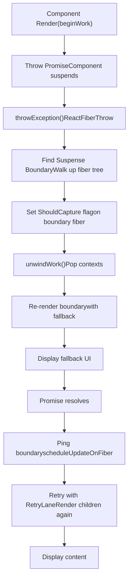
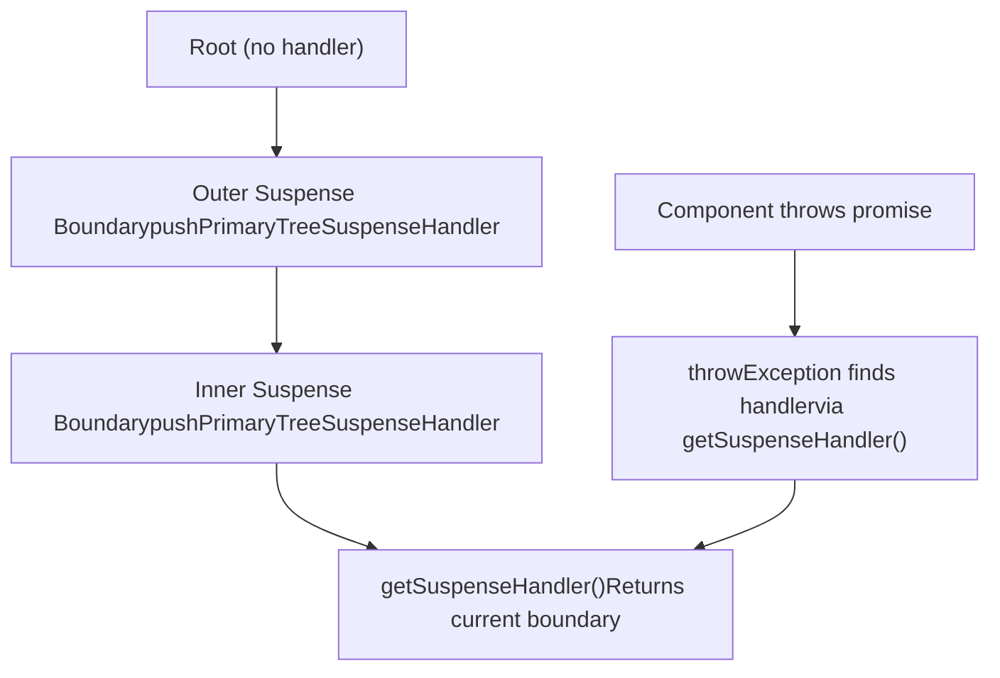
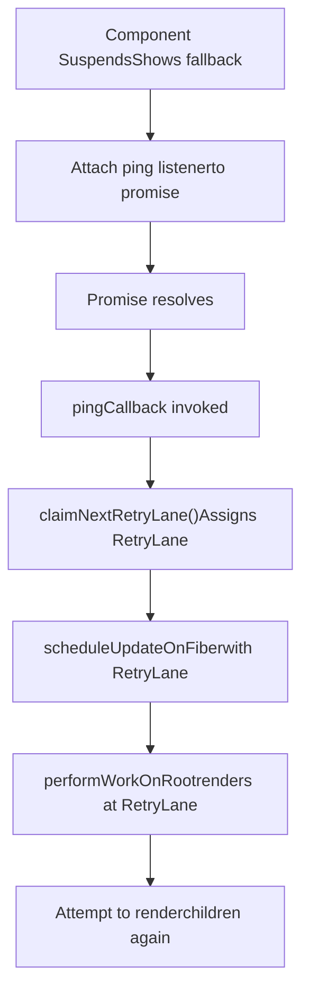
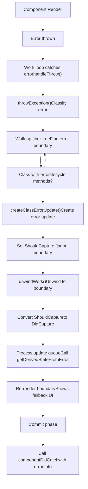
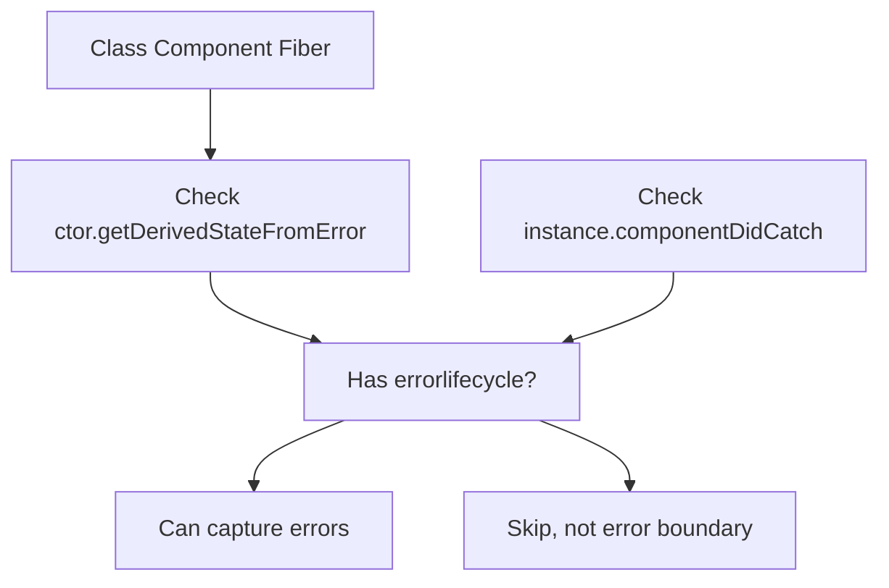
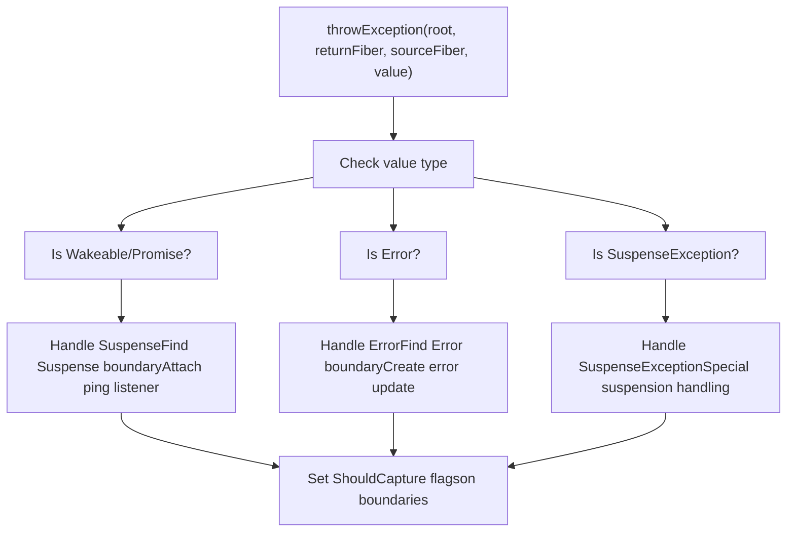
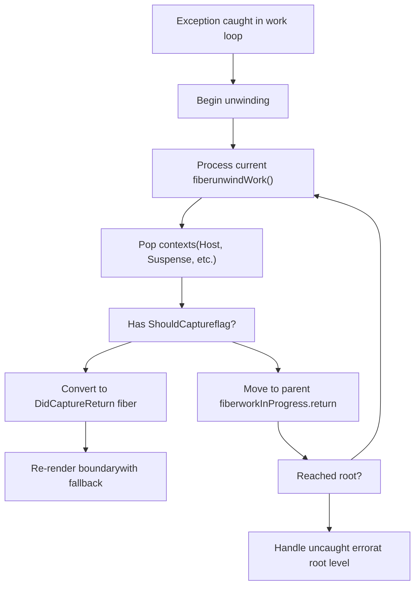
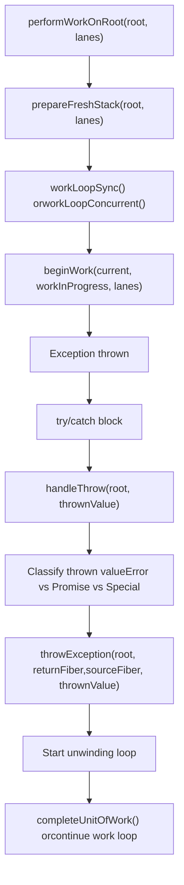
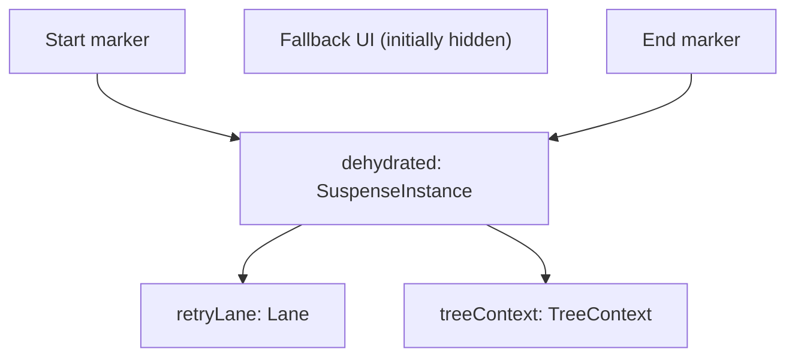
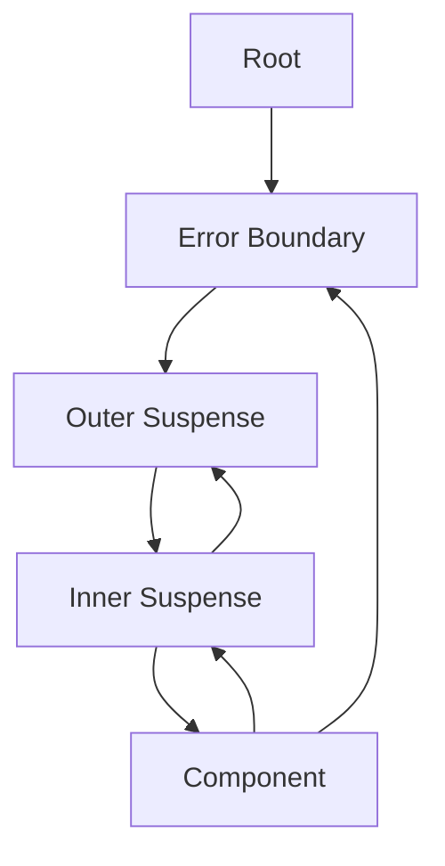

# Suspense and Error Boundaries

Relevant source files

-   [packages/react-client/src/ReactFlightPerformanceTrack.js](https://github.com/facebook/react/blob/65eec428/packages/react-client/src/ReactFlightPerformanceTrack.js)
-   [packages/react-debug-tools/src/ReactDebugHooks.js](https://github.com/facebook/react/blob/65eec428/packages/react-debug-tools/src/ReactDebugHooks.js)
-   [packages/react-debug-tools/src/\_\_tests\_\_/ReactHooksInspection-test.js](https://github.com/facebook/react/blob/65eec428/packages/react-debug-tools/src/__tests__/ReactHooksInspection-test.js)
-   [packages/react-debug-tools/src/\_\_tests\_\_/ReactHooksInspectionIntegration-test.js](https://github.com/facebook/react/blob/65eec428/packages/react-debug-tools/src/__tests__/ReactHooksInspectionIntegration-test.js)
-   [packages/react-debug-tools/src/\_\_tests\_\_/ReactHooksInspectionIntegrationDOM-test.js](https://github.com/facebook/react/blob/65eec428/packages/react-debug-tools/src/__tests__/ReactHooksInspectionIntegrationDOM-test.js)
-   [packages/react-devtools-shell/src/app/InspectableElements/CustomHooks.js](https://github.com/facebook/react/blob/65eec428/packages/react-devtools-shell/src/app/InspectableElements/CustomHooks.js)
-   [packages/react-devtools-timeline/src/content-views/utils/moduleFilters.js](https://github.com/facebook/react/blob/65eec428/packages/react-devtools-timeline/src/content-views/utils/moduleFilters.js)
-   [packages/react-dom/src/\_\_tests\_\_/ReactDOMFiberAsync-test.js](https://github.com/facebook/react/blob/65eec428/packages/react-dom/src/__tests__/ReactDOMFiberAsync-test.js)
-   [packages/react-dom/src/\_\_tests\_\_/ReactDOMNativeEventHeuristic-test.js](https://github.com/facebook/react/blob/65eec428/packages/react-dom/src/__tests__/ReactDOMNativeEventHeuristic-test.js)
-   [packages/react-dom/src/events/plugins/\_\_tests\_\_/ChangeEventPlugin-test.js](https://github.com/facebook/react/blob/65eec428/packages/react-dom/src/events/plugins/__tests__/ChangeEventPlugin-test.js)
-   [packages/react-dom/src/events/plugins/\_\_tests\_\_/SimpleEventPlugin-test.js](https://github.com/facebook/react/blob/65eec428/packages/react-dom/src/events/plugins/__tests__/SimpleEventPlugin-test.js)
-   [packages/react-reconciler/src/ReactFiber.js](https://github.com/facebook/react/blob/65eec428/packages/react-reconciler/src/ReactFiber.js)
-   [packages/react-reconciler/src/ReactFiberBeginWork.js](https://github.com/facebook/react/blob/65eec428/packages/react-reconciler/src/ReactFiberBeginWork.js)
-   [packages/react-reconciler/src/ReactFiberClassComponent.js](https://github.com/facebook/react/blob/65eec428/packages/react-reconciler/src/ReactFiberClassComponent.js)
-   [packages/react-reconciler/src/ReactFiberCommitWork.js](https://github.com/facebook/react/blob/65eec428/packages/react-reconciler/src/ReactFiberCommitWork.js)
-   [packages/react-reconciler/src/ReactFiberCompleteWork.js](https://github.com/facebook/react/blob/65eec428/packages/react-reconciler/src/ReactFiberCompleteWork.js)
-   [packages/react-reconciler/src/ReactFiberHooks.js](https://github.com/facebook/react/blob/65eec428/packages/react-reconciler/src/ReactFiberHooks.js)
-   [packages/react-reconciler/src/ReactFiberLane.js](https://github.com/facebook/react/blob/65eec428/packages/react-reconciler/src/ReactFiberLane.js)
-   [packages/react-reconciler/src/ReactFiberOffscreenComponent.js](https://github.com/facebook/react/blob/65eec428/packages/react-reconciler/src/ReactFiberOffscreenComponent.js)
-   [packages/react-reconciler/src/ReactFiberPerformanceTrack.js](https://github.com/facebook/react/blob/65eec428/packages/react-reconciler/src/ReactFiberPerformanceTrack.js)
-   [packages/react-reconciler/src/ReactFiberRootScheduler.js](https://github.com/facebook/react/blob/65eec428/packages/react-reconciler/src/ReactFiberRootScheduler.js)
-   [packages/react-reconciler/src/ReactFiberSuspenseComponent.js](https://github.com/facebook/react/blob/65eec428/packages/react-reconciler/src/ReactFiberSuspenseComponent.js)
-   [packages/react-reconciler/src/ReactFiberUnwindWork.js](https://github.com/facebook/react/blob/65eec428/packages/react-reconciler/src/ReactFiberUnwindWork.js)
-   [packages/react-reconciler/src/ReactFiberWorkLoop.js](https://github.com/facebook/react/blob/65eec428/packages/react-reconciler/src/ReactFiberWorkLoop.js)
-   [packages/react-reconciler/src/ReactInternalTypes.js](https://github.com/facebook/react/blob/65eec428/packages/react-reconciler/src/ReactInternalTypes.js)
-   [packages/react-reconciler/src/ReactProfilerTimer.js](https://github.com/facebook/react/blob/65eec428/packages/react-reconciler/src/ReactProfilerTimer.js)
-   [packages/react-reconciler/src/\_\_tests\_\_/ReactDeferredValue-test.js](https://github.com/facebook/react/blob/65eec428/packages/react-reconciler/src/__tests__/ReactDeferredValue-test.js)
-   [packages/react-reconciler/src/\_\_tests\_\_/ReactHooks-test.internal.js](https://github.com/facebook/react/blob/65eec428/packages/react-reconciler/src/__tests__/ReactHooks-test.internal.js)
-   [packages/react-reconciler/src/\_\_tests\_\_/ReactHooksWithNoopRenderer-test.js](https://github.com/facebook/react/blob/65eec428/packages/react-reconciler/src/__tests__/ReactHooksWithNoopRenderer-test.js)
-   [packages/react-reconciler/src/\_\_tests\_\_/ReactLazy-test.internal.js](https://github.com/facebook/react/blob/65eec428/packages/react-reconciler/src/__tests__/ReactLazy-test.internal.js)
-   [packages/react-reconciler/src/\_\_tests\_\_/ReactPerformanceTrack-test.js](https://github.com/facebook/react/blob/65eec428/packages/react-reconciler/src/__tests__/ReactPerformanceTrack-test.js)
-   [packages/react-reconciler/src/\_\_tests\_\_/ReactSiblingPrerendering-test.js](https://github.com/facebook/react/blob/65eec428/packages/react-reconciler/src/__tests__/ReactSiblingPrerendering-test.js)
-   [packages/react-reconciler/src/\_\_tests\_\_/ReactSuspense-test.internal.js](https://github.com/facebook/react/blob/65eec428/packages/react-reconciler/src/__tests__/ReactSuspense-test.internal.js)
-   [packages/react-reconciler/src/\_\_tests\_\_/ReactSuspensePlaceholder-test.internal.js](https://github.com/facebook/react/blob/65eec428/packages/react-reconciler/src/__tests__/ReactSuspensePlaceholder-test.internal.js)
-   [packages/react-reconciler/src/\_\_tests\_\_/ReactSuspenseWithNoopRenderer-test.js](https://github.com/facebook/react/blob/65eec428/packages/react-reconciler/src/__tests__/ReactSuspenseWithNoopRenderer-test.js)
-   [packages/react-reconciler/src/\_\_tests\_\_/ReactSuspenseyCommitPhase-test.js](https://github.com/facebook/react/blob/65eec428/packages/react-reconciler/src/__tests__/ReactSuspenseyCommitPhase-test.js)
-   [packages/react-server/src/ReactFizzHooks.js](https://github.com/facebook/react/blob/65eec428/packages/react-server/src/ReactFizzHooks.js)
-   [packages/react-server/src/ReactFlightAsyncSequence.js](https://github.com/facebook/react/blob/65eec428/packages/react-server/src/ReactFlightAsyncSequence.js)
-   [packages/react-server/src/ReactFlightServerConfigDebugNode.js](https://github.com/facebook/react/blob/65eec428/packages/react-server/src/ReactFlightServerConfigDebugNode.js)
-   [packages/react-server/src/ReactFlightServerConfigDebugNoop.js](https://github.com/facebook/react/blob/65eec428/packages/react-server/src/ReactFlightServerConfigDebugNoop.js)
-   [packages/react-server/src/ReactFlightStackConfigV8.js](https://github.com/facebook/react/blob/65eec428/packages/react-server/src/ReactFlightStackConfigV8.js)
-   [packages/react-server/src/\_\_tests\_\_/ReactFlightAsyncDebugInfo-test.js](https://github.com/facebook/react/blob/65eec428/packages/react-server/src/__tests__/ReactFlightAsyncDebugInfo-test.js)
-   [packages/react/src/ReactHooks.js](https://github.com/facebook/react/blob/65eec428/packages/react/src/ReactHooks.js)
-   [packages/react/src/ReactLazy.js](https://github.com/facebook/react/blob/65eec428/packages/react/src/ReactLazy.js)
-   [packages/react/src/\_\_tests\_\_/ReactProfiler-test.internal.js](https://github.com/facebook/react/blob/65eec428/packages/react/src/__tests__/ReactProfiler-test.internal.js)
-   [packages/shared/ReactPerformanceTrackProperties.js](https://github.com/facebook/react/blob/65eec428/packages/shared/ReactPerformanceTrackProperties.js)
-   [packages/shared/ReactSymbols.js](https://github.com/facebook/react/blob/65eec428/packages/shared/ReactSymbols.js)

## Purpose and Scope

This document describes how React handles asynchronous operations and errors during rendering through two key mechanisms: **Suspense boundaries** and **Error boundaries**. Suspense boundaries enable components to declaratively wait for asynchronous data by catching thrown promises and rendering fallback UI. Error boundaries catch JavaScript errors anywhere in their child component tree and display fallback UI instead of crashing the entire application.

For information about hydration of server-rendered Suspense boundaries, see [Hydration System](/facebook/react/6.3-hydration-system). For details on how Suspense integrates with Server Components and streaming SSR, see [React Fizz (Streaming SSR)](/facebook/react/5.1-react-fizz-(streaming-ssr)).

---

## Overview: Two Boundary Types

React provides two types of boundaries that interrupt normal rendering flow:

| Boundary Type | Catches | Defined By | Triggers |
| --- | --- | --- | --- |
| **Suspense Boundary** | Thrown promises (async operations) | `<Suspense>` component with `fallback` prop | Components throw promises during render |
| **Error Boundary** | JavaScript errors | Class components with `componentDidCatch` or `getDerivedStateFromError` | Errors thrown during render, lifecycle methods, or event handlers |

Both boundaries share similar mechanics for capturing exceptions during render phase and unwinding the fiber tree, but differ in what they catch and how they recover.

Sources: [packages/react-reconciler/src/ReactFiberBeginWork.js1-100](https://github.com/facebook/react/blob/65eec428/packages/react-reconciler/src/ReactFiberBeginWork.js#L1-L100) [packages/react-reconciler/src/ReactFiberClassComponent.js1-50](https://github.com/facebook/react/blob/65eec428/packages/react-reconciler/src/ReactFiberClassComponent.js#L1-L50)

---

## Suspense Boundaries

### Suspense Component Structure

A Suspense boundary is created using the `<Suspense>` component which accepts `fallback` and `children` props:

```
<Suspense fallback={<LoadingSpinner />}>
  <AsyncComponent />
</Suspense>
```
Internally, Suspense is represented by the `SuspenseComponent` work tag and maintains state via `SuspenseState`:

```
type SuspenseState = {
  dehydrated: null | SuspenseInstance,  // Non-null if SSR dehydrated
  retryLane: Lane,                       // Lane to retry rendering
  treeContext: TreeContext | null,       // Tree context for hydration
  ...
}
```
Sources: [packages/react-reconciler/src/ReactFiberSuspenseComponent.js24-36](https://github.com/facebook/react/blob/65eec428/packages/react-reconciler/src/ReactFiberSuspenseComponent.js#L24-L36) [packages/react-reconciler/src/ReactWorkTags.js70](https://github.com/facebook/react/blob/65eec428/packages/react-reconciler/src/ReactWorkTags.js#L70-L70)

### How Suspense Works


**Suspense Flow Steps:**

1.  **Component Throws Promise**: During render, a component reads async data and throws a promise if data isn't ready
2.  **Catch in Work Loop**: The work loop catches the thrown value in `handleThrow` ([packages/react-reconciler/src/ReactFiberWorkLoop.js1800-1900](https://github.com/facebook/react/blob/65eec428/packages/react-reconciler/src/ReactFiberWorkLoop.js#L1800-L1900))
3.  **throwException**: Identifies what was thrown and finds the nearest Suspense boundary ([packages/react-reconciler/src/ReactFiberThrow.js1-100](https://github.com/facebook/react/blob/65eec428/packages/react-reconciler/src/ReactFiberThrow.js#L1-L100))
4.  **Mark Boundary**: Sets `ShouldCapture` flag on the Suspense boundary fiber ([packages/react-reconciler/src/ReactFiberBeginWork.js3800-3900](https://github.com/facebook/react/blob/65eec428/packages/react-reconciler/src/ReactFiberBeginWork.js#L3800-L3900))
5.  **Unwind Stack**: Unwinds the fiber tree via `unwindWork`, popping contexts and checking each fiber for `ShouldCapture` ([packages/react-reconciler/src/ReactFiberUnwindWork.js156-183](https://github.com/facebook/react/blob/65eec428/packages/react-reconciler/src/ReactFiberUnwindWork.js#L156-L183))
6.  **Convert to DidCapture**: When unwinding reaches the Suspense boundary, converts `ShouldCapture` to `DidCapture` flag ([packages/react-reconciler/src/ReactFiberUnwindWork.js170-180](https://github.com/facebook/react/blob/65eec428/packages/react-reconciler/src/ReactFiberUnwindWork.js#L170-L180))
7.  **Re-render with Fallback**: Re-renders the Suspense boundary which now shows fallback instead of children ([packages/react-reconciler/src/ReactFiberBeginWork.js3800-4000](https://github.com/facebook/react/blob/65eec428/packages/react-reconciler/src/ReactFiberBeginWork.js#L3800-L4000))
8.  **Attach Listener**: Attaches a ping listener to the thrown promise via `attachPingListener` ([packages/react-reconciler/src/ReactFiberThrow.js400-500](https://github.com/facebook/react/blob/65eec428/packages/react-reconciler/src/ReactFiberThrow.js#L400-L500))
9.  **Promise Resolves**: When the promise resolves, the ping callback triggers `retryDehydratedSuspenseBoundary` or schedules an update
10.  **Retry Render**: Re-renders at a retry lane, attempting to render children again ([packages/react-reconciler/src/ReactFiberWorkLoop.js2000-2100](https://github.com/facebook/react/blob/65eec428/packages/react-reconciler/src/ReactFiberWorkLoop.js#L2000-L2100))

Sources: [packages/react-reconciler/src/ReactFiberWorkLoop.js1800-2000](https://github.com/facebook/react/blob/65eec428/packages/react-reconciler/src/ReactFiberWorkLoop.js#L1800-L2000) [packages/react-reconciler/src/ReactFiberThrow.js1-500](https://github.com/facebook/react/blob/65eec428/packages/react-reconciler/src/ReactFiberThrow.js#L1-L500) [packages/react-reconciler/src/ReactFiberUnwindWork.js156-183](https://github.com/facebook/react/blob/65eec428/packages/react-reconciler/src/ReactFiberUnwindWork.js#L156-L183)

### Suspense Context and Handler Stack

React maintains a `SuspenseContext` stack to track which Suspense boundaries are active during rendering:


Key functions for managing Suspense context:

-   `pushPrimaryTreeSuspenseHandler(workInProgress)` - Pushes a new Suspense boundary onto the stack ([packages/react-reconciler/src/ReactFiberSuspenseContext.js100-150](https://github.com/facebook/react/blob/65eec428/packages/react-reconciler/src/ReactFiberSuspenseContext.js#L100-L150))
-   `pushFallbackTreeSuspenseHandler(workInProgress)` - Pushes when rendering fallback tree
-   `popSuspenseHandler(workInProgress)` - Pops the handler when leaving a Suspense boundary
-   `getSuspenseHandler()` - Returns the current innermost Suspense boundary ([packages/react-reconciler/src/ReactFiberSuspenseContext.js200-250](https://github.com/facebook/react/blob/65eec428/packages/react-reconciler/src/ReactFiberSuspenseContext.js#L200-L250))

Sources: [packages/react-reconciler/src/ReactFiberSuspenseContext.js1-300](https://github.com/facebook/react/blob/65eec428/packages/react-reconciler/src/ReactFiberSuspenseContext.js#L1-L300) [packages/react-reconciler/src/ReactFiberBeginWork.js3700-3800](https://github.com/facebook/react/blob/65eec428/packages/react-reconciler/src/ReactFiberBeginWork.js#L3700-L3800)

### Retry Mechanism and Lanes

When a promise resolves, React needs to retry rendering the suspended tree. This is managed via **retry lanes**:


**Key components:**

-   `RetryQueue`: Stored on `workInProgress.updateQueue` for Suspense boundaries, contains `Wakeable` (promises) being tracked ([packages/react-reconciler/src/ReactFiberSuspenseComponent.js100-120](https://github.com/facebook/react/blob/65eec428/packages/react-reconciler/src/ReactFiberSuspenseComponent.js#L100-L120))
-   `claimNextRetryLane()`: Assigns a specific retry lane from the `RetryLanes` bitmask ([packages/react-reconciler/src/ReactFiberLane.js850-900](https://github.com/facebook/react/blob/65eec428/packages/react-reconciler/src/ReactFiberLane.js#L850-L900))
-   `attachPingListener()`: Attaches callback to promise that will schedule an update when resolved ([packages/react-reconciler/src/ReactFiberThrow.js400-500](https://github.com/facebook/react/blob/65eec428/packages/react-reconciler/src/ReactFiberThrow.js#L400-L500))
-   `retryDehydratedSuspenseBoundary()`: Schedules a retry for dehydrated boundaries ([packages/react-reconciler/src/ReactFiberWorkLoop.js1200-1300](https://github.com/facebook/react/blob/65eec428/packages/react-reconciler/src/ReactFiberWorkLoop.js#L1200-L1300))

Sources: [packages/react-reconciler/src/ReactFiberSuspenseComponent.js100-150](https://github.com/facebook/react/blob/65eec428/packages/react-reconciler/src/ReactFiberSuspenseComponent.js#L100-L150) [packages/react-reconciler/src/ReactFiberLane.js850-900](https://github.com/facebook/react/blob/65eec428/packages/react-reconciler/src/ReactFiberLane.js#L850-L900) [packages/react-reconciler/src/ReactFiberThrow.js400-500](https://github.com/facebook/react/blob/65eec428/packages/react-reconciler/src/ReactFiberThrow.js#L400-L500)

### Suspended Reasons

The work loop tracks why rendering is suspended via `workInProgressSuspendedReason`:

| Reason | Value | Description |
| --- | --- | --- |
| `NotSuspended` | 0 | Not currently suspended |
| `SuspendedOnError` | 1 | Suspended due to an error |
| `SuspendedOnData` | 2 | Suspended waiting for data (promise) |
| `SuspendedOnImmediate` | 3 | Suspended on immediate priority |
| `SuspendedOnInstance` | 4 | Suspended on resource instance |
| `SuspendedOnInstanceAndReadyToContinue` | 5 | Instance ready, can continue |
| `SuspendedOnDeprecatedThrowPromise` | 6 | Legacy throw promise |
| `SuspendedAndReadyToContinue` | 7 | Suspended but ready to continue |
| `SuspendedOnHydration` | 8 | Suspended during hydration |
| `SuspendedOnAction` | 9 | Suspended on async action |

These reasons determine how the work loop handles the suspension and whether to unwind immediately or continue.

Sources: [packages/react-reconciler/src/ReactFiberWorkLoop.js431-441](https://github.com/facebook/react/blob/65eec428/packages/react-reconciler/src/ReactFiberWorkLoop.js#L431-L441)

---

## Error Boundaries

### Defining Error Boundaries

Error boundaries are class components that implement one or both of these lifecycle methods:

```
class ErrorBoundary extends React.Component {
  static getDerivedStateFromError(error) {
    // Update state to show fallback UI
    return { hasError: true };
  }

  componentDidCatch(error, errorInfo) {
    // Log error to error reporting service
    logErrorToService(error, errorInfo);
  }

  render() {
    if (this.state.hasError) {
      return <h1>Something went wrong.</h1>;
    }
    return this.props.children;
  }
}
```
**Key characteristics:**

-   Must be class components (function components cannot be error boundaries)
-   `getDerivedStateFromError`: Static method called during render phase to update state
-   `componentDidCatch`: Instance method called during commit phase for side effects
-   Only catches errors in child components, not in the boundary itself

Sources: [packages/react-reconciler/src/ReactFiberClassComponent.js1-100](https://github.com/facebook/react/blob/65eec428/packages/react-reconciler/src/ReactFiberClassComponent.js#L1-L100)

### Error Capture Flow


**Error Boundary Flow:**

1.  **Error Occurs**: An error is thrown during render, lifecycle method, or event handler
2.  **Catch in Work Loop**: The work loop catches the error in `handleThrow` ([packages/react-reconciler/src/ReactFiberWorkLoop.js1800-1900](https://github.com/facebook/react/blob/65eec428/packages/react-reconciler/src/ReactFiberWorkLoop.js#L1800-L1900))
3.  **throwException**: Examines the error and walks up the fiber tree to find an error boundary ([packages/react-reconciler/src/ReactFiberThrow.js200-400](https://github.com/facebook/react/blob/65eec428/packages/react-reconciler/src/ReactFiberThrow.js#L200-L400))
4.  **Identify Boundary**: Looks for class components with `getDerivedStateFromError` or `componentDidCatch` ([packages/react-reconciler/src/ReactFiberThrow.js250-350](https://github.com/facebook/react/blob/65eec428/packages/react-reconciler/src/ReactFiberThrow.js#L250-L350))
5.  **Create Error Update**: Calls `createClassErrorUpdate` to create an update on the boundary's queue ([packages/react-reconciler/src/ReactFiberThrow.js300-350](https://github.com/facebook/react/blob/65eec428/packages/react-reconciler/src/ReactFiberThrow.js#L300-L350))
6.  **Set ShouldCapture**: Marks the error boundary fiber with `ShouldCapture` flag
7.  **Unwind**: Unwinds the stack via `unwindWork`, checking each fiber for `ShouldCapture` ([packages/react-reconciler/src/ReactFiberUnwindWork.js77-93](https://github.com/facebook/react/blob/65eec428/packages/react-reconciler/src/ReactFiberUnwindWork.js#L77-L93))
8.  **Convert to DidCapture**: When unwinding reaches the error boundary, converts `ShouldCapture` to `DidCapture` ([packages/react-reconciler/src/ReactFiberUnwindWork.js83-91](https://github.com/facebook/react/blob/65eec428/packages/react-reconciler/src/ReactFiberUnwindWork.js#L83-L91))
9.  **Process Update**: During re-render, processes the error update and calls `getDerivedStateFromError` ([packages/react-reconciler/src/ReactFiberClassUpdateQueue.js200-300](https://github.com/facebook/react/blob/65eec428/packages/react-reconciler/src/ReactFiberClassUpdateQueue.js#L200-L300))
10.  **Render Fallback**: Re-renders the boundary with updated state showing fallback UI
11.  **Commit Phase**: During commit, calls `componentDidCatch` with error and error info ([packages/react-reconciler/src/ReactFiberCommitWork.js1000-1100](https://github.com/facebook/react/blob/65eec428/packages/react-reconciler/src/ReactFiberCommitWork.js#L1000-L1100))

Sources: [packages/react-reconciler/src/ReactFiberWorkLoop.js1800-1900](https://github.com/facebook/react/blob/65eec428/packages/react-reconciler/src/ReactFiberWorkLoop.js#L1800-L1900) [packages/react-reconciler/src/ReactFiberThrow.js200-400](https://github.com/facebook/react/blob/65eec428/packages/react-reconciler/src/ReactFiberThrow.js#L200-L400) [packages/react-reconciler/src/ReactFiberUnwindWork.js77-93](https://github.com/facebook/react/blob/65eec428/packages/react-reconciler/src/ReactFiberUnwindWork.js#L77-L93)

### Error Boundary Detection

Error boundaries are identified by checking for specific static and instance methods:


Code logic in `throwException`:

```
// Check if this is a class component error boundary
if (
  sourceFiber.tag === ClassComponent &&
  (ctor.getDerivedStateFromError !== undefined ||
   (instance !== null &&
    typeof instance.componentDidCatch === 'function'))
) {
  // This is an error boundary
}
```
Sources: [packages/react-reconciler/src/ReactFiberThrow.js250-350](https://github.com/facebook/react/blob/65eec428/packages/react-reconciler/src/ReactFiberThrow.js#L250-L350)

---

## Throwing and Capturing Mechanism

### throwException Function

The `throwException` function in `ReactFiberThrow.js` is the central dispatcher that handles both promises (Suspense) and errors (Error Boundaries):


**Key responsibilities:**

1.  **Type Detection**: Determines whether the thrown value is a promise, error, or special exception type
2.  **Boundary Search**: Walks up the fiber tree from `sourceFiber` to find appropriate boundary
3.  **Flag Setting**: Marks boundaries with `ShouldCapture` flag to trigger unwinding
4.  **Listener Attachment**: For promises, attaches ping listeners for retry when resolved
5.  **Update Creation**: For errors, creates updates on error boundary components

Sources: [packages/react-reconciler/src/ReactFiberThrow.js1-600](https://github.com/facebook/react/blob/65eec428/packages/react-reconciler/src/ReactFiberThrow.js#L1-L600)

### Fiber Flags for Capture

React uses specific flags to coordinate the capture and unwinding process:

| Flag | Value | Description |
| --- | --- | --- |
| `ShouldCapture` | Bit flag | Marks that a fiber should capture an error/suspense |
| `DidCapture` | Bit flag | Marks that a fiber has captured and is showing fallback |
| `ForceClientRender` | Bit flag | Forces client-side render (hydration failure) |

**Flag transitions during unwinding:**

> **[Mermaid stateDiagram]**
> *(图表结构无法解析)*

The `unwindWork` function checks and transforms these flags:

```
const flags = workInProgress.flags;
if (flags & ShouldCapture) {
  workInProgress.flags = (flags & ~ShouldCapture) | DidCapture;
  // Return this fiber to re-render with fallback
  return workInProgress;
}
```
Sources: [packages/react-reconciler/src/ReactFiberFlags.js1-200](https://github.com/facebook/react/blob/65eec428/packages/react-reconciler/src/ReactFiberFlags.js#L1-L200) [packages/react-reconciler/src/ReactFiberUnwindWork.js66-200](https://github.com/facebook/react/blob/65eec428/packages/react-reconciler/src/ReactFiberUnwindWork.js#L66-L200)

### Unwinding the Fiber Tree

When an error or promise is caught, React must unwind the fiber tree to the nearest boundary. The `unwindWork` function handles this:


Key operations during unwinding:

1.  **Pop Contexts**: Each fiber type pops its associated contexts (host context, suspense context, cache context, etc.)
2.  **Check Capture Flag**: Examines whether `ShouldCapture` flag is set
3.  **Transform Flag**: Converts `ShouldCapture` to `DidCapture` for boundaries that will handle the exception
4.  **Transfer Duration**: For profiling, transfers actual duration to parent if in profile mode
5.  **Return Fiber**: Returns the boundary fiber to re-render, or null to continue unwinding

The `unwindWork` function is called for each fiber type during unwinding:

-   **ClassComponent**: Pops legacy context if context provider ([packages/react-reconciler/src/ReactFiberUnwindWork.js77-93](https://github.com/facebook/react/blob/65eec428/packages/react-reconciler/src/ReactFiberUnwindWork.js#L77-L93))
-   **HostRoot**: Pops all root-level contexts ([packages/react-reconciler/src/ReactFiberUnwindWork.js95-118](https://github.com/facebook/react/blob/65eec428/packages/react-reconciler/src/ReactFiberUnwindWork.js#L95-L118))
-   **SuspenseComponent**: Pops suspense handler and checks for dehydrated boundaries ([packages/react-reconciler/src/ReactFiberUnwindWork.js156-183](https://github.com/facebook/react/blob/65eec428/packages/react-reconciler/src/ReactFiberUnwindWork.js#L156-L183))
-   **SuspenseListComponent**: Pops suspense list context ([packages/react-reconciler/src/ReactFiberUnwindWork.js184-194](https://github.com/facebook/react/blob/65eec428/packages/react-reconciler/src/ReactFiberUnwindWork.js#L184-L194))

Sources: [packages/react-reconciler/src/ReactFiberUnwindWork.js66-250](https://github.com/facebook/react/blob/65eec428/packages/react-reconciler/src/ReactFiberUnwindWork.js#L66-L250)

---

## Integration with Work Loop

### Handling Throws in performWorkOnRoot

The main work loop integrates error and suspense handling via `handleThrow`:


The work loop wraps rendering in try/catch:

```
do {
  try {
    workLoopSync(); // or workLoopConcurrent()
    break;
  } catch (thrownValue) {
    handleThrow(root, thrownValue);
  }
} while (true);
```
The `handleThrow` function:

1.  Sets `workInProgressSuspendedReason` based on thrown value type
2.  Stores `workInProgressThrownValue` for later processing
3.  Calls `throwException` to find and mark boundaries
4.  Initiates the unwinding process

Sources: [packages/react-reconciler/src/ReactFiberWorkLoop.js1700-2000](https://github.com/facebook/react/blob/65eec428/packages/react-reconciler/src/ReactFiberWorkLoop.js#L1700-L2000)

### Retry and Ping Mechanism

When a suspended boundary is ready to retry (promise resolved), React uses the ping mechanism:

> **[Mermaid sequence]**
> *(图表结构无法解析)*

**Ping callback implementation:**

```
function attachPingListener(root, wakeable, lanes) {
  let pingCache = root.pingCache;
  let threadIDs;
  if (pingCache === null) {
    pingCache = root.pingCache = new PossiblyWeakMap();
    threadIDs = new Set();
    pingCache.set(wakeable, threadIDs);
  } else {
    threadIDs = pingCache.get(wakeable);
    if (threadIDs === undefined) {
      threadIDs = new Set();
      pingCache.set(wakeable, threadIDs);
    }
  }

  if (!threadIDs.has(lanes)) {
    threadIDs.add(lanes);
    let ping = pingSuspendedRoot.bind(null, root, wakeable, lanes);
    wakeable.then(ping, ping);
  }
}
```
The `pingSuspendedRoot` callback schedules an update at the retry lane, triggering a re-render of the suspended tree.

Sources: [packages/react-reconciler/src/ReactFiberThrow.js400-500](https://github.com/facebook/react/blob/65eec428/packages/react-reconciler/src/ReactFiberThrow.js#L400-L500) [packages/react-reconciler/src/ReactFiberWorkLoop.js1000-1100](https://github.com/facebook/react/blob/65eec428/packages/react-reconciler/src/ReactFiberWorkLoop.js#L1000-L1100)

---

## Dehydrated Suspense Boundaries

During Server-Side Rendering (SSR), Suspense boundaries can be rendered in a "dehydrated" state where the server sends placeholder markers instead of waiting for all async data. The client then "hydrates" these boundaries by matching them with real DOM nodes.

### Dehydrated State Structure


**Key functions for dehydrated boundaries:**

-   `isSuspenseInstancePending(instance)`: Checks if dehydrated boundary is still waiting
-   `isSuspenseInstanceFallback(instance)`: Checks if showing fallback
-   `reenterHydrationStateFromDehydratedSuspenseInstance()`: Re-enters hydration mode for dehydrated content ([packages/react-reconciler/src/ReactFiberHydrationContext.js400-500](https://github.com/facebook/react/blob/65eec428/packages/react-reconciler/src/ReactFiberHydrationContext.js#L400-L500))

During hydration, when React encounters a dehydrated Suspense boundary:

1.  **Detect Marker**: Identifies the `<!-- $? -->` comment marker in the DOM
2.  **Store Instance**: Stores the `SuspenseInstance` in `SuspenseState.dehydrated`
3.  **Skip Children**: Skips hydrating children initially (they're not yet in the DOM)
4.  **Wait for Data**: Waits for server to stream the actual content
5.  **Hydrate on Arrival**: When content arrives, hydrates the real DOM nodes

Sources: [packages/react-reconciler/src/ReactFiberHydrationContext.js1-500](https://github.com/facebook/react/blob/65eec428/packages/react-reconciler/src/ReactFiberHydrationContext.js#L1-L500) [packages/react-reconciler/src/ReactFiberBeginWork.js3900-4100](https://github.com/facebook/react/blob/65eec428/packages/react-reconciler/src/ReactFiberBeginWork.js#L3900-L4100)

---

## Error Boundary Lifecycle Methods

### getDerivedStateFromError

Static method called during the render phase to update state in response to an error:

```
static getDerivedStateFromError(error: Error): PartialState {
  return { hasError: true, error };
}
```
**Characteristics:**

-   Called during render phase (can be called multiple times)
-   Must be pure and have no side effects
-   Returns state update or null
-   Called before `componentDidCatch`

**Processing in update queue:**

When an error is caught, React creates an error update with tag `CaptureUpdate`:

```
function createClassErrorUpdate(fiber, errorInfo, lane) {
  const update = createUpdate(lane);
  update.tag = CaptureUpdate;
  update.payload = {element: null};

  const error = errorInfo.value;
  update.callback = function() {
    // This will be called after getDerivedStateFromError
    onUncaughtError(error);
  };
  return update;
}
```
Sources: [packages/react-reconciler/src/ReactFiberThrow.js100-200](https://github.com/facebook/react/blob/65eec428/packages/react-reconciler/src/ReactFiberThrow.js#L100-L200) [packages/react-reconciler/src/ReactFiberClassUpdateQueue.js100-200](https://github.com/facebook/react/blob/65eec428/packages/react-reconciler/src/ReactFiberClassUpdateQueue.js#L100-L200)

### componentDidCatch

Instance method called during the commit phase for side effects:

```
componentDidCatch(error: Error, errorInfo: {componentStack: string}) {
  // Side effects like logging
  logErrorToMyService(error, errorInfo);
}
```
**Characteristics:**

-   Called during commit phase (effects phase)
-   Can have side effects (logging, analytics, etc.)
-   Receives error and errorInfo with component stack
-   Called after render is committed
-   Not called if boundary is unmounting

**Invocation during commit:**

```
function commitClassLifecycles(finishedWork, current) {
  const instance = finishedWork.stateNode;
  if (finishedWork.flags & DidCapture) {
    // Error was caught, call componentDidCatch
    if (typeof instance.componentDidCatch === 'function') {
      const error = /* error from update queue */;
      const errorInfo = createCapturedValueFromError(error);
      instance.componentDidCatch(error, errorInfo);
    }
  }
}
```
Sources: [packages/react-reconciler/src/ReactFiberCommitWork.js800-1000](https://github.com/facebook/react/blob/65eec428/packages/react-reconciler/src/ReactFiberCommitWork.js#L800-L1000) [packages/react-reconciler/src/ReactFiberCommitEffects.js200-400](https://github.com/facebook/react/blob/65eec428/packages/react-reconciler/src/ReactFiberCommitEffects.js#L200-L400)

---

## Advanced: Multiple Nested Boundaries

React can have multiple nested Suspense boundaries and error boundaries, each catching exceptions at different levels:


**Boundary selection rules:**

1.  **Innermost First**: Always captures at the nearest boundary
2.  **Type Matters**: Suspense catches promises, Error Boundaries catch errors
3.  **Fallback Hiding**: Outer boundaries can hide inner boundaries' fallback if outer also suspends
4.  **Throttling**: React throttles showing multiple fallbacks to avoid UI flickering ([packages/react-reconciler/src/ReactFiberWorkLoop.js500-520](https://github.com/facebook/react/blob/65eec428/packages/react-reconciler/src/ReactFiberWorkLoop.js#L500-L520))

### Suspense List Coordination

`<SuspenseList>` coordinates the reveal order of multiple Suspense boundaries:

```
<SuspenseList revealOrder="forwards">
  <Suspense fallback={<Spinner />}>
    <Item1 />
  </Suspense>
  <Suspense fallback={<Spinner />}>
    <Item2 />
  </Suspense>
  <Suspense fallback={<Spinner />}>
    <Item3 />
  </Suspense>
</SuspenseList>
```
The `SuspenseListComponent` maintains `SuspenseListRenderState` to track which children are suspended and control reveal order.

Sources: [packages/react-reconciler/src/ReactFiberSuspenseComponent.js150-250](https://github.com/facebook/react/blob/65eec428/packages/react-reconciler/src/ReactFiberSuspenseComponent.js#L150-L250) [packages/react-reconciler/src/ReactFiberBeginWork.js4100-4300](https://github.com/facebook/react/blob/65eec428/packages/react-reconciler/src/ReactFiberBeginWork.js#L4100-L4300)

---

## Performance Considerations

### Fallback Throttling

To prevent UI flickering from rapid fallback showing/hiding, React implements throttling:

```
const FALLBACK_THROTTLE_MS = 300;
```
If a Suspense boundary suspends, React waits 300ms before showing the fallback, hoping the promise will resolve quickly.

Sources: [packages/react-reconciler/src/ReactFiberWorkLoop.js514](https://github.com/facebook/react/blob/65eec428/packages/react-reconciler/src/ReactFiberWorkLoop.js#L514-L514)

### Retry Lane Priority

Retry lanes are lower priority than user-blocking updates but higher than idle work:

```
const RetryLanes = 0b0000011110000000000000000000000;
```
This ensures retries happen promptly but don't block urgent user interactions.

Sources: [packages/react-reconciler/src/ReactFiberLane.js93-99](https://github.com/facebook/react/blob/65eec428/packages/react-reconciler/src/ReactFiberLane.js#L93-L99)

### Error Boundary Re-render Optimization

After catching an error, React skips rendering the error boundary's children and goes straight to the fallback, avoiding wasted work.

Sources: [packages/react-reconciler/src/ReactFiberBeginWork.js1200-1300](https://github.com/facebook/react/blob/65eec428/packages/react-reconciler/src/ReactFiberBeginWork.js#L1200-L1300)
