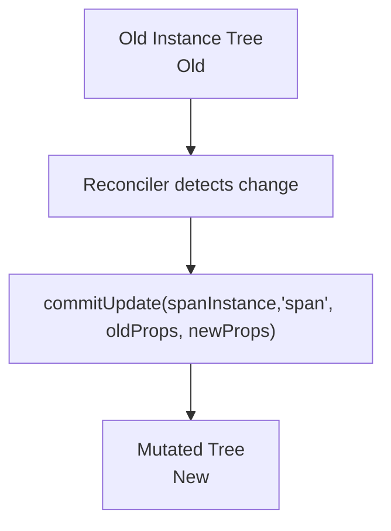
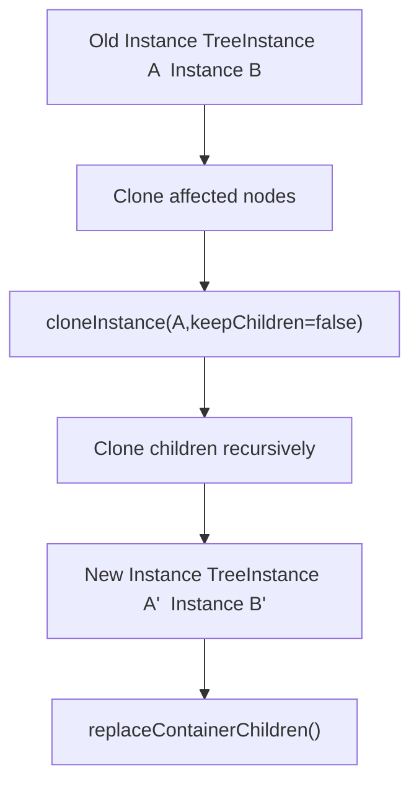
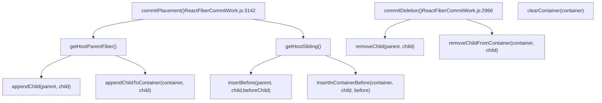
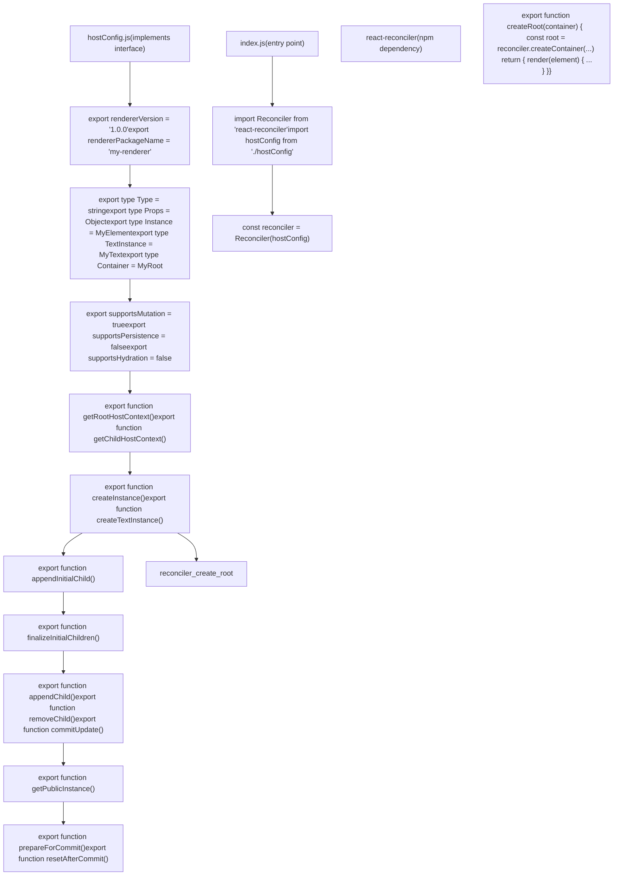

# Host Configuration Abstraction

Relevant source files

-   [packages/react-art/src/ReactFiberConfigART.js](https://github.com/facebook/react/blob/65eec428/packages/react-art/src/ReactFiberConfigART.js)
-   [packages/react-client/src/ReactFlightPerformanceTrack.js](https://github.com/facebook/react/blob/65eec428/packages/react-client/src/ReactFlightPerformanceTrack.js)
-   [packages/react-debug-tools/src/ReactDebugHooks.js](https://github.com/facebook/react/blob/65eec428/packages/react-debug-tools/src/ReactDebugHooks.js)
-   [packages/react-debug-tools/src/\_\_tests\_\_/ReactHooksInspection-test.js](https://github.com/facebook/react/blob/65eec428/packages/react-debug-tools/src/__tests__/ReactHooksInspection-test.js)
-   [packages/react-debug-tools/src/\_\_tests\_\_/ReactHooksInspectionIntegration-test.js](https://github.com/facebook/react/blob/65eec428/packages/react-debug-tools/src/__tests__/ReactHooksInspectionIntegration-test.js)
-   [packages/react-debug-tools/src/\_\_tests\_\_/ReactHooksInspectionIntegrationDOM-test.js](https://github.com/facebook/react/blob/65eec428/packages/react-debug-tools/src/__tests__/ReactHooksInspectionIntegrationDOM-test.js)
-   [packages/react-devtools-shell/src/app/InspectableElements/CustomHooks.js](https://github.com/facebook/react/blob/65eec428/packages/react-devtools-shell/src/app/InspectableElements/CustomHooks.js)
-   [packages/react-devtools-timeline/src/content-views/utils/moduleFilters.js](https://github.com/facebook/react/blob/65eec428/packages/react-devtools-timeline/src/content-views/utils/moduleFilters.js)
-   [packages/react-dom-bindings/src/client/ReactFiberConfigDOM.js](https://github.com/facebook/react/blob/65eec428/packages/react-dom-bindings/src/client/ReactFiberConfigDOM.js)
-   [packages/react-dom/src/\_\_tests\_\_/ReactDOMFiberAsync-test.js](https://github.com/facebook/react/blob/65eec428/packages/react-dom/src/__tests__/ReactDOMFiberAsync-test.js)
-   [packages/react-dom/src/\_\_tests\_\_/ReactDOMNativeEventHeuristic-test.js](https://github.com/facebook/react/blob/65eec428/packages/react-dom/src/__tests__/ReactDOMNativeEventHeuristic-test.js)
-   [packages/react-dom/src/events/plugins/\_\_tests\_\_/ChangeEventPlugin-test.js](https://github.com/facebook/react/blob/65eec428/packages/react-dom/src/events/plugins/__tests__/ChangeEventPlugin-test.js)
-   [packages/react-dom/src/events/plugins/\_\_tests\_\_/SimpleEventPlugin-test.js](https://github.com/facebook/react/blob/65eec428/packages/react-dom/src/events/plugins/__tests__/SimpleEventPlugin-test.js)
-   [packages/react-native-renderer/src/ReactFiberConfigFabric.js](https://github.com/facebook/react/blob/65eec428/packages/react-native-renderer/src/ReactFiberConfigFabric.js)
-   [packages/react-native-renderer/src/ReactFiberConfigNative.js](https://github.com/facebook/react/blob/65eec428/packages/react-native-renderer/src/ReactFiberConfigNative.js)
-   [packages/react-noop-renderer/src/createReactNoop.js](https://github.com/facebook/react/blob/65eec428/packages/react-noop-renderer/src/createReactNoop.js)
-   [packages/react-reconciler/src/ReactFiber.js](https://github.com/facebook/react/blob/65eec428/packages/react-reconciler/src/ReactFiber.js)
-   [packages/react-reconciler/src/ReactFiberBeginWork.js](https://github.com/facebook/react/blob/65eec428/packages/react-reconciler/src/ReactFiberBeginWork.js)
-   [packages/react-reconciler/src/ReactFiberClassComponent.js](https://github.com/facebook/react/blob/65eec428/packages/react-reconciler/src/ReactFiberClassComponent.js)
-   [packages/react-reconciler/src/ReactFiberCommitWork.js](https://github.com/facebook/react/blob/65eec428/packages/react-reconciler/src/ReactFiberCommitWork.js)
-   [packages/react-reconciler/src/ReactFiberCompleteWork.js](https://github.com/facebook/react/blob/65eec428/packages/react-reconciler/src/ReactFiberCompleteWork.js)
-   [packages/react-reconciler/src/ReactFiberConfigWithNoMutation.js](https://github.com/facebook/react/blob/65eec428/packages/react-reconciler/src/ReactFiberConfigWithNoMutation.js)
-   [packages/react-reconciler/src/ReactFiberGestureScheduler.js](https://github.com/facebook/react/blob/65eec428/packages/react-reconciler/src/ReactFiberGestureScheduler.js)
-   [packages/react-reconciler/src/ReactFiberHooks.js](https://github.com/facebook/react/blob/65eec428/packages/react-reconciler/src/ReactFiberHooks.js)
-   [packages/react-reconciler/src/ReactFiberLane.js](https://github.com/facebook/react/blob/65eec428/packages/react-reconciler/src/ReactFiberLane.js)
-   [packages/react-reconciler/src/ReactFiberPerformanceTrack.js](https://github.com/facebook/react/blob/65eec428/packages/react-reconciler/src/ReactFiberPerformanceTrack.js)
-   [packages/react-reconciler/src/ReactFiberRootScheduler.js](https://github.com/facebook/react/blob/65eec428/packages/react-reconciler/src/ReactFiberRootScheduler.js)
-   [packages/react-reconciler/src/ReactFiberSuspenseComponent.js](https://github.com/facebook/react/blob/65eec428/packages/react-reconciler/src/ReactFiberSuspenseComponent.js)
-   [packages/react-reconciler/src/ReactFiberUnwindWork.js](https://github.com/facebook/react/blob/65eec428/packages/react-reconciler/src/ReactFiberUnwindWork.js)
-   [packages/react-reconciler/src/ReactFiberWorkLoop.js](https://github.com/facebook/react/blob/65eec428/packages/react-reconciler/src/ReactFiberWorkLoop.js)
-   [packages/react-reconciler/src/ReactProfilerTimer.js](https://github.com/facebook/react/blob/65eec428/packages/react-reconciler/src/ReactProfilerTimer.js)
-   [packages/react-reconciler/src/\_\_tests\_\_/ReactDeferredValue-test.js](https://github.com/facebook/react/blob/65eec428/packages/react-reconciler/src/__tests__/ReactDeferredValue-test.js)
-   [packages/react-reconciler/src/\_\_tests\_\_/ReactFiberHostContext-test.internal.js](https://github.com/facebook/react/blob/65eec428/packages/react-reconciler/src/__tests__/ReactFiberHostContext-test.internal.js)
-   [packages/react-reconciler/src/\_\_tests\_\_/ReactHooks-test.internal.js](https://github.com/facebook/react/blob/65eec428/packages/react-reconciler/src/__tests__/ReactHooks-test.internal.js)
-   [packages/react-reconciler/src/\_\_tests\_\_/ReactLazy-test.internal.js](https://github.com/facebook/react/blob/65eec428/packages/react-reconciler/src/__tests__/ReactLazy-test.internal.js)
-   [packages/react-reconciler/src/\_\_tests\_\_/ReactPerformanceTrack-test.js](https://github.com/facebook/react/blob/65eec428/packages/react-reconciler/src/__tests__/ReactPerformanceTrack-test.js)
-   [packages/react-reconciler/src/\_\_tests\_\_/ReactSiblingPrerendering-test.js](https://github.com/facebook/react/blob/65eec428/packages/react-reconciler/src/__tests__/ReactSiblingPrerendering-test.js)
-   [packages/react-reconciler/src/\_\_tests\_\_/ReactSuspense-test.internal.js](https://github.com/facebook/react/blob/65eec428/packages/react-reconciler/src/__tests__/ReactSuspense-test.internal.js)
-   [packages/react-reconciler/src/\_\_tests\_\_/ReactSuspensePlaceholder-test.internal.js](https://github.com/facebook/react/blob/65eec428/packages/react-reconciler/src/__tests__/ReactSuspensePlaceholder-test.internal.js)
-   [packages/react-reconciler/src/\_\_tests\_\_/ReactSuspenseyCommitPhase-test.js](https://github.com/facebook/react/blob/65eec428/packages/react-reconciler/src/__tests__/ReactSuspenseyCommitPhase-test.js)
-   [packages/react-reconciler/src/forks/ReactFiberConfig.custom.js](https://github.com/facebook/react/blob/65eec428/packages/react-reconciler/src/forks/ReactFiberConfig.custom.js)
-   [packages/react-server/src/ReactFlightAsyncSequence.js](https://github.com/facebook/react/blob/65eec428/packages/react-server/src/ReactFlightAsyncSequence.js)
-   [packages/react-server/src/ReactFlightServerConfigDebugNode.js](https://github.com/facebook/react/blob/65eec428/packages/react-server/src/ReactFlightServerConfigDebugNode.js)
-   [packages/react-server/src/ReactFlightServerConfigDebugNoop.js](https://github.com/facebook/react/blob/65eec428/packages/react-server/src/ReactFlightServerConfigDebugNoop.js)
-   [packages/react-server/src/ReactFlightStackConfigV8.js](https://github.com/facebook/react/blob/65eec428/packages/react-server/src/ReactFlightStackConfigV8.js)
-   [packages/react-server/src/\_\_tests\_\_/ReactFlightAsyncDebugInfo-test.js](https://github.com/facebook/react/blob/65eec428/packages/react-server/src/__tests__/ReactFlightAsyncDebugInfo-test.js)
-   [packages/react-test-renderer/src/ReactFiberConfigTestHost.js](https://github.com/facebook/react/blob/65eec428/packages/react-test-renderer/src/ReactFiberConfigTestHost.js)
-   [packages/react/src/ReactHooks.js](https://github.com/facebook/react/blob/65eec428/packages/react/src/ReactHooks.js)
-   [packages/react/src/ReactLazy.js](https://github.com/facebook/react/blob/65eec428/packages/react/src/ReactLazy.js)
-   [packages/react/src/\_\_tests\_\_/ReactProfiler-test.internal.js](https://github.com/facebook/react/blob/65eec428/packages/react/src/__tests__/ReactProfiler-test.internal.js)
-   [packages/shared/ReactPerformanceTrackProperties.js](https://github.com/facebook/react/blob/65eec428/packages/shared/ReactPerformanceTrackProperties.js)
-   [packages/shared/ReactSymbols.js](https://github.com/facebook/react/blob/65eec428/packages/shared/ReactSymbols.js)

The Host Configuration Abstraction is the pluggable interface between the React reconciler and platform-specific rendering targets. It defines the contract that allows React's core reconciliation algorithm to remain platform-agnostic while supporting diverse environments like web browsers (DOM), mobile platforms (React Native), canvas rendering (ART), and custom renderers.

For information about the reconciler's work loop and fiber architecture, see [Fiber Architecture and Work Loop](/facebook/react/3.1-build-pipeline-and-module-forking). For details on specific renderer implementations, see [React DOM](/facebook/react/4.1-fiber-architecture-and-data-structures) and [React Native and Other Renderers](/facebook/react/4.2-work-loop-and-rendering-phases).

## Architecture Overview

The reconciler communicates with host environments exclusively through the host configuration interface defined in `ReactFiberConfig`. During reconciliation, the reconciler never directly creates DOM nodes, native UI components, or any platform-specific instances. Instead, it invokes host config methods at specific points in the fiber lifecycle.

**Diagram: Host Config Call Sites in Reconciler**

```mermaid
flowchart TD
    beginWork["beginWork()ReactFiberBeginWork.js:2179"]
    completeWork["completeWork()ReactFiberCompleteWork.js:908"]
    commitMutationEffects["commitMutationEffectsOnFiber()ReactFiberCommitWork.js:2252"]
    commitLayoutEffects["commitLayoutEffectOnFiber()ReactFiberCommitWork.js:594"]
    getRootHostContext["getRootHostContext(container)"]
    getChildHostContext["getChildHostContext(parent, type)"]
    createInstance["createInstance(type, props, root,context, fiber)"]
    createTextInstance["createTextInstance(text, root,context, fiber)"]
    appendInitialChild["appendInitialChild(parent, child)"]
    finalizeInitialChildren["finalizeInitialChildren(instance,type, props)"]
    appendChild["appendChild(parent, child)"]
    commitUpdate["commitUpdate(instance, type,oldProps, newProps)"]
    commitTextUpdate["commitTextUpdate(text,oldText, newText)"]
    ReactFiberConfigDOM["ReactFiberConfigDOM.js(Web Browser)"]
    ReactFiberConfigFabric["ReactFiberConfigFabric.js(React Native Fabric)"]
    ReactFiberConfigNative["ReactFiberConfigNative.js(React Native Legacy)"]
    createReactNoop["createReactNoop.js(Test Renderer)"]

    beginWork --> getRootHostContext
    beginWork --> getChildHostContext
    completeWork --> createInstance
    completeWork --> createTextInstance
    completeWork --> appendInitialChild
    completeWork --> finalizeInitialChildren
    commitMutationEffects --> appendChild
    commitMutationEffects --> commitUpdate
    commitMutationEffects --> commitTextUpdate
    createInstance --> ReactFiberConfigDOM
    createInstance --> ReactFiberConfigFabric
    createInstance --> ReactFiberConfigNative
    createInstance --> createReactNoop
```


**Sources:** [packages/react-reconciler/src/ReactFiberBeginWork.js174-186](https://github.com/facebook/react/blob/65eec428/packages/react-reconciler/src/ReactFiberBeginWork.js#L174-L186) [packages/react-reconciler/src/ReactFiberCompleteWork.js106-130](https://github.com/facebook/react/blob/65eec428/packages/react-reconciler/src/ReactFiberCompleteWork.js#L106-L130) [packages/react-reconciler/src/ReactFiberCommitWork.js156-186](https://github.com/facebook/react/blob/65eec428/packages/react-reconciler/src/ReactFiberCommitWork.js#L156-L186) [packages/react-reconciler/src/forks/ReactFiberConfig.custom.js1-50](https://github.com/facebook/react/blob/65eec428/packages/react-reconciler/src/forks/ReactFiberConfig.custom.js#L1-L50)

## Core Types and Contract

Every host configuration must export a set of opaque types and implement specific methods. The reconciler treats these types as black boxes, passing them between host config methods without inspecting their contents.

### Required Type Exports

Each host config must export these opaque types. The reconciler passes these between host config methods without inspecting their structure.

**Diagram: Type Definitions Across Renderers**

```mermaid
flowchart TD
    Noop_Type["Type = string"]
    Noop_Props["Props = {prop, hidden,children, ...}"]
    Noop_Container["Container = {rootID, children,pendingChildren}"]
    Noop_Instance["Instance = {type, id, children,prop, hidden, ...}"]
    Noop_TextInstance["TextInstance = {text, id,hidden, ...}"]
    Noop_HostContext["HostContext = Object"]
    Fabric_Type["Type = string"]
    Fabric_Props["Props = Object"]
    Fabric_Container["Container = {containerTag,publicInstance}"]
    Fabric_Instance["Instance = {node, canonical}"]
    Fabric_TextInstance["TextInstance = {node}"]
    Fabric_HostContext["HostContext = null"]
    Fabric_UpdatePayload["UpdatePayload = Object"]
    DOM_Type["Type = string"]
    DOM_Props["Props = {...}"]
    DOM_Container["Container = Element | Document| DocumentFragment"]
    DOM_Instance["Instance = Element"]
    DOM_TextInstance["TextInstance = Text"]
    DOM_HostContext["HostContext = HostContextDev| HostContextProd"]
    DOM_UpdatePayload["UpdatePayload = Array<mixed>"]
```


| Type Export | Purpose | DOM Example | Fabric Example |
| --- | --- | --- | --- |
| `Type` | Element type identifier | `'div'`, `'span'` | `'View'`, `'Text'` |
| `Props` | Properties passed to instance | `{className: 'foo'}` | `{style: {flex: 1}}` |
| `Container` | Root container object | `HTMLElement`, `Document` | `{containerTag: number}` |
| `Instance` | Platform element instance | `HTMLDivElement` | `{node: Node, canonical: object}` |
| `TextInstance` | Platform text node | `Text` | `{node: Node}` |
| `HostContext` | Context propagated down tree | `HostContextNamespace` enum | `null` |
| `UpdatePayload` | Update diff payload | `[key1, val1, key2, val2]` | `{style: {...}}` |

**Sources:** [packages/react-dom-bindings/src/client/ReactFiberConfigDOM.js153-251](https://github.com/facebook/react/blob/65eec428/packages/react-dom-bindings/src/client/ReactFiberConfigDOM.js#L153-L251) [packages/react-native-renderer/src/ReactFiberConfigFabric.js92-131](https://github.com/facebook/react/blob/65eec428/packages/react-native-renderer/src/ReactFiberConfigFabric.js#L92-L131) [packages/react-noop-renderer/src/createReactNoop.js44-78](https://github.com/facebook/react/blob/65eec428/packages/react-noop-renderer/src/createReactNoop.js#L44-L78)

## Mutation vs Persistence Strategies

Host configurations declare their rendering strategy through two boolean flags: `supportsMutation` and `supportsPersistence`. These strategies determine how the reconciler applies changes to the host tree.

### Mutation Strategy

Mutation-based renderers modify instances in place. The reconciler calls methods like `appendChild()`, `removeChild()`, and `commitUpdate()` to mutate the existing tree structure.


**Mutation Methods:**

-   `appendChild(parentInstance, child)` - Add child to parent
-   `insertBefore(parentInstance, child, beforeChild)` - Insert at position
-   `removeChild(parentInstance, child)` - Remove from parent
-   `commitUpdate(instance, type, oldProps, newProps)` - Apply property changes
-   `commitTextUpdate(textInstance, oldText, newText)` - Update text content

**Sources:** [packages/react-dom-bindings/src/client/ReactFiberConfigDOM.js806-955](https://github.com/facebook/react/blob/65eec428/packages/react-dom-bindings/src/client/ReactFiberConfigDOM.js#L806-L955) [packages/react-native-renderer/src/ReactFiberConfigNative.js377-467](https://github.com/facebook/react/blob/65eec428/packages/react-native-renderer/src/ReactFiberConfigNative.js#L377-L467)

### Persistence Strategy

Persistence-based renderers create immutable instance trees. When changes occur, the reconciler clones affected nodes and builds a new subtree, then replaces the old tree atomically.


**Persistence Methods:**

-   `cloneInstance(instance, type, oldProps, newProps, keepChildren, newChildSet)` - Create copy with changes
-   `createContainerChildSet()` - Initialize set for batching
-   `appendChildToContainerChildSet(childSet, child)` - Add to batch
-   `finalizeContainerChildren(container, newChildren)` - Prepare batch
-   `replaceContainerChildren(container, newChildren)` - Atomic replace

**Sources:** [packages/react-native-renderer/src/ReactFiberConfigFabric.js445-557](https://github.com/facebook/react/blob/65eec428/packages/react-native-renderer/src/ReactFiberConfigFabric.js#L445-L557) [packages/react-noop-renderer/src/createReactNoop.js903-941](https://github.com/facebook/react/blob/65eec428/packages/react-noop-renderer/src/createReactNoop.js#L903-L941)

## Instance Creation and Initialization Lifecycle

The reconciler creates host instances through a multi-phase lifecycle. Each phase corresponds to specific host config methods called at different points during reconciliation.

> **[Mermaid sequence]**
> *(图表结构无法解析)*

### Context Management

Host context flows down the tree, allowing parent nodes to influence child rendering. For example, the DOM renderer tracks SVG and MathML namespaces.

**DOM Context Example:**

-   Root context determines initial namespace
-   When entering `<svg>`, context becomes `HostContextNamespaceSvg`
-   Children inherit SVG namespace for proper `createElementNS()` calls
-   `<foreignObject>` resets to default namespace

**Sources:** [packages/react-dom-bindings/src/client/ReactFiberConfigDOM.js279-401](https://github.com/facebook/react/blob/65eec428/packages/react-dom-bindings/src/client/ReactFiberConfigDOM.js#L279-L401) [packages/react-native-renderer/src/ReactFiberConfigFabric.js255-287](https://github.com/facebook/react/blob/65eec428/packages/react-native-renderer/src/ReactFiberConfigFabric.js#L255-L287)

### Instance Creation

The `createInstance()` method is the primary factory for host elements. Called from `completeWork()` in [packages/react-reconciler/src/ReactFiberCompleteWork.js1019-1038](https://github.com/facebook/react/blob/65eec428/packages/react-reconciler/src/ReactFiberCompleteWork.js#L1019-L1038)

**Diagram: createInstance() Implementation Patterns**

```mermaid
flowchart TD
    Noop_create["createInstance(type, props,root, context, fiber)"]
    Noop_compute["computeText() ifshouldSetTextContent()"]
    Noop_object["Create instance object:{type, id, children, prop,hidden, text, context}"]
    Noop_return["return instance"]
    Fabric_create["createInstance(type, props,root, context, fiber)"]
    Fabric_tag["tag = instanceCounter++"]
    Fabric_config["viewConfig = getViewConfig(type)"]
    Fabric_payload["createAttributePayload(type,props, viewConfig)"]
    Fabric_native["FabricUIManager.createNode(tag, viewName, root, props, fiber)"]
    Fabric_obj["return {node, canonical}"]
    DOM_create["createInstance(type, props,root, context, fiber)"]
    DOM_namespace["Determine namespace fromhostContext"]
    DOM_createElement["ownerDocument.createElement(type)or createElementNS()"]
    DOM_cache["precacheFiberNode(fiber, element)"]
    DOM_props["updateFiberProps(element, props)"]
    DOM_init["setInitialProperties(element,type, props)"]
    DOM_return["return element"]

    Noop --> create_Noop_compute
    Noop --> compute_Noop_object
    Noop --> object_Noop_return
    Fabric --> create_Fabric_tag
    Fabric --> tag_Fabric_config
    Fabric --> config_Fabric_payload
    Fabric --> payload_Fabric_native
    Fabric --> native_Fabric_obj
    DOM --> create_DOM_namespace
    DOM --> namespace_DOM_createElement
    DOM --> createElement_DOM_cache
    DOM --> cache_DOM_props
    DOM --> props_DOM_init
    DOM --> init_DOM_return
```


**Key Function Signatures:**

**DOM:**

```
function createInstance(
  type: string,
  props: Props,
  rootContainerInstance: Container,
  hostContext: HostContext,
  internalInstanceHandle: Object,
): Instance
```
**Fabric:**

```
function createInstance(
  type: string,
  props: Props,
  rootContainerInstance: Container,
  hostContext: HostContext,
  internalInstanceHandle: Object,
): Instance // {node: Node, canonical: InstanceHandle}
```
**Sources:** [packages/react-dom-bindings/src/client/ReactFiberConfigDOM.js484-603](https://github.com/facebook/react/blob/65eec428/packages/react-dom-bindings/src/client/ReactFiberConfigDOM.js#L484-L603) [packages/react-native-renderer/src/ReactFiberConfigFabric.js172-216](https://github.com/facebook/react/blob/65eec428/packages/react-native-renderer/src/ReactFiberConfigFabric.js#L172-L216) [packages/react-noop-renderer/src/createReactNoop.js399-457](https://github.com/facebook/react/blob/65eec428/packages/react-noop-renderer/src/createReactNoop.js#L399-L457)

### Child Attachment

During the complete phase, the reconciler attaches children to their parents before the tree is committed. For mutation renderers, this typically involves direct DOM manipulation. For persistence renderers, it builds up the cloned tree structure.

**Sources:** [packages/react-dom-bindings/src/client/ReactFiberConfigDOM.js612-618](https://github.com/facebook/react/blob/65eec428/packages/react-dom-bindings/src/client/ReactFiberConfigDOM.js#L612-L618) [packages/react-native-renderer/src/ReactFiberConfigFabric.js163-168](https://github.com/facebook/react/blob/65eec428/packages/react-native-renderer/src/ReactFiberConfigFabric.js#L163-L168)

### Finalization

The `finalizeInitialChildren()` method performs any final setup needed before commit. It returns a boolean indicating whether `commitMount()` should be called during the commit phase.

**DOM Use Case:**

-   Returns `true` for `<input>`, `<button>`, `<select>`, `<textarea>` with `autoFocus`
-   Returns `true` for `` to set up load event handling
-   Otherwise returns `false`

**Sources:** [packages/react-dom-bindings/src/client/ReactFiberConfigDOM.js620-638](https://github.com/facebook/react/blob/65eec428/packages/react-dom-bindings/src/client/ReactFiberConfigDOM.js#L620-L638) [packages/react-native-renderer/src/ReactFiberConfigFabric.js246-253](https://github.com/facebook/react/blob/65eec428/packages/react-native-renderer/src/ReactFiberConfigFabric.js#L246-L253)

## Commit Phase Operations

After the render phase completes, the reconciler commits changes to the host tree. The commit phase is orchestrated by [packages/react-reconciler/src/ReactFiberWorkLoop.js2845-3144](https://github.com/facebook/react/blob/65eec428/packages/react-reconciler/src/ReactFiberWorkLoop.js#L2845-L3144) and calls host config methods through `commitMutationEffects()` and `commitLayoutEffects()`.

### Updates and Property Changes

When props change, the reconciler calls `commitUpdate()` from `commitMutationEffectsOnFiber()` in [packages/react-reconciler/src/ReactFiberCommitWork.js2455-2460](https://github.com/facebook/react/blob/65eec428/packages/react-reconciler/src/ReactFiberCommitWork.js#L2455-L2460)

**Diagram: commitUpdate() Call Flow**

> **[Mermaid sequence]**
> *(图表结构无法解析)*

**Function Signatures:**

**DOM ([ReactFiberConfigDOM.js912-925](https://github.com/facebook/react/blob/65eec428/ReactFiberConfigDOM.js#L912-L925)):**

```
function commitUpdate(
  domElement: Instance,
  type: Type,
  oldProps: Props,
  newProps: Props,
  internalInstanceHandle: Object,
): void
```
**Fabric ([ReactFiberConfigFabric.js299-322](https://github.com/facebook/react/blob/65eec428/ReactFiberConfigFabric.js#L299-L322)):**

```
function commitUpdate(
  instance: Instance,
  type: string,
  oldProps: Props,
  newProps: Props,
  internalInstanceHandle: Object,
): void
```
**Sources:** [packages/react-reconciler/src/ReactFiberCommitWork.js2252-2530](https://github.com/facebook/react/blob/65eec428/packages/react-reconciler/src/ReactFiberCommitWork.js#L2252-L2530) [packages/react-dom-bindings/src/client/ReactFiberConfigDOM.js912-925](https://github.com/facebook/react/blob/65eec428/packages/react-dom-bindings/src/client/ReactFiberConfigDOM.js#L912-L925) [packages/react-native-renderer/src/ReactFiberConfigFabric.js299-322](https://github.com/facebook/react/blob/65eec428/packages/react-native-renderer/src/ReactFiberConfigFabric.js#L299-L322) [packages/react-native-renderer/src/ReactFiberConfigNative.js445-468](https://github.com/facebook/react/blob/65eec428/packages/react-native-renderer/src/ReactFiberConfigNative.js#L445-L468)

### Tree Structure Mutations

The reconciler calls structure mutation methods from `commitPlacement()` in [packages/react-reconciler/src/ReactFiberCommitWork.js3142-3244](https://github.com/facebook/react/blob/65eec428/packages/react-reconciler/src/ReactFiberCommitWork.js#L3142-L3244) and `commitDeletion()` in [packages/react-reconciler/src/ReactFiberCommitWork.js2966-3030](https://github.com/facebook/react/blob/65eec428/packages/react-reconciler/src/ReactFiberCommitWork.js#L2966-L3030)

**Diagram: Mutation Method Call Sites**


**Mutation Methods Reference:**

| Method | Signature (DOM) | Called From | Purpose |
| --- | --- | --- | --- |
| `appendChild()` | `(parent: Instance, child: Instance) => void` | `commitPlacement()` | Append to end of parent |
| `appendChildToContainer()` | `(container: Container, child: Instance) => void` | `commitPlacement()` | Append to container root |
| `insertBefore()` | `(parent: Instance, child: Instance, before: Instance) => void` | `commitPlacement()` | Insert at specific position |
| `insertInContainerBefore()` | `(container: Container, child: Instance, before: Instance) => void` | `commitPlacement()` | Insert in container |
| `removeChild()` | `(parent: Instance, child: Instance) => void` | `commitDeletion()` | Remove from parent |
| `removeChildFromContainer()` | `(container: Container, child: Instance) => void` | `commitDeletion()` | Remove from container |
| `clearContainer()` | `(container: Container) => void` | `commitBeforeMutationEffects()` | Clear all children |

**Sources:** [packages/react-reconciler/src/ReactFiberCommitWork.js2966-3244](https://github.com/facebook/react/blob/65eec428/packages/react-reconciler/src/ReactFiberCommitWork.js#L2966-L3244) [packages/react-dom-bindings/src/client/ReactFiberConfigDOM.js945-1087](https://github.com/facebook/react/blob/65eec428/packages/react-dom-bindings/src/client/ReactFiberConfigDOM.js#L945-L1087) [packages/react-noop-renderer/src/createReactNoop.js132-241](https://github.com/facebook/react/blob/65eec428/packages/react-noop-renderer/src/createReactNoop.js#L132-L241)

## Priority and Event Integration

Host configurations integrate with the reconciler's scheduling system through priority-related methods exported via [packages/react-dom-bindings/src/client/ReactDOMUpdatePriority.js1-50](https://github.com/facebook/react/blob/65eec428/packages/react-dom-bindings/src/client/ReactDOMUpdatePriority.js#L1-L50) These methods are called by `requestUpdateLane()` in [packages/react-reconciler/src/ReactFiberWorkLoop.js792-836](https://github.com/facebook/react/blob/65eec428/packages/react-reconciler/src/ReactFiberWorkLoop.js#L792-L836)

**Diagram: Priority Resolution Flow**

> **[Mermaid sequence]**
> *(图表结构无法解析)*

**Priority API Functions:**

| Function | DOM Implementation | Fabric Implementation | Purpose |
| --- | --- | --- | --- |
| `setCurrentUpdatePriority(priority)` | Sets `currentUpdatePriority` variable | Sets `currentUpdatePriority` variable | Override priority for event dispatch |
| `getCurrentUpdatePriority()` | Returns `currentUpdatePriority` | Returns `currentUpdatePriority` | Get current override |
| `resolveUpdatePriority()` | Maps `window.event.type` to priority | Calls `fabricGetCurrentEventPriority()` | Resolve default priority |

**DOM resolveUpdatePriority() ([ReactDOMUpdatePriority.js23-38](https://github.com/facebook/react/blob/65eec428/ReactDOMUpdatePriority.js#L23-L38)):**

-   Returns `currentUpdatePriority` if set
-   Otherwise checks `window.event.type`:
    -   `'click'`, `'keydown'`, etc. → `DiscreteEventPriority`
    -   `'drag'`, `'scroll'`, etc. → `ContinuousEventPriority`
    -   Default → `DefaultEventPriority`

**Fabric resolveUpdatePriority() ([ReactFiberConfigFabric.js382-415](https://github.com/facebook/react/blob/65eec428/ReactFiberConfigFabric.js#L382-L415)):**

-   Returns `currentUpdatePriority` if set
-   Otherwise calls native `fabricGetCurrentEventPriority()`:
    -   `FabricDiscretePriority` → `DiscreteEventPriority`
    -   `FabricContinuousPriority` → `ContinuousEventPriority`
    -   `FabricDefaultPriority` → `DefaultEventPriority`
    -   `FabricIdlePriority` → `IdleEventPriority`

**Sources:** [packages/react-dom-bindings/src/client/ReactDOMUpdatePriority.js1-50](https://github.com/facebook/react/blob/65eec428/packages/react-dom-bindings/src/client/ReactDOMUpdatePriority.js#L1-L50) [packages/react-native-renderer/src/ReactFiberConfigFabric.js382-415](https://github.com/facebook/react/blob/65eec428/packages/react-native-renderer/src/ReactFiberConfigFabric.js#L382-L415) [packages/react-reconciler/src/ReactFiberWorkLoop.js792-836](https://github.com/facebook/react/blob/65eec428/packages/react-reconciler/src/ReactFiberWorkLoop.js#L792-L836) [packages/react-reconciler/src/ReactEventPriorities.js1-100](https://github.com/facebook/react/blob/65eec428/packages/react-reconciler/src/ReactEventPriorities.js#L1-L100)

## Commit Lifecycle Hooks

Host configurations can perform setup and cleanup around commit operations through lifecycle hooks.

### Pre-Commit Hook

`prepareForCommit(containerInfo)` is called before any commit work begins. It should return any state needed for `resetAfterCommit()`.

**DOM Usage:**

-   Disables event dispatching
-   Saves selection information (focused element, selection range)
-   Returns active instance for blur handling

**Sources:** [packages/react-dom-bindings/src/client/ReactFiberConfigDOM.js407-419](https://github.com/facebook/react/blob/65eec428/packages/react-dom-bindings/src/client/ReactFiberConfigDOM.js#L407-L419)

### Post-Commit Hook

`resetAfterCommit(containerInfo)` is called after all commit work completes.

**DOM Usage:**

-   Restores text selection and focus
-   Re-enables event dispatching
-   Cleans up temporary state

**Sources:** [packages/react-dom-bindings/src/client/ReactFiberConfigDOM.js440-445](https://github.com/facebook/react/blob/65eec428/packages/react-dom-bindings/src/client/ReactFiberConfigDOM.js#L440-L445)

## Renderer Implementation Comparison

Different renderers implement the host config contract with varying strategies based on their platform constraints.

### Implementation Strategy Matrix

| Renderer | Strategy | supportsMutation | supportsPersistence | Primary Use Case |
| --- | --- | --- | --- | --- |
| ReactDOM | Mutation | `true` | `false` | Web browsers |
| ReactFabric | Persistence | `false` | `true` | React Native (new architecture) |
| ReactNative | Mutation | `true` | `false` | React Native (legacy) |
| ReactNoop | Both | Configurable | Configurable | Testing |
| ReactART | Mutation | `true` | `false` | Canvas rendering |
| TestRenderer | Mutation | `true` | `false` | Unit testing |

**Sources:** [packages/react-dom-bindings/src/client/ReactFiberConfigDOM.js806](https://github.com/facebook/react/blob/65eec428/packages/react-dom-bindings/src/client/ReactFiberConfigDOM.js#L806-L806) [packages/react-native-renderer/src/ReactFiberConfigFabric.js445](https://github.com/facebook/react/blob/65eec428/packages/react-native-renderer/src/ReactFiberConfigFabric.js#L445-L445) [packages/react-native-renderer/src/ReactFiberConfigNative.js377](https://github.com/facebook/react/blob/65eec428/packages/react-native-renderer/src/ReactFiberConfigNative.js#L377-L377)

### Platform-Specific Instance Types

```mermaid
flowchart TD
    TestInstance["Instance = { type, props, children, tag }"]
    TestText["TextInstance = { text, isHidden, tag }"]
    TestContainer["Container = { children, createNodeMock, tag }"]
    NativeInstance["Instance = ReactNativeFiberHostComponent"]
    NativeText["TextInstance = number (tag)"]
    NativeContainer["Container = { containerTag, publicInstance }"]
    FabricInstance["Instance = { node, canonical }"]
    FabricText["TextInstance = { node }"]
    FabricContainer["Container = { containerTag, publicInstance }"]
    DOMInstance["Instance = Element"]
    DOMText["TextInstance = Text"]
    DOMContainer["Container = Element | Document"]
```


**Sources:** [packages/react-dom-bindings/src/client/ReactFiberConfigDOM.js210-215](https://github.com/facebook/react/blob/65eec428/packages/react-dom-bindings/src/client/ReactFiberConfigDOM.js#L210-L215) [packages/react-native-renderer/src/ReactFiberConfigFabric.js94-126](https://github.com/facebook/react/blob/65eec428/packages/react-native-renderer/src/ReactFiberConfigFabric.js#L94-L126) [packages/react-native-renderer/src/ReactFiberConfigNative.js61-68](https://github.com/facebook/react/blob/65eec428/packages/react-native-renderer/src/ReactFiberConfigNative.js#L61-L68) [packages/react-test-renderer/src/ReactFiberConfigTestHost.js28-46](https://github.com/facebook/react/blob/65eec428/packages/react-test-renderer/src/ReactFiberConfigTestHost.js#L28-L46)

## Custom Renderer Integration

Third-party developers can create custom renderers by installing `react-reconciler` and implementing the host config interface. The reconciler imports host config methods through [packages/react-reconciler/src/forks/ReactFiberConfig.custom.js1-285](https://github.com/facebook/react/blob/65eec428/packages/react-reconciler/src/forks/ReactFiberConfig.custom.js#L1-L285)

### Custom Host Config Template

The `ReactFiberConfig.custom.js` file acts as a shim that re-exports the user-provided host config object. Custom renderers must provide a module that exports all required host config methods.

**Diagram: Custom Renderer Module Structure**


**Required Method Exports:**

**Core Instance Lifecycle:**

-   `createInstance(type, props, rootContainer, hostContext, fiber): Instance`
-   `createTextInstance(text, rootContainer, hostContext, fiber): TextInstance`
-   `appendInitialChild(parent, child): void`
-   `finalizeInitialChildren(instance, type, props, rootContainer, hostContext): boolean`

**Context Management:**

-   `getRootHostContext(rootContainer): HostContext`
-   `getChildHostContext(parentContext, type, rootContainer): HostContext`

**Public API:**

-   `getPublicInstance(instance): PublicInstance`

**Commit Lifecycle:**

-   `prepareForCommit(containerInfo): Object | null`
-   `resetAfterCommit(containerInfo): void`

**Mutation Strategy (if `supportsMutation === true`):**

-   `appendChild(parent, child): void`
-   `appendChildToContainer(container, child): void`
-   `insertBefore(parent, child, beforeChild): void`
-   `removeChild(parent, child): void`
-   `removeChildFromContainer(container, child): void`
-   `commitUpdate(instance, updatePayload, type, prevProps, nextProps, fiber): void`
-   `commitTextUpdate(textInstance, oldText, newText): void`

**Persistence Strategy (if `supportsPersistence === true`):**

-   `cloneInstance(instance, type, oldProps, newProps, keepChildren, children): Instance`
-   `createContainerChildSet(container): ChildSet`
-   `appendChildToContainerChildSet(childSet, child): void`
-   `finalizeContainerChildren(container, newChildren): void`
-   `replaceContainerChildren(container, newChildren): void`

**Sources:** [packages/react-reconciler/src/forks/ReactFiberConfig.custom.js1-285](https://github.com/facebook/react/blob/65eec428/packages/react-reconciler/src/forks/ReactFiberConfig.custom.js#L1-L285) [packages/react-noop-renderer/src/createReactNoop.js111-1055](https://github.com/facebook/react/blob/65eec428/packages/react-noop-renderer/src/createReactNoop.js#L111-L1055)

### Optional Feature Modules

Renderers that don't support certain features can re-export stub modules:

**No Mutation Support:**

```
export * from 'react-reconciler/src/ReactFiberConfigWithNoMutation';
```
**No Hydration Support:**

```
export * from 'react-reconciler/src/ReactFiberConfigWithNoHydration';
```
**No Persistence Support:**

```
export * from 'react-reconciler/src/ReactFiberConfigWithNoPersistence';
```
These modules export functions that throw errors if called, ensuring incorrect usage is caught at runtime.

**Sources:** [packages/react-reconciler/src/ReactFiberConfigWithNoMutation.js1-61](https://github.com/facebook/react/blob/65eec428/packages/react-reconciler/src/ReactFiberConfigWithNoMutation.js#L1-L61) [packages/react-native-renderer/src/ReactFiberConfigFabric.js156-162](https://github.com/facebook/react/blob/65eec428/packages/react-native-renderer/src/ReactFiberConfigFabric.js#L156-L162)

## Visibility and Offscreen Handling

The host config provides methods for hiding and unhiding instances, used by Offscreen components and Suspense boundaries.

### Hide/Unhide Contract

> **[Mermaid sequence]**
> *(图表结构无法解析)*

**DOM Implementation:**

-   `hideInstance()` - Sets `display: none` style
-   `unhideInstance()` - Restores style from props (respects `hidden` prop)

**Fabric Implementation:**

-   `cloneHiddenInstance()` - Clones with `display: none` style in payload
-   Persistence strategy: creates new node with hidden style

**Sources:** [packages/react-dom-bindings/src/client/ReactFiberConfigDOM.js1135-1173](https://github.com/facebook/react/blob/65eec428/packages/react-dom-bindings/src/client/ReactFiberConfigDOM.js#L1135-L1173) [packages/react-native-renderer/src/ReactFiberConfigFabric.js502-517](https://github.com/facebook/react/blob/65eec428/packages/react-native-renderer/src/ReactFiberConfigFabric.js#L502-L517)

## Advanced Features

### Suspenseful Commit

Some renderers support suspending the commit phase to wait for resources to load (e.g., images, fonts).

**Suspenseful Commit Flow:**

```
maySuspendCommit(type, props) → boolean
  ↓
preloadInstance(instance, type, props) → boolean (isReady)
  ↓
If not ready:
  startSuspendingCommit() → SuspendedState
  suspendInstance(state, instance, type, props)
  waitForCommitToBeReady(state, timeout) → callback
  ↓
When ready: callback is invoked, commit proceeds
```
**Sources:** [packages/react-noop-renderer/src/createReactNoop.js618-703](https://github.com/facebook/react/blob/65eec428/packages/react-noop-renderer/src/createReactNoop.js#L618-L703)

### View Transitions

The DOM renderer supports the View Transitions API through host config methods.

**View Transition Methods:**

-   `applyViewTransitionName()` - Apply transition name to instance
-   `startViewTransition()` - Begin transition with callbacks
-   `measureInstance()` - Capture element geometry
-   `stopViewTransition()` - Cancel running transition

**Sources:** [packages/react-dom-bindings/src/client/ReactFiberConfigDOM.js1175-1372](https://github.com/facebook/react/blob/65eec428/packages/react-dom-bindings/src/client/ReactFiberConfigDOM.js#L1175-L1372)

### Fragment Instances

Some renderers provide fragment instances that expose APIs on fragments (groups of elements without a parent).

**Fragment API Pattern:**

```
export function createFragmentInstance(fragmentFiber) {
  return new FragmentInstance(fragmentFiber);
}

FragmentInstance.prototype.compareDocumentPosition = function(otherNode) {
  // Compare position with another node
}

FragmentInstance.prototype.observeUsing = function(observer) {
  // Attach IntersectionObserver to fragment children
}
```
**Sources:** [packages/react-native-renderer/src/ReactFiberConfigFabric.js654-831](https://github.com/facebook/react/blob/65eec428/packages/react-native-renderer/src/ReactFiberConfigFabric.js#L654-L831)

## Testing and Debugging Hooks

### DevTools Integration

The host config can provide debugging metadata through `extraDevToolsConfig`:

```
export const extraDevToolsConfig = {
  getInspectorDataForInstance,
  getInspectorDataForViewTag,
  getInspectorDataForViewAtPoint,
};
```
**Sources:** [packages/react-native-renderer/src/ReactFiberConfigFabric.js76-80](https://github.com/facebook/react/blob/65eec428/packages/react-native-renderer/src/ReactFiberConfigFabric.js#L76-L80)

### Test Selectors

Renderers can implement test selector APIs for querying rendered elements in tests:

```
export const supportsTestSelectors = true;
export function findFiberRoot(node) { /* ... */ }
export function getBoundingRect(node) { /* ... */ }
export function matchAccessibilityRole(node, role) { /* ... */ }
```
**Sources:** [packages/react-reconciler/src/forks/ReactFiberConfig.custom.js119-127](https://github.com/facebook/react/blob/65eec428/packages/react-reconciler/src/forks/ReactFiberConfig.custom.js#L119-L127)
