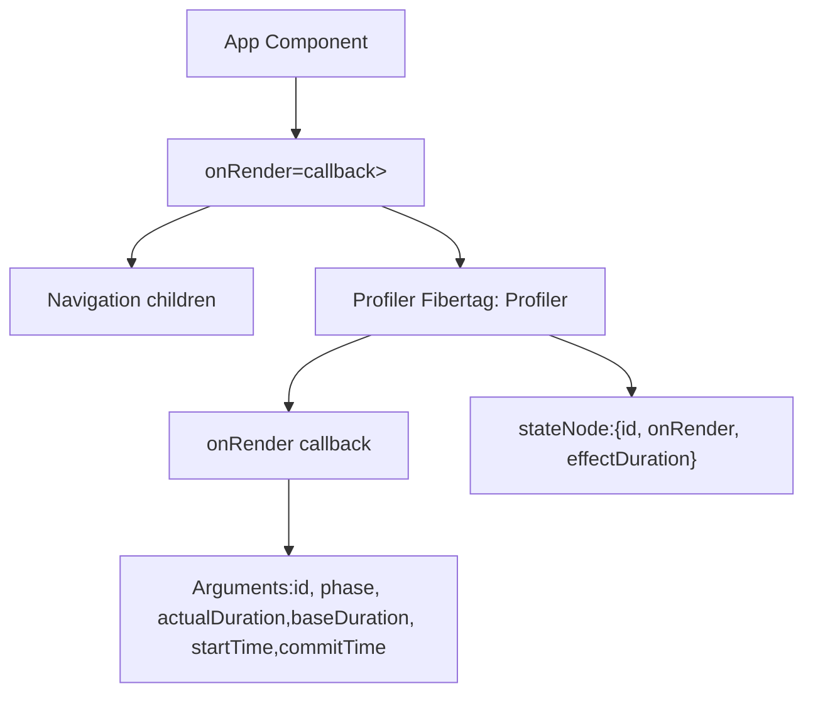
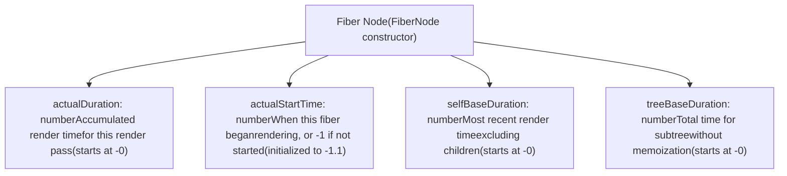
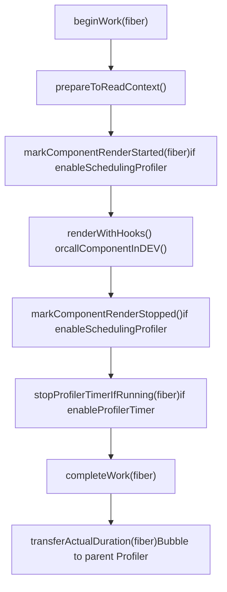
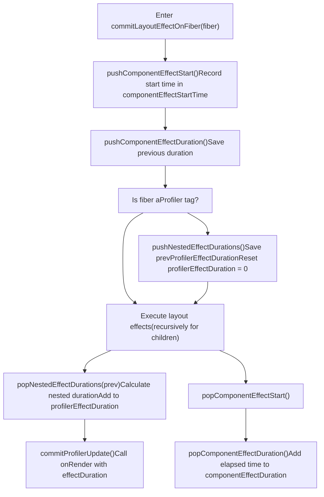
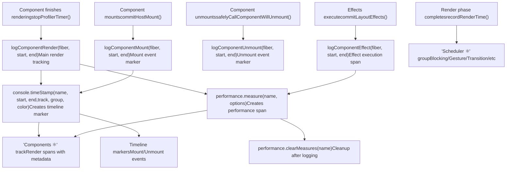
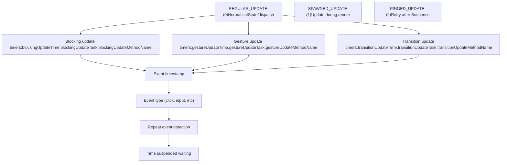
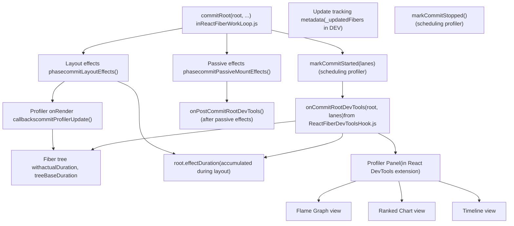

# Profiling and Performance Tracking

Relevant source files

-   [packages/react-client/src/ReactFlightPerformanceTrack.js](https://github.com/facebook/react/blob/65eec428/packages/react-client/src/ReactFlightPerformanceTrack.js)
-   [packages/react-debug-tools/src/ReactDebugHooks.js](https://github.com/facebook/react/blob/65eec428/packages/react-debug-tools/src/ReactDebugHooks.js)
-   [packages/react-debug-tools/src/\_\_tests\_\_/ReactHooksInspection-test.js](https://github.com/facebook/react/blob/65eec428/packages/react-debug-tools/src/__tests__/ReactHooksInspection-test.js)
-   [packages/react-debug-tools/src/\_\_tests\_\_/ReactHooksInspectionIntegration-test.js](https://github.com/facebook/react/blob/65eec428/packages/react-debug-tools/src/__tests__/ReactHooksInspectionIntegration-test.js)
-   [packages/react-debug-tools/src/\_\_tests\_\_/ReactHooksInspectionIntegrationDOM-test.js](https://github.com/facebook/react/blob/65eec428/packages/react-debug-tools/src/__tests__/ReactHooksInspectionIntegrationDOM-test.js)
-   [packages/react-devtools-shell/src/app/InspectableElements/CustomHooks.js](https://github.com/facebook/react/blob/65eec428/packages/react-devtools-shell/src/app/InspectableElements/CustomHooks.js)
-   [packages/react-devtools-timeline/src/content-views/utils/moduleFilters.js](https://github.com/facebook/react/blob/65eec428/packages/react-devtools-timeline/src/content-views/utils/moduleFilters.js)
-   [packages/react-dom/src/\_\_tests\_\_/ReactDOMFiberAsync-test.js](https://github.com/facebook/react/blob/65eec428/packages/react-dom/src/__tests__/ReactDOMFiberAsync-test.js)
-   [packages/react-dom/src/\_\_tests\_\_/ReactDOMNativeEventHeuristic-test.js](https://github.com/facebook/react/blob/65eec428/packages/react-dom/src/__tests__/ReactDOMNativeEventHeuristic-test.js)
-   [packages/react-dom/src/events/plugins/\_\_tests\_\_/ChangeEventPlugin-test.js](https://github.com/facebook/react/blob/65eec428/packages/react-dom/src/events/plugins/__tests__/ChangeEventPlugin-test.js)
-   [packages/react-dom/src/events/plugins/\_\_tests\_\_/SimpleEventPlugin-test.js](https://github.com/facebook/react/blob/65eec428/packages/react-dom/src/events/plugins/__tests__/SimpleEventPlugin-test.js)
-   [packages/react-reconciler/src/ReactFiber.js](https://github.com/facebook/react/blob/65eec428/packages/react-reconciler/src/ReactFiber.js)
-   [packages/react-reconciler/src/ReactFiberBeginWork.js](https://github.com/facebook/react/blob/65eec428/packages/react-reconciler/src/ReactFiberBeginWork.js)
-   [packages/react-reconciler/src/ReactFiberClassComponent.js](https://github.com/facebook/react/blob/65eec428/packages/react-reconciler/src/ReactFiberClassComponent.js)
-   [packages/react-reconciler/src/ReactFiberCommitWork.js](https://github.com/facebook/react/blob/65eec428/packages/react-reconciler/src/ReactFiberCommitWork.js)
-   [packages/react-reconciler/src/ReactFiberCompleteWork.js](https://github.com/facebook/react/blob/65eec428/packages/react-reconciler/src/ReactFiberCompleteWork.js)
-   [packages/react-reconciler/src/ReactFiberHooks.js](https://github.com/facebook/react/blob/65eec428/packages/react-reconciler/src/ReactFiberHooks.js)
-   [packages/react-reconciler/src/ReactFiberLane.js](https://github.com/facebook/react/blob/65eec428/packages/react-reconciler/src/ReactFiberLane.js)
-   [packages/react-reconciler/src/ReactFiberPerformanceTrack.js](https://github.com/facebook/react/blob/65eec428/packages/react-reconciler/src/ReactFiberPerformanceTrack.js)
-   [packages/react-reconciler/src/ReactFiberRootScheduler.js](https://github.com/facebook/react/blob/65eec428/packages/react-reconciler/src/ReactFiberRootScheduler.js)
-   [packages/react-reconciler/src/ReactFiberSuspenseComponent.js](https://github.com/facebook/react/blob/65eec428/packages/react-reconciler/src/ReactFiberSuspenseComponent.js)
-   [packages/react-reconciler/src/ReactFiberUnwindWork.js](https://github.com/facebook/react/blob/65eec428/packages/react-reconciler/src/ReactFiberUnwindWork.js)
-   [packages/react-reconciler/src/ReactFiberWorkLoop.js](https://github.com/facebook/react/blob/65eec428/packages/react-reconciler/src/ReactFiberWorkLoop.js)
-   [packages/react-reconciler/src/ReactProfilerTimer.js](https://github.com/facebook/react/blob/65eec428/packages/react-reconciler/src/ReactProfilerTimer.js)
-   [packages/react-reconciler/src/\_\_tests\_\_/ReactDeferredValue-test.js](https://github.com/facebook/react/blob/65eec428/packages/react-reconciler/src/__tests__/ReactDeferredValue-test.js)
-   [packages/react-reconciler/src/\_\_tests\_\_/ReactHooks-test.internal.js](https://github.com/facebook/react/blob/65eec428/packages/react-reconciler/src/__tests__/ReactHooks-test.internal.js)
-   [packages/react-reconciler/src/\_\_tests\_\_/ReactLazy-test.internal.js](https://github.com/facebook/react/blob/65eec428/packages/react-reconciler/src/__tests__/ReactLazy-test.internal.js)
-   [packages/react-reconciler/src/\_\_tests\_\_/ReactPerformanceTrack-test.js](https://github.com/facebook/react/blob/65eec428/packages/react-reconciler/src/__tests__/ReactPerformanceTrack-test.js)
-   [packages/react-reconciler/src/\_\_tests\_\_/ReactSiblingPrerendering-test.js](https://github.com/facebook/react/blob/65eec428/packages/react-reconciler/src/__tests__/ReactSiblingPrerendering-test.js)
-   [packages/react-reconciler/src/\_\_tests\_\_/ReactSuspense-test.internal.js](https://github.com/facebook/react/blob/65eec428/packages/react-reconciler/src/__tests__/ReactSuspense-test.internal.js)
-   [packages/react-reconciler/src/\_\_tests\_\_/ReactSuspensePlaceholder-test.internal.js](https://github.com/facebook/react/blob/65eec428/packages/react-reconciler/src/__tests__/ReactSuspensePlaceholder-test.internal.js)
-   [packages/react-reconciler/src/\_\_tests\_\_/ReactSuspenseyCommitPhase-test.js](https://github.com/facebook/react/blob/65eec428/packages/react-reconciler/src/__tests__/ReactSuspenseyCommitPhase-test.js)
-   [packages/react-server/src/ReactFlightAsyncSequence.js](https://github.com/facebook/react/blob/65eec428/packages/react-server/src/ReactFlightAsyncSequence.js)
-   [packages/react-server/src/ReactFlightServerConfigDebugNode.js](https://github.com/facebook/react/blob/65eec428/packages/react-server/src/ReactFlightServerConfigDebugNode.js)
-   [packages/react-server/src/ReactFlightServerConfigDebugNoop.js](https://github.com/facebook/react/blob/65eec428/packages/react-server/src/ReactFlightServerConfigDebugNoop.js)
-   [packages/react-server/src/ReactFlightStackConfigV8.js](https://github.com/facebook/react/blob/65eec428/packages/react-server/src/ReactFlightStackConfigV8.js)
-   [packages/react-server/src/\_\_tests\_\_/ReactFlightAsyncDebugInfo-test.js](https://github.com/facebook/react/blob/65eec428/packages/react-server/src/__tests__/ReactFlightAsyncDebugInfo-test.js)
-   [packages/react/src/ReactHooks.js](https://github.com/facebook/react/blob/65eec428/packages/react/src/ReactHooks.js)
-   [packages/react/src/ReactLazy.js](https://github.com/facebook/react/blob/65eec428/packages/react/src/ReactLazy.js)
-   [packages/react/src/\_\_tests\_\_/ReactProfiler-test.internal.js](https://github.com/facebook/react/blob/65eec428/packages/react/src/__tests__/ReactProfiler-test.internal.js)
-   [packages/shared/ReactPerformanceTrackProperties.js](https://github.com/facebook/react/blob/65eec428/packages/shared/ReactPerformanceTrackProperties.js)
-   [packages/shared/ReactSymbols.js](https://github.com/facebook/react/blob/65eec428/packages/shared/ReactSymbols.js)

## Purpose and Scope

The profiling system provides instrumentation for measuring React component rendering performance through four key mechanisms:

1.  **Profiler Component** - Public `<Profiler>` API for programmatic performance monitoring
2.  **Performance Measurement** - `actualDuration` and `baseDuration` fields tracking render times
3.  **Component Effects Tracking** - Measurement of effect execution times within Profiler boundaries
4.  **Browser DevTools Integration** - `performance.measure()` and `console.timeStamp()` integration for visual profiling

This system enables both runtime performance callbacks via the Profiler component and offline analysis through browser performance timelines and React DevTools.

For information about the DevTools profiling interface, see page 7.1. For lane-based scheduling that determines update priorities, see page 4.4.

---

## System Architecture

The profiling system operates across multiple phases of the React reconciliation and commit lifecycle:

```mermaid
flowchart TD
    ProfilerComponent["Componentwith onRender callback"]
    ActualDuration["actualDurationTime spent rendering"]
    ActualStartTime["actualStartTimeWhen render began"]
    SelfBaseDuration["selfBaseDurationComponent time only"]
    TreeBaseDuration["treeBaseDurationIncluding children"]
    StartProfilerTimer["startProfilerTimer()Begin timing"]
    StopProfilerTimer["stopProfilerTimerIfRunning()End timing"]
    RecordRenderTime["recordRenderTime()Track render duration"]
    RecordCommitTime["recordCommitTime()Track commit duration"]
    MarkRenderStarted["markComponentRenderStarted()BeginWork hooks"]
    MarkRenderStopped["markComponentRenderStopped()After component render"]
    TransferDuration["transferActualDuration()Bubble up times"]
    CommitProfilerUpdate["commitProfilerUpdate()Layout effects"]
    PushEffectDurations["pushNestedEffectDurations()Track effect times"]
    PopEffectDurations["popNestedEffectDurations()Bubble effect times"]
    LogComponentRender["logComponentRender()Browser timeline"]
    LogComponentMount["logComponentMount()"]
    LogComponentEffect["logComponentEffect()"]
    ConsoleTimeStamp["console.timeStamp()"]
    PerformanceMeasure["performance.measure()"]

    ProfilerComponent --> ActualDuration
    ProfilerComponent --> TreeBaseDuration
    StartProfilerTimer --> ActualStartTime
    StopProfilerTimer --> ActualDuration
    MarkRenderStarted --> StartProfilerTimer
    MarkRenderStopped --> StopProfilerTimer
    TransferDuration --> TreeBaseDuration
    CommitProfilerUpdate --> PushEffectDurations
    CommitProfilerUpdate --> PopEffectDurations
    LogComponentRender --> ConsoleTimeStamp
    LogComponentRender --> PerformanceMeasure
    LogComponentMount --> ConsoleTimeStamp
    LogComponentEffect --> PerformanceMeasure
    RecordRenderTime --> LogComponentRender
    RecordCommitTime --> CommitProfilerUpdate
```


**Sources:** [packages/react-reconciler/src/ReactProfilerTimer.js1-700](https://github.com/facebook/react/blob/65eec428/packages/react-reconciler/src/ReactProfilerTimer.js#L1-L700) [packages/react-reconciler/src/ReactFiberPerformanceTrack.js1-600](https://github.com/facebook/react/blob/65eec428/packages/react-reconciler/src/ReactFiberPerformanceTrack.js#L1-L600)

---

## Profiler Component API

The public `<Profiler>` component allows measuring rendering costs programmatically:


### Callback Signature

The `onRender` callback receives six arguments as defined in `commitProfilerUpdate`:

| Parameter | Type | Description |
| --- | --- | --- |
| `id` | string | Unique identifier for the Profiler |
| `phase` | "mount" | "update" | "nested-update" | Render phase type |
| `actualDuration` | number | Time spent rendering this update (ms) |
| `baseDuration` | number | Total render time without memoization (ms) |
| `startTime` | number | When React began rendering (ms from page load) |
| `commitTime` | number | When React committed the update (ms from page load) |

The callback is invoked during the layout effects phase via `commitProfilerUpdate`. When `enableProfilerCommitHooks` is enabled, the callback is called synchronously after layout effects but before passive effects.

**Example from tests:**

```
// Test verifying callback parameters
<Profiler id="test" onRender={callback}>
  <AdvanceTime />
</Profiler>

// callback receives:
// id: 'test'
// phase: 'mount'
// actualDuration: 10  // time spent in this render
// baseDuration: 10    // time without memo optimizations
// startTime: 5        // when render started
// commitTime: 15      // when commit finished
```
**Sources:** [packages/react/src/\_\_tests\_\_/ReactProfiler-test.internal.js287-360](https://github.com/facebook/react/blob/65eec428/packages/react/src/__tests__/ReactProfiler-test.internal.js#L287-L360) [packages/react-reconciler/src/ReactFiberCommitEffects.js350-380](https://github.com/facebook/react/blob/65eec428/packages/react-reconciler/src/ReactFiberCommitEffects.js#L350-L380) [packages/react-reconciler/src/ReactFiberCommitWork.js699-734](https://github.com/facebook/react/blob/65eec428/packages/react-reconciler/src/ReactFiberCommitWork.js#L699-L734)

---

## Internal Timing Infrastructure

### Fiber Timing Fields

Each fiber maintains four timing-related fields when `enableProfilerTimer` is enabled. These fields are initialized in the `FiberNode` constructor:


**Field Semantics:**

-   **`actualDuration`**: Accumulates the time spent rendering during the current work-in-progress pass. Updated by `stopProfilerTimerIfRunningAndRecordDuration`.
-   **`actualStartTime`**: Set by `startProfilerTimer` when rendering begins. Value of -1 indicates the fiber hasn't started rendering in this pass.
-   **`selfBaseDuration`**: Time for this component alone, excluding children. Calculated during `completeWork`.
-   **`treeBaseDuration`**: Estimated total time including all children if nothing was memoized. Bubbles up via `transferActualDuration`.

These fields use double values (initialized to -0 and -1.1) to avoid V8 performance cliffs when Object.preventExtensions is applied in DEV mode.

**Sources:** [packages/react-reconciler/src/ReactFiber.js179-197](https://github.com/facebook/react/blob/65eec428/packages/react-reconciler/src/ReactFiber.js#L179-L197) [packages/react-reconciler/src/ReactFiber.js281-286](https://github.com/facebook/react/blob/65eec428/packages/react-reconciler/src/ReactFiber.js#L281-L286) [packages/react-reconciler/src/ReactProfilerTimer.js324-400](https://github.com/facebook/react/blob/65eec428/packages/react-reconciler/src/ReactProfilerTimer.js#L324-L400)

### Timer Control Functions

The profiling system provides functions to start and stop timers during component rendering:

| Function | Location | Purpose |
| --- | --- | --- |
| `startProfilerTimer(fiber)` | ReactProfilerTimer.js | Begin timing a fiber's render |
| `stopProfilerTimerIfRunningAndRecordDuration(fiber)` | ReactProfilerTimer.js | Complete timing and record duration |
| `stopProfilerTimerIfRunningAndRecordIncompleteDuration(fiber)` | ReactProfilerTimer.js | Record partial duration if interrupted |
| `recordRenderTime(endTime)` | ReactProfilerTimer.js | Mark render phase completion |
| `recordCommitTime(endTime)` | ReactProfilerTimer.js | Mark commit phase completion |

**Sources:** [packages/react-reconciler/src/ReactProfilerTimer.js324-400](https://github.com/facebook/react/blob/65eec428/packages/react-reconciler/src/ReactProfilerTimer.js#L324-L400)

---

## Render Phase Instrumentation

During the render phase, React instruments component rendering at key points:


### Component Render Timing

For function components, the instrumentation occurs in `updateFunctionComponent`:

[packages/react-reconciler/src/ReactFiberBeginWork.js438-454](https://github.com/facebook/react/blob/65eec428/packages/react-reconciler/src/ReactFiberBeginWork.js#L438-L454)

For class components, timing wraps lifecycle methods:

[packages/react-reconciler/src/ReactFiberClassComponent.js56-63](https://github.com/facebook/react/blob/65eec428/packages/react-reconciler/src/ReactFiberClassComponent.js#L56-L63)

### Duration Accumulation

As the reconciler completes work on child fibers, their `actualDuration` values bubble up to ancestor Profiler components via `transferActualDuration`:

[packages/react-reconciler/src/ReactProfilerTimer.js680-700](https://github.com/facebook/react/blob/65eec428/packages/react-reconciler/src/ReactProfilerTimer.js#L680-L700)

**Sources:** [packages/react-reconciler/src/ReactFiberBeginWork.js438-454](https://github.com/facebook/react/blob/65eec428/packages/react-reconciler/src/ReactFiberBeginWork.js#L438-L454) [packages/react-reconciler/src/ReactProfilerTimer.js680-700](https://github.com/facebook/react/blob/65eec428/packages/react-reconciler/src/ReactProfilerTimer.js#L680-L700)

---

## Component Effects Tracking

The commit phase tracks the execution time of effects (layout and passive) within Profiler boundaries. This is crucial for understanding not just render costs but also effect costs.

### Effect Duration Measurement Flow


### Effect Timing Variables

The profiler maintains several module-level variables for effect timing:

```
// From ReactProfilerTimer.js
export let profilerEffectDuration: number = -0;
export let componentEffectStartTime: number = -1.1;
export let componentEffectEndTime: number = -1.1;
export let componentEffectDuration: number = -0;
```
These track:

-   **`profilerEffectDuration`**: Total effect time within current Profiler boundary
-   **`componentEffectStartTime`**: When effect execution started for current component
-   **`componentEffectDuration`**: Accumulated effect time for current component

### Stack-Based Duration Tracking

The system uses a stack to handle nested Profilers correctly:

```
// pushNestedEffectDurations saves current duration and resets
const prevProfilerEffectDuration = profilerEffectDuration;
profilerEffectDuration = 0;

// After children execute effects...

// popNestedEffectDurations calculates and bubbles up
const nestedDuration = profilerEffectDuration;
profilerEffectDuration = prevDuration + nestedDuration;
```
This ensures each Profiler accurately measures only the effects in its subtree, including nested Profilers.

### Profiler Callback with Effect Duration

When `commitProfilerUpdate` is called for a Profiler fiber with `enableProfilerCommitHooks` enabled:

[packages/react-reconciler/src/ReactFiberCommitEffects.js350-380](https://github.com/facebook/react/blob/65eec428/packages/react-reconciler/src/ReactFiberCommitEffects.js#L350-L380)

The callback receives `effectDuration` calculated from `profilerEffectDuration`, which includes:

-   Time executing layout effects in the Profiler's subtree
-   Time from nested Profiler components
-   Effect cleanup and setup time

**Sources:** [packages/react-reconciler/src/ReactFiberCommitWork.js699-734](https://github.com/facebook/react/blob/65eec428/packages/react-reconciler/src/ReactFiberCommitWork.js#L699-L734) [packages/react-reconciler/src/ReactProfilerTimer.js61-68](https://github.com/facebook/react/blob/65eec428/packages/react-reconciler/src/ReactProfilerTimer.js#L61-L68) [packages/react-reconciler/src/ReactProfilerTimer.js123-141](https://github.com/facebook/react/blob/65eec428/packages/react-reconciler/src/ReactProfilerTimer.js#L123-L141)

---

## Browser DevTools Performance API Integration

When `enableComponentPerformanceTrack` is enabled, React integrates with browser DevTools using the Performance API. This creates visual profiling data in Chrome/Edge DevTools Performance panel and Firefox Performance tools.

### Browser API Integration Points


### Performance Measure Options

React uses the extended `performance.measure()` API with DevTools-specific metadata:

```
// From logComponentRender in ReactFiberPerformanceTrack.js
const reusableComponentOptions = {
  start: startTime,
  end: endTime,
  detail: {
    devtools: {
      dataType: 'track-entry',
      color: 'primary', // or 'primary-light', 'primary-dark', 'error'
      track: 'Components ⚛',
      tooltipText: componentName,
      properties: [
        // Array of property changes, warnings, etc.
      ]
    }
  }
};

performance.measure(measureName, reusableComponentOptions);
```
The `detail.devtools` object is recognized by Chrome DevTools to:

-   Place entries in named tracks ("Components ⚛")
-   Apply color coding based on render duration
-   Add tooltips with component names
-   Attach structured metadata (props changes, warnings)

### Track Organization

Performance entries are organized into distinct tracks visible in the Performance panel:

| Track/Group | Created By | Entries |
| --- | --- | --- |
| Components ⚛ | `logComponentRender()` | Individual component render spans |
| Scheduler ⚛ | `markAllLanesInOrder()` | Lane group initialization markers |
| Blocking (sub-track) | Lane tracking | Blocking lane renders |
| Gesture (sub-track) | Lane tracking | Gesture transition renders |
| Transition (sub-track) | Lane tracking | Transition renders |
| Suspense (sub-track) | Lane tracking | Retry lane renders |
| Idle (sub-track) | Lane tracking | Idle priority renders |

### Metadata in Performance Entries

Each component render entry includes rich metadata via the `properties` array:

```
// Property metadata structure
properties: [
  ['Props Changed', changedPropNames.join(', ')],
  ['Deep Equal Props', deepEqualProps ? 'true' : 'false'],
  ['Cascading Update', didCascade ? 'true' : 'false'],
  // ... additional entries
]
```
This metadata appears in the DevTools UI when selecting a performance entry, helping developers identify:

-   Which props changed to trigger the render
-   Whether deeply equal objects caused unnecessary renders
-   If the component updated during another component's render

### Console Task Integration

In development mode with `console.createTask()` support, React links performance entries to the component's debug task:

[packages/react-reconciler/src/ReactFiberPerformanceTrack.js125-137](https://github.com/facebook/react/blob/65eec428/packages/react-reconciler/src/ReactFiberPerformanceTrack.js#L125-L137)

This allows DevTools to group related async operations and show the component stack that initiated them.

**Sources:** [packages/react-reconciler/src/ReactFiberPerformanceTrack.js42-51](https://github.com/facebook/react/blob/65eec428/packages/react-reconciler/src/ReactFiberPerformanceTrack.js#L42-L51) [packages/react-reconciler/src/ReactFiberPerformanceTrack.js112-139](https://github.com/facebook/react/blob/65eec428/packages/react-reconciler/src/ReactFiberPerformanceTrack.js#L112-L139) [packages/react-reconciler/src/ReactFiberPerformanceTrack.js221-330](https://github.com/facebook/react/blob/65eec428/packages/react-reconciler/src/ReactFiberPerformanceTrack.js#L221-L330)

---

## Update Type Tracking

The profiling system distinguishes between different types of updates:


### Timer Lifecycle

For each lane group, the system maintains separate timers:

**Blocking Lane Updates:** [packages/react-reconciler/src/ReactProfilerTimer.js69-78](https://github.com/facebook/react/blob/65eec428/packages/react-reconciler/src/ReactProfilerTimer.js#L69-L78)

**Gesture Lane Updates (when enabled):** [packages/react-reconciler/src/ReactProfilerTimer.js80-89](https://github.com/facebook/react/blob/65eec428/packages/react-reconciler/src/ReactProfilerTimer.js#L80-L89)

**Transition Lane Updates:** [packages/react-reconciler/src/ReactProfilerTimer.js92-101](https://github.com/facebook/react/blob/65eec428/packages/react-reconciler/src/ReactProfilerTimer.js#L92-L101)

These timers are started when updates are scheduled and are clamped to the render/commit boundaries.

**Sources:** [packages/react-reconciler/src/ReactProfilerTimer.js52-101](https://github.com/facebook/react/blob/65eec428/packages/react-reconciler/src/ReactProfilerTimer.js#L52-L101) [packages/react-reconciler/src/ReactProfilerTimer.js276-343](https://github.com/facebook/react/blob/65eec428/packages/react-reconciler/src/ReactProfilerTimer.js#L276-L343)

---

## React DevTools Backend Integration

The profiling system provides data to React DevTools through the DevTools hook, which is injected globally. This allows the standalone DevTools UI to display profiling data collected by the reconciler.

### DevTools Hook Communication


### Commit Root Notification

After each commit completes, React notifies DevTools via `onCommitRootDevTools`:

[packages/react-reconciler/src/ReactFiberDevToolsHook.js353-369](https://github.com/facebook/react/blob/65eec428/packages/react-reconciler/src/ReactFiberDevToolsHook.js#L353-L369)

This hook is called with:

-   The `FiberRoot` containing the committed fiber tree
-   The `lanes` that were committed
-   Timing information from `commitStartTime` and `commitEndTime`

### Effect Duration on FiberRoot

The `effectDuration` field on FiberRoot accumulates the total time spent in layout effects:

[packages/react-reconciler/src/ReactFiberCommitWork.js650-654](https://github.com/facebook/react/blob/65eec428/packages/react-reconciler/src/ReactFiberCommitWork.js#L650-L654)

This value is calculated using `popNestedEffectDurations` and includes:

-   Time in all layout effect setup and cleanup functions
-   Nested Profiler effect durations
-   Class component lifecycle methods (componentDidMount, componentDidUpdate)

### Debug Information in DEV

When `enableUpdaterTracking` is enabled in development mode, transitions track which fibers were updated:

```
// From ReactFiberWorkLoop.js - requestUpdateLane
if (__DEV__) {
  if (!transition._updatedFibers) {
    transition._updatedFibers = new Set();
  }
  transition._updatedFibers.add(fiber);
}
```
This allows DevTools to show which components were affected by a particular transition, helping developers understand the scope of updates.

### Console Task Tracking

In development mode, each fiber can have an associated `_debugTask` created with `console.createTask()`:

[packages/react-reconciler/src/ReactFiber.js199-210](https://github.com/facebook/react/blob/65eec428/packages/react-reconciler/src/ReactFiber.js#L199-L210)

This task is used to wrap performance measurements and other async operations, creating a causal chain that DevTools can visualize. The task shows which user interaction or async operation caused a particular component to render.

**Sources:** [packages/react-reconciler/src/ReactFiberDevToolsHook.js353-369](https://github.com/facebook/react/blob/65eec428/packages/react-reconciler/src/ReactFiberDevToolsHook.js#L353-L369) [packages/react-reconciler/src/ReactFiberCommitWork.js650-654](https://github.com/facebook/react/blob/65eec428/packages/react-reconciler/src/ReactFiberCommitWork.js#L650-L654) [packages/react-reconciler/src/ReactFiberWorkLoop.js792-836](https://github.com/facebook/react/blob/65eec428/packages/react-reconciler/src/ReactFiberWorkLoop.js#L792-L836) [packages/react-reconciler/src/ReactFiber.js199-210](https://github.com/facebook/react/blob/65eec428/packages/react-reconciler/src/ReactFiber.js#L199-L210)

---

## Feature Flags

The profiling system respects several feature flags:

| Flag | File | Purpose |
| --- | --- | --- |
| `enableProfilerTimer` | ReactFeatureFlags | Enable all timing infrastructure |
| `enableProfilerCommitHooks` | ReactFeatureFlags | Enable Profiler onRender callbacks |
| `enableProfilerNestedUpdatePhase` | ReactFeatureFlags | Track nested update phase separately |
| `enableSchedulingProfiler` | ReactFeatureFlags | Enable DevTools scheduling profiler |
| `enableComponentPerformanceTrack` | ReactFeatureFlags | Enable browser performance timeline |

When `enableProfilerTimer` is false, all timing fields are omitted from fibers to reduce memory overhead.

**Sources:** [packages/shared/ReactFeatureFlags.js1-100](https://github.com/facebook/react/blob/65eec428/packages/shared/ReactFeatureFlags.js#L1-L100) [packages/react-reconciler/src/ReactFiber.js179-197](https://github.com/facebook/react/blob/65eec428/packages/react-reconciler/src/ReactFiber.js#L179-L197)

---

## Performance Considerations

### Memory Overhead

Profiling adds several fields to each fiber:

-   4 double-precision numbers (32 bytes on 64-bit systems)
-   Additional tracking state for update types and timers

This overhead is eliminated in production builds when profiling is disabled.

### Timing Precision

The system uses `Scheduler.unstable_now()` which delegates to `performance.now()` when available, providing microsecond precision on most platforms:

[packages/react-reconciler/src/ReactProfilerTimer.js43](https://github.com/facebook/react/blob/65eec428/packages/react-reconciler/src/ReactProfilerTimer.js#L43-L43)

### Deep Equality Detection

The performance track system includes warnings for deeply equal props that might benefit from memoization:

[packages/react-reconciler/src/ReactFiberPerformanceTrack.js216-219](https://github.com/facebook/react/blob/65eec428/packages/react-reconciler/src/ReactFiberPerformanceTrack.js#L216-L219) [packages/react-reconciler/src/ReactFiberPerformanceTrack.js269-291](https://github.com/facebook/react/blob/65eec428/packages/react-reconciler/src/ReactFiberPerformanceTrack.js#L269-L291)

This detection is expensive and only runs in development mode.

**Sources:** [packages/react-reconciler/src/ReactProfilerTimer.js40-50](https://github.com/facebook/react/blob/65eec428/packages/react-reconciler/src/ReactProfilerTimer.js#L40-L50) [packages/react-reconciler/src/ReactFiberPerformanceTrack.js269-291](https://github.com/facebook/react/blob/65eec428/packages/react-reconciler/src/ReactFiberPerformanceTrack.js#L269-L291)
