# Server-Side Rendering

Relevant source files

-   [packages/react-client/src/ReactFlightClient.js](https://github.com/facebook/react/blob/65eec428/packages/react-client/src/ReactFlightClient.js)
-   [packages/react-client/src/ReactFlightReplyClient.js](https://github.com/facebook/react/blob/65eec428/packages/react-client/src/ReactFlightReplyClient.js)
-   [packages/react-client/src/ReactFlightTemporaryReferences.js](https://github.com/facebook/react/blob/65eec428/packages/react-client/src/ReactFlightTemporaryReferences.js)
-   [packages/react-client/src/\_\_tests\_\_/ReactFlight-test.js](https://github.com/facebook/react/blob/65eec428/packages/react-client/src/__tests__/ReactFlight-test.js)
-   [packages/react-dom-bindings/src/client/ReactDOMComponentTree.js](https://github.com/facebook/react/blob/65eec428/packages/react-dom-bindings/src/client/ReactDOMComponentTree.js)
-   [packages/react-dom-bindings/src/server/ReactFizzConfigDOM.js](https://github.com/facebook/react/blob/65eec428/packages/react-dom-bindings/src/server/ReactFizzConfigDOM.js)
-   [packages/react-dom-bindings/src/server/ReactFizzConfigDOMLegacy.js](https://github.com/facebook/react/blob/65eec428/packages/react-dom-bindings/src/server/ReactFizzConfigDOMLegacy.js)
-   [packages/react-dom-bindings/src/shared/ReactDOMResourceValidation.js](https://github.com/facebook/react/blob/65eec428/packages/react-dom-bindings/src/shared/ReactDOMResourceValidation.js)
-   [packages/react-dom/src/\_\_tests\_\_/ReactDOMFizzServer-test.js](https://github.com/facebook/react/blob/65eec428/packages/react-dom/src/__tests__/ReactDOMFizzServer-test.js)
-   [packages/react-dom/src/\_\_tests\_\_/ReactDOMFizzServerBrowser-test.js](https://github.com/facebook/react/blob/65eec428/packages/react-dom/src/__tests__/ReactDOMFizzServerBrowser-test.js)
-   [packages/react-dom/src/\_\_tests\_\_/ReactDOMFizzServerNode-test.js](https://github.com/facebook/react/blob/65eec428/packages/react-dom/src/__tests__/ReactDOMFizzServerNode-test.js)
-   [packages/react-dom/src/\_\_tests\_\_/ReactDOMFizzStatic-test.js](https://github.com/facebook/react/blob/65eec428/packages/react-dom/src/__tests__/ReactDOMFizzStatic-test.js)
-   [packages/react-dom/src/\_\_tests\_\_/ReactDOMFizzStaticBrowser-test.js](https://github.com/facebook/react/blob/65eec428/packages/react-dom/src/__tests__/ReactDOMFizzStaticBrowser-test.js)
-   [packages/react-dom/src/\_\_tests\_\_/ReactDOMFizzStaticNode-test.js](https://github.com/facebook/react/blob/65eec428/packages/react-dom/src/__tests__/ReactDOMFizzStaticNode-test.js)
-   [packages/react-dom/src/\_\_tests\_\_/ReactDOMFizzSuppressHydrationWarning-test.js](https://github.com/facebook/react/blob/65eec428/packages/react-dom/src/__tests__/ReactDOMFizzSuppressHydrationWarning-test.js)
-   [packages/react-dom/src/\_\_tests\_\_/ReactDOMFloat-test.js](https://github.com/facebook/react/blob/65eec428/packages/react-dom/src/__tests__/ReactDOMFloat-test.js)
-   [packages/react-dom/src/\_\_tests\_\_/ReactDOMHydrationDiff-test.js](https://github.com/facebook/react/blob/65eec428/packages/react-dom/src/__tests__/ReactDOMHydrationDiff-test.js)
-   [packages/react-dom/src/\_\_tests\_\_/ReactDOMServerPartialHydration-test.internal.js](https://github.com/facebook/react/blob/65eec428/packages/react-dom/src/__tests__/ReactDOMServerPartialHydration-test.internal.js)
-   [packages/react-dom/src/\_\_tests\_\_/ReactDOMSingletonComponents-test.js](https://github.com/facebook/react/blob/65eec428/packages/react-dom/src/__tests__/ReactDOMSingletonComponents-test.js)
-   [packages/react-dom/src/\_\_tests\_\_/ReactRenderDocument-test.js](https://github.com/facebook/react/blob/65eec428/packages/react-dom/src/__tests__/ReactRenderDocument-test.js)
-   [packages/react-dom/src/\_\_tests\_\_/ReactServerRenderingHydration-test.js](https://github.com/facebook/react/blob/65eec428/packages/react-dom/src/__tests__/ReactServerRenderingHydration-test.js)
-   [packages/react-dom/src/server/ReactDOMFizzServerBrowser.js](https://github.com/facebook/react/blob/65eec428/packages/react-dom/src/server/ReactDOMFizzServerBrowser.js)
-   [packages/react-dom/src/server/ReactDOMFizzServerBun.js](https://github.com/facebook/react/blob/65eec428/packages/react-dom/src/server/ReactDOMFizzServerBun.js)
-   [packages/react-dom/src/server/ReactDOMFizzServerEdge.js](https://github.com/facebook/react/blob/65eec428/packages/react-dom/src/server/ReactDOMFizzServerEdge.js)
-   [packages/react-dom/src/server/ReactDOMFizzServerNode.js](https://github.com/facebook/react/blob/65eec428/packages/react-dom/src/server/ReactDOMFizzServerNode.js)
-   [packages/react-dom/src/server/ReactDOMFizzStaticBrowser.js](https://github.com/facebook/react/blob/65eec428/packages/react-dom/src/server/ReactDOMFizzStaticBrowser.js)
-   [packages/react-dom/src/server/ReactDOMFizzStaticEdge.js](https://github.com/facebook/react/blob/65eec428/packages/react-dom/src/server/ReactDOMFizzStaticEdge.js)
-   [packages/react-dom/src/server/ReactDOMFizzStaticNode.js](https://github.com/facebook/react/blob/65eec428/packages/react-dom/src/server/ReactDOMFizzStaticNode.js)
-   [packages/react-markup/src/ReactFizzConfigMarkup.js](https://github.com/facebook/react/blob/65eec428/packages/react-markup/src/ReactFizzConfigMarkup.js)
-   [packages/react-noop-renderer/src/ReactNoopServer.js](https://github.com/facebook/react/blob/65eec428/packages/react-noop-renderer/src/ReactNoopServer.js)
-   [packages/react-reconciler/src/ReactFiberHydrationContext.js](https://github.com/facebook/react/blob/65eec428/packages/react-reconciler/src/ReactFiberHydrationContext.js)
-   [packages/react-server-dom-esm/src/ReactFlightESMReferences.js](https://github.com/facebook/react/blob/65eec428/packages/react-server-dom-esm/src/ReactFlightESMReferences.js)
-   [packages/react-server-dom-fb/src/\_\_tests\_\_/ReactDOMServerFB-test.internal.js](https://github.com/facebook/react/blob/65eec428/packages/react-server-dom-fb/src/__tests__/ReactDOMServerFB-test.internal.js)
-   [packages/react-server-dom-parcel/src/ReactFlightParcelReferences.js](https://github.com/facebook/react/blob/65eec428/packages/react-server-dom-parcel/src/ReactFlightParcelReferences.js)
-   [packages/react-server-dom-turbopack/src/ReactFlightTurbopackReferences.js](https://github.com/facebook/react/blob/65eec428/packages/react-server-dom-turbopack/src/ReactFlightTurbopackReferences.js)
-   [packages/react-server-dom-unbundled/src/ReactFlightUnbundledReferences.js](https://github.com/facebook/react/blob/65eec428/packages/react-server-dom-unbundled/src/ReactFlightUnbundledReferences.js)
-   [packages/react-server-dom-webpack/src/ReactFlightWebpackNodeLoader.js](https://github.com/facebook/react/blob/65eec428/packages/react-server-dom-webpack/src/ReactFlightWebpackNodeLoader.js)
-   [packages/react-server-dom-webpack/src/ReactFlightWebpackNodeRegister.js](https://github.com/facebook/react/blob/65eec428/packages/react-server-dom-webpack/src/ReactFlightWebpackNodeRegister.js)
-   [packages/react-server-dom-webpack/src/ReactFlightWebpackPlugin.js](https://github.com/facebook/react/blob/65eec428/packages/react-server-dom-webpack/src/ReactFlightWebpackPlugin.js)
-   [packages/react-server-dom-webpack/src/ReactFlightWebpackReferences.js](https://github.com/facebook/react/blob/65eec428/packages/react-server-dom-webpack/src/ReactFlightWebpackReferences.js)
-   [packages/react-server-dom-webpack/src/\_\_tests\_\_/ReactFlightDOM-test.js](https://github.com/facebook/react/blob/65eec428/packages/react-server-dom-webpack/src/__tests__/ReactFlightDOM-test.js)
-   [packages/react-server-dom-webpack/src/\_\_tests\_\_/ReactFlightDOMBrowser-test.js](https://github.com/facebook/react/blob/65eec428/packages/react-server-dom-webpack/src/__tests__/ReactFlightDOMBrowser-test.js)
-   [packages/react-server-dom-webpack/src/\_\_tests\_\_/ReactFlightDOMEdge-test.js](https://github.com/facebook/react/blob/65eec428/packages/react-server-dom-webpack/src/__tests__/ReactFlightDOMEdge-test.js)
-   [packages/react-server-dom-webpack/src/\_\_tests\_\_/ReactFlightDOMNode-test.js](https://github.com/facebook/react/blob/65eec428/packages/react-server-dom-webpack/src/__tests__/ReactFlightDOMNode-test.js)
-   [packages/react-server-dom-webpack/src/\_\_tests\_\_/ReactFlightDOMReply-test.js](https://github.com/facebook/react/blob/65eec428/packages/react-server-dom-webpack/src/__tests__/ReactFlightDOMReply-test.js)
-   [packages/react-server-dom-webpack/src/\_\_tests\_\_/ReactFlightDOMReplyEdge-test.js](https://github.com/facebook/react/blob/65eec428/packages/react-server-dom-webpack/src/__tests__/ReactFlightDOMReplyEdge-test.js)
-   [packages/react-server-dom-webpack/src/\_\_tests\_\_/utils/WebpackMock.js](https://github.com/facebook/react/blob/65eec428/packages/react-server-dom-webpack/src/__tests__/utils/WebpackMock.js)
-   [packages/react-server/src/ReactFizzServer.js](https://github.com/facebook/react/blob/65eec428/packages/react-server/src/ReactFizzServer.js)
-   [packages/react-server/src/ReactFlightReplyServer.js](https://github.com/facebook/react/blob/65eec428/packages/react-server/src/ReactFlightReplyServer.js)
-   [packages/react-server/src/ReactFlightServer.js](https://github.com/facebook/react/blob/65eec428/packages/react-server/src/ReactFlightServer.js)
-   [packages/react-server/src/ReactFlightServerTemporaryReferences.js](https://github.com/facebook/react/blob/65eec428/packages/react-server/src/ReactFlightServerTemporaryReferences.js)
-   [packages/react-server/src/forks/ReactFizzConfig.custom.js](https://github.com/facebook/react/blob/65eec428/packages/react-server/src/forks/ReactFizzConfig.custom.js)
-   [scripts/error-codes/codes.json](https://github.com/facebook/react/blob/65eec428/scripts/error-codes/codes.json)

## Purpose and Scope

This document covers React's server-side rendering capabilities, which enable React components to be rendered to HTML on the server before being sent to the client. React implements two distinct SSR systems: **React Fizz** for streaming HTML rendering, and **React Flight** for React Server Components. This page provides an overview of both systems and how they integrate.

For detailed information about specific subsystems:

-   For Fizz streaming SSR implementation, see [React Fizz (Streaming SSR)](/facebook/react/5.1-react-fizz-(streaming-ssr))
-   For React Server Components architecture, see [React Server Components (Flight)](/facebook/react/5.2-react-server-components-(flight))
-   For bundler integration details, see [Build Integration for Server Components](/facebook/react/5.3-build-integration-for-server-components)
-   For server-to-client communication, see [Server Actions and Bidirectional Communication](/facebook/react/5.4-server-actions-and-bidirectional-communication)
-   For client-side hydration of server-rendered content, see [Hydration System](/facebook/react/6.3-hydration-system)

---

## SSR Systems Overview

React provides two complementary server-side rendering systems that serve different purposes:

| System | Primary Use Case | Output Format | Key Package |
| --- | --- | --- | --- |
| **Fizz** | Streaming HTML rendering | HTML string/stream | `react-server/src/ReactFizzServer.js` |
| **Flight** | React Server Components | Serialized React tree | `react-server/src/ReactFlightServer.js` |

### High-Level Architecture

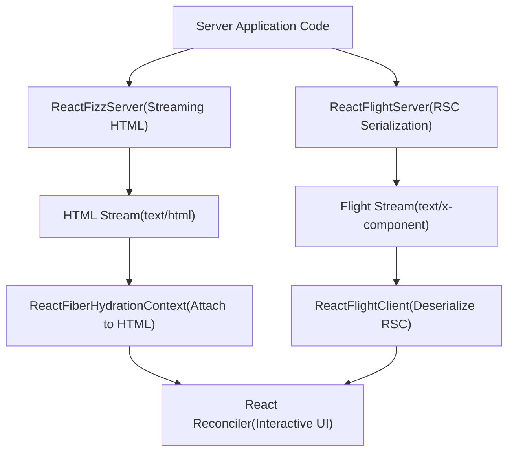
Sources: [packages/react-server/src/ReactFizzServer.js1-100](https://github.com/facebook/react/blob/65eec428/packages/react-server/src/ReactFizzServer.js#L1-L100) [packages/react-server/src/ReactFlightServer.js1-100](https://github.com/facebook/react/blob/65eec428/packages/react-server/src/ReactFlightServer.js#L1-L100) [packages/react-reconciler/src/ReactFiberHydrationContext.js1-50](https://github.com/facebook/react/blob/65eec428/packages/react-reconciler/src/ReactFiberHydrationContext.js#L1-L50)

---

## React Fizz: Streaming HTML Rendering

React Fizz is the modern SSR system that renders React components to HTML with streaming support. It replaces the legacy `renderToString` API with streaming capabilities.

### Fizz Request Model

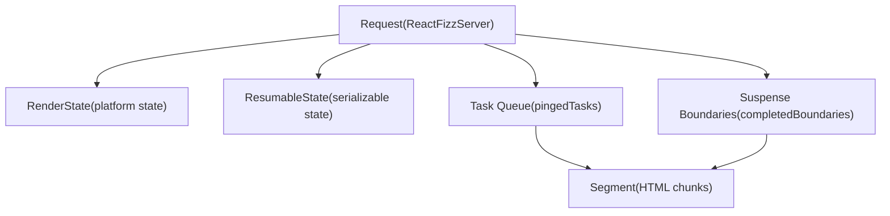
The `Request` object [packages/react-server/src/ReactFizzServer.js359-400](https://github.com/facebook/react/blob/65eec428/packages/react-server/src/ReactFizzServer.js#L359-L400) coordinates the entire rendering process:

-   **Status states**: `OPENING`, `OPEN`, `ABORTING`, `CLOSING`, `CLOSED` [packages/react-server/src/ReactFizzServer.js353-357](https://github.com/facebook/react/blob/65eec428/packages/react-server/src/ReactFizzServer.js#L353-L357)
-   **Task management**: `pingedTasks` array for work scheduling [packages/react-server/src/ReactFizzServer.js375](https://github.com/facebook/react/blob/65eec428/packages/react-server/src/ReactFizzServer.js#L375-L375)
-   **Boundary tracking**: `completedBoundaries`, `partialBoundaries`, `clientRenderedBoundaries` [packages/react-server/src/ReactFizzServer.js377-379](https://github.com/facebook/react/blob/65eec428/packages/react-server/src/ReactFizzServer.js#L377-L379)

### Task and Segment Architecture

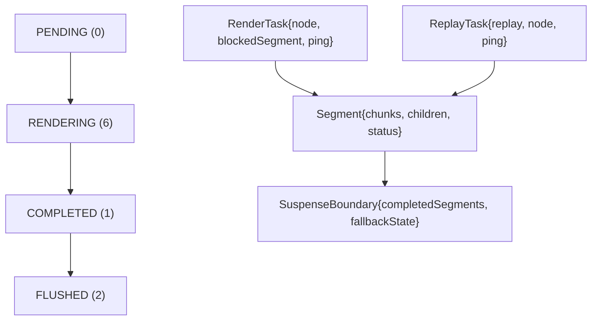
Tasks [packages/react-server/src/ReactFizzServer.js272-324](https://github.com/facebook/react/blob/65eec428/packages/react-server/src/ReactFizzServer.js#L272-L324) represent units of work that generate segments [packages/react-server/src/ReactFizzServer.js336-351](https://github.com/facebook/react/blob/65eec428/packages/react-server/src/ReactFizzServer.js#L336-L351) Segments progress through states defined at [packages/react-server/src/ReactFizzServer.js326-332](https://github.com/facebook/react/blob/65eec428/packages/react-server/src/ReactFizzServer.js#L326-L332)

Sources: [packages/react-server/src/ReactFizzServer.js326-400](https://github.com/facebook/react/blob/65eec428/packages/react-server/src/ReactFizzServer.js#L326-L400) [packages/react-dom-bindings/src/server/ReactFizzConfigDOM.js146-234](https://github.com/facebook/react/blob/65eec428/packages/react-dom-bindings/src/server/ReactFizzConfigDOM.js#L146-L234)

---

## React Flight: Server Components Serialization

React Flight serializes React Server Components into a streamable format that can be consumed by clients. Unlike Fizz (which produces HTML), Flight produces a representation of the React tree itself.

### Flight Server Request Model

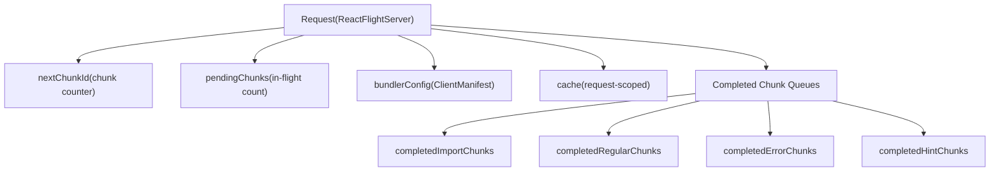
The Flight `Request` [packages/react-server/src/ReactFlightServer.js569-615](https://github.com/facebook/react/blob/65eec428/packages/react-server/src/ReactFlightServer.js#L569-L615) manages serialization state:

-   **Chunk management**: `nextChunkId` increments for each serialized value [packages/react-server/src/ReactFlightServer.js578](https://github.com/facebook/react/blob/65eec428/packages/react-server/src/ReactFlightServer.js#L578-L578)
-   **Pending tracking**: `pendingChunks` counts in-flight work [packages/react-server/src/ReactFlightServer.js579](https://github.com/facebook/react/blob/65eec428/packages/react-server/src/ReactFlightServer.js#L579-L579)
-   **Completed queues**: Separate arrays for different chunk types [packages/react-server/src/ReactFlightServer.js583-586](https://github.com/facebook/react/blob/65eec428/packages/react-server/src/ReactFlightServer.js#L583-L586)

### Task Processing in Flight

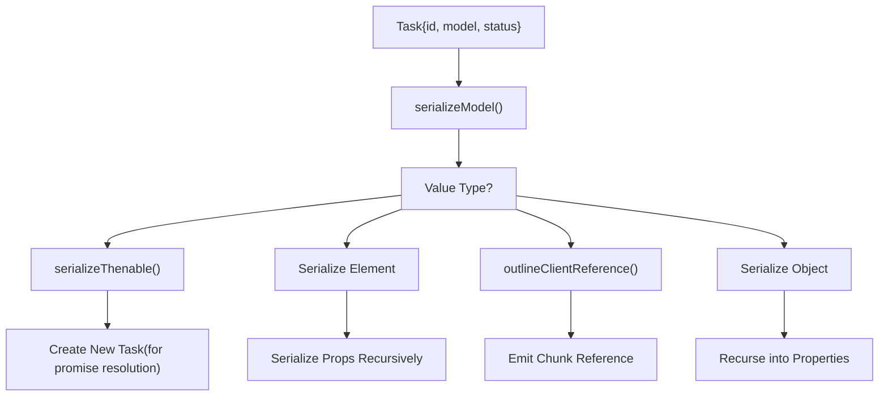
Tasks in Flight [packages/react-server/src/ReactFlightServer.js533-549](https://github.com/facebook/react/blob/65eec428/packages/react-server/src/ReactFlightServer.js#L533-L549) have status values: `PENDING`, `COMPLETED`, `ABORTED`, `ERRORED`, `RENDERING` [packages/react-server/src/ReactFlightServer.js527-531](https://github.com/facebook/react/blob/65eec428/packages/react-server/src/ReactFlightServer.js#L527-L531) The serialization process handles various value types recursively [packages/react-server/src/ReactFlightServer.js1500-2000](https://github.com/facebook/react/blob/65eec428/packages/react-server/src/ReactFlightServer.js#L1500-L2000)

Sources: [packages/react-server/src/ReactFlightServer.js527-615](https://github.com/facebook/react/blob/65eec428/packages/react-server/src/ReactFlightServer.js#L527-L615) [packages/react-server/src/ReactFlightServer.js1500-2000](https://github.com/facebook/react/blob/65eec428/packages/react-server/src/ReactFlightServer.js#L1500-L2000)

---

## Flight Client Deserialization

The Flight client deserializes the server stream into a tree of React elements that can be rendered.

### Chunk State Machine

> **[Mermaid stateDiagram]**
> *(图表结构无法解析)*

Chunk types are defined at [packages/react-client/src/ReactFlightClient.js154-243](https://github.com/facebook/react/blob/65eec428/packages/react-client/src/ReactFlightClient.js#L154-L243) The state machine progresses through:

1.  **PENDING**: Waiting for data [packages/react-client/src/ReactFlightClient.js154](https://github.com/facebook/react/blob/65eec428/packages/react-client/src/ReactFlightClient.js#L154-L154)
2.  **BLOCKED**: Waiting for dependencies [packages/react-client/src/ReactFlightClient.js155](https://github.com/facebook/react/blob/65eec428/packages/react-client/src/ReactFlightClient.js#L155-L155)
3.  **RESOLVED\_MODEL**: JSON received, not yet parsed [packages/react-client/src/ReactFlightClient.js156](https://github.com/facebook/react/blob/65eec428/packages/react-client/src/ReactFlightClient.js#L156-L156)
4.  **INITIALIZED**: Ready for consumption [packages/react-client/src/ReactFlightClient.js158](https://github.com/facebook/react/blob/65eec428/packages/react-client/src/ReactFlightClient.js#L158-L158)
5.  **ERRORED**: Error occurred [packages/react-client/src/ReactFlightClient.js159](https://github.com/facebook/react/blob/65eec428/packages/react-client/src/ReactFlightClient.js#L159-L159)

### Response Processing

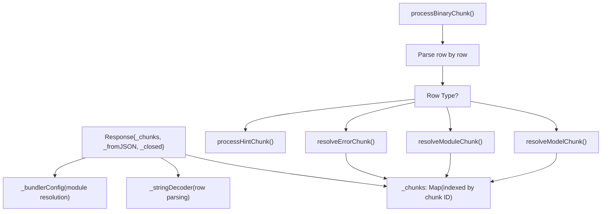
The `Response` object [packages/react-client/src/ReactFlightClient.js345-383](https://github.com/facebook/react/blob/65eec428/packages/react-client/src/ReactFlightClient.js#L345-L383) maintains the chunk map and processes incoming binary data through `processBinaryChunk` [packages/react-client/src/ReactFlightClient.js2120-2250](https://github.com/facebook/react/blob/65eec428/packages/react-client/src/ReactFlightClient.js#L2120-L2250)

Sources: [packages/react-client/src/ReactFlightClient.js154-383](https://github.com/facebook/react/blob/65eec428/packages/react-client/src/ReactFlightClient.js#L154-L383) [packages/react-client/src/ReactFlightClient.js2120-2250](https://github.com/facebook/react/blob/65eec428/packages/react-client/src/ReactFlightClient.js#L2120-L2250)

---

## Rendering Entry Points

React provides multiple entry points for server-side rendering across different environments.

### Fizz Entry Points by Platform

| Environment | Package | Primary Function | Return Type |
| --- | --- | --- | --- |
| **Node.js** | `react-dom/server.node` | `renderToPipeableStream()` | `PipeableStream` |
| **Browser/Edge** | `react-dom/server.browser` | `renderToReadableStream()` | `ReadableStream` |
| **Static (Node)** | `react-dom/static.node` | `prerenderToNodeStream()` | `StaticResult` |
| **Static (Browser)** | `react-dom/static.browser` | `prerender()` | `StaticResult` |

### Node.js Fizz Implementation

The Node.js implementation [packages/react-dom/src/server/ReactDOMFizzServerNode.js1-250](https://github.com/facebook/react/blob/65eec428/packages/react-dom/src/server/ReactDOMFizzServerNode.js#L1-L250) provides:

```
// Entry point structure (conceptual)
function renderToPipeableStream(
  children: ReactNodeList,
  options?: Options
): PipeableStream {
  const request = createRequest(
    children,
    resumableState,
    renderState,
    ...
  );

  return {
    pipe(destination: Writable) {
      startWork(request);
      startFlowing(request, destination);
    },
    abort(reason: mixed) {
      abort(request, reason);
    }
  };
}
```
Key functions:

-   `createRequest()` [packages/react-server/src/ReactFizzServer.js548-613](https://github.com/facebook/react/blob/65eec428/packages/react-server/src/ReactFizzServer.js#L548-L613) initializes the request
-   `startWork()` begins processing tasks
-   `startFlowing()` [packages/react-server/src/ReactFizzServer.js](https://github.com/facebook/react/blob/65eec428/packages/react-server/src/ReactFizzServer.js) connects to destination stream

Sources: [packages/react-dom/src/server/ReactDOMFizzServerNode.js1-250](https://github.com/facebook/react/blob/65eec428/packages/react-dom/src/server/ReactDOMFizzServerNode.js#L1-L250)

### Flight Entry Points

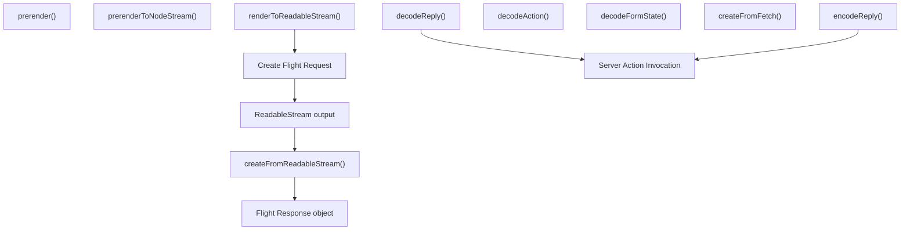
Flight server functions [packages/react-server/src/ReactFlightServer.js](https://github.com/facebook/react/blob/65eec428/packages/react-server/src/ReactFlightServer.js):

-   `renderToReadableStream()` [packages/react-server/src/ReactFlightServer.js](https://github.com/facebook/react/blob/65eec428/packages/react-server/src/ReactFlightServer.js) - Main rendering function
-   `decodeReply()` [packages/react-server/src/ReactFlightReplyServer.js](https://github.com/facebook/react/blob/65eec428/packages/react-server/src/ReactFlightReplyServer.js) - Decode client-to-server data
-   `decodeAction()` - Decode form actions

Flight client functions [packages/react-client/src/ReactFlightClient.js](https://github.com/facebook/react/blob/65eec428/packages/react-client/src/ReactFlightClient.js):

-   `createFromReadableStream()` - Deserialize Flight stream
-   `createFromFetch()` - Create from fetch response
-   `encodeReply()` [packages/react-client/src/ReactFlightReplyClient.js](https://github.com/facebook/react/blob/65eec428/packages/react-client/src/ReactFlightReplyClient.js) - Encode client-to-server data

Sources: [packages/react-server/src/ReactFlightServer.js](https://github.com/facebook/react/blob/65eec428/packages/react-server/src/ReactFlightServer.js) [packages/react-client/src/ReactFlightClient.js](https://github.com/facebook/react/blob/65eec428/packages/react-client/src/ReactFlightClient.js) [packages/react-client/src/ReactFlightReplyClient.js](https://github.com/facebook/react/blob/65eec428/packages/react-client/src/ReactFlightReplyClient.js) [packages/react-server/src/ReactFlightReplyServer.js](https://github.com/facebook/react/blob/65eec428/packages/react-server/src/ReactFlightReplyServer.js)

---

## Suspense Boundary Handling

Both Fizz and Flight have sophisticated handling for React Suspense boundaries.

### Fizz Suspense Boundary Structure

```mermaid
flowchart TD
    SuspenseBoundary["SuspenseBoundary"]
    Status["status: 0|1|4|5(PENDING|COMPLETED|CLIENT_RENDERED|POSTPONED)"]
    RootSegmentID["rootSegmentID(segment identifier)"]
    CompletedSegments["completedSegments: Segment[](ready to flush)"]
    PendingTasks["pendingTasks: number(blocking counter)"]
    ContentState["contentState: HoistableState(resources for content)"]
    FallbackState["fallbackState: HoistableState(resources for fallback)"]
    Row["row: SuspenseListRow | null(for SuspenseList coordination)"]
    FallbackAbortableTasks["fallbackAbortableTasks: Set<Task>(tasks to abort on completion)"]

    SuspenseBoundary --> Status
    SuspenseBoundary --> RootSegmentID
    SuspenseBoundary --> CompletedSegments
    SuspenseBoundary --> PendingTasks
    SuspenseBoundary --> ContentState
    SuspenseBoundary --> FallbackState
    SuspenseBoundary --> Row
    SuspenseBoundary --> FallbackAbortableTasks
```
The `SuspenseBoundary` type [packages/react-server/src/ReactFizzServer.js248-270](https://github.com/facebook/react/blob/65eec428/packages/react-server/src/ReactFizzServer.js#L248-L270) tracks:

-   **Status**: `PENDING` (rendering), `COMPLETED` (ready), `CLIENT_RENDERED` (errored), `POSTPONED` (prerender) [packages/react-server/src/ReactFizzServer.js246](https://github.com/facebook/react/blob/65eec428/packages/react-server/src/ReactFizzServer.js#L246-L246)
-   **Segments**: `completedSegments` contains HTML chunks ready to flush [packages/react-server/src/ReactFizzServer.js254](https://github.com/facebook/react/blob/65eec428/packages/react-server/src/ReactFizzServer.js#L254-L254)
-   **Dependencies**: `contentState` and `fallbackState` track stylesheets and scripts [packages/react-server/src/ReactFizzServer.js258-259](https://github.com/facebook/react/blob/65eec428/packages/react-server/src/ReactFizzServer.js#L258-L259)
-   **Coordination**: `row` for `SuspenseList` ordering [packages/react-server/src/ReactFizzServer.js253](https://github.com/facebook/react/blob/65eec428/packages/react-server/src/ReactFizzServer.js#L253-L253)

### Flight Suspense Handling

In Flight, Suspense is handled through promise serialization:

> **[Mermaid sequence]**
> *(图表结构无法解析)*

The `serializeThenable()` function [packages/react-server/src/ReactFlightServer.js1032-1134](https://github.com/facebook/react/blob/65eec428/packages/react-server/src/ReactFlightServer.js#L1032-L1134) creates a new task for each promise, allowing progressive loading of async data.

Sources: [packages/react-server/src/ReactFizzServer.js246-270](https://github.com/facebook/react/blob/65eec428/packages/react-server/src/ReactFizzServer.js#L246-L270) [packages/react-server/src/ReactFlightServer.js1032-1134](https://github.com/facebook/react/blob/65eec428/packages/react-server/src/ReactFlightServer.js#L1032-L1134)

---

## Resource Management and Hoisting

Fizz includes sophisticated resource management for stylesheets, scripts, and other dependencies.

### Hoistable State Tracking

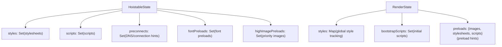
The resource management system [packages/react-dom-bindings/src/server/ReactFizzConfigDOM.js146-234](https://github.com/facebook/react/blob/65eec428/packages/react-dom-bindings/src/server/ReactFizzConfigDOM.js#L146-L234) includes:

-   **HoistableState**: Per-boundary resource tracking
-   **RenderState**: Global resource coordination [packages/react-dom-bindings/src/server/ReactFizzConfigDOM.js148-234](https://github.com/facebook/react/blob/65eec428/packages/react-dom-bindings/src/server/ReactFizzConfigDOM.js#L148-L234)
-   **Resource types**: Stylesheets, scripts, preconnects, preloads [packages/react-dom-bindings/src/server/ReactFizzConfigDOM.js204-211](https://github.com/facebook/react/blob/65eec428/packages/react-dom-bindings/src/server/ReactFizzConfigDOM.js#L204-L211)

### Resource Flushing Order

Resources are flushed in priority order:

1.  Preconnects and DNS hints (earliest)
2.  High-priority image preloads
3.  Font preloads
4.  Stylesheets (blocking render)
5.  Scripts (may block)
6.  Bulk preloads (lowest priority)

This is controlled by `flushResources()` and related functions in [packages/react-dom-bindings/src/server/ReactFizzConfigDOM.js](https://github.com/facebook/react/blob/65eec428/packages/react-dom-bindings/src/server/ReactFizzConfigDOM.js)

Sources: [packages/react-dom-bindings/src/server/ReactFizzConfigDOM.js148-234](https://github.com/facebook/react/blob/65eec428/packages/react-dom-bindings/src/server/ReactFizzConfigDOM.js#L148-L234)

---

## Prerender and Resume

React supports prerendering during build time with the ability to resume rendering for dynamic parts later.

### Postpone and Resume Flow

> **[Mermaid sequence]**
> *(图表结构无法解析)*

Key types for prerender:

-   **PostponedState**: Serializable state capturing what was postponed [packages/react-server/src/ReactFizzServer.js](https://github.com/facebook/react/blob/65eec428/packages/react-server/src/ReactFizzServer.js)
-   **ReplayNode**: Tree structure recording component paths [packages/react-server/src/ReactFizzServer.js218-225](https://github.com/facebook/react/blob/65eec428/packages/react-server/src/ReactFizzServer.js#L218-L225)
-   **ReplayTask**: Special task type that follows replay nodes [packages/react-server/src/ReactFizzServer.js303-322](https://github.com/facebook/react/blob/65eec428/packages/react-server/src/ReactFizzServer.js#L303-L322)

Functions:

-   `createPrerenderRequest()` [packages/react-server/src/ReactFizzServer.js615-647](https://github.com/facebook/react/blob/65eec428/packages/react-server/src/ReactFizzServer.js#L615-L647) - Initialize prerender
-   `resumeRequest()` [packages/react-server/src/ReactFizzServer.js649-741](https://github.com/facebook/react/blob/65eec428/packages/react-server/src/ReactFizzServer.js#L649-L741) - Resume from postponed state
-   `postpone()` - Trigger postponement at a boundary

Sources: [packages/react-server/src/ReactFizzServer.js615-741](https://github.com/facebook/react/blob/65eec428/packages/react-server/src/ReactFizzServer.js#L615-L741)

---

## Integration with Reconciler

Server-rendered content integrates with the client-side reconciler through hydration.

### Hydration Context Structure

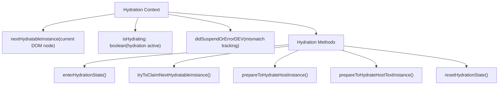
The hydration context [packages/react-reconciler/src/ReactFiberHydrationContext.js](https://github.com/facebook/react/blob/65eec428/packages/react-reconciler/src/ReactFiberHydrationContext.js) provides:

-   **State tracking**: Current position in server-rendered DOM [packages/react-reconciler/src/ReactFiberHydrationContext.js100-200](https://github.com/facebook/react/blob/65eec428/packages/react-reconciler/src/ReactFiberHydrationContext.js#L100-L200)
-   **Instance matching**: `tryToClaimNextHydratableInstance()` attempts to match fibers to DOM nodes
-   **Mismatch handling**: Detects and reports differences between server and client renders
-   **Suspense hydration**: Special handling for dehydrated suspense boundaries

The hydration process is initiated during `beginWork()` for `HostRoot` and proceeds through the tree, matching fibers to existing DOM nodes.

Sources: [packages/react-reconciler/src/ReactFiberHydrationContext.js1-1000](https://github.com/facebook/react/blob/65eec428/packages/react-reconciler/src/ReactFiberHydrationContext.js#L1-L1000)

---

## Platform-Specific Configuration

Both Fizz and Flight use configuration abstractions to support different platforms.

### Fizz Configuration Interface

```mermaid
flowchart TD
    FizzConfig["ReactFizzConfig(Host Configuration)"]
    ElementCreation["Element Creation"]
    PushStartInstance["pushStartInstance()"]
    PushEndInstance["pushEndInstance()"]
    PushTextInstance["pushTextInstance()"]
    Formatting["Format Context"]
    GetChildFormatContext["getChildFormatContext()"]
    CreateRootFormatContext["createRootFormatContext()"]
    Resources["Resource Management"]
    WriteHoistables["writeHoistables()"]
    WriteHoistablesForBoundary["writeHoistablesForBoundary()"]
    Boundaries["Boundary Handling"]
    WriteStartPendingSuspenseBoundary["writeStartPendingSuspenseBoundary()"]
    WriteEndPendingSuspenseBoundary["writeEndPendingSuspenseBoundary()"]

    FizzConfig --> ElementCreation
    ElementCreation --> PushStartInstance
    ElementCreation --> PushEndInstance
    ElementCreation --> PushTextInstance
    FizzConfig --> Formatting
    Formatting --> GetChildFormatContext
    Formatting --> CreateRootFormatContext
    FizzConfig --> Resources
    Resources --> WriteHoistables
    Resources --> WriteHoistablesForBoundary
    FizzConfig --> Boundaries
    Boundaries --> WriteStartPendingSuspenseBoundary
    Boundaries --> WriteEndPendingSuspenseBoundary
```
The DOM configuration [packages/react-dom-bindings/src/server/ReactFizzConfigDOM.js](https://github.com/facebook/react/blob/65eec428/packages/react-dom-bindings/src/server/ReactFizzConfigDOM.js) implements:

-   **Element output**: Functions to write opening/closing tags and text [packages/react-dom-bindings/src/server/ReactFizzConfigDOM.js3000-4000](https://github.com/facebook/react/blob/65eec428/packages/react-dom-bindings/src/server/ReactFizzConfigDOM.js#L3000-L4000)
-   **Format context**: Tracks HTML/SVG/MathML context [packages/react-dom-bindings/src/server/ReactFizzConfigDOM.js500-700](https://github.com/facebook/react/blob/65eec428/packages/react-dom-bindings/src/server/ReactFizzConfigDOM.js#L500-L700)
-   **Resource hoisting**: Emits stylesheets and scripts [packages/react-dom-bindings/src/server/ReactFizzConfigDOM.js5000-6000](https://github.com/facebook/react/blob/65eec428/packages/react-dom-bindings/src/server/ReactFizzConfigDOM.js#L5000-L6000)
-   **Boundary markers**: Suspense boundary delimiters [packages/react-dom-bindings/src/server/ReactFizzConfigDOM.js4000-5000](https://github.com/facebook/react/blob/65eec428/packages/react-dom-bindings/src/server/ReactFizzConfigDOM.js#L4000-L5000)

### Flight Configuration Interface

Flight uses a simpler configuration focused on module resolution:

-   `resolveClientReferenceMetadata()` - Get client module information
-   `resolveServerReference()` - Resolve server action references
-   `getClientReferenceKey()` - Generate unique keys for client references
-   `isClientReference()` / `isServerReference()` - Type checking

These are defined in [packages/react-server/src/ReactFlightServerConfig.js](https://github.com/facebook/react/blob/65eec428/packages/react-server/src/ReactFlightServerConfig.js) and implemented per-platform.

Sources: [packages/react-dom-bindings/src/server/ReactFizzConfigDOM.js1-6000](https://github.com/facebook/react/blob/65eec428/packages/react-dom-bindings/src/server/ReactFizzConfigDOM.js#L1-L6000) [packages/react-server/src/ReactFlightServerConfig.js](https://github.com/facebook/react/blob/65eec428/packages/react-server/src/ReactFlightServerConfig.js)

---

## Error Handling and Recovery

Both systems include comprehensive error handling.

### Fizz Error Handling

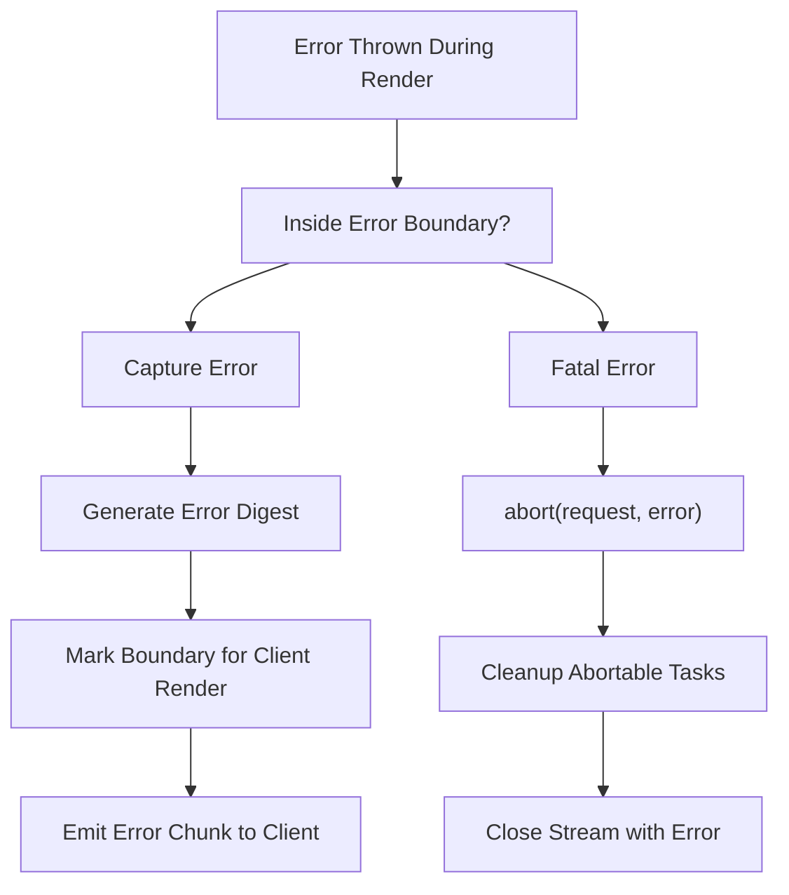
Error handling in Fizz [packages/react-server/src/ReactFizzServer.js2500-3000](https://github.com/facebook/react/blob/65eec428/packages/react-server/src/ReactFizzServer.js#L2500-L3000):

1.  **Error capture**: `logRecoverableError()` reports to `onError` callback
2.  **Error digest**: Hash generated to identify errors without leaking details
3.  **Boundary handling**: `erroredTask()` marks boundaries for client-side recovery
4.  **Abort handling**: `abortTask()` and `abortTaskSoft()` for cleanup [packages/react-server/src/ReactFizzServer.js1700-1900](https://github.com/facebook/react/blob/65eec428/packages/react-server/src/ReactFizzServer.js#L1700-L1900)

### Flight Error Handling

In Flight, errors are serialized into the stream:

-   **Error chunks**: Errors become chunks with error status [packages/react-server/src/ReactFlightServer.js3500-3600](https://github.com/facebook/react/blob/65eec428/packages/react-server/src/ReactFlightServer.js#L3500-L3600)
-   **Error digest**: Similar digest generation for production [packages/react-server/src/ReactFlightServer.js3550](https://github.com/facebook/react/blob/65eec428/packages/react-server/src/ReactFlightServer.js#L3550-L3550)
-   **Error boundaries**: Client-side error boundaries catch deserialized errors

The `emitErrorChunk()` function [packages/react-server/src/ReactFlightServer.js3500-3600](https://github.com/facebook/react/blob/65eec428/packages/react-server/src/ReactFlightServer.js#L3500-L3600) serializes error information including stack traces in development.

Sources: [packages/react-server/src/ReactFizzServer.js1700-3000](https://github.com/facebook/react/blob/65eec428/packages/react-server/src/ReactFizzServer.js#L1700-L3000) [packages/react-server/src/ReactFlightServer.js3500-3600](https://github.com/facebook/react/blob/65eec428/packages/react-server/src/ReactFlightServer.js#L3500-L3600)

---

## Performance Optimization

### Progressive Rendering in Fizz

Fizz uses several strategies to optimize time-to-first-byte and progressive rendering:

1.  **Shell-first rendering**: Render and flush the outer shell immediately
2.  **Suspense streaming**: Stream Suspense boundary content as it becomes ready
3.  **Resource hoisting**: Emit critical resources in document head
4.  **Chunk size management**: `progressiveChunkSize` option controls granularity [packages/react-server/src/ReactFizzServer.js429](https://github.com/facebook/react/blob/65eec428/packages/react-server/src/ReactFizzServer.js#L429-L429)

The `performWork()` function [packages/react-server/src/ReactFizzServer.js](https://github.com/facebook/react/blob/65eec428/packages/react-server/src/ReactFizzServer.js) processes tasks incrementally, flushing completed work to the stream without blocking.

### Flight Optimization

Flight optimizes by:

1.  **Lazy serialization**: Only serialize data when referenced
2.  **Reference deduplication**: `writtenObjects` WeakMap prevents duplicate serialization [packages/react-server/src/ReactFlightServer.js590](https://github.com/facebook/react/blob/65eec428/packages/react-server/src/ReactFlightServer.js#L590-L590)
3.  **Promise streaming**: Promises serialize as placeholders, resolving progressively
4.  **Module chunking**: Client references split into separate chunks

Sources: [packages/react-server/src/ReactFizzServer.js429-500](https://github.com/facebook/react/blob/65eec428/packages/react-server/src/ReactFizzServer.js#L429-L500) [packages/react-server/src/ReactFlightServer.js590-700](https://github.com/facebook/react/blob/65eec428/packages/react-server/src/ReactFlightServer.js#L590-L700)

---

This document provides an overview of React's server-side rendering systems. For more detailed information about specific subsystems, refer to the linked wiki pages at the beginning of this document.
