# React Fizz (Streaming SSR)

Relevant source files

-   [packages/react-dom-bindings/src/client/ReactDOMComponentTree.js](https://github.com/facebook/react/blob/65eec428/packages/react-dom-bindings/src/client/ReactDOMComponentTree.js)
-   [packages/react-dom-bindings/src/server/ReactFizzConfigDOM.js](https://github.com/facebook/react/blob/65eec428/packages/react-dom-bindings/src/server/ReactFizzConfigDOM.js)
-   [packages/react-dom-bindings/src/server/ReactFizzConfigDOMLegacy.js](https://github.com/facebook/react/blob/65eec428/packages/react-dom-bindings/src/server/ReactFizzConfigDOMLegacy.js)
-   [packages/react-dom-bindings/src/shared/ReactDOMResourceValidation.js](https://github.com/facebook/react/blob/65eec428/packages/react-dom-bindings/src/shared/ReactDOMResourceValidation.js)
-   [packages/react-dom/src/\_\_tests\_\_/ReactDOMFizzServer-test.js](https://github.com/facebook/react/blob/65eec428/packages/react-dom/src/__tests__/ReactDOMFizzServer-test.js)
-   [packages/react-dom/src/\_\_tests\_\_/ReactDOMFizzServerBrowser-test.js](https://github.com/facebook/react/blob/65eec428/packages/react-dom/src/__tests__/ReactDOMFizzServerBrowser-test.js)
-   [packages/react-dom/src/\_\_tests\_\_/ReactDOMFizzServerNode-test.js](https://github.com/facebook/react/blob/65eec428/packages/react-dom/src/__tests__/ReactDOMFizzServerNode-test.js)
-   [packages/react-dom/src/\_\_tests\_\_/ReactDOMFizzStatic-test.js](https://github.com/facebook/react/blob/65eec428/packages/react-dom/src/__tests__/ReactDOMFizzStatic-test.js)
-   [packages/react-dom/src/\_\_tests\_\_/ReactDOMFizzStaticBrowser-test.js](https://github.com/facebook/react/blob/65eec428/packages/react-dom/src/__tests__/ReactDOMFizzStaticBrowser-test.js)
-   [packages/react-dom/src/\_\_tests\_\_/ReactDOMFizzStaticNode-test.js](https://github.com/facebook/react/blob/65eec428/packages/react-dom/src/__tests__/ReactDOMFizzStaticNode-test.js)
-   [packages/react-dom/src/\_\_tests\_\_/ReactDOMFizzSuppressHydrationWarning-test.js](https://github.com/facebook/react/blob/65eec428/packages/react-dom/src/__tests__/ReactDOMFizzSuppressHydrationWarning-test.js)
-   [packages/react-dom/src/\_\_tests\_\_/ReactDOMFloat-test.js](https://github.com/facebook/react/blob/65eec428/packages/react-dom/src/__tests__/ReactDOMFloat-test.js)
-   [packages/react-dom/src/\_\_tests\_\_/ReactDOMHydrationDiff-test.js](https://github.com/facebook/react/blob/65eec428/packages/react-dom/src/__tests__/ReactDOMHydrationDiff-test.js)
-   [packages/react-dom/src/\_\_tests\_\_/ReactDOMServerPartialHydration-test.internal.js](https://github.com/facebook/react/blob/65eec428/packages/react-dom/src/__tests__/ReactDOMServerPartialHydration-test.internal.js)
-   [packages/react-dom/src/\_\_tests\_\_/ReactDOMSingletonComponents-test.js](https://github.com/facebook/react/blob/65eec428/packages/react-dom/src/__tests__/ReactDOMSingletonComponents-test.js)
-   [packages/react-dom/src/\_\_tests\_\_/ReactRenderDocument-test.js](https://github.com/facebook/react/blob/65eec428/packages/react-dom/src/__tests__/ReactRenderDocument-test.js)
-   [packages/react-dom/src/\_\_tests\_\_/ReactServerRenderingHydration-test.js](https://github.com/facebook/react/blob/65eec428/packages/react-dom/src/__tests__/ReactServerRenderingHydration-test.js)
-   [packages/react-dom/src/server/ReactDOMFizzServerBrowser.js](https://github.com/facebook/react/blob/65eec428/packages/react-dom/src/server/ReactDOMFizzServerBrowser.js)
-   [packages/react-dom/src/server/ReactDOMFizzServerBun.js](https://github.com/facebook/react/blob/65eec428/packages/react-dom/src/server/ReactDOMFizzServerBun.js)
-   [packages/react-dom/src/server/ReactDOMFizzServerEdge.js](https://github.com/facebook/react/blob/65eec428/packages/react-dom/src/server/ReactDOMFizzServerEdge.js)
-   [packages/react-dom/src/server/ReactDOMFizzServerNode.js](https://github.com/facebook/react/blob/65eec428/packages/react-dom/src/server/ReactDOMFizzServerNode.js)
-   [packages/react-dom/src/server/ReactDOMFizzStaticBrowser.js](https://github.com/facebook/react/blob/65eec428/packages/react-dom/src/server/ReactDOMFizzStaticBrowser.js)
-   [packages/react-dom/src/server/ReactDOMFizzStaticEdge.js](https://github.com/facebook/react/blob/65eec428/packages/react-dom/src/server/ReactDOMFizzStaticEdge.js)
-   [packages/react-dom/src/server/ReactDOMFizzStaticNode.js](https://github.com/facebook/react/blob/65eec428/packages/react-dom/src/server/ReactDOMFizzStaticNode.js)
-   [packages/react-markup/src/ReactFizzConfigMarkup.js](https://github.com/facebook/react/blob/65eec428/packages/react-markup/src/ReactFizzConfigMarkup.js)
-   [packages/react-noop-renderer/src/ReactNoopServer.js](https://github.com/facebook/react/blob/65eec428/packages/react-noop-renderer/src/ReactNoopServer.js)
-   [packages/react-reconciler/src/ReactFiberHydrationContext.js](https://github.com/facebook/react/blob/65eec428/packages/react-reconciler/src/ReactFiberHydrationContext.js)
-   [packages/react-server-dom-fb/src/\_\_tests\_\_/ReactDOMServerFB-test.internal.js](https://github.com/facebook/react/blob/65eec428/packages/react-server-dom-fb/src/__tests__/ReactDOMServerFB-test.internal.js)
-   [packages/react-server/src/ReactFizzServer.js](https://github.com/facebook/react/blob/65eec428/packages/react-server/src/ReactFizzServer.js)
-   [packages/react-server/src/forks/ReactFizzConfig.custom.js](https://github.com/facebook/react/blob/65eec428/packages/react-server/src/forks/ReactFizzConfig.custom.js)

## Purpose and Scope

React Fizz is the streaming server-side rendering (SSR) system that generates HTML progressively, sending content to the client as it becomes ready. This document covers the core Fizz rendering engine, its request/task/segment model, resource management, and platform-specific implementations for Node.js, Web streams, and static generation.

For information about React Server Components (RSC) and the Flight protocol, see [React Server Components (Flight)](/facebook/react/5.2-react-server-components-(flight)). For client-side hydration, see [Hydration System](/facebook/react/6.3-hydration-system).

## High-Level Architecture

React Fizz operates as a streaming HTML renderer that processes React elements and outputs HTML chunks incrementally. The system is platform-agnostic at its core, with platform-specific adapters for different streaming targets.

**Fizz Architecture Overview**

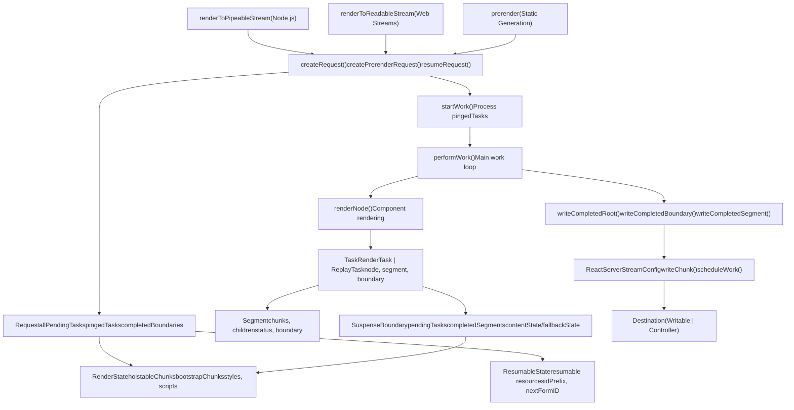
Sources: [packages/react-server/src/ReactFizzServer.js1-4000](https://github.com/facebook/react/blob/65eec428/packages/react-server/src/ReactFizzServer.js#L1-L4000) [packages/react-dom-bindings/src/server/ReactFizzConfigDOM.js1-500](https://github.com/facebook/react/blob/65eec428/packages/react-dom-bindings/src/server/ReactFizzConfigDOM.js#L1-L500) [packages/react-dom/src/server/ReactDOMFizzServerNode.js1-300](https://github.com/facebook/react/blob/65eec428/packages/react-dom/src/server/ReactDOMFizzServerNode.js#L1-L300)

## Core Data Structures

### Request

The `Request` is the top-level rendering context that tracks the entire SSR operation.

**Request Structure**

| Field | Type | Purpose |
| --- | --- | --- |
| `destination` | `Destination | null` | Output stream target |
| `resumableState` | `ResumableState` | Serializable state for resuming |
| `renderState` | `RenderState` | Per-request working state |
| `allPendingTasks` | `number` | Total tasks to complete |
| `pendingRootTasks` | `number` | Tasks blocking shell completion |
| `pingedTasks` | `Array<Task>` | High-priority tasks ready to work |
| `completedBoundaries` | `Array<SuspenseBoundary>` | Boundaries ready to flush |
| `clientRenderedBoundaries` | `Array<SuspenseBoundary>` | Errored boundaries |
| `partialBoundaries` | `Array<SuspenseBoundary>` | Boundaries with partial content |
| `abortableTasks` | `Set<Task>` | Tasks that can be aborted |
| `trackedPostpones` | `PostponedHoles | null` | For prerendering resume |

Sources: [packages/react-server/src/ReactFizzServer.js359-400](https://github.com/facebook/react/blob/65eec428/packages/react-server/src/ReactFizzServer.js#L359-L400)

### Task Types

Tasks represent units of work in the rendering pipeline. There are two types:

**RenderTask vs ReplayTask**

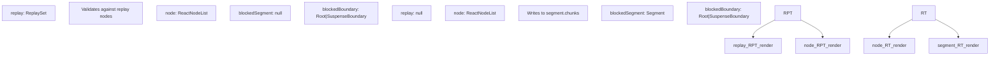
Sources: [packages/react-server/src/ReactFizzServer.js272-324](https://github.com/facebook/react/blob/65eec428/packages/react-server/src/ReactFizzServer.js#L272-L324)

### Segment

A `Segment` represents a chunk of HTML output with its rendering status.

**Segment Lifecycle**

> **[Mermaid stateDiagram]**
> *(图表结构无法解析)*

| Status | Value | Description |
| --- | --- | --- |
| `PENDING` | 0 | Waiting to render |
| `COMPLETED` | 1 | Rendered successfully |
| `FLUSHED` | 2 | Written to destination |
| `ABORTED` | 3 | Rendering canceled |
| `ERRORED` | 4 | Error during rendering |
| `POSTPONED` | 5 | Postponed for later |
| `RENDERING` | 6 | Currently rendering |

Sources: [packages/react-server/src/ReactFizzServer.js326-351](https://github.com/facebook/react/blob/65eec428/packages/react-server/src/ReactFizzServer.js#L326-L351)

### SuspenseBoundary

A `SuspenseBoundary` manages Suspense boundaries, tracking pending work and managing fallback rendering.

**SuspenseBoundary Fields**

| Field | Type | Purpose |
| --- | --- | --- |
| `status` | `0 | 1 | 4 | 5` | PENDING, COMPLETED, CLIENT\_RENDERED, POSTPONED |
| `rootSegmentID` | `number` | ID for boundary's root segment |
| `pendingTasks` | `number` | Tasks blocking completion |
| `completedSegments` | `Array<Segment>` | Ready but not flushed |
| `byteSize` | `number` | Total size for inlining decisions |
| `defer` | `boolean` | Never inline deferred boundaries |
| `contentState` | `HoistableState` | Resources for content |
| `fallbackState` | `HoistableState` | Resources for fallback |
| `fallbackAbortableTasks` | `Set<Task>` | Cancel if content completes |
| `errorDigest` | `?string` | Error hash if errored |

Sources: [packages/react-server/src/ReactFizzServer.js248-270](https://github.com/facebook/react/blob/65eec428/packages/react-server/src/ReactFizzServer.js#L248-L270)

## Rendering Pipeline

The rendering pipeline flows from request creation through task processing to HTML output.

**Complete Rendering Flow**

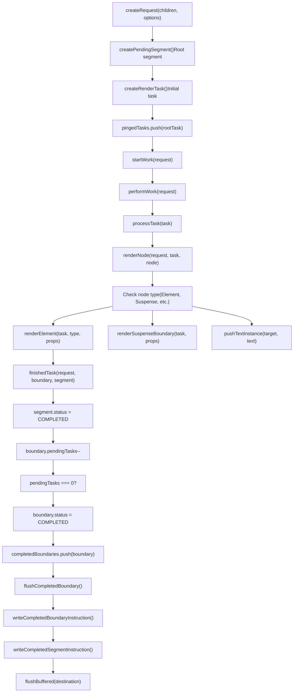
Sources: [packages/react-server/src/ReactFizzServer.js548-800](https://github.com/facebook/react/blob/65eec428/packages/react-server/src/ReactFizzServer.js#L548-L800) [packages/react-server/src/ReactFizzServer.js1600-2000](https://github.com/facebook/react/blob/65eec428/packages/react-server/src/ReactFizzServer.js#L1600-L2000)

## Task Scheduling and Execution

### Task Creation

Tasks are created when starting rendering or when Suspense boundaries need to render their content or fallback.

**Task Creation Functions**

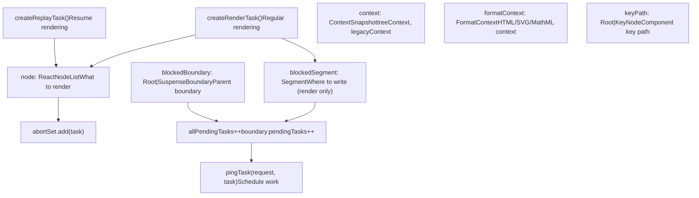
Sources: [packages/react-server/src/ReactFizzServer.js843-953](https://github.com/facebook/react/blob/65eec428/packages/react-server/src/ReactFizzServer.js#L843-L953)

### performWork Loop

The `performWork` function is the main work loop that processes tasks and flushes output.

**performWork Execution**

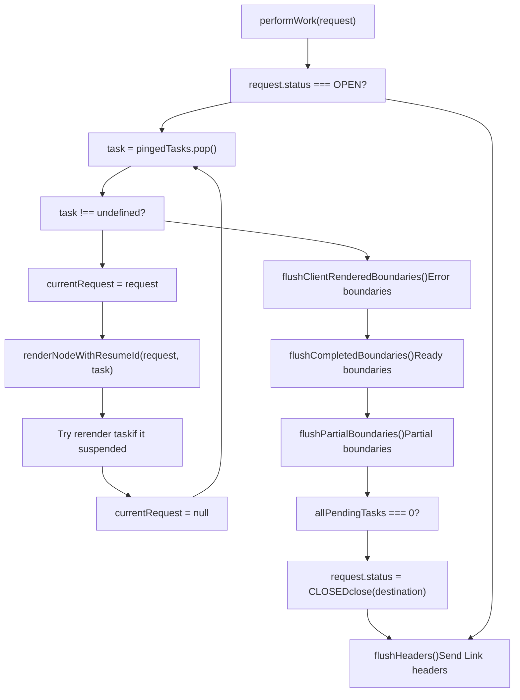
Sources: [packages/react-server/src/ReactFizzServer.js2800-3000](https://github.com/facebook/react/blob/65eec428/packages/react-server/src/ReactFizzServer.js#L2800-L3000)

### renderNode Dispatch

The `renderNode` function dispatches to specialized rendering logic based on node type.

**Node Type Dispatch**

| Node Type | Symbol | Rendering Function |
| --- | --- | --- |
| React Element | `REACT_ELEMENT_TYPE` | `renderElement(request, task, type, props, ref)` |
| Lazy Component | `REACT_LAZY_TYPE` | `renderLazyComponent(request, task, lazyComponent)` |
| Suspense | `REACT_SUSPENSE_TYPE` | `renderSuspenseBoundary(request, task, props)` |
| SuspenseList | `REACT_SUSPENSE_LIST_TYPE` | `renderSuspenseList(request, task, props)` |
| Fragment | `REACT_FRAGMENT_TYPE` | `renderNodeFragment(request, task, children)` |
| Provider | `REACT_CONTEXT_TYPE` | `pushProvider(context, value)` |
| Forward Ref | `REACT_FORWARD_REF_TYPE` | `renderForwardRef(request, task, render, props, ref)` |
| Memo | `REACT_MEMO_TYPE` | `renderMemo(request, task, type, props)` |
| Portal | `REACT_PORTAL_TYPE` | Error - not supported |
| String/Number | primitive | `pushTextInstance(segment, text)` |
| Array | `isArray(node)` | `renderChildrenArray(request, task, children)` |
| Async Iterable | `node[ASYNC_ITERATOR]` | `renderAsyncIterable(request, task, iterable)` |

Sources: [packages/react-server/src/ReactFizzServer.js1800-2400](https://github.com/facebook/react/blob/65eec428/packages/react-server/src/ReactFizzServer.js#L1800-L2400)

## Suspense Boundary Management

Suspense boundaries enable streaming and progressive rendering by allowing parts of the tree to suspend while other parts complete.

**Suspense Boundary Rendering Flow**

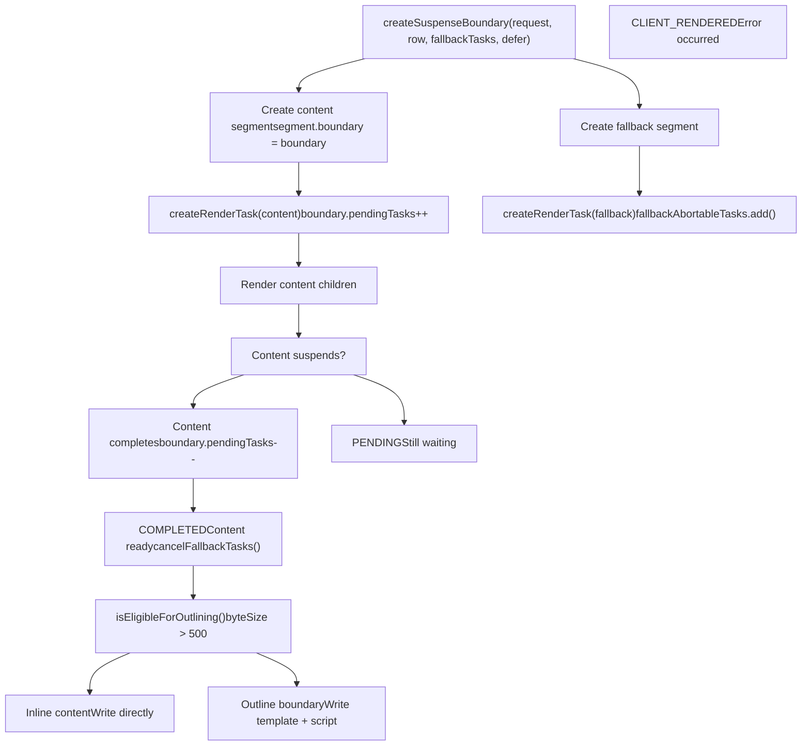
Sources: [packages/react-server/src/ReactFizzServer.js796-841](https://github.com/facebook/react/blob/65eec428/packages/react-server/src/ReactFizzServer.js#L796-L841) [packages/react-server/src/ReactFizzServer.js2500-2700](https://github.com/facebook/react/blob/65eec428/packages/react-server/src/ReactFizzServer.js#L2500-L2700)

### Boundary Completion and Flushing

When a boundary completes, it moves through queues before being flushed to the output.

**Boundary Flush Process**

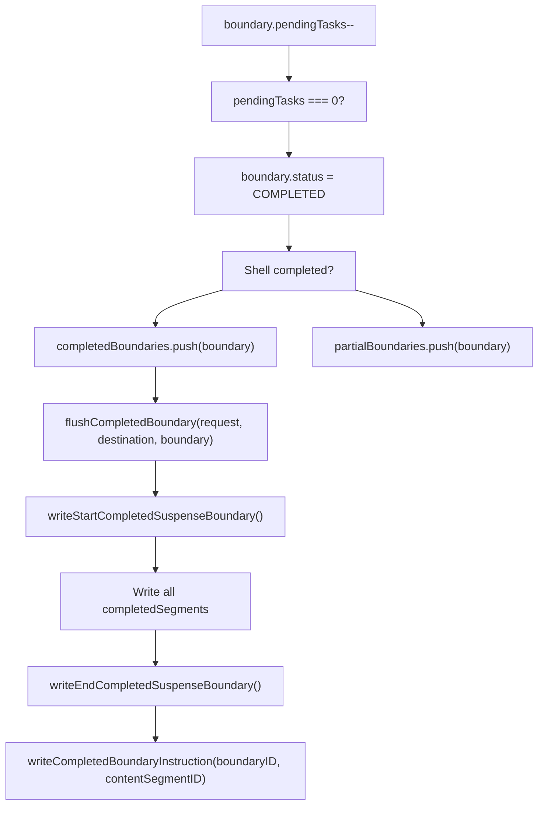
Sources: [packages/react-server/src/ReactFizzServer.js3200-3500](https://github.com/facebook/react/blob/65eec428/packages/react-server/src/ReactFizzServer.js#L3200-L3500)

## Resource Management

React Fizz manages resources (scripts, stylesheets, preloads) through the `RenderState` and `ResumableState` structures to optimize loading and prevent duplicates.

**Resource State Architecture**

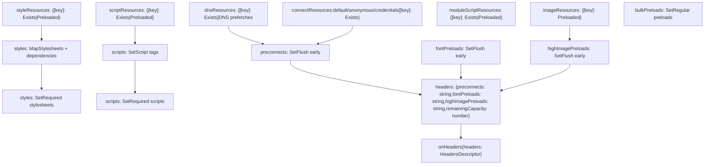
Sources: [packages/react-dom-bindings/src/server/ReactFizzConfigDOM.js260-310](https://github.com/facebook/react/blob/65eec428/packages/react-dom-bindings/src/server/ReactFizzConfigDOM.js#L260-L310) [packages/react-dom-bindings/src/server/ReactFizzConfigDOM.js148-234](https://github.com/facebook/react/blob/65eec428/packages/react-dom-bindings/src/server/ReactFizzConfigDOM.js#L148-L234)

### Resource Deduplication

Resources are tracked in `ResumableState` to prevent duplicate output across boundaries and resume scenarios.

**Resource Tracking Types**

| Type | Tracked By | Values |
| --- | --- | --- |
| DNS Prefetch | `href` | `EXISTS` (null) |
| Preconnect | `href` + `crossOrigin` | `EXISTS` (null) |
| Stylesheet | `href` | `EXISTS` | `[crossOrigin, integrity]` |
| Script | `src` | `EXISTS` | `[crossOrigin, integrity]` |
| Module | `src` | `EXISTS` | `[crossOrigin, integrity]` |
| Image Preload | `href` + `imageSrcSet` + `imageSizes` | `[]` (empty array) |
| Font Preload | `href` | `[]` (empty array) |

Sources: [packages/react-dom-bindings/src/server/ReactFizzConfigDOM.js236-258](https://github.com/facebook/react/blob/65eec428/packages/react-dom-bindings/src/server/ReactFizzConfigDOM.js#L236-L258)

### Resource Flushing Order

Resources are flushed in a specific order to optimize page load performance.

**Resource Flush Sequence**

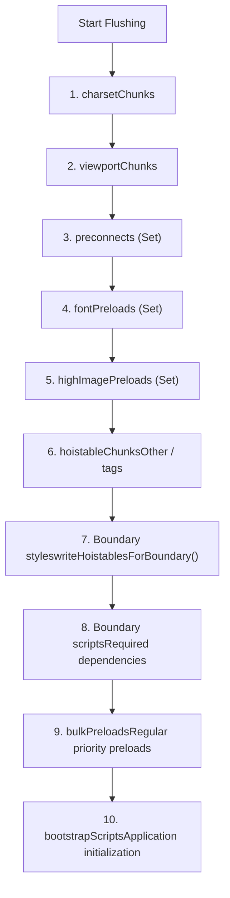
Sources: [packages/react-dom-bindings/src/server/ReactFizzConfigDOM.js3800-4200](https://github.com/facebook/react/blob/65eec428/packages/react-dom-bindings/src/server/ReactFizzConfigDOM.js#L3800-L4200)

## Platform-Specific Implementations

React Fizz has multiple entry points for different JavaScript environments, each adapting the core engine to platform-specific streaming APIs.

**Platform Entry Points**

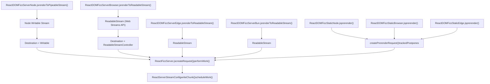
Sources: [packages/react-dom/src/server/ReactDOMFizzServerNode.js1-300](https://github.com/facebook/react/blob/65eec428/packages/react-dom/src/server/ReactDOMFizzServerNode.js#L1-L300) [packages/react-dom/src/server/ReactDOMFizzServerBrowser.js1-200](https://github.com/facebook/react/blob/65eec428/packages/react-dom/src/server/ReactDOMFizzServerBrowser.js#L1-L200) [packages/react-dom/src/server/ReactDOMFizzStaticBrowser.js1-200](https://github.com/facebook/react/blob/65eec428/packages/react-dom/src/server/ReactDOMFizzStaticBrowser.js#L1-L200)

### Node.js: renderToPipeableStream

The Node.js implementation uses Node's `Writable` stream interface with backpressure support.

**Node.js Streaming Flow**

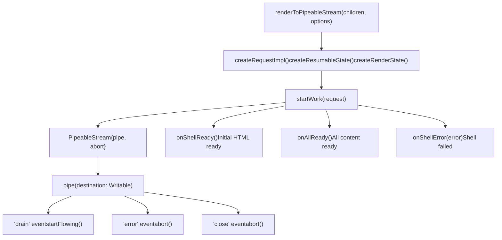
Sources: [packages/react-dom/src/server/ReactDOMFizzServerNode.js131-166](https://github.com/facebook/react/blob/65eec428/packages/react-dom/src/server/ReactDOMFizzServerNode.js#L131-L166)

### Browser/Edge: renderToReadableStream

The browser implementation uses the Web Streams API's `ReadableStream` with a bytes source.

**Web Streams Flow**

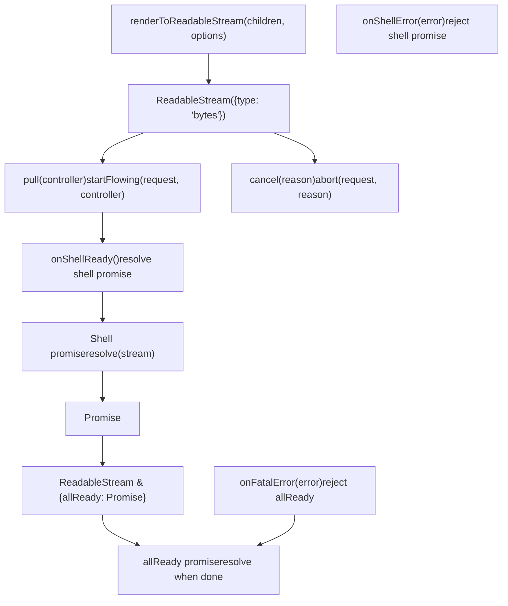
Sources: [packages/react-dom/src/server/ReactDOMFizzServerBrowser.js75-165](https://github.com/facebook/react/blob/65eec428/packages/react-dom/src/server/ReactDOMFizzServerBrowser.js#L75-L165)

## Prerendering and Resumability

Prerendering generates static HTML while tracking postponed boundaries for later resumption.

**Prerender Architecture**

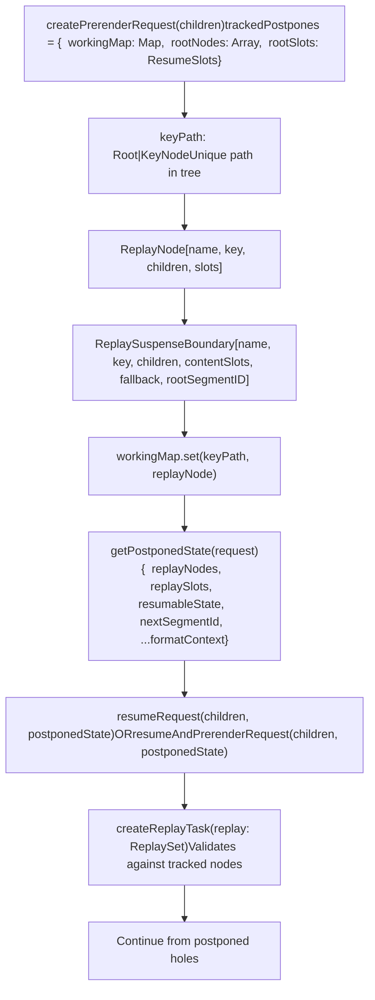
Sources: [packages/react-server/src/ReactFizzServer.js615-770](https://github.com/facebook/react/blob/65eec428/packages/react-server/src/ReactFizzServer.js#L615-L770)

### PostponedState Structure

The `PostponedState` captures everything needed to resume rendering from postponed boundaries.

**PostponedState Fields**

| Field | Type | Purpose |
| --- | --- | --- |
| `replayNodes` | `Array<ReplayNode>` | Tree of tracked component keys |
| `replaySlots` | `ResumeSlots` | Segment IDs to resume |
| `resumableState` | `ResumableState` | Resource state to continue |
| `nextSegmentId` | `number` | Next available segment ID |
| `rootFormatContext` | `FormatContext` | HTML/SVG/MathML context |
| `progressiveChunkSize` | `number` | Chunk size setting |

Sources: [packages/react-server/src/ReactFizzServer.js3900-4000](https://github.com/facebook/react/blob/65eec428/packages/react-server/src/ReactFizzServer.js#L3900-L4000)

### ReplayTask Validation

When resuming, `ReplayTask` instances validate that the component tree matches the tracked structure.

**Replay Validation Flow**

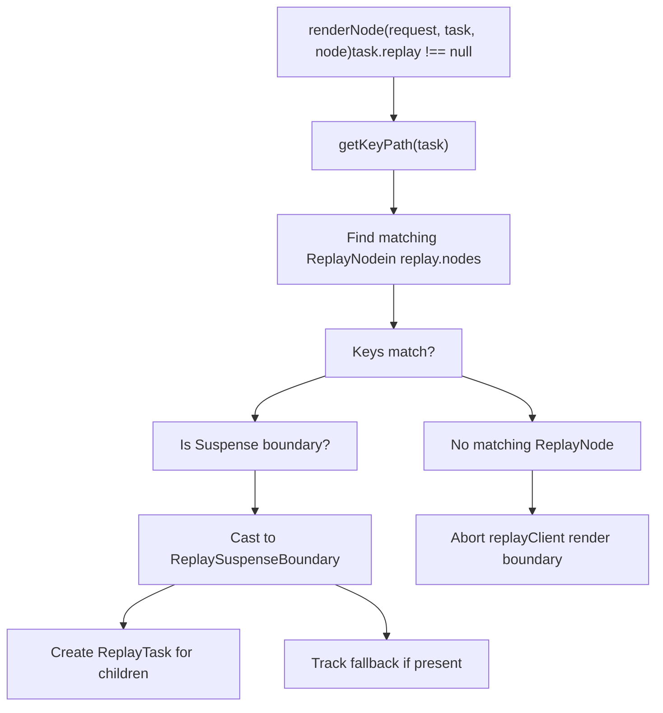
Sources: [packages/react-server/src/ReactFizzServer.js1900-2100](https://github.com/facebook/react/blob/65eec428/packages/react-server/src/ReactFizzServer.js#L1900-L2100)

## Streaming Format and Instructions

React Fizz can output HTML in two formats: inline scripts or data attributes with an external runtime.

**Streaming Formats**

| Format | Value | Configuration | Use Case |
| --- | --- | --- | --- |
| `ScriptStreamingFormat` | 0 | Default | Inline instructions in `<script>` tags |
| `DataStreamingFormat` | 1 | `unstable_externalRuntimeSrc` | Instructions via data attributes, separate runtime |

Sources: [packages/react-dom-bindings/src/server/ReactFizzConfigDOM.js122-124](https://github.com/facebook/react/blob/65eec428/packages/react-dom-bindings/src/server/ReactFizzConfigDOM.js#L122-L124)

### Instruction State Bits

The `InstructionState` tracks which instructions have been sent to avoid duplication.

**InstructionState Flags**

| Flag | Bit | Purpose |
| --- | --- | --- |
| `SentCompleteSegmentFunction` | 0b000000001 | `completeSegment` function sent |
| `SentCompleteBoundaryFunction` | 0b000000010 | `completeBoundary` function sent |
| `SentClientRenderFunction` | 0b000000100 | `clientRenderBoundary` function sent |
| `SentStyleInsertionFunction` | 0b000001000 | `completeBoundaryWithStyles` sent |
| `SentFormReplayingRuntime` | 0b000010000 | Form replaying runtime sent |
| `SentCompletedShellId` | 0b000100000 | Shell completion marker sent |
| `SentMarkShellTime` | 0b001000000 | Shell timing marker sent |
| `NeedUpgradeToViewTransitions` | 0b010000000 | View transitions needed |
| `SentUpgradeToViewTransitions` | 0b100000000 | View transition upgrade sent |

Sources: [packages/react-dom-bindings/src/server/ReactFizzConfigDOM.js127-136](https://github.com/facebook/react/blob/65eec428/packages/react-dom-bindings/src/server/ReactFizzConfigDOM.js#L127-L136)

### Boundary Completion Instructions

When a boundary completes, an inline script or data attribute instructs the client to reveal the content.

**Boundary Instruction Output**

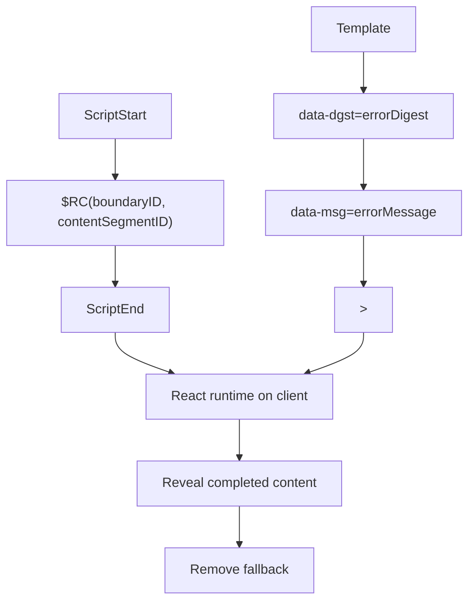
Sources: [packages/react-dom-bindings/src/server/ReactFizzConfigDOM.js4500-4700](https://github.com/facebook/react/blob/65eec428/packages/react-dom-bindings/src/server/ReactFizzConfigDOM.js#L4500-L4700)

## Error Handling and Recovery

React Fizz handles errors at different levels with different recovery strategies.

**Error Handling Hierarchy**

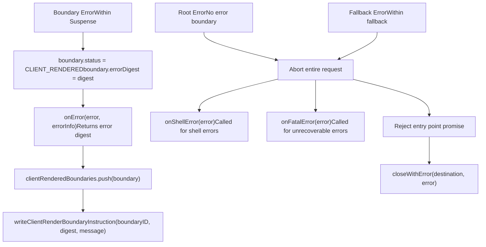
Sources: [packages/react-server/src/ReactFizzServer.js3600-3800](https://github.com/facebook/react/blob/65eec428/packages/react-server/src/ReactFizzServer.js#L3600-L3800)

### Error Information

The `onError` callback receives detailed error information for logging and monitoring.

**ErrorInfo Structure**

| Field | Type | Description |
| --- | --- | --- |
| `componentStack` | `string` | Component stack trace |
| `error` | `mixed` | The thrown error object |
| `errorInfo.digest` | `?string` | Error hash for client matching |

Sources: [packages/react-server/src/ReactFizzServer.js384-400](https://github.com/facebook/react/blob/65eec428/packages/react-server/src/ReactFizzServer.js#L384-L400)

## Performance Optimizations

### Progressive Chunk Size

The `progressiveChunkSize` option controls how much HTML is buffered before flushing.

**Default Chunk Size Calculation**

The default of 12,800 bytes is based on:

-   3G network speed: ~500 kbits/second
-   Target: Send content every 500ms
-   500ms × (500 kbits/s) × 0.8 (realistic throughput) × 0.5 (HTML overhead) / 2 = 12.5kb

Sources: [packages/react-server/src/ReactFizzServer.js414-429](https://github.com/facebook/react/blob/65eec428/packages/react-server/src/ReactFizzServer.js#L414-L429)

### Boundary Inlining

Small boundaries can be inlined directly instead of being outlined with separate instructions.

**Outlining Eligibility**

```
function isEligibleForOutlining(request, boundary) {
  return (
    (boundary.byteSize > 500 ||
      hasSuspenseyContent(boundary.contentState) ||
      boundary.defer) &&
    boundary.preamble === null
  );
}
```
-   Boundaries < 500 bytes: Inlined
-   Boundaries ≥ 500 bytes: Outlined with instructions
-   Defer boundaries: Always outlined
-   Preamble boundaries: Never outlined (for render-blocking)

Sources: [packages/react-server/src/ReactFizzServer.js466-482](https://github.com/facebook/react/blob/65eec428/packages/react-server/src/ReactFizzServer.js#L466-L482)

### Early Headers

The `onHeaders` callback allows sending `Link` headers before any HTML for early hints.

**Header Capacity Management**

Resources are accumulated into Link headers until capacity is reached:

-   Default capacity: 2000 UTF-16 code units (~2KB)
-   Priority order: preconnects, font preloads, high-priority image preloads
-   Remaining resources flush in HTML `<link>` tags

Sources: [packages/react-dom-bindings/src/server/ReactFizzConfigDOM.js367-489](https://github.com/facebook/react/blob/65eec428/packages/react-dom-bindings/src/server/ReactFizzConfigDOM.js#L367-L489)
