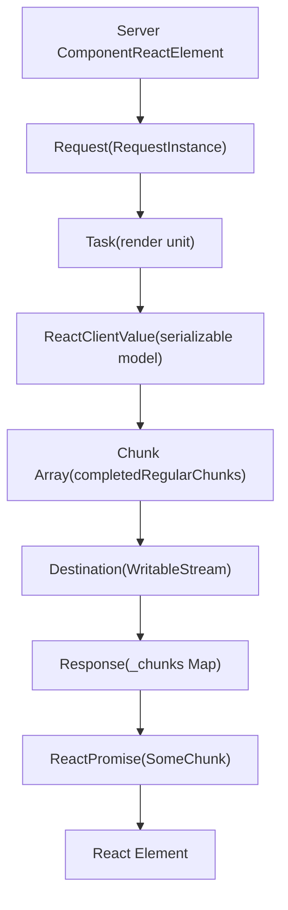
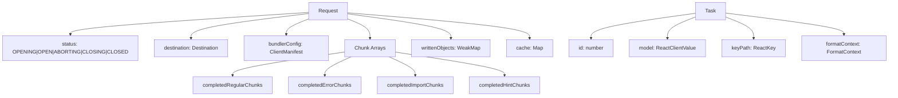
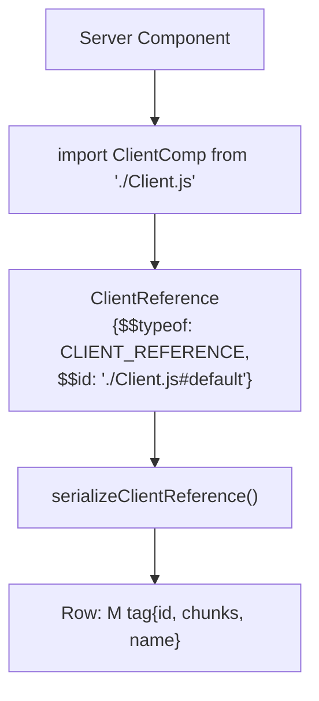
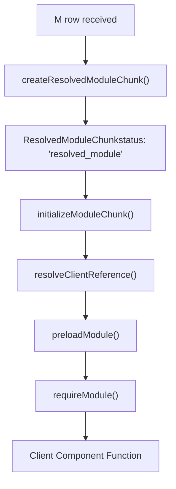
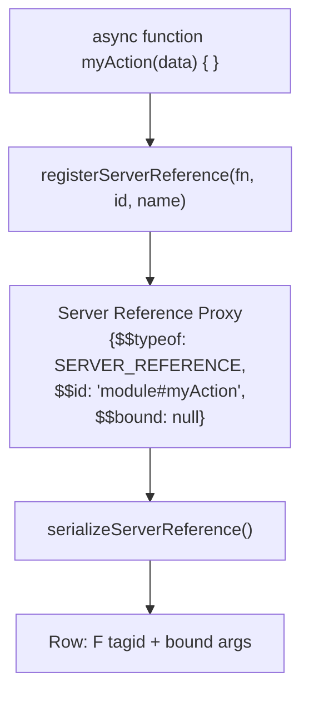
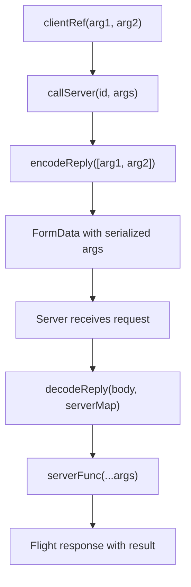
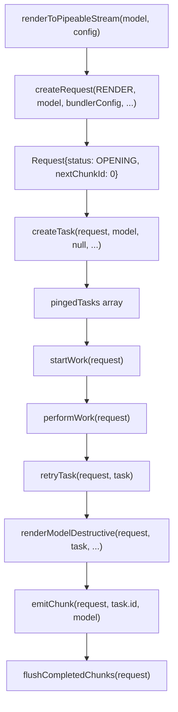
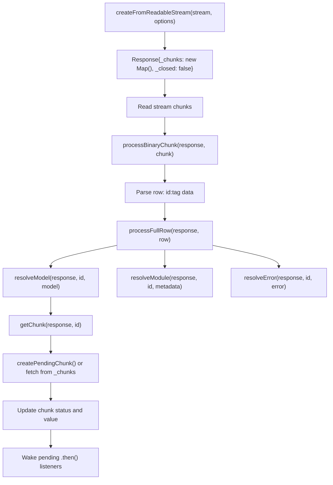

# React Server Components (Flight)

Relevant source files

-   [packages/react-client/src/ReactFlightClient.js](https://github.com/facebook/react/blob/65eec428/packages/react-client/src/ReactFlightClient.js)
-   [packages/react-client/src/ReactFlightReplyClient.js](https://github.com/facebook/react/blob/65eec428/packages/react-client/src/ReactFlightReplyClient.js)
-   [packages/react-client/src/ReactFlightTemporaryReferences.js](https://github.com/facebook/react/blob/65eec428/packages/react-client/src/ReactFlightTemporaryReferences.js)
-   [packages/react-client/src/\_\_tests\_\_/ReactFlight-test.js](https://github.com/facebook/react/blob/65eec428/packages/react-client/src/__tests__/ReactFlight-test.js)
-   [packages/react-server-dom-esm/src/ReactFlightESMReferences.js](https://github.com/facebook/react/blob/65eec428/packages/react-server-dom-esm/src/ReactFlightESMReferences.js)
-   [packages/react-server-dom-parcel/src/ReactFlightParcelReferences.js](https://github.com/facebook/react/blob/65eec428/packages/react-server-dom-parcel/src/ReactFlightParcelReferences.js)
-   [packages/react-server-dom-turbopack/src/ReactFlightTurbopackReferences.js](https://github.com/facebook/react/blob/65eec428/packages/react-server-dom-turbopack/src/ReactFlightTurbopackReferences.js)
-   [packages/react-server-dom-unbundled/src/ReactFlightUnbundledReferences.js](https://github.com/facebook/react/blob/65eec428/packages/react-server-dom-unbundled/src/ReactFlightUnbundledReferences.js)
-   [packages/react-server-dom-webpack/src/ReactFlightWebpackNodeLoader.js](https://github.com/facebook/react/blob/65eec428/packages/react-server-dom-webpack/src/ReactFlightWebpackNodeLoader.js)
-   [packages/react-server-dom-webpack/src/ReactFlightWebpackNodeRegister.js](https://github.com/facebook/react/blob/65eec428/packages/react-server-dom-webpack/src/ReactFlightWebpackNodeRegister.js)
-   [packages/react-server-dom-webpack/src/ReactFlightWebpackPlugin.js](https://github.com/facebook/react/blob/65eec428/packages/react-server-dom-webpack/src/ReactFlightWebpackPlugin.js)
-   [packages/react-server-dom-webpack/src/ReactFlightWebpackReferences.js](https://github.com/facebook/react/blob/65eec428/packages/react-server-dom-webpack/src/ReactFlightWebpackReferences.js)
-   [packages/react-server-dom-webpack/src/\_\_tests\_\_/ReactFlightDOM-test.js](https://github.com/facebook/react/blob/65eec428/packages/react-server-dom-webpack/src/__tests__/ReactFlightDOM-test.js)
-   [packages/react-server-dom-webpack/src/\_\_tests\_\_/ReactFlightDOMBrowser-test.js](https://github.com/facebook/react/blob/65eec428/packages/react-server-dom-webpack/src/__tests__/ReactFlightDOMBrowser-test.js)
-   [packages/react-server-dom-webpack/src/\_\_tests\_\_/ReactFlightDOMEdge-test.js](https://github.com/facebook/react/blob/65eec428/packages/react-server-dom-webpack/src/__tests__/ReactFlightDOMEdge-test.js)
-   [packages/react-server-dom-webpack/src/\_\_tests\_\_/ReactFlightDOMNode-test.js](https://github.com/facebook/react/blob/65eec428/packages/react-server-dom-webpack/src/__tests__/ReactFlightDOMNode-test.js)
-   [packages/react-server-dom-webpack/src/\_\_tests\_\_/ReactFlightDOMReply-test.js](https://github.com/facebook/react/blob/65eec428/packages/react-server-dom-webpack/src/__tests__/ReactFlightDOMReply-test.js)
-   [packages/react-server-dom-webpack/src/\_\_tests\_\_/ReactFlightDOMReplyEdge-test.js](https://github.com/facebook/react/blob/65eec428/packages/react-server-dom-webpack/src/__tests__/ReactFlightDOMReplyEdge-test.js)
-   [packages/react-server-dom-webpack/src/\_\_tests\_\_/utils/WebpackMock.js](https://github.com/facebook/react/blob/65eec428/packages/react-server-dom-webpack/src/__tests__/utils/WebpackMock.js)
-   [packages/react-server/src/ReactFlightReplyServer.js](https://github.com/facebook/react/blob/65eec428/packages/react-server/src/ReactFlightReplyServer.js)
-   [packages/react-server/src/ReactFlightServer.js](https://github.com/facebook/react/blob/65eec428/packages/react-server/src/ReactFlightServer.js)
-   [packages/react-server/src/ReactFlightServerTemporaryReferences.js](https://github.com/facebook/react/blob/65eec428/packages/react-server/src/ReactFlightServerTemporaryReferences.js)
-   [scripts/error-codes/codes.json](https://github.com/facebook/react/blob/65eec428/scripts/error-codes/codes.json)

React Server Components (Flight) is React's protocol and runtime system for executing React components on the server, serializing them into a streamable format, and reconstructing them on the client. This system enables server-side computation while maintaining React's component model and interactivity on the client.

For information about streaming server-side rendering with HTML output, see [React Fizz (Streaming SSR)](/facebook/react/5.1-react-fizz-(streaming-ssr)). For traditional server rendering patterns, see [Legacy Server Rendering](/facebook/react/5.3-build-integration-for-server-components).

## Architecture Overview

React Flight is the protocol and runtime for React Server Components (RSC). It serializes component trees on the server into a streaming wire format and reconstructs them on the client. The protocol enables server-side components to pass serialized data, client component references, and server function references to the client.

### Server-to-Client Data Flow


**Sources:** [packages/react-server/src/ReactFlightServer.js651-777](https://github.com/facebook/react/blob/65eec428/packages/react-server/src/ReactFlightServer.js#L651-L777) [packages/react-client/src/ReactFlightClient.js245-331](https://github.com/facebook/react/blob/65eec428/packages/react-client/src/ReactFlightClient.js#L245-L331) [packages/react-client/src/ReactFlightClient.js1437-1580](https://github.com/facebook/react/blob/65eec428/packages/react-client/src/ReactFlightClient.js#L1437-L1580)

## Core Components

### Flight Server (ReactFlightServer)

The Flight server executes React components and serializes their output into chunks. The `Request` object maintains serialization state and manages chunk emission.

#### Request Structure


**Key Types and Functions:**

| Symbol | Type | Purpose |
| --- | --- | --- |
| `Request` | Object | Central state for a Flight render, tracks chunks and serialization |
| `Task` | Object | Unit of work for rendering a component tree segment |
| `ReactClientValue` | Type | Union of all serializable types (elements, primitives, references) |
| `createRequest()` | Function | Initializes request with `bundlerConfig` and callbacks |
| `createTask()` | Function | Creates a task with `id`, `model`, and `keyPath` |
| `renderModelDestructive()` | Function | Main serialization dispatcher, mutates model to JSON-compatible form |
| `emitChunk()` | Function | Writes chunk rows to destination stream |

**Sources:** [packages/react-server/src/ReactFlightServer.js569-615](https://github.com/facebook/react/blob/65eec428/packages/react-server/src/ReactFlightServer.js#L569-L615) [packages/react-server/src/ReactFlightServer.js533-549](https://github.com/facebook/react/blob/65eec428/packages/react-server/src/ReactFlightServer.js#L533-L549) [packages/react-server/src/ReactFlightServer.js1756-1858](https://github.com/facebook/react/blob/65eec428/packages/react-server/src/ReactFlightServer.js#L1756-L1858)

### Flight Client (ReactFlightClient)

The Flight client parses the streamed protocol and reconstructs React elements. It maintains a `Response` object with a `Map` of chunks that transition through states.

#### Client Architecture

```mermaid
flowchart TD
    Response["Response"]
    _chunks["_chunks: Map"]
    _bundlerConfig["_bundlerConfig: ServerConsumerModuleMap"]
    _fromJSON["_fromJSON: (key, value) => any"]
    _stringDecoder["_stringDecoder: StringDecoder"]
    _closed["_closed: boolean"]
    SomeChunk["SomeChunk"]
    PendingChunk["PendingChunkstatus: 'pending'"]
    BlockedChunk["BlockedChunkstatus: 'blocked'"]
    ResolvedModelChunk["ResolvedModelChunkstatus: 'resolved_model'"]
    ResolvedModuleChunk["ResolvedModuleChunkstatus: 'resolved_module'"]
    InitializedChunk["InitializedChunkstatus: 'fulfilled'"]
    ErroredChunk["ErroredChunkstatus: 'rejected'"]

    Response --> _chunks
    Response --> _bundlerConfig
    Response --> _fromJSON
    Response --> _stringDecoder
    Response --> _closed
    SomeChunk --> PendingChunk
    SomeChunk --> BlockedChunk
    SomeChunk --> ResolvedModelChunk
    SomeChunk --> ResolvedModuleChunk
    SomeChunk --> InitializedChunk
    SomeChunk --> ErroredChunk
```


**Key Functions:**

| Function | Input | Output | Purpose |
| --- | --- | --- | --- |
| `createFromReadableStream()` | `stream: ReadableStream` | `Promise<T>` | Creates Response, starts stream parsing |
| `processFullRow()` | `response: Response, row: string` | `void` | Parses row format: `id:tag data` |
| `parseModelString()` | `response: Response, json: string` | `any` | Parses JSON with special prefixes (`$`, `@`, etc.) |
| `getChunk()` | `response: Response, id: number` | `SomeChunk<T>` | Retrieves or creates chunk by ID |
| `initializeModelChunk()` | `chunk: ResolvedModelChunk` | `void` | Converts JSON model to React element |
| `readChunk()` | `chunk: SomeChunk<T>` | `T` | Synchronously reads initialized chunk or throws |

**Row Parser State Machine:**

The client processes incoming bytes through a state machine defined by `RowParserState`:

| State | Value | Parsing |
| --- | --- | --- |
| `ROW_ID` | `0` | Reading chunk ID (hexadecimal) |
| `ROW_TAG` | `1` | Reading row type tag (single char) |
| `ROW_LENGTH` | `2` | Reading length field for binary chunks |
| `ROW_CHUNK_BY_NEWLINE` | `3` | Reading text chunk until `\n` |
| `ROW_CHUNK_BY_LENGTH` | `4` | Reading binary chunk by byte count |

**Sources:** [packages/react-client/src/ReactFlightClient.js345-383](https://github.com/facebook/react/blob/65eec428/packages/react-client/src/ReactFlightClient.js#L345-L383) [packages/react-client/src/ReactFlightClient.js146-152](https://github.com/facebook/react/blob/65eec428/packages/react-client/src/ReactFlightClient.js#L146-L152) [packages/react-client/src/ReactFlightClient.js162-235](https://github.com/facebook/react/blob/65eec428/packages/react-client/src/ReactFlightClient.js#L162-L235) [packages/react-client/src/ReactFlightClient.js1437-1580](https://github.com/facebook/react/blob/65eec428/packages/react-client/src/ReactFlightClient.js#L1437-L1580)

## Wire Protocol Format

### Row-Based Streaming Protocol

Flight streams data as newline-delimited rows. Each row has the format: `{id}:{tag}{data}\n`

**Row Format Components:**

| Component | Format | Description |
| --- | --- | --- |
| `id` | Hex integer | Unique chunk identifier (e.g., `0`, `1a`, `2f`) |
| `:` | Delimiter | Separates ID from tag |
| `tag` | Single char | Row type indicator |
| `data` | Variable | JSON string, binary length, or empty |
| `\n` | Terminator | Marks end of row (except binary chunks) |

**Row Tags:**

| Tag | Name | Data Format | Purpose |
| --- | --- | --- | --- |
| `J` | Model | JSON string | Serialized model/element |
| `M` | Module (Client Reference) | JSON string | Client component reference |
| `E` | Error | JSON error object | Error chunk |
| `T` | Hint/Metadata | JSON string | Preload hints, metadata |
| `@` | Promise | Promise ID | Async chunk reference |
| `H` | Halt (DEV) | Empty | Indicates stopped resolution |
| `R` | ReadableStream start | Empty | Stream initialization |
| `r` | BYOB stream start | Empty | Binary stream initialization |
| `C` | Stream close | Empty or final value | Stream completion |
| `X` | Async iterator start | Empty | Iterator initialization |
| `x` | Iterator instance | Empty | Single-shot iterator |

**Example Row Sequences:**

```
0:J{"type":"div","props":{"children":"Hello"}}
1:M{"id":"./ClientComponent.js","chunks":["chunk1"],"name":"default"}
2:@3
3:J"Resolved value"
```
**Sources:** [packages/react-client/src/ReactFlightClient.js1437-1580](https://github.com/facebook/react/blob/65eec428/packages/react-client/src/ReactFlightClient.js#L1437-L1580) [packages/react-server/src/ReactFlightServer.js1860-1930](https://github.com/facebook/react/blob/65eec428/packages/react-server/src/ReactFlightServer.js#L1860-L1930)

### Value Serialization Encoding

The server encodes special values with prefix markers in JSON strings:

```mermaid
flowchart TD
    Value["Value to Serialize"]
    RefPrefix["$ + hex IDe.g., '$5'"]
    PromisePrefix["$@ + hex IDe.g., '$@a'"]
    ServerPrefix["$F + hex IDe.g., '$F3'"]
    ClientPrefix["$$id<br>e.g., '$$./Component.js#default'"]
    SymbolPrefix["$S + symbol keye.g., '$Sreact.element'"]
    NegZero["$-0"]
    Inf["$Infinity"]
    NegInf["$-Infinity"]
    NotANumber["$NaN"]
    Undef["$undefined"]
    DatePrefix["$D + ISO stringe.g., '$D2023-01-01T00:00:00.000Z'"]
    BigIntPrefix["$n + decimale.g., '$n12345'"]
    MapPrefix["$Q + hex ID"]
    SetPrefix["$W + hex ID"]
    FormDataPrefix["$K + hex ID"]
    BlobPrefix["$B + hex ID"]
    IteratorPrefix["$i + hex ID"]
    TypedArrayPrefix["$O + type + hex IDe.g., '$OUint8Array1'"]
    ErrorPrefix["$E + serialized error"]
    Escaped["$$ + rest of string"]

    Value --> RefPrefix
    Value --> PromisePrefix
    Value --> ServerPrefix
    Value --> ClientPrefix
    Value --> SymbolPrefix
    Value --> NegZero
    Value --> Inf
    Value --> NegInf
    Value --> NotANumber
    Value --> Undef
    Value --> DatePrefix
    Value --> BigIntPrefix
    Value --> MapPrefix
    Value --> SetPrefix
    Value --> FormDataPrefix
    Value --> BlobPrefix
    Value --> IteratorPrefix
    Value --> TypedArrayPrefix
    Value --> ErrorPrefix
    Value --> Escaped
```


**Key Encoding Functions:**

| Function | Return | Purpose |
| --- | --- | --- |
| `serializeByValueID(id)` | `'$' + id.toString(16)` | References to other chunks |
| `serializePromiseID(id)` | `'$@' + id.toString(16)` | Async chunk placeholders |
| `serializeServerReferenceID(id)` | `'$F' + id.toString(16)` | Server function references |
| `serializeClientReference(ref)` | `'$$' + ref.$$id` | Client component module path |
| `serializeNumber(n)` | Special string or number | Handles `-0`, `Infinity`, `NaN` |
| `serializeSymbol(sym)` | `'$S' + key` | Well-known React symbols |
| `escapeStringValue(s)` | `'$' + s` if starts with `$` | Escapes `$` prefix in strings |

**Sources:** [packages/react-server/src/ReactFlightServer.js1860-1930](https://github.com/facebook/react/blob/65eec428/packages/react-server/src/ReactFlightServer.js#L1860-L1930) [packages/react-server/src/ReactFlightServer.js1932-2042](https://github.com/facebook/react/blob/65eec428/packages/react-server/src/ReactFlightServer.js#L1932-L2042) [packages/react-client/src/ReactFlightClient.js1583-1800](https://github.com/facebook/react/blob/65eec428/packages/react-client/src/ReactFlightClient.js#L1583-L1800)

### Chunk States and Transitions

Chunks transition through states as data arrives and is processed:

> **[Mermaid stateDiagram]**
> *(图表结构无法解析)*

**State Transitions:**

-   **PENDING → RESOLVED\_MODEL**: Server sends `J` (JSON model) row with matching ID
-   **PENDING → RESOLVED\_MODULE**: Server sends `M` (module reference) row
-   **RESOLVED\_MODEL → INITIALIZED**: `initializeModelChunk()` parses JSON and resolves references
-   **RESOLVED\_MODULE → INITIALIZED**: `initializeModuleChunk()` loads client module
-   **BLOCKED**: Created when chunk references another pending chunk
-   **ERRORED**: Server sends `E` row or initialization throws

**Sources:** [packages/react-client/src/ReactFlightClient.js154-243](https://github.com/facebook/react/blob/65eec428/packages/react-client/src/ReactFlightClient.js#L154-L243) [packages/react-client/src/ReactFlightClient.js767-908](https://github.com/facebook/react/blob/65eec428/packages/react-client/src/ReactFlightClient.js#L767-L908) [packages/react-client/src/ReactFlightClient.js1126-1206](https://github.com/facebook/react/blob/65eec428/packages/react-client/src/ReactFlightClient.js#L1126-L1206)

## Component and Function References

### Client References (Client Components)

Client references represent components that must execute on the client. They are serialized as module metadata that the client can load.

**Server-Side Handling:**


**Client-Side Resolution:**


**Key Functions:**

| Side | Function | Purpose |
| --- | --- | --- |
| Server | `isClientReference(value)` | Checks `$$typeof === CLIENT_REFERENCE` |
| Server | `getClientReferenceKey(ref)` | Extracts module path from reference |
| Server | `resolveClientReferenceMetadata(config, ref)` | Gets chunk info from `ClientManifest` |
| Client | `resolveClientReference(metadata)` | Creates lazy wrapper for module |
| Client | `preloadModule(metadata)` | Preloads chunks (async) |
| Client | `requireModule(metadata)` | Synchronously imports module |

**ClientManifest Structure:**

The server uses a `ClientManifest` (bundler-generated) to map references to chunk IDs:

```
{
  "./ClientComponent.js#default": {
    id: "client-chunk-123",
    chunks: ["chunk-abc.js", "chunk-def.js"],
    name: "default"
  }
}
```
**Sources:** [packages/react-server/src/ReactFlightServer.js1932-2042](https://github.com/facebook/react/blob/65eec428/packages/react-server/src/ReactFlightServer.js#L1932-L2042) [packages/react-client/src/ReactFlightClient.js1208-1274](https://github.com/facebook/react/blob/65eec428/packages/react-client/src/ReactFlightClient.js#L1208-L1274) [packages/react-client/src/ReactFlightClient.js882-908](https://github.com/facebook/react/blob/65eec428/packages/react-client/src/ReactFlightClient.js#L882-L908)

### Server References (Server Actions)

Server references enable client-to-server RPC. The client can call these functions, and Flight serializes arguments, invokes the server function, and returns results.

**Server-Side Creation:**


**Client-Side Invocation:**


**Key Functions:**

| Side | Function | Purpose |
| --- | --- | --- |
| Server | `registerServerReference(fn, id, name)` | Marks function as server reference |
| Server | `getServerReferenceId(ref)` | Extracts module ID |
| Server | `getServerReferenceBoundArguments(ref)` | Gets pre-bound arguments (from `.bind()`) |
| Client | `createServerReference(id, callServer)` | Creates callable proxy |
| Client | `callServer(id, args)` | User-provided RPC implementation |
| Client | `encodeReply(value)` | Serializes arguments to FormData |
| Server | `decodeReply(body, serverMap)` | Deserializes FormData to values |

**Bound Server References:**

Server references can be partially applied with `.bind()`:

```
// Server
export async function deleteItem(userId, itemId) { ... }

// Server component passes bound reference
const boundDelete = deleteItem.bind(null, currentUserId);
return <Button action={boundDelete} />
```
The bound arguments are serialized in the Flight stream, and the client proxy includes them when calling back.

**Sources:** [packages/react-server/src/ReactFlightServer.js2044-2143](https://github.com/facebook/react/blob/65eec428/packages/react-server/src/ReactFlightServer.js#L2044-L2143) [packages/react-client/src/ReactFlightClient.js1583-1650](https://github.com/facebook/react/blob/65eec428/packages/react-client/src/ReactFlightClient.js#L1583-L1650) [packages/react-client/src/ReactFlightReplyClient.js179-560](https://github.com/facebook/react/blob/65eec428/packages/react-client/src/ReactFlightReplyClient.js#L179-L560) [packages/react-server/src/ReactFlightReplyServer.js400-650](https://github.com/facebook/react/blob/65eec428/packages/react-server/src/ReactFlightReplyServer.js#L400-L650)

## Request Lifecycle

### Server Render Flow


**Processing Steps:**

1.  **Initialization**: `createRequest()` creates `Request` with `OPENING` status and root task
2.  **Work Loop**: `performWork()` processes `pingedTasks` array, rendering each task
3.  **Serialization**: `renderModelDestructive()` recursively serializes model, mutating it to JSON-compatible form
4.  **Chunk Emission**: `emitChunk()` generates row string and adds to `completedRegularChunks`
5.  **Flushing**: `flushCompletedChunks()` writes accumulated chunks to destination stream
6.  **Completion**: When all tasks done, status transitions to `CLOSED` and stream is closed

**Key Task States:**

| Task Status | Value | Description |
| --- | --- | --- |
| `PENDING` | `0` | Task created but not started |
| `COMPLETED` | `1` | Task finished successfully |
| `ABORTED` | `3` | Task aborted due to error/abort |
| `ERRORED` | `4` | Task threw error during render |
| `RENDERING` | `5` | Task currently executing |

**Sources:** [packages/react-server/src/ReactFlightServer.js779-807](https://github.com/facebook/react/blob/65eec428/packages/react-server/src/ReactFlightServer.js#L779-L807) [packages/react-server/src/ReactFlightServer.js1373-1445](https://github.com/facebook/react/blob/65eec428/packages/react-server/src/ReactFlightServer.js#L1373-L1445) [packages/react-server/src/ReactFlightServer.js1447-1533](https://github.com/facebook/react/blob/65eec428/packages/react-server/src/ReactFlightServer.js#L1447-L1533)

### Client Parsing Flow


**Parsing States:**

The parser maintains state between stream chunks:

| Parser State | Processing |
| --- | --- |
| `ROW_ID` | Reading chunk ID in hex (e.g., `1a`) |
| `ROW_TAG` | Reading single-char tag after `:` |
| `ROW_LENGTH` | Reading length field for binary data |
| `ROW_CHUNK_BY_NEWLINE` | Accumulating row until `\n` |
| `ROW_CHUNK_BY_LENGTH` | Reading exact byte count for binary |

**Processing Steps:**

1.  **Stream Reading**: `processBinaryChunk()` processes incoming bytes
2.  **Row Parsing**: State machine extracts `id`, `tag`, and `data` from each row
3.  **Row Processing**: `processFullRow()` dispatches based on tag
4.  **Chunk Resolution**: Updates or creates chunk in `_chunks` Map
5.  **Listener Notification**: Wakes any promises/callbacks waiting on this chunk
6.  **Initialization**: When chunk read via `readChunk()`, calls `initializeModelChunk()` if needed

**Sources:** [packages/react-client/src/ReactFlightClient.js1437-1580](https://github.com/facebook/react/blob/65eec428/packages/react-client/src/ReactFlightClient.js#L1437-L1580) [packages/react-client/src/ReactFlightClient.js1626-1935](https://github.com/facebook/react/blob/65eec428/packages/react-client/src/ReactFlightClient.js#L1626-L1935) [packages/react-client/src/ReactFlightClient.js852-880](https://github.com/facebook/react/blob/65eec428/packages/react-client/src/ReactFlightClient.js#L852-L880)

## Configuration and Integration

### Environment-Specific Configurations

Flight supports multiple deployment environments through configuration modules:

-   `ReactFlightServerConfig` - Server-side environment configuration
-   `ReactFlightClientConfig` - Client-side environment configuration
-   Webpack integration through `ReactFlightWebpackPlugin`
-   Turbopack integration for Next.js environments

**Sources:** [packages/react-server-dom-webpack/src/ReactFlightWebpackPlugin.js1-50](https://github.com/facebook/react/blob/65eec428/packages/react-server-dom-webpack/src/ReactFlightWebpackPlugin.js#L1-L50) [packages/react-server-dom-webpack/src/ReactFlightWebpackNodeLoader.js1-30](https://github.com/facebook/react/blob/65eec428/packages/react-server-dom-webpack/src/ReactFlightWebpackNodeLoader.js#L1-L30)

### Performance and Debugging

Flight includes performance tracking and debugging capabilities:

-   Component render timing with `enableComponentPerformanceTrack`
-   Async operation tracking with `enableAsyncDebugInfo`
-   Console log forwarding from server to client
-   Stack trace preservation across server-client boundary

**Sources:** [packages/react-client/src/ReactFlightPerformanceTrack.js75-140](https://github.com/facebook/react/blob/65eec428/packages/react-client/src/ReactFlightPerformanceTrack.js#L75-L140) [packages/react-server/src/\_\_tests\_\_/ReactFlightAsyncDebugInfo-test.js105-150](https://github.com/facebook/react/blob/65eec428/packages/react-server/src/__tests__/ReactFlightAsyncDebugInfo-test.js#L105-L150)
