# Build Integration for Server Components

Relevant source files

-   [.gitignore](https://github.com/facebook/react/blob/65eec428/.gitignore)
-   [package.json](https://github.com/facebook/react/blob/65eec428/package.json)
-   [packages/eslint-plugin-react-hooks/package.json](https://github.com/facebook/react/blob/65eec428/packages/eslint-plugin-react-hooks/package.json)
-   [packages/jest-react/package.json](https://github.com/facebook/react/blob/65eec428/packages/jest-react/package.json)
-   [packages/react-art/package.json](https://github.com/facebook/react/blob/65eec428/packages/react-art/package.json)
-   [packages/react-client/src/ReactFlightClient.js](https://github.com/facebook/react/blob/65eec428/packages/react-client/src/ReactFlightClient.js)
-   [packages/react-client/src/ReactFlightReplyClient.js](https://github.com/facebook/react/blob/65eec428/packages/react-client/src/ReactFlightReplyClient.js)
-   [packages/react-client/src/ReactFlightTemporaryReferences.js](https://github.com/facebook/react/blob/65eec428/packages/react-client/src/ReactFlightTemporaryReferences.js)
-   [packages/react-client/src/\_\_tests\_\_/ReactFlight-test.js](https://github.com/facebook/react/blob/65eec428/packages/react-client/src/__tests__/ReactFlight-test.js)
-   [packages/react-dom/package.json](https://github.com/facebook/react/blob/65eec428/packages/react-dom/package.json)
-   [packages/react-is/package.json](https://github.com/facebook/react/blob/65eec428/packages/react-is/package.json)
-   [packages/react-native-renderer/package.json](https://github.com/facebook/react/blob/65eec428/packages/react-native-renderer/package.json)
-   [packages/react-noop-renderer/package.json](https://github.com/facebook/react/blob/65eec428/packages/react-noop-renderer/package.json)
-   [packages/react-reconciler/package.json](https://github.com/facebook/react/blob/65eec428/packages/react-reconciler/package.json)
-   [packages/react-server-dom-esm/src/ReactFlightESMReferences.js](https://github.com/facebook/react/blob/65eec428/packages/react-server-dom-esm/src/ReactFlightESMReferences.js)
-   [packages/react-server-dom-parcel/src/ReactFlightParcelReferences.js](https://github.com/facebook/react/blob/65eec428/packages/react-server-dom-parcel/src/ReactFlightParcelReferences.js)
-   [packages/react-server-dom-turbopack/src/ReactFlightTurbopackReferences.js](https://github.com/facebook/react/blob/65eec428/packages/react-server-dom-turbopack/src/ReactFlightTurbopackReferences.js)
-   [packages/react-server-dom-unbundled/src/ReactFlightUnbundledReferences.js](https://github.com/facebook/react/blob/65eec428/packages/react-server-dom-unbundled/src/ReactFlightUnbundledReferences.js)
-   [packages/react-server-dom-webpack/src/ReactFlightWebpackNodeLoader.js](https://github.com/facebook/react/blob/65eec428/packages/react-server-dom-webpack/src/ReactFlightWebpackNodeLoader.js)
-   [packages/react-server-dom-webpack/src/ReactFlightWebpackNodeRegister.js](https://github.com/facebook/react/blob/65eec428/packages/react-server-dom-webpack/src/ReactFlightWebpackNodeRegister.js)
-   [packages/react-server-dom-webpack/src/ReactFlightWebpackPlugin.js](https://github.com/facebook/react/blob/65eec428/packages/react-server-dom-webpack/src/ReactFlightWebpackPlugin.js)
-   [packages/react-server-dom-webpack/src/ReactFlightWebpackReferences.js](https://github.com/facebook/react/blob/65eec428/packages/react-server-dom-webpack/src/ReactFlightWebpackReferences.js)
-   [packages/react-server-dom-webpack/src/\_\_tests\_\_/ReactFlightDOM-test.js](https://github.com/facebook/react/blob/65eec428/packages/react-server-dom-webpack/src/__tests__/ReactFlightDOM-test.js)
-   [packages/react-server-dom-webpack/src/\_\_tests\_\_/ReactFlightDOMBrowser-test.js](https://github.com/facebook/react/blob/65eec428/packages/react-server-dom-webpack/src/__tests__/ReactFlightDOMBrowser-test.js)
-   [packages/react-server-dom-webpack/src/\_\_tests\_\_/ReactFlightDOMEdge-test.js](https://github.com/facebook/react/blob/65eec428/packages/react-server-dom-webpack/src/__tests__/ReactFlightDOMEdge-test.js)
-   [packages/react-server-dom-webpack/src/\_\_tests\_\_/ReactFlightDOMNode-test.js](https://github.com/facebook/react/blob/65eec428/packages/react-server-dom-webpack/src/__tests__/ReactFlightDOMNode-test.js)
-   [packages/react-server-dom-webpack/src/\_\_tests\_\_/ReactFlightDOMReply-test.js](https://github.com/facebook/react/blob/65eec428/packages/react-server-dom-webpack/src/__tests__/ReactFlightDOMReply-test.js)
-   [packages/react-server-dom-webpack/src/\_\_tests\_\_/ReactFlightDOMReplyEdge-test.js](https://github.com/facebook/react/blob/65eec428/packages/react-server-dom-webpack/src/__tests__/ReactFlightDOMReplyEdge-test.js)
-   [packages/react-server-dom-webpack/src/\_\_tests\_\_/utils/WebpackMock.js](https://github.com/facebook/react/blob/65eec428/packages/react-server-dom-webpack/src/__tests__/utils/WebpackMock.js)
-   [packages/react-server/src/ReactFlightReplyServer.js](https://github.com/facebook/react/blob/65eec428/packages/react-server/src/ReactFlightReplyServer.js)
-   [packages/react-server/src/ReactFlightServer.js](https://github.com/facebook/react/blob/65eec428/packages/react-server/src/ReactFlightServer.js)
-   [packages/react-server/src/ReactFlightServerTemporaryReferences.js](https://github.com/facebook/react/blob/65eec428/packages/react-server/src/ReactFlightServerTemporaryReferences.js)
-   [packages/react-test-renderer/package.json](https://github.com/facebook/react/blob/65eec428/packages/react-test-renderer/package.json)
-   [packages/react/package.json](https://github.com/facebook/react/blob/65eec428/packages/react/package.json)
-   [packages/scheduler/package.json](https://github.com/facebook/react/blob/65eec428/packages/scheduler/package.json)
-   [packages/shared/ReactVersion.js](https://github.com/facebook/react/blob/65eec428/packages/shared/ReactVersion.js)
-   [scripts/error-codes/codes.json](https://github.com/facebook/react/blob/65eec428/scripts/error-codes/codes.json)
-   [scripts/flow/config/flowconfig](https://github.com/facebook/react/blob/65eec428/scripts/flow/config/flowconfig)
-   [scripts/flow/createFlowConfigs.js](https://github.com/facebook/react/blob/65eec428/scripts/flow/createFlowConfigs.js)
-   [scripts/jest/setupHostConfigs.js](https://github.com/facebook/react/blob/65eec428/scripts/jest/setupHostConfigs.js)
-   [scripts/rollup/build.js](https://github.com/facebook/react/blob/65eec428/scripts/rollup/build.js)
-   [scripts/rollup/bundles.js](https://github.com/facebook/react/blob/65eec428/scripts/rollup/bundles.js)
-   [scripts/rollup/forks.js](https://github.com/facebook/react/blob/65eec428/scripts/rollup/forks.js)
-   [scripts/rollup/modules.js](https://github.com/facebook/react/blob/65eec428/scripts/rollup/modules.js)
-   [scripts/rollup/packaging.js](https://github.com/facebook/react/blob/65eec428/scripts/rollup/packaging.js)
-   [scripts/rollup/sync.js](https://github.com/facebook/react/blob/65eec428/scripts/rollup/sync.js)
-   [scripts/rollup/wrappers.js](https://github.com/facebook/react/blob/65eec428/scripts/rollup/wrappers.js)
-   [scripts/shared/inlinedHostConfigs.js](https://github.com/facebook/react/blob/65eec428/scripts/shared/inlinedHostConfigs.js)
-   [yarn.lock](https://github.com/facebook/react/blob/65eec428/yarn.lock)

## Purpose and Scope

This document explains how bundlers integrate with React Server Components (RSC) through build-time plugins, manifest generation, and directive processing. It covers the Webpack plugin implementation, module reference systems, and how the build toolchain transforms code containing `'use client'` and `'use server'` directives into the appropriate module references and manifests.

For information about the runtime behavior of Flight serialization and deserialization, see [React Server Components (Flight)](/facebook/react/5.2-react-server-components-(flight)). For server actions and client-to-server communication, see [Server Actions and Bidirectional Communication](/facebook/react/5.4-server-actions-and-bidirectional-communication).

---

## Build Integration Architecture

The build integration for React Server Components consists of several cooperating systems that run at build time to analyze modules, generate manifests, and transform code references.

**Build Integration Flow**

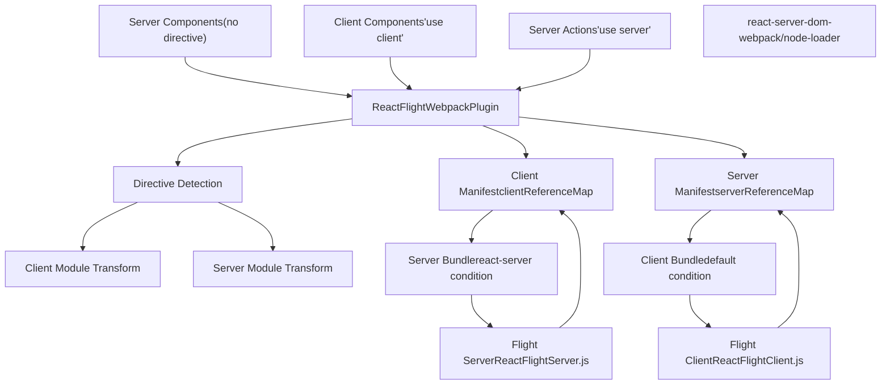
Sources: [scripts/rollup/bundles.js524-558](https://github.com/facebook/react/blob/65eec428/scripts/rollup/bundles.js#L524-L558) [packages/react-server/src/ReactFlightServer.js1-100](https://github.com/facebook/react/blob/65eec428/packages/react-server/src/ReactFlightServer.js#L1-L100) [packages/react-client/src/ReactFlightClient.js1-100](https://github.com/facebook/react/blob/65eec428/packages/react-client/src/ReactFlightClient.js#L1-L100)

---

## Webpack Plugin Implementation

The `ReactFlightWebpackPlugin` is the primary build-time integration point. It analyzes modules for directives, transforms module references, and generates the client and server manifests.

**Plugin Bundle Configuration**

| Property | Value |
| --- | --- |
| Entry Point | `react-server-dom-webpack/plugin` |
| Bundle Type | `NODE_ES2015` |
| Module Type | `RENDERER_UTILS` |
| Global Name | `ReactServerWebpackPlugin` |
| Externals | `fs`, `path`, `url`, `neo-async` |

The plugin operates as a Webpack compilation plugin that hooks into the module graph construction process to identify client and server boundaries.

**Module Analysis Process**

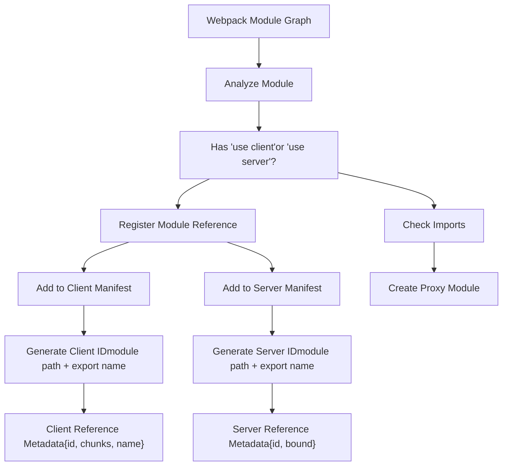
Sources: [scripts/rollup/bundles.js524-533](https://github.com/facebook/react/blob/65eec428/scripts/rollup/bundles.js#L524-L533)

---

## Module Reference System

React Server Components use a module reference system to represent code that crosses the server/client boundary. These references are opaque identifiers that get resolved at runtime using the manifests.

**Client Reference Structure**

A client reference represents a module that should be loaded on the client. When server code imports a client component, it receives a reference instead of the actual module.

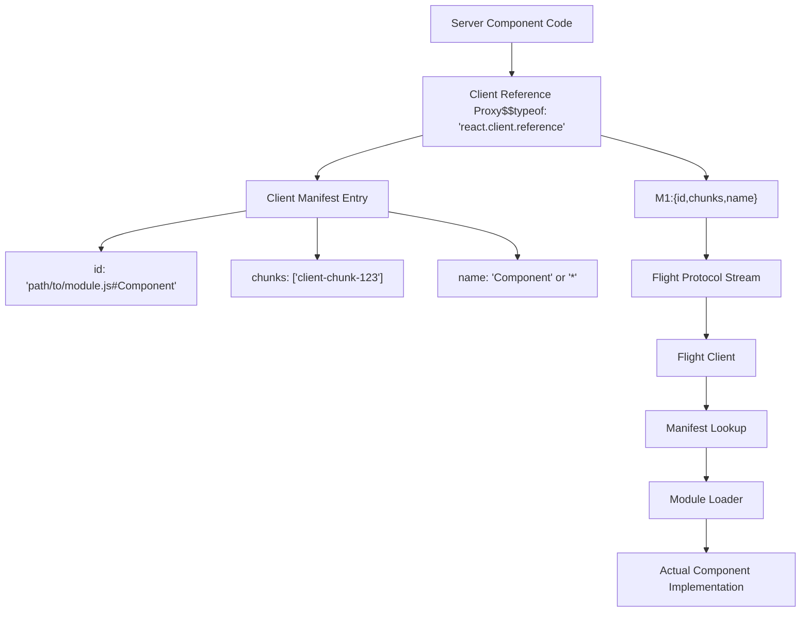
Sources: [packages/react-client/src/ReactFlightClient.js1-100](https://github.com/facebook/react/blob/65eec428/packages/react-client/src/ReactFlightClient.js#L1-L100) [packages/react-server/src/ReactFlightServer.js79-101](https://github.com/facebook/react/blob/65eec428/packages/react-server/src/ReactFlightServer.js#L79-L101)

**Server Reference Structure**

A server reference represents a function that should execute on the server. When client code calls a server action, it sends a reference and arguments back to the server.

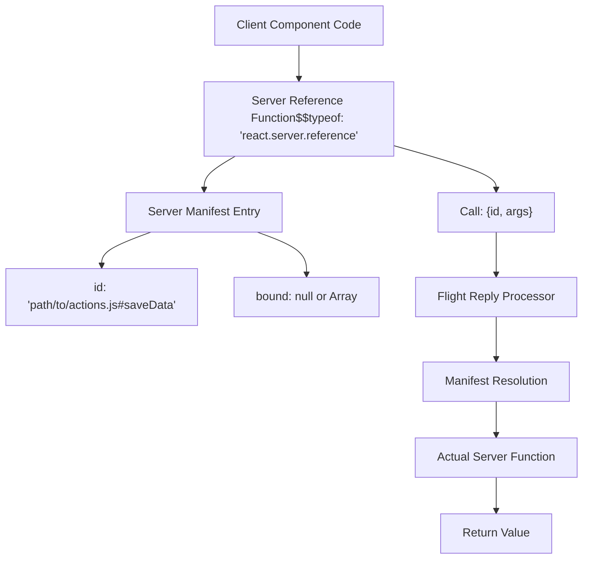
Sources: [packages/react-client/src/ReactFlightReplyClient.js52-80](https://github.com/facebook/react/blob/65eec428/packages/react-client/src/ReactFlightReplyClient.js#L52-L80) [packages/react-server/src/ReactFlightReplyServer.js1-50](https://github.com/facebook/react/blob/65eec428/packages/react-server/src/ReactFlightReplyServer.js#L1-L50)

---

## Directive Processing

The build system processes two types of directives: `'use client'` and `'use server'`. These directives must appear at the top of the module, before any other code.

**Directive Detection and Transformation**

| Directive | Location | Meaning | Build Transformation |
| --- | --- | --- | --- |
| `'use client'` | Top of file | Entire module runs on client | Replace with client reference proxy in server bundle |
| `'use server'` | Top of file | Entire module exports server actions | Replace with server reference proxies in client bundle |
| `'use server'` | Inside function | Single function is server action | Extract and create server reference |

**Client Directive Processing Flow**

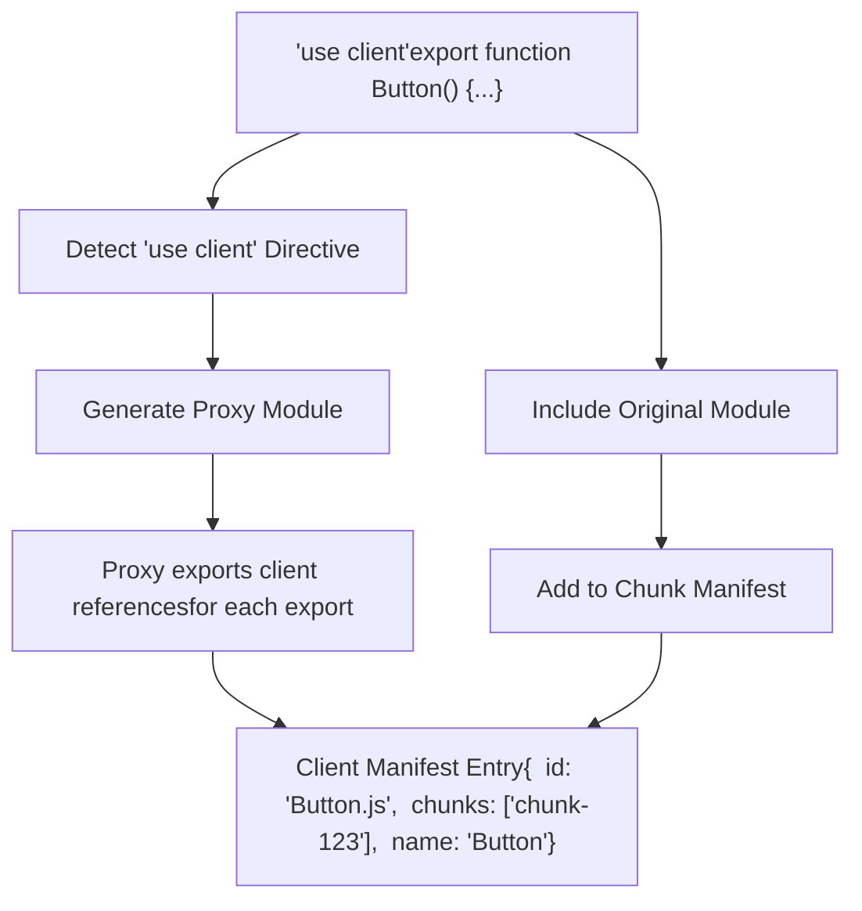
Sources: [scripts/rollup/bundles.js448-522](https://github.com/facebook/react/blob/65eec428/scripts/rollup/bundles.js#L448-L522)

**Server Directive Processing Flow**

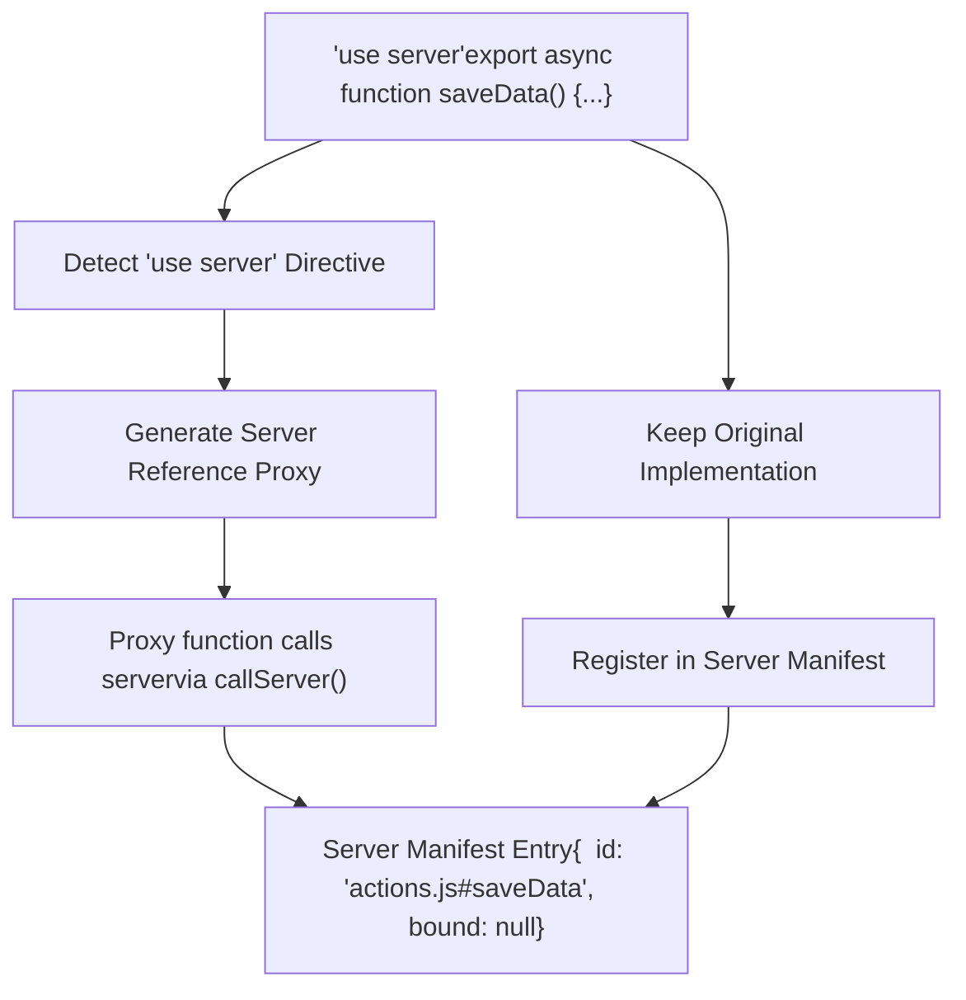
Sources: [packages/react-client/src/ReactFlightReplyClient.js1-100](https://github.com/facebook/react/blob/65eec428/packages/react-client/src/ReactFlightReplyClient.js#L1-L100) [packages/react-server/src/ReactFlightReplyServer.js1-50](https://github.com/facebook/react/blob/65eec428/packages/react-server/src/ReactFlightReplyServer.js#L1-L50)

---

## Manifest Structures

The build process generates two manifest files that enable runtime module resolution across the server/client boundary.

**Client Manifest Format**

The client manifest maps module IDs to chunk information, allowing the server to serialize client references that the client can resolve.

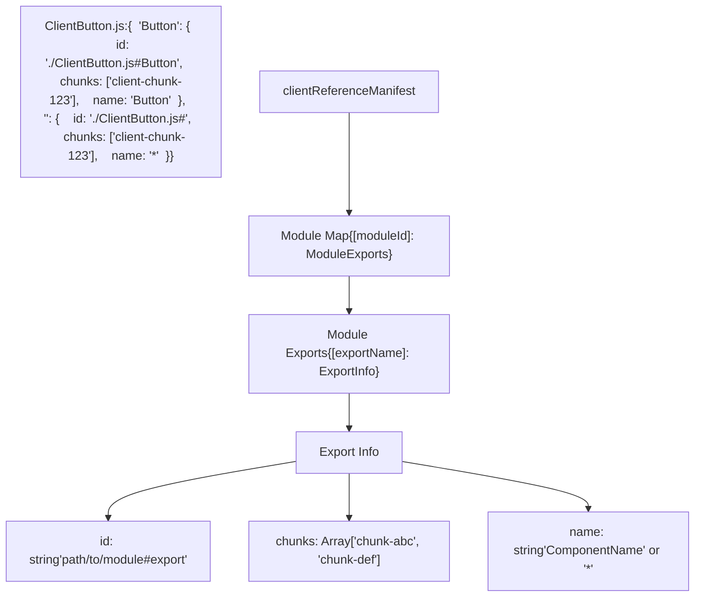
**Client Manifest Runtime Usage**

| Stage | Operation | Manifest Usage |
| --- | --- | --- |
| Server Render | Encounter client component | Look up module ID in manifest to get chunks |
| Flight Serialization | Serialize client reference | Include `{id, chunks, name}` in stream |
| Client Receive | Deserialize reference | Use chunks to preload/load module |
| Client Render | Instantiate component | Import module and get export by name |

Sources: [packages/react-server/src/ReactFlightServer.js79-101](https://github.com/facebook/react/blob/65eec428/packages/react-server/src/ReactFlightServer.js#L79-L101) [packages/react-client/src/ReactFlightClient.js44-64](https://github.com/facebook/react/blob/65eec428/packages/react-client/src/ReactFlightClient.js#L44-L64)

**Server Manifest Format**

The server manifest maps server action IDs to module locations, allowing the client to invoke server functions.

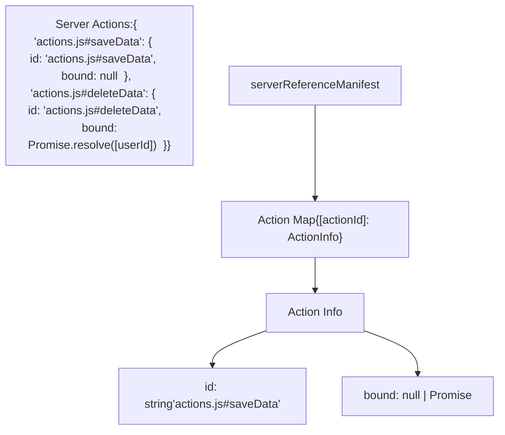
**Server Manifest Runtime Usage**

| Stage | Operation | Manifest Usage |
| --- | --- | --- |
| Client Render | Receive server reference | Store reference with `$$typeof` marker |
| Client Invoke | Call server function | Serialize `{id, args}` with Flight Reply |
| Server Receive | Deserialize call | Look up action ID in manifest |
| Server Execute | Load and invoke | Require module and call export by name |

Sources: [packages/react-client/src/ReactFlightReplyClient.js52-80](https://github.com/facebook/react/blob/65eec428/packages/react-client/src/ReactFlightReplyClient.js#L52-L80) [packages/react-server/src/ReactFlightReplyServer.js1-50](https://github.com/facebook/react/blob/65eec428/packages/react-server/src/ReactFlightReplyServer.js#L1-L50)

---

## Module Loading Integration

The build integration includes module loaders that handle the `react-server` condition at runtime, ensuring the correct versions of modules are loaded in each environment.

**Node.js Loader Configuration**

| Property | Value |
| --- | --- |
| Entry Point | `react-server-dom-webpack/node-loader` |
| Bundle Type | `ESM_PROD` |
| Condition | `react-server` |
| External | `acorn` (for AST parsing) |

The Node.js loader uses ESM loader hooks to intercept module resolution and ensure that modules with the `react-server` export condition are loaded in the server environment.

**Module Resolution Flow**

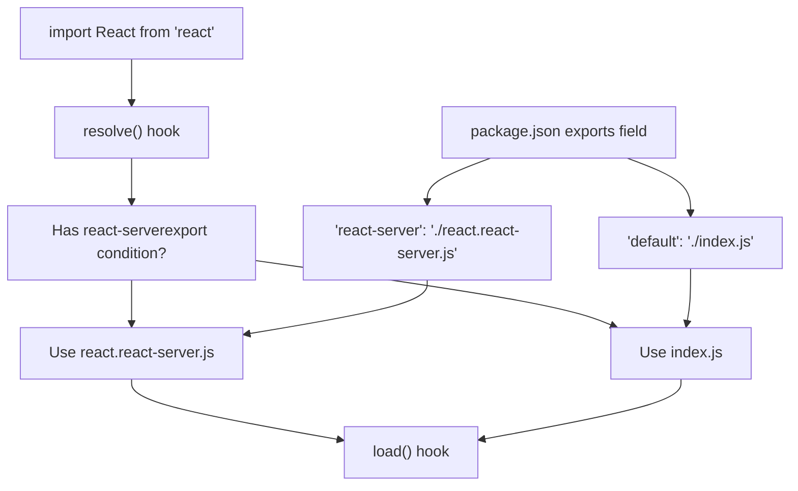
Sources: [scripts/rollup/bundles.js535-545](https://github.com/facebook/react/blob/65eec428/scripts/rollup/bundles.js#L535-L545) [packages/react/package.json24-42](https://github.com/facebook/react/blob/65eec428/packages/react/package.json#L24-L42)

**CommonJS Module Registration**

For CommonJS environments, a registration module handles module loading:

| Property | Value |
| --- | --- |
| Entry Point | `react-server-dom-webpack/src/ReactFlightWebpackNodeRegister` |
| Name | `react-server-dom-webpack-node-register` |
| Condition | `react-server` |
| Externals | `url`, `module`, `react-server-dom-webpack/server` |

This module hooks into Node's `require()` system to apply the `react-server` condition for CommonJS modules.

Sources: [scripts/rollup/bundles.js547-558](https://github.com/facebook/react/blob/65eec428/scripts/rollup/bundles.js#L547-L558)

---

## Build Output Organization

The build system produces separate bundles for server and client environments, each consuming the appropriate manifest.

**Bundle Type Matrix**

| Bundle | Entry Points | Condition | Consumes Manifest | Target Environment |
| --- | --- | --- | --- | --- |
| Server | `react-server-dom-webpack/server.{node,browser,edge}` | `react-server` | Client Manifest | Node.js, Edge Runtime, Browser (SSR) |
| Client | `react-server-dom-webpack/client.{node,browser,edge}` | default | Server Manifest | Node.js (for SSR), Browser |
| Plugin | `react-server-dom-webpack/plugin` | N/A | Generates both | Build time only |
| Loader | `react-server-dom-webpack/node-loader` | `react-server` | N/A | Node.js ESM runtime |

**Server Bundle Configuration**

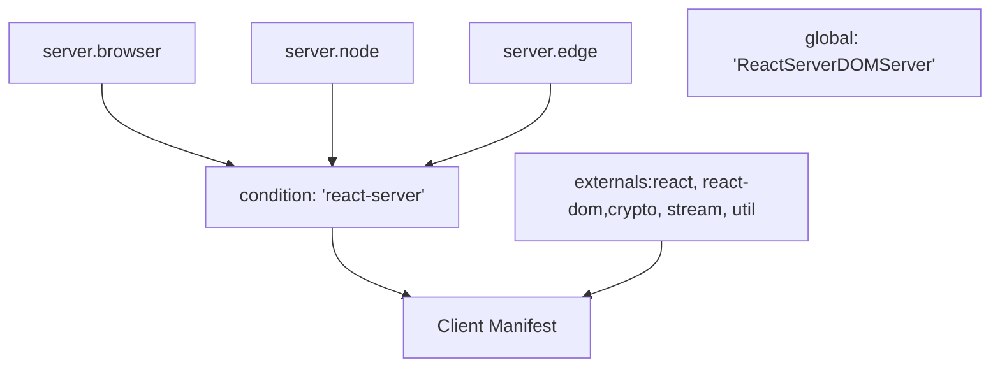
Sources: [scripts/rollup/bundles.js448-489](https://github.com/facebook/react/blob/65eec428/scripts/rollup/bundles.js#L448-L489)

**Client Bundle Configuration**

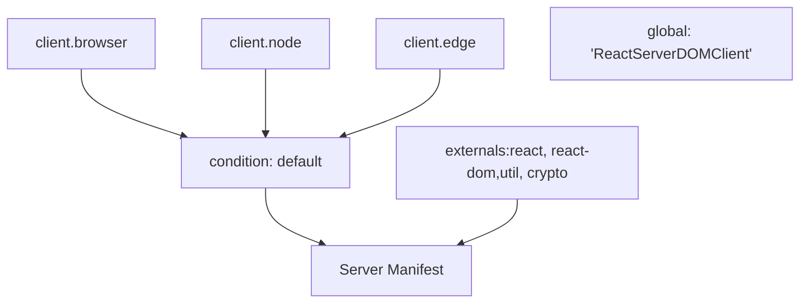
Sources: [scripts/rollup/bundles.js491-522](https://github.com/facebook/react/blob/65eec428/scripts/rollup/bundles.js#L491-L522)

---

## Fork System Integration

The build system uses a fork mechanism to provide different implementations of shared modules based on the bundle type and environment.

**React Shared Internals Forking**

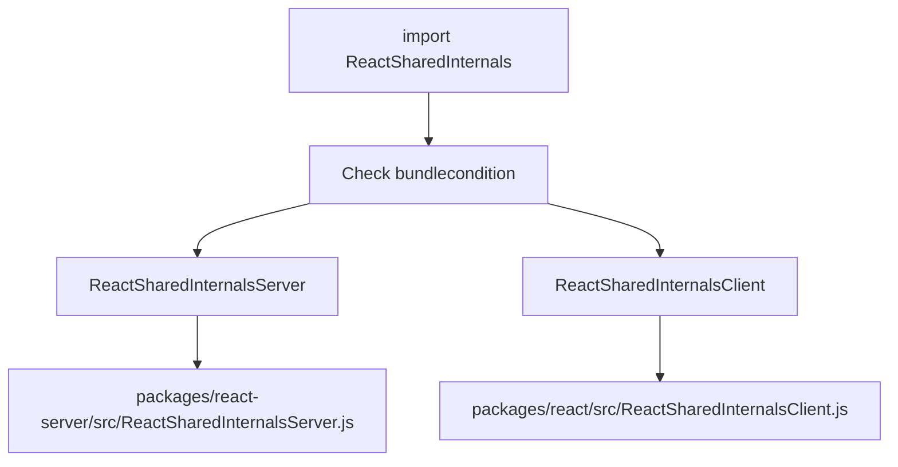
**Fork Configuration Table**

| Module | Condition | Fork Target | Purpose |
| --- | --- | --- | --- |
| `shared/ReactSharedInternals.js` | `react-server` | `ReactSharedInternalsServer.js` | Server-specific internals (Flight hooks) |
| `shared/ReactSharedInternals.js` | default | `ReactSharedInternalsClient.js` | Client-specific internals (useState, etc.) |
| `shared/ReactDOMSharedInternals.js` | `react-server` | N/A | Not available in react-server |
| `shared/ReactDOMSharedInternals.js` | default | `ReactDOMSharedInternals.js` | DOM-specific internals |

Sources: [scripts/rollup/forks.js52-131](https://github.com/facebook/react/blob/65eec428/scripts/rollup/forks.js#L52-L131) [scripts/rollup/build.js354-403](https://github.com/facebook/react/blob/65eec428/scripts/rollup/build.js#L354-L403)

---

## Integration with Other Bundlers

While the primary implementation uses Webpack, the architecture supports other bundlers through similar plugin systems.

**Turbopack Integration**

| Bundle | Entry Point | Notes |
| --- | --- | --- |
| Server | `react-server-dom-turbopack/server.{browser,node,edge}` | Similar to Webpack server |
| Client | `react-server-dom-turbopack/client.{browser,node,edge}` | Similar to Webpack client |

The Turbopack integration follows the same manifest generation and module reference patterns, but uses Turbopack's native plugin system instead of Webpack's.

Sources: [scripts/rollup/bundles.js560-672](https://github.com/facebook/react/blob/65eec428/scripts/rollup/bundles.js#L560-L672)

**Unbundled (Development) Integration**

For development and testing without a bundler:

| Bundle | Entry Point | Purpose |
| --- | --- | --- |
| Server | `react-server-dom-unbundled/server.node` | No bundling, direct module resolution |
| Client | `react-server-dom-unbundled/client.node` | No bundling, direct module imports |

This configuration is used primarily in tests to validate the Flight protocol without bundler complexity.

Sources: Test files show usage of WebpackMock utilities that simulate manifest generation without actual bundling.

---

## Summary

The build integration for React Server Components operates through:

1.  **Plugin System**: `ReactFlightWebpackPlugin` analyzes modules and generates manifests
2.  **Module References**: Abstract representations of cross-boundary modules with `$$typeof` markers
3.  **Directive Processing**: Transform `'use client'` and `'use server'` directives into appropriate references
4.  **Manifest Generation**: Create client manifest (server → client) and server manifest (client → server)
5.  **Module Loading**: Use condition-based resolution with `react-server` export condition
6.  **Fork System**: Provide environment-specific implementations of shared modules

The architecture is bundler-agnostic, with implementations for Webpack, Turbopack, and unbundled environments all following the same manifest and reference patterns.

Sources: [scripts/rollup/bundles.js448-672](https://github.com/facebook/react/blob/65eec428/scripts/rollup/bundles.js#L448-L672) [scripts/rollup/forks.js1-300](https://github.com/facebook/react/blob/65eec428/scripts/rollup/forks.js#L1-L300) [scripts/rollup/build.js1-600](https://github.com/facebook/react/blob/65eec428/scripts/rollup/build.js#L1-L600)
