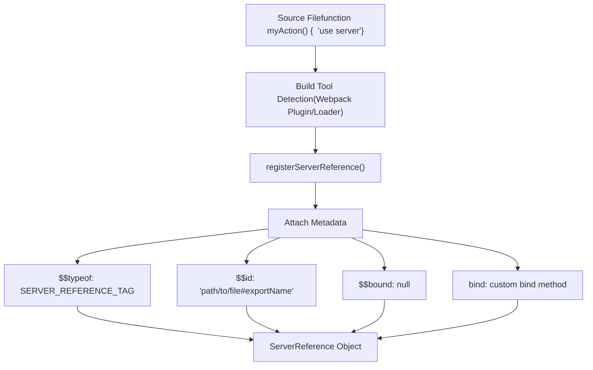
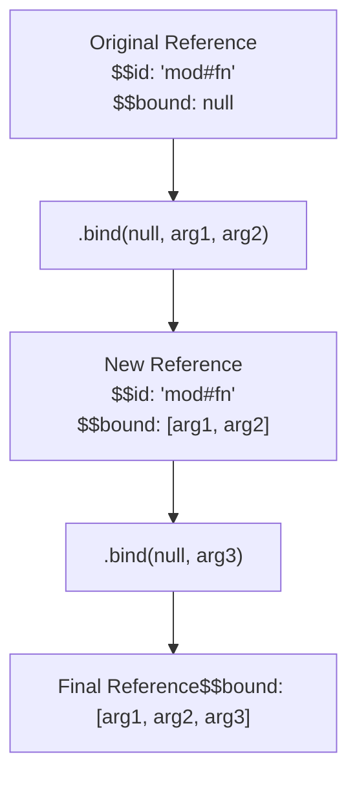
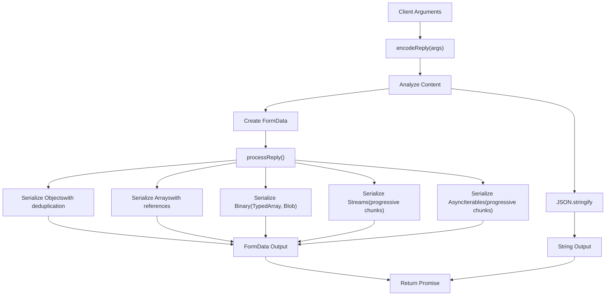
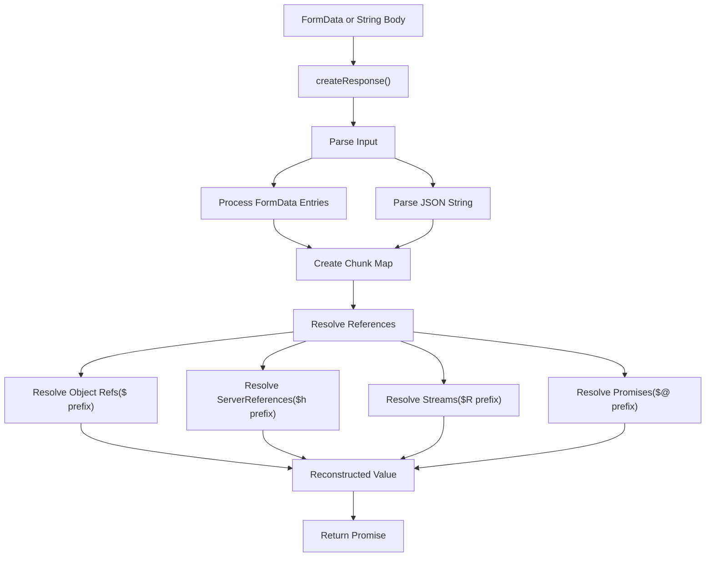
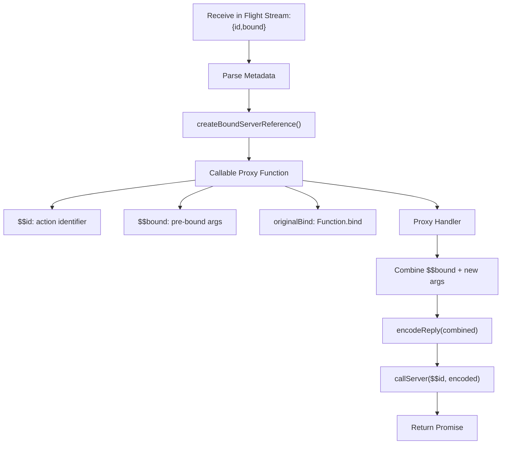
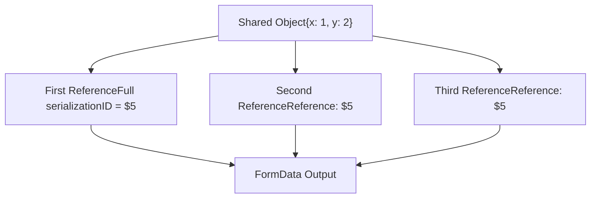
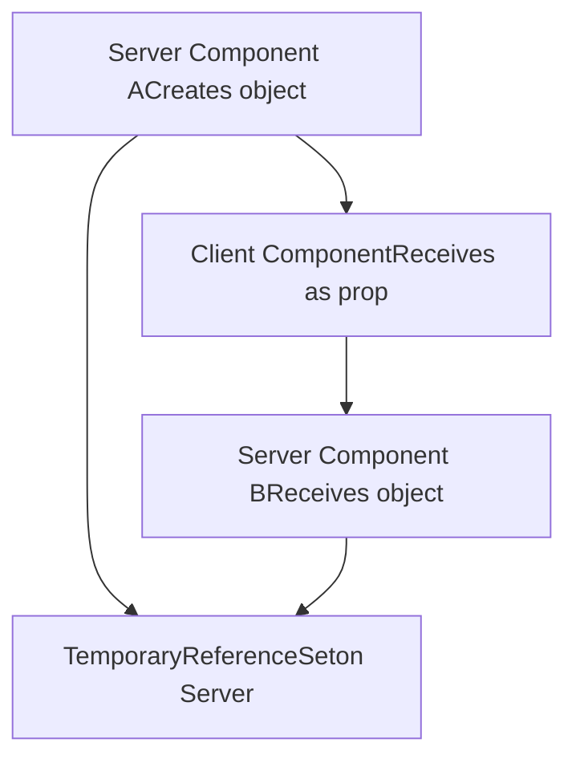

# Server Actions and Bidirectional Communication

Relevant source files

-   [packages/react-client/src/ReactFlightClient.js](https://github.com/facebook/react/blob/65eec428/packages/react-client/src/ReactFlightClient.js)
-   [packages/react-client/src/ReactFlightReplyClient.js](https://github.com/facebook/react/blob/65eec428/packages/react-client/src/ReactFlightReplyClient.js)
-   [packages/react-client/src/ReactFlightTemporaryReferences.js](https://github.com/facebook/react/blob/65eec428/packages/react-client/src/ReactFlightTemporaryReferences.js)
-   [packages/react-client/src/\_\_tests\_\_/ReactFlight-test.js](https://github.com/facebook/react/blob/65eec428/packages/react-client/src/__tests__/ReactFlight-test.js)
-   [packages/react-server-dom-esm/src/ReactFlightESMReferences.js](https://github.com/facebook/react/blob/65eec428/packages/react-server-dom-esm/src/ReactFlightESMReferences.js)
-   [packages/react-server-dom-parcel/src/ReactFlightParcelReferences.js](https://github.com/facebook/react/blob/65eec428/packages/react-server-dom-parcel/src/ReactFlightParcelReferences.js)
-   [packages/react-server-dom-turbopack/src/ReactFlightTurbopackReferences.js](https://github.com/facebook/react/blob/65eec428/packages/react-server-dom-turbopack/src/ReactFlightTurbopackReferences.js)
-   [packages/react-server-dom-unbundled/src/ReactFlightUnbundledReferences.js](https://github.com/facebook/react/blob/65eec428/packages/react-server-dom-unbundled/src/ReactFlightUnbundledReferences.js)
-   [packages/react-server-dom-webpack/src/ReactFlightWebpackNodeLoader.js](https://github.com/facebook/react/blob/65eec428/packages/react-server-dom-webpack/src/ReactFlightWebpackNodeLoader.js)
-   [packages/react-server-dom-webpack/src/ReactFlightWebpackNodeRegister.js](https://github.com/facebook/react/blob/65eec428/packages/react-server-dom-webpack/src/ReactFlightWebpackNodeRegister.js)
-   [packages/react-server-dom-webpack/src/ReactFlightWebpackPlugin.js](https://github.com/facebook/react/blob/65eec428/packages/react-server-dom-webpack/src/ReactFlightWebpackPlugin.js)
-   [packages/react-server-dom-webpack/src/ReactFlightWebpackReferences.js](https://github.com/facebook/react/blob/65eec428/packages/react-server-dom-webpack/src/ReactFlightWebpackReferences.js)
-   [packages/react-server-dom-webpack/src/\_\_tests\_\_/ReactFlightDOM-test.js](https://github.com/facebook/react/blob/65eec428/packages/react-server-dom-webpack/src/__tests__/ReactFlightDOM-test.js)
-   [packages/react-server-dom-webpack/src/\_\_tests\_\_/ReactFlightDOMBrowser-test.js](https://github.com/facebook/react/blob/65eec428/packages/react-server-dom-webpack/src/__tests__/ReactFlightDOMBrowser-test.js)
-   [packages/react-server-dom-webpack/src/\_\_tests\_\_/ReactFlightDOMEdge-test.js](https://github.com/facebook/react/blob/65eec428/packages/react-server-dom-webpack/src/__tests__/ReactFlightDOMEdge-test.js)
-   [packages/react-server-dom-webpack/src/\_\_tests\_\_/ReactFlightDOMNode-test.js](https://github.com/facebook/react/blob/65eec428/packages/react-server-dom-webpack/src/__tests__/ReactFlightDOMNode-test.js)
-   [packages/react-server-dom-webpack/src/\_\_tests\_\_/ReactFlightDOMReply-test.js](https://github.com/facebook/react/blob/65eec428/packages/react-server-dom-webpack/src/__tests__/ReactFlightDOMReply-test.js)
-   [packages/react-server-dom-webpack/src/\_\_tests\_\_/ReactFlightDOMReplyEdge-test.js](https://github.com/facebook/react/blob/65eec428/packages/react-server-dom-webpack/src/__tests__/ReactFlightDOMReplyEdge-test.js)
-   [packages/react-server-dom-webpack/src/\_\_tests\_\_/utils/WebpackMock.js](https://github.com/facebook/react/blob/65eec428/packages/react-server-dom-webpack/src/__tests__/utils/WebpackMock.js)
-   [packages/react-server/src/ReactFlightReplyServer.js](https://github.com/facebook/react/blob/65eec428/packages/react-server/src/ReactFlightReplyServer.js)
-   [packages/react-server/src/ReactFlightServer.js](https://github.com/facebook/react/blob/65eec428/packages/react-server/src/ReactFlightServer.js)
-   [packages/react-server/src/ReactFlightServerTemporaryReferences.js](https://github.com/facebook/react/blob/65eec428/packages/react-server/src/ReactFlightServerTemporaryReferences.js)
-   [scripts/error-codes/codes.json](https://github.com/facebook/react/blob/65eec428/scripts/error-codes/codes.json)

## Purpose and Scope

This document explains how React Server Components enable client-to-server communication through Server Actions and the Reply protocol. While the Flight protocol (covered in [React Server Components (Flight)](/facebook/react/5.2-react-server-components-(flight))) handles server-to-client streaming, Server Actions enable the reverse: calling server-side functions from the client with full argument serialization.

For information about how bundlers generate the manifests that enable this functionality, see [Build Integration for Server Components](/facebook/react/5.3-build-integration-for-server-components).

## Overview

Server Actions provide bidirectional communication in React Server Components through:

1.  **Server References**: Functions marked with `'use server'` that can be called from the client
2.  **Reply Protocol**: Client-to-server serialization format for function arguments
3.  **Bound References**: Partial application of server actions using `.bind()`
4.  **Form Integration**: Progressive enhancement for form actions

---

## Server References

### Reference Structure

A Server Reference is a special function object with metadata that enables cross-boundary invocation.

**Type Definition:**

```
ServerReference<T> = T & {
  $$typeof: Symbol.for('react.server.reference'),
  $$id: string,
  $$bound: null | Array<ReactClientValue>,
  $$location?: Error  // DEV only
}
```
Sources: [packages/react-server-dom-webpack/src/ReactFlightWebpackReferences.js12-17](https://github.com/facebook/react/blob/65eec428/packages/react-server-dom-webpack/src/ReactFlightWebpackReferences.js#L12-L17)

### Registration and Creation


Sources: [packages/react-server-dom-webpack/src/ReactFlightWebpackReferences.js111-144](https://github.com/facebook/react/blob/65eec428/packages/react-server-dom-webpack/src/ReactFlightWebpackReferences.js#L111-L144) [packages/react-server-dom-webpack/src/ReactFlightWebpackNodeRegister.js16-67](https://github.com/facebook/react/blob/65eec428/packages/react-server-dom-webpack/src/ReactFlightWebpackNodeRegister.js#L16-L67)

The `registerServerReference` function decorates a function with server reference metadata:

[packages/react-server-dom-webpack/src/ReactFlightWebpackReferences.js111-144](https://github.com/facebook/react/blob/65eec428/packages/react-server-dom-webpack/src/ReactFlightWebpackReferences.js#L111-L144)

**Key Properties:**

-   `$$typeof`: Symbol identifying this as a server reference
-   `$$id`: Combined module ID and export name (e.g., `"file.js#actionName"`)
-   `$$bound`: Array of arguments from `.bind()` calls, initially `null`
-   `bind`: Custom bind implementation that preserves metadata

### Bound Server References

Server references support partial application through a custom `.bind()` implementation:


Sources: [packages/react-server-dom-webpack/src/ReactFlightWebpackReferences.js65-103](https://github.com/facebook/react/blob/65eec428/packages/react-server-dom-webpack/src/ReactFlightWebpackReferences.js#L65-L103)

The custom bind function:

1.  Requires `this` context to be `null` or `undefined` (issues DEV warning otherwise)
2.  Accumulates bound arguments in `$$bound` array
3.  Preserves `$$id` from original reference
4.  Returns new function with combined metadata

[packages/react-server-dom-webpack/src/ReactFlightWebpackReferences.js65-103](https://github.com/facebook/react/blob/65eec428/packages/react-server-dom-webpack/src/ReactFlightWebpackReferences.js#L65-L103)

---

## Reply Protocol (Client-to-Server Communication)

### encodeReply Function

The client-side `encodeReply` function serializes function arguments for transmission to the server.

**API:**

```
encodeReply(
  value: ReactServerValue,
  options?: { temporaryReferences?: TemporaryReferenceSet }
): Promise<string | FormData>
```
**Return Types:**

-   `string`: JSON for simple, fully synchronous data
-   `FormData`: For complex data including binary, streams, or async iterables

Sources: [packages/react-client/src/ReactFlightReplyClient.js178-427](https://github.com/facebook/react/blob/65eec428/packages/react-client/src/ReactFlightReplyClient.js#L178-L427)

### Encoding Flow


Sources: [packages/react-client/src/ReactFlightReplyClient.js178-427](https://github.com/facebook/react/blob/65eec428/packages/react-client/src/ReactFlightReplyClient.js#L178-L427)

### Supported Data Types

| Type | Encoding Format | Example |
| --- | --- | --- |
| **Primitives** | Direct JSON | `string`, `number`, `boolean`, `null` |
| **undefined** | `"$undefined"` | Special marker string |
| **BigInt** | `"$n" + value` | `"$n12345678901234567890"` |
| **Date** | `"$D" + ISO8601` | `"$D2024-01-15T10:30:00.000Z"` |
| **Map** | `"$Q" + id` | Reference to serialized entries |
| **Set** | `"$W" + id` | Reference to serialized entries |
| **ArrayBuffer** | `"$A" + id` | Blob in FormData |
| **TypedArray** | `"$" + type + id` | e.g., `"$O1"` for Uint8Array |
| **Blob/File** | `"$B" + id` | Blob in FormData |
| **FormData** | `"$K" + id` | Nested FormData entries |
| **ReadableStream** | `"$R" + id` or `"$r" + id` | Progressive chunks (BYOB if binary) |
| **AsyncIterable** | `"$X" + id` or `"$x" + id` | Progressive chunks (iterator vs iterable) |
| **Iterator** | `"$i" + id` | Single-shot iteration |
| **Promise** | `"$@" + id` | Async resolution |
| **ServerReference** | `"$h" + id` | Server reference with bound args |

Sources: [packages/react-client/src/ReactFlightReplyClient.js98-174](https://github.com/facebook/react/blob/65eec428/packages/react-client/src/ReactFlightReplyClient.js#L98-L174)

### Serialization Format Details

#### Object References

Objects are deduplicated using a WeakMap to avoid sending duplicate data:

[packages/react-client/src/ReactFlightReplyClient.js188](https://github.com/facebook/react/blob/65eec428/packages/react-client/src/ReactFlightReplyClient.js#L188-L188)

First occurrence gets full serialization, subsequent references use `"$" + id` format.

#### Stream Serialization

ReadableStreams are serialized progressively:

[packages/react-client/src/ReactFlightReplyClient.js280-291](https://github.com/facebook/react/blob/65eec428/packages/react-client/src/ReactFlightReplyClient.js#L280-L291)

```
<prefix><streamId>: <chunk1-json>
<prefix><streamId>: <chunk2-json>
<prefix><streamId>: C
```
The final `C` marker signals stream completion.

#### Binary Data

TypedArrays and Blobs are encoded as multipart FormData entries:

[packages/react-client/src/ReactFlightReplyClient.js191-210](https://github.com/facebook/react/blob/65eec428/packages/react-client/src/ReactFlightReplyClient.js#L191-L210)

```
// TypedArray example
const buffer = new Uint8Array([1, 2, 3, 4]);
// Encoded as: "$O" + id, with blob in FormData
```
---

## decodeReply Function (Server-Side)

The server decodes client arguments using `decodeReply`:

**API:**

```
decodeReply(
  body: string | FormData,
  serverManifest: ServerManifest,
  options?: { temporaryReferences?: TemporaryReferenceSet }
): Promise<any>
```
Sources: [packages/react-server/src/ReactFlightReplyServer.js686-800](https://github.com/facebook/react/blob/65eec428/packages/react-server/src/ReactFlightReplyServer.js#L686-L800)

### Decoding Flow


Sources: [packages/react-server/src/ReactFlightReplyServer.js686-800](https://github.com/facebook/react/blob/65eec428/packages/react-server/src/ReactFlightReplyServer.js#L686-L800)

The decoder:

1.  Creates a `Response` object with chunk map
2.  Parses FormData entries into numbered chunks
3.  Uses state machine to resolve references
4.  Reconstructs complex types (Maps, Sets, streams)
5.  Returns Promise that resolves to final value

[packages/react-server/src/ReactFlightReplyServer.js686-800](https://github.com/facebook/react/blob/65eec428/packages/react-server/src/ReactFlightReplyServer.js#L686-L800)

---

## Server Action Invocation Flow

> **[Mermaid sequence]**
> *(图表结构无法解析)*

Sources: [packages/react-client/src/ReactFlightReplyClient.js428-482](https://github.com/facebook/react/blob/65eec428/packages/react-client/src/ReactFlightReplyClient.js#L428-L482) [packages/react-server/src/ReactFlightReplyServer.js686-800](https://github.com/facebook/react/blob/65eec428/packages/react-server/src/ReactFlightReplyServer.js#L686-L800)

### callServer Callback

The Flight Client requires a `callServer` implementation to handle the network layer:

[packages/react-client/src/ReactFlightReplyClient.js54](https://github.com/facebook/react/blob/65eec428/packages/react-client/src/ReactFlightReplyClient.js#L54-L54)

**Type:**

```
type CallServerCallback = <A, T>(
  id: ServerReferenceId,
  args: A
) => Promise<T>
```
**Typical Implementation:**

```
async function callServer(actionId, args) {
  const body = await ReactFlightReplyClient.encodeReply(args);

  const response = await fetch('/rsc-action', {
    method: 'POST',
    headers: { 'X-Action-Id': actionId },
    body: body
  });

  return ReactFlightClient.createFromFetch(response);
}
```
Sources: [packages/react-client/src/ReactFlightReplyClient.js54](https://github.com/facebook/react/blob/65eec428/packages/react-client/src/ReactFlightReplyClient.js#L54-L54) test examples in [packages/react-server-dom-webpack/src/\_\_tests\_\_/ReactFlightDOMBrowser-test.js154-158](https://github.com/facebook/react/blob/65eec428/packages/react-server-dom-webpack/src/__tests__/ReactFlightDOMBrowser-test.js#L154-L158)

---

## Reference Serialization and Resolution

### Server-Side: Serializing References

When ReactFlightServer encounters a ServerReference, it serializes the metadata:

[packages/react-server/src/ReactFlightServer.js2203-2239](https://github.com/facebook/react/blob/65eec428/packages/react-server/src/ReactFlightServer.js#L2203-L2239)

**Format:**

```
{
  $$typeof: Symbol.for("react.server.reference"),
  $$id: "module-path#export-name",
  $$bound: [arg1, arg2] || null
}
```
The server extracts this information using config functions:

-   `getServerReferenceId(reference)`: Returns the ID string
-   `getServerReferenceBoundArguments(reference)`: Returns bound args array

Sources: [packages/react-server/src/ReactFlightServer.js81-83](https://github.com/facebook/react/blob/65eec428/packages/react-server/src/ReactFlightServer.js#L81-L83)

### Client-Side: Creating Callable Proxies

ReactFlightClient receives the serialized reference and creates a callable proxy:


Sources: [packages/react-client/src/ReactFlightReplyClient.js428-482](https://github.com/facebook/react/blob/65eec428/packages/react-client/src/ReactFlightReplyClient.js#L428-L482)

The proxy function implementation:

[packages/react-client/src/ReactFlightReplyClient.js428-482](https://github.com/facebook/react/blob/65eec428/packages/react-client/src/ReactFlightReplyClient.js#L428-L482)

1.  Stores server reference ID and bound arguments
2.  When called, prepends bound args to new args
3.  Encodes combined arguments with `encodeReply`
4.  Invokes `callServer` callback
5.  Returns Promise resolving to result

---

## Form Integration

### Form Actions

Server actions can be used directly as form actions:

```
function MyForm({ submitAction }) {
  return (
    <form action={submitAction}>
      <input name="username" />
      <button type="submit">Submit</button>
    </form>
  );
}
```
When submitted:

1.  Browser collects FormData from inputs
2.  React intercepts submission (if JavaScript enabled)
3.  Calls server action with FormData
4.  Arguments encoded via Reply protocol
5.  Result returned as Promise

Sources: [packages/react-client/src/ReactFlightReplyClient.js56-59](https://github.com/facebook/react/blob/65eec428/packages/react-client/src/ReactFlightReplyClient.js#L56-L59)

### encodeFormAction Callback

The `encodeFormAction` callback customizes form action behavior:

[packages/react-client/src/ReactFlightReplyClient.js56-59](https://github.com/facebook/react/blob/65eec428/packages/react-client/src/ReactFlightReplyClient.js#L56-L59)

**Type:**

```
type EncodeFormActionCallback = <A>(
  id: ServerReferenceId,
  args: Promise<A>
) => ReactCustomFormAction
```
This allows frameworks to:

-   Return custom form action URLs
-   Embed action metadata in hidden fields
-   Implement progressive enhancement

### Progressive Enhancement

Server actions support both JavaScript-enabled and no-JavaScript scenarios:

| Scenario | Behavior |
| --- | --- |
| **No JavaScript** | Form POSTs directly to server endpoint |
| **With JavaScript** | Form submission intercepted, encoded via Reply protocol |
| **Hydration** | Actions work immediately after SSR |

The dual FormData support (as input and output) enables this flexibility.

Sources: [packages/react-client/src/ReactFlightReplyClient.js178-427](https://github.com/facebook/react/blob/65eec428/packages/react-client/src/ReactFlightReplyClient.js#L178-L427)

---

## Advanced Features

### Object Deduplication

The Reply protocol deduplicates objects to minimize payload size:


Sources: [packages/react-client/src/ReactFlightReplyClient.js188](https://github.com/facebook/react/blob/65eec428/packages/react-client/src/ReactFlightReplyClient.js#L188-L188)

A WeakMap tracks serialized objects:

-   First occurrence: full serialization assigned ID
-   Subsequent: reference to ID (`"$" + id`)
-   Cyclic references supported via this mechanism

### Streaming Data

ReadableStreams and AsyncIterables stream progressively:

[packages/react-client/src/ReactFlightReplyClient.js294-336](https://github.com/facebook/react/blob/65eec428/packages/react-client/src/ReactFlightReplyClient.js#L294-L336)

**Mechanism:**

1.  Allocate stream ID immediately
2.  Start reading stream chunks
3.  Append each chunk as separate FormData entry
4.  Send close marker when complete

**Format:**

```
prefix<id>: <chunk1-json>
prefix<id>: <chunk2-json>
prefix<id>: <chunk3-json>
prefix<id>: C
```
This enables efficient transmission of large or unbounded data.

### Temporary References

Temporary references pass non-serializable objects between server contexts:


Sources: [packages/react-server/src/ReactFlightServerTemporaryReferences.js20-44](https://github.com/facebook/react/blob/65eec428/packages/react-server/src/ReactFlightServerTemporaryReferences.js#L20-L44) [packages/react-client/src/ReactFlightTemporaryReferences.js1-32](https://github.com/facebook/react/blob/65eec428/packages/react-client/src/ReactFlightTemporaryReferences.js#L1-L32)

**Use Case:**

-   Server Component A creates complex object (e.g., database connection)
-   Passes to Server Component B via client component prop
-   Client serializes as temporary reference (`"$T" + id`)
-   Server Component B receives original object instance

**Format:**

```
"$T" marker + reference ID
```
The server maintains a `TemporaryReferenceSet` (WeakMap) to resolve these.

[packages/react-server/src/ReactFlightServerTemporaryReferences.js12-22](https://github.com/facebook/react/blob/65eec428/packages/react-server/src/ReactFlightServerTemporaryReferences.js#L12-L22)

---

## Error Handling

### Serialization Errors

Errors during `encodeReply` reject the returned Promise:

**Common Cases:**

-   Non-serializable objects (DOM nodes, non-server-reference functions)
-   Circular references without temporary reference support
-   Invalid type combinations

Sources: [packages/react-client/src/ReactFlightReplyClient.js178-427](https://github.com/facebook/react/blob/65eec428/packages/react-client/src/ReactFlightReplyClient.js#L178-L427)

### Network Errors

Network failures are handled by the `callServer` implementation:

-   Connection failures
-   Timeout errors
-   HTTP error responses

These propagate as rejected Promises to the caller.

### Server Action Errors

Errors thrown in server actions:

1.  Caught by ReactFlightServer
2.  Serialized via Flight error protocol
3.  Returned as rejected Promise to client
4.  Include error digest (production) or full details (DEV)

Sources: [packages/react-server/src/ReactFlightServer.js646-649](https://github.com/facebook/react/blob/65eec428/packages/react-server/src/ReactFlightServer.js#L646-L649)

---

## Implementation Reference

| Component | File |
| --- | --- |
| **ServerReference Type** | [packages/react-server-dom-webpack/src/ReactFlightWebpackReferences.js12-17](https://github.com/facebook/react/blob/65eec428/packages/react-server-dom-webpack/src/ReactFlightWebpackReferences.js#L12-L17) |
| **registerServerReference** | [packages/react-server-dom-webpack/src/ReactFlightWebpackReferences.js111-144](https://github.com/facebook/react/blob/65eec428/packages/react-server-dom-webpack/src/ReactFlightWebpackReferences.js#L111-L144) |
| **Custom bind Implementation** | [packages/react-server-dom-webpack/src/ReactFlightWebpackReferences.js65-103](https://github.com/facebook/react/blob/65eec428/packages/react-server-dom-webpack/src/ReactFlightWebpackReferences.js#L65-L103) |
| **encodeReply (Client)** | [packages/react-client/src/ReactFlightReplyClient.js178-427](https://github.com/facebook/react/blob/65eec428/packages/react-client/src/ReactFlightReplyClient.js#L178-L427) |
| **processReply (Client)** | [packages/react-client/src/ReactFlightReplyClient.js178-427](https://github.com/facebook/react/blob/65eec428/packages/react-client/src/ReactFlightReplyClient.js#L178-L427) |
| **decodeReply (Server)** | [packages/react-server/src/ReactFlightReplyServer.js686-800](https://github.com/facebook/react/blob/65eec428/packages/react-server/src/ReactFlightReplyServer.js#L686-L800) |
| **createBoundServerReference** | [packages/react-client/src/ReactFlightReplyClient.js428-482](https://github.com/facebook/react/blob/65eec428/packages/react-client/src/ReactFlightReplyClient.js#L428-L482) |
| **Temporary References (Server)** | [packages/react-server/src/ReactFlightServerTemporaryReferences.js](https://github.com/facebook/react/blob/65eec428/packages/react-server/src/ReactFlightServerTemporaryReferences.js) |
| **Temporary References (Client)** | [packages/react-client/src/ReactFlightTemporaryReferences.js](https://github.com/facebook/react/blob/65eec428/packages/react-client/src/ReactFlightTemporaryReferences.js) |
| **Node Register Hook** | [packages/react-server-dom-webpack/src/ReactFlightWebpackNodeRegister.js](https://github.com/facebook/react/blob/65eec428/packages/react-server-dom-webpack/src/ReactFlightWebpackNodeRegister.js) |
| **Node Loader** | [packages/react-server-dom-webpack/src/ReactFlightWebpackNodeLoader.js](https://github.com/facebook/react/blob/65eec428/packages/react-server-dom-webpack/src/ReactFlightWebpackNodeLoader.js) |

---

## Summary

Server Actions enable bidirectional communication in React Server Components through:

1.  **Server References**: Functions with metadata (`$$id`, `$$bound`) for cross-boundary calls
2.  **Reply Protocol**: Robust serialization supporting primitives, binary data, streams, and async iterables
3.  **Bound References**: Partial application via `.bind()` with argument accumulation
4.  **Form Integration**: Progressive enhancement for form submissions
5.  **Object Deduplication**: Efficient encoding avoiding redundant data transmission
6.  **Progressive Streaming**: Chunked serialization of streams and async iterables
7.  **Temporary References**: Non-serializable object passing between server contexts
8.  **Error Propagation**: Comprehensive error handling across serialization, network, and execution

The system primarily uses FormData as the transport format for complex data, falling back to JSON strings for simple cases. This design enables rich client-server interactions while maintaining progressive enhancement and efficient data transfer.

Sources: [packages/react-client/src/ReactFlightReplyClient.js](https://github.com/facebook/react/blob/65eec428/packages/react-client/src/ReactFlightReplyClient.js) [packages/react-server/src/ReactFlightReplyServer.js](https://github.com/facebook/react/blob/65eec428/packages/react-server/src/ReactFlightReplyServer.js) [packages/react-server-dom-webpack/src/ReactFlightWebpackReferences.js](https://github.com/facebook/react/blob/65eec428/packages/react-server-dom-webpack/src/ReactFlightWebpackReferences.js)
