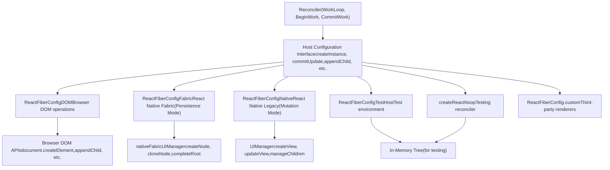
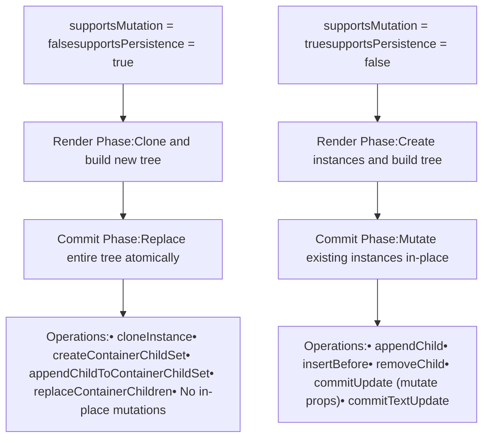
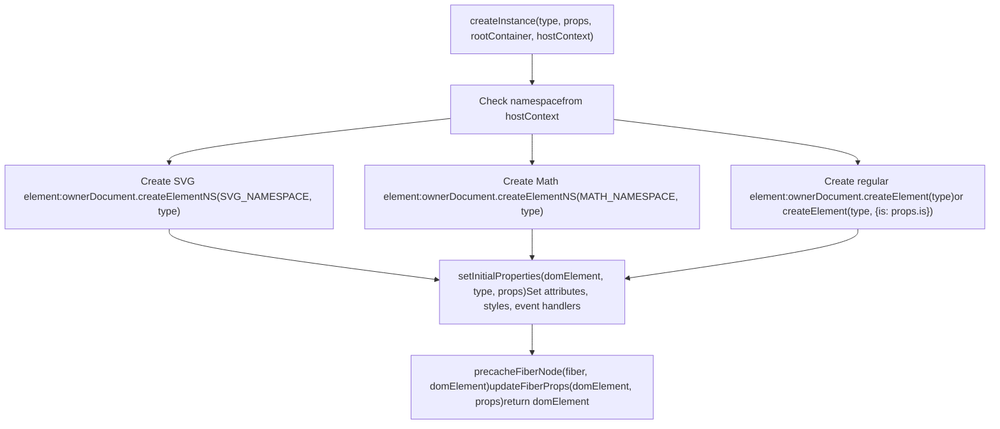
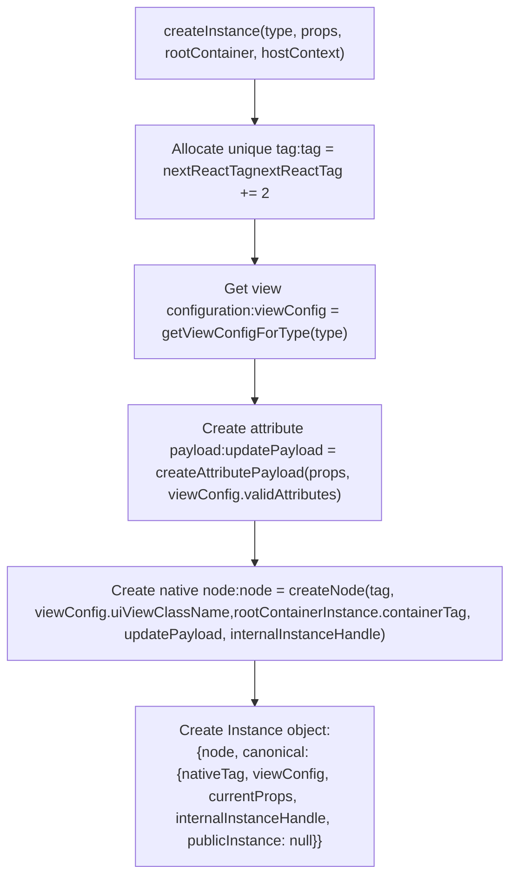
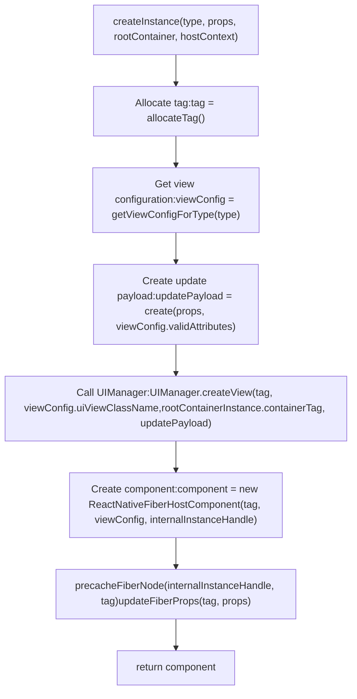
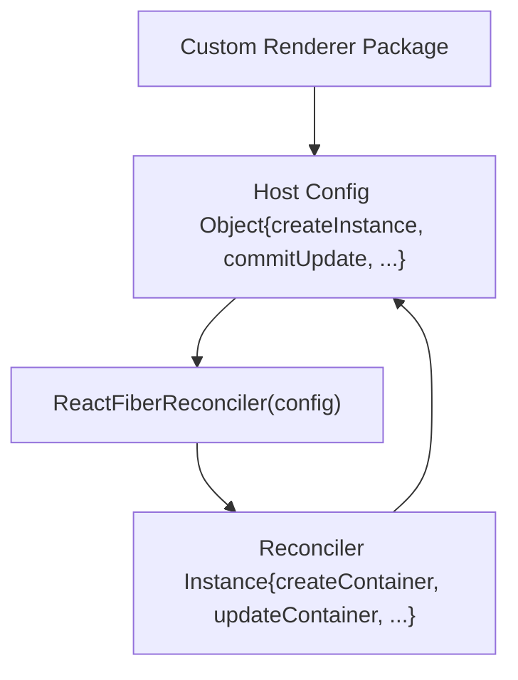

# Platform Implementations

Relevant source files

-   [packages/react-art/src/ReactFiberConfigART.js](https://github.com/facebook/react/blob/65eec428/packages/react-art/src/ReactFiberConfigART.js)
-   [packages/react-dom-bindings/src/client/ReactFiberConfigDOM.js](https://github.com/facebook/react/blob/65eec428/packages/react-dom-bindings/src/client/ReactFiberConfigDOM.js)
-   [packages/react-native-renderer/src/ReactFiberConfigFabric.js](https://github.com/facebook/react/blob/65eec428/packages/react-native-renderer/src/ReactFiberConfigFabric.js)
-   [packages/react-native-renderer/src/ReactFiberConfigNative.js](https://github.com/facebook/react/blob/65eec428/packages/react-native-renderer/src/ReactFiberConfigNative.js)
-   [packages/react-noop-renderer/src/createReactNoop.js](https://github.com/facebook/react/blob/65eec428/packages/react-noop-renderer/src/createReactNoop.js)
-   [packages/react-reconciler/src/ReactFiberConfigWithNoMutation.js](https://github.com/facebook/react/blob/65eec428/packages/react-reconciler/src/ReactFiberConfigWithNoMutation.js)
-   [packages/react-reconciler/src/ReactFiberGestureScheduler.js](https://github.com/facebook/react/blob/65eec428/packages/react-reconciler/src/ReactFiberGestureScheduler.js)
-   [packages/react-reconciler/src/\_\_tests\_\_/ReactFiberHostContext-test.internal.js](https://github.com/facebook/react/blob/65eec428/packages/react-reconciler/src/__tests__/ReactFiberHostContext-test.internal.js)
-   [packages/react-reconciler/src/forks/ReactFiberConfig.custom.js](https://github.com/facebook/react/blob/65eec428/packages/react-reconciler/src/forks/ReactFiberConfig.custom.js)
-   [packages/react-test-renderer/src/ReactFiberConfigTestHost.js](https://github.com/facebook/react/blob/65eec428/packages/react-test-renderer/src/ReactFiberConfigTestHost.js)

## Purpose and Scope

This section documents the **host configuration abstraction layer** that enables React's reconciler to render to different platforms without modification. The host configuration (host config) provides a platform-specific implementation of operations like creating instances, updating properties, and managing the tree structure. This abstraction allows React to render to browser DOM, React Native, canvas-based renderers, test environments, and custom targets using the same reconciler logic.

For the reconciler's architecture and how it processes the Fiber tree, see [React Reconciler](/facebook/react/4-react-reconciler). For specific details about DOM rendering and resource management, see [React DOM Implementation](/facebook/react/6.1-react-dom-implementation). For React Native platform specifics, see [React Native Renderers](/facebook/react/6.2-react-native-renderers). For hydration of server-rendered content, see [Hydration System](/facebook/react/6.3-hydration-system).

## Host Configuration Architecture

The host configuration interface defines a contract between the reconciler and the platform. The reconciler calls host config methods during the render and commit phases to perform platform-specific operations. Each renderer (react-dom, react-native-renderer, react-test-renderer, etc.) provides its own implementation of this interface.


**Sources:** [packages/react-dom-bindings/src/client/ReactFiberConfigDOM.js1-292](https://github.com/facebook/react/blob/65eec428/packages/react-dom-bindings/src/client/ReactFiberConfigDOM.js#L1-L292) [packages/react-native-renderer/src/ReactFiberConfigFabric.js1-160](https://github.com/facebook/react/blob/65eec428/packages/react-native-renderer/src/ReactFiberConfigFabric.js#L1-L160) [packages/react-native-renderer/src/ReactFiberConfigNative.js1-115](https://github.com/facebook/react/blob/65eec428/packages/react-native-renderer/src/ReactFiberConfigNative.js#L1-L115) [packages/react-test-renderer/src/ReactFiberConfigTestHost.js1-59](https://github.com/facebook/react/blob/65eec428/packages/react-test-renderer/src/ReactFiberConfigTestHost.js#L1-L59) [packages/react-noop-renderer/src/createReactNoop.js1-111](https://github.com/facebook/react/blob/65eec428/packages/react-noop-renderer/src/createReactNoop.js#L1-L111)

## Core Host Configuration Methods

The host configuration interface consists of several categories of methods that the reconciler invokes at different stages of the rendering process.

```mermaid
flowchart TD
    cloneInstance["cloneInstance(instance, type, oldProps, newProps)"]
    createContainerChildSet["createContainerChildSet"]
    replaceContainerChildren["replaceContainerChildren(container, newChildren)"]
    appendChild["appendChild(parent, child)"]
    insertBefore["insertBefore(parent, child, beforeChild)"]
    removeChild["removeChild(parent, child)"]
    commitMount["commitMount(instance, type, props)"]
    commitUpdate["commitUpdate(instance, type, oldProps, newProps)"]
    commitTextUpdate["commitTextUpdate(textInstance, oldText, newText)"]
    appendInitialChild["appendInitialChild(parent, child)"]
    finalizeInitialChildren["finalizeInitialChildren(instance, type, props)"]
    getRootHostContext["getRootHostContext(rootContainer)"]
    getChildHostContext["getChildHostContext(parentContext, type)"]
    createInstance["createInstance(type, props, rootContainer, hostContext)"]
    createTextInstance["createTextInstance(text, rootContainer, hostContext)"]
    createHoistableInstance["createHoistableInstance(type, props, rootContainer)(DOM only)"]
```


**Sources:** [packages/react-dom-bindings/src/client/ReactFiberConfigDOM.js484-608](https://github.com/facebook/react/blob/65eec428/packages/react-dom-bindings/src/client/ReactFiberConfigDOM.js#L484-L608) [packages/react-native-renderer/src/ReactFiberConfigFabric.js176-220](https://github.com/facebook/react/blob/65eec428/packages/react-native-renderer/src/ReactFiberConfigFabric.js#L176-L220) [packages/react-native-renderer/src/ReactFiberConfigNative.js130-169](https://github.com/facebook/react/blob/65eec428/packages/react-native-renderer/src/ReactFiberConfigNative.js#L130-L169) [packages/react-reconciler/src/forks/ReactFiberConfig.custom.js56-188](https://github.com/facebook/react/blob/65eec428/packages/react-reconciler/src/forks/ReactFiberConfig.custom.js#L56-L188)

## Platform Type Definitions

Each platform implementation defines its own types for instances, containers, and other platform-specific data structures:

| Type | ReactFiberConfigDOM | ReactFiberConfigFabric | ReactFiberConfigNative | ReactFiberConfigTestHost |
| --- | --- | --- | --- | --- |
| **Type** | `string` (element tag name) | `string` (view type) | `string` (view type) | `string` |
| **Instance** | `Element` (DOM element) | `{node: Node, canonical: {...}}` (shadow node) | `ReactNativeFiberHostComponent` | `{type, props, children, tag: 'INSTANCE'}` |
| **TextInstance** | `Text` (DOM text node) | `{node: Node}` (text shadow node) | `number` (text tag) | `{text, tag: 'TEXT'}` |
| **Container** | `Element | Document | DocumentFragment` | `{containerTag: number, publicInstance}` | `{containerTag: number, publicInstance}` | `{children: [], createNodeMock, tag: 'CONTAINER'}` |
| **HostContext** | `HostContextNamespace` (0=None, 1=SVG, 2=Math) | `{isInAParentText: boolean}` | `{isInAParentText: boolean}` | `Object` (NO\_CONTEXT) |
| **UpdatePayload** | `Array<mixed>` (property updates) | `Object` (attribute payload) | `Object` (unused) | `Object` |
| **Mode** | Mutation | Persistence | Mutation | Mutation |

**Sources:** [packages/react-dom-bindings/src/client/ReactFiberConfigDOM.js153-250](https://github.com/facebook/react/blob/65eec428/packages/react-dom-bindings/src/client/ReactFiberConfigDOM.js#L153-L250) [packages/react-native-renderer/src/ReactFiberConfigFabric.js93-139](https://github.com/facebook/react/blob/65eec428/packages/react-native-renderer/src/ReactFiberConfigFabric.js#L93-L139) [packages/react-native-renderer/src/ReactFiberConfigNative.js59-73](https://github.com/facebook/react/blob/65eec428/packages/react-native-renderer/src/ReactFiberConfigNative.js#L59-L73) [packages/react-test-renderer/src/ReactFiberConfigTestHost.js26-58](https://github.com/facebook/react/blob/65eec428/packages/react-test-renderer/src/ReactFiberConfigTestHost.js#L26-L58)

## Mutation vs Persistence Modes

Host configurations can operate in two different modes depending on the platform's capabilities:


**Mutation Mode** (DOM, React Native Legacy): Instances can be mutated in place. The reconciler creates instances once and then updates them by calling methods like `commitUpdate`, `appendChild`, `removeChild`. This is more memory efficient but requires careful synchronization.

**Persistence Mode** (React Native Fabric): Instances are immutable. The reconciler clones instances to create modified versions, builds a complete new tree, and replaces the old tree atomically. This provides better concurrency characteristics and aligns with React Native's new architecture.

**Sources:** [packages/react-dom-bindings/src/client/ReactFiberConfigDOM.js811](https://github.com/facebook/react/blob/65eec428/packages/react-dom-bindings/src/client/ReactFiberConfigDOM.js#L811-L811) [packages/react-native-renderer/src/ReactFiberConfigFabric.js449](https://github.com/facebook/react/blob/65eec428/packages/react-native-renderer/src/ReactFiberConfigFabric.js#L449-L449) [packages/react-native-renderer/src/ReactFiberConfigNative.js377](https://github.com/facebook/react/blob/65eec428/packages/react-native-renderer/src/ReactFiberConfigNative.js#L377-L377) [packages/react-reconciler/src/ReactFiberConfigWithNoMutation.js22](https://github.com/facebook/react/blob/65eec428/packages/react-reconciler/src/ReactFiberConfigWithNoMutation.js#L22-L22)

## Platform-Specific Instance Creation

Each platform creates instances differently based on its underlying rendering API:

### DOM Instance Creation


**Sources:** [packages/react-dom-bindings/src/client/ReactFiberConfigDOM.js484-608](https://github.com/facebook/react/blob/65eec428/packages/react-dom-bindings/src/client/ReactFiberConfigDOM.js#L484-L608)

### React Native Fabric Instance Creation


**Sources:** [packages/react-native-renderer/src/ReactFiberConfigFabric.js176-220](https://github.com/facebook/react/blob/65eec428/packages/react-native-renderer/src/ReactFiberConfigFabric.js#L176-L220)

### React Native Legacy Instance Creation


**Sources:** [packages/react-native-renderer/src/ReactFiberConfigNative.js130-169](https://github.com/facebook/react/blob/65eec428/packages/react-native-renderer/src/ReactFiberConfigNative.js#L130-L169)

## Host Context Management

Host context flows down the tree during rendering and provides namespace/environment information needed for instance creation. Different platforms use it for different purposes:

**DOM**: Tracks namespace (None, SVG, Math) to create elements with the correct namespace. SVG and MathML elements require `createElementNS`.

```
getRootHostContext: Determine initial namespace from root element
getChildHostContext: Update namespace when entering/leaving <svg>, <math>, or <foreignObject>
```
**React Native**: Tracks whether rendering is occurring within a Text component, which affects validation (text strings must be inside `<Text>`).

```
getRootHostContext: Returns {isInAParentText: false}
getChildHostContext: Updates isInAParentText based on component type (RCTText, AndroidTextInput, etc.)
```
**Test/Noop Renderers**: Returns a constant `NO_CONTEXT` object since no special context is needed.

**Sources:** [packages/react-dom-bindings/src/client/ReactFiberConfigDOM.js302-406](https://github.com/facebook/react/blob/65eec428/packages/react-dom-bindings/src/client/ReactFiberConfigDOM.js#L302-L406) [packages/react-native-renderer/src/ReactFiberConfigFabric.js259-291](https://github.com/facebook/react/blob/65eec428/packages/react-native-renderer/src/ReactFiberConfigFabric.js#L259-L291) [packages/react-native-renderer/src/ReactFiberConfigNative.js264-287](https://github.com/facebook/react/blob/65eec428/packages/react-native-renderer/src/ReactFiberConfigNative.js#L264-L287)

## Priority and Event Management

Host configurations provide methods for managing update priorities and tracking events:

| Method | Purpose | DOM Implementation | React Native Implementation |
| --- | --- | --- | --- |
| `setCurrentUpdatePriority` | Set the current update priority | Stores in module variable | Stores in module variable |
| `getCurrentUpdatePriority` | Get the current update priority | Returns stored priority | Returns stored priority |
| `resolveUpdatePriority` | Resolve priority for a batch of work | Returns current or defers to event priority | Returns current or default priority |
| `trackSchedulerEvent` | Track the current browser event | Stores `window.event` | No-op |
| `resolveEventType` | Get the current event type | Returns `window.event.type` | Returns null |
| `resolveEventTimeStamp` | Get the current event timestamp | Returns `window.event.timeStamp` | Returns -1.1 |
| `shouldAttemptEagerTransition` | Check if should render transitions synchronously | Checks if `popstate` event | Returns false |

**Sources:** [packages/react-dom-bindings/src/client/ReactFiberConfigDOM.js709-747](https://github.com/facebook/react/blob/65eec428/packages/react-dom-bindings/src/client/ReactFiberConfigDOM.js#L709-L747) [packages/react-native-renderer/src/ReactFiberConfigFabric.js386-433](https://github.com/facebook/react/blob/65eec428/packages/react-native-renderer/src/ReactFiberConfigFabric.js#L386-L433) [packages/react-native-renderer/src/ReactFiberConfigNative.js343-371](https://github.com/facebook/react/blob/65eec428/packages/react-native-renderer/src/ReactFiberConfigNative.js#L343-L371)

## Commit Lifecycle Methods

The reconciler invokes these methods during the commit phase to finalize changes:

**`prepareForCommit(containerInfo)`**: Called before mutations begin. Returns an object that will be passed to `resetAfterCommit`. DOM uses this to disable events and capture selection state. React Native returns null (no-op).

**`resetAfterCommit(containerInfo)`**: Called after mutations complete. DOM restores event handling and selection. React Native is a no-op.

**`commitMount(instance, type, props, internalInstanceHandle)`**: Called for instances that returned `true` from `finalizeInitialChildren`. Used to implement effects that should happen after the instance is in the tree (e.g., auto-focus, triggering image load events).

**`commitUpdate(instance, type, oldProps, newProps, internalInstanceHandle)`**: Called to update an existing instance with new props. DOM calls `updateProperties` to diff and apply property changes. React Native calls `UIManager.updateView` with diffed payload.

**`commitTextUpdate(textInstance, oldText, newText)`**: Called to update a text node. DOM sets `nodeValue`, React Native calls `UIManager.updateView`.

**Sources:** [packages/react-dom-bindings/src/client/ReactFiberConfigDOM.js412-450](https://github.com/facebook/react/blob/65eec428/packages/react-dom-bindings/src/client/ReactFiberConfigDOM.js#L412-L450) [packages/react-dom-bindings/src/client/ReactFiberConfigDOM.js813-872](https://github.com/facebook/react/blob/65eec428/packages/react-dom-bindings/src/client/ReactFiberConfigDOM.js#L813-L872) [packages/react-dom-bindings/src/client/ReactFiberConfigDOM.js917-942](https://github.com/facebook/react/blob/65eec428/packages/react-dom-bindings/src/client/ReactFiberConfigDOM.js#L917-L942) [packages/react-native-renderer/src/ReactFiberConfigNative.js317-467](https://github.com/facebook/react/blob/65eec428/packages/react-native-renderer/src/ReactFiberConfigNative.js#L317-L467)

## Testing and Third-Party Renderers

### Test Renderer

The test renderer creates an in-memory tree representation without rendering to any actual surface. Instances are plain objects with `tag: 'INSTANCE'` or `tag: 'TEXT'`. This is used for snapshot testing and asserting on React's output without a DOM.

**Sources:** [packages/react-test-renderer/src/ReactFiberConfigTestHost.js158-174](https://github.com/facebook/react/blob/65eec428/packages/react-test-renderer/src/ReactFiberConfigTestHost.js#L158-L174) [packages/react-test-renderer/src/ReactFiberConfigTestHost.js216-227](https://github.com/facebook/react/blob/65eec428/packages/react-test-renderer/src/ReactFiberConfigTestHost.js#L216-L227)

### Noop Renderer

The noop renderer is similar to the test renderer but provides both mutation and persistence mode implementations. It's primarily used for testing the reconciler itself and validating reconciler behavior without platform-specific complications.

**Sources:** [packages/react-noop-renderer/src/createReactNoop.js111-452](https://github.com/facebook/react/blob/65eec428/packages/react-noop-renderer/src/createReactNoop.js#L111-L452)

### Custom Renderers (Third-Party)

The `react-reconciler` package allows third parties to create custom renderers by passing a host config object to the reconciler factory function. The `ReactFiberConfig.custom.js` file serves as a shim that forwards all host config methods from a `$$$config` variable (passed as an argument to the reconciler bundle).


**Sources:** [packages/react-reconciler/src/forks/ReactFiberConfig.custom.js1-285](https://github.com/facebook/react/blob/65eec428/packages/react-reconciler/src/forks/ReactFiberConfig.custom.js#L1-L285) [packages/react-reconciler/src/\_\_tests\_\_/ReactFiberHostContext-test.internal.js41-121](https://github.com/facebook/react/blob/65eec428/packages/react-reconciler/src/__tests__/ReactFiberHostContext-test.internal.js#L41-L121)

## Optional Features and Capabilities

Host configurations can opt into or out of various capabilities by implementing specific methods or setting flags:

| Feature | Flag/Methods | DOM | Fabric | Native Legacy | Test |
| --- | --- | --- | --- | --- | --- |
| **Mutation** | `supportsMutation` | ✓ | ✗ | ✓ | ✓ |
| **Persistence** | `supportsPersistence` | ✗ | ✓ | ✗ | ✗ |
| **Hydration** | `supportsHydration` | ✓ | ✗ | ✗ | ✗ |
| **Microtasks** | `supportsMicrotasks` | ✓ | ✗ | ✗ | ✗ |
| **Resources** | `supportsResources` | ✓ | ✗ | ✗ | ✗ |
| **Singletons** | `supportsSingletons` | ✓ | ✗ | ✗ | ✗ |
| **Test Selectors** | `supportsTestSelectors` | ✗ | ✗ | ✗ | ✗ |
| **Fragment Instances** | `createFragmentInstance` | ✓ | ✓ | No-op | No-op |
| **View Transitions** | `startViewTransition` | Planned | No-op | No-op | No-op |

Most platforms import default implementations for unsupported features from modules like `ReactFiberConfigWithNoHydration`, `ReactFiberConfigWithNoResources`, etc., which provide no-op implementations or throw errors.

**Sources:** [packages/react-dom-bindings/src/client/ReactFiberConfigDOM.js292](https://github.com/facebook/react/blob/65eec428/packages/react-dom-bindings/src/client/ReactFiberConfigDOM.js#L292-L292) [packages/react-native-renderer/src/ReactFiberConfigFabric.js160-165](https://github.com/facebook/react/blob/65eec428/packages/react-native-renderer/src/ReactFiberConfigFabric.js#L160-L165) [packages/react-native-renderer/src/ReactFiberConfigNative.js115-121](https://github.com/facebook/react/blob/65eec428/packages/react-native-renderer/src/ReactFiberConfigNative.js#L115-L121) [packages/react-reconciler/src/ReactFiberConfigWithNoMutation.js22-60](https://github.com/facebook/react/blob/65eec428/packages/react-reconciler/src/ReactFiberConfigWithNoMutation.js#L22-L60)

## Summary

The host configuration abstraction is the foundation of React's platform independence. By defining a clear interface between the reconciler and platform-specific code, React can:

-   Render to vastly different targets (DOM, native mobile, canvas, terminals, etc.)
-   Support different rendering paradigms (mutation vs persistence)
-   Optimize for platform-specific capabilities (hydration, resources, singletons)
-   Enable third-party renderers without forking the reconciler

Each platform implementation makes trade-offs based on its constraints—DOM uses mutation for efficiency and hydration support, Fabric uses persistence for better concurrency, test renderers prioritize simplicity and determinism. The host config interface accommodates all these approaches while keeping the reconciler's core logic platform-agnostic.
