# React DOM Implementation

Relevant source files

-   [packages/react-art/src/ReactFiberConfigART.js](https://github.com/facebook/react/blob/65eec428/packages/react-art/src/ReactFiberConfigART.js)
-   [packages/react-dom-bindings/src/client/ReactFiberConfigDOM.js](https://github.com/facebook/react/blob/65eec428/packages/react-dom-bindings/src/client/ReactFiberConfigDOM.js)
-   [packages/react-native-renderer/src/ReactFiberConfigFabric.js](https://github.com/facebook/react/blob/65eec428/packages/react-native-renderer/src/ReactFiberConfigFabric.js)
-   [packages/react-native-renderer/src/ReactFiberConfigNative.js](https://github.com/facebook/react/blob/65eec428/packages/react-native-renderer/src/ReactFiberConfigNative.js)
-   [packages/react-noop-renderer/src/createReactNoop.js](https://github.com/facebook/react/blob/65eec428/packages/react-noop-renderer/src/createReactNoop.js)
-   [packages/react-reconciler/src/ReactFiberConfigWithNoMutation.js](https://github.com/facebook/react/blob/65eec428/packages/react-reconciler/src/ReactFiberConfigWithNoMutation.js)
-   [packages/react-reconciler/src/ReactFiberGestureScheduler.js](https://github.com/facebook/react/blob/65eec428/packages/react-reconciler/src/ReactFiberGestureScheduler.js)
-   [packages/react-reconciler/src/\_\_tests\_\_/ReactFiberHostContext-test.internal.js](https://github.com/facebook/react/blob/65eec428/packages/react-reconciler/src/__tests__/ReactFiberHostContext-test.internal.js)
-   [packages/react-reconciler/src/forks/ReactFiberConfig.custom.js](https://github.com/facebook/react/blob/65eec428/packages/react-reconciler/src/forks/ReactFiberConfig.custom.js)
-   [packages/react-test-renderer/src/ReactFiberConfigTestHost.js](https://github.com/facebook/react/blob/65eec428/packages/react-test-renderer/src/ReactFiberConfigTestHost.js)

## Purpose and Scope

This document describes the React DOM host configuration implementation (`ReactFiberConfigDOM`), which serves as the bridge between React's reconciler and the browser's DOM APIs. This implementation defines how React creates, updates, and manages DOM elements during rendering and commits.

For information about the host configuration abstraction itself, see [Host Configuration Abstraction](/facebook/react/4.6-host-configuration-abstraction). For hydration-specific functionality, see [Hydration System](/facebook/react/6.3-hydration-system). For view transition coordination, see [View Transitions and Gesture Scheduling](/facebook/react/6.4-view-transitions-and-gesture-scheduling).

**Sources:** [packages/react-dom-bindings/src/client/ReactFiberConfigDOM.js1-150](https://github.com/facebook/react/blob/65eec428/packages/react-dom-bindings/src/client/ReactFiberConfigDOM.js#L1-L150)

## Architecture Overview

The DOM host configuration implements the interface expected by the React reconciler, translating reconciler operations into browser DOM manipulations. It operates in mutation mode, directly modifying the DOM tree as changes occur.

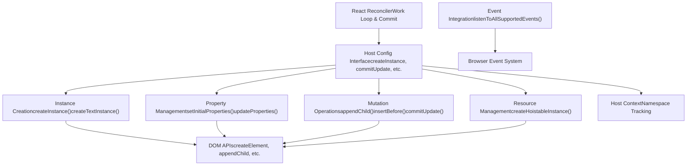
**Sources:** [packages/react-dom-bindings/src/client/ReactFiberConfigDOM.js1-292](https://github.com/facebook/react/blob/65eec428/packages/react-dom-bindings/src/client/ReactFiberConfigDOM.js#L1-L292)

## Type System

ReactFiberConfigDOM defines the core types that represent DOM constructs within the reconciler.

### Core Types

| Type | Definition | Description |
| --- | --- | --- |
| `Type` | `string` | Element type (e.g., 'div', 'span') |
| `Props` | `object` | React props object with DOM-specific properties |
| `Container` | `Element | Document | DocumentFragment` | Root container element with `_reactRootContainer` field |
| `Instance` | `Element` | A DOM element instance |
| `TextInstance` | `Text` | A DOM text node |
| `HostContext` | `HostContextDev | HostContextProd` | Namespace context (SVG, MathML, or HTML) |
| `UpdatePayload` | `Array<mixed>` | Array of alternating property keys and values |

**Sources:** [packages/react-dom-bindings/src/client/ReactFiberConfigDOM.js153-248](https://github.com/facebook/react/blob/65eec428/packages/react-dom-bindings/src/client/ReactFiberConfigDOM.js#L153-L248)

### Instance Types Diagram

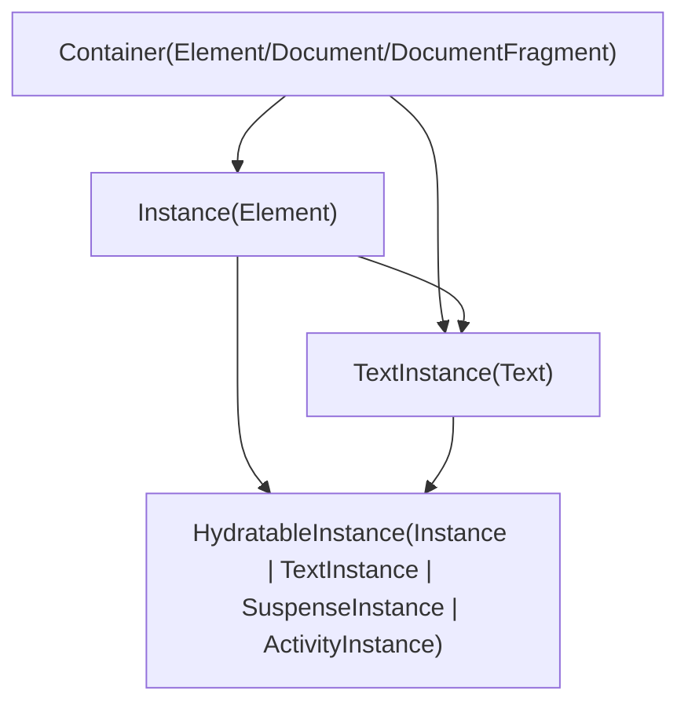
**Sources:** [packages/react-dom-bindings/src/client/ReactFiberConfigDOM.js211-237](https://github.com/facebook/react/blob/65eec428/packages/react-dom-bindings/src/client/ReactFiberConfigDOM.js#L211-L237)

## Host Context Management

The host context tracks the current namespace (HTML, SVG, MathML) to ensure elements are created with the correct namespace URI. This is critical for proper rendering of SVG and MathML elements within HTML documents.

### Namespace Constants

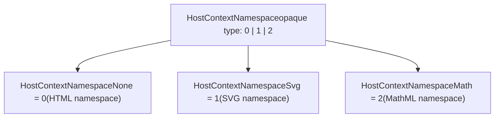
### Context Flow

The reconciler calls `getRootHostContext` when entering a root container, then `getChildHostContext` for each child element to determine the appropriate namespace.

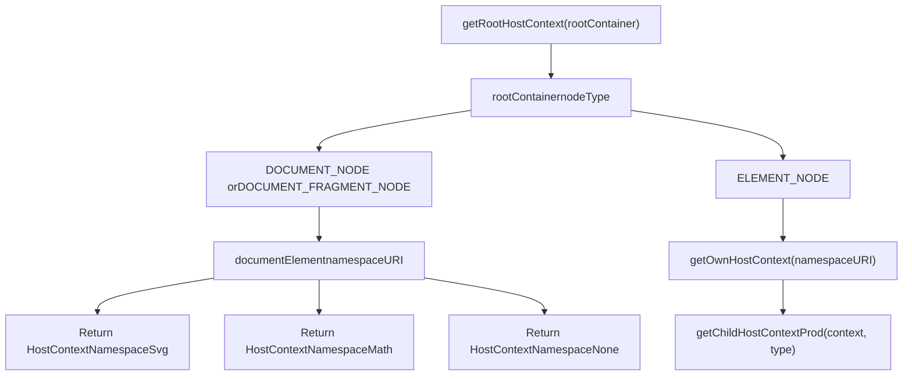
Key functions:

-   `getRootHostContext(rootContainerInstance)` [packages/react-dom-bindings/src/client/ReactFiberConfigDOM.js302-355](https://github.com/facebook/react/blob/65eec428/packages/react-dom-bindings/src/client/ReactFiberConfigDOM.js#L302-L355)
-   `getChildHostContext(parentHostContext, type)` [packages/react-dom-bindings/src/client/ReactFiberConfigDOM.js391-406](https://github.com/facebook/react/blob/65eec428/packages/react-dom-bindings/src/client/ReactFiberConfigDOM.js#L391-L406)
-   `getChildHostContextProd(parentNamespace, type)` [packages/react-dom-bindings/src/client/ReactFiberConfigDOM.js368-389](https://github.com/facebook/react/blob/65eec428/packages/react-dom-bindings/src/client/ReactFiberConfigDOM.js#L368-L389)

### Namespace Transitions

Special handling exists for namespace transitions:

-   Entering `<svg>` from HTML switches to SVG namespace
-   Entering `<math>` from HTML switches to MathML namespace
-   `<foreignObject>` within SVG returns to HTML namespace

**Sources:** [packages/react-dom-bindings/src/client/ReactFiberConfigDOM.js284-406](https://github.com/facebook/react/blob/65eec428/packages/react-dom-bindings/src/client/ReactFiberConfigDOM.js#L284-L406)

## Instance Creation

DOM instances are created during the reconciler's render phase and finalized during the commit phase.

### Regular Instance Creation

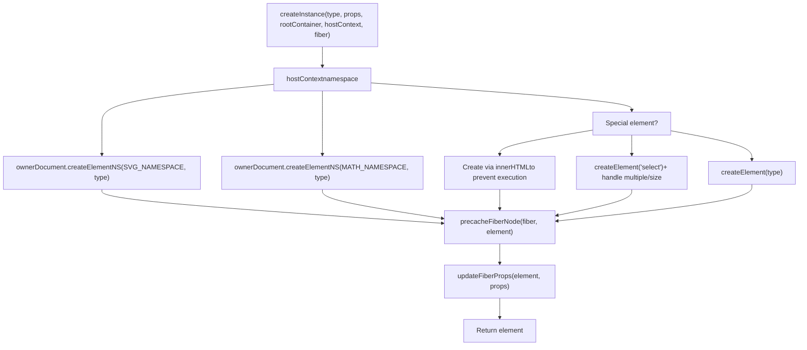
The `createInstance` function:

1.  Determines the owner document from the root container
2.  Creates the element with the appropriate namespace
3.  Caches the fiber-to-DOM mapping via `precacheFiberNode`
4.  Stores props on the DOM node via `updateFiberProps`
5.  Does NOT call `setInitialProperties` (that happens in `finalizeInitialChildren`)

**Sources:** [packages/react-dom-bindings/src/client/ReactFiberConfigDOM.js484-608](https://github.com/facebook/react/blob/65eec428/packages/react-dom-bindings/src/client/ReactFiberConfigDOM.js#L484-L608)

### Hoistable Instance Creation

Hoistable instances are special DOM elements (like `<link>`, `<style>`, `<script>`) that can be "hoisted" to the document head for resource management.

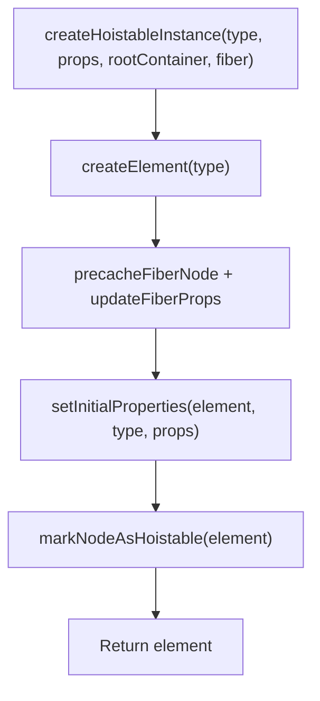
**Sources:** [packages/react-dom-bindings/src/client/ReactFiberConfigDOM.js452-468](https://github.com/facebook/react/blob/65eec428/packages/react-dom-bindings/src/client/ReactFiberConfigDOM.js#L452-L468)

### Text Instance Creation

Text nodes are simpler:

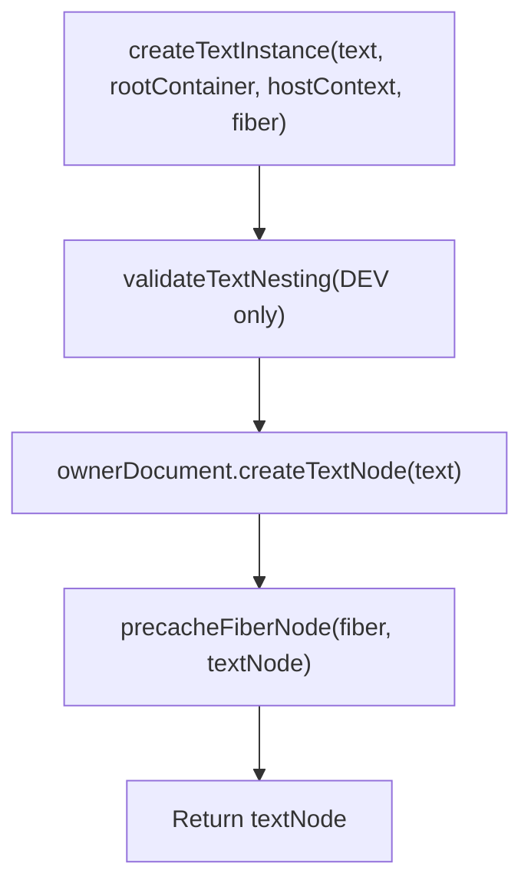
**Sources:** [packages/react-dom-bindings/src/client/ReactFiberConfigDOM.js679-701](https://github.com/facebook/react/blob/65eec428/packages/react-dom-bindings/src/client/ReactFiberConfigDOM.js#L679-L701)

## Property Management

Properties (React props) are translated into DOM attributes and properties through dedicated helper modules.

### Property Application Flow

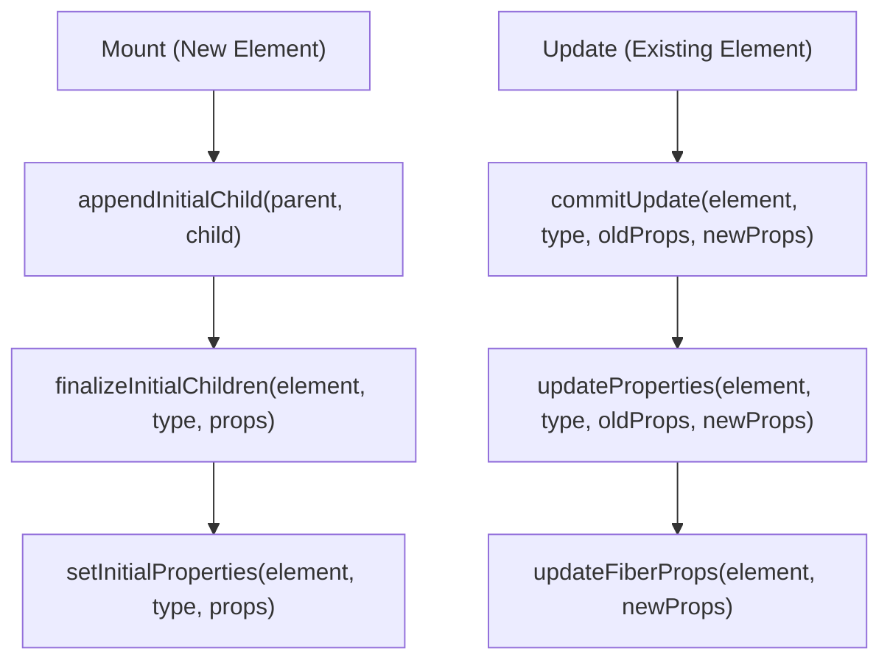
Key functions from `ReactDOMComponent`:

-   `setInitialProperties(domElement, tag, props)` - Applied during finalization [packages/react-dom-bindings/src/client/ReactDOMComponent.js](https://github.com/facebook/react/blob/65eec428/packages/react-dom-bindings/src/client/ReactDOMComponent.js)
-   `updateProperties(domElement, tag, lastProps, nextProps)` - Applied during commit update [packages/react-dom-bindings/src/client/ReactDOMComponent.js](https://github.com/facebook/react/blob/65eec428/packages/react-dom-bindings/src/client/ReactDOMComponent.js)

Special property handling includes:

-   `dangerouslySetInnerHTML` - Sets innerHTML
-   `children` (when string/number) - Sets textContent
-   `style` - Object converted to CSS string
-   `autoFocus` - Handled in `commitMount`
-   Event handlers - Registered with event system
-   `value`, `checked`, `selected` - Special form control properties

**Sources:** [packages/react-dom-bindings/src/client/ReactFiberConfigDOM.js78-86](https://github.com/facebook/react/blob/65eec428/packages/react-dom-bindings/src/client/ReactFiberConfigDOM.js#L78-L86) [packages/react-dom-bindings/src/client/ReactFiberConfigDOM.js917-930](https://github.com/facebook/react/blob/65eec428/packages/react-dom-bindings/src/client/ReactFiberConfigDOM.js#L917-L930)

## Mutation Operations

ReactFiberConfigDOM operates in mutation mode (`supportsMutation = true`), directly modifying the DOM tree. All mutation operations support the `moveBefore` API when available.

### Core Mutation Methods

| Method | Purpose | When Called |
| --- | --- | --- |
| `appendChild(parent, child)` | Append child to end | Repositioning during updates |
| `appendChildToContainer(container, child)` | Append to root container | Mounting root content |
| `insertBefore(parent, child, before)` | Insert child before sibling | Reordering, insertion |
| `insertInContainerBefore(container, child, before)` | Insert into root before sibling | Root-level insertions |
| `removeChild(parent, child)` | Remove child from parent | Deletions |
| `removeChildFromContainer(container, child)` | Remove from root | Root-level deletions |

### moveBefore Feature Detection

React detects and uses the `moveBefore` DOM API when available for more efficient repositioning:

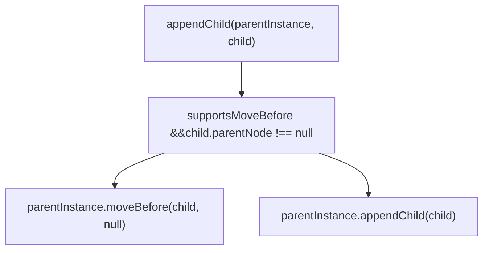
**Sources:** [packages/react-dom-bindings/src/client/ReactFiberConfigDOM.js944-960](https://github.com/facebook/react/blob/65eec428/packages/react-dom-bindings/src/client/ReactFiberConfigDOM.js#L944-L960)

### Commit Operations

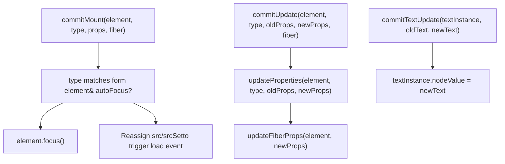
**Sources:** [packages/react-dom-bindings/src/client/ReactFiberConfigDOM.js813-872](https://github.com/facebook/react/blob/65eec428/packages/react-dom-bindings/src/client/ReactFiberConfigDOM.js#L813-L872) [packages/react-dom-bindings/src/client/ReactFiberConfigDOM.js917-942](https://github.com/facebook/react/blob/65eec428/packages/react-dom-bindings/src/client/ReactFiberConfigDOM.js#L917-L942)

## Event System Integration

ReactFiberConfigDOM integrates with React's synthetic event system through several key functions.

### Event Setup

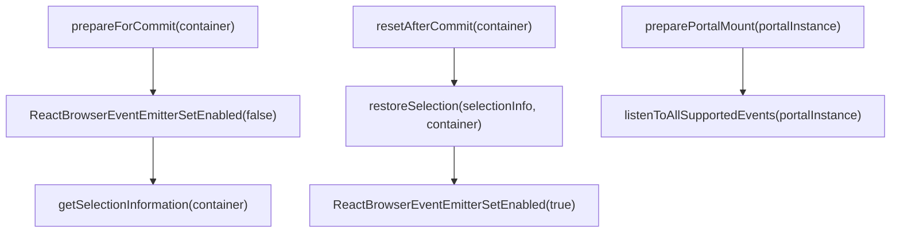
The event system is temporarily disabled during commits to prevent unwanted event dispatching while the DOM is being mutated.

**Sources:** [packages/react-dom-bindings/src/client/ReactFiberConfigDOM.js412-450](https://github.com/facebook/react/blob/65eec428/packages/react-dom-bindings/src/client/ReactFiberConfigDOM.js#L412-L450) [packages/react-dom-bindings/src/client/ReactFiberConfigDOM.js767-769](https://github.com/facebook/react/blob/65eec428/packages/react-dom-bindings/src/client/ReactFiberConfigDOM.js#L767-L769)

### Priority and Event Tracking

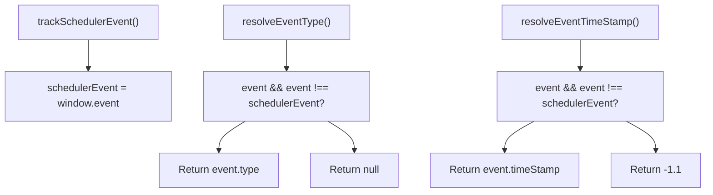
These functions help the reconciler determine the priority and nature of the current event for scheduling purposes.

**Sources:** [packages/react-dom-bindings/src/client/ReactFiberConfigDOM.js734-747](https://github.com/facebook/react/blob/65eec428/packages/react-dom-bindings/src/client/ReactFiberConfigDOM.js#L734-L747)

### Eager Transitions

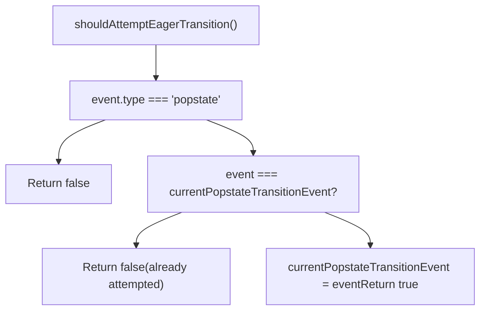
This optimization attempts to render popstate transitions synchronously to avoid flicker during browser history navigation.

**Sources:** [packages/react-dom-bindings/src/client/ReactFiberConfigDOM.js709-732](https://github.com/facebook/react/blob/65eec428/packages/react-dom-bindings/src/client/ReactFiberConfigDOM.js#L709-L732)

## Resource Management

ReactFiberConfigDOM implements special handling for "hoistable" resources - elements like stylesheets and scripts that should be singleton instances in the document head.

### Hoistable Elements

Resources are marked as hoistable through the `markNodeAsHoistable` function, which sets an internal flag on the DOM node:

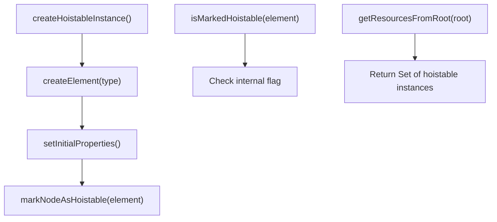
The hoisting mechanism ensures that:

-   Multiple identical `<link>` or `<script>` elements are deduplicated
-   Resources are moved to the document `<head>`
-   Resources persist across re-renders if they remain in the tree

**Sources:** [packages/react-dom-bindings/src/client/ReactDOMComponentTree.js56-59](https://github.com/facebook/react/blob/65eec428/packages/react-dom-bindings/src/client/ReactDOMComponentTree.js#L56-L59) [packages/react-dom-bindings/src/client/ReactFiberConfigDOM.js452-468](https://github.com/facebook/react/blob/65eec428/packages/react-dom-bindings/src/client/ReactFiberConfigDOM.js#L452-L468)

### Resource Validation

For stylesheet links, React validates props to ensure correct resource semantics:

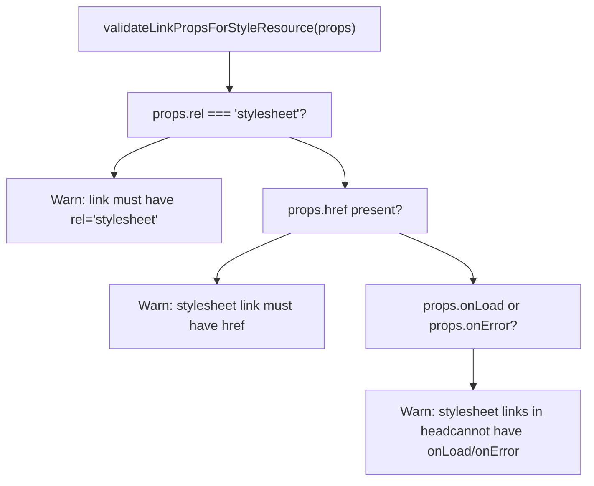
**Sources:** [packages/react-dom-bindings/src/shared/ReactDOMResourceValidation.js138](https://github.com/facebook/react/blob/65eec428/packages/react-dom-bindings/src/shared/ReactDOMResourceValidation.js#L138-L138)

## Special Element Handling

Several element types require special treatment beyond standard property application.

### Script Elements

Script tags must be created in a way that prevents execution:

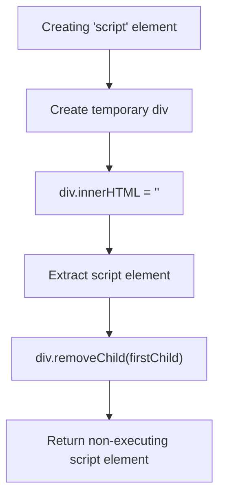
This ensures scripts don't execute during render, only during commit if explicitly mounted.

**Sources:** [packages/react-dom-bindings/src/client/ReactFiberConfigDOM.js523-542](https://github.com/facebook/react/blob/65eec428/packages/react-dom-bindings/src/client/ReactFiberConfigDOM.js#L523-L542)

### Select Elements

Select elements handle `multiple` and `size` props specially:

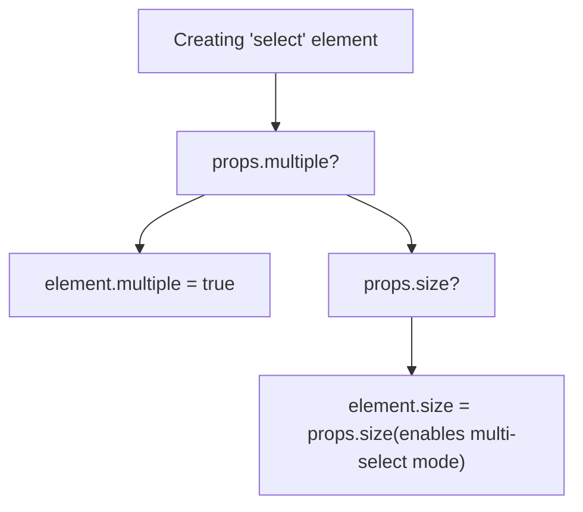
**Sources:** [packages/react-dom-bindings/src/client/ReactFiberConfigDOM.js544-562](https://github.com/facebook/react/blob/65eec428/packages/react-dom-bindings/src/client/ReactFiberConfigDOM.js#L544-L562)

### Form Controls (Input, Textarea, Select)

Form controls have specialized prop handling:

-   `finalizeInitialChildren` returns `true` for inputs, selects, textareas to schedule `commitMount`
-   `commitMount` handles `autoFocus` by calling `element.focus()`
-   Dedicated modules handle controlled vs uncontrolled state: `ReactDOMInput`, `ReactDOMTextarea`, `ReactDOMSelect`

**Sources:** [packages/react-dom-bindings/src/client/ReactFiberConfigDOM.js625-643](https://github.com/facebook/react/blob/65eec428/packages/react-dom-bindings/src/client/ReactFiberConfigDOM.js#L625-L643) [packages/react-dom-bindings/src/client/ReactFiberConfigDOM.js813-872](https://github.com/facebook/react/blob/65eec428/packages/react-dom-bindings/src/client/ReactFiberConfigDOM.js#L813-L872)

### Image Elements

Images receive special handling in `commitMount` to ensure `onLoad` events fire correctly:

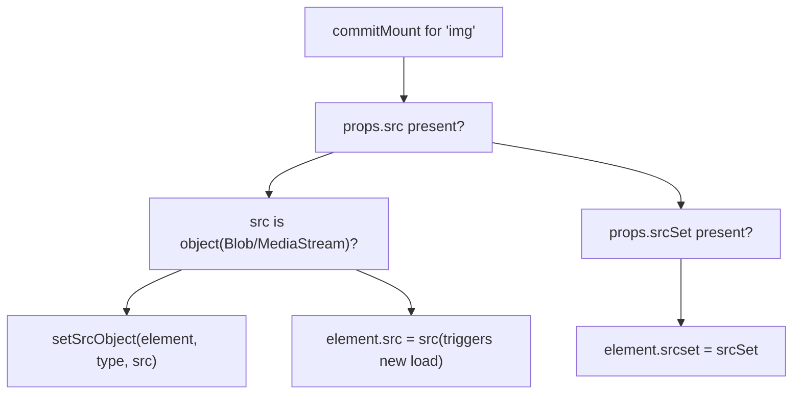
The reassignment ensures that even if the image has already loaded, the `onLoad` handler will be called again.

**Sources:** [packages/react-dom-bindings/src/client/ReactFiberConfigDOM.js838-869](https://github.com/facebook/react/blob/65eec428/packages/react-dom-bindings/src/client/ReactFiberConfigDOM.js#L838-L869)

## Hydration Support

ReactFiberConfigDOM provides hydration functions to match server-rendered HTML with React's virtual DOM during client-side hydration. This is a large topic covered in detail in [Hydration System](/facebook/react/6.3-hydration-system).

Key hydration functions exported:

-   `hydrateProperties(domElement, tag, props)` - Matches and validates props
-   `hydrateText(textInstance, text)` - Validates text content
-   `diffHydratedProperties(domElement, tag, props)` - Produces update payload for mismatches
-   `diffHydratedText(textInstance, text)` - Checks for text mismatches

Hydration also handles special cases:

-   Dehydrated Suspense boundaries (marked with comment nodes)
-   Form state markers for preserving form data across SSR
-   Input/textarea/select state synchronization via `hydrateInput`, `hydrateTextarea`, `hydrateSelect`

**Sources:** [packages/react-dom-bindings/src/client/ReactFiberConfigDOM.js81-89](https://github.com/facebook/react/blob/65eec428/packages/react-dom-bindings/src/client/ReactFiberConfigDOM.js#L81-L89) [packages/react-dom-bindings/src/client/ReactFiberConfigDOM.js874-915](https://github.com/facebook/react/blob/65eec428/packages/react-dom-bindings/src/client/ReactFiberConfigDOM.js#L874-L915)

## View Transitions and Scheduling

ReactFiberConfigDOM includes stubs and partial implementations for view transitions, which enable animated transitions between states. Full details are in [View Transitions and Gesture Scheduling](/facebook/react/6.4-view-transitions-and-gesture-scheduling).

### View Transition Lifecycle

The host config provides functions called by the reconciler during view transitions:

| Function | Purpose |
| --- | --- |
| `measureInstance(instance)` | Capture instance measurements before transition |
| `cloneRootViewTransitionContainer(root)` | Clone the root for "old" state capture |
| `startViewTransition(...)` | Begin coordinating the transition animation |
| `applyViewTransitionName(instance, name, className)` | Apply CSS view-transition-name |
| `stopViewTransition(transition)` | End the transition |

### Gesture Scheduling

Gesture timeline integration (for scrubbing through transitions) is also stubbed:

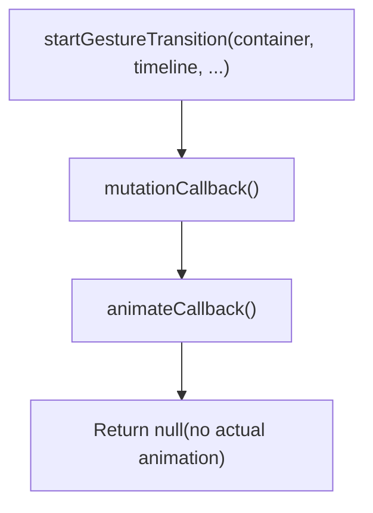
**Sources:** [packages/react-dom-bindings/src/client/ReactFiberConfigDOM.js1094-1358](https://github.com/facebook/react/blob/65eec428/packages/react-dom-bindings/src/client/ReactFiberConfigDOM.js#L1094-L1358)

## Component Tree Mapping

ReactFiberConfigDOM maintains a mapping between DOM nodes and React fibers to support:

-   Event dispatching (finding the React instance for a DOM node)
-   React DevTools (inspecting the component tree)
-   Public instance access (refs)

### Mapping Functions

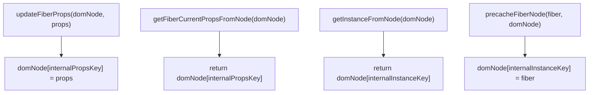
These mappings are established during instance creation and used throughout the lifecycle for event handling and introspection.

**Sources:** [packages/react-dom-bindings/src/client/ReactDOMComponentTree.js47-60](https://github.com/facebook/react/blob/65eec428/packages/react-dom-bindings/src/client/ReactDOMComponentTree.js#L47-L60)

## Summary

ReactFiberConfigDOM serves as the critical bridge between React's platform-agnostic reconciler and the browser DOM. It:

-   **Creates DOM instances** with proper namespacing (HTML, SVG, MathML)
-   **Manages properties** by translating React props to DOM attributes/properties
-   **Performs mutations** efficiently using native DOM APIs (with `moveBefore` optimization)
-   **Integrates events** by coordinating with React's synthetic event system
-   **Handles resources** through hoisting mechanisms for stylesheets and scripts
-   **Supports hydration** by matching server-rendered HTML with the React tree
-   **Enables view transitions** for animated state changes (experimental)

The implementation is mutation-based (unlike React Native's persistence mode) and optimized for the browser environment, with special handling for form controls, scripts, images, and other HTML-specific elements.

**Sources:** [packages/react-dom-bindings/src/client/ReactFiberConfigDOM.js1-1500](https://github.com/facebook/react/blob/65eec428/packages/react-dom-bindings/src/client/ReactFiberConfigDOM.js#L1-L1500)
