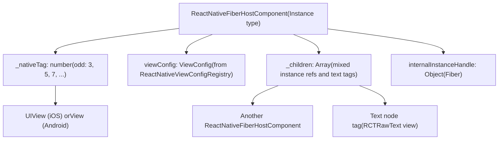
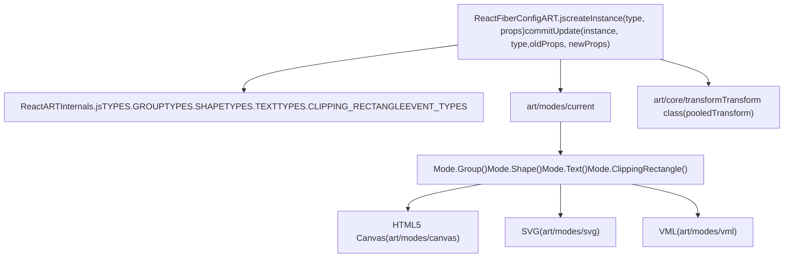

# React Native and Other Renderers

Relevant source files

-   [packages/react-art/src/ReactFiberConfigART.js](https://github.com/facebook/react/blob/65eec428/packages/react-art/src/ReactFiberConfigART.js)
-   [packages/react-dom-bindings/src/client/ReactFiberConfigDOM.js](https://github.com/facebook/react/blob/65eec428/packages/react-dom-bindings/src/client/ReactFiberConfigDOM.js)
-   [packages/react-native-renderer/src/ReactFiberConfigFabric.js](https://github.com/facebook/react/blob/65eec428/packages/react-native-renderer/src/ReactFiberConfigFabric.js)
-   [packages/react-native-renderer/src/ReactFiberConfigNative.js](https://github.com/facebook/react/blob/65eec428/packages/react-native-renderer/src/ReactFiberConfigNative.js)
-   [packages/react-noop-renderer/src/createReactNoop.js](https://github.com/facebook/react/blob/65eec428/packages/react-noop-renderer/src/createReactNoop.js)
-   [packages/react-reconciler/src/ReactFiberConfigWithNoMutation.js](https://github.com/facebook/react/blob/65eec428/packages/react-reconciler/src/ReactFiberConfigWithNoMutation.js)
-   [packages/react-reconciler/src/ReactFiberGestureScheduler.js](https://github.com/facebook/react/blob/65eec428/packages/react-reconciler/src/ReactFiberGestureScheduler.js)
-   [packages/react-reconciler/src/\_\_tests\_\_/ReactFiberHostContext-test.internal.js](https://github.com/facebook/react/blob/65eec428/packages/react-reconciler/src/__tests__/ReactFiberHostContext-test.internal.js)
-   [packages/react-reconciler/src/forks/ReactFiberConfig.custom.js](https://github.com/facebook/react/blob/65eec428/packages/react-reconciler/src/forks/ReactFiberConfig.custom.js)
-   [packages/react-test-renderer/src/ReactFiberConfigTestHost.js](https://github.com/facebook/react/blob/65eec428/packages/react-test-renderer/src/ReactFiberConfigTestHost.js)

## Purpose and Scope

This document explains how React targets non-DOM platforms through host configuration implementations. It covers React Native's two rendering architectures (Fabric using persistence mode and Legacy using mutation mode), the React ART canvas renderer, the test renderer, and patterns for building custom renderers. For the abstract host configuration interface, see page 3.3. For DOM-specific rendering, see page 4.1.

---

## Mutation vs Persistence Rendering Strategies

The reconciler supports two fundamentally different strategies for applying updates to host instances. Each renderer declares its strategy through the `supportsMutation` and `supportsPersistence` exports in its host configuration.

### Strategy Overview

```mermaid
flowchart TD
    PersConfig["Host Config Exports"]
    cloneInstance["cloneInstance(instance, type,oldProps, newProps,keepChildren, children)"]
    createContainerChildSet["createContainerChildSet()"]
    appendChildToContainerChildSet["appendChildToContainerChildSet(childSet, child)"]
    replaceContainerChildren["replaceContainerChildren(container, childSet)"]
    MutConfig["Host Config Exports"]
    appendChild["appendChild(parent, child)"]
    commitUpdate["commitUpdate(instance, type,oldProps, newProps)"]
    removeChild["removeChild(parent, child)"]
    insertBefore["insertBefore(parent, child,beforeChild)"]
    commitTextUpdate["commitTextUpdate(textInstance,oldText, newText)"]
    ReactFiberWorkLoop["ReactFiberWorkLoop.jscommitMutationEffects() orcommitMutationEffectsOnFiber()"]

    ReactFiberWorkLoop --> MutationStrategy
    ReactFiberWorkLoop --> PersistenceStrategy
    PersConfig --> cloneInstance
    PersConfig --> createContainerChildSet
    PersConfig --> appendChildToContainerChildSet
    PersConfig --> replaceContainerChildren
    MutConfig --> appendChild
    MutConfig --> commitUpdate
    MutConfig --> removeChild
    MutConfig --> insertBefore
    MutConfig --> commitTextUpdate
```


**Sources:** [packages/react-reconciler/src/ReactFiberConfigWithNoMutation.js22-60](https://github.com/facebook/react/blob/65eec428/packages/react-reconciler/src/ReactFiberConfigWithNoMutation.js#L22-L60) [packages/react-dom-bindings/src/client/ReactFiberConfigDOM.js806](https://github.com/facebook/react/blob/65eec428/packages/react-dom-bindings/src/client/ReactFiberConfigDOM.js#L806-L806) [packages/react-native-renderer/src/ReactFiberConfigFabric.js445](https://github.com/facebook/react/blob/65eec428/packages/react-native-renderer/src/ReactFiberConfigFabric.js#L445-L445)

### Mutation Strategy

Mutation renderers modify host instances in-place during the commit phase. The reconciler calls methods like `appendChild`, `commitUpdate`, and `removeChild` to directly mutate the instance tree. This is simpler but couples rendering more tightly to the host environment.

| Operation | Purpose | Example Renderers |
| --- | --- | --- |
| `appendChild(parent, child)` | Add child to parent's children | DOM, React Native Legacy, React ART |
| `insertBefore(parent, child, before)` | Insert child before sibling | DOM, React Native Legacy |
| `removeChild(parent, child)` | Remove child from parent | DOM, React Native Legacy, React ART |
| `commitUpdate(instance, type, oldProps, newProps)` | Update instance properties | DOM, React Native Legacy, React ART |
| `commitTextUpdate(textInstance, oldText, newText)` | Update text content | DOM, React Native Legacy |

**Sources:** [packages/react-dom-bindings/src/client/ReactFiberConfigDOM.js945-1127](https://github.com/facebook/react/blob/65eec428/packages/react-dom-bindings/src/client/ReactFiberConfigDOM.js#L945-L1127) [packages/react-native-renderer/src/ReactFiberConfigNative.js379-467](https://github.com/facebook/react/blob/65eec428/packages/react-native-renderer/src/ReactFiberConfigNative.js#L379-L467) [packages/react-art/src/ReactFiberConfigART.js417-467](https://github.com/facebook/react/blob/65eec428/packages/react-art/src/ReactFiberConfigART.js#L417-L467)

### Persistence Strategy

Persistence renderers treat instances as immutable. During updates, the reconciler clones instances with new props, builds a complete child set in memory, and replaces the entire tree atomically. This enables structural sharing and can improve performance in environments where creating new instances is cheap.

| Operation | Purpose | Example Renderers |
| --- | --- | --- |
| `cloneInstance(instance, type, oldProps, newProps, keepChildren, children)` | Clone instance with new props | React Native Fabric, React Noop |
| `createContainerChildSet()` | Create empty child set for building new tree | React Native Fabric, React Noop |
| `appendChildToContainerChildSet(childSet, child)` | Add child to child set | React Native Fabric, React Noop |
| `finalizeContainerChildren(container, childSet)` | Prepare child set for commit | React Native Fabric, React Noop |
| `replaceContainerChildren(container, childSet)` | Atomically swap children | React Native Fabric, React Noop |

**Sources:** [packages/react-native-renderer/src/ReactFiberConfigFabric.js447-557](https://github.com/facebook/react/blob/65eec428/packages/react-native-renderer/src/ReactFiberConfigFabric.js#L447-L557) [packages/react-noop-renderer/src/createReactNoop.js903-941](https://github.com/facebook/react/blob/65eec428/packages/react-noop-renderer/src/createReactNoop.js#L903-L941)

---

## React Native Fabric (Persistence Mode)

React Native's Fabric architecture is the modern rendering system that uses the persistence strategy. It integrates with the C++ Fabric UI Manager through the `nativeFabricUIManager` global.

### Architecture Overview


```mermaid
flowchart TD
    ReactFiberConfigFabric["ReactFiberConfigFabric.jscreateInstance()cloneInstance()replaceContainerChildren()"]
    ReactFabricEventEmitter["ReactFabricEventEmitter.jsdispatchEvent()"]
    ReactFabricComponentTree["ReactFabricComponentTree.jsgetClosestInstanceFromNode()"]
    ReactNativeViewConfigRegistry["ReactNativeViewConfigRegistryget(type) → ViewConfig"]
    nativeFabricUIManager["nativeFabricUIManager"]
    createNode["createNode(tag, viewName,rootTag, props, handle)"]
    cloneNodeWithNewProps["cloneNodeWithNewProps(node, updatePayload)"]
    cloneNodeWithNewChildren["cloneNodeWithNewChildren(node, childSet?)"]
    cloneNodeWithNewChildrenAndProps["cloneNodeWithNewChildrenAndProps(node, childSet?, updatePayload)"]
    completeRoot["completeRoot(containerTag,childSet)"]
    registerEventHandler["registerEventHandler(dispatchEvent)"]
    ShadowNodeTree["Shadow Node Tree(Yoga Layout)"]
    UIThread["Main UI ThreadPlatform Views"]

    ReactFiberConfigFabric --> ReactNativeViewConfigRegistry
    ReactFiberConfigFabric --> createNode
    ReactFiberConfigFabric --> cloneNodeWithNewProps
    ReactFiberConfigFabric --> cloneNodeWithNewChildren
    ReactFiberConfigFabric --> cloneNodeWithNewChildrenAndProps
    ReactFiberConfigFabric --> completeRoot
    ReactFabricEventEmitter --> registerEventHandler
    createNode --> ShadowNodeTree
    cloneNodeWithNewProps --> ShadowNodeTree
    cloneNodeWithNewChildren --> ShadowNodeTree
    cloneNodeWithNewChildrenAndProps --> ShadowNodeTree
    completeRoot --> UIThread
```

**Sources:** [packages/react-native-renderer/src/ReactFiberConfigFabric.js44-59](https://github.com/facebook/react/blob/65eec428/packages/react-native-renderer/src/ReactFiberConfigFabric.js#L44-L59) [packages/react-native-renderer/src/ReactFiberConfigFabric.js15](https://github.com/facebook/react/blob/65eec428/packages/react-native-renderer/src/ReactFiberConfigFabric.js#L15-L15) [packages/react-native-renderer/src/ReactFabricEventEmitter.js](https://github.com/facebook/react/blob/65eec428/packages/react-native-renderer/src/ReactFabricEventEmitter.js) [packages/react-native-renderer/src/ReactFabricComponentTree.js61](https://github.com/facebook/react/blob/65eec428/packages/react-native-renderer/src/ReactFabricComponentTree.js#L61-L61)

### Instance Structure

Fabric instances (`Instance` type in ReactFiberConfigFabric.js) maintain a `canonical` reference shared across all clones, enabling efficient structural sharing:

**Sources:** [packages/react-native-renderer/src/ReactFiberConfigFabric.js92-112](https://github.com/facebook/react/blob/65eec428/packages/react-native-renderer/src/ReactFiberConfigFabric.js#L92-L112) [packages/react-native-renderer/src/ReactFiberConfigFabric.js496-499](https://github.com/facebook/react/blob/65eec428/packages/react-native-renderer/src/ReactFiberConfigFabric.js#L496-L499)

Each `Instance` contains:

-   `node`: Reference to the native shadow node created by `createNode()`
-   `canonical`: Shared state object containing:
    -   `nativeTag`: Unique identifier for the view (even numbers only)
    -   `viewConfig`: View type metadata from `ReactNativeViewConfigRegistry`
    -   `currentProps`: Current props (updated in render phase for event handlers)
    -   `internalInstanceHandle`: Fiber reference for DevTools and event handling
    -   `publicInstance`: Lazily-created public instance exposed through refs

**Sources:** [packages/react-native-renderer/src/ReactFiberConfigFabric.js205-215](https://github.com/facebook/react/blob/65eec428/packages/react-native-renderer/src/ReactFiberConfigFabric.js#L205-L215) [packages/react-native-renderer/src/ReactFiberConfigFabric.js289-302](https://github.com/facebook/react/blob/65eec428/packages/react-native-renderer/src/ReactFiberConfigFabric.js#L289-L302)

### Key Operations

#### Instance Creation

[packages/react-native-renderer/src/ReactFiberConfigFabric.js172-216](https://github.com/facebook/react/blob/65eec428/packages/react-native-renderer/src/ReactFiberConfigFabric.js#L172-L216)

```
createInstance(type, props, rootContainer, hostContext, internalInstanceHandle)
  1. Allocate unique tag (nextReactTag += 2, ensuring even numbers)
  2. Get ViewConfig for type from ReactNativeViewConfigRegistry
  3. Create attribute payload from props using createAttributePayload()
  4. Call nativeFabricUIManager.createNode() to create shadow node
  5. Return Instance with node reference and canonical state
```
#### Cloning for Updates

[packages/react-native-renderer/src/ReactFiberConfigFabric.js447-500](https://github.com/facebook/react/blob/65eec428/packages/react-native-renderer/src/ReactFiberConfigFabric.js#L447-L500)

```
cloneInstance(instance, type, oldProps, newProps, keepChildren, newChildSet)
  1. Get viewConfig from instance.canonical.viewConfig
  2. Diff props: updatePayload = diffAttributePayloads(oldProps, newProps, validAttributes)
  3. Update canonical.currentProps = newProps (for event handlers)
  4. Choose clone strategy:
     - If keepChildren && updatePayload !== null: cloneNodeWithNewProps()
     - If keepChildren && updatePayload === null: return instance (no change)
     - If !keepChildren && newChildSet != null: cloneNodeWithNewChildrenAndProps()
     - If !keepChildren && newChildSet == null: cloneNodeWithNewChildren()
  5. Return new Instance with cloned node, sharing canonical reference
```
The `passChildrenWhenCloningPersistedNodes` feature flag controls whether children are passed as an array or through a separate child set structure.

**Sources:** [packages/react-native-renderer/src/ReactFiberConfigFabric.js70](https://github.com/facebook/react/blob/65eec428/packages/react-native-renderer/src/ReactFiberConfigFabric.js#L70-L70) [packages/react-native-renderer/src/ReactFiberConfigFabric.js476-493](https://github.com/facebook/react/blob/65eec428/packages/react-native-renderer/src/ReactFiberConfigFabric.js#L476-L493)

#### Commit Phase

[packages/react-native-renderer/src/ReactFiberConfigFabric.js526-557](https://github.com/facebook/react/blob/65eec428/packages/react-native-renderer/src/ReactFiberConfigFabric.js#L526-L557)

```
Persistence commit sequence:
  1. createContainerChildSet() → Create empty array or NodeSet
  2. appendChildToContainerChildSet(childSet, child) → Add child.node to set
  3. finalizeContainerChildren(container, childSet) → Noop (validation point)
  4. replaceContainerChildren(container, childSet) → completeRoot(containerTag, childSet)
```
The `completeRoot()` call synchronously flushes the shadow tree to the native UI thread, making all changes visible atomically.

**Sources:** [packages/react-native-renderer/src/ReactFiberConfigFabric.js552-557](https://github.com/facebook/react/blob/65eec428/packages/react-native-renderer/src/ReactFiberConfigFabric.js#L552-L557)

---

## React Native Legacy (Mutation Mode)

The legacy React Native renderer uses the mutation strategy with the older `UIManager` imperative API. This renderer is still used in older React Native versions and apps not yet migrated to Fabric.

### Architecture Overview


```mermaid
flowchart TD
    ReactFiberConfigNative["ReactFiberConfigNative.jscreateInstance()appendChild()commitUpdate()"]
    ReactNativeFiberHostComponent["ReactNativeFiberHostComponent.jsClass with _nativeTag,viewConfig, _children"]
    ReactNativeComponentTree["ReactNativeComponentTree.jsprecacheFiberNode()updateFiberProps()"]
    ReactNativeAttributePayload["ReactNativeAttributePayload.jscreate(props, validAttributes)diff(oldProps, newProps, validAttributes)"]
    ReactNativeViewConfigRegistry["ReactNativeViewConfigRegistryget(type) → ViewConfig"]
    UIManager["UIManager"]
    createView["createView(tag, viewName,rootTag, props)"]
    updateView["updateView(tag, viewName,props)"]
    manageChildren["manageChildren(containerTag,moveFromIndices, moveToIndices,addChildReactTags, addAtIndices,removeAtIndices)"]
    setChildren["setChildren(containerTag,childTags)"]
    NativeViews["UIView (iOS) /View (Android)"]
    MainThread["Main UI Thread(Synchronous Updates)"]

    ReactFiberConfigNative --> ReactNativeViewConfigRegistry
    ReactFiberConfigNative --> ReactNativeFiberHostComponent
    ReactFiberConfigNative --> ReactNativeComponentTree
    ReactFiberConfigNative --> ReactNativeAttributePayload
    ReactFiberConfigNative --> createView
    ReactFiberConfigNative --> updateView
    ReactFiberConfigNative --> manageChildren
    ReactFiberConfigNative --> setChildren
    createView --> NativeViews
    updateView --> NativeViews
    manageChildren --> MainThread
    setChildren --> MainThread
```

**Sources:** [packages/react-native-renderer/src/ReactFiberConfigNative.js14-20](https://github.com/facebook/react/blob/65eec428/packages/react-native-renderer/src/ReactFiberConfigNative.js#L14-L20) [packages/react-native-renderer/src/ReactFiberConfigNative.js29](https://github.com/facebook/react/blob/65eec428/packages/react-native-renderer/src/ReactFiberConfigNative.js#L29-L29) [packages/react-native-renderer/src/ReactNativeComponentTree.js24-27](https://github.com/facebook/react/blob/65eec428/packages/react-native-renderer/src/ReactNativeComponentTree.js#L24-L27) [packages/react-native-renderer/src/ReactNativeAttributePayload.js22](https://github.com/facebook/react/blob/65eec428/packages/react-native-renderer/src/ReactNativeAttributePayload.js#L22-L22)

### Instance Structure

Legacy instances are instances of the `ReactNativeFiberHostComponent` class, which maintains child references and communicates with native views via numeric tags:


**Sources:** [packages/react-native-renderer/src/ReactFiberConfigNative.js65-66](https://github.com/facebook/react/blob/65eec428/packages/react-native-renderer/src/ReactFiberConfigNative.js#L65-L66) [packages/react-native-renderer/src/ReactNativeFiberHostComponent.js](https://github.com/facebook/react/blob/65eec428/packages/react-native-renderer/src/ReactNativeFiberHostComponent.js) [packages/react-native-renderer/src/ReactFiberConfigNative.js157-161](https://github.com/facebook/react/blob/65eec428/packages/react-native-renderer/src/ReactFiberConfigNative.js#L157-L161)

Tag allocation ensures legacy tags never overlap with Fabric tags:

-   Legacy tags start at 3 and increment by 2 (all odd: 3, 5, 7, ...)
-   Root tags end in 1 (11, 21, 31, ...)
-   Fabric tags are even (2, 4, 6, ...)

**Sources:** [packages/react-native-renderer/src/ReactFiberConfigNative.js91-102](https://github.com/facebook/react/blob/65eec428/packages/react-native-renderer/src/ReactFiberConfigNative.js#L91-L102)

### Key Operations

#### Instance Creation

[packages/react-native-renderer/src/ReactFiberConfigNative.js130-169](https://github.com/facebook/react/blob/65eec428/packages/react-native-renderer/src/ReactFiberConfigNative.js#L130-L169)

```
createInstance(type, props, rootContainer, hostContext, internalInstanceHandle)
  1. Allocate tag (nextReactTag, skip if % 10 === 1, increment by 2)
  2. Get ViewConfig from ReactNativeViewConfigRegistry
  3. Create update payload: updatePayload = create(props, validAttributes)
  4. Call UIManager.createView(tag, uiViewClassName, rootTag, updatePayload)
  5. Create new ReactNativeFiberHostComponent(tag, viewConfig, handle)
  6. Cache mapping: precacheFiberNode(handle, tag) and updateFiberProps(tag, props)
  7. Return instance
```
The `create()` function from `ReactNativeAttributePayload` converts React props to native attribute format, applying platform-specific transformations.

**Sources:** [packages/react-native-renderer/src/ReactNativeAttributePayload.js](https://github.com/facebook/react/blob/65eec428/packages/react-native-renderer/src/ReactNativeAttributePayload.js)

#### Mutation Operations

[packages/react-native-renderer/src/ReactFiberConfigNative.js379-410](https://github.com/facebook/react/blob/65eec428/packages/react-native-renderer/src/ReactFiberConfigNative.js#L379-L410)

```
appendChild(parentInstance, child)
  1. Extract childTag (number or child._nativeTag)
  2. Check if child already in parent._children
  3. If yes: move to end using manageChildren(moveFromIndices, moveToIndices)
  4. If no: add to end using manageChildren(addChildReactTags, addAtIndices)
```
The `manageChildren()` API is complex but powerful, supporting simultaneous moves, adds, and removes in a single call:

**Sources:** [packages/react-native-renderer/src/ReactFiberConfigNative.js379-410](https://github.com/facebook/react/blob/65eec428/packages/react-native-renderer/src/ReactFiberConfigNative.js#L379-L410)

[packages/react-native-renderer/src/ReactFiberConfigNative.js470-507](https://github.com/facebook/react/blob/65eec428/packages/react-native-renderer/src/ReactFiberConfigNative.js#L470-L507)

```
insertBefore(parentInstance, child, beforeChild)
  1. Find child and beforeChild indices in parent._children
  2. If child exists: remove from old position, insert at new position
  3. Build manageChildren() call with moveFromIndices/moveToIndices or addChildReactTags/addAtIndices
```
[packages/react-native-renderer/src/ReactFiberConfigNative.js445-468](https://github.com/facebook/react/blob/65eec428/packages/react-native-renderer/src/ReactFiberConfigNative.js#L445-L468)

```
commitUpdate(instance, type, oldProps, newProps, internalInstanceHandle)
  1. Update cached props: updateFiberProps(instance._nativeTag, newProps)
  2. Diff props: updatePayload = diff(oldProps, newProps, validAttributes)
  3. If updatePayload != null: UIManager.updateView(tag, uiViewClassName, updatePayload)
```
The null check optimization avoids expensive bridge calls when props haven't changed.

**Sources:** [packages/react-native-renderer/src/ReactFiberConfigNative.js456-467](https://github.com/facebook/react/blob/65eec428/packages/react-native-renderer/src/ReactFiberConfigNative.js#L456-L467)

#### Child Management

[packages/react-native-renderer/src/ReactFiberConfigNative.js237-262](https://github.com/facebook/react/blob/65eec428/packages/react-native-renderer/src/ReactFiberConfigNative.js#L237-L262)

```
finalizeInitialChildren(parentInstance, type, props, hostContext)
  1. Map parent._children to native tags (numbers)
  2. Call UIManager.setChildren(parent._nativeTag, childTags)
  3. Return false (no commit-time work needed)
```
Unlike DOM's `appendChild`, React Native batches all child additions into a single `setChildren()` call after the entire subtree is constructed.

**Sources:** [packages/react-native-renderer/src/ReactFiberConfigNative.js237-262](https://github.com/facebook/react/blob/65eec428/packages/react-native-renderer/src/ReactFiberConfigNative.js#L237-L262)

---

## React ART Renderer

React ART renders to canvas-based vector graphics using the ART library. It supports mutation mode and provides a declarative API for drawing shapes, paths, and text.

### Architecture Overview


**Sources:** [packages/react-art/src/ReactFiberConfigART.js10-13](https://github.com/facebook/react/blob/65eec428/packages/react-art/src/ReactFiberConfigART.js#L10-L13) [packages/react-art/src/ReactARTInternals.js](https://github.com/facebook/react/blob/65eec428/packages/react-art/src/ReactARTInternals.js) [packages/react-art/src/ReactFiberConfigART.js26](https://github.com/facebook/react/blob/65eec428/packages/react-art/src/ReactFiberConfigART.js#L26-L26)

### Instance Types

React ART supports five element types, each mapping to an ART class:

| React Type | ART Class | Purpose | Props |
| --- | --- | --- | --- |
| `CLIPPING_RECTANGLE` | `Mode.ClippingRectangle()` | Define clip region | `width`, `height`, `x`, `y` |
| `GROUP` | `Mode.Group()` | Container with transform | `width`, `height`, transform props |
| `SHAPE` | `Mode.Shape()` | Vector path | `d` (path), `width`, `height`, fill, stroke |
| `TEXT` | `Mode.Text()` | Rendered text | `children` (string), `font`, `alignment`, `path` |
| `SURFACE` | Created externally | Root canvas | N/A (created by React ART entry point) |

**Sources:** [packages/react-art/src/ReactFiberConfigART.js13](https://github.com/facebook/react/blob/65eec428/packages/react-art/src/ReactFiberConfigART.js#L13-L13) [packages/react-art/src/ReactFiberConfigART.js269-303](https://github.com/facebook/react/blob/65eec428/packages/react-art/src/ReactFiberConfigART.js#L269-L303)

### Transform System

[packages/react-art/src/ReactFiberConfigART.js140-163](https://github.com/facebook/react/blob/65eec428/packages/react-art/src/ReactFiberConfigART.js#L140-L163)

All ART nodes support a rich transform system using a pooled `Transform` instance to minimize allocations:

```
applyNodeProps(instance, props)
  1. Calculate scaleX and scaleY (from scale or individual props)
  2. Reset pooledTransform to identity matrix
  3. Apply transforms in order:
     - move(x || 0, y || 0)
     - rotate(rotation || 0, originX, originY)
     - scale(scaleX, scaleY, originX, originY)
     - transform(props.transform) if present
  4. Check if transform changed (compare matrix values)
  5. If changed: instance.transformTo(pooledTransform)
```
This ensures transforms are applied consistently across all node types while avoiding unnecessary updates.

**Sources:** [packages/react-art/src/ReactFiberConfigART.js26](https://github.com/facebook/react/blob/65eec428/packages/react-art/src/ReactFiberConfigART.js#L26-L26) [packages/react-art/src/ReactFiberConfigART.js140-163](https://github.com/facebook/react/blob/65eec428/packages/react-art/src/ReactFiberConfigART.js#L140-L163)

### Event Handling

[packages/react-art/src/ReactFiberConfigART.js37-86](https://github.com/facebook/react/blob/65eec428/packages/react-art/src/ReactFiberConfigART.js#L37-L86)

ART implements its own event system through subscriptions:

```
Event handling lifecycle:
  1. addEventListeners(instance, type, listener)
     - Store listener in instance._listeners[type]
     - Subscribe: instance._subscriptions[type] = instance.subscribe(type, handler, instance)

  2. handleEvent(event) called by ART
     - Lookup listener = instance._listeners[event.type]
     - Call listener.call(instance, event) or listener.handleEvent(event)

  3. destroyEventListeners(instance)
     - Unsubscribe all: instance._subscriptions<FileRef file-url="https://github.com/facebook/react/blob/65eec428/type" undefined  file-path="type">Hii</FileRef>
     - Clear references
```
Supported events defined in `EVENT_TYPES`: `onClick`, `onMouseMove`, `onMouseOver`, `onMouseOut`, `onMouseUp`, `onMouseDown`.

**Sources:** [packages/react-art/src/ReactARTInternals.js](https://github.com/facebook/react/blob/65eec428/packages/react-art/src/ReactARTInternals.js) [packages/react-art/src/ReactFiberConfigART.js181-183](https://github.com/facebook/react/blob/65eec428/packages/react-art/src/ReactFiberConfigART.js#L181-L183)

### Instance Creation and Updates

[packages/react-art/src/ReactFiberConfigART.js269-303](https://github.com/facebook/react/blob/65eec428/packages/react-art/src/ReactFiberConfigART.js#L269-L303)

```
createInstance(type, props, internalInstanceHandle)
  1. Switch on type:
     - CLIPPING_RECTANGLE: instance = Mode.ClippingRectangle()
       instance._applyProps = applyClippingRectangleProps
     - GROUP: instance = Mode.Group()
       instance._applyProps = applyGroupProps
     - SHAPE: instance = Mode.Shape()
       instance._applyProps = applyShapeProps
     - TEXT: instance = Mode.Text(children, font, alignment, path)
       instance._applyProps = applyTextProps
  2. instance._applyProps(instance, props)
  3. Return instance
```
Each instance type stores its update function in `_applyProps`, which is called during both creation and updates:

[packages/react-art/src/ReactFiberConfigART.js465-467](https://github.com/facebook/react/blob/65eec428/packages/react-art/src/ReactFiberConfigART.js#L465-L467)

```
commitUpdate(instance, type, oldProps, newProps)
  instance._applyProps(instance, newProps, oldProps)
```
**Sources:** [packages/react-art/src/ReactFiberConfigART.js126-250](https://github.com/facebook/react/blob/65eec428/packages/react-art/src/ReactFiberConfigART.js#L126-L250) [packages/react-art/src/ReactFiberConfigART.js465-467](https://github.com/facebook/react/blob/65eec428/packages/react-art/src/ReactFiberConfigART.js#L465-L467)

---

## Custom and Third-Party Renderers

React exposes the reconciler as the `react-reconciler` npm package, enabling developers to build custom renderers for any platform. The reconciler is distributed as a bundle that accepts a host configuration as an argument.

### Host Configuration Shim

The `react-reconciler` npm package uses a wrapper function pattern to allow custom host configurations. The reconciler is bundled as a function that accepts a configuration object.

[packages/react-reconciler/src/forks/ReactFiberConfig.custom.js1-285](https://github.com/facebook/react/blob/65eec428/packages/react-reconciler/src/forks/ReactFiberConfig.custom.js#L1-L285)

```
Bundle wrapper structure:
  module.exports = function ($$$config) {
    // All reconciler code is wrapped in this function
    // ReactFiberConfig imports resolve to ReactFiberConfig.custom.js
    // which re-exports from $$$config
    return {
      createContainer,
      updateContainer,
      // ... public reconciler API
    };
  }

ReactFiberConfig.custom.js exports:
  export const rendererPackageName = $$$config.rendererPackageName;
  export const rendererVersion = $$$config.rendererVersion;
  export const createInstance = $$$config.createInstance;
  export const appendChild = $$$config.appendChild;
  export const commitUpdate = $$$config.commitUpdate;
  // ... ~100+ host config method exports
```
This indirection allows the reconciler code to use static imports from `'./ReactFiberConfig'` while the implementation is provided at runtime when the bundle is invoked.

**Sources:** [packages/react-reconciler/src/forks/ReactFiberConfig.custom.js10-24](https://github.com/facebook/react/blob/65eec428/packages/react-reconciler/src/forks/ReactFiberConfig.custom.js#L10-L24) [packages/react-reconciler/src/forks/ReactFiberConfig.custom.js26-285](https://github.com/facebook/react/blob/65eec428/packages/react-reconciler/src/forks/ReactFiberConfig.custom.js#L26-L285)

### Required Host Config Methods

A minimal renderer must implement these core methods:

| Category | Required Methods | Optional |
| --- | --- | --- |
| **Context** | `getRootHostContext()`, `getChildHostContext()` |  |
| **Instance Lifecycle** | `createInstance()`, `createTextInstance()`, `appendInitialChild()`, `finalizeInitialChildren()` | `cloneMutableInstance()`, `cloneMutableTextInstance()` |
| **Commit Preparation** | `prepareForCommit()`, `resetAfterCommit()` |  |
| **Props** | `shouldSetTextContent()` |  |
| **Public API** | `getPublicInstance()` |  |
| **Scheduling** | `scheduleTimeout()`, `cancelTimeout()`, `noTimeout`, `now()` | `supportsMicrotasks`, `scheduleMicrotask()` |
| **Priorities** | `getCurrentUpdatePriority()`, `setCurrentUpdatePriority()`, `resolveUpdatePriority()` |  |
| **Renderer Metadata** | `isPrimaryRenderer`, `warnsIfNotActing` |  |
| **Capabilities** | Choose: `supportsMutation` XOR `supportsPersistence` | `supportsHydration`, `supportsResources`, `supportsSingletons` |

**Sources:** [packages/react-reconciler/src/forks/ReactFiberConfig.custom.js26-285](https://github.com/facebook/react/blob/65eec428/packages/react-reconciler/src/forks/ReactFiberConfig.custom.js#L26-L285)

### Mutation vs Persistence Trade-offs

**Mutation Strategy:**

-   ✅ Simpler implementation (fewer methods)
-   ✅ Direct manipulation (easier to debug)
-   ✅ Better for platforms with mutable host objects
-   ❌ Couples rendering to host environment state
-   ❌ Cannot use structural sharing optimizations

**Persistence Strategy:**

-   ✅ Enables structural sharing (performance)
-   ✅ Immutable updates (easier to reason about)
-   ✅ Atomic commits (all-or-nothing updates)
-   ❌ More complex implementation (cloning logic)
-   ❌ Requires cheap instance creation

**Sources:** [packages/react-reconciler/src/ReactFiberConfigWithNoMutation.js10-19](https://github.com/facebook/react/blob/65eec428/packages/react-reconciler/src/ReactFiberConfigWithNoMutation.js#L10-L19)

### Example: Test Renderer

The test renderer (`react-test-renderer` package) demonstrates a minimal mutation-mode implementation using plain JavaScript objects as instances:

#### Instance Types

[packages/react-test-renderer/src/ReactFiberConfigTestHost.js28-46](https://github.com/facebook/react/blob/65eec428/packages/react-test-renderer/src/ReactFiberConfigTestHost.js#L28-L46)

```
Instance type (tag: 'INSTANCE'):
  {
    type: string,                     // Element type
    props: Object,                    // Current props
    isHidden: boolean,               // For Offscreen/Suspense
    children: Array<Instance | TextInstance>,
    internalInstanceHandle: Object,  // Fiber reference
    rootContainerInstance: Container,
    tag: 'INSTANCE',                // Discriminator
  }

TextInstance type (tag: 'TEXT'):
  {
    text: string,                    // Text content
    isHidden: boolean,              // For Offscreen/Suspense
    tag: 'TEXT',                   // Discriminator
  }

Container type (tag: 'CONTAINER'):
  {
    children: Array<Instance | TextInstance>,
    createNodeMock: Function,       // For ref mocking
    tag: 'CONTAINER',
  }
```
#### Key Operations

[packages/react-test-renderer/src/ReactFiberConfigTestHost.js158-174](https://github.com/facebook/react/blob/65eec428/packages/react-test-renderer/src/ReactFiberConfigTestHost.js#L158-L174)

```
createInstance(type, props, rootContainer, hostContext, internalInstanceHandle):
  return {
    type,
    props,
    isHidden: false,
    children: [],
    internalInstanceHandle,
    rootContainerInstance,
    tag: 'INSTANCE',
  };
```
[packages/react-test-renderer/src/ReactFiberConfigTestHost.js90-109](https://github.com/facebook/react/blob/65eec428/packages/react-test-renderer/src/ReactFiberConfigTestHost.js#L90-L109)

```
appendChild(parentInstance, child):
  1. Check if child already in parent.children
  2. If found: splice(index, 1) to remove from old position
  3. Push child to end of parent.children array

This allows moving children without recreating them.
```
[packages/react-test-renderer/src/ReactFiberConfigTestHost.js280-289](https://github.com/facebook/react/blob/65eec428/packages/react-test-renderer/src/ReactFiberConfigTestHost.js#L280-L289)

```
commitUpdate(instance, type, oldProps, newProps, internalInstanceHandle):
  instance.type = type;
  instance.props = newProps;

Direct mutation of the instance object.
```
The test renderer uses plain JavaScript objects for all instances, making it easy to snapshot and assert on the rendered tree structure in tests.

**Sources:** [packages/react-test-renderer/src/ReactFiberConfigTestHost.js28-46](https://github.com/facebook/react/blob/65eec428/packages/react-test-renderer/src/ReactFiberConfigTestHost.js#L28-L46) [packages/react-test-renderer/src/ReactFiberConfigTestHost.js158-174](https://github.com/facebook/react/blob/65eec428/packages/react-test-renderer/src/ReactFiberConfigTestHost.js#L158-L174) [packages/react-test-renderer/src/ReactFiberConfigTestHost.js90-109](https://github.com/facebook/react/blob/65eec428/packages/react-test-renderer/src/ReactFiberConfigTestHost.js#L90-L109) [packages/react-test-renderer/src/ReactFiberConfigTestHost.js280-289](https://github.com/facebook/react/blob/65eec428/packages/react-test-renderer/src/ReactFiberConfigTestHost.js#L280-L289)

---

## Key Implementation Differences

### Instance Representation

```mermaid
flowchart TD
    ARTInstance["Instance = Mode.Group() |Mode.Shape() | Mode.Text() |Mode.ClippingRectangle()"]
    ARTText["TextInstance = string(flattened during create)"]
    ARTInstanceNote["ART library instanceswith _applyProps method"]
    TestInstance["Instance = {  type: string,  props: Object,  children: Array,  tag: 'INSTANCE'}"]
    TestText["TextInstance = {  text: string,  tag: 'TEXT'}"]
    TestInstanceNote["Plain JS objectsfor test snapshots"]
    LegacyInstance["Instance =ReactNativeFiberHostComponent{  _nativeTag: number,  viewConfig: ViewConfig,  _children: Array}"]
    LegacyText["TextInstance = number(just the tag)"]
    LegacyInstanceNote["UIManager uses tagto identify views"]
    FabricInstance["Instance = {  node: Node,  canonical: {    nativeTag, viewConfig,    currentProps, publicInstance  }}"]
    FabricText["TextInstance = {  node: Node,  publicInstance?: PublicTextInstance}"]
    FabricInstanceNote["node from createNode()canonical shared across clones"]
    DOMInstance["Instance = Element(HTMLElement | SVGElement)"]
    DOMText["TextInstance = Text(DOM Text node)"]
    DOMInstanceNote[".stateNode in Fiberpoints directly to DOM node"]
```


**Sources:** [packages/react-dom-bindings/src/client/ReactFiberConfigDOM.js214-216](https://github.com/facebook/react/blob/65eec428/packages/react-dom-bindings/src/client/ReactFiberConfigDOM.js#L214-L216) [packages/react-native-renderer/src/ReactFiberConfigFabric.js94-119](https://github.com/facebook/react/blob/65eec428/packages/react-native-renderer/src/ReactFiberConfigFabric.js#L94-L119) [packages/react-native-renderer/src/ReactFiberConfigNative.js65-66](https://github.com/facebook/react/blob/65eec428/packages/react-native-renderer/src/ReactFiberConfigNative.js#L65-L66) [packages/react-test-renderer/src/ReactFiberConfigTestHost.js28-46](https://github.com/facebook/react/blob/65eec428/packages/react-test-renderer/src/ReactFiberConfigTestHost.js#L28-L46) [packages/react-art/src/ReactFiberConfigART.js269-303](https://github.com/facebook/react/blob/65eec428/packages/react-art/src/ReactFiberConfigART.js#L269-L303)

### Commit Phase Patterns

| Renderer | Strategy | Commit Root | Notes |
| --- | --- | --- | --- |
| **React DOM** | Mutation | Imperatively mutate DOM via `appendChild`, `insertBefore`, `removeChild` | Direct DOM manipulation during commit |
| **React Native Fabric** | Persistence | `completeRoot(containerTag, childSet)` | Atomic shadow tree replacement |
| **React Native Legacy** | Mutation | `setChildren(containerTag, childTags)` | Batch all children via UIManager |
| **React ART** | Mutation | `child.inject(parentInstance)` | ART library manages tree |
| **React Noop** | Both | Mutation: `appendChild`, Persistence: `replaceContainerChildren` | Testing both modes |
| **Test Renderer** | Mutation | Plain array manipulation | In-memory JavaScript objects |

**Sources:** [packages/react-dom-bindings/src/client/ReactFiberConfigDOM.js995-1045](https://github.com/facebook/react/blob/65eec428/packages/react-dom-bindings/src/client/ReactFiberConfigDOM.js#L995-L1045) [packages/react-native-renderer/src/ReactFiberConfigFabric.js552-557](https://github.com/facebook/react/blob/65eec428/packages/react-native-renderer/src/ReactFiberConfigFabric.js#L552-L557) [packages/react-native-renderer/src/ReactFiberConfigNative.js413-422](https://github.com/facebook/react/blob/65eec428/packages/react-native-renderer/src/ReactFiberConfigNative.js#L413-L422) [packages/react-art/src/ReactFiberConfigART.js417-429](https://github.com/facebook/react/blob/65eec428/packages/react-art/src/ReactFiberConfigART.js#L417-L429)

### Host Context Usage

Different renderers use host context for different purposes:

**React DOM:** Tracks XML namespace for SVG/MathML:

-   [packages/react-dom-bindings/src/client/ReactFiberConfigDOM.js279-283](https://github.com/facebook/react/blob/65eec428/packages/react-dom-bindings/src/client/ReactFiberConfigDOM.js#L279-L283)
-   `HostContextNamespaceNone`, `HostContextNamespaceSvg`, `HostContextNamespaceMath`
-   Affects `createElement` vs `createElementNS` calls

**React Native Fabric/Legacy:** Tracks text parent status:

-   [packages/react-native-renderer/src/ReactFiberConfigFabric.js127-129](https://github.com/facebook/react/blob/65eec428/packages/react-native-renderer/src/ReactFiberConfigFabric.js#L127-L129)
-   [packages/react-native-renderer/src/ReactFiberConfigNative.js69-71](https://github.com/facebook/react/blob/65eec428/packages/react-native-renderer/src/ReactFiberConfigNative.js#L69-L71)
-   `{ isInAParentText: boolean }`
-   Text strings must be children of Text components

**React ART:** Returns constant `NO_CONTEXT`:

-   [packages/react-art/src/ReactFiberConfigART.js28-30](https://github.com/facebook/react/blob/65eec428/packages/react-art/src/ReactFiberConfigART.js#L28-L30)
-   ART doesn't need context tracking

**Test Renderer:** Returns constant `NO_CONTEXT`:

-   [packages/react-test-renderer/src/ReactFiberConfigTestHost.js66-70](https://github.com/facebook/react/blob/65eec428/packages/react-test-renderer/src/ReactFiberConfigTestHost.js#L66-L70)
-   No platform-specific context needed

**Sources:** [packages/react-dom-bindings/src/client/ReactFiberConfigDOM.js297-350](https://github.com/facebook/react/blob/65eec428/packages/react-dom-bindings/src/client/ReactFiberConfigDOM.js#L297-L350) [packages/react-native-renderer/src/ReactFiberConfigFabric.js265-287](https://github.com/facebook/react/blob/65eec428/packages/react-native-renderer/src/ReactFiberConfigFabric.js#L265-L287) [packages/react-native-renderer/src/ReactFiberConfigNative.js270-287](https://github.com/facebook/react/blob/65eec428/packages/react-native-renderer/src/ReactFiberConfigNative.js#L270-L287)

### Event Priority Resolution

Renderers map platform events to React priorities differently:

[packages/react-native-renderer/src/ReactFiberConfigFabric.js391-415](https://github.com/facebook/react/blob/65eec428/packages/react-native-renderer/src/ReactFiberConfigFabric.js#L391-L415)

```
Fabric resolveUpdatePriority():
  1. If currentUpdatePriority !== NoEventPriority: return it
  2. Get fabricGetCurrentEventPriority() from native
  3. Map Fabric priorities to React priorities:
     - FabricDiscretePriority → DiscreteEventPriority
     - FabricContinuousPriority → ContinuousEventPriority
     - FabricIdlePriority → IdleEventPriority
     - FabricDefaultPriority → DefaultEventPriority
  4. Return DefaultEventPriority if null
```
[packages/react-dom-bindings/src/client/ReactFiberConfigDOM.js41-45](https://github.com/facebook/react/blob/65eec428/packages/react-dom-bindings/src/client/ReactFiberConfigDOM.js#L41-L45)

```
DOM: Uses ReactDOMUpdatePriority.js to map DOM events:
  - Discrete: click, keydown, etc.
  - Continuous: scroll, mousemove, etc.
  - Default: most other events
```
[packages/react-native-renderer/src/ReactFiberConfigNative.js352-357](https://github.com/facebook/react/blob/65eec428/packages/react-native-renderer/src/ReactFiberConfigNative.js#L352-L357) [packages/react-art/src/ReactFiberConfigART.js391-393](https://github.com/facebook/react/blob/65eec428/packages/react-art/src/ReactFiberConfigART.js#L391-L393)

```
Legacy RN & ART: Always return DefaultEventPriority
  (No native event priority system)
```
**Sources:** [packages/react-dom-bindings/src/client/ReactDOMUpdatePriority.js](https://github.com/facebook/react/blob/65eec428/packages/react-dom-bindings/src/client/ReactDOMUpdatePriority.js) [packages/react-native-renderer/src/ReactFiberConfigFabric.js391-415](https://github.com/facebook/react/blob/65eec428/packages/react-native-renderer/src/ReactFiberConfigFabric.js#L391-L415)

### Fragment Instance Support

React Native Fabric implements fragment instances for ref forwarding to multiple children:

[packages/react-native-renderer/src/ReactFiberConfigFabric.js654-801](https://github.com/facebook/react/blob/65eec428/packages/react-native-renderer/src/ReactFiberConfigFabric.js#L654-L801)

```
FragmentInstance:
  - _fragmentFiber: Fiber reference
  - _observers: Set<IntersectionObserver>
  - observeUsing(observer): Observe all children
  - unobserveUsing(observer): Unobserve all children
  - compareDocumentPosition(otherNode): Compare position
  - getRootNode(options): Get root
  - getClientRects(): Get bounding rects of children
```
Other renderers return `null` for fragment instances:

-   [packages/react-dom-bindings/src/client/ReactFiberConfigDOM.js](https://github.com/facebook/react/blob/65eec428/packages/react-dom-bindings/src/client/ReactFiberConfigDOM.js) - No fragment support
-   [packages/react-native-renderer/src/ReactFiberConfigNative.js210-214](https://github.com/facebook/react/blob/65eec428/packages/react-native-renderer/src/ReactFiberConfigNative.js#L210-L214)
-   [packages/react-art/src/ReactFiberConfigART.js323-340](https://github.com/facebook/react/blob/65eec428/packages/react-art/src/ReactFiberConfigART.js#L323-L340)
-   [packages/react-test-renderer/src/ReactFiberConfigTestHost.js472-497](https://github.com/facebook/react/blob/65eec428/packages/react-test-renderer/src/ReactFiberConfigTestHost.js#L472-L497)

**Sources:** [packages/react-native-renderer/src/ReactFiberConfigFabric.js642-801](https://github.com/facebook/react/blob/65eec428/packages/react-native-renderer/src/ReactFiberConfigFabric.js#L642-L801)

### Suspense Commit Features

Only React DOM and React Noop implement suspenseful commits for loading resources:

[packages/react-dom-bindings/src/client/ReactFiberConfigDOM.js92-97](https://github.com/facebook/react/blob/65eec428/packages/react-dom-bindings/src/client/ReactFiberConfigDOM.js#L92-L97)

```
DOM Renderer:
  maySuspendCommit(type, props): Check if img/link/script may suspend
  preloadInstance(instance, type, props): Preload resource, return if ready
  startSuspendingCommit(): Create SuspendedState subscription
  suspendInstance(state, instance, type, props): Attach load listeners
  waitForCommitToBeReady(state, timeoutOffset): Return commit callback
```
React Native renderers always return false/null/no-op for these methods:

-   [packages/react-native-renderer/src/ReactFiberConfigFabric.js583-640](https://github.com/facebook/react/blob/65eec428/packages/react-native-renderer/src/ReactFiberConfigFabric.js#L583-L640)
-   [packages/react-native-renderer/src/ReactFiberConfigNative.js766-791](https://github.com/facebook/react/blob/65eec428/packages/react-native-renderer/src/ReactFiberConfigNative.js#L766-L791)

**Sources:** [packages/react-dom-bindings/src/client/ReactFiberConfigDOM.js](https://github.com/facebook/react/blob/65eec428/packages/react-dom-bindings/src/client/ReactFiberConfigDOM.js) [packages/react-noop-renderer/src/createReactNoop.js618-710](https://github.com/facebook/react/blob/65eec428/packages/react-noop-renderer/src/createReactNoop.js#L618-L710)
