# Hydration System

Relevant source files

-   [packages/react-art/src/ReactFiberConfigART.js](https://github.com/facebook/react/blob/65eec428/packages/react-art/src/ReactFiberConfigART.js)
-   [packages/react-dom-bindings/src/client/ReactDOMComponentTree.js](https://github.com/facebook/react/blob/65eec428/packages/react-dom-bindings/src/client/ReactDOMComponentTree.js)
-   [packages/react-dom-bindings/src/client/ReactFiberConfigDOM.js](https://github.com/facebook/react/blob/65eec428/packages/react-dom-bindings/src/client/ReactFiberConfigDOM.js)
-   [packages/react-dom-bindings/src/server/ReactFizzConfigDOM.js](https://github.com/facebook/react/blob/65eec428/packages/react-dom-bindings/src/server/ReactFizzConfigDOM.js)
-   [packages/react-dom-bindings/src/server/ReactFizzConfigDOMLegacy.js](https://github.com/facebook/react/blob/65eec428/packages/react-dom-bindings/src/server/ReactFizzConfigDOMLegacy.js)
-   [packages/react-dom-bindings/src/shared/ReactDOMResourceValidation.js](https://github.com/facebook/react/blob/65eec428/packages/react-dom-bindings/src/shared/ReactDOMResourceValidation.js)
-   [packages/react-dom/src/\_\_tests\_\_/ReactDOMFizzServer-test.js](https://github.com/facebook/react/blob/65eec428/packages/react-dom/src/__tests__/ReactDOMFizzServer-test.js)
-   [packages/react-dom/src/\_\_tests\_\_/ReactDOMFizzServerBrowser-test.js](https://github.com/facebook/react/blob/65eec428/packages/react-dom/src/__tests__/ReactDOMFizzServerBrowser-test.js)
-   [packages/react-dom/src/\_\_tests\_\_/ReactDOMFizzServerNode-test.js](https://github.com/facebook/react/blob/65eec428/packages/react-dom/src/__tests__/ReactDOMFizzServerNode-test.js)
-   [packages/react-dom/src/\_\_tests\_\_/ReactDOMFizzStatic-test.js](https://github.com/facebook/react/blob/65eec428/packages/react-dom/src/__tests__/ReactDOMFizzStatic-test.js)
-   [packages/react-dom/src/\_\_tests\_\_/ReactDOMFizzStaticBrowser-test.js](https://github.com/facebook/react/blob/65eec428/packages/react-dom/src/__tests__/ReactDOMFizzStaticBrowser-test.js)
-   [packages/react-dom/src/\_\_tests\_\_/ReactDOMFizzStaticNode-test.js](https://github.com/facebook/react/blob/65eec428/packages/react-dom/src/__tests__/ReactDOMFizzStaticNode-test.js)
-   [packages/react-dom/src/\_\_tests\_\_/ReactDOMFizzSuppressHydrationWarning-test.js](https://github.com/facebook/react/blob/65eec428/packages/react-dom/src/__tests__/ReactDOMFizzSuppressHydrationWarning-test.js)
-   [packages/react-dom/src/\_\_tests\_\_/ReactDOMFloat-test.js](https://github.com/facebook/react/blob/65eec428/packages/react-dom/src/__tests__/ReactDOMFloat-test.js)
-   [packages/react-dom/src/\_\_tests\_\_/ReactDOMHydrationDiff-test.js](https://github.com/facebook/react/blob/65eec428/packages/react-dom/src/__tests__/ReactDOMHydrationDiff-test.js)
-   [packages/react-dom/src/\_\_tests\_\_/ReactDOMServerPartialHydration-test.internal.js](https://github.com/facebook/react/blob/65eec428/packages/react-dom/src/__tests__/ReactDOMServerPartialHydration-test.internal.js)
-   [packages/react-dom/src/\_\_tests\_\_/ReactDOMSingletonComponents-test.js](https://github.com/facebook/react/blob/65eec428/packages/react-dom/src/__tests__/ReactDOMSingletonComponents-test.js)
-   [packages/react-dom/src/\_\_tests\_\_/ReactRenderDocument-test.js](https://github.com/facebook/react/blob/65eec428/packages/react-dom/src/__tests__/ReactRenderDocument-test.js)
-   [packages/react-dom/src/\_\_tests\_\_/ReactServerRenderingHydration-test.js](https://github.com/facebook/react/blob/65eec428/packages/react-dom/src/__tests__/ReactServerRenderingHydration-test.js)
-   [packages/react-dom/src/server/ReactDOMFizzServerBrowser.js](https://github.com/facebook/react/blob/65eec428/packages/react-dom/src/server/ReactDOMFizzServerBrowser.js)
-   [packages/react-dom/src/server/ReactDOMFizzServerBun.js](https://github.com/facebook/react/blob/65eec428/packages/react-dom/src/server/ReactDOMFizzServerBun.js)
-   [packages/react-dom/src/server/ReactDOMFizzServerEdge.js](https://github.com/facebook/react/blob/65eec428/packages/react-dom/src/server/ReactDOMFizzServerEdge.js)
-   [packages/react-dom/src/server/ReactDOMFizzServerNode.js](https://github.com/facebook/react/blob/65eec428/packages/react-dom/src/server/ReactDOMFizzServerNode.js)
-   [packages/react-dom/src/server/ReactDOMFizzStaticBrowser.js](https://github.com/facebook/react/blob/65eec428/packages/react-dom/src/server/ReactDOMFizzStaticBrowser.js)
-   [packages/react-dom/src/server/ReactDOMFizzStaticEdge.js](https://github.com/facebook/react/blob/65eec428/packages/react-dom/src/server/ReactDOMFizzStaticEdge.js)
-   [packages/react-dom/src/server/ReactDOMFizzStaticNode.js](https://github.com/facebook/react/blob/65eec428/packages/react-dom/src/server/ReactDOMFizzStaticNode.js)
-   [packages/react-markup/src/ReactFizzConfigMarkup.js](https://github.com/facebook/react/blob/65eec428/packages/react-markup/src/ReactFizzConfigMarkup.js)
-   [packages/react-native-renderer/src/ReactFiberConfigFabric.js](https://github.com/facebook/react/blob/65eec428/packages/react-native-renderer/src/ReactFiberConfigFabric.js)
-   [packages/react-native-renderer/src/ReactFiberConfigNative.js](https://github.com/facebook/react/blob/65eec428/packages/react-native-renderer/src/ReactFiberConfigNative.js)
-   [packages/react-noop-renderer/src/ReactNoopServer.js](https://github.com/facebook/react/blob/65eec428/packages/react-noop-renderer/src/ReactNoopServer.js)
-   [packages/react-noop-renderer/src/createReactNoop.js](https://github.com/facebook/react/blob/65eec428/packages/react-noop-renderer/src/createReactNoop.js)
-   [packages/react-reconciler/src/ReactFiberConfigWithNoMutation.js](https://github.com/facebook/react/blob/65eec428/packages/react-reconciler/src/ReactFiberConfigWithNoMutation.js)
-   [packages/react-reconciler/src/ReactFiberGestureScheduler.js](https://github.com/facebook/react/blob/65eec428/packages/react-reconciler/src/ReactFiberGestureScheduler.js)
-   [packages/react-reconciler/src/ReactFiberHydrationContext.js](https://github.com/facebook/react/blob/65eec428/packages/react-reconciler/src/ReactFiberHydrationContext.js)
-   [packages/react-reconciler/src/\_\_tests\_\_/ReactFiberHostContext-test.internal.js](https://github.com/facebook/react/blob/65eec428/packages/react-reconciler/src/__tests__/ReactFiberHostContext-test.internal.js)
-   [packages/react-reconciler/src/forks/ReactFiberConfig.custom.js](https://github.com/facebook/react/blob/65eec428/packages/react-reconciler/src/forks/ReactFiberConfig.custom.js)
-   [packages/react-server-dom-fb/src/\_\_tests\_\_/ReactDOMServerFB-test.internal.js](https://github.com/facebook/react/blob/65eec428/packages/react-server-dom-fb/src/__tests__/ReactDOMServerFB-test.internal.js)
-   [packages/react-server/src/ReactFizzServer.js](https://github.com/facebook/react/blob/65eec428/packages/react-server/src/ReactFizzServer.js)
-   [packages/react-server/src/forks/ReactFizzConfig.custom.js](https://github.com/facebook/react/blob/65eec428/packages/react-server/src/forks/ReactFizzConfig.custom.js)
-   [packages/react-test-renderer/src/ReactFiberConfigTestHost.js](https://github.com/facebook/react/blob/65eec428/packages/react-test-renderer/src/ReactFiberConfigTestHost.js)

This document describes React's hydration system, which attaches React to server-rendered HTML, transforming static markup into an interactive application. Hydration reuses existing DOM nodes rather than creating new ones, validating that the server and client render the same content.

For server-side rendering fundamentals, see [React Fizz (Streaming SSR)](/facebook/react/5.1-react-fizz-(streaming-ssr)). For broader React DOM rendering concepts, see [React DOM](/facebook/react/4.1-fiber-architecture-and-data-structures). For the underlying reconciliation mechanics, see [Fiber Architecture and Work Loop](/facebook/react/3.1-build-pipeline-and-module-forking).

## Hydration Overview

Hydration is the process of attaching React's event listeners and internal state to server-rendered HTML. Instead of creating new DOM nodes, React walks the existing DOM tree, attaching Fiber nodes to existing elements and validating that the client render matches the server render.

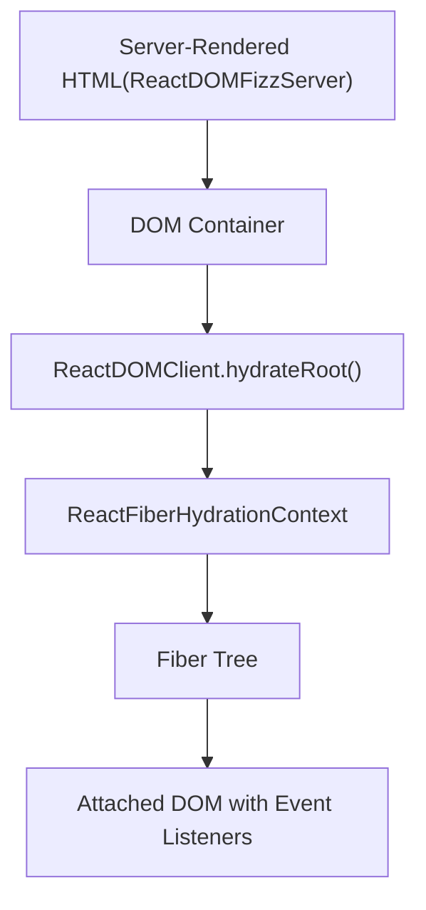
**Hydration Flow**

Sources: [packages/react-dom-bindings/src/client/ReactFiberConfigDOM.js1-1500](https://github.com/facebook/react/blob/65eec428/packages/react-dom-bindings/src/client/ReactFiberConfigDOM.js#L1-L1500) [packages/react-reconciler/src/ReactFiberHydrationContext.js1-100](https://github.com/facebook/react/blob/65eec428/packages/react-reconciler/src/ReactFiberHydrationContext.js#L1-L100)

## Hydration Context State

React maintains hydration state in `ReactFiberHydrationContext`, tracking the current position in the DOM tree and whether hydration is in progress.

| State Variable | Type | Purpose |
| --- | --- | --- |
| `hydrationParentFiber` | \`Fiber | null\` |
| `nextHydratableInstance` | \`HydratableInstance | null\` |
| `isHydrating` | `boolean` | Whether currently hydrating |
| `didSuspendOrErrorDEV` | `boolean` | Suppress warnings after errors |
| `hydrationDiffRootDEV` | \`HydrationDiffNode | null\` |
| `hydrationErrors` | \`Array | null\` |

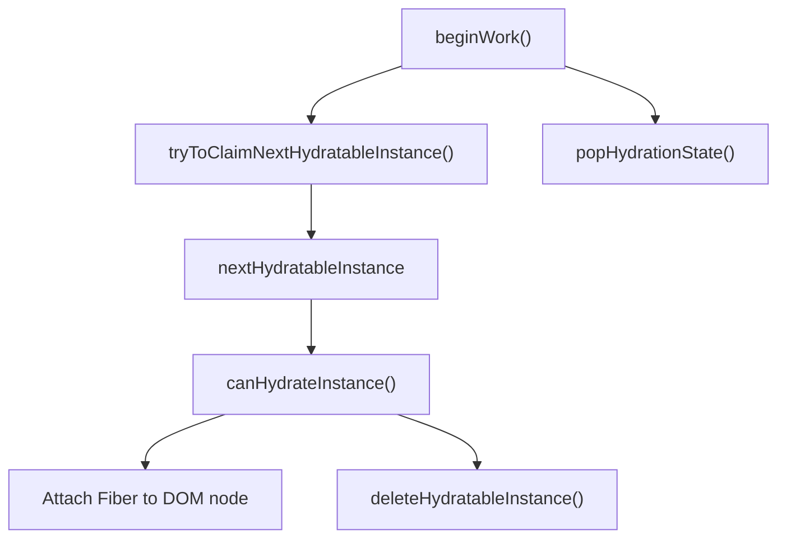
**Hydration State Management**

Sources: [packages/react-reconciler/src/ReactFiberHydrationContext.js78-95](https://github.com/facebook/react/blob/65eec428/packages/react-reconciler/src/ReactFiberHydrationContext.js#L78-L95) [packages/react-reconciler/src/ReactFiberHydrationContext.js135-200](https://github.com/facebook/react/blob/65eec428/packages/react-reconciler/src/ReactFiberHydrationContext.js#L135-L200)

## Hydration Process

During hydration, React walks the Fiber tree and the DOM tree in parallel, attempting to match each Fiber to an existing DOM node.

### Host Component Hydration

For host components (DOM elements), React validates the tag name and props, attaching the existing DOM node to the Fiber.

> **[Mermaid sequence]**
> *(图表结构无法解析)*

**Host Component Hydration Sequence**

Sources: [packages/react-reconciler/src/ReactFiberHydrationContext.js400-500](https://github.com/facebook/react/blob/65eec428/packages/react-reconciler/src/ReactFiberHydrationContext.js#L400-L500) [packages/react-dom-bindings/src/client/ReactFiberConfigDOM.js1200-1350](https://github.com/facebook/react/blob/65eec428/packages/react-dom-bindings/src/client/ReactFiberConfigDOM.js#L1200-L1350)

### Text Node Hydration

Text nodes are compared directly. If the text content differs, React logs a warning but uses the existing node.

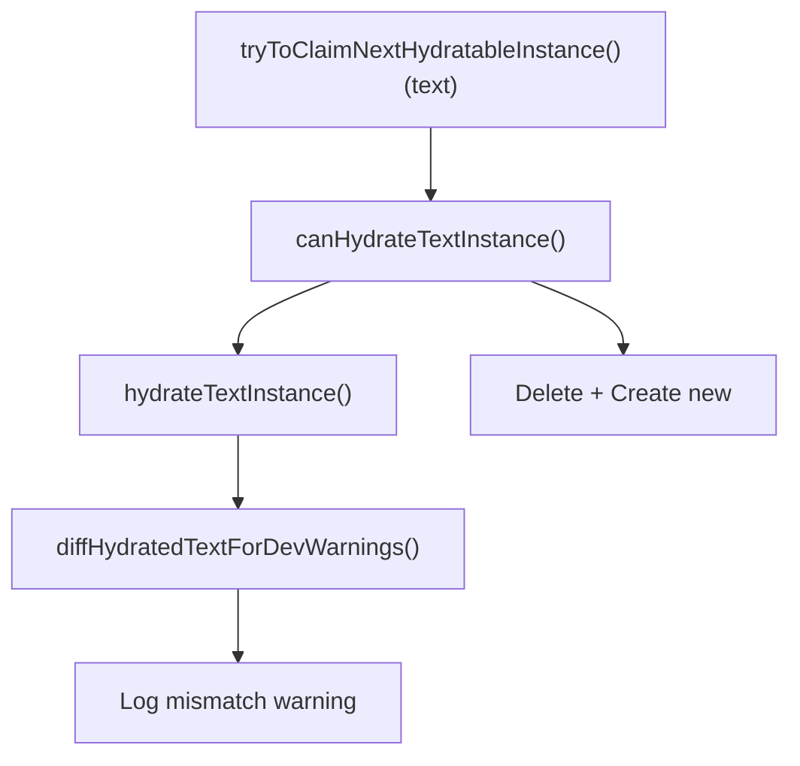
**Text Node Hydration**

Sources: [packages/react-reconciler/src/ReactFiberHydrationContext.js500-550](https://github.com/facebook/react/blob/65eec428/packages/react-reconciler/src/ReactFiberHydrationContext.js#L500-L550) [packages/react-dom-bindings/src/client/ReactFiberConfigDOM.js1350-1400](https://github.com/facebook/react/blob/65eec428/packages/react-dom-bindings/src/client/ReactFiberConfigDOM.js#L1350-L1400)

## Mismatch Detection and Recovery

When React detects a mismatch between server-rendered HTML and client render, it attempts recovery by deleting the mismatched server node and creating the correct client node.

### Mismatch Types

| Mismatch Type | Detection Method | Recovery Strategy |
| --- | --- | --- |
| Tag name mismatch | `canHydrateInstance()` returns false | Delete server node, insert client node |
| Text mismatch | `diffHydratedText()` compares strings | Use server text, log warning |
| Missing children | No DOM node for Fiber child | Insert client-rendered child |
| Extra DOM nodes | DOM nodes without Fiber | Delete extra nodes |
| Prop mismatch | `diffHydratedProperties()` | Apply client props, log warning |

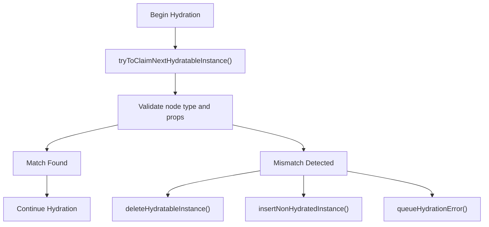
**Mismatch Recovery Flow**

Sources: [packages/react-reconciler/src/ReactFiberHydrationContext.js300-400](https://github.com/facebook/react/blob/65eec428/packages/react-reconciler/src/ReactFiberHydrationContext.js#L300-L400) [packages/react-dom-bindings/src/client/ReactFiberConfigDOM.js1400-1500](https://github.com/facebook/react/blob/65eec428/packages/react-dom-bindings/src/client/ReactFiberConfigDOM.js#L1400-L1500)

### Hydration Diff Tracking (DEV)

In development, React builds a tree of hydration differences to provide detailed error messages with component stacks.

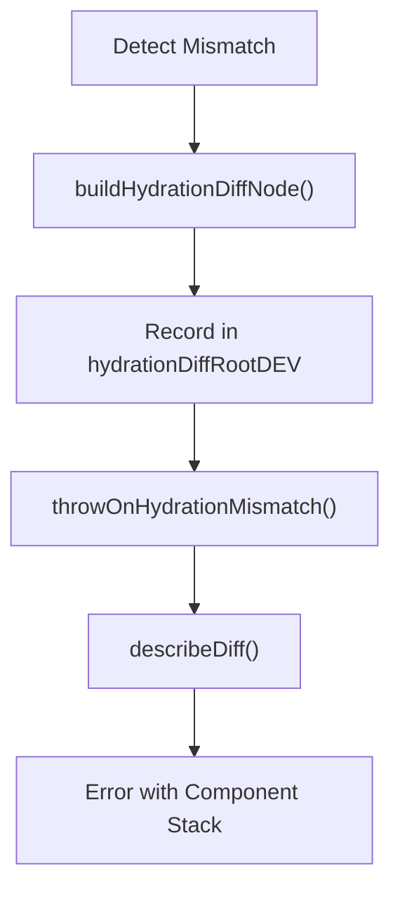
**Hydration Diff Reporting**

Sources: [packages/react-reconciler/src/ReactFiberHydrationContext.js96-135](https://github.com/facebook/react/blob/65eec428/packages/react-reconciler/src/ReactFiberHydrationContext.js#L96-L135) [packages/react-reconciler/src/ReactFiberHydrationDiffs.js1-200](https://github.com/facebook/react/blob/65eec428/packages/react-reconciler/src/ReactFiberHydrationDiffs.js#L1-L200)

## Dehydrated Suspense Boundaries

When React Fizz server renders a Suspense boundary that suspended, it emits special HTML comment markers to indicate dehydrated content. These markers allow the client to skip hydrating the fallback and wait for the real content.

### Suspense Boundary Markers

React uses specific comment node data to mark Suspense boundaries in SSR output:

| Marker | Data Attribute | Purpose |
| --- | --- | --- |
| Pending Start | `$?` | Suspense that hasn't resolved yet |
| Fallback Start | `$!` | Suspense showing fallback |
| Complete Start | `$` | Completed Suspense |
| End | `/$` | End of Suspense boundary |

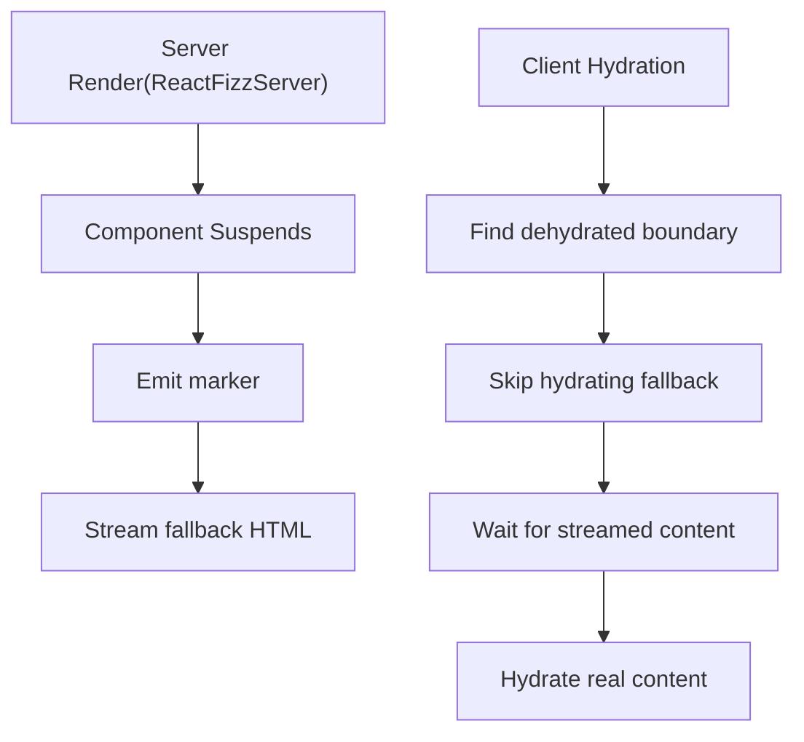
**Dehydrated Suspense Boundary Flow**

Sources: [packages/react-server/src/ReactFizzServer.js262-274](https://github.com/facebook/react/blob/65eec428/packages/react-server/src/ReactFizzServer.js#L262-L274) [packages/react-dom-bindings/src/client/ReactFiberConfigDOM.js262-274](https://github.com/facebook/react/blob/65eec428/packages/react-dom-bindings/src/client/ReactFiberConfigDOM.js#L262-L274)

### Suspense Instance Recognition

The client recognizes dehydrated Suspense boundaries by checking comment node data attributes.

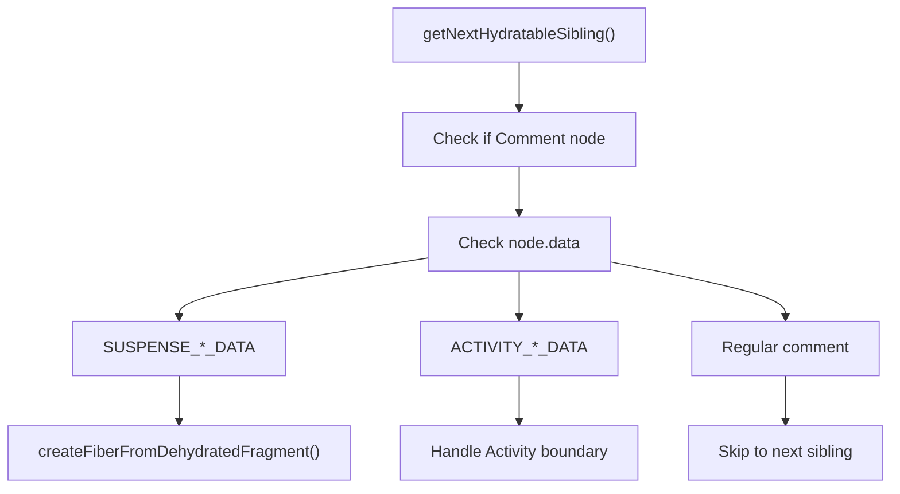
**Suspense Instance Recognition**

Sources: [packages/react-dom-bindings/src/client/ReactFiberConfigDOM.js1120-1180](https://github.com/facebook/react/blob/65eec428/packages/react-dom-bindings/src/client/ReactFiberConfigDOM.js#L1120-L1180) [packages/react-reconciler/src/ReactFiberHydrationContext.js550-650](https://github.com/facebook/react/blob/65eec428/packages/react-reconciler/src/ReactFiberHydrationContext.js#L550-L650)

### Hydrating Dehydrated Boundaries

When React encounters a dehydrated Suspense boundary, it creates a `DehydratedFragment` fiber and skips the initial content, waiting for the server stream to complete.

> **[Mermaid sequence]**
> *(图表结构无法解析)*

**Dehydrated Fragment Hydration**

Sources: [packages/react-reconciler/src/ReactFiber.js800-850](https://github.com/facebook/react/blob/65eec428/packages/react-reconciler/src/ReactFiber.js#L800-L850) [packages/react-reconciler/src/ReactFiberHydrationContext.js700-800](https://github.com/facebook/react/blob/65eec428/packages/react-reconciler/src/ReactFiberHydrationContext.js#L700-L800)

## Selective Hydration

Selective hydration allows React to prioritize hydrating Suspense boundaries based on user interactions, improving perceived performance.

### Priority-Based Hydration

When a user interacts with a dehydrated boundary, React immediately schedules that boundary for hydration at a higher priority.

| Interaction Type | Priority | Scheduling |
| --- | --- | --- |
| Click, focus, submit | Discrete | Sync hydration |
| Hover, scroll | Continuous | High priority |
| No interaction | Default | Normal priority |

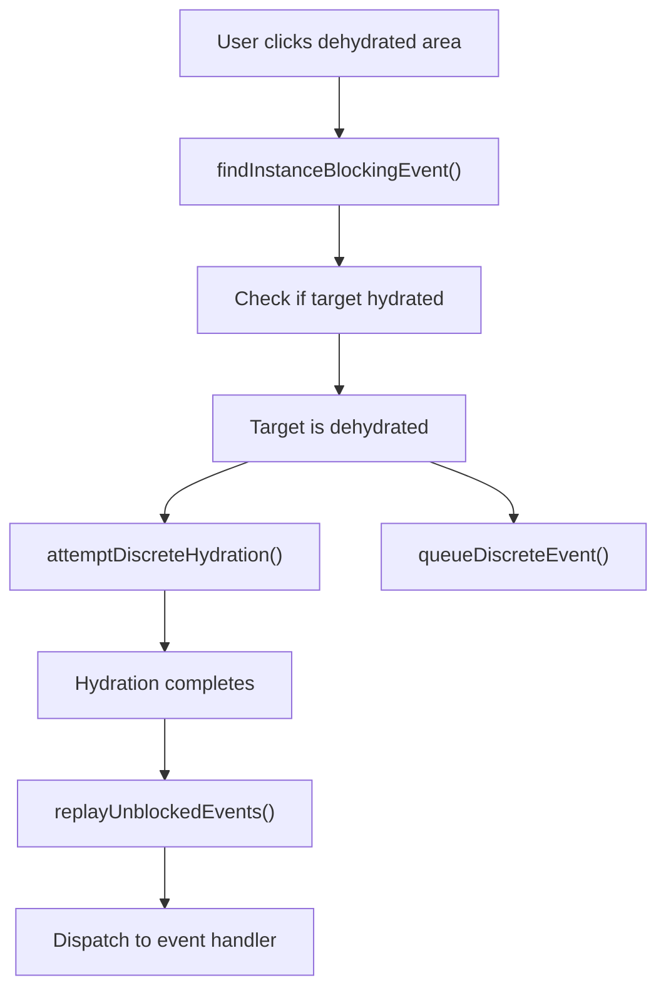
**Selective Hydration with Event Replay**

Sources: [packages/react-dom-bindings/src/events/ReactDOMEventReplaying.js1-300](https://github.com/facebook/react/blob/65eec428/packages/react-dom-bindings/src/events/ReactDOMEventReplaying.js#L1-L300) [packages/react-dom/src/\_\_tests\_\_/ReactDOMServerPartialHydration-test.internal.js146-200](https://github.com/facebook/react/blob/65eec428/packages/react-dom/src/__tests__/ReactDOMServerPartialHydration-test.internal.js#L146-L200)

### Event Queueing and Replay

Events targeting dehydrated content are queued until hydration completes, then replayed to ensure they're handled correctly.

> **[Mermaid sequence]**
> *(图表结构无法解析)*

**Event Replay Flow**

Sources: [packages/react-dom-bindings/src/events/ReactDOMEventReplaying.js150-250](https://github.com/facebook/react/blob/65eec428/packages/react-dom-bindings/src/events/ReactDOMEventReplaying.js#L150-L250) [packages/react-dom/src/\_\_tests\_\_/ReactDOMServerPartialHydration-test.internal.js728-850](https://github.com/facebook/react/blob/65eec428/packages/react-dom/src/__tests__/ReactDOMServerPartialHydration-test.internal.js#L728-L850)

### Multiple Boundary Prioritization

When multiple Suspense boundaries are dehydrated, React hydrates the one the user interacted with first, deferring others.

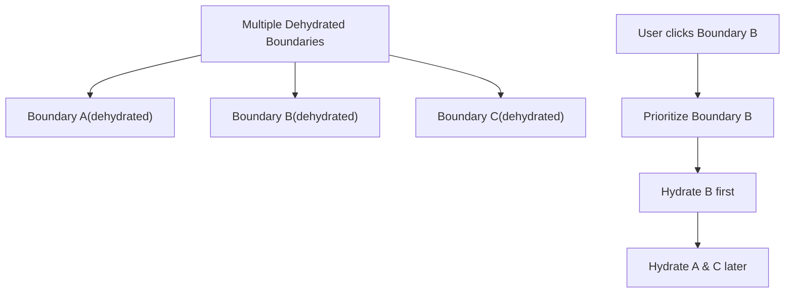
**Multi-Boundary Prioritization**

Sources: [packages/react-dom/src/\_\_tests\_\_/ReactDOMServerPartialHydration-test.internal.js300-400](https://github.com/facebook/react/blob/65eec428/packages/react-dom/src/__tests__/ReactDOMServerPartialHydration-test.internal.js#L300-L400)

## Error Handling and Recovery

React's hydration system includes comprehensive error handling to recover from mismatches and provide useful diagnostics.

### Recoverable Errors

Hydration mismatches are treated as recoverable errors. React logs the error via `onRecoverableError` callback but continues rendering.

| Error Type | Recovery Strategy | User Impact |
| --- | --- | --- |
| Tag mismatch | Client render subtree | Flicker during replacement |
| Text mismatch | Use server text | Dev warning only |
| Missing attribute | Apply client attribute | Attribute updates |
| Extra DOM nodes | Delete extra nodes | Removed from DOM |

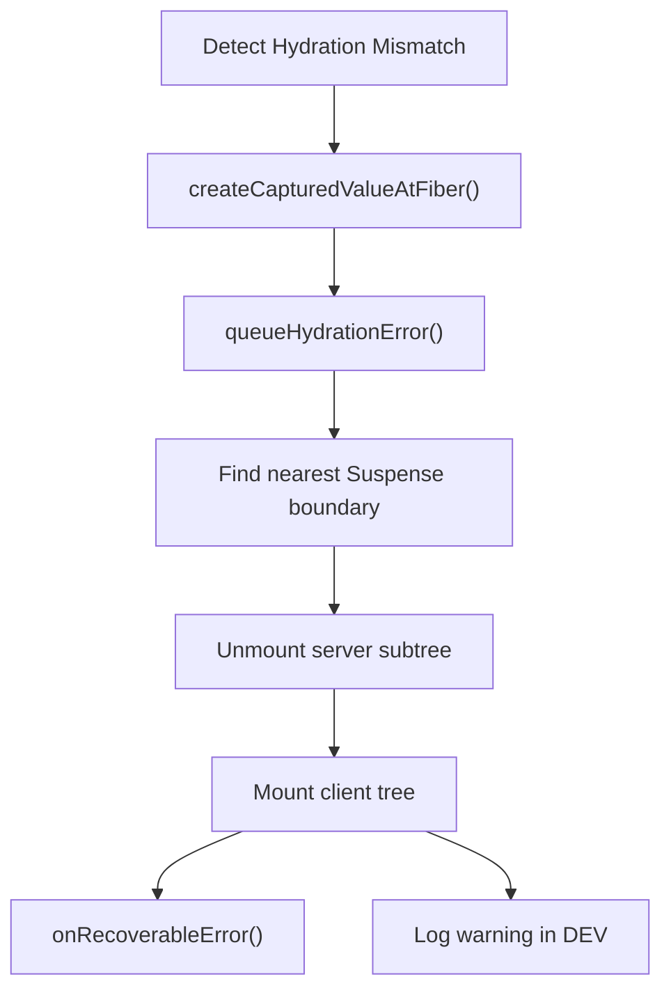
**Error Recovery Process**

Sources: [packages/react-reconciler/src/ReactFiberHydrationContext.js850-950](https://github.com/facebook/react/blob/65eec428/packages/react-reconciler/src/ReactFiberHydrationContext.js#L850-L950) [packages/react-reconciler/src/ReactCapturedValue.js1-50](https://github.com/facebook/react/blob/65eec428/packages/react-reconciler/src/ReactCapturedValue.js#L1-L50)

### HydrationMismatchException

In DEV, React throws `HydrationMismatchException` with detailed component stacks and diff information.

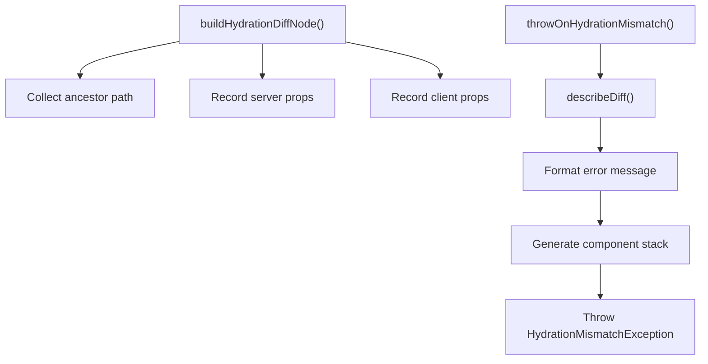
**HydrationMismatchException Generation**

Sources: [packages/react-reconciler/src/ReactFiberHydrationContext.js950-1050](https://github.com/facebook/react/blob/65eec428/packages/react-reconciler/src/ReactFiberHydrationContext.js#L950-L1050) [packages/react-reconciler/src/ReactFiberHydrationDiffs.js50-150](https://github.com/facebook/react/blob/65eec428/packages/react-reconciler/src/ReactFiberHydrationDiffs.js#L50-L150)

## Integration Points

The DOM event system and selective hydration work together to provide seamless interactivity in server-rendered applications:

1.  **Event Detection**: The event system identifies user interactions that should trigger hydration
2.  **Priority Assignment**: Different event types receive different hydration priorities
3.  **Boundary Targeting**: Events target specific Suspense boundaries for hydration
4.  **Event Queueing**: Original events are queued during hydration
5.  **Replay Execution**: Events are replayed after hydration completes

This integration ensures that server-rendered applications feel responsive while optimizing initial load performance through strategic hydration.

Sources: [packages/react-dom/src/\_\_tests\_\_/ReactDOMServerSelectiveHydration-test.internal.js1-2200](https://github.com/facebook/react/blob/65eec428/packages/react-dom/src/__tests__/ReactDOMServerSelectiveHydration-test.internal.js#L1-L2200) [packages/react-dom/src/events/\_\_tests\_\_/DOMPluginEventSystem-test.internal.js1-2000](https://github.com/facebook/react/blob/65eec428/packages/react-dom/src/events/__tests__/DOMPluginEventSystem-test.internal.js#L1-L2000)
