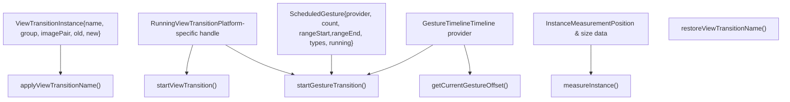
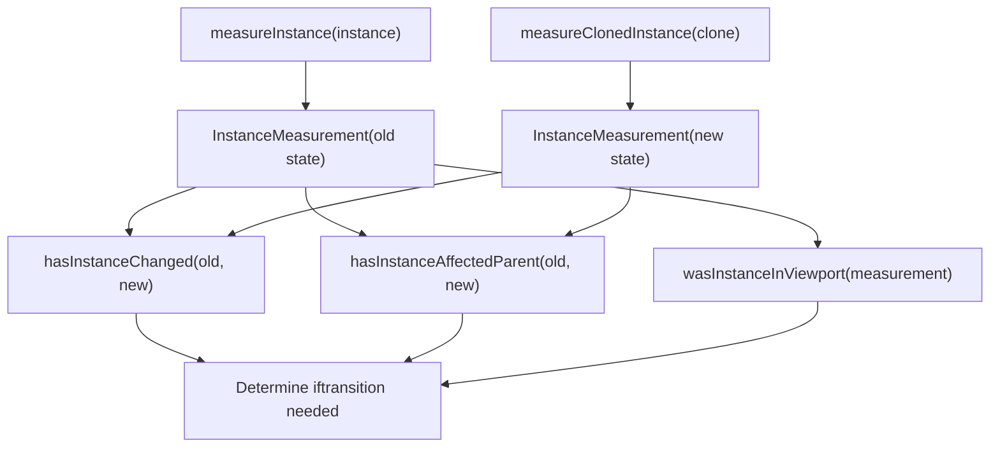
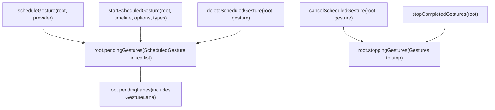
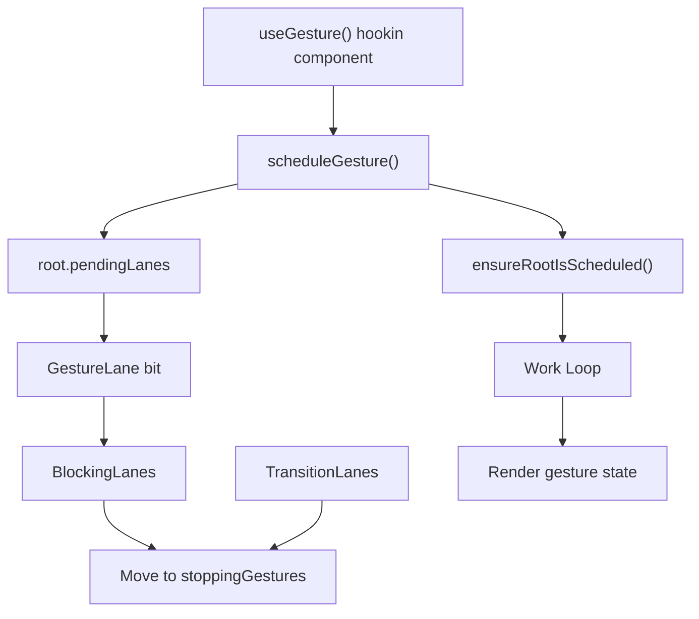

# View Transitions and Gesture Scheduling

Relevant source files

-   [packages/react-art/src/ReactFiberConfigART.js](https://github.com/facebook/react/blob/65eec428/packages/react-art/src/ReactFiberConfigART.js)
-   [packages/react-dom-bindings/src/client/ReactFiberConfigDOM.js](https://github.com/facebook/react/blob/65eec428/packages/react-dom-bindings/src/client/ReactFiberConfigDOM.js)
-   [packages/react-native-renderer/src/ReactFiberConfigFabric.js](https://github.com/facebook/react/blob/65eec428/packages/react-native-renderer/src/ReactFiberConfigFabric.js)
-   [packages/react-native-renderer/src/ReactFiberConfigNative.js](https://github.com/facebook/react/blob/65eec428/packages/react-native-renderer/src/ReactFiberConfigNative.js)
-   [packages/react-noop-renderer/src/createReactNoop.js](https://github.com/facebook/react/blob/65eec428/packages/react-noop-renderer/src/createReactNoop.js)
-   [packages/react-reconciler/src/ReactFiberConfigWithNoMutation.js](https://github.com/facebook/react/blob/65eec428/packages/react-reconciler/src/ReactFiberConfigWithNoMutation.js)
-   [packages/react-reconciler/src/ReactFiberGestureScheduler.js](https://github.com/facebook/react/blob/65eec428/packages/react-reconciler/src/ReactFiberGestureScheduler.js)
-   [packages/react-reconciler/src/\_\_tests\_\_/ReactFiberHostContext-test.internal.js](https://github.com/facebook/react/blob/65eec428/packages/react-reconciler/src/__tests__/ReactFiberHostContext-test.internal.js)
-   [packages/react-reconciler/src/forks/ReactFiberConfig.custom.js](https://github.com/facebook/react/blob/65eec428/packages/react-reconciler/src/forks/ReactFiberConfig.custom.js)
-   [packages/react-test-renderer/src/ReactFiberConfigTestHost.js](https://github.com/facebook/react/blob/65eec428/packages/react-test-renderer/src/ReactFiberConfigTestHost.js)

## Purpose and Scope

This document describes React's view transition and gesture scheduling systems, which coordinate smooth animations and gesture-driven updates with React's rendering lifecycle. View transitions integrate with the browser's View Transition API to animate between UI states, while gesture scheduling manages gesture-driven animations (such as scroll-linked or drag-based animations) by scheduling renders at specific points along a gesture timeline.

For information about the general reconciler architecture and commit phase, see [React Reconciler](/facebook/react/4-react-reconciler). For lane-based scheduling and priorities, see [Lane-Based Scheduling and Priorities](/facebook/react/4.4-lane-based-scheduling-and-priorities).

---

## Overview

React's view transition and gesture scheduling systems provide host configuration APIs that allow renderers to:

1.  **Coordinate view transitions** - Apply view-transition-name CSS properties, measure DOM changes, and manage the lifecycle of browser view transitions
2.  **Schedule gesture-driven renders** - Queue gestures, track their progress along timelines, and render at specific animation offsets
3.  **Detect visual changes** - Measure instance dimensions and positions to determine what changed during updates
4.  **Manage transition lifecycle** - Start, stop, and cancel transitions in coordination with React's commit phases

These systems are primarily implemented for the DOM renderer, with stub implementations in React Native and test renderers.

Sources: [packages/react-dom-bindings/src/client/ReactFiberConfigDOM.js](https://github.com/facebook/react/blob/65eec428/packages/react-dom-bindings/src/client/ReactFiberConfigDOM.js) [packages/react-reconciler/src/ReactFiberGestureScheduler.js](https://github.com/facebook/react/blob/65eec428/packages/react-reconciler/src/ReactFiberGestureScheduler.js)

---

## Host Configuration Interface

### Core Types and Data Structures


**ViewTransitionInstance Structure**

The `ViewTransitionInstance` represents a view transition element with animatable pseudo-elements:

| Field | Type | Description |
| --- | --- | --- |
| `name` | `string` | The view-transition-name identifying this element |
| `group` | `mixin$Animatable` | The ::view-transition-group pseudo-element |
| `imagePair` | `mixin$Animatable` | The ::view-transition-image-pair pseudo-element |
| `old` | `mixin$Animatable` | The ::view-transition-old pseudo-element |
| `new` | `mixin$Animatable` | The ::view-transition-new pseudo-element |

**ScheduledGesture Structure**

Gestures are queued and tracked in a linked list per fiber root:

| Field | Type | Description |
| --- | --- | --- |
| `provider` | `GestureTimeline` | The timeline provider (e.g., scroll timeline) |
| `count` | `number` | Number of active starts for this provider |
| `rangeStart` | `number` | Start percentage (0-100) of current state |
| `rangeEnd` | `number` | End percentage (0-100) of destination state |
| `types` | `null | TransitionTypes` | Transition type annotations |
| `running` | `null | RunningViewTransition` | Active transition handle |
| `prev` | `null | ScheduledGesture` | Previous gesture in queue |
| `next` | `null | ScheduledGesture` | Next gesture in queue |

Sources: [packages/react-dom-bindings/src/client/ReactFiberConfigDOM.js252-258](https://github.com/facebook/react/blob/65eec428/packages/react-dom-bindings/src/client/ReactFiberConfigDOM.js#L252-L258) [packages/react-reconciler/src/ReactFiberGestureScheduler.js24-33](https://github.com/facebook/react/blob/65eec428/packages/react-reconciler/src/ReactFiberGestureScheduler.js#L24-L33)

---

## View Transition Lifecycle

### Applying and Managing View Transition Names

> **[Mermaid sequence]**
> *(图表结构无法解析)*

**Key Methods:**

-   **`applyViewTransitionName(instance, name, className)`** - Sets the `view-transition-name` and optional `view-transition-class` CSS properties on a DOM element
-   **`restoreViewTransitionName(instance, props)`** - Restores the view-transition-name from props after a transition
-   **`cancelViewTransitionName(instance, name, props)`** - Removes view-transition-name from an element
-   **`cancelRootViewTransitionName(rootContainer)`** - Cancels view transition name on the root container
-   **`restoreRootViewTransitionName(rootContainer)`** - Restores root container's view transition name

Sources: [packages/react-dom-bindings/src/client/ReactFiberConfigDOM.js](https://github.com/facebook/react/blob/65eec428/packages/react-dom-bindings/src/client/ReactFiberConfigDOM.js) [packages/react-noop-renderer/src/createReactNoop.js799-826](https://github.com/facebook/react/blob/65eec428/packages/react-noop-renderer/src/createReactNoop.js#L799-L826)

### Starting and Stopping View Transitions

The `startViewTransition` method coordinates a view transition with React's commit phases:

```
startViewTransition(
  rootContainer: Container,
  transitionTypes: null | TransitionTypes,
  mutationCallback: () => void,
  layoutCallback: () => void,
  afterMutationCallback: () => void,
  spawnedWorkCallback: () => void,
  passiveCallback: () => mixed,
  errorCallback: mixed => void,
  blockedCallback: string => void,
  finishedAnimation: () => void
): null | RunningViewTransition
```
**Callback Execution Order:**

1.  **`mutationCallback()`** - Called during mutation phase to apply DOM changes
2.  **`layoutCallback()`** - Called during layout phase after mutations
3.  **`afterMutationCallback()`** - Called after mutations complete (may be skipped)
4.  **`spawnedWorkCallback()`** - Called when spawned work needs scheduling
5.  **`passiveCallback()`** - Called during passive effects phase (may be skipped)
6.  **`finishedAnimation()`** - Called when animation completes (profiling only)

The method returns a `RunningViewTransition` handle that can be passed to `stopViewTransition(transition)` to cancel the transition early.

Sources: [packages/react-noop-renderer/src/createReactNoop.js854-872](https://github.com/facebook/react/blob/65eec428/packages/react-noop-renderer/src/createReactNoop.js#L854-L872) [packages/react-native-renderer/src/ReactFiberConfigNative.js668-690](https://github.com/facebook/react/blob/65eec428/packages/react-native-renderer/src/ReactFiberConfigNative.js#L668-L690)

---

## Measurement System

### Instance Measurement and Change Detection

React measures instance positions and sizes to determine what changed during a transition:


**Measurement API Methods:**

| Method | Purpose |
| --- | --- |
| `measureInstance(instance)` | Captures position and size of an instance before changes |
| `measureClonedInstance(instance)` | Measures a cloned instance (used for transition snapshots) |
| `wasInstanceInViewport(measurement)` | Returns `true` if the measured instance was in the viewport |
| `hasInstanceChanged(oldMeasurement, newMeasurement)` | Returns `true` if position/size changed between measurements |
| `hasInstanceAffectedParent(oldMeasurement, newMeasurement)` | Returns `true` if changes affect parent layout |

**Root Container Cloning:**

For view transitions, React may need to clone the root container:

-   **`cloneRootViewTransitionContainer(rootContainer)`** - Creates a snapshot clone of the root
-   **`removeRootViewTransitionClone(rootContainer, clone)`** - Removes the cloned snapshot

Sources: [packages/react-noop-renderer/src/createReactNoop.js828-852](https://github.com/facebook/react/blob/65eec428/packages/react-noop-renderer/src/createReactNoop.js#L828-L852) [packages/react-native-renderer/src/ReactFiberConfigNative.js639-666](https://github.com/facebook/react/blob/65eec428/packages/react-native-renderer/src/ReactFiberConfigNative.js#L639-L666)

---

## Gesture Scheduling System

### Gesture Queue and Lifecycle


### Scheduling Gestures

**`scheduleGesture(root, provider)`** - Adds a gesture to the pending queue or returns existing:

1.  Searches `root.pendingGestures` linked list for matching `provider`
2.  If found, returns existing `ScheduledGesture`
3.  If not found, creates new `ScheduledGesture` with initial state
4.  Appends to linked list
5.  Calls `ensureRootIsScheduled(root)` to schedule render work

**`startScheduledGesture(root, gestureTimeline, gestureOptions, transitionTypes)`** - Activates a gesture:

1.  Calculates `rangeStart` from `gestureOptions.rangeStart` or `getCurrentGestureOffset(gestureTimeline)`
2.  Calculates `rangeEnd` from `gestureOptions.rangeEnd` or heuristic (flip from 0 to 100 or vice versa)
3.  Finds matching gesture in `root.pendingGestures`
4.  Increments `gesture.count`
5.  Updates `gesture.rangeStart`, `gesture.rangeEnd`, and `gesture.types`
6.  Returns the `ScheduledGesture` for tracking

> **[Mermaid sequence]**
> *(图表结构无法解析)*

Sources: [packages/react-reconciler/src/ReactFiberGestureScheduler.js35-117](https://github.com/facebook/react/blob/65eec428/packages/react-reconciler/src/ReactFiberGestureScheduler.js#L35-L117)

### Canceling and Stopping Gestures

**`cancelScheduledGesture(root, gesture)`** - Decrements the gesture's reference count and handles cleanup:

1.  Decrements `gesture.count`
2.  If `count === 0`:
    -   Deletes gesture from `pendingGestures` queue
    -   If `gesture.running` exists (active view transition):
        -   If there are pending blocking/transition lanes, moves gesture to `root.stoppingGestures` to defer stopping
        -   Otherwise, immediately calls `stopViewTransition(gesture.running)`

**`deleteScheduledGesture(root, gesture)`** - Removes gesture from linked list:

1.  Updates linked list pointers (`prev.next`, `next.prev`)
2.  Updates `root.pendingGestures` if removing head
3.  Clears `GestureLane` from `root.pendingLanes` if queue becomes empty

**`stopCompletedGestures(root)`** - Called after commit to stop deferred gestures:

1.  Iterates through `root.stoppingGestures` linked list
2.  Calls `stopViewTransition(gesture.running)` for each
3.  Clears the list

Sources: [packages/react-reconciler/src/ReactFiberGestureScheduler.js119-198](https://github.com/facebook/react/blob/65eec428/packages/react-reconciler/src/ReactFiberGestureScheduler.js#L119-L198)

---

## Gesture Timeline Integration

### Starting Gesture Transitions

The `startGestureTransition` method initiates a gesture-driven view transition:

```
startGestureTransition(
  rootContainer: Container,
  timeline: GestureTimeline,
  rangeStart: number,
  rangeEnd: number,
  transitionTypes: null | TransitionTypes,
  mutationCallback: () => void,
  animateCallback: () => void,
  errorCallback: mixed => void,
  finishedAnimation: () => void
): null | RunningViewTransition
```
**Execution Flow:**

1.  Calls `mutationCallback()` to apply DOM mutations
2.  Calls `animateCallback()` to set up animations along the timeline
3.  Optionally calls `finishedAnimation()` for profiling
4.  Returns handle to cancel the gesture transition

**`getCurrentGestureOffset(provider)`** - Queries current position along the gesture timeline (0-100 percentage).

Sources: [packages/react-noop-renderer/src/createReactNoop.js874-897](https://github.com/facebook/react/blob/65eec428/packages/react-noop-renderer/src/createReactNoop.js#L874-L897) [packages/react-native-renderer/src/ReactFiberConfigNative.js694-730](https://github.com/facebook/react/blob/65eec428/packages/react-native-renderer/src/ReactFiberConfigNative.js#L694-L730)

---

## Platform-Specific Implementations

### DOM Renderer Implementation

The DOM renderer provides full view transition support through the browser's View Transition API:

-   **View transition names** - Applied via `element.style.viewTransitionName` CSS property
-   **View transition classes** - Applied via `element.style.viewTransitionClass` for grouping
-   **Measurement** - Uses `getBoundingClientRect()` and viewport intersection checks
-   **Native API** - Wraps `document.startViewTransition()` for smooth transitions

Additional DOM-specific features:

-   **`shouldAttemptEagerTransition()`** - Returns `true` during popstate events to render transitions synchronously
-   **`trackSchedulerEvent()`** - Captures `window.event` for event-driven scheduling
-   **`resolveEventType()`** - Returns the current event type for priority resolution
-   **`resolveEventTimeStamp()`** - Returns the current event's timestamp

Sources: [packages/react-dom-bindings/src/client/ReactFiberConfigDOM.js709-747](https://github.com/facebook/react/blob/65eec428/packages/react-dom-bindings/src/client/ReactFiberConfigDOM.js#L709-L747)

### React Native Implementations

React Native renderers (both Fabric and Legacy) provide stub implementations:

```
// All methods implemented but mostly no-ops
applyViewTransitionName(instance, name, className) {
  // Not yet implemented
}

startViewTransition(...callbacks) {
  mutationCallback();
  layoutCallback();
  spawnedWorkCallback();
  finishedAnimation(); // if profiling enabled
  return null; // No transition handle
}

startGestureTransition(...callbacks) {
  mutationCallback();
  animateCallback();
  finishedAnimation(); // if profiling enabled
  return null; // No transition handle
}

getCurrentGestureOffset(provider) {
  throw new Error('startGestureTransition is not yet supported in React Native.');
}
```
The callbacks are still executed to ensure React's commit phases complete correctly, but no actual animations occur.

Sources: [packages/react-native-renderer/src/ReactFiberConfigNative.js593-730](https://github.com/facebook/react/blob/65eec428/packages/react-native-renderer/src/ReactFiberConfigNative.js#L593-L730) [packages/react-native-renderer/src/ReactFiberConfigFabric.js](https://github.com/facebook/react/blob/65eec428/packages/react-native-renderer/src/ReactFiberConfigFabric.js)

### Test Renderer Implementation

The test renderer (react-test-renderer) provides no-op implementations similar to React Native, allowing tests to execute without triggering actual animations. The noop renderer (used in React's internal tests) has slightly more sophisticated stubs that track calls for testing purposes.

Sources: [packages/react-test-renderer/src/ReactFiberConfigTestHost.js335-511](https://github.com/facebook/react/blob/65eec428/packages/react-test-renderer/src/ReactFiberConfigTestHost.js#L335-L511) [packages/react-noop-renderer/src/createReactNoop.js799-897](https://github.com/facebook/react/blob/65eec428/packages/react-noop-renderer/src/createReactNoop.js#L799-L897)

---

## Integration with Reconciler

### Gesture Lane Scheduling

Gestures use a dedicated lane for scheduling:

-   **`GestureLane`** - A specific lane bit for gesture-driven renders
-   When a gesture is scheduled, `GestureLane` is added to `root.pendingLanes`
-   The reconciler renders on `GestureLane` when processing gesture updates
-   Lane is cleared from `pendingLanes` when the gesture queue becomes empty


Sources: [packages/react-reconciler/src/ReactFiberGestureScheduler.js15-19](https://github.com/facebook/react/blob/65eec428/packages/react-reconciler/src/ReactFiberGestureScheduler.js#L15-L19) [packages/react-reconciler/src/ReactFiberGestureScheduler.js134-148](https://github.com/facebook/react/blob/65eec428/packages/react-reconciler/src/ReactFiberGestureScheduler.js#L134-L148)

### Commit Phase Integration

View transitions are coordinated with React's commit phases:

1.  **Before Mutation** - Measure instance states, prepare transition
2.  **Mutation** - Apply DOM changes (mutationCallback)
3.  **Layout** - Execute layout effects (layoutCallback)
4.  **After Mutation** - Coordinate spawned work (afterMutationCallback, spawnedWorkCallback)
5.  **Passive** - Execute passive effects (passiveCallback)
6.  **Stopping Gestures** - Call `stopCompletedGestures(root)` to clean up

The gesture scheduler ensures transitions are stopped after commit if they have completed but deferred stopping due to pending work.

Sources: [packages/react-reconciler/src/ReactFiberGestureScheduler.js185-198](https://github.com/facebook/react/blob/65eec428/packages/react-reconciler/src/ReactFiberGestureScheduler.js#L185-L198)

---

## Summary

React's view transition and gesture scheduling systems provide:

| Component | Purpose | Key Types | Key Methods |
| --- | --- | --- | --- |
| **View Transitions** | Browser API integration | `ViewTransitionInstance`, `RunningViewTransition` | `startViewTransition`, `applyViewTransitionName`, measurement methods |
| **Gesture Scheduling** | Timeline-driven animations | `ScheduledGesture`, `GestureTimeline` | `scheduleGesture`, `startScheduledGesture`, `cancelScheduledGesture` |
| **Measurement** | Change detection | `InstanceMeasurement` | `measureInstance`, `hasInstanceChanged`, `wasInstanceInViewport` |
| **Host Config** | Platform abstraction | Platform-specific handles | All methods implemented per-platform |

The DOM renderer provides full support for these features, while React Native and test renderers provide stub implementations that maintain API compatibility without actual animations.

Sources: [packages/react-reconciler/src/ReactFiberGestureScheduler.js](https://github.com/facebook/react/blob/65eec428/packages/react-reconciler/src/ReactFiberGestureScheduler.js) [packages/react-dom-bindings/src/client/ReactFiberConfigDOM.js](https://github.com/facebook/react/blob/65eec428/packages/react-dom-bindings/src/client/ReactFiberConfigDOM.js) [packages/react-noop-renderer/src/createReactNoop.js](https://github.com/facebook/react/blob/65eec428/packages/react-noop-renderer/src/createReactNoop.js)
