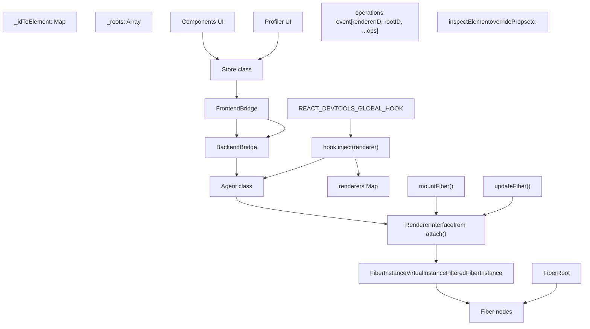
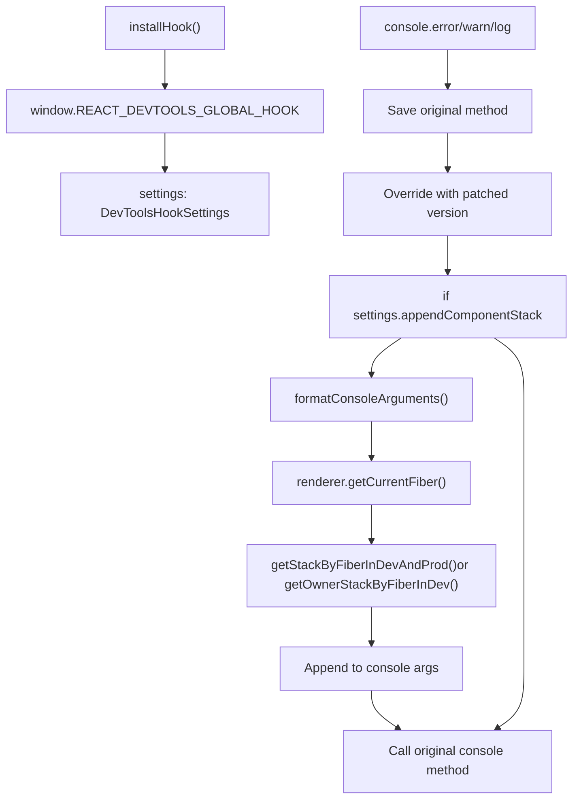
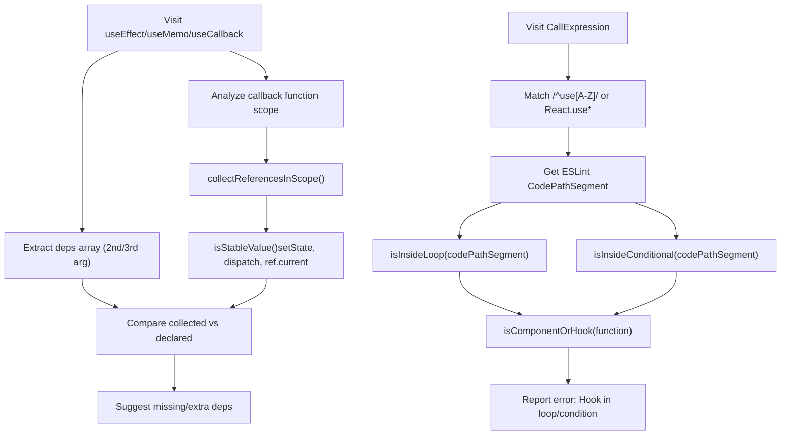
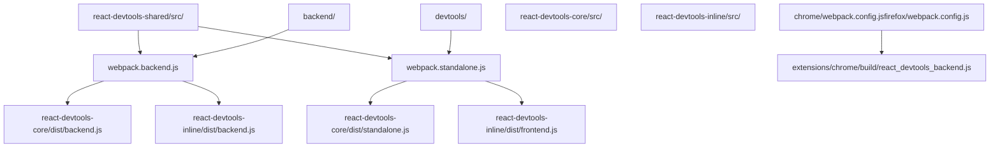

# Developer Tools and Tooling

Relevant source files

-   [CHANGELOG.md](https://github.com/facebook/react/blob/65eec428/CHANGELOG.md)
-   [fixtures/devtools/standalone/index.html](https://github.com/facebook/react/blob/65eec428/fixtures/devtools/standalone/index.html)
-   [packages/eslint-plugin-react-hooks/CHANGELOG.md](https://github.com/facebook/react/blob/65eec428/packages/eslint-plugin-react-hooks/CHANGELOG.md)
-   [packages/eslint-plugin-react-hooks/README.md](https://github.com/facebook/react/blob/65eec428/packages/eslint-plugin-react-hooks/README.md)
-   [packages/eslint-plugin-react-hooks/\_\_tests\_\_/ESLintRuleExhaustiveDeps-test.js](https://github.com/facebook/react/blob/65eec428/packages/eslint-plugin-react-hooks/__tests__/ESLintRuleExhaustiveDeps-test.js)
-   [packages/eslint-plugin-react-hooks/\_\_tests\_\_/ESLintRulesOfHooks-test.js](https://github.com/facebook/react/blob/65eec428/packages/eslint-plugin-react-hooks/__tests__/ESLintRulesOfHooks-test.js)
-   [packages/eslint-plugin-react-hooks/babel.config.js](https://github.com/facebook/react/blob/65eec428/packages/eslint-plugin-react-hooks/babel.config.js)
-   [packages/eslint-plugin-react-hooks/index.js](https://github.com/facebook/react/blob/65eec428/packages/eslint-plugin-react-hooks/index.js)
-   [packages/eslint-plugin-react-hooks/jest.config.js](https://github.com/facebook/react/blob/65eec428/packages/eslint-plugin-react-hooks/jest.config.js)
-   [packages/eslint-plugin-react-hooks/npm/index.js](https://github.com/facebook/react/blob/65eec428/packages/eslint-plugin-react-hooks/npm/index.js)
-   [packages/eslint-plugin-react-hooks/src/rules/ExhaustiveDeps.ts](https://github.com/facebook/react/blob/65eec428/packages/eslint-plugin-react-hooks/src/rules/ExhaustiveDeps.ts)
-   [packages/eslint-plugin-react-hooks/src/rules/RulesOfHooks.ts](https://github.com/facebook/react/blob/65eec428/packages/eslint-plugin-react-hooks/src/rules/RulesOfHooks.ts)
-   [packages/eslint-plugin-react-hooks/src/shared/Utils.ts](https://github.com/facebook/react/blob/65eec428/packages/eslint-plugin-react-hooks/src/shared/Utils.ts)
-   [packages/eslint-plugin-react-hooks/src/types/estree.d.ts](https://github.com/facebook/react/blob/65eec428/packages/eslint-plugin-react-hooks/src/types/estree.d.ts)
-   [packages/eslint-plugin-react-hooks/src/types/global.d.ts](https://github.com/facebook/react/blob/65eec428/packages/eslint-plugin-react-hooks/src/types/global.d.ts)
-   [packages/eslint-plugin-react-hooks/tsconfig.json](https://github.com/facebook/react/blob/65eec428/packages/eslint-plugin-react-hooks/tsconfig.json)
-   [packages/react-devtools-shared/src/\_\_tests\_\_/inspectedElement-test.js](https://github.com/facebook/react/blob/65eec428/packages/react-devtools-shared/src/__tests__/inspectedElement-test.js)
-   [packages/react-devtools-shared/src/\_\_tests\_\_/legacy/inspectElement-test.js](https://github.com/facebook/react/blob/65eec428/packages/react-devtools-shared/src/__tests__/legacy/inspectElement-test.js)
-   [packages/react-devtools-shared/src/\_\_tests\_\_/store-test.js](https://github.com/facebook/react/blob/65eec428/packages/react-devtools-shared/src/__tests__/store-test.js)
-   [packages/react-devtools-shared/src/backend/StyleX/\_\_tests\_\_/utils-test.js](https://github.com/facebook/react/blob/65eec428/packages/react-devtools-shared/src/backend/StyleX/__tests__/utils-test.js)
-   [packages/react-devtools-shared/src/backend/StyleX/utils.js](https://github.com/facebook/react/blob/65eec428/packages/react-devtools-shared/src/backend/StyleX/utils.js)
-   [packages/react-devtools-shared/src/backend/agent.js](https://github.com/facebook/react/blob/65eec428/packages/react-devtools-shared/src/backend/agent.js)
-   [packages/react-devtools-shared/src/backend/fiber/renderer.js](https://github.com/facebook/react/blob/65eec428/packages/react-devtools-shared/src/backend/fiber/renderer.js)
-   [packages/react-devtools-shared/src/backend/legacy/renderer.js](https://github.com/facebook/react/blob/65eec428/packages/react-devtools-shared/src/backend/legacy/renderer.js)
-   [packages/react-devtools-shared/src/backend/types.js](https://github.com/facebook/react/blob/65eec428/packages/react-devtools-shared/src/backend/types.js)
-   [packages/react-devtools-shared/src/backend/views/Highlighter/index.js](https://github.com/facebook/react/blob/65eec428/packages/react-devtools-shared/src/backend/views/Highlighter/index.js)
-   [packages/react-devtools-shared/src/backendAPI.js](https://github.com/facebook/react/blob/65eec428/packages/react-devtools-shared/src/backendAPI.js)
-   [packages/react-devtools-shared/src/bridge.js](https://github.com/facebook/react/blob/65eec428/packages/react-devtools-shared/src/bridge.js)
-   [packages/react-devtools-shared/src/constants.js](https://github.com/facebook/react/blob/65eec428/packages/react-devtools-shared/src/constants.js)
-   [packages/react-devtools-shared/src/devtools/constants.js](https://github.com/facebook/react/blob/65eec428/packages/react-devtools-shared/src/devtools/constants.js)
-   [packages/react-devtools-shared/src/devtools/store.js](https://github.com/facebook/react/blob/65eec428/packages/react-devtools-shared/src/devtools/store.js)
-   [packages/react-devtools-shared/src/devtools/views/ButtonIcon.js](https://github.com/facebook/react/blob/65eec428/packages/react-devtools-shared/src/devtools/views/ButtonIcon.js)
-   [packages/react-devtools-shared/src/devtools/views/Components/InspectedElement.js](https://github.com/facebook/react/blob/65eec428/packages/react-devtools-shared/src/devtools/views/Components/InspectedElement.js)
-   [packages/react-devtools-shared/src/devtools/views/Components/InspectedElementContextTree.js](https://github.com/facebook/react/blob/65eec428/packages/react-devtools-shared/src/devtools/views/Components/InspectedElementContextTree.js)
-   [packages/react-devtools-shared/src/devtools/views/Components/InspectedElementErrorsAndWarningsTree.js](https://github.com/facebook/react/blob/65eec428/packages/react-devtools-shared/src/devtools/views/Components/InspectedElementErrorsAndWarningsTree.js)
-   [packages/react-devtools-shared/src/devtools/views/Components/InspectedElementPropsTree.js](https://github.com/facebook/react/blob/65eec428/packages/react-devtools-shared/src/devtools/views/Components/InspectedElementPropsTree.js)
-   [packages/react-devtools-shared/src/devtools/views/Components/InspectedElementSharedStyles.css](https://github.com/facebook/react/blob/65eec428/packages/react-devtools-shared/src/devtools/views/Components/InspectedElementSharedStyles.css)
-   [packages/react-devtools-shared/src/devtools/views/Components/InspectedElementStateTree.js](https://github.com/facebook/react/blob/65eec428/packages/react-devtools-shared/src/devtools/views/Components/InspectedElementStateTree.js)
-   [packages/react-devtools-shared/src/devtools/views/Components/InspectedElementStyleXPlugin.js](https://github.com/facebook/react/blob/65eec428/packages/react-devtools-shared/src/devtools/views/Components/InspectedElementStyleXPlugin.js)
-   [packages/react-devtools-shared/src/devtools/views/Components/InspectedElementSuspendedBy.js](https://github.com/facebook/react/blob/65eec428/packages/react-devtools-shared/src/devtools/views/Components/InspectedElementSuspendedBy.js)
-   [packages/react-devtools-shared/src/devtools/views/Components/InspectedElementView.css](https://github.com/facebook/react/blob/65eec428/packages/react-devtools-shared/src/devtools/views/Components/InspectedElementView.css)
-   [packages/react-devtools-shared/src/devtools/views/Components/InspectedElementView.js](https://github.com/facebook/react/blob/65eec428/packages/react-devtools-shared/src/devtools/views/Components/InspectedElementView.js)
-   [packages/react-devtools-shared/src/devtools/views/Profiler/CommitTreeBuilder.js](https://github.com/facebook/react/blob/65eec428/packages/react-devtools-shared/src/devtools/views/Profiler/CommitTreeBuilder.js)
-   [packages/react-devtools-shared/src/devtools/views/Settings/SettingsContext.js](https://github.com/facebook/react/blob/65eec428/packages/react-devtools-shared/src/devtools/views/Settings/SettingsContext.js)
-   [packages/react-devtools-shared/src/devtools/views/SuspenseTab/SuspenseBreadcrumbs.js](https://github.com/facebook/react/blob/65eec428/packages/react-devtools-shared/src/devtools/views/SuspenseTab/SuspenseBreadcrumbs.js)
-   [packages/react-devtools-shared/src/devtools/views/SuspenseTab/SuspenseEnvironmentColors.css](https://github.com/facebook/react/blob/65eec428/packages/react-devtools-shared/src/devtools/views/SuspenseTab/SuspenseEnvironmentColors.css)
-   [packages/react-devtools-shared/src/devtools/views/SuspenseTab/SuspenseEnvironmentColors.js](https://github.com/facebook/react/blob/65eec428/packages/react-devtools-shared/src/devtools/views/SuspenseTab/SuspenseEnvironmentColors.js)
-   [packages/react-devtools-shared/src/devtools/views/SuspenseTab/SuspenseRects.css](https://github.com/facebook/react/blob/65eec428/packages/react-devtools-shared/src/devtools/views/SuspenseTab/SuspenseRects.css)
-   [packages/react-devtools-shared/src/devtools/views/SuspenseTab/SuspenseRects.js](https://github.com/facebook/react/blob/65eec428/packages/react-devtools-shared/src/devtools/views/SuspenseTab/SuspenseRects.js)
-   [packages/react-devtools-shared/src/devtools/views/SuspenseTab/SuspenseScrubber.css](https://github.com/facebook/react/blob/65eec428/packages/react-devtools-shared/src/devtools/views/SuspenseTab/SuspenseScrubber.css)
-   [packages/react-devtools-shared/src/devtools/views/SuspenseTab/SuspenseScrubber.js](https://github.com/facebook/react/blob/65eec428/packages/react-devtools-shared/src/devtools/views/SuspenseTab/SuspenseScrubber.js)
-   [packages/react-devtools-shared/src/devtools/views/SuspenseTab/SuspenseTab.css](https://github.com/facebook/react/blob/65eec428/packages/react-devtools-shared/src/devtools/views/SuspenseTab/SuspenseTab.css)
-   [packages/react-devtools-shared/src/devtools/views/SuspenseTab/SuspenseTab.js](https://github.com/facebook/react/blob/65eec428/packages/react-devtools-shared/src/devtools/views/SuspenseTab/SuspenseTab.js)
-   [packages/react-devtools-shared/src/devtools/views/SuspenseTab/SuspenseTimeline.css](https://github.com/facebook/react/blob/65eec428/packages/react-devtools-shared/src/devtools/views/SuspenseTab/SuspenseTimeline.css)
-   [packages/react-devtools-shared/src/devtools/views/SuspenseTab/SuspenseTimeline.js](https://github.com/facebook/react/blob/65eec428/packages/react-devtools-shared/src/devtools/views/SuspenseTab/SuspenseTimeline.js)
-   [packages/react-devtools-shared/src/devtools/views/SuspenseTab/SuspenseTreeContext.js](https://github.com/facebook/react/blob/65eec428/packages/react-devtools-shared/src/devtools/views/SuspenseTab/SuspenseTreeContext.js)
-   [packages/react-devtools-shared/src/devtools/views/Toggle.css](https://github.com/facebook/react/blob/65eec428/packages/react-devtools-shared/src/devtools/views/Toggle.css)
-   [packages/react-devtools-shared/src/devtools/views/hooks.js](https://github.com/facebook/react/blob/65eec428/packages/react-devtools-shared/src/devtools/views/hooks.js)
-   [packages/react-devtools-shared/src/devtools/views/root.css](https://github.com/facebook/react/blob/65eec428/packages/react-devtools-shared/src/devtools/views/root.css)
-   [packages/react-devtools-shared/src/devtools/views/useInferredName.js](https://github.com/facebook/react/blob/65eec428/packages/react-devtools-shared/src/devtools/views/useInferredName.js)
-   [packages/react-devtools-shared/src/devtools/views/utils.js](https://github.com/facebook/react/blob/65eec428/packages/react-devtools-shared/src/devtools/views/utils.js)
-   [packages/react-devtools-shared/src/frontend/types.js](https://github.com/facebook/react/blob/65eec428/packages/react-devtools-shared/src/frontend/types.js)
-   [packages/react-devtools-shared/src/hydration.js](https://github.com/facebook/react/blob/65eec428/packages/react-devtools-shared/src/hydration.js)
-   [packages/react-devtools-shared/src/utils.js](https://github.com/facebook/react/blob/65eec428/packages/react-devtools-shared/src/utils.js)
-   [packages/react-devtools-shell/src/app/InspectableElements/SimpleValues.js](https://github.com/facebook/react/blob/65eec428/packages/react-devtools-shell/src/app/InspectableElements/SimpleValues.js)
-   [packages/react-devtools-shell/src/app/InspectableElements/SymbolKeys.js](https://github.com/facebook/react/blob/65eec428/packages/react-devtools-shell/src/app/InspectableElements/SymbolKeys.js)
-   [packages/react-devtools-shell/src/app/InspectableElements/UnserializableProps.js](https://github.com/facebook/react/blob/65eec428/packages/react-devtools-shell/src/app/InspectableElements/UnserializableProps.js)
-   [packages/shared/ReactIODescription.js](https://github.com/facebook/react/blob/65eec428/packages/shared/ReactIODescription.js)

The React repository provides two primary developer-facing tools:

1.  **React DevTools**: A runtime debugging interface available as browser extension, standalone app, or inline UI for inspecting component trees, profiling performance, and debugging state.
2.  **eslint-plugin-react-hooks**: An ESLint plugin that statically validates the Rules of Hooks and dependency arrays.

Additionally, the repository includes console patching infrastructure, component stack generation, and browser Performance panel integration.

## Overview

React's developer tooling operates at different phases of the development lifecycle:

| Tool | Phase | Key Implementation |
| --- | --- | --- |
| **eslint-plugin-react-hooks** | Edit/Build Time | [RulesOfHooks.ts1-800](https://github.com/facebook/react/blob/65eec428/RulesOfHooks.ts#L1-L800) [ExhaustiveDeps.ts](https://github.com/facebook/react/blob/65eec428/ExhaustiveDeps.ts) |
| **React DevTools** | Runtime | [renderer.js1006-1102](https://github.com/facebook/react/blob/65eec428/renderer.js#L1006-L1102) (`attach()`) + [store.js143-348](https://github.com/facebook/react/blob/65eec428/store.js#L143-L348) (`Store`) |
| **Console Patching** | Runtime | [hook.js110-267](https://github.com/facebook/react/blob/65eec428/hook.js#L110-L267) via `__REACT_DEVTOOLS_GLOBAL_HOOK__` |
| **Performance Tracks** | Runtime | [renderer.js1106-1119](https://github.com/facebook/react/blob/65eec428/renderer.js#L1106-L1119) (`injectProfilingHooks`) |

The DevTools backend attaches to React renderers through `__REACT_DEVTOOLS_GLOBAL_HOOK__`, a global object installed before React initializes. When a renderer like ReactDOM loads, it calls `hook.inject()` [hook.js58-86](https://github.com/facebook/react/blob/65eec428/hook.js#L58-L86) which triggers the backend's `attach()` function [renderer.js1006-1102](https://github.com/facebook/react/blob/65eec428/renderer.js#L1006-L1102) The frontend communicates with the backend via a versioned bridge protocol that serializes tree operations as compact integer arrays for performance.

**Sources:**

-   [packages/react-devtools-shared/src/hook.js58-86](https://github.com/facebook/react/blob/65eec428/packages/react-devtools-shared/src/hook.js#L58-L86)
-   [packages/react-devtools-shared/src/backend/fiber/renderer.js1006-1102](https://github.com/facebook/react/blob/65eec428/packages/react-devtools-shared/src/backend/fiber/renderer.js#L1006-L1102)
-   [packages/react-devtools-shared/src/devtools/store.js143-348](https://github.com/facebook/react/blob/65eec428/packages/react-devtools-shared/src/devtools/store.js#L143-L348)
-   [packages/react-devtools-shared/src/bridge.js47-73](https://github.com/facebook/react/blob/65eec428/packages/react-devtools-shared/src/bridge.js#L47-L73)

## React DevTools

React DevTools provides runtime inspection of React applications through a frontend-backend architecture connected via a message bridge.

### Architecture Overview

DevTools Backend-Frontend Communication


**Key Implementation Details:**

| Component | File Path | Purpose |
| --- | --- | --- |
| `__REACT_DEVTOOLS_GLOBAL_HOOK__` | [hook.js58-86](https://github.com/facebook/react/blob/65eec428/hook.js#L58-L86) | Installed before React, provides `inject(renderer)` for registration |
| `attach()` | [renderer.js1006-1102](https://github.com/facebook/react/blob/65eec428/renderer.js#L1006-L1102) | Returns `RendererInterface` with `getFiberIDForNative()`, `findNativeNodesForFiberID()` |
| `Store` | [store.js143-348](https://github.com/facebook/react/blob/65eec428/store.js#L143-L348) | Maintains `_idToElement`, `_roots`, processes `operations` events |
| `Agent` | [agent.js263-1061](https://github.com/facebook/react/blob/65eec428/agent.js#L263-L1061) | Routes `inspectElement`, `overrideProps`, manages `_rendererInterfaces` |
| Bridge Protocol | [bridge.js47-73](https://github.com/facebook/react/blob/65eec428/bridge.js#L47-L73) | Protocol version 2, opcodes: `TREE_OPERATION_ADD=1`, `TREE_OPERATION_REMOVE=2` |

The backend creates `DevToolsInstance` objects that wrap Fiber nodes:

-   `FiberInstance` [renderer.js191-218](https://github.com/facebook/react/blob/65eec428/renderer.js#L191-L218) - Wraps Client Component Fiber pair
-   `VirtualInstance` [renderer.js259-291](https://github.com/facebook/react/blob/65eec428/renderer.js#L259-L291) - Wraps Server Component or optimized-away component
-   `FilteredFiberInstance` [renderer.js221-252](https://github.com/facebook/react/blob/65eec428/renderer.js#L221-L252) - Filtered Fiber that DevTools hides but tracks for host instance mapping

These instances have stable `id` values generated by `getUID()` that persist across renders, enabling the frontend to track components without exposing raw Fiber references.

Detailed architecture coverage is in page \[7.1\].

**Sources:**

-   [packages/react-devtools-shared/src/hook.js58-615](https://github.com/facebook/react/blob/65eec428/packages/react-devtools-shared/src/hook.js#L58-L615)
-   [packages/react-devtools-shared/src/backend/fiber/renderer.js1006-1102](https://github.com/facebook/react/blob/65eec428/packages/react-devtools-shared/src/backend/fiber/renderer.js#L1006-L1102)
-   [packages/react-devtools-shared/src/backend/fiber/renderer.js183-292](https://github.com/facebook/react/blob/65eec428/packages/react-devtools-shared/src/backend/fiber/renderer.js#L183-L292)
-   [packages/react-devtools-shared/src/devtools/store.js143-348](https://github.com/facebook/react/blob/65eec428/packages/react-devtools-shared/src/devtools/store.js#L143-L348)
-   [packages/react-devtools-shared/src/backend/agent.js263-1061](https://github.com/facebook/react/blob/65eec428/packages/react-devtools-shared/src/backend/agent.js#L263-L1061)
-   [packages/react-devtools-shared/src/bridge.js47-73](https://github.com/facebook/react/blob/65eec428/packages/react-devtools-shared/src/bridge.js#L47-L73)

### Core Capabilities

**Component Tree Inspection**

The Store maintains the component tree using several maps:

-   `_idToElement: Map<number, Element>` - Element metadata (displayName, type, key, errors/warnings count)
-   `_ownersMap: Map<number, Set<number>>` - Ownership relationships for owner stack traces
-   `_roots: Array<number>` - Root element IDs
-   Component filters (e.g., `ComponentFilterElementType`) hide host components by default

Tree mutations from the backend are encoded as operations arrays with opcodes like `TREE_OPERATION_ADD` (1), `TREE_OPERATION_REMOVE` (2), `TREE_OPERATION_REORDER_CHILDREN` (3) [constants.js20-27](https://github.com/facebook/react/blob/65eec428/constants.js#L20-L27)

**Props, State, and Hooks Inspection**

The backend uses `inspectHooksOfFiber()` from `react-debug-tools` to extract hook information [renderer.js100](https://github.com/facebook/react/blob/65eec428/renderer.js#L100-L100) Hook inspection returns a `HooksTree` structure with hook names, values, and subhooks. Values are serialized with `cleanForBridge()` which handles non-serializable values (functions, symbols) and circular references [utils.js72-77](https://github.com/facebook/react/blob/65eec428/utils.js#L72-L77)

Editable values are modified via bridge commands:

-   `overrideValueAtPath` - Sets props/state/context values
-   `overrideHookState` - Modifies hook values
-   Paths are arrays like `['props', 'user', 'name']` to navigate nested objects

**Performance Profiling**

The backend injects profiling hooks via `injectProfilingHooks()` [renderer.js1106-1119](https://github.com/facebook/react/blob/65eec428/renderer.js#L1106-L1119) Profiling data includes:

-   `fiberActualDurations` - Time spent rendering each Fiber
-   `fiberSelfDurations` - Time excluding children
-   `effectDuration` / `passiveEffectDuration` - Layout/passive effect times
-   Commit data is serialized as `ProfilingDataBackend` and sent to frontend's `ProfilerStore`

**Suspense and Async Debugging**

The Suspense tab (React 19+) visualizes suspension state using:

-   `_idToSuspense: Map<number, SuspenseNode>` - Maps Suspense boundaries to their suspension data
-   `SuspenseNode.suspendedBy` - Tracks `ReactIOInfo` objects (promises, data fetches)
-   `SuspenseRects` component visualizes boundaries spatially using `_rtree: RBush<Rect>` for hit testing
-   Timeline shows progression of suspensions with `SuspenseTimelineStep` entries

**Sources:**

-   [packages/react-devtools-shared/src/devtools/store.js143-258](https://github.com/facebook/react/blob/65eec428/packages/react-devtools-shared/src/devtools/store.js#L143-L258)
-   [packages/react-devtools-shared/src/constants.js20-27](https://github.com/facebook/react/blob/65eec428/packages/react-devtools-shared/src/constants.js#L20-L27)
-   [packages/react-devtools-shared/src/backend/fiber/renderer.js100](https://github.com/facebook/react/blob/65eec428/packages/react-devtools-shared/src/backend/fiber/renderer.js#L100-L100)
-   [packages/react-devtools-shared/src/backend/utils.js72-77](https://github.com/facebook/react/blob/65eec428/packages/react-devtools-shared/src/backend/utils.js#L72-L77)
-   [packages/react-devtools-shared/src/backend/fiber/renderer.js1106-1119](https://github.com/facebook/react/blob/65eec428/packages/react-devtools-shared/src/backend/fiber/renderer.js#L1106-L1119)
-   [packages/react-devtools-shared/src/devtools/views/SuspenseTab/SuspenseRects.js80-242](https://github.com/facebook/react/blob/65eec428/packages/react-devtools-shared/src/devtools/views/SuspenseTab/SuspenseRects.js#L80-L242)

### Deployment Models

React DevTools can be deployed in three ways:

| Model | Package | Use Case |
| --- | --- | --- |
| **Standalone App** | `react-devtools` | Electron app connecting via WebSocket, useful for React Native or custom environments |
| **Browser Extension** | `react-devtools-extensions` | Chrome/Firefox/Edge extensions with native DevTools integration |
| **Inline/Embedded** | `react-devtools-inline` | UI embedded within custom tools or IDEs |

All three models share the same backend implementation but differ in how the frontend communicates with the backend:

-   **Standalone**: WebSocket connection on port 8097
-   **Extension**: Chrome extension message passing APIs
-   **Inline**: Direct JavaScript function calls in same context

**Sources:**

-   [packages/react-devtools/package.json1-32](https://github.com/facebook/react/blob/65eec428/packages/react-devtools/package.json#L1-L32)
-   [packages/react-devtools-extensions/chrome/manifest.json1-65](https://github.com/facebook/react/blob/65eec428/packages/react-devtools-extensions/chrome/manifest.json#L1-L65)
-   [packages/react-devtools-inline/package.json1-52](https://github.com/facebook/react/blob/65eec428/packages/react-devtools-inline/package.json#L1-L52)

## Console Integration and Debugging Utilities

Beyond the DevTools UI, React provides several runtime debugging utilities that enhance the browser console experience.

### Console Patching

Console Patching Implementation (hook.js)


The hook patches console methods in [hook.js110-267](https://github.com/facebook/react/blob/65eec428/hook.js#L110-L267) Key implementation details:

-   **Settings**: `DevToolsHookSettings` controls behavior
    -   `appendComponentStack` - Whether to append stacks (default: true in dev)
    -   `breakOnConsoleErrors` - Debugger breakpoint on errors
-   **Stack Extraction**: Calls `renderer.getCurrentFiber()` to get active Fiber, then `getStackByFiberInDevAndProd()` or `getOwnerStackByFiberInDev()` [renderer.js133-138](https://github.com/facebook/react/blob/65eec428/renderer.js#L133-L138)
-   **Formatting**: `formatConsoleArguments()` inserts ANSI/CSS styling for dimmed component stacks

### Component Stacks

React 19.1+ supports **Owner Stacks** which show logical component ownership rather than the render tree hierarchy:

-   `captureOwnerStack()` - Public API to capture owner stack at any point [CHANGELOG.md98](https://github.com/facebook/react/blob/65eec428/CHANGELOG.md#L98-L98)
-   `supportsOwnerStacks()` - Backend check for owner stack support [DevToolsFiberComponentStack.js136-137](https://github.com/facebook/react/blob/65eec428/DevToolsFiberComponentStack.js#L136-L137)
-   `getOwnerStackByFiberInDev()` - Extracts owner chain from Fiber [DevToolsFiberComponentStack.js135-138](https://github.com/facebook/react/blob/65eec428/DevToolsFiberComponentStack.js#L135-L138)
-   `formatOwnerStack()` - Formats owner stack for display [DevToolsOwnerStack.js](https://github.com/facebook/react/blob/65eec428/DevToolsOwnerStack.js)

Owner stacks differ from traditional component stacks:

-   Show which component created an element (owner), not which component rendered it (parent)
-   Useful for HOCs and render props where ownership ≠ parent-child relationship
-   Work across server-client boundaries in Server Components

### Performance Tracks

React 19.2+ emits User Timing API marks that appear in the Performance panel [CHANGELOG.md12](https://github.com/facebook/react/blob/65eec428/CHANGELOG.md#L12-L12):

-   Profiling hooks injected via `injectProfilingHooks()` [renderer.js1106-1119](https://github.com/facebook/react/blob/65eec428/renderer.js#L1106-L1119)
-   Marks created for:
    -   Component render start/end
    -   Commit phase start/end
    -   Passive effects start/end
-   `supportsPerformanceTracks` capability flag [store.js86](https://github.com/facebook/react/blob/65eec428/store.js#L86-L86)

**Sources:**

-   [packages/react-devtools-shared/src/hook.js110-267](https://github.com/facebook/react/blob/65eec428/packages/react-devtools-shared/src/hook.js#L110-L267)
-   [packages/react-devtools-shared/src/backend/fiber/renderer.js133-138](https://github.com/facebook/react/blob/65eec428/packages/react-devtools-shared/src/backend/fiber/renderer.js#L133-L138)
-   [packages/react-devtools-shared/src/backend/fiber/renderer.js1106-1119](https://github.com/facebook/react/blob/65eec428/packages/react-devtools-shared/src/backend/fiber/renderer.js#L1106-L1119)
-   [packages/react-devtools-shared/src/devtools/store.js86](https://github.com/facebook/react/blob/65eec428/packages/react-devtools-shared/src/devtools/store.js#L86-L86)
-   [CHANGELOG.md12](https://github.com/facebook/react/blob/65eec428/CHANGELOG.md#L12-L12)
-   [CHANGELOG.md86](https://github.com/facebook/react/blob/65eec428/CHANGELOG.md#L86-L86)

## ESLint Plugin for React Hooks

The `eslint-plugin-react-hooks` package enforces Hook usage patterns through static AST analysis. See [ESLint Plugin for React Hooks](/facebook/react/6.2-react-native-renderers) for detailed implementation.

### Rules Overview

| Rule | Severity | Implementation |
| --- | --- | --- |
| `rules-of-hooks` | error | Uses ESLint `CodePathSegment` analysis to detect conditional/loop contexts [RulesOfHooks.ts1-800](https://github.com/facebook/react/blob/65eec428/RulesOfHooks.ts#L1-L800) |
| `exhaustive-deps` | warn | Analyzes closure scope, detects missing dependencies [ExhaustiveDeps test cases](https://github.com/facebook/react/blob/65eec428/ExhaustiveDeps test cases) |

ESLint Plugin Implementation (RulesOfHooks.ts, ExhaustiveDeps.ts)


### Configuration

**Flat Config (ESLint 9+)**:

```
import reactHooks from 'eslint-plugin-react-hooks';
export default [
  reactHooks.configs.flat.recommended, // or recommended-latest
];
```
**Options**:

-   `additionalHooks` - Pattern to match custom hooks like `useMyEffect` [README.md77-87](https://github.com/facebook/react/blob/65eec428/README.md#L77-L87)
-   `enableDangerousAutofixThreshold` - Enables autofix for deps (use with caution)

### Implementation Details

**rules-of-hooks Implementation** [RulesOfHooks.ts1-800](https://github.com/facebook/react/blob/65eec428/RulesOfHooks.ts#L1-L800):

-   Visitor pattern on `CallExpression` AST nodes
-   Pattern match: `/^use[A-Z]/` or `/^React\.use[A-Z]/` or `React.use`
-   Uses ESLint `CodePath` API to track control flow segments
-   Detects problematic contexts:
    -   Loops: `ForStatement`, `WhileStatement`, `DoWhileStatement`
    -   Conditions: `IfStatement`, `ConditionalExpression`, `LogicalExpression`
    -   Early returns: Checks if Hook appears after unconditional return
-   Validates caller: `isComponentOrHook()` checks function name is PascalCase or `use*`

**exhaustive-deps Implementation** [ExhaustiveDeps tests](https://github.com/facebook/react/blob/65eec428/ExhaustiveDeps tests):

-   Targets: `useEffect`, `useMemo`, `useCallback`, `useImperativeHandle`, `useLayoutEffect`
-   Extracts dependency array from 2nd argument (3rd for `useImperativeHandle`)
-   Traverses callback function body to `collectReferencesInScope()`
-   Filters stable values via `isStableValue()`:
    -   `setState` from destructured `useState`
    -   `dispatch` from destructured `useReducer`
    -   `ref.current` property accesses
    -   Constants: Literals, imported values, `const` declarations with literal initializers
-   Compares collected references against declared dependencies
-   Autofix available via `enableDangerousAutofixThreshold` option

**Sources:**

-   [packages/eslint-plugin-react-hooks/README.md1-150](https://github.com/facebook/react/blob/65eec428/packages/eslint-plugin-react-hooks/README.md#L1-L150)
-   [packages/eslint-plugin-react-hooks/README.md77-87](https://github.com/facebook/react/blob/65eec428/packages/eslint-plugin-react-hooks/README.md#L77-L87)
-   [packages/eslint-plugin-react-hooks/\_\_tests\_\_/ESLintRulesOfHooks-test.js39-600](https://github.com/facebook/react/blob/65eec428/packages/eslint-plugin-react-hooks/__tests__/ESLintRulesOfHooks-test.js#L39-L600)
-   [packages/eslint-plugin-react-hooks/\_\_tests\_\_/ESLintRuleExhaustiveDeps-test.js40-1000](https://github.com/facebook/react/blob/65eec428/packages/eslint-plugin-react-hooks/__tests__/ESLintRuleExhaustiveDeps-test.js#L40-L1000)

## Build and Distribution

### Package Structure

The DevTools codebase is organized into several npm packages:

| Package | Purpose | Main Exports |
| --- | --- | --- |
| `react-devtools` | Standalone Electron app | Binary: `bin.js` |
| `react-devtools-core` | Backend + WebSocket server | `backend.js`, `standalone.js` |
| `react-devtools-inline` | Embeddable UI | `backend.js`, `frontend.js` |
| `react-devtools-extensions` | Browser extensions | Not published to npm |
| `react-devtools-shared` | Shared utilities | Internal only |
| `eslint-plugin-react-hooks` | ESLint rules | Plugin export |

**Sources:**

-   [packages/react-devtools/package.json1-32](https://github.com/facebook/react/blob/65eec428/packages/react-devtools/package.json#L1-L32)
-   [packages/react-devtools-core/package.json1-38](https://github.com/facebook/react/blob/65eec428/packages/react-devtools-core/package.json#L1-L38)
-   [packages/react-devtools-inline/package.json1-52](https://github.com/facebook/react/blob/65eec428/packages/react-devtools-inline/package.json#L1-L52)

### Build Process

DevTools Build System (Webpack)


**Build Environment Variables**:

| Variable | Values | Effect |
| --- | --- | --- |
| `NODE_ENV` | `development`, `production` | Affects `__DEV__` checks, minification |
| `FEATURE_FLAG_TARGET` | `core`, `backend-fb` | Enables Meta-internal features |
| Source Maps | Generated for inline/extension builds | `devtool: 'source-map'` in webpack config |

**Bundle Targets**:

-   **backend.js**: Runs in application context, exports `initialize()` [backend/index.js](https://github.com/facebook/react/blob/65eec428/backend/index.js)
-   **frontend.js**: UI bundle with React DevTools components
-   **standalone.js**: Combined frontend with WebSocket client

The build system uses Webpack DefinePlugin to inline environment-specific constants, and BabelPlugin for JSX transformation.

**Sources:**

-   [packages/react-devtools-core/package.json17-25](https://github.com/facebook/react/blob/65eec428/packages/react-devtools-core/package.json#L17-L25)
-   [packages/react-devtools-inline/package.json19-21](https://github.com/facebook/react/blob/65eec428/packages/react-devtools-inline/package.json#L19-L21)

### Version Compatibility

DevTools maintains backward and forward compatibility through:

1.  **Bridge Protocol Versioning**: Current version is 2 [bridge.js66-69](https://github.com/facebook/react/blob/65eec428/bridge.js#L66-L69)
2.  **Unsupported Renderer Detection**: Shows warnings for too-old React versions
3.  **NPM Version Ranges**: Protocol includes `minNpmVersion` and `maxNpmVersion` [bridge.js32-34](https://github.com/facebook/react/blob/65eec428/bridge.js#L32-L34)

When versions mismatch:

-   Newer backend → older frontend: Backend sends `minNpmVersion`, frontend shows upgrade prompt
-   Older backend → newer frontend: Frontend uses embedded version map to show downgrade instructions

**Sources:**

-   [packages/react-devtools-shared/src/bridge.js47-73](https://github.com/facebook/react/blob/65eec428/packages/react-devtools-shared/src/bridge.js#L47-L73)
-   [packages/react-devtools-shared/src/devtools/store.js169-220](https://github.com/facebook/react/blob/65eec428/packages/react-devtools-shared/src/devtools/store.js#L169-L220)
