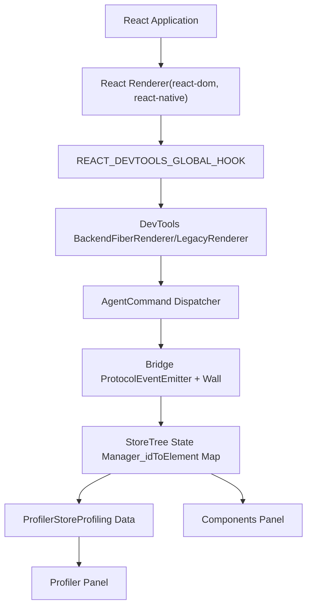
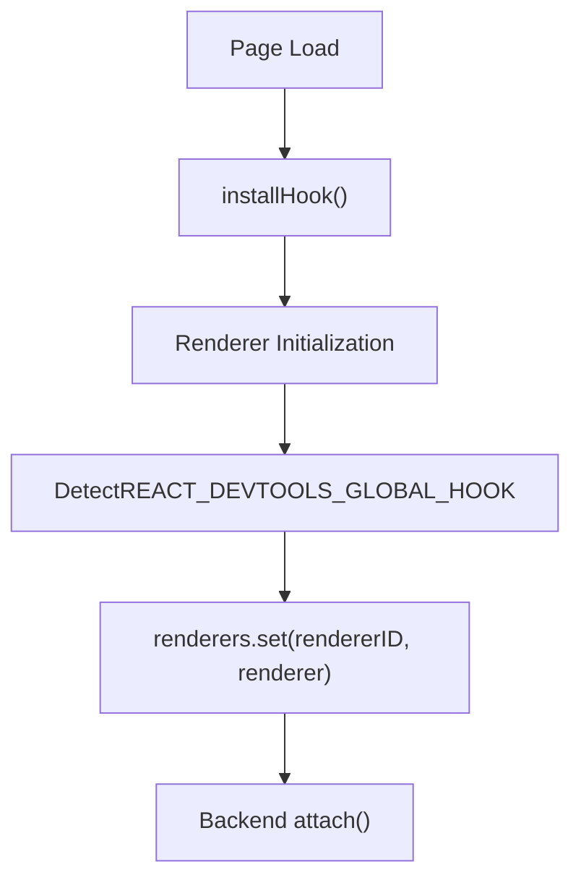
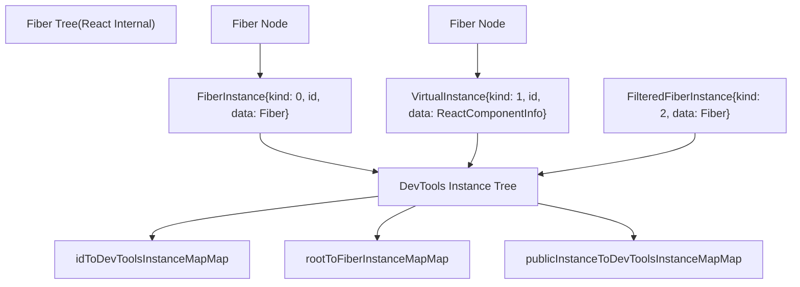
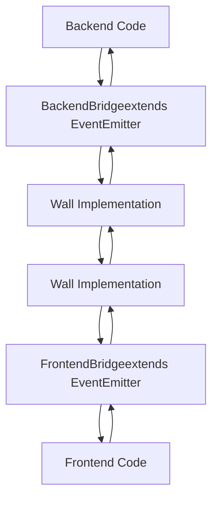
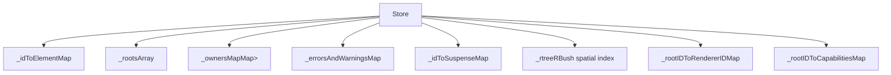
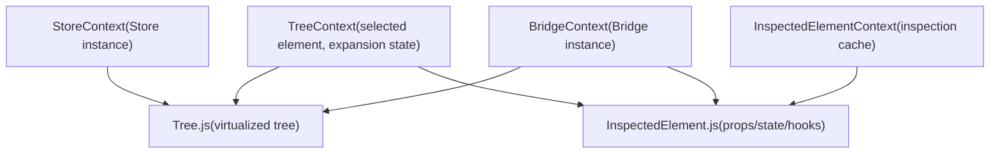
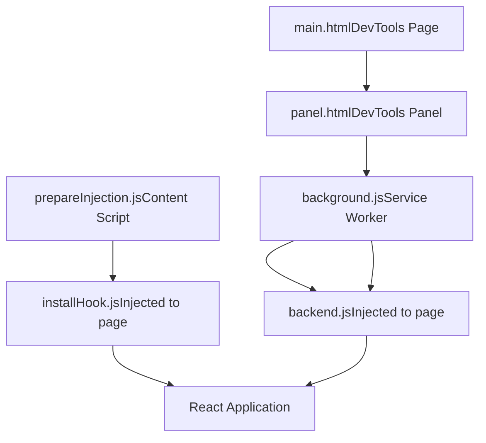
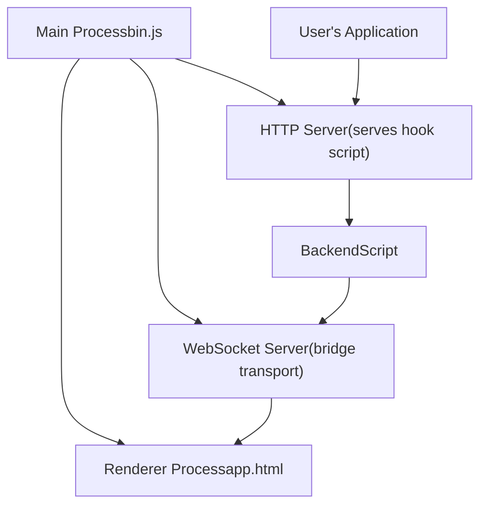

# React DevTools Architecture

Relevant source files

-   [fixtures/devtools/standalone/index.html](https://github.com/facebook/react/blob/65eec428/fixtures/devtools/standalone/index.html)
-   [packages/react-devtools-shared/src/\_\_tests\_\_/inspectedElement-test.js](https://github.com/facebook/react/blob/65eec428/packages/react-devtools-shared/src/__tests__/inspectedElement-test.js)
-   [packages/react-devtools-shared/src/\_\_tests\_\_/legacy/inspectElement-test.js](https://github.com/facebook/react/blob/65eec428/packages/react-devtools-shared/src/__tests__/legacy/inspectElement-test.js)
-   [packages/react-devtools-shared/src/\_\_tests\_\_/store-test.js](https://github.com/facebook/react/blob/65eec428/packages/react-devtools-shared/src/__tests__/store-test.js)
-   [packages/react-devtools-shared/src/backend/StyleX/\_\_tests\_\_/utils-test.js](https://github.com/facebook/react/blob/65eec428/packages/react-devtools-shared/src/backend/StyleX/__tests__/utils-test.js)
-   [packages/react-devtools-shared/src/backend/StyleX/utils.js](https://github.com/facebook/react/blob/65eec428/packages/react-devtools-shared/src/backend/StyleX/utils.js)
-   [packages/react-devtools-shared/src/backend/agent.js](https://github.com/facebook/react/blob/65eec428/packages/react-devtools-shared/src/backend/agent.js)
-   [packages/react-devtools-shared/src/backend/fiber/renderer.js](https://github.com/facebook/react/blob/65eec428/packages/react-devtools-shared/src/backend/fiber/renderer.js)
-   [packages/react-devtools-shared/src/backend/legacy/renderer.js](https://github.com/facebook/react/blob/65eec428/packages/react-devtools-shared/src/backend/legacy/renderer.js)
-   [packages/react-devtools-shared/src/backend/types.js](https://github.com/facebook/react/blob/65eec428/packages/react-devtools-shared/src/backend/types.js)
-   [packages/react-devtools-shared/src/backend/views/Highlighter/index.js](https://github.com/facebook/react/blob/65eec428/packages/react-devtools-shared/src/backend/views/Highlighter/index.js)
-   [packages/react-devtools-shared/src/backendAPI.js](https://github.com/facebook/react/blob/65eec428/packages/react-devtools-shared/src/backendAPI.js)
-   [packages/react-devtools-shared/src/bridge.js](https://github.com/facebook/react/blob/65eec428/packages/react-devtools-shared/src/bridge.js)
-   [packages/react-devtools-shared/src/constants.js](https://github.com/facebook/react/blob/65eec428/packages/react-devtools-shared/src/constants.js)
-   [packages/react-devtools-shared/src/devtools/constants.js](https://github.com/facebook/react/blob/65eec428/packages/react-devtools-shared/src/devtools/constants.js)
-   [packages/react-devtools-shared/src/devtools/store.js](https://github.com/facebook/react/blob/65eec428/packages/react-devtools-shared/src/devtools/store.js)
-   [packages/react-devtools-shared/src/devtools/views/ButtonIcon.js](https://github.com/facebook/react/blob/65eec428/packages/react-devtools-shared/src/devtools/views/ButtonIcon.js)
-   [packages/react-devtools-shared/src/devtools/views/Components/InspectedElement.js](https://github.com/facebook/react/blob/65eec428/packages/react-devtools-shared/src/devtools/views/Components/InspectedElement.js)
-   [packages/react-devtools-shared/src/devtools/views/Components/InspectedElementContextTree.js](https://github.com/facebook/react/blob/65eec428/packages/react-devtools-shared/src/devtools/views/Components/InspectedElementContextTree.js)
-   [packages/react-devtools-shared/src/devtools/views/Components/InspectedElementErrorsAndWarningsTree.js](https://github.com/facebook/react/blob/65eec428/packages/react-devtools-shared/src/devtools/views/Components/InspectedElementErrorsAndWarningsTree.js)
-   [packages/react-devtools-shared/src/devtools/views/Components/InspectedElementPropsTree.js](https://github.com/facebook/react/blob/65eec428/packages/react-devtools-shared/src/devtools/views/Components/InspectedElementPropsTree.js)
-   [packages/react-devtools-shared/src/devtools/views/Components/InspectedElementSharedStyles.css](https://github.com/facebook/react/blob/65eec428/packages/react-devtools-shared/src/devtools/views/Components/InspectedElementSharedStyles.css)
-   [packages/react-devtools-shared/src/devtools/views/Components/InspectedElementStateTree.js](https://github.com/facebook/react/blob/65eec428/packages/react-devtools-shared/src/devtools/views/Components/InspectedElementStateTree.js)
-   [packages/react-devtools-shared/src/devtools/views/Components/InspectedElementStyleXPlugin.js](https://github.com/facebook/react/blob/65eec428/packages/react-devtools-shared/src/devtools/views/Components/InspectedElementStyleXPlugin.js)
-   [packages/react-devtools-shared/src/devtools/views/Components/InspectedElementSuspendedBy.js](https://github.com/facebook/react/blob/65eec428/packages/react-devtools-shared/src/devtools/views/Components/InspectedElementSuspendedBy.js)
-   [packages/react-devtools-shared/src/devtools/views/Components/InspectedElementView.css](https://github.com/facebook/react/blob/65eec428/packages/react-devtools-shared/src/devtools/views/Components/InspectedElementView.css)
-   [packages/react-devtools-shared/src/devtools/views/Components/InspectedElementView.js](https://github.com/facebook/react/blob/65eec428/packages/react-devtools-shared/src/devtools/views/Components/InspectedElementView.js)
-   [packages/react-devtools-shared/src/devtools/views/Profiler/CommitTreeBuilder.js](https://github.com/facebook/react/blob/65eec428/packages/react-devtools-shared/src/devtools/views/Profiler/CommitTreeBuilder.js)
-   [packages/react-devtools-shared/src/devtools/views/Settings/SettingsContext.js](https://github.com/facebook/react/blob/65eec428/packages/react-devtools-shared/src/devtools/views/Settings/SettingsContext.js)
-   [packages/react-devtools-shared/src/devtools/views/SuspenseTab/SuspenseBreadcrumbs.js](https://github.com/facebook/react/blob/65eec428/packages/react-devtools-shared/src/devtools/views/SuspenseTab/SuspenseBreadcrumbs.js)
-   [packages/react-devtools-shared/src/devtools/views/SuspenseTab/SuspenseEnvironmentColors.css](https://github.com/facebook/react/blob/65eec428/packages/react-devtools-shared/src/devtools/views/SuspenseTab/SuspenseEnvironmentColors.css)
-   [packages/react-devtools-shared/src/devtools/views/SuspenseTab/SuspenseEnvironmentColors.js](https://github.com/facebook/react/blob/65eec428/packages/react-devtools-shared/src/devtools/views/SuspenseTab/SuspenseEnvironmentColors.js)
-   [packages/react-devtools-shared/src/devtools/views/SuspenseTab/SuspenseRects.css](https://github.com/facebook/react/blob/65eec428/packages/react-devtools-shared/src/devtools/views/SuspenseTab/SuspenseRects.css)
-   [packages/react-devtools-shared/src/devtools/views/SuspenseTab/SuspenseRects.js](https://github.com/facebook/react/blob/65eec428/packages/react-devtools-shared/src/devtools/views/SuspenseTab/SuspenseRects.js)
-   [packages/react-devtools-shared/src/devtools/views/SuspenseTab/SuspenseScrubber.css](https://github.com/facebook/react/blob/65eec428/packages/react-devtools-shared/src/devtools/views/SuspenseTab/SuspenseScrubber.css)
-   [packages/react-devtools-shared/src/devtools/views/SuspenseTab/SuspenseScrubber.js](https://github.com/facebook/react/blob/65eec428/packages/react-devtools-shared/src/devtools/views/SuspenseTab/SuspenseScrubber.js)
-   [packages/react-devtools-shared/src/devtools/views/SuspenseTab/SuspenseTab.css](https://github.com/facebook/react/blob/65eec428/packages/react-devtools-shared/src/devtools/views/SuspenseTab/SuspenseTab.css)
-   [packages/react-devtools-shared/src/devtools/views/SuspenseTab/SuspenseTab.js](https://github.com/facebook/react/blob/65eec428/packages/react-devtools-shared/src/devtools/views/SuspenseTab/SuspenseTab.js)
-   [packages/react-devtools-shared/src/devtools/views/SuspenseTab/SuspenseTimeline.css](https://github.com/facebook/react/blob/65eec428/packages/react-devtools-shared/src/devtools/views/SuspenseTab/SuspenseTimeline.css)
-   [packages/react-devtools-shared/src/devtools/views/SuspenseTab/SuspenseTimeline.js](https://github.com/facebook/react/blob/65eec428/packages/react-devtools-shared/src/devtools/views/SuspenseTab/SuspenseTimeline.js)
-   [packages/react-devtools-shared/src/devtools/views/SuspenseTab/SuspenseTreeContext.js](https://github.com/facebook/react/blob/65eec428/packages/react-devtools-shared/src/devtools/views/SuspenseTab/SuspenseTreeContext.js)
-   [packages/react-devtools-shared/src/devtools/views/Toggle.css](https://github.com/facebook/react/blob/65eec428/packages/react-devtools-shared/src/devtools/views/Toggle.css)
-   [packages/react-devtools-shared/src/devtools/views/hooks.js](https://github.com/facebook/react/blob/65eec428/packages/react-devtools-shared/src/devtools/views/hooks.js)
-   [packages/react-devtools-shared/src/devtools/views/root.css](https://github.com/facebook/react/blob/65eec428/packages/react-devtools-shared/src/devtools/views/root.css)
-   [packages/react-devtools-shared/src/devtools/views/useInferredName.js](https://github.com/facebook/react/blob/65eec428/packages/react-devtools-shared/src/devtools/views/useInferredName.js)
-   [packages/react-devtools-shared/src/devtools/views/utils.js](https://github.com/facebook/react/blob/65eec428/packages/react-devtools-shared/src/devtools/views/utils.js)
-   [packages/react-devtools-shared/src/frontend/types.js](https://github.com/facebook/react/blob/65eec428/packages/react-devtools-shared/src/frontend/types.js)
-   [packages/react-devtools-shared/src/hydration.js](https://github.com/facebook/react/blob/65eec428/packages/react-devtools-shared/src/hydration.js)
-   [packages/react-devtools-shared/src/utils.js](https://github.com/facebook/react/blob/65eec428/packages/react-devtools-shared/src/utils.js)
-   [packages/react-devtools-shell/src/app/InspectableElements/SimpleValues.js](https://github.com/facebook/react/blob/65eec428/packages/react-devtools-shell/src/app/InspectableElements/SimpleValues.js)
-   [packages/react-devtools-shell/src/app/InspectableElements/SymbolKeys.js](https://github.com/facebook/react/blob/65eec428/packages/react-devtools-shell/src/app/InspectableElements/SymbolKeys.js)
-   [packages/react-devtools-shell/src/app/InspectableElements/UnserializableProps.js](https://github.com/facebook/react/blob/65eec428/packages/react-devtools-shell/src/app/InspectableElements/UnserializableProps.js)
-   [packages/shared/ReactIODescription.js](https://github.com/facebook/react/blob/65eec428/packages/shared/ReactIODescription.js)

## Purpose and Scope

This document describes the architecture of React DevTools, the debugging and profiling tooling for React applications. It covers the three-tier architecture (Backend, Bridge, Frontend), the instrumentation mechanism, the bridge protocol for cross-context communication, and the various distribution channels (browser extensions, standalone app, inline embedding).

For information about the ESLint plugin for React hooks, see [7.2](/facebook/react/7.2-devtools-distribution-and-integration). For details about React's internal reconciler and Fiber architecture that DevTools instruments, see [4.1](/facebook/react/4.1-fiber-architecture-and-data-structures).

---

## High-Level Architecture

React DevTools uses a **three-tier architecture** that separates concerns between application instrumentation, communication, and user interface:


**Sources:**

-   [packages/react-devtools-shared/src/backend/fiber/renderer.js1007-1014](https://github.com/facebook/react/blob/65eec428/packages/react-devtools-shared/src/backend/fiber/renderer.js#L1007-L1014)
-   [packages/react-devtools-shared/src/backend/agent.js263-276](https://github.com/facebook/react/blob/65eec428/packages/react-devtools-shared/src/backend/agent.js#L263-L276)
-   [packages/react-devtools-shared/src/devtools/store.js143-169](https://github.com/facebook/react/blob/65eec428/packages/react-devtools-shared/src/devtools/store.js#L143-L169)
-   [packages/react-devtools-shared/src/hook.js58-68](https://github.com/facebook/react/blob/65eec428/packages/react-devtools-shared/src/hook.js#L58-L68)

The architecture separates concerns:

-   **Backend** runs in the same JavaScript context as the React application, instrumenting the reconciler
-   **Bridge** provides version-agnostic message passing between backend and frontend
-   **Frontend** runs in a separate context (extension panel, standalone window, or embedded iframe) and provides the UI

---

## Backend Architecture

### Global Hook Injection

The DevTools backend uses a global hook installed on `window.__REACT_DEVTOOLS_GLOBAL_HOOK__` to intercept React renderer initialization. This hook is a de facto public API that React renderers detect and call during initialization.


**Sources:**

-   [packages/react-devtools-shared/src/hook.js58-68](https://github.com/facebook/react/blob/65eec428/packages/react-devtools-shared/src/hook.js#L58-L68)
-   [packages/react-devtools-shared/src/backend/fiber/renderer.js1007-1028](https://github.com/facebook/react/blob/65eec428/packages/react-devtools-shared/src/backend/fiber/renderer.js#L1007-L1028)

The hook is installed early, before React loads, by:

-   **Browser extensions**: injected via content script [packages/react-devtools-extensions/chrome/manifest.json54-64](https://github.com/facebook/react/blob/65eec428/packages/react-devtools-extensions/chrome/manifest.json#L54-L64)
-   **Standalone app**: served from local HTTP server [packages/react-devtools-core/package.json12-16](https://github.com/facebook/react/blob/65eec428/packages/react-devtools-core/package.json#L12-L16)
-   **Inline embedding**: included in the page bundle [packages/react-devtools-inline/package.json12-17](https://github.com/facebook/react/blob/65eec428/packages/react-devtools-inline/package.json#L12-L17)

### Backend Renderer Interface

The backend provides a `RendererInterface` that handles all interactions with a specific React renderer:

| Method | Purpose |
| --- | --- |
| `flushInitialOperations()` | Send initial tree state to frontend |
| `findHostInstancesForElementID()` | Map DevTools element ID to DOM/host instances |
| `inspectElement()` | Retrieve detailed props/state/hooks for an element |
| `overrideProps()` / `overrideHookState()` | Live-edit component data |
| `getProfilingData()` | Collect profiling measurements |
| `setTraceUpdatesEnabled()` | Enable/disable render highlighting |

**Sources:**

-   [packages/react-devtools-shared/src/backend/types.js412-455](https://github.com/facebook/react/blob/65eec428/packages/react-devtools-shared/src/backend/types.js#L412-L455)
-   [packages/react-devtools-shared/src/backend/fiber/renderer.js1007-1425](https://github.com/facebook/react/blob/65eec428/packages/react-devtools-shared/src/backend/fiber/renderer.js#L1007-L1425)

### Fiber Tree Instrumentation

The backend instruments React's Fiber reconciler by creating a parallel data structure that mirrors the component tree. For each Fiber, the backend creates either a `FiberInstance`, `VirtualInstance`, or `FilteredFiberInstance`:


**Sources:**

-   [packages/react-devtools-shared/src/backend/fiber/renderer.js185-293](https://github.com/facebook/react/blob/65eec428/packages/react-devtools-shared/src/backend/fiber/renderer.js#L185-L293)
-   [packages/react-devtools-shared/src/backend/fiber/renderer.js864-888](https://github.com/facebook/react/blob/65eec428/packages/react-devtools-shared/src/backend/fiber/renderer.js#L864-L888)

Instance types:

-   **FiberInstance** (`kind: 0`): Represents a stateful Fiber pair (current/work-in-progress) for client components
-   **VirtualInstance** (`kind: 1`): Represents server components or optimized-away components that don't create Fibers
-   **FilteredFiberInstance** (`kind: 2`): Hidden by component filters but tracked to find host instances

### Tree Operations Protocol

The backend sends tree mutations to the frontend as compact numeric arrays called **operations**. Each operation is prefixed with an operation code:

| Operation Code | Constant | Purpose |
| --- | --- | --- |
| `1` | `TREE_OPERATION_ADD` | Add new element to tree |
| `2` | `TREE_OPERATION_REMOVE` | Remove element(s) from tree |
| `3` | `TREE_OPERATION_REORDER_CHILDREN` | Reorder children of an element |
| `4` | `TREE_OPERATION_UPDATE_TREE_BASE_DURATION` | Update profiling duration |
| `5` | `TREE_OPERATION_UPDATE_ERRORS_OR_WARNINGS` | Update error/warning counts |
| `7` | `TREE_OPERATION_SET_SUBTREE_MODE` | Update StrictMode status |
| `8` | `SUSPENSE_TREE_OPERATION_ADD` | Add Suspense boundary |
| `12` | `SUSPENSE_TREE_OPERATION_SUSPENDERS` | Update Suspense state |

**Sources:**

-   [packages/react-devtools-shared/src/constants.js20-32](https://github.com/facebook/react/blob/65eec428/packages/react-devtools-shared/src/constants.js#L20-L32)
-   [packages/react-devtools-shared/src/utils.js224-464](https://github.com/facebook/react/blob/65eec428/packages/react-devtools-shared/src/utils.js#L224-L464)

Operations include a string table to avoid repetition:

```
[rendererID, rootID, stringTableSize, ...encodedStrings, ...operations]
```
This compact format minimizes serialization overhead when sending tree updates across the bridge.

**Sources:**

-   [packages/react-devtools-shared/src/backend/fiber/renderer.js1426-1600](https://github.com/facebook/react/blob/65eec428/packages/react-devtools-shared/src/backend/fiber/renderer.js#L1426-L1600)

---

## Bridge Protocol

### Protocol Versioning

The bridge uses a versioned protocol to handle compatibility between different DevTools versions. The protocol version is negotiated on connection:

> **[Mermaid sequence]**
> *(图表结构无法解析)*

**Sources:**

-   [packages/react-devtools-shared/src/bridge.js36-73](https://github.com/facebook/react/blob/65eec428/packages/react-devtools-shared/src/bridge.js#L36-L73)
-   [packages/react-devtools-shared/src/devtools/store.js273-320](https://github.com/facebook/react/blob/65eec428/packages/react-devtools-shared/src/devtools/store.js#L273-L320)

The `BRIDGE_PROTOCOL` array defines version history with NPM version ranges:

```
// Protocol version 2 added StrictMode support
{
  version: 2,
  minNpmVersion: '4.22.0',
  maxNpmVersion: null,
}
```
**Sources:**

-   [packages/react-devtools-shared/src/bridge.js47-70](https://github.com/facebook/react/blob/65eec428/packages/react-devtools-shared/src/bridge.js#L47-L70)

### Message Passing

The bridge is built on two abstractions:

-   **EventEmitter**: For typed event handling with `addListener()` / `emit()`
-   **Wall**: For low-level message transport with `send()` / `listen()`


**Sources:**

-   [packages/react-devtools-shared/src/bridge.js1-10](https://github.com/facebook/react/blob/65eec428/packages/react-devtools-shared/src/bridge.js#L1-L10)
-   [packages/react-devtools-shared/src/backend/agent.js307-356](https://github.com/facebook/react/blob/65eec428/packages/react-devtools-shared/src/backend/agent.js#L307-L356)

### Transport Implementations

The Wall abstraction enables different transport mechanisms for different environments:

| Environment | Wall Implementation | Transport Mechanism |
| --- | --- | --- |
| Browser Extension | `chrome.runtime.connect()` | Chrome extension messaging |
| Standalone App | WebSocket | TCP socket over localhost |
| Inline Embedding | `window.postMessage()` | Same-page iframe messaging |
| React Native | WebSocket or Metro | RN debugging protocol |

**Sources:**

-   [packages/react-devtools-extensions/chrome/manifest.json1-65](https://github.com/facebook/react/blob/65eec428/packages/react-devtools-extensions/chrome/manifest.json#L1-L65)
-   [packages/react-devtools-core/package.json1-38](https://github.com/facebook/react/blob/65eec428/packages/react-devtools-core/package.json#L1-L38)
-   [packages/react-devtools-inline/package.json1-52](https://github.com/facebook/react/blob/65eec428/packages/react-devtools-inline/package.json#L1-L52)

---

## Frontend Architecture

### Store

The `Store` class is the single source of truth for the component tree state on the frontend. It processes operations from the backend and maintains several maps:


**Sources:**

-   [packages/react-devtools-shared/src/devtools/store.js143-272](https://github.com/facebook/react/blob/65eec428/packages/react-devtools-shared/src/devtools/store.js#L143-L272)
-   [packages/react-devtools-shared/src/devtools/store.js197-236](https://github.com/facebook/react/blob/65eec428/packages/react-devtools-shared/src/devtools/store.js#L197-L236)

The Store processes operations in `onBridgeOperations()`:

1.  Parse string table from operations array
2.  Iterate through operations
3.  For each operation type (ADD, REMOVE, etc.), update internal maps
4.  Emit `mutated` event to trigger UI updates

**Sources:**

-   [packages/react-devtools-shared/src/devtools/store.js1139-1784](https://github.com/facebook/react/blob/65eec428/packages/react-devtools-shared/src/devtools/store.js#L1139-L1784)

### Inspected Element System

Element inspection uses a request-response pattern with caching and hydration:

> **[Mermaid sequence]**
> *(图表结构无法解析)*

**Sources:**

-   [packages/react-devtools-shared/src/backend/fiber/renderer.js2700-3200](https://github.com/facebook/react/blob/65eec428/packages/react-devtools-shared/src/backend/fiber/renderer.js#L2700-L3200)
-   [packages/react-devtools-shared/src/backendAPI.js1-300](https://github.com/facebook/react/blob/65eec428/packages/react-devtools-shared/src/backendAPI.js#L1-L300)
-   [packages/react-devtools-shared/src/hydration.js1-500](https://github.com/facebook/react/blob/65eec428/packages/react-devtools-shared/src/hydration.js#L1-L500)

The inspection system uses **dehydration** to lazily load nested data:

-   Initial inspection returns shallow data with `Dehydrated` placeholders
-   User expands a path → frontend requests that specific path
-   Backend fills in the path and sends `hydrated-path` response

**Sources:**

-   [packages/react-devtools-shared/src/hydration.js65-250](https://github.com/facebook/react/blob/65eec428/packages/react-devtools-shared/src/hydration.js#L65-L250)

### UI Components

The frontend UI is organized into major panels:

| Panel | Component | Purpose |
| --- | --- | --- |
| Components | `Components.js` | Tree view + element inspector |
| Profiler | `Profiler.js` | Commit timeline + flame graph |
| Settings | `Settings/` | DevTools configuration |
| Suspense | `SuspenseTab/` | Suspense boundary visualization (experimental) |

**Sources:**

-   [packages/react-devtools-shared/src/devtools/views/Components/](https://github.com/facebook/react/blob/65eec428/packages/react-devtools-shared/src/devtools/views/Components/)
-   [packages/react-devtools-shared/src/devtools/views/Profiler/](https://github.com/facebook/react/blob/65eec428/packages/react-devtools-shared/src/devtools/views/Profiler/)

The Components panel uses React Context for state management:


**Sources:**

-   [packages/react-devtools-shared/src/devtools/views/Components/TreeContext.js](https://github.com/facebook/react/blob/65eec428/packages/react-devtools-shared/src/devtools/views/Components/TreeContext.js)
-   [packages/react-devtools-shared/src/devtools/views/Components/InspectedElementContext.js](https://github.com/facebook/react/blob/65eec428/packages/react-devtools-shared/src/devtools/views/Components/InspectedElementContext.js)
-   [packages/react-devtools-shared/src/devtools/views/context.js](https://github.com/facebook/react/blob/65eec428/packages/react-devtools-shared/src/devtools/views/context.js)

---

## Distribution Channels

React DevTools is distributed through multiple channels, each with a different architecture:

### Browser Extensions

Browser extensions use Manifest V3 with a service worker backend:


**Sources:**

-   [packages/react-devtools-extensions/chrome/manifest.json40-64](https://github.com/facebook/react/blob/65eec428/packages/react-devtools-extensions/chrome/manifest.json#L40-L64)
-   [packages/react-devtools-extensions/firefox/manifest.json45-69](https://github.com/facebook/react/blob/65eec428/packages/react-devtools-extensions/firefox/manifest.json#L45-L69)

Extension-specific features:

-   Icon changes color based on React build type (dev/prod)
-   Popup warns if React is not detected
-   Integration with browser Elements panel for DOM node selection

**Sources:**

-   [packages/react-devtools-extensions/chrome/manifest.json14-22](https://github.com/facebook/react/blob/65eec428/packages/react-devtools-extensions/chrome/manifest.json#L14-L22)

### Standalone Application

The standalone app is an Electron application that starts a local WebSocket server:


**Sources:**

-   [packages/react-devtools/package.json11-23](https://github.com/facebook/react/blob/65eec428/packages/react-devtools/package.json#L11-L23)
-   [packages/react-devtools-core/package.json1-38](https://github.com/facebook/react/blob/65eec428/packages/react-devtools-core/package.json#L1-L38)

The user adds a script tag to their page:

```
<script src="http://localhost:8097"></script>
```
This loads the hook and backend, which connect back via WebSocket.

**Sources:**

-   [packages/react-devtools-core/](https://github.com/facebook/react/blob/65eec428/packages/react-devtools-core/)

### Inline Embedding

The inline package allows embedding DevTools directly in a web page:

```
import {initialize} from 'react-devtools-inline/frontend';
import {activate} from 'react-devtools-inline/backend';

// In application context
activate(window);

// In DevTools UI context
const DevTools = initialize(window);
```
This is used for demos, playgrounds, and React Native debugging.

**Sources:**

-   [packages/react-devtools-inline/package.json12-17](https://github.com/facebook/react/blob/65eec428/packages/react-devtools-inline/package.json#L12-L17)

### React Native Integration

React Native embeds the DevTools backend and connects via Metro bundler's WebSocket connection or custom RN debugging bridge.

**Sources:**

-   [packages/react-devtools-shared/src/backend/views/Highlighter/index.js1-20](https://github.com/facebook/react/blob/65eec428/packages/react-devtools-shared/src/backend/views/Highlighter/index.js#L1-L20)

---

## Data Flow Examples

### Component Tree Update

When a component updates, the following flow occurs:

> **[Mermaid sequence]**
> *(图表结构无法解析)*

**Sources:**

-   [packages/react-devtools-shared/src/backend/fiber/renderer.js1426-1600](https://github.com/facebook/react/blob/65eec428/packages/react-devtools-shared/src/backend/fiber/renderer.js#L1426-L1600)
-   [packages/react-devtools-shared/src/backend/agent.js567-700](https://github.com/facebook/react/blob/65eec428/packages/react-devtools-shared/src/backend/agent.js#L567-L700)
-   [packages/react-devtools-shared/src/devtools/store.js1139-1784](https://github.com/facebook/react/blob/65eec428/packages/react-devtools-shared/src/devtools/store.js#L1139-L1784)

### Element Inspection

When a user inspects an element:

> **[Mermaid sequence]**
> *(图表结构无法解析)*

**Sources:**

-   [packages/react-devtools-shared/src/backend/fiber/renderer.js2700-3200](https://github.com/facebook/react/blob/65eec428/packages/react-devtools-shared/src/backend/fiber/renderer.js#L2700-L3200)
-   [packages/react-devtools-shared/src/backend/agent.js423-500](https://github.com/facebook/react/blob/65eec428/packages/react-devtools-shared/src/backend/agent.js#L423-L500)
-   [packages/react-devtools-shared/src/backendAPI.js50-200](https://github.com/facebook/react/blob/65eec428/packages/react-devtools-shared/src/backendAPI.js#L50-L200)

### Profiling Session

The profiling flow coordinates between backend and frontend:

> **[Mermaid sequence]**
> *(图表结构无法解析)*

**Sources:**

-   [packages/react-devtools-shared/src/backend/fiber/renderer.js1105-1300](https://github.com/facebook/react/blob/65eec428/packages/react-devtools-shared/src/backend/fiber/renderer.js#L1105-L1300)
-   [packages/react-devtools-shared/src/devtools/ProfilerStore.js](https://github.com/facebook/react/blob/65eec428/packages/react-devtools-shared/src/devtools/ProfilerStore.js)

---

## Key Design Decisions

### Why Three-Tier Architecture?

The separation of backend, bridge, and frontend enables:

-   **Security isolation**: DevTools UI runs in a different context with different privileges
-   **Version independence**: Protocol versioning allows newer backends with older frontends
-   **Multiple transport layers**: Same code works across extensions, standalone, inline, and React Native

### Why Operations Arrays?

Compact numeric arrays minimize serialization overhead:

-   Strings are deduplicated via string table
-   Tree changes encoded as integers
-   No JSON parsing overhead
-   Works well with `postMessage()` structured clone algorithm

**Sources:**

-   [packages/react-devtools-shared/src/utils.js224-464](https://github.com/facebook/react/blob/65eec428/packages/react-devtools-shared/src/utils.js#L224-L464)

### Why Dehydration?

Lazy loading of nested data:

-   Initial inspection sends shallow representation
-   Deeply nested objects represented as `{inspectable: true}`
-   User expansion triggers path-specific fetch
-   Reduces initial payload size for large component trees

**Sources:**

-   [packages/react-devtools-shared/src/hydration.js65-250](https://github.com/facebook/react/blob/65eec428/packages/react-devtools-shared/src/hydration.js#L65-L250)

### Why WeakMap for Fiber Tracking?

Using WeakMaps for `internalInstanceToIDMap` prevents memory leaks:

-   Fibers can be garbage collected without explicit cleanup
-   DevTools doesn't hold strong references to unmounted components

**Sources:**

-   [packages/react-devtools-shared/src/backend/fiber/renderer.js864-873](https://github.com/facebook/react/blob/65eec428/packages/react-devtools-shared/src/backend/fiber/renderer.js#L864-L873)
