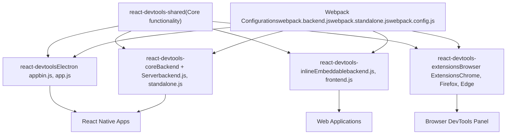
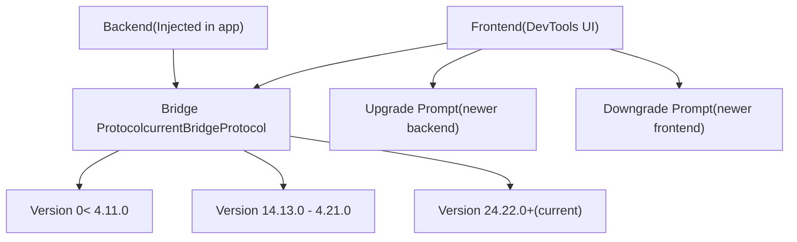
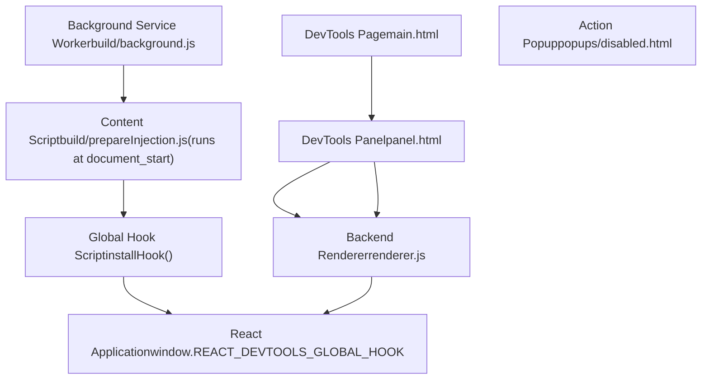
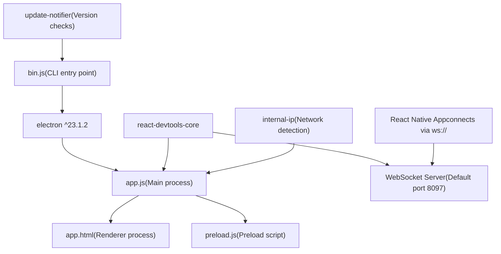
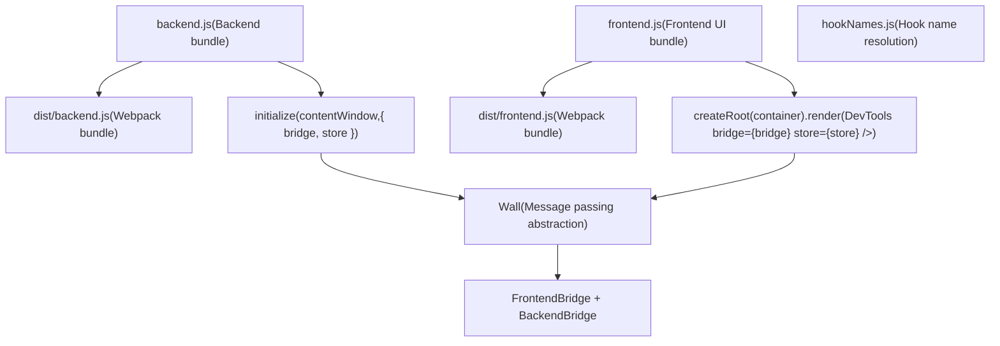
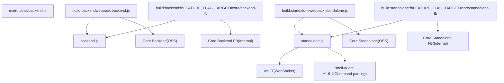
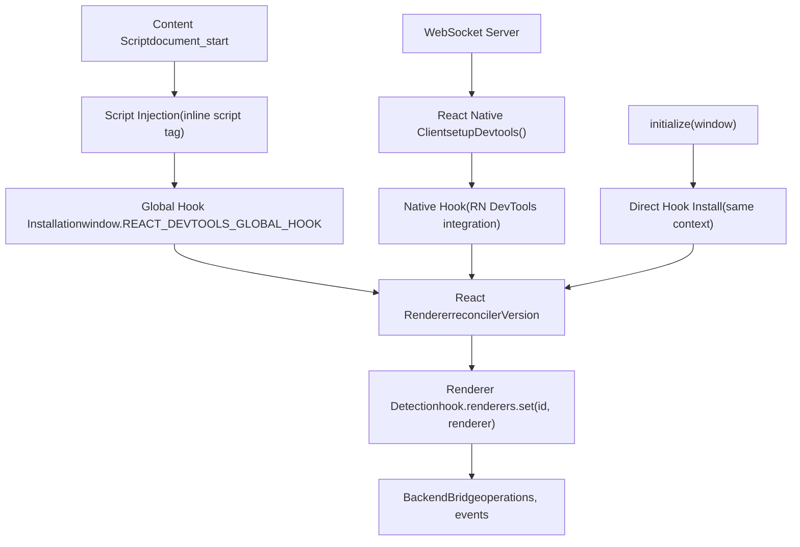
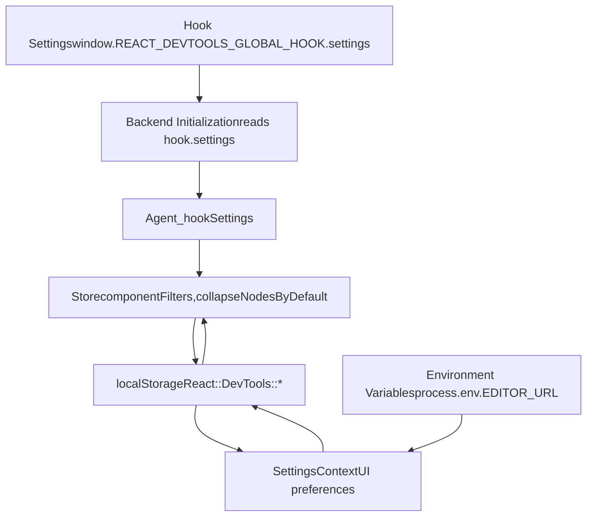

# DevTools Distribution and Integration

Relevant source files

-   [fixtures/devtools/standalone/index.html](https://github.com/facebook/react/blob/65eec428/fixtures/devtools/standalone/index.html)
-   [packages/react-devtools-core/package.json](https://github.com/facebook/react/blob/65eec428/packages/react-devtools-core/package.json)
-   [packages/react-devtools-extensions/chrome/manifest.json](https://github.com/facebook/react/blob/65eec428/packages/react-devtools-extensions/chrome/manifest.json)
-   [packages/react-devtools-extensions/edge/manifest.json](https://github.com/facebook/react/blob/65eec428/packages/react-devtools-extensions/edge/manifest.json)
-   [packages/react-devtools-extensions/firefox/manifest.json](https://github.com/facebook/react/blob/65eec428/packages/react-devtools-extensions/firefox/manifest.json)
-   [packages/react-devtools-inline/package.json](https://github.com/facebook/react/blob/65eec428/packages/react-devtools-inline/package.json)
-   [packages/react-devtools-shared/package.json](https://github.com/facebook/react/blob/65eec428/packages/react-devtools-shared/package.json)
-   [packages/react-devtools-shared/src/\_\_tests\_\_/inspectedElement-test.js](https://github.com/facebook/react/blob/65eec428/packages/react-devtools-shared/src/__tests__/inspectedElement-test.js)
-   [packages/react-devtools-shared/src/\_\_tests\_\_/legacy/inspectElement-test.js](https://github.com/facebook/react/blob/65eec428/packages/react-devtools-shared/src/__tests__/legacy/inspectElement-test.js)
-   [packages/react-devtools-shared/src/\_\_tests\_\_/store-test.js](https://github.com/facebook/react/blob/65eec428/packages/react-devtools-shared/src/__tests__/store-test.js)
-   [packages/react-devtools-shared/src/backend/StyleX/\_\_tests\_\_/utils-test.js](https://github.com/facebook/react/blob/65eec428/packages/react-devtools-shared/src/backend/StyleX/__tests__/utils-test.js)
-   [packages/react-devtools-shared/src/backend/StyleX/utils.js](https://github.com/facebook/react/blob/65eec428/packages/react-devtools-shared/src/backend/StyleX/utils.js)
-   [packages/react-devtools-shared/src/backend/agent.js](https://github.com/facebook/react/blob/65eec428/packages/react-devtools-shared/src/backend/agent.js)
-   [packages/react-devtools-shared/src/backend/fiber/renderer.js](https://github.com/facebook/react/blob/65eec428/packages/react-devtools-shared/src/backend/fiber/renderer.js)
-   [packages/react-devtools-shared/src/backend/legacy/renderer.js](https://github.com/facebook/react/blob/65eec428/packages/react-devtools-shared/src/backend/legacy/renderer.js)
-   [packages/react-devtools-shared/src/backend/types.js](https://github.com/facebook/react/blob/65eec428/packages/react-devtools-shared/src/backend/types.js)
-   [packages/react-devtools-shared/src/backend/views/Highlighter/index.js](https://github.com/facebook/react/blob/65eec428/packages/react-devtools-shared/src/backend/views/Highlighter/index.js)
-   [packages/react-devtools-shared/src/backendAPI.js](https://github.com/facebook/react/blob/65eec428/packages/react-devtools-shared/src/backendAPI.js)
-   [packages/react-devtools-shared/src/bridge.js](https://github.com/facebook/react/blob/65eec428/packages/react-devtools-shared/src/bridge.js)
-   [packages/react-devtools-shared/src/constants.js](https://github.com/facebook/react/blob/65eec428/packages/react-devtools-shared/src/constants.js)
-   [packages/react-devtools-shared/src/devtools/constants.js](https://github.com/facebook/react/blob/65eec428/packages/react-devtools-shared/src/devtools/constants.js)
-   [packages/react-devtools-shared/src/devtools/store.js](https://github.com/facebook/react/blob/65eec428/packages/react-devtools-shared/src/devtools/store.js)
-   [packages/react-devtools-shared/src/devtools/views/ButtonIcon.js](https://github.com/facebook/react/blob/65eec428/packages/react-devtools-shared/src/devtools/views/ButtonIcon.js)
-   [packages/react-devtools-shared/src/devtools/views/Components/InspectedElement.js](https://github.com/facebook/react/blob/65eec428/packages/react-devtools-shared/src/devtools/views/Components/InspectedElement.js)
-   [packages/react-devtools-shared/src/devtools/views/Components/InspectedElementContextTree.js](https://github.com/facebook/react/blob/65eec428/packages/react-devtools-shared/src/devtools/views/Components/InspectedElementContextTree.js)
-   [packages/react-devtools-shared/src/devtools/views/Components/InspectedElementErrorsAndWarningsTree.js](https://github.com/facebook/react/blob/65eec428/packages/react-devtools-shared/src/devtools/views/Components/InspectedElementErrorsAndWarningsTree.js)
-   [packages/react-devtools-shared/src/devtools/views/Components/InspectedElementPropsTree.js](https://github.com/facebook/react/blob/65eec428/packages/react-devtools-shared/src/devtools/views/Components/InspectedElementPropsTree.js)
-   [packages/react-devtools-shared/src/devtools/views/Components/InspectedElementSharedStyles.css](https://github.com/facebook/react/blob/65eec428/packages/react-devtools-shared/src/devtools/views/Components/InspectedElementSharedStyles.css)
-   [packages/react-devtools-shared/src/devtools/views/Components/InspectedElementStateTree.js](https://github.com/facebook/react/blob/65eec428/packages/react-devtools-shared/src/devtools/views/Components/InspectedElementStateTree.js)
-   [packages/react-devtools-shared/src/devtools/views/Components/InspectedElementStyleXPlugin.js](https://github.com/facebook/react/blob/65eec428/packages/react-devtools-shared/src/devtools/views/Components/InspectedElementStyleXPlugin.js)
-   [packages/react-devtools-shared/src/devtools/views/Components/InspectedElementSuspendedBy.js](https://github.com/facebook/react/blob/65eec428/packages/react-devtools-shared/src/devtools/views/Components/InspectedElementSuspendedBy.js)
-   [packages/react-devtools-shared/src/devtools/views/Components/InspectedElementView.css](https://github.com/facebook/react/blob/65eec428/packages/react-devtools-shared/src/devtools/views/Components/InspectedElementView.css)
-   [packages/react-devtools-shared/src/devtools/views/Components/InspectedElementView.js](https://github.com/facebook/react/blob/65eec428/packages/react-devtools-shared/src/devtools/views/Components/InspectedElementView.js)
-   [packages/react-devtools-shared/src/devtools/views/Profiler/CommitTreeBuilder.js](https://github.com/facebook/react/blob/65eec428/packages/react-devtools-shared/src/devtools/views/Profiler/CommitTreeBuilder.js)
-   [packages/react-devtools-shared/src/devtools/views/Settings/SettingsContext.js](https://github.com/facebook/react/blob/65eec428/packages/react-devtools-shared/src/devtools/views/Settings/SettingsContext.js)
-   [packages/react-devtools-shared/src/devtools/views/SuspenseTab/SuspenseBreadcrumbs.js](https://github.com/facebook/react/blob/65eec428/packages/react-devtools-shared/src/devtools/views/SuspenseTab/SuspenseBreadcrumbs.js)
-   [packages/react-devtools-shared/src/devtools/views/SuspenseTab/SuspenseEnvironmentColors.css](https://github.com/facebook/react/blob/65eec428/packages/react-devtools-shared/src/devtools/views/SuspenseTab/SuspenseEnvironmentColors.css)
-   [packages/react-devtools-shared/src/devtools/views/SuspenseTab/SuspenseEnvironmentColors.js](https://github.com/facebook/react/blob/65eec428/packages/react-devtools-shared/src/devtools/views/SuspenseTab/SuspenseEnvironmentColors.js)
-   [packages/react-devtools-shared/src/devtools/views/SuspenseTab/SuspenseRects.css](https://github.com/facebook/react/blob/65eec428/packages/react-devtools-shared/src/devtools/views/SuspenseTab/SuspenseRects.css)
-   [packages/react-devtools-shared/src/devtools/views/SuspenseTab/SuspenseRects.js](https://github.com/facebook/react/blob/65eec428/packages/react-devtools-shared/src/devtools/views/SuspenseTab/SuspenseRects.js)
-   [packages/react-devtools-shared/src/devtools/views/SuspenseTab/SuspenseScrubber.css](https://github.com/facebook/react/blob/65eec428/packages/react-devtools-shared/src/devtools/views/SuspenseTab/SuspenseScrubber.css)
-   [packages/react-devtools-shared/src/devtools/views/SuspenseTab/SuspenseScrubber.js](https://github.com/facebook/react/blob/65eec428/packages/react-devtools-shared/src/devtools/views/SuspenseTab/SuspenseScrubber.js)
-   [packages/react-devtools-shared/src/devtools/views/SuspenseTab/SuspenseTab.css](https://github.com/facebook/react/blob/65eec428/packages/react-devtools-shared/src/devtools/views/SuspenseTab/SuspenseTab.css)
-   [packages/react-devtools-shared/src/devtools/views/SuspenseTab/SuspenseTab.js](https://github.com/facebook/react/blob/65eec428/packages/react-devtools-shared/src/devtools/views/SuspenseTab/SuspenseTab.js)
-   [packages/react-devtools-shared/src/devtools/views/SuspenseTab/SuspenseTimeline.css](https://github.com/facebook/react/blob/65eec428/packages/react-devtools-shared/src/devtools/views/SuspenseTab/SuspenseTimeline.css)
-   [packages/react-devtools-shared/src/devtools/views/SuspenseTab/SuspenseTimeline.js](https://github.com/facebook/react/blob/65eec428/packages/react-devtools-shared/src/devtools/views/SuspenseTab/SuspenseTimeline.js)
-   [packages/react-devtools-shared/src/devtools/views/SuspenseTab/SuspenseTreeContext.js](https://github.com/facebook/react/blob/65eec428/packages/react-devtools-shared/src/devtools/views/SuspenseTab/SuspenseTreeContext.js)
-   [packages/react-devtools-shared/src/devtools/views/Toggle.css](https://github.com/facebook/react/blob/65eec428/packages/react-devtools-shared/src/devtools/views/Toggle.css)
-   [packages/react-devtools-shared/src/devtools/views/hooks.js](https://github.com/facebook/react/blob/65eec428/packages/react-devtools-shared/src/devtools/views/hooks.js)
-   [packages/react-devtools-shared/src/devtools/views/root.css](https://github.com/facebook/react/blob/65eec428/packages/react-devtools-shared/src/devtools/views/root.css)
-   [packages/react-devtools-shared/src/devtools/views/useInferredName.js](https://github.com/facebook/react/blob/65eec428/packages/react-devtools-shared/src/devtools/views/useInferredName.js)
-   [packages/react-devtools-shared/src/devtools/views/utils.js](https://github.com/facebook/react/blob/65eec428/packages/react-devtools-shared/src/devtools/views/utils.js)
-   [packages/react-devtools-shared/src/frontend/types.js](https://github.com/facebook/react/blob/65eec428/packages/react-devtools-shared/src/frontend/types.js)
-   [packages/react-devtools-shared/src/hydration.js](https://github.com/facebook/react/blob/65eec428/packages/react-devtools-shared/src/hydration.js)
-   [packages/react-devtools-shared/src/utils.js](https://github.com/facebook/react/blob/65eec428/packages/react-devtools-shared/src/utils.js)
-   [packages/react-devtools-shell/src/app/InspectableElements/SimpleValues.js](https://github.com/facebook/react/blob/65eec428/packages/react-devtools-shell/src/app/InspectableElements/SimpleValues.js)
-   [packages/react-devtools-shell/src/app/InspectableElements/SymbolKeys.js](https://github.com/facebook/react/blob/65eec428/packages/react-devtools-shell/src/app/InspectableElements/SymbolKeys.js)
-   [packages/react-devtools-shell/src/app/InspectableElements/UnserializableProps.js](https://github.com/facebook/react/blob/65eec428/packages/react-devtools-shell/src/app/InspectableElements/UnserializableProps.js)
-   [packages/react-devtools-timeline/package.json](https://github.com/facebook/react/blob/65eec428/packages/react-devtools-timeline/package.json)
-   [packages/react-devtools/CHANGELOG.md](https://github.com/facebook/react/blob/65eec428/packages/react-devtools/CHANGELOG.md)
-   [packages/react-devtools/package.json](https://github.com/facebook/react/blob/65eec428/packages/react-devtools/package.json)
-   [packages/react-dom/src/\_\_tests\_\_/ReactErrorLoggingRecovery-test.js](https://github.com/facebook/react/blob/65eec428/packages/react-dom/src/__tests__/ReactErrorLoggingRecovery-test.js)
-   [packages/shared/ReactIODescription.js](https://github.com/facebook/react/blob/65eec428/packages/shared/ReactIODescription.js)
-   [packages/shared/forks/ReactFeatureFlags.readonly.js](https://github.com/facebook/react/blob/65eec428/packages/shared/forks/ReactFeatureFlags.readonly.js)
-   [scripts/jest/config.build-devtools.js](https://github.com/facebook/react/blob/65eec428/scripts/jest/config.build-devtools.js)
-   [scripts/jest/config.build.js](https://github.com/facebook/react/blob/65eec428/scripts/jest/config.build.js)

## Purpose and Scope

This document describes how React DevTools is packaged and distributed across different platforms, and how each distribution integrates with React applications. DevTools exists in multiple forms—browser extensions, a standalone Electron application, and an embeddable inline library—all sharing a common backend but using different integration strategies.

For information about the DevTools architecture and communication protocol between frontend and backend, see [React DevTools Architecture](/facebook/react/7.1-react-devtools-architecture).

## Distribution Packages Overview

React DevTools is published as four distinct npm packages, each serving different use cases:

| Package | Purpose | Primary Use Case |
| --- | --- | --- |
| `react-devtools` | Standalone Electron app | Debugging React Native apps |
| `react-devtools-core` | Backend and standalone server | Custom integrations, React Native |
| `react-devtools-inline` | Embeddable frontend + backend | Integrated developer tools in web apps |
| `react-devtools-extensions` | Browser extensions | Debugging web apps in Chrome, Firefox, Edge |

Each package shares the `react-devtools-shared` codebase but bundles it differently for its target environment.

**Diagram: Distribution Package Architecture**


Sources: [packages/react-devtools/package.json1-32](https://github.com/facebook/react/blob/65eec428/packages/react-devtools/package.json#L1-L32) [packages/react-devtools-core/package.json1-38](https://github.com/facebook/react/blob/65eec428/packages/react-devtools-core/package.json#L1-L38) [packages/react-devtools-inline/package.json1-52](https://github.com/facebook/react/blob/65eec428/packages/react-devtools-inline/package.json#L1-L52)

## Bridge Protocol and Version Compatibility

All DevTools distributions communicate using a versioned bridge protocol defined in `BRIDGE_PROTOCOL`. This enables graceful handling of version mismatches between frontend and backend.

**Protocol Version Management**

The bridge protocol uses semantic versioning to track breaking changes:


The protocol version is checked during initialization. Each version includes:

-   `version`: Protocol version number
-   `minNpmVersion`: Minimum compatible npm package version
-   `maxNpmVersion`: Maximum compatible npm package version

When incompatibility is detected, the Store sets `_unsupportedBridgeProtocolDetected` and the UI displays an appropriate message.

Sources: [packages/react-devtools-shared/src/bridge.js26-73](https://github.com/facebook/react/blob/65eec428/packages/react-devtools-shared/src/bridge.js#L26-L73) [packages/react-devtools-shared/src/devtools/store.js254-256](https://github.com/facebook/react/blob/65eec428/packages/react-devtools-shared/src/devtools/store.js#L254-L256)

## Browser Extensions

Browser extensions for Chrome, Firefox, and Edge follow Manifest V3 specifications and share most code while adapting to browser-specific APIs.

**Extension Architecture**


**Manifest Structure**

Each browser has a slightly different manifest configuration:

| Property | Chrome/Edge | Firefox | Purpose |
| --- | --- | --- | --- |
| `manifest_version` | 3 | 3 | Manifest V3 for all browsers |
| `background` | `service_worker` | `scripts` | Background script execution model |
| `permissions` | tabs, storage, scripting | tabs, storage, scripting, clipboardWrite | Required permissions |
| `optional_permissions` | clipboardWrite | \- | User-granted permissions |
| `browser_specific_settings` | \- | gecko.id, strict\_min\_version | Firefox-specific metadata |

**Content Script Injection**

The extension injects `prepareInjection.js` at `document_start` to ensure the global hook is available before React loads:

1.  Content script runs immediately when page loads
2.  Injects the global hook into the page context
3.  The hook intercepts React renderer registrations
4.  When DevTools panel opens, backend connects to hook

Sources: [packages/react-devtools-extensions/chrome/manifest.json1-65](https://github.com/facebook/react/blob/65eec428/packages/react-devtools-extensions/chrome/manifest.json#L1-L65) [packages/react-devtools-extensions/firefox/manifest.json1-70](https://github.com/facebook/react/blob/65eec428/packages/react-devtools-extensions/firefox/manifest.json#L1-L70) [packages/react-devtools-extensions/edge/manifest.json1-65](https://github.com/facebook/react/blob/65eec428/packages/react-devtools-extensions/edge/manifest.json#L1-L65)

## Standalone Electron Application

The `react-devtools` package provides a standalone Electron application for debugging React Native applications.

**Package Structure**


**Startup Flow**

When running `react-devtools` from the command line:

1.  `bin.js` checks for updates via `update-notifier`
2.  Spawns Electron with `app.js` as entry point
3.  `app.js` starts a WebSocket server using `react-devtools-core`
4.  Creates Electron window loading `app.html`
5.  React Native app connects to WebSocket server
6.  Frontend and backend communicate over WebSocket bridge

**Command-Line Options**

The standalone app supports these options:

-   `--port`: WebSocket server port (default: 8097)
-   `--host`: Host to bind to (default: localhost)
-   `--https`: Use HTTPS for secure connections
-   `--react-devtools-port`: Alternative port specification

Sources: [packages/react-devtools/package.json1-32](https://github.com/facebook/react/blob/65eec428/packages/react-devtools/package.json#L1-L32) [packages/react-devtools-core/package.json1-38](https://github.com/facebook/react/blob/65eec428/packages/react-devtools-core/package.json#L1-L38)

## Inline Embeddable Library

The `react-devtools-inline` package enables embedding DevTools directly into web applications, useful for development environments and internal tools.

**Package Exports**


**Integration Example**

To embed DevTools inline:

```
// Backend initialization (in target iframe/window)
import {initialize as initBackend} from 'react-devtools-inline/backend';

// Frontend rendering (in host page)
import {initialize as initFrontend} from 'react-devtools-inline/frontend';
import {createRoot} from 'react-dom/client';

// Create bridges
const wall = {
  listen(listener) { /* handle messages */ },
  send(event, payload) { /* send messages */ }
};

// Initialize backend in target window
initBackend(targetWindow, { wall });

// Render frontend
const {bridge, store} = initFrontend(wall);
const container = document.getElementById('devtools');
createRoot(container).render(<DevTools bridge={bridge} store={store} />);
```
The inline library bundles all shared code into self-contained artifacts that can be loaded independently.

Sources: [packages/react-devtools-inline/package.json1-52](https://github.com/facebook/react/blob/65eec428/packages/react-devtools-inline/package.json#L1-L52)

## Core Library for Custom Integrations

The `react-devtools-core` package provides the backend and a standalone server for custom DevTools integrations, primarily used by React Native.

**Package Exports and Build Targets**


**Integration Modes**

The core library supports two integration modes:

1.  **Backend-only**: Import `backend.js` to inject the backend into a custom environment
2.  **Standalone server**: Import `standalone.js` to start a WebSocket server for remote connections

**WebSocket Server API**

The standalone server exposes these methods:

```
import {initialize} from 'react-devtools-core/standalone';

const server = await initialize({
  port: 8097,
  host: 'localhost',
  httpsOptions: null, // Optional TLS config
  onDisconnect: () => { /* cleanup */ },
  onError: (error) => { /* error handling */ }
});

// Server provides:
// - server.close() - Stop the server
// - server.port - Actual port (useful for port 0)
```
React Native integrates by connecting to this WebSocket server during development.

Sources: [packages/react-devtools-core/package.json1-38](https://github.com/facebook/react/blob/65eec428/packages/react-devtools-core/package.json#L1-L38)

## Backend Injection Mechanisms

The DevTools backend must be injected into the target application before React loads. Different distributions use different injection strategies.

**Injection Strategies by Distribution**


**Global Hook Interface**

All injection mechanisms install a global hook with this interface:

```
window.__REACT_DEVTOOLS_GLOBAL_HOOK__ = {
  renderers: Map<RendererID, ReactRenderer>,
  supportsFiber: true,
  inject(renderer) { /* called by React */ },
  onCommitFiberRoot(rendererID, root, priorityLevel) { /* fiber commits */ },
  onCommitFiberUnmount(rendererID, fiber) { /* fiber unmounts */ },
  // Backend connection
  backends: Map<RendererID, RendererInterface>,
  // Settings from DevTools
  settings: DevToolsHookSettings
}
```
The hook must be installed synchronously before React loads to intercept renderer registration.

**Backend Initialization Sequence**

> **[Mermaid sequence]**
> *(图表结构无法解析)*

The backend uses `Agent` to coordinate multiple `RendererInterface` instances (one per React renderer) and communicate with the frontend via the `Bridge`.

Sources: [packages/react-devtools-shared/src/backend/fiber/renderer.js1007-1014](https://github.com/facebook/react/blob/65eec428/packages/react-devtools-shared/src/backend/fiber/renderer.js#L1007-L1014) [packages/react-devtools-shared/src/backend/agent.js1-694](https://github.com/facebook/react/blob/65eec428/packages/react-devtools-shared/src/backend/agent.js#L1-L694)

## Settings and Configuration

DevTools settings can be configured in two places:

1.  **Hook Settings**: Injected before React loads via `window.__REACT_DEVTOOLS_GLOBAL_HOOK__.settings`
2.  **Frontend Settings**: Stored in localStorage and synchronized via bridge

**Settings Flow**


**Configurable Settings**

Key settings and their storage locations:

| Setting | Storage | Default | Purpose |
| --- | --- | --- | --- |
| `componentFilters` | localStorage | `[{type: ElementType, isEnabled: true}]` | Component tree filtering |
| `collapseNodesByDefault` | localStorage | `true` | Auto-collapse tree nodes |
| `recordChangeDescriptions` | localStorage | `false` | Profile change descriptions |
| `EDITOR_URL` | process.env | `'vscode://file/{path}:{line}:{column}'` | Open in editor URL pattern |
| `appendComponentStack` | hook.settings | varies | Append stacks to console |
| `breakOnConsoleErrors` | hook.settings | varies | Break on console.error |
| `showInlineWarningsAndErrors` | hook.settings | varies | Display inline errors |
| `hideConsoleLogsInStrictMode` | hook.settings | varies | Dim duplicate logs |

Settings can be provided at backend initialization time:

```
import {installHook} from 'react-devtools-core/backend';

installHook(window, {
  appendComponentStack: true,
  breakOnConsoleErrors: false,
  showInlineWarningsAndErrors: true,
  hideConsoleLogsInStrictMode: true
});
```
Sources: [packages/react-devtools-shared/src/backend/types.js519-534](https://github.com/facebook/react/blob/65eec428/packages/react-devtools-shared/src/backend/types.js#L519-L534) [packages/react-devtools-shared/src/devtools/store.js273-320](https://github.com/facebook/react/blob/65eec428/packages/react-devtools-shared/src/devtools/store.js#L273-L320) [packages/react-devtools-shared/src/devtools/views/Settings/SettingsContext.js1-196](https://github.com/facebook/react/blob/65eec428/packages/react-devtools-shared/src/devtools/views/Settings/SettingsContext.js#L1-L196)

## Distribution File Sizes and Dependencies

Each distribution has different size constraints and dependency requirements:

**Package Dependencies**

| Package | Runtime Dependencies | Dev Dependencies | Key External Deps |
| --- | --- | --- | --- |
| `react-devtools` | electron, react-devtools-core, internal-ip | \- | Large (Electron app) |
| `react-devtools-core` | ws, shell-quote | webpack, workerize-loader | Minimal |
| `react-devtools-inline` | @jridgewell/sourcemap-codec, source-map-js | webpack, babel, playwright | Medium |
| `react-devtools-extensions` | \- | webpack, babel | None (bundled) |

**Build Artifact Sizes** (approximate):

-   Browser extensions: ~1-2 MB bundled
-   Standalone app: ~100 MB (includes Electron)
-   Core backend: ~500 KB bundled
-   Inline library: ~1 MB (frontend + backend)

Extensions must minimize bundle size as Chrome Web Store has size limits. The build process uses Closure Compiler for production builds to aggressively minify and tree-shake.

Sources: [packages/react-devtools/package.json24-30](https://github.com/facebook/react/blob/65eec428/packages/react-devtools/package.json#L24-L30) [packages/react-devtools-core/package.json27-37](https://github.com/facebook/react/blob/65eec428/packages/react-devtools-core/package.json#L27-L37) [packages/react-devtools-inline/package.json24-51](https://github.com/facebook/react/blob/65eec428/packages/react-devtools-inline/package.json#L24-L51)
