# ESLint Plugin for React Hooks

Relevant source files

-   [CHANGELOG.md](https://github.com/facebook/react/blob/65eec428/CHANGELOG.md)
-   [packages/eslint-plugin-react-hooks/CHANGELOG.md](https://github.com/facebook/react/blob/65eec428/packages/eslint-plugin-react-hooks/CHANGELOG.md)
-   [packages/eslint-plugin-react-hooks/README.md](https://github.com/facebook/react/blob/65eec428/packages/eslint-plugin-react-hooks/README.md)
-   [packages/eslint-plugin-react-hooks/\_\_tests\_\_/ESLintRuleExhaustiveDeps-test.js](https://github.com/facebook/react/blob/65eec428/packages/eslint-plugin-react-hooks/__tests__/ESLintRuleExhaustiveDeps-test.js)
-   [packages/eslint-plugin-react-hooks/\_\_tests\_\_/ESLintRulesOfHooks-test.js](https://github.com/facebook/react/blob/65eec428/packages/eslint-plugin-react-hooks/__tests__/ESLintRulesOfHooks-test.js)
-   [packages/eslint-plugin-react-hooks/babel.config.js](https://github.com/facebook/react/blob/65eec428/packages/eslint-plugin-react-hooks/babel.config.js)
-   [packages/eslint-plugin-react-hooks/index.js](https://github.com/facebook/react/blob/65eec428/packages/eslint-plugin-react-hooks/index.js)
-   [packages/eslint-plugin-react-hooks/jest.config.js](https://github.com/facebook/react/blob/65eec428/packages/eslint-plugin-react-hooks/jest.config.js)
-   [packages/eslint-plugin-react-hooks/npm/index.js](https://github.com/facebook/react/blob/65eec428/packages/eslint-plugin-react-hooks/npm/index.js)
-   [packages/eslint-plugin-react-hooks/src/rules/ExhaustiveDeps.ts](https://github.com/facebook/react/blob/65eec428/packages/eslint-plugin-react-hooks/src/rules/ExhaustiveDeps.ts)
-   [packages/eslint-plugin-react-hooks/src/rules/RulesOfHooks.ts](https://github.com/facebook/react/blob/65eec428/packages/eslint-plugin-react-hooks/src/rules/RulesOfHooks.ts)
-   [packages/eslint-plugin-react-hooks/src/shared/Utils.ts](https://github.com/facebook/react/blob/65eec428/packages/eslint-plugin-react-hooks/src/shared/Utils.ts)
-   [packages/eslint-plugin-react-hooks/src/types/estree.d.ts](https://github.com/facebook/react/blob/65eec428/packages/eslint-plugin-react-hooks/src/types/estree.d.ts)
-   [packages/eslint-plugin-react-hooks/src/types/global.d.ts](https://github.com/facebook/react/blob/65eec428/packages/eslint-plugin-react-hooks/src/types/global.d.ts)
-   [packages/eslint-plugin-react-hooks/tsconfig.json](https://github.com/facebook/react/blob/65eec428/packages/eslint-plugin-react-hooks/tsconfig.json)

## Purpose and Scope

This document covers the `eslint-plugin-react-hooks` package, an official ESLint plugin that statically analyzes React code to enforce the [Rules of Hooks](https://react.dev/reference/rules/rules-of-hooks) and validate Hook dependency arrays. The plugin provides two core rules (`rules-of-hooks` and `exhaustive-deps`) that catch common mistakes before runtime by analyzing component and Hook code paths.

For information about the runtime Hooks implementation and dispatcher mechanism, see [React Hooks System](/facebook/react/4.3-react-hooks-system). For DevTools integration that observes Hooks at runtime, see [React DevTools Architecture](/facebook/react/7.1-react-devtools-architecture).

## Plugin Architecture and Entry Points

The plugin is structured as a standard ESLint plugin with rules, configurations, and shared utilities. It exports rules, presets, and metadata through a single entry point.

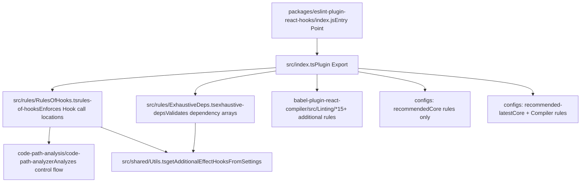
**Sources:** [packages/eslint-plugin-react-hooks/index.js1](https://github.com/facebook/react/blob/65eec428/packages/eslint-plugin-react-hooks/index.js#L1-L1) [packages/eslint-plugin-react-hooks/README.md1-152](https://github.com/facebook/react/blob/65eec428/packages/eslint-plugin-react-hooks/README.md#L1-L152)

The plugin can be used in two configuration modes:

| Configuration Type | File | Usage |
| --- | --- | --- |
| Flat Config (ESLint 9+) | `eslint.config.js` | `import reactHooks from 'eslint-plugin-react-hooks'` |
| Legacy Config | `.eslintrc` | `"extends": ["plugin:react-hooks/recommended"]` |

**Sources:** [packages/eslint-plugin-react-hooks/README.md17-53](https://github.com/facebook/react/blob/65eec428/packages/eslint-plugin-react-hooks/README.md#L17-L53)

## Rules of Hooks Rule

### Purpose and Detection Strategy

The `rules-of-hooks` rule enforces that Hooks are only called at the top level of React components or custom Hooks, never inside conditions, loops, or nested functions. It uses ESLint's code path analysis to detect conditional or looping execution paths.

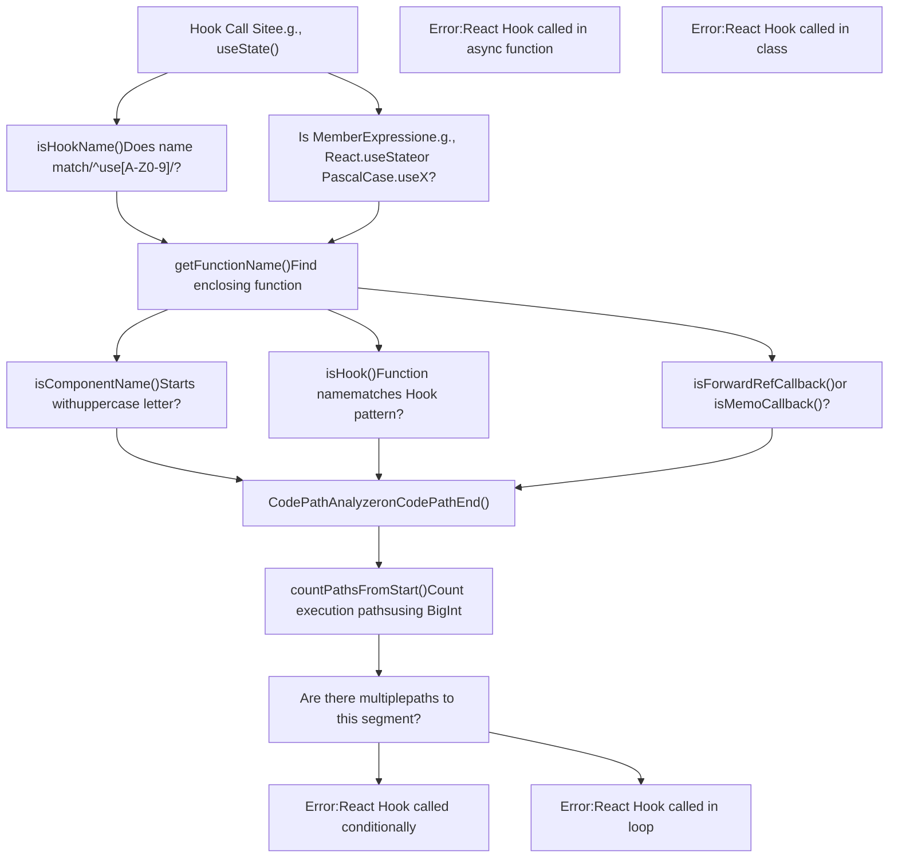
**Sources:** [packages/eslint-plugin-react-hooks/src/rules/RulesOfHooks.ts29-51](https://github.com/facebook/react/blob/65eec428/packages/eslint-plugin-react-hooks/src/rules/RulesOfHooks.ts#L29-L51) [packages/eslint-plugin-react-hooks/src/rules/RulesOfHooks.ts306-565](https://github.com/facebook/react/blob/65eec428/packages/eslint-plugin-react-hooks/src/rules/RulesOfHooks.ts#L306-L565)

### Hook Identification Logic

The rule identifies Hooks using pattern matching on function names:

| Pattern | Example | Is Hook? |
| --- | --- | --- |
| `use[A-Z0-9].*` | `useState`, `useEffect`, `use3D` | Yes |
| `React.use[A-Z0-9].*` | `React.useState` | Yes |
| `PascalCase.use[A-Z0-9].*` | `MyLib.useCustom` | Yes |
| `use` (exact) | `use` | Yes |
| `user.*` | `userFetch`, `user.name` | No |
| `_use.*` | `_useState` | No |

**Sources:** [packages/eslint-plugin-react-hooks/src/rules/RulesOfHooks.ts26-31](https://github.com/facebook/react/blob/65eec428/packages/eslint-plugin-react-hooks/src/rules/RulesOfHooks.ts#L26-L31) [packages/eslint-plugin-react-hooks/src/rules/RulesOfHooks.ts37-51](https://github.com/facebook/react/blob/65eec428/packages/eslint-plugin-react-hooks/src/rules/RulesOfHooks.ts#L37-L51)

### Component and Hook Detection

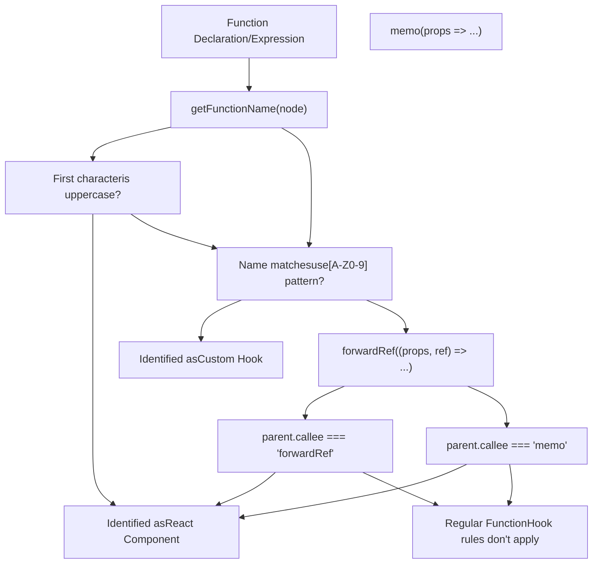
**Sources:** [packages/eslint-plugin-react-hooks/src/rules/RulesOfHooks.ts54-96](https://github.com/facebook/react/blob/65eec428/packages/eslint-plugin-react-hooks/src/rules/RulesOfHooks.ts#L54-L96) [packages/eslint-plugin-react-hooks/src/rules/RulesOfHooks.ts98-112](https://github.com/facebook/react/blob/65eec428/packages/eslint-plugin-react-hooks/src/rules/RulesOfHooks.ts#L98-L112)

### Code Path Analysis with BigInt

The rule uses a sophisticated code path analysis system that counts execution paths using `BigInt` to handle complex control flow without numeric overflow:

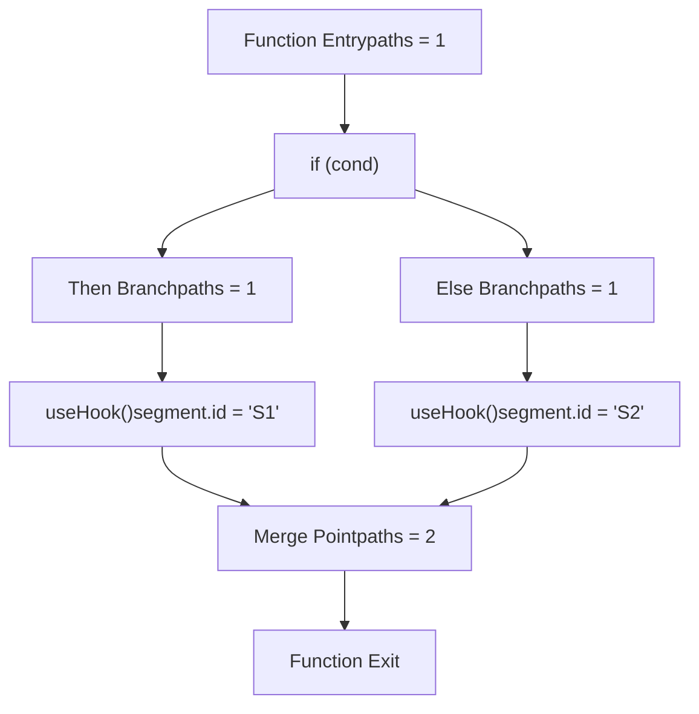
The algorithm implemented in `countPathsFromStart()` and `countPathsToEnd()`:

1.  **Caching**: Each segment's path count is cached using `Map<string, bigint>`
2.  **Cycle Detection**: Tracks visited segments in `pathHistory: Set<string>` to detect loops
3.  **Path Counting**: Recursively sums paths from all previous/next segments
4.  **Validation**: Checks if `countPathsFromStart(segment) * countPathsToEnd(segment) !== allPathsFromStartToEnd`

**Sources:** [packages/eslint-plugin-react-hooks/src/rules/RulesOfHooks.ts314-455](https://github.com/facebook/react/blob/65eec428/packages/eslint-plugin-react-hooks/src/rules/RulesOfHooks.ts#L314-L455)

### Special Cases: useEffectEvent and use()

The rule has special handling for React 19+ APIs:

| API | Behavior | Rule |
| --- | --- | --- |
| `useEffectEvent()` | Returns function callable in effects | Can be called conditionally in effects |
| `use()` | Suspends on promises | Can be called conditionally anywhere |
| `React.use()` | Same as `use()` | Can be called conditionally anywhere |

**Sources:** [packages/eslint-plugin-react-hooks/src/rules/RulesOfHooks.ts170-172](https://github.com/facebook/react/blob/65eec428/packages/eslint-plugin-react-hooks/src/rules/RulesOfHooks.ts#L170-L172) [packages/eslint-plugin-react-hooks/src/rules/RulesOfHooks.ts190-192](https://github.com/facebook/react/blob/65eec428/packages/eslint-plugin-react-hooks/src/rules/RulesOfHooks.ts#L190-L192) [packages/eslint-plugin-react-hooks/src/rules/RulesOfHooks.ts564-756](https://github.com/facebook/react/blob/65eec428/packages/eslint-plugin-react-hooks/src/rules/RulesOfHooks.ts#L564-L756)

The `useEffectEvent` validation ensures Event functions are only called within effects:

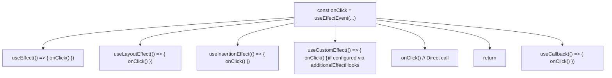
**Sources:** [packages/eslint-plugin-react-hooks/src/rules/RulesOfHooks.ts226-250](https://github.com/facebook/react/blob/65eec428/packages/eslint-plugin-react-hooks/src/rules/RulesOfHooks.ts#L226-L250) [packages/eslint-plugin-react-hooks/src/rules/RulesOfHooks.ts757-906](https://github.com/facebook/react/blob/65eec428/packages/eslint-plugin-react-hooks/src/rules/RulesOfHooks.ts#L757-L906)

## Exhaustive Dependencies Rule

### Purpose and Architecture

The `exhaustive-deps` rule validates that Hook dependency arrays (for `useEffect`, `useCallback`, `useMemo`, etc.) include all values from the component scope that are referenced inside the Hook callback. It performs static analysis to detect missing, unnecessary, or stale dependencies.

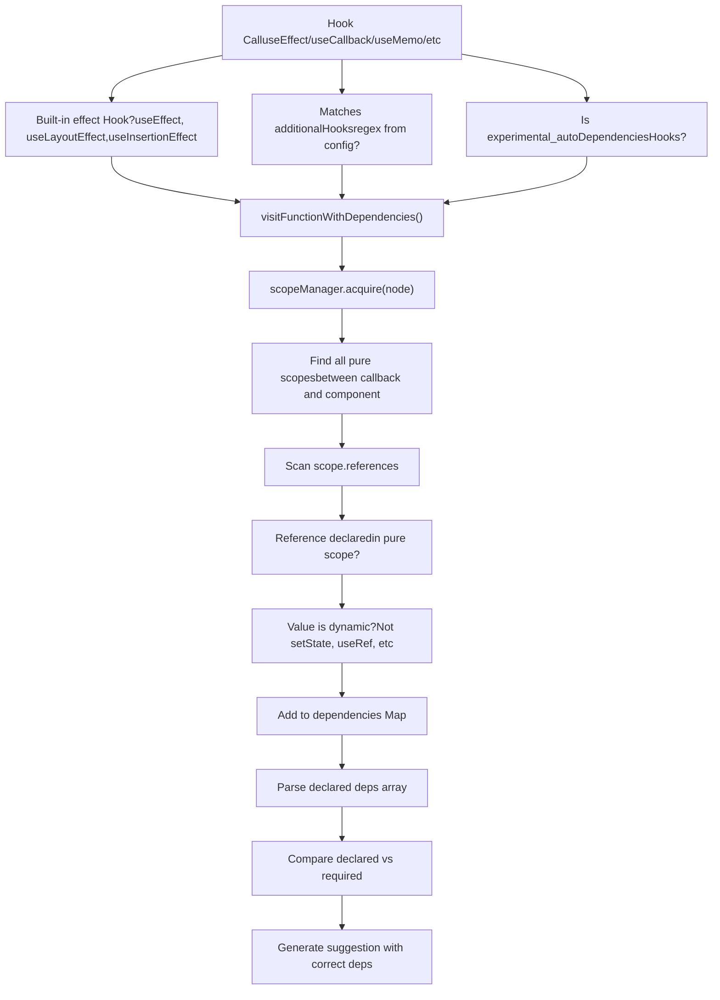
**Sources:** [packages/eslint-plugin-react-hooks/src/rules/ExhaustiveDeps.ts79-124](https://github.com/facebook/react/blob/65eec428/packages/eslint-plugin-react-hooks/src/rules/ExhaustiveDeps.ts#L79-L124) [packages/eslint-plugin-react-hooks/src/rules/ExhaustiveDeps.ts182-248](https://github.com/facebook/react/blob/65eec428/packages/eslint-plugin-react-hooks/src/rules/ExhaustiveDeps.ts#L182-L248)

### Dependency Classification

The rule classifies dependencies into stable and dynamic values:

| Value Type | Example | Stable? | Reason |
| --- | --- | --- | --- |
| `setState` from `useState` | `const [x, setX] = useState()` | Yes | React guarantees stable identity |
| `dispatch` from `useReducer` | `const [x, d] = useReducer()` | Yes | React guarantees stable identity |
| `dispatch` from `useActionState` | `const [x, d] = useActionState()` | Yes | React guarantees stable identity |
| `startTransition` from `useTransition` | `const [p, st] = useTransition()` | Yes | React guarantees stable identity |
| `ref` from `useRef` | `const ref = useRef()` | Yes | `.current` is mutable |
| Event from `useEffectEvent` | `const e = useEffectEvent()` | Yes | Should not be in deps |
| Primitive literal | `const x = 42` | Yes | Constant value |
| State variable | `const [x, _] = useState()` | No | Changes on render |
| Props | `function MyComponent(props)` | No | Can change |
| Other variables | `const x = someFunc()` | No | Assume dynamic |

**Sources:** [packages/eslint-plugin-react-hooks/src/rules/ExhaustiveDeps.ts254-404](https://github.com/facebook/react/blob/65eec428/packages/eslint-plugin-react-hooks/src/rules/ExhaustiveDeps.ts#L254-L404)

### Stable Value Detection Logic

The `isStableKnownHookValue()` function implements a memoized check:

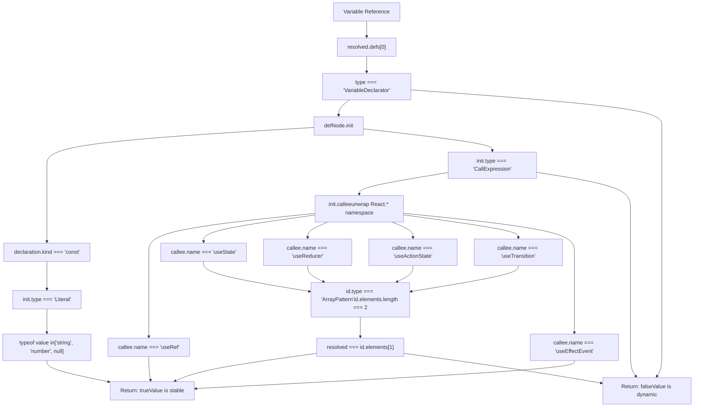
**Sources:** [packages/eslint-plugin-react-hooks/src/rules/ExhaustiveDeps.ts267-404](https://github.com/facebook/react/blob/65eec428/packages/eslint-plugin-react-hooks/src/rules/ExhaustiveDeps.ts#L267-L404)

### Scope and Pure Scope Analysis

The rule identifies "pure scopes" - scopes that re-execute on every render where dependencies can become stale:

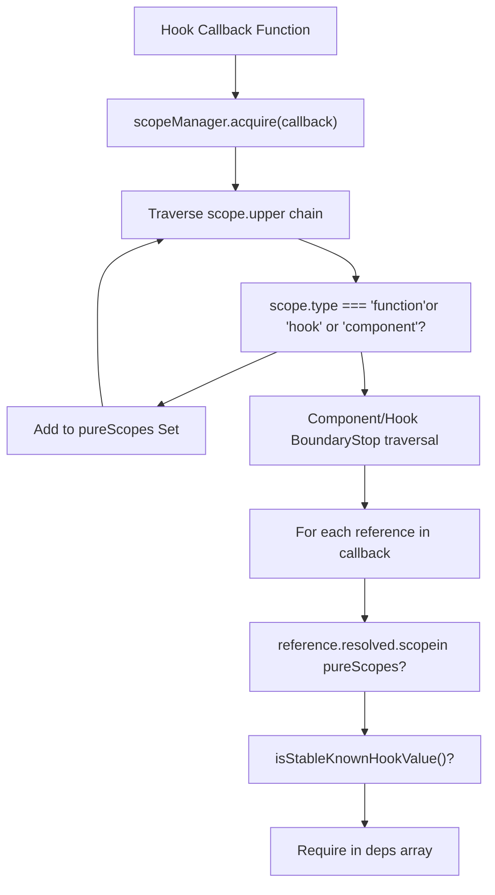
**Sources:** [packages/eslint-plugin-react-hooks/src/rules/ExhaustiveDeps.ts216-248](https://github.com/facebook/react/blob/65eec428/packages/eslint-plugin-react-hooks/src/rules/ExhaustiveDeps.ts#L216-L248)

### Dependency Tree Construction

For complex objects with property access, the rule builds a dependency tree:

| Code Pattern | Dependency Tree | Required Deps |
| --- | --- | --- |
| `obj.foo` | `{obj: {foo: {isUsed: true}}}` | `obj.foo` or `obj` |
| `obj.foo.bar` | `{obj: {foo: {bar: {isUsed: true}}}}` | `obj.foo.bar`, `obj.foo`, or `obj` |
| `obj.foo` and `obj.bar` | `{obj: {foo: {isUsed: true}, bar: {isUsed: true}}}` | `obj` (covers both) |
| `obj?.foo` | `{obj: {foo: {isUsed: true}}}` | `obj.foo` or `obj` |

The tree structure uses `DependencyTreeNode`:

```
type DependencyTreeNode = {
  isUsed: boolean;              // True if accessed in code
  isSatisfiedRecursively: boolean;  // True if in deps
  isSubtreeUsed: boolean;       // True if any child is used
  children: Map<string, DependencyTreeNode>;
};
```
**Sources:** [packages/eslint-plugin-react-hooks/src/rules/ExhaustiveDeps.ts36-41](https://github.com/facebook/react/blob/65eec428/packages/eslint-plugin-react-hooks/src/rules/ExhaustiveDeps.ts#L36-L41)

### Error Reporting and Suggestions

The rule provides detailed error messages with automatic fix suggestions:

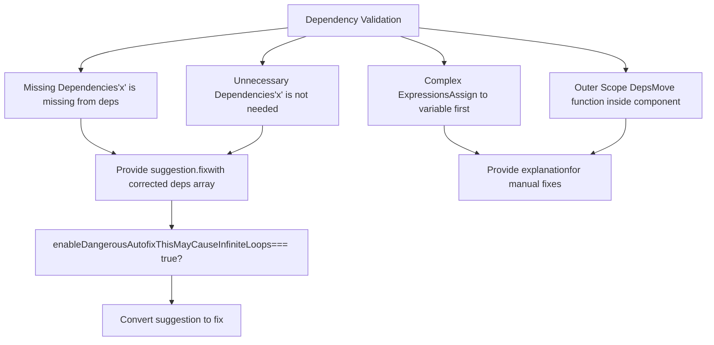
**Sources:** [packages/eslint-plugin-react-hooks/src/rules/ExhaustiveDeps.ts111-124](https://github.com/facebook/react/blob/65eec428/packages/eslint-plugin-react-hooks/src/rules/ExhaustiveDeps.ts#L111-L124)

### Configuration Options

The rule accepts several configuration options:

| Option | Type | Purpose | Default |
| --- | --- | --- | --- |
| `additionalHooks` | `string` (regex) | Pattern matching custom Hooks to validate | `undefined` |
| `enableDangerousAutofixThisMayCauseInfiniteLoops` | `boolean` | Enable auto-fix instead of suggestions | `false` |
| `experimental_autoDependenciesHooks` | `string[]` | Hooks with automatic dependency tracking | `[]` |
| `requireExplicitEffectDeps` | `boolean` | Require explicit deps even for auto-tracked Hooks | `false` |

**Sources:** [packages/eslint-plugin-react-hooks/src/rules/ExhaustiveDeps.ts54-77](https://github.com/facebook/react/blob/65eec428/packages/eslint-plugin-react-hooks/src/rules/ExhaustiveDeps.ts#L54-L77) [packages/eslint-plugin-react-hooks/src/rules/ExhaustiveDeps.ts79-109](https://github.com/facebook/react/blob/65eec428/packages/eslint-plugin-react-hooks/src/rules/ExhaustiveDeps.ts#L79-L109)

Additionally, the plugin supports shared settings via `settings['react-hooks'].additionalEffectHooks`:

**Sources:** [packages/eslint-plugin-react-hooks/src/shared/Utils.ts10-22](https://github.com/facebook/react/blob/65eec428/packages/eslint-plugin-react-hooks/src/shared/Utils.ts#L10-L22)

## Distribution and Configuration

### Package Structure

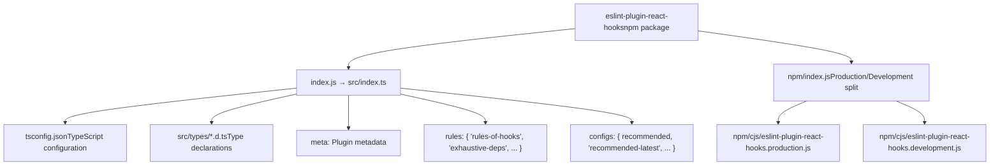
**Sources:** [packages/eslint-plugin-react-hooks/index.js1](https://github.com/facebook/react/blob/65eec428/packages/eslint-plugin-react-hooks/index.js#L1-L1) [packages/eslint-plugin-react-hooks/npm/index.js1-26](https://github.com/facebook/react/blob/65eec428/packages/eslint-plugin-react-hooks/npm/index.js#L1-L26)

### Configuration Presets

The plugin provides two main configuration presets:

| Preset | Rules Enabled | Use Case |
| --- | --- | --- |
| `recommended` | `rules-of-hooks`: error
`exhaustive-deps`: warn | Production use with core React Hooks rules |
| `recommended-latest` | All `recommended` rules
\+ React Compiler rules | Experimental React Compiler support |

Both presets are available in flat config and legacy config formats.

**Sources:** [packages/eslint-plugin-react-hooks/README.md19-41](https://github.com/facebook/react/blob/65eec428/packages/eslint-plugin-react-hooks/README.md#L19-L41) [packages/eslint-plugin-react-hooks/CHANGELOG.md8-12](https://github.com/facebook/react/blob/65eec428/packages/eslint-plugin-react-hooks/CHANGELOG.md#L8-L12)

### Version History and Breaking Changes

Major version milestones:

| Version | Key Changes |
| --- | --- |
| 7.0.0 | Removed legacy presets, enabled all compiler rules by default |
| 6.1.0 | Node.js 18+ required, flat config is default |
| 5.0.0 | Component names must start with uppercase (not just non-lowercase) |
| 4.0.0 | Check `PascalCase.useFoo()` calls, check callback bodies |
| 3.0.0 | Forbid calling Hooks from classes |

**Sources:** [packages/eslint-plugin-react-hooks/CHANGELOG.md1-161](https://github.com/facebook/react/blob/65eec428/packages/eslint-plugin-react-hooks/CHANGELOG.md#L1-L161)

Recent additions include:

-   `useEffectEvent` validation (React 19)
-   `use()` conditional calling support (React 19)
-   Settings-based configuration for `additionalEffectHooks`
-   Flow component/hook syntax support

**Sources:** [packages/eslint-plugin-react-hooks/CHANGELOG.md14-34](https://github.com/facebook/react/blob/65eec428/packages/eslint-plugin-react-hooks/CHANGELOG.md#L14-L34)

### Advanced Configuration Example

For projects with custom effect Hooks:

```
// eslint.config.js (flat config)
export default [{
  settings: {
    'react-hooks': {
      additionalEffectHooks: '(useMyEffect|useServerEffect)',
    },
  },
  rules: {
    'react-hooks/rules-of-hooks': 'error',
    'react-hooks/exhaustive-deps': ['warn', {
      additionalHooks: '(useMyCustomHook|useAnotherHook)',
    }],
  },
}];
```
**Sources:** [packages/eslint-plugin-react-hooks/README.md128-145](https://github.com/facebook/react/blob/65eec428/packages/eslint-plugin-react-hooks/README.md#L128-L145)

## Code Path Analysis Infrastructure

The rules rely on ESLint's internal code path analysis, wrapped in a custom `CodePathAnalyzer`:

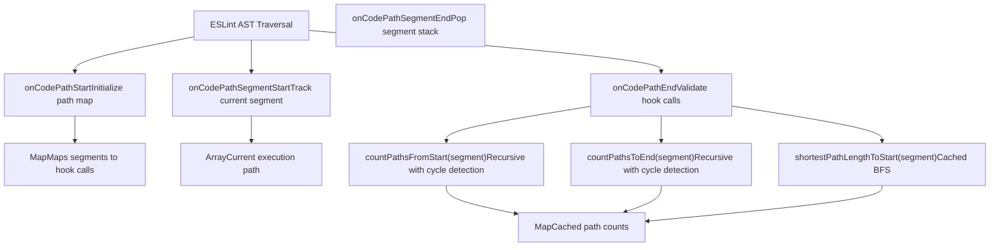
**Sources:** [packages/eslint-plugin-react-hooks/src/rules/RulesOfHooks.ts290-301](https://github.com/facebook/react/blob/65eec428/packages/eslint-plugin-react-hooks/src/rules/RulesOfHooks.ts#L290-L301)

The analyzer maintains:

-   **Code path map stack**: `Array<Map<CodePathSegment, Array<Node>>>` - one map per code path
-   **Segment stack**: `Array<CodePathSegment>` - current position during traversal
-   **Path count caches**: `Map<string, bigint>` - memoized path counts for performance

**Sources:** [packages/eslint-plugin-react-hooks/src/rules/RulesOfHooks.ts221-224](https://github.com/facebook/react/blob/65eec428/packages/eslint-plugin-react-hooks/src/rules/RulesOfHooks.ts#L221-L224) [packages/eslint-plugin-react-hooks/src/rules/RulesOfHooks.ts514-516](https://github.com/facebook/react/blob/65eec428/packages/eslint-plugin-react-hooks/src/rules/RulesOfHooks.ts#L514-L516)

### BigInt Usage for Large Control Flow

The plugin uses `BigInt` instead of `Number` to handle components with many conditional branches without overflow:

```
// Example: Component with 40+ conditions creates 2^40+ paths
// Using Number would overflow at 2^53
// BigInt handles arbitrary precision
let paths = BigInt('0');
for (const prevSegment of segment.prevSegments) {
  paths += countPathsFromStart(prevSegment, pathList);
}
```
**Sources:** [packages/eslint-plugin-react-hooks/src/rules/RulesOfHooks.ts341-388](https://github.com/facebook/react/blob/65eec428/packages/eslint-plugin-react-hooks/src/rules/RulesOfHooks.ts#L341-L388)

This prevents false negatives in large components where numeric overflow would cause the algorithm to incorrectly classify conditional hook calls as unconditional.

**Sources:** [packages/eslint-plugin-react-hooks/\_\_tests\_\_/ESLintRulesOfHooks-test.js412-481](https://github.com/facebook/react/blob/65eec428/packages/eslint-plugin-react-hooks/__tests__/ESLintRulesOfHooks-test.js#L412-L481)
