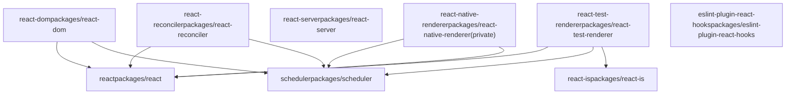
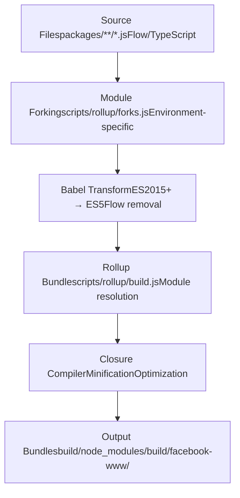

# 概览

相关源文件

-   [.gitignore](https://github.com/facebook/react/blob/65eec428/.gitignore)
-   [package.json](https://github.com/facebook/react/blob/65eec428/package.json)
-   [packages/eslint-plugin-react-hooks/package.json](https://github.com/facebook/react/blob/65eec428/packages/eslint-plugin-react-hooks/package.json)
-   [packages/jest-react/package.json](https://github.com/facebook/react/blob/65eec428/packages/jest-react/package.json)
-   [packages/react-art/package.json](https://github.com/facebook/react/blob/65eec428/packages/react-art/package.json)
-   [packages/react-dom/package.json](https://github.com/facebook/react/blob/65eec428/packages/react-dom/package.json)
-   [packages/react-is/package.json](https://github.com/facebook/react/blob/65eec428/packages/react-is/package.json)
-   [packages/react-native-renderer/package.json](https://github.com/facebook/react/blob/65eec428/packages/react-native-renderer/package.json)
-   [packages/react-noop-renderer/package.json](https://github.com/facebook/react/blob/65eec428/packages/react-noop-renderer/package.json)
-   [packages/react-reconciler/package.json](https://github.com/facebook/react/blob/65eec428/packages/react-reconciler/package.json)
-   [packages/react-test-renderer/package.json](https://github.com/facebook/react/blob/65eec428/packages/react-test-renderer/package.json)
-   [packages/react/package.json](https://github.com/facebook/react/blob/65eec428/packages/react/package.json)
-   [packages/scheduler/package.json](https://github.com/facebook/react/blob/65eec428/packages/scheduler/package.json)
-   [packages/shared/ReactFeatureFlags.js](https://github.com/facebook/react/blob/65eec428/packages/shared/ReactFeatureFlags.js)
-   [packages/shared/ReactVersion.js](https://github.com/facebook/react/blob/65eec428/packages/shared/ReactVersion.js)
-   [packages/shared/forks/ReactFeatureFlags.native-fb-dynamic.js](https://github.com/facebook/react/blob/65eec428/packages/shared/forks/ReactFeatureFlags.native-fb-dynamic.js)
-   [packages/shared/forks/ReactFeatureFlags.native-fb.js](https://github.com/facebook/react/blob/65eec428/packages/shared/forks/ReactFeatureFlags.native-fb.js)
-   [packages/shared/forks/ReactFeatureFlags.native-oss.js](https://github.com/facebook/react/blob/65eec428/packages/shared/forks/ReactFeatureFlags.native-oss.js)
-   [packages/shared/forks/ReactFeatureFlags.test-renderer.js](https://github.com/facebook/react/blob/65eec428/packages/shared/forks/ReactFeatureFlags.test-renderer.js)
-   [packages/shared/forks/ReactFeatureFlags.test-renderer.native-fb.js](https://github.com/facebook/react/blob/65eec428/packages/shared/forks/ReactFeatureFlags.test-renderer.native-fb.js)
-   [packages/shared/forks/ReactFeatureFlags.test-renderer.www.js](https://github.com/facebook/react/blob/65eec428/packages/shared/forks/ReactFeatureFlags.test-renderer.www.js)
-   [packages/shared/forks/ReactFeatureFlags.www-dynamic.js](https://github.com/facebook/react/blob/65eec428/packages/shared/forks/ReactFeatureFlags.www-dynamic.js)
-   [packages/shared/forks/ReactFeatureFlags.www.js](https://github.com/facebook/react/blob/65eec428/packages/shared/forks/ReactFeatureFlags.www.js)
-   [scripts/flow/config/flowconfig](https://github.com/facebook/react/blob/65eec428/scripts/flow/config/flowconfig)
-   [scripts/flow/createFlowConfigs.js](https://github.com/facebook/react/blob/65eec428/scripts/flow/createFlowConfigs.js)
-   [scripts/flow/xplat.js](https://github.com/facebook/react/blob/65eec428/scripts/flow/xplat.js)
-   [scripts/jest/setupHostConfigs.js](https://github.com/facebook/react/blob/65eec428/scripts/jest/setupHostConfigs.js)
-   [scripts/rollup/build.js](https://github.com/facebook/react/blob/65eec428/scripts/rollup/build.js)
-   [scripts/rollup/bundles.js](https://github.com/facebook/react/blob/65eec428/scripts/rollup/bundles.js)
-   [scripts/rollup/forks.js](https://github.com/facebook/react/blob/65eec428/scripts/rollup/forks.js)
-   [scripts/rollup/modules.js](https://github.com/facebook/react/blob/65eec428/scripts/rollup/modules.js)
-   [scripts/rollup/packaging.js](https://github.com/facebook/react/blob/65eec428/scripts/rollup/packaging.js)
-   [scripts/rollup/sync.js](https://github.com/facebook/react/blob/65eec428/scripts/rollup/sync.js)
-   [scripts/rollup/wrappers.js](https://github.com/facebook/react/blob/65eec428/scripts/rollup/wrappers.js)
-   [scripts/shared/inlinedHostConfigs.js](https://github.com/facebook/react/blob/65eec428/scripts/shared/inlinedHostConfigs.js)
-   [yarn.lock](https://github.com/facebook/react/blob/65eec428/yarn.lock)

本文档对 [https://github.com/facebook/react](https://github.com/facebook/react) 的 React 仓库进行了高层级的介绍。它解释了仓库的结构、主要系统和架构组织。关于特定子系统的详细信息，请参阅以下页面：

-   关于控制实验性功能和平台特定行为的特性标志系统，请参阅 [特性标志系统](/facebook/react/2-feature-flags-system)
-   关于构建系统、Rollup 配置和包分发，请参阅 [构建系统与包分发](/facebook/react/3-build-system-and-package-distribution)
-   关于 Reconciler（React 的核心渲染引擎），请参阅 [React Reconciler](/facebook/react/4-react-reconciler)
-   关于服务端渲染功能，请参阅 [服务端渲染](/facebook/react/5-server-side-rendering)
-   关于平台特定的实现，请参阅 [平台实现](/facebook/react/6-platform-implementations)
-   关于开发者工具和调试，请参阅 [开发者工具与调试](/facebook/react/7-developer-tools-and-debugging)

## 目的与范围

React 仓库是一个用于构建用户界面的 JavaScript 库。该仓库组织为一个 **monorepo**，包含多个协同工作的包，旨在提供：

1.  **React 核心 API** - 面向公众的 `react` 包，包含组件模型、Hooks 和 JSX 运行时
2.  **平台渲染器** - DOM (`react-dom`)、React Native 和自定义渲染器的实现
3.  **服务端能力** - 流式 SSR (Fizz) 和 React Server Components (Flight)
4.  **构建基础设施** - 基于 Rollup 的构建系统，支持模块分叉（module forking）和特性标志
5.  **开发者工具** - ESLint 插件、DevTools 扩展和测试工具

该仓库生成的 npm 包通过多个 **发布渠道**（stable, experimental, canary, rc）进行分发，并支持多种 **打包类型**（NODE, ESM, FB\_WWW, RN\_OSS, RN\_FB）以服务于不同的环境。

来源：[package.json1-163](https://github.com/facebook/react/blob/65eec428/package.json#L1-L163) [packages/react/package.json1-52](https://github.com/facebook/react/blob/65eec428/packages/react/package.json#L1-L52) [packages/react-dom/package.json1-127](https://github.com/facebook/react/blob/65eec428/packages/react-dom/package.json#L1-L127)

## 仓库结构

该仓库构建为 Yarn 1.x monorepo，所有包均位于 `packages/*` 下：

| 目录 | 用途 |
| --- | --- |
| `packages/react` | React 核心包（hooks、组件模型、JSX） |
| `packages/react-dom` | DOM 渲染器和服务端渲染 |
| `packages/react-reconciler` | 用于自定义渲染器的独立 Reconciler |
| `packages/react-server` | 服务端渲染基础设施 (Fizz/Flight) |
| `packages/scheduler` | 基于优先级的任务调度 |
| `packages/react-test-renderer` | 用于快照测试的测试渲染器 |
| `packages/react-art` | Canvas/SVG/VML 渲染器 |
| `packages/react-is` | 类型检查工具 |
| `packages/eslint-plugin-react-hooks` | Hooks 的 ESLint 规则 |
| `packages/react-devtools*` | DevTools 后端、前端和扩展 |
| `packages/shared` | 共享工具和特性标志 |
| `scripts/` | 构建脚本、Rollup 配置、CI/CD |

### 包依赖图


来源：[package.json1-163](https://github.com/facebook/react/blob/65eec428/package.json#L1-L163) [packages/react/package.json1-52](https://github.com/facebook/react/blob/65eec428/packages/react/package.json#L1-L52) [packages/react-dom/package.json1-127](https://github.com/facebook/react/blob/65eec428/packages/react-dom/package.json#L1-L127) [packages/react-reconciler/package.json1-34](https://github.com/facebook/react/blob/65eec428/packages/react-reconciler/package.json#L1-L34) [packages/react-test-renderer/package.json1-35](https://github.com/facebook/react/blob/65eec428/packages/react-test-renderer/package.json#L1-L35) [packages/scheduler/package.json1-27](https://github.com/facebook/react/blob/65eec428/packages/scheduler/package.json#L1-L27)

## 主要系统概览

React 代码库由几个相互连接的系统组成：

### 1\. 特性标志系统

特性标志系统（定义于 [packages/shared/ReactFeatureFlags.js1-259](https://github.com/facebook/react/blob/65eec428/packages/shared/ReactFeatureFlags.js#L1-L259)）控制实验性功能和平台特定行为。它使用 **模块分叉（module forking）** 为不同环境提供不同的标志值：

-   **基础标志**：[packages/shared/ReactFeatureFlags.js](https://github.com/facebook/react/blob/65eec428/packages/shared/ReactFeatureFlags.js)
-   **WWW (Meta 内部)**：[packages/shared/forks/ReactFeatureFlags.www.js](https://github.com/facebook/react/blob/65eec428/packages/shared/forks/ReactFeatureFlags.www.js)
-   **React Native (Meta)**：[packages/shared/forks/ReactFeatureFlags.native-fb.js](https://github.com/facebook/react/blob/65eec428/packages/shared/forks/ReactFeatureFlags.native-fb.js)
-   **React Native (OSS)**：[packages/shared/forks/ReactFeatureFlags.native-oss.js](https://github.com/facebook/react/blob/65eec428/packages/shared/forks/ReactFeatureFlags.native-oss.js)
-   **测试渲染器**：[packages/shared/forks/ReactFeatureFlags.test-renderer.js](https://github.com/facebook/react/blob/65eec428/packages/shared/forks/ReactFeatureFlags.test-renderer.js)

Meta 内部构建的动态标志使用运行时特性标志系统（Web 端使用 Gatekeeper，React Native 使用原生特性标志）。

来源：[packages/shared/ReactFeatureFlags.js1-259](https://github.com/facebook/react/blob/65eec428/packages/shared/ReactFeatureFlags.js#L1-L259) [packages/shared/forks/ReactFeatureFlags.www.js1-121](https://github.com/facebook/react/blob/65eec428/packages/shared/forks/ReactFeatureFlags.www.js#L1-L121) [packages/shared/forks/ReactFeatureFlags.native-fb.js1-92](https://github.com/facebook/react/blob/65eec428/packages/shared/forks/ReactFeatureFlags.native-fb.js#L1-L92) [packages/shared/forks/ReactFeatureFlags.native-oss.js1-91](https://github.com/facebook/react/blob/65eec428/packages/shared/forks/ReactFeatureFlags.native-oss.js#L1-L91)

### 2\. 构建系统与模块分叉

构建系统基于 **Rollup**，并包含用于模块分叉、Closure 编译和打包生成的自定义插件。关键文件：

-   **打包定义**：[scripts/rollup/bundles.js1-1144](https://github.com/facebook/react/blob/65eec428/scripts/rollup/bundles.js#L1-L1144)
-   **构建编排**：[scripts/rollup/build.js1-1021](https://github.com/facebook/react/blob/65eec428/scripts/rollup/build.js#L1-L1021)
-   **模块分叉映射**：[scripts/rollup/forks.js1-601](https://github.com/facebook/react/blob/65eec428/scripts/rollup/forks.js#L1-L601)
-   **宿主配置定义**：[scripts/shared/inlinedHostConfigs.js1-500](https://github.com/facebook/react/blob/65eec428/scripts/shared/inlinedHostConfigs.js#L1-L500)

该系统生成多种 **打包类型**：

| 打包类型 | 环境 | 格式 | 目标 |
| --- | --- | --- | --- |
| `NODE_DEV/NODE_PROD` | Node.js | CJS | npm 包 |
| `ESM_DEV/ESM_PROD` | ES modules | ESM | 现代打包工具 |
| `FB_WWW_*` | Meta 内部 | CJS | facebook.com |
| `RN_OSS_*` | React Native OSS | CJS | React Native 应用 |
| `RN_FB_*` | React Native (Meta) | CJS | Meta 移动应用 |

来源：[scripts/rollup/bundles.js1-1144](https://github.com/facebook/react/blob/65eec428/scripts/rollup/bundles.js#L1-L1144) [scripts/rollup/build.js1-1021](https://github.com/facebook/react/blob/65eec428/scripts/rollup/build.js#L1-L1021) [scripts/rollup/forks.js1-601](https://github.com/facebook/react/blob/65eec428/scripts/rollup/forks.js#L1-L601)

### 3\. React Reconciler

Reconciler 是 React 的核心渲染引擎，使用 **Fiber 架构** 实现。关键组件：

-   **Work loop**：[packages/react-reconciler/src/ReactFiberWorkLoop.js](https://github.com/facebook/react/blob/65eec428/packages/react-reconciler/src/ReactFiberWorkLoop.js)
-   **Begin work**：[packages/react-reconciler/src/ReactFiberBeginWork.js](https://github.com/facebook/react/blob/65eec428/packages/react-reconciler/src/ReactFiberBeginWork.js)
-   **Complete work**：[packages/react-reconciler/src/ReactFiberCompleteWork.js](https://github.com/facebook/react/blob/65eec428/packages/react-reconciler/src/ReactFiberCompleteWork.js)
-   **Commit work**：[packages/react-reconciler/src/ReactFiberCommitWork.js](https://github.com/facebook/react/blob/65eec428/packages/react-reconciler/src/ReactFiberCommitWork.js)
-   **Hooks 实现**：[packages/react-reconciler/src/ReactFiberHooks.js](https://github.com/facebook/react/blob/65eec428/packages/react-reconciler/src/ReactFiberHooks.js)

Reconciler 通过 **宿主配置（host configuration）抽象** 与特定平台解耦，从而渲染到不同平台：

-   **DOM**：[packages/react-dom-bindings/src/client/ReactFiberConfigDOM.js](https://github.com/facebook/react/blob/65eec428/packages/react-dom-bindings/src/client/ReactFiberConfigDOM.js)
-   **React Native (Fabric)**：[packages/react-native-renderer/src/ReactFiberConfigFabric.js](https://github.com/facebook/react/blob/65eec428/packages/react-native-renderer/src/ReactFiberConfigFabric.js)
-   **React Native (Legacy)**：[packages/react-native-renderer/src/ReactFiberConfigNative.js](https://github.com/facebook/react/blob/65eec428/packages/react-native-renderer/src/ReactFiberConfigNative.js)
-   **测试渲染器**：[packages/react-test-renderer/src/ReactFiberConfigTestHost.js](https://github.com/facebook/react/blob/65eec428/packages/react-test-renderer/src/ReactFiberConfigTestHost.js)

来源：[scripts/shared/inlinedHostConfigs.js1-500](https://github.com/facebook/react/blob/65eec428/scripts/shared/inlinedHostConfigs.js#L1-L500) [scripts/rollup/forks.js242-273](https://github.com/facebook/react/blob/65eec428/scripts/rollup/forks.js#L242-L273)

### 4\. 服务端渲染

React 提供两种服务端渲染系统：

#### React Fizz (流式 SSR)

Fizz 流式传输 HTML，并支持 Suspense 边界：

-   **Browser**：[packages/react-dom/src/server/react-dom-server.browser.js](https://github.com/facebook/react/blob/65eec428/packages/react-dom/src/server/react-dom-server.browser.js)
-   **Node.js**：[packages/react-dom/src/server/react-dom-server.node.js](https://github.com/facebook/react/blob/65eec428/packages/react-dom/src/server/react-dom-server.node.js)
-   **Edge**：[packages/react-dom/src/server/react-dom-server.edge.js](https://github.com/facebook/react/blob/65eec428/packages/react-dom/src/server/react-dom-server.edge.js)
-   **Bun**：[packages/react-dom/src/server/react-dom-server.bun.js](https://github.com/facebook/react/blob/65eec428/packages/react-dom/src/server/react-dom-server.bun.js)

#### React Flight (Server Components)

Flight 启用了支持客户端-服务端流式传输的 React Server Components：

-   **Server**：[packages/react-server-dom-webpack/src/server/](https://github.com/facebook/react/blob/65eec428/packages/react-server-dom-webpack/src/server/)
-   **Client**：[packages/react-server-dom-webpack/src/client/](https://github.com/facebook/react/blob/65eec428/packages/react-server-dom-webpack/src/client/)
-   **打包插件**：[packages/react-server-dom-webpack/plugin](https://github.com/facebook/react/blob/65eec428/packages/react-server-dom-webpack/plugin)

来源：[scripts/rollup/bundles.js347-410](https://github.com/facebook/react/blob/65eec428/scripts/rollup/bundles.js#L347-L410) [scripts/rollup/bundles.js448-523](https://github.com/facebook/react/blob/65eec428/scripts/rollup/bundles.js#L448-L523)

### 5\. 开发者工具

开发者体验工具包括：

-   **ESLint 插件**：[packages/eslint-plugin-react-hooks](https://github.com/facebook/react/blob/65eec428/packages/eslint-plugin-react-hooks) - 验证 Hooks 规则
-   **DevTools 后端**：[packages/react-devtools-shared/src/backend/renderer.js](https://github.com/facebook/react/blob/65eec428/packages/react-devtools-shared/src/backend/renderer.js) - 检查 Fiber 树
-   **DevTools 扩展**：[packages/react-devtools-extensions](https://github.com/facebook/react/blob/65eec428/packages/react-devtools-extensions) - 浏览器扩展
-   **DevTools 独立版**：用于 React Native 调试

来源：[packages/eslint-plugin-react-hooks/package.json1-68](https://github.com/facebook/react/blob/65eec428/packages/eslint-plugin-react-hooks/package.json#L1-L68)

## 构建与发布流程

### 源码到打包的转换


来源：[scripts/rollup/build.js1-1021](https://github.com/facebook/react/blob/65eec428/scripts/rollup/build.js#L1-L1021) [scripts/rollup/forks.js1-601](https://github.com/facebook/react/blob/65eec428/scripts/rollup/forks.js#L1-L601)

### 发布渠道与版本控制

React 发布到多个发布渠道，并采用不同的版本控制方案：

| 渠道 | 版本模式 | 用途 |
| --- | --- | --- |
| `stable` | `19.3.0` | 生产环境发布 |
| `experimental` | `0.0.0-experimental-SHA` | 最新功能，不稳定 |
| `rc` | `19.3.0-rc.0` | 候选发布版本 |
| `canary` | `19.3.0-canary-SHA` | 包含稳定 API 的每日构建版本 |

Meta 内部构建（`facebook-www`, `facebook-react-native`）使用自定义版本控制，并从源码构建。

来源：[scripts/rollup/bundles.js3-8](https://github.com/facebook/react/blob/65eec428/scripts/rollup/bundles.js#L3-L8)

## 关键架构概念

### 模块分叉 (Module Forking)

构建系统使用 **模块分叉** 根据打包类型替换不同的实现。在构建时，分叉系统 ([scripts/rollup/forks.js](https://github.com/facebook/react/blob/65eec428/scripts/rollup/forks.js)) 会替换导入：

-   `ReactFeatureFlags.js` → `ReactFeatureFlags.www.js` 用于 FB\_WWW 构建
-   `ReactFiberConfig.js` → `ReactFiberConfig.dom.js` 用于 DOM 渲染器
-   `ReactSharedInternals.js` → `ReactSharedInternalsClient.js` 在 `react` 包中

这允许同一套源代码在不使用运行时分支的情况下，编译成针对不同环境的不同实现。

来源：[scripts/rollup/forks.js52-191](https://github.com/facebook/react/blob/65eec428/scripts/rollup/forks.js#L52-L191)

### 宿主配置 (Host Configuration) 抽象

Reconciler 通过 **宿主配置** 接口与平台细节解耦。每个渲染器都提供了以下实现：

-   `createInstance(type, props)` - 创建平台特定的元素
-   `commitUpdate(instance, updatePayload)` - 应用更新
-   `appendChild(parent, child)` - 修改树结构
-   `commitTextUpdate(textInstance, oldText, newText)` - 更新文本

该抽象定义在 [scripts/shared/inlinedHostConfigs.js1-500](https://github.com/facebook/react/blob/65eec428/scripts/shared/inlinedHostConfigs.js#L1-L500) 中，并在构建期间进行映射。

来源：[scripts/rollup/forks.js242-273](https://github.com/facebook/react/blob/65eec428/scripts/rollup/forks.js#L242-L273) [scripts/shared/inlinedHostConfigs.js1-500](https://github.com/facebook/react/blob/65eec428/scripts/shared/inlinedHostConfigs.js#L1-L500)

### Monorepo 包导出

构建系统生成的 npm 包包含针对不同环境的条件导出：

```
// From packages/react-dom/package.json
"exports": {
  ".": {
    "react-server": "./react-dom.react-server.js",
    "default": "./index.js"
  },
  "./server": {
    "react-server": "./server.react-server.js",
    "node": "./server.node.js",
    "edge-light": "./server.edge.js",
    "browser": "./server.browser.js"
  }
}
```
这允许打包工具和 Node.js 根据环境自动选择正确的入口点。

来源：[packages/react-dom/package.json51-125](https://github.com/facebook/react/blob/65eec428/packages/react-dom/package.json#L51-L125)

### 打包定义

所有打包都在 [scripts/rollup/bundles.js](https://github.com/facebook/react/blob/65eec428/scripts/rollup/bundles.js) 中定义，配置指定了：

-   `bundleTypes` - 构建目标环境 (NODE\_DEV, FB\_WWW\_PROD 等)
-   `moduleType` - ISOMORPHIC, RENDERER, RECONCILER, 或 RENDERER\_UTILS
-   `entry` - 入口文件
-   `externals` - 不打包的依赖
-   `minifyWithProdErrorCodes` - 是否将错误消息替换为代码

打包定义示例：

```
{
  bundleTypes: [NODE_DEV, NODE_PROD],
  moduleType: ISOMORPHIC,
  entry: 'react',
  global: 'React',
  externals: ['ReactNativeInternalFeatureFlags'],
}
```
来源：[scripts/rollup/bundles.js69-88](https://github.com/facebook/react/blob/65eec428/scripts/rollup/bundles.js#L69-L88)

## CI/CD 与测试

该仓库使用 **CircleCI** 进行持续集成，工作流定义在 [.circleci/config.yml](https://github.com/facebook/react/blob/65eec428/.circleci/config.yml) 中。测试通过 **Jest** 进行编排，自定义配置位于 [scripts/jest/jest-cli.js](https://github.com/facebook/react/blob/65eec428/scripts/jest/jest-cli.js)。

测试配置根据测试环境（源码 vs. 构建产物，稳定版 vs. 实验版，www vs. oss）选择合适的宿主配置和特性标志分叉。

来源：[package.json120-157](https://github.com/facebook/react/blob/65eec428/package.json#L120-L157)