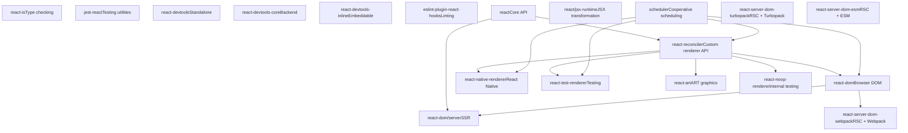
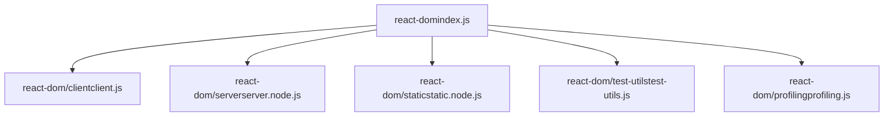
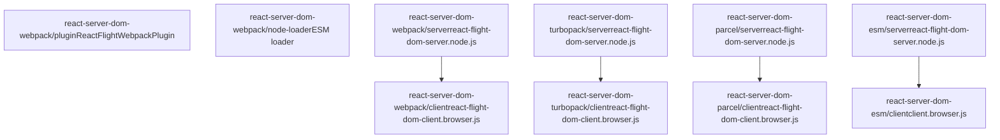
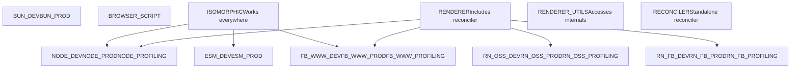
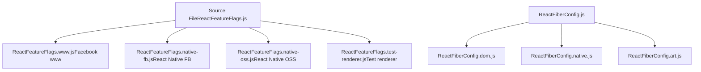
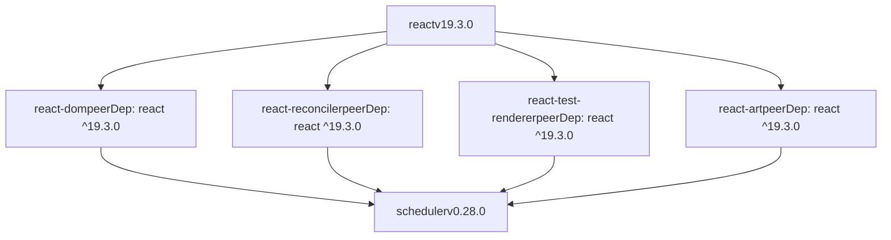

# 仓库结构与包

相关源文件

-   [.gitignore](https://github.com/facebook/react/blob/65eec428/.gitignore)
-   [package.json](https://github.com/facebook/react/blob/65eec428/package.json)
-   [packages/eslint-plugin-react-hooks/package.json](https://github.com/facebook/react/blob/65eec428/packages/eslint-plugin-react-hooks/package.json)
-   [packages/jest-react/package.json](https://github.com/facebook/react/blob/65eec428/packages/jest-react/package.json)
-   [packages/react-art/package.json](https://github.com/facebook/react/blob/65eec428/packages/react-art/package.json)
-   [packages/react-devtools-core/package.json](https://github.com/facebook/react/blob/65eec428/packages/react-devtools-core/package.json)
-   [packages/react-devtools-extensions/chrome/manifest.json](https://github.com/facebook/react/blob/65eec428/packages/react-devtools-extensions/chrome/manifest.json)
-   [packages/react-devtools-extensions/edge/manifest.json](https://github.com/facebook/react/blob/65eec428/packages/react-devtools-extensions/edge/manifest.json)
-   [packages/react-devtools-extensions/firefox/manifest.json](https://github.com/facebook/react/blob/65eec428/packages/react-devtools-extensions/firefox/manifest.json)
-   [packages/react-devtools-inline/package.json](https://github.com/facebook/react/blob/65eec428/packages/react-devtools-inline/package.json)
-   [packages/react-devtools-shared/package.json](https://github.com/facebook/react/blob/65eec428/packages/react-devtools-shared/package.json)
-   [packages/react-devtools-timeline/package.json](https://github.com/facebook/react/blob/65eec428/packages/react-devtools-timeline/package.json)
-   [packages/react-devtools/CHANGELOG.md](https://github.com/facebook/react/blob/65eec428/packages/react-devtools/CHANGELOG.md)
-   [packages/react-devtools/package.json](https://github.com/facebook/react/blob/65eec428/packages/react-devtools/package.json)
-   [packages/react-dom/package.json](https://github.com/facebook/react/blob/65eec428/packages/react-dom/package.json)
-   [packages/react-dom/src/\_\_tests\_\_/ReactErrorLoggingRecovery-test.js](https://github.com/facebook/react/blob/65eec428/packages/react-dom/src/__tests__/ReactErrorLoggingRecovery-test.js)
-   [packages/react-is/package.json](https://github.com/facebook/react/blob/65eec428/packages/react-is/package.json)
-   [packages/react-native-renderer/package.json](https://github.com/facebook/react/blob/65eec428/packages/react-native-renderer/package.json)
-   [packages/react-noop-renderer/package.json](https://github.com/facebook/react/blob/65eec428/packages/react-noop-renderer/package.json)
-   [packages/react-reconciler/package.json](https://github.com/facebook/react/blob/65eec428/packages/react-reconciler/package.json)
-   [packages/react-test-renderer/package.json](https://github.com/facebook/react/blob/65eec428/packages/react-test-renderer/package.json)
-   [packages/react/package.json](https://github.com/facebook/react/blob/65eec428/packages/react/package.json)
-   [packages/scheduler/package.json](https://github.com/facebook/react/blob/65eec428/packages/scheduler/package.json)
-   [packages/shared/ReactVersion.js](https://github.com/facebook/react/blob/65eec428/packages/shared/ReactVersion.js)
-   [packages/shared/forks/ReactFeatureFlags.readonly.js](https://github.com/facebook/react/blob/65eec428/packages/shared/forks/ReactFeatureFlags.readonly.js)
-   [scripts/flow/config/flowconfig](https://github.com/facebook/react/blob/65eec428/scripts/flow/config/flowconfig)
-   [scripts/flow/createFlowConfigs.js](https://github.com/facebook/react/blob/65eec428/scripts/flow/createFlowConfigs.js)
-   [scripts/jest/config.build-devtools.js](https://github.com/facebook/react/blob/65eec428/scripts/jest/config.build-devtools.js)
-   [scripts/jest/config.build.js](https://github.com/facebook/react/blob/65eec428/scripts/jest/config.build.js)
-   [scripts/jest/setupHostConfigs.js](https://github.com/facebook/react/blob/65eec428/scripts/jest/setupHostConfigs.js)
-   [scripts/rollup/build.js](https://github.com/facebook/react/blob/65eec428/scripts/rollup/build.js)
-   [scripts/rollup/bundles.js](https://github.com/facebook/react/blob/65eec428/scripts/rollup/bundles.js)
-   [scripts/rollup/forks.js](https://github.com/facebook/react/blob/65eec428/scripts/rollup/forks.js)
-   [scripts/rollup/modules.js](https://github.com/facebook/react/blob/65eec428/scripts/rollup/modules.js)
-   [scripts/rollup/packaging.js](https://github.com/facebook/react/blob/65eec428/scripts/rollup/packaging.js)
-   [scripts/rollup/sync.js](https://github.com/facebook/react/blob/65eec428/scripts/rollup/sync.js)
-   [scripts/rollup/wrappers.js](https://github.com/facebook/react/blob/65eec428/scripts/rollup/wrappers.js)
-   [scripts/shared/inlinedHostConfigs.js](https://github.com/facebook/react/blob/65eec428/scripts/shared/inlinedHostConfigs.js)
-   [yarn.lock](https://github.com/facebook/react/blob/65eec428/yarn.lock)

## 目的与范围

本文档描述了 React 代码库的 monorepo 组织结构、`packages/` 目录中的包结构、它们的用途、依赖关系，以及它们如何针对不同的构建目标进行配置。关于处理这些包的构建系统信息，请参阅 [构建系统与包分发](/facebook/react/3-build-system-and-package-distribution)。关于驱动渲染器的 Reconciler 架构的详细信息，请参阅 [React Reconciler](/facebook/react/4-react-reconciler)。

## Monorepo 架构

React 仓库被组织为一个 Yarn workspace monorepo。根目录的 [package.json3-4](https://github.com/facebook/react/blob/65eec428/package.json#L3-L4) 声明了：

```
"workspaces": [
  "packages/*"
]
```
这种结构允许 `packages/` 目录中的所有包在开发期间共享依赖并相互引用。该仓库包含大约 30 多个包，根据它们在 React 生态系统中的角色分为不同的类别。

**来源：** [package.json1-163](https://github.com/facebook/react/blob/65eec428/package.json#L1-L163)

## 包分类


**来源：** [scripts/rollup/bundles.js56-67](https://github.com/facebook/react/blob/65eec428/scripts/rollup/bundles.js#L56-L67) [packages/react/package.json](https://github.com/facebook/react/blob/65eec428/packages/react/package.json) [packages/react-dom/package.json](https://github.com/facebook/react/blob/65eec428/packages/react-dom/package.json) [packages/react-reconciler/package.json](https://github.com/facebook/react/blob/65eec428/packages/react-reconciler/package.json)

## 核心包

### react

`react` 包提供在所有环境（浏览器、服务器、原生）中工作的同构核心 API。

| 方面 | 详情 |
| --- | --- |
| **版本** | 19.3.0 |
| **入口点** | `index.js`, `jsx-runtime.js`, `jsx-dev-runtime.js`, `compiler-runtime.js` |
| **导出** | 针对 `react-server` 与默认环境的条件导出 |
| **依赖** | 无 (仅 peer) |
| **模块类型** | `ISOMORPHIC` |

关键导出结构来自 [packages/react/package.json24-42](https://github.com/facebook/react/blob/65eec428/packages/react/package.json#L24-L42)：

```
"exports": {
  ".": {
    "react-server": "./react.react-server.js",
    "default": "./index.js"
  },
  "./jsx-runtime": {
    "react-server": "./jsx-runtime.react-server.js",
    "default": "./jsx-runtime.js"
  }
}
```
**来源：** [packages/react/package.json1-52](https://github.com/facebook/react/blob/65eec428/packages/react/package.json#L1-L52) [scripts/rollup/bundles.js71-88](https://github.com/facebook/react/blob/65eec428/scripts/rollup/bundles.js#L71-L88)

### scheduler

`scheduler` 包实现了 React 并发特性的协作调度。

| 属性 | 值 |
| --- | --- |
| **版本** | 0.28.0 |
| **入口点** | `index.js`, `index.native.js`, `unstable_mock.js`, `unstable_post_task.js` |
| **依赖** | 无 |
| **使用者** | 所有渲染器包 |

**来源：** [packages/scheduler/package.json1-27](https://github.com/facebook/react/blob/65eec428/packages/scheduler/package.json#L1-L27)

### react-reconciler

独立的 Reconciler 包允许第三方开发者创建自定义 React 渲染器。

| 属性 | 值 |
| --- | --- |
| **版本** | 0.34.0 |
| **入口点** | `index.js`, `constants.js`, `reflection.js` |
| **对等依赖** | `react ^19.3.0` |
| **依赖** | `scheduler ^0.28.0` |
| **模块类型** | `RECONCILER` |

**来源：** [packages/react-reconciler/package.json1-34](https://github.com/facebook/react/blob/65eec428/packages/react-reconciler/package.json#L1-L34) [scripts/rollup/bundles.js64](https://github.com/facebook/react/blob/65eec428/scripts/rollup/bundles.js#L64-L64)

## 渲染器包

### react-dom

Web 应用程序的主要渲染器，提供客户端和服务端功能。


来自 [packages/react-dom/package.json51-125](https://github.com/facebook/react/blob/65eec428/packages/react-dom/package.json#L51-L125) 的入口点导出：

| 导出 | 条件 | 文件 |
| --- | --- | --- |
| `.` | `react-server`, `default` | `react-dom.react-server.js`, `index.js` |
| `./client` | `react-server`, `default` | `client.react-server.js`, `client.js` |
| `./server` | `node`, `bun`, `edge-light`, `browser` | 特定于环境的文件 |
| `./static` | `node`, `browser`, `edge-light` | 特定于环境的文件 |
| `./profiling` | `react-server`, `default` | `profiling.react-server.js`, `profiling.js` |

**来源：** [packages/react-dom/package.json1-126](https://github.com/facebook/react/blob/65eec428/packages/react-dom/package.json#L1-L126) [scripts/rollup/bundles.js181-396](https://github.com/facebook/react/blob/65eec428/scripts/rollup/bundles.js#L181-L396)

### react-native-renderer

React Native 渲染的内部包（不发布到 npm）。

| 属性 | 值 |
| --- | --- |
| **版本** | 16.0.0 (private) |
| **对等依赖** | `react ^18.0.0` |
| **依赖** | `scheduler ^0.28.0` |

**来源：** [packages/react-native-renderer/package.json1-16](https://github.com/facebook/react/blob/65eec428/packages/react-native-renderer/package.json#L1-L16)

### react-test-renderer

用于单元测试的渲染器，生成组件树的 JSON 表示。

| 属性 | 值 |
| --- | --- |
| **版本** | 19.3.0 |
| **入口点** | `index.js`, `shallow.js` |
| **对等依赖** | `react ^19.3.0` |
| **依赖** | `react-is ^19.3.0`, `scheduler ^0.28.0` |

**来源：** [packages/react-test-renderer/package.json1-35](https://github.com/facebook/react/blob/65eec428/packages/react-test-renderer/package.json#L1-L35)

### react-art

ART 矢量图形库的渲染器，支持 Canvas, SVG 和 VML 输出。

| 属性 | 值 |
| --- | --- |
| **版本** | 19.3.0 |
| **入口点** | `index.js`, `Circle.js`, `Rectangle.js`, `Wedge.js` |
| **依赖** | `art ^0.10.1`, `create-react-class ^15.6.2`, `scheduler ^0.28.0` |

**来源：** [packages/react-art/package.json1-41](https://github.com/facebook/react/blob/65eec428/packages/react-art/package.json#L1-L41) [scripts/rollup/bundles.js828-847](https://github.com/facebook/react/blob/65eec428/scripts/rollup/bundles.js#L828-L847)

### react-noop-renderer

内部测试渲染器，为 React 自身的测试生成内存中的树结构。

| 属性 | 值 |
| --- | --- |
| **版本** | 16.0.0 (private) |
| **入口点** | `index.js`, `persistent.js`, `server.js`, `flight-client.js`, `flight-server.js` |
| **依赖** | `react-reconciler`, `react-client`, `react-server` |

**来源：** [packages/react-noop-renderer/package.json1-32](https://github.com/facebook/react/blob/65eec428/packages/react-noop-renderer/package.json#L1-L32)

## 服务端包

### React Server Components 包

React Server Components (RSC) 针对不同的打包工具分别打包：


这些包实现了用于流式传输 React Server Components 的 Flight 协议。打包配置定义在 [scripts/rollup/bundles.js448-814](https://github.com/facebook/react/blob/65eec428/scripts/rollup/bundles.js#L448-L814) 中。

**来源：** [scripts/rollup/bundles.js448-814](https://github.com/facebook/react/blob/65eec428/scripts/rollup/bundles.js#L448-L814) [scripts/shared/inlinedHostConfigs.js228-403](https://github.com/facebook/react/blob/65eec428/scripts/shared/inlinedHostConfigs.js#L228-L403)

## 开发者工具包

### react-devtools

用于调试 React 应用程序的独立 Electron 应用程序。

| 属性 | 值 |
| --- | --- |
| **版本** | 7.0.1 |
| **二进制文件** | `react-devtools` |
| **依赖** | `electron ^23.1.2`, `react-devtools-core 7.0.1` |
| **文件** | `bin.js`, `app.html`, `app.js`, `preload.js` |

**来源：** [packages/react-devtools/package.json1-32](https://github.com/facebook/react/blob/65eec428/packages/react-devtools/package.json#L1-L32)

### react-devtools-core

React DevTools 的后端和独立服务器，由 Electron 应用程序和集成工具使用。

| 属性 | 值 |
| --- | --- |
| **版本** | 7.0.1 |
| **Main** | `./dist/backend.js` |
| **导出** | `backend.js`, `standalone.js` |
| **依赖** | `shell-quote ^1.6.1`, `ws ^7` |

**来源：** [packages/react-devtools-core/package.json1-38](https://github.com/facebook/react/blob/65eec428/packages/react-devtools-core/package.json#L1-L38)

### react-devtools-inline

用于集成到其他工具和网站的可嵌入 DevTools UI。

| 属性 | 值 |
| --- | --- |
| **版本** | 7.0.1 |
| **Main** | `./dist/backend.js` |
| **导出** | `backend.js`, `frontend.js`, `hookNames.js` |
| **依赖** | `@jridgewell/sourcemap-codec 1.5.5`, `source-map-js ^0.6.2` |

**来源：** [packages/react-devtools-inline/package.json1-52](https://github.com/facebook/react/blob/65eec428/packages/react-devtools-inline/package.json#L1-L52)

### react-devtools-extensions

Chrome, Firefox 和 Edge 的浏览器扩展。这些不是 npm 包，而是使用 webpack 配置从源代码构建的。

扩展清单：

-   Chrome: [packages/react-devtools-extensions/chrome/manifest.json1-65](https://github.com/facebook/react/blob/65eec428/packages/react-devtools-extensions/chrome/manifest.json#L1-L65)
-   Firefox: [packages/react-devtools-extensions/firefox/manifest.json1-70](https://github.com/facebook/react/blob/65eec428/packages/react-devtools-extensions/firefox/manifest.json#L1-L70)
-   Edge: [packages/react-devtools-extensions/edge/manifest.json1-65](https://github.com/facebook/react/blob/65eec428/packages/react-devtools-extensions/edge/manifest.json#L1-L65)

所有扩展都使用 Manifest V3 并在 `document_start` 时注入内容脚本。

**来源：** [packages/react-devtools-extensions/chrome/manifest.json](https://github.com/facebook/react/blob/65eec428/packages/react-devtools-extensions/chrome/manifest.json) [packages/react-devtools-extensions/firefox/manifest.json](https://github.com/facebook/react/blob/65eec428/packages/react-devtools-extensions/firefox/manifest.json) [packages/react-devtools-extensions/edge/manifest.json](https://github.com/facebook/react/blob/65eec428/packages/react-devtools-extensions/edge/manifest.json)

### eslint-plugin-react-hooks

用于强制执行 Hooks 规则和验证 hook 依赖项的 ESLint 插件。

| 属性 | 值 |
| --- | --- |
| **版本** | 7.0.0 |
| **Main** | `index.js` |
| **Types** | `index.d.ts` |
| **对等依赖** | `eslint ^3.0.0 || ... || ^9.0.0` |
| **关键依赖** | `@babel/core`, `@babel/parser`, `hermes-parser`, `zod` |

**来源：** [packages/eslint-plugin-react-hooks/package.json1-68](https://github.com/facebook/react/blob/65eec428/packages/eslint-plugin-react-hooks/package.json#L1-L68)

## 工具包

### react-is

用于检查 React 元素和组件类型的实用工具。

| 属性 | 值 |
| --- | --- |
| **版本** | 19.3.0 |
| **Main** | `index.js` |
| **副作用** | `false` |

**来源：** [packages/react-is/package.json1-26](https://github.com/facebook/react/blob/65eec428/packages/react-is/package.json#L1-L26)

### jest-react

专门用于测试 React 组件的 Jest 匹配器和实用工具。

| 属性 | 值 |
| --- | --- |
| **版本** | 0.17.0 |
| **Main** | `index.js` |
| **对等依赖** | `jest`, `react`, `react-test-renderer` |

**来源：** [packages/jest-react/package.json1-32](https://github.com/facebook/react/blob/65eec428/packages/jest-react/package.json#L1-L32)

## 构建系统集成

### 打包类型与模块类型

构建系统为不同环境定义了不同的打包类型：


**来源：** [scripts/rollup/bundles.js10-31](https://github.com/facebook/react/blob/65eec428/scripts/rollup/bundles.js#L10-L31) [scripts/rollup/bundles.js56-67](https://github.com/facebook/react/blob/65eec428/scripts/rollup/bundles.js#L56-L67)

### 输出路径结构

包构建产物按构建目标组织：

| 打包类型 | 输出路径模式 |
| --- | --- |
| `NODE_*`, `BUN_*` | `build/node_modules/{package}/cjs/{filename}` |
| `ESM_*` | `build/node_modules/{package}/esm/{filename}` |
| `FB_WWW_*` | `build/facebook-www/{filename}` |
| `RN_OSS_*` | `build/react-native/implementations/{filename}` |
| `RN_FB_*` | `build/facebook-react-native/{package}/cjs/{filename}` |

**来源：** [scripts/rollup/packaging.js48-114](https://github.com/facebook/react/blob/65eec428/scripts/rollup/packaging.js#L48-L114)

### 模块分叉系统

构建系统使用复杂的模块分叉机制，根据环境替换不同的实现：


分叉解析逻辑在 [scripts/rollup/forks.js29-43](https://github.com/facebook/react/blob/65eec428/scripts/rollup/forks.js#L29-L43) 中，具体的分叉映射定义在 [scripts/rollup/forks.js52-450](https://github.com/facebook/react/blob/65eec428/scripts/rollup/forks.js#L52-L450) 中。

**来源：** [scripts/rollup/forks.js1-450](https://github.com/facebook/react/blob/65eec428/scripts/rollup/forks.js#L1-L450) [scripts/rollup/modules.js64-81](https://github.com/facebook/react/blob/65eec428/scripts/rollup/modules.js#L64-L81)

### 宿主配置系统

不同的渲染器使用内联的宿主配置来定义平台特定的行为：

| 宿主配置 | 入口点 | 用途 |
| --- | --- | --- |
| `dom-browser` | `react-dom`, `react-dom/client` | 浏览器 DOM 操作 |
| `dom-node` | `react-dom/server.node` | Node.js SSR |
| `dom-edge` | `react-dom/server.edge` | Edge runtime SSR |
| `dom-bun` | `react-dom/server.bun` | Bun runtime SSR |
| `native-renderer` | `react-native-renderer` | React Native 渲染 |
| `test-renderer` | `react-test-renderer` | 测试基础设施 |
| `art` | `react-art` | ART 图形渲染 |

每个宿主配置在 [scripts/shared/inlinedHostConfigs.js9-403](https://github.com/facebook/react/blob/65eec428/scripts/shared/inlinedHostConfigs.js#L9-L403) 中与特定的入口点相关联。

**来源：** [scripts/shared/inlinedHostConfigs.js1-403](https://github.com/facebook/react/blob/65eec428/scripts/shared/inlinedHostConfigs.js#L1-L403)

## 包依赖模式

### 对等依赖 (Peer Dependencies)

大多数包声明 `react` 为对等依赖以避免版本冲突：


**来源：** [packages/react/package.json44-51](https://github.com/facebook/react/blob/65eec428/packages/react/package.json#L44-L51) [packages/react-dom/package.json22-24](https://github.com/facebook/react/blob/65eec428/packages/react-dom/package.json#L22-L24) [packages/react-reconciler/package.json28-33](https://github.com/facebook/react/blob/65eec428/packages/react-reconciler/package.json#L28-L33)

### 内部依赖

一些包对 monorepo 中的其他包有内部依赖：

| 包 | 依赖 |
| --- | --- |
| `react-devtools` | `react-devtools-core 7.0.1` |
| `react-noop-renderer` | `react-reconciler`, `react-client`, `react-server` |
| `react-test-renderer` | `react-is ^19.3.0`, `scheduler ^0.28.0` |

**来源：** [packages/react-devtools/package.json24-30](https://github.com/facebook/react/blob/65eec428/packages/react-devtools/package.json#L24-L30) [packages/react-noop-renderer/package.json13-17](https://github.com/facebook/react/blob/65eec428/packages/react-noop-renderer/package.json#L13-L17) [packages/react-test-renderer/package.json21-24](https://github.com/facebook/react/blob/65eec428/packages/react-test-renderer/package.json#L21-L24)

## 版本管理

规范的 React 版本维护在 [packages/shared/ReactVersion.js15](https://github.com/facebook/react/blob/65eec428/packages/shared/ReactVersion.js#L15-L15) 中：

```
export default '19.3.0';
```
在构建过程中导入此文件，以将版本号注入所有包中。版本在以下包中保持一致：

-   核心包：`react`, `react-dom`, `react-is` (19.3.0)
-   Scheduler: `scheduler` (0.28.0)
-   Reconciler: `react-reconciler` (0.34.0)
-   DevTools: `react-devtools*` (7.0.1)

**来源：** [packages/shared/ReactVersion.js1-16](https://github.com/facebook/react/blob/65eec428/packages/shared/ReactVersion.js#L1-L16) [packages/react/package.json7](https://github.com/facebook/react/blob/65eec428/packages/react/package.json#L7-L7) [packages/react-dom/package.json3](https://github.com/facebook/react/blob/65eec428/packages/react-dom/package.json#L3-L3)
