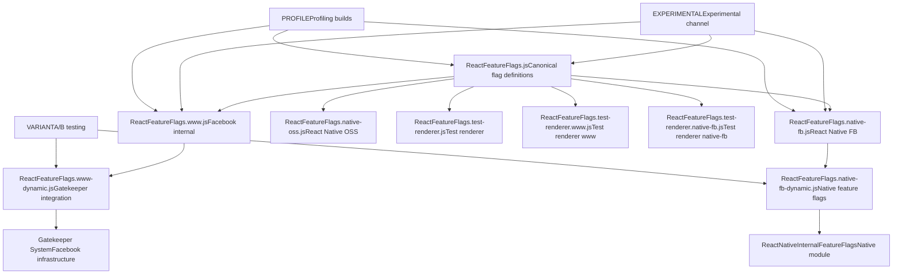
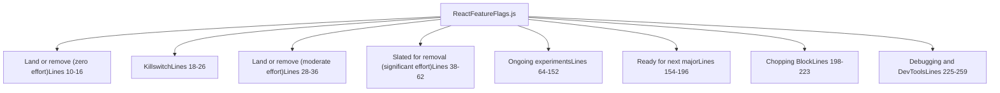
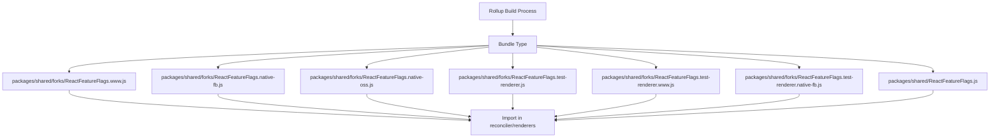
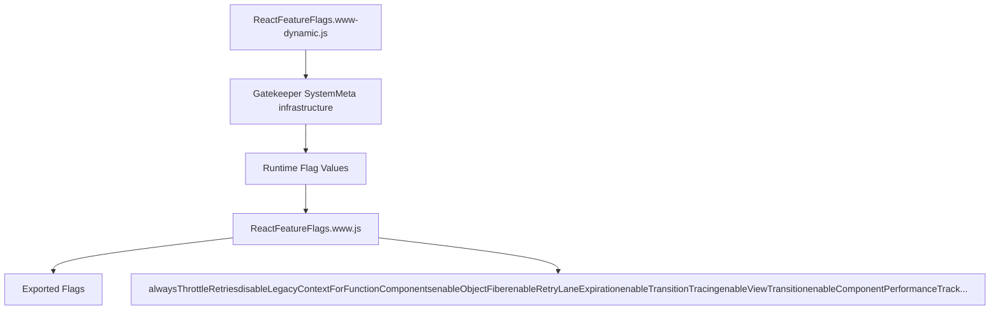
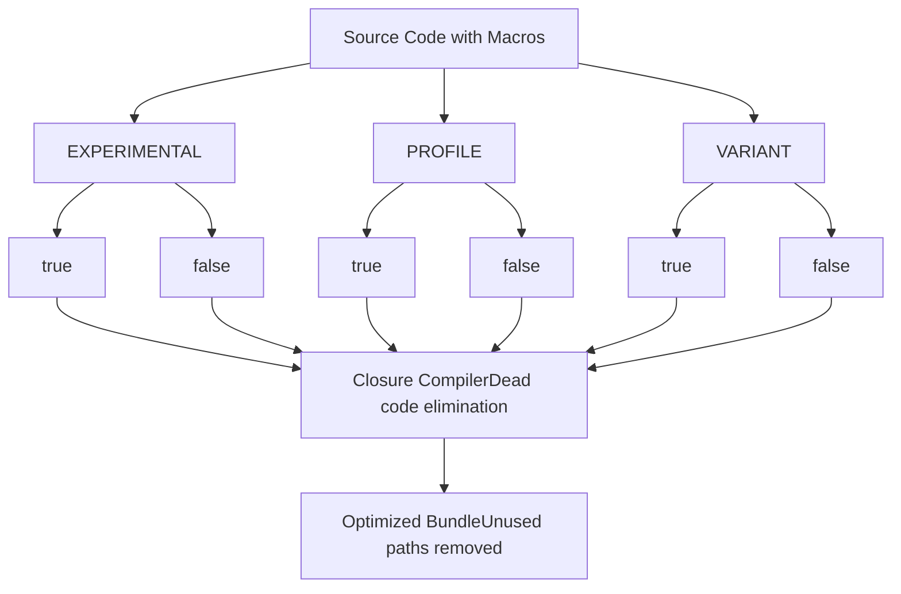
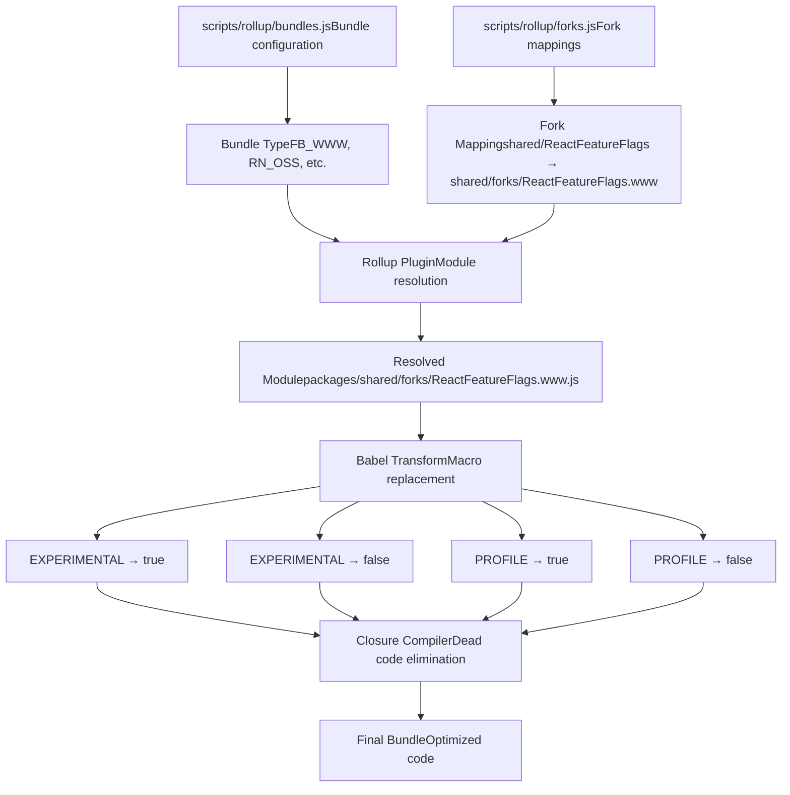

# 特性标志系统

相关源文件

-   [packages/shared/ReactFeatureFlags.js](https://github.com/facebook/react/blob/65eec428/packages/shared/ReactFeatureFlags.js)
-   [packages/shared/forks/ReactFeatureFlags.native-fb-dynamic.js](https://github.com/facebook/react/blob/65eec428/packages/shared/forks/ReactFeatureFlags.native-fb-dynamic.js)
-   [packages/shared/forks/ReactFeatureFlags.native-fb.js](https://github.com/facebook/react/blob/65eec428/packages/shared/forks/ReactFeatureFlags.native-fb.js)
-   [packages/shared/forks/ReactFeatureFlags.native-oss.js](https://github.com/facebook/react/blob/65eec428/packages/shared/forks/ReactFeatureFlags.native-oss.js)
-   [packages/shared/forks/ReactFeatureFlags.test-renderer.js](https://github.com/facebook/react/blob/65eec428/packages/shared/forks/ReactFeatureFlags.test-renderer.js)
-   [packages/shared/forks/ReactFeatureFlags.test-renderer.native-fb.js](https://github.com/facebook/react/blob/65eec428/packages/shared/forks/ReactFeatureFlags.test-renderer.native-fb.js)
-   [packages/shared/forks/ReactFeatureFlags.test-renderer.www.js](https://github.com/facebook/react/blob/65eec428/packages/shared/forks/ReactFeatureFlags.test-renderer.www.js)
-   [packages/shared/forks/ReactFeatureFlags.www-dynamic.js](https://github.com/facebook/react/blob/65eec428/packages/shared/forks/ReactFeatureFlags.www-dynamic.js)
-   [packages/shared/forks/ReactFeatureFlags.www.js](https://github.com/facebook/react/blob/65eec428/packages/shared/forks/ReactFeatureFlags.www.js)
-   [scripts/flow/xplat.js](https://github.com/facebook/react/blob/65eec428/scripts/flow/xplat.js)

## 目的与范围

特性标志系统（Feature Flags System）是 React 用于控制实验性功能、平台特定行为以及跨不同环境和发布渠道进行渐进式功能发布的综合机制。它使得同一套代码库能够针对 Facebook 内部基础设施 (www)、React Native Facebook 内部 (native-fb)、React Native 开源 (native-oss) 以及测试渲染器编译出不同的行为，同时也支持 A/B 测试和生产环境中的运行时可控标志。

本文档涵盖了标志定义结构、分叉机制、动态标志集成、构建时宏以及标志生命周期管理。关于构建系统如何处理这些标志的信息，请参阅 [构建系统与包分发](/facebook/react/3-build-system-and-package-distribution)。关于标志如何影响 Reconciler 行为的信息，请参阅 [React Reconciler](/facebook/react/4-react-reconciler)。

## 系统架构

特性标志系统由一个基础定义文件和覆盖默认值的环境特定分叉（forks）组成。该系统支持静态标志（构建时确定）和动态标志（运行时通过 Gatekeeper 或特性管理系统控制）。


**来源：** [packages/shared/ReactFeatureFlags.js1-259](https://github.com/facebook/react/blob/65eec428/packages/shared/ReactFeatureFlags.js#L1-L259) [packages/shared/forks/ReactFeatureFlags.www.js1-121](https://github.com/facebook/react/blob/65eec428/packages/shared/forks/ReactFeatureFlags.www.js#L1-L121) [packages/shared/forks/ReactFeatureFlags.native-fb.js1-92](https://github.com/facebook/react/blob/65eec428/packages/shared/forks/ReactFeatureFlags.native-fb.js#L1-L92) [packages/shared/forks/ReactFeatureFlags.native-oss.js1-91](https://github.com/facebook/react/blob/65eec428/packages/shared/forks/ReactFeatureFlags.native-oss.js#L1-L91)

## 基础特性标志定义

基础特性标志定义位于 `ReactFeatureFlags.js` 中，作为所有标志及其开源构建默认值的规范来源。该文件将标志组织成明确的生命周期类别，记录了它们的预期用途和稳定性。

### 标志组织结构


**来源：** [packages/shared/ReactFeatureFlags.js10-259](https://github.com/facebook/react/blob/65eec428/packages/shared/ReactFeatureFlags.js#L10-L259)

### 关键标志类别

| 类别 | 用途 | 标志示例 | 行号 |
| --- | --- | --- | --- |
| **Killswitch** | 针对生产问题的紧急禁用开关 | `enableHydrationLaneScheduling` | [25](https://github.com/facebook/react/blob/65eec428/25) |
| **Land or remove (moderate)** | 需要迁移工作的标志 | `disableSchedulerTimeoutInWorkLoop` | [35](https://github.com/facebook/react/blob/65eec428/35) |
| **Slated for removal** | 等待迁移的已弃用功能 | `enableSuspenseCallback`, `enableScopeAPI`, `enableCreateEventHandleAPI` | [52, 55, 58](https://github.com/facebook/react/blob/65eec428/52, 55, 58) |
| **Ongoing experiments** | 活跃的功能开发 | `enableLegacyCache`, `enableTaint`, `enableViewTransition` | [77, 81, 85](https://github.com/facebook/react/blob/65eec428/77, 81, 85) |
| **Ready for next major** | 计划在下一个主要版本中发布的功能 | `disableLegacyContext`, `disableLegacyMode`, `renameElementSymbol` | [177, 195, 167](https://github.com/facebook/react/blob/65eec428/177, 195, 167) |
| **Debugging and DevTools** | 性能分析和开发工具 | `enableProfilerTimer`, `enableComponentPerformanceTrack` | [229, 235](https://github.com/facebook/react/blob/65eec428/229, 235) |

**来源：** [packages/shared/ReactFeatureFlags.js10-259](https://github.com/facebook/react/blob/65eec428/packages/shared/ReactFeatureFlags.js#L10-L259)

### 常见标志模式

基础文件定义了几种标志模式：

**布尔特性开关：**

```
export const enableHalt: boolean = true;
export const enableViewTransition: boolean = true;
export const enableGestureTransition = __EXPERIMENTAL__;
```
**过期超时时间：**

```
export const retryLaneExpirationMs = 5000;
export const syncLaneExpirationMs = 250;
export const transitionLaneExpirationMs = 5000;
```
**限制和阈值：**

```
export const ownerStackLimit = 1e4;
```
**来源：** [packages/shared/ReactFeatureFlags.js83-258](https://github.com/facebook/react/blob/65eec428/packages/shared/ReactFeatureFlags.js#L83-L258)

## 分叉（Fork）机制

分叉机制允许不同的构建使用不同的特性标志模块实现。在构建过程中，Rollup 的模块解析配置为根据目标打包类型替换适当的分叉。

### 分叉解析流程


**来源：** [packages/shared/forks/ReactFeatureFlags.www.js1-121](https://github.com/facebook/react/blob/65eec428/packages/shared/forks/ReactFeatureFlags.www.js#L1-L121) [packages/shared/forks/ReactFeatureFlags.native-fb.js1-92](https://github.com/facebook/react/blob/65eec428/packages/shared/forks/ReactFeatureFlags.native-fb.js#L1-L92) [packages/shared/forks/ReactFeatureFlags.native-oss.js1-91](https://github.com/facebook/react/blob/65eec428/packages/shared/forks/ReactFeatureFlags.native-oss.js#L1-L91)

### 分叉类型验证

每个分叉文件在末尾都包含 Flow 类型验证，以确保它导出与基础文件相同的接口：

```
((((null: any): ExportsType): FeatureFlagsType): ExportsType);
```
此类型断言确保：

1.  分叉导出了基础文件中定义的所有标志
2.  分叉没有导出基础文件中不存在的额外标志
3.  类型签名完全匹配

**来源：** [packages/shared/forks/ReactFeatureFlags.www.js120](https://github.com/facebook/react/blob/65eec428/packages/shared/forks/ReactFeatureFlags.www.js#L120-L120) [packages/shared/forks/ReactFeatureFlags.native-fb.js91](https://github.com/facebook/react/blob/65eec428/packages/shared/forks/ReactFeatureFlags.native-fb.js#L91-L91) [packages/shared/forks/ReactFeatureFlags.native-oss.js90](https://github.com/facebook/react/blob/65eec428/packages/shared/forks/ReactFeatureFlags.native-oss.js#L90-L90)

### 平台特定标志值

不同的分叉根据平台能力和需求设置不同的默认值：

| 标志 | Base (基础) | www | native-fb | native-oss |
| --- | --- | --- | --- | --- |
| `enableLegacyFBSupport` | false | true | false | false |
| `disableLegacyMode` | true | true | false | false |
| `enableMoveBefore` | false | false | true | true |
| `enableSuspenseCallback` | false | true | true | false |
| `enableScopeAPI` | false | true | false | false |
| `enableViewTransition` | true | true | false | true |

**来源：** [packages/shared/ReactFeatureFlags.js52-195](https://github.com/facebook/react/blob/65eec428/packages/shared/ReactFeatureFlags.js#L52-L195) [packages/shared/forks/ReactFeatureFlags.www.js53-101](https://github.com/facebook/react/blob/65eec428/packages/shared/forks/ReactFeatureFlags.www.js#L53-L101) [packages/shared/forks/ReactFeatureFlags.native-fb.js39-62](https://github.com/facebook/react/blob/65eec428/packages/shared/forks/ReactFeatureFlags.native-fb.js#L39-L62) [packages/shared/forks/ReactFeatureFlags.native-oss.js24-65](https://github.com/facebook/react/blob/65eec428/packages/shared/forks/ReactFeatureFlags.native-oss.js#L24-L65)

## 动态特性标志

动态特性标志允许通过 Gatekeeper 系统在 Meta 内部构建中对功能进行运行时控制。这些标志从平台特定的特性标志模块重新导出，其值可以在不重新部署代码的情况下更改。

### www 动态标志

`ReactFeatureFlags.www.js` 分叉从运行时模块导入动态标志：


www 分叉解构并重新导出动态模块中的特定标志：

```
export const {
  alwaysThrottleRetries,
  disableLegacyContextForFunctionComponents,
  disableSchedulerTimeoutInWorkLoop,
  enableHiddenSubtreeInsertionEffectCleanup,
  enableInfiniteRenderLoopDetection,
  enableNoCloningMemoCache,
  enableObjectFiber,
  enableRetryLaneExpiration,
  enableTransitionTracing,
  ...
} = dynamicFeatureFlags;
```
**来源：** [packages/shared/forks/ReactFeatureFlags.www.js15-39](https://github.com/facebook/react/blob/65eec428/packages/shared/forks/ReactFeatureFlags.www.js#L15-L39)

### Native Facebook 动态标志

native-fb 分叉从 `ReactNativeInternalFeatureFlags` 原生模块导入动态标志：

```
import * as dynamicFlagsUntyped from 'ReactNativeInternalFeatureFlags';
const dynamicFlags: DynamicExportsType = (dynamicFlagsUntyped: any);

export const {
  alwaysThrottleRetries,
  enableHiddenSubtreeInsertionEffectCleanup,
  enableObjectFiber,
  enableEagerAlternateStateNodeCleanup,
  passChildrenWhenCloningPersistedNodes,
  renameElementSymbol,
  enableFragmentRefs,
  enableFragmentRefsScrollIntoView,
  enableFragmentRefsInstanceHandles,
} = dynamicFlags;
```
**来源：** [packages/shared/forks/ReactFeatureFlags.native-fb.js16-31](https://github.com/facebook/react/blob/65eec428/packages/shared/forks/ReactFeatureFlags.native-fb.js#L16-L31) [scripts/flow/xplat.js10-12](https://github.com/facebook/react/blob/65eec428/scripts/flow/xplat.js#L10-L12)

### **VARIANT** 测试模式

动态标志定义文件使用 `__VARIANT__` 宏以在开发期间启用 A/B 测试。构建系统会运行两次测试：一次 `__VARIANT__ = true`，一次 `__VARIANT__ = false`：

```
export const alwaysThrottleRetries: boolean = __VARIANT__;
export const disableLegacyContextForFunctionComponents: boolean = __VARIANT__;
export const enableObjectFiber: boolean = __VARIANT__;
export const enableRetryLaneExpiration: boolean = __VARIANT__;
```
这允许对将在生产环境中动态控制的标志的两个代码路径都进行测试。

**来源：** [packages/shared/forks/ReactFeatureFlags.www-dynamic.js13-42](https://github.com/facebook/react/blob/65eec428/packages/shared/forks/ReactFeatureFlags.www-dynamic.js#L13-L42) [packages/shared/forks/ReactFeatureFlags.native-fb-dynamic.js10-30](https://github.com/facebook/react/blob/65eec428/packages/shared/forks/ReactFeatureFlags.native-fb-dynamic.js#L10-L30)

## 构建时宏

构建时宏是在构建过程中被替换为布尔值的特殊标识符。它们支持基于构建配置的条件编译。

### 宏类型与用法


**来源：** [packages/shared/ReactFeatureFlags.js77-256](https://github.com/facebook/react/blob/65eec428/packages/shared/ReactFeatureFlags.js#L77-L256) [packages/shared/forks/ReactFeatureFlags.www.js41-69](https://github.com/facebook/react/blob/65eec428/packages/shared/forks/ReactFeatureFlags.www.js#L41-L69)

### **EXPERIMENTAL** 宏

用于仅在实验性发布渠道中启用功能：

```
export const enableLegacyCache = __EXPERIMENTAL__;
export const enableAsyncIterableChildren = __EXPERIMENTAL__;
export const enableTaint = __EXPERIMENTAL__;
export const enableGestureTransition = __EXPERIMENTAL__;
```
在 www 分叉中，`__EXPERIMENTAL__` 也用于新的现代构建变体（modern build variant）：

```
export const disableLegacyContext = __EXPERIMENTAL__;
export const disableTextareaChildren = __EXPERIMENTAL__;
```
**来源：** [packages/shared/ReactFeatureFlags.js77-87](https://github.com/facebook/react/blob/65eec428/packages/shared/ReactFeatureFlags.js#L77-L87) [packages/shared/forks/ReactFeatureFlags.www.js69-91](https://github.com/facebook/react/blob/65eec428/packages/shared/forks/ReactFeatureFlags.www.js#L69-L91)

### **PROFILE** 宏

用于启用性能分析和测量功能：

```
export const enableProfilerTimer = __PROFILE__;
export const enableProfilerCommitHooks = __PROFILE__;
export const enableProfilerNestedUpdatePhase = __PROFILE__;
export const enableUpdaterTracking = __PROFILE__;
export const enableSchedulingProfiler: boolean =
  !enableComponentPerformanceTrack && __PROFILE__;
```
这启用了 React DevTools 的分析能力，而不会影响生产包的大小。

**来源：** [packages/shared/ReactFeatureFlags.js229-256](https://github.com/facebook/react/blob/65eec428/packages/shared/ReactFeatureFlags.js#L229-L256) [packages/shared/forks/ReactFeatureFlags.www.js44-67](https://github.com/facebook/react/blob/65eec428/packages/shared/forks/ReactFeatureFlags.www.js#L44-L67)

### **VARIANT** 宏

用于在动态标志定义文件中模拟测试期间的 Gatekeeper：

```
export const alwaysThrottleRetries: boolean = __VARIANT__;
export const enableObjectFiber: boolean = __VARIANT__;
export const enableRetryLaneExpiration: boolean = __VARIANT__;
export const enableTransitionTracing: boolean = __VARIANT__;
```
测试基础设施会使用不同的 `__VARIANT__` 值多次运行测试，以确保两个代码路径都能正常工作。

**来源：** [packages/shared/forks/ReactFeatureFlags.www-dynamic.js16-24](https://github.com/facebook/react/blob/65eec428/packages/shared/forks/ReactFeatureFlags.www-dynamic.js#L16-L24) [packages/shared/forks/ReactFeatureFlags.native-fb-dynamic.js20-29](https://github.com/facebook/react/blob/65eec428/packages/shared/forks/ReactFeatureFlags.native-fb-dynamic.js#L20-L29)

## 特性标志生命周期

随着功能的开发、稳定并最终被移除，标志会经历不同的生命周期阶段。基础文件通过代码注释和组织结构明确记录了这些阶段。

### 生命周期阶段流程

> **[Mermaid stateDiagram]**
> *(图表结构无法解析)*

**来源：** [packages/shared/ReactFeatureFlags.js10-259](https://github.com/facebook/react/blob/65eec428/packages/shared/ReactFeatureFlags.js#L10-L259)

### 阶段定义

**Ongoing Experiments（进行中的实验）(Lines 64-152)：** 正在积极开发中的功能，可能会更改或撤销。示例：

-   `enableYieldingBeforePassive`: 在被动副作用（passive effects）之前让出浏览器事件循环
-   `enableThrottledScheduling`: 有意减少让出，以阻断高帧率动画
-   `enableViewTransition`: 视图过渡 API 集成
-   `enableSuspenseyImages`: 增强的 Suspense 图片加载

**Ready for Next Major（为下一个主要版本准备）(Lines 154-196)：** 已经稳定并将在下一个主要版本中默认启用的功能：

-   `disableLegacyContext`: 移除旧版 Context API
-   `disableLegacyMode`: 移除旧版渲染模式
-   `renameElementSymbol`: 更新内部元素表示
-   `enableReactTestRendererWarning`: 对测试渲染器使用发出警告

**Slated for Removal（预定移除）(Lines 38-62)：** 已弃用但未发布，在内部迁移完成前无法删除的功能：

-   `enableSuspenseCallback`: 旧版 Suspense 回调 API
-   `enableScopeAPI`: 实验性 Scope 支持
-   `enableCreateEventHandleAPI`: 实验性事件处理句柄 API
-   `enableLegacyFBSupport`: Facebook 内部的旧版 Primer 支持

**Killswitch（终止开关）(Lines 18-26)：** 存在的标志，用于在导致生产问题时快速禁用功能：

-   `enableHydrationLaneScheduling`: 如果 hydration 调度导致问题，可以禁用

**来源：** [packages/shared/ReactFeatureFlags.js18-196](https://github.com/facebook/react/blob/65eec428/packages/shared/ReactFeatureFlags.js#L18-L196)

## 与构建系统集成

特性标志系统通过模块分叉和宏替换与构建流程深度集成。构建系统根据打包配置选择适当的分叉。

### 构建时标志解析


**来源：** [packages/shared/forks/ReactFeatureFlags.www.js1-121](https://github.com/facebook/react/blob/65eec428/packages/shared/forks/ReactFeatureFlags.www.js#L1-L121) [packages/shared/forks/ReactFeatureFlags.native-fb.js1-92](https://github.com/facebook/react/blob/65eec428/packages/shared/forks/ReactFeatureFlags.native-fb.js#L1-L92)

### 分叉选择示例

不同的打包类型解析为不同的分叉：

| 打包类型 | 分叉路径 | 用途 |
| --- | --- | --- |
| `FB_WWW` | `shared/forks/ReactFeatureFlags.www.js` | Facebook 内部 Web |
| `RN_FB` | `shared/forks/ReactFeatureFlags.native-fb.js` | React Native Facebook 内部 |
| `RN_OSS` | `shared/forks/ReactFeatureFlags.native-oss.js` | React Native 开源 |
| `NODE_DEV`, `NODE_PROD` | `shared/ReactFeatureFlags.js` | Node.js 构建（基础） |
| `UMD_DEV`, `UMD_PROD` | `shared/ReactFeatureFlags.js` | 浏览器 UMD 构建（基础） |

对于测试渲染器构建，使用额外的专用分叉：

| 打包类型 | 分叉路径 |
| --- | --- |
| Test renderer (www) | `shared/forks/ReactFeatureFlags.test-renderer.www.js` |
| Test renderer (native-fb) | `shared/forks/ReactFeatureFlags.test-renderer.native-fb.js` |
| Test renderer (default) | `shared/forks/ReactFeatureFlags.test-renderer.js` |

**来源：** [packages/shared/forks/ReactFeatureFlags.www.js1](https://github.com/facebook/react/blob/65eec428/packages/shared/forks/ReactFeatureFlags.www.js#L1-L1) [packages/shared/forks/ReactFeatureFlags.native-fb.js1](https://github.com/facebook/react/blob/65eec428/packages/shared/forks/ReactFeatureFlags.native-fb.js#L1-L1) [packages/shared/forks/ReactFeatureFlags.native-oss.js1](https://github.com/facebook/react/blob/65eec428/packages/shared/forks/ReactFeatureFlags.native-oss.js#L1-L1) [packages/shared/forks/ReactFeatureFlags.test-renderer.www.js1](https://github.com/facebook/react/blob/65eec428/packages/shared/forks/ReactFeatureFlags.test-renderer.www.js#L1-L1) [packages/shared/forks/ReactFeatureFlags.test-renderer.native-fb.js1](https://github.com/facebook/react/blob/65eec428/packages/shared/forks/ReactFeatureFlags.test-renderer.native-fb.js#L1-L1) [packages/shared/forks/ReactFeatureFlags.test-renderer.js1](https://github.com/facebook/react/blob/65eec428/packages/shared/forks/ReactFeatureFlags.test-renderer.js#L1-L1)

## 运行时代码中的标志使用

运行时代码从 `shared/ReactFeatureFlags` 导入特性标志，构建系统会将其解析为适当的分叉：

```
import {
  enableProfilerTimer,
  enableSuspenseCallback,
  enableTransitionTracing,
  enableLegacyHidden,
} from 'shared/ReactFeatureFlags';
```
Reconciler、渲染器和其他系统会检查这些标志以有条件地启用功能：

```
if (enableTransitionTracing) {
  // Transition tracing logic
}

if (enableProfilerTimer) {
  // Profiling timer logic
}
```
在 Babel 宏替换和 Closure Compiler 死代码消除之后，最终的包中仅保留活动的代码路径。

**来源：** [packages/shared/ReactFeatureFlags.js1-259](https://github.com/facebook/react/blob/65eec428/packages/shared/ReactFeatureFlags.js#L1-L259)

## 特殊标志类别

### 性能分析标志

性能分析标志由 `__PROFILE__` 宏控制，并启用性能测量功能：

| 标志 | 用途 | 行号 |
| --- | --- | --- |
| `enableProfilerTimer` | 收集 Profiler 子树的计时指标 | [229](https://github.com/facebook/react/blob/65eec428/229) |
| `enableComponentPerformanceTrack` | 添加 Chrome 的 performance.measure() 标记 | [235](https://github.com/facebook/react/blob/65eec428/235) |
| `enableSchedulingProfiler` | 实验性时间轴的用户计时标记 | [244-245](https://github.com/facebook/react/blob/65eec428/244-245) |
| `enableProfilerCommitHooks` | 记录提交阶段的持续时间 | [248](https://github.com/facebook/react/blob/65eec428/248) |
| `enableProfilerNestedUpdatePhase` | 区分更新与级联更新 | [251](https://github.com/facebook/react/blob/65eec428/251) |
| `enableUpdaterTracking` | 跟踪哪些 Fiber 调度了渲染工作 | [256](https://github.com/facebook/react/blob/65eec428/256) |

**来源：** [packages/shared/ReactFeatureFlags.js229-256](https://github.com/facebook/react/blob/65eec428/packages/shared/ReactFeatureFlags.js#L229-L256)

### 过期与超时标志

这些标志控制调度器和 Reconciler 中的计时行为：

| 标志 | 默认值 | 用途 | 行号 |
| --- | --- | --- | --- |
| `enableRetryLaneExpiration` | false | 启用重试车道（retry lane）的过期时间 | [137](https://github.com/facebook/react/blob/65eec428/137) |
| `retryLaneExpirationMs` | 5000 | 重试车道过期超时时间 | [138](https://github.com/facebook/react/blob/65eec428/138) |
| `syncLaneExpirationMs` | 250 | 同步车道过期超时时间 | [139](https://github.com/facebook/react/blob/65eec428/139) |
| `transitionLaneExpirationMs` | 5000 | 过渡车道过期超时时间 | [140](https://github.com/facebook/react/blob/65eec428/140) |

**来源：** [packages/shared/ReactFeatureFlags.js137-140](https://github.com/facebook/react/blob/65eec428/packages/shared/ReactFeatureFlags.js#L137-L140)

### 旧版 API 弃用标志

控制移除旧版 API 的标志：

| 标志 | 状态 | 用途 | 行号 |
| --- | --- | --- | --- |
| `disableLegacyContext` | Ready for major | 移除静态 contextTypes API | [177](https://github.com/facebook/react/blob/65eec428/177) |
| `disableLegacyContextForFunctionComponents` | Ready for major | 仅从函数组件中移除旧版 context | [181](https://github.com/facebook/react/blob/65eec428/181) |
| `disableLegacyMode` | Ready for major | 移除旧版渲染模式 | [195](https://github.com/facebook/react/blob/65eec428/195) |
| `enableLegacyHidden` | Slated for removal | 旧版隐藏子树 API (仅限 FB) | [111](https://github.com/facebook/react/blob/65eec428/111) |
| `enableLegacyFBSupport` | Slated for removal | 旧版 Primer 支持 | [61](https://github.com/facebook/react/blob/65eec428/61) |

**来源：** [packages/shared/ReactFeatureFlags.js61-195](https://github.com/facebook/react/blob/65eec428/packages/shared/ReactFeatureFlags.js#L61-L195)

## 标志命名约定

代码库遵循一致的特性标志命名约定：

**启用/禁用前缀：**

-   `enable*`: 正向特性标志 (例如, `enableViewTransition`, `enableTaint`)
-   `disable*`: 用于弃用的负向特性标志 (例如, `disableLegacyContext`, `disableClientCache`)

**生命周期指示符：**

-   “Slated for removal”（预定移除）部分的标志通常以 `enable` 开头但设置为 `false`
-   “Ready for next major”（为下一个主要版本准备）中弃用功能的标志使用 `disable` 前缀
-   Killswitch 标志通常是可以切换为 `false` 以进行紧急回滚的功能启用标志

**计时/配置后缀：**

-   `*Ms`: 毫秒超时 (例如, `retryLaneExpirationMs`)
-   `*Limit`: 数值限制 (例如, `ownerStackLimit`)

**来源：** [packages/shared/ReactFeatureFlags.js1-259](https://github.com/facebook/react/blob/65eec428/packages/shared/ReactFeatureFlags.js#L1-L259)

## 汇总表：所有特性标志

| 标志名称 | Base (基础) | www | native-fb | native-oss | test-renderer | 类别 |
| --- | --- | --- | --- | --- | --- | --- |
| `enableHydrationLaneScheduling` | true | true | true | true | true | Killswitch |
| `disableSchedulerTimeoutInWorkLoop` | false | dynamic | false | false | false | Land/remove (moderate) |
| `enableSuspenseCallback` | false | true | true | false | false | Slated for removal |
| `enableScopeAPI` | false | true | false | false | false | Slated for removal |
| `enableCreateEventHandleAPI` | false | true | false | false | false | Slated for removal |
| `enableLegacyFBSupport` | false | true | false | false | false | Slated for removal |
| `enableYieldingBeforePassive` | false | false | false | false | true | Ongoing |
| `enableThrottledScheduling` | false | false | false | false | false | Ongoing |
| `enableLegacyCache` | **EXPERIMENTAL** | true | false | false | **EXPERIMENTAL** | Ongoing |
| `enableTaint` | **EXPERIMENTAL** | false | true | true | true | Ongoing |
| `enableHalt` | true | true | true | true | true | Ongoing |
| `enableViewTransition` | true | dynamic | false | true | false | Ongoing |
| `disableLegacyContext` | true | **EXPERIMENTAL** | false | true | true | Ready for major |
| `disableLegacyMode` | true | true | false | false | true | Ready for major |
| `renameElementSymbol` | true | dynamic | dynamic | true | false | Ready for major |

**来源：** 上列所有 ReactFeatureFlags 文件
