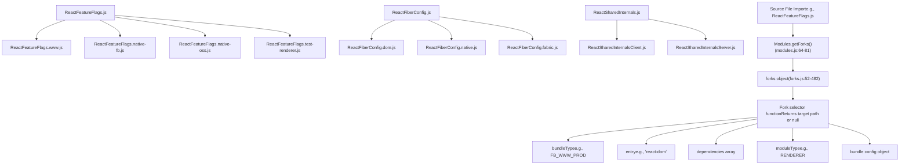
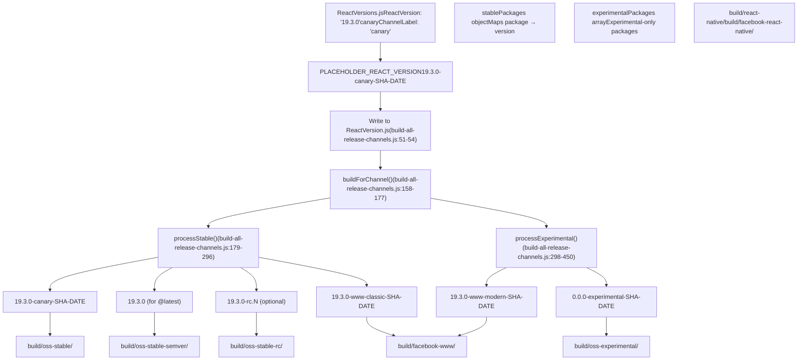
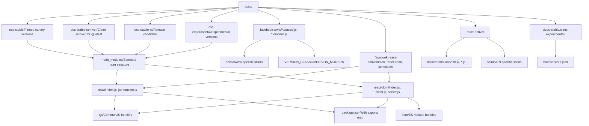
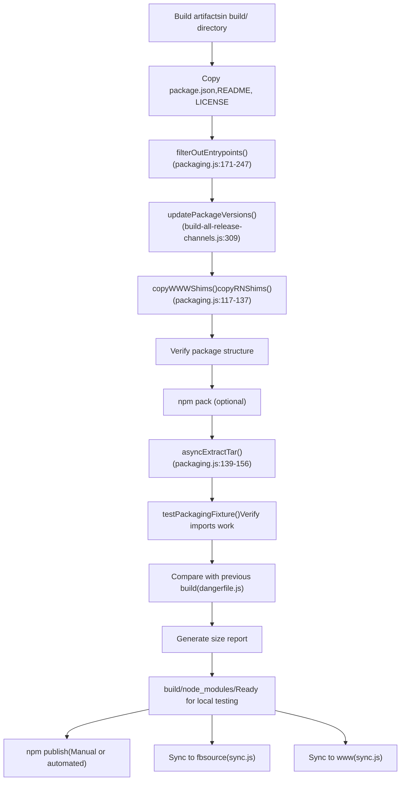
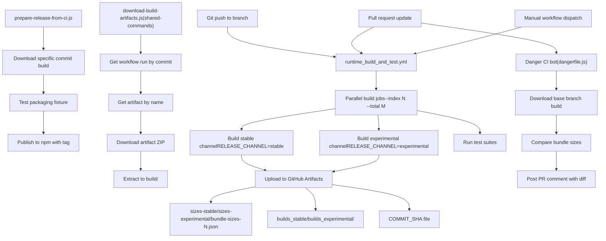

# 构建系统与包分发

相关源文件

-   [.gitignore](https://github.com/facebook/react/blob/65eec428/.gitignore)
-   [ReactVersions.js](https://github.com/facebook/react/blob/65eec428/ReactVersions.js)
-   [dangerfile.js](https://github.com/facebook/react/blob/65eec428/dangerfile.js)
-   [package.json](https://github.com/facebook/react/blob/65eec428/package.json)
-   [packages/eslint-plugin-react-hooks/package.json](https://github.com/facebook/react/blob/65eec428/packages/eslint-plugin-react-hooks/package.json)
-   [packages/jest-react/package.json](https://github.com/facebook/react/blob/65eec428/packages/jest-react/package.json)
-   [packages/react-art/package.json](https://github.com/facebook/react/blob/65eec428/packages/react-art/package.json)
-   [packages/react-dom/package.json](https://github.com/facebook/react/blob/65eec428/packages/react-dom/package.json)
-   [packages/react-is/package.json](https://github.com/facebook/react/blob/65eec428/packages/react-is/package.json)
-   [packages/react-native-renderer/package.json](https://github.com/facebook/react/blob/65eec428/packages/react-native-renderer/package.json)
-   [packages/react-native-renderer/src/ReactNativeAttributePayload.js](https://github.com/facebook/react/blob/65eec428/packages/react-native-renderer/src/ReactNativeAttributePayload.js)
-   [packages/react-native-renderer/src/\_\_mocks\_\_/react-native/Libraries/ReactPrivate/deepDiffer.js](https://github.com/facebook/react/blob/65eec428/packages/react-native-renderer/src/__mocks__/react-native/Libraries/ReactPrivate/deepDiffer.js)
-   [packages/react-noop-renderer/package.json](https://github.com/facebook/react/blob/65eec428/packages/react-noop-renderer/package.json)
-   [packages/react-reconciler/package.json](https://github.com/facebook/react/blob/65eec428/packages/react-reconciler/package.json)
-   [packages/react-test-renderer/package.json](https://github.com/facebook/react/blob/65eec428/packages/react-test-renderer/package.json)
-   [packages/react/package.json](https://github.com/facebook/react/blob/65eec428/packages/react/package.json)
-   [packages/scheduler/package.json](https://github.com/facebook/react/blob/65eec428/packages/scheduler/package.json)
-   [packages/shared/ReactVersion.js](https://github.com/facebook/react/blob/65eec428/packages/shared/ReactVersion.js)
-   [packages/use-sync-external-store/package.json](https://github.com/facebook/react/blob/65eec428/packages/use-sync-external-store/package.json)
-   [scripts/flow/config/flowconfig](https://github.com/facebook/react/blob/65eec428/scripts/flow/config/flowconfig)
-   [scripts/flow/createFlowConfigs.js](https://github.com/facebook/react/blob/65eec428/scripts/flow/createFlowConfigs.js)
-   [scripts/jest/jest-cli.js](https://github.com/facebook/react/blob/65eec428/scripts/jest/jest-cli.js)
-   [scripts/jest/setupHostConfigs.js](https://github.com/facebook/react/blob/65eec428/scripts/jest/setupHostConfigs.js)
-   [scripts/release/download-experimental-build-commands/print-summary.js](https://github.com/facebook/react/blob/65eec428/scripts/release/download-experimental-build-commands/print-summary.js)
-   [scripts/release/download-experimental-build.js](https://github.com/facebook/react/blob/65eec428/scripts/release/download-experimental-build.js)
-   [scripts/release/prepare-release-from-ci.js](https://github.com/facebook/react/blob/65eec428/scripts/release/prepare-release-from-ci.js)
-   [scripts/release/shared-commands/download-build-artifacts.js](https://github.com/facebook/react/blob/65eec428/scripts/release/shared-commands/download-build-artifacts.js)
-   [scripts/release/shared-commands/parse-params.js](https://github.com/facebook/react/blob/65eec428/scripts/release/shared-commands/parse-params.js)
-   [scripts/release/theme.js](https://github.com/facebook/react/blob/65eec428/scripts/release/theme.js)
-   [scripts/release/utils.js](https://github.com/facebook/react/blob/65eec428/scripts/release/utils.js)
-   [scripts/rollup/build-all-release-channels.js](https://github.com/facebook/react/blob/65eec428/scripts/rollup/build-all-release-channels.js)
-   [scripts/rollup/build.js](https://github.com/facebook/react/blob/65eec428/scripts/rollup/build.js)
-   [scripts/rollup/bundles.js](https://github.com/facebook/react/blob/65eec428/scripts/rollup/bundles.js)
-   [scripts/rollup/forks.js](https://github.com/facebook/react/blob/65eec428/scripts/rollup/forks.js)
-   [scripts/rollup/modules.js](https://github.com/facebook/react/blob/65eec428/scripts/rollup/modules.js)
-   [scripts/rollup/packaging.js](https://github.com/facebook/react/blob/65eec428/scripts/rollup/packaging.js)
-   [scripts/rollup/plugins/closure-plugin.js](https://github.com/facebook/react/blob/65eec428/scripts/rollup/plugins/closure-plugin.js)
-   [scripts/rollup/plugins/sizes-plugin.js](https://github.com/facebook/react/blob/65eec428/scripts/rollup/plugins/sizes-plugin.js)
-   [scripts/rollup/plugins/use-forks-plugin.js](https://github.com/facebook/react/blob/65eec428/scripts/rollup/plugins/use-forks-plugin.js)
-   [scripts/rollup/stats.js](https://github.com/facebook/react/blob/65eec428/scripts/rollup/stats.js)
-   [scripts/rollup/sync.js](https://github.com/facebook/react/blob/65eec428/scripts/rollup/sync.js)
-   [scripts/rollup/wrappers.js](https://github.com/facebook/react/blob/65eec428/scripts/rollup/wrappers.js)
-   [scripts/shared/inlinedHostConfigs.js](https://github.com/facebook/react/blob/65eec428/scripts/shared/inlinedHostConfigs.js)
-   [scripts/tasks/danger.js](https://github.com/facebook/react/blob/65eec428/scripts/tasks/danger.js)
-   [yarn.lock](https://github.com/facebook/react/blob/65eec428/yarn.lock)

## 目的与范围

本文档描述了 React 复杂的构建系统，该系统将源代码转换为适用于多个平台和发布渠道的可分发包。该系统负责处理打包生成、模块分叉、多渠道构建、版本控制以及 npm 发布前的包准备工作。

关于控制构建时行为的特性标志信息，请参阅 [特性标志系统](/facebook/react/2-feature-flags-system)。关于触发构建的 CI/CD 工作流，请参阅 [CI/CD 与构建产物管理](/facebook/react/3.3-cicd-and-artifact-management)。

## 概览

React 构建系统以 Rollup 打包工具为中心，由多个编排组件组成，旨在为不同环境（Node.js、浏览器、React Native）、发布渠道（stable, experimental, canary）以及内部/外部消费者（OSS, Facebook www, React Native internal）生成优化的 JavaScript 包。

**关键职责：**

-   通过 Babel 和 Closure Compiler 转换源文件
-   根据目标环境和打包类型分叉模块
-   从单一代码库生成多种打包变体
-   为每个发布渠道应用适当的版本控制方案
-   组织用于 npm 包分发的输出
-   支持具有不同优化策略的开发和生产构建

来源：[scripts/rollup/build.js1-800](https://github.com/facebook/react/blob/65eec428/scripts/rollup/build.js#L1-L800) [scripts/rollup/bundles.js1-1200](https://github.com/facebook/react/blob/65eec428/scripts/rollup/bundles.js#L1-L1200) [scripts/rollup/build-all-release-channels.js1-600](https://github.com/facebook/react/blob/65eec428/scripts/rollup/build-all-release-channels.js#L1-L600)

## 打包类型系统

构建系统定义了 17 种不同的打包类型，用于控制编译目标、模块格式和优化策略。这些类型被定义为常量并在整个构建流程中使用。

```mermaid
flowchart TD
    BundleTypes["bundleTypes object(bundles.js:10-31)"]
    NODE_ES2015["NODE_ES2015ES2020 syntax"]
    NODE_DEV["NODE_DEVCommonJS dev"]
    NODE_PROD["NODE_PRODCommonJS prod"]
    NODE_PROFILING["NODE_PROFILINGWith profiling"]
    ESM_DEV["ESM_DEVES modules dev"]
    ESM_PROD["ESM_PRODES modules prod"]
    BUN_DEV["BUN_DEVBun runtime dev"]
    BUN_PROD["BUN_PRODBun runtime prod"]
    FB_WWW_DEV["FB_WWW_DEVwww development"]
    FB_WWW_PROD["FB_WWW_PRODwww production"]
    FB_WWW_PROFILING["FB_WWW_PROFILINGwww profiling"]
    RN_OSS_DEV["RN_OSS_DEVRN open source dev"]
    RN_OSS_PROD["RN_OSS_PRODRN open source prod"]
    RN_OSS_PROFILING["RN_OSS_PROFILINGRN open source profiling"]
    RN_FB_DEV["RN_FB_DEVRN Facebook dev"]
    RN_FB_PROD["RN_FB_PRODRN Facebook prod"]
    RN_FB_PROFILING["RN_FB_PROFILINGRN Facebook profiling"]
    BROWSER_SCRIPT["BROWSER_SCRIPTStandalone IIFE"]
    CJS_DTS["CJS_DTSTypeScript defs CJS"]
    ESM_DTS["ESM_DTSTypeScript defs ESM"]

    BundleTypes --> NODE_ES2015
    BundleTypes --> NODE_DEV
    BundleTypes --> NODE_PROD
    BundleTypes --> NODE_PROFILING
    BundleTypes --> ESM_DEV
    BundleTypes --> ESM_PROD
    BundleTypes --> BUN_DEV
    BundleTypes --> BUN_PROD
    BundleTypes --> FB_WWW_DEV
    BundleTypes --> FB_WWW_PROD
    BundleTypes --> FB_WWW_PROFILING
    BundleTypes --> RN_OSS_DEV
    BundleTypes --> RN_OSS_PROD
    BundleTypes --> RN_OSS_PROFILING
    BundleTypes --> RN_FB_DEV
    BundleTypes --> RN_FB_PROD
    BundleTypes --> RN_FB_PROFILING
    BundleTypes --> BROWSER_SCRIPT
    BundleTypes --> CJS_DTS
    BundleTypes --> ESM_DTS
```


每种打包类型决定了：

-   **输出格式**：CommonJS (`cjs`)、ES modules (`es`) 或 IIFE (`iife`)，通过 `getFormat()` 获取 [scripts/rollup/build.js225-251](https://github.com/facebook/react/blob/65eec428/scripts/rollup/build.js#L225-L251)
-   **生产标志**：`isProductionBundleType()` 是否返回 true [scripts/rollup/build.js253-281](https://github.com/facebook/react/blob/65eec428/scripts/rollup/build.js#L253-L281)
-   **分析标志**：`isProfilingBundleType()` 是否返回 true [scripts/rollup/build.js283-310](https://github.com/facebook/react/blob/65eec428/scripts/rollup/build.js#L283-L310)
-   **模块分叉**：使用哪些特定于环境的实现
-   **Babel 转换**：通过 `getBabelConfig()` 应用 [scripts/rollup/build.js143-172](https://github.com/facebook/react/blob/65eec428/scripts/rollup/build.js#L143-L172)
-   **Closure Compiler**：应用于生产包 [scripts/rollup/build.js469-500](https://github.com/facebook/react/blob/65eec428/scripts/rollup/build.js#L469-L500)

来源：[scripts/rollup/bundles.js10-54](https://github.com/facebook/react/blob/65eec428/scripts/rollup/bundles.js#L10-L54) [scripts/rollup/build.js50-71](https://github.com/facebook/react/blob/65eec428/scripts/rollup/build.js#L50-L71) [scripts/rollup/build.js225-310](https://github.com/facebook/react/blob/65eec428/scripts/rollup/build.js#L225-L310)

## 打包配置 Schema

React 代码库中的每个包都在 `bundles` 数组中由一个配置对象定义。该 Schema 指定了要构建什么以及如何构建。

| 属性 | 类型 | 描述 |
| --- | --- | --- |
| `bundleTypes` | Array | 此条目应构建的打包类型列表 |
| `moduleType` | String | 以下之一：`ISOMORPHIC`, `RENDERER`, `RENDERER_UTILS`, `RECONCILER` |
| `entry` | String | 入口文件路径 (例如：`'react'`, `'react-dom/client'`) |
| `global` | String | UMD 构建的全局变量名 |
| `externals` | Array | 不打包的外部依赖 |
| `name` | String | 可选的自定义输出文件名 |
| `condition` | String | 可选的 package.json 导出条件 |
| `minifyWithProdErrorCodes` | Boolean | 是否将错误消息替换为代码 |
| `wrapWithModuleBoundaries` | Boolean | 是否用模块边界代码包裹 |

**打包定义示例：**

```
{
  bundleTypes: [NODE_DEV, NODE_PROD, FB_WWW_DEV, FB_WWW_PROD],
  moduleType: ISOMORPHIC,
  entry: 'react',
  global: 'React',
  minifyWithProdErrorCodes: false,
  wrapWithModuleBoundaries: true,
  externals: ['ReactNativeInternalFeatureFlags'],
}
```
来源：[scripts/rollup/bundles.js56-68](https://github.com/facebook/react/blob/65eec428/scripts/rollup/bundles.js#L56-L68) [scripts/rollup/bundles.js69-1200](https://github.com/facebook/react/blob/65eec428/scripts/rollup/bundles.js#L69-L1200)

## 模块分叉系统

模块分叉系统允许在构建时将单个源文件替换为特定于环境的实现。这对于支持具有不同 API 的多个平台至关重要。


**分叉解析示例：**

对于 `ReactFeatureFlags.js`，分叉选择器函数 [scripts/rollup/forks.js134-191](https://github.com/facebook/react/blob/65eec428/scripts/rollup/forks.js#L134-L191)：

```
'./packages/shared/ReactFeatureFlags.js': (bundleType, entry) => {
  switch (entry) {
    case 'react-native-renderer':
      // Returns native-fb or native-oss fork based on bundleType
    case 'react-test-renderer':
      // Returns test-renderer fork
    default:
      switch (bundleType) {
        case FB_WWW_DEV:
        case FB_WWW_PROD:
          return './packages/shared/forks/ReactFeatureFlags.www.js';
        // ... other cases
      }
  }
  return null; // Use original file
}
```
`useForks()` 插件 [scripts/rollup/plugins/use-forks-plugin.js1-100](https://github.com/facebook/react/blob/65eec428/scripts/rollup/plugins/use-forks-plugin.js#L1-L100) 拦截模块解析并在 Rollup 构建期间应用这些映射。

来源：[scripts/rollup/forks.js1-485](https://github.com/facebook/react/blob/65eec428/scripts/rollup/forks.js#L1-L485) [scripts/rollup/modules.js64-81](https://github.com/facebook/react/blob/65eec428/scripts/rollup/modules.js#L64-L81) [scripts/rollup/plugins/use-forks-plugin.js1-100](https://github.com/facebook/react/blob/65eec428/scripts/rollup/plugins/use-forks-plugin.js#L1-L100)

## 关键分叉映射

| 源模块 | 分叉用途 | 分叉路径 |
| --- | --- | --- |
| `ReactFeatureFlags.js` | 平台特性标志 | `*.www.js`, `*.native-fb.js`, `*.native-oss.js`, `*.test-renderer.js` |
| `ReactFiberConfig.js` | 宿主配置 (DOM vs Native) | `*.dom.js`, `*.native.js`, `*.fabric.js`, `*.custom.js` |
| `ReactSharedInternals.js` | 共享状态管理 | `*Client.js`, `*Server.js` |
| `ReactFlightServerConfig.js` | Server Component 配置 | `*.dom.js`, `*.webpack.js`, `*.turbopack.js` |
| `ReactFlightClientConfig.js` | Client Flight 配置 | `*.dom.js`, `*.webpack.js`, `*.turbopack.js` |
| `EventListener.js` | 事件处理 | `*-www.js` 用于 Facebook 内部 |

来源：[scripts/rollup/forks.js52-482](https://github.com/facebook/react/blob/65eec428/scripts/rollup/forks.js#L52-L482)

## 构建流程执行

构建过程由多个脚本编排，处理编译和打包的不同阶段。

```mermaid
flowchart TD
    YarnBuild["yarn build(package.json:125)"]
    BuildAllChannels["build-all-release-channels.jsMulti-channel orchestrator"]
    BuildScript["build.jsSingle channel builder"]
    ParseArgs["Parse CLI arguments--type, --release-channel"]
    SelectBundles["shouldSkipBundle()(build.js:548-583)"]
    ForEachBundle["Iterate bundles array"]
    ResolveEntry["resolveEntryFork()(build.js:585-633)"]
    CreateRollupConfig["Build rollup config(build.js:661-702)"]
    GetPlugins["getPlugins()(build.js:354-546)"]
    RollupBuild["rollup.rollup(config)"]
    RollupGenerate["bundle.generate(output)"]
    RollupWrite["bundle.write(output)"]
    DynamicImports["dynamicImports()Keep as externals"]
    FlowOrTS["Flow removal orTypeScript compilation"]
    UseForks["useForks()Apply module forks"]
    Resolve["resolve()Node resolution"]
    StripBanner["stripBanner()Remove licenses"]
    Babel["babel()ES2015 transform"]
    Replace["replace()DEV, EXPERIMENTAL"]
    TopLevelDefs["wrapWithTopLevelDefinitions(wrappers.js)"]
    Closure["closure()Production minification"]
    Prettier["prettier()Format output"]
    LicenseHeader["wrapWithLicenseHeader(wrappers.js)"]
    Sizes["sizes()Record bundle size"]
    OutputPath["getBundleOutputPath()(packaging.js:48-115)"]
    BuildDir["build/node_modules/build/facebook-www/build/react-native/"]

    YarnBuild --> BuildAllChannels
    BuildAllChannels --> BuildScript
    BuildScript --> ParseArgs
    ParseArgs --> SelectBundles
    SelectBundles --> ForEachBundle
    ForEachBundle --> ResolveEntry
    ResolveEntry --> CreateRollupConfig
    CreateRollupConfig --> GetPlugins
    GetPlugins --> RollupBuild
    RollupBuild --> DynamicImports
    DynamicImports --> FlowOrTS
    FlowOrTS --> UseForks
    UseForks --> Resolve
    Resolve --> StripBanner
    StripBanner --> Babel
    Babel --> Replace
    Replace --> TopLevelDefs
    TopLevelDefs --> Closure
    Closure --> Prettier
    Prettier --> LicenseHeader
    LicenseHeader --> Sizes
    Sizes --> RollupGenerate
    RollupGenerate --> RollupWrite
    RollupWrite --> OutputPath
    OutputPath --> BuildDir
```


**关键构建函数：**

-   `createBundle(bundle, bundleType)` [scripts/rollup/build.js635-800](https://github.com/facebook/react/blob/65eec428/scripts/rollup/build.js#L635-L800)：构建单个包的主要入口点
-   `getPlugins(...)` [scripts/rollup/build.js354-546](https://github.com/facebook/react/blob/65eec428/scripts/rollup/build.js#L354-L546)：根据打包类型组装 Rollup 插件链
-   `getBabelConfig(...)` [scripts/rollup/build.js143-172](https://github.com/facebook/react/blob/65eec428/scripts/rollup/build.js#L143-L172)：使用适当的插件配置 Babel 转换
-   `getRollupOutputOptions(...)` [scripts/rollup/build.js203-223](https://github.com/facebook/react/blob/65eec428/scripts/rollup/build.js#L203-L223)：生成 Rollup 输出配置

**环境变量：**

-   `RELEASE_CHANNEL`：设置为 `'stable'` 或 `'experimental'` 以控制构建哪个渠道
-   `__EXPERIMENTAL__`：源自 `RELEASE_CHANNEL`，用于分叉选择和特性标志

来源：[scripts/rollup/build.js1-800](https://github.com/facebook/react/blob/65eec428/scripts/rollup/build.js#L1-L800) [scripts/rollup/build-all-release-channels.js158-177](https://github.com/facebook/react/blob/65eec428/scripts/rollup/build-all-release-channels.js#L158-L177) [package.json125](https://github.com/facebook/react/blob/65eec428/package.json#L125-L125)

## Babel 转换流程

该构建使用自定义 Babel 配置，其中包含针对 ES5 的插件以实现最大兼容性，同时保留一些现代语法以供 Closure Compiler 优化。

**应用的插件：**

```
const babelPlugins = [
  ['@babel/plugin-proposal-class-properties', {loose: true}],
  'syntax-trailing-function-commas',
  ['@babel/plugin-proposal-object-rest-spread', {loose: true, useBuiltIns: true}],
  ['@babel/plugin-transform-template-literals', {loose: true}],
  '@babel/plugin-transform-for-of',
  ['@babel/plugin-transform-spread', {loose: true, useBuiltIns: true}],
  '@babel/plugin-transform-parameters',
  ['@babel/plugin-transform-destructuring', {loose: true, useBuiltIns: true}],
];
```
**针对开发构建的额外转换：**

```
const babelToES5Plugins = [
  '@babel/plugin-transform-literals',
  '@babel/plugin-transform-arrow-functions',
  '@babel/plugin-transform-block-scoped-functions',
  '@babel/plugin-transform-shorthand-properties',
  '@babel/plugin-transform-computed-properties',
  ['@babel/plugin-transform-block-scoping', {throwIfClosureRequired: true}],
];
```
**错误代码最小化：**

生产包使用 [scripts/error-codes/transform-error-messages.js](https://github.com/facebook/react/blob/65eec428/scripts/error-codes/transform-error-messages.js) 将错误消息替换为错误代码，以减少包大小并保持可调试性。

来源：[scripts/rollup/build.js111-141](https://github.com/facebook/react/blob/65eec428/scripts/rollup/build.js#L111-L141) [scripts/rollup/build.js143-172](https://github.com/facebook/react/blob/65eec428/scripts/rollup/build.js#L143-L172) [scripts/error-codes/transform-error-messages.js](https://github.com/facebook/react/blob/65eec428/scripts/error-codes/transform-error-messages.js)

## Closure Compiler 集成

生产包使用 Google Closure Compiler 进行高级优化，同时保留已发布制品中的可读性。

**Closure 配置：**

```
closure({
  compilation_level: 'SIMPLE',
  language_in: 'ECMASCRIPT_2020',
  language_out: bundleType === NODE_ES2015
    ? 'ECMASCRIPT_2020'
    : 'ECMASCRIPT5_STRICT',
  emit_use_strict: true,
  env: 'CUSTOM',
  warning_level: 'QUIET',
  use_types_for_optimization: false,
  process_common_js_modules: false,
  rewrite_polyfills: false,
  inject_libraries: false,
  allow_dynamic_import: true,
  assume_function_wrapper: true,
  renaming: false, // Preserve symbol names
})
```
**关键设置：**

-   `compilation_level: 'SIMPLE'`：执行优化而不进行激进的重命名
-   `renaming: false'`：保留原始变量和函数名称以提高可读性
-   `assume_function_wrapper: true`：防止全局变量污染

对于 ESM 包和 TypeScript 项目（它们有自己的优化），会跳过 Closure。

来源：[scripts/rollup/build.js469-500](https://github.com/facebook/react/blob/65eec428/scripts/rollup/build.js#L469-L500) [scripts/rollup/plugins/closure-plugin.js1-100](https://github.com/facebook/react/blob/65eec428/scripts/rollup/plugins/closure-plugin.js#L1-L100)

## 发布渠道与版本控制

React 为多个发布渠道构建制品，每个渠道都有独特的版本控制方案和稳定性保证。


**版本字符串格式：**

| 渠道 | 格式 | 示例 | npm 标签 |
| --- | --- | --- | --- |
| Stable Canary | `VERSION-LABEL-SHA-DATE` | `19.3.0-canary-a1c2d3e4-20250115` | `@canary` |
| Stable Semver | `VERSION` | `19.3.0` | `@latest` |
| Stable RC | `VERSION-rc.N` | `19.3.0-rc.0` | `@rc` |
| Experimental | `0.0.0-experimental-SHA-DATE` | `0.0.0-experimental-a1c2d3e4-20250115` | `@experimental` |
| Facebook www (classic) | `VERSION-www-classic-SHA-DATE` | `19.3.0-www-classic-a1c2d3e4-20250115` | n/a |
| Facebook www (modern) | `VERSION-www-modern-SHA-DATE` | `19.3.0-www-modern-a1c2d3e4-20250115` | n/a |
| React Native FB | `VERSION-native-fb-SHA-DATE` | `19.3.0-native-fb-a1c2d3e4-20250115` | n/a |

**版本更新流程：**

1.  使用占位符版本进行构建：`19.3.0-canary-SHA-DATE`
2.  对于每个渠道，调用 `updatePackageVersions()` [scripts/rollup/build-all-release-channels.js309-314](https://github.com/facebook/react/blob/65eec428/scripts/rollup/build-all-release-channels.js#L309-L314)
3.  更新输出目录中的所有 `package.json` 文件
4.  通过 `updatePlaceholderReactVersionInCompiledArtifacts()` 更新编译后的 JavaScript 中的版本字符串 [scripts/rollup/build-all-release-channels.js209-212](https://github.com/facebook/react/blob/65eec428/scripts/rollup/build-all-release-channels.js#L209-L212)

来源：[ReactVersions.js1-65](https://github.com/facebook/react/blob/65eec428/ReactVersions.js#L1-L65) [scripts/rollup/build-all-release-channels.js1-600](https://github.com/facebook/react/blob/65eec428/scripts/rollup/build-all-release-channels.js#L1-L600) [scripts/rollup/build-all-release-channels.js179-450](https://github.com/facebook/react/blob/65eec428/scripts/rollup/build-all-release-channels.js#L179-L450)

## 包输出结构

构建系统将编译后的构建产物组织成针对不同分发目标的结构化目录层级。


**路径解析：**

`getBundleOutputPath()` 函数 [scripts/rollup/packaging.js48-115](https://github.com/facebook/react/blob/65eec428/scripts/rollup/packaging.js#L48-L115) 根据打包类型确定输出位置：

| 打包类型 | 输出模式 | 示例 |
| --- | --- | --- |
| `NODE_DEV/PROD` | `build/node_modules/PKG/cjs/FILE` | `build/node_modules/react-dom/cjs/react-dom.development.js` |
| `ESM_DEV/PROD` | `build/node_modules/PKG/esm/FILE` | `build/node_modules/react-dom/esm/react-dom.production.js` |
| `FB_WWW_*` | `build/facebook-www/FILE` | `build/facebook-www/ReactDOM-prod.classic.js` |
| `RN_OSS_*` | `build/react-native/implementations/FILE` | `build/react-native/implementations/ReactNativeRenderer-dev.js` |
| `RN_FB_*` | `build/facebook-react-native/PKG/cjs/FILE` | `build/facebook-react-native/react/cjs/react.production.js` |
| `BROWSER_SCRIPT` | `build/node_modules/PKG/OUTPUT_PATH` | `build/node_modules/react-dom/unstable_server-external-runtime.js` |

**Package.json 导出映射：**

每个包都包含一个 `exports` 字段，将入口点映射到文件。构建过程通过 `filterOutEntrypoints()` 根据构建的包进行过滤 [scripts/rollup/packaging.js171-247](https://github.com/facebook/react/blob/65eec428/scripts/rollup/packaging.js#L171-L247)

来源：[scripts/rollup/packaging.js1-400](https://github.com/facebook/react/blob/65eec428/scripts/rollup/packaging.js#L1-L400) [scripts/rollup/packaging.js48-115](https://github.com/facebook/react/blob/65eec428/scripts/rollup/packaging.js#L48-L115) [scripts/rollup/build-all-release-channels.js179-450](https://github.com/facebook/react/blob/65eec428/scripts/rollup/build-all-release-channels.js#L179-L450)

## 包分发工作流

构建完成后，包在 npm 发布之前会经过额外的处理。


**关键函数：**

-   `prepareNpmPackage(name)` [scripts/rollup/packaging.js159-297](https://github.com/facebook/react/blob/65eec428/scripts/rollup/packaging.js#L159-L297)：复制源文件并过滤入口点
-   `updatePackageVersions(buildDir, versionsMap)` [scripts/rollup/build-all-release-channels.js460-550](https://github.com/facebook/react/blob/65eec428/scripts/rollup/build-all-release-channels.js#L460-L550)：使用正确的版本更新所有 `package.json` 文件
-   `updatePlaceholderReactVersionInCompiledArtifacts()` [scripts/rollup/build-all-release-channels.js552-600](https://github.com/facebook/react/blob/65eec428/scripts/rollup/build-all-release-channels.js#L552-L600)：替换 JavaScript 文件中的占位符版本

**入口点过滤：**

如果入口点未针对当前渠道构建，系统会将其从 `package.json` 的 `files` 和 `exports` 字段中移除。例如，实验性 API 会从稳定版构建中移除。

来源：[scripts/rollup/packaging.js159-297](https://github.com/facebook/react/blob/65eec428/scripts/rollup/packaging.js#L159-L297) [scripts/rollup/build-all-release-channels.js460-600](https://github.com/facebook/react/blob/65eec428/scripts/rollup/build-all-release-channels.js#L460-L600)

## CI/CD 集成

构建系统与 CircleCI 工作流集成，以实现自动化构建、测试和构建产物管理。


**CI 构建并行化：**

使用 `--index` 和 `--total` 标志，可以将构建拆分到多个 CI worker 上：

```
yarn build --ci --index=0 --total=5 --release-channel=stable
yarn build --ci --index=1 --total=5 --release-channel=stable
# ... etc
```
每个 worker 构建一部分包，并将其大小写入 `build/sizes/bundle-sizes-N.json`。这些文件稍后会合并。

**构建产物管理：**

-   **上传**：CircleCI 通过 GitHub Actions 工作流上传构建产物
-   **下载**：`download-build-artifacts.js` [scripts/release/shared-commands/download-build-artifacts.js1-200](https://github.com/facebook/react/blob/65eec428/scripts/release/shared-commands/download-build-artifacts.js#L1-L200) 按 commit SHA 获取
-   **验证**：检查 `COMMIT_SHA` 文件是否与预期提交匹配

**Size Bot:**

`dangerfile.js` [dangerfile.js1-283](https://github.com/facebook/react/blob/65eec428/dangerfile.js#L1-L283) 脚本：

1.  下载基准（base）和头部（head）构建产物
2.  比较所有包的 gzip 大小
3.  识别关键的大小变化（>2% 阈值）
4.  将格式化表格发布到 PR 评论中

来源：[scripts/release/shared-commands/download-build-artifacts.js1-200](https://github.com/facebook/react/blob/65eec428/scripts/release/shared-commands/download-build-artifacts.js#L1-L200) [dangerfile.js1-283](https://github.com/facebook/react/blob/65eec428/dangerfile.js#L1-L283) [scripts/rollup/build-all-release-channels.js110-156](https://github.com/facebook/react/blob/65eec428/scripts/rollup/build-all-release-channels.js#L110-L156)

## 构建命令参考

| 命令 | 描述 |
| --- | --- |
| `yarn build` | 使用默认设置构建所有渠道 |
| `yarn build --type=NODE_DEV` | 仅构建 NODE\_DEV 包 |
| `yarn build react/index,react-dom/index` | 构建特定入口点 |
| `yarn build --release-channel=stable` | 仅构建稳定渠道 |
| `yarn build --release-channel=experimental` | 仅构建实验渠道 |
| `yarn build --ci --index=0 --total=5` | CI 并行化（构建 1/5 的包） |
| `yarn build --pretty` | 强制美化输出（跳过压缩） |
| `yarn build --watch` | 开发用监听模式 |
| `yarn build --sync-fbsource=PATH` | 将输出同步到 fbsource 位置 |
| `yarn build --sync-www=PATH` | 将输出同步到 www 位置 |
| `yarn build-for-devtools` | 构建 DevTools 所需的包 |

**环境变量：**

-   `RELEASE_CHANNEL`：设置为 `'stable'` 或 `'experimental'`
-   `CI`：设置为 `true` 以启用 CI 特定行为
-   `NODE_INDEX`：并行构建的 Worker 索引
-   `CI_TOTAL`：并行 Worker 总数

来源：[package.json125-156](https://github.com/facebook/react/blob/65eec428/package.json#L125-L156) [scripts/rollup/build.js94-108](https://github.com/facebook/react/blob/65eec428/scripts/rollup/build.js#L94-L108) [scripts/rollup/build-all-release-channels.js56-109](https://github.com/facebook/react/blob/65eec428/scripts/rollup/build-all-release-channels.js#L56-L109)

## 构建性能优化

构建系统采用多种策略来优化构建时间：

1.  **条件编译**：通过 `replace()` 插件，包仅包含与其打包类型相关的代码路径
2.  **并行执行**：本地运行时，多个包可以并发构建
3.  **CI 并行化**：将工作分配给多个 worker
4.  **增量构建**：监听模式仅重建更改的包
5.  **选择性构建**：CLI 标志过滤要构建的包
6.  **插件排序**：快速插件（strip-banner, replace）在慢速插件（Babel, Closure）之前运行
7.  **Tree Shaking**：Rollup 通过 `treeshake.moduleSideEffects` 配置移除未使用的代码

**构建时间估算：**

-   完整构建（所有渠道）：~10-15 分钟
-   单渠道：~5-7 分钟
-   单包：~10-30 秒
-   CI 并行构建（5 个 worker）：~3-5 分钟

来源：[scripts/rollup/build.js354-546](https://github.com/facebook/react/blob/65eec428/scripts/rollup/build.js#L354-L546) [scripts/rollup/build.js661-702](https://github.com/facebook/react/blob/65eec428/scripts/rollup/build.js#L661-L702)
