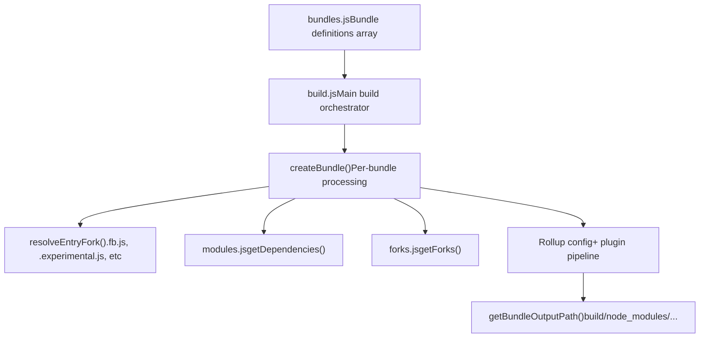
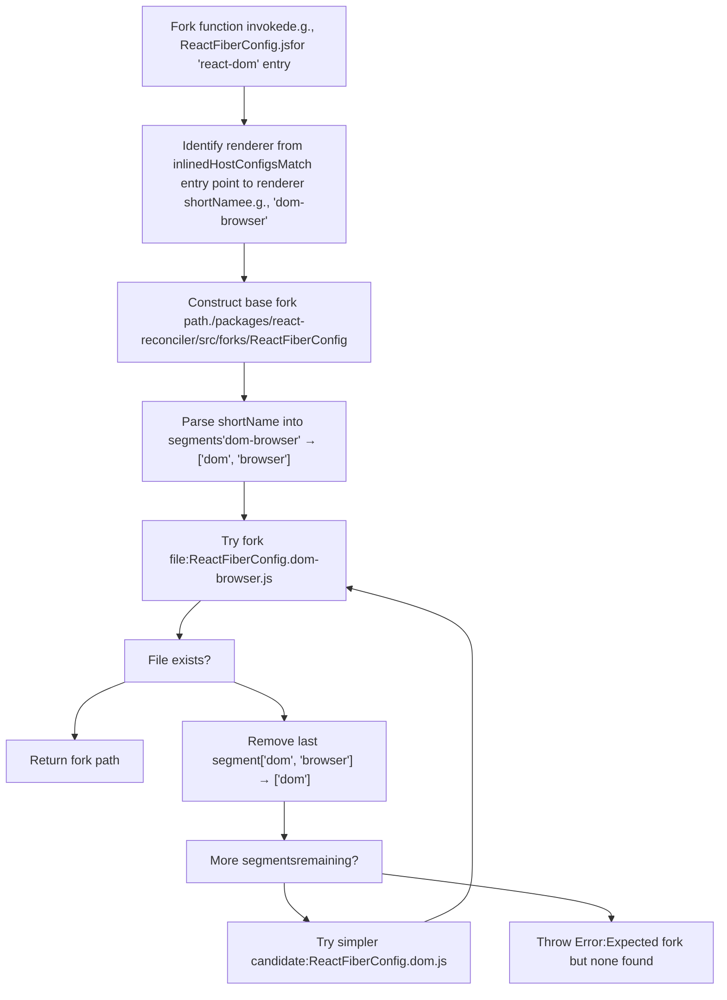
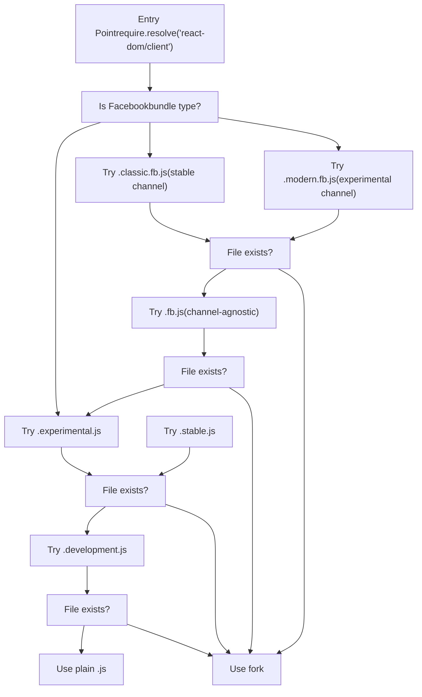
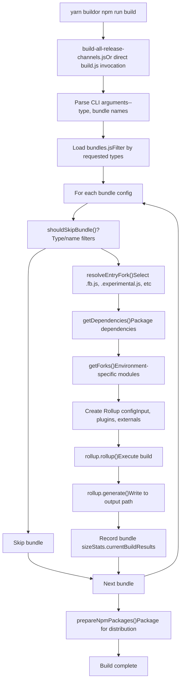

# 构建流水线与模块分叉

相关源文件

-   [.gitignore](https://github.com/facebook/react/blob/65eec428/.gitignore)
-   [package.json](https://github.com/facebook/react/blob/65eec428/package.json)
-   [packages/eslint-plugin-react-hooks/package.json](https://github.com/facebook/react/blob/65eec428/packages/eslint-plugin-react-hooks/package.json)
-   [packages/jest-react/package.json](https://github.com/facebook/react/blob/65eec428/packages/jest-react/package.json)
-   [packages/react-art/package.json](https://github.com/facebook/react/blob/65eec428/packages/react-art/package.json)
-   [packages/react-dom/package.json](https://github.com/facebook/react/blob/65eec428/packages/react-dom/package.json)
-   [packages/react-is/package.json](https://github.com/facebook/react/blob/65eec428/packages/react-is/package.json)
-   [packages/react-native-renderer/package.json](https://github.com/facebook/react/blob/65eec428/packages/react-native-renderer/package.json)
-   [packages/react-noop-renderer/package.json](https://github.com/facebook/react/blob/65eec428/packages/react-noop-renderer/package.json)
-   [packages/react-reconciler/package.json](https://github.com/facebook/react/blob/65eec428/packages/react-reconciler/package.json)
-   [packages/react-test-renderer/package.json](https://github.com/facebook/react/blob/65eec428/packages/react-test-renderer/package.json)
-   [packages/react/package.json](https://github.com/facebook/react/blob/65eec428/packages/react/package.json)
-   [packages/scheduler/package.json](https://github.com/facebook/react/blob/65eec428/packages/scheduler/package.json)
-   [packages/shared/ReactVersion.js](https://github.com/facebook/react/blob/65eec428/packages/shared/ReactVersion.js)
-   [scripts/flow/config/flowconfig](https://github.com/facebook/react/blob/65eec428/scripts/flow/config/flowconfig)
-   [scripts/flow/createFlowConfigs.js](https://github.com/facebook/react/blob/65eec428/scripts/flow/createFlowConfigs.js)
-   [scripts/jest/setupHostConfigs.js](https://github.com/facebook/react/blob/65eec428/scripts/jest/setupHostConfigs.js)
-   [scripts/rollup/build.js](https://github.com/facebook/react/blob/65eec428/scripts/rollup/build.js)
-   [scripts/rollup/bundles.js](https://github.com/facebook/react/blob/65eec428/scripts/rollup/bundles.js)
-   [scripts/rollup/forks.js](https://github.com/facebook/react/blob/65eec428/scripts/rollup/forks.js)
-   [scripts/rollup/modules.js](https://github.com/facebook/react/blob/65eec428/scripts/rollup/modules.js)
-   [scripts/rollup/packaging.js](https://github.com/facebook/react/blob/65eec428/scripts/rollup/packaging.js)
-   [scripts/rollup/sync.js](https://github.com/facebook/react/blob/65eec428/scripts/rollup/sync.js)
-   [scripts/rollup/wrappers.js](https://github.com/facebook/react/blob/65eec428/scripts/rollup/wrappers.js)
-   [scripts/shared/inlinedHostConfigs.js](https://github.com/facebook/react/blob/65eec428/scripts/shared/inlinedHostConfigs.js)
-   [yarn.lock](https://github.com/facebook/react/blob/65eec428/yarn.lock)

## 目的与范围

本文档详细介绍了基于 Rollup 的 React 构建流水线，该流水线将源代码编译为适用于不同环境的可分发包。构建系统最显著的特点是其模块分叉机制，该机制允许单一源代码树编译为特定于环境的实现，而无需条件导入。本页面涵盖了 Rollup 插件流水线、打包类型矩阵、分叉解析算法，以及复杂的入口点选择系统，这些系统使 React 能够为 Facebook 内部构建 (FB\_WWW)、React Native（开源和内部）、Node.js、浏览器和其他环境发布优化的代码。关于打包构建产物以进行 npm 分发的信息，请参阅 [发布渠道与版本控制](/facebook/react/3.2-release-channels-and-versioning)。

---

## 打包类型矩阵

React 生成 20 多种不同的打包类型，每种都针对特定的环境和使用模式进行了优化。打包类型定义为常量，决定了编译设置、模块格式和优化级别。

### 核心打包类型分类

| 打包类型 | 格式 | 环境 | 优化 | 用例 |
| --- | --- | --- | --- | --- |
| `NODE_DEV` | CJS | Node.js | 开发 | 本地开发，测试 |
| `NODE_PROD` | CJS | Node.js | 生产 | 生产环境 SSR |
| `NODE_PROFILING` | CJS | Node.js | 性能分析 | 性能分析 |
| `NODE_ES2015` | CJS | Node.js | ES2015 语法 | 内部工具 |
| `ESM_DEV` | ESM | 浏览器 | 开发 | 现代打包工具 (dev) |
| `ESM_PROD` | ESM | 浏览器 | 生产 | 现代打包工具 (prod) |
| `BUN_DEV` | CJS | Bun runtime | 开发 | Bun 特定 dev |
| `BUN_PROD` | CJS | Bun runtime | 生产 | Bun 特定 prod |
| `FB_WWW_DEV` | CJS | Facebook WWW | 开发 | 内部 FB web dev |
| `FB_WWW_PROD` | CJS | Facebook WWW | 生产 | 内部 FB web prod |
| `FB_WWW_PROFILING` | CJS | Facebook WWW | 性能分析 | 内部 FB 性能分析 |
| `RN_OSS_DEV` | CJS | React Native OSS | 开发 | RN 社区 dev |
| `RN_OSS_PROD` | CJS | React Native OSS | 生产 | RN 社区 prod |
| `RN_OSS_PROFILING` | CJS | React Native OSS | 性能分析 | RN 社区性能分析 |
| `RN_FB_DEV` | CJS | React Native FB | 开发 | 内部 FB RN dev |
| `RN_FB_PROD` | CJS | React Native FB | 生产 | 内部 FB RN prod |
| `RN_FB_PROFILING` | CJS | React Native FB | 性能分析 | 内部 FB RN 性能分析 |
| `BROWSER_SCRIPT` | IIFE | 浏览器 | 生产 | UMD/script 标签 |
| `CJS_DTS` | CJS | TypeScript | 仅类型 | 类型定义 |
| `ESM_DTS` | ESM | TypeScript | 仅类型 | 类型定义 |

**来源：** [scripts/rollup/bundles.js10-31](https://github.com/facebook/react/blob/65eec428/scripts/rollup/bundles.js#L10-L31) [scripts/rollup/build.js50-71](https://github.com/facebook/react/blob/65eec428/scripts/rollup/build.js#L50-L71)

### 打包类型特征图

```mermaid
flowchart TD
    NODE_PROFILING["NODE_PROFILINGPROFILE=trueInstrumented"]
    FB_WWW_PROFILING["FB_WWW_PROFILINGPROFILE=trueFB profiling"]
    NODE_PROD["NODE_PRODDEV=falseMinified"]
    ESM_PROD["ESM_PRODDEV=falseMinified"]
    FB_WWW_PROD["FB_WWW_PRODDEV=falseClosure minified"]
    RN_OSS_PROD["RN_OSS_PRODDEV=falseMinified"]
    NODE_DEV["NODE_DEVDEV=trueReadable output"]
    ESM_DEV["ESM_DEVDEV=trueNo minification"]
    FB_WWW_DEV["FB_WWW_DEVDEV=trueFB-specific"]
    RN_OSS_DEV["RN_OSS_DEVDEV=trueRN-specific"]
```


**来源：** [scripts/rollup/build.js253-310](https://github.com/facebook/react/blob/65eec428/scripts/rollup/build.js#L253-L310) [scripts/rollup/bundles.js10-54](https://github.com/facebook/react/blob/65eec428/scripts/rollup/bundles.js#L10-L54)

---

## 打包配置系统

所有包都在一个单一的真实来源中配置：[scripts/rollup/bundles.js](https://github.com/facebook/react/blob/65eec428/scripts/rollup/bundles.js) 中的 `bundles` 数组。

### 打包配置结构

每个包条目定义了：

-   **`bundleTypes`**：打包类型常量的数组，指示要构建哪些变体
-   **`moduleType`**：`ISOMORPHIC`, `RENDERER`, `RENDERER_UTILS`, 或 `RECONCILER` 之一
-   **`entry`**：入口点路径 (例如：`'react'`, `'react-dom/client'`)
-   **`global`**：UMD 构建的全局变量名
-   **`externals`**：应保留为外部的依赖项
-   **`minifyWithProdErrorCodes`**：是否将错误消息替换为代码
-   **`wrapWithModuleBoundaries`**：是否使用 DevTools 注册进行包装
-   **`name`** (可选)：自定义输出文件名
-   **`condition`** (可选)：Package.json 导出条件 (例如：`'react-server'`)
-   **`tsconfig`** (可选)：TS 包的 TypeScript 配置路径

**配置示例：**

```
{
  bundleTypes: [NODE_DEV, NODE_PROD, FB_WWW_DEV, FB_WWW_PROD],
  moduleType: ISOMORPHIC,
  entry: 'react',
  global: 'React',
  minifyWithProdErrorCodes: false,
  wrapWithModuleBoundaries: true,
  externals: ['ReactNativeInternalFeatureFlags']
}
```
**来源：** [scripts/rollup/bundles.js69-88](https://github.com/facebook/react/blob/65eec428/scripts/rollup/bundles.js#L69-L88) [scripts/rollup/bundles.js56-67](https://github.com/facebook/react/blob/65eec428/scripts/rollup/bundles.js#L56-L67)

### 模块类型

模块类型决定了包如何与 Reconciler 和宿主环境交互：

| 模块类型 | 描述 | 示例 |
| --- | --- | --- |
| `ISOMORPHIC` | 可以在客户端和服务端运行 | `react`, `react/jsx-runtime` |
| `RENDERER` | 包含 Reconciler，针对特定宿主 | `react-dom`, `react-native-renderer` |
| `RENDERER_UTILS` | 渲染器的辅助包 | `react-dom/test-utils` |
| `RECONCILER` | 用于自定义渲染器的独立 Reconciler | `react-reconciler` |

**来源：** [scripts/rollup/bundles.js56-65](https://github.com/facebook/react/blob/65eec428/scripts/rollup/bundles.js#L56-L65)

### 打包配置流程


**来源：** [scripts/rollup/build.js635-758](https://github.com/facebook/react/blob/65eec428/scripts/rollup/build.js#L635-L758) [scripts/rollup/bundles.js1-1027](https://github.com/facebook/react/blob/65eec428/scripts/rollup/bundles.js#L1-L1027)

---

## 模块分叉系统

模块分叉系统是 React 构建架构的基石。它启用了特定于环境的实现，而不会用条件逻辑污染源代码。在构建时，导入会根据打包类型、入口点和宿主配置重定向到专门的实现。

### 分叉解析架构

**来源：** [scripts/rollup/forks.js52-482](https://github.com/facebook/react/blob/65eec428/scripts/rollup/forks.js#L52-L482) [scripts/rollup/plugins/use-forks-plugin.js1-56](https://github.com/facebook/react/blob/65eec428/scripts/rollup/plugins/use-forks-plugin.js#L1-L56) [scripts/rollup/modules.js64-81](https://github.com/facebook/react/blob/65eec428/scripts/rollup/modules.js#L64-L81)

### 分叉注册表结构

分叉在 [scripts/rollup/forks.js](https://github.com/facebook/react/blob/65eec428/scripts/rollup/forks.js) 中注册为一个冻结对象，将原始模块路径映射到解析器函数：

```
const forks = Object.freeze({
  './packages/shared/ReactFeatureFlags.js': (bundleType, entry, deps, moduleType, bundle) => {
    // Returns path to forked implementation or null
  },
  './packages/react-reconciler/src/ReactFiberConfig.js': (bundleType, entry, deps, moduleType) => {
    // Returns host config fork based on renderer
  },
  // ... other forks
});
```
**关键分叉类别：**

| 分叉模块 | 用途 | 变体 |
| --- | --- | --- |
| `ReactFeatureFlags.js` | 每个环境的特性标志值 | www, native-fb, native-oss, test-renderer |
| `ReactFiberConfig.js` | 渲染器的宿主配置 | dom-browser, dom-node, native, custom |
| `ReactSharedInternals.js` | 避免循环依赖 | client, server, react-server |
| `ReactFlightServerConfig.js` | Flight server 配置 | dom, native, custom |
| `ReactFlightClientConfig.js` | Flight client 配置 | dom, native, custom |
| `ReactFizzConfig.js` | SSR/Fizz 配置 | dom-browser, dom-node, native |
| `SchedulerFeatureFlags.js` | Scheduler 特性标志 | www, native-fb, default |
| `EventListener.js` | 事件监听器集成 | www (with TimeSlice profiling) |

**来源：** [scripts/rollup/forks.js52-482](https://github.com/facebook/react/blob/65eec428/scripts/rollup/forks.js#L52-L482)

### 分叉解析算法

分叉解析器对宿主配置使用分层回退系统，尝试逐步简化的分叉名称：


**来源：** [scripts/rollup/forks.js29-43](https://github.com/facebook/react/blob/65eec428/scripts/rollup/forks.js#L29-L43) [scripts/rollup/forks.js242-274](https://github.com/facebook/react/blob/65eec428/scripts/rollup/forks.js#L242-L274)

### 关键分叉示例

#### ReactFeatureFlags 分叉选择

最频繁分叉的模块，每个环境具有不同的标志值：

```
// In forks.js
'./packages/shared/ReactFeatureFlags.js': (bundleType, entry) => {
  switch (bundleType) {
    case FB_WWW_DEV:
    case FB_WWW_PROD:
    case FB_WWW_PROFILING:
      return './packages/shared/forks/ReactFeatureFlags.www.js';
    case RN_FB_DEV:
    case RN_FB_PROD:
    case RN_FB_PROFILING:
      return './packages/shared/forks/ReactFeatureFlags.native-fb.js';
    // ... other cases
  }
}
```
**分叉变体：**

-   [packages/shared/forks/ReactFeatureFlags.www.js](https://github.com/facebook/react/blob/65eec428/packages/shared/forks/ReactFeatureFlags.www.js) - Facebook web 平台
-   [packages/shared/forks/ReactFeatureFlags.native-fb.js](https://github.com/facebook/react/blob/65eec428/packages/shared/forks/ReactFeatureFlags.native-fb.js) - Facebook React Native
-   [packages/shared/forks/ReactFeatureFlags.native-oss.js](https://github.com/facebook/react/blob/65eec428/packages/shared/forks/ReactFeatureFlags.native-oss.js) - React Native 开源
-   [packages/shared/forks/ReactFeatureFlags.test-renderer.js](https://github.com/facebook/react/blob/65eec428/packages/shared/forks/ReactFeatureFlags.test-renderer.js) - 测试渲染器
-   [packages/shared/forks/ReactFeatureFlags.test-renderer.www.js](https://github.com/facebook/react/blob/65eec428/packages/shared/forks/ReactFeatureFlags.test-renderer.www.js) - 用于 www 的测试渲染器
-   [packages/shared/forks/ReactFeatureFlags.test-renderer.native-fb.js](https://github.com/facebook/react/blob/65eec428/packages/shared/forks/ReactFeatureFlags.test-renderer.native-fb.js) - 用于 native-fb 的测试渲染器

**来源：** [scripts/rollup/forks.js134-190](https://github.com/facebook/react/blob/65eec428/scripts/rollup/forks.js#L134-L190)

#### ReactFiberConfig (宿主配置) 分叉

宿主配置决定了 Reconciler 使用哪个渲染器实现：

```
'./packages/react-reconciler/src/ReactFiberConfig.js': (bundleType, entry, deps, moduleType) => {
  // Find matching renderer from inlinedHostConfigs
  for (let rendererInfo of inlinedHostConfigs) {
    if (rendererInfo.entryPoints.indexOf(entry) !== -1) {
      const foundFork = findNearestExistingForkFile(
        './packages/react-reconciler/src/forks/ReactFiberConfig.',
        rendererInfo.shortName,  // e.g., 'dom-browser'
        '.js'
      );
      return foundFork; // e.g., ReactFiberConfig.dom.js
    }
  }
  throw new Error('Expected ReactFiberConfig fork');
}
```
**可用分叉：**

-   [packages/react-reconciler/src/forks/ReactFiberConfig.dom.js](https://github.com/facebook/react/blob/65eec428/packages/react-reconciler/src/forks/ReactFiberConfig.dom.js) - DOM 渲染器
-   [packages/react-reconciler/src/forks/ReactFiberConfig.native.js](https://github.com/facebook/react/blob/65eec428/packages/react-reconciler/src/forks/ReactFiberConfig.native.js) - React Native
-   [packages/react-reconciler/src/forks/ReactFiberConfig.art.js](https://github.com/facebook/react/blob/65eec428/packages/react-reconciler/src/forks/ReactFiberConfig.art.js) - React ART

分叉选择基于 [scripts/shared/inlinedHostConfigs.js](https://github.com/facebook/react/blob/65eec428/scripts/shared/inlinedHostConfigs.js) 中的 `inlinedHostConfigs` 映射，它将入口点与渲染器配置相关联。

**来源：** [scripts/rollup/forks.js242-274](https://github.com/facebook/react/blob/65eec428/scripts/rollup/forks.js#L242-L274) [scripts/shared/inlinedHostConfigs.js1-589](https://github.com/facebook/react/blob/65eec428/scripts/shared/inlinedHostConfigs.js#L1-L589)

#### ReactSharedInternals 分叉

通过选择不同的内部实现来解决循环依赖问题：

```
'./packages/shared/ReactSharedInternals.js': (bundleType, entry, deps, _moduleType, bundle) => {
  if (entry === 'react') {
    return './packages/react/src/ReactSharedInternalsClient.js';
  }
  if (entry === 'react/src/ReactServer.js') {
    return './packages/react/src/ReactSharedInternalsServer.js';
  }
  if (bundle.condition === 'react-server') {
    return './packages/react-server/src/ReactSharedInternalsServer.js';
  }
  // ... error handling
}
```
**来源：** [scripts/rollup/forks.js55-89](https://github.com/facebook/react/blob/65eec428/scripts/rollup/forks.js#L55-L89)

---

## 入口点分叉解析

除了模块级分叉外，入口点本身也可以在构建时选择特定于环境的变体。

### 入口点分叉优先级

当解析入口点（例如 `react-dom/client`）时，构建系统按优先级顺序搜索分叉：


**来源：** [scripts/rollup/build.js585-633](https://github.com/facebook/react/blob/65eec428/scripts/rollup/build.js#L585-L633)

### 入口分叉解析函数

`resolveEntryFork()` 函数实现了这个优先级系统：

```
function resolveEntryFork(resolvedEntry, isFBBundle, isDev) {
  if (isFBBundle) {
    const resolvedFBEntry = resolvedEntry.replace(
      '.js',
      __EXPERIMENTAL__ ? '.modern.fb.js' : '.classic.fb.js'
    );
    if (fs.existsSync(resolvedFBEntry)) {
      return resolvedFBEntry;
    }
    // Try generic .fb.js
    const resolvedGenericFBEntry = resolvedEntry.replace('.js', '.fb.js');
    if (fs.existsSync(resolvedGenericFBEntry)) {
      return resolvedGenericFBEntry;
    }
  }

  // Try release channel forks
  const resolvedForkedEntry = resolvedEntry.replace(
    '.js',
    __EXPERIMENTAL__ ? '.experimental.js' : '.stable.js'
  );
  if (fs.existsSync(resolvedForkedEntry)) {
    return resolvedForkedEntry;
  }

  // Fallback to plain .js
  return resolvedEntry;
}
```
**来源：** [scripts/rollup/build.js585-633](https://github.com/facebook/react/blob/65eec428/scripts/rollup/build.js#L585-L633)

### 示例：React DOM 入口分叉

对于 `FB_WWW_DEV` 打包类型的 `react-dom` 入口点：

1.  检查 `packages/react-dom/src/ReactDOMFB.modern.js` (如果 `__EXPERIMENTAL__`)
2.  检查 `packages/react-dom/src/ReactDOMFB.js`
3.  使用与内部基础设施集成的 Facebook 特定实现

对于标准 `NODE_DEV` 构建：

1.  检查 `packages/react-dom/index.experimental.js` (如果 `__EXPERIMENTAL__`)
2.  回退到 `packages/react-dom/index.js`

**来源：** [scripts/rollup/build.js644-648](https://github.com/facebook/react/blob/65eec428/scripts/rollup/build.js#L644-L648)

---

## Rollup 插件流水线

构建使用复杂的 Rollup 插件流水线，通过多个阶段转换代码。流水线在不同打包类型之间略有差异，但遵循一致的模式。

### 插件执行顺序

```mermaid
flowchart TD
    Input["Entry Point(e.g., react-dom/client)"]
    DynamicImports["dynamicImports()Keep dynamic imports external"]
    TypeScript["typescript() orflowRemoveTypes()Type stripping"]
    CommonJS["commonjs()For TS bundles only"]
    UseForks["useForks()Environment-specific modules"]
    ForbidFBJS["forbidFBJSImports()Prevent fbjs imports"]
    Resolve["resolve()Node module resolution"]
    StripBanner["stripBanner()Remove license headers"]
    Babel["babel()ES2015+ transpilation"]
    RemoveUseStrict["Remove 'use strict'Per-module directives"]
    Replace["replace()DEV, PROFILE, etc"]
    ExternalRuntime["externalRuntime()For server external runtime"]
    TopLevelDefs["wrapWithTopLevelDefinitions()Add wrapper code"]
    Closure["closure()Google Closure Compiler"]
    Prettier["prettier()Format output"]
    LicenseHeader["wrapWithLicenseHeader()Add license"]
    SizesPlugin["sizes()Record bundle size"]
    Output["Output File(build/node_modules/...)"]

    Input --> DynamicImports
    DynamicImports --> TypeScript
    TypeScript --> CommonJS
    CommonJS --> UseForks
    UseForks --> ForbidFBJS
    ForbidFBJS --> Resolve
    Resolve --> StripBanner
    StripBanner --> Babel
    Babel --> RemoveUseStrict
    RemoveUseStrict --> Replace
    Replace --> ExternalRuntime
    ExternalRuntime --> TopLevelDefs
    TopLevelDefs --> Closure
    Closure --> Prettier
    Prettier --> LicenseHeader
    LicenseHeader --> SizesPlugin
    SizesPlugin --> Output
```


**来源：** [scripts/rollup/build.js354-546](https://github.com/facebook/react/blob/65eec428/scripts/rollup/build.js#L354-L546)

### 关键插件

#### 1\. 类型剥离 (`typescript()` 或 `flowRemoveTypes()`)

对于 TypeScript 包，使用 `@rollup/plugin-typescript`。对于 Flow 包，使用调用 `flow-remove-types` 的自定义插件。

**来源：** [scripts/rollup/build.js383-394](https://github.com/facebook/react/blob/65eec428/scripts/rollup/build.js#L383-L394)

#### 2\. 分叉解析 (`useForks()`)

用特定于环境的实现替换模块导入。由 [scripts/rollup/forks.js](https://github.com/facebook/react/blob/65eec428/scripts/rollup/forks.js) 控制。

**来源：** [scripts/rollup/build.js398](https://github.com/facebook/react/blob/65eec428/scripts/rollup/build.js#L398-L398) [scripts/rollup/plugins/use-forks-plugin.js](https://github.com/facebook/react/blob/65eec428/scripts/rollup/plugins/use-forks-plugin.js)

#### 3\. Babel 转译 (`babel()`)

将现代 JavaScript 转换为 ES5（用于开发）或 ES2015+（用于生产，Closure 会处理剩余部分）。Babel 配置是根据打包类型动态生成的。

**关键转换：**

-   Class properties (loose mode)
-   Object rest/spread (loose mode)
-   Template literals
-   For-of loops
-   Array spread
-   Destructuring
-   Object.assign transformation for object spread

对于开发构建，应用额外的 ES5 转换：

-   Arrow functions
-   Block scoping
-   Shorthand properties
-   Computed properties

**来源：** [scripts/rollup/build.js111-172](https://github.com/facebook/react/blob/65eec428/scripts/rollup/build.js#L111-L172) [scripts/rollup/build.js410-419](https://github.com/facebook/react/blob/65eec428/scripts/rollup/build.js#L410-L419)

#### 4\. 常量替换 (`replace()`)

用它们的值替换编译时常量：

-   `__DEV__`：开发时为 `true`，生产时为 `false`
-   `__PROFILE__`：性能分析构建时为 `true`
-   `process.env.NODE_ENV`：`'development'` 或 `'production'`
-   `__EXPERIMENTAL__`：基于 `RELEASE_CHANNEL` 环境变量

**来源：** [scripts/rollup/build.js432-442](https://github.com/facebook/react/blob/65eec428/scripts/rollup/build.js#L432-L442)

#### 5\. Closure Compiler (`closure()`)

对于大多数打包类型（ESM 和 TypeScript 包除外），应用 Google Closure Compiler 进行高级最小化。关键设置：

-   Compilation level: `SIMPLE`
-   Language in: `ECMASCRIPT_2020`
-   Language out: `ECMASCRIPT5_STRICT` (or `ECMASCRIPT_2020` for `NODE_ES2015`)
-   Renaming: Disabled (application's responsibility)
-   Symbol preservation: Enabled

**来源：** [scripts/rollup/build.js469-500](https://github.com/facebook/react/blob/65eec428/scripts/rollup/build.js#L469-L500)

#### 6\. 代码包装

两个包装阶段：

-   **`wrapWithTopLevelDefinitions()`**：添加特定于环境的包装器（例如，用于开发代码的 `if (__DEV__)` 守卫）
-   **`wrapWithLicenseHeader()`**：添加 MIT 许可头

**来源：** [scripts/rollup/build.js446-456](https://github.com/facebook/react/blob/65eec428/scripts/rollup/build.js#L446-L456) [scripts/rollup/build.js510-519](https://github.com/facebook/react/blob/65eec428/scripts/rollup/build.js#L510-L519) [scripts/rollup/wrappers.js1-389](https://github.com/facebook/react/blob/65eec428/scripts/rollup/wrappers.js#L1-L389)

---

## 分叉解析系统

分叉解析允许 React 针对不同环境使用同一模块的不同实现，而无需在源代码中使用条件导入。这是一个构建时模块替换系统。

---

## 构建流程

### 高级构建流程


**来源：** [scripts/rollup/build.js635-758](https://github.com/facebook/react/blob/65eec428/scripts/rollup/build.js#L635-L758) [scripts/rollup/build-all-release-channels.js](https://github.com/facebook/react/blob/65eec428/scripts/rollup/build-all-release-channels.js)

### 入口点分叉解析

入口点可以在构建时选择特定于环境的分叉：

**分叉优先级顺序：**

1.  `.modern.fb.js` 或 `.classic.fb.js` (Facebook builds)
2.  `.fb.js` (通用 Facebook 分叉)
3.  `.experimental.js` 或 `.stable.js` (发布渠道分叉)
4.  `.development.js` (开发特定分叉)
5.  `.js` (默认实现)

**来源：** [scripts/rollup/build.js585-633](https://github.com/facebook/react/blob/65eec428/scripts/rollup/build.js#L585-L633)

### 输出路径结构

构建的包被写入 `build/node_modules/`，路径由 `getBundleOutputPath()` 确定：

| 打包类型 | 输出路径模式 |
| --- | --- |
| `NODE_*`, `BUN_*` | `build/node_modules/{package}/cjs/{filename}` |
| `ESM_*` | `build/node_modules/{package}/esm/{filename}` |
| `FB_WWW_*` | `build/facebook-www/{filename}` |
| `RN_OSS_*` | `build/react-native/implementations/{filename}` |
| `RN_FB_*` | `build/facebook-react-native/{package}/cjs/{filename}` 或 `build/react-native/implementations/{filename}.fb.js` |
| `BROWSER_SCRIPT` | `build/node_modules/{package}/{bundle.outputPath}` |

**来源：** [scripts/rollup/packaging.js48-115](https://github.com/facebook/react/blob/65eec428/scripts/rollup/packaging.js#L48-L115)

### 构建产物与后处理

构建后，流水线执行后处理：

1.  **记录包大小**：通过 `sizes-plugin` 将大小记录在 `Stats.currentBuildResults` 中
2.  **复制特定于环境的垫片 (shims)**：
    -   WWW 垫片从 [scripts/rollup/shims/facebook-www](https://github.com/facebook/react/blob/65eec428/scripts/rollup/shims/facebook-www) 到 `build/facebook-www/shims/`
    -   React Native 垫片从 [scripts/rollup/shims/react-native](https://github.com/facebook/react/blob/65eec428/scripts/rollup/shims/react-native) 到 `build/react-native/shims/`
3.  **准备 npm 包**：通过 `prepareNpmPackages()`：
    -   复制 LICENSE, README, package.json 到构建输出
    -   基于包的可用性过滤入口点
    -   运行 `npm pack` 创建 tarball
    -   解压 tarball 到最终的 `build/node_modules/{package}/` 结构

**来源：** [scripts/rollup/build.js522-538](https://github.com/facebook/react/blob/65eec428/scripts/rollup/build.js#L522-L538) [scripts/rollup/packaging.js117-137](https://github.com/facebook/react/blob/65eec428/scripts/rollup/packaging.js#L117-L137) [scripts/rollup/packaging.js253-284](https://github.com/facebook/react/blob/65eec428/scripts/rollup/packaging.js#L253-L284)

---

## 构建优化策略

### 开发 vs 生产

| 方面 | 开发 | 生产 |
| --- | --- | --- |
| `__DEV__` | `true` | `false` |
| 最小化 | 无 | Closure Compiler |
| 错误消息 | 全文 | 错误代码 |
| Babel 输出 | ES5 | ES2015+ → Closure |
| Source Maps | 禁用 | 禁用 |
| 符号重命名 | N/A | 禁用 |
| 死代码消除 | 基本 | 高级 |

**来源：** [scripts/rollup/build.js253-281](https://github.com/facebook/react/blob/65eec428/scripts/rollup/build.js#L253-L281) [scripts/rollup/build.js432-442](https://github.com/facebook/react/blob/65eec428/scripts/rollup/build.js#L432-L442)

### 包大小跟踪

`sizes-plugin` 测量 gzip 压缩和未压缩的包大小，存储结果用于比较和回归检测。

**来源：** [scripts/rollup/build.js522-538](https://github.com/facebook/react/blob/65eec428/scripts/rollup/build.js#L522-L538) [scripts/rollup/plugins/sizes-plugin.js](https://github.com/facebook/react/blob/65eec428/scripts/rollup/plugins/sizes-plugin.js)

### Treeshaking 配置

Rollup 的 treeshaking 按包配置：

```
treeshake: {
  moduleSideEffects: (id, external) =>
    !(external && pureExternalModules.includes(id)),
  propertyReadSideEffects: false
}
```
没有副作用的外部模块（如 `react`, `scheduler`）如果未使用可以安全地省略。

**来源：** [scripts/rollup/build.js661-667](https://github.com/facebook/react/blob/65eec428/scripts/rollup/build.js#L661-L667) [scripts/rollup/modules.js8-28](https://github.com/facebook/react/blob/65eec428/scripts/rollup/modules.js#L8-L28)

---

## 集成点

### 特性标志系统

构建流水线通过分叉解析与特性标志系统集成，为每种打包类型选择适当的 `ReactFeatureFlags.js` 变体。详情请见 [特性标志系统](/facebook/react/2-feature-flags-system)。

**来源：** [scripts/rollup/forks.js134-190](https://github.com/facebook/react/blob/65eec428/scripts/rollup/forks.js#L134-L190)

### 包分发

构建的产物由打包系统处理，该系统将其结构化以进行带有条件导出的 npm 发布。详情请见 [包管理与 npm 发布](/facebook/react/3.2-release-channels-and-versioning)。

**来源：** [scripts/rollup/packaging.js253-284](https://github.com/facebook/react/blob/65eec428/scripts/rollup/packaging.js#L253-L284)

### 验证

构建后，`validate/index.js` 对所有构建产物进行 lint 检查，以便在发布前捕获构建流水线错误。

**来源：** [scripts/rollup/validate/index.js1-106](https://github.com/facebook/react/blob/65eec428/scripts/rollup/validate/index.js#L1-L106)
