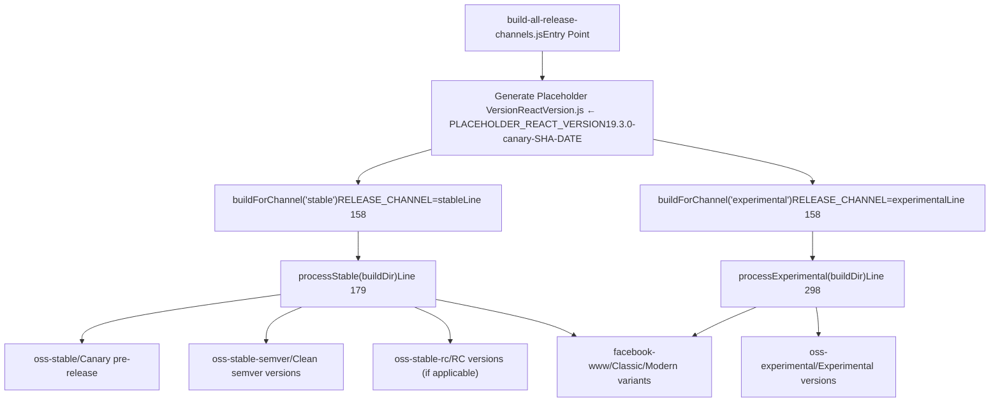
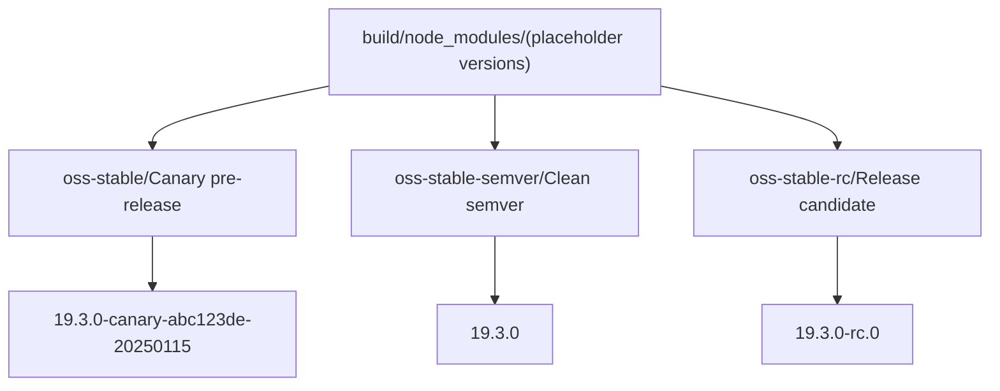
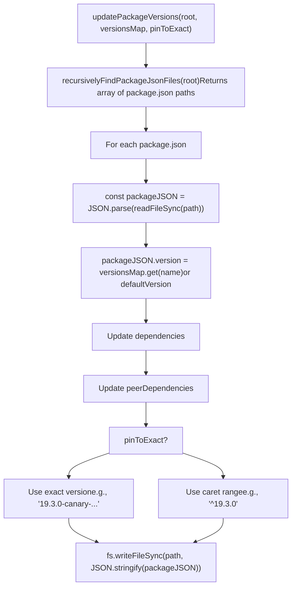

# 发布渠道与版本控制

相关源文件

-   [.gitignore](https://github.com/facebook/react/blob/65eec428/.gitignore)
-   [ReactVersions.js](https://github.com/facebook/react/blob/65eec428/ReactVersions.js)
-   [dangerfile.js](https://github.com/facebook/react/blob/65eec428/dangerfile.js)
-   [package.json](https://github.com/facebook/react/blob/65eec428/package.json)
-   [packages/eslint-plugin-react-hooks/package.json](https://github.com/facebook/react/blob/65eec428/packages/eslint-plugin-react-hooks/package.json)
-   [packages/jest-react/package.json](https://github.com/facebook/react/blob/65eec428/packages/jest-react/package.json)
-   [packages/react-art/package.json](https://github.com/facebook/react/blob/65eec428/packages/react-art/package.json)
-   [packages/react-dom/package.json](https://github.com/facebook/react/blob/65eec428/packages/react-dom/package.json)
-   [packages/react-is/package.json](https://github.com/facebook/react/blob/65eec428/packages/react-is/package.json)
-   [packages/react-native-renderer/package.json](https://github.com/facebook/react/blob/65eec428/packages/react-native-renderer/package.json)
-   [packages/react-native-renderer/src/ReactNativeAttributePayload.js](https://github.com/facebook/react/blob/65eec428/packages/react-native-renderer/src/ReactNativeAttributePayload.js)
-   [packages/react-native-renderer/src/__mocks__/react-native/Libraries/ReactPrivate/deepDiffer.js](https://github.com/facebook/react/blob/65eec428/packages/react-native-renderer/src/__mocks__/react-native/Libraries/ReactPrivate/deepDiffer.js)
-   [packages/react-noop-renderer/package.json](https://github.com/facebook/react/blob/65eec428/packages/react-noop-renderer/package.json)
-   [packages/react-reconciler/package.json](https://github.com/facebook/react/blob/65eec428/packages/react-reconciler/package.json)
-   [packages/react-test-renderer/package.json](https://github.com/facebook/react/blob/65eec428/packages/react-test-renderer/package.json)
-   [packages/react/package.json](https://github.com/facebook/react/blob/65eec428/packages/react/package.json)
-   [packages/scheduler/package.json](https://github.com/facebook/react/blob/65eec428/packages/scheduler/package.json)
-   [packages/shared/ReactVersion.js](https://github.com/facebook/react/blob/65eec428/packages/shared/ReactVersion.js)
-   [packages/use-sync-external-store/package.json](https://github.com/facebook/react/blob/65eec428/packages/use-sync-external-store/package.json)
-   [scripts/flow/config/flowconfig](https://github.com/facebook/react/blob/65eec428/scripts/flow/config/flowconfig)
-   [scripts/flow/createFlowConfigs.js](https://github.com/facebook/react/blob/65eec428/scripts/flow/createFlowConfigs.js)
-   [scripts/jest/jest-cli.js](https://github.com/facebook/react/blob/65eec428/scripts/jest/jest-cli.js)
-   [scripts/jest/setupHostConfigs.js](https://github.com/facebook/react/blob/65eec428/scripts/jest/setupHostConfigs.js)
-   [scripts/release/download-experimental-build-commands/print-summary.js](https://github.com/facebook/react/blob/65eec428/scripts/release/download-experimental-build-commands/print-summary.js)
-   [scripts/release/download-experimental-build.js](https://github.com/facebook/react/blob/65eec428/scripts/release/download-experimental-build.js)
-   [scripts/release/prepare-release-from-ci.js](https://github.com/facebook/react/blob/65eec428/scripts/release/prepare-release-from-ci.js)
-   [scripts/release/shared-commands/download-build-artifacts.js](https://github.com/facebook/react/blob/65eec428/scripts/release/shared-commands/download-build-artifacts.js)
-   [scripts/release/shared-commands/parse-params.js](https://github.com/facebook/react/blob/65eec428/scripts/release/shared-commands/parse-params.js)
-   [scripts/release/theme.js](https://github.com/facebook/react/blob/65eec428/scripts/release/theme.js)
-   [scripts/release/utils.js](https://github.com/facebook/react/blob/65eec428/scripts/release/utils.js)
-   [scripts/rollup/build-all-release-channels.js](https://github.com/facebook/react/blob/65eec428/scripts/rollup/build-all-release-channels.js)
-   [scripts/rollup/build.js](https://github.com/facebook/react/blob/65eec428/scripts/rollup/build.js)
-   [scripts/rollup/bundles.js](https://github.com/facebook/react/blob/65eec428/scripts/rollup/bundles.js)
-   [scripts/rollup/forks.js](https://github.com/facebook/react/blob/65eec428/scripts/rollup/forks.js)
-   [scripts/rollup/modules.js](https://github.com/facebook/react/blob/65eec428/scripts/rollup/modules.js)
-   [scripts/rollup/packaging.js](https://github.com/facebook/react/blob/65eec428/scripts/rollup/packaging.js)
-   [scripts/rollup/plugins/closure-plugin.js](https://github.com/facebook/react/blob/65eec428/scripts/rollup/plugins/closure-plugin.js)
-   [scripts/rollup/plugins/sizes-plugin.js](https://github.com/facebook/react/blob/65eec428/scripts/rollup/plugins/sizes-plugin.js)
-   [scripts/rollup/plugins/use-forks-plugin.js](https://github.com/facebook/react/blob/65eec428/scripts/rollup/plugins/use-forks-plugin.js)
-   [scripts/rollup/stats.js](https://github.com/facebook/react/blob/65eec428/scripts/rollup/stats.js)
-   [scripts/rollup/sync.js](https://github.com/facebook/react/blob/65eec428/scripts/rollup/sync.js)
-   [scripts/rollup/wrappers.js](https://github.com/facebook/react/blob/65eec428/scripts/rollup/wrappers.js)
-   [scripts/shared/inlinedHostConfigs.js](https://github.com/facebook/react/blob/65eec428/scripts/shared/inlinedHostConfigs.js)
-   [scripts/tasks/danger.js](https://github.com/facebook/react/blob/65eec428/scripts/tasks/danger.js)
-   [yarn.lock](https://github.com/facebook/react/blob/65eec428/yarn.lock)

本文档解释了 React 的发布渠道系统，包括不同渠道（stable, experimental, canary, rc）是如何构建、版本控制和组织的。发布渠道使 React 能够在支持实验性功能的同时发布稳定版本，并为生产环境用户维护兼容性保证。

关于生成这些构建产物的构建流水线信息，请参阅 [构建流水线与模块分叉](/facebook/react/3.1-build-pipeline-and-module-forking)。本页面专门关注发布渠道是如何配置、版本控制以及在构建输出中区分的。

---

## 概览

React 使用多渠道发布策略来支持不同的稳定性保证和特性集。构建系统可以从同一份源代码为多个渠道生成构建产物，每个渠道具有：

-   **独特的版本控制方案**：稳定版使用 Semver，canary/experimental 使用基于 SHA 的版本
-   **不同的特性标志**：每个渠道启用/禁用不同的实验性功能
-   **独立的 npm 分发**：发布到不同的 npm dist-tags
-   **隔离的构建目录**：在 `build/` 中按渠道组织

渠道系统由 [scripts/rollup/build-all-release-channels.js1-544](https://github.com/facebook/react/blob/65eec428/scripts/rollup/build-all-release-channels.js#L1-L544) 编排，它为每个请求的渠道生成单独的构建进程，并使用特定于渠道的版本号对输出进行后处理。

### 发布渠道类型

React 支持以下发布渠道：

| 渠道 | 稳定性 | 版本格式 | npm Dist Tag | 用途 |
| --- | --- | --- | --- | --- |
| **stable** | 生产就绪 | `19.3.0` | `latest` | 具有语义化版本控制的生产用途 |
| **canary** | 预发布 | `19.3.0-canary-abc123de-20250115` | `canary` | 用于早期测试的每周预发布 |
| **rc** | 候选发布 | `19.3.0-rc.0` | `rc` | 稳定发布前的最终测试 |
| **experimental** | 不稳定 | `0.0.0-experimental-abc123de-20250115` | `experimental` | 前沿特性，可能会被移除 |

渠道由构建过程中的 `RELEASE_CHANNEL` 环境变量决定。如果未指定，系统默认构建实验性渠道（[scripts/rollup/build.js31-38](https://github.com/facebook/react/blob/65eec428/scripts/rollup/build.js#L31-L38)）。

来源：[scripts/rollup/build-all-release-channels.js1-544](https://github.com/facebook/react/blob/65eec428/scripts/rollup/build-all-release-channels.js#L1-L544) [scripts/rollup/build.js31-38](https://github.com/facebook/react/blob/65eec428/scripts/rollup/build.js#L31-L38) [ReactVersions.js1-64](https://github.com/facebook/react/blob/65eec428/ReactVersions.js#L1-L64)

---

## 版本号定义

版本号在 [ReactVersions.js1-64](https://github.com/facebook/react/blob/65eec428/ReactVersions.js#L1-L64) 中集中定义，这是所有 React 包版本的单一真实来源：

```
// ReactVersions.js 结构
const ReactVersion = '19.3.0';
const canaryChannelLabel = 'canary';  // 或 RC 阶段的 'rc'
const rcNumber = 0;

const stablePackages = {
  'eslint-plugin-react-hooks': '7.1.0',
  react: ReactVersion,
  'react-dom': ReactVersion,
  'react-reconciler': '0.34.0',
  scheduler: '0.28.0',
  // ... 其他包
};

const experimentalPackages = ['react-markup'];
```
关键方面：

-   **ReactVersion**：大多数 React 包的基础版本（当前为 `19.3.0`）
-   **canaryChannelLabel**：控制预发布标签（`'canary'` 或 `'rc'`）
-   **rcNumber**：RC 阶段时的 RC 迭代编号
-   **stablePackages**：将包名映射到其稳定版本
-   **experimentalPackages**：仅存在于实验性渠道中的包

大多数包共享相同的版本号，但有些包（`scheduler`, `react-reconciler`, `eslint-plugin-react-hooks`）由于其独立用例而保持独立的版本控制。

来源：[ReactVersions.js21-56](https://github.com/facebook/react/blob/65eec428/ReactVersions.js#L21-L56) [packages/shared/ReactVersion.js15](https://github.com/facebook/react/blob/65eec428/packages/shared/ReactVersion.js#L15-L15)

---

## 构建渠道编排

[scripts/rollup/build-all-release-channels.js1-544](https://github.com/facebook/react/blob/65eec428/scripts/rollup/build-all-release-channels.js#L1-L544) 脚本编排多渠道构建。它执行三个主要步骤：

**构建和后处理流水线**


### 步骤 1：生成占位符版本

在构建之前，会将一个占位符版本写入 [packages/shared/ReactVersion.js15](https://github.com/facebook/react/blob/65eec428/packages/shared/ReactVersion.js#L15-L15)：

```
// build-all-release-channels.js 中的第 46-54 行
const PLACEHOLDER_REACT_VERSION =
  ReactVersion + '-' + canaryChannelLabel + '-' + sha + '-' + dateString;
// 示例：'19.3.0-canary-a1c2d3e4-20250115'

fs.writeFileSync(
  './packages/shared/ReactVersion.js',
  `export default '${PLACEHOLDER_REACT_VERSION}';\n`
);
```
此占位符被嵌入所有构建产物中，并将在后处理期间替换为特定于渠道的版本。

### 步骤 2：执行渠道构建

`buildForChannel()` 函数使用 `RELEASE_CHANNEL` 环境变量生成主构建脚本：

```
// build-all-release-channels.js 中的第 158-177 行
function buildForChannel(channel, total, index) {
  const {status} = spawnSync(
    'node',
    ['./scripts/rollup/build.js', ...process.argv.slice(2)],
    {
      env: {
        ...process.env,
        RELEASE_CHANNEL: channel,  // 'stable' or 'experimental'
      },
    }
  );
}
```
这会导致构建系统：

-   使用特定于渠道的特性标志（[scripts/rollup/forks.js20-27](https://github.com/facebook/react/blob/65eec428/scripts/rollup/forks.js#L20-L27)）
-   根据打包类型应用不同的模块分叉
-   在 `build/node_modules/`, `build/facebook-www/` 等目录中生成产物

### 步骤 3：后处理与版本控制

构建后，特定于渠道的后处理会应用正确的版本号并组织输出。

来源：[scripts/rollup/build-all-release-channels.js24-177](https://github.com/facebook/react/blob/65eec428/scripts/rollup/build-all-release-channels.js#L24-L177) [scripts/rollup/build.js31-38](https://github.com/facebook/react/blob/65eec428/scripts/rollup/build.js#L31-L38) [scripts/rollup/forks.js20-27](https://github.com/facebook/react/blob/65eec428/scripts/rollup/forks.js#L20-L27)

---

## 稳定渠道处理

位于 [scripts/rollup/build-all-release-channels.js179-295](https://github.com/facebook/react/blob/65eec428/scripts/rollup/build-all-release-channels.js#L179-L295) 的 `processStable()` 函数将稳定渠道的构建输出转换为多个版本化分发：

**稳定渠道输出转换**


### oss-stable: Canary 预发布

主要的稳定版输出使用 canary 预发布版本：

```
// build-all-release-channels.js 中的第 192-212 行
const versionsMap = new Map();
for (const moduleName in stablePackages) {
  const version = stablePackages[moduleName];
  versionsMap.set(
    moduleName,
    version + '-' + canaryChannelLabel + '-' + sha + '-' + dateString
  );
  // 示例：'react' → '19.3.0-canary-a1c2d3e4-20250115'
}

updatePackageVersions(
  buildDir + '/node_modules',
  versionsMap,
  defaultVersionIfNotFound,
  true  // 将依赖固定为精确版本
);

fs.renameSync(buildDir + '/node_modules', buildDir + '/oss-stable');
```
此目录使用 `@canary` dist-tag 发布到 npm，用于每周预发布。

### oss-stable-semver: 纯净语义化版本

对于发布到 `@latest` 的稳定版本：

```
// build-all-release-channels.js 中的第 257-272 行
const semverVersionsMap = new Map();
for (const moduleName in stablePackages) {
  const version = stablePackages[moduleName];
  semverVersionsMap.set(moduleName, version);
  // 示例：'react' → '19.3.0'
}

updatePackageVersions(
  buildDir + '/oss-stable-semver',
  semverVersionsMap,
  defaultVersionIfNotFound,
  false  // 使用 caret 范围的依赖 (^19.3.0)
);
```
这将生成具有适合生产环境 npm 发布的纯净版本号的包。

### oss-stable-rc: 候选发布

当 `canaryChannelLabel === 'rc'` 时，会创建一个额外的 RC 分发：

```
// build-all-release-channels.js 中的第 214-231 行
if (canaryChannelLabel === 'rc') {
  const rcVersionsMap = new Map();
  for (const moduleName in stablePackages) {
    const version = stablePackages[moduleName];
    rcVersionsMap.set(moduleName, version + `-rc.${rcNumber}`);
    // 示例：'react' → '19.3.0-rc.0'
  }

  updatePackageVersions(
    buildDir + '/oss-stable-rc',
    rcVersionsMap,
    defaultVersionIfNotFound,
    true  // 固定为精确版本
  );
}
```
RC 构建使用 `@rc` dist-tag 发布，用于稳定版发布前的最终测试。

### 版本字符串替换

在更新 `package.json` 文件后，嵌入在 JavaScript 包中的占位符版本字符串将使用 `updatePlaceholderReactVersionInCompiledArtifacts()` 进行替换：

```
// build-all-release-channels.js 中的第 209-212, 269-272 行
updatePlaceholderReactVersionInCompiledArtifacts(
  buildDir + '/oss-stable',
  ReactVersion + '-' + canaryChannelLabel + '-' + sha + '-' + dateString
);

updatePlaceholderReactVersionInCompiledArtifacts(
  buildDir + '/oss-stable-semver',
  ReactVersion
);
```
这确保了运行时代码中的 `ReactVersion` 常量与包版本匹配。

来源：[scripts/rollup/build-all-release-channels.js179-295](https://github.com/facebook/react/blob/65eec428/scripts/rollup/build-all-release-channels.js#L179-L295) [ReactVersions.js21-33](https://github.com/facebook/react/blob/65eec428/ReactVersions.js#L21-L33)

---

## 实验性渠道处理

位于 [scripts/rollup/build-all-release-channels.js298-382](https://github.com/facebook/react/blob/65eec428/scripts/rollup/build-all-release-channels.js#L298-L382) 的 `processExperimental()` 函数使用不同的版本控制方案处理实验性构建：

### 实验性版本格式

实验性发布使用 `0.0.0` 作为基础版本，并带有 experimental 标签：

```
// build-all-release-channels.js 中的第 300-314 行
const defaultVersionIfNotFound =
  '0.0.0' + '-experimental-' + sha + '-' + dateString;
  // 示例：'0.0.0-experimental-a1c2d3e4-20250115'

const versionsMap = new Map();
for (const moduleName in stablePackages) {
  versionsMap.set(moduleName, defaultVersionIfNotFound);
}
for (const moduleName of experimentalPackages) {
  versionsMap.set(moduleName, defaultVersionIfNotFound);
}

fs.renameSync(buildDir + '/node_modules', buildDir + '/oss-experimental');
```
与稳定版的主要区别：

-   **0.0.0 基础版本**：清楚地表明实验状态
-   **无 Semver 兼容性**：允许破坏性更改而无需升级版本号
-   **包含仅实验性的包**：如 `react-markup` 等在稳定版中不存在的包
-   **基于 SHA 的标识**：提交哈希和日期用于可追溯性

### 运行时 vs 包版本控制

实验性构建存在一个细微的区别：

```
// build-all-release-channels.js 中的第 316-322 行
updatePlaceholderReactVersionInCompiledArtifacts(
  buildDir + '/oss-experimental',
  // npm 版本不包含 React 版本，但运行时包含
  // 以便 DevTools 进行功能检测
  ReactVersion + '-experimental-' + sha + '-' + dateString
);
```
虽然 npm 包版本是 `0.0.0-experimental-...`，但运行时 `ReactVersion` 常量是 `19.3.0-experimental-...`。这使得 React DevTools 即使在实验性构建中也能检测 React 版本和可用特性。

来源：[scripts/rollup/build-all-release-channels.js298-382](https://github.com/facebook/react/blob/65eec428/scripts/rollup/build-all-release-channels.js#L298-L382) [ReactVersions.js53-56](https://github.com/facebook/react/blob/65eec428/ReactVersions.js#L53-L56)

---

## Facebook 内部版本控制

Facebook 内部构建（WWW 和 React Native FB）接收特殊的版本字符串：

### WWW Classic (经典) vs Modern (现代) 构建

Facebook 的内部 web 平台有两个构建变体：

```
// build-all-release-channels.js 中的第 276-290 行 (stable)
if (fs.existsSync(buildDir + '/facebook-www')) {
  for (const fileName of fs.readdirSync(buildDir + '/facebook-www')) {
    const filePath = buildDir + '/facebook-www/' + fileName;
    if (!stats.isDirectory()) {
      // Stable: filename.classic.js
      fs.renameSync(filePath, filePath.replace('.js', '.classic.js'));
    }
  }

  const versionString =
    ReactVersion + '-www-classic-' + sha + '-' + dateString;
  updatePlaceholderReactVersionInCompiledArtifacts(
    buildDir + '/facebook-www',
    versionString
  );

  fs.writeFileSync(
    buildDir + '/facebook-www/VERSION_CLASSIC',
    versionString
  );
}
```
实验性构建类似地创建带有 `VERSION_MODERN` 文件的 `.modern.js` 变体。这允许 Facebook 同时运行 classic（稳定）和 modern（实验性）React 构建。

### React Native Facebook 版本控制

React Native 内部构建使用统一的版本格式：

```
// build-all-release-channels.js 中的第 233-239 行
const rnVersionString =
  ReactVersion + '-native-fb-' + sha + '-' + dateString;
  // 示例：'19.3.0-native-fb-a1c2d3e4-20250115'

if (fs.existsSync(buildDir + '/facebook-react-native')) {
  updatePlaceholderReactVersionInCompiledArtifacts(
    buildDir + '/facebook-react-native',
    rnVersionString
  );

  fs.writeFileSync(
    buildDir + '/facebook-react-native/VERSION_NATIVE_FB',
    rnVersionString
  );
}
```
`VERSION_*` 文件作为版本标记，Facebook 的内部构建系统可以在不解析 JavaScript 的情况下读取。

来源：[scripts/rollup/build-all-release-channels.js233-290](https://github.com/facebook/react/blob/65eec428/scripts/rollup/build-all-release-channels.js#L233-L290) [scripts/rollup/build-all-release-channels.js325-356](https://github.com/facebook/react/blob/65eec428/scripts/rollup/build-all-release-channels.js#L325-L356)

---

## 版本更新机制

位于 [scripts/rollup/build-all-release-channels.js383-467](https://github.com/facebook/react/blob/65eec428/scripts/rollup/build-all-release-channels.js#L383-L467) 的 `updatePackageVersions()` 函数更新整个构建树中的 `package.json` 文件：

**版本更新流程**


### 依赖版本处理

该函数更新包自身的版本以及其对其他 React 包的依赖：

```
// build-all-release-channels.js 中的第 427-465 行
function updateDependencies(dependencies, versionsMap, pinToExact) {
  if (!dependencies) return;

  for (const dep in dependencies) {
    const assumedVersion = versionsMap.get(dep);
    if (!assumedVersion) continue;

    if (pinToExact) {
      // Canary/Experimental: 固定为基于 SHA 的精确版本
      dependencies[dep] = assumedVersion;
      // 示例："react": "19.3.0-canary-a1c2d3e4-20250115"
    } else {
      // Stable: 使用 caret 范围进行兼容更新
      dependencies[dep] = '^' + assumedVersion;
      // 示例："react": "^19.3.0"
    }
  }
}
```
**固定策略**：

-   **Canary/Experimental/RC** (`pinToExact: true`)：所有依赖使用精确版本以确保一致性
-   **Stable semver** (`pinToExact: false`)：Caret 范围允许补丁更新

这确保了安装 `react-dom@19.3.0-canary-abc123de-20250115` 将解析到完全匹配的 `react` 版本，而 `react-dom@19.3.0` 允许任何兼容的 React 19.x.x 版本。

来源：[scripts/rollup/build-all-release-channels.js383-467](https://github.com/facebook/react/blob/65eec428/scripts/rollup/build-all-release-channels.js#L383-L467)

---

## 构建产物组织

后处理之后，`build/` 目录包含按渠道分隔的构建产物：

**最终构建目录结构**

```
build/
├── oss-stable/                      # Canary 预发布
│   ├── react/
│   │   ├── package.json            # version: "19.3.0-canary-abc123de-20250115"
│   │   ├── cjs/
│   │   │   ├── react.development.js
│   │   │   └── react.production.js
│   │   └── ...
│   └── react-dom/
│       └── ...
│
├── oss-stable-semver/               # 纯净的稳定发布
│   ├── react/
│   │   └── package.json            # version: "19.3.0"
│   └── ...
│
├── oss-stable-rc/                   # 候选发布（如果是 RC 阶段）
│   ├── react/
│   │   └── package.json            # version: "19.3.0-rc.0"
│   └── ...
│
├── oss-experimental/                # 实验性构建
│   ├── react/
│   │   └── package.json            # version: "0.0.0-experimental-abc123de-20250115"
│   ├── react-markup/               # 仅实验性的包
│   └── ...
│
├── facebook-www/                    # Facebook 内部
│   ├── React-prod.classic.js       # 稳定构建
│   ├── React-prod.modern.js        # 实验性构建
│   ├── VERSION_CLASSIC             # "19.3.0-www-classic-abc123de-20250115"
│   └── VERSION_MODERN              # "19.3.0-www-modern-abc123de-20250115"
│
├── facebook-react-native/           # RN 内部
│   ├── react/
│   ├── react-dom/
│   └── VERSION_NATIVE_FB
│
├── react-native/                    # RN 开源
│   ├── implementations/
│   │   ├── ReactFabric-prod.js
│   │   └── ReactNativeRenderer-prod.fb.js
│   └── shims/
│
├── sizes-stable/                    # 包大小报告
└── sizes-experimental/
```
### 渠道特定特征

| 渠道 | 目录 | 版本示例 | 依赖风格 | 目标受众 |
| --- | --- | --- | --- | --- |
| **Canary** | `oss-stable/` | `19.3.0-canary-a1c2d3e4-20250115` | 精确固定 | 每周测试者 |
| **Stable** | `oss-stable-semver/` | `19.3.0` | Caret 范围 | 生产用户 |
| **RC** | `oss-stable-rc/` | `19.3.0-rc.0` | 精确固定 | 最终测试者 |
| **Experimental** | `oss-experimental/` | `0.0.0-experimental-a1c2d3e4-20250115` | 精确固定 | 早期采用者 |
| **WWW Classic** | `facebook-www/` | `19.3.0-www-classic-...` | N/A | FB 生产环境 |
| **WWW Modern** | `facebook-www/` | `19.3.0-www-modern-...` | N/A | FB 实验环境 |

来源：[scripts/rollup/build-all-release-channels.js179-382](https://github.com/facebook/react/blob/65eec428/scripts/rollup/build-all-release-channels.js#L179-L382)

---

## 发布到 npm

每个渠道目录代表一个潜在的 npm 发布目标：

### npm Dist Tags

React 使用 npm dist tags 来管理多个发布渠道：

```
# Canary releases (每周)
npm publish build/oss-stable/react --tag canary

# Stable releases
npm publish build/oss-stable-semver/react --tag latest

# Release candidates
npm publish build/oss-stable-rc/react --tag rc

# Experimental releases
npm publish build/oss-experimental/react --tag experimental
```
用户可以安装特定渠道：

```
npm install react@latest          # Stable: 19.3.0
npm install react@canary           # Canary: 19.3.0-canary-abc123de-20250115
npm install react@experimental     # Experimental: 0.0.0-experimental-abc123de-20250115
npm install react@rc               # RC: 19.3.0-rc.0
```
### 应用程序中的版本解析

当应用程序安装 React 包时，npm 根据渠道解析版本：

**稳定渠道**：

```
{
  "dependencies": {
    "react": "^19.3.0",
    "react-dom": "^19.3.0"
  }
}
```
-   使用 caret 范围
-   允许补丁更新 (19.3.1, 19.3.2 等)
-   依赖项使用兼容版本

**Canary/Experimental 渠道**：

```
{
  "dependencies": {
    "react": "19.3.0-canary-a1c2d3e4-20250115",
    "react-dom": "19.3.0-canary-a1c2d3e4-20250115"
  }
}
```
-   使用精确版本
-   保证所有包来自同一构建
-   无自动更新

来源：[scripts/rollup/build-all-release-channels.js192-272](https://github.com/facebook/react/blob/65eec428/scripts/rollup/build-all-release-channels.js#L192-L272) [ReactVersions.js1-64](https://github.com/facebook/react/blob/65eec428/ReactVersions.js#L1-L64)

---

## 发布工作流示例

典型的 React 发布涉及构建和发布多个渠道：

**多渠道发布流程**

> **[Mermaid sequence]**
> *(图表结构无法解析)*

### 发布节奏

| 渠道 | 频率 | 用途 |
| --- | --- | --- |
| **Canary** | 每周 | 来自 main 分支的定期预发布 |
| **Experimental** | 持续 | 每次提交，用于测试未发布特性 |
| **RC** | 按需 | 主要/次要版本发布前的最终测试 |
| **Stable** | 主要/次要 | RC 测试后的生产发布 |
| **Patch** | 按需 | 稳定版本的 Bug 修复 |

来源：[scripts/rollup/build-all-release-channels.js1-544](https://github.com/facebook/react/blob/65eec428/scripts/rollup/build-all-release-channels.js#L1-L544)

---

## CI 集成

GitHub Actions 工作流自动化了多渠道构建过程：

### CI 中的构建产物

[.circleci/config.yml](https://github.com/facebook/react/blob/65eec428/.circleci/config.yml) 或 GitHub Actions 工作流编排构建：

```
# 概念性 CI 工作流
jobs:
  build_stable:
    runs-on: ubuntu-latest
    steps:
      - name: Build Stable Channel
        run: |
          yarn build --releaseChannel=stable --ci

  build_experimental:
    runs-on: ubuntu-latest
    steps:
      - name: Build Experimental Channel
        run: |
          yarn build --releaseChannel=experimental --ci
```
`--ci` 标志导致构建脚本：

-   为每个渠道生成单独的构建产物文件
-   将它们存储在 `build/sizes/` 目录中
-   作为 CI 构建产物上传以供稍后下载

### 发布用的产物下载

[scripts/release/download-experimental-build.js1-55](https://github.com/facebook/react/blob/65eec428/scripts/release/download-experimental-build.js#L1-L55) 脚本从 CI 下载预构建的产物：

```
# 下载特定提交的构建产物
node scripts/release/download-experimental-build.js --commit=abc123de

# 这将下载并解压：
# - build/oss-stable/
# - build/oss-stable-semver/
# - build/oss-experimental/
```
此工作流实现了：

-   **可复现的发布**：可以构建并在稍后发布精确的提交
-   **关注点分离**：构建在 CI 中发生，发布是手动的
-   **发布前测试**：下载的产物可以在本地进行测试

来源：[scripts/release/download-experimental-build.js1-55](https://github.com/facebook/react/blob/65eec428/scripts/release/download-experimental-build.js#L1-L55) [scripts/release/shared-commands/download-build-artifacts.js1-232](https://github.com/facebook/react/blob/65eec428/scripts/release/shared-commands/download-build-artifacts.js#L1-L232)

---

## 版本约束与兼容性

### 语义化版本策略

React 遵循稳定版的语义化版本控制：

| 版本组件 | 含义 | 破坏性更改 |
| --- | --- | --- |
| **Major** (19.x.x) | 主要特性，破坏性更改 | 是 |
| **Minor** (x.3.x) | 新特性，无破坏性更改 | 否 |
| **Patch** (x.x.0) | 仅 Bug 修复 | 否 |

预发布渠道使用额外的标识符扩展了这一点：

-   **Canary**: `19.3.0-canary-SHA-DATE` (19.3.0 的预发布)
-   **RC**: `19.3.0-rc.N` (19.3.0 的第 N 个候选发布)
-   **Experimental**: `0.0.0-experimental-SHA-DATE` (无 semver 保证)

### 包相互依赖性

大多数 React 包共享相同的版本并相互依赖：

```
// react-dom/package.json (version 19.3.0)
{
  "dependencies": {
    "scheduler": "^0.28.0"
  },
  "peerDependencies": {
    "react": "^19.3.0"
  }
}
```
**关键关系**：

-   `react-dom` 通过对等依赖需要匹配的 `react` 主版本
-   `scheduler` 具有独立的版本控制 (0.28.0 vs 19.3.0)
-   `react-reconciler` 对第三方渲染器使用独立的版本控制 (0.34.0)
-   大多数其他包遵循 `react` 的版本号

[ReactVersions.js35-51](https://github.com/facebook/react/blob/65eec428/ReactVersions.js#L35-L51) 中的版本映射明确定义了这些关系。

来源：[ReactVersions.js35-51](https://github.com/facebook/react/blob/65eec428/ReactVersions.js#L35-L51) [packages/react-dom/package.json19-24](https://github.com/facebook/react/blob/65eec428/packages/react-dom/package.json#L19-L24) [packages/scheduler/package.json3](https://github.com/facebook/react/blob/65eec428/packages/scheduler/package.json#L3-L3) [packages/react-reconciler/package.json4](https://github.com/facebook/react/blob/65eec428/packages/react-reconciler/package.json#L4-L4)

---

## 总结

打包系统通过一个多阶段过程将 React 的构建产物转换为可发布的 npm 包：

1.  **输出解析**：每种打包类型通过 `getBundleOutputPath` 映射到特定的目录结构
2.  **元数据复制**：从源复制 LICENSE, README 和 package.json 文件
3.  **入口点过滤**：修改 Package.json 以移除当前发布渠道无法构建的入口点
4.  **npm 标准化**：`npm pack` 创建 tarball，解压以确保与发布的包一致
5.  **平台垫片**：为 Facebook WWW 和 React Native 准备单独的构建产物
6.  **分发**：包已准备好发布到 npm，同时内部构建产物同步到 Facebook 仓库

这种架构使 React 能够支持多个平台和环境，同时维护单一的源代码库和统一的构建流水线。

```