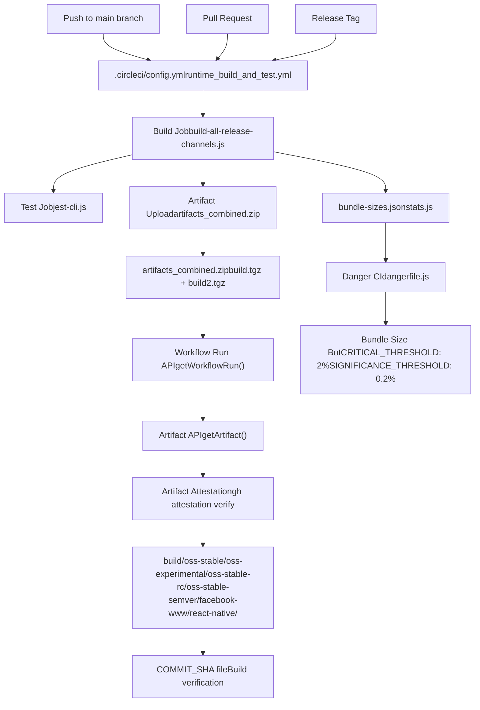
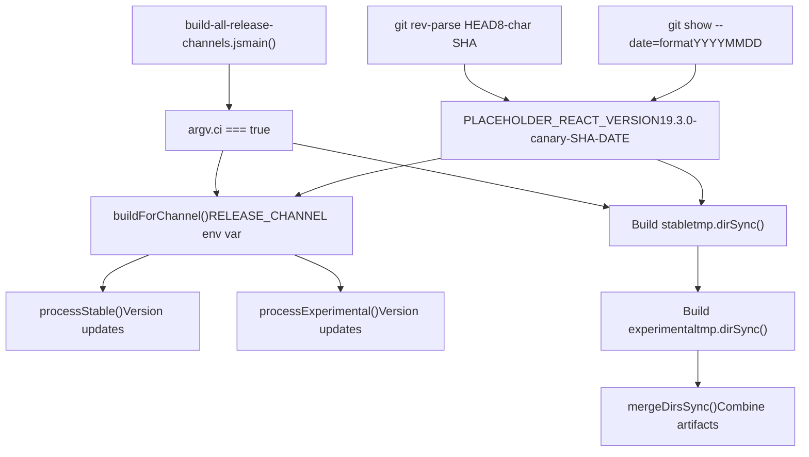
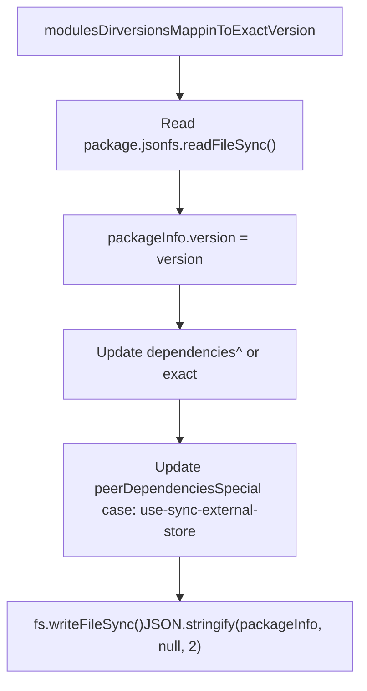
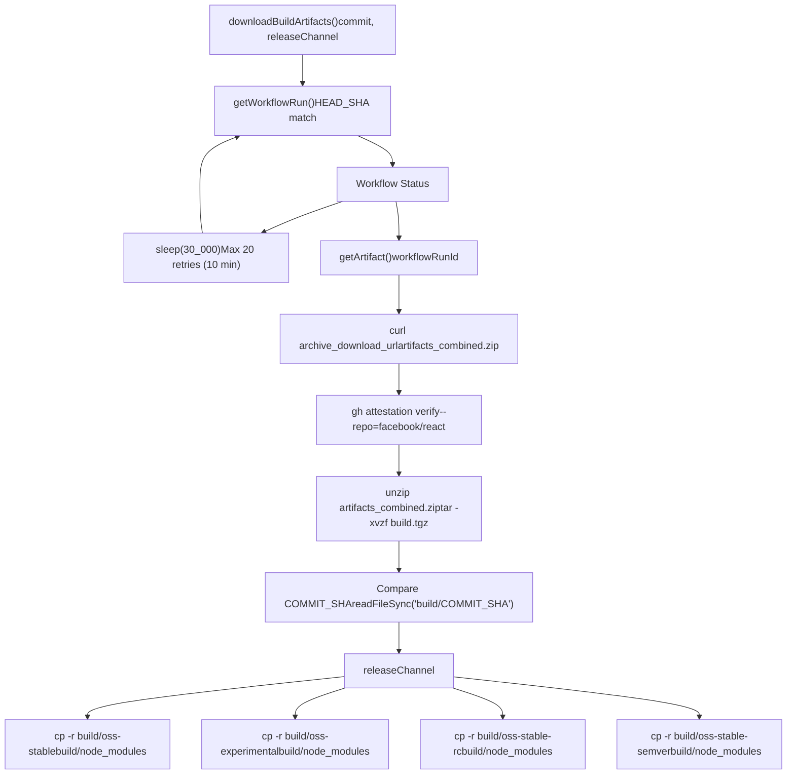
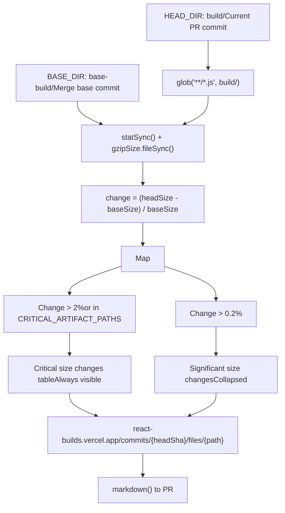
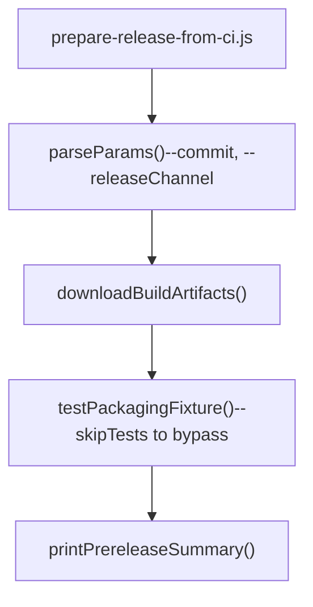
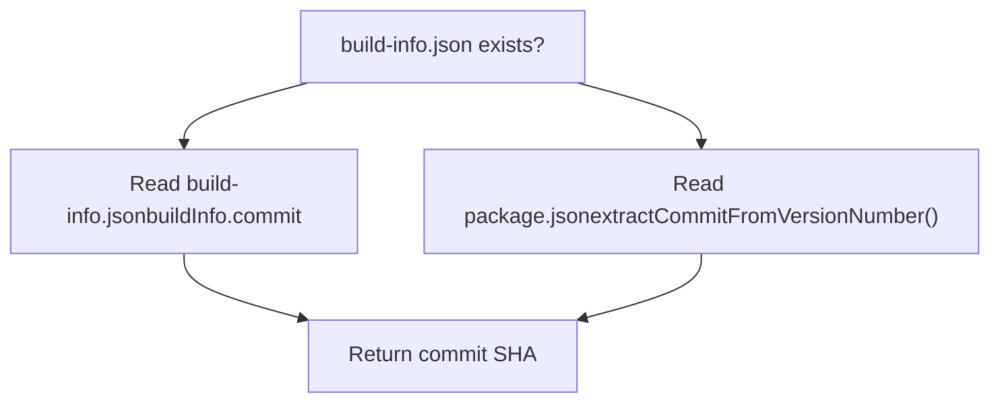
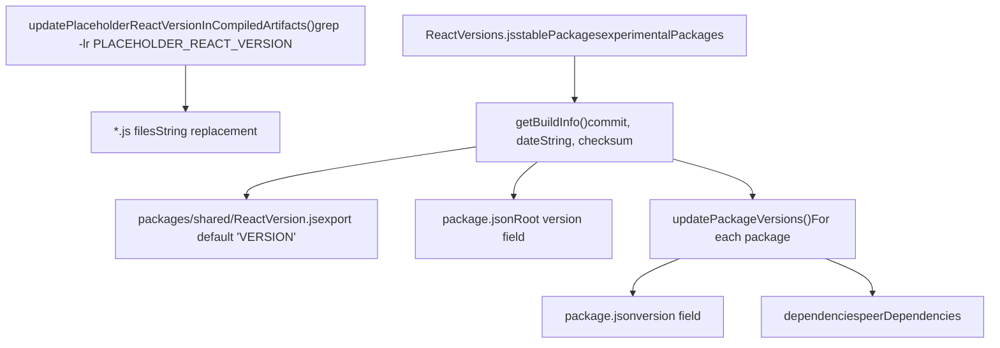

# CI/CD 与构建产物管理

相关源文件

-   [ReactVersions.js](https://github.com/facebook/react/blob/65eec428/ReactVersions.js)
-   [dangerfile.js](https://github.com/facebook/react/blob/65eec428/dangerfile.js)
-   [packages/react-native-renderer/src/ReactNativeAttributePayload.js](https://github.com/facebook/react/blob/65eec428/packages/react-native-renderer/src/ReactNativeAttributePayload.js)
-   [packages/react-native-renderer/src/\_\_mocks\_\_/react-native/Libraries/ReactPrivate/deepDiffer.js](https://github.com/facebook/react/blob/65eec428/packages/react-native-renderer/src/__mocks__/react-native/Libraries/ReactPrivate/deepDiffer.js)
-   [packages/use-sync-external-store/package.json](https://github.com/facebook/react/blob/65eec428/packages/use-sync-external-store/package.json)
-   [scripts/jest/jest-cli.js](https://github.com/facebook/react/blob/65eec428/scripts/jest/jest-cli.js)
-   [scripts/release/download-experimental-build-commands/print-summary.js](https://github.com/facebook/react/blob/65eec428/scripts/release/download-experimental-build-commands/print-summary.js)
-   [scripts/release/download-experimental-build.js](https://github.com/facebook/react/blob/65eec428/scripts/release/download-experimental-build.js)
-   [scripts/release/prepare-release-from-ci.js](https://github.com/facebook/react/blob/65eec428/scripts/release/prepare-release-from-ci.js)
-   [scripts/release/shared-commands/download-build-artifacts.js](https://github.com/facebook/react/blob/65eec428/scripts/release/shared-commands/download-build-artifacts.js)
-   [scripts/release/shared-commands/parse-params.js](https://github.com/facebook/react/blob/65eec428/scripts/release/shared-commands/parse-params.js)
-   [scripts/release/theme.js](https://github.com/facebook/react/blob/65eec428/scripts/release/theme.js)
-   [scripts/release/utils.js](https://github.com/facebook/react/blob/65eec428/scripts/release/utils.js)
-   [scripts/rollup/build-all-release-channels.js](https://github.com/facebook/react/blob/65eec428/scripts/rollup/build-all-release-channels.js)
-   [scripts/rollup/plugins/closure-plugin.js](https://github.com/facebook/react/blob/65eec428/scripts/rollup/plugins/closure-plugin.js)
-   [scripts/rollup/plugins/sizes-plugin.js](https://github.com/facebook/react/blob/65eec428/scripts/rollup/plugins/sizes-plugin.js)
-   [scripts/rollup/plugins/use-forks-plugin.js](https://github.com/facebook/react/blob/65eec428/scripts/rollup/plugins/use-forks-plugin.js)
-   [scripts/rollup/stats.js](https://github.com/facebook/react/blob/65eec428/scripts/rollup/stats.js)
-   [scripts/tasks/danger.js](https://github.com/facebook/react/blob/65eec428/scripts/tasks/danger.js)

## 目的与范围

本文档记录了 React 的持续集成和持续部署 (CI/CD) 基础设施，包括跨发布渠道的构建编排、通过 GitHub Actions 进行的构建产物管理、包大小监控以及发布准备工作流。CI/CD 系统自动化了 [构建流水线与模块分叉](/facebook/react/3.1-build-pipeline-and-module-forking) 中描述的构建流水线，并为 [发布渠道与版本控制](/facebook/react/3.2-release-channels-and-versioning) 中记录的发布渠道准备构建产物。

关于 CI/CD 编排的底层构建系统信息，请参阅 [构建系统与包分发](/facebook/react/3-build-system-and-package-distribution)。关于运行时测试基础设施的详细信息，请参阅 [开发者工具与调试](/facebook/react/7-developer-tools-and-debugging)。

---

## CI/CD 架构概览

React CI/CD 系统构建在 CircleCI 和 GitHub Actions 之上，并配有用于构建产物管理、包大小监控和发布准备的专用工具。


**来源：** [scripts/rollup/build-all-release-channels.js1-515](https://github.com/facebook/react/blob/65eec428/scripts/rollup/build-all-release-channels.js#L1-L515) [scripts/release/shared-commands/download-build-artifacts.js1-227](https://github.com/facebook/react/blob/65eec428/scripts/release/shared-commands/download-build-artifacts.js#L1-L227) [dangerfile.js1-283](https://github.com/facebook/react/blob/65eec428/dangerfile.js#L1-L283) [scripts/tasks/danger.js1-40](https://github.com/facebook/react/blob/65eec428/scripts/tasks/danger.js#L1-L40)

---

## 跨发布渠道的构建编排

CI/CD 系统使用并行执行和环境变量配置来协调多个发布渠道的构建。

### 主构建脚本

`build-all-release-channels.js` 脚本作为 CI 构建的入口点：


**来源：** [scripts/rollup/build-all-release-channels.js111-156](https://github.com/facebook/react/blob/65eec428/scripts/rollup/build-all-release-channels.js#L111-L156) [scripts/rollup/build-all-release-channels.js24-48](https://github.com/facebook/react/blob/65eec428/scripts/rollup/build-all-release-channels.js#L24-L48)

### 发布渠道处理

每个发布渠道生成具有专门版本字符串的不同构建产物：

| 渠道 | 目录 | 版本格式 | 示例 |
| --- | --- | --- | --- |
| **stable (canary)** | `oss-stable/` | `VERSION-canary-SHA-DATE` | `19.3.0-canary-a1c2d3e4-20241215` |
| **stable (semver)** | `oss-stable-semver/` | `VERSION` | `19.3.0` |
| **stable (rc)** | `oss-stable-rc/` | `VERSION-rc.N` | `19.3.0-rc.0` |
| **experimental** | `oss-experimental/` | `0.0.0-experimental-SHA-DATE` | `0.0.0-experimental-a1c2d3e4-20241215` |
| **facebook-www (classic)** | `facebook-www/*.classic.js` | `VERSION-www-classic-SHA-DATE` | `19.3.0-www-classic-a1c2d3e4-20241215` |
| **facebook-www (modern)** | `facebook-www/*.modern.js` | `VERSION-www-modern-SHA-DATE` | `19.3.0-www-modern-a1c2d3e4-20241215` |
| **react-native (internal)** | `facebook-react-native/` | `VERSION-native-fb-SHA-DATE` | `19.3.0-native-fb-a1c2d3e4-20241215` |
| **react-native (oss)** | `react-native/*.js` | `VERSION` | `19.3.0` |

**来源：** [scripts/rollup/build-all-release-channels.js179-296](https://github.com/facebook/react/blob/65eec428/scripts/rollup/build-all-release-channels.js#L179-L296) [scripts/rollup/build-all-release-channels.js298-389](https://github.com/facebook/react/blob/65eec428/scripts/rollup/build-all-release-channels.js#L298-L389) [ReactVersions.js1-65](https://github.com/facebook/react/blob/65eec428/ReactVersions.js#L1-L65)

### 包版本管理

`updatePackageVersions()` 函数修改构建中所有包的 `package.json` 文件：


该函数处理 `use-sync-external-store` 和 `use-subscription` 的特殊情况，它们保持更广泛的 React 版本兼容性范围。

**来源：** [scripts/rollup/build-all-release-channels.js402-459](https://github.com/facebook/react/blob/65eec428/scripts/rollup/build-all-release-channels.js#L402-L459) [ReactVersions.js35-51](https://github.com/facebook/react/blob/65eec428/ReactVersions.js#L35-L51)

---

## 构建产物管理工作流

构建产物通过具有验证、下载和暂存工作流的 GitHub Actions 进行管理。

### 下载与验证过程


**来源：** [scripts/release/shared-commands/download-build-artifacts.js161-214](https://github.com/facebook/react/blob/65eec428/scripts/release/shared-commands/download-build-artifacts.js#L161-L214) [scripts/release/shared-commands/download-build-artifacts.js88-159](https://github.com/facebook/react/blob/65eec428/scripts/release/shared-commands/download-build-artifacts.js#L88-L159)

### 构建产物安全与验证

该系统包含多层验证：

1.  **工作流运行匹配**：确保工作流运行对应于请求的 commit SHA ([scripts/release/shared-commands/download-build-artifacts.js50-66](https://github.com/facebook/react/blob/65eec428/scripts/release/shared-commands/download-build-artifacts.js#L50-L66))

2.  **GitHub 证明 (Attestation)**：使用 `gh attestation verify` 对构建产物来源进行加密验证 ([scripts/release/shared-commands/download-build-artifacts.js104-111](https://github.com/facebook/react/blob/65eec428/scripts/release/shared-commands/download-build-artifacts.js#L104-L111))

3.  **Commit SHA 验证**：根据请求的提交交叉检查构建产物内的 `COMMIT_SHA` 文件 ([scripts/release/shared-commands/download-build-artifacts.js150-158](https://github.com/facebook/react/blob/65eec428/scripts/release/shared-commands/download-build-artifacts.js#L150-L158))

4.  **可选绕过**：`--noVerify` 标志跳过证明验证，用于调试损坏的构建 ([scripts/release/shared-commands/download-build-artifacts.js100-101](https://github.com/facebook/react/blob/65eec428/scripts/release/shared-commands/download-build-artifacts.js#L100-L101))


**来源：** [scripts/release/shared-commands/download-build-artifacts.js88-159](https://github.com/facebook/react/blob/65eec428/scripts/release/shared-commands/download-build-artifacts.js#L88-L159)

---

## 使用 Danger CI 进行包大小监控

Danger CI 在 Pull Requests 上提供自动包大小报告，以捕获性能衰退。

### 大小阈值配置

```
const CRITICAL_THRESHOLD = 0.02;      // 2% - 总是报告
const SIGNIFICANCE_THRESHOLD = 0.002; // 0.2% - 在折叠部分报告

const CRITICAL_ARTIFACT_PATHS = [
  'oss-stable/react-dom/cjs/react-dom.production.js',
  'oss-stable/react-dom/cjs/react-dom-client.production.js',
  'oss-experimental/react-dom/cjs/react-dom.production.js',
  'oss-experimental/react-dom/cjs/react-dom-client.production.js',
  'facebook-www/ReactDOM-prod.classic.js',
  'facebook-www/ReactDOM-prod.modern.js',
];
```
**来源：** [dangerfile.js41-52](https://github.com/facebook/react/blob/65eec428/dangerfile.js#L41-L52)

### 大小比较工作流


**来源：** [dangerfile.js103-282](https://github.com/facebook/react/blob/65eec428/dangerfile.js#L103-L282) [scripts/tasks/danger.js1-40](https://github.com/facebook/react/blob/65eec428/scripts/tasks/danger.js#L1-L40)

### 包大小结果结构

大小比较为每个构建产物生成详细结果：

| 字段 | 描述 | 示例 |
| --- | --- | --- |
| `filename` | 构建产物文件路径 | `react-dom/cjs/react-dom.production.js` |
| `bundleType` | 打包类型标识符 | `NODE_PROD` |
| `packageName` | 包名 | `react-dom` |
| `prevSize` | 基础分支大小 (格式化) | `139.45 kB` |
| `prevFileSize` | 当前大小 (格式化) | `140.12 kB` |
| `prevFileSizeChange` | 分数变化 | `0.0048` |
| `prevFileSizeAbsoluteChange` | 大小差异（字节） | `670` |
| `prevGzipSize` | 当前 gzip 大小 | `44.23 kB` |
| `prevGzipSizeChange` | Gzip 分数变化 | `0.0035` |

**来源：** [dangerfile.js63-101](https://github.com/facebook/react/blob/65eec428/dangerfile.js#L63-L101) [scripts/rollup/stats.js1-127](https://github.com/facebook/react/blob/65eec428/scripts/rollup/stats.js#L1-L127)

### Danger CI 集成

Danger CI 任务分别针对稳定和实验渠道运行：

```
spawn('danger-ci', [
  '--id',
  process.env.RELEASE_CHANNEL === 'experimental' ? 'experimental' : 'stable'
], {
  env: {
    DANGER_GITHUB_API_TOKEN: token,
  }
});
```
这允许在同一个 PR 上分别为每个发布渠道提供大小报告。

**来源：** [scripts/tasks/danger.js17-31](https://github.com/facebook/react/blob/65eec428/scripts/tasks/danger.js#L17-L31)

---

## 发布准备流程

发布准备工作流下载 CI 构建产物并准备将其发布到 npm。

### 发布准备入口点


**来源：** [scripts/release/prepare-release-from-ci.js1-39](https://github.com/facebook/react/blob/65eec428/scripts/release/prepare-release-from-ci.js#L1-L39) [scripts/release/shared-commands/parse-params.js1-67](https://github.com/facebook/react/blob/65eec428/scripts/release/shared-commands/parse-params.js#L1-L67)

### 发布渠道参数验证

`parseParams()` 函数验证发布渠道参数：

```
const channel = params.releaseChannel;
if (
  channel !== 'experimental' &&
  channel !== 'stable' &&
  channel !== 'rc' &&
  channel !== 'latest'
) {
  console.error(theme.error`Invalid release channel`);
  process.exit(1);
}
```
**来源：** [scripts/release/shared-commands/parse-params.js44-58](https://github.com/facebook/react/blob/65eec428/scripts/release/shared-commands/parse-params.js#L44-L58)

### 构建信息提取

系统提取构建元数据以进行验证：


`extractCommitFromVersionNumber()` 函数使用正则表达式从版本字符串中解析 commit SHA：

```
// Matches formats:
// 0.0.0-0e526bcec-20210202
// 0.0.0-experimental-0e526bcec-20210202
const match = version.match(/0\.0\.0\-([a-z]+\-){0,1}([^-]+).+/);
```
**来源：** [scripts/release/utils.js111-138](https://github.com/facebook/react/blob/65eec428/scripts/release/utils.js#L111-L138) [scripts/release/utils.js50-58](https://github.com/facebook/react/blob/65eec428/scripts/release/utils.js#L50-L58)

---

## 版本管理系统

版本管理协调包、源文件和编译产物之间的版本控制。

### 版本更新流水线


**来源：** [scripts/release/utils.js207-256](https://github.com/facebook/react/blob/65eec428/scripts/release/utils.js#L207-L256) [scripts/rollup/build-all-release-channels.js461-492](https://github.com/facebook/react/blob/65eec428/scripts/rollup/build-all-release-channels.js#L461-L492) [ReactVersions.js1-65](https://github.com/facebook/react/blob/65eec428/ReactVersions.js#L1-L65)

### 占位符版本策略

构建过程使用一个在每个渠道中被替换的占位符版本：

1.  **初始占位符**：写入 `packages/shared/ReactVersion.js` ([scripts/rollup/build-all-release-channels.js46-54](https://github.com/facebook/react/blob/65eec428/scripts/rollup/build-all-release-channels.js#L46-L54))

    ```
    const PLACEHOLDER_REACT_VERSION =
      ReactVersion + '-' + canaryChannelLabel + '-' + sha + '-' + dateString;
    // e.g., "19.3.0-canary-a1c2d3e4-20241215"
    ```

2.  **构建执行**：所有包都使用占位符版本进行编译

3.  **后处理**：占位符被替换为特定于渠道的版本

    -   Stable: `ReactVersion + '-canary-' + sha + '-' + dateString`
    -   Experimental: `ReactVersion + '-experimental-' + sha + '-' + dateString`
    -   RC: `ReactVersion + '-rc.' + rcNumber`
    -   Semver: `ReactVersion` (e.g., `19.3.0`)

**来源：** [scripts/rollup/build-all-release-channels.js42-54](https://github.com/facebook/react/blob/65eec428/scripts/rollup/build-all-release-channels.js#L42-L54) [scripts/rollup/build-all-release-channels.js209-231](https://github.com/facebook/react/blob/65eec428/scripts/rollup/build-all-release-channels.js#L209-L231)

### 包版本配置

`ReactVersions.js` 模块定义了所有可发布的包：

```
const stablePackages = {
  'eslint-plugin-react-hooks': '7.1.0',
  'jest-react': '0.18.0',
  'react': ReactVersion,  // 19.3.0
  'react-dom': ReactVersion,
  'react-reconciler': '0.34.0',
  'scheduler': '0.28.0',
  // ... more packages
};

const experimentalPackages = [
  'react-markup'  // Only in @experimental
];
```
此配置控制哪些包被发布到 npm 及其版本号。

**来源：** [ReactVersions.js35-64](https://github.com/facebook/react/blob/65eec428/ReactVersions.js#L35-L64)

---

## 测试基础设施集成

CI/CD 系统与 Jest 集成，以便跨构建配置进行自动化测试。

### 测试配置矩阵

`jest-cli.js` 编排器支持多种测试配置：

| 标志 | 选项 | 描述 |
| --- | --- | --- |
| `--project` | `default`, `devtools` | 测试项目选择 |
| `--releaseChannel` | `experimental`, `stable`, `www-classic`, `www-modern`, `xplat` | 渠道配置 |
| `--env` | `development`, `production` | Node 环境 |
| `--build` | boolean | 针对构建产物进行测试 |
| `--persistent` | boolean | 运行持久化测试 |
| `--ci` | boolean | CI 模式，`maxConcurrency=10` |

**来源：** [scripts/jest/jest-cli.js20-115](https://github.com/facebook/react/blob/65eec428/scripts/jest/jest-cli.js#L20-L115)

### 构建产物测试

当使用 `--build` 标志时，系统验证构建的新鲜度：

```
const buildDir = path.resolve('./build');
if (!fs.existsSync(buildDir)) {
  logError('Build directory does not exist, please run `yarn build`');
} else if (Date.now() - fs.statSync(buildDir).mtimeMs > 1000 * 60 * 15) {
  logError('Warning: Build directory older than 15 minutes');
}
```
这防止了针对陈旧的构建产物进行测试。

**来源：** [scripts/jest/jest-cli.js260-273](https://github.com/facebook/react/blob/65eec428/scripts/jest/jest-cli.js#L260-L273)

### 测试环境配置

环境变量配置测试运行时：

```
const envars = {
  NODE_ENV: argv.env || 'development',
  RELEASE_CHANNEL: argv.releaseChannel.match(/modern|experimental/)
    ? 'experimental'
    : 'stable',
  VARIANT: argv.variant,  // www-specific variants
  REACT_VERSION: semver.coerce(argv.reactVersion),  // DevTools testing
};
```
**来源：** [scripts/jest/jest-cli.js322-357](https://github.com/facebook/react/blob/65eec428/scripts/jest/jest-cli.js#L322-L357)

---

## 总结

React CI/CD 和构建产物管理系统提供：

1.  **多渠道构建**：针对 stable, experimental, rc, canary 和 internal 渠道的并行构建
2.  **安全的构建产物管理**：具有证明验证的 GitHub Actions 集成
3.  **自动化质量门控**：具有可配置阈值的包大小监控
4.  **版本管理**：跨包和构建产物的协调版本控制
5.  **发布准备**：自动化下载、验证和暂存工作流
6.  **测试集成**：跨配置和构建产物的矩阵测试

该系统在整个构建和发布流水线中优先考虑可复现性、安全性和开发者反馈。

**来源：** [scripts/rollup/build-all-release-channels.js1-515](https://github.com/facebook/react/blob/65eec428/scripts/rollup/build-all-release-channels.js#L1-515) [scripts/release/shared-commands/download-build-artifacts.js1-227](https://github.com/facebook/react/blob/65eec428/scripts/release/shared-commands/download-build-artifacts.js#L1-L227) [dangerfile.js1-283](https://github.com/facebook/react/blob/65eec428/dangerfile.js#L1-L283) [ReactVersions.js1-65](https://github.com/facebook/react/blob/65eec428/ReactVersions.js#L1-L65)
