# React Reconciler

相关源文件

-   [packages/react-client/src/ReactFlightPerformanceTrack.js](https://github.com/facebook/react/blob/65eec428/packages/react-client/src/ReactFlightPerformanceTrack.js)
-   [packages/react-debug-tools/src/ReactDebugHooks.js](https://github.com/facebook/react/blob/65eec428/packages/react-debug-tools/src/ReactDebugHooks.js)
-   [packages/react-debug-tools/src/\_\_tests\_\_/ReactHooksInspection-test.js](https://github.com/facebook/react/blob/65eec428/packages/react-debug-tools/src/__tests__/ReactHooksInspection-test.js)
-   [packages/react-debug-tools/src/\_\_tests\_\_/ReactHooksInspectionIntegration-test.js](https://github.com/facebook/react/blob/65eec428/packages/react-debug-tools/src/__tests__/ReactHooksInspectionIntegration-test.js)
-   [packages/react-debug-tools/src/\_\_tests\_\_/ReactHooksInspectionIntegrationDOM-test.js](https://github.com/facebook/react/blob/65eec428/packages/react-debug-tools/src/__tests__/ReactHooksInspectionIntegrationDOM-test.js)
-   [packages/react-devtools-shell/src/app/InspectableElements/CustomHooks.js](https://github.com/facebook/react/blob/65eec428/packages/react-devtools-shell/src/app/InspectableElements/CustomHooks.js)
-   [packages/react-devtools-timeline/src/content-views/utils/moduleFilters.js](https://github.com/facebook/react/blob/65eec428/packages/react-devtools-timeline/src/content-views/utils/moduleFilters.js)
-   [packages/react-dom/src/\_\_tests\_\_/ReactDOMFiberAsync-test.js](https://github.com/facebook/react/blob/65eec428/packages/react-dom/src/__tests__/ReactDOMFiberAsync-test.js)
-   [packages/react-dom/src/\_\_tests\_\_/ReactDOMNativeEventHeuristic-test.js](https://github.com/facebook/react/blob/65eec428/packages/react-dom/src/__tests__/ReactDOMNativeEventHeuristic-test.js)
-   [packages/react-dom/src/events/plugins/\_\_tests\_\_/ChangeEventPlugin-test.js](https://github.com/facebook/react/blob/65eec428/packages/react-dom/src/events/plugins/__tests__/ChangeEventPlugin-test.js)
-   [packages/react-dom/src/events/plugins/\_\_tests\_\_/SimpleEventPlugin-test.js](https://github.com/facebook/react/blob/65eec428/packages/react-dom/src/events/plugins/__tests__/SimpleEventPlugin-test.js)
-   [packages/react-reconciler/src/ReactFiber.js](https://github.com/facebook/react/blob/65eec428/packages/react-reconciler/src/ReactFiber.js)
-   [packages/react-reconciler/src/ReactFiberBeginWork.js](https://github.com/facebook/react/blob/65eec428/packages/react-reconciler/src/ReactFiberBeginWork.js)
-   [packages/react-reconciler/src/ReactFiberClassComponent.js](https://github.com/facebook/react/blob/65eec428/packages/react-reconciler/src/ReactFiberClassComponent.js)
-   [packages/react-reconciler/src/ReactFiberCommitWork.js](https://github.com/facebook/react/blob/65eec428/packages/react-reconciler/src/ReactFiberCommitWork.js)
-   [packages/react-reconciler/src/ReactFiberCompleteWork.js](https://github.com/facebook/react/blob/65eec428/packages/react-reconciler/src/ReactFiberCompleteWork.js)
-   [packages/react-reconciler/src/ReactFiberHooks.js](https://github.com/facebook/react/blob/65eec428/packages/react-reconciler/src/ReactFiberHooks.js)
-   [packages/react-reconciler/src/ReactFiberLane.js](https://github.com/facebook/react/blob/65eec428/packages/react-reconciler/src/ReactFiberLane.js)
-   [packages/react-reconciler/src/ReactFiberOffscreenComponent.js](https://github.com/facebook/react/blob/65eec428/packages/react-reconciler/src/ReactFiberOffscreenComponent.js)
-   [packages/react-reconciler/src/ReactFiberPerformanceTrack.js](https://github.com/facebook/react/blob/65eec428/packages/react-reconciler/src/ReactFiberPerformanceTrack.js)
-   [packages/react-reconciler/src/ReactFiberRootScheduler.js](https://github.com/facebook/react/blob/65eec428/packages/react-reconciler/src/ReactFiberRootScheduler.js)
-   [packages/react-reconciler/src/ReactFiberSuspenseComponent.js](https://github.com/facebook/react/blob/65eec428/packages/react-reconciler/src/ReactFiberSuspenseComponent.js)
-   [packages/react-reconciler/src/ReactFiberUnwindWork.js](https://github.com/facebook/react/blob/65eec428/packages/react-reconciler/src/ReactFiberUnwindWork.js)
-   [packages/react-reconciler/src/ReactFiberWorkLoop.js](https://github.com/facebook/react/blob/65eec428/packages/react-reconciler/src/ReactFiberWorkLoop.js)
-   [packages/react-reconciler/src/ReactInternalTypes.js](https://github.com/facebook/react/blob/65eec428/packages/react-reconciler/src/ReactInternalTypes.js)
-   [packages/react-reconciler/src/ReactProfilerTimer.js](https://github.com/facebook/react/blob/65eec428/packages/react-reconciler/src/ReactProfilerTimer.js)
-   [packages/react-reconciler/src/\_\_tests\_\_/ReactDeferredValue-test.js](https://github.com/facebook/react/blob/65eec428/packages/react-reconciler/src/__tests__/ReactDeferredValue-test.js)
-   [packages/react-reconciler/src/\_\_tests\_\_/ReactHooks-test.internal.js](https://github.com/facebook/react/blob/65eec428/packages/react-reconciler/src/__tests__/ReactHooks-test.internal.js)
-   [packages/react-reconciler/src/\_\_tests\_\_/ReactHooksWithNoopRenderer-test.js](https://github.com/facebook/react/blob/65eec428/packages/react-reconciler/src/__tests__/ReactHooksWithNoopRenderer-test.js)
-   [packages/react-reconciler/src/\_\_tests\_\_/ReactLazy-test.internal.js](https://github.com/facebook/react/blob/65eec428/packages/react-reconciler/src/__tests__/ReactLazy-test.internal.js)
-   [packages/react-reconciler/src/\_\_tests\_\_/ReactPerformanceTrack-test.js](https://github.com/facebook/react/blob/65eec428/packages/react-reconciler/src/__tests__/ReactPerformanceTrack-test.js)
-   [packages/react-reconciler/src/\_\_tests\_\_/ReactSiblingPrerendering-test.js](https://github.com/facebook/react/blob/65eec428/packages/react-reconciler/src/__tests__/ReactSiblingPrerendering-test.js)
-   [packages/react-reconciler/src/\_\_tests\_\_/ReactSuspense-test.internal.js](https://github.com/facebook/react/blob/65eec428/packages/react-reconciler/src/__tests__/ReactSuspense-test.internal.js)
-   [packages/react-reconciler/src/\_\_tests\_\_/ReactSuspensePlaceholder-test.internal.js](https://github.com/facebook/react/blob/65eec428/packages/react-reconciler/src/__tests__/ReactSuspensePlaceholder-test.internal.js)
-   [packages/react-reconciler/src/\_\_tests\_\_/ReactSuspenseWithNoopRenderer-test.js](https://github.com/facebook/react/blob/65eec428/packages/react-reconciler/src/__tests__/ReactSuspenseWithNoopRenderer-test.js)
-   [packages/react-reconciler/src/\_\_tests\_\_/ReactSuspenseyCommitPhase-test.js](https://github.com/facebook/react/blob/65eec428/packages/react-reconciler/src/__tests__/ReactSuspenseyCommitPhase-test.js)
-   [packages/react-server/src/ReactFizzHooks.js](https://github.com/facebook/react/blob/65eec428/packages/react-server/src/ReactFizzHooks.js)
-   [packages/react-server/src/ReactFlightAsyncSequence.js](https://github.com/facebook/react/blob/65eec428/packages/react-server/src/ReactFlightAsyncSequence.js)
-   [packages/react-server/src/ReactFlightServerConfigDebugNode.js](https://github.com/facebook/react/blob/65eec428/packages/react-server/src/ReactFlightServerConfigDebugNode.js)
-   [packages/react-server/src/ReactFlightServerConfigDebugNoop.js](https://github.com/facebook/react/blob/65eec428/packages/react-server/src/ReactFlightServerConfigDebugNoop.js)
-   [packages/react-server/src/ReactFlightStackConfigV8.js](https://github.com/facebook/react/blob/65eec428/packages/react-server/src/ReactFlightStackConfigV8.js)
-   [packages/react-server/src/\_\_tests\_\_/ReactFlightAsyncDebugInfo-test.js](https://github.com/facebook/react/blob/65eec428/packages/react-server/src/__tests__/ReactFlightAsyncDebugInfo-test.js)
-   [packages/react/src/ReactHooks.js](https://github.com/facebook/react/blob/65eec428/packages/react/src/ReactHooks.js)
-   [packages/react/src/ReactLazy.js](https://github.com/facebook/react/blob/65eec428/packages/react/src/ReactLazy.js)
-   [packages/react/src/\_\_tests\_\_/ReactProfiler-test.internal.js](https://github.com/facebook/react/blob/65eec428/packages/react/src/__tests__/ReactProfiler-test.internal.js)
-   [packages/shared/ReactPerformanceTrackProperties.js](https://github.com/facebook/react/blob/65eec428/packages/shared/ReactPerformanceTrackProperties.js)
-   [packages/shared/ReactSymbols.js](https://github.com/facebook/react/blob/65eec428/packages/shared/ReactSymbols.js)

React Reconciler 是与平台无关的核心协调算法，用于协调 React 更新。它实现了 Fiber 架构，管理组件生命周期，调度任务，并通过 `ReactFiberConfig` 接口将特定于宿主的操作委托给可插拔的渲染器。

**范围**：本页面涵盖了 Reconciler 的架构、工作循环执行、阶段分离和协调机制。关于特定渲染器的实现（DOM, Native），请参阅 [渲染目标](/facebook/react/4-react-reconciler)。关于服务端渲染系统（Fizz, Flight），请参阅 [服务端渲染](/facebook/react/5-server-side-rendering)。关于 Hooks 实现细节，请参阅 [React Hooks 系统](/facebook/react/3.2-release-channels-and-versioning)。关于调度和优先级细节，请参阅 [基于车道的优先级与调度](#3.4)。

---

## Reconciler 架构概览

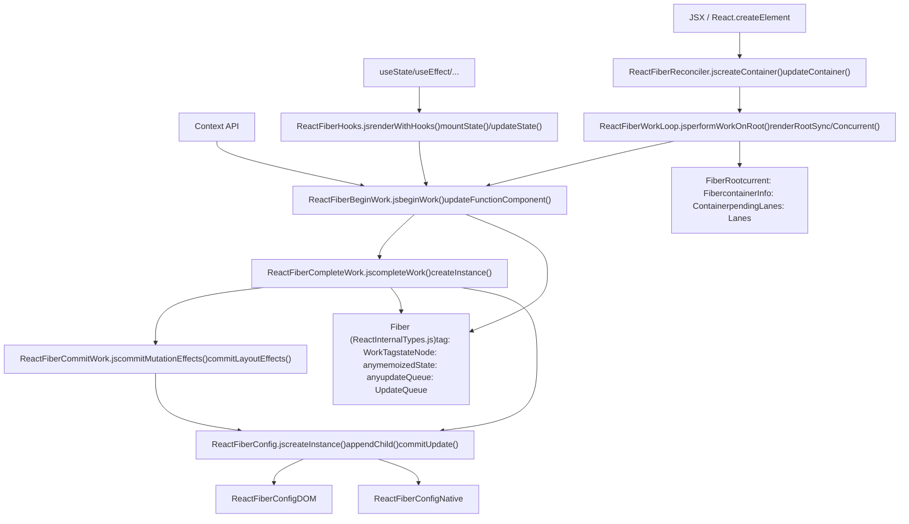
Reconciler 通过一个双阶段渲染循环进行操作：**渲染阶段 (render phase)**（可中断）遍历 Fiber 树调用 `beginWork` 和 `completeWork`，以及 **提交阶段 (commit phase)**（同步）将变更应用到宿主环境。

**来源**：[packages/react-reconciler/src/ReactFiberWorkLoop.js1-1279](https://github.com/facebook/react/blob/65eec428/packages/react-reconciler/src/ReactFiberWorkLoop.js#L1-L1279) [packages/react-reconciler/src/ReactFiberReconciler.js1-354](https://github.com/facebook/react/blob/65eec428/packages/react-reconciler/src/ReactFiberReconciler.js#L1-L354) [packages/react-reconciler/src/ReactInternalTypes.js88-207](https://github.com/facebook/react/blob/65eec428/packages/react-reconciler/src/ReactInternalTypes.js#L88-L207)

---

## Fiber 数据结构

**Fiber** 是 Reconciler 中的基本工作单元。每个 Fiber 节点代表一个组件实例及其相关的工作。

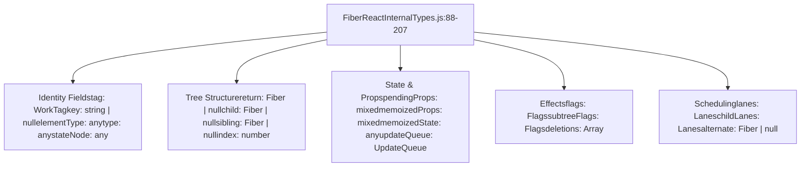
| 字段 | 用途 |
| --- | --- |
| `tag` | WorkTag，标识组件类型（FunctionComponent, ClassComponent, HostComponent 等） |
| `stateNode` | 对 DOM 节点、类实例或其他宿主实例的引用 |
| `memoizedState` | 上次渲染的输出状态；对于 hooks，这是 Hook 对象的链表 |
| `updateQueue` | 待处理的状态更新和副作用队列 |
| `flags` | 副作用标志（Placement, Update, Deletion, Passive 等） |
| `lanes` | 优先级车道，代表此 fiber 上挂起的工作 |
| `alternate` | 双缓存：在更新期间指向当前树中对应的 fiber |

**来源**：[packages/react-reconciler/src/ReactInternalTypes.js88-207](https://github.com/facebook/react/blob/65eec428/packages/react-reconciler/src/ReactInternalTypes.js#L88-L207) [packages/react-reconciler/src/ReactFiber.js136-209](https://github.com/facebook/react/blob/65eec428/packages/react-reconciler/src/ReactFiber.js#L136-L209)

---

## 工作循环（Work Loop）执行模型

工作循环是 Reconciler 的核心，管理渲染和提交阶段的推进。

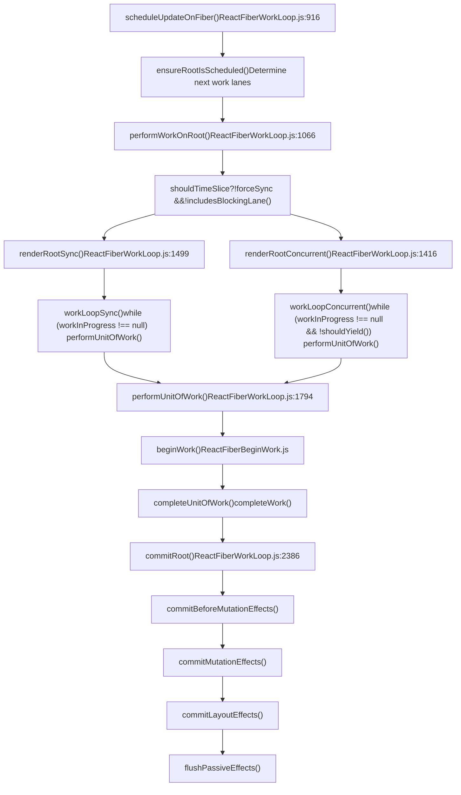
### 渲染阶段 (Render Phase)

渲染阶段遍历 Fiber 树并确定需要进行哪些更改。它由两个子阶段组成：

**Begin Work** ([ReactFiberBeginWork.js1400-2900](https://github.com/facebook/react/blob/65eec428/ReactFiberBeginWork.js#L1400-L2900))：

-   处理组件（调用 render, hooks 等）
-   使用 `reconcileChildren` 协调子节点
-   返回下一个要处理的子 fiber
-   关键函数：`updateFunctionComponent`, `updateClassComponent`, `updateHostComponent`

**Complete Work** ([ReactFiberCompleteWork.js600-1200](https://github.com/facebook/react/blob/65eec428/ReactFiberCompleteWork.js#L600-L1200))：

-   通过 `createInstance`, `finalizeInitialChildren` 创建或更新宿主实例
-   从子节点向上冒泡副作用标志
-   返回父节点，然后处理兄弟节点

在并发模式下，渲染阶段是 **可中断的** —— `shouldYield()` 允许暂停以处理更高优先级的工作。

### 提交阶段 (Commit Phase)

提交阶段应用渲染阶段的工作成果。它是 **同步且不可中断的**：

1.  **Before Mutation (突变前)** ([ReactFiberCommitWork.js343-591](https://github.com/facebook/react/blob/65eec428/ReactFiberCommitWork.js#L343-L591))：`getSnapshotBeforeUpdate`，准备 DOM 突变
2.  **Mutation (突变)** ([ReactFiberCommitWork.js2400-3100](https://github.com/facebook/react/blob/65eec428/ReactFiberCommitWork.js#L2400-L3100))：应用 DOM 更改（插入、更新、删除节点）
3.  **Layout (布局)** ([ReactFiberCommitWork.js593-870](https://github.com/facebook/react/blob/65eec428/ReactFiberCommitWork.js#L593-L870))：`componentDidMount`, `useLayoutEffect`, ref 挂载
4.  **Passive (被动)** ([ReactFiberCommitWork.js2629-2800](https://github.com/facebook/react/blob/65eec428/ReactFiberCommitWork.js#L2629-L2800))：`useEffect`（在绘制后调度）

**来源**：[packages/react-reconciler/src/ReactFiberWorkLoop.js1066-1800](https://github.com/facebook/react/blob/65eec428/packages/react-reconciler/src/ReactFiberWorkLoop.js#L1066-L1800) [packages/react-reconciler/src/ReactFiberBeginWork.js341-470](https://github.com/facebook/react/blob/65eec428/packages/react-reconciler/src/ReactFiberBeginWork.js#L341-L470) [packages/react-reconciler/src/ReactFiberCommitWork.js343-870](https://github.com/facebook/react/blob/65eec428/packages/react-reconciler/src/ReactFiberCommitWork.js#L343-L870)

---

## 宿主配置 (Host Configuration) 抽象

Reconciler 将所有平台特定操作委托给 `ReactFiberConfig` 接口。这使得 React 能够针对多个平台而无需修改核心逻辑。

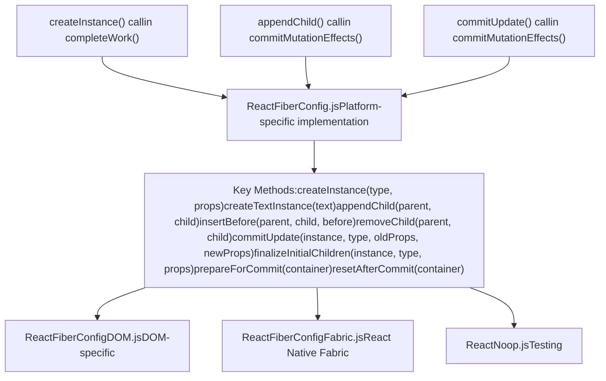
### 突变 (Mutation) vs 持久化 (Persistence)

渲染器实现以下两种策略之一：

**突变模式 (Mutation Mode)** (DOM, React Native Legacy):

-   `supportsMutation = true`
-   就地修改宿主实例
-   方法：`appendChild`, `removeChild`, `commitUpdate`

**持久化模式 (Persistence Mode)** (React Native Fabric):

-   `supportsPersistence = true`
-   克隆并替换整个子树
-   方法：`cloneInstance`, `createContainerChildSet`, `replaceContainerChildren`

### 示例：DOM 渲染器集成

```
completeWork() → createInstance() → document.createElement()
commitMutationEffects() → appendChild() → parentInstance.appendChild()
commitMutationEffects() → commitUpdate() → updateProperties()
```
Reconciler 调用 `createInstance` 等高级操作；DOM 渲染器将其转换为 `document.createElement()`，`node.appendChild()` 等。

**来源**：[packages/react-reconciler/src/ReactFiberCompleteWork.js105-129](https://github.com/facebook/react/blob/65eec428/packages/react-reconciler/src/ReactFiberCompleteWork.js#L105-L129) [packages/react-dom-bindings/src/client/ReactFiberConfigDOM.js1-50](https://github.com/facebook/react/blob/65eec428/packages/react-dom-bindings/src/client/ReactFiberConfigDOM.js#L1-L50) [packages/react-reconciler/src/ReactFiberCommitWork.js154-186](https://github.com/facebook/react/blob/65eec428/packages/react-reconciler/src/ReactFiberCommitWork.js#L154-L186)

---

## 协调与 Diff

当 React 更新组件时，它会将新的子节点与现有的 Fiber 树进行协调。

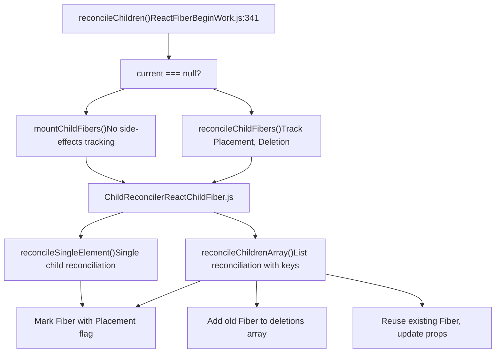
### 数组协调算法

在协调子节点数组时 ([ReactChildFiber.js800-1200](https://github.com/facebook/react/blob/65eec428/ReactChildFiber.js#L800-L1200))：

1.  **第一遍**：并行遍历旧的和新的子节点，通过 `key`（如果提供）或 `index` 进行匹配

    -   如果 `key` 匹配且 `type` 匹配：重用 Fiber，更新 props
    -   如果不匹配：中断并进入重新定位处理
2.  **删除**：剩余未匹配的旧子节点被标记为删除

3.  **插入**：剩余的新子节点使用 `Placement` 标志创建新 Fiber

4.  **Key 映射**：对于复杂的重新排序，构建 `key → Fiber` 的映射以高效查找匹配项


Reconciler 使用标志标记每个 Fiber：

-   `Placement`：需要插入到 DOM 中
-   `Update`：Props 已更改，需要更新 DOM
-   `Deletion`：需要从 DOM 中移除

**来源**：[packages/react-reconciler/src/ReactFiberBeginWork.js341-404](https://github.com/facebook/react/blob/65eec428/packages/react-reconciler/src/ReactFiberBeginWork.js#L341-L404) [packages/react-reconciler/src/ReactChildFiber.js800-1200](https://github.com/facebook/react/blob/65eec428/packages/react-reconciler/src/ReactChildFiber.js#L800-L1200)

---

## 全局状态与 Work-in-Progress

Reconciler 在渲染期间维护全局可变状态：

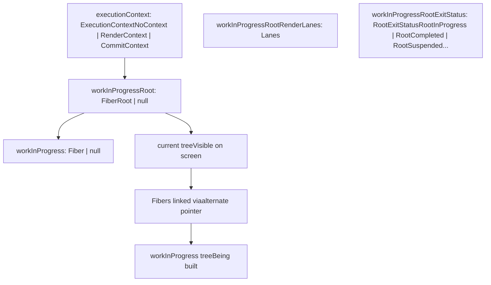
**双缓存 (Double Buffering)**：React 维护两棵 Fiber 树：

-   **Current tree (当前树)**：当前渲染的树，用户可见
-   **Work-in-progress tree (进行中树)**：更新期间正在构建的树

每个 Fiber 的 `alternate` 指针链接到另一棵树中的对应项。提交后，通过指针交换，work-in-progress 树变为 current 树 ([ReactFiberWorkLoop.js2600-2650](https://github.com/facebook/react/blob/65eec428/ReactFiberWorkLoop.js#L2600-L2650))。

**来源**：[packages/react-reconciler/src/ReactFiberWorkLoop.js406-526](https://github.com/facebook/react/blob/65eec428/packages/react-reconciler/src/ReactFiberWorkLoop.js#L406-L526) [packages/react-reconciler/src/ReactFiber.js360-480](https://github.com/facebook/react/blob/65eec428/packages/react-reconciler/src/ReactFiber.js#L360-L480)

---

## 渲染退出状态

渲染阶段可能以多种状态退出 ([ReactFiberWorkLoop.js413-420](https://github.com/facebook/react/blob/65eec428/ReactFiberWorkLoop.js#L413-L420))：

| 状态 | 描述 |
| --- | --- |
| `RootInProgress` | 渲染仍在进行中 |
| `RootCompleted` | 渲染成功完成 |
| `RootErrored` | 渲染遇到错误 |
| `RootSuspended` | 渲染暂停，等待数据 |
| `RootSuspendedWithDelay` | 带节流延迟的暂停 |
| `RootSuspendedAtTheShell` | 初始 Shell 期间暂停，立即显示 fallback |
| `RootFatalErrored` | 致命错误，无法恢复 |

状态决定了是立即提交、重试还是显示 Suspense fallback。

---

## 错误处理与边界

错误处理会沿 Fiber 树向上传播，直到找到错误边界。

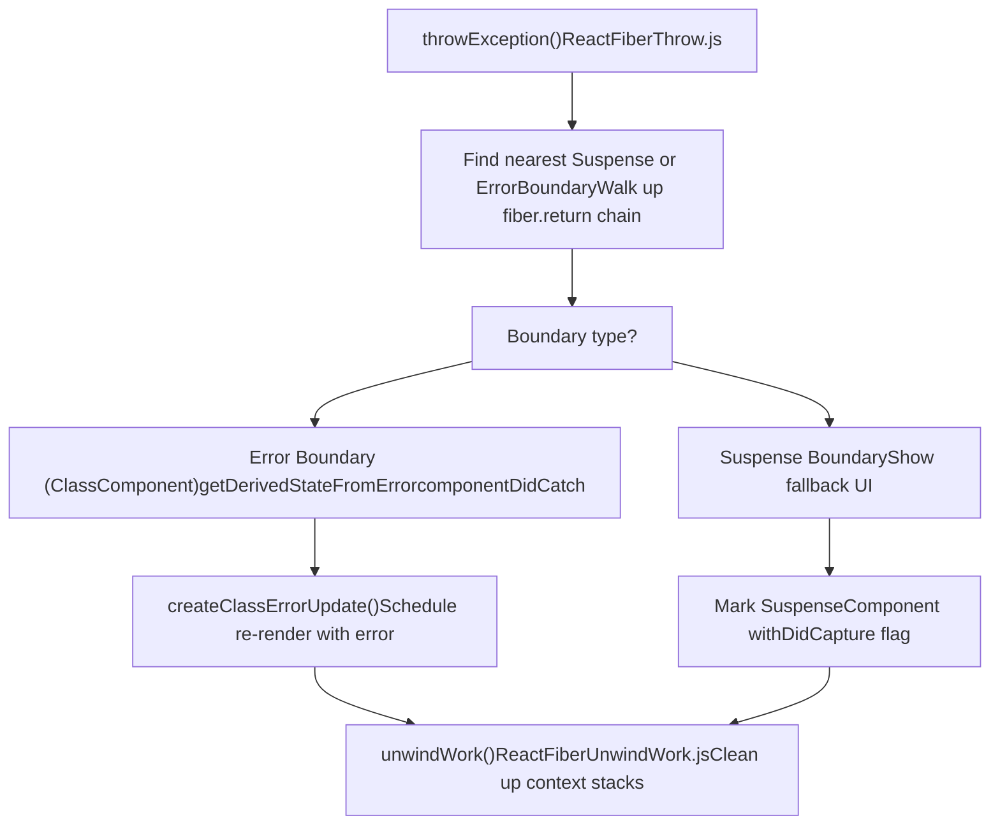
当抛出错误或 promise 时：

1.  调用 `throwException()`，传入抛出的值
2.  沿树向上查找合适的边界
3.  对于错误：在错误边界上调用 `getDerivedStateFromError`，调度重新渲染
4.  对于 Suspense：用 `DidCapture` 标记边界，准备显示 fallback
5.  `unwindWork()` 清理所有上下文栈，回溯到边界
6.  从边界重新开始渲染

**来源**：[packages/react-reconciler/src/ReactFiberThrow.js400-600](https://github.com/facebook/react/blob/65eec428/packages/react-reconciler/src/ReactFiberThrow.js#L400-L600) [packages/react-reconciler/src/ReactFiberUnwindWork.js63-180](https://github.com/facebook/react/blob/65eec428/packages/react-reconciler/src/ReactFiberUnwindWork.js#L63-L180) [packages/react-reconciler/src/ReactFiberWorkLoop.js1900-2100](https://github.com/facebook/react/blob/65eec428/packages/react-reconciler/src/ReactFiberWorkLoop.js#L1900-L2100)

---

## 并发特性与中断

在并发模式下，渲染阶段可以被中断以处理更高优先级的更新。

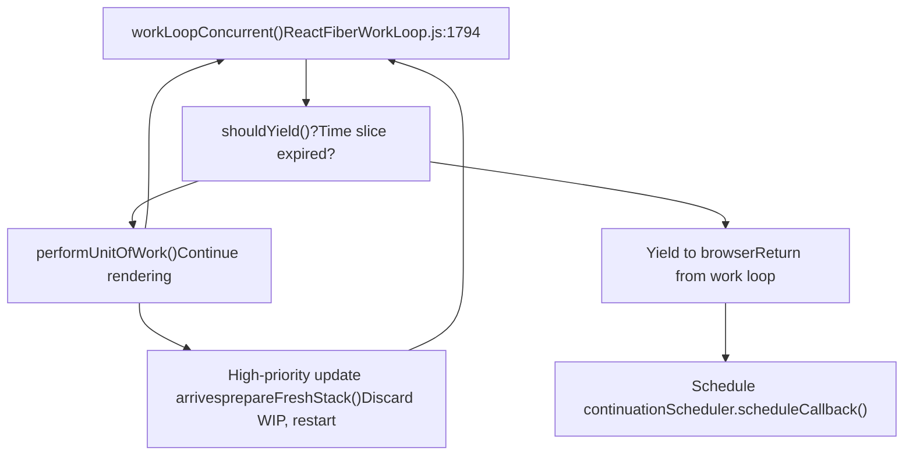
**中断点**：

-   工作单元（fibers）之间
-   `shouldYield()` 检查时间片是否耗尽
-   新的更高优先级更新可以丢弃 work-in-progress

**恢复**：

-   Work-in-progress 状态被保留
-   可以从 `workInProgress` fiber 恢复
-   或者为了更高优先级从根节点重新开始

**来源**：[packages/react-reconciler/src/ReactFiberWorkLoop.js1776-1850](https://github.com/facebook/react/blob/65eec428/packages/react-reconciler/src/ReactFiberWorkLoop.js#L1776-L1850) [packages/react-reconciler/src/ReactFiberWorkLoop.js1300-1400](https://github.com/facebook/react/blob/65eec428/packages/react-reconciler/src/ReactFiberWorkLoop.js#L1300-L1400)

---

## 组件类型与标签

Reconciler 通过 `WorkTag` 枚举处理不同的组件类型。

```mermaid
flowchart TD
    Fragment["Fragment = 7React.Fragment"]
    ContextProvider["ContextProvider = 10Context.Provider"]
    ContextConsumer["ContextConsumer = 9Context.Consumer"]
    Profiler["Profiler = 12React.Profiler"]
    SuspenseComponent["SuspenseComponent = 13React.Suspense"]
    SuspenseListComponent["SuspenseListComponent = 23React.SuspenseList"]
    OffscreenComponent["OffscreenComponent = 22Hidden content"]
    ActivityComponent["ActivityComponent = 25React.Activity"]
    FunctionComponent["FunctionComponent = 0Function components"]
    ClassComponent["ClassComponent = 1Class components"]
    ForwardRef["ForwardRef = 11React.forwardRef"]
    MemoComponent["MemoComponent = 14React.memo"]
    SimpleMemoComponent["SimpleMemoComponent = 15Memo with simple comparison"]
    HostRoot["HostRoot = 3Root of Fiber tree"]
    HostComponent["HostComponent = 5DOM element (div, span)"]
    HostText["HostText = 6Text node"]
    HostPortal["HostPortal = 4ReactDOM.createPortal"]
```
每个 Fiber 上的 `tag` 字段决定了 `beginWork` 和 `completeWork` 采取的代码路径。

**分发示例** ([ReactFiberBeginWork.js3800-4100](https://github.com/facebook/react/blob/65eec428/ReactFiberBeginWork.js#L3800-L4100))：

```
switch (workInProgress.tag) {
  case FunctionComponent:
    return updateFunctionComponent(...)
  case ClassComponent:
    return updateClassComponent(...)
  case HostComponent:
    return updateHostComponent(...)
  ...
}
```
**来源**：[packages/react-reconciler/src/ReactWorkTags.js1-60](https://github.com/facebook/react/blob/65eec428/packages/react-reconciler/src/ReactWorkTags.js#L1-L60) [packages/react-reconciler/src/ReactFiberBeginWork.js3800-4100](https://github.com/facebook/react/blob/65eec428/packages/react-reconciler/src/ReactFiberBeginWork.js#L3800-L4100)

---

## Context 系统

React Context 在 Reconciler 层面实现。

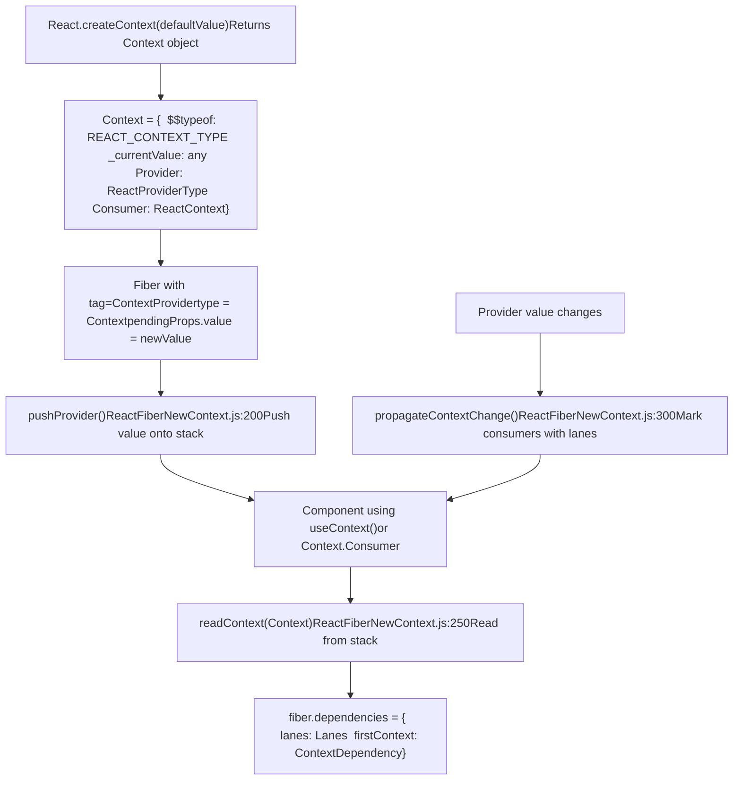
**Context 机制**：

1.  **基于栈**：遍历树时，Provider 将值推入栈中
2.  **依赖**：消费组件在 `fiber.dependencies` 中记录依赖
3.  **防止跳过 (Bailout prevention)**：当 context 值更改时，`propagateContextChange()` 标记所有消费者为更新车道，防止跳过

**关键函数**：

-   `pushProvider()` - 将新的 context 值推入栈 ([ReactFiberNewContext.js200-250](https://github.com/facebook/react/blob/65eec428/ReactFiberNewContext.js#L200-L250))
-   `readContext()` - 读取当前 context 值并记录依赖 ([ReactFiberNewContext.js250-350](https://github.com/facebook/react/blob/65eec428/ReactFiberNewContext.js#L250-L350))
-   `propagateContextChange()` - 值更改时标记消费者进行更新 ([ReactFiberNewContext.js400-550](https://github.com/facebook/react/blob/65eec428/ReactFiberNewContext.js#L400-L550))

**来源**：[packages/react-reconciler/src/ReactFiberNewContext.js200-550](https://github.com/facebook/react/blob/65eec428/packages/react-reconciler/src/ReactFiberNewContext.js#L200-L550) [packages/react-reconciler/src/ReactFiberBeginWork.js3200-3350](https://github.com/facebook/react/blob/65eec428/packages/react-reconciler/src/ReactFiberBeginWork.js#L3200-L3350)

---

## 调度入口点

更新通过几种路径进入 Reconciler：

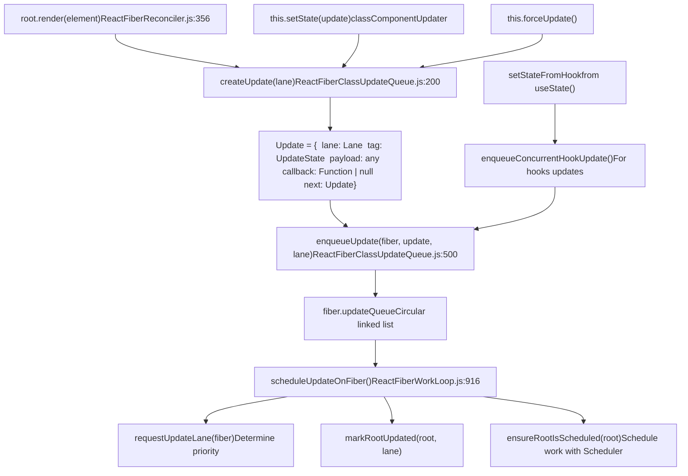
**更新生命周期**：

1.  用户调用 `setState()` 或 `render()`
2.  创建一个带有优先级车道的 `Update` 对象
3.  将更新入队到 fiber 的 `updateQueue`
4.  使用 root 和 lane 调用 `scheduleUpdateOnFiber()`
5.  `ensureRootIsScheduled()` 根据车道通过 Scheduler 调度工作

**来源**：[packages/react-reconciler/src/ReactFiberReconciler.js356-461](https://github.com/facebook/react/blob/65eec428/packages/react-reconciler/src/ReactFiberReconciler.js#L356-L461) [packages/react-reconciler/src/ReactFiberWorkLoop.js916-1042](https://github.com/facebook/react/blob/65eec428/packages/react-reconciler/src/ReactFiberWorkLoop.js#L916-L1042) [packages/react-reconciler/src/ReactFiberClassUpdateQueue.js165-243](https://github.com/facebook/react/blob/65eec428/packages/react-reconciler/src/ReactFiberClassUpdateQueue.js#L165-L243)

---

## 批处理与同步

Reconciler 对更新进行批处理以最大限度地减少渲染。

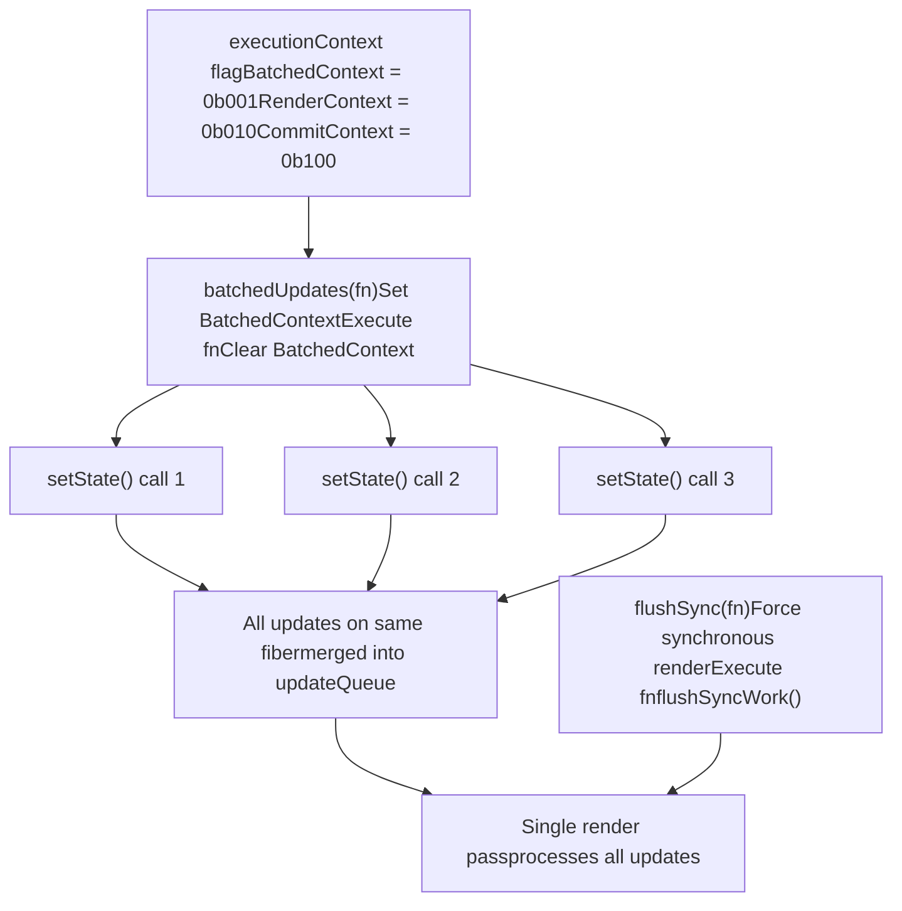
**自动批处理**：在 React 18+ 中，所有更新都会在单个事件、超时或 promise 回调中自动进行批处理。`executionContext` 防止嵌套的 flush 操作。

**手动控制**：

-   `flushSync()` - 强制同步渲染 ([ReactFiberWorkLoop.js1244-1278](https://github.com/facebook/react/blob/65eec428/ReactFiberWorkLoop.js#L1244-L1278))
-   `batchedUpdates()` - 显式批处理（主要是遗留代码）([ReactFiberWorkLoop.js2832-2850](https://github.com/facebook/react/blob/65eec428/ReactFiberWorkLoop.js#L2832-L2850))

**来源**：[packages/react-reconciler/src/ReactFiberWorkLoop.js1244-1278](https://github.com/facebook/react/blob/65eec428/packages/react-reconciler/src/ReactFiberWorkLoop.js#L1244-L1278) [packages/react-reconciler/src/ReactFiberWorkLoop.js2832-2850](https://github.com/facebook/react/blob/65eec428/packages/react-reconciler/src/ReactFiberWorkLoop.js#L2832-L2850)

---

## Refs 与命令式句柄 (Imperative Handles)

Reconciler 管理 refs 并提供对实例的命令式访问。

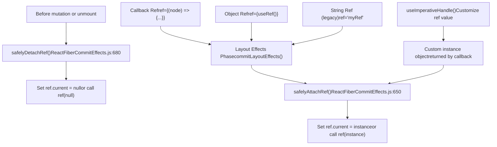
**Ref 生命周期**：

1.  **分离 (Detachment)**：在突变之前，调用 `safelyDetachRef()` 清除旧的 refs
2.  **挂载 (Attachment)**：在布局阶段，调用 `safelyAttachRef()` 设置新的 refs
3.  **实例 (Instance)**：对于宿主组件，ref 指向 DOM 节点；对于类组件，指向类实例；对于带有 `useImperativeHandle` 的函数组件，指向自定义对象

**来源**：[packages/react-reconciler/src/ReactFiberCommitEffects.js650-720](https://github.com/facebook/react/blob/65eec428/packages/react-reconciler/src/ReactFiberCommitEffects.js#L650-L720) [packages/react-reconciler/src/ReactFiberHooks.js2100-2200](https://github.com/facebook/react/blob/65eec428/packages/react-reconciler/src/ReactFiberHooks.js#L2100-L2200)

---

## Profiler 集成

Reconciler 与 React DevTools Profiler 集成以跟踪渲染时间。

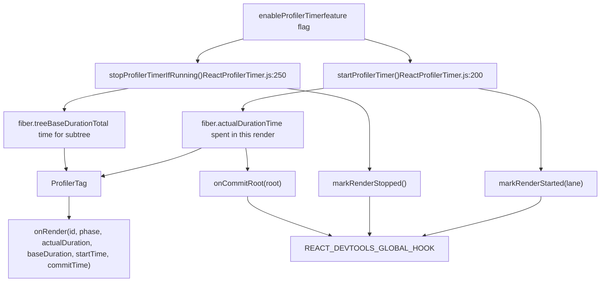
**Profiler 机制**：

-   `actualDuration`：本次渲染中该组件花费的时间
-   `treeBaseDuration`：重新渲染整个子树的预估时间（从上次渲染缓存）
-   `startProfilerTimer()` / `stopProfilerTimerIfRunning()`：记录组件渲染的时间
-   `<Profiler>` 组件在提交后使用计时数据调用 `onRender` 回调
-   DevTools hook 接收渲染开始/停止/提交的通知

**来源**：[packages/react-reconciler/src/ReactProfilerTimer.js150-350](https://github.com/facebook/react/blob/65eec428/packages/react-reconciler/src/ReactProfilerTimer.js#L150-L350) [packages/react-reconciler/src/ReactFiberCommitEffects.js720-780](https://github.com/facebook/react/blob/65eec428/packages/react-reconciler/src/ReactFiberCommitEffects.js#L720-L780) [packages/react-reconciler/src/ReactFiberDevToolsHook.js200-350](https://github.com/facebook/react/blob/65eec428/packages/react-reconciler/src/ReactFiberDevToolsHook.js#L200-L350)

---

## 并发模式渲染模式

### 选择性水合 (Selective Hydration)

Reconciler 支持根据用户交互选择性地水合服务端渲染的内容。

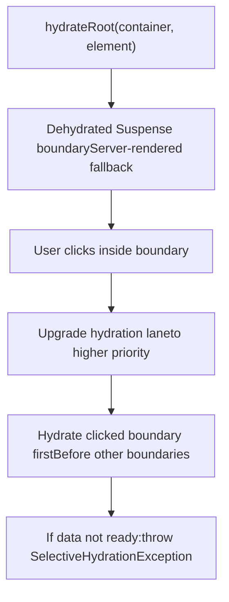
当用户与脱水 (dehydrated) 的边界交互时，React 优先水合该边界以使其快速可交互。

**来源**：[packages/react-reconciler/src/ReactFiberBeginWork.js311-317](https://github.com/facebook/react/blob/65eec428/packages/react-reconciler/src/ReactFiberBeginWork.js#L311-L317) [packages/react-reconciler/src/ReactFiberReconciler.js489-520](https://github.com/facebook/react/blob/65eec428/packages/react-reconciler/src/ReactFiberReconciler.js#L489-L520)

### 离屏 (Offscreen) 渲染

`OffscreenComponent` 允许预渲染尚不可见的内容。

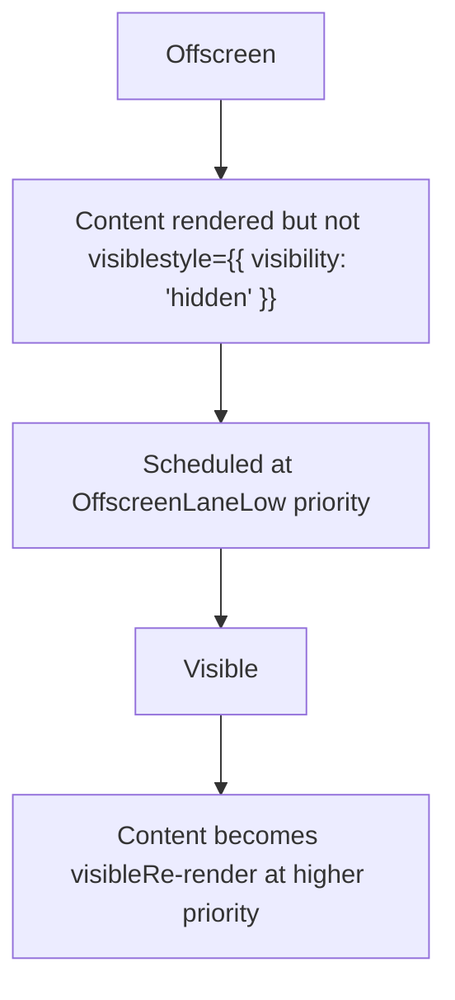
离屏组件以低优先级渲染，并以 `visibility: hidden` 保留在 DOM 中，然后在需要时瞬间显示。

**来源**：[packages/react-reconciler/src/ReactFiberBeginWork.js613-871](https://github.com/facebook/react/blob/65eec428/packages/react-reconciler/src/ReactFiberBeginWork.js#L613-L871) [packages/react-reconciler/src/ReactFiberOffscreenComponent.js1-50](https://github.com/facebook/react/blob/65eec428/packages/react-reconciler/src/ReactFiberOffscreenComponent.js#L1-L50)

---

## 总结

React Reconciler 是核心协调引擎，负责：

-   **管理 Fiber 树**：带有 `current` 和 `workInProgress` 的双缓存树
-   **协调渲染阶段**：可中断的渲染阶段，同步的提交阶段
-   **抽象平台**：通过 `ReactFiberConfig` 接口委托宿主操作
-   **调度工作**：使用车道 (lanes) 和 Scheduler 进行基于优先级的调度
-   **处理更新**：批处理更新，处理更新队列，协调子节点
-   **支持特性**：Hooks, Context, Suspense, 错误边界, 并发渲染

关键入口点：

-   `createContainer()` / `updateContainer()` - 初始化和更新根节点
-   `scheduleUpdateOnFiber()` - 在 fiber 上调度工作
-   `performWorkOnRoot()` - 执行渲染和提交阶段
-   `beginWork()` / `completeWork()` - 遍历 fiber 树
-   `commitMutationEffects()` / `commitLayoutEffects()` - 将更改应用到宿主

Reconciler 是平台无关的，使 React 能够以 DOM, Native, Canvas 和自定义渲染器为目标，同时保持单一的核心算法。
