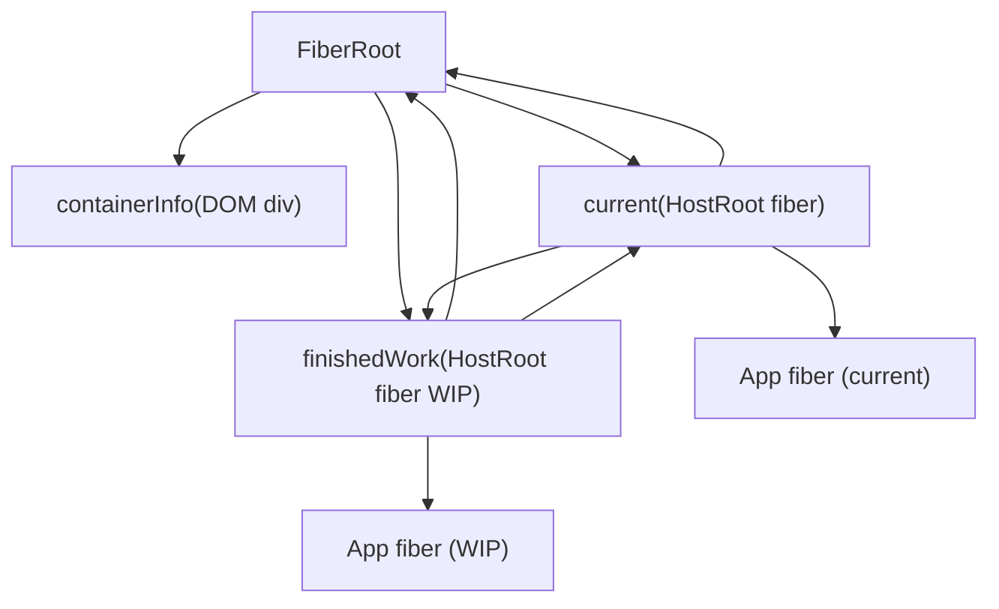
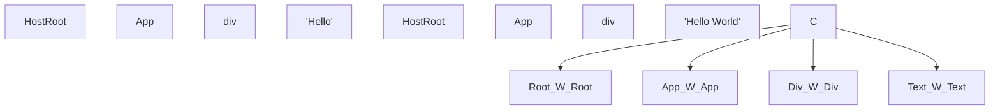
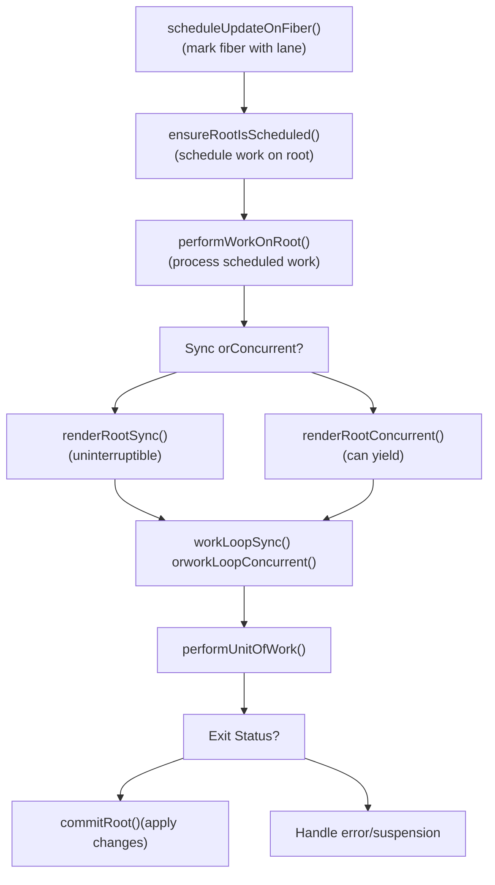
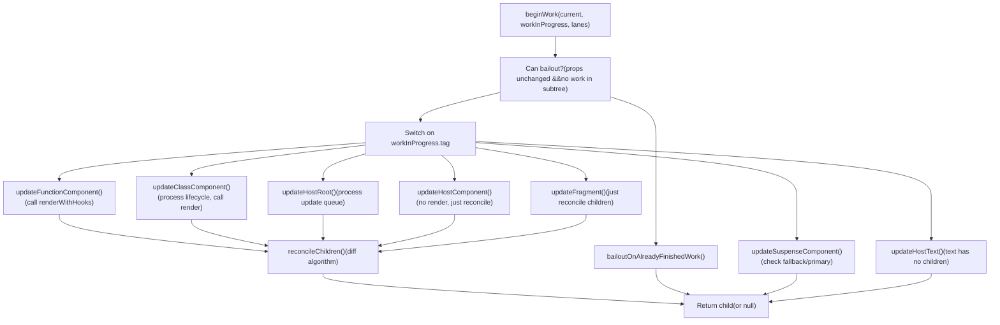
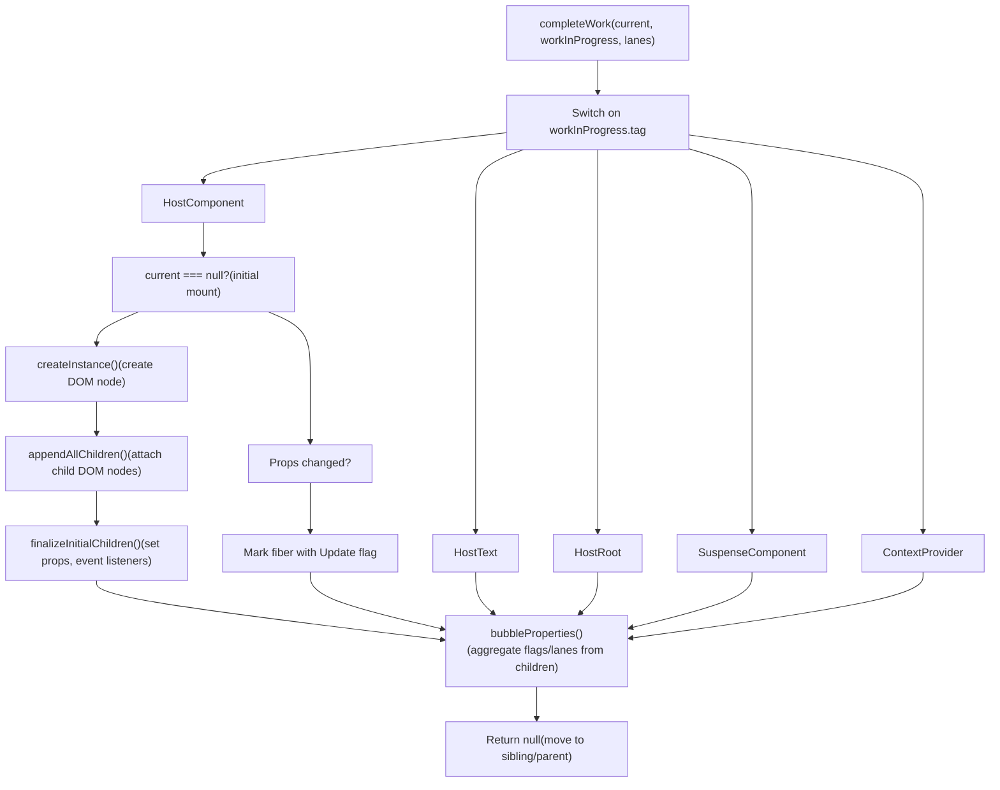
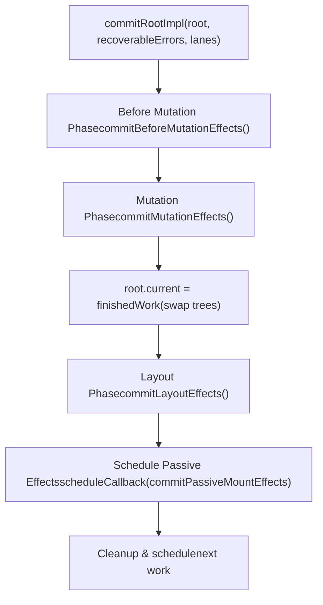
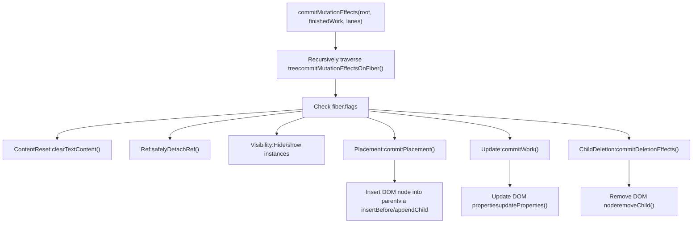

# Fiber 架构与数据结构

相关源文件

-   [packages/react-client/src/ReactFlightPerformanceTrack.js](https://github.com/facebook/react/blob/65eec428/packages/react-client/src/ReactFlightPerformanceTrack.js)
-   [packages/react-debug-tools/src/ReactDebugHooks.js](https://github.com/facebook/react/blob/65eec428/packages/react-debug-tools/src/ReactDebugHooks.js)
-   [packages/react-debug-tools/src/\_\_tests\_\_/ReactHooksInspection-test.js](https://github.com/facebook/react/blob/65eec428/packages/react-debug-tools/src/__tests__/ReactHooksInspection-test.js)
-   [packages/react-debug-tools/src/\_\_tests\_\_/ReactHooksInspectionIntegration-test.js](https://github.com/facebook/react/blob/65eec428/packages/react-debug-tools/src/__tests__/ReactHooksInspectionIntegration-test.js)
-   [packages/react-debug-tools/src/\_\_tests\_\_/ReactHooksInspectionIntegrationDOM-test.js](https://github.com/facebook/react/blob/65eec428/packages/react-debug-tools/src/__tests__/ReactHooksInspectionIntegrationDOM-test.js)
-   [packages/react-devtools-shell/src/app/InspectableElements/CustomHooks.js](https://github.com/facebook/react/blob/65eec428/packages/react-devtools-shell/src/app/InspectableElements/CustomHooks.js)
-   [packages/react-devtools-timeline/src/content-views/utils/moduleFilters.js](https://github.com/facebook/react/blob/65eec428/packages/react-devtools-timeline/src/content-views/utils/moduleFilters.js)
-   [packages/react-dom/src/\_\_tests\_\_/ReactDOMFiberAsync-test.js](https://github.com/facebook/react/blob/65eec428/packages/react-dom/src/__tests__/ReactDOMFiberAsync-test.js)
-   [packages/react-dom/src/\_\_tests\_\_/ReactDOMNativeEventHeuristic-test.js](https://github.com/facebook/react/blob/65eec428/packages/react-dom/src/__tests__/ReactDOMNativeEventHeuristic-test.js)
-   [packages/react-dom/src/events/plugins/\_\_tests\_\_/ChangeEventPlugin-test.js](https://github.com/facebook/react/blob/65eec428/packages/react-dom/src/events/plugins/__tests__/ChangeEventPlugin-test.js)
-   [packages/react-dom/src/events/plugins/\_\_tests\_\_/SimpleEventPlugin-test.js](https://github.com/facebook/react/blob/65eec428/packages/react-dom/src/events/plugins/__tests__/SimpleEventPlugin-test.js)
-   [packages/react-reconciler/src/ReactFiber.js](https://github.com/facebook/react/blob/65eec428/packages/react-reconciler/src/ReactFiber.js)
-   [packages/react-reconciler/src/ReactFiberBeginWork.js](https://github.com/facebook/react/blob/65eec428/packages/react-reconciler/src/ReactFiberBeginWork.js)
-   [packages/react-reconciler/src/ReactFiberClassComponent.js](https://github.com/facebook/react/blob/65eec428/packages/react-reconciler/src/ReactFiberClassComponent.js)
-   [packages/react-reconciler/src/ReactFiberCommitWork.js](https://github.com/facebook/react/blob/65eec428/packages/react-reconciler/src/ReactFiberCommitWork.js)
-   [packages/react-reconciler/src/ReactFiberCompleteWork.js](https://github.com/facebook/react/blob/65eec428/packages/react-reconciler/src/ReactFiberCompleteWork.js)
-   [packages/react-reconciler/src/ReactFiberHooks.js](https://github.com/facebook/react/blob/65eec428/packages/react-reconciler/src/ReactFiberHooks.js)
-   [packages/react-reconciler/src/ReactFiberLane.js](https://github.com/facebook/react/blob/65eec428/packages/react-reconciler/src/ReactFiberLane.js)
-   [packages/react-reconciler/src/ReactFiberOffscreenComponent.js](https://github.com/facebook/react/blob/65eec428/packages/react-reconciler/src/ReactFiberOffscreenComponent.js)
-   [packages/react-reconciler/src/ReactFiberPerformanceTrack.js](https://github.com/facebook/react/blob/65eec428/packages/react-reconciler/src/ReactFiberPerformanceTrack.js)
-   [packages/react-reconciler/src/ReactFiberRootScheduler.js](https://github.com/facebook/react/blob/65eec428/packages/react-reconciler/src/ReactFiberRootScheduler.js)
-   [packages/react-reconciler/src/ReactFiberSuspenseComponent.js](https://github.com/facebook/react/blob/65eec428/packages/react-reconciler/src/ReactFiberSuspenseComponent.js)
-   [packages/react-reconciler/src/ReactFiberUnwindWork.js](https://github.com/facebook/react/blob/65eec428/packages/react-reconciler/src/ReactFiberUnwindWork.js)
-   [packages/react-reconciler/src/ReactFiberWorkLoop.js](https://github.com/facebook/react/blob/65eec428/packages/react-reconciler/src/ReactFiberWorkLoop.js)
-   [packages/react-reconciler/src/ReactInternalTypes.js](https://github.com/facebook/react/blob/65eec428/packages/react-reconciler/src/ReactInternalTypes.js)
-   [packages/react-reconciler/src/ReactProfilerTimer.js](https://github.com/facebook/react/blob/65eec428/packages/react-reconciler/src/ReactProfilerTimer.js)
-   [packages/react-reconciler/src/\_\_tests\_\_/ReactDeferredValue-test.js](https://github.com/facebook/react/blob/65eec428/packages/react-reconciler/src/__tests__/ReactDeferredValue-test.js)
-   [packages/react-reconciler/src/\_\_tests\_\_/ReactHooks-test.internal.js](https://github.com/facebook/react/blob/65eec428/packages/react-reconciler/src/__tests__/ReactHooks-test.internal.js)
-   [packages/react-reconciler/src/\_\_tests\_\_/ReactHooksWithNoopRenderer-test.js](https://github.com/facebook/react/blob/65eec428/packages/react-reconciler/src/__tests__/ReactHooksWithNoopRenderer-test.js)
-   [packages/react-reconciler/src/\_\_tests\_\_/ReactLazy-test.internal.js](https://github.com/facebook/react/blob/65eec428/packages/react-reconciler/src/__tests__/ReactLazy-test.internal.js)
-   [packages/react-reconciler/src/\_\_tests\_\_/ReactPerformanceTrack-test.js](https://github.com/facebook/react/blob/65eec428/packages/react-reconciler/src/__tests__/ReactPerformanceTrack-test.js)
-   [packages/react-reconciler/src/\_\_tests\_\_/ReactSiblingPrerendering-test.js](https://github.com/facebook/react/blob/65eec428/packages/react-reconciler/src/__tests__/ReactSiblingPrerendering-test.js)
-   [packages/react-reconciler/src/\_\_tests\_\_/ReactSuspense-test.internal.js](https://github.com/facebook/react/blob/65eec428/packages/react-reconciler/src/__tests__/ReactSuspense-test.internal.js)
-   [packages/react-reconciler/src/\_\_tests\_\_/ReactSuspensePlaceholder-test.internal.js](https://github.com/facebook/react/blob/65eec428/packages/react-reconciler/src/__tests__/ReactSuspensePlaceholder-test.internal.js)
-   [packages/react-reconciler/src/\_\_tests\_\_/ReactSuspenseWithNoopRenderer-test.js](https://github.com/facebook/react/blob/65eec428/packages/react-reconciler/src/__tests__/ReactSuspenseWithNoopRenderer-test.js)
-   [packages/react-reconciler/src/\_\_tests\_\_/ReactSuspenseyCommitPhase-test.js](https://github.com/facebook/react/blob/65eec428/packages/react-reconciler/src/__tests__/ReactSuspenseyCommitPhase-test.js)
-   [packages/react-server/src/ReactFizzHooks.js](https://github.com/facebook/react/blob/65eec428/packages/react-server/src/ReactFizzHooks.js)
-   [packages/react-server/src/ReactFlightAsyncSequence.js](https://github.com/facebook/react/blob/65eec428/packages/react-server/src/ReactFlightAsyncSequence.js)
-   [packages/react-server/src/ReactFlightServerConfigDebugNode.js](https://github.com/facebook/react/blob/65eec428/packages/react-server/src/ReactFlightServerConfigDebugNode.js)
-   [packages/react-server/src/ReactFlightServerConfigDebugNoop.js](https://github.com/facebook/react/blob/65eec428/packages/react-server/src/ReactFlightServerConfigDebugNoop.js)
-   [packages/react-server/src/ReactFlightStackConfigV8.js](https://github.com/facebook/react/blob/65eec428/packages/react-server/src/ReactFlightStackConfigV8.js)
-   [packages/react-server/src/\_\_tests\_\_/ReactFlightAsyncDebugInfo-test.js](https://github.com/facebook/react/blob/65eec428/packages/react-server/src/__tests__/ReactFlightAsyncDebugInfo-test.js)
-   [packages/react/src/ReactHooks.js](https://github.com/facebook/react/blob/65eec428/packages/react/src/ReactHooks.js)
-   [packages/react/src/ReactLazy.js](https://github.com/facebook/react/blob/65eec428/packages/react/src/ReactLazy.js)
-   [packages/react/src/\_\_tests\_\_/ReactProfiler-test.internal.js](https://github.com/facebook/react/blob/65eec428/packages/react/src/__tests__/ReactProfiler-test.internal.js)
-   [packages/shared/ReactPerformanceTrackProperties.js](https://github.com/facebook/react/blob/65eec428/packages/shared/ReactPerformanceTrackProperties.js)
-   [packages/shared/ReactSymbols.js](https://github.com/facebook/react/blob/65eec428/packages/shared/ReactSymbols.js)

## 目的与范围

本页面记录了 React 的 Fiber 数据结构、FiberRoot 容器、使用当前树和进行中 (work-in-progress) 树的双缓存技术，以及使用子节点/兄弟节点/返回指针的树遍历机制。这些是实现 React 增量协调的基础数据结构。

相关主题请参阅：

-   工作循环执行与渲染/提交阶段：[工作循环与渲染阶段](/facebook/react/4.2-work-loop-and-rendering-phases)
-   Hooks 实现：[React Hooks 系统](/facebook/react/4.3-react-hooks-system)
-   优先级调度：[基于车道的调度与优先级](/facebook/react/4.4-lane-based-scheduling-and-priorities)
-   错误与 Suspense 处理：[Suspense 与错误边界](/facebook/react/4.5-suspense-and-error-boundaries)
-   宿主特定操作：[宿主配置抽象](/facebook/react/4.6-host-configuration-abstraction)

## FiberRoot: 容器

`FiberRoot` 是持有整个 Fiber 树并协调渲染的容器对象。它是在调用 `createRoot()` 或 `createContainer()` 时由 [ReactFiberRoot.js109-225](https://github.com/facebook/react/blob/65eec428/ReactFiberRoot.js#L109-L225) 中的 `createFiberRoot` 创建的。

### FiberRoot 结构

关键字段定义在 [ReactInternalTypes.js253-334](https://github.com/facebook/react/blob/65eec428/ReactInternalTypes.js#L253-L334)：

| 字段 | 类型 | 用途 |
| --- | --- | --- |
| `containerInfo` | `Container` | 宿主容器（例如 DOM 节点） |
| `current` | `Fiber` | 指向当前 HostRoot fiber 的指针 |
| `finishedWork` | `Fiber | null` | 渲染完成后的 work-in-progress 根 |
| `pendingLanes` | `Lanes` | 具有挂起工作的车道 |
| `suspendedLanes` | `Lanes` | 被 promise 挂起的车道 |
| `pingedLanes` | `Lanes` | 已被 ping 以重试的车道 |
| `expiredLanes` | `Lanes` | 已过期的车道 |
| `callbackNode` | `mixed` | Scheduler 回调节点 |
| `callbackPriority` | `Lane` | 计划回调的优先级 |
| `hydrationCallbacks` | `null | SuspenseHydrationCallbacks` | 水合回调 |
| `context` | `Object | null` | 用于旧版 context 的上下文对象 |
| `pendingContext` | `Object | null` | 挂起的 context 更新 |

**图表：FiberRoot 与 HostRoot 关系**


`HostRoot` fiber (tag = 3) 很特殊：

-   它的 `stateNode` 指回 `FiberRoot`
-   它没有 React 元素（它是 React 树的根）
-   它的 `memoizedState` 包含传递给 `render()` 的初始元素 [ReactInternalTypes.js246-251](https://github.com/facebook/react/blob/65eec428/ReactInternalTypes.js#L246-L251)

来源：[ReactFiberRoot.js109-225](https://github.com/facebook/react/blob/65eec428/ReactFiberRoot.js#L109-L225) [ReactInternalTypes.js253-334](https://github.com/facebook/react/blob/65eec428/ReactInternalTypes.js#L253-L334) [ReactInternalTypes.js246-251](https://github.com/facebook/react/blob/65eec428/ReactInternalTypes.js#L246-L251)

## Fiber 数据结构

### Fiber 节点定义

Fiber 是 React 的内部工作单元，代表组件实例、DOM 节点或其他 React 元素。它是一个可变的 JavaScript 对象，包含协调、调度和副作用所需的所有信息。

`FiberNode` 构造函数定义在 [ReactFiber.js138-211](https://github.com/facebook/react/blob/65eec428/ReactFiber.js#L138-L211) 中。React 提供两种实现：

-   基于类：`createFiberImplClass`（默认）
-   对象字面量：`createFiberImplObject`（由 `enableObjectFiber` 标志控制）

### 按类别的 Fiber 字段

| 字段类别 | 关键字段 | 用途 |
| --- | --- | --- |
| **实例标识** | `tag`, `key`, `elementType`, `type` | 标识此 fiber 代表什么 |
| **实例状态** | `stateNode` | 引用组件实例、DOM 节点或其他状态 |
| **树结构** | `return`, `child`, `sibling`, `index` | 通过指针形成 fiber 树 |
| **Refs** | `ref`, `refCleanup` | 处理 ref 挂载和清理 |
| **Props** | `pendingProps`, `memoizedProps` | 正在处理的 props 和上次渲染的 props |
| **State** | `memoizedState`, `updateQueue` | 组件状态和挂起的更新 |
| **Context** | `dependencies` | Context 订阅 |
| **模式** | `mode` | ConcurrentMode, StrictMode 等的位域 |
| **副作用** | `flags`, `subtreeFlags`, `deletions` | 在提交阶段执行的副作用 |
| **调度** | `lanes`, `childLanes` | 此 fiber 及其子树的工作优先级 |
| **双缓存** | `alternate` | 链接到另一棵树中的对应 fiber |
| **性能分析** | `actualDuration`, `selfBaseDuration` 等 | 计时信息（如果启用） |

**Fiber 创建：**

新 fiber 由 `createFiber` 创建 [ReactFiber.js303-305](https://github.com/facebook/react/blob/65eec428/ReactFiber.js#L303-L305)：

```
const createFiber = enableObjectFiber
  ? createFiberImplObject
  : createFiberImplClass;
```
来源：[ReactFiber.js138-211](https://github.com/facebook/react/blob/65eec428/ReactFiber.js#L138-L211) [ReactFiber.js226-305](https://github.com/facebook/react/blob/65eec428/ReactFiber.js#L226-L305) [ReactInternalTypes.js89-205](https://github.com/facebook/react/blob/65eec428/ReactInternalTypes.js#L89-L205)

### 工作标签 (Work Tags)

每个 fiber 的 `tag` 字段标识其类型，定义在 [ReactWorkTags.js10-37](https://github.com/facebook/react/blob/65eec428/ReactWorkTags.js#L10-L37) 中：

| 标签常量 | 值 | 代表 |
| --- | --- | --- |
| `FunctionComponent` | 0 | 函数组件 |
| `ClassComponent` | 1 | 类组件 |
| `HostRoot` | 3 | fiber 树的根（容器） |
| `HostComponent` | 5 | 平台元素（例如 DOM `<div>`） |
| `HostText` | 6 | 文本节点 |
| `HostPortal` | 4 | 通往不同容器的 Portal |
| `Fragment` | 7 | `React.Fragment` |
| `Mode` | 8 | StrictMode, ConcurrentMode 等 |
| `ContextProvider` | 10 | `Context.Provider` |
| `ContextConsumer` | 9 | `Context.Consumer` |
| `ForwardRef` | 11 | `React.forwardRef()` 包装器 |
| `Profiler` | 12 | `<Profiler>` 组件 |
| `SuspenseComponent` | 13 | `<Suspense>` 边界 |
| `MemoComponent` | 14 | `React.memo()` 包装器 |
| `SimpleMemoComponent` | 15 | 用于简单函数的优化 memo |
| `LazyComponent` | 16 | `React.lazy()` 包装器 |
| `OffscreenComponent` | 22 | 隐藏/推迟的子树 |
| `CacheComponent` | 24 | 缓存边界 |
| `TracingMarkerComponent` | 25 | 过渡追踪标记 |

标签决定了 fiber 在协调期间（在 `beginWork`/`completeWork` 中）如何处理，以及它支持哪些生命周期方法或 hooks。

来源：[ReactWorkTags.js10-37](https://github.com/facebook/react/blob/65eec428/ReactWorkTags.js#L10-L37) [ReactFiber.js146](https://github.com/facebook/react/blob/65eec428/ReactFiber.js#L146-L146)

## 双缓存：当前树与进行中树

React 使用称为双缓存的技术维护两棵 fiber 树：

-   **当前树 (Current tree)**：反映当前屏幕上渲染的内容
-   **进行中树 (Work-in-progress tree)**：在渲染阶段正在构建

### `alternate` 指针

每个 fiber 都有一个 `alternate` 字段指向另一棵树中的对应项 [ReactFiber.js177](https://github.com/facebook/react/blob/65eec428/ReactFiber.js#L177-L177)：


**图表：树之间的 Alternate 指针**

### 创建 Work-in-Progress Fiber

`createWorkInProgress` 函数 [ReactFiber.js327-383](https://github.com/facebook/react/blob/65eec428/ReactFiber.js#L327-L383) 管理 fiber 的重用：

**首次更新时（alternate 为 null）：**

1.  使用 `createFiber()` 创建新 fiber
2.  从 current 复制 `elementType`, `type`, `stateNode`
3.  设置双向 `alternate` 指针
4.  初始化 `pendingProps`

**后续更新时（alternate 存在）：**

1.  重用现有的 alternate fiber
2.  重置标志：`flags = NoFlags`, `subtreeFlags = NoFlags`
3.  清除 `deletions` 数组
4.  更新 `pendingProps` 为新 props
5.  重置 `lanes` 和 `childLanes`

**双缓存的好处：**

-   内存效率：跨渲染重用 fiber 对象
-   启用跳过优化：通过与 `current` 比较
-   允许中断：如果被取代，work-in-progress 可以被丢弃
-   原子更新：通过更新单个指针（`FiberRoot.current`）切换树

来源：[ReactFiber.js327-383](https://github.com/facebook/react/blob/65eec428/ReactFiber.js#L327-L383) [ReactFiber.js177](https://github.com/facebook/react/blob/65eec428/ReactFiber.js#L177-L177)

### 提交时的树交换

在渲染成功完成后，work-in-progress 树通过 `commitRootImpl` 中的单个指针更新变为 current 树 [ReactFiberWorkLoop.js2268-2826](https://github.com/facebook/react/blob/65eec428/ReactFiberWorkLoop.js#L2268-L2826)：

```
root.current = finishedWork;
```
之前的 current 树成为下一次更新的 work-in-progress alternate。

来源：[ReactFiberWorkLoop.js2268-2826](https://github.com/facebook/react/blob/65eec428/ReactFiberWorkLoop.js#L2268-L2826)

## 工作循环架构

### 概览：`performWorkOnRoot`

工作循环编排渲染和提交。主要入口点是 `performWorkOnRoot` [ReactFiberWorkLoop.js940-1089](https://github.com/facebook/react/blob/65eec428/ReactFiberWorkLoop.js#L940-L1089)，它：

1.  准备 work-in-progress 根
2.  执行渲染阶段 (`renderRootSync` 或 `renderRootConcurrent`)
3.  如果成功，执行提交阶段 (`commitRoot`)
4.  处理错误和挂起
5.  调度任何剩余的工作


**图表：工作循环执行流程**

来源：[ReactFiberWorkLoop.js940-1089](https://github.com/facebook/react/blob/65eec428/ReactFiberWorkLoop.js#L940-L1089) [ReactFiberWorkLoop.js1643-1846](https://github.com/facebook/react/blob/65eec428/ReactFiberWorkLoop.js#L1643-L1846)

### 工作循环状态变量

位于 [ReactFiberWorkLoop.js423-496](https://github.com/facebook/react/blob/65eec428/ReactFiberWorkLoop.js#L423-L496) 的关键模块级状态：

```
let workInProgressRoot: FiberRoot | null = null;     // 正在渲染的根
let workInProgress: Fiber | null = null;             // 正在处理的当前 fiber
let workInProgressRootRenderLanes: Lanes = NoLanes; // 正在渲染的车道

let workInProgressSuspendedReason: SuspendedReason = NotSuspended;
let workInProgressThrownValue: mixed = null;

let workInProgressRootExitStatus: RootExitStatus = RootInProgress;
```
这些变量在 Reconciler 内部全局跟踪当前渲染的状态。

来源：[ReactFiberWorkLoop.js423-496](https://github.com/facebook/react/blob/65eec428/ReactFiberWorkLoop.js#L423-L496)

## 渲染阶段 (The Render Phase)

渲染阶段通过深度优先遍历 fiber 来构建 work-in-progress 树。此阶段在并发模式下是 **可中断的**。

### 工作循环函数

存在两个变体 [ReactFiberWorkLoop.js1848-1856](https://github.com/facebook/react/blob/65eec428/ReactFiberWorkLoop.js#L1848-L1856)：

**同步（不可中断）：**

```
function workLoopSync() {
  while (workInProgress !== null) {
    performUnitOfWork(workInProgress);
  }
}
```
**并发（可中断）：**

```
function workLoopConcurrent() {
  while (workInProgress !== null && !shouldYield()) {
    performUnitOfWork(workInProgress);
  }
}
```
并发版本检查来自 Scheduler 的 `shouldYield()` 以将控制权交还给浏览器。

来源：[ReactFiberWorkLoop.js1848-1856](https://github.com/facebook/react/blob/65eec428/ReactFiberWorkLoop.js#L1848-L1856)

### 工作单元：`performUnitOfWork`

每次迭代处理一个 fiber [ReactFiberWorkLoop.js1858-1884](https://github.com/facebook/react/blob/65eec428/ReactFiberWorkLoop.js#L1858-L1884)：

```
function performUnitOfWork(unitOfWork: Fiber): void {
  const current = unitOfWork.alternate;

  let next = beginWork(current, unitOfWork, renderLanes);

  unitOfWork.memoizedProps = unitOfWork.pendingProps;

  if (next === null) {
    completeUnitOfWork(unitOfWork);
  } else {
    workInProgress = next;
  }
}
```
**流程：**

1.  调用 `beginWork` 处理 fiber 并生成子节点
2.  如果 `beginWork` 返回子节点，将其设为下一个 `workInProgress`
3.  如果没有子节点，调用 `completeUnitOfWork` 完成此 fiber 并移动到兄弟/父节点

来源：[ReactFiberWorkLoop.js1858-1884](https://github.com/facebook/react/blob/65eec428/ReactFiberWorkLoop.js#L1858-L1884)

### Begin Work: `beginWork`

`beginWork` 函数 [ReactFiberBeginWork.js3649-4221](https://github.com/facebook/react/blob/65eec428/ReactFiberBeginWork.js#L3649-L4221) 是一个处理每种 fiber 类型的大型 switch 语句：


**图表：beginWork 处理流程**

#### `beginWork` 中的关键操作：

1.  **Bailout 优化** [ReactFiberBeginWork.js3798-3823](https://github.com/facebook/react/blob/65eec428/ReactFiberBeginWork.js#L3798-L3823)：如果 props 未更改且子树中没有安排工作，则跳过处理

2.  **特定于组件的更新**：

    -   `updateFunctionComponent` [ReactFiberBeginWork.js1363-1434](https://github.com/facebook/react/blob/65eec428/ReactFiberBeginWork.js#L1363-L1434)：调用 `renderWithHooks` 执行函数
    -   `updateClassComponent` [ReactFiberBeginWork.js1179-1298](https://github.com/facebook/react/blob/65eec428/ReactFiberBeginWork.js#L1179-L1298)：处理生命周期方法并调用 `render()`
    -   `updateHostComponent` [ReactFiberBeginWork.js1745-1791](https://github.com/facebook/react/blob/65eec428/ReactFiberBeginWork.js#L1745-L1791)：对于 DOM 元素，仅准备子节点协调
3.  **子节点协调** [ReactFiberBeginWork.js340-371](https://github.com/facebook/react/blob/65eec428/ReactFiberBeginWork.js#L340-L371)：调用 `reconcileChildren`，它：

    -   对于初始挂载使用 `mountChildFibers`（无 placement 标志）
    -   对于更新使用 `reconcileChildFibers`（跟踪副作用）
    -   在 [ReactChildFiber.js](https://github.com/facebook/react/blob/65eec428/ReactChildFiber.js) 中实现 React 的 Diff 算法

来源：[ReactFiberBeginWork.js3649-4221](https://github.com/facebook/react/blob/65eec428/ReactFiberBeginWork.js#L3649-L4221) [ReactFiberBeginWork.js340-371](https://github.com/facebook/react/blob/65eec428/ReactFiberBeginWork.js#L340-L371) [ReactChildFiber.js](https://github.com/facebook/react/blob/65eec428/ReactChildFiber.js)

### Complete Work: `completeWork`

所有子节点处理完毕后，`completeUnitOfWork` [ReactFiberWorkLoop.js1886-1949](https://github.com/facebook/react/blob/65eec428/ReactFiberWorkLoop.js#L1886-L1949) 调用 `completeWork` [ReactFiberCompleteWork.js652-1441](https://github.com/facebook/react/blob/65eec428/ReactFiberCompleteWork.js#L652-L1441) 来完成 fiber。


**图表：completeWork 处理流程**

#### `completeWork` 中的关键操作：

对于 **HostComponent** (DOM 元素) 在挂载时 [ReactFiberCompleteWork.js652-1441](https://github.com/facebook/react/blob/65eec428/ReactFiberCompleteWork.js#L652-L1441)：

1.  `createInstance` - 通过宿主配置创建 DOM 节点
2.  `appendAllChildren` - 遍历 fiber 树并附加子 DOM 节点
3.  `finalizeInitialChildren` - 设置初始 props 和事件监听器
4.  如果需要（例如 autoFocus），则标记为 Update 标志

对于 **HostComponent** 在更新时：

1.  调用 `updateHostComponent` [ReactFiberCompleteWork.js455-540](https://github.com/facebook/react/blob/65eec428/ReactFiberCompleteWork.js#L455-L540)
2.  如果旧 props !== 新 props，用 Update 标志标记 fiber
3.  实际的 prop 更新发生在提交阶段

**属性冒泡 (Property Bubbling)** [ReactFiberCompleteWork.js1443-1543](https://github.com/facebook/react/blob/65eec428/ReactFiberCompleteWork.js#L1443-L1543)：

-   聚合所有子节点的 `flags` 到 `subtreeFlags`
-   聚合所有子节点的 `lanes` 和 `childLanes` 到此 fiber 的 `childLanes`
-   启用遍历期间的高效子树跳过

来源：[ReactFiberCompleteWork.js652-1441](https://github.com/facebook/react/blob/65eec428/ReactFiberCompleteWork.js#L652-L1441) [ReactFiberCompleteWork.js242-346](https://github.com/facebook/react/blob/65eec428/ReactFiberCompleteWork.js#L242-L346) [ReactFiberCompleteWork.js1443-1543](https://github.com/facebook/react/blob/65eec428/ReactFiberCompleteWork.js#L1443-L1543)

### 遍历模式：带兄弟节点的深度优先

工作循环实现带有兄弟节点处理的深度优先遍历 [ReactFiberWorkLoop.js1886-1949](https://github.com/facebook/react/blob/65eec428/ReactFiberWorkLoop.js#L1886-L1949)：

```
1. 开始处理 fiber A (Begin work)
2. 如果 A 有子节点 B，开始处理 B（更深一层）
3. 如果 B 没有子节点，完成 B (Complete work)
4. 如果 B 有兄弟节点 C，开始处理 C
5. 如果没有兄弟节点，完成父节点 A
6. 继续直到根节点完成
```
这确保了正确的 父→子→兄弟 顺序。

来源：[ReactFiberWorkLoop.js1886-1949](https://github.com/facebook/react/blob/65eec428/ReactFiberWorkLoop.js#L1886-L1949)

## 提交阶段 (The Commit Phase)

一旦渲染阶段成功完成 (`RootCompleted`)，提交阶段将所有更改应用到宿主环境。此阶段是 **不可中断** 且 **同步** 的。

### 提交阶段结构

`commitRootImpl` 函数 [ReactFiberWorkLoop.js2268-2826](https://github.com/facebook/react/blob/65eec428/ReactFiberWorkLoop.js#L2268-L2826) 将提交编排为三个子阶段加上被动副作用：


**图表：提交阶段子阶段**

来源：[ReactFiberWorkLoop.js2268-2826](https://github.com/facebook/react/blob/65eec428/ReactFiberWorkLoop.js#L2268-L2826)

### 突变前 (Before Mutation) 阶段

`commitBeforeMutationEffects` [ReactFiberCommitWork.js344-363](https://github.com/facebook/react/blob/65eec428/ReactFiberCommitWork.js#L344-L363) 遍历树并：

1.  在类组件上调用 `getSnapshotBeforeUpdate` [ReactFiberCommitWork.js475-574](https://github.com/facebook/react/blob/65eec428/ReactFiberCommitWork.js#L475-L574)
2.  调度 useEffect hooks（尚未运行）
3.  处理视图过渡跟踪（如果启用）
4.  检测 `beforeActiveInstanceBlur` 的焦点变化

**关键点：** 此阶段在任何突变 *之前* 从 DOM 读取，允许组件捕获信息（例如，滚动位置）。

来源：[ReactFiberCommitWork.js344-363](https://github.com/facebook/react/blob/65eec428/ReactFiberCommitWork.js#L344-L363) [ReactFiberCommitWork.js475-574](https://github.com/facebook/react/blob/65eec428/ReactFiberCommitWork.js#L475-L574)

### 突变 (Mutation) 阶段

`commitMutationEffects` [ReactFiberCommitWork.js856-1097](https://github.com/facebook/react/blob/65eec428/ReactFiberCommitWork.js#L856-L1097) 应用实际的 DOM 更改：


**图表：突变阶段操作**

**关键操作：**

-   **Placement** [ReactFiberCommitWork.js](https://github.com/facebook/react/blob/65eec428/ReactFiberCommitWork.js)：使用 `insertBefore` 或 `appendChild` 插入新的或移动的 DOM 节点
-   **Update** [ReactFiberCommitWork.js](https://github.com/facebook/react/blob/65eec428/ReactFiberCommitWork.js)：通过 `updateProperties` 更新现有 DOM 节点上的属性
-   **Deletion** [ReactFiberCommitWork.js](https://github.com/facebook/react/blob/65eec428/ReactFiberCommitWork.js)：递归卸载组件并移除 DOM 节点
-   **Visibility** [ReactFiberCommitWork.js](https://github.com/facebook/react/blob/65eec428/ReactFiberCommitWork.js)：为 Suspense/Offscreen 隐藏/显示 DOM 节点

来源：[ReactFiberCommitWork.js856-1097](https://github.com/facebook/react/blob/65eec428/ReactFiberCommitWork.js#L856-L1097) [ReactFiberCommitHostEffects.js](https://github.com/facebook/react/blob/65eec428/ReactFiberCommitHostEffects.js)

### 树交换

在突变和布局阶段之间 [ReactFiberWorkLoop.js2268-2826](https://github.com/facebook/react/blob/65eec428/ReactFiberWorkLoop.js#L2268-L2826)：

```
root.current = finishedWork;
```
这将 work-in-progress 树交换为 current 树。从此时起，新提交的树代表屏幕上的内容。

来源：[ReactFiberWorkLoop.js2268-2826](https://github.com/facebook/react/blob/65eec428/ReactFiberWorkLoop.js#L2268-L2826)

### 布局 (Layout) 阶段

`commitLayoutEffects` [ReactFiberCommitWork.js594-854](https://github.com/facebook/react/blob/65eec428/ReactFiberCommitWork.js#L594-L854) 在 DOM 突变后立即运行，此时浏览器仍在处理布局：

1.  **类组件** [ReactFiberCommitWork.js607-638](https://github.com/facebook/react/blob/65eec428/ReactFiberCommitWork.js#L607-L638)：

    -   在挂载时调用 `componentDidMount`
    -   在更新时调用 `componentDidUpdate`
    -   调用 `setState` 回调
2.  **函数组件** [ReactFiberCommitWork.js607-619](https://github.com/facebook/react/blob/65eec428/ReactFiberCommitWork.js#L607-L619)：

    -   调用 `useLayoutEffect` effect 函数
3.  **Refs** [ReactFiberCommitWork.js635-637](https://github.com/facebook/react/blob/65eec428/ReactFiberCommitWork.js#L635-L637)：

    -   调用 `safelyAttachRef` 将 refs 设置为当前实例
4.  **宿主组件** [ReactFiberCommitWork.js657-697](https://github.com/facebook/react/blob/65eec428/ReactFiberCommitWork.js#L657-L697)：

    -   为初始挂载副作用（例如 autoFocus）调用 `commitMount`

**关键点：** 此阶段可以同步读取 DOM 布局。`useLayoutEffect` 专门在这里运行，以允许在绘制前进行同步 DOM 测量。

来源：[ReactFiberCommitWork.js594-854](https://github.com/facebook/react/blob/65eec428/ReactFiberCommitWork.js#L594-L854) [ReactFiberCommitEffects.js](https://github.com/facebook/react/blob/65eec428/ReactFiberCommitEffects.js)

### 被动副作用 (Passive Effects) 阶段

`commitPassiveEffects` [ReactFiberWorkLoop.js2858-3025](https://github.com/facebook/react/blob/65eec428/ReactFiberWorkLoop.js#L2858-L3025) 在浏览器绘制后 **异步** 运行，通过 `scheduleCallback` 调度：

```
scheduleCallback(NormalSchedulerPriority, () => {
  flushPassiveEffects();
  return null;
});
```
**两次遍历：**

1.  **卸载 effects** [ReactFiberCommitWork.js2446-2593](https://github.com/facebook/react/blob/65eec428/ReactFiberCommitWork.js#L2446-L2593)：

    -   调用之前 `useEffect` hooks 的清理函数
    -   在已卸载的类组件上调用 `componentWillUnmount`
2.  **挂载 effects** [ReactFiberCommitWork.js2595-2774](https://github.com/facebook/react/blob/65eec428/ReactFiberCommitWork.js#L2595-L2774)：

    -   调用来自当前 `useEffect` hooks 的 effect 函数

**关键特征：**

-   在绘制后运行（非阻塞）
-   优先级低于布局 effects
-   非常适合不需要同步 DOM 访问的副作用（数据获取、订阅）

来源：[ReactFiberWorkLoop.js2858-3025](https://github.com/facebook/react/blob/65eec428/ReactFiberWorkLoop.js#L2858-L3025) [ReactFiberCommitWork.js2446-2774](https://github.com/facebook/react/blob/65eec428/ReactFiberCommitWork.js#L2446-L2774)

## 错误处理与挂起 (Suspension)

### 错误/挂起时的回溯 (Unwinding)

当 `beginWork` 或其他代码在渲染期间抛出异常时，React 使用 `unwindWork` [ReactFiberUnwindWork.js66-235](https://github.com/facebook/react/blob/65eec428/ReactFiberUnwindWork.js#L66-L235) 展开堆栈：

1.  通过 `return` 指针向树上方回溯
2.  弹出 context 栈以保持一致性
3.  查找错误边界（具有 `getDerivedStateFromError` 或 `componentDidCatch` 的 `ClassComponent`）
4.  查找 Suspense 边界（`SuspenseComponent`）
5.  用 `ShouldCapture` 标志标记边界

```
// Simplified unwinding logic
function unwindWork(current, workInProgress, renderLanes) {
  switch (workInProgress.tag) {
    case ClassComponent:
      if (flags & ShouldCapture) {
        workInProgress.flags = (flags & ~ShouldCapture) | DidCapture;
        return workInProgress; // Re-render this boundary
      }
      return null;

    case SuspenseComponent:
      if (flags & ShouldCapture) {
        workInProgress.flags = (flags & ~ShouldCapture) | DidCapture;
        return workInProgress; // Show fallback
      }
      return null;

    // ... other cases pop context
  }
}
```
来源：[ReactFiberUnwindWork.js66-235](https://github.com/facebook/react/blob/65eec428/ReactFiberUnwindWork.js#L66-L235)

### 处理抛出的值

`throwException` [ReactFiberThrow.js](https://github.com/facebook/react/blob/65eec428/ReactFiberThrow.js) 处理不同类型的抛出值：

**Promises (Suspense):**

-   将 ping 监听器附加到 promise
-   查找最近的 Suspense 边界
-   标记边界以显示 fallback

**Errors:**

-   查找最近的错误边界
-   使用 `getDerivedStateFromError` 或 `componentDidCatch` 创建错误更新
-   调度边界的重新渲染

**特殊值：**

-   `SelectiveHydrationException`：发出信号需要为了水合而中断当前渲染

来源：[ReactFiberThrow.js](https://github.com/facebook/react/blob/65eec428/ReactFiberThrow.js)

### 挂起的工作跟踪

当工作挂起时 [ReactFiberWorkLoop.js1987-2134](https://github.com/facebook/react/blob/65eec428/ReactFiberWorkLoop.js#L1987-L2134)：

```
workInProgressSuspendedReason = SuspendedOnData;
workInProgressThrownValue = thrownValue;
```
工作循环检查此状态并：

-   尝试回溯到 Suspense 边界
-   可能继续渲染兄弟节点以“预热”它们
-   当 promise 解决时标记车道进行重试

来源：[ReactFiberWorkLoop.js1987-2134](https://github.com/facebook/react/blob/65eec428/ReactFiberWorkLoop.js#L1987-L2134)

## 与 Scheduler 集成

### 调度根工作

`ensureRootIsScheduled` [ReactFiberRootScheduler.js185-403](https://github.com/facebook/react/blob/65eec428/ReactFiberRootScheduler.js#L185-L403) 在更新入队后被调用：

1.  通过 `getNextLanes` 确定要处理的下一个车道
2.  通过 `lanesToEventPriority` 从车道优先级计算 Scheduler 优先级
3.  调度回调：
    -   **同步车道**：使用微任务或立即回调
    -   **并发车道**：使用具有适当优先级的 `Scheduler_scheduleCallback`

```
const schedulerPriorityLevel = lanesToEventPriority(nextLanes);
const newCallbackNode = scheduleCallback(
  schedulerPriorityLevel,
  performWorkOnRoot.bind(null, root)
);
```
来源：[ReactFiberRootScheduler.js185-403](https://github.com/facebook/react/blob/65eec428/ReactFiberRootScheduler.js#L185-L403)

### 让出给浏览器

在并发模式下，`workLoopConcurrent` [ReactFiberWorkLoop.js1851-1856](https://github.com/facebook/react/blob/65eec428/ReactFiberWorkLoop.js#L1851-L1856) 检查来自 Scheduler 的 `shouldYield()`：

```
function workLoopConcurrent() {
  while (workInProgress !== null && !shouldYield()) {
    performUnitOfWork(workInProgress);
  }
}
```
如果 `shouldYield()` 返回 true：

-   工作循环退出
-   当前渲染状态保存在模块变量中
-   Scheduler 回调被重新调度
-   当回调再次运行时，从 `workInProgress` 恢复渲染

这使得：

-   响应更高优先级的用户输入
-   在复杂渲染期间保持高帧率
-   对长时间操作进行时间切片

来源：[ReactFiberWorkLoop.js1851-1856](https://github.com/facebook/react/blob/65eec428/ReactFiberWorkLoop.js#L1851-L1856) [Scheduler.js](https://github.com/facebook/react/blob/65eec428/Scheduler.js)

### 优先级映射

车道优先级映射到 Scheduler 优先级 [ReactEventPriorities.js](https://github.com/facebook/react/blob/65eec428/ReactEventPriorities.js)：

| React 车道 | Scheduler 优先级 |
| --- | --- |
| `SyncLane` | `ImmediatePriority` |
| `InputContinuousLane` | `UserBlockingPriority` |
| `DefaultLane` | `NormalPriority` |
| `TransitionLanes` | `NormalPriority` |
| `RetryLanes` | `NormalPriority` |
| `IdleLane` | `IdlePriority` |

来源：[ReactEventPriorities.js](https://github.com/facebook/react/blob/65eec428/ReactEventPriorities.js) [ReactFiberLane.js](https://github.com/facebook/react/blob/65eec428/ReactFiberLane.js)

## 性能分析与跟踪

### Profiler 计时

当启用 `enableProfilerTimer` 时，每个 fiber 跟踪计时信息 [ReactFiber.js179-197](https://github.com/facebook/react/blob/65eec428/ReactFiber.js#L179-L197)：

```
fiber.actualDuration = -0;        // 此更新渲染花费的时间
fiber.actualStartTime = -1.1;     // 渲染开始时间
fiber.selfBaseDuration = -0;      // 不包括子节点的基础时间
fiber.treeBaseDuration = -0;      // 包括子节点的基础时间
```
这些在以下期间更新：

-   `performUnitOfWork` 启动计时器
-   `completeWork` 停止并累积持续时间
-   减去子节点的持续时间以计算自身时间

`Profiler` 组件 [ReactFiberBeginWork.js1136-1177](https://github.com/facebook/react/blob/65eec428/ReactFiberBeginWork.js#L1136-L1177) 使用这些信息通过 `onRender` 回调报告渲染时间。

来源：[ReactFiber.js179-197](https://github.com/facebook/react/blob/65eec428/ReactFiber.js#L179-L197) [ReactProfilerTimer.js](https://github.com/facebook/react/blob/65eec428/ReactProfilerTimer.js)

### 性能追踪记录

`ReactFiberPerformanceTrack` [ReactFiberPerformanceTrack.js](https://github.com/facebook/react/blob/65eec428/ReactFiberPerformanceTrack.js) 将性能事件记录到浏览器 DevTools Performance 面板：

**组件追踪：**

-   `logComponentRender` 记录带有颜色编码严重性的单个组件渲染时间
-   `logComponentMount/Unmount` 记录生命周期事件
-   跟踪 props 变化和深度相等性警告

**车道追踪：**

-   Blocking, Gesture, Transition, Suspense, Idle 的单独轨道
-   显示更新传播和优先级变化
-   可视化哪些更新触发了渲染

**事件追踪：**

-   将用户事件与结果更新相关联
-   跟踪级联更新（渲染期间触发的更新）
-   测量从事件到提交的时间

来源：[ReactFiberPerformanceTrack.js221-450](https://github.com/facebook/react/blob/65eec428/ReactFiberPerformanceTrack.js#L221-L450)

## 总结

Fiber 架构和工作循环为 React 的协调机制提供了以下关键特性：

**Fiber 结构：**

-   形成链表树的可变普通对象
-   双缓存（current ↔ work-in-progress）
-   跟踪 props, state, effects 和调度信息

**工作循环：**

-   通过 `performUnitOfWork` 进行深度优先遍历
-   **渲染阶段**（可中断）：`beginWork` → `completeWork`
-   **提交阶段**（不可中断）：before-mutation → mutation → layout → passive

**关键能力：**

-   带有让出给浏览器的增量渲染
-   基于车道的优先级调度
-   高效的 bailout 和 memoization
-   错误边界和 Suspense
-   性能分析和跟踪

这种架构使 React 能够：

-   在复杂更新期间保持 UI 响应
-   优先处理用户交互而非后台工作
-   优雅地处理异步操作和错误
-   提供详细的性能洞察

来源：[ReactFiberWorkLoop.js](https://github.com/facebook/react/blob/65eec428/ReactFiberWorkLoop.js) [ReactFiberBeginWork.js](https://github.com/facebook/react/blob/65eec428/ReactFiberBeginWork.js) [ReactFiberCompleteWork.js](https://github.com/facebook/react/blob/65eec428/ReactFiberCompleteWork.js) [ReactFiberCommitWork.js](https://github.com/facebook/react/blob/65eec428/ReactFiberCommitWork.js) [ReactFiber.js](https://github.com/facebook/react/blob/65eec428/ReactFiber.js) [ReactProfilerTimer.js](https://github.com/facebook/react/blob/65eec428/ReactProfilerTimer.js) [ReactFiberPerformanceTrack.js](https://github.com/facebook/react/blob/65eec428/ReactFiberPerformanceTrack.js)
