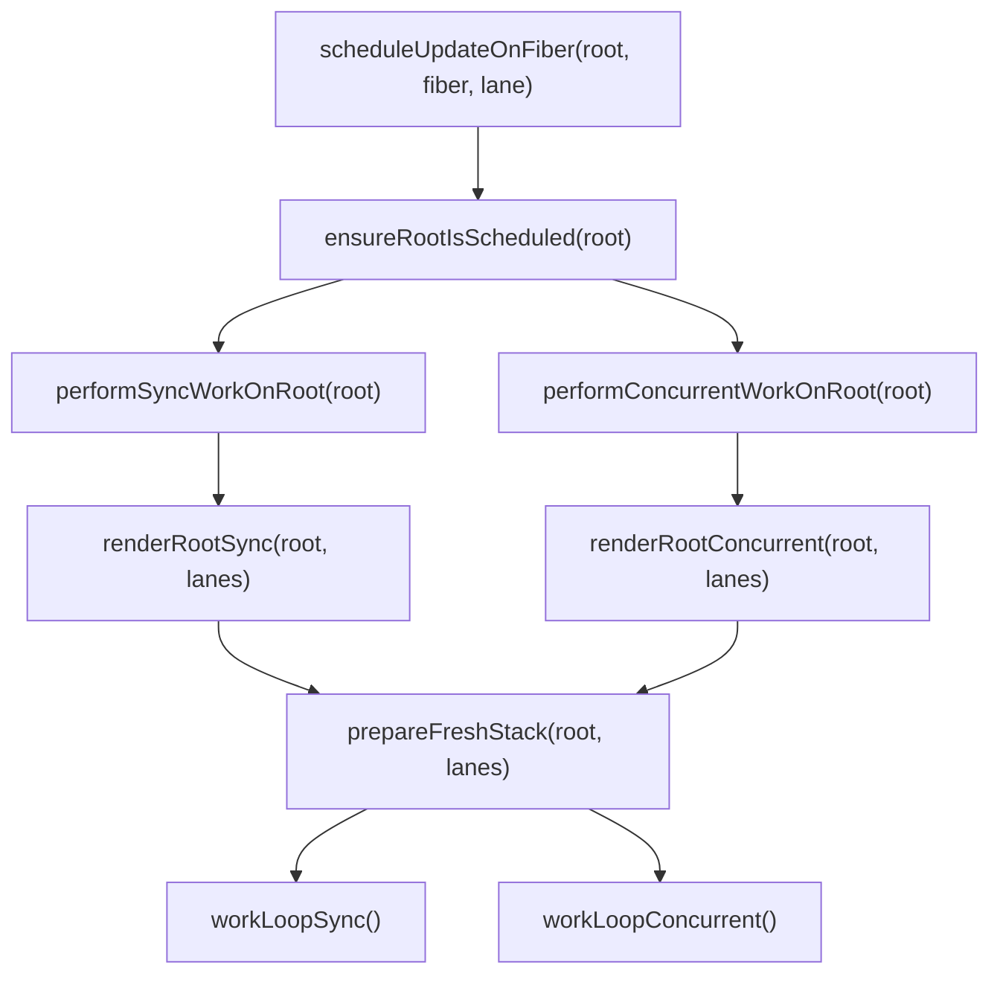
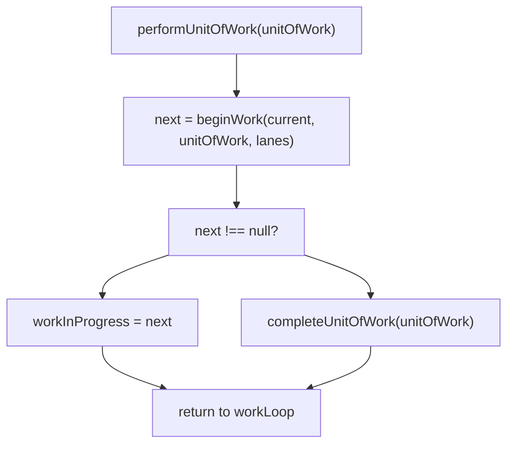
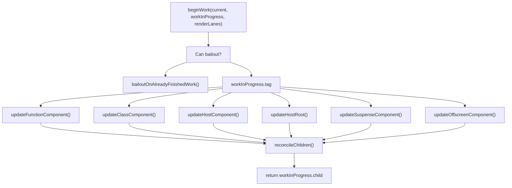
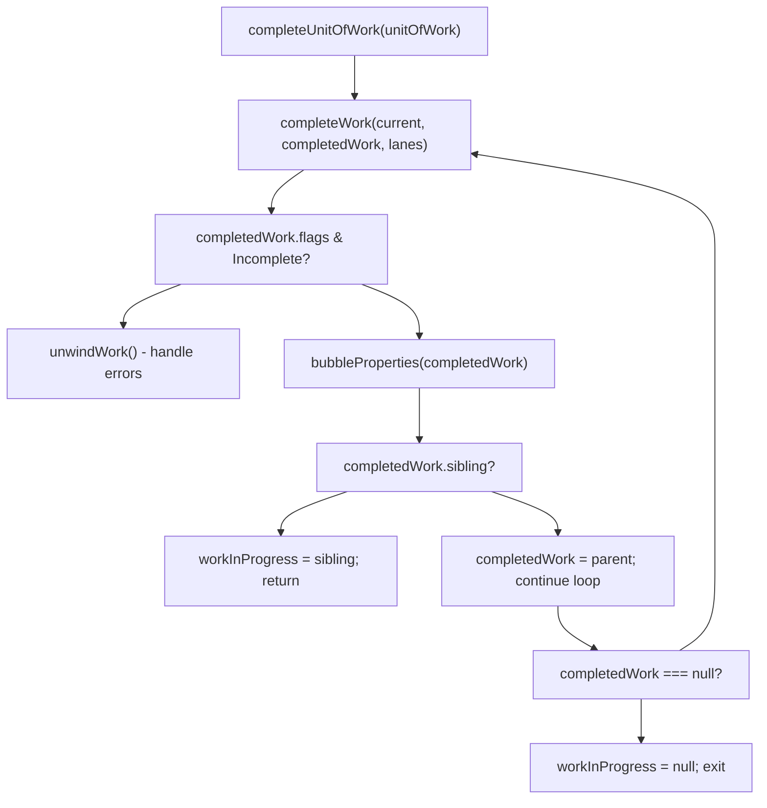
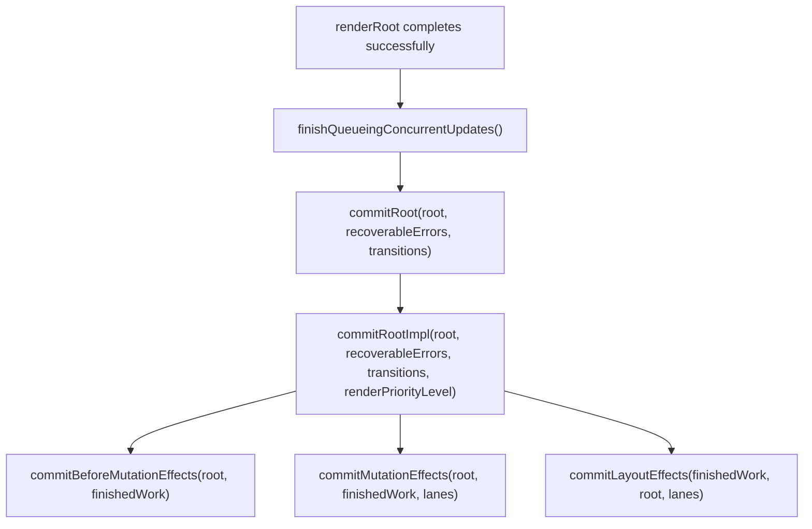
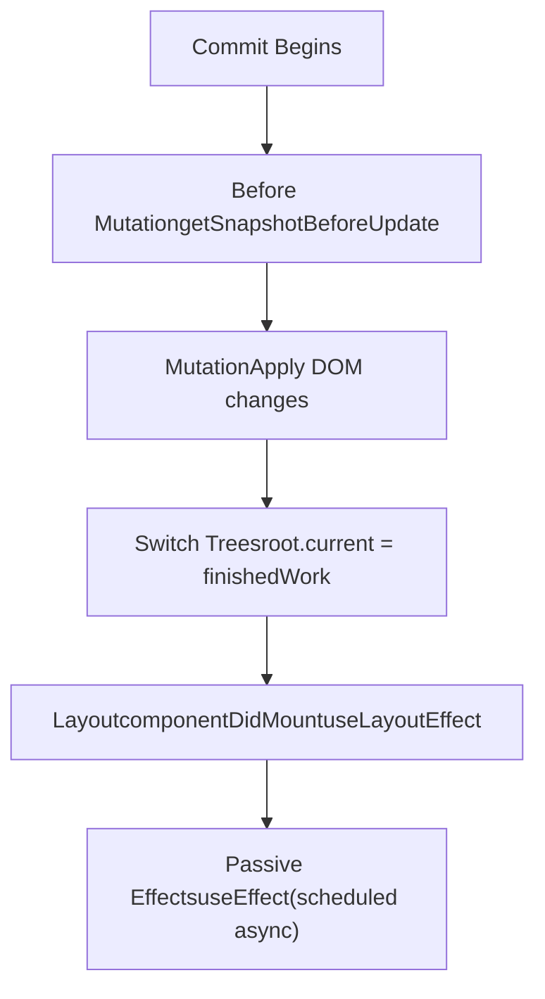
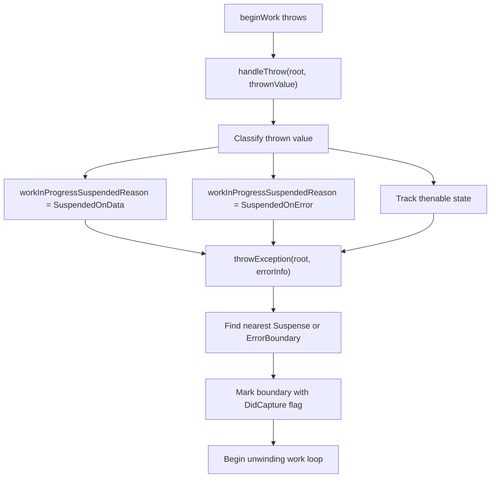
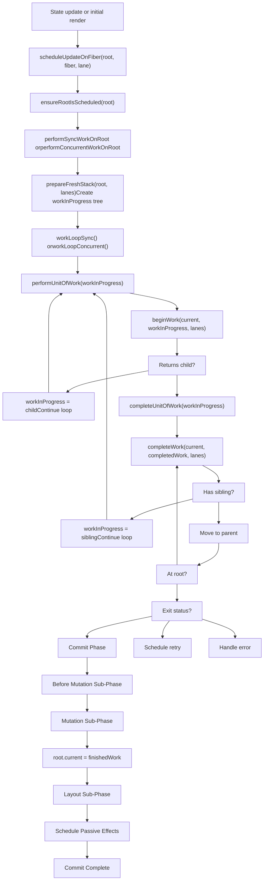

# 工作循环与渲染阶段

相关源文件

-   [packages/react-client/src/ReactFlightPerformanceTrack.js](https://github.com/facebook/react/blob/65eec428/packages/react-client/src/ReactFlightPerformanceTrack.js)
-   [packages/react-debug-tools/src/ReactDebugHooks.js](https://github.com/facebook/react/blob/65eec428/packages/react-debug-tools/src/ReactDebugHooks.js)
-   [packages/react-debug-tools/src/\_\_tests\_\_/ReactHooksInspection-test.js](https://github.com/facebook/react/blob/65eec428/packages/react-debug-tools/src/__tests__/ReactHooksInspection-test.js)
-   [packages/react-debug-tools/src/\_\_tests\_\_/ReactHooksInspectionIntegration-test.js](https://github.com/facebook/react/blob/65eec428/packages/react-debug-tools/src/__tests__/ReactHooksInspectionIntegration-test.js)
-   [packages/react-debug-tools/src/\_\_tests\_\_/ReactHooksInspectionIntegrationDOM-test.js](https://github.com/facebook/react/blob/65eec428/packages/react-debug-tools/src/__tests__/ReactHooksInspectionIntegrationDOM-test.js)
-   [packages/react-devtools-shell/src/app/InspectableElements/CustomHooks.js](https://github.com/facebook/react/blob/65eec428/packages/react-devtools-shell/src/app/InspectableElements/CustomHooks.js)
-   [packages/react-devtools-timeline/src/content-views/utils/moduleFilters.js](https://github.com/facebook/react/blob/65eec428/packages/react-devtools-timeline/src/content-views/utils/moduleFilters.js)
-   [packages/react-dom/src/\_\_tests\_\_/ReactDOMFiberAsync-test.js](https://github.com/facebook/react/blob/65eec428/packages/react-dom/src/__tests__/ReactDOMFiberAsync-test.js)
-   [packages/react-dom/src/\_\_tests\_\_/ReactDOMNativeEventHeuristic-test.js](https://github.com/facebook/react/blob/65eec428/packages/react-dom/src/__tests__/ReactDOMNativeEventHeuristic-test.js)
-   [packages/react-dom/src/events/plugins/\_\_tests\_\_/ChangeEventPlugin-test.js](https://github.com/facebook/react/blob/65eec428/packages/react-dom/src/events/plugins/__tests__/ChangeEventPlugin-test.js)
-   [packages/react-dom/src/events/plugins/\_\_tests\_\_/SimpleEventPlugin-test.js](https://github.com/facebook/react/blob/65eec428/packages/react-dom/src/events/plugins/__tests__/SimpleEventPlugin-test.js)
-   [packages/react-reconciler/src/ReactFiber.js](https://github.com/facebook/react/blob/65eec428/packages/react-reconciler/src/ReactFiber.js)
-   [packages/react-reconciler/src/ReactFiberBeginWork.js](https://github.com/facebook/react/blob/65eec428/packages/react-reconciler/src/ReactFiberBeginWork.js)
-   [packages/react-reconciler/src/ReactFiberClassComponent.js](https://github.com/facebook/react/blob/65eec428/packages/react-reconciler/src/ReactFiberClassComponent.js)
-   [packages/react-reconciler/src/ReactFiberCommitWork.js](https://github.com/facebook/react/blob/65eec428/packages/react-reconciler/src/ReactFiberCommitWork.js)
-   [packages/react-reconciler/src/ReactFiberCompleteWork.js](https://github.com/facebook/react/blob/65eec428/packages/react-reconciler/src/ReactFiberCompleteWork.js)
-   [packages/react-reconciler/src/ReactFiberHooks.js](https://github.com/facebook/react/blob/65eec428/packages/react-reconciler/src/ReactFiberHooks.js)
-   [packages/react-reconciler/src/ReactFiberLane.js](https://github.com/facebook/react/blob/65eec428/packages/react-reconciler/src/ReactFiberLane.js)
-   [packages/react-reconciler/src/ReactFiberOffscreenComponent.js](https://github.com/facebook/react/blob/65eec428/packages/react-reconciler/src/ReactFiberOffscreenComponent.js)
-   [packages/react-reconciler/src/ReactFiberPerformanceTrack.js](https://github.com/facebook/react/blob/65eec428/packages/react-reconciler/src/ReactFiberPerformanceTrack.js)
-   [packages/react-reconciler/src/ReactFiberRootScheduler.js](https://github.com/facebook/react/blob/65eec428/packages/react-reconciler/src/ReactFiberRootScheduler.js)
-   [packages/react-reconciler/src/ReactFiberSuspenseComponent.js](https://github.com/facebook/react/blob/65eec428/packages/react-reconciler/src/ReactFiberSuspenseComponent.js)
-   [packages/react-reconciler/src/ReactFiberUnwindWork.js](https://github.com/facebook/react/blob/65eec428/packages/react-reconciler/src/ReactFiberUnwindWork.js)
-   [packages/react-reconciler/src/ReactFiberWorkLoop.js](https://github.com/facebook/react/blob/65eec428/packages/react-reconciler/src/ReactFiberWorkLoop.js)
-   [packages/react-reconciler/src/ReactInternalTypes.js](https://github.com/facebook/react/blob/65eec428/packages/react-reconciler/src/ReactInternalTypes.js)
-   [packages/react-reconciler/src/ReactProfilerTimer.js](https://github.com/facebook/react/blob/65eec428/packages/react-reconciler/src/ReactProfilerTimer.js)
-   [packages/react-reconciler/src/\_\_tests\_\_/ReactDeferredValue-test.js](https://github.com/facebook/react/blob/65eec428/packages/react-reconciler/src/__tests__/ReactDeferredValue-test.js)
-   [packages/react-reconciler/src/\_\_tests\_\_/ReactHooks-test.internal.js](https://github.com/facebook/react/blob/65eec428/packages/react-reconciler/src/__tests__/ReactHooks-test.internal.js)
-   [packages/react-reconciler/src/\_\_tests\_\_/ReactHooksWithNoopRenderer-test.js](https://github.com/facebook/react/blob/65eec428/packages/react-reconciler/src/__tests__/ReactHooksWithNoopRenderer-test.js)
-   [packages/react-reconciler/src/\_\_tests\_\_/ReactLazy-test.internal.js](https://github.com/facebook/react/blob/65eec428/packages/react-reconciler/src/__tests__/ReactLazy-test.internal.js)
-   [packages/react-reconciler/src/\_\_tests\_\_/ReactPerformanceTrack-test.js](https://github.com/facebook/react/blob/65eec428/packages/react-reconciler/src/__tests__/ReactPerformanceTrack-test.js)
-   [packages/react-reconciler/src/\_\_tests\_\_/ReactSiblingPrerendering-test.js](https://github.com/facebook/react/blob/65eec428/packages/react-reconciler/src/__tests__/ReactSiblingPrerendering-test.js)
-   [packages/react-reconciler/src/\_\_tests\_\_/ReactSuspense-test.internal.js](https://github.com/facebook/react/blob/65eec428/packages/react-reconciler/src/__tests__/ReactSuspense-test.internal.js)
-   [packages/react-reconciler/src/\_\_tests\_\_/ReactSuspensePlaceholder-test.internal.js](https://github.com/facebook/react/blob/65eec428/packages/react-reconciler/src/__tests__/ReactSuspensePlaceholder-test.internal.js)
-   [packages/react-reconciler/src/\_\_tests\_\_/ReactSuspenseWithNoopRenderer-test.js](https://github.com/facebook/react/blob/65eec428/packages/react-reconciler/src/__tests__/ReactSuspenseWithNoopRenderer-test.js)
-   [packages/react-reconciler/src/\_\_tests\_\_/ReactSuspenseyCommitPhase-test.js](https://github.com/facebook/react/blob/65eec428/packages/react-reconciler/src/__tests__/ReactSuspenseyCommitPhase-test.js)
-   [packages/react-server/src/ReactFizzHooks.js](https://github.com/facebook/react/blob/65eec428/packages/react-server/src/ReactFizzHooks.js)
-   [packages/react-server/src/ReactFlightAsyncSequence.js](https://github.com/facebook/react/blob/65eec428/packages/react-server/src/ReactFlightAsyncSequence.js)
-   [packages/react-server/src/ReactFlightServerConfigDebugNode.js](https://github.com/facebook/react/blob/65eec428/packages/react-server/src/ReactFlightServerConfigDebugNode.js)
-   [packages/react-server/src/ReactFlightServerConfigDebugNoop.js](https://github.com/facebook/react/blob/65eec428/packages/react-server/src/ReactFlightServerConfigDebugNoop.js)
-   [packages/react-server/src/ReactFlightStackConfigV8.js](https://github.com/facebook/react/blob/65eec428/packages/react-server/src/ReactFlightStackConfigV8.js)
-   [packages/react-server/src/\_\_tests\_\_/ReactFlightAsyncDebugInfo-test.js](https://github.com/facebook/react/blob/65eec428/packages/react-server/src/__tests__/ReactFlightAsyncDebugInfo-test.js)
-   [packages/react/src/ReactHooks.js](https://github.com/facebook/react/blob/65eec428/packages/react/src/ReactHooks.js)
-   [packages/react/src/ReactLazy.js](https://github.com/facebook/react/blob/65eec428/packages/react/src/ReactLazy.js)
-   [packages/react/src/\_\_tests\_\_/ReactProfiler-test.internal.js](https://github.com/facebook/react/blob/65eec428/packages/react/src/__tests__/ReactProfiler-test.internal.js)
-   [packages/shared/ReactPerformanceTrackProperties.js](https://github.com/facebook/react/blob/65eec428/packages/shared/ReactPerformanceTrackProperties.js)
-   [packages/shared/ReactSymbols.js](https://github.com/facebook/react/blob/65eec428/packages/shared/ReactSymbols.js)

本文档描述了 Reconciler 的工作循环执行过程以及处理 Fiber 树的三个阶段：**开始工作 (begin work)**、**完成工作 (complete work)** 和 **提交工作 (commit work)**。工作循环是处理 Fiber、确定变更并应用更新到宿主环境的核心机制。

关于 Fiber 数据结构本身的信息，请参阅 [Fiber 架构与数据结构](/facebook/react/4.1-fiber-architecture-and-data-structures)。关于调度和优先级管理的详细信息，请参阅 [基于车道的调度与优先级](/facebook/react/4.4-lane-based-scheduling-and-priorities)。关于提交阶段副作用系统，请参阅 [React Hooks 系统](/facebook/react/4.3-react-hooks-system)。

## 概览

工作循环在 [packages/react-reconciler/src/ReactFiberWorkLoop.js](https://github.com/facebook/react/blob/65eec428/packages/react-reconciler/src/ReactFiberWorkLoop.js) 中实现。它编排两个不同的阶段：

| 阶段 | 目的 | 是否可中断？ |
| --- | --- | --- |
| **渲染阶段 (Render Phase)** | 遍历 Fiber 树，计算变更，并标记副作用 | 是（在并发模式下） |
| **提交阶段 (Commit Phase)** | 将计算出的变更应用到宿主环境 | 否（同步） |

渲染阶段通过两个子阶段处理 Fiber：`beginWork` 和 `completeWork`。提交阶段通过三个子阶段执行：`commitBeforeMutationEffects`、`commitMutationEffects` 和 `commitLayoutEffects`。

**来源：** [packages/react-reconciler/src/ReactFiberWorkLoop.js1-3000](https://github.com/facebook/react/blob/65eec428/packages/react-reconciler/src/ReactFiberWorkLoop.js#L1-L3000)

## 工作循环执行

### 入口点和根处理

对根节点的工作通过两个主要入口点之一开始：

```
performSyncWorkOnRoot(root)      // 同步，不可中断
performConcurrentWorkOnRoot(root) // 并发，可以让出 (yield)
```
这两个函数都遵循以下模式：

1.  准备 work-in-progress 根和车道 (lanes)
2.  进入渲染阶段（`renderRootSync` 或 `renderRootConcurrent`）
3.  如果渲染成功完成，进入提交阶段（`commitRoot`）

**渲染阶段入口：**


**来源：** [packages/react-reconciler/src/ReactFiberWorkLoop.js916-1100](https://github.com/facebook/react/blob/65eec428/packages/react-reconciler/src/ReactFiberWorkLoop.js#L916-L1100) [packages/react-reconciler/src/ReactFiberWorkLoop.js1102-1300](https://github.com/facebook/react/blob/65eec428/packages/react-reconciler/src/ReactFiberWorkLoop.js#L1102-L1300)

### 工作循环

实际的工作循环非常简单：

```
// 同步模式 - 从不让出
function workLoopSync() {
  while (workInProgress !== null) {
    performUnitOfWork(workInProgress);
  }
}

// 并发模式 - 当 shouldYield() 返回 true 时让出
function workLoopConcurrent() {
  while (workInProgress !== null && !shouldYield()) {
    performUnitOfWork(workInProgress);
  }
}
```
`workInProgress` 变量指向当前正在处理的 Fiber。`performUnitOfWork` 处理一个工作单元并推进到下一个 Fiber。

**来源：** [packages/react-reconciler/src/ReactFiberWorkLoop.js1801-1812](https://github.com/facebook/react/blob/65eec428/packages/react-reconciler/src/ReactFiberWorkLoop.js#L1801-L1812)

### 工作循环状态变量

工作循环维护几个模块级变量来跟踪当前状态：

| 变量 | 类型 | 用途 |
| --- | --- | --- |
| `workInProgressRoot` | `FiberRoot | null` | 当前正在处理的根 |
| `workInProgress` | `Fiber | null` | 当前正在处理的 fiber |
| `workInProgressRootRenderLanes` | `Lanes` | 正在渲染的车道 |
| `workInProgressSuspendedReason` | `SuspendedReason` | 工作暂停的原因（如果适用） |
| `workInProgressRootExitStatus` | `RootExitStatus` | 渲染后的最终状态（Completed, Errored, Suspended 等） |

**来源：** [packages/react-reconciler/src/ReactFiberWorkLoop.js423-496](https://github.com/facebook/react/blob/65eec428/packages/react-reconciler/src/ReactFiberWorkLoop.js#L423-L496)

## 渲染阶段：Begin Work 和 Complete Work

渲染阶段以深度优先遍历的方式处理 Fiber 树，向下调用 `beginWork`，向上调用 `completeWork`。

### performUnitOfWork 流程


**来源：** [packages/react-reconciler/src/ReactFiberWorkLoop.js1814-1848](https://github.com/facebook/react/blob/65eec428/packages/react-reconciler/src/ReactFiberWorkLoop.js#L1814-L1848)

### Begin Work 阶段

位于 [packages/react-reconciler/src/ReactFiberBeginWork.js](https://github.com/facebook/react/blob/65eec428/packages/react-reconciler/src/ReactFiberBeginWork.js) 的 `beginWork` 函数负责：

1.  确定是否可以跳过该 fiber 的工作（Bailout 优化）
2.  根据 fiber 的标签创建或更新子 fiber
3.  返回第一个子 fiber 以进行下一步处理

**按 Fiber 标签分发的 Begin Work：**


**关键 Begin Work 函数：**

-   `updateFunctionComponent` - 调用 `renderWithHooks` 执行函数体
-   `updateClassComponent` - 处理类生命周期方法和状态更新
-   `updateHostComponent` - 处理 DOM 元素 (div, span 等)
-   `reconcileChildren` - 通过比较当前和新的子节点来协调子节点

**来源：** [packages/react-reconciler/src/ReactFiberBeginWork.js3746-4016](https://github.com/facebook/react/blob/65eec428/packages/react-reconciler/src/ReactFiberBeginWork.js#L3746-L4016) [packages/react-reconciler/src/ReactFiberBeginWork.js340-371](https://github.com/facebook/react/blob/65eec428/packages/react-reconciler/src/ReactFiberBeginWork.js#L340-L371)

### Complete Work 阶段

当 `beginWork` 返回 `null`（没有更多子节点需要处理）时，调用 `completeUnitOfWork`。此函数：

1.  在当前 fiber 上调用 `completeWork`
2.  通过向上冒泡收集子树标志 (flags)
3.  移动到下一个兄弟节点或返回到父节点

**Complete Unit of Work 流程：**


[packages/react-reconciler/src/ReactFiberCompleteWork.js](https://github.com/facebook/react/blob/65eec428/packages/react-reconciler/src/ReactFiberCompleteWork.js) 中的 `completeWork` 函数处理：

-   为新的 HostComponents 创建宿主实例（DOM 节点）
-   更新已更改的 props
-   需要工作时标记 Update 标志
-   处理服务端渲染内容的水合 (Hydration)

**关键 Complete Work 职责：**

| Fiber 标签 | Complete Work 动作 |
| --- | --- |
| HostComponent | 创建 DOM 节点，附加子节点，完成 props |
| HostText | 创建文本节点 |
| HostRoot | 如果使用持久化模式，完成容器 |
| SuspenseComponent | 确定显示 fallback 还是主要内容 |
| OffscreenComponent | 处理可见性转换 |

**来源：** [packages/react-reconciler/src/ReactFiberWorkLoop.js1850-1980](https://github.com/facebook/react/blob/65eec428/packages/react-reconciler/src/ReactFiberWorkLoop.js#L1850-L1980) [packages/react-reconciler/src/ReactFiberCompleteWork.js845-1400](https://github.com/facebook/react/blob/65eec428/packages/react-reconciler/src/ReactFiberCompleteWork.js#L845-L1400)

### 标志 (Flags) 与子树标志 (Subtree Flags)

在渲染阶段，fiber 被标记上 **标志 (flags)**，指示在提交期间需要应用哪些副作用。`bubbleProperties` 函数将这些标志向上传播到树中：

```
function bubbleProperties(completedWork) {
  let subtreeFlags = NoFlags;
  let child = completedWork.child;

  // 收集所有子节点的标志
  while (child !== null) {
    subtreeFlags |= child.subtreeFlags;
    subtreeFlags |= child.flags;
    child = child.sibling;
  }

  completedWork.subtreeFlags = subtreeFlags;
}
```
这使得祖先 fiber 知道是否有任何后代具有副作用，从而在提交期间实现高效遍历。

**来源：** [packages/react-reconciler/src/ReactFiberCompleteWork.js662-724](https://github.com/facebook/react/blob/65eec428/packages/react-reconciler/src/ReactFiberCompleteWork.js#L662-L724)

## 提交阶段 (Commit Phase)

一旦渲染阶段成功完成 (`workInProgressRootExitStatus === RootCompleted`)，提交阶段就开始了。提交阶段是 **同步且不可中断的** —— 一旦开始就必须完成。

### 提交根入口


**来源：** [packages/react-reconciler/src/ReactFiberWorkLoop.js2210-2350](https://github.com/facebook/react/blob/65eec428/packages/react-reconciler/src/ReactFiberWorkLoop.js#L2210-L2350)

### 提交子阶段

提交阶段按顺序执行三个子阶段：

#### 1\. 突变前 (Before Mutation) 阶段

**目的：** 运行需要在突变发生之前读取 DOM 的副作用

-   在类组件上调用 `getSnapshotBeforeUpdate`
-   处理 Suspense 边界的焦点管理
-   调度被动副作用 (useEffect) 以供稍后执行
-   跟踪视图过渡元素（如果启用）

**关键函数：** [packages/react-reconciler/src/ReactFiberCommitWork.js344-363](https://github.com/facebook/react/blob/65eec428/packages/react-reconciler/src/ReactFiberCommitWork.js#L344-L363) 中的 `commitBeforeMutationEffects`

#### 2\. 突变 (Mutation) 阶段

**目的：** 应用所有 DOM 突变（插入、更新、删除）

-   通过 `commitPlacement` 插入新节点
-   通过 `commitUpdate` 更新现有节点
-   通过 `commitDeletion` 移除已删除节点
-   更新 refs
-   在需要的地方重置文本内容

**关键函数：**

-   `commitMutationEffects` - 主入口点 [packages/react-reconciler/src/ReactFiberCommitWork.js1817-1900](https://github.com/facebook/react/blob/65eec428/packages/react-reconciler/src/ReactFiberCommitWork.js#L1817-L1900)
-   `commitPlacement` - 插入/移动节点 [packages/react-reconciler/src/ReactFiberCommitHostEffects.js250-485](https://github.com/facebook/react/blob/65eec428/packages/react-reconciler/src/ReactFiberCommitHostEffects.js#L250-L485)
-   `commitUpdate` - 更新 props [packages/react-reconciler/src/ReactFiberCommitHostEffects.js132-150](https://github.com/facebook/react/blob/65eec428/packages/react-reconciler/src/ReactFiberCommitHostEffects.js#L132-L150)

突变完成后，`root.current` 从旧树切换到新树：

```
root.current = finishedWork;
```
这是 work-in-progress 树变为 current 树的时刻。

#### 3\. 布局 (Layout) 阶段

**目的：** 运行需要读取更新后 DOM 布局的副作用

-   在类组件上调用 `componentDidMount` / `componentDidUpdate`
-   运行布局副作用 (`useLayoutEffect`)
-   更新 refs 以指向新实例
-   收集 Profiler 组件的计时信息

**关键函数：** [packages/react-reconciler/src/ReactFiberCommitWork.js594-800](https://github.com/facebook/react/blob/65eec428/packages/react-reconciler/src/ReactFiberCommitWork.js#L594-L800) 中的 `commitLayoutEffects`

**提交阶段时间线：**


**来源：** [packages/react-reconciler/src/ReactFiberWorkLoop.js2510-2900](https://github.com/facebook/react/blob/65eec428/packages/react-reconciler/src/ReactFiberWorkLoop.js#L2510-L2900)

### 被动副作用 (useEffect)

与在提交期间同步运行的布局副作用不同，被动副作用（来自 `useEffect`）被调度为在提交阶段完成 **之后** 运行。它们在一个单独的任务中运行：

1.  在突变前期间：检测并调度副作用
2.  在布局阶段完成后：调度 `flushPassiveEffects()`
3.  被动副作用运行：先是清理函数，然后是创建函数

**来源：** [packages/react-reconciler/src/ReactFiberCommitWork.js2950-3200](https://github.com/facebook/react/blob/65eec428/packages/react-reconciler/src/ReactFiberCommitWork.js#L2950-L3200)

## 错误处理与挂起 (Suspension)

### 挂起的渲染

如果在 `beginWork` 期间组件抛出 promise (Suspense) 或遇到错误，工作循环进入挂起状态：


然后工作循环展开堆栈，直到到达可以处理挂起/错误的边界，然后尝试从该点重新渲染。

**来源：** [packages/react-reconciler/src/ReactFiberWorkLoop.js1610-1800](https://github.com/facebook/react/blob/65eec428/packages/react-reconciler/src/ReactFiberWorkLoop.js#L1610-L1800) [packages/react-reconciler/src/ReactFiberThrow.js200-600](https://github.com/facebook/react/blob/65eec428/packages/react-reconciler/src/ReactFiberThrow.js#L200-L600)

### Unwind Work

当由于错误或挂起而回溯时，会在每个 fiber 上调用 `unwindWork` 以进行清理：

-   弹出 context 栈
-   重置水合状态
-   清除不会被提交的副作用

**来源：** [packages/react-reconciler/src/ReactFiberUnwindWork.js66-200](https://github.com/facebook/react/blob/65eec428/packages/react-reconciler/src/ReactFiberUnwindWork.js#L66-L200)

## 完整工作循环图解


**来源：** [packages/react-reconciler/src/ReactFiberWorkLoop.js400-3000](https://github.com/facebook/react/blob/65eec428/packages/react-reconciler/src/ReactFiberWorkLoop.js#L400-L3000) [packages/react-reconciler/src/ReactFiberBeginWork.js1-4000](https://github.com/facebook/react/blob/65eec428/packages/react-reconciler/src/ReactFiberBeginWork.js#L1-L4000) [packages/react-reconciler/src/ReactFiberCompleteWork.js1-1400](https://github.com/facebook/react/blob/65eec428/packages/react-reconciler/src/ReactFiberCompleteWork.js#L1-L1400) [packages/react-reconciler/src/ReactFiberCommitWork.js1-3500](https://github.com/facebook/react/blob/65eec428/packages/react-reconciler/src/ReactFiberCommitWork.js#L1-L3500)
