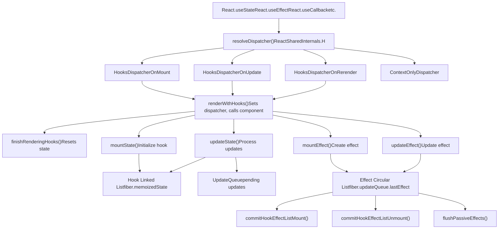

# React Hooks 系统

相关源文件

-   [packages/react-client/src/ReactFlightPerformanceTrack.js](https://github.com/facebook/react/blob/65eec428/packages/react-client/src/ReactFlightPerformanceTrack.js)
-   [packages/react-debug-tools/src/ReactDebugHooks.js](https://github.com/facebook/react/blob/65eec428/packages/react-debug-tools/src/ReactDebugHooks.js)
-   [packages/react-debug-tools/src/\_\_tests\_\_/ReactHooksInspection-test.js](https://github.com/facebook/react/blob/65eec428/packages/react-debug-tools/src/__tests__/ReactHooksInspection-test.js)
-   [packages/react-debug-tools/src/\_\_tests\_\_/ReactHooksInspectionIntegration-test.js](https://github.com/facebook/react/blob/65eec428/packages/react-debug-tools/src/__tests__/ReactHooksInspectionIntegration-test.js)
-   [packages/react-debug-tools/src/\_\_tests\_\_/ReactHooksInspectionIntegrationDOM-test.js](https://github.com/facebook/react/blob/65eec428/packages/react-debug-tools/src/__tests__/ReactHooksInspectionIntegrationDOM-test.js)
-   [packages/react-devtools-shell/src/app/InspectableElements/CustomHooks.js](https://github.com/facebook/react/blob/65eec428/packages/react-devtools-shell/src/app/InspectableElements/CustomHooks.js)
-   [packages/react-devtools-timeline/src/content-views/utils/moduleFilters.js](https://github.com/facebook/react/blob/65eec428/packages/react-devtools-timeline/src/content-views/utils/moduleFilters.js)
-   [packages/react-dom/src/\_\_tests\_\_/ReactDOMFiberAsync-test.js](https://github.com/facebook/react/blob/65eec428/packages/react-dom/src/__tests__/ReactDOMFiberAsync-test.js)
-   [packages/react-dom/src/\_\_tests\_\_/ReactDOMNativeEventHeuristic-test.js](https://github.com/facebook/react/blob/65eec428/packages/react-dom/src/__tests__/ReactDOMNativeEventHeuristic-test.js)
-   [packages/react-dom/src/events/plugins/\_\_tests\_\_/ChangeEventPlugin-test.js](https://github.com/facebook/react/blob/65eec428/packages/react-dom/src/events/plugins/__tests__/ChangeEventPlugin-test.js)
-   [packages/react-dom/src/events/plugins/\_\_tests\_\_/SimpleEventPlugin-test.js](https://github.com/facebook/react/blob/65eec428/packages/react-dom/src/events/plugins/__tests__/SimpleEventPlugin-test.js)
-   [packages/react-reconciler/src/ReactFiber.js](https://github.com/facebook/react/blob/65eec428/packages/react-reconciler/src/ReactFiber.js)
-   [packages/react-reconciler/src/ReactFiberBeginWork.js](https://github.com/facebook/react/blob/65eec428/packages/react-reconciler/src/ReactFiberBeginWork.js)
-   [packages/react-reconciler/src/ReactFiberClassComponent.js](https://github.com/facebook/react/blob/65eec428/packages/react-reconciler/src/ReactFiberClassComponent.js)
-   [packages/react-reconciler/src/ReactFiberCommitWork.js](https://github.com/facebook/react/blob/65eec428/packages/react-reconciler/src/ReactFiberCommitWork.js)
-   [packages/react-reconciler/src/ReactFiberCompleteWork.js](https://github.com/facebook/react/blob/65eec428/packages/react-reconciler/src/ReactFiberCompleteWork.js)
-   [packages/react-reconciler/src/ReactFiberHooks.js](https://github.com/facebook/react/blob/65eec428/packages/react-reconciler/src/ReactFiberHooks.js)
-   [packages/react-reconciler/src/ReactFiberLane.js](https://github.com/facebook/react/blob/65eec428/packages/react-reconciler/src/ReactFiberLane.js)
-   [packages/react-reconciler/src/ReactFiberOffscreenComponent.js](https://github.com/facebook/react/blob/65eec428/packages/react-reconciler/src/ReactFiberOffscreenComponent.js)
-   [packages/react-reconciler/src/ReactFiberPerformanceTrack.js](https://github.com/facebook/react/blob/65eec428/packages/react-reconciler/src/ReactFiberPerformanceTrack.js)
-   [packages/react-reconciler/src/ReactFiberRootScheduler.js](https://github.com/facebook/react/blob/65eec428/packages/react-reconciler/src/ReactFiberRootScheduler.js)
-   [packages/react-reconciler/src/ReactFiberSuspenseComponent.js](https://github.com/facebook/react/blob/65eec428/packages/react-reconciler/src/ReactFiberSuspenseComponent.js)
-   [packages/react-reconciler/src/ReactFiberUnwindWork.js](https://github.com/facebook/react/blob/65eec428/packages/react-reconciler/src/ReactFiberUnwindWork.js)
-   [packages/react-reconciler/src/ReactFiberWorkLoop.js](https://github.com/facebook/react/blob/65eec428/packages/react-reconciler/src/ReactFiberWorkLoop.js)
-   [packages/react-reconciler/src/ReactInternalTypes.js](https://github.com/facebook/react/blob/65eec428/packages/react-reconciler/src/ReactInternalTypes.js)
-   [packages/react-reconciler/src/ReactProfilerTimer.js](https://github.com/facebook/react/blob/65eec428/packages/react-reconciler/src/ReactProfilerTimer.js)
-   [packages/react-reconciler/src/\_\_tests\_\_/ReactDeferredValue-test.js](https://github.com/facebook/react/blob/65eec428/packages/react-reconciler/src/__tests__/ReactDeferredValue-test.js)
-   [packages/react-reconciler/src/\_\_tests\_\_/ReactHooks-test.internal.js](https://github.com/facebook/react/blob/65eec428/packages/react-reconciler/src/__tests__/ReactHooks-test.internal.js)
-   [packages/react-reconciler/src/\_\_tests\_\_/ReactHooksWithNoopRenderer-test.js](https://github.com/facebook/react/blob/65eec428/packages/react-reconciler/src/__tests__/ReactHooksWithNoopRenderer-test.js)
-   [packages/react-reconciler/src/\_\_tests\_\_/ReactLazy-test.internal.js](https://github.com/facebook/react/blob/65eec428/packages/react-reconciler/src/__tests__/ReactLazy-test.internal.js)
-   [packages/react-reconciler/src/\_\_tests\_\_/ReactPerformanceTrack-test.js](https://github.com/facebook/react/blob/65eec428/packages/react-reconciler/src/__tests__/ReactPerformanceTrack-test.js)
-   [packages/react-reconciler/src/\_\_tests\_\_/ReactSiblingPrerendering-test.js](https://github.com/facebook/react/blob/65eec428/packages/react-reconciler/src/__tests__/ReactSiblingPrerendering-test.js)
-   [packages/react-reconciler/src/\_\_tests\_\_/ReactSuspense-test.internal.js](https://github.com/facebook/react/blob/65eec428/packages/react-reconciler/src/__tests__/ReactSuspense-test.internal.js)
-   [packages/react-reconciler/src/\_\_tests\_\_/ReactSuspensePlaceholder-test.internal.js](https://github.com/facebook/react/blob/65eec428/packages/react-reconciler/src/__tests__/ReactSuspensePlaceholder-test.internal.js)
-   [packages/react-reconciler/src/\_\_tests\_\_/ReactSuspenseWithNoopRenderer-test.js](https://github.com/facebook/react/blob/65eec428/packages/react-reconciler/src/__tests__/ReactSuspenseWithNoopRenderer-test.js)
-   [packages/react-reconciler/src/\_\_tests\_\_/ReactSuspenseyCommitPhase-test.js](https://github.com/facebook/react/blob/65eec428/packages/react-reconciler/src/__tests__/ReactSuspenseyCommitPhase-test.js)
-   [packages/react-server/src/ReactFizzHooks.js](https://github.com/facebook/react/blob/65eec428/packages/react-server/src/ReactFizzHooks.js)
-   [packages/react-server/src/ReactFlightAsyncSequence.js](https://github.com/facebook/react/blob/65eec428/packages/react-server/src/ReactFlightAsyncSequence.js)
-   [packages/react-server/src/ReactFlightServerConfigDebugNode.js](https://github.com/facebook/react/blob/65eec428/packages/react-server/src/ReactFlightServerConfigDebugNode.js)
-   [packages/react-server/src/ReactFlightServerConfigDebugNoop.js](https://github.com/facebook/react/blob/65eec428/packages/react-server/src/ReactFlightServerConfigDebugNoop.js)
-   [packages/react-server/src/ReactFlightStackConfigV8.js](https://github.com/facebook/react/blob/65eec428/packages/react-server/src/ReactFlightStackConfigV8.js)
-   [packages/react-server/src/\_\_tests\_\_/ReactFlightAsyncDebugInfo-test.js](https://github.com/facebook/react/blob/65eec428/packages/react-server/src/__tests__/ReactFlightAsyncDebugInfo-test.js)
-   [packages/react/src/ReactHooks.js](https://github.com/facebook/react/blob/65eec428/packages/react/src/ReactHooks.js)
-   [packages/react/src/ReactLazy.js](https://github.com/facebook/react/blob/65eec428/packages/react/src/ReactLazy.js)
-   [packages/react/src/\_\_tests\_\_/ReactProfiler-test.internal.js](https://github.com/facebook/react/blob/65eec428/packages/react/src/__tests__/ReactProfiler-test.internal.js)
-   [packages/shared/ReactPerformanceTrackProperties.js](https://github.com/facebook/react/blob/65eec428/packages/shared/ReactPerformanceTrackProperties.js)
-   [packages/shared/ReactSymbols.js](https://github.com/facebook/react/blob/65eec428/packages/shared/ReactSymbols.js)

## 目的与范围

本文档描述了 React Hooks 系统的实现，包括调度器（dispatcher）模式、Hook 数据结构、Effect 执行生命周期以及调试功能。Hooks 允许函数组件在不编写类的情况下使用状态和生命周期特性。

关于调用 Hooks 的整体协调过程，请参阅 [Fiber 架构与工作循环](/facebook/react/4.1-fiber-architecture-and-data-structures)。关于服务端渲染的具体细节，请参阅 [React Fizz (流式 SSR)](/facebook/react/5.1-react-fizz-(streaming-ssr))。关于 Hook 使用的静态分析，请参阅 [用于 React Hooks 的 ESLint 插件](/facebook/react/7.2-devtools-distribution-and-integration)。

## 架构概览

Hooks 系统使用 **调度器 (dispatcher) 模式**，根据组件的生命周期阶段提供不同的实现。在渲染期间，Hooks 解析为挂载 (mount)、更新 (update) 或重新渲染 (rerender) 调度器。Hook 状态作为链表存储在 `fiber.memoizedState` 上，而 effect 则在 `fiber.updateQueue.lastEffect` 上形成一个循环链表。

**Hooks 系统架构**


来源：[packages/react-reconciler/src/ReactFiberHooks.js1-200](https://github.com/facebook/react/blob/65eec428/packages/react-reconciler/src/ReactFiberHooks.js#L1-L200) [packages/react/src/ReactHooks.js1-242](https://github.com/facebook/react/blob/65eec428/packages/react/src/ReactHooks.js#L1-L242)

## 公共 Hooks API

公共 API 通过 `packages/react/src/ReactHooks.js` 暴露。每个 Hook 函数调用 `resolveDispatcher()` 从 `ReactSharedInternals.H` 获取当前调度器，然后委托给调度器实现。

**可用的 Hooks**

| Hook | 用途 | 有状态 |
| --- | --- | --- |
| `useState` | 本地组件状态 | 是 |
| `useReducer` | 带有 reducer 逻辑的状态 | 是 |
| `useEffect` | 绘制后的副作用 | 否 |
| `useLayoutEffect` | 绘制前的副作用 | 否 |
| `useInsertionEffect` | CSS-in-JS 插入 | 否 |
| `useContext` | 读取 context 值 | 否 |
| `useRef` | 可变引用 | 是 |
| `useMemo` | 记忆化值 | 是 |
| `useCallback` | 记忆化回调 | 是 |
| `useImperativeHandle` | 自定义 ref 值 | 否 |
| `useDebugValue` | DevTools 标签 | 否 |
| `useId` | 稳定的唯一 ID | 是 |
| `useTransition` | 非阻塞更新 | 是 |
| `useDeferredValue` | 推迟值更新 | 是 |
| `useSyncExternalStore` | 订阅外部 store | 是 |
| `useOptimistic` | 乐观 UI 更新 | 是 |
| `useActionState` | 表单 action 状态 | 是 |
| `use` | 读取 Promise/Context | 否 |

**调度器解析流程**


来源：[packages/react/src/ReactHooks.js24-42](https://github.com/facebook/react/blob/65eec428/packages/react/src/ReactHooks.js#L24-L42) [packages/react/src/ReactHooks.js66-71](https://github.com/facebook/react/blob/65eec428/packages/react/src/ReactHooks.js#L66-L71)

## 调度器 (Dispatcher) 模式

调度器是一个动态虚函数表 (vtable)，根据组件生命周期阶段而变化。`renderWithHooks()` 在调用组件函数之前设置适当的调度器，确保 Hooks 解析为正确的实现。

**调度器实现**

| 调度器 | 使用时机 | 行为 |
| --- | --- | --- |
| `HooksDispatcherOnMount` | 首次渲染 (`current === null`) | 初始化 hook 状态，创建链表 |
| `HooksDispatcherOnUpdate` | 后续渲染 | 重用现有 hooks，处理更新 |
| `HooksDispatcherOnRerender` | 渲染阶段更新 | 处理渲染期间的 setState |
| `ContextOnlyDispatcher` | 组件渲染之外 | 抛出 "Invalid hook call" 错误 |
| `HooksDispatcherOnMountInDEV` | DEV 首次渲染 | 验证 hook 顺序、依赖 |
| `HooksDispatcherOnUpdateInDEV` | DEV 后续渲染 | 验证 hook 顺序变化 |

**renderWithHooks 执行流程**


来源：[packages/react-reconciler/src/ReactFiberHooks.js503-632](https://github.com/facebook/react/blob/65eec428/packages/react-reconciler/src/ReactFiberHooks.js#L503-L632) [packages/react-reconciler/src/ReactFiberHooks.js634-750](https://github.com/facebook/react/blob/65eec428/packages/react-reconciler/src/ReactFiberHooks.js#L634-L750)

## Hook 数据结构

### Hook 链表

每个 Hook 调用都会将一个 `Hook` 对象追加到存储在 `fiber.memoizedState` 上的单向链表中。链表顺序必须在渲染之间保持不变（通过 DEV 警告强制执行）。

**Hook 对象结构**


`Hook` 类型定义：

```
type Hook = {
  memoizedState: any,      // 当前状态值或 effect 列表
  baseState: any,          // 挂起更新前的状态
  baseQueue: Update | null, // 因优先级跳过的更新
  queue: any,              // useState/useReducer 的 UpdateQueue
  next: Hook | null        // 链表中的下一个 hook
}
```
来源：[packages/react-reconciler/src/ReactFiberHooks.js195-201](https://github.com/facebook/react/blob/65eec428/packages/react-reconciler/src/ReactFiberHooks.js#L195-L201) [packages/react-reconciler/src/ReactFiberHooks.js980-999](https://github.com/facebook/react/blob/65eec428/packages/react-reconciler/src/ReactFiberHooks.js#L980-L999)

### UpdateQueue 结构

状态 Hooks (`useState`, `useReducer`) 维护一个 `UpdateQueue` 来跟踪挂起的更新。更新形成一个循环链表，并在渲染期间按顺序处理。

**UpdateQueue 和 Update 结构**


来源：[packages/react-reconciler/src/ReactFiberHooks.js165-181](https://github.com/facebook/react/blob/65eec428/packages/react-reconciler/src/ReactFiberHooks.js#L165-L181) [packages/react-reconciler/src/ReactFiberHooks.js175-181](https://github.com/facebook/react/blob/65eec428/packages/react-reconciler/src/ReactFiberHooks.js#L175-L181)

### Effect 循环链表

Effect (`useEffect`, `useLayoutEffect`, `useInsertionEffect`) 存储在 `fiber.updateQueue.lastEffect` 上的循环链表中。每个 `Effect` 对象包含 effect 函数、清理函数、依赖项和标志。

**Effect 数据结构**

```
type Effect = {
  tag: HookFlags,              // HookPassive | HookLayout | HookInsertion
  inst: EffectInstance,        // { destroy: Function | void }
  create: () => (() => void) | void,  // Effect 函数
  deps: Array<mixed> | void | null,   // 依赖数组
  next: Effect                 // 循环链表中的下一个 effect
}

type FunctionComponentUpdateQueue = {
  lastEffect: Effect | null,   // 循环 effect 链表的尾部
  events: Array<any> | null,   // 事件函数
  stores: Array<any> | null,   // Store 一致性检查
  memoCache: MemoCache | null  // 编译器缓存
}
```
`lastEffect` 指针指向循环链表中的 **最后一个** effect，因此 `lastEffect.next` 是 **第一个** effect。

来源：[packages/react-reconciler/src/ReactFiberHooks.js217-227](https://github.com/facebook/react/blob/65eec428/packages/react-reconciler/src/ReactFiberHooks.js#L217-L227) [packages/react-reconciler/src/ReactFiberHooks.js247-252](https://github.com/facebook/react/blob/65eec428/packages/react-reconciler/src/ReactFiberHooks.js#L247-L252)

## 核心 Hook 实现

### 状态 Hooks：useState 和 useReducer

`useState` 是作为带有基本状态 reducer 的专门化 `useReducer` 实现的。两者都遵循挂载/更新模式。

**useState/useReducer 实现流程**


**急切状态计算 (Eager State Computation)**

当调用 `setState` 时，如果队列为空，React 尝试急切地（在渲染之外）计算新状态。如果新状态等于当前状态（使用 `Object.is`），React 可以完全跳过渲染。


来源：[packages/react-reconciler/src/ReactFiberHooks.js1095-1253](https://github.com/facebook/react/blob/65eec428/packages/react-reconciler/src/ReactFiberHooks.js#L1095-L1253) [packages/react-reconciler/src/ReactFiberHooks.js2648-2861](https://github.com/facebook/react/blob/65eec428/packages/react-reconciler/src/ReactFiberHooks.js#L2648-L2861)

### Effect Hooks: useEffect, useLayoutEffect, useInsertionEffect

Effect hooks 创建 `Effect` 对象并将其附加到循环 effect 链表。`tag` 字段决定了 effect 的执行时机：

-   `HookInsertion`: 提交期间突变之前（用于 CSS-in-JS）
-   `HookLayout`: 提交期间突变之后，绘制之前（同步）
-   `HookPassive`: 提交和绘制之后（通过 scheduler 异步）

**Effect 挂载与更新**


来源：[packages/react-reconciler/src/ReactFiberHooks.js1956-2023](https://github.com/facebook/react/blob/65eec428/packages/react-reconciler/src/ReactFiberHooks.js#L1956-L2023) [packages/react-reconciler/src/ReactFiberHooks.js2025-2069](https://github.com/facebook/react/blob/65eec428/packages/react-reconciler/src/ReactFiberHooks.js#L2025-L2069)

### Ref Hook: useRef

`useRef` 是一个简单的 hook，存储一个带有 `current` 属性的可变对象。ref 对象的标识在渲染之间保持稳定。


来源：[packages/react-reconciler/src/ReactFiberHooks.js1764-1779](https://github.com/facebook/react/blob/65eec428/packages/react-reconciler/src/ReactFiberHooks.js#L1764-L1779)

### 记忆化 Hooks：useMemo 和 useCallback

`useMemo` 和 `useCallback` 基于依赖数组缓存计算值。在挂载期间，它们计算并存储值。在更新期间，它们检查依赖项并重用或重新计算。

**useMemo 实现**


`useCallback(fn, deps)` 实现为 `useMemo(() => fn, deps)`。

来源：[packages/react-reconciler/src/ReactFiberHooks.js1890-1931](https://github.com/facebook/react/blob/65eec428/packages/react-reconciler/src/ReactFiberHooks.js#L1890-L1931) [packages/react-reconciler/src/ReactFiberHooks.js1933-1954](https://github.com/facebook/react/blob/65eec428/packages/react-reconciler/src/ReactFiberHooks.js#L1933-L1954)

## Effect 执行生命周期

Effect 在提交阶段执行，但根据其类型在不同时间执行。Fiber 标志（`PassiveEffect`, `UpdateEffect`）指示需要处理哪些 effect。

**Effect 执行时间线**


**Effect 标签位**

| 标签 | 常量 | 含义 |
| --- | --- | --- |
| `HookHasEffect` | `0b001` | Effect 应该在此次渲染触发 |
| `HookInsertion` | `0b010` | 插入 effect (CSS-in-JS) |
| `HookLayout` | `0b100` | 布局 effect (突变后同步) |
| `HookPassive` | `0b1000` | 被动 effect (绘制后异步) |

Effect 仅在 `effect.tag & HookHasEffect !== 0` 时执行。在挂载期间，所有 effect 都有 `HookHasEffect`。在更新期间，只有依赖项更改的 effect 才有 `HookHasEffect`。

来源：[packages/react-reconciler/src/ReactHookEffectTags.js1-21](https://github.com/facebook/react/blob/65eec428/packages/react-reconciler/src/ReactHookEffectTags.js#L1-L21) [packages/react-reconciler/src/ReactFiberHooks.js1956-2023](https://github.com/facebook/react/blob/65eec428/packages/react-reconciler/src/ReactFiberHooks.js#L1956-L2023)

## 服务端 Hooks 实现

Fizz 服务端渲染器 (`packages/react-server/src/ReactFizzHooks.js`) 提供了一个单独的 Hooks 实现，针对同步服务端渲染进行了优化。主要区别：

-   **无 effects**：`useEffect`, `useLayoutEffect`, `useInsertionEffect` 是空操作
-   **更简单的状态管理**：无并发更新或车道
-   **同步执行**：无调度或让出
-   **渲染阶段更新**：通过带有 `renderPhaseUpdates` Map 的重新渲染循环处理

**服务端 Hook 状态管理**


**服务端 useActionState Hook**

`useActionState`（以前称为 `useFormState`）在服务端很特殊。它从请求中接收 permalink 信息和 action 状态，从而启用表单的渐进式增强。

来源：[packages/react-server/src/ReactFizzHooks.js207-316](https://github.com/facebook/react/blob/65eec428/packages/react-server/src/ReactFizzHooks.js#L207-L316) [packages/react-server/src/ReactFizzHooks.js665-831](https://github.com/facebook/react/blob/65eec428/packages/react-server/src/ReactFizzHooks.js#L665-L831)

## 调试与 DevTools 集成

### ReactDebugHooks

`react-debug-tools` 包提供 `inspectHooks()` 和 `inspectHooksOfFiber()` 来为 DevTools 提取 hook 信息。它使用记录所有 hook 调用的自定义调度器。

**Hook 检查架构**


**HooksNode 结构**

```
type HooksNode = {
  id: number | null,              // 状态 hooks 的 Hook 索引
  isStateEditable: boolean,       // DevTools 可以编辑此状态吗？
  name: string,                   // Hook 名称 (e.g., "State", "Effect", "Custom")
  value: mixed,                   // Hook 值
  subHooks: Array<HooksNode>,     // 嵌套的自定义 hook 调用
  debugInfo: ReactDebugInfo | null, // 调试元数据
  hookSource: HookSource | null   // 源代码位置 { fileName, lineNumber, etc. }
}
```
调试调度器拦截每个 hook 调用，从 fiber 的 hook 列表中提取其值，并将其记录在 `hookLog` 中。堆栈跟踪解析确定哪些 hook 嵌套在自定义 hook 内部。

来源：[packages/react-debug-tools/src/ReactDebugHooks.js1-300](https://github.com/facebook/react/blob/65eec428/packages/react-debug-tools/src/ReactDebugHooks.js#L1-L300) [packages/react-debug-tools/src/ReactDebugHooks.js996-1098](https://github.com/facebook/react/blob/65eec428/packages/react-debug-tools/src/ReactDebugHooks.js#L996-L1098)

### DEV 仅有的验证

在开发构建中，React 通过多种机制强制执行 Hooks 规则：

**Hook 顺序验证**


**验证条件**

| 规则 | 检查 | 错误消息 |
| --- | --- | --- |
| Hook 顺序 | `hookTypesDev[index] === currentHookName` | "React has detected a change in the order of Hooks" |
| 依赖数组 | `isArray(deps)` | "received a final argument that is not an array" |
| 依赖长度 | `nextDeps.length === prevDeps.length` | "changed size between renders" |
| Effect 回调 | `create != null` | "requires an effect callback" |
| 无效上下文 | `currentlyRenderingFiber !== null` | "Invalid hook call" |
| 异步组件 | `Object.prototype.toString.call(Component) !== '[object AsyncFunction]'` | "is an async Client Component" |

来源：[packages/react-reconciler/src/ReactFiberHooks.js309-394](https://github.com/facebook/react/blob/65eec428/packages/react-reconciler/src/ReactFiberHooks.js#L309-L394) [packages/react-reconciler/src/ReactFiberHooks.js334-347](https://github.com/facebook/react/blob/65eec428/packages/react-reconciler/src/ReactFiberHooks.js#L334-L347)

## Hook 生命周期总结

**完整 Hook 执行流程**


来源：[packages/react-reconciler/src/ReactFiberHooks.js503-750](https://github.com/facebook/react/blob/65eec428/packages/react-reconciler/src/ReactFiberHooks.js#L503-L750) [packages/react-reconciler/src/ReactFiberHooks.js2648-2861](https://github.com/facebook/react/blob/65eec428/packages/react-reconciler/src/ReactFiberHooks.js#L2648-L2861)

## 关键实现文件

| 文件 | 用途 |
| --- | --- |
| [packages/react/src/ReactHooks.js](https://github.com/facebook/react/blob/65eec428/packages/react/src/ReactHooks.js) | 公共 Hooks API，调度器解析 |
| [packages/react-reconciler/src/ReactFiberHooks.js](https://github.com/facebook/react/blob/65eec428/packages/react-reconciler/src/ReactFiberHooks.js) | 客户端渲染的核心 Hooks 实现 |
| [packages/react-reconciler/src/ReactInternalTypes.js46-66](https://github.com/facebook/react/blob/65eec428/packages/react-reconciler/src/ReactInternalTypes.js#L46-L66) | `HookType`, `Dispatcher`, `Hook` 类型定义 |
| [packages/react-reconciler/src/ReactInternalTypes.js398-459](https://github.com/facebook/react/blob/65eec428/packages/react-reconciler/src/ReactInternalTypes.js#L398-L459) | 具有所有 hook 方法的 `Dispatcher` 接口 |
| [packages/react-server/src/ReactFizzHooks.js](https://github.com/facebook/react/blob/65eec428/packages/react-server/src/ReactFizzHooks.js) | Fizz 的服务端 Hooks 实现 |
| [packages/react-debug-tools/src/ReactDebugHooks.js](https://github.com/facebook/react/blob/65eec428/packages/react-debug-tools/src/ReactDebugHooks.js) | DevTools 的 Hook 检查 |
| [packages/react-reconciler/src/ReactHookEffectTags.js](https://github.com/facebook/react/blob/65eec428/packages/react-reconciler/src/ReactHookEffectTags.js) | Effect 类型标志和常量 |
| [packages/react-reconciler/src/ReactFiberCommitWork.js](https://github.com/facebook/react/blob/65eec428/packages/react-reconciler/src/ReactFiberCommitWork.js) | 提交阶段的 Effect 执行 |
