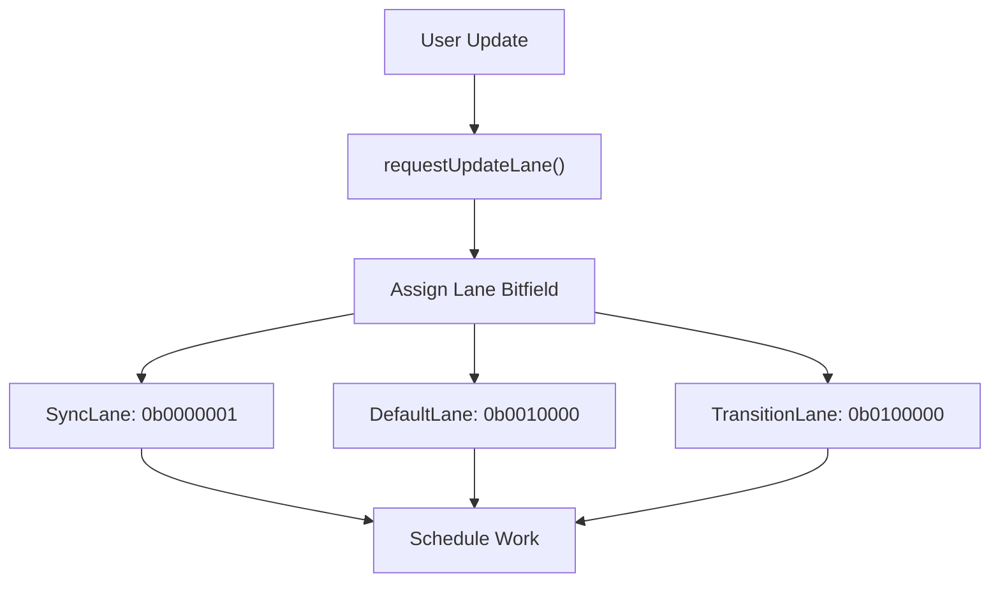
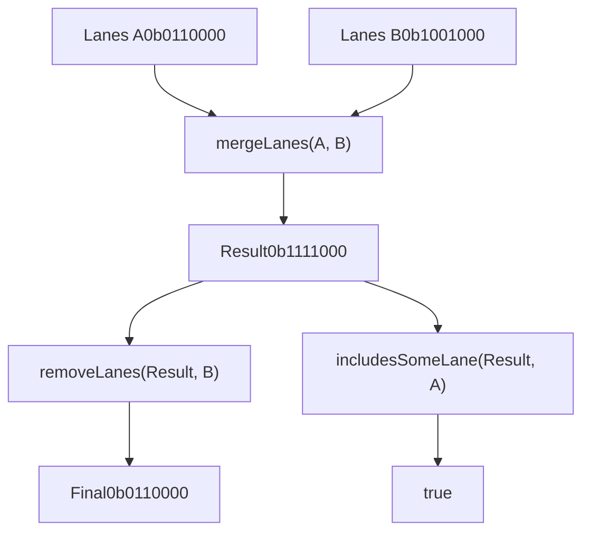
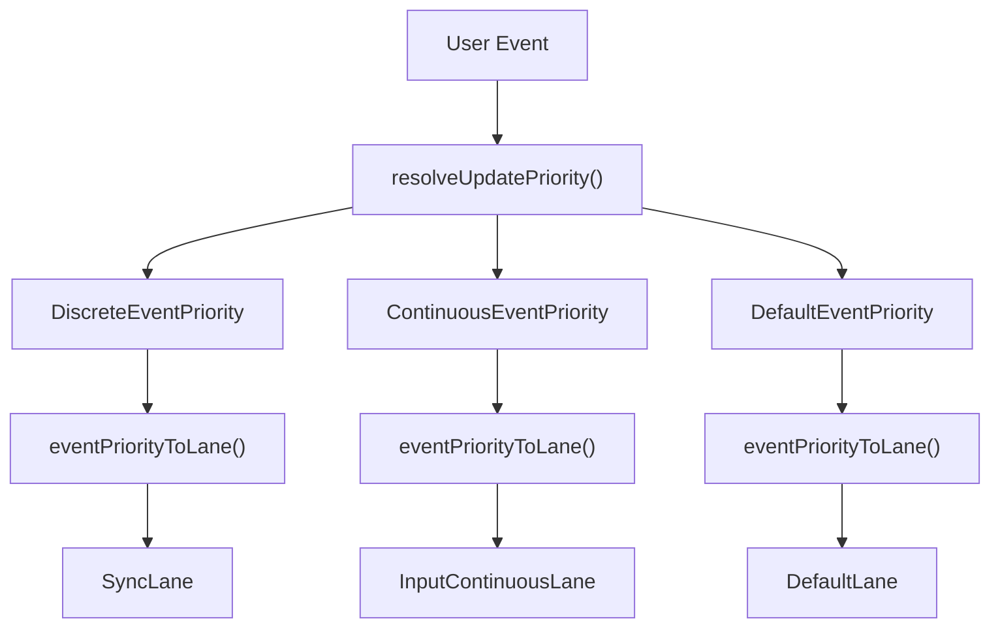
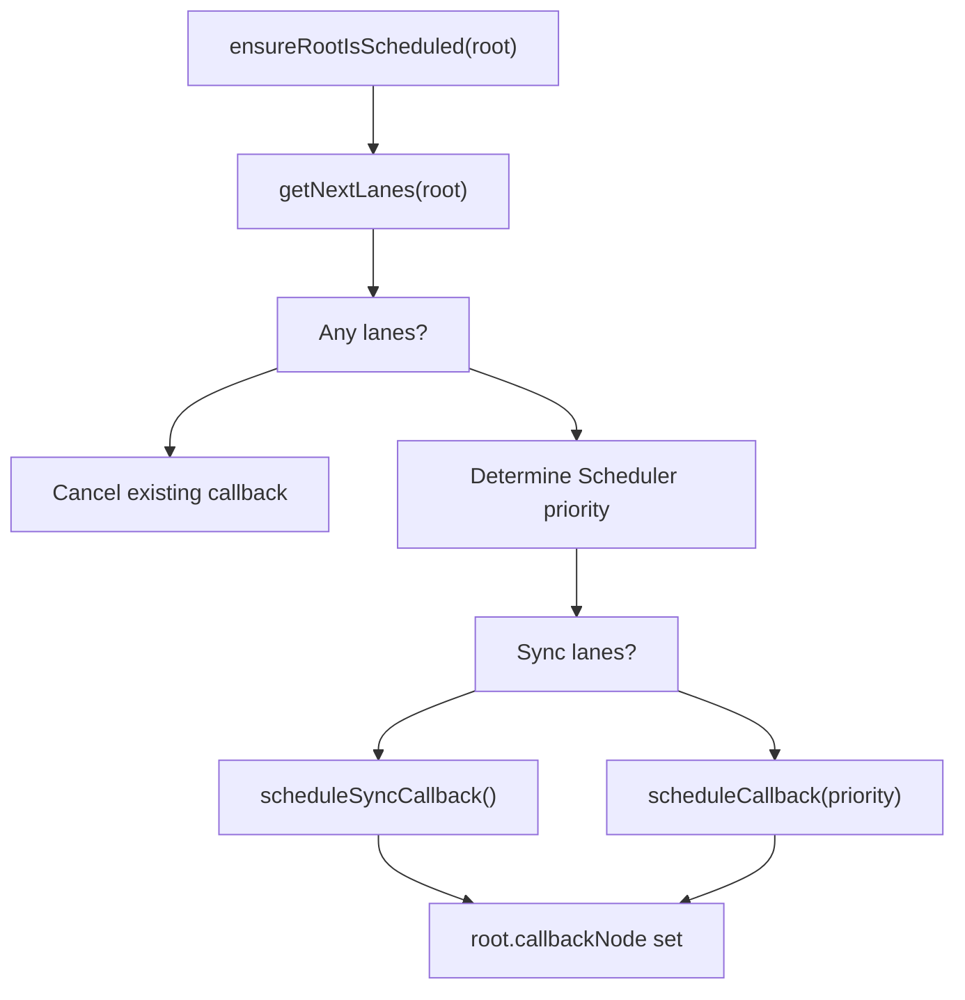
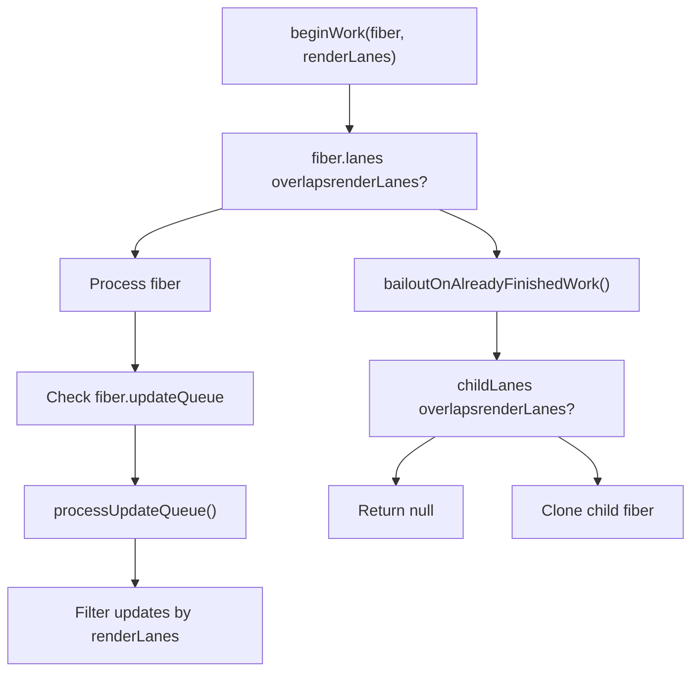
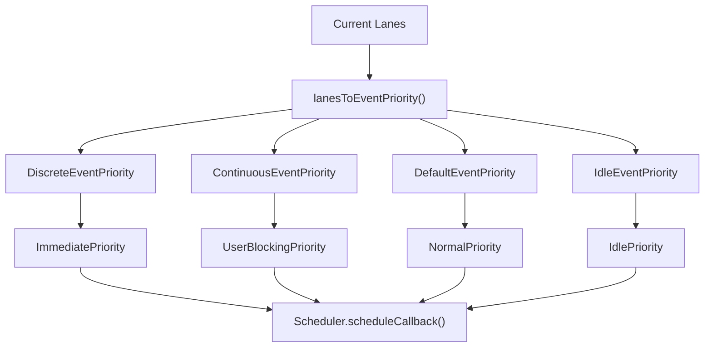
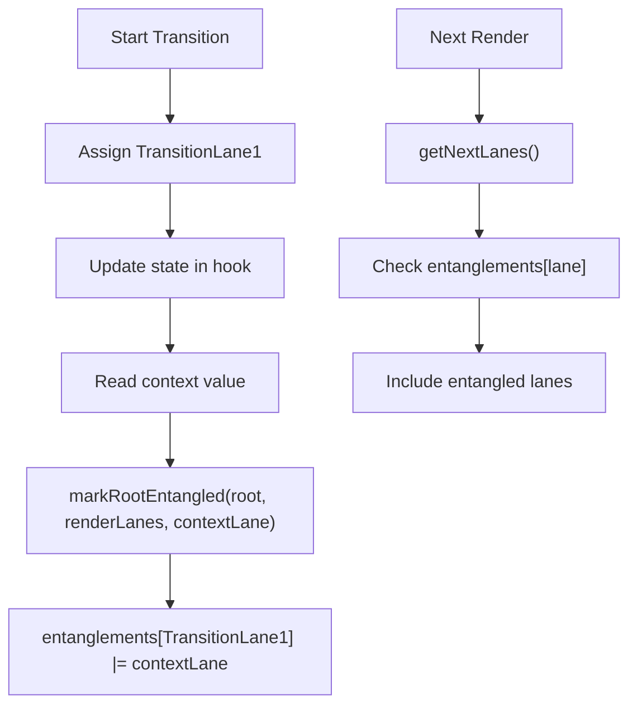

# 基于车道的调度与优先级

相关源文件

-   [packages/react-client/src/ReactFlightPerformanceTrack.js](https://github.com/facebook/react/blob/65eec428/packages/react-client/src/ReactFlightPerformanceTrack.js)
-   [packages/react-debug-tools/src/ReactDebugHooks.js](https://github.com/facebook/react/blob/65eec428/packages/react-debug-tools/src/ReactDebugHooks.js)
-   [packages/react-debug-tools/src/\_\_tests\_\_/ReactHooksInspection-test.js](https://github.com/facebook/react/blob/65eec428/packages/react-debug-tools/src/__tests__/ReactHooksInspection-test.js)
-   [packages/react-debug-tools/src/\_\_tests\_\_/ReactHooksInspectionIntegration-test.js](https://github.com/facebook/react/blob/65eec428/packages/react-debug-tools/src/__tests__/ReactHooksInspectionIntegration-test.js)
-   [packages/react-debug-tools/src/\_\_tests\_\_/ReactHooksInspectionIntegrationDOM-test.js](https://github.com/facebook/react/blob/65eec428/packages/react-debug-tools/src/__tests__/ReactHooksInspectionIntegrationDOM-test.js)
-   [packages/react-devtools-shell/src/app/InspectableElements/CustomHooks.js](https://github.com/facebook/react/blob/65eec428/packages/react-devtools-shell/src/app/InspectableElements/CustomHooks.js)
-   [packages/react-devtools-timeline/src/content-views/utils/moduleFilters.js](https://github.com/facebook/react/blob/65eec428/packages/react-devtools-timeline/src/content-views/utils/moduleFilters.js)
-   [packages/react-dom/src/\_\_tests\_\_/ReactDOMFiberAsync-test.js](https://github.com/facebook/react/blob/65eec428/packages/react-dom/src/__tests__/ReactDOMFiberAsync-test.js)
-   [packages/react-dom/src/\_\_tests\_\_/ReactDOMNativeEventHeuristic-test.js](https://github.com/facebook/react/blob/65eec428/packages/react-dom/src/__tests__/ReactDOMNativeEventHeuristic-test.js)
-   [packages/react-dom/src/events/plugins/\_\_tests\_\_/ChangeEventPlugin-test.js](https://github.com/facebook/react/blob/65eec428/packages/react-dom/src/events/plugins/__tests__/ChangeEventPlugin-test.js)
-   [packages/react-dom/src/events/plugins/\_\_tests\_\_/SimpleEventPlugin-test.js](https://github.com/facebook/react/blob/65eec428/packages/react-dom/src/events/plugins/__tests__/SimpleEventPlugin-test.js)
-   [packages/react-reconciler/src/ReactFiber.js](https://github.com/facebook/react/blob/65eec428/packages/react-reconciler/src/ReactFiber.js)
-   [packages/react-reconciler/src/ReactFiberBeginWork.js](https://github.com/facebook/react/blob/65eec428/packages/react-reconciler/src/ReactFiberBeginWork.js)
-   [packages/react-reconciler/src/ReactFiberClassComponent.js](https://github.com/facebook/react/blob/65eec428/packages/react-reconciler/src/ReactFiberClassComponent.js)
-   [packages/react-reconciler/src/ReactFiberCommitWork.js](https://github.com/facebook/react/blob/65eec428/packages/react-reconciler/src/ReactFiberCommitWork.js)
-   [packages/react-reconciler/src/ReactFiberCompleteWork.js](https://github.com/facebook/react/blob/65eec428/packages/react-reconciler/src/ReactFiberCompleteWork.js)
-   [packages/react-reconciler/src/ReactFiberHooks.js](https://github.com/facebook/react/blob/65eec428/packages/react-reconciler/src/ReactFiberHooks.js)
-   [packages/react-reconciler/src/ReactFiberLane.js](https://github.com/facebook/react/blob/65eec428/packages/react-reconciler/src/ReactFiberLane.js)
-   [packages/react-reconciler/src/ReactFiberOffscreenComponent.js](https://github.com/facebook/react/blob/65eec428/packages/react-reconciler/src/ReactFiberOffscreenComponent.js)
-   [packages/react-reconciler/src/ReactFiberPerformanceTrack.js](https://github.com/facebook/react/blob/65eec428/packages/react-reconciler/src/ReactFiberPerformanceTrack.js)
-   [packages/react-reconciler/src/ReactFiberRootScheduler.js](https://github.com/facebook/react/blob/65eec428/packages/react-reconciler/src/ReactFiberRootScheduler.js)
-   [packages/react-reconciler/src/ReactFiberSuspenseComponent.js](https://github.com/facebook/react/blob/65eec428/packages/react-reconciler/src/ReactFiberSuspenseComponent.js)
-   [packages/react-reconciler/src/ReactFiberUnwindWork.js](https://github.com/facebook/react/blob/65eec428/packages/react-reconciler/src/ReactFiberUnwindWork.js)
-   [packages/react-reconciler/src/ReactFiberWorkLoop.js](https://github.com/facebook/react/blob/65eec428/packages/react-reconciler/src/ReactFiberWorkLoop.js)
-   [packages/react-reconciler/src/ReactInternalTypes.js](https://github.com/facebook/react/blob/65eec428/packages/react-reconciler/src/ReactInternalTypes.js)
-   [packages/react-reconciler/src/ReactProfilerTimer.js](https://github.com/facebook/react/blob/65eec428/packages/react-reconciler/src/ReactProfilerTimer.js)
-   [packages/react-reconciler/src/\_\_tests\_\_/ReactDeferredValue-test.js](https://github.com/facebook/react/blob/65eec428/packages/react-reconciler/src/__tests__/ReactDeferredValue-test.js)
-   [packages/react-reconciler/src/\_\_tests\_\_/ReactHooks-test.internal.js](https://github.com/facebook/react/blob/65eec428/packages/react-reconciler/src/__tests__/ReactHooks-test.internal.js)
-   [packages/react-reconciler/src/\_\_tests\_\_/ReactHooksWithNoopRenderer-test.js](https://github.com/facebook/react/blob/65eec428/packages/react-reconciler/src/__tests__/ReactHooksWithNoopRenderer-test.js)
-   [packages/react-reconciler/src/\_\_tests\_\_/ReactLazy-test.internal.js](https://github.com/facebook/react/blob/65eec428/packages/react-reconciler/src/__tests__/ReactLazy-test.internal.js)
-   [packages/react-reconciler/src/\_\_tests\_\_/ReactPerformanceTrack-test.js](https://github.com/facebook/react/blob/65eec428/packages/react-reconciler/src/__tests__/ReactPerformanceTrack-test.js)
-   [packages/react-reconciler/src/\_\_tests\_\_/ReactSiblingPrerendering-test.js](https://github.com/facebook/react/blob/65eec428/packages/react-reconciler/src/__tests__/ReactSiblingPrerendering-test.js)
-   [packages/react-reconciler/src/\_\_tests\_\_/ReactSuspense-test.internal.js](https://github.com/facebook/react/blob/65eec428/packages/react-reconciler/src/__tests__/ReactSuspense-test.internal.js)
-   [packages/react-reconciler/src/\_\_tests\_\_/ReactSuspensePlaceholder-test.internal.js](https://github.com/facebook/react/blob/65eec428/packages/react-reconciler/src/__tests__/ReactSuspensePlaceholder-test.internal.js)
-   [packages/react-reconciler/src/\_\_tests\_\_/ReactSuspenseWithNoopRenderer-test.js](https://github.com/facebook/react/blob/65eec428/packages/react-reconciler/src/__tests__/ReactSuspenseWithNoopRenderer-test.js)
-   [packages/react-reconciler/src/\_\_tests\_\_/ReactSuspenseyCommitPhase-test.js](https://github.com/facebook/react/blob/65eec428/packages/react-reconciler/src/__tests__/ReactSuspenseyCommitPhase-test.js)
-   [packages/react-server/src/ReactFizzHooks.js](https://github.com/facebook/react/blob/65eec428/packages/react-server/src/ReactFizzHooks.js)
-   [packages/react-server/src/ReactFlightAsyncSequence.js](https://github.com/facebook/react/blob/65eec428/packages/react-server/src/ReactFlightAsyncSequence.js)
-   [packages/react-server/src/ReactFlightServerConfigDebugNode.js](https://github.com/facebook/react/blob/65eec428/packages/react-server/src/ReactFlightServerConfigDebugNode.js)
-   [packages/react-server/src/ReactFlightServerConfigDebugNoop.js](https://github.com/facebook/react/blob/65eec428/packages/react-server/src/ReactFlightServerConfigDebugNoop.js)
-   [packages/react-server/src/ReactFlightStackConfigV8.js](https://github.com/facebook/react/blob/65eec428/packages/react-server/src/ReactFlightStackConfigV8.js)
-   [packages/react-server/src/\_\_tests\_\_/ReactFlightAsyncDebugInfo-test.js](https://github.com/facebook/react/blob/65eec428/packages/react-server/src/__tests__/ReactFlightAsyncDebugInfo-test.js)
-   [packages/react/src/ReactHooks.js](https://github.com/facebook/react/blob/65eec428/packages/react/src/ReactHooks.js)
-   [packages/react/src/ReactLazy.js](https://github.com/facebook/react/blob/65eec428/packages/react/src/ReactLazy.js)
-   [packages/react/src/\_\_tests\_\_/ReactProfiler-test.internal.js](https://github.com/facebook/react/blob/65eec428/packages/react/src/__tests__/ReactProfiler-test.internal.js)
-   [packages/shared/ReactPerformanceTrackProperties.js](https://github.com/facebook/react/blob/65eec428/packages/shared/ReactPerformanceTrackProperties.js)
-   [packages/shared/ReactSymbols.js](https://github.com/facebook/react/blob/65eec428/packages/shared/ReactSymbols.js)

## 目的与范围

本文档描述了 React 基于车道（Lane）的优先级系统，以及它如何与 Scheduler 集成以管理并发渲染。车道是 React 内部的工作优先级表示，实现为一个位域系统，允许对更新处理的时间和方式进行细粒度控制。

关于核心 Reconciler 架构和工作循环的信息，请参阅 [Fiber 架构与工作循环](/facebook/react/4.1-fiber-architecture-and-data-structures)。关于 Scheduler 包本身的详细信息，请参阅下文的 Scheduler 部分。关于 Hooks 和状态更新的信息，请参阅 [React Hooks 系统](/facebook/react/4.2-work-loop-and-rendering-phases)。

---

## 车道 (Lane) 基础

### 什么是车道？

**车道 (Lane)** 是 React 的优先级单位，表示为一个 32 位整数，其中每个位位置对应一个优先级级别。多个车道可以组合成 **车道组 (Lanes)**（复数），以同时表示多个挂起的优先级。


**来源：** [packages/react-reconciler/src/ReactFiberLane.js1-100](https://github.com/facebook/react/blob/65eec428/packages/react-reconciler/src/ReactFiberLane.js#L1-L100)

### 车道类型定义

车道系统定义了几个关键类型：

-   `Lane` - 单个优先级车道（数字）
-   `Lanes` - 表示多个车道的位掩码（数字）
-   `LaneMap<T>` - 用于存储每条车道数据的、以车道位置为索引的数组

**来源：** [packages/react-reconciler/src/ReactFiberLane.js10-20](https://github.com/facebook/react/blob/65eec428/packages/react-reconciler/src/ReactFiberLane.js#L10-L20)

### 车道组与常量

React 为不同的优先级级别定义了不同的车道组：

| 车道组 | 位位置 | 用途 |
| --- | --- | --- |
| `SyncLane` | 0b0000001 (bit 0) | 最高优先级，同步渲染 |
| `SyncUpdateLanes` | 0b0000110 (bits 1-2) | 渲染期间的同步更新 |
| `InputContinuousLane` | 0b0001000 (bit 3) | 连续用户输入（拖拽、滚动） |
| `DefaultLane` | 0b0010000 (bit 4) | 正常更新（点击等） |
| `GestureLane` | 0b0100000 (bit 5) | 手势过渡 |
| `TransitionLanes` | 0b0111111110000000 (bits 7-14) | 过渡更新 |
| `RetryLanes` | 0b0111110000000000000000000000 (bits 15-20) | 重试挂起的工作 |
| `IdleLane` | 0b0100000000000000000000000000000 (bit 30) | 最低优先级工作 |
| `OffscreenLane` | 0b1000000000000000000000000000000 (bit 31) | 预渲染/隐藏内容 |

**来源：** [packages/react-reconciler/src/ReactFiberLane.js40-150](https://github.com/facebook/react/blob/65eec428/packages/react-reconciler/src/ReactFiberLane.js#L40-L150)

---

## 车道操作与管理

### 核心车道操作


用于操作车道的关键函数：

-   `mergeLanes(a, b)` - 按位或运算以组合车道
-   `removeLanes(set, subset)` - 从集合中移除车道
-   `intersectLanes(a, b)` - 按位与运算以查找公共车道
-   `includesSomeLane(set, subset)` - 检查是否有任何车道重叠
-   `isSubsetOfLanes(set, subset)` - 检查是否所有子集车道都在集合中
-   `pickArbitraryLane(lanes)` - 从集合中选择单个车道

**来源：** [packages/react-reconciler/src/ReactFiberLane.js200-350](https://github.com/facebook/react/blob/65eec428/packages/react-reconciler/src/ReactFiberLane.js#L200-L350)

### 车道优先级辅助函数

React 提供了检查车道特性的函数：

-   `includesSyncLane(lanes)` - 包含同步工作
-   `includesBlockingLane(lanes)` - 包含阻塞/输入工作
-   `includesTransitionLane(lanes)` - 包含过渡工作
-   `includesOnlyRetries(lanes)` - 仅包含重试车道
-   `includesOnlyTransitions(lanes)` - 仅包含过渡车道
-   `includesExpiredLane(root, lanes)` - 检查过期车道

**来源：** [packages/react-reconciler/src/ReactFiberLane.js350-500](https://github.com/facebook/react/blob/65eec428/packages/react-reconciler/src/ReactFiberLane.js#L350-L500)

### 车道映射结构

`FiberRoot` 维护车道映射以跟踪元数据：

```
// 概念结构
type FiberRoot = {
  pendingLanes: Lanes,           // 所有挂起的工作
  suspendedLanes: Lanes,         // 挂起的工作
  pingedLanes: Lanes,            // 最近解除阻塞的工作
  expiredLanes: Lanes,           // 已过期的工作

  // 车道映射 (以车道为索引的数组)
  entangledLanes: LaneMap<Lanes>,     // 纠缠的车道
  entanglements: LaneMap<Lanes>,      // 车道纠缠关系
  eventTimes: LaneMap<number>,        // 工作被调度的时间
  expirationTimes: LaneMap<number>,   // 工作过期截止时间
  ...
}
```
**来源：** [packages/react-reconciler/src/ReactFiberRoot.js50-150](https://github.com/facebook/react/blob/65eec428/packages/react-reconciler/src/ReactFiberRoot.js#L50-L150) [packages/react-reconciler/src/ReactInternalTypes.js200-250](https://github.com/facebook/react/blob/65eec428/packages/react-reconciler/src/ReactInternalTypes.js#L200-L250)

---

## 优先级系统

### 事件优先级到车道的映射


React 定义了三个映射到车道的事件优先级级别：

| 事件优先级 | 车道分配 | 用例 |
| --- | --- | --- |
| `DiscreteEventPriority` | `SyncLane` 或 `InputContinuousLane` | 点击、按键 |
| `ContinuousEventPriority` | `InputContinuousLane` | 拖拽、滚动、鼠标移动 |
| `DefaultEventPriority` | `DefaultLane` | 网络响应、定时器 |

**来源：** [packages/react-reconciler/src/ReactEventPriorities.js20-100](https://github.com/facebook/react/blob/65eec428/packages/react-reconciler/src/ReactEventPriorities.js#L20-L100) [packages/react-reconciler/src/ReactFiberWorkLoop.js792-836](https://github.com/facebook/react/blob/65eec428/packages/react-reconciler/src/ReactFiberWorkLoop.js#L792-L836)

### 请求更新车道

`requestUpdateLane()` 函数决定新更新使用哪条车道：

1.  **旧模式检查**：如果不在并发模式下，返回 `SyncLane`
2.  **渲染阶段检查**：如果在渲染期间更新，重用当前渲染车道
3.  **过渡检查**：如果在过渡内部，认领一条过渡车道
4.  **事件优先级**：否则，将当前事件优先级转换为车道

**来源：** [packages/react-reconciler/src/ReactFiberWorkLoop.js792-836](https://github.com/facebook/react/blob/65eec428/packages/react-reconciler/src/ReactFiberWorkLoop.js#L792-L836)

### 过渡车道管理

React 维护一个过渡车道池（位 7-14），并使用以下方法分配它们：

-   `claimNextTransitionLane()` - 认领下一条可用的过渡车道，在池中循环
-   `claimNextTransitionDeferredLane()` - 认领推迟的过渡车道
-   `requestTransitionLane(transition)` - 为特定过渡请求一条车道

**来源：** [packages/react-reconciler/src/ReactFiberLane.js600-700](https://github.com/facebook/react/blob/65eec428/packages/react-reconciler/src/ReactFiberLane.js#L600-L700) [packages/react-reconciler/src/ReactFiberRootScheduler.js100-200](https://github.com/facebook/react/blob/65eec428/packages/react-reconciler/src/ReactFiberRootScheduler.js#L100-L200)

---

## 调度流程

### 更新调度流水线

> **[Mermaid sequence]**
> *(图表结构无法解析)*

**来源：** [packages/react-reconciler/src/ReactFiberWorkLoop.js916-1000](https://github.com/facebook/react/blob/65eec428/packages/react-reconciler/src/ReactFiberWorkLoop.js#L916-L1000) [packages/react-reconciler/src/ReactFiberRootScheduler.js150-300](https://github.com/facebook/react/blob/65eec428/packages/react-reconciler/src/ReactFiberRootScheduler.js#L150-L300)

### scheduleUpdateOnFiber

调度工作的主要入口点：

1.  **检查挂起的工作**：如果根因数据挂起且这是一个 ping，可能会立即恢复
2.  **标记根已更新**：调用 `markRootUpdated()` 将车道添加到 `pendingLanes`
3.  **确保已调度**：如果需要，调用 `ensureRootIsScheduled()` 来调度工作

**来源：** [packages/react-reconciler/src/ReactFiberWorkLoop.js916-1100](https://github.com/facebook/react/blob/65eec428/packages/react-reconciler/src/ReactFiberWorkLoop.js#L916-L1100)

### ensureRootIsScheduled

此函数在每次更新后调用，决定是否需要调度新工作：


关键逻辑：

1.  `getNextLanes()` 挑选最高优先级的车道进行处理
2.  通过 `lanesToEventPriority()` 将车道优先级转换为 Scheduler 优先级
3.  通过 `scheduleSyncCallback()` 调度同步工作，或通过 `Scheduler.scheduleCallback()` 调度异步工作
4.  在根上存储回调节点以启用取消

**来源：** [packages/react-reconciler/src/ReactFiberRootScheduler.js150-350](https://github.com/facebook/react/blob/65eec428/packages/react-reconciler/src/ReactFiberRootScheduler.js#L150-L350)

### getNextLanes

确定接下来应处理哪些车道：

1.  **无挂起检查**：如果没有 `pendingLanes`，返回 `NoLanes`
2.  **非空闲工作**：优先处理非空闲车道
3.  **移除挂起**：排除挂起的车道，除非已被 ping
4.  **过期检查**：立即包含过期车道
5.  **纠缠**：应用车道纠缠规则
6.  **挑选车道**：根据优先级选择车道

**来源：** [packages/react-reconciler/src/ReactFiberLane.js400-550](https://github.com/facebook/react/blob/65eec428/packages/react-reconciler/src/ReactFiberLane.js#L400-L550)

---

## 工作循环集成

### 渲染阶段车道使用

在渲染期间，车道控制处理哪些工作：


工作循环中的关键变量：

-   `workInProgressRootRenderLanes` - 当前遍历中正在渲染的车道
-   `entangledRenderLanes` - 上下文车道，包括隐藏的子树
-   `workInProgressRootSkippedLanes` - 包含已跳过工作的车道

**来源：** [packages/react-reconciler/src/ReactFiberWorkLoop.js400-500](https://github.com/facebook/react/blob/65eec428/packages/react-reconciler/src/ReactFiberWorkLoop.js#L400-L500) [packages/react-reconciler/src/ReactFiberBeginWork.js200-400](https://github.com/facebook/react/blob/65eec428/packages/react-reconciler/src/ReactFiberBeginWork.js#L200-L400)

### 更新队列处理

每个 fiber 的更新队列通过车道过滤更新：

```
// 来自 processUpdateQueue 的概念逻辑
function processUpdateQueue(workInProgress, renderLanes) {
  let update = queue.firstBaseUpdate;

  while (update !== null) {
    const updateLane = update.lane;

    if (!isSubsetOfLanes(renderLanes, updateLane)) {
      // 更新车道不在 renderLanes 中，跳过它
      // 添加到已跳过的更新
      const clone = cloneUpdate(update);
      newBaseUpdate = clone;
    } else {
      // 处理此更新
      newState = getStateFromUpdate(update, newState);
    }

    update = update.next;
  }
}
```
**来源：** [packages/react-reconciler/src/ReactFiberClassUpdateQueue.js300-500](https://github.com/facebook/react/blob/65eec428/packages/react-reconciler/src/ReactFiberClassUpdateQueue.js#L300-L500)

### 提交后清除车道

提交后，清除车道：

1.  `markRootFinished(root, remainingLanes)` - 从 `pendingLanes` 中移除已完成的车道
2.  `clearTransitionsForLanes(root, lanes)` - 清理过渡跟踪
3.  `ensureRootIsScheduled(root)` - 如果还有工作，重新调度

**来源：** [packages/react-reconciler/src/ReactFiberWorkLoop.js2000-2100](https://github.com/facebook/react/blob/65eec428/packages/react-reconciler/src/ReactFiberWorkLoop.js#L2000-L2100) [packages/react-reconciler/src/ReactFiberLane.js850-950](https://github.com/facebook/react/blob/65eec428/packages/react-reconciler/src/ReactFiberLane.js#L850-L950)

---

## Scheduler 集成

### 车道到 Scheduler 优先级映射


**来源：** [packages/react-reconciler/src/ReactEventPriorities.js70-120](https://github.com/facebook/react/blob/65eec428/packages/react-reconciler/src/ReactEventPriorities.js#L70-L120) [packages/react-reconciler/src/ReactFiberRootScheduler.js200-250](https://github.com/facebook/react/blob/65eec428/packages/react-reconciler/src/ReactFiberRootScheduler.js#L200-L250)

### 协作式调度

Scheduler 通过协作式多任务处理实现并发渲染：

1.  **时间切片**：工作以小的时间片执行（默认 ~5ms）
2.  **shouldYield()**：在渲染期间检查，以查看时间片是否已过期
3.  **工作恢复**：如果让出，工作从中断处恢复
4.  **优先级反转**：更高优先级的工作可以中断较低优先级的工作

**来源：** [packages/react-reconciler/src/ReactFiberWorkLoop.js1500-1800](https://github.com/facebook/react/blob/65eec428/packages/react-reconciler/src/ReactFiberWorkLoop.js#L1500-L1800)

### performWorkOnRoot 回调

执行工作的已调度回调：

```
// 简化的回调逻辑
function performConcurrentWorkOnRoot(root, didTimeout) {
  const originalCallbackNode = root.callbackNode;

  // 获取要处理的车道
  const lanes = getNextLanes(root,
    root === workInProgressRoot ? workInProgressRootRenderLanes : NoLanes
  );

  if (lanes === NoLanes) {
    return null;
  }

  // 执行渲染
  let exitStatus = shouldTimeSlice
    ? renderRootConcurrent(root, lanes)
    : renderRootSync(root, lanes);

  // 处理退出状态并在准备好时提交
  if (exitStatus === RootCompleted) {
    commitRoot(root);
  }

  // 如果有更多工作，重新调度
  ensureRootIsScheduled(root);

  // 返回继续回调或 null
  return root.callbackNode === originalCallbackNode
    ? performConcurrentWorkOnRoot.bind(null, root)
    : null;
}
```
**来源：** [packages/react-reconciler/src/ReactFiberWorkLoop.js1200-1500](https://github.com/facebook/react/blob/65eec428/packages/react-reconciler/src/ReactFiberWorkLoop.js#L1200-L1500)

---

## 关键数据结构

### Fiber 车道字段

每个 `Fiber` 节点跟踪车道：

| 字段 | 类型 | 用途 |
| --- | --- | --- |
| `lanes` | `Lanes` | 此 fiber 上调度的工作 |
| `childLanes` | `Lanes` | 后代上调度的工作 |

这些字段用于在渲染期间跳过没有相关工作的子树。

**来源：** [packages/react-reconciler/src/ReactInternalTypes.js165-175](https://github.com/facebook/react/blob/65eec428/packages/react-reconciler/src/ReactInternalTypes.js#L165-L175)

### FiberRoot 车道字段

`FiberRoot` 维护全面的车道状态：

| 字段 | 类型 | 用途 |
| --- | --- | --- |
| `pendingLanes` | `Lanes` | 所有具有挂起工作的车道 |
| `suspendedLanes` | `Lanes` | 因数据加载而挂起的车道 |
| `pingedLanes` | `Lanes` | 已被 ping 的挂起车道 |
| `expiredLanes` | `Lanes` | 已超过时间限制的车道 |
| `finishedLanes` | `Lanes` | 上次渲染中完成的车道 |
| `entangledLanes` | `LaneMap<Lanes>` | 与每条车道纠缠的车道 |
| `entanglements` | `LaneMap<Lanes>` | 纠缠关系 |
| `eventTimes` | `LaneMap<number>` | 车道工作开始的时间戳 |
| `expirationTimes` | `LaneMap<number>` | 车道的过期截止时间 |

**来源：** [packages/react-reconciler/src/ReactInternalTypes.js180-250](https://github.com/facebook/react/blob/65eec428/packages/react-reconciler/src/ReactInternalTypes.js#L180-L250)

### 更新车道字段

更新对象携带其分配的车道：

```
type Update<S, A> = {
  lane: Lane,              // 此更新的优先级车道
  revertLane: Lane,        // 错误时恢复到的车道
  action: A,               // 更新 payload
  hasEagerState: boolean,  // 调度期间计算
  eagerState: S | null,    // 急切计算的状态
  next: Update<S, A>,      // 链表
  ...
}
```
**来源：** [packages/react-reconciler/src/ReactFiberHooks.js165-180](https://github.com/facebook/react/blob/65eec428/packages/react-reconciler/src/ReactFiberHooks.js#L165-L180) [packages/react-reconciler/src/ReactFiberClassUpdateQueue.js100-150](https://github.com/facebook/react/blob/65eec428/packages/react-reconciler/src/ReactFiberClassUpdateQueue.js#L100-L150)

---

## 并发渲染支持

### 车道纠缠 (Lane Entanglement)

车道可以被“纠缠”，以确保相关工作一起处理：


纠缠确保在处理 TransitionLane1 时，发生的任何上下文更新也被包括在内。

**来源：** [packages/react-reconciler/src/ReactFiberLane.js750-850](https://github.com/facebook/react/blob/65eec428/packages/react-reconciler/src/ReactFiberLane.js#L750-L850)

### 车道过期 (Lane Expiration)

为了防止饥饿，车道会在超时后过期：

-   同步车道：立即过期（无超时）
-   阻塞车道：~250ms 过期
-   默认车道：~5000ms 过期
-   过渡车道：~5000ms 过期
-   重试车道：~5000ms 过期
-   空闲车道：永不过期（无限超时）

**来源：** [packages/react-reconciler/src/ReactFiberLane.js950-1050](https://github.com/facebook/react/blob/65eec428/packages/react-reconciler/src/ReactFiberLane.js#L950-L1050) 特性标志位于 [packages/shared/ReactFeatureFlags.js80-95](https://github.com/facebook/react/blob/65eec428/packages/shared/ReactFeatureFlags.js#L80-L95)

### 中断低优先级工作

> **[Mermaid sequence]**
> *(图表结构无法解析)*

当更高优先级的工作在低优先级渲染期间到达时：

1.  工作循环检查新车道是否具有更高优先级
2.  如果是，丢弃当前 work-in-progress 树
3.  以更高优先级开始新的渲染
4.  低优先级工作被重新调度

**来源：** [packages/react-reconciler/src/ReactFiberWorkLoop.js1000-1200](https://github.com/facebook/react/blob/65eec428/packages/react-reconciler/src/ReactFiberWorkLoop.js#L1000-L1200) [packages/react-reconciler/src/ReactFiberWorkLoop.js1800-2000](https://github.com/facebook/react/blob/65eec428/packages/react-reconciler/src/ReactFiberWorkLoop.js#L1800-L2000)

---

## 总结

React 基于车道的优先级系统提供：

1.  **细粒度优先级控制**：以位表示的 32 个不同优先级级别
2.  **并发渲染**：可以同时跟踪多个优先级
3.  **优先级提升**：工作可以通过过期或用户交互进行升级
4.  **高效跳过**：车道允许跳过未受影响的子树
5.  **Scheduler 集成**：车道映射到 Scheduler 优先级以进行时间切片渲染
6.  **纠缠**：相关工作一起处理以保持一致性

该系统协调三个关键组件：

-   **车道分配** (`requestUpdateLane`, `requestTransitionLane`)
-   **车道调度** (`scheduleUpdateOnFiber`, `ensureRootIsScheduled`)
-   **车道处理** (工作循环检查车道以决定渲染什么)

这种架构使得 React 的并发特性（包括过渡、Suspense 和时间切片）成为可能。

**来源：** [packages/react-reconciler/src/ReactFiberLane.js1-1200](https://github.com/facebook/react/blob/65eec428/packages/react-reconciler/src/ReactFiberLane.js#L1-L1200) [packages/react-reconciler/src/ReactFiberWorkLoop.js1-2500](https://github.com/facebook/react/blob/65eec428/packages/react-reconciler/src/ReactFiberWorkLoop.js#L1-L2500) [packages/react-reconciler/src/ReactFiberRootScheduler.js1-500](https://github.com/facebook/react/blob/65eec428/packages/react-reconciler/src/ReactFiberRootScheduler.js#L1-L500)
