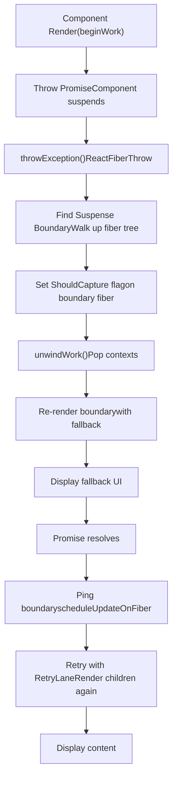
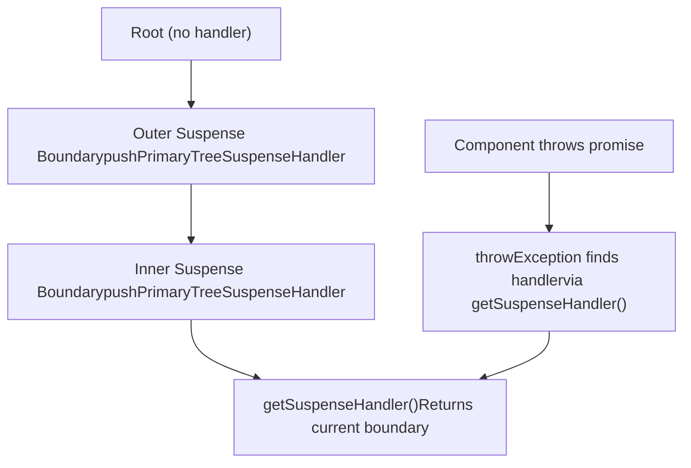
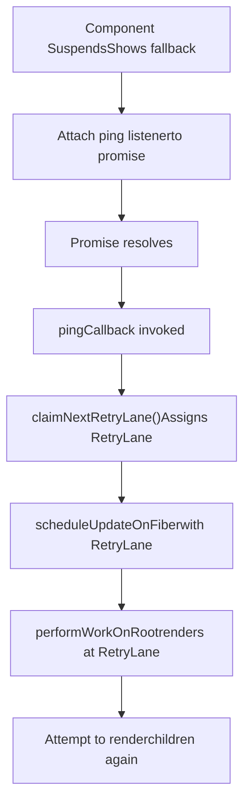
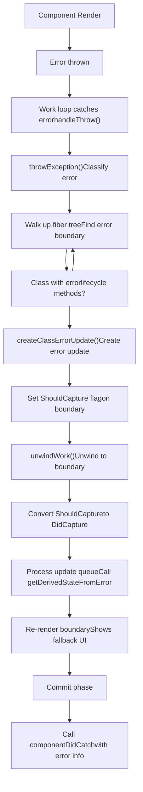
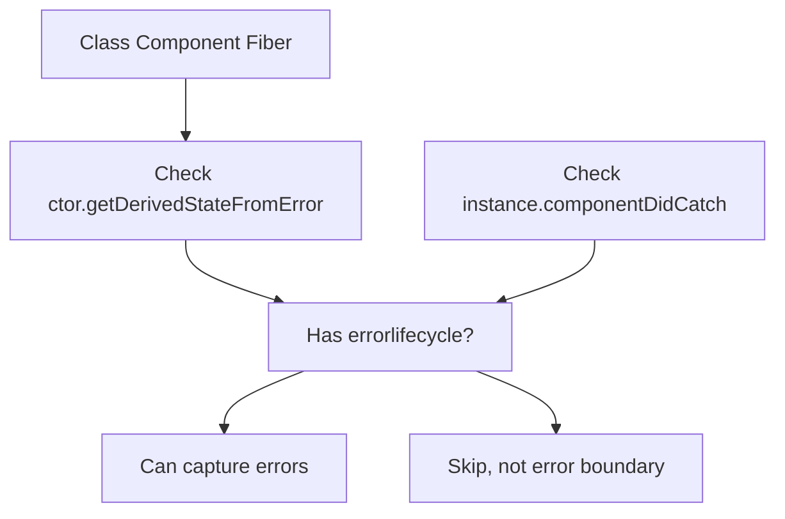
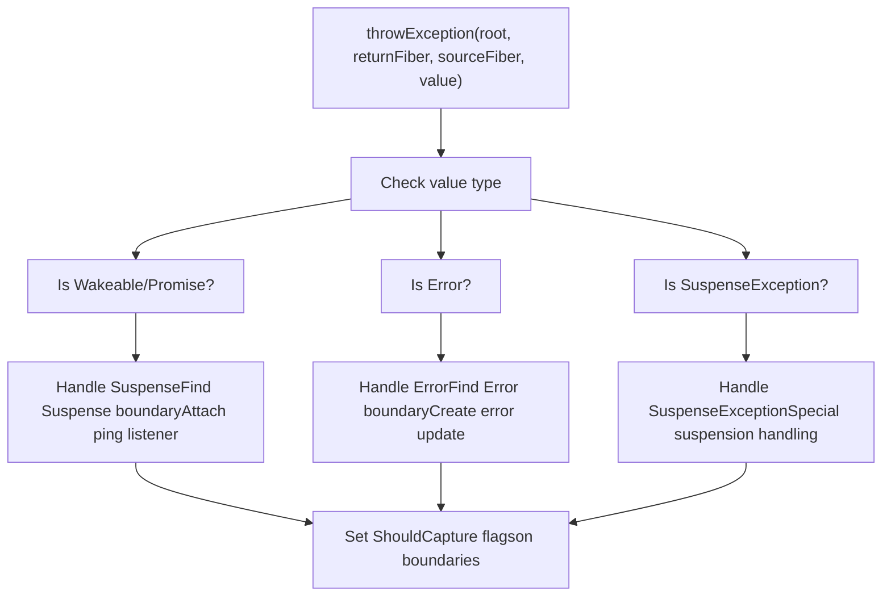
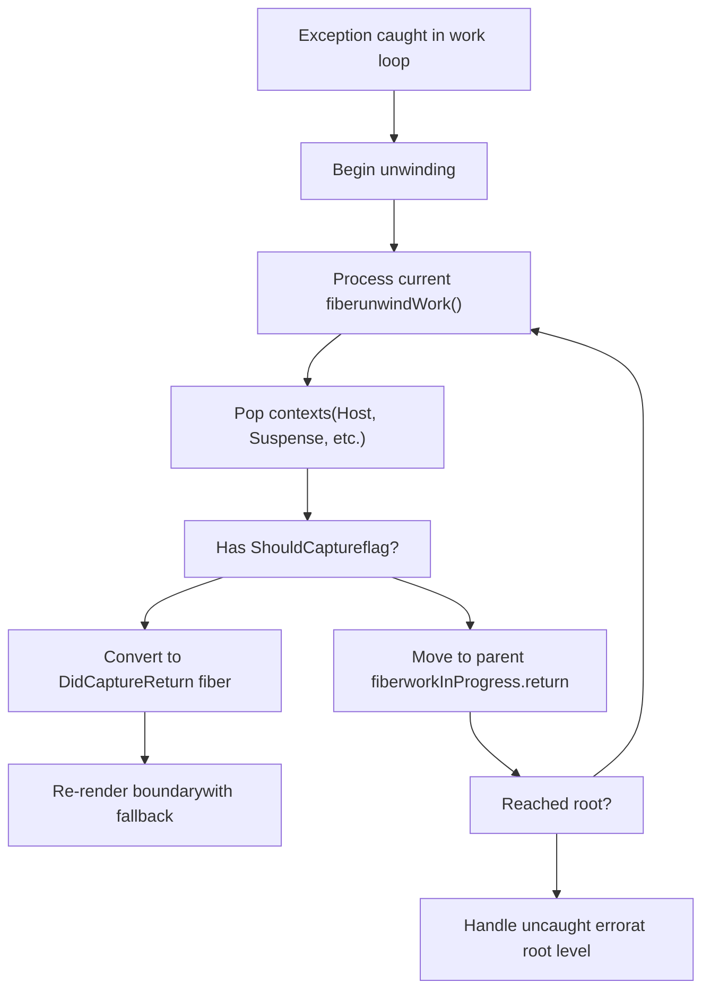
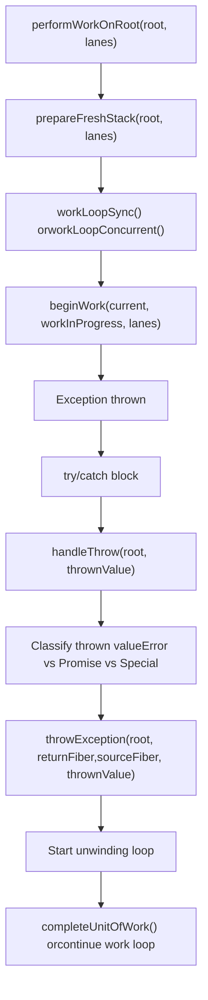
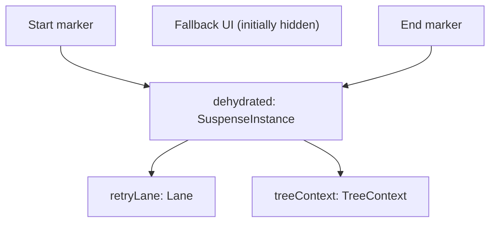
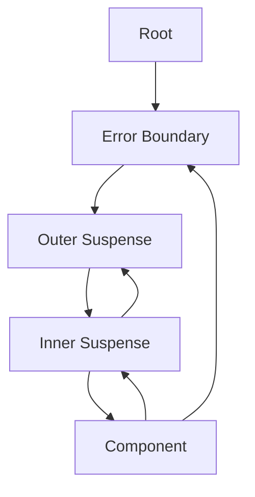

# Suspense 与错误边界

相关源文件

-   [packages/react-client/src/ReactFlightPerformanceTrack.js](https://github.com/facebook/react/blob/65eec428/packages/react-client/src/ReactFlightPerformanceTrack.js)
-   [packages/react-debug-tools/src/ReactDebugHooks.js](https://github.com/facebook/react/blob/65eec428/packages/react-debug-tools/src/ReactDebugHooks.js)
-   [packages/react-debug-tools/src/\_\_tests\_\_/ReactHooksInspection-test.js](https://github.com/facebook/react/blob/65eec428/packages/react-debug-tools/src/__tests__/ReactHooksInspection-test.js)
-   [packages/react-debug-tools/src/\_\_tests\_\_/ReactHooksInspectionIntegration-test.js](https://github.com/facebook/react/blob/65eec428/packages/react-debug-tools/src/__tests__/ReactHooksInspectionIntegration-test.js)
-   [packages/react-debug-tools/src/\_\_tests\_\_/ReactHooksInspectionIntegrationDOM-test.js](https://github.com/facebook/react/blob/65eec428/packages/react-debug-tools/src/__tests__/ReactHooksInspectionIntegrationDOM-test.js)
-   [packages/react-devtools-shell/src/app/InspectableElements/CustomHooks.js](https://github.com/facebook/react/blob/65eec428/packages/react-devtools-shell/src/app/InspectableElements/CustomHooks.js)
-   [packages/react-devtools-timeline/src/content-views/utils/moduleFilters.js](https://github.com/facebook/react/blob/65eec428/packages/react-devtools-timeline/src/content-views/utils/moduleFilters.js)
-   [packages/react-dom/src/\_\_tests\_\_/ReactDOMFiberAsync-test.js](https://github.com/facebook/react/blob/65eec428/packages/react-dom/src/__tests__/ReactDOMFiberAsync-test.js)
-   [packages/react-dom/src/\_\_tests\_\_/ReactDOMNativeEventHeuristic-test.js](https://github.com/facebook/react/blob/65eec428/packages/react-dom/src/__tests__/ReactDOMNativeEventHeuristic-test.js)
-   [packages/react-dom/src/events/plugins/\_\_tests\_\_/ChangeEventPlugin-test.js](https://github.com/facebook/react/blob/65eec428/packages/react-dom/src/events/plugins/__tests__/ChangeEventPlugin-test.js)
-   [packages/react-dom/src/events/plugins/\_\_tests\_\_/SimpleEventPlugin-test.js](https://github.com/facebook/react/blob/65eec428/packages/react-dom/src/events/plugins/__tests__/SimpleEventPlugin-test.js)
-   [packages/react-reconciler/src/ReactFiber.js](https://github.com/facebook/react/blob/65eec428/packages/react-reconciler/src/ReactFiber.js)
-   [packages/react-reconciler/src/ReactFiberBeginWork.js](https://github.com/facebook/react/blob/65eec428/packages/react-reconciler/src/ReactFiberBeginWork.js)
-   [packages/react-reconciler/src/ReactFiberClassComponent.js](https://github.com/facebook/react/blob/65eec428/packages/react-reconciler/src/ReactFiberClassComponent.js)
-   [packages/react-reconciler/src/ReactFiberCommitWork.js](https://github.com/facebook/react/blob/65eec428/packages/react-reconciler/src/ReactFiberCommitWork.js)
-   [packages/react-reconciler/src/ReactFiberCompleteWork.js](https://github.com/facebook/react/blob/65eec428/packages/react-reconciler/src/ReactFiberCompleteWork.js)
-   [packages/react-reconciler/src/ReactFiberHooks.js](https://github.com/facebook/react/blob/65eec428/packages/react-reconciler/src/ReactFiberHooks.js)
-   [packages/react-reconciler/src/ReactFiberLane.js](https://github.com/facebook/react/blob/65eec428/packages/react-reconciler/src/ReactFiberLane.js)
-   [packages/react-reconciler/src/ReactFiberOffscreenComponent.js](https://github.com/facebook/react/blob/65eec428/packages/react-reconciler/src/ReactFiberOffscreenComponent.js)
-   [packages/react-reconciler/src/ReactFiberPerformanceTrack.js](https://github.com/facebook/react/blob/65eec428/packages/react-reconciler/src/ReactFiberPerformanceTrack.js)
-   [packages/react-reconciler/src/ReactFiberRootScheduler.js](https://github.com/facebook/react/blob/65eec428/packages/react-reconciler/src/ReactFiberRootScheduler.js)
-   [packages/react-reconciler/src/ReactFiberSuspenseComponent.js](https://github.com/facebook/react/blob/65eec428/packages/react-reconciler/src/ReactFiberSuspenseComponent.js)
-   [packages/react-reconciler/src/ReactFiberUnwindWork.js](https://github.com/facebook/react/blob/65eec428/packages/react-reconciler/src/ReactFiberUnwindWork.js)
-   [packages/react-reconciler/src/ReactFiberWorkLoop.js](https://github.com/facebook/react/blob/65eec428/packages/react-reconciler/src/ReactFiberWorkLoop.js)
-   [packages/react-reconciler/src/ReactInternalTypes.js](https://github.com/facebook/react/blob/65eec428/packages/react-reconciler/src/ReactInternalTypes.js)
-   [packages/react-reconciler/src/ReactProfilerTimer.js](https://github.com/facebook/react/blob/65eec428/packages/react-reconciler/src/ReactProfilerTimer.js)
-   [packages/react-reconciler/src/\_\_tests\_\_/ReactDeferredValue-test.js](https://github.com/facebook/react/blob/65eec428/packages/react-reconciler/src/__tests__/ReactDeferredValue-test.js)
-   [packages/react-reconciler/src/\_\_tests\_\_/ReactHooks-test.internal.js](https://github.com/facebook/react/blob/65eec428/packages/react-reconciler/src/__tests__/ReactHooks-test.internal.js)
-   [packages/react-reconciler/src/\_\_tests\_\_/ReactHooksWithNoopRenderer-test.js](https://github.com/facebook/react/blob/65eec428/packages/react-reconciler/src/__tests__/ReactHooksWithNoopRenderer-test.js)
-   [packages/react-reconciler/src/\_\_tests\_\_/ReactLazy-test.internal.js](https://github.com/facebook/react/blob/65eec428/packages/react-reconciler/src/__tests__/ReactLazy-test.internal.js)
-   [packages/react-reconciler/src/\_\_tests\_\_/ReactPerformanceTrack-test.js](https://github.com/facebook/react/blob/65eec428/packages/react-reconciler/src/__tests__/ReactPerformanceTrack-test.js)
-   [packages/react-reconciler/src/\_\_tests\_\_/ReactSiblingPrerendering-test.js](https://github.com/facebook/react/blob/65eec428/packages/react-reconciler/src/__tests__/ReactSiblingPrerendering-test.js)
-   [packages/react-reconciler/src/\_\_tests\_\_/ReactSuspense-test.internal.js](https://github.com/facebook/react/blob/65eec428/packages/react-reconciler/src/__tests__/ReactSuspense-test.internal.js)
-   [packages/react-reconciler/src/\_\_tests\_\_/ReactSuspensePlaceholder-test.internal.js](https://github.com/facebook/react/blob/65eec428/packages/react-reconciler/src/__tests__/ReactSuspensePlaceholder-test.internal.js)
-   [packages/react-reconciler/src/\_\_tests\_\_/ReactSuspenseWithNoopRenderer-test.js](https://github.com/facebook/react/blob/65eec428/packages/react-reconciler/src/__tests__/ReactSuspenseWithNoopRenderer-test.js)
-   [packages/react-reconciler/src/\_\_tests\_\_/ReactSuspenseyCommitPhase-test.js](https://github.com/facebook/react/blob/65eec428/packages/react-reconciler/src/__tests__/ReactSuspenseyCommitPhase-test.js)
-   [packages/react-server/src/ReactFizzHooks.js](https://github.com/facebook/react/blob/65eec428/packages/react-server/src/ReactFizzHooks.js)
-   [packages/react-server/src/ReactFlightAsyncSequence.js](https://github.com/facebook/react/blob/65eec428/packages/react-server/src/ReactFlightAsyncSequence.js)
-   [packages/react-server/src/ReactFlightServerConfigDebugNode.js](https://github.com/facebook/react/blob/65eec428/packages/react-server/src/ReactFlightServerConfigDebugNode.js)
-   [packages/react-server/src/ReactFlightServerConfigDebugNoop.js](https://github.com/facebook/react/blob/65eec428/packages/react-server/src/ReactFlightServerConfigDebugNoop.js)
-   [packages/react-server/src/ReactFlightStackConfigV8.js](https://github.com/facebook/react/blob/65eec428/packages/react-server/src/ReactFlightStackConfigV8.js)
-   [packages/react-server/src/\_\_tests\_\_/ReactFlightAsyncDebugInfo-test.js](https://github.com/facebook/react/blob/65eec428/packages/react-server/src/__tests__/ReactFlightAsyncDebugInfo-test.js)
-   [packages/react/src/ReactHooks.js](https://github.com/facebook/react/blob/65eec428/packages/react/src/ReactHooks.js)
-   [packages/react/src/ReactLazy.js](https://github.com/facebook/react/blob/65eec428/packages/react/src/ReactLazy.js)
-   [packages/react/src/\_\_tests\_\_/ReactProfiler-test.internal.js](https://github.com/facebook/react/blob/65eec428/packages/react/src/__tests__/ReactProfiler-test.internal.js)
-   [packages/shared/ReactPerformanceTrackProperties.js](https://github.com/facebook/react/blob/65eec428/packages/shared/ReactPerformanceTrackProperties.js)
-   [packages/shared/ReactSymbols.js](https://github.com/facebook/react/blob/65eec428/packages/shared/ReactSymbols.js)

## 目的与范围

本文档描述了 React 在渲染期间通过两个关键机制处理异步操作和错误的方式：**Suspense 边界**和**错误边界**。Suspense 边界允许组件通过捕获抛出的 promise 并渲染 fallback UI 来声明式地等待异步数据。错误边界捕获其子组件树中任何位置的 JavaScript 错误，并显示 fallback UI 而不是让整个应用程序崩溃。

关于服务端渲染 Suspense 边界的水合信息，请参阅 [水合系统](/facebook/react/6.3-hydration-system)。关于 Suspense 如何与 Server Components 和流式 SSR 集成的详细信息，请参阅 [React Fizz (流式 SSR)](/facebook/react/5.1-react-fizz-(streaming-ssr))。

---

## 概览：两种边界类型

React 提供了两种类型的中断正常渲染流程的边界：

| 边界类型 | 捕获内容 | 定义方式 | 触发条件 |
| --- | --- | --- | --- |
| **Suspense 边界** | 抛出的 promise（异步操作） | 带有 `fallback` prop 的 `<Suspense>` 组件 | 组件在渲染期间抛出 promise |
| **错误边界** | JavaScript 错误 | 带有 `componentDidCatch` 或 `getDerivedStateFromError` 的类组件 | 渲染期间、生命周期方法或事件处理程序中抛出错误 |

这两种边界在捕获渲染阶段异常和展开 (unwinding) Fiber 树方面共享类似的机制，但在捕获内容和恢复方式上有所不同。

来源：[packages/react-reconciler/src/ReactFiberBeginWork.js1-100](https://github.com/facebook/react/blob/65eec428/packages/react-reconciler/src/ReactFiberBeginWork.js#L1-L100) [packages/react-reconciler/src/ReactFiberClassComponent.js1-50](https://github.com/facebook/react/blob/65eec428/packages/react-reconciler/src/ReactFiberClassComponent.js#L1-L50)

---

## Suspense 边界

### Suspense 组件结构

Suspense 边界使用 `<Suspense>` 组件创建，该组件接受 `fallback` 和 `children` props：

```
<Suspense fallback={<LoadingSpinner />}>
  <AsyncComponent />
</Suspense>
```
在内部，Suspense 由 `SuspenseComponent` 工作标签表示，并通过 `SuspenseState` 维护状态：

```
type SuspenseState = {
  dehydrated: null | SuspenseInstance,  // 如果是 SSR 脱水则非 null
  retryLane: Lane,                       // 重试渲染的车道
  treeContext: TreeContext | null,       // 用于水合的树上下文
  ...
}
```
来源：[packages/react-reconciler/src/ReactFiberSuspenseComponent.js24-36](https://github.com/facebook/react/blob/65eec428/packages/react-reconciler/src/ReactFiberSuspenseComponent.js#L24-L36) [packages/react-reconciler/src/ReactWorkTags.js70](https://github.com/facebook/react/blob/65eec428/packages/react-reconciler/src/ReactWorkTags.js#L70-L70)

### Suspense 如何工作


**Suspense 流程步骤：**

1.  **组件抛出 Promise**：在渲染期间，组件读取异步数据，如果数据未就绪，则抛出一个 promise
2.  **工作循环捕获**：工作循环在 `handleThrow` 中捕获抛出的值 ([packages/react-reconciler/src/ReactFiberWorkLoop.js1800-1900](https://github.com/facebook/react/blob/65eec428/packages/react-reconciler/src/ReactFiberWorkLoop.js#L1800-L1900))
3.  **throwException**：识别抛出的内容并查找最近的 Suspense 边界 ([packages/react-reconciler/src/ReactFiberThrow.js1-100](https://github.com/facebook/react/blob/65eec428/packages/react-reconciler/src/ReactFiberThrow.js#L1-L100))
4.  **标记边界**：在 Suspense 边界 fiber 上设置 `ShouldCapture` 标志 ([packages/react-reconciler/src/ReactFiberBeginWork.js3800-3900](https://github.com/facebook/react/blob/65eec428/packages/react-reconciler/src/ReactFiberBeginWork.js#L3800-L3900))
5.  **展开堆栈**：通过 `unwindWork` 展开 fiber 树，弹出上下文并检查每个 fiber 的 `ShouldCapture` ([packages/react-reconciler/src/ReactFiberUnwindWork.js156-183](https://github.com/facebook/react/blob/65eec428/packages/react-reconciler/src/ReactFiberUnwindWork.js#L156-L183))
6.  **转换为 DidCapture**：当展开到达 Suspense 边界时，将 `ShouldCapture` 转换为 `DidCapture` 标志 ([packages/react-reconciler/src/ReactFiberUnwindWork.js170-180](https://github.com/facebook/react/blob/65eec428/packages/react-reconciler/src/ReactFiberUnwindWork.js#L170-L180))
7.  **使用 Fallback 重新渲染**：重新渲染 Suspense 边界，现在显示 fallback 而不是子组件 ([packages/react-reconciler/src/ReactFiberBeginWork.js3800-4000](https://github.com/facebook/react/blob/65eec428/packages/react-reconciler/src/ReactFiberBeginWork.js#L3800-L4000))
8.  **附加监听器**：通过 `attachPingListener` 将 ping 监听器附加到抛出的 promise ([packages/react-reconciler/src/ReactFiberThrow.js400-500](https://github.com/facebook/react/blob/65eec428/packages/react-reconciler/src/ReactFiberThrow.js#L400-L500))
9.  **Promise 解决**：当 promise 解决时，ping 回调触发 `retryDehydratedSuspenseBoundary` 或调度更新
10. **重试渲染**：在重试车道重新渲染，尝试再次渲染子组件 ([packages/react-reconciler/src/ReactFiberWorkLoop.js2000-2100](https://github.com/facebook/react/blob/65eec428/packages/react-reconciler/src/ReactFiberWorkLoop.js#L2000-L2100))

来源：[packages/react-reconciler/src/ReactFiberWorkLoop.js1800-2000](https://github.com/facebook/react/blob/65eec428/packages/react-reconciler/src/ReactFiberWorkLoop.js#L1800-L2000) [packages/react-reconciler/src/ReactFiberThrow.js1-500](https://github.com/facebook/react/blob/65eec428/packages/react-reconciler/src/ReactFiberThrow.js#L1-L500) [packages/react-reconciler/src/ReactFiberUnwindWork.js156-183](https://github.com/facebook/react/blob/65eec428/packages/react-reconciler/src/ReactFiberUnwindWork.js#L156-L183)

### Suspense 上下文与处理程序堆栈

React 维护一个 `SuspenseContext` 堆栈来跟踪渲染期间哪些 Suspense 边界是活动的：


管理 Suspense 上下文的关键函数：

-   `pushPrimaryTreeSuspenseHandler(workInProgress)` - 将新的 Suspense 边界推入堆栈 ([packages/react-reconciler/src/ReactFiberSuspenseContext.js100-150](https://github.com/facebook/react/blob/65eec428/packages/react-reconciler/src/ReactFiberSuspenseContext.js#L100-L150))
-   `pushFallbackTreeSuspenseHandler(workInProgress)` - 在渲染 fallback 树时推入
-   `popSuspenseHandler(workInProgress)` - 离开 Suspense 边界时弹出处理程序
-   `getSuspenseHandler()` - 返回当前最内层的 Suspense 边界 ([packages/react-reconciler/src/ReactFiberSuspenseContext.js200-250](https://github.com/facebook/react/blob/65eec428/packages/react-reconciler/src/ReactFiberSuspenseContext.js#L200-L250))

来源：[packages/react-reconciler/src/ReactFiberSuspenseContext.js1-300](https://github.com/facebook/react/blob/65eec428/packages/react-reconciler/src/ReactFiberSuspenseContext.js#L1-L300) [packages/react-reconciler/src/ReactFiberBeginWork.js3700-3800](https://github.com/facebook/react/blob/65eec428/packages/react-reconciler/src/ReactFiberBeginWork.js#L3700-L3800)

### 重试机制与车道 (Lanes)

当 promise 解决时，React 需要重试渲染挂起的树。这通过 **重试车道 (retry lanes)** 进行管理：


**关键组件：**

-   `RetryQueue`：存储在 Suspense 边界的 `workInProgress.updateQueue` 上，包含正在跟踪的 `Wakeable`（promise）([packages/react-reconciler/src/ReactFiberSuspenseComponent.js100-120](https://github.com/facebook/react/blob/65eec428/packages/react-reconciler/src/ReactFiberSuspenseComponent.js#L100-L120))
-   `claimNextRetryLane()`：从 `RetryLanes` 位掩码中分配特定的重试车道 ([packages/react-reconciler/src/ReactFiberLane.js850-900](https://github.com/facebook/react/blob/65eec428/packages/react-reconciler/src/ReactFiberLane.js#L850-L900))
-   `attachPingListener()`：将回调附加到 promise，当解决时将调度更新 ([packages/react-reconciler/src/ReactFiberThrow.js400-500](https://github.com/facebook/react/blob/65eec428/packages/react-reconciler/src/ReactFiberThrow.js#L400-L500))
-   `retryDehydratedSuspenseBoundary()`：为脱水边界调度重试 ([packages/react-reconciler/src/ReactFiberWorkLoop.js1200-1300](https://github.com/facebook/react/blob/65eec428/packages/react-reconciler/src/ReactFiberWorkLoop.js#L1200-L1300))

来源：[packages/react-reconciler/src/ReactFiberSuspenseComponent.js100-150](https://github.com/facebook/react/blob/65eec428/packages/react-reconciler/src/ReactFiberSuspenseComponent.js#L100-L150) [packages/react-reconciler/src/ReactFiberLane.js850-900](https://github.com/facebook/react/blob/65eec428/packages/react-reconciler/src/ReactFiberLane.js#L850-L900) [packages/react-reconciler/src/ReactFiberThrow.js400-500](https://github.com/facebook/react/blob/65eec428/packages/react-reconciler/src/ReactFiberThrow.js#L400-L500)

### 挂起原因

工作循环通过 `workInProgressSuspendedReason` 跟踪渲染挂起的原因：

| 原因 | 值 | 描述 |
| --- | --- | --- |
| `NotSuspended` | 0 | 当前未挂起 |
| `SuspendedOnError` | 1 | 因错误挂起 |
| `SuspendedOnData` | 2 | 挂起等待数据 (promise) |
| `SuspendedOnImmediate` | 3 | 在立即优先级上挂起 |
| `SuspendedOnInstance` | 4 | 在资源实例上挂起 |
| `SuspendedOnInstanceAndReadyToContinue` | 5 | 实例就绪，可以继续 |
| `SuspendedOnDeprecatedThrowPromise` | 6 | 旧版 throw promise |
| `SuspendedAndReadyToContinue` | 7 | 挂起但准备好继续 |
| `SuspendedOnHydration` | 8 | 在水合期间挂起 |
| `SuspendedOnAction` | 9 | 在异步 action 上挂起 |

这些原因决定了工作循环如何处理挂起以及是立即展开还是继续。

来源：[packages/react-reconciler/src/ReactFiberWorkLoop.js431-441](https://github.com/facebook/react/blob/65eec428/packages/react-reconciler/src/ReactFiberWorkLoop.js#L431-L441)

---

## 错误边界

### 定义错误边界

错误边界是实现以下一个或两个生命周期方法的类组件：

```
class ErrorBoundary extends React.Component {
  static getDerivedStateFromError(error) {
    // 更新状态以显示 fallback UI
    return { hasError: true };
  }

  componentDidCatch(error, errorInfo) {
    // 记录错误到错误报告服务
    logErrorToService(error, errorInfo);
  }

  render() {
    if (this.state.hasError) {
      return <h1>Something went wrong.</h1>;
    }
    return this.props.children;
  }
}
```
**关键特征：**

-   必须是类组件（函数组件不能作为错误边界）
-   `getDerivedStateFromError`：静态方法，在渲染阶段调用以更新状态
-   `componentDidCatch`：实例方法，在提交阶段调用以处理副作用
-   仅捕获子组件中的错误，不捕获边界本身中的错误

来源：[packages/react-reconciler/src/ReactFiberClassComponent.js1-100](https://github.com/facebook/react/blob/65eec428/packages/react-reconciler/src/ReactFiberClassComponent.js#L1-L100)

### 错误捕获流程


**错误边界流程：**

1.  **发生错误**：在渲染、生命周期方法或事件处理程序中抛出错误
2.  **工作循环捕获**：工作循环在 `handleThrow` 中捕获错误 ([packages/react-reconciler/src/ReactFiberWorkLoop.js1800-1900](https://github.com/facebook/react/blob/65eec428/packages/react-reconciler/src/ReactFiberWorkLoop.js#L1800-L1900))
3.  **throwException**：检查错误并向上遍历 fiber 树以查找错误边界 ([packages/react-reconciler/src/ReactFiberThrow.js200-400](https://github.com/facebook/react/blob/65eec428/packages/react-reconciler/src/ReactFiberThrow.js#L200-L400))
4.  **识别边界**：查找具有 `getDerivedStateFromError` 或 `componentDidCatch` 的类组件 ([packages/react-reconciler/src/ReactFiberThrow.js250-350](https://github.com/facebook/react/blob/65eec428/packages/react-reconciler/src/ReactFiberThrow.js#L250-L350))
5.  **创建错误更新**：调用 `createClassErrorUpdate` 在边界队列上创建更新 ([packages/react-reconciler/src/ReactFiberThrow.js300-350](https://github.com/facebook/react/blob/65eec428/packages/react-reconciler/src/ReactFiberThrow.js#L300-L350))
6.  **设置 ShouldCapture**：用 `ShouldCapture` 标志标记错误边界 fiber
7.  **展开**：通过 `unwindWork` 展开堆栈，检查每个 fiber 的 `ShouldCapture` ([packages/react-reconciler/src/ReactFiberUnwindWork.js77-93](https://github.com/facebook/react/blob/65eec428/packages/react-reconciler/src/ReactFiberUnwindWork.js#L77-L93))
8.  **转换为 DidCapture**：当展开到达错误边界时，将 `ShouldCapture` 转换为 `DidCapture` ([packages/react-reconciler/src/ReactFiberUnwindWork.js83-91](https://github.com/facebook/react/blob/65eec428/packages/react-reconciler/src/ReactFiberUnwindWork.js#L83-L91))
9.  **处理更新**：在重新渲染期间，处理错误更新并调用 `getDerivedStateFromError` ([packages/react-reconciler/src/ReactFiberClassUpdateQueue.js200-300](https://github.com/facebook/react/blob/65eec428/packages/react-reconciler/src/ReactFiberClassUpdateQueue.js#L200-L300))
10. **渲染 Fallback**：使用显示 fallback UI 的更新后状态重新渲染边界
11. **提交阶段**：在提交期间，使用错误和错误信息调用 `componentDidCatch` ([packages/react-reconciler/src/ReactFiberCommitWork.js1000-1100](https://github.com/facebook/react/blob/65eec428/packages/react-reconciler/src/ReactFiberCommitWork.js#L1000-L1100))

来源：[packages/react-reconciler/src/ReactFiberWorkLoop.js1800-1900](https://github.com/facebook/react/blob/65eec428/packages/react-reconciler/src/ReactFiberWorkLoop.js#L1800-L1900) [packages/react-reconciler/src/ReactFiberThrow.js200-400](https://github.com/facebook/react/blob/65eec428/packages/react-reconciler/src/ReactFiberThrow.js#L200-L400) [packages/react-reconciler/src/ReactFiberUnwindWork.js77-93](https://github.com/facebook/react/blob/65eec428/packages/react-reconciler/src/ReactFiberUnwindWork.js#L77-L93)

### 错误边界检测

错误边界通过检查特定的静态和实例方法来识别：


`throwException` 中的代码逻辑：

```
// 检查这是否是一个类组件错误边界
if (
  sourceFiber.tag === ClassComponent &&
  (ctor.getDerivedStateFromError !== undefined ||
   (instance !== null &&
    typeof instance.componentDidCatch === 'function'))
) {
  // 这是一个错误边界
}
```
来源：[packages/react-reconciler/src/ReactFiberThrow.js250-350](https://github.com/facebook/react/blob/65eec428/packages/react-reconciler/src/ReactFiberThrow.js#L250-L350)

---

## 抛出与捕获机制

### throwException 函数

`ReactFiberThrow.js` 中的 `throwException` 函数是处理 promise (Suspense) 和错误（错误边界）的中央调度器：


**主要职责：**

1.  **类型检测**：确定抛出的值是 promise、错误还是特殊异常类型
2.  **边界搜索**：从 `sourceFiber` 向上遍历 fiber 树以查找合适的边界
3.  **标志设置**：用 `ShouldCapture` 标志标记边界以触发展开
4.  **监听器附加**：对于 promise，附加 ping 监听器以便在解决时重试
5.  **更新创建**：对于错误，在错误边界组件上创建更新

来源：[packages/react-reconciler/src/ReactFiberThrow.js1-600](https://github.com/facebook/react/blob/65eec428/packages/react-reconciler/src/ReactFiberThrow.js#L1-L600)

### 用于捕获的 Fiber 标志

React 使用特定标志来协调捕获和展开过程：

| 标志 | 值 | 描述 |
| --- | --- | --- |
| `ShouldCapture` | 位标志 | 标记 fiber 应该捕获错误/suspense |
| `DidCapture` | 位标志 | 标记 fiber 已捕获并正在显示 fallback |
| `ForceClientRender` | 位标志 | 强制客户端渲染（水合失败） |

**展开期间的标志转换：**

> **[Mermaid stateDiagram]**
> *(图表结构无法解析)*

`unwindWork` 函数检查并转换这些标志：

```
const flags = workInProgress.flags;
if (flags & ShouldCapture) {
  workInProgress.flags = (flags & ~ShouldCapture) | DidCapture;
  // 返回此 fiber 以使用 fallback 重新渲染
  return workInProgress;
}
```
来源：[packages/react-reconciler/src/ReactFiberFlags.js1-200](https://github.com/facebook/react/blob/65eec428/packages/react-reconciler/src/ReactFiberFlags.js#L1-L200) [packages/react-reconciler/src/ReactFiberUnwindWork.js66-200](https://github.com/facebook/react/blob/65eec428/packages/react-reconciler/src/ReactFiberUnwindWork.js#L66-L200)

### 展开 Fiber 树

当捕获到错误或 promise 时，React 必须将 fiber 树展开到最近的边界。`unwindWork` 函数处理此操作：


展开期间的关键操作：

1.  **弹出上下文**：每种 fiber 类型弹出其关联的上下文（宿主上下文、Suspense 上下文、缓存上下文等）
2.  **检查捕获标志**：检查是否设置了 `ShouldCapture` 标志
3.  **转换标志**：对于将处理异常的边界，将 `ShouldCapture` 转换为 `DidCapture`
4.  **转移持续时间**：对于性能分析，如果处于分析模式，将实际持续时间转移给父级
5.  **返回 Fiber**：返回要重新渲染的边界 fiber，或返回 null 以继续展开

`unwindWork` 函数在展开期间对每种 fiber 类型进行调用：

-   **ClassComponent**：如果是上下文提供者，则弹出旧版上下文 ([packages/react-reconciler/src/ReactFiberUnwindWork.js77-93](https://github.com/facebook/react/blob/65eec428/packages/react-reconciler/src/ReactFiberUnwindWork.js#L77-L93))
-   **HostRoot**：弹出所有根级上下文 ([packages/react-reconciler/src/ReactFiberUnwindWork.js95-118](https://github.com/facebook/react/blob/65eec428/packages/react-reconciler/src/ReactFiberUnwindWork.js#L95-L118))
-   **SuspenseComponent**：弹出 suspense 处理程序并检查脱水边界 ([packages/react-reconciler/src/ReactFiberUnwindWork.js156-183](https://github.com/facebook/react/blob/65eec428/packages/react-reconciler/src/ReactFiberUnwindWork.js#L156-L183))
-   **SuspenseListComponent**：弹出 suspense 列表上下文 ([packages/react-reconciler/src/ReactFiberUnwindWork.js184-194](https://github.com/facebook/react/blob/65eec428/packages/react-reconciler/src/ReactFiberUnwindWork.js#L184-L194))

来源：[packages/react-reconciler/src/ReactFiberUnwindWork.js66-250](https://github.com/facebook/react/blob/65eec428/packages/react-reconciler/src/ReactFiberUnwindWork.js#L66-L250)

---

## 与工作循环集成

### 在 performWorkOnRoot 中处理抛出

主工作循环通过 `handleThrow` 集成错误和 Suspense 处理：


工作循环将渲染包裹在 try/catch 中：

```
do {
  try {
    workLoopSync(); // or workLoopConcurrent()
    break;
  } catch (thrownValue) {
    handleThrow(root, thrownValue);
  }
} while (true);
```
`handleThrow` 函数：

1.  根据抛出的值类型设置 `workInProgressSuspendedReason`
2.  存储 `workInProgressThrownValue` 供稍后处理
3.  调用 `throwException` 查找并标记边界
4.  启动展开过程

来源：[packages/react-reconciler/src/ReactFiberWorkLoop.js1700-2000](https://github.com/facebook/react/blob/65eec428/packages/react-reconciler/src/ReactFiberWorkLoop.js#L1700-L2000)

### 重试与 Ping 机制

当挂起的边界准备好重试（promise 解决）时，React 使用 ping 机制：

> **[Mermaid sequence]**
> *(图表结构无法解析)*

**Ping 回调实现：**

```
function attachPingListener(root, wakeable, lanes) {
  let pingCache = root.pingCache;
  let threadIDs;
  if (pingCache === null) {
    pingCache = root.pingCache = new PossiblyWeakMap();
    threadIDs = new Set();
    pingCache.set(wakeable, threadIDs);
  } else {
    threadIDs = pingCache.get(wakeable);
    if (threadIDs === undefined) {
      threadIDs = new Set();
      pingCache.set(wakeable, threadIDs);
    }
  }

  if (!threadIDs.has(lanes)) {
    threadIDs.add(lanes);
    let ping = pingSuspendedRoot.bind(null, root, wakeable, lanes);
    wakeable.then(ping, ping);
  }
}
```
`pingSuspendedRoot` 回调在重试车道调度更新，触发挂起树的重新渲染。

来源：[packages/react-reconciler/src/ReactFiberThrow.js400-500](https://github.com/facebook/react/blob/65eec428/packages/react-reconciler/src/ReactFiberThrow.js#L400-L500) [packages/react-reconciler/src/ReactFiberWorkLoop.js1000-1100](https://github.com/facebook/react/blob/65eec428/packages/react-reconciler/src/ReactFiberWorkLoop.js#L1000-L1100)

---

## 脱水 Suspense 边界

在服务端渲染 (SSR) 期间，Suspense 边界可以在“脱水 (dehydrated)”状态下渲染，服务器发送占位符标记而不是等待所有异步数据。然后客户端通过将它们与真实 DOM 节点匹配来“水合 (hydrates)”这些边界。

### 脱水状态结构


**脱水边界的关键函数：**

-   `isSuspenseInstancePending(instance)`：检查脱水边界是否仍在等待
-   `isSuspenseInstanceFallback(instance)`：检查是否显示 fallback
-   `reenterHydrationStateFromDehydratedSuspenseInstance()`：为脱水内容重新进入水合模式 ([packages/react-reconciler/src/ReactFiberHydrationContext.js400-500](https://github.com/facebook/react/blob/65eec428/packages/react-reconciler/src/ReactFiberHydrationContext.js#L400-L500))

在水合期间，当 React 遇到脱水 Suspense 边界时：

1.  **检测标记**：识别 DOM 中的 `<!-- $? -->` 注释标记
2.  **存储实例**：将 `SuspenseInstance` 存储在 `SuspenseState.dehydrated` 中
3.  **跳过子节点**：最初跳过水合子节点（它们尚未在 DOM 中）
4.  **等待数据**：等待服务器流式传输实际内容
5.  **到达时水合**：当内容到达时，水合真实的 DOM 节点

来源：[packages/react-reconciler/src/ReactFiberHydrationContext.js1-500](https://github.com/facebook/react/blob/65eec428/packages/react-reconciler/src/ReactFiberHydrationContext.js#L1-L500) [packages/react-reconciler/src/ReactFiberBeginWork.js3900-4100](https://github.com/facebook/react/blob/65eec428/packages/react-reconciler/src/ReactFiberBeginWork.js#L3900-L4100)

---

## 错误边界生命周期方法

### getDerivedStateFromError

在渲染阶段调用的静态方法，用于响应错误更新状态：

```
static getDerivedStateFromError(error: Error): PartialState {
  return { hasError: true, error };
}
```
**特征：**

-   在渲染阶段调用（可能被调用多次）
-   必须是纯函数且无副作用
-   返回状态更新或 null
-   在 `componentDidCatch` 之前调用

**在更新队列中处理：**

当捕获到错误时，React 创建一个带有 `CaptureUpdate` 标签的错误更新：

```
function createClassErrorUpdate(fiber, errorInfo, lane) {
  const update = createUpdate(lane);
  update.tag = CaptureUpdate;
  update.payload = {element: null};

  const error = errorInfo.value;
  update.callback = function() {
    // 这将在 getDerivedStateFromError 之后调用
    onUncaughtError(error);
  };
  return update;
}
```
来源：[packages/react-reconciler/src/ReactFiberThrow.js100-200](https://github.com/facebook/react/blob/65eec428/packages/react-reconciler/src/ReactFiberThrow.js#L100-L200) [packages/react-reconciler/src/ReactFiberClassUpdateQueue.js100-200](https://github.com/facebook/react/blob/65eec428/packages/react-reconciler/src/ReactFiberClassUpdateQueue.js#L100-L200)

### componentDidCatch

在提交阶段调用以处理副作用的实例方法：

```
componentDidCatch(error: Error, errorInfo: {componentStack: string}) {
  // 副作用，如日志记录
  logErrorToMyService(error, errorInfo);
}
```
**特征：**

-   在提交阶段（effects 阶段）调用
-   可以有副作用（日志记录、分析等）
-   接收错误和带有组件堆栈的 errorInfo
-   在渲染提交后调用
-   如果边界正在卸载则不调用

**提交期间的调用：**

```
function commitClassLifecycles(finishedWork, current) {
  const instance = finishedWork.stateNode;
  if (finishedWork.flags & DidCapture) {
    // 错误被捕获，调用 componentDidCatch
    if (typeof instance.componentDidCatch === 'function') {
      const error = /* error from update queue */;
      const errorInfo = createCapturedValueFromError(error);
      instance.componentDidCatch(error, errorInfo);
    }
  }
}
```
来源：[packages/react-reconciler/src/ReactFiberCommitWork.js800-1000](https://github.com/facebook/react/blob/65eec428/packages/react-reconciler/src/ReactFiberCommitWork.js#L800-L1000) [packages/react-reconciler/src/ReactFiberCommitEffects.js200-400](https://github.com/facebook/react/blob/65eec428/packages/react-reconciler/src/ReactFiberCommitEffects.js#L200-L400)

---

## 进阶：多个嵌套边界

React 可以有多个嵌套的 Suspense 边界和错误边界，每个捕获不同层级的异常：


**边界选择规则：**

1.  **最内层优先**：总是捕获最近的边界
2.  **类型相关**：Suspense 捕获 promise，错误边界捕获错误
3.  **Fallback 隐藏**：如果外部边界也挂起，它可以隐藏内部边界的 fallback
4.  **节流 (Throttling)**：React 会节流显示多个 fallback 以避免 UI 闪烁 ([packages/react-reconciler/src/ReactFiberWorkLoop.js500-520](https://github.com/facebook/react/blob/65eec428/packages/react-reconciler/src/ReactFiberWorkLoop.js#L500-L520))

### Suspense List 协调

`<SuspenseList>` 协调多个 Suspense 边界的显示顺序：

```
<SuspenseList revealOrder="forwards">
  <Suspense fallback={<Spinner />}>
    <Item1 />
  </Suspense>
  <Suspense fallback={<Spinner />}>
    <Item2 />
  </Suspense>
  <Suspense fallback={<Spinner />}>
    <Item3 />
  </Suspense>
</SuspenseList>
```
`SuspenseListComponent` 维护 `SuspenseListRenderState` 来跟踪哪些子项被挂起并控制显示顺序。

来源：[packages/react-reconciler/src/ReactFiberSuspenseComponent.js150-250](https://github.com/facebook/react/blob/65eec428/packages/react-reconciler/src/ReactFiberSuspenseComponent.js#L150-L250) [packages/react-reconciler/src/ReactFiberBeginWork.js4100-4300](https://github.com/facebook/react/blob/65eec428/packages/react-reconciler/src/ReactFiberBeginWork.js#L4100-L4300)

---

## 性能考量

### Fallback 节流

为了防止快速显示/隐藏 fallback 导致的 UI 闪烁，React 实现了节流：

```
const FALLBACK_THROTTLE_MS = 300;
```
如果 Suspense 边界挂起，React 在显示 fallback 之前等待 300ms，希望 promise 能快速解决。

来源：[packages/react-reconciler/src/ReactFiberWorkLoop.js514](https://github.com/facebook/react/blob/65eec428/packages/react-reconciler/src/ReactFiberWorkLoop.js#L514-L514)

### 重试车道优先级

重试车道的优先级低于用户阻塞更新，但高于空闲工作：

```
const RetryLanes = 0b0000011110000000000000000000000;
```
这确保了重试能及时发生，但不会阻塞紧急的用户交互。

来源：[packages/react-reconciler/src/ReactFiberLane.js93-99](https://github.com/facebook/react/blob/65eec428/packages/react-reconciler/src/ReactFiberLane.js#L93-L99)

### 错误边界重新渲染优化

捕获错误后，React 跳过渲染错误边界的子组件并直接进入 fallback，避免浪费工作。

来源：[packages/react-reconciler/src/ReactFiberBeginWork.js1200-1300](https://github.com/facebook/react/blob/65eec428/packages/react-reconciler/src/ReactFiberBeginWork.js#L1200-L1300)
