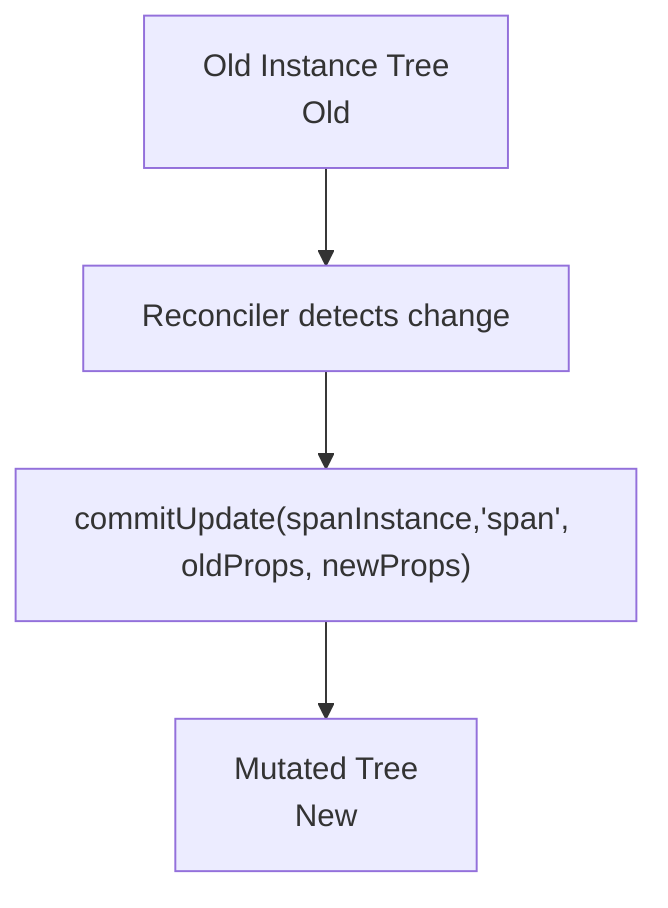
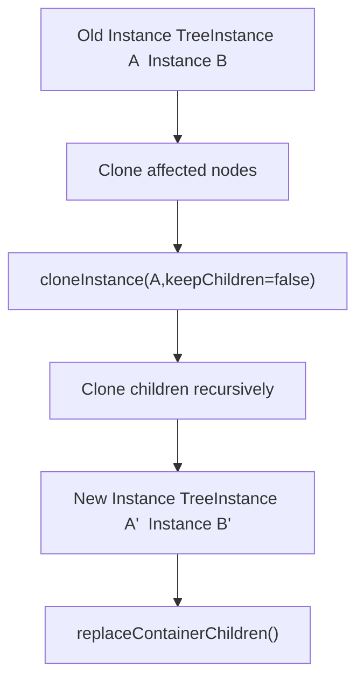
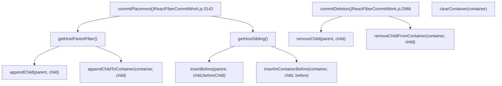
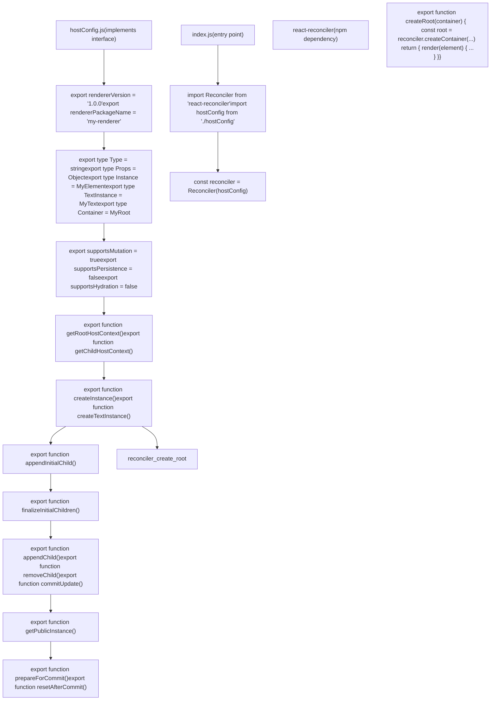

# 宿主配置抽象

相关源文件

-   [packages/react-art/src/ReactFiberConfigART.js](https://github.com/facebook/react/blob/65eec428/packages/react-art/src/ReactFiberConfigART.js)
-   [packages/react-client/src/ReactFlightPerformanceTrack.js](https://github.com/facebook/react/blob/65eec428/packages/react-client/src/ReactFlightPerformanceTrack.js)
-   [packages/react-debug-tools/src/ReactDebugHooks.js](https://github.com/facebook/react/blob/65eec428/packages/react-debug-tools/src/ReactDebugHooks.js)
-   [packages/react-debug-tools/src/\_\_tests\_\_/ReactHooksInspection-test.js](https://github.com/facebook/react/blob/65eec428/packages/react-debug-tools/src/__tests__/ReactHooksInspection-test.js)
-   [packages/react-debug-tools/src/\_\_tests\_\_/ReactHooksInspectionIntegration-test.js](https://github.com/facebook/react/blob/65eec428/packages/react-debug-tools/src/__tests__/ReactHooksInspectionIntegration-test.js)
-   [packages/react-debug-tools/src/\_\_tests\_\_/ReactHooksInspectionIntegrationDOM-test.js](https://github.com/facebook/react/blob/65eec428/packages/react-debug-tools/src/__tests__/ReactHooksInspectionIntegrationDOM-test.js)
-   [packages/react-devtools-shell/src/app/InspectableElements/CustomHooks.js](https://github.com/facebook/react/blob/65eec428/packages/react-devtools-shell/src/app/InspectableElements/CustomHooks.js)
-   [packages/react-devtools-timeline/src/content-views/utils/moduleFilters.js](https://github.com/facebook/react/blob/65eec428/packages/react-devtools-timeline/src/content-views/utils/moduleFilters.js)
-   [packages/react-dom-bindings/src/client/ReactFiberConfigDOM.js](https://github.com/facebook/react/blob/65eec428/packages/react-dom-bindings/src/client/ReactFiberConfigDOM.js)
-   [packages/react-dom/src/\_\_tests\_\_/ReactDOMFiberAsync-test.js](https://github.com/facebook/react/blob/65eec428/packages/react-dom/src/__tests__/ReactDOMFiberAsync-test.js)
-   [packages/react-dom/src/\_\_tests\_\_/ReactDOMNativeEventHeuristic-test.js](https://github.com/facebook/react/blob/65eec428/packages/react-dom/src/__tests__/ReactDOMNativeEventHeuristic-test.js)
-   [packages/react-dom/src/events/plugins/\_\_tests\_\_/ChangeEventPlugin-test.js](https://github.com/facebook/react/blob/65eec428/packages/react-dom/src/events/plugins/__tests__/ChangeEventPlugin-test.js)
-   [packages/react-dom/src/events/plugins/\_\_tests\_\_/SimpleEventPlugin-test.js](https://github.com/facebook/react/blob/65eec428/packages/react-dom/src/events/plugins/__tests__/SimpleEventPlugin-test.js)
-   [packages/react-native-renderer/src/ReactFiberConfigFabric.js](https://github.com/facebook/react/blob/65eec428/packages/react-native-renderer/src/ReactFiberConfigFabric.js)
-   [packages/react-native-renderer/src/ReactFiberConfigNative.js](https://github.com/facebook/react/blob/65eec428/packages/react-native-renderer/src/ReactFiberConfigNative.js)
-   [packages/react-noop-renderer/src/createReactNoop.js](https://github.com/facebook/react/blob/65eec428/packages/react-noop-renderer/src/createReactNoop.js)
-   [packages/react-reconciler/src/ReactFiber.js](https://github.com/facebook/react/blob/65eec428/packages/react-reconciler/src/ReactFiber.js)
-   [packages/react-reconciler/src/ReactFiberBeginWork.js](https://github.com/facebook/react/blob/65eec428/packages/react-reconciler/src/ReactFiberBeginWork.js)
-   [packages/react-reconciler/src/ReactFiberClassComponent.js](https://github.com/facebook/react/blob/65eec428/packages/react-reconciler/src/ReactFiberClassComponent.js)
-   [packages/react-reconciler/src/ReactFiberCommitWork.js](https://github.com/facebook/react/blob/65eec428/packages/react-reconciler/src/ReactFiberCommitWork.js)
-   [packages/react-reconciler/src/ReactFiberCompleteWork.js](https://github.com/facebook/react/blob/65eec428/packages/react-reconciler/src/ReactFiberCompleteWork.js)
-   [packages/react-reconciler/src/ReactFiberConfigWithNoMutation.js](https://github.com/facebook/react/blob/65eec428/packages/react-reconciler/src/ReactFiberConfigWithNoMutation.js)
-   [packages/react-reconciler/src/ReactFiberGestureScheduler.js](https://github.com/facebook/react/blob/65eec428/packages/react-reconciler/src/ReactFiberGestureScheduler.js)
-   [packages/react-reconciler/src/ReactFiberHooks.js](https://github.com/facebook/react/blob/65eec428/packages/react-reconciler/src/ReactFiberHooks.js)
-   [packages/react-reconciler/src/ReactFiberLane.js](https://github.com/facebook/react/blob/65eec428/packages/react-reconciler/src/ReactFiberLane.js)
-   [packages/react-reconciler/src/ReactFiberPerformanceTrack.js](https://github.com/facebook/react/blob/65eec428/packages/react-reconciler/src/ReactFiberPerformanceTrack.js)
-   [packages/react-reconciler/src/ReactFiberRootScheduler.js](https://github.com/facebook/react/blob/65eec428/packages/react-reconciler/src/ReactFiberRootScheduler.js)
-   [packages/react-reconciler/src/ReactFiberSuspenseComponent.js](https://github.com/facebook/react/blob/65eec428/packages/react-reconciler/src/ReactFiberSuspenseComponent.js)
-   [packages/react-reconciler/src/ReactFiberUnwindWork.js](https://github.com/facebook/react/blob/65eec428/packages/react-reconciler/src/ReactFiberUnwindWork.js)
-   [packages/react-reconciler/src/ReactFiberWorkLoop.js](https://github.com/facebook/react/blob/65eec428/packages/react-reconciler/src/ReactFiberWorkLoop.js)
-   [packages/react-reconciler/src/ReactProfilerTimer.js](https://github.com/facebook/react/blob/65eec428/packages/react-reconciler/src/ReactProfilerTimer.js)
-   [packages/react-reconciler/src/\_\_tests\_\_/ReactDeferredValue-test.js](https://github.com/facebook/react/blob/65eec428/packages/react-reconciler/src/__tests__/ReactDeferredValue-test.js)
-   [packages/react-reconciler/src/\_\_tests\_\_/ReactFiberHostContext-test.internal.js](https://github.com/facebook/react/blob/65eec428/packages/react-reconciler/src/__tests__/ReactFiberHostContext-test.internal.js)
-   [packages/react-reconciler/src/\_\_tests\_\_/ReactHooks-test.internal.js](https://github.com/facebook/react/blob/65eec428/packages/react-reconciler/src/__tests__/ReactHooks-test.internal.js)
-   [packages/react-reconciler/src/\_\_tests\_\_/ReactLazy-test.internal.js](https://github.com/facebook/react/blob/65eec428/packages/react-reconciler/src/__tests__/ReactLazy-test.internal.js)
-   [packages/react-reconciler/src/\_\_tests\_\_/ReactPerformanceTrack-test.js](https://github.com/facebook/react/blob/65eec428/packages/react-reconciler/src/__tests__/ReactPerformanceTrack-test.js)
-   [packages/react-reconciler/src/\_\_tests\_\_/ReactSiblingPrerendering-test.js](https://github.com/facebook/react/blob/65eec428/packages/react-reconciler/src/__tests__/ReactSiblingPrerendering-test.js)
-   [packages/react-reconciler/src/\_\_tests\_\_/ReactSuspense-test.internal.js](https://github.com/facebook/react/blob/65eec428/packages/react-reconciler/src/__tests__/ReactSuspense-test.internal.js)
-   [packages/react-reconciler/src/\_\_tests\_\_/ReactSuspensePlaceholder-test.internal.js](https://github.com/facebook/react/blob/65eec428/packages/react-reconciler/src/__tests__/ReactSuspensePlaceholder-test.internal.js)
-   [packages/react-reconciler/src/\_\_tests\_\_/ReactSuspenseyCommitPhase-test.js](https://github.com/facebook/react/blob/65eec428/packages/react-reconciler/src/__tests__/ReactSuspenseyCommitPhase-test.js)
-   [packages/react-reconciler/src/forks/ReactFiberConfig.custom.js](https://github.com/facebook/react/blob/65eec428/packages/react-reconciler/src/forks/ReactFiberConfig.custom.js)
-   [packages/react-server/src/ReactFlightAsyncSequence.js](https://github.com/facebook/react/blob/65eec428/packages/react-server/src/ReactFlightAsyncSequence.js)
-   [packages/react-server/src/ReactFlightServerConfigDebugNode.js](https://github.com/facebook/react/blob/65eec428/packages/react-server/src/ReactFlightServerConfigDebugNode.js)
-   [packages/react-server/src/ReactFlightServerConfigDebugNoop.js](https://github.com/facebook/react/blob/65eec428/packages/react-server/src/ReactFlightServerConfigDebugNoop.js)
-   [packages/react-server/src/ReactFlightStackConfigV8.js](https://github.com/facebook/react/blob/65eec428/packages/react-server/src/ReactFlightStackConfigV8.js)
-   [packages/react-server/src/\_\_tests\_\_/ReactFlightAsyncDebugInfo-test.js](https://github.com/facebook/react/blob/65eec428/packages/react-server/src/__tests__/ReactFlightAsyncDebugInfo-test.js)
-   [packages/react-test-renderer/src/ReactFiberConfigTestHost.js](https://github.com/facebook/react/blob/65eec428/packages/react-test-renderer/src/ReactFiberConfigTestHost.js)
-   [packages/react/src/ReactHooks.js](https://github.com/facebook/react/blob/65eec428/packages/react/src/ReactHooks.js)
-   [packages/react/src/ReactLazy.js](https://github.com/facebook/react/blob/65eec428/packages/react/src/ReactLazy.js)
-   [packages/react/src/\_\_tests\_\_/ReactProfiler-test.internal.js](https://github.com/facebook/react/blob/65eec428/packages/react/src/__tests__/ReactProfiler-test.internal.js)
-   [packages/shared/ReactPerformanceTrackProperties.js](https://github.com/facebook/react/blob/65eec428/packages/shared/ReactPerformanceTrackProperties.js)
-   [packages/shared/ReactSymbols.js](https://github.com/facebook/react/blob/65eec428/packages/shared/ReactSymbols.js)

宿主配置抽象 (Host Configuration Abstraction) 是 React Reconciler 与特定平台渲染目标之间的可插拔接口。它定义了允许 React 的核心协调算法保持平台无关性，同时支持 Web 浏览器 (DOM)、移动平台 (React Native)、Canvas 渲染 (ART) 和自定义渲染器等多种环境的契约。

关于 Reconciler 的工作循环和 Fiber 架构的信息，请参阅 [Fiber 架构与工作循环](/facebook/react/3.1-build-pipeline-and-module-forking)。关于特定渲染器实现的详细信息，请参阅 [React DOM](/facebook/react/4.1-fiber-architecture-and-data-structures) 和 [React Native 与其他渲染器](/facebook/react/4.2-work-loop-and-rendering-phases)。

## 架构概览

Reconciler 仅通过 `ReactFiberConfig` 中定义的宿主配置接口与宿主环境通信。在协调过程中，Reconciler 从不直接创建 DOM 节点、原生 UI 组件或任何平台特定的实例。相反，它在 Fiber 生命周期的特定点调用宿主配置方法。

**图表：Reconciler 中的宿主配置调用点**

```mermaid
flowchart TD
    beginWork["beginWork()ReactFiberBeginWork.js:2179"]
    completeWork["completeWork()ReactFiberCompleteWork.js:908"]
    commitMutationEffects["commitMutationEffectsOnFiber()ReactFiberCommitWork.js:2252"]
    commitLayoutEffects["commitLayoutEffectOnFiber()ReactFiberCommitWork.js:594"]
    getRootHostContext["getRootHostContext(container)"]
    getChildHostContext["getChildHostContext(parent, type)"]
    createInstance["createInstance(type, props, root,context, fiber)"]
    createTextInstance["createTextInstance(text, root,context, fiber)"]
    appendInitialChild["appendInitialChild(parent, child)"]
    finalizeInitialChildren["finalizeInitialChildren(instance,type, props)"]
    appendChild["appendChild(parent, child)"]
    commitUpdate["commitUpdate(instance, type,oldProps, newProps)"]
    commitTextUpdate["commitTextUpdate(text,oldText, newText)"]
    ReactFiberConfigDOM["ReactFiberConfigDOM.js(Web Browser)"]
    ReactFiberConfigFabric["ReactFiberConfigFabric.js(React Native Fabric)"]
    ReactFiberConfigNative["ReactFiberConfigNative.js(React Native Legacy)"]
    createReactNoop["createReactNoop.js(Test Renderer)"]

    beginWork --> getRootHostContext
    beginWork --> getChildHostContext
    completeWork --> createInstance
    completeWork --> createTextInstance
    completeWork --> appendInitialChild
    completeWork --> finalizeInitialChildren
    commitMutationEffects --> appendChild
    commitMutationEffects --> commitUpdate
    commitMutationEffects --> commitTextUpdate
    createInstance --> ReactFiberConfigDOM
    createInstance --> ReactFiberConfigFabric
    createInstance --> ReactFiberConfigNative
    createInstance --> createReactNoop
```


**来源：** [packages/react-reconciler/src/ReactFiberBeginWork.js174-186](https://github.com/facebook/react/blob/65eec428/packages/react-reconciler/src/ReactFiberBeginWork.js#L174-L186) [packages/react-reconciler/src/ReactFiberCompleteWork.js106-130](https://github.com/facebook/react/blob/65eec428/packages/react-reconciler/src/ReactFiberCompleteWork.js#L106-L130) [packages/react-reconciler/src/ReactFiberCommitWork.js156-186](https://github.com/facebook/react/blob/65eec428/packages/react-reconciler/src/ReactFiberCommitWork.js#L156-L186) [packages/react-reconciler/src/forks/ReactFiberConfig.custom.js1-50](https://github.com/facebook/react/blob/65eec428/packages/react-reconciler/src/forks/ReactFiberConfig.custom.js#L1-L50)

## 核心类型与契约

每个宿主配置必须导出一组不透明类型并实现特定方法。Reconciler 将这些类型视为黑盒，在宿主配置方法之间传递它们而不检查其内容。

### 必需的类型导出

每个宿主配置必须导出这些不透明类型。Reconciler 在宿主配置方法之间传递这些类型，而不检查其结构。

**图表：跨渲染器的类型定义**

```mermaid
flowchart TD
    Noop_Type["Type = string"]
    Noop_Props["Props = {prop, hidden,children, ...}"]
    Noop_Container["Container = {rootID, children,pendingChildren}"]
    Noop_Instance["Instance = {type, id, children,prop, hidden, ...}"]
    Noop_TextInstance["TextInstance = {text, id,hidden, ...}"]
    Noop_HostContext["HostContext = Object"]
    Fabric_Type["Type = string"]
    Fabric_Props["Props = Object"]
    Fabric_Container["Container = {containerTag,publicInstance}"]
    Fabric_Instance["Instance = {node, canonical}"]
    Fabric_TextInstance["TextInstance = {node}"]
    Fabric_HostContext["HostContext = null"]
    Fabric_UpdatePayload["UpdatePayload = Object"]
    DOM_Type["Type = string"]
    DOM_Props["Props = {...}"]
    DOM_Container["Container = Element | Document| DocumentFragment"]
    DOM_Instance["Instance = Element"]
    DOM_TextInstance["TextInstance = Text"]
    DOM_HostContext["HostContext = HostContextDev| HostContextProd"]
    DOM_UpdatePayload["UpdatePayload = Array<mixed>"]
```


| 类型导出 | 用途 | DOM 示例 | Fabric 示例 |
| --- | --- | --- | --- |
| `Type` | 元素类型标识符 | `'div'`, `'span'` | `'View'`, `'Text'` |
| `Props` | 传递给实例的属性 | `{className: 'foo'}` | `{style: {flex: 1}}` |
| `Container` | 根容器对象 | `HTMLElement`, `Document` | `{containerTag: number}` |
| `Instance` | 平台元素实例 | `HTMLDivElement` | `{node: Node, canonical: object}` |
| `TextInstance` | 平台文本节点 | `Text` | `{node: Node}` |
| `HostContext` | 向下传播的上下文 | `HostContextNamespace` enum | `null` |
| `UpdatePayload` | 更新差异有效载荷 | `[key1, val1, key2, val2]` | `{style: {...}}` |

**来源：** [packages/react-dom-bindings/src/client/ReactFiberConfigDOM.js153-251](https://github.com/facebook/react/blob/65eec428/packages/react-dom-bindings/src/client/ReactFiberConfigDOM.js#L153-L251) [packages/react-native-renderer/src/ReactFiberConfigFabric.js92-131](https://github.com/facebook/react/blob/65eec428/packages/react-native-renderer/src/ReactFiberConfigFabric.js#L92-L131) [packages/react-noop-renderer/src/createReactNoop.js44-78](https://github.com/facebook/react/blob/65eec428/packages/react-noop-renderer/src/createReactNoop.js#L44-L78)

## 突变 (Mutation) vs 持久化 (Persistence) 策略

宿主配置通过两个布尔标志声明其渲染策略：`supportsMutation` 和 `supportsPersistence`。这些策略决定了 Reconciler 如何将更改应用到宿主树。

### 突变策略

基于突变的渲染器就地修改实例。Reconciler 调用 `appendChild()`, `removeChild()` 和 `commitUpdate()` 等方法来突变现有的树结构。


**突变方法：**

-   `appendChild(parentInstance, child)` - 将子节点添加到父节点
-   `insertBefore(parentInstance, child, beforeChild)` - 在位置插入
-   `removeChild(parentInstance, child)` - 从父节点移除
-   `commitUpdate(instance, type, oldProps, newProps)` - 应用属性更改
-   `commitTextUpdate(textInstance, oldText, newText)` - 更新文本内容

**来源：** [packages/react-dom-bindings/src/client/ReactFiberConfigDOM.js806-955](https://github.com/facebook/react/blob/65eec428/packages/react-dom-bindings/src/client/ReactFiberConfigDOM.js#L806-L955) [packages/react-native-renderer/src/ReactFiberConfigNative.js377-467](https://github.com/facebook/react/blob/65eec428/packages/react-native-renderer/src/ReactFiberConfigNative.js#L377-L467)

### 持久化策略

基于持久化的渲染器创建不可变的实例树。当发生更改时，Reconciler 克隆受影响的节点并构建一个新的子树，然后原子地替换旧树。


**持久化方法：**

-   `cloneInstance(instance, type, oldProps, newProps, keepChildren, newChildSet)` - 创建带有更改的副本
-   `createContainerChildSet()` - 初始化用于批处理的集合
-   `appendChildToContainerChildSet(childSet, child)` - 添加到批处理
-   `finalizeContainerChildren(container, newChildren)` - 准备批处理
-   `replaceContainerChildren(container, newChildren)` - 原子替换

**来源：** [packages/react-native-renderer/src/ReactFiberConfigFabric.js445-557](https://github.com/facebook/react/blob/65eec428/packages/react-native-renderer/src/ReactFiberConfigFabric.js#L445-L557) [packages/react-noop-renderer/src/createReactNoop.js903-941](https://github.com/facebook/react/blob/65eec428/packages/react-noop-renderer/src/createReactNoop.js#L903-L941)

## 实例创建与初始化生命周期

Reconciler 通过多阶段生命周期创建宿主实例。每个阶段对应于在协调期间不同点调用的特定宿主配置方法。

> **[Mermaid sequence]**
> *(图表结构无法解析)*

### 上下文管理

宿主上下文向下流经树，允许父节点影响子节点的渲染。例如，DOM 渲染器跟踪 SVG 和 MathML 命名空间。

**DOM 上下文示例：**

-   根上下文决定初始命名空间
-   进入 `<svg>` 时，上下文变为 `HostContextNamespaceSvg`
-   子节点继承 SVG 命名空间以进行正确的 `createElementNS()` 调用
-   `<foreignObject>` 重置为默认命名空间

**来源：** [packages/react-dom-bindings/src/client/ReactFiberConfigDOM.js279-401](https://github.com/facebook/react/blob/65eec428/packages/react-dom-bindings/src/client/ReactFiberConfigDOM.js#L279-L401) [packages/react-native-renderer/src/ReactFiberConfigFabric.js255-287](https://github.com/facebook/react/blob/65eec428/packages/react-native-renderer/src/ReactFiberConfigFabric.js#L255-L287)

### 实例创建

`createInstance()` 方法是宿主元素的主要工厂。在 `completeWork()` 中调用，位于 [packages/react-reconciler/src/ReactFiberCompleteWork.js1019-1038](https://github.com/facebook/react/blob/65eec428/packages/react-reconciler/src/ReactFiberCompleteWork.js#L1019-L1038)。

**图表：createInstance() 实现模式**

```mermaid
flowchart TD
    Noop_create["createInstance(type, props,root, context, fiber)"]
    Noop_compute["computeText() ifshouldSetTextContent()"]
    Noop_object["Create instance object:{type, id, children, prop,hidden, text, context}"]
    Noop_return["return instance"]
    Fabric_create["createInstance(type, props,root, context, fiber)"]
    Fabric_tag["tag = instanceCounter++"]
    Fabric_config["viewConfig = getViewConfig(type)"]
    Fabric_payload["createAttributePayload(type,props, viewConfig)"]
    Fabric_native["FabricUIManager.createNode(tag, viewName, root, props, fiber)"]
    Fabric_obj["return {node, canonical}"]
    DOM_create["createInstance(type, props,root, context, fiber)"]
    DOM_namespace["Determine namespace fromhostContext"]
    DOM_createElement["ownerDocument.createElement(type)or createElementNS()"]
    DOM_cache["precacheFiberNode(fiber, element)"]
    DOM_props["updateFiberProps(element, props)"]
    DOM_init["setInitialProperties(element,type, props)"]
    DOM_return["return element"]

    Noop --> create_Noop_compute
    Noop --> compute_Noop_object
    Noop --> object_Noop_return
    Fabric --> create_Fabric_tag
    Fabric --> tag_Fabric_config
    Fabric --> config_Fabric_payload
    Fabric --> payload_Fabric_native
    Fabric --> native_Fabric_obj
    DOM --> create_DOM_namespace
    DOM --> namespace_DOM_createElement
    DOM --> createElement_DOM_cache
    DOM --> cache_DOM_props
    DOM --> props_DOM_init
    DOM --> init_DOM_return
```


**关键函数签名：**

**DOM:**

```
function createInstance(
  type: string,
  props: Props,
  rootContainerInstance: Container,
  hostContext: HostContext,
  internalInstanceHandle: Object,
): Instance
```
**Fabric:**

```
function createInstance(
  type: string,
  props: Props,
  rootContainerInstance: Container,
  hostContext: HostContext,
  internalInstanceHandle: Object,
): Instance // {node: Node, canonical: InstanceHandle}
```
**来源：** [packages/react-dom-bindings/src/client/ReactFiberConfigDOM.js484-603](https://github.com/facebook/react/blob/65eec428/packages/react-dom-bindings/src/client/ReactFiberConfigDOM.js#L484-L603) [packages/react-native-renderer/src/ReactFiberConfigFabric.js172-216](https://github.com/facebook/react/blob/65eec428/packages/react-native-renderer/src/ReactFiberConfigFabric.js#L172-L216) [packages/react-noop-renderer/src/createReactNoop.js399-457](https://github.com/facebook/react/blob/65eec428/packages/react-noop-renderer/src/createReactNoop.js#L399-L457)

### 子节点附加

在完成阶段，Reconciler 在树提交之前将子节点附加到其父节点。对于突变渲染器，这通常涉及直接的 DOM 操作。对于持久化渲染器，它构建克隆的树结构。

**来源：** [packages/react-dom-bindings/src/client/ReactFiberConfigDOM.js612-618](https://github.com/facebook/react/blob/65eec428/packages/react-dom-bindings/src/client/ReactFiberConfigDOM.js#L612-L618) [packages/react-native-renderer/src/ReactFiberConfigFabric.js163-168](https://github.com/facebook/react/blob/65eec428/packages/react-native-renderer/src/ReactFiberConfigFabric.js#L163-L168)

### 终结

`finalizeInitialChildren()` 方法执行提交前所需的任何最终设置。它返回一个布尔值，指示是否应在提交阶段调用 `commitMount()`。

**DOM 用例：**

-   对于带有 `autoFocus` 的 `<input>`, `<button>`, `<select>`, `<textarea>` 返回 `true`
-   对于 `` 返回 `true` 以设置加载事件处理
-   否则返回 `false`

**来源：** [packages/react-dom-bindings/src/client/ReactFiberConfigDOM.js620-638](https://github.com/facebook/react/blob/65eec428/packages/react-dom-bindings/src/client/ReactFiberConfigDOM.js#L620-L638) [packages/react-native-renderer/src/ReactFiberConfigFabric.js246-253](https://github.com/facebook/react/blob/65eec428/packages/react-native-renderer/src/ReactFiberConfigFabric.js#L246-L253)

## 提交阶段操作

渲染阶段完成后，Reconciler 将更改提交到宿主树。提交阶段由 [packages/react-reconciler/src/ReactFiberWorkLoop.js2845-3144](https://github.com/facebook/react/blob/65eec428/packages/react-reconciler/src/ReactFiberWorkLoop.js#L2845-L3144) 编排，并通过 `commitMutationEffects()` 和 `commitLayoutEffects()` 调用宿主配置方法。

### 更新与属性变更

当 props 发生变化时，Reconciler 从 [packages/react-reconciler/src/ReactFiberCommitWork.js2455-2460](https://github.com/facebook/react/blob/65eec428/packages/react-reconciler/src/ReactFiberCommitWork.js#L2455-L2460) 中的 `commitMutationEffectsOnFiber()` 调用 `commitUpdate()`。

**图表：commitUpdate() 调用流程**

> **[Mermaid sequence]**
> *(图表结构无法解析)*

**函数签名：**

**DOM ([ReactFiberConfigDOM.js912-925](https://github.com/facebook/react/blob/65eec428/ReactFiberConfigDOM.js#L912-L925)):**

```
function commitUpdate(
  domElement: Instance,
  type: Type,
  oldProps: Props,
  newProps: Props,
  internalInstanceHandle: Object,
): void
```
**Fabric ([ReactFiberConfigFabric.js299-322](https://github.com/facebook/react/blob/65eec428/ReactFiberConfigFabric.js#L299-L322)):**

```
function commitUpdate(
  instance: Instance,
  type: string,
  oldProps: Props,
  newProps: Props,
  internalInstanceHandle: Object,
): void
```
**来源：** [packages/react-reconciler/src/ReactFiberCommitWork.js2252-2530](https://github.com/facebook/react/blob/65eec428/packages/react-reconciler/src/ReactFiberCommitWork.js#L2252-L2530) [packages/react-dom-bindings/src/client/ReactFiberConfigDOM.js912-925](https://github.com/facebook/react/blob/65eec428/packages/react-dom-bindings/src/client/ReactFiberConfigDOM.js#L912-L925) [packages/react-native-renderer/src/ReactFiberConfigFabric.js299-322](https://github.com/facebook/react/blob/65eec428/packages/react-native-renderer/src/ReactFiberConfigFabric.js#L299-L322) [packages/react-native-renderer/src/ReactFiberConfigNative.js445-468](https://github.com/facebook/react/blob/65eec428/packages/react-native-renderer/src/ReactFiberConfigNative.js#L445-L468)

### 树结构突变

Reconciler 从 [packages/react-reconciler/src/ReactFiberCommitWork.js3142-3244](https://github.com/facebook/react/blob/65eec428/packages/react-reconciler/src/ReactFiberCommitWork.js#L3142-L3244) 中的 `commitPlacement()` 和 [packages/react-reconciler/src/ReactFiberCommitWork.js2966-3030](https://github.com/facebook/react/blob/65eec428/packages/react-reconciler/src/ReactFiberCommitWork.js#L2966-L3030) 中的 `commitDeletion()` 调用结构突变方法。

**图表：突变方法调用点**


**突变方法参考：**

| 方法 | 签名 (DOM) | 调用来源 | 用途 |
| --- | --- | --- | --- |
| `appendChild()` | `(parent: Instance, child: Instance) => void` | `commitPlacement()` | 追加到父节点末尾 |
| `appendChildToContainer()` | `(container: Container, child: Instance) => void` | `commitPlacement()` | 追加到容器根 |
| `insertBefore()` | `(parent: Instance, child: Instance, before: Instance) => void` | `commitPlacement()` | 插入到特定位置 |
| `insertInContainerBefore()` | `(container: Container, child: Instance, before: Instance) => void` | `commitPlacement()` | 插入到容器中 |
| `removeChild()` | `(parent: Instance, child: Instance) => void` | `commitDeletion()` | 从父节点移除 |
| `removeChildFromContainer()` | `(container: Container, child: Instance) => void` | `commitDeletion()` | 从容器移除 |
| `clearContainer()` | `(container: Container) => void` | `commitBeforeMutationEffects()` | 清除所有子节点 |

**来源：** [packages/react-reconciler/src/ReactFiberCommitWork.js2966-3244](https://github.com/facebook/react/blob/65eec428/packages/react-reconciler/src/ReactFiberCommitWork.js#L2966-L3244) [packages/react-dom-bindings/src/client/ReactFiberConfigDOM.js945-1087](https://github.com/facebook/react/blob/65eec428/packages/react-dom-bindings/src/client/ReactFiberConfigDOM.js#L945-L1087) [packages/react-noop-renderer/src/createReactNoop.js132-241](https://github.com/facebook/react/blob/65eec428/packages/react-noop-renderer/src/createReactNoop.js#L132-L241)

## 优先级与事件集成

宿主配置通过 [packages/react-dom-bindings/src/client/ReactDOMUpdatePriority.js1-50](https://github.com/facebook/react/blob/65eec428/packages/react-dom-bindings/src/client/ReactDOMUpdatePriority.js#L1-L50) 导出的优先级相关方法与 Reconciler 的调度系统集成。这些方法由 `requestUpdateLane()` 在 [packages/react-reconciler/src/ReactFiberWorkLoop.js792-836](https://github.com/facebook/react/blob/65eec428/packages/react-reconciler/src/ReactFiberWorkLoop.js#L792-L836) 中调用。

**图表：优先级解析流程**

> **[Mermaid sequence]**
> *(图表结构无法解析)*

**优先级 API 函数：**

| 函数 | DOM 实现 | Fabric 实现 | 用途 |
| --- | --- | --- | --- |
| `setCurrentUpdatePriority(priority)` | 设置 `currentUpdatePriority` 变量 | 设置 `currentUpdatePriority` 变量 | 覆盖事件分发的优先级 |
| `getCurrentUpdatePriority()` | 返回 `currentUpdatePriority` | 返回 `currentUpdatePriority` | 获取当前覆盖 |
| `resolveUpdatePriority()` | 映射 `window.event.type` 到优先级 | 调用 `fabricGetCurrentEventPriority()` | 解析默认优先级 |

**DOM resolveUpdatePriority() ([ReactDOMUpdatePriority.js23-38](https://github.com/facebook/react/blob/65eec428/ReactDOMUpdatePriority.js#L23-L38)):**

-   如果设置了 `currentUpdatePriority` 则返回它
-   否则检查 `window.event.type`：
    -   `'click'`, `'keydown'` 等 → `DiscreteEventPriority`
    -   `'drag'`, `'scroll'` 等 → `ContinuousEventPriority`
    -   默认 → `DefaultEventPriority`

**Fabric resolveUpdatePriority() ([ReactFiberConfigFabric.js382-415](https://github.com/facebook/react/blob/65eec428/ReactFiberConfigFabric.js#L382-L415)):**

-   如果设置了 `currentUpdatePriority` 则返回它
-   否则调用原生 `fabricGetCurrentEventPriority()`：
    -   `FabricDiscretePriority` → `DiscreteEventPriority`
    -   `FabricContinuousPriority` → `ContinuousEventPriority`
    -   `FabricDefaultPriority` → `DefaultEventPriority`
    -   `FabricIdlePriority` → `IdleEventPriority`

**来源：** [packages/react-dom-bindings/src/client/ReactDOMUpdatePriority.js1-50](https://github.com/facebook/react/blob/65eec428/packages/react-dom-bindings/src/client/ReactDOMUpdatePriority.js#L1-L50) [packages/react-native-renderer/src/ReactFiberConfigFabric.js382-415](https://github.com/facebook/react/blob/65eec428/packages/react-native-renderer/src/ReactFiberConfigFabric.js#L382-L415) [packages/react-reconciler/src/ReactFiberWorkLoop.js792-836](https://github.com/facebook/react/blob/65eec428/packages/react-reconciler/src/ReactFiberWorkLoop.js#L792-L836) [packages/react-reconciler/src/ReactEventPriorities.js1-100](https://github.com/facebook/react/blob/65eec428/packages/react-reconciler/src/ReactEventPriorities.js#L1-L100)

## 提交生命周期钩子

宿主配置可以通过生命周期钩子在提交操作前后执行设置和清理。

### 提交前钩子

`prepareForCommit(containerInfo)` 在任何提交工作开始之前调用。它应返回 `resetAfterCommit()` 所需的任何状态。

**DOM 用途：**

-   禁用事件分发
-   保存选择信息（焦点元素，选择范围）
-   返回活动实例用于模糊处理

**来源：** [packages/react-dom-bindings/src/client/ReactFiberConfigDOM.js407-419](https://github.com/facebook/react/blob/65eec428/packages/react-dom-bindings/src/client/ReactFiberConfigDOM.js#L407-L419)

### 提交后钩子

`resetAfterCommit(containerInfo)` 在所有提交工作完成后调用。

**DOM 用途：**

-   恢复文本选择和焦点
-   重新启用事件分发
-   清理临时状态

**来源：** [packages/react-dom-bindings/src/client/ReactFiberConfigDOM.js440-445](https://github.com/facebook/react/blob/65eec428/packages/react-dom-bindings/src/client/ReactFiberConfigDOM.js#L440-L445)

## 渲染器实现比较

不同的渲染器根据其平台约束采用不同的策略实现宿主配置契约。

### 实现策略矩阵

| 渲染器 | 策略 | supportsMutation | supportsPersistence | 主要用例 |
| --- | --- | --- | --- | --- |
| ReactDOM | 突变 | `true` | `false` | Web 浏览器 |
| ReactFabric | 持久化 | `false` | `true` | React Native (新架构) |
| ReactNative | 突变 | `true` | `false` | React Native (旧版) |
| ReactNoop | 两者 | 可配置 | 可配置 | 测试 |
| ReactART | 突变 | `true` | `false` | Canvas 渲染 |
| TestRenderer | 突变 | `true` | `false` | 单元测试 |

**来源：** [packages/react-dom-bindings/src/client/ReactFiberConfigDOM.js806](https://github.com/facebook/react/blob/65eec428/packages/react-dom-bindings/src/client/ReactFiberConfigDOM.js#L806-L806) [packages/react-native-renderer/src/ReactFiberConfigFabric.js445](https://github.com/facebook/react/blob/65eec428/packages/react-native-renderer/src/ReactFiberConfigFabric.js#L445-L445) [packages/react-native-renderer/src/ReactFiberConfigNative.js377](https://github.com/facebook/react/blob/65eec428/packages/react-native-renderer/src/ReactFiberConfigNative.js#L377-L377)

### 平台特定的实例类型

```mermaid
flowchart TD
    TestInstance["Instance = { type, props, children, tag }"]
    TestText["TextInstance = { text, isHidden, tag }"]
    TestContainer["Container = { children, createNodeMock, tag }"]
    NativeInstance["Instance = ReactNativeFiberHostComponent"]
    NativeText["TextInstance = number (tag)"]
    NativeContainer["Container = { containerTag, publicInstance }"]
    FabricInstance["Instance = { node, canonical }"]
    FabricText["TextInstance = { node }"]
    FabricContainer["Container = { containerTag, publicInstance }"]
    DOMInstance["Instance = Element"]
    DOMText["TextInstance = Text"]
    DOMContainer["Container = Element | Document"]
```


**来源：** [packages/react-dom-bindings/src/client/ReactFiberConfigDOM.js210-215](https://github.com/facebook/react/blob/65eec428/packages/react-dom-bindings/src/client/ReactFiberConfigDOM.js#L210-L215) [packages/react-native-renderer/src/ReactFiberConfigFabric.js94-126](https://github.com/facebook/react/blob/65eec428/packages/react-native-renderer/src/ReactFiberConfigFabric.js#L94-L126) [packages/react-native-renderer/src/ReactFiberConfigNative.js61-68](https://github.com/facebook/react/blob/65eec428/packages/react-native-renderer/src/ReactFiberConfigNative.js#L61-L68) [packages/react-test-renderer/src/ReactFiberConfigTestHost.js28-46](https://github.com/facebook/react/blob/65eec428/packages/react-test-renderer/src/ReactFiberConfigTestHost.js#L28-L46)

## 自定义渲染器集成

第三方开发者可以通过安装 `react-reconciler` 并实现宿主配置接口来创建自定义渲染器。Reconciler 通过 [packages/react-reconciler/src/forks/ReactFiberConfig.custom.js1-285](https://github.com/facebook/react/blob/65eec428/packages/react-reconciler/src/forks/ReactFiberConfig.custom.js#L1-L285) 导入宿主配置方法。

### 自定义宿主配置模板

`ReactFiberConfig.custom.js` 文件充当垫片 (shim)，重新导出用户提供的宿主配置对象。自定义渲染器必须提供一个导出了所有必需宿主配置方法的模块。

**图表：自定义渲染器模块结构**


**必需的方法导出：**

**核心实例生命周期：**

-   `createInstance(type, props, rootContainer, hostContext, fiber): Instance`
-   `createTextInstance(text, rootContainer, hostContext, fiber): TextInstance`
-   `appendInitialChild(parent, child): void`
-   `finalizeInitialChildren(instance, type, props, rootContainer, hostContext): boolean`

**上下文管理：**

-   `getRootHostContext(rootContainer): HostContext`
-   `getChildHostContext(parentContext, type, rootContainer): HostContext`

**公共 API：**

-   `getPublicInstance(instance): PublicInstance`

**提交生命周期：**

-   `prepareForCommit(containerInfo): Object | null`
-   `resetAfterCommit(containerInfo): void`

**突变策略 (如果 `supportsMutation === true`):**

-   `appendChild(parent, child): void`
-   `appendChildToContainer(container, child): void`
-   `insertBefore(parent, child, beforeChild): void`
-   `removeChild(parent, child): void`
-   `removeChildFromContainer(container, child): void`
-   `commitUpdate(instance, updatePayload, type, prevProps, nextProps, fiber): void`
-   `commitTextUpdate(textInstance, oldText, newText): void`

**持久化策略 (如果 `supportsPersistence === true`):**

-   `cloneInstance(instance, type, oldProps, newProps, keepChildren, children): Instance`
-   `createContainerChildSet(container): ChildSet`
-   `appendChildToContainerChildSet(childSet, child): void`
-   `finalizeContainerChildren(container, newChildren): void`
-   `replaceContainerChildren(container, newChildren): void`

**来源：** [packages/react-reconciler/src/forks/ReactFiberConfig.custom.js1-285](https://github.com/facebook/react/blob/65eec428/packages/react-reconciler/src/forks/ReactFiberConfig.custom.js#L1-L285) [packages/react-noop-renderer/src/createReactNoop.js111-1055](https://github.com/facebook/react/blob/65eec428/packages/react-noop-renderer/src/createReactNoop.js#L111-1055)

### 可选特性模块

不支持某些特性的渲染器可以重新导出存根模块：

**无突变支持：**

```
export * from 'react-reconciler/src/ReactFiberConfigWithNoMutation';
```
**无水合支持：**

```
export * from 'react-reconciler/src/ReactFiberConfigWithNoHydration';
```
**无持久化支持：**

```
export * from 'react-reconciler/src/ReactFiberConfigWithNoPersistence';
```
这些模块导出在被调用时抛出错误的函数，确保在运行时捕获错误使用。

**来源：** [packages/react-reconciler/src/ReactFiberConfigWithNoMutation.js1-61](https://github.com/facebook/react/blob/65eec428/packages/react-reconciler/src/ReactFiberConfigWithNoMutation.js#L1-L61) [packages/react-native-renderer/src/ReactFiberConfigFabric.js156-162](https://github.com/facebook/react/blob/65eec428/packages/react-native-renderer/src/ReactFiberConfigFabric.js#L156-L162)

## 可见性与离屏 (Offscreen) 处理

宿主配置提供用于隐藏和取消隐藏实例的方法，由 Offscreen 组件和 Suspense 边界使用。

### 隐藏/取消隐藏契约

> **[Mermaid sequence]**
> *(图表结构无法解析)*

**DOM 实现：**

-   `hideInstance()` - 设置 `display: none` 样式
-   `unhideInstance()` - 从 props 恢复样式（遵循 `hidden` prop）

**Fabric 实现：**

-   `cloneHiddenInstance()` - 在 payload 中克隆带有 `display: none` 样式的实例
-   持久化策略：使用隐藏样式创建新节点

**来源：** [packages/react-dom-bindings/src/client/ReactFiberConfigDOM.js1135-1173](https://github.com/facebook/react/blob/65eec428/packages/react-dom-bindings/src/client/ReactFiberConfigDOM.js#L1135-L1173) [packages/react-native-renderer/src/ReactFiberConfigFabric.js502-517](https://github.com/facebook/react/blob/65eec428/packages/react-native-renderer/src/ReactFiberConfigFabric.js#L502-L517)

## 高级特性

### Suspenseful Commit

一些渲染器支持暂停提交阶段以等待资源加载（例如，图像、字体）。

**Suspenseful Commit 流程：**

```
maySuspendCommit(type, props) → boolean
  ↓
preloadInstance(instance, type, props) → boolean (isReady)
  ↓
If not ready:
  startSuspendingCommit() → SuspendedState
  suspendInstance(state, instance, type, props)
  waitForCommitToBeReady(state, timeout) → callback
  ↓
When ready: callback is invoked, commit proceeds
```
**来源：** [packages/react-noop-renderer/src/createReactNoop.js618-703](https://github.com/facebook/react/blob/65eec428/packages/react-noop-renderer/src/createReactNoop.js#L618-L703)

### 视图过渡 (View Transitions)

DOM 渲染器通过宿主配置方法支持 View Transitions API。

**视图过渡方法：**

-   `applyViewTransitionName()` - 将过渡名称应用到实例
-   `startViewTransition()` - 开始过渡并带有回调
-   `measureInstance()` - 捕获元素几何形状
-   `stopViewTransition()` - 取消正在运行的过渡

**来源：** [packages/react-dom-bindings/src/client/ReactFiberConfigDOM.js1175-1372](https://github.com/facebook/react/blob/65eec428/packages/react-dom-bindings/src/client/ReactFiberConfigDOM.js#L1175-L1372)

### 片段实例 (Fragment Instances)

一些渲染器提供片段实例，在片段（没有父级的元素组）上暴露 API。

**片段 API 模式：**

```
export function createFragmentInstance(fragmentFiber) {
  return new FragmentInstance(fragmentFiber);
}

FragmentInstance.prototype.compareDocumentPosition = function(otherNode) {
  // Compare position with another node
}

FragmentInstance.prototype.observeUsing = function(observer) {
  // Attach IntersectionObserver to fragment children
}
```
**来源：** [packages/react-native-renderer/src/ReactFiberConfigFabric.js654-831](https://github.com/facebook/react/blob/65eec428/packages/react-native-renderer/src/ReactFiberConfigFabric.js#L654-L831)

## Hooks 测试与调试

### DevTools 集成

宿主配置可以通过 `extraDevToolsConfig` 提供调试元数据：

```
export const extraDevToolsConfig = {
  getInspectorDataForInstance,
  getInspectorDataForViewTag,
  getInspectorDataForViewAtPoint,
};
```
**来源：** [packages/react-native-renderer/src/ReactFiberConfigFabric.js76-80](https://github.com/facebook/react/blob/65eec428/packages/react-native-renderer/src/ReactFiberConfigFabric.js#L76-L80)

### 测试选择器

渲染器可以实现测试选择器 API 以便在测试中查询已渲染的元素：

```
export const supportsTestSelectors = true;
export function findFiberRoot(node) { /* ... */ }
export function getBoundingRect(node) { /* ... */ }
export function matchAccessibilityRole(node, role) { /* ... */ }
```
**来源：** [packages/react-reconciler/src/forks/ReactFiberConfig.custom.js119-127](https://github.com/facebook/react/blob/65eec428/packages/react-reconciler/src/forks/ReactFiberConfig.custom.js#L119-L127)
