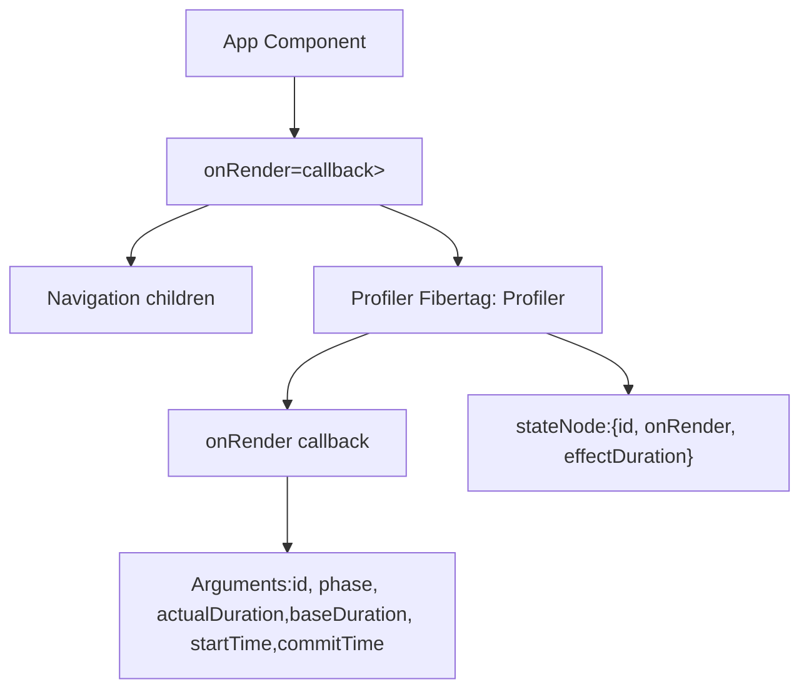
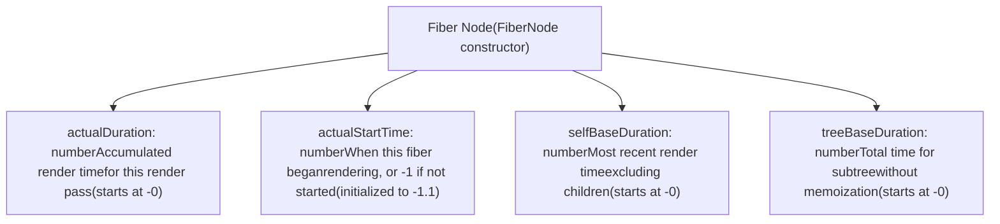
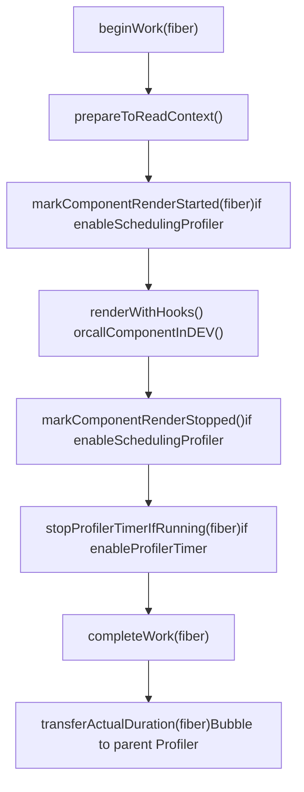
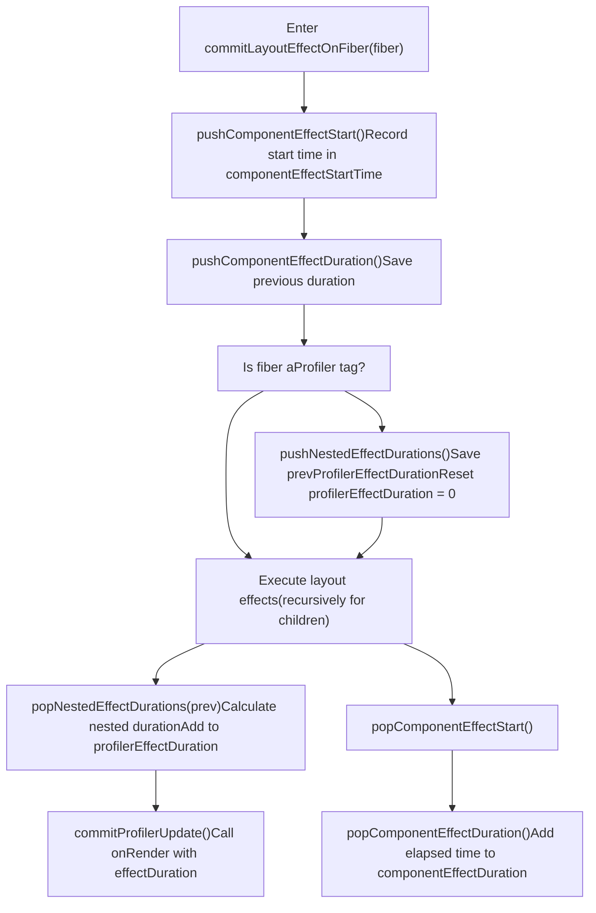
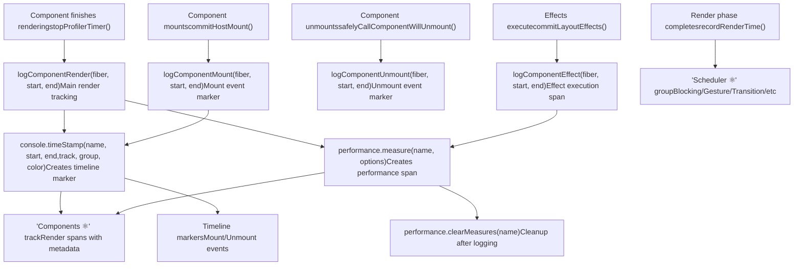
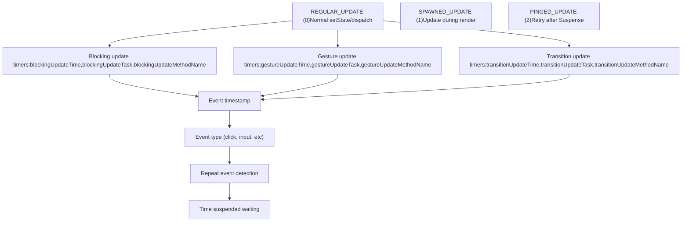
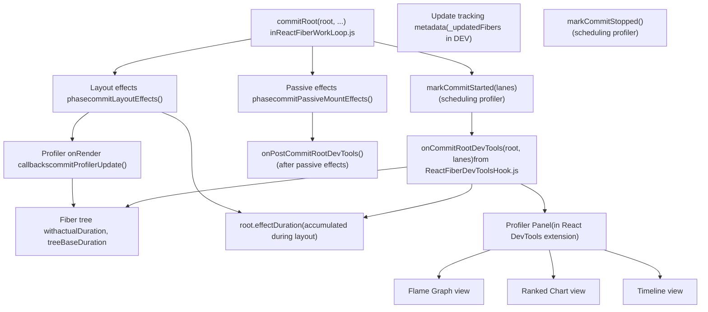

# 性能分析与性能追踪

相关源文件

-   [packages/react-client/src/ReactFlightPerformanceTrack.js](https://github.com/facebook/react/blob/65eec428/packages/react-client/src/ReactFlightPerformanceTrack.js)
-   [packages/react-debug-tools/src/ReactDebugHooks.js](https://github.com/facebook/react/blob/65eec428/packages/react-debug-tools/src/ReactDebugHooks.js)
-   [packages/react-debug-tools/src/\_\_tests\_\_/ReactHooksInspection-test.js](https://github.com/facebook/react/blob/65eec428/packages/react-debug-tools/src/__tests__/ReactHooksInspection-test.js)
-   [packages/react-debug-tools/src/\_\_tests\_\_/ReactHooksInspectionIntegration-test.js](https://github.com/facebook/react/blob/65eec428/packages/react-debug-tools/src/__tests__/ReactHooksInspectionIntegration-test.js)
-   [packages/react-debug-tools/src/\_\_tests\_\_/ReactHooksInspectionIntegrationDOM-test.js](https://github.com/facebook/react/blob/65eec428/packages/react-debug-tools/src/__tests__/ReactHooksInspectionIntegrationDOM-test.js)
-   [packages/react-devtools-shell/src/app/InspectableElements/CustomHooks.js](https://github.com/facebook/react/blob/65eec428/packages/react-devtools-shell/src/app/InspectableElements/CustomHooks.js)
-   [packages/react-devtools-timeline/src/content-views/utils/moduleFilters.js](https://github.com/facebook/react/blob/65eec428/packages/react-devtools-timeline/src/content-views/utils/moduleFilters.js)
-   [packages/react-dom/src/\_\_tests\_\_/ReactDOMFiberAsync-test.js](https://github.com/facebook/react/blob/65eec428/packages/react-dom/src/__tests__/ReactDOMFiberAsync-test.js)
-   [packages/react-dom/src/\_\_tests\_\_/ReactDOMNativeEventHeuristic-test.js](https://github.com/facebook/react/blob/65eec428/packages/react-dom/src/__tests__/ReactDOMNativeEventHeuristic-test.js)
-   [packages/react-dom/src/events/plugins/\_\_tests\_\_/ChangeEventPlugin-test.js](https://github.com/facebook/react/blob/65eec428/packages/react-dom/src/events/plugins/__tests__/ChangeEventPlugin-test.js)
-   [packages/react-dom/src/events/plugins/\_\_tests\_\_/SimpleEventPlugin-test.js](https://github.com/facebook/react/blob/65eec428/packages/react-dom/src/events/plugins/__tests__/SimpleEventPlugin-test.js)
-   [packages/react-reconciler/src/ReactFiber.js](https://github.com/facebook/react/blob/65eec428/packages/react-reconciler/src/ReactFiber.js)
-   [packages/react-reconciler/src/ReactFiberBeginWork.js](https://github.com/facebook/react/blob/65eec428/packages/react-reconciler/src/ReactFiberBeginWork.js)
-   [packages/react-reconciler/src/ReactFiberClassComponent.js](https://github.com/facebook/react/blob/65eec428/packages/react-reconciler/src/ReactFiberClassComponent.js)
-   [packages/react-reconciler/src/ReactFiberCommitWork.js](https://github.com/facebook/react/blob/65eec428/packages/react-reconciler/src/ReactFiberCommitWork.js)
-   [packages/react-reconciler/src/ReactFiberCompleteWork.js](https://github.com/facebook/react/blob/65eec428/packages/react-reconciler/src/ReactFiberCompleteWork.js)
-   [packages/react-reconciler/src/ReactFiberHooks.js](https://github.com/facebook/react/blob/65eec428/packages/react-reconciler/src/ReactFiberHooks.js)
-   [packages/react-reconciler/src/ReactFiberLane.js](https://github.com/facebook/react/blob/65eec428/packages/react-reconciler/src/ReactFiberLane.js)
-   [packages/react-reconciler/src/ReactFiberPerformanceTrack.js](https://github.com/facebook/react/blob/65eec428/packages/react-reconciler/src/ReactFiberPerformanceTrack.js)
-   [packages/react-reconciler/src/ReactFiberRootScheduler.js](https://github.com/facebook/react/blob/65eec428/packages/react-reconciler/src/ReactFiberRootScheduler.js)
-   [packages/react-reconciler/src/ReactFiberSuspenseComponent.js](https://github.com/facebook/react/blob/65eec428/packages/react-reconciler/src/ReactFiberSuspenseComponent.js)
-   [packages/react-reconciler/src/ReactFiberUnwindWork.js](https://github.com/facebook/react/blob/65eec428/packages/react-reconciler/src/ReactFiberUnwindWork.js)
-   [packages/react-reconciler/src/ReactFiberWorkLoop.js](https://github.com/facebook/react/blob/65eec428/packages/react-reconciler/src/ReactFiberWorkLoop.js)
-   [packages/react-reconciler/src/ReactInternalTypes.js](https://github.com/facebook/react/blob/65eec428/packages/react-reconciler/src/ReactInternalTypes.js)
-   [packages/react-reconciler/src/ReactProfilerTimer.js](https://github.com/facebook/react/blob/65eec428/packages/react-reconciler/src/ReactProfilerTimer.js)
-   [packages/react-reconciler/src/\_\_tests\_\_/ReactDeferredValue-test.js](https://github.com/facebook/react/blob/65eec428/packages/react-reconciler/src/__tests__/ReactDeferredValue-test.js)
-   [packages/react-reconciler/src/\_\_tests\_\_/ReactHooks-test.internal.js](https://github.com/facebook/react/blob/65eec428/packages/react-reconciler/src/__tests__/ReactHooks-test.internal.js)
-   [packages/react-reconciler/src/\_\_tests\_\_/ReactHooksWithNoopRenderer-test.js](https://github.com/facebook/react/blob/65eec428/packages/react-reconciler/src/__tests__/ReactHooksWithNoopRenderer-test.js)
-   [packages/react-reconciler/src/\_\_tests\_\_/ReactLazy-test.internal.js](https://github.com/facebook/react/blob/65eec428/packages/react-reconciler/src/__tests__/ReactLazy-test.internal.js)
-   [packages/react-reconciler/src/\_\_tests\_\_/ReactPerformanceTrack-test.js](https://github.com/facebook/react/blob/65eec428/packages/react-reconciler/src/__tests__/ReactPerformanceTrack-test.js)
-   [packages/react-reconciler/src/\_\_tests\_\_/ReactSiblingPrerendering-test.js](https://github.com/facebook/react/blob/65eec428/packages/react-reconciler/src/__tests__/ReactSiblingPrerendering-test.js)
-   [packages/react-reconciler/src/\_\_tests\_\_/ReactSuspense-test.internal.js](https://github.com/facebook/react/blob/65eec428/packages/react-reconciler/src/__tests__/ReactSuspense-test.internal.js)
-   [packages/react-reconciler/src/\_\_tests\_\_/ReactSuspensePlaceholder-test.internal.js](https://github.com/facebook/react/blob/65eec428/packages/react-reconciler/src/__tests__/ReactSuspensePlaceholder-test.internal.js)
-   [packages/react-reconciler/src/\_\_tests\_\_/ReactSuspenseWithNoopRenderer-test.js](https://github.com/facebook/react/blob/65eec428/packages/react-reconciler/src/__tests__/ReactSuspenseWithNoopRenderer-test.js)
-   [packages/react-reconciler/src/\_\_tests\_\_/ReactSuspenseyCommitPhase-test.js](https://github.com/facebook/react/blob/65eec428/packages/react-reconciler/src/__tests__/ReactSuspenseyCommitPhase-test.js)
-   [packages/react-server/src/ReactFlightAsyncSequence.js](https://github.com/facebook/react/blob/65eec428/packages/react-server/src/ReactFlightAsyncSequence.js)
-   [packages/react-server/src/ReactFlightServerConfigDebugNode.js](https://github.com/facebook/react/blob/65eec428/packages/react-server/src/ReactFlightServerConfigDebugNode.js)
-   [packages/react-server/src/ReactFlightServerConfigDebugNoop.js](https://github.com/facebook/react/blob/65eec428/packages/react-server/src/ReactFlightServerConfigDebugNoop.js)
-   [packages/react-server/src/ReactFlightStackConfigV8.js](https://github.com/facebook/react/blob/65eec428/packages/react-server/src/ReactFlightStackConfigV8.js)
-   [packages/react-server/src/\_\_tests\_\_/ReactFlightAsyncDebugInfo-test.js](https://github.com/facebook/react/blob/65eec428/packages/react-server/src/__tests__/ReactFlightAsyncDebugInfo-test.js)
-   [packages/react/src/ReactHooks.js](https://github.com/facebook/react/blob/65eec428/packages/react/src/ReactHooks.js)
-   [packages/react/src/ReactLazy.js](https://github.com/facebook/react/blob/65eec428/packages/react/src/ReactLazy.js)
-   [packages/react/src/\_\_tests\_\_/ReactProfiler-test.internal.js](https://github.com/facebook/react/blob/65eec428/packages/react/src/__tests__/ReactProfiler-test.internal.js)
-   [packages/shared/ReactPerformanceTrackProperties.js](https://github.com/facebook/react/blob/65eec428/packages/shared/ReactPerformanceTrackProperties.js)
-   [packages/shared/ReactSymbols.js](https://github.com/facebook/react/blob/65eec428/packages/shared/ReactSymbols.js)

## 目的与范围

性能分析系统提供了通过四种关键机制来测量 React 组件渲染性能的工具：

1.  **Profiler 组件** - 用于程序化性能监控的公共 `<Profiler>` API
2.  **性能测量** - `actualDuration` 和 `baseDuration` 字段跟踪渲染时间
3.  **组件 Effect 追踪** - 在 Profiler 边界内测量 effect 执行时间
4.  **浏览器 DevTools 集成** - `performance.measure()` 和 `console.timeStamp()` 集成，用于可视化性能分析

该系统通过 Profiler 组件实现运行时性能回调，并通过浏览器性能时间轴和 React DevTools 实现离线分析。

关于 DevTools 性能分析界面的信息，请参阅第 7.1 页。关于决定更新优先级的基于车道的调度，请参阅第 4.4 页。

---

## 系统架构

性能分析系统在 React 协调和提交生命周期的多个阶段运行：

```mermaid
flowchart TD
    ProfilerComponent["Componentwith onRender callback"]
    ActualDuration["actualDurationTime spent rendering"]
    ActualStartTime["actualStartTimeWhen render began"]
    SelfBaseDuration["selfBaseDurationComponent time only"]
    TreeBaseDuration["treeBaseDurationIncluding children"]
    StartProfilerTimer["startProfilerTimer()Begin timing"]
    StopProfilerTimer["stopProfilerTimerIfRunning()End timing"]
    RecordRenderTime["recordRenderTime()Track render duration"]
    RecordCommitTime["recordCommitTime()Track commit duration"]
    MarkRenderStarted["markComponentRenderStarted()BeginWork hooks"]
    MarkRenderStopped["markComponentRenderStopped()After component render"]
    TransferDuration["transferActualDuration()Bubble up times"]
    CommitProfilerUpdate["commitProfilerUpdate()Layout effects"]
    PushEffectDurations["pushNestedEffectDurations()Track effect times"]
    PopEffectDurations["popNestedEffectDurations()Bubble effect times"]
    LogComponentRender["logComponentRender()Browser timeline"]
    LogComponentMount["logComponentMount()"]
    LogComponentEffect["logComponentEffect()"]
    ConsoleTimeStamp["console.timeStamp()"]
    PerformanceMeasure["performance.measure()"]

    ProfilerComponent --> ActualDuration
    ProfilerComponent --> TreeBaseDuration
    StartProfilerTimer --> ActualStartTime
    StopProfilerTimer --> ActualDuration
    MarkRenderStarted --> StartProfilerTimer
    MarkRenderStopped --> StopProfilerTimer
    TransferDuration --> TreeBaseDuration
    CommitProfilerUpdate --> PushEffectDurations
    CommitProfilerUpdate --> PopEffectDurations
    LogComponentRender --> ConsoleTimeStamp
    LogComponentRender --> PerformanceMeasure
    LogComponentMount --> ConsoleTimeStamp
    LogComponentEffect --> PerformanceMeasure
    RecordRenderTime --> LogComponentRender
    RecordCommitTime --> CommitProfilerUpdate
```


**来源：** [packages/react-reconciler/src/ReactProfilerTimer.js1-700](https://github.com/facebook/react/blob/65eec428/packages/react-reconciler/src/ReactProfilerTimer.js#L1-L700) [packages/react-reconciler/src/ReactFiberPerformanceTrack.js1-600](https://github.com/facebook/react/blob/65eec428/packages/react-reconciler/src/ReactFiberPerformanceTrack.js#L1-L600)

---

## Profiler 组件 API

公共 `<Profiler>` 组件允许以编程方式测量渲染成本：


### 回调签名

`onRender` 回调接收 `commitProfilerUpdate` 中定义的六个参数：

| 参数 | 类型 | 描述 |
| --- | --- | --- |
| `id` | string | Profiler 的唯一标识符 |
| `phase` | "mount" | "update" | "nested-update" | 渲染阶段类型 |
| `actualDuration` | number | 渲染此更新花费的时间 (ms) |
| `baseDuration` | number | 没有记忆化优化的总渲染时间 (ms) |
| `startTime` | number | React 开始渲染的时间 (距离页面加载的 ms) |
| `commitTime` | number | React 提交更新的时间 (距离页面加载的 ms) |

回调通过 `commitProfilerUpdate` 在布局 effects 阶段被调用。当 `enableProfilerCommitHooks` 启用时，回调在布局 effects 之后、被动 effects 之前同步调用。

**测试示例：**

```
// 验证回调参数的测试
<Profiler id="test" onRender={callback}>
  <AdvanceTime />
</Profiler>

// callback 接收：
// id: 'test'
// phase: 'mount'
// actualDuration: 10  // 此次渲染花费的时间
// baseDuration: 10    // 没有 memo 优化的时间
// startTime: 5        // 渲染开始时间
// commitTime: 15      // 提交完成时间
```
**来源：** [packages/react/src/\_\_tests\_\_/ReactProfiler-test.internal.js287-360](https://github.com/facebook/react/blob/65eec428/packages/react/src/__tests__/ReactProfiler-test.internal.js#L287-L360) [packages/react-reconciler/src/ReactFiberCommitEffects.js350-380](https://github.com/facebook/react/blob/65eec428/packages/react-reconciler/src/ReactFiberCommitEffects.js#L350-L380) [packages/react-reconciler/src/ReactFiberCommitWork.js699-734](https://github.com/facebook/react/blob/65eec428/packages/react-reconciler/src/ReactFiberCommitWork.js#L699-L734)

---

## 内部计时基础设施

### Fiber 计时字段

当 `enableProfilerTimer` 启用时，每个 fiber 维护四个计时相关字段。这些字段在 `FiberNode` 构造函数中初始化：


**字段语义：**

-   **`actualDuration`**：累积在当前 work-in-progress 期间渲染所花费的时间。由 `stopProfilerTimerIfRunningAndRecordDuration` 更新。
-   **`actualStartTime`**：由 `startProfilerTimer` 在渲染开始时设置。-1 值表示该 fiber 在此过程中尚未开始渲染。
-   **`selfBaseDuration`**：仅此组件的时间，不包括子组件。在 `completeWork` 期间计算。
-   **`treeBaseDuration`**：如果没有任何内容被记忆化，包括所有子组件的估计总时间。通过 `transferActualDuration` 向上冒泡。

这些字段使用 double 值（初始化为 -0 和 -1.1），以避免在 DEV 模式下应用 Object.preventExtensions 时出现 V8 性能断崖。

**来源：** [packages/react-reconciler/src/ReactFiber.js179-197](https://github.com/facebook/react/blob/65eec428/packages/react-reconciler/src/ReactFiber.js#L179-L197) [packages/react-reconciler/src/ReactFiber.js281-286](https://github.com/facebook/react/blob/65eec428/packages/react-reconciler/src/ReactFiber.js#L281-L286) [packages/react-reconciler/src/ReactProfilerTimer.js324-400](https://github.com/facebook/react/blob/65eec428/packages/react-reconciler/src/ReactProfilerTimer.js#L324-L400)

### 计时器控制函数

性能分析系统提供了在组件渲染期间启动和停止计时器的函数：

| 函数 | 位置 | 用途 |
| --- | --- | --- |
| `startProfilerTimer(fiber)` | ReactProfilerTimer.js | 开始计时 fiber 的渲染 |
| `stopProfilerTimerIfRunningAndRecordDuration(fiber)` | ReactProfilerTimer.js | 完成计时并记录持续时间 |
| `stopProfilerTimerIfRunningAndRecordIncompleteDuration(fiber)` | ReactProfilerTimer.js | 如果被中断，记录部分持续时间 |
| `recordRenderTime(endTime)` | ReactProfilerTimer.js | 标记渲染阶段完成 |
| `recordCommitTime(endTime)` | ReactProfilerTimer.js | 标记提交阶段完成 |

**来源：** [packages/react-reconciler/src/ReactProfilerTimer.js324-400](https://github.com/facebook/react/blob/65eec428/packages/react-reconciler/src/ReactProfilerTimer.js#L324-L400)

---

## 渲染阶段检测

在渲染阶段，React 在关键点对组件渲染进行检测：


### 组件渲染计时

对于函数组件，检测发生在 `updateFunctionComponent` 中：

[packages/react-reconciler/src/ReactFiberBeginWork.js438-454](https://github.com/facebook/react/blob/65eec428/packages/react-reconciler/src/ReactFiberBeginWork.js#L438-L454)

对于类组件，计时包裹了生命周期方法：

[packages/react-reconciler/src/ReactFiberClassComponent.js56-63](https://github.com/facebook/react/blob/65eec428/packages/react-reconciler/src/ReactFiberClassComponent.js#L56-L63)

### 持续时间累积

当 Reconciler 完成子 fiber 的工作时，它们的 `actualDuration` 值通过 `transferActualDuration` 向上冒泡到祖先 Profiler 组件：

[packages/react-reconciler/src/ReactProfilerTimer.js680-700](https://github.com/facebook/react/blob/65eec428/packages/react-reconciler/src/ReactProfilerTimer.js#L680-L700)

**来源：** [packages/react-reconciler/src/ReactFiberBeginWork.js438-454](https://github.com/facebook/react/blob/65eec428/packages/react-reconciler/src/ReactFiberBeginWork.js#L438-L454) [packages/react-reconciler/src/ReactProfilerTimer.js680-700](https://github.com/facebook/react/blob/65eec428/packages/react-reconciler/src/ReactProfilerTimer.js#L680-L700)

---

## 组件 Effect 追踪

提交阶段跟踪 Profiler 边界内 effects（布局和被动）的执行时间。这对于理解渲染成本乃至 effect 成本至关重要。

### Effect 持续时间测量流程


### Effect 计时变量

Profiler 维护几个模块级变量用于 effect 计时：

```
// From ReactProfilerTimer.js
export let profilerEffectDuration: number = -0;
export let componentEffectStartTime: number = -1.1;
export let componentEffectEndTime: number = -1.1;
export let componentEffectDuration: number = -0;
```
这些跟踪：

-   **`profilerEffectDuration`**：当前 Profiler 边界内的总 effect 时间
-   **`componentEffectStartTime`**：当前组件 effect 执行开始的时间
-   **`componentEffectDuration`**：当前组件累积的 effect 时间

### 基于堆栈的持续时间跟踪

系统使用堆栈来正确处理嵌套的 Profiler：

```
// pushNestedEffectDurations 保存当前持续时间并重置
const prevProfilerEffectDuration = profilerEffectDuration;
profilerEffectDuration = 0;

// 在子组件执行 effects 之后...

// popNestedEffectDurations 计算并向上冒泡
const nestedDuration = profilerEffectDuration;
profilerEffectDuration = prevDuration + nestedDuration;
```
这确保每个 Profiler 仅准确测量其子树中的 effects，包括嵌套的 Profiler。

### 带有 Effect 持续时间的 Profiler 回调

当为启用了 `enableProfilerCommitHooks` 的 Profiler fiber 调用 `commitProfilerUpdate` 时：

[packages/react-reconciler/src/ReactFiberCommitEffects.js350-380](https://github.com/facebook/react/blob/65eec428/packages/react-reconciler/src/ReactFiberCommitEffects.js#L350-L380)

回调接收从 `profilerEffectDuration` 计算出的 `effectDuration`，其中包括：

-   在 Profiler 子树中执行布局 effects 的时间
-   来自嵌套 Profiler 组件的时间
-   Effect 清理和设置时间

**来源：** [packages/react-reconciler/src/ReactFiberCommitWork.js699-734](https://github.com/facebook/react/blob/65eec428/packages/react-reconciler/src/ReactFiberCommitWork.js#L699-L734) [packages/react-reconciler/src/ReactProfilerTimer.js61-68](https://github.com/facebook/react/blob/65eec428/packages/react-reconciler/src/ReactProfilerTimer.js#L61-L68) [packages/react-reconciler/src/ReactProfilerTimer.js123-141](https://github.com/facebook/react/blob/65eec428/packages/react-reconciler/src/ReactProfilerTimer.js#L123-L141)

---

## 浏览器 DevTools Performance API 集成

当启用 `enableComponentPerformanceTrack` 时，React 使用 Performance API 与浏览器 DevTools 集成。这在 Chrome/Edge DevTools 性能面板和 Firefox 性能工具中创建了可视化的性能分析数据。

### 浏览器 API 集成点


### 性能测量选项

React 使用扩展的 `performance.measure()` API 和 DevTools 特定元数据：

```
// From logComponentRender in ReactFiberPerformanceTrack.js
const reusableComponentOptions = {
  start: startTime,
  end: endTime,
  detail: {
    devtools: {
      dataType: 'track-entry',
      color: 'primary', // or 'primary-light', 'primary-dark', 'error'
      track: 'Components ⚛',
      tooltipText: componentName,
      properties: [
        // Array of property changes, warnings, etc.
      ]
    }
  }
};

performance.measure(measureName, reusableComponentOptions);
```
`detail.devtools` 对象被 Chrome DevTools 识别以：

-   将条目放置在命名的轨道中 ("Components ⚛")
-   根据渲染持续时间应用颜色编码
-   添加带有组件名称的工具提示
-   附加结构化元数据（props 变化，警告）

### 轨道组织

性能条目组织成在性能面板中可见的不同轨道：

| 轨道/组 | 创建者 | 条目 |
| --- | --- | --- |
| Components ⚛ | `logComponentRender()` | 单个组件渲染跨度 |
| Scheduler ⚛ | `markAllLanesInOrder()` | 车道组初始化标记 |
| Blocking (子轨道) | Lane tracking | 阻塞车道渲染 |
| Gesture (子轨道) | Lane tracking | 手势过渡渲染 |
| Transition (子轨道) | Lane tracking | 过渡渲染 |
| Suspense (子轨道) | Lane tracking | 重试车道渲染 |
| Idle (子轨道) | Lane tracking | 空闲优先级渲染 |

### 性能条目中的元数据

每个组件渲染条目通过 `properties` 数组包含丰富的元数据：

```
// Property metadata structure
properties: [
  ['Props Changed', changedPropNames.join(', ')],
  ['Deep Equal Props', deepEqualProps ? 'true' : 'false'],
  ['Cascading Update', didCascade ? 'true' : 'false'],
  // ... additional entries
]
```
当选择性能条目时，这些元数据出现在 DevTools UI 中，帮助开发者识别：

-   哪些 props 更改触发了渲染
-   深度相等的对象是否导致了不必要的渲染
-   组件是否在另一个组件的渲染期间更新

### 控制台任务集成

在支持 `console.createTask()` 的开发模式下，React 将性能条目链接到组件的调试任务：

[packages/react-reconciler/src/ReactFiberPerformanceTrack.js125-137](https://github.com/facebook/react/blob/65eec428/packages/react-reconciler/src/ReactFiberPerformanceTrack.js#L125-L137)

这允许 DevTools 对相关的异步操作进行分组，并显示发起它们的组件堆栈。

**来源：** [packages/react-reconciler/src/ReactFiberPerformanceTrack.js42-51](https://github.com/facebook/react/blob/65eec428/packages/react-reconciler/src/ReactFiberPerformanceTrack.js#L42-L51) [packages/react-reconciler/src/ReactFiberPerformanceTrack.js112-139](https://github.com/facebook/react/blob/65eec428/packages/react-reconciler/src/ReactFiberPerformanceTrack.js#L112-L139) [packages/react-reconciler/src/ReactFiberPerformanceTrack.js221-330](https://github.com/facebook/react/blob/65eec428/packages/react-reconciler/src/ReactFiberPerformanceTrack.js#L221-L330)

---

## 更新类型追踪

性能分析系统区分不同类型的更新：


### 计时器生命周期

对于每个车道组，系统维护单独的计时器：

**阻塞车道更新：** [packages/react-reconciler/src/ReactProfilerTimer.js69-78](https://github.com/facebook/react/blob/65eec428/packages/react-reconciler/src/ReactProfilerTimer.js#L69-L78)

**手势车道更新（启用时）：** [packages/react-reconciler/src/ReactProfilerTimer.js80-89](https://github.com/facebook/react/blob/65eec428/packages/react-reconciler/src/ReactProfilerTimer.js#L80-L89)

**过渡车道更新：** [packages/react-reconciler/src/ReactProfilerTimer.js92-101](https://github.com/facebook/react/blob/65eec428/packages/react-reconciler/src/ReactProfilerTimer.js#L92-L101)

这些计时器在调度更新时启动，并被限制在渲染/提交边界内。

**来源：** [packages/react-reconciler/src/ReactProfilerTimer.js52-101](https://github.com/facebook/react/blob/65eec428/packages/react-reconciler/src/ReactProfilerTimer.js#L52-L101) [packages/react-reconciler/src/ReactProfilerTimer.js276-343](https://github.com/facebook/react/blob/65eec428/packages/react-reconciler/src/ReactProfilerTimer.js#L276-L343)

---

## React DevTools 后端集成

性能分析系统通过 DevTools hook 向 React DevTools 提供数据，该 hook 是全局注入的。这允许独立的 DevTools UI 显示 Reconciler 收集的分析数据。

### DevTools Hook 通信


### 提交根通知

每次提交完成后，React 通过 `onCommitRootDevTools` 通知 DevTools：

[packages/react-reconciler/src/ReactFiberDevToolsHook.js353-369](https://github.com/facebook/react/blob/65eec428/packages/react-reconciler/src/ReactFiberDevToolsHook.js#L353-L369)

调用此 hook 带有：

-   包含已提交 fiber 树的 `FiberRoot`
-   被提交的 `lanes`
-   来自 `commitStartTime` 和 `commitEndTime` 的计时信息

### FiberRoot 上的 Effect 持续时间

FiberRoot 上的 `effectDuration` 字段累积了布局 effects 中花费的总时间：

[packages/react-reconciler/src/ReactFiberCommitWork.js650-654](https://github.com/facebook/react/blob/65eec428/packages/react-reconciler/src/ReactFiberCommitWork.js#L650-L654)

此值使用 `popNestedEffectDurations` 计算，包括：

-   所有布局 effect 设置和清理函数中的时间
-   嵌套 Profiler effect 持续时间
-   类组件生命周期方法 (componentDidMount, componentDidUpdate)

### DEV 中的调试信息

当在开发模式下启用 `enableUpdaterTracking` 时，过渡会跟踪哪些 fiber 被更新了：

```
// From ReactFiberWorkLoop.js - requestUpdateLane
if (__DEV__) {
  if (!transition._updatedFibers) {
    transition._updatedFibers = new Set();
  }
  transition._updatedFibers.add(fiber);
}
```
这允许 DevTools 显示哪些组件受特定过渡的影响，帮助开发者理解更新的范围。

### 控制台任务追踪

在开发模式下，每个 fiber 可以有一个关联的 `_debugTask`，使用 `console.createTask()` 创建：

[packages/react-reconciler/src/ReactFiber.js199-210](https://github.com/facebook/react/blob/65eec428/packages/react-reconciler/src/ReactFiber.js#L199-L210)

此任务用于包装性能测量和其他异步操作，创建 DevTools 可以可视化的因果链。该任务显示哪个用户交互或异步操作导致了特定组件的渲染。

**来源：** [packages/react-reconciler/src/ReactFiberDevToolsHook.js353-369](https://github.com/facebook/react/blob/65eec428/packages/react-reconciler/src/ReactFiberDevToolsHook.js#L353-L369) [packages/react-reconciler/src/ReactFiberCommitWork.js650-654](https://github.com/facebook/react/blob/65eec428/packages/react-reconciler/src/ReactFiberCommitWork.js#L650-L654) [packages/react-reconciler/src/ReactFiberWorkLoop.js792-836](https://github.com/facebook/react/blob/65eec428/packages/react-reconciler/src/ReactFiberWorkLoop.js#L792-L836) [packages/react-reconciler/src/ReactFiber.js199-210](https://github.com/facebook/react/blob/65eec428/packages/react-reconciler/src/ReactFiber.js#L199-L210)

---

## 特性标志

性能分析系统遵循几个特性标志：

| 标志 | 文件 | 用途 |
| --- | --- | --- |
| `enableProfilerTimer` | ReactFeatureFlags | 启用所有计时基础设施 |
| `enableProfilerCommitHooks` | ReactFeatureFlags | 启用 Profiler onRender 回调 |
| `enableProfilerNestedUpdatePhase` | ReactFeatureFlags | 单独跟踪嵌套更新阶段 |
| `enableSchedulingProfiler` | ReactFeatureFlags | 启用 DevTools 调度分析器 |
| `enableComponentPerformanceTrack` | ReactFeatureFlags | 启用浏览器性能时间轴 |

当 `enableProfilerTimer` 为 false 时，fiber 中会省略所有计时字段以减少内存开销。

**来源：** [packages/shared/ReactFeatureFlags.js1-100](https://github.com/facebook/react/blob/65eec428/packages/shared/ReactFeatureFlags.js#L1-L100) [packages/react-reconciler/src/ReactFiber.js179-197](https://github.com/facebook/react/blob/65eec428/packages/react-reconciler/src/ReactFiber.js#L179-L197)

---

## 性能考量

### 内存开销

性能分析为每个 fiber 增加了几个字段：

-   4 个双精度数字（64 位系统上为 32 字节）
-   用于更新类型和计时器的额外跟踪状态

当禁用性能分析时，生产构建中会消除此开销。

### 计时精度

系统使用 `Scheduler.unstable_now()`，它在可用时委托给 `performance.now()`，在大多数平台上提供微秒级精度：

[packages/react-reconciler/src/ReactProfilerTimer.js43](https://github.com/facebook/react/blob/65eec428/packages/react-reconciler/src/ReactProfilerTimer.js#L43-L43)

### 深度相等性检测

性能追踪系统包含对可能受益于记忆化的深度相等 props 的警告：

[packages/react-reconciler/src/ReactFiberPerformanceTrack.js216-219](https://github.com/facebook/react/blob/65eec428/packages/react-reconciler/src/ReactFiberPerformanceTrack.js#L216-L219) [packages/react-reconciler/src/ReactFiberPerformanceTrack.js269-291](https://github.com/facebook/react/blob/65eec428/packages/react-reconciler/src/ReactFiberPerformanceTrack.js#L269-L291)

这种检测开销很大，仅在开发模式下运行。

**来源：** [packages/react-reconciler/src/ReactProfilerTimer.js40-50](https://github.com/facebook/react/blob/65eec428/packages/react-reconciler/src/ReactProfilerTimer.js#L40-L50) [packages/react-reconciler/src/ReactFiberPerformanceTrack.js269-291](https://github.com/facebook/react/blob/65eec428/packages/react-reconciler/src/ReactFiberPerformanceTrack.js#L269-L291)
