# 服务端渲染

相关源文件

-   [packages/react-client/src/ReactFlightClient.js](https://github.com/facebook/react/blob/65eec428/packages/react-client/src/ReactFlightClient.js)
-   [packages/react-client/src/ReactFlightReplyClient.js](https://github.com/facebook/react/blob/65eec428/packages/react-client/src/ReactFlightReplyClient.js)
-   [packages/react-client/src/ReactFlightTemporaryReferences.js](https://github.com/facebook/react/blob/65eec428/packages/react-client/src/ReactFlightTemporaryReferences.js)
-   [packages/react-client/src/\_\_tests\_\_/ReactFlight-test.js](https://github.com/facebook/react/blob/65eec428/packages/react-client/src/__tests__/ReactFlight-test.js)
-   [packages/react-dom-bindings/src/client/ReactDOMComponentTree.js](https://github.com/facebook/react/blob/65eec428/packages/react-dom-bindings/src/client/ReactDOMComponentTree.js)
-   [packages/react-dom-bindings/src/server/ReactFizzConfigDOM.js](https://github.com/facebook/react/blob/65eec428/packages/react-dom-bindings/src/server/ReactFizzConfigDOM.js)
-   [packages/react-dom-bindings/src/server/ReactFizzConfigDOMLegacy.js](https://github.com/facebook/react/blob/65eec428/packages/react-dom-bindings/src/server/ReactFizzConfigDOMLegacy.js)
-   [packages/react-dom-bindings/src/shared/ReactDOMResourceValidation.js](https://github.com/facebook/react/blob/65eec428/packages/react-dom-bindings/src/shared/ReactDOMResourceValidation.js)
-   [packages/react-dom/src/\_\_tests\_\_/ReactDOMFizzServer-test.js](https://github.com/facebook/react/blob/65eec428/packages/react-dom/src/__tests__/ReactDOMFizzServer-test.js)
-   [packages/react-dom/src/\_\_tests\_\_/ReactDOMFizzServerBrowser-test.js](https://github.com/facebook/react/blob/65eec428/packages/react-dom/src/__tests__/ReactDOMFizzServerBrowser-test.js)
-   [packages/react-dom/src/\_\_tests\_\_/ReactDOMFizzServerNode-test.js](https://github.com/facebook/react/blob/65eec428/packages/react-dom/src/__tests__/ReactDOMFizzServerNode-test.js)
-   [packages/react-dom/src/\_\_tests\_\_/ReactDOMFizzStatic-test.js](https://github.com/facebook/react/blob/65eec428/packages/react-dom/src/__tests__/ReactDOMFizzStatic-test.js)
-   [packages/react-dom/src/\_\_tests\_\_/ReactDOMFizzStaticBrowser-test.js](https://github.com/facebook/react/blob/65eec428/packages/react-dom/src/__tests__/ReactDOMFizzStaticBrowser-test.js)
-   [packages/react-dom/src/\_\_tests\_\_/ReactDOMFizzStaticNode-test.js](https://github.com/facebook/react/blob/65eec428/packages/react-dom/src/__tests__/ReactDOMFizzStaticNode-test.js)
-   [packages/react-dom/src/\_\_tests\_\_/ReactDOMFizzSuppressHydrationWarning-test.js](https://github.com/facebook/react/blob/65eec428/packages/react-dom/src/__tests__/ReactDOMFizzSuppressHydrationWarning-test.js)
-   [packages/react-dom/src/\_\_tests\_\_/ReactDOMFloat-test.js](https://github.com/facebook/react/blob/65eec428/packages/react-dom/src/__tests__/ReactDOMFloat-test.js)
-   [packages/react-dom/src/\_\_tests\_\_/ReactDOMHydrationDiff-test.js](https://github.com/facebook/react/blob/65eec428/packages/react-dom/src/__tests__/ReactDOMHydrationDiff-test.js)
-   [packages/react-dom/src/\_\_tests\_\_/ReactDOMServerPartialHydration-test.internal.js](https://github.com/facebook/react/blob/65eec428/packages/react-dom/src/__tests__/ReactDOMServerPartialHydration-test.internal.js)
-   [packages/react-dom/src/\_\_tests\_\_/ReactDOMSingletonComponents-test.js](https://github.com/facebook/react/blob/65eec428/packages/react-dom/src/__tests__/ReactDOMSingletonComponents-test.js)
-   [packages/react-dom/src/\_\_tests\_\_/ReactRenderDocument-test.js](https://github.com/facebook/react/blob/65eec428/packages/react-dom/src/__tests__/ReactRenderDocument-test.js)
-   [packages/react-dom/src/\_\_tests\_\_/ReactServerRenderingHydration-test.js](https://github.com/facebook/react/blob/65eec428/packages/react-dom/src/__tests__/ReactServerRenderingHydration-test.js)
-   [packages/react-dom/src/server/ReactDOMFizzServerBrowser.js](https://github.com/facebook/react/blob/65eec428/packages/react-dom/src/server/ReactDOMFizzServerBrowser.js)
-   [packages/react-dom/src/server/ReactDOMFizzServerBun.js](https://github.com/facebook/react/blob/65eec428/packages/react-dom/src/server/ReactDOMFizzServerBun.js)
-   [packages/react-dom/src/server/ReactDOMFizzServerEdge.js](https://github.com/facebook/react/blob/65eec428/packages/react-dom/src/server/ReactDOMFizzServerEdge.js)
-   [packages/react-dom/src/server/ReactDOMFizzServerNode.js](https://github.com/facebook/react/blob/65eec428/packages/react-dom/src/server/ReactDOMFizzServerNode.js)
-   [packages/react-dom/src/server/ReactDOMFizzStaticBrowser.js](https://github.com/facebook/react/blob/65eec428/packages/react-dom/src/server/ReactDOMFizzStaticBrowser.js)
-   [packages/react-dom/src/server/ReactDOMFizzStaticEdge.js](https://github.com/facebook/react/blob/65eec428/packages/react-dom/src/server/ReactDOMFizzStaticEdge.js)
-   [packages/react-dom/src/server/ReactDOMFizzStaticNode.js](https://github.com/facebook/react/blob/65eec428/packages/react-dom/src/server/ReactDOMFizzStaticNode.js)
-   [packages/react-markup/src/ReactFizzConfigMarkup.js](https://github.com/facebook/react/blob/65eec428/packages/react-markup/src/ReactFizzConfigMarkup.js)
-   [packages/react-noop-renderer/src/ReactNoopServer.js](https://github.com/facebook/react/blob/65eec428/packages/react-noop-renderer/src/ReactNoopServer.js)
-   [packages/react-reconciler/src/ReactFiberHydrationContext.js](https://github.com/facebook/react/blob/65eec428/packages/react-reconciler/src/ReactFiberHydrationContext.js)
-   [packages/react-server-dom-esm/src/ReactFlightESMReferences.js](https://github.com/facebook/react/blob/65eec428/packages/react-server-dom-esm/src/ReactFlightESMReferences.js)
-   [packages/react-server-dom-fb/src/\_\_tests\_\_/ReactDOMServerFB-test.internal.js](https://github.com/facebook/react/blob/65eec428/packages/react-server-dom-fb/src/__tests__/ReactDOMServerFB-test.internal.js)
-   [packages/react-server-dom-parcel/src/ReactFlightParcelReferences.js](https://github.com/facebook/react/blob/65eec428/packages/react-server-dom-parcel/src/ReactFlightParcelReferences.js)
-   [packages/react-server-dom-turbopack/src/ReactFlightTurbopackReferences.js](https://github.com/facebook/react/blob/65eec428/packages/react-server-dom-turbopack/src/ReactFlightTurbopackReferences.js)
-   [packages/react-server-dom-unbundled/src/ReactFlightUnbundledReferences.js](https://github.com/facebook/react/blob/65eec428/packages/react-server-dom-unbundled/src/ReactFlightUnbundledReferences.js)
-   [packages/react-server-dom-webpack/src/ReactFlightWebpackNodeLoader.js](https://github.com/facebook/react/blob/65eec428/packages/react-server-dom-webpack/src/ReactFlightWebpackNodeLoader.js)
-   [packages/react-server-dom-webpack/src/ReactFlightWebpackNodeRegister.js](https://github.com/facebook/react/blob/65eec428/packages/react-server-dom-webpack/src/ReactFlightWebpackNodeRegister.js)
-   [packages/react-server-dom-webpack/src/ReactFlightWebpackPlugin.js](https://github.com/facebook/react/blob/65eec428/packages/react-server-dom-webpack/src/ReactFlightWebpackPlugin.js)
-   [packages/react-server-dom-webpack/src/ReactFlightWebpackReferences.js](https://github.com/facebook/react/blob/65eec428/packages/react-server-dom-webpack/src/ReactFlightWebpackReferences.js)
-   [packages/react-server-dom-webpack/src/\_\_tests\_\_/ReactFlightDOM-test.js](https://github.com/facebook/react/blob/65eec428/packages/react-server-dom-webpack/src/__tests__/ReactFlightDOM-test.js)
-   [packages/react-server-dom-webpack/src/\_\_tests\_\_/ReactFlightDOMBrowser-test.js](https://github.com/facebook/react/blob/65eec428/packages/react-server-dom-webpack/src/__tests__/ReactFlightDOMBrowser-test.js)
-   [packages/react-server-dom-webpack/src/\_\_tests\_\_/ReactFlightDOMEdge-test.js](https://github.com/facebook/react/blob/65eec428/packages/react-server-dom-webpack/src/__tests__/ReactFlightDOMEdge-test.js)
-   [packages/react-server-dom-webpack/src/\_\_tests\_\_/ReactFlightDOMNode-test.js](https://github.com/facebook/react/blob/65eec428/packages/react-server-dom-webpack/src/__tests__/ReactFlightDOMNode-test.js)
-   [packages/react-server-dom-webpack/src/\_\_tests\_\_/ReactFlightDOMReply-test.js](https://github.com/facebook/react/blob/65eec428/packages/react-server-dom-webpack/src/__tests__/ReactFlightDOMReply-test.js)
-   [packages/react-server-dom-webpack/src/\_\_tests\_\_/ReactFlightDOMReplyEdge-test.js](https://github.com/facebook/react/blob/65eec428/packages/react-server-dom-webpack/src/__tests__/ReactFlightDOMReplyEdge-test.js)
-   [packages/react-server-dom-webpack/src/\_\_tests\_\_/utils/WebpackMock.js](https://github.com/facebook/react/blob/65eec428/packages/react-server-dom-webpack/src/__tests__/utils/WebpackMock.js)
-   [packages/react-server/src/ReactFizzServer.js](https://github.com/facebook/react/blob/65eec428/packages/react-server/src/ReactFizzServer.js)
-   [packages/react-server/src/ReactFlightReplyServer.js](https://github.com/facebook/react/blob/65eec428/packages/react-server/src/ReactFlightReplyServer.js)
-   [packages/react-server/src/ReactFlightServer.js](https://github.com/facebook/react/blob/65eec428/packages/react-server/src/ReactFlightServer.js)
-   [packages/react-server/src/ReactFlightServerTemporaryReferences.js](https://github.com/facebook/react/blob/65eec428/packages/react-server/src/ReactFlightServerTemporaryReferences.js)
-   [packages/react-server/src/forks/ReactFizzConfig.custom.js](https://github.com/facebook/react/blob/65eec428/packages/react-server/src/forks/ReactFizzConfig.custom.js)
-   [scripts/error-codes/codes.json](https://github.com/facebook/react/blob/65eec428/scripts/error-codes/codes.json)

## 目的与范围

本文档涵盖了 React 的服务端渲染功能，这些功能允许 React 组件在发送到客户端之前在服务端渲染为 HTML。React 实现了两个独特的 SSR 系统：**React Fizz** 用于流式 HTML 渲染，以及 **React Flight** 用于 React Server Components。本页面提供了这两个系统及其集成方式的概览。

关于特定子系统的详细信息：

-   关于 Fizz 流式 SSR 实现，请参阅 [React Fizz (流式 SSR)](/facebook/react/5.1-react-fizz-(streaming-ssr))
-   关于 React Server Components 架构，请参阅 [React Server Components (Flight)](/facebook/react/5.2-react-server-components-(flight))
-   关于打包工具集成细节，请参阅 [Server Components 的构建集成](/facebook/react/5.3-build-integration-for-server-components)
-   关于服务端到客户端的通信，请参阅 [Server Actions 与双向通信](/facebook/react/5.4-server-actions-and-bidirectional-communication)
-   关于服务端渲染内容在客户端的水合，请参阅 [水合系统](/facebook/react/6.3-hydration-system)

---

## SSR 系统概览

React 提供了两个互补的服务端渲染系统，服务于不同的目的：

| 系统 | 主要用例 | 输出格式 | 关键包 |
| --- | --- | --- | --- |
| **Fizz** | 流式 HTML 渲染 | HTML 字符串/流 | `react-server/src/ReactFizzServer.js` |
| **Flight** | React Server Components | 序列化的 React 树 | `react-server/src/ReactFlightServer.js` |

### 高层架构

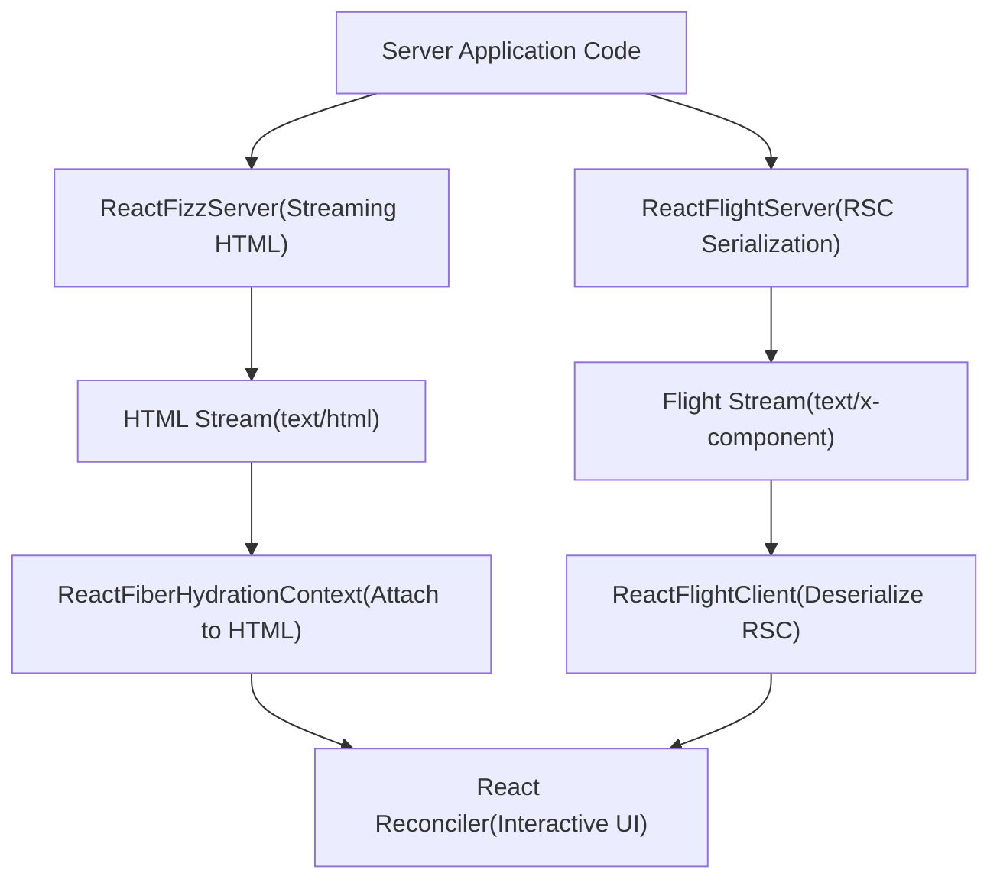
来源：[packages/react-server/src/ReactFizzServer.js1-100](https://github.com/facebook/react/blob/65eec428/packages/react-server/src/ReactFizzServer.js#L1-L100) [packages/react-server/src/ReactFlightServer.js1-100](https://github.com/facebook/react/blob/65eec428/packages/react-server/src/ReactFlightServer.js#L1-L100) [packages/react-reconciler/src/ReactFiberHydrationContext.js1-50](https://github.com/facebook/react/blob/65eec428/packages/react-reconciler/src/ReactFiberHydrationContext.js#L1-L50)

---

## React Fizz: 流式 HTML 渲染

React Fizz 是现代 SSR 系统，将 React 组件渲染为具有流式支持的 HTML。它取代了旧版的 `renderToString` API，提供了流式传输能力。

### Fizz 请求模型

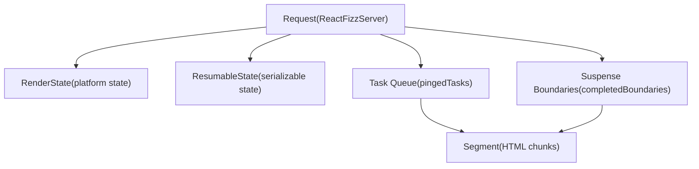
`Request` 对象 [packages/react-server/src/ReactFizzServer.js359-400](https://github.com/facebook/react/blob/65eec428/packages/react-server/src/ReactFizzServer.js#L359-L400) 协调整个渲染过程：

-   **状态**：`OPENING`, `OPEN`, `ABORTING`, `CLOSING`, `CLOSED` [packages/react-server/src/ReactFizzServer.js353-357](https://github.com/facebook/react/blob/65eec428/packages/react-server/src/ReactFizzServer.js#L353-L357)
-   **任务管理**：用于工作调度的 `pingedTasks` 数组 [packages/react-server/src/ReactFizzServer.js375](https://github.com/facebook/react/blob/65eec428/packages/react-server/src/ReactFizzServer.js#L375-L375)
-   **边界跟踪**：`completedBoundaries`, `partialBoundaries`, `clientRenderedBoundaries` [packages/react-server/src/ReactFizzServer.js377-379](https://github.com/facebook/react/blob/65eec428/packages/react-server/src/ReactFizzServer.js#L377-L379)

### 任务与片段架构

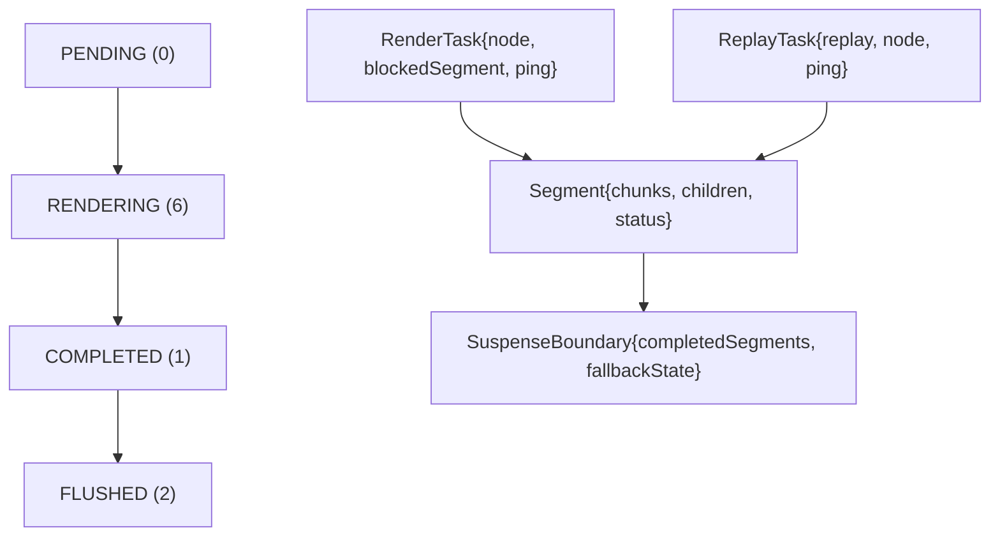
任务 (Tasks) [packages/react-server/src/ReactFizzServer.js272-324](https://github.com/facebook/react/blob/65eec428/packages/react-server/src/ReactFizzServer.js#L272-L324) 代表生成片段 (Segments) 的工作单元 [packages/react-server/src/ReactFizzServer.js336-351](https://github.com/facebook/react/blob/65eec428/packages/react-server/src/ReactFizzServer.js#L336-L351)。片段经历在 [packages/react-server/src/ReactFizzServer.js326-332](https://github.com/facebook/react/blob/65eec428/packages/react-server/src/ReactFizzServer.js#L326-L332) 中定义的状态。

来源：[packages/react-server/src/ReactFizzServer.js326-400](https://github.com/facebook/react/blob/65eec428/packages/react-server/src/ReactFizzServer.js#L326-L400) [packages/react-dom-bindings/src/server/ReactFizzConfigDOM.js146-234](https://github.com/facebook/react/blob/65eec428/packages/react-dom-bindings/src/server/ReactFizzConfigDOM.js#L146-L234)

---

## React Flight: Server Components 序列化

React Flight 将 React Server Components 序列化为客户端可以使用的可流式传输格式。与 Fizz（生成 HTML）不同，Flight 生成 React 树本身的表示。

### Flight Server 请求模型

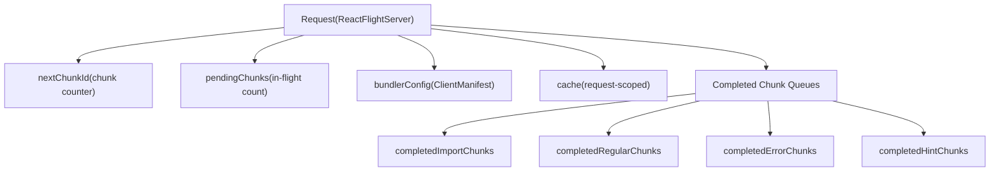
Flight `Request` [packages/react-server/src/ReactFlightServer.js569-615](https://github.com/facebook/react/blob/65eec428/packages/react-server/src/ReactFlightServer.js#L569-L615) 管理序列化状态：

-   **Chunk 管理**：`nextChunkId` 为每个序列化值递增 [packages/react-server/src/ReactFlightServer.js578](https://github.com/facebook/react/blob/65eec428/packages/react-server/src/ReactFlightServer.js#L578-L578)
-   **挂起跟踪**：`pendingChunks` 计数传输中的工作 [packages/react-server/src/ReactFlightServer.js579](https://github.com/facebook/react/blob/65eec428/packages/react-server/src/ReactFlightServer.js#L579-L579)
-   **完成队列**：不同 chunk 类型的独立数组 [packages/react-server/src/ReactFlightServer.js583-586](https://github.com/facebook/react/blob/65eec428/packages/react-server/src/ReactFlightServer.js#L583-L586)

### Flight 中的任务处理

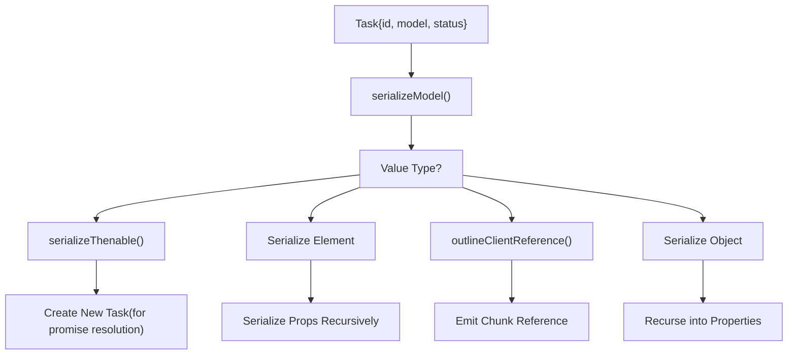
Flight 中的任务 [packages/react-server/src/ReactFlightServer.js533-549](https://github.com/facebook/react/blob/65eec428/packages/react-server/src/ReactFlightServer.js#L533-L549) 具有状态值：`PENDING`, `COMPLETED`, `ABORTED`, `ERRORED`, `RENDERING` [packages/react-server/src/ReactFlightServer.js527-531](https://github.com/facebook/react/blob/65eec428/packages/react-server/src/ReactFlightServer.js#L527-L531)。序列化过程递归处理各种值类型 [packages/react-server/src/ReactFlightServer.js1500-2000](https://github.com/facebook/react/blob/65eec428/packages/react-server/src/ReactFlightServer.js#L1500-L2000)。

来源：[packages/react-server/src/ReactFlightServer.js527-615](https://github.com/facebook/react/blob/65eec428/packages/react-server/src/ReactFlightServer.js#L527-L615) [packages/react-server/src/ReactFlightServer.js1500-2000](https://github.com/facebook/react/blob/65eec428/packages/react-server/src/ReactFlightServer.js#L1500-L2000)

---

## Flight Client 反序列化

Flight Client 将服务端流反序列化为可渲染的 React 元素树。

### Chunk 状态机

> **[Mermaid stateDiagram]**
> *(图表结构无法解析)*

Chunk 类型定义在 [packages/react-client/src/ReactFlightClient.js154-243](https://github.com/facebook/react/blob/65eec428/packages/react-client/src/ReactFlightClient.js#L154-L243)。状态机经历以下状态：

1.  **PENDING**：等待数据 [packages/react-client/src/ReactFlightClient.js154](https://github.com/facebook/react/blob/65eec428/packages/react-client/src/ReactFlightClient.js#L154-L154)
2.  **BLOCKED**：等待依赖 [packages/react-client/src/ReactFlightClient.js155](https://github.com/facebook/react/blob/65eec428/packages/react-client/src/ReactFlightClient.js#L155-L155)
3.  **RESOLVED\_MODEL**：收到 JSON，尚未解析 [packages/react-client/src/ReactFlightClient.js156](https://github.com/facebook/react/blob/65eec428/packages/react-client/src/ReactFlightClient.js#L156-L156)
4.  **INITIALIZED**：准备好被消费 [packages/react-client/src/ReactFlightClient.js158](https://github.com/facebook/react/blob/65eec428/packages/react-client/src/ReactFlightClient.js#L158-L158)
5.  **ERRORED**：发生错误 [packages/react-client/src/ReactFlightClient.js159](https://github.com/facebook/react/blob/65eec428/packages/react-client/src/ReactFlightClient.js#L159-L159)

### 响应处理

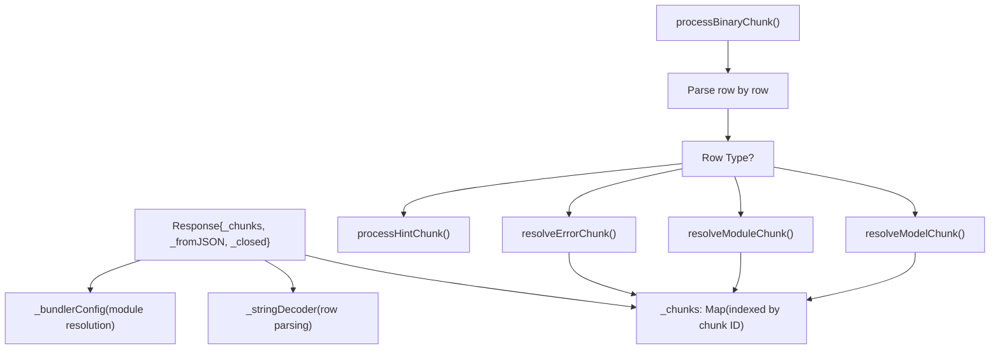
`Response` 对象 [packages/react-client/src/ReactFlightClient.js345-383](https://github.com/facebook/react/blob/65eec428/packages/react-client/src/ReactFlightClient.js#L345-L383) 维护 chunk 映射并通过 `processBinaryChunk` 处理传入的二进制数据 [packages/react-client/src/ReactFlightClient.js2120-2250](https://github.com/facebook/react/blob/65eec428/packages/react-client/src/ReactFlightClient.js#L2120-L2250)。

来源：[packages/react-client/src/ReactFlightClient.js154-383](https://github.com/facebook/react/blob/65eec428/packages/react-client/src/ReactFlightClient.js#L154-L383) [packages/react-client/src/ReactFlightClient.js2120-2250](https://github.com/facebook/react/blob/65eec428/packages/react-client/src/ReactFlightClient.js#L2120-L2250)

---

## 渲染入口点

React 为不同环境下的服务端渲染提供了多个入口点。

### 不同平台的 Fizz 入口点

| 环境 | 包 | 主要函数 | 返回类型 |
| --- | --- | --- | --- |
| **Node.js** | `react-dom/server.node` | `renderToPipeableStream()` | `PipeableStream` |
| **Browser/Edge** | `react-dom/server.browser` | `renderToReadableStream()` | `ReadableStream` |
| **Static (Node)** | `react-dom/static.node` | `prerenderToNodeStream()` | `StaticResult` |
| **Static (Browser)** | `react-dom/static.browser` | `prerender()` | `StaticResult` |

### Node.js Fizz 实现

Node.js 实现 [packages/react-dom/src/server/ReactDOMFizzServerNode.js1-250](https://github.com/facebook/react/blob/65eec428/packages/react-dom/src/server/ReactDOMFizzServerNode.js#L1-L250) 提供：

```
// Entry point structure (conceptual)
function renderToPipeableStream(
  children: ReactNodeList,
  options?: Options
): PipeableStream {
  const request = createRequest(
    children,
    resumableState,
    renderState,
    ...
  );

  return {
    pipe(destination: Writable) {
      startWork(request);
      startFlowing(request, destination);
    },
    abort(reason: mixed) {
      abort(request, reason);
    }
  };
}
```
关键函数：

-   `createRequest()` [packages/react-server/src/ReactFizzServer.js548-613](https://github.com/facebook/react/blob/65eec428/packages/react-server/src/ReactFizzServer.js#L548-L613) 初始化请求
-   `startWork()` 开始处理任务
-   `startFlowing()` [packages/react-server/src/ReactFizzServer.js](https://github.com/facebook/react/blob/65eec428/packages/react-server/src/ReactFizzServer.js) 连接到目标流

来源：[packages/react-dom/src/server/ReactDOMFizzServerNode.js1-250](https://github.com/facebook/react/blob/65eec428/packages/react-dom/src/server/ReactDOMFizzServerNode.js#L1-L250)

### Flight 入口点

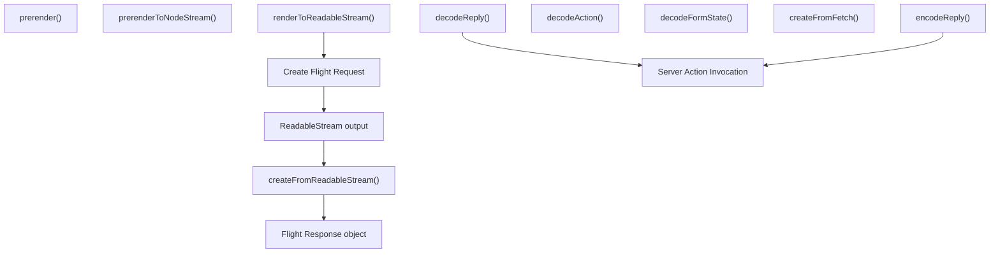
Flight server 函数 [packages/react-server/src/ReactFlightServer.js](https://github.com/facebook/react/blob/65eec428/packages/react-server/src/ReactFlightServer.js):

-   `renderToReadableStream()` [packages/react-server/src/ReactFlightServer.js](https://github.com/facebook/react/blob/65eec428/packages/react-server/src/ReactFlightServer.js) - 主要渲染函数
-   `decodeReply()` [packages/react-server/src/ReactFlightReplyServer.js](https://github.com/facebook/react/blob/65eec428/packages/react-server/src/ReactFlightReplyServer.js) - 解码客户端到服务端的数据
-   `decodeAction()` - 解码表单操作

Flight client 函数 [packages/react-client/src/ReactFlightClient.js](https://github.com/facebook/react/blob/65eec428/packages/react-client/src/ReactFlightClient.js):

-   `createFromReadableStream()` - 反序列化 Flight 流
-   `createFromFetch()` - 从 fetch 响应创建
-   `encodeReply()` [packages/react-client/src/ReactFlightReplyClient.js](https://github.com/facebook/react/blob/65eec428/packages/react-client/src/ReactFlightReplyClient.js) - 编码客户端到服务端的数据

来源：[packages/react-server/src/ReactFlightServer.js](https://github.com/facebook/react/blob/65eec428/packages/react-server/src/ReactFlightServer.js) [packages/react-client/src/ReactFlightClient.js](https://github.com/facebook/react/blob/65eec428/packages/react-client/src/ReactFlightClient.js) [packages/react-client/src/ReactFlightReplyClient.js](https://github.com/facebook/react/blob/65eec428/packages/react-client/src/ReactFlightReplyClient.js) [packages/react-server/src/ReactFlightReplyServer.js](https://github.com/facebook/react/blob/65eec428/packages/react-server/src/ReactFlightReplyServer.js)

---

## Suspense 边界处理

Fizz 和 Flight 对 React Suspense 边界都有复杂的处理。

### Fizz Suspense 边界结构

```mermaid
flowchart TD
    SuspenseBoundary["SuspenseBoundary"]
    Status["status: 0|1|4|5(PENDING|COMPLETED|CLIENT_RENDERED|POSTPONED)"]
    RootSegmentID["rootSegmentID(segment identifier)"]
    CompletedSegments["completedSegments: Segment[](ready to flush)"]
    PendingTasks["pendingTasks: number(blocking counter)"]
    ContentState["contentState: HoistableState(resources for content)"]
    FallbackState["fallbackState: HoistableState(resources for fallback)"]
    Row["row: SuspenseListRow | null(for SuspenseList coordination)"]
    FallbackAbortableTasks["fallbackAbortableTasks: Set<Task>(tasks to abort on completion)"]

    SuspenseBoundary --> Status
    SuspenseBoundary --> RootSegmentID
    SuspenseBoundary --> CompletedSegments
    SuspenseBoundary --> PendingTasks
    SuspenseBoundary --> ContentState
    SuspenseBoundary --> FallbackState
    SuspenseBoundary --> Row
    SuspenseBoundary --> FallbackAbortableTasks
```
`SuspenseBoundary` 类型 [packages/react-server/src/ReactFizzServer.js248-270](https://github.com/facebook/react/blob/65eec428/packages/react-server/src/ReactFizzServer.js#L248-L270) 跟踪：

-   **状态**：`PENDING` (rendering), `COMPLETED` (ready), `CLIENT_RENDERED` (errored), `POSTPONED` (prerender) [packages/react-server/src/ReactFizzServer.js246](https://github.com/facebook/react/blob/65eec428/packages/react-server/src/ReactFizzServer.js#L246-L246)
-   **片段**：`completedSegments` 包含准备刷新的 HTML chunk [packages/react-server/src/ReactFizzServer.js254](https://github.com/facebook/react/blob/65eec428/packages/react-server/src/ReactFizzServer.js#L254-L254)
-   **依赖**：`contentState` 和 `fallbackState` 跟踪样式表和脚本 [packages/react-server/src/ReactFizzServer.js258-259](https://github.com/facebook/react/blob/65eec428/packages/react-server/src/ReactFizzServer.js#L258-L259)
-   **协调**：`row` 用于 `SuspenseList` 排序 [packages/react-server/src/ReactFizzServer.js253](https://github.com/facebook/react/blob/65eec428/packages/react-server/src/ReactFizzServer.js#L253-L253)

### Flight Suspense 处理

在 Flight 中，Suspense 通过 Promise 序列化处理：

> **[Mermaid sequence]**
> *(图表结构无法解析)*

`serializeThenable()` 函数 [packages/react-server/src/ReactFlightServer.js1032-1134](https://github.com/facebook/react/blob/65eec428/packages/react-server/src/ReactFlightServer.js#L1032-L1134) 为每个 promise 创建一个新任务，允许渐进式加载异步数据。

来源：[packages/react-server/src/ReactFizzServer.js246-270](https://github.com/facebook/react/blob/65eec428/packages/react-server/src/ReactFizzServer.js#L246-L270) [packages/react-server/src/ReactFlightServer.js1032-1134](https://github.com/facebook/react/blob/65eec428/packages/react-server/src/ReactFlightServer.js#L1032-L1134)

---

## 资源管理与提升 (Hoisting)

Fizz 包含对样式表、脚本和其他依赖项的复杂资源管理。

### 可提升状态 (Hoistable State) 跟踪

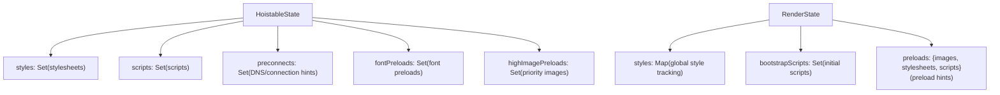
资源管理系统 [packages/react-dom-bindings/src/server/ReactFizzConfigDOM.js146-234](https://github.com/facebook/react/blob/65eec428/packages/react-dom-bindings/src/server/ReactFizzConfigDOM.js#L146-L234) 包括：

-   **HoistableState**：每个边界的资源跟踪
-   **RenderState**：全局资源协调 [packages/react-dom-bindings/src/server/ReactFizzConfigDOM.js148-234](https://github.com/facebook/react/blob/65eec428/packages/react-dom-bindings/src/server/ReactFizzConfigDOM.js#L148-L234)
-   **资源类型**：样式表、脚本、preconnects, preloads [packages/react-dom-bindings/src/server/ReactFizzConfigDOM.js204-211](https://github.com/facebook/react/blob/65eec428/packages/react-dom-bindings/src/server/ReactFizzConfigDOM.js#L204-L211)

### 资源刷新顺序

资源按优先级顺序刷新：

1.  Preconnects 和 DNS hints（最早）
2.  高优先级图片 preloads
3.  字体 preloads
4.  样式表（阻塞渲染）
5.  脚本（可能阻塞）
6.  批量 preloads（最低优先级）

这由 [packages/react-dom-bindings/src/server/ReactFizzConfigDOM.js](https://github.com/facebook/react/blob/65eec428/packages/react-dom-bindings/src/server/ReactFizzConfigDOM.js) 中的 `flushResources()` 及相关函数控制。

来源：[packages/react-dom-bindings/src/server/ReactFizzConfigDOM.js148-234](https://github.com/facebook/react/blob/65eec428/packages/react-dom-bindings/src/server/ReactFizzConfigDOM.js#L148-L234)

---

## 预渲染与恢复

React 支持在构建时进行预渲染，并具有稍后恢复渲染动态部分的能力。

### 推迟 (Postpone) 与恢复流程

> **[Mermaid sequence]**
> *(图表结构无法解析)*

预渲染的关键类型：

-   **PostponedState**：捕获被推迟内容的可序列化状态 [packages/react-server/src/ReactFizzServer.js](https://github.com/facebook/react/blob/65eec428/packages/react-server/src/ReactFizzServer.js)
-   **ReplayNode**：记录组件路径的树结构 [packages/react-server/src/ReactFizzServer.js218-225](https://github.com/facebook/react/blob/65eec428/packages/react-server/src/ReactFizzServer.js#L218-L225)
-   **ReplayTask**：跟随重放节点的特殊任务类型 [packages/react-server/src/ReactFizzServer.js303-322](https://github.com/facebook/react/blob/65eec428/packages/react-server/src/ReactFizzServer.js#L303-L322)

函数：

-   `createPrerenderRequest()` [packages/react-server/src/ReactFizzServer.js615-647](https://github.com/facebook/react/blob/65eec428/packages/react-server/src/ReactFizzServer.js#L615-L647) - 初始化预渲染
-   `resumeRequest()` [packages/react-server/src/ReactFizzServer.js649-741](https://github.com/facebook/react/blob/65eec428/packages/react-server/src/ReactFizzServer.js#L649-L741) - 从推迟状态恢复
-   `postpone()` - 在边界处触发推迟

来源：[packages/react-server/src/ReactFizzServer.js615-741](https://github.com/facebook/react/blob/65eec428/packages/react-server/src/ReactFizzServer.js#L615-L741)

---

## 与 Reconciler 集成

服务端渲染的内容通过水合与客户端 Reconciler 集成。

### 水合 Context 结构

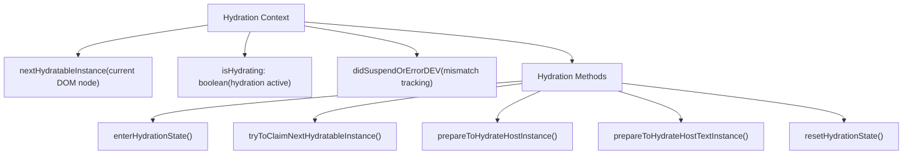
水合 Context [packages/react-reconciler/src/ReactFiberHydrationContext.js](https://github.com/facebook/react/blob/65eec428/packages/react-reconciler/src/ReactFiberHydrationContext.js) 提供：

-   **状态跟踪**：在服务端渲染 DOM 中的当前位置 [packages/react-reconciler/src/ReactFiberHydrationContext.js100-200](https://github.com/facebook/react/blob/65eec428/packages/react-reconciler/src/ReactFiberHydrationContext.js#L100-L200)
-   **实例匹配**：`tryToClaimNextHydratableInstance()` 尝试将 fibers 与 DOM 节点匹配
-   **不匹配处理**：检测并报告服务端和客户端渲染之间的差异
-   **Suspense 水合**：对脱水的 suspense 边界的特殊处理

水合过程在 `HostRoot` 的 `beginWork()` 期间启动，并遍历树，将 fibers 与现有的 DOM 节点进行匹配。

来源：[packages/react-reconciler/src/ReactFiberHydrationContext.js1-1000](https://github.com/facebook/react/blob/65eec428/packages/react-reconciler/src/ReactFiberHydrationContext.js#L1-L1000)

---

## 平台特定配置

Fizz 和 Flight 都使用配置抽象来支持不同的平台。

### Fizz 配置接口

```mermaid
flowchart TD
    FizzConfig["ReactFizzConfig(Host Configuration)"]
    ElementCreation["Element Creation"]
    PushStartInstance["pushStartInstance()"]
    PushEndInstance["pushEndInstance()"]
    PushTextInstance["pushTextInstance()"]
    Formatting["Format Context"]
    GetChildFormatContext["getChildFormatContext()"]
    CreateRootFormatContext["createRootFormatContext()"]
    Resources["Resource Management"]
    WriteHoistables["writeHoistables()"]
    WriteHoistablesForBoundary["writeHoistablesForBoundary()"]
    Boundaries["Boundary Handling"]
    WriteStartPendingSuspenseBoundary["writeStartPendingSuspenseBoundary()"]
    WriteEndPendingSuspenseBoundary["writeEndPendingSuspenseBoundary()"]

    FizzConfig --> ElementCreation
    ElementCreation --> PushStartInstance
    ElementCreation --> PushEndInstance
    ElementCreation --> PushTextInstance
    FizzConfig --> Formatting
    Formatting --> GetChildFormatContext
    Formatting --> CreateRootFormatContext
    FizzConfig --> Resources
    Resources --> WriteHoistables
    Resources --> WriteHoistablesForBoundary
    FizzConfig --> Boundaries
    Boundaries --> WriteStartPendingSuspenseBoundary
    Boundaries --> WriteEndPendingSuspenseBoundary
```
DOM 配置 [packages/react-dom-bindings/src/server/ReactFizzConfigDOM.js](https://github.com/facebook/react/blob/65eec428/packages/react-dom-bindings/src/server/ReactFizzConfigDOM.js) 实现了：

-   **元素输出**：写入开始/结束标签和文本的函数 [packages/react-dom-bindings/src/server/ReactFizzConfigDOM.js3000-4000](https://github.com/facebook/react/blob/65eec428/packages/react-dom-bindings/src/server/ReactFizzConfigDOM.js#L3000-L4000)
-   **格式上下文**：跟踪 HTML/SVG/MathML 上下文 [packages/react-dom-bindings/src/server/ReactFizzConfigDOM.js500-700](https://github.com/facebook/react/blob/65eec428/packages/react-dom-bindings/src/server/ReactFizzConfigDOM.js#L500-L700)
-   **资源提升**：输出样式表和脚本 [packages/react-dom-bindings/src/server/ReactFizzConfigDOM.js5000-6000](https://github.com/facebook/react/blob/65eec428/packages/react-dom-bindings/src/server/ReactFizzConfigDOM.js#L5000-L6000)
-   **边界标记**：Suspense 边界分隔符 [packages/react-dom-bindings/src/server/ReactFizzConfigDOM.js4000-5000](https://github.com/facebook/react/blob/65eec428/packages/react-dom-bindings/src/server/ReactFizzConfigDOM.js#L4000-L5000)

### Flight 配置接口

Flight 使用专注于模块解析的更简单的配置：

-   `resolveClientReferenceMetadata()` - 获取客户端模块信息
-   `resolveServerReference()` - 解析 Server Action 引用
-   `getClientReferenceKey()` - 为客户端引用生成唯一键
-   `isClientReference()` / `isServerReference()` - 类型检查

这些定义在 [packages/react-server/src/ReactFlightServerConfig.js](https://github.com/facebook/react/blob/65eec428/packages/react-server/src/ReactFlightServerConfig.js) 中，并按平台实现。

来源：[packages/react-dom-bindings/src/server/ReactFizzConfigDOM.js1-6000](https://github.com/facebook/react/blob/65eec428/packages/react-dom-bindings/src/server/ReactFizzConfigDOM.js#L1-L6000) [packages/react-server/src/ReactFlightServerConfig.js](https://github.com/facebook/react/blob/65eec428/packages/react-server/src/ReactFlightServerConfig.js)

---

## 错误处理与恢复

两个系统都包含全面的错误处理。

### Fizz 错误处理

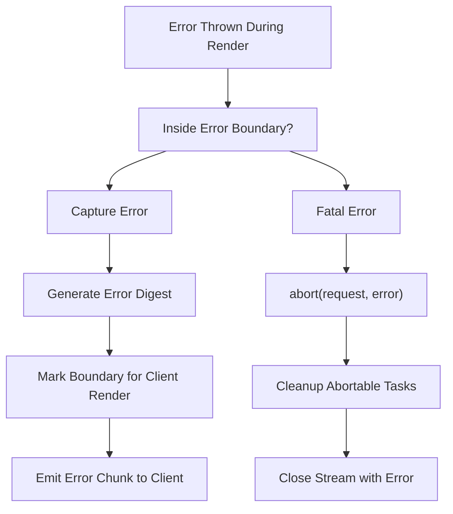
Fizz 中的错误处理 [packages/react-server/src/ReactFizzServer.js2500-3000](https://github.com/facebook/react/blob/65eec428/packages/react-server/src/ReactFizzServer.js#L2500-L3000)：

1.  **错误捕获**：`logRecoverableError()` 向 `onError` 回调报告
2.  **错误摘要**：生成哈希以标识错误而不泄露细节
3.  **边界处理**：`erroredTask()` 标记边界以进行客户端恢复
4.  **中止处理**：`abortTask()` 和 `abortTaskSoft()` 用于清理 [packages/react-server/src/ReactFizzServer.js1700-1900](https://github.com/facebook/react/blob/65eec428/packages/react-server/src/ReactFizzServer.js#L1700-L1900)

### Flight 错误处理

在 Flight 中，错误被序列化到流中：

-   **Error chunks**：错误变成具有错误状态的 chunk [packages/react-server/src/ReactFlightServer.js3500-3600](https://github.com/facebook/react/blob/65eec428/packages/react-server/src/ReactFlightServer.js#L3500-L3600)
-   **Error digest**：类似的摘要生成用于生产环境 [packages/react-server/src/ReactFlightServer.js3550](https://github.com/facebook/react/blob/65eec428/packages/react-server/src/ReactFlightServer.js#L3550-L3550)
-   **Error boundaries**：客户端错误边界捕获反序列化的错误

`emitErrorChunk()` 函数 [packages/react-server/src/ReactFlightServer.js3500-3600](https://github.com/facebook/react/blob/65eec428/packages/react-server/src/ReactFlightServer.js#L3500-L3600) 在开发环境中序列化包括堆栈跟踪在内的错误信息。

来源：[packages/react-server/src/ReactFizzServer.js1700-3000](https://github.com/facebook/react/blob/65eec428/packages/react-server/src/ReactFizzServer.js#L1700-L3000) [packages/react-server/src/ReactFlightServer.js3500-3600](https://github.com/facebook/react/blob/65eec428/packages/react-server/src/ReactFlightServer.js#L3500-L3600)

---

## 性能优化

### Fizz 中的渐进式渲染

Fizz 使用多种策略来优化首字节时间 (TTFB) 和渐进式渲染：

1.  **Shell 优先渲染**：立即渲染并刷新外壳 (shell)
2.  **Suspense 流式传输**：随着 Suspense 边界内容就绪而进行流式传输
3.  **资源提升**：在文档头部输出关键资源
4.  **Chunk 大小管理**：`progressiveChunkSize` 选项控制粒度 [packages/react-server/src/ReactFizzServer.js429](https://github.com/facebook/react/blob/65eec428/packages/react-server/src/ReactFizzServer.js#L429-L429)

`performWork()` 函数 [packages/react-server/src/ReactFizzServer.js](https://github.com/facebook/react/blob/65eec428/packages/react-server/src/ReactFizzServer.js) 增量处理任务，将完成的工作刷新到流中而不阻塞。

### Flight 优化

Flight 通过以下方式优化：

1.  **惰性序列化**：仅在引用时序列化数据
2.  **引用去重**：`writtenObjects` WeakMap 防止重复序列化 [packages/react-server/src/ReactFlightServer.js590](https://github.com/facebook/react/blob/65eec428/packages/react-server/src/ReactFlightServer.js#L590-L590)
3.  **Promise 流式传输**：Promise 作为占位符序列化，渐进式解决
4.  **模块分块**：客户端引用被拆分为单独的 chunk

来源：[packages/react-server/src/ReactFizzServer.js429-500](https://github.com/facebook/react/blob/65eec428/packages/react-server/src/ReactFizzServer.js#L429-L500) [packages/react-server/src/ReactFlightServer.js590-700](https://github.com/facebook/react/blob/65eec428/packages/react-server/src/ReactFlightServer.js#L590-L700)

---

本文档提供了 React 服务端渲染系统的概览。关于特定子系统的更详细信息，请参阅本文档开头的链接 wiki 页面。
