# React Fizz (流式 SSR)

相关源文件

-   [packages/react-dom-bindings/src/client/ReactDOMComponentTree.js](https://github.com/facebook/react/blob/65eec428/packages/react-dom-bindings/src/client/ReactDOMComponentTree.js)
-   [packages/react-dom-bindings/src/server/ReactFizzConfigDOM.js](https://github.com/facebook/react/blob/65eec428/packages/react-dom-bindings/src/server/ReactFizzConfigDOM.js)
-   [packages/react-dom-bindings/src/server/ReactFizzConfigDOMLegacy.js](https://github.com/facebook/react/blob/65eec428/packages/react-dom-bindings/src/server/ReactFizzConfigDOMLegacy.js)
-   [packages/react-dom-bindings/src/shared/ReactDOMResourceValidation.js](https://github.com/facebook/react/blob/65eec428/packages/react-dom-bindings/src/shared/ReactDOMResourceValidation.js)
-   [packages/react-dom/src/\_\_tests\_\_/ReactDOMFizzServer-test.js](https://github.com/facebook/react/blob/65eec428/packages/react-dom/src/__tests__/ReactDOMFizzServer-test.js)
-   [packages/react-dom/src/\_\_tests\_\_/ReactDOMFizzServerBrowser-test.js](https://github.com/facebook/react/blob/65eec428/packages/react-dom/src/__tests__/ReactDOMFizzServerBrowser-test.js)
-   [packages/react-dom/src/\_\_tests\_\_/ReactDOMFizzServerNode-test.js](https://github.com/facebook/react/blob/65eec428/packages/react-dom/src/__tests__/ReactDOMFizzServerNode-test.js)
-   [packages/react-dom/src/\_\_tests\_\_/ReactDOMFizzStatic-test.js](https://github.com/facebook/react/blob/65eec428/packages/react-dom/src/__tests__/ReactDOMFizzStatic-test.js)
-   [packages/react-dom/src/\_\_tests\_\_/ReactDOMFizzStaticBrowser-test.js](https://github.com/facebook/react/blob/65eec428/packages/react-dom/src/__tests__/ReactDOMFizzStaticBrowser-test.js)
-   [packages/react-dom/src/\_\_tests\_\_/ReactDOMFizzStaticNode-test.js](https://github.com/facebook/react/blob/65eec428/packages/react-dom/src/__tests__/ReactDOMFizzStaticNode-test.js)
-   [packages/react-dom/src/\_\_tests\_\_/ReactDOMFizzSuppressHydrationWarning-test.js](https://github.com/facebook/react/blob/65eec428/packages/react-dom/src/__tests__/ReactDOMFizzSuppressHydrationWarning-test.js)
-   [packages/react-dom/src/\_\_tests\_\_/ReactDOMFloat-test.js](https://github.com/facebook/react/blob/65eec428/packages/react-dom/src/__tests__/ReactDOMFloat-test.js)
-   [packages/react-dom/src/\_\_tests\_\_/ReactDOMHydrationDiff-test.js](https://github.com/facebook/react/blob/65eec428/packages/react-dom/src/__tests__/ReactDOMHydrationDiff-test.js)
-   [packages/react-dom/src/\_\_tests\_\_/ReactDOMServerPartialHydration-test.internal.js](https://github.com/facebook/react/blob/65eec428/packages/react-dom/src/__tests__/ReactDOMServerPartialHydration-test.internal.js)
-   [packages/react-dom/src/\_\_tests\_\_/ReactDOMSingletonComponents-test.js](https://github.com/facebook/react/blob/65eec428/packages/react-dom/src/__tests__/ReactDOMSingletonComponents-test.js)
-   [packages/react-dom/src/\_\_tests\_\_/ReactRenderDocument-test.js](https://github.com/facebook/react/blob/65eec428/packages/react-dom/src/__tests__/ReactRenderDocument-test.js)
-   [packages/react-dom/src/\_\_tests\_\_/ReactServerRenderingHydration-test.js](https://github.com/facebook/react/blob/65eec428/packages/react-dom/src/__tests__/ReactServerRenderingHydration-test.js)
-   [packages/react-dom/src/server/ReactDOMFizzServerBrowser.js](https://github.com/facebook/react/blob/65eec428/packages/react-dom/src/server/ReactDOMFizzServerBrowser.js)
-   [packages/react-dom/src/server/ReactDOMFizzServerBun.js](https://github.com/facebook/react/blob/65eec428/packages/react-dom/src/server/ReactDOMFizzServerBun.js)
-   [packages/react-dom/src/server/ReactDOMFizzServerEdge.js](https://github.com/facebook/react/blob/65eec428/packages/react-dom/src/server/ReactDOMFizzServerEdge.js)
-   [packages/react-dom/src/server/ReactDOMFizzServerNode.js](https://github.com/facebook/react/blob/65eec428/packages/react-dom/src/server/ReactDOMFizzServerNode.js)
-   [packages/react-dom/src/server/ReactDOMFizzStaticBrowser.js](https://github.com/facebook/react/blob/65eec428/packages/react-dom/src/server/ReactDOMFizzStaticBrowser.js)
-   [packages/react-dom/src/server/ReactDOMFizzStaticEdge.js](https://github.com/facebook/react/blob/65eec428/packages/react-dom/src/server/ReactDOMFizzStaticEdge.js)
-   [packages/react-dom/src/server/ReactDOMFizzStaticNode.js](https://github.com/facebook/react/blob/65eec428/packages/react-dom/src/server/ReactDOMFizzStaticNode.js)
-   [packages/react-markup/src/ReactFizzConfigMarkup.js](https://github.com/facebook/react/blob/65eec428/packages/react-markup/src/ReactFizzConfigMarkup.js)
-   [packages/react-noop-renderer/src/ReactNoopServer.js](https://github.com/facebook/react/blob/65eec428/packages/react-noop-renderer/src/ReactNoopServer.js)
-   [packages/react-reconciler/src/ReactFiberHydrationContext.js](https://github.com/facebook/react/blob/65eec428/packages/react-reconciler/src/ReactFiberHydrationContext.js)
-   [packages/react-server-dom-fb/src/\_\_tests\_\_/ReactDOMServerFB-test.internal.js](https://github.com/facebook/react/blob/65eec428/packages/react-server-dom-fb/src/__tests__/ReactDOMServerFB-test.internal.js)
-   [packages/react-server/src/ReactFizzServer.js](https://github.com/facebook/react/blob/65eec428/packages/react-server/src/ReactFizzServer.js)
-   [packages/react-server/src/forks/ReactFizzConfig.custom.js](https://github.com/facebook/react/blob/65eec428/packages/react-server/src/forks/ReactFizzConfig.custom.js)

## 目的与范围

React Fizz 是流式服务端渲染 (SSR) 系统，它渐进式生成 HTML，并在内容准备就绪时将其发送到客户端。本文档涵盖了 Fizz 核心渲染引擎、其请求/任务/片段模型、资源管理，以及针对 Node.js、Web streams 和静态生成的平台特定实现。

关于 React Server Components (RSC) 和 Flight 协议的信息，请参阅 [React Server Components (Flight)](/facebook/react/5.2-react-server-components-(flight))。关于客户端水合，请参阅 [水合系统](/facebook/react/6.3-hydration-system)。

## 高级架构

React Fizz 作为一个流式 HTML 渲染器运行，处理 React 元素并增量输出 HTML 块。该系统在核心上是平台无关的，通过平台特定的适配器支持不同的流式传输目标。

**Fizz 架构概览**

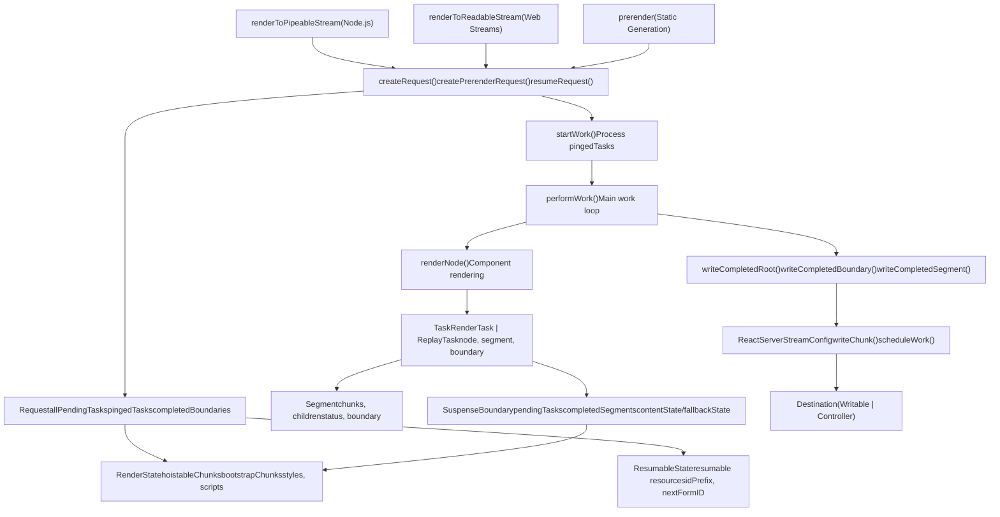
来源：[packages/react-server/src/ReactFizzServer.js1-4000](https://github.com/facebook/react/blob/65eec428/packages/react-server/src/ReactFizzServer.js#L1-L4000) [packages/react-dom-bindings/src/server/ReactFizzConfigDOM.js1-500](https://github.com/facebook/react/blob/65eec428/packages/react-dom-bindings/src/server/ReactFizzConfigDOM.js#L1-L500) [packages/react-dom/src/server/ReactDOMFizzServerNode.js1-300](https://github.com/facebook/react/blob/65eec428/packages/react-dom/src/server/ReactDOMFizzServerNode.js#L1-L300)

## 核心数据结构

### Request

`Request` 是顶层渲染上下文，用于跟踪整个 SSR 操作。

**Request 结构**

| 字段 | 类型 | 用途 |
| --- | --- | --- |
| `destination` | `Destination | null` | 输出流目标 |
| `resumableState` | `ResumableState` | 用于恢复的可序列化状态 |
| `renderState` | `RenderState` | 每个请求的工作状态 |
| `allPendingTasks` | `number` | 要完成的任务总数 |
| `pendingRootTasks` | `number` | 阻塞 shell 完成的任务 |
| `pingedTasks` | `Array<Task>` | 准备工作的高优先级任务 |
| `completedBoundaries` | `Array<SuspenseBoundary>` | 准备刷新的边界 |
| `clientRenderedBoundaries` | `Array<SuspenseBoundary>` | 出错的边界 |
| `partialBoundaries` | `Array<SuspenseBoundary>` | 具有部分内容的边界 |
| `abortableTasks` | `Set<Task>` | 可以中止的任务 |
| `trackedPostpones` | `PostponedHoles | null` | 用于预渲染恢复 |

来源：[packages/react-server/src/ReactFizzServer.js359-400](https://github.com/facebook/react/blob/65eec428/packages/react-server/src/ReactFizzServer.js#L359-L400)

### 任务类型

任务 (Task) 代表渲染流水线中的工作单元。有两种类型：

**RenderTask vs ReplayTask**

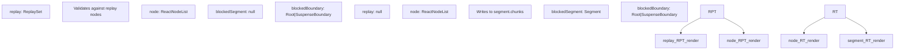
来源：[packages/react-server/src/ReactFizzServer.js272-324](https://github.com/facebook/react/blob/65eec428/packages/react-server/src/ReactFizzServer.js#L272-L324)

### Segment

`Segment` 代表一段具有渲染状态的 HTML 输出。

**Segment 生命周期**

> **[Mermaid stateDiagram]**
> *(图表结构无法解析)*

| 状态 | 值 | 描述 |
| --- | --- | --- |
| `PENDING` | 0 | 等待渲染 |
| `COMPLETED` | 1 | 渲染成功 |
| `FLUSHED` | 2 | 已写入目标 |
| `ABORTED` | 3 | 渲染已取消 |
| `ERRORED` | 4 | 渲染期间出错 |
| `POSTPONED` | 5 | 推迟以供稍后使用 |
| `RENDERING` | 6 | 正在渲染 |

来源：[packages/react-server/src/ReactFizzServer.js326-351](https://github.com/facebook/react/blob/65eec428/packages/react-server/src/ReactFizzServer.js#L326-L351)

### SuspenseBoundary

`SuspenseBoundary` 管理 Suspense 边界，跟踪挂起的工作并管理 fallback 渲染。

**SuspenseBoundary 字段**

| 字段 | 类型 | 用途 |
| --- | --- | --- |
| `status` | `0 | 1 | 4 | 5` | PENDING, COMPLETED, CLIENT\_RENDERED, POSTPONED |
| `rootSegmentID` | `number` | 边界根段的 ID |
| `pendingTasks` | `number` | 阻塞完成的任务 |
| `completedSegments` | `Array<Segment>` | 就绪但未刷新 |
| `byteSize` | `number` | 用于内联决策的总大小 |
| `defer` | `boolean` | 从不内联 deferred 边界 |
| `contentState` | `HoistableState` | 内容的资源 |
| `fallbackState` | `HoistableState` | fallback 的资源 |
| `fallbackAbortableTasks` | `Set<Task>` | 如果内容完成则取消 |
| `errorDigest` | `?string` | 如果出错时的错误哈希 |

来源：[packages/react-server/src/ReactFizzServer.js248-270](https://github.com/facebook/react/blob/65eec428/packages/react-server/src/ReactFizzServer.js#L248-L270)

## 渲染流水线

渲染流水线从请求创建流向任务处理，最后到 HTML 输出。

**完整渲染流程**

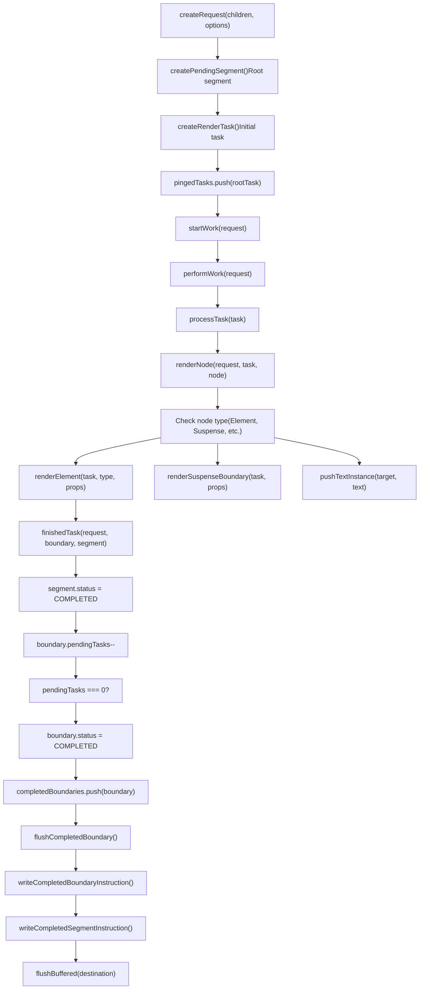
来源：[packages/react-server/src/ReactFizzServer.js548-800](https://github.com/facebook/react/blob/65eec428/packages/react-server/src/ReactFizzServer.js#L548-L800) [packages/react-server/src/ReactFizzServer.js1600-2000](https://github.com/facebook/react/blob/65eec428/packages/react-server/src/ReactFizzServer.js#L1600-L2000)

## 任务调度与执行

### 任务创建

任务在开始渲染时或 Suspense 边界需要渲染其内容或 fallback 时创建。

**任务创建函数**

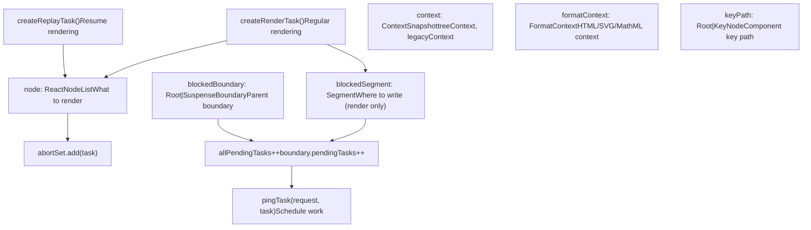
来源：[packages/react-server/src/ReactFizzServer.js843-953](https://github.com/facebook/react/blob/65eec428/packages/react-server/src/ReactFizzServer.js#L843-L953)

### performWork 循环

`performWork` 函数是处理任务和刷新输出的主工作循环。

**performWork 执行**

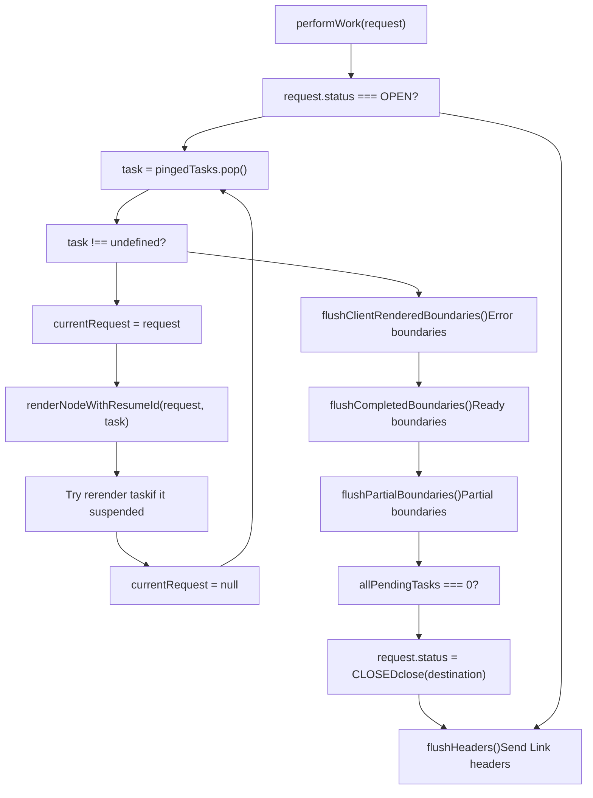
来源：[packages/react-server/src/ReactFizzServer.js2800-3000](https://github.com/facebook/react/blob/65eec428/packages/react-server/src/ReactFizzServer.js#L2800-L3000)

### renderNode 分发

`renderNode` 函数根据节点类型分发到专门的渲染逻辑。

**节点类型分发**

| 节点类型 | Symbol | 渲染函数 |
| --- | --- | --- |
| React 元素 | `REACT_ELEMENT_TYPE` | `renderElement(request, task, type, props, ref)` |
| Lazy 组件 | `REACT_LAZY_TYPE` | `renderLazyComponent(request, task, lazyComponent)` |
| Suspense | `REACT_SUSPENSE_TYPE` | `renderSuspenseBoundary(request, task, props)` |
| SuspenseList | `REACT_SUSPENSE_LIST_TYPE` | `renderSuspenseList(request, task, props)` |
| Fragment | `REACT_FRAGMENT_TYPE` | `renderNodeFragment(request, task, children)` |
| Provider | `REACT_CONTEXT_TYPE` | `pushProvider(context, value)` |
| Forward Ref | `REACT_FORWARD_REF_TYPE` | `renderForwardRef(request, task, render, props, ref)` |
| Memo | `REACT_MEMO_TYPE` | `renderMemo(request, task, type, props)` |
| Portal | `REACT_PORTAL_TYPE` | 错误 - 不支持 |
| 字符串/数字 | 原始类型 | `pushTextInstance(segment, text)` |
| 数组 | `isArray(node)` | `renderChildrenArray(request, task, children)` |
| 异步可迭代 | `node[ASYNC_ITERATOR]` | `renderAsyncIterable(request, task, iterable)` |

来源：[packages/react-server/src/ReactFizzServer.js1800-2400](https://github.com/facebook/react/blob/65eec428/packages/react-server/src/ReactFizzServer.js#L1800-L2400)

## Suspense 边界管理

Suspense 边界通过允许部分树挂起，而其他部分完成，实现了流式和渐进式渲染。

**Suspense 边界渲染流程**

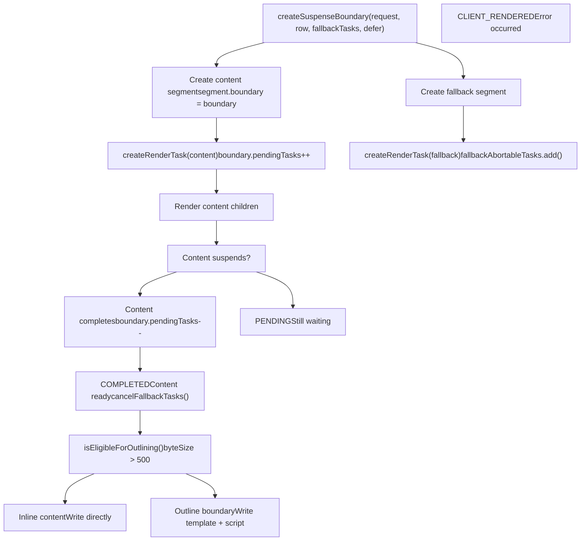
来源：[packages/react-server/src/ReactFizzServer.js796-841](https://github.com/facebook/react/blob/65eec428/packages/react-server/src/ReactFizzServer.js#L796-L841) [packages/react-server/src/ReactFizzServer.js2500-2700](https://github.com/facebook/react/blob/65eec428/packages/react-server/src/ReactFizzServer.js#L2500-L2700)

### 边界完成与刷新

当一个边界完成时，它会在被刷新到输出之前通过队列。

**边界刷新过程**

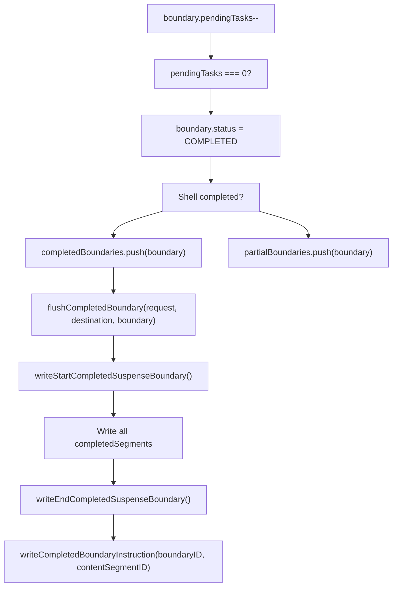
来源：[packages/react-server/src/ReactFizzServer.js3200-3500](https://github.com/facebook/react/blob/65eec428/packages/react-server/src/ReactFizzServer.js#L3200-L3500)

## 资源管理

React Fizz 通过 `RenderState` 和 `ResumableState` 结构管理资源（脚本、样式表、预加载），以优化加载并防止重复。

**资源状态架构**

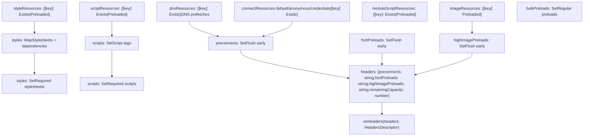
来源：[packages/react-dom-bindings/src/server/ReactFizzConfigDOM.js260-310](https://github.com/facebook/react/blob/65eec428/packages/react-dom-bindings/src/server/ReactFizzConfigDOM.js#L260-L310) [packages/react-dom-bindings/src/server/ReactFizzConfigDOM.js148-234](https://github.com/facebook/react/blob/65eec428/packages/react-dom-bindings/src/server/ReactFizzConfigDOM.js#L148-L234)

### 资源去重

资源在 `ResumableState` 中跟踪，以防止跨边界和恢复场景重复输出。

**资源跟踪类型**

| 类型 | 跟踪依据 | 值 |
| --- | --- | --- |
| DNS 预获取 | `href` | `EXISTS` (null) |
| 预连接 (Preconnect) | `href` + `crossOrigin` | `EXISTS` (null) |
| 样式表 | `href` | `EXISTS` | `[crossOrigin, integrity]` |
| 脚本 | `src` | `EXISTS` | `[crossOrigin, integrity]` |
| 模块 | `src` | `EXISTS` | `[crossOrigin, integrity]` |
| 图片预加载 | `href` + `imageSrcSet` + `imageSizes` | `[]` (空数组) |
| 字体预加载 | `href` | `[]` (空数组) |

来源：[packages/react-dom-bindings/src/server/ReactFizzConfigDOM.js236-258](https://github.com/facebook/react/blob/65eec428/packages/react-dom-bindings/src/server/ReactFizzConfigDOM.js#L236-L258)

### 资源刷新顺序

资源按特定顺序刷新以优化页面加载性能。

**资源刷新序列**

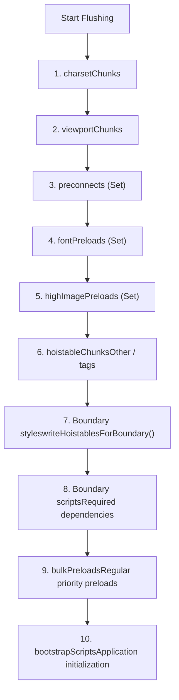
来源：[packages/react-dom-bindings/src/server/ReactFizzConfigDOM.js3800-4200](https://github.com/facebook/react/blob/65eec428/packages/react-dom-bindings/src/server/ReactFizzConfigDOM.js#L3800-L4200)

## 平台特定的实现

React Fizz 为不同的 JavaScript 环境提供了多个入口点，每个入口点将核心引擎适配到平台特定的流式 API。

**平台入口点**

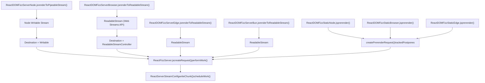
来源：[packages/react-dom/src/server/ReactDOMFizzServerNode.js1-300](https://github.com/facebook/react/blob/65eec428/packages/react-dom/src/server/ReactDOMFizzServerNode.js#L1-L300) [packages/react-dom/src/server/ReactDOMFizzServerBrowser.js1-200](https://github.com/facebook/react/blob/65eec428/packages/react-dom/src/server/ReactDOMFizzServerBrowser.js#L1-L200) [packages/react-dom/src/server/ReactDOMFizzStaticBrowser.js1-200](https://github.com/facebook/react/blob/65eec428/packages/react-dom/src/server/ReactDOMFizzStaticBrowser.js#L1-L200)

### Node.js: renderToPipeableStream

Node.js 实现使用带有背压支持的 Node `Writable` 流接口。

**Node.js 流式流程**

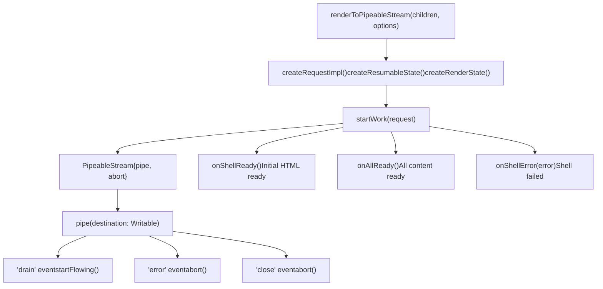
来源：[packages/react-dom/src/server/ReactDOMFizzServerNode.js131-166](https://github.com/facebook/react/blob/65eec428/packages/react-dom/src/server/ReactDOMFizzServerNode.js#L131-L166)

### Browser/Edge: renderToReadableStream

浏览器实现使用 Web Streams API 的 `ReadableStream` 配合字节源。

**Web Streams 流程**

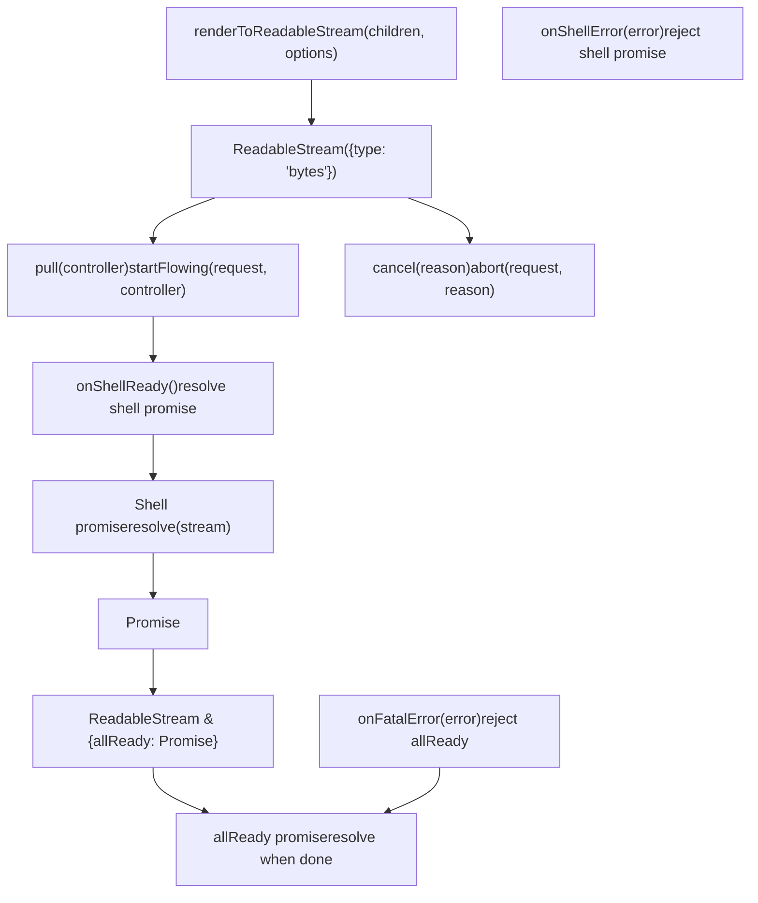
来源：[packages/react-dom/src/server/ReactDOMFizzServerBrowser.js75-165](https://github.com/facebook/react/blob/65eec428/packages/react-dom/src/server/ReactDOMFizzServerBrowser.js#L75-L165)

## 预渲染 (Prerendering) 与可恢复性 (Resumability)

预渲染生成静态 HTML，同时跟踪推迟的边界以便稍后恢复。

**预渲染架构**

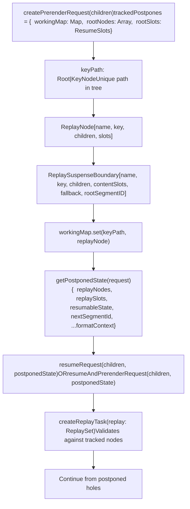
来源：[packages/react-server/src/ReactFizzServer.js615-770](https://github.com/facebook/react/blob/65eec428/packages/react-server/src/ReactFizzServer.js#L615-L770)

### PostponedState 结构

`PostponedState` 捕获从推迟的边界恢复渲染所需的一切。

**PostponedState 字段**

| 字段 | 类型 | 用途 |
| --- | --- | --- |
| `replayNodes` | `Array<ReplayNode>` | 跟踪的组件键树 |
| `replaySlots` | `ResumeSlots` | 要恢复的段 ID |
| `resumableState` | `ResumableState` | 要继续的资源状态 |
| `nextSegmentId` | `number` | 下一个可用段 ID |
| `rootFormatContext` | `FormatContext` | HTML/SVG/MathML 上下文 |
| `progressiveChunkSize` | `number` | Chunk 大小设置 |

来源：[packages/react-server/src/ReactFizzServer.js3900-4000](https://github.com/facebook/react/blob/65eec428/packages/react-server/src/ReactFizzServer.js#L3900-L4000)

### ReplayTask 验证

在恢复时，`ReplayTask` 实例验证组件树是否与跟踪的结构匹配。

**Replay 验证流程**

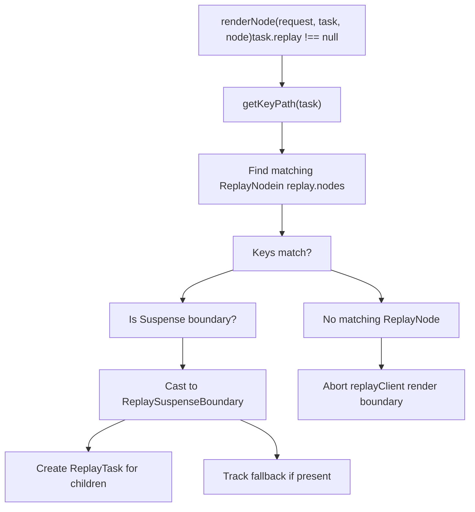
来源：[packages/react-server/src/ReactFizzServer.js1900-2100](https://github.com/facebook/react/blob/65eec428/packages/react-server/src/ReactFizzServer.js#L1900-L2100)

## 流式格式与指令

React Fizz 可以以两种格式输出 HTML：内联脚本或带有外部运行时的数据属性。

**流式格式**

| 格式 | 值 | 配置 | 用例 |
| --- | --- | --- | --- |
| `ScriptStreamingFormat` | 0 | 默认 | `<script>` 标签中的内联指令 |
| `DataStreamingFormat` | 1 | `unstable_externalRuntimeSrc` | 通过数据属性的指令，独立运行时 |

来源：[packages/react-dom-bindings/src/server/ReactFizzConfigDOM.js122-124](https://github.com/facebook/react/blob/65eec428/packages/react-dom-bindings/src/server/ReactFizzConfigDOM.js#L122-L124)

### 指令状态位

`InstructionState` 跟踪已发送的指令以避免重复。

**InstructionState 标志**

| 标志 | 位 | 用途 |
| --- | --- | --- |
| `SentCompleteSegmentFunction` | 0b000000001 | 已发送 `completeSegment` 函数 |
| `SentCompleteBoundaryFunction` | 0b000000010 | 已发送 `completeBoundary` 函数 |
| `SentClientRenderFunction` | 0b000000100 | 已发送 `clientRenderBoundary` 函数 |
| `SentStyleInsertionFunction` | 0b000001000 | 已发送 `completeBoundaryWithStyles` |
| `SentFormReplayingRuntime` | 0b000010000 | 已发送表单重放运行时 |
| `SentCompletedShellId` | 0b000100000 | 已发送 Shell 完成标记 |
| `SentMarkShellTime` | 0b001000000 | 已发送 Shell 计时标记 |
| `NeedUpgradeToViewTransitions` | 0b010000000 | 需要升级到视图过渡 |
| `SentUpgradeToViewTransitions` | 0b100000000 | 已发送视图过渡升级 |

来源：[packages/react-dom-bindings/src/server/ReactFizzConfigDOM.js127-136](https://github.com/facebook/react/blob/65eec428/packages/react-dom-bindings/src/server/ReactFizzConfigDOM.js#L127-L136)

### 边界完成指令

当边界完成时，内联脚本或数据属性指示客户端显示内容。

**边界指令输出**

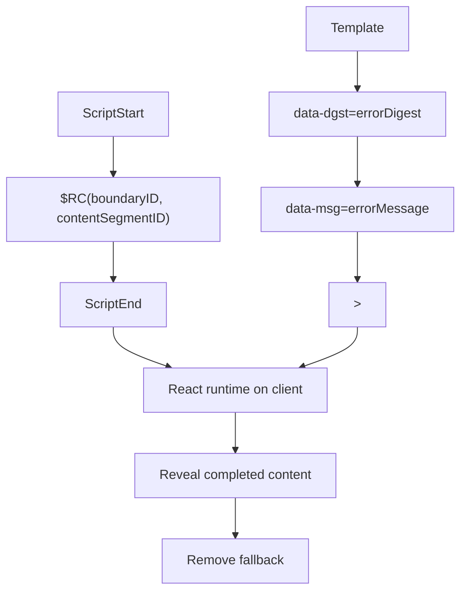
来源：[packages/react-dom-bindings/src/server/ReactFizzConfigDOM.js4500-4700](https://github.com/facebook/react/blob/65eec428/packages/react-dom-bindings/src/server/ReactFizzConfigDOM.js#L4500-L4700)

## 错误处理与恢复

React Fizz 在不同层级处理错误，采用不同的恢复策略。

**错误处理层级**

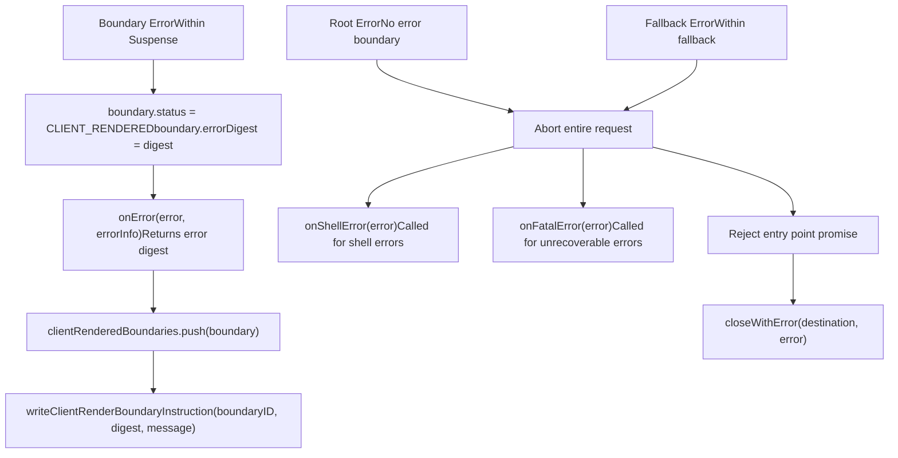
来源：[packages/react-server/src/ReactFizzServer.js3600-3800](https://github.com/facebook/react/blob/65eec428/packages/react-server/src/ReactFizzServer.js#L3600-L3800)

### 错误信息

`onError` 回调接收详细的错误信息用于日志记录和监控。

**ErrorInfo 结构**

| 字段 | 类型 | 描述 |
| --- | --- | --- |
| `componentStack` | `string` | 组件堆栈跟踪 |
| `error` | `mixed` | 抛出的错误对象 |
| `errorInfo.digest` | `?string` | 用于客户端匹配的错误哈希 |

来源：[packages/react-server/src/ReactFizzServer.js384-400](https://github.com/facebook/react/blob/65eec428/packages/react-server/src/ReactFizzServer.js#L384-L400)

## 性能优化

### 渐进式 Chunk 大小

`progressiveChunkSize` 选项控制在刷新之前缓冲多少 HTML。

**默认 Chunk 大小计算**

默认值 12,800 字节基于：

-   3G 网络速度：~500 kbits/秒
-   目标：每 500ms 发送一次内容
-   500ms × (500 kbits/s) × 0.8 (实际吞吐量) × 0.5 (HTML 开销) / 2 = 12.5kb

来源：[packages/react-server/src/ReactFizzServer.js414-429](https://github.com/facebook/react/blob/65eec428/packages/react-server/src/ReactFizzServer.js#L414-L429)

### 边界内联

小边界可以直接内联，而不是用单独的指令外联 (outlined)。

**外联资格**

```
function isEligibleForOutlining(request, boundary) {
  return (
    (boundary.byteSize > 500 ||
      hasSuspenseyContent(boundary.contentState) ||
      boundary.defer) &&
    boundary.preamble === null
  );
}
```
-   边界 < 500 字节：内联
-   边界 ≥ 500 字节：带指令外联
-   Defer 边界：总是外联
-   Preamble 边界：从不外联（用于渲染阻塞）

来源：[packages/react-server/src/ReactFizzServer.js466-482](https://github.com/facebook/react/blob/65eec428/packages/react-server/src/ReactFizzServer.js#L466-L482)

### 早期 Headers

`onHeaders` 回调允许在任何 HTML 之前发送 `Link` 标头以进行早期提示。

**标头容量管理**

资源被累积到 Link 标头中，直到达到容量：

-   默认容量：2000 个 UTF-16 代码单元 (~2KB)
-   优先级顺序：preconnects, 字体 preloads, 高优先级图片 preloads
-   剩余资源在 HTML `<link>` 标签中刷新

来源：[packages/react-dom-bindings/src/server/ReactFizzConfigDOM.js367-489](https://github.com/facebook/react/blob/65eec428/packages/react-dom-bindings/src/server/ReactFizzConfigDOM.js#L367-L489)
