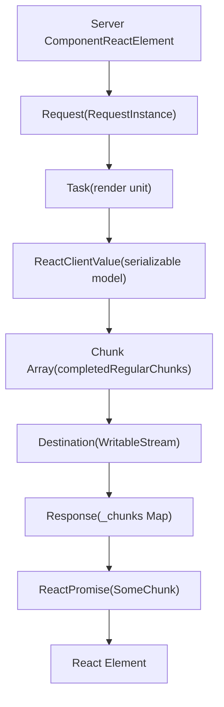
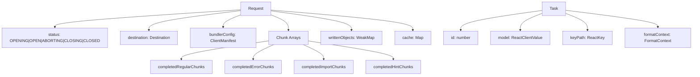
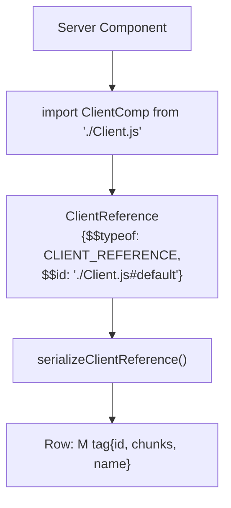
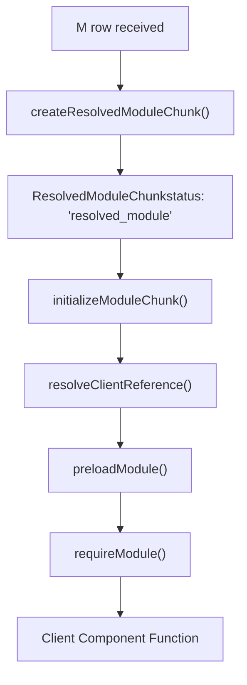
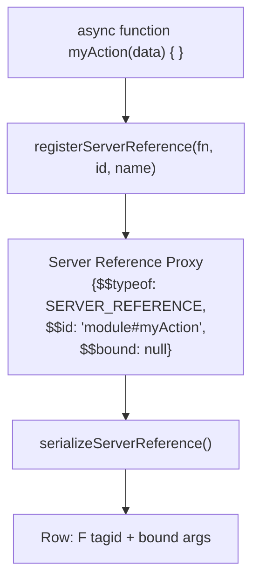
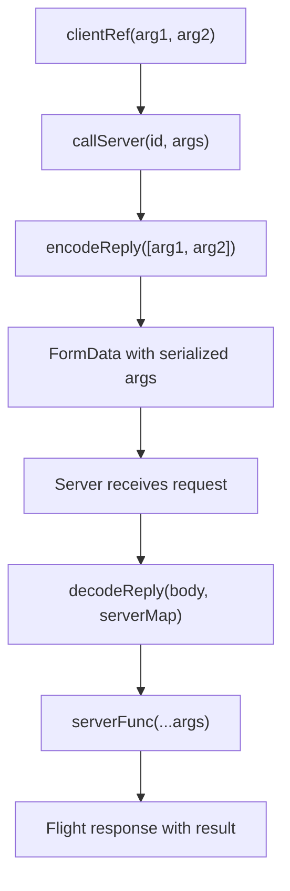
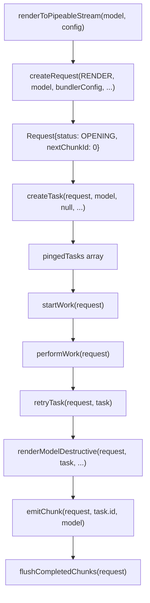
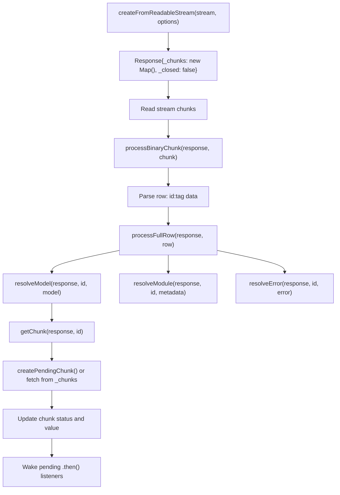

# React Server Components (Flight)

相关源文件

-   [packages/react-client/src/ReactFlightClient.js](https://github.com/facebook/react/blob/65eec428/packages/react-client/src/ReactFlightClient.js)
-   [packages/react-client/src/ReactFlightReplyClient.js](https://github.com/facebook/react/blob/65eec428/packages/react-client/src/ReactFlightReplyClient.js)
-   [packages/react-client/src/ReactFlightTemporaryReferences.js](https://github.com/facebook/react/blob/65eec428/packages/react-client/src/ReactFlightTemporaryReferences.js)
-   [packages/react-client/src/__tests__/ReactFlight-test.js](https://github.com/facebook/react/blob/65eec428/packages/react-client/src/__tests__/ReactFlight-test.js)
-   [packages/react-server-dom-esm/src/ReactFlightESMReferences.js](https://github.com/facebook/react/blob/65eec428/packages/react-server-dom-esm/src/ReactFlightESMReferences.js)
-   [packages/react-server-dom-parcel/src/ReactFlightParcelReferences.js](https://github.com/facebook/react/blob/65eec428/packages/react-server-dom-parcel/src/ReactFlightParcelReferences.js)
-   [packages/react-server-dom-turbopack/src/ReactFlightTurbopackReferences.js](https://github.com/facebook/react/blob/65eec428/packages/react-server-dom-turbopack/src/ReactFlightTurbopackReferences.js)
-   [packages/react-server-dom-unbundled/src/ReactFlightUnbundledReferences.js](https://github.com/facebook/react/blob/65eec428/packages/react-server-dom-unbundled/src/ReactFlightUnbundledReferences.js)
-   [packages/react-server-dom-webpack/src/ReactFlightWebpackNodeLoader.js](https://github.com/facebook/react/blob/65eec428/packages/react-server-dom-webpack/src/ReactFlightWebpackNodeLoader.js)
-   [packages/react-server-dom-webpack/src/ReactFlightWebpackNodeRegister.js](https://github.com/facebook/react/blob/65eec428/packages/react-server-dom-webpack/src/ReactFlightWebpackNodeRegister.js)
-   [packages/react-server-dom-webpack/src/ReactFlightWebpackPlugin.js](https://github.com/facebook/react/blob/65eec428/packages/react-server-dom-webpack/src/ReactFlightWebpackPlugin.js)
-   [packages/react-server-dom-webpack/src/ReactFlightWebpackReferences.js](https://github.com/facebook/react/blob/65eec428/packages/react-server-dom-webpack/src/ReactFlightWebpackReferences.js)
-   [packages/react-server-dom-webpack/src/__tests__/ReactFlightDOM-test.js](https://github.com/facebook/react/blob/65eec428/packages/react-server-dom-webpack/src/__tests__/ReactFlightDOM-test.js)
-   [packages/react-server-dom-webpack/src/__tests__/ReactFlightDOMBrowser-test.js](https://github.com/facebook/react/blob/65eec428/packages/react-server-dom-webpack/src/__tests__/ReactFlightDOMBrowser-test.js)
-   [packages/react-server-dom-webpack/src/__tests__/ReactFlightDOMEdge-test.js](https://github.com/facebook/react/blob/65eec428/packages/react-server-dom-webpack/src/__tests__/ReactFlightDOMEdge-test.js)
-   [packages/react-server-dom-webpack/src/__tests__/ReactFlightDOMNode-test.js](https://github.com/facebook/react/blob/65eec428/packages/react-server-dom-webpack/src/__tests__/ReactFlightDOMNode-test.js)
-   [packages/react-server-dom-webpack/src/__tests__/ReactFlightDOMReply-test.js](https://github.com/facebook/react/blob/65eec428/packages/react-server-dom-webpack/src/__tests__/ReactFlightDOMReply-test.js)
-   [packages/react-server-dom-webpack/src/__tests__/ReactFlightDOMReplyEdge-test.js](https://github.com/facebook/react/blob/65eec428/packages/react-server-dom-webpack/src/__tests__/ReactFlightDOMReplyEdge-test.js)
-   [packages/react-server-dom-webpack/src/__tests__/utils/WebpackMock.js](https://github.com/facebook/react/blob/65eec428/packages/react-server-dom-webpack/src/__tests__/utils/WebpackMock.js)
-   [packages/react-server/src/ReactFlightReplyServer.js](https://github.com/facebook/react/blob/65eec428/packages/react-server/src/ReactFlightReplyServer.js)
-   [packages/react-server/src/ReactFlightServer.js](https://github.com/facebook/react/blob/65eec428/packages/react-server/src/ReactFlightServer.js)
-   [packages/react-server/src/ReactFlightServerTemporaryReferences.js](https://github.com/facebook/react/blob/65eec428/packages/react-server/src/ReactFlightServerTemporaryReferences.js)
-   [scripts/error-codes/codes.json](https://github.com/facebook/react/blob/65eec428/scripts/error-codes/codes.json)

React Server Components (Flight) 是 React 的协议和运行时系统，用于在服务端执行 React 组件，将其序列化为可流式传输的格式，并在客户端重建。该系统在保持客户端 React 组件模型和交互性的同时，实现了服务端计算。

关于带有 HTML 输出的流式服务端渲染信息，请参阅 [React Fizz (流式 SSR)](/facebook/react/5.1-react-fizz-(streaming-ssr))。关于传统的服务端渲染模式，请参阅 [构建集成与 Server Components](/facebook/react/5.3-build-integration-for-server-components)。

## 架构概览

React Flight 是 React Server Components (RSC) 的协议和运行时。它将服务器上的组件树序列化为流式传输的线路格式 (wire format)，并在客户端重建它们。该协议使服务端组件能够将序列化的数据、客户端组件引用和服务端函数引用传递给客户端。

### 服务端到客户端数据流


**来源：** [packages/react-server/src/ReactFlightServer.js651-777](https://github.com/facebook/react/blob/65eec428/packages/react-server/src/ReactFlightServer.js#L651-L777) [packages/react-client/src/ReactFlightClient.js245-331](https://github.com/facebook/react/blob/65eec428/packages/react-client/src/ReactFlightClient.js#L245-L331) [packages/react-client/src/ReactFlightClient.js1437-1580](https://github.com/facebook/react/blob/65eec428/packages/react-client/src/ReactFlightClient.js#L1437-L1580)

## 核心组件

### Flight Server (ReactFlightServer)

Flight Server 执行 React 组件并将其输出序列化为 chunk。`Request` 对象维护序列化状态并管理 chunk 的发射。

#### Request 结构


**关键类型和函数：**

| 符号 | 类型 | 用途 |
| --- | --- | --- |
| `Request` | Object | Flight 渲染的中心状态，跟踪 chunks 和序列化 |
| `Task` | Object | 渲染组件树片段的工作单元 |
| `ReactClientValue` | Type | 所有可序列化类型的联合（元素、原始值、引用） |
| `createRequest()` | Function | 使用 `bundlerConfig` 和回调初始化请求 |
| `createTask()` | Function | 创建带有 `id`, `model`, 和 `keyPath` 的任务 |
| `renderModelDestructive()` | Function | 主要序列化分发器，将模型突变为 JSON 兼容形式 |
| `emitChunk()` | Function | 将 chunk 行写入目标流 |

**来源：** [packages/react-server/src/ReactFlightServer.js569-615](https://github.com/facebook/react/blob/65eec428/packages/react-server/src/ReactFlightServer.js#L569-L615) [packages/react-server/src/ReactFlightServer.js533-549](https://github.com/facebook/react/blob/65eec428/packages/react-server/src/ReactFlightServer.js#L533-L549) [packages/react-server/src/ReactFlightServer.js1756-1858](https://github.com/facebook/react/blob/65eec428/packages/react-server/src/ReactFlightServer.js#L1756-L1858)

### Flight Client (ReactFlightClient)

Flight Client 解析流式协议并重建 React 元素。它维护一个 `Response` 对象，其中包含一个 chunk 的 `Map`，这些 chunk 会经历不同的状态转换。

#### 客户端架构

```mermaid
flowchart TD
    Response["Response"]
    _chunks["_chunks: Map"]
    _bundlerConfig["_bundlerConfig: ServerConsumerModuleMap"]
    _fromJSON["_fromJSON: (key, value) => any"]
    _stringDecoder["_stringDecoder: StringDecoder"]
    _closed["_closed: boolean"]
    SomeChunk["SomeChunk"]
    PendingChunk["PendingChunkstatus: 'pending'"]
    BlockedChunk["BlockedChunkstatus: 'blocked'"]
    ResolvedModelChunk["ResolvedModelChunkstatus: 'resolved_model'"]
    ResolvedModuleChunk["ResolvedModuleChunkstatus: 'resolved_module'"]
    InitializedChunk["InitializedChunkstatus: 'fulfilled'"]
    ErroredChunk["ErroredChunkstatus: 'rejected'"]

    Response --> _chunks
    Response --> _bundlerConfig
    Response --> _fromJSON
    Response --> _stringDecoder
    Response --> _closed
    SomeChunk --> PendingChunk
    SomeChunk --> BlockedChunk
    SomeChunk --> ResolvedModelChunk
    SomeChunk --> ResolvedModuleChunk
    SomeChunk --> InitializedChunk
    SomeChunk --> ErroredChunk
```


**关键函数：**

| 函数 | 输入 | 输出 | 用途 |
| --- | --- | --- | --- |
| `createFromReadableStream()` | `stream: ReadableStream` | `Promise<T>` | 创建 Response，开始流解析 |
| `processFullRow()` | `response: Response, row: string` | `void` | 解析行格式：`id:tag data` |
| `parseModelString()` | `response: Response, json: string` | `any` | 解析带有特殊前缀（`$`, `@` 等）的 JSON |
| `getChunk()` | `response: Response, id: number` | `SomeChunk<T>` | 通过 ID 获取或创建 chunk |
| `initializeModelChunk()` | `chunk: ResolvedModelChunk` | `void` | 将 JSON 模型转换为 React 元素 |
| `readChunk()` | `chunk: SomeChunk<T>` | `T` | 同步读取已初始化的 chunk 或抛出异常 |

**行解析器状态机：**

客户端通过由 `RowParserState` 定义的状态机处理传入的字节：

| 状态 | 值 | 解析内容 |
| --- | --- | --- |
| `ROW_ID` | `0` | 读取 chunk ID（十六进制） |
| `ROW_TAG` | `1` | 读取行类型标签（单个字符） |
| `ROW_LENGTH` | `2` | 读取二进制 chunk 的长度字段 |
| `ROW_CHUNK_BY_NEWLINE` | `3` | 读取文本 chunk 直到 `\n` |
| `ROW_CHUNK_BY_LENGTH` | `4` | 按字节计数读取二进制 chunk |

**来源：** [packages/react-client/src/ReactFlightClient.js345-383](https://github.com/facebook/react/blob/65eec428/packages/react-client/src/ReactFlightClient.js#L345-L383) [packages/react-client/src/ReactFlightClient.js146-152](https://github.com/facebook/react/blob/65eec428/packages/react-client/src/ReactFlightClient.js#L146-L152) [packages/react-client/src/ReactFlightClient.js162-235](https://github.com/facebook/react/blob/65eec428/packages/react-client/src/ReactFlightClient.js#L162-L235) [packages/react-client/src/ReactFlightClient.js1437-1580](https://github.com/facebook/react/blob/65eec428/packages/react-client/src/ReactFlightClient.js#L1437-L1580)

## 线路协议格式 (Wire Protocol Format)

### 基于行的流式协议

Flight 将数据流式传输为以换行符分隔的行。每行的格式为：`{id}:{tag}{data}\n`

**行格式组件：**

| 组件 | 格式 | 描述 |
| --- | --- | --- |
| `id` | 十六进制整数 | 唯一的 chunk 标识符（例如 `0`, `1a`, `2f`） |
| `:` | 分隔符 | 分隔 ID 和标签 |
| `tag` | 单个字符 | 行类型指示符 |
| `data` | 可变 | JSON 字符串、二进制长度或为空 |
| `\n` | 终止符 | 标记行尾（二进制 chunk 除外） |

**行标签：**

| 标签 | 名称 | 数据格式 | 用途 |
| --- | --- | --- | --- |
| `J` | 模型 (Model) | JSON 字符串 | 序列化的模型/元素 |
| `M` | 模块 (Client Reference) | JSON 字符串 | 客户端组件引用 |
| `E` | 错误 | JSON 错误对象 | 错误 chunk |
| `T` | 提示/元数据 | JSON 字符串 | 预加载提示、元数据 |
| `@` | Promise | Promise ID | 异步 chunk 引用 |
| `H` | 停止 (Halt) (DEV) | 空 | 指示停止解析 |
| `R` | ReadableStream 开始 | 空 | 流初始化 |
| `r` | BYOB 流开始 | 空 | 二进制流初始化 |
| `C` | 流关闭 | 空或最终值 | 流完成 |
| `X` | 异步迭代器开始 | 空 | 迭代器初始化 |
| `x` | 迭代器实例 | 空 | 一次性迭代器 |

**行序列示例：**

```
0:J{"type":"div","props":{"children":"Hello"}}
1:M{"id":"./ClientComponent.js","chunks":["chunk1"],"name":"default"}
2:@3
3:J"Resolved value"
```
**来源：** [packages/react-client/src/ReactFlightClient.js1437-1580](https://github.com/facebook/react/blob/65eec428/packages/react-client/src/ReactFlightClient.js#L1437-L1580) [packages/react-server/src/ReactFlightServer.js1860-1930](https://github.com/facebook/react/blob/65eec428/packages/react-server/src/ReactFlightServer.js#L1860-L1930)

### 值序列化编码

服务端在 JSON 字符串中使用前缀标记对特殊值进行编码：

```mermaid
flowchart TD
    Value["Value to Serialize"]
    RefPrefix["$ + hex IDe.g., '$5'"]
    PromisePrefix["$@ + hex IDe.g., '$@a'"]
    ServerPrefix["$F + hex IDe.g., '$F3'"]
    ClientPrefix["$$id<br>e.g., '$$./Component.js#default'"]
    SymbolPrefix["$S + symbol keye.g., '$Sreact.element'"]
    NegZero["$-0"]
    Inf["$Infinity"]
    NegInf["$-Infinity"]
    NotANumber["$NaN"]
    Undef["$undefined"]
    DatePrefix["$D + ISO stringe.g., '$D2023-01-01T00:00:00.000Z'"]
    BigIntPrefix["$n + decimale.g., '$n12345'"]
    MapPrefix["$Q + hex ID"]
    SetPrefix["$W + hex ID"]
    FormDataPrefix["$K + hex ID"]
    BlobPrefix["$B + hex ID"]
    IteratorPrefix["$i + hex ID"]
    TypedArrayPrefix["$O + type + hex IDe.g., '$OUint8Array1'"]
    ErrorPrefix["$E + serialized error"]
    Escaped["$$ + rest of string"]

    Value --> RefPrefix
    Value --> PromisePrefix
    Value --> ServerPrefix
    Value --> ClientPrefix
    Value --> SymbolPrefix
    Value --> NegZero
    Value --> Inf
    Value --> NegInf
    Value --> NotANumber
    Value --> Undef
    Value --> DatePrefix
    Value --> BigIntPrefix
    Value --> MapPrefix
    Value --> SetPrefix
    Value --> FormDataPrefix
    Value --> BlobPrefix
    Value --> IteratorPrefix
    Value --> TypedArrayPrefix
    Value --> ErrorPrefix
    Value --> Escaped
```


**关键编码函数：**

| 函数 | 返回 | 用途 |
| --- | --- | --- |
| `serializeByValueID(id)` | `'$' + id.toString(16)` | 对其他 chunk 的引用 |
| `serializePromiseID(id)` | `'$@' + id.toString(16)` | 异步 chunk 占位符 |
| `serializeServerReferenceID(id)` | `'$F' + id.toString(16)` | 服务端函数引用 |
| `serializeClientReference(ref)` | `'$$' + ref.$$id` | 客户端组件模块路径 |
| `serializeNumber(n)` | 特殊字符串或数字 | 处理 `-0`, `Infinity`, `NaN` |
| `serializeSymbol(sym)` | `'$S' + key` | 著名的 React symbols |
| `escapeStringValue(s)` | `'$' + s` (如果以 `$` 开头) | 转义字符串中的 `$` 前缀 |

**来源：** [packages/react-server/src/ReactFlightServer.js1860-1930](https://github.com/facebook/react/blob/65eec428/packages/react-server/src/ReactFlightServer.js#L1860-L1930) [packages/react-server/src/ReactFlightServer.js1932-2042](https://github.com/facebook/react/blob/65eec428/packages/react-server/src/ReactFlightServer.js#L1932-L2042) [packages/react-client/src/ReactFlightClient.js1583-1800](https://github.com/facebook/react/blob/65eec428/packages/react-client/src/ReactFlightClient.js#L1583-L1800)

### Chunk 状态与转换

随着数据的到达和处理，Chunk 会经历状态转换：

> **[Mermaid stateDiagram]**
> *(图表结构无法解析)*

**状态转换：**

-   **PENDING → RESOLVED_MODEL**：服务端发送具有匹配 ID 的 `J` (JSON 模型) 行
-   **PENDING → RESOLVED_MODULE**：服务端发送 `M` (模块引用) 行
-   **RESOLVED_MODEL → INITIALIZED**：`initializeModelChunk()` 解析 JSON 并解析引用
-   **RESOLVED_MODULE → INITIALIZED**：`initializeModuleChunk()` 加载客户端模块
-   **BLOCKED**：当 chunk 引用另一个挂起的 chunk 时创建
-   **ERRORED**：服务端发送 `E` 行或初始化抛出异常

**来源：** [packages/react-client/src/ReactFlightClient.js154-243](https://github.com/facebook/react/blob/65eec428/packages/react-client/src/ReactFlightClient.js#L154-L243) [packages/react-client/src/ReactFlightClient.js767-908](https://github.com/facebook/react/blob/65eec428/packages/react-client/src/ReactFlightClient.js#L767-L908) [packages/react-client/src/ReactFlightClient.js1126-1206](https://github.com/facebook/react/blob/65eec428/packages/react-client/src/ReactFlightClient.js#L1126-L1206)

## 组件与函数引用

### 客户端引用 (Client Components)

客户端引用代表必须在客户端执行的组件。它们被序列化为客户端可以加载的模块元数据。

**服务端处理：**


**客户端解析：**


**关键函数：**

| 侧 | 函数 | 用途 |
| --- | --- | --- |
| 服务端 | `isClientReference(value)` | 检查 `$$typeof === CLIENT_REFERENCE` |
| 服务端 | `getClientReferenceKey(ref)` | 从引用中提取模块路径 |
| 服务端 | `resolveClientReferenceMetadata(config, ref)` | 从 `ClientManifest` 获取 chunk 信息 |
| 客户端 | `resolveClientReference(metadata)` | 为模块创建惰性包装器 |
| 客户端 | `preloadModule(metadata)` | 预加载 chunks (异步) |
| 客户端 | `requireModule(metadata)` | 同步导入模块 |

**ClientManifest 结构：**

服务端使用 `ClientManifest`（打包工具生成）将引用映射到 chunk ID：

```
{
  "./ClientComponent.js#default": {
    "id": "client-chunk-123",
    "chunks": ["chunk-abc.js", "chunk-def.js"],
    "name": "default"
  }
}
```
**来源：** [packages/react-server/src/ReactFlightServer.js1932-2042](https://github.com/facebook/react/blob/65eec428/packages/react-server/src/ReactFlightServer.js#L1932-L2042) [packages/react-client/src/ReactFlightClient.js1208-1274](https://github.com/facebook/react/blob/65eec428/packages/react-client/src/ReactFlightClient.js#L1208-L1274) [packages/react-client/src/ReactFlightClient.js882-908](https://github.com/facebook/react/blob/65eec428/packages/react-client/src/ReactFlightClient.js#L882-L908)

### 服务端引用 (Server Actions)

服务端引用启用了客户端到服务端的 RPC。客户端可以调用这些函数，Flight 序列化参数，调用服务端函数，并返回结果。

**服务端创建：**


**客户端调用：**


**关键函数：**

| 侧 | 函数 | 用途 |
| --- | --- | --- |
| 服务端 | `registerServerReference(fn, id, name)` | 将函数标记为服务端引用 |
| 服务端 | `getServerReferenceId(ref)` | 提取模块 ID |
| 服务端 | `getServerReferenceBoundArguments(ref)` | 获取预绑定参数 (来自 `.bind()`) |
| 客户端 | `createServerReference(id, callServer)` | 创建可调用代理 |
| 客户端 | `callServer(id, args)` | 用户提供的 RPC 实现 |
| 客户端 | `encodeReply(value)` | 将参数序列化为 FormData |
| 服务端 | `decodeReply(body, serverMap)` | 将 FormData 反序列化为值 |

**绑定的服务端引用：**

服务端引用可以用 `.bind()` 进行部分应用：

```
// Server
export async function deleteItem(userId, itemId) { ... }

// Server component passes bound reference
const boundDelete = deleteItem.bind(null, currentUserId);
return <Button action={boundDelete} />
```
绑定的参数在 Flight 流中序列化，客户端代理在回调时包含它们。

**来源：** [packages/react-server/src/ReactFlightServer.js2044-2143](https://github.com/facebook/react/blob/65eec428/packages/react-server/src/ReactFlightServer.js#L2044-L2143) [packages/react-client/src/ReactFlightClient.js1583-1650](https://github.com/facebook/react/blob/65eec428/packages/react-client/src/ReactFlightClient.js#L1583-L1650) [packages/react-client/src/ReactFlightReplyClient.js179-560](https://github.com/facebook/react/blob/65eec428/packages/react-client/src/ReactFlightReplyClient.js#L179-L560) [packages/react-server/src/ReactFlightReplyServer.js400-650](https://github.com/facebook/react/blob/65eec428/packages/react-server/src/ReactFlightReplyServer.js#L400-L650)

## 请求生命周期

### 服务端渲染流程


**处理步骤：**

1.  **初始化**：`createRequest()` 创建具有 `OPENING` 状态和根任务的 `Request`
2.  **工作循环**：`performWork()` 处理 `pingedTasks` 数组，渲染每个任务
3.  **序列化**：`renderModelDestructive()` 递归序列化模型，将其突变为 JSON 兼容形式
4.  **Chunk 发射**：`emitChunk()` 生成行字符串并添加到 `completedRegularChunks`
5.  **刷新**：`flushCompletedChunks()` 将累积的 chunks 写入目标流
6.  **完成**：当所有任务完成时，状态转换为 `CLOSED` 并且流关闭

**关键任务状态：**

| 任务状态 | 值 | 描述 |
| --- | --- | --- |
| `PENDING` | `0` | 任务已创建但未开始 |
| `COMPLETED` | `1` | 任务成功完成 |
| `ABORTED` | `3` | 任务因错误/中止而中止 |
| `ERRORED` | `4` | 任务在渲染期间抛出错误 |
| `RENDERING` | `5` | 任务当前正在执行 |

**来源：** [packages/react-server/src/ReactFlightServer.js779-807](https://github.com/facebook/react/blob/65eec428/packages/react-server/src/ReactFlightServer.js#L779-L807) [packages/react-server/src/ReactFlightServer.js1373-1445](https://github.com/facebook/react/blob/65eec428/packages/react-server/src/ReactFlightServer.js#L1373-L1445) [packages/react-server/src/ReactFlightServer.js1447-1533](https://github.com/facebook/react/blob/65eec428/packages/react-server/src/ReactFlightServer.js#L1447-L1533)

### 客户端解析流程


**解析状态：**

解析器维护流 chunks 之间的状态：

| 解析器状态 | 处理 |
| --- | --- |
| `ROW_ID` | 读取十六进制 chunk ID (例如 `1a`) |
| `ROW_TAG` | 读取 `:` 之后的单个字符标签 |
| `ROW_LENGTH` | 读取二进制数据的长度字段 |
| `ROW_CHUNK_BY_NEWLINE` | 累积行直到 `\n` |
| `ROW_CHUNK_BY_LENGTH` | 读取精确字节数的二进制 |

**处理步骤：**

1.  **流读取**：`processBinaryChunk()` 处理传入的字节
2.  **行解析**：状态机从每行提取 `id`, `tag`, 和 `data`
3.  **行处理**：`processFullRow()` 根据标签分发
4.  **Chunk 解析**：更新或创建 `_chunks` Map 中的 chunk
5.  **监听器通知**：唤醒任何等待此 chunk 的 promise/回调
6.  **初始化**：当通过 `readChunk()` 读取 chunk 时，如果需要，调用 `initializeModelChunk()`

**来源：** [packages/react-client/src/ReactFlightClient.js1437-1580](https://github.com/facebook/react/blob/65eec428/packages/react-client/src/ReactFlightClient.js#L1437-L1580) [packages/react-client/src/ReactFlightClient.js1626-1935](https://github.com/facebook/react/blob/65eec428/packages/react-client/src/ReactFlightClient.js#L1626-L1935) [packages/react-client/src/ReactFlightClient.js852-880](https://github.com/facebook/react/blob/65eec428/packages/react-client/src/ReactFlightClient.js#L852-L880)

## 配置与集成

### 环境特定配置

Flight 通过配置模块支持多种部署环境：

-   `ReactFlightServerConfig` - 服务端环境配置
-   `ReactFlightClientConfig` - 客户端环境配置
-   通过 `ReactFlightWebpackPlugin` 进行 Webpack 集成
-   针对 Next.js 环境的 Turbopack 集成

**来源：** [packages/react-server-dom-webpack/src/ReactFlightWebpackPlugin.js1-50](https://github.com/facebook/react/blob/65eec428/packages/react-server-dom-webpack/src/ReactFlightWebpackPlugin.js#L1-50) [packages/react-server-dom-webpack/src/ReactFlightWebpackNodeLoader.js1-30](https://github.com/facebook/react/blob/65eec428/packages/react-server-dom-webpack/src/ReactFlightWebpackNodeLoader.js#L1-L30)

### 性能与调试

Flight 包含性能跟踪和调试功能：

-   使用 `enableComponentPerformanceTrack` 进行组件渲染计时
-   使用 `enableAsyncDebugInfo` 进行异步操作跟踪
-   控制台日志从服务端转发到客户端
-   跨服务端-客户端边界的堆栈跟踪保留

**来源：** [packages/react-client/src/ReactFlightPerformanceTrack.js75-140](https://github.com/facebook/react/blob/65eec428/packages/react-client/src/ReactFlightPerformanceTrack.js#L75-L140) [packages/react-server/src/__tests__/ReactFlightAsyncDebugInfo-test.js105-150](https://github.com/facebook/react/blob/65eec428/packages/react-server/src/__tests__/ReactFlightAsyncDebugInfo-test.js#L105-L150)
