# Server Components 的构建集成

相关源文件

-   [.gitignore](https://github.com/facebook/react/blob/65eec428/.gitignore)
-   [package.json](https://github.com/facebook/react/blob/65eec428/package.json)
-   [packages/eslint-plugin-react-hooks/package.json](https://github.com/facebook/react/blob/65eec428/packages/eslint-plugin-react-hooks/package.json)
-   [packages/jest-react/package.json](https://github.com/facebook/react/blob/65eec428/packages/jest-react/package.json)
-   [packages/react-art/package.json](https://github.com/facebook/react/blob/65eec428/packages/react-art/package.json)
-   [packages/react-client/src/ReactFlightClient.js](https://github.com/facebook/react/blob/65eec428/packages/react-client/src/ReactFlightClient.js)
-   [packages/react-client/src/ReactFlightReplyClient.js](https://github.com/facebook/react/blob/65eec428/packages/react-client/src/ReactFlightReplyClient.js)
-   [packages/react-client/src/ReactFlightTemporaryReferences.js](https://github.com/facebook/react/blob/65eec428/packages/react-client/src/ReactFlightTemporaryReferences.js)
-   [packages/react-client/src/\_\_tests\_\_/ReactFlight-test.js](https://github.com/facebook/react/blob/65eec428/packages/react-client/src/__tests__/ReactFlight-test.js)
-   [packages/react-dom/package.json](https://github.com/facebook/react/blob/65eec428/packages/react-dom/package.json)
-   [packages/react-is/package.json](https://github.com/facebook/react/blob/65eec428/packages/react-is/package.json)
-   [packages/react-native-renderer/package.json](https://github.com/facebook/react/blob/65eec428/packages/react-native-renderer/package.json)
-   [packages/react-noop-renderer/package.json](https://github.com/facebook/react/blob/65eec428/packages/react-noop-renderer/package.json)
-   [packages/react-reconciler/package.json](https://github.com/facebook/react/blob/65eec428/packages/react-reconciler/package.json)
-   [packages/react-server-dom-esm/src/ReactFlightESMReferences.js](https://github.com/facebook/react/blob/65eec428/packages/react-server-dom-esm/src/ReactFlightESMReferences.js)
-   [packages/react-server-dom-parcel/src/ReactFlightParcelReferences.js](https://github.com/facebook/react/blob/65eec428/packages/react-server-dom-parcel/src/ReactFlightParcelReferences.js)
-   [packages/react-server-dom-turbopack/src/ReactFlightTurbopackReferences.js](https://github.com/facebook/react/blob/65eec428/packages/react-server-dom-turbopack/src/ReactFlightTurbopackReferences.js)
-   [packages/react-server-dom-unbundled/src/ReactFlightUnbundledReferences.js](https://github.com/facebook/react/blob/65eec428/packages/react-server-dom-unbundled/src/ReactFlightUnbundledReferences.js)
-   [packages/react-server-dom-webpack/src/ReactFlightWebpackNodeLoader.js](https://github.com/facebook/react/blob/65eec428/packages/react-server-dom-webpack/src/ReactFlightWebpackNodeLoader.js)
-   [packages/react-server-dom-webpack/src/ReactFlightWebpackNodeRegister.js](https://github.com/facebook/react/blob/65eec428/packages/react-server-dom-webpack/src/ReactFlightWebpackNodeRegister.js)
-   [packages/react-server-dom-webpack/src/ReactFlightWebpackPlugin.js](https://github.com/facebook/react/blob/65eec428/packages/react-server-dom-webpack/src/ReactFlightWebpackPlugin.js)
-   [packages/react-server-dom-webpack/src/ReactFlightWebpackReferences.js](https://github.com/facebook/react/blob/65eec428/packages/react-server-dom-webpack/src/ReactFlightWebpackReferences.js)
-   [packages/react-server-dom-webpack/src/\_\_tests\_\_/ReactFlightDOM-test.js](https://github.com/facebook/react/blob/65eec428/packages/react-server-dom-webpack/src/__tests__/ReactFlightDOM-test.js)
-   [packages/react-server-dom-webpack/src/\_\_tests\_\_/ReactFlightDOMBrowser-test.js](https://github.com/facebook/react/blob/65eec428/packages/react-server-dom-webpack/src/__tests__/ReactFlightDOMBrowser-test.js)
-   [packages/react-server-dom-webpack/src/\_\_tests\_\_/ReactFlightDOMEdge-test.js](https://github.com/facebook/react/blob/65eec428/packages/react-server-dom-webpack/src/__tests__/ReactFlightDOMEdge-test.js)
-   [packages/react-server-dom-webpack/src/\_\_tests\_\_/ReactFlightDOMNode-test.js](https://github.com/facebook/react/blob/65eec428/packages/react-server-dom-webpack/src/__tests__/ReactFlightDOMNode-test.js)
-   [packages/react-server-dom-webpack/src/\_\_tests\_\_/ReactFlightDOMReply-test.js](https://github.com/facebook/react/blob/65eec428/packages/react-server-dom-webpack/src/__tests__/ReactFlightDOMReply-test.js)
-   [packages/react-server-dom-webpack/src/\_\_tests\_\_/ReactFlightDOMReplyEdge-test.js](https://github.com/facebook/react/blob/65eec428/packages/react-server-dom-webpack/src/__tests__/ReactFlightDOMReplyEdge-test.js)
-   [packages/react-server-dom-webpack/src/\_\_tests\_\_/utils/WebpackMock.js](https://github.com/facebook/react/blob/65eec428/packages/react-server-dom-webpack/src/__tests__/utils/WebpackMock.js)
-   [packages/react-server/src/ReactFlightReplyServer.js](https://github.com/facebook/react/blob/65eec428/packages/react-server/src/ReactFlightReplyServer.js)
-   [packages/react-server/src/ReactFlightServer.js](https://github.com/facebook/react/blob/65eec428/packages/react-server/src/ReactFlightServer.js)
-   [packages/react-server/src/ReactFlightServerTemporaryReferences.js](https://github.com/facebook/react/blob/65eec428/packages/react-server/src/ReactFlightServerTemporaryReferences.js)
-   [packages/react-test-renderer/package.json](https://github.com/facebook/react/blob/65eec428/packages/react-test-renderer/package.json)
-   [packages/react/package.json](https://github.com/facebook/react/blob/65eec428/packages/react/package.json)
-   [packages/scheduler/package.json](https://github.com/facebook/react/blob/65eec428/packages/scheduler/package.json)
-   [packages/shared/ReactVersion.js](https://github.com/facebook/react/blob/65eec428/packages/shared/ReactVersion.js)
-   [scripts/error-codes/codes.json](https://github.com/facebook/react/blob/65eec428/scripts/error-codes/codes.json)
-   [scripts/flow/config/flowconfig](https://github.com/facebook/react/blob/65eec428/scripts/flow/config/flowconfig)
-   [scripts/flow/createFlowConfigs.js](https://github.com/facebook/react/blob/65eec428/scripts/flow/createFlowConfigs.js)
-   [scripts/jest/setupHostConfigs.js](https://github.com/facebook/react/blob/65eec428/scripts/jest/setupHostConfigs.js)
-   [scripts/rollup/build.js](https://github.com/facebook/react/blob/65eec428/scripts/rollup/build.js)
-   [scripts/rollup/bundles.js](https://github.com/facebook/react/blob/65eec428/scripts/rollup/bundles.js)
-   [scripts/rollup/forks.js](https://github.com/facebook/react/blob/65eec428/scripts/rollup/forks.js)
-   [scripts/rollup/modules.js](https://github.com/facebook/react/blob/65eec428/scripts/rollup/modules.js)
-   [scripts/rollup/packaging.js](https://github.com/facebook/react/blob/65eec428/scripts/rollup/packaging.js)
-   [scripts/rollup/sync.js](https://github.com/facebook/react/blob/65eec428/scripts/rollup/sync.js)
-   [scripts/rollup/wrappers.js](https://github.com/facebook/react/blob/65eec428/scripts/rollup/wrappers.js)
-   [scripts/shared/inlinedHostConfigs.js](https://github.com/facebook/react/blob/65eec428/scripts/shared/inlinedHostConfigs.js)
-   [yarn.lock](https://github.com/facebook/react/blob/65eec428/yarn.lock)

## 目的与范围

本文档解释了打包工具如何通过构建时插件、清单（manifest）生成和指令处理与 React Server Components (RSC) 集成。它涵盖了 Webpack 插件实现、模块引用系统，以及构建工具链如何将包含 `'use client'` 和 `'use server'` 指令的代码转换为适当的模块引用和清单。

关于 Flight 序列化和反序列化的运行时行为信息，请参阅 [React Server Components (Flight)](/facebook/react/5.2-react-server-components-(flight))。关于 Server Actions 和客户端到服务器的通信，请参阅 [Server Actions 与双向通信](/facebook/react/5.4-server-actions-and-bidirectional-communication)。

---

## 构建集成架构

React Server Components 的构建集成由几个协作系统组成，这些系统在构建时运行，用于分析模块、生成清单和转换代码引用。

**构建集成流程**

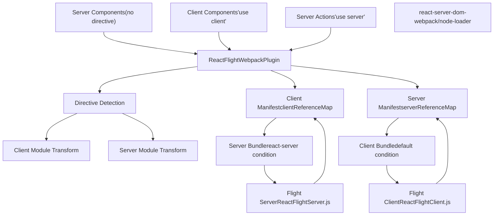
来源：[scripts/rollup/bundles.js524-558](https://github.com/facebook/react/blob/65eec428/scripts/rollup/bundles.js#L524-L558) [packages/react-server/src/ReactFlightServer.js1-100](https://github.com/facebook/react/blob/65eec428/packages/react-server/src/ReactFlightServer.js#L1-L100) [packages/react-client/src/ReactFlightClient.js1-100](https://github.com/facebook/react/blob/65eec428/packages/react-client/src/ReactFlightClient.js#L1-L100)

---

## Webpack 插件实现

`ReactFlightWebpackPlugin` 是主要的构建时集成点。它分析模块指令，转换模块引用，并生成客户端和服务端清单。

**插件包配置**

| 属性 | 值 |
| --- | --- |
| Entry Point | `react-server-dom-webpack/plugin` |
| Bundle Type | `NODE_ES2015` |
| Module Type | `RENDERER_UTILS` |
| Global Name | `ReactServerWebpackPlugin` |
| Externals | `fs`, `path`, `url`, `neo-async` |

该插件作为一个 Webpack 编译插件运行，钩入模块图构建过程以识别客户端和服务端边界。

**模块分析过程**

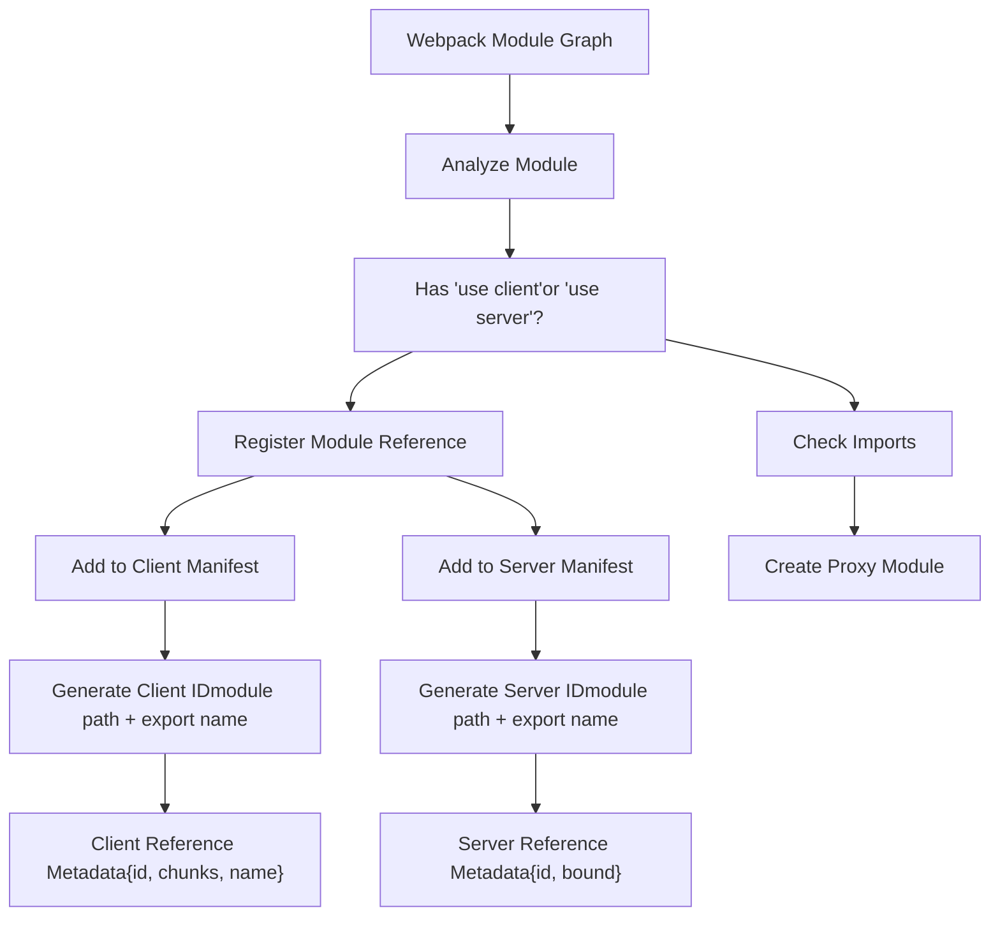
来源：[scripts/rollup/bundles.js524-533](https://github.com/facebook/react/blob/65eec428/scripts/rollup/bundles.js#L524-L533)

---

## 模块引用系统

React Server Components 使用模块引用系统来表示跨越服务端/客户端边界的代码。这些引用是在运行时使用清单解析的不透明标识符。

**客户端引用 (Client Reference) 结构**

客户端引用表示应该在客户端加载的模块。当服务端代码导入一个客户端组件时，它接收到一个引用而不是实际的模块。

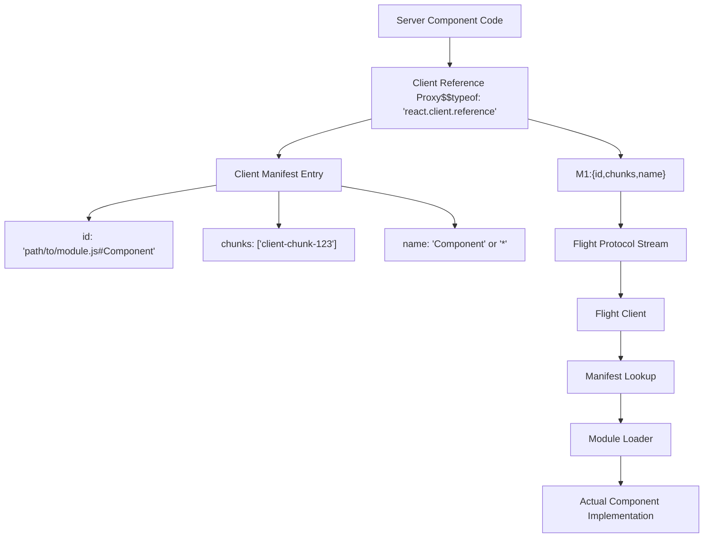
来源：[packages/react-client/src/ReactFlightClient.js1-100](https://github.com/facebook/react/blob/65eec428/packages/react-client/src/ReactFlightClient.js#L1-L100) [packages/react-server/src/ReactFlightServer.js79-101](https://github.com/facebook/react/blob/65eec428/packages/react-server/src/ReactFlightServer.js#L79-L101)

**服务端引用 (Server Reference) 结构**

服务端引用表示应该在服务端执行的函数。当客户端代码调用一个 server action 时，它将引用和参数发回服务端。

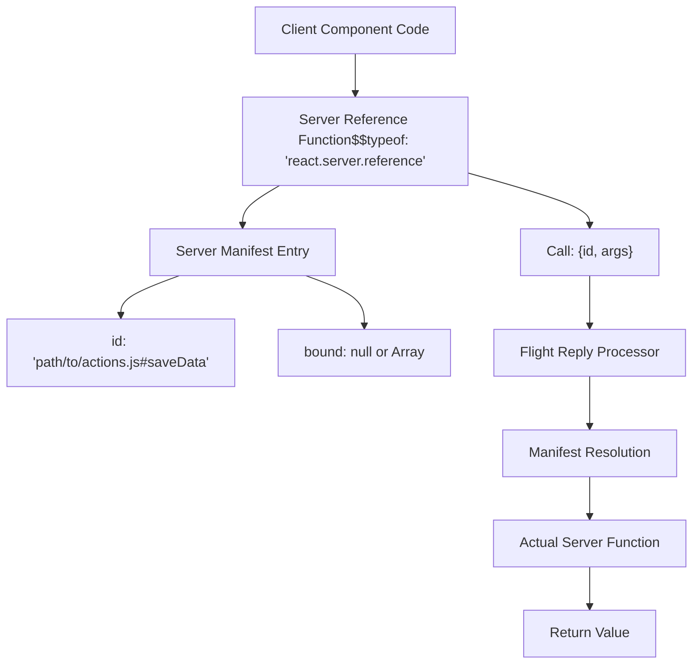
来源：[packages/react-client/src/ReactFlightReplyClient.js52-80](https://github.com/facebook/react/blob/65eec428/packages/react-client/src/ReactFlightReplyClient.js#L52-L80) [packages/react-server/src/ReactFlightReplyServer.js1-50](https://github.com/facebook/react/blob/65eec428/packages/react-server/src/ReactFlightReplyServer.js#L1-L50)

---

## 指令处理

构建系统处理两种类型的指令：`'use client'` 和 `'use server'`。这些指令必须出现在模块的顶部，位于任何其他代码之前。

**指令检测与转换**

| 指令 | 位置 | 含义 | 构建转换 |
| --- | --- | --- | --- |
| `'use client'` | 文件顶部 | 整个模块在客户端运行 | 在服务端 bundle 中替换为客户端引用代理 |
| `'use server'` | 文件顶部 | 整个模块导出 server actions | 在客户端 bundle 中替换为服务端引用代理 |
| `'use server'` | 函数内部 | 单个函数是 server action | 提取并创建服务端引用 |

**客户端指令处理流程**

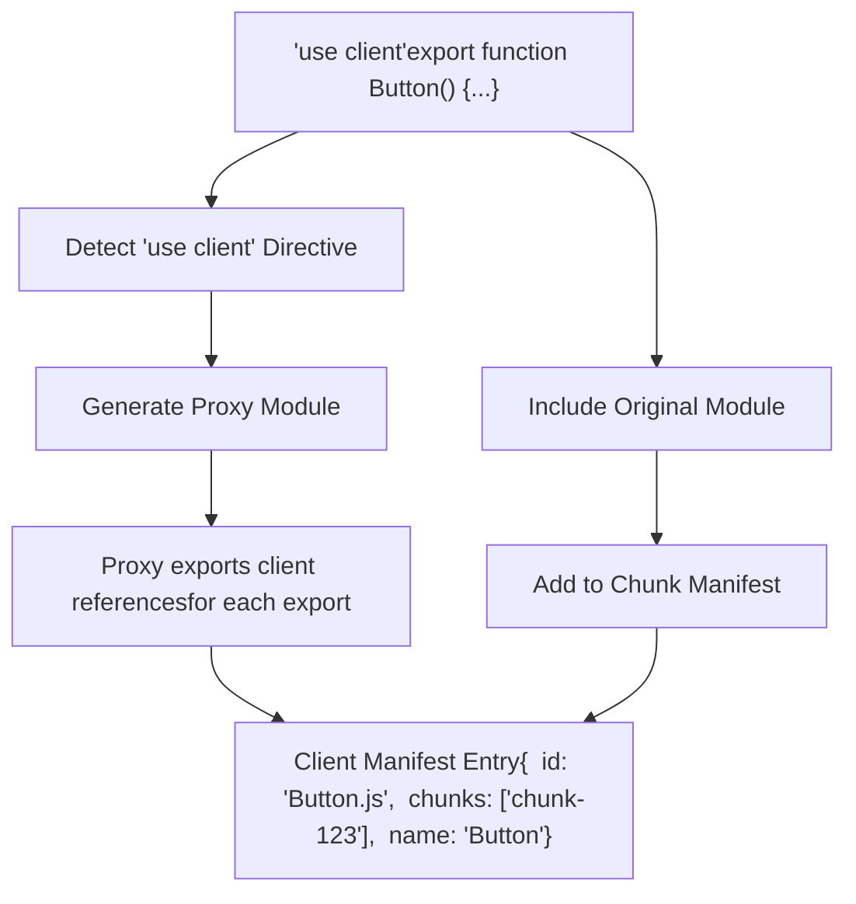
来源：[scripts/rollup/bundles.js448-522](https://github.com/facebook/react/blob/65eec428/scripts/rollup/bundles.js#L448-L522)

**服务端指令处理流程**

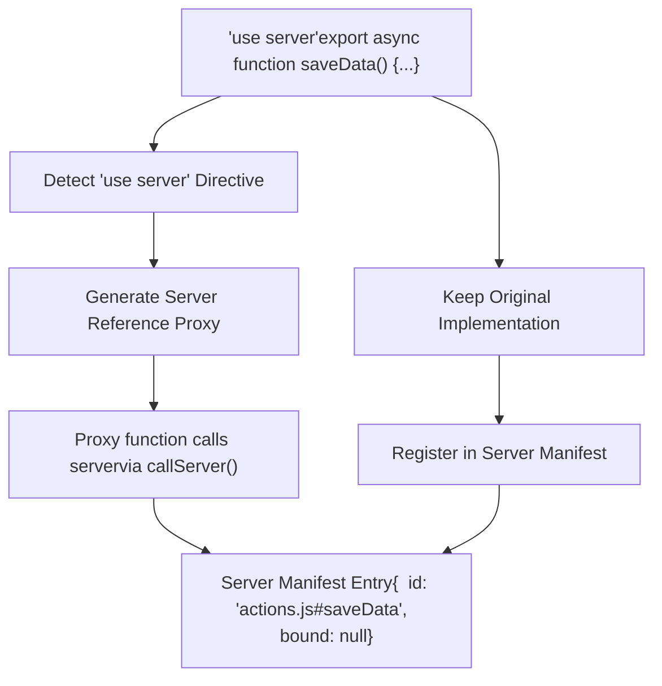
来源：[packages/react-client/src/ReactFlightReplyClient.js1-100](https://github.com/facebook/react/blob/65eec428/packages/react-client/src/ReactFlightReplyClient.js#L1-L100) [packages/react-server/src/ReactFlightReplyServer.js1-50](https://github.com/facebook/react/blob/65eec428/packages/react-server/src/ReactFlightReplyServer.js#L1-L50)

---

## 清单结构

构建过程生成两个清单文件，以实现跨服务端/客户端边界的运行时模块解析。

**客户端清单格式**

客户端清单将模块 ID 映射到 chunk 信息，允许服务端序列化客户端可以解析的客户端引用。

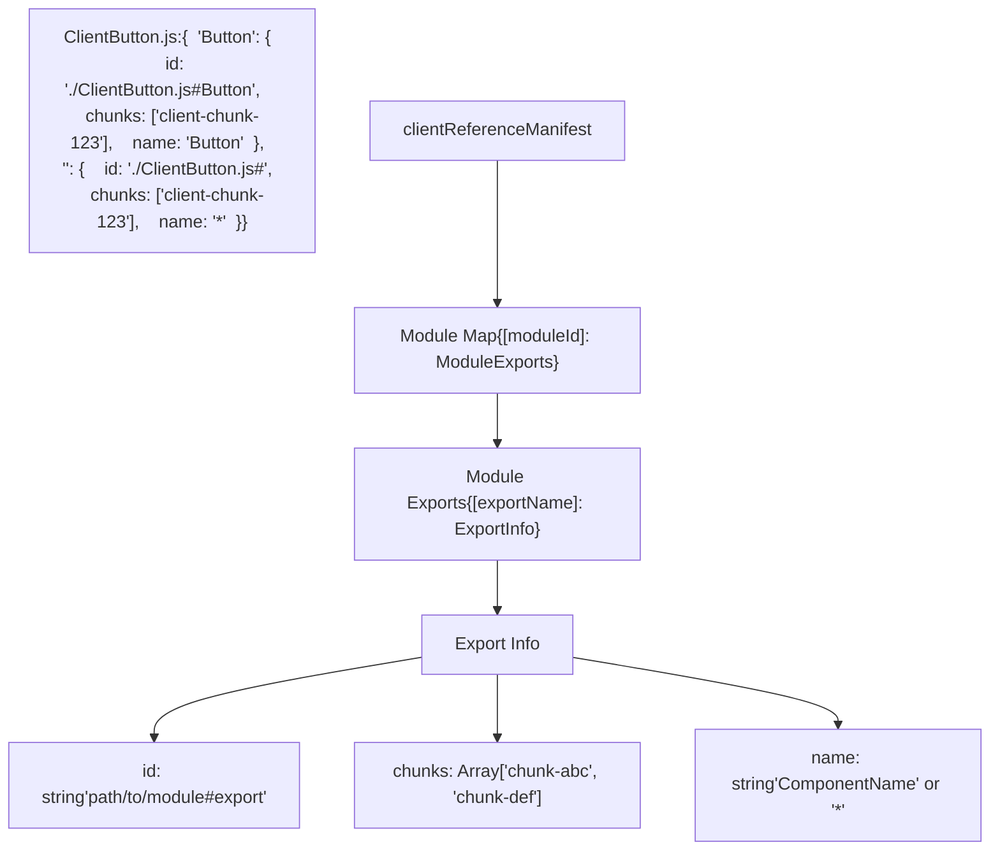
**客户端清单运行时使用**

| 阶段 | 操作 | 清单使用 |
| --- | --- | --- |
| 服务端渲染 | 遇到客户端组件 | 在清单中查找模块 ID 以获取 chunks |
| Flight 序列化 | 序列化客户端引用 | 在流中包含 `{id, chunks, name}` |
| 客户端接收 | 反序列化引用 | 使用 chunks 预加载/加载模块 |
| 客户端渲染 | 实例化组件 | 导入模块并按名称获取导出 |

来源：[packages/react-server/src/ReactFlightServer.js79-101](https://github.com/facebook/react/blob/65eec428/packages/react-server/src/ReactFlightServer.js#L79-L101) [packages/react-client/src/ReactFlightClient.js44-64](https://github.com/facebook/react/blob/65eec428/packages/react-client/src/ReactFlightClient.js#L44-L64)

**服务端清单格式**

服务端清单将 server action ID 映射到模块位置，允许客户端调用服务端函数。

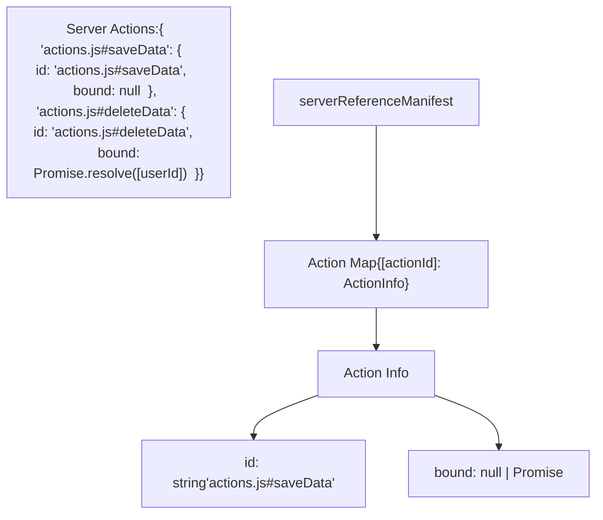
**服务端清单运行时使用**

| 阶段 | 操作 | 清单使用 |
| --- | --- | --- |
| 客户端渲染 | 接收服务端引用 | 存储带有 `$$typeof` 标记的引用 |
| 客户端调用 | 调用服务端函数 | 使用 Flight Reply 序列化 `{id, args}` |
| 服务端接收 | 反序列化调用 | 在清单中查找 action ID |
| 服务端执行 | 加载并调用 | require 模块并按名称调用导出 |

来源：[packages/react-client/src/ReactFlightReplyClient.js52-80](https://github.com/facebook/react/blob/65eec428/packages/react-client/src/ReactFlightReplyClient.js#L52-L80) [packages/react-server/src/ReactFlightReplyServer.js1-50](https://github.com/facebook/react/blob/65eec428/packages/react-server/src/ReactFlightReplyServer.js#L1-L50)

---

## 模块加载集成

构建集成包括在运行时处理 `react-server` 条件的模块加载器，确保在每个环境中加载正确版本的模块。

**Node.js 加载器配置**

| 属性 | 值 |
| --- | --- |
| Entry Point | `react-server-dom-webpack/node-loader` |
| Bundle Type | `ESM_PROD` |
| Condition | `react-server` |
| External | `acorn` (for AST parsing) |

Node.js 加载器使用 ESM 加载器钩子来拦截模块解析，并确保在服务端环境中加载具有 `react-server` 导出条件的模块。

**模块解析流程**

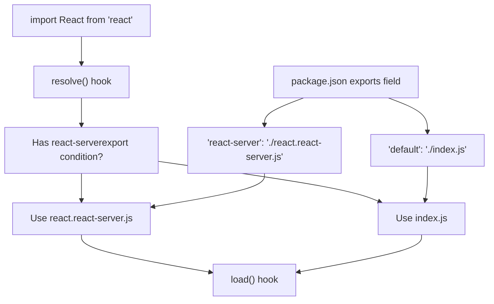
来源：[scripts/rollup/bundles.js535-545](https://github.com/facebook/react/blob/65eec428/scripts/rollup/bundles.js#L535-L545) [packages/react/package.json24-42](https://github.com/facebook/react/blob/65eec428/packages/react/package.json#L24-L42)

**CommonJS 模块注册**

对于 CommonJS 环境，一个注册模块处理模块加载：

| 属性 | 值 |
| --- | --- |
| Entry Point | `react-server-dom-webpack/src/ReactFlightWebpackNodeRegister` |
| Name | `react-server-dom-webpack-node-register` |
| Condition | `react-server` |
| Externals | `url`, `module`, `react-server-dom-webpack/server` |

该模块钩入 Node 的 `require()` 系统，以便为 CommonJS 模块应用 `react-server` 条件。

来源：[scripts/rollup/bundles.js547-558](https://github.com/facebook/react/blob/65eec428/scripts/rollup/bundles.js#L547-L558)

---

## 构建输出组织

构建系统为服务端和客户端环境生成单独的 bundle，每个 bundle 消费适当的清单。

**打包类型矩阵**

| Bundle | 入口点 | 条件 | 消费清单 | 目标环境 |
| --- | --- | --- | --- | --- |
| Server | `react-server-dom-webpack/server.{node,browser,edge}` | `react-server` | 客户端清单 | Node.js, Edge Runtime, 浏览器 (SSR) |
| Client | `react-server-dom-webpack/client.{node,browser,edge}` | default | 服务端清单 | Node.js (for SSR), 浏览器 |
| Plugin | `react-server-dom-webpack/plugin` | N/A | 生成两者 | 仅构建时 |
| Loader | `react-server-dom-webpack/node-loader` | `react-server` | N/A | Node.js ESM 运行时 |

**Server Bundle 配置**

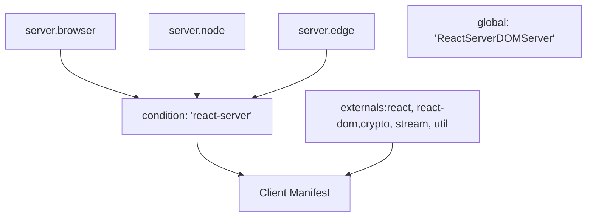
来源：[scripts/rollup/bundles.js448-489](https://github.com/facebook/react/blob/65eec428/scripts/rollup/bundles.js#L448-L489)

**Client Bundle 配置**

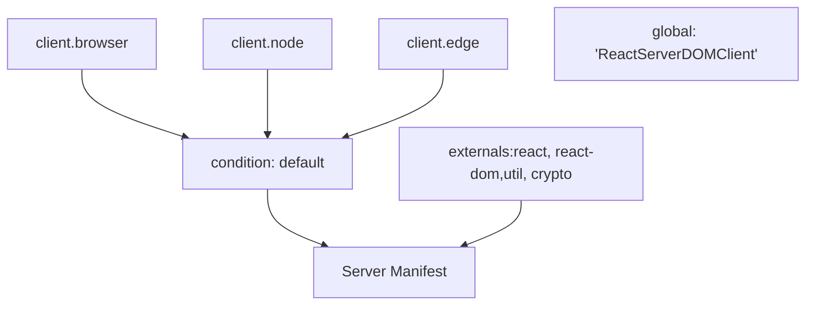
来源：[scripts/rollup/bundles.js491-522](https://github.com/facebook/react/blob/65eec428/scripts/rollup/bundles.js#L491-L522)

---

## 分叉系统集成

构建系统使用分叉机制根据 bundle 类型和环境提供共享模块的不同实现。

**React Shared Internals 分叉**

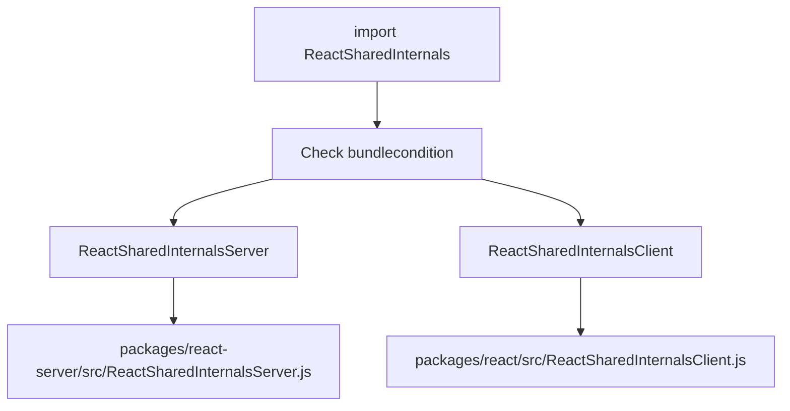
**分叉配置表**

| 模块 | 条件 | 分叉目标 | 用途 |
| --- | --- | --- | --- |
| `shared/ReactSharedInternals.js` | `react-server` | `ReactSharedInternalsServer.js` | 服务端特定的内部实现 (Flight hooks) |
| `shared/ReactSharedInternals.js` | default | `ReactSharedInternalsClient.js` | 客户端特定的内部实现 (useState 等) |
| `shared/ReactDOMSharedInternals.js` | `react-server` | N/A | 在 react-server 中不可用 |
| `shared/ReactDOMSharedInternals.js` | default | `ReactDOMSharedInternals.js` | DOM 特定的内部实现 |

来源：[scripts/rollup/forks.js52-131](https://github.com/facebook/react/blob/65eec428/scripts/rollup/forks.js#L52-L131) [scripts/rollup/build.js354-403](https://github.com/facebook/react/blob/65eec428/scripts/rollup/build.js#L354-L403)

---

## 与其他打包工具集成

虽然主要实现使用 Webpack，但该架构通过类似的插件系统支持其他打包工具。

**Turbopack 集成**

| Bundle | 入口点 | 备注 |
| --- | --- | --- |
| Server | `react-server-dom-turbopack/server.{browser,node,edge}` | 类似于 Webpack server |
| Client | `react-server-dom-turbopack/client.{browser,node,edge}` | 类似于 Webpack client |

Turbopack 集成遵循相同的清单生成和模块引用模式，但使用 Turbopack 的原生插件系统而不是 Webpack 的。

来源：[scripts/rollup/bundles.js560-672](https://github.com/facebook/react/blob/65eec428/scripts/rollup/bundles.js#L560-L672)

**Unbundled (开发) 集成**

对于没有打包工具的开发和测试：

| Bundle | 入口点 | 用途 |
| --- | --- | --- |
| Server | `react-server-dom-unbundled/server.node` | 无打包，直接模块解析 |
| Client | `react-server-dom-unbundled/client.node` | 无打包，直接模块导入 |

此配置主要用于测试，以在没有打包工具复杂性的情况下验证 Flight 协议。

来源：测试文件显示使用 WebpackMock 实用程序来模拟清单生成而无需实际打包。

---

## 总结

React Server Components 的构建集成通过以下方式运作：

1.  **插件系统**：`ReactFlightWebpackPlugin` 分析模块并生成清单
2.  **模块引用**：带有 `$$typeof` 标记的跨边界模块的抽象表示
3.  **指令处理**：将 `'use client'` 和 `'use server'` 指令转换为适当的引用
4.  **清单生成**：创建客户端清单（服务端 → 客户端）和服务端清单（客户端 → 服务端）
5.  **模块加载**：使用带有 `react-server` 导出条件的基于条件的解析
6.  **分叉系统**：提供共享模块的特定于环境的实现

该架构是与打包工具无关的，Webpack、Turbopack 和 unbundled 环境的实现都遵循相同的清单和引用模式。

来源：[scripts/rollup/bundles.js448-672](https://github.com/facebook/react/blob/65eec428/scripts/rollup/bundles.js#L448-L672) [scripts/rollup/forks.js1-300](https://github.com/facebook/react/blob/65eec428/scripts/rollup/forks.js#L1-300) [scripts/rollup/build.js1-600](https://github.com/facebook/react/blob/65eec428/scripts/rollup/build.js#L1-L600)
