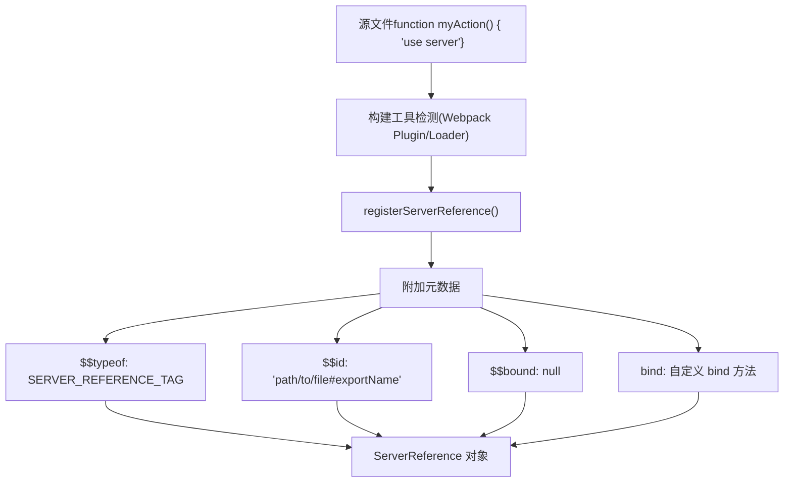
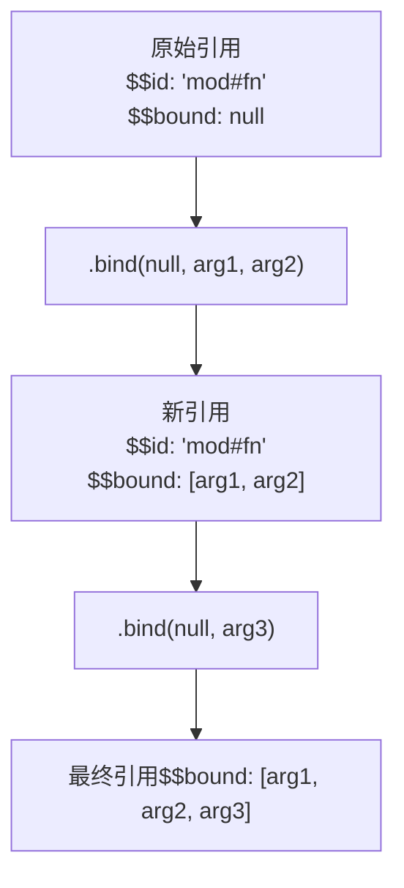
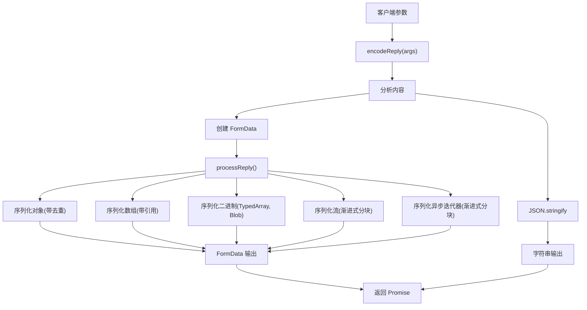
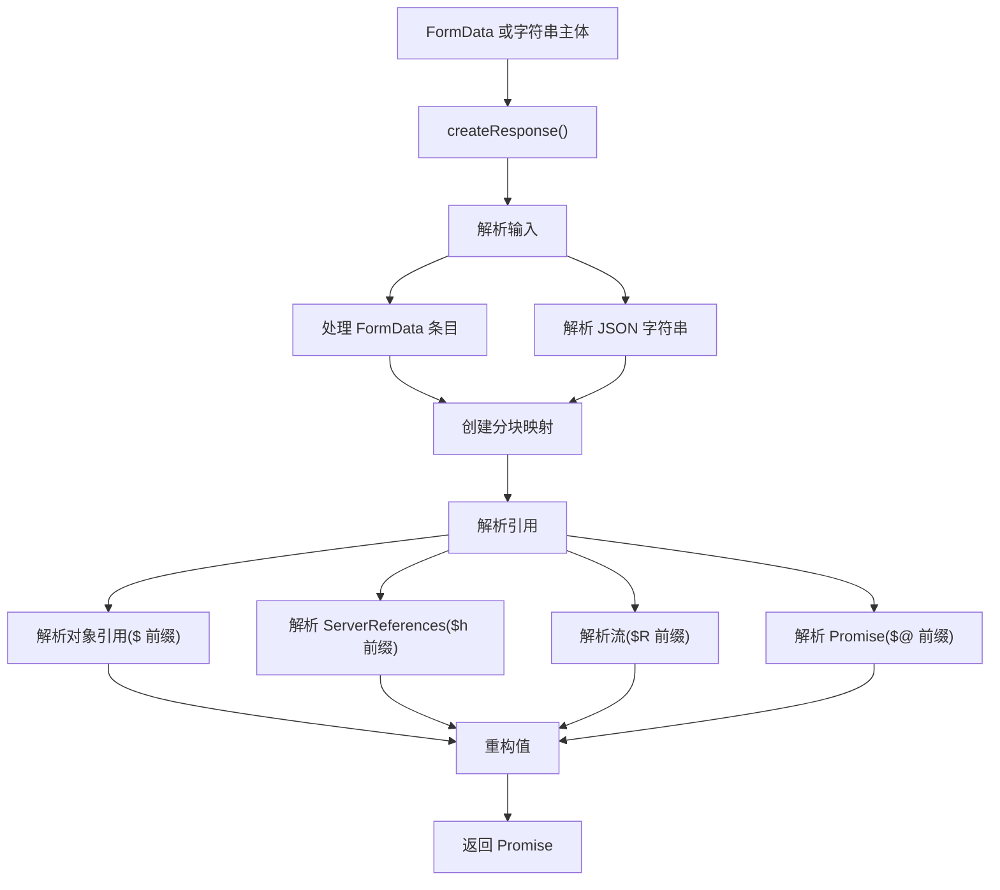
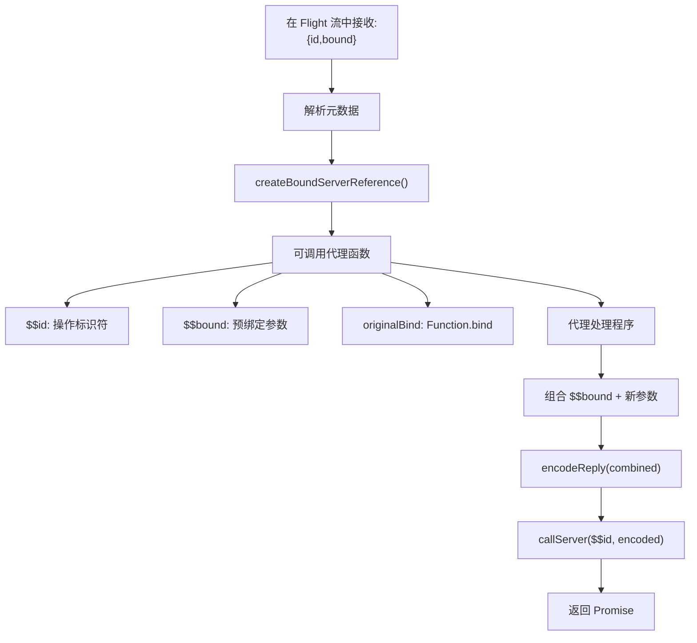
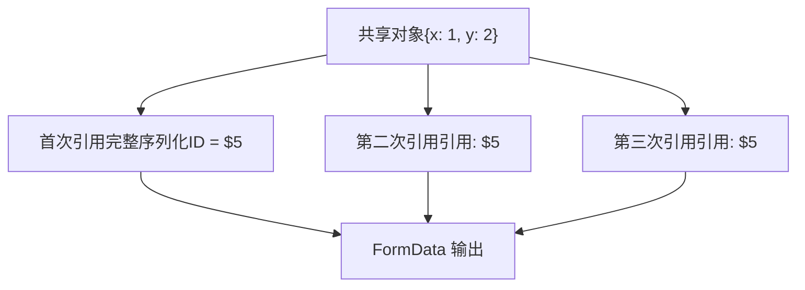
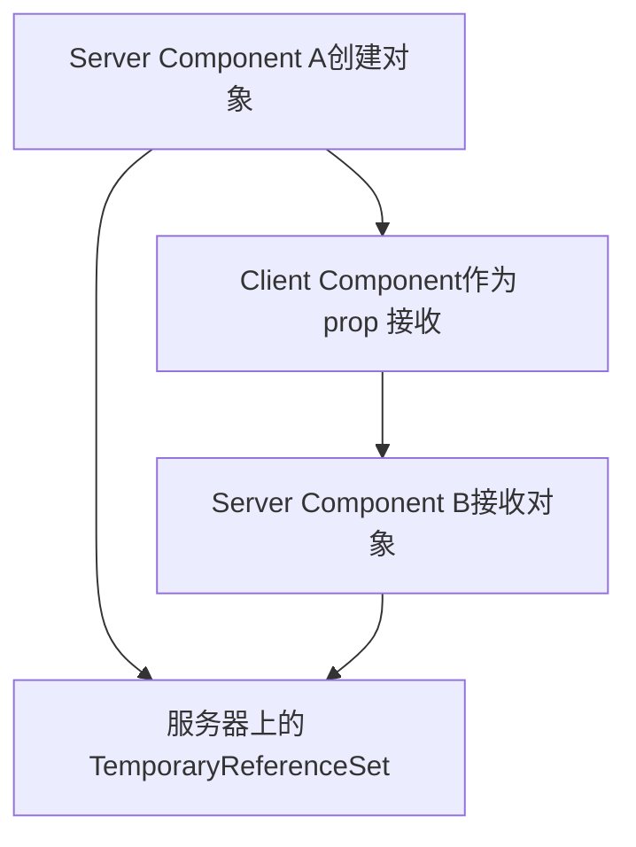

# Server Actions 与双向通信

相关源文件

-   [packages/react-client/src/ReactFlightClient.js](https://github.com/facebook/react/blob/65eec428/packages/react-client/src/ReactFlightClient.js)
-   [packages/react-client/src/ReactFlightReplyClient.js](https://github.com/facebook/react/blob/65eec428/packages/react-client/src/ReactFlightReplyClient.js)
-   [packages/react-client/src/ReactFlightTemporaryReferences.js](https://github.com/facebook/react/blob/65eec428/packages/react-client/src/ReactFlightTemporaryReferences.js)
-   [packages/react-client/src/\_\_tests\_\_/ReactFlight-test.js](https://github.com/facebook/react/blob/65eec428/packages/react-client/src/__tests__/ReactFlight-test.js)
-   [packages/react-server-dom-esm/src/ReactFlightESMReferences.js](https://github.com/facebook/react/blob/65eec428/packages/react-server-dom-esm/src/ReactFlightESMReferences.js)
-   [packages/react-server-dom-parcel/src/ReactFlightParcelReferences.js](https://github.com/facebook/react/blob/65eec428/packages/react-server-dom-parcel/src/ReactFlightParcelReferences.js)
-   [packages/react-server-dom-turbopack/src/ReactFlightTurbopackReferences.js](https://github.com/facebook/react/blob/65eec428/packages/react-server-dom-turbopack/src/ReactFlightTurbopackReferences.js)
-   [packages/react-server-dom-unbundled/src/ReactFlightUnbundledReferences.js](https://github.com/facebook/react/blob/65eec428/packages/react-server-dom-unbundled/src/ReactFlightUnbundledReferences.js)
-   [packages/react-server-dom-webpack/src/ReactFlightWebpackNodeLoader.js](https://github.com/facebook/react/blob/65eec428/packages/react-server-dom-webpack/src/ReactFlightWebpackNodeLoader.js)
-   [packages/react-server-dom-webpack/src/ReactFlightWebpackNodeRegister.js](https://github.com/facebook/react/blob/65eec428/packages/react-server-dom-webpack/src/ReactFlightWebpackNodeRegister.js)
-   [packages/react-server-dom-webpack/src/ReactFlightWebpackPlugin.js](https://github.com/facebook/react/blob/65eec428/packages/react-server-dom-webpack/src/ReactFlightWebpackPlugin.js)
-   [packages/react-server-dom-webpack/src/ReactFlightWebpackReferences.js](https://github.com/facebook/react/blob/65eec428/packages/react-server-dom-webpack/src/ReactFlightWebpackReferences.js)
-   [packages/react-server-dom-webpack/src/\_\_tests\_\_/ReactFlightDOM-test.js](https://github.com/facebook/react/blob/65eec428/packages/react-server-dom-webpack/src/__tests__/ReactFlightDOM-test.js)
-   [packages/react-server-dom-webpack/src/\_\_tests\_\_/ReactFlightDOMBrowser-test.js](https://github.com/facebook/react/blob/65eec428/packages/react-server-dom-webpack/src/__tests__/ReactFlightDOMBrowser-test.js)
-   [packages/react-server-dom-webpack/src/\_\_tests\_\_/ReactFlightDOMEdge-test.js](https://github.com/facebook/react/blob/65eec428/packages/react-server-dom-webpack/src/__tests__/ReactFlightDOMEdge-test.js)
-   [packages/react-server-dom-webpack/src/\_\_tests\_\_/ReactFlightDOMNode-test.js](https://github.com/facebook/react/blob/65eec428/packages/react-server-dom-webpack/src/__tests__/ReactFlightDOMNode-test.js)
-   [packages/react-server-dom-webpack/src/\_\_tests\_\_/ReactFlightDOMReply-test.js](https://github.com/facebook/react/blob/65eec428/packages/react-server-dom-webpack/src/__tests__/ReactFlightDOMReply-test.js)
-   [packages/react-server-dom-webpack/src/\_\_tests\_\_/ReactFlightDOMReplyEdge-test.js](https://github.com/facebook/react/blob/65eec428/packages/react-server-dom-webpack/src/__tests__/ReactFlightDOMReplyEdge-test.js)
-   [packages/react-server-dom-webpack/src/\_\_tests\_\_/utils/WebpackMock.js](https://github.com/facebook/react/blob/65eec428/packages/react-server-dom-webpack/src/__tests__/utils/WebpackMock.js)
-   [packages/react-server/src/ReactFlightReplyServer.js](https://github.com/facebook/react/blob/65eec428/packages/react-server/src/ReactFlightReplyServer.js)
-   [packages/react-server/src/ReactFlightServer.js](https://github.com/facebook/react/blob/65eec428/packages/react-server/src/ReactFlightServer.js)
-   [packages/react-server/src/ReactFlightServerTemporaryReferences.js](https://github.com/facebook/react/blob/65eec428/packages/react-server/src/ReactFlightServerTemporaryReferences.js)
-   [scripts/error-codes/codes.json](https://github.com/facebook/react/blob/65eec428/scripts/error-codes/codes.json)

## 目的与范围

本文档解释了 React Server Components 如何通过 Server Actions（服务器操作）和 Reply 协议实现客户端到服务器的通信。虽然 Flight 协议（详见 [React Server Components (Flight)](/facebook/react/5.2-react-server-components-(flight))) 处理服务器到客户端的流式传输，但 Server Actions 实现了反向操作：允许从客户端调用服务器端函数，并支持完整的参数序列化。

有关构建工具如何生成启用此功能的清单（manifests）的信息，请参阅 [Build Integration for Server Components](/facebook/react/5.3-build-integration-for-server-components)。

## 概述

Server Actions 在 React Server Components 中通过以下方式提供双向通信：

1.  **Server References（服务器引用）**：标记有 `'use server'` 的函数，可以从客户端调用。
2.  **Reply 协议**：用于函数参数的客户端到服务器序列化格式。
3.  **Bound References（绑定引用）**：使用 `.bind()` 对 Server Actions 进行部分应用（Partial application）。
4.  **表单集成**：为表单操作提供渐进式增强。

---

## Server References（服务器引用）

### 引用结构

Server Reference 是一种特殊的函数对象，带有启用跨边界调用的元数据。

**类型定义：**

```
ServerReference<T> = T & {
  $$typeof: Symbol.for('react.server.reference'),
  $$id: string,
  $$bound: null | Array<ReactClientValue>,
  $$location?: Error  // 仅限开发环境
}
```
来源：[packages/react-server-dom-webpack/src/ReactFlightWebpackReferences.js12-17](https://github.com/facebook/react/blob/65eec428/packages/react-server-dom-webpack/src/ReactFlightWebpackReferences.js#L12-L17)

### 注册与创建


来源：[packages/react-server-dom-webpack/src/ReactFlightWebpackReferences.js111-144](https://github.com/facebook/react/blob/65eec428/packages/react-server-dom-webpack/src/ReactFlightWebpackReferences.js#L111-L144) [packages/react-server-dom-webpack/src/ReactFlightWebpackNodeRegister.js16-67](https://github.com/facebook/react/blob/65eec428/packages/react-server-dom-webpack/src/ReactFlightWebpackNodeRegister.js#L16-L67)

`registerServerReference` 函数为函数装饰上服务器引用元数据：

[packages/react-server-dom-webpack/src/ReactFlightWebpackReferences.js111-144](https://github.com/facebook/react/blob/65eec428/packages/react-server-dom-webpack/src/ReactFlightWebpackReferences.js#L111-L144)

**关键属性：**

-   `$$typeof`：标识其为服务器引用的 Symbol。
-   `$$id`：结合了模块 ID 和导出名称（例如，`"file.js#actionName"`）。
-   `$$bound`：来自 `.bind()` 调用的参数数组，初始为 `null`。
-   `bind`：保留元数据的自定义 bind 实现。

### 绑定的服务器引用

服务器引用支持通过自定义的 `.bind()` 实现进行部分应用：


来源：[packages/react-server-dom-webpack/src/ReactFlightWebpackReferences.js65-103](https://github.com/facebook/react/blob/65eec428/packages/react-server-dom-webpack/src/ReactFlightWebpackReferences.js#L65-L103)

自定义 bind 函数：

1.  要求 `this` 上下文为 `null` 或 `undefined`（否则在开发环境下发出警告）。
2.  在 `$$bound` 数组中累积绑定的参数。
3.  保留原始引用的 `$$id`。
4.  返回带有组合元数据的新函数。

[packages/react-server-dom-webpack/src/ReactFlightWebpackReferences.js65-103](https://github.com/facebook/react/blob/65eec428/packages/react-server-dom-webpack/src/ReactFlightWebpackReferences.js#L65-L103)

---

## Reply 协议（客户端到服务器通信）

### encodeReply 函数

客户端的 `encodeReply` 函数序列化函数参数，以便传输到服务器。

**API：**

```
encodeReply(
  value: ReactServerValue,
  options?: { temporaryReferences?: TemporaryReferenceSet }
): Promise<string | FormData>
```
**返回类型：**

-   `string`：用于简单的、完全同步的数据的 JSON。
-   `FormData`：用于复杂数据，包括二进制、流或异步迭代器。

来源：[packages/react-client/src/ReactFlightReplyClient.js178-427](https://github.com/facebook/react/blob/65eec428/packages/react-client/src/ReactFlightReplyClient.js#L178-L427)

### 编码流程


来源：[packages/react-client/src/ReactFlightReplyClient.js178-427](https://github.com/facebook/react/blob/65eec428/packages/react-client/src/ReactFlightReplyClient.js#L178-L427)

### 支持的数据类型

| 类型 | 编码格式 | 示例 |
| --- | --- | --- |
| **基元类型** | 直接 JSON | `string`, `number`, `boolean`, `null` |
| **undefined** | `"$undefined"` | 特殊标记字符串 |
| **BigInt** | `"$n" + value` | `"$n12345678901234567890"` |
| **Date** | `"$D" + ISO8601` | `"$D2024-01-15T10:30:00.000Z"` |
| **Map** | `"$Q" + id` | 序列化条目的引用 |
| **Set** | `"$W" + id` | 序列化条目的引用 |
| **ArrayBuffer** | `"$A" + id` | FormData 中的 Blob |
| **TypedArray** | `"$" + type + id` | 例如，Uint8Array 为 `"$O1"` |
| **Blob/File** | `"$B" + id` | FormData 中的 Blob |
| **FormData** | `"$K" + id` | 嵌套的 FormData 条目 |
| **ReadableStream** | `"$R" + id` 或 `"$r" + id` | 渐进式分块（如果是二进制则使用 BYOB） |
| **AsyncIterable** | `"$X" + id` 或 `"$x" + id` | 渐进式分块（iterator 与 iterable） |
| **Iterator** | `"$i" + id` | 单次迭代 |
| **Promise** | `"$@" + id` | 异步解析 |
| **ServerReference** | `"$h" + id` | 带有绑定参数的服务器引用 |

来源：[packages/react-client/src/ReactFlightReplyClient.js98-174](https://github.com/facebook/react/blob/65eec428/packages/react-client/src/ReactFlightReplyClient.js#L98-L174)

### 序列化格式细节

#### 对象引用

使用 WeakMap 对对象进行去重，以避免发送重复数据：

[packages/react-client/src/ReactFlightReplyClient.js188](https://github.com/facebook/react/blob/65eec428/packages/react-client/src/ReactFlightReplyClient.js#L188-L188)

首次出现进行完整序列化，后续引用使用 `"$"` + `id` 格式。

#### 流序列化

ReadableStream 会被渐进式地序列化：

[packages/react-client/src/ReactFlightReplyClient.js280-291](https://github.com/facebook/react/blob/65eec428/packages/react-client/src/ReactFlightReplyClient.js#L280-L291)

```
<前缀><streamId>: <chunk1-json>
<前缀><streamId>: <chunk2-json>
<前缀><streamId>: C
```
最后的 `C` 标记信号表示流已完成。

#### 二进制数据

TypedArray 和 Blob 被编码为多部分 FormData 条目：

[packages/react-client/src/ReactFlightReplyClient.js191-210](https://github.com/facebook/react/blob/65eec428/packages/react-client/src/ReactFlightReplyClient.js#L191-L210)

```
// TypedArray 示例
const buffer = new Uint8Array([1, 2, 3, 4]);
// 编码为："$O" + id，并在 FormData 中带有 blob
```
---

## decodeReply 函数（服务器端）

服务器使用 `decodeReply` 解码客户端参数：

**API：**

```
decodeReply(
  body: string | FormData,
  serverManifest: ServerManifest,
  options?: { temporaryReferences?: TemporaryReferenceSet }
): Promise<any>
```
来源：[packages/react-server/src/ReactFlightReplyServer.js686-800](https://github.com/facebook/react/blob/65eec428/packages/react-server/src/ReactFlightReplyServer.js#L686-L800)

### 解码流程


来源：[packages/react-server/src/ReactFlightReplyServer.js686-800](https://github.com/facebook/react/blob/65eec428/packages/react-server/src/ReactFlightReplyServer.js#L686-L800)

解码器：

1.  创建一个带有分块映射的 `Response` 对象。
2.  将 FormData 条目解析为编号的分块。
3.  使用状态机解析引用。
4.  重构复杂类型（Map、Set、流）。
5.  返回解析为最终值的 Promise。

[packages/react-server/src/ReactFlightReplyServer.js686-800](https://github.com/facebook/react/blob/65eec428/packages/react-server/src/ReactFlightReplyServer.js#L686-L800)

---

## Server Action 调用流程

> **[Mermaid 序列图]**
> *(图表结构无法解析)*

来源：[packages/react-client/src/ReactFlightReplyClient.js428-482](https://github.com/facebook/react/blob/65eec428/packages/react-client/src/ReactFlightReplyClient.js#L428-L482) [packages/react-server/src/ReactFlightReplyServer.js686-800](https://github.com/facebook/react/blob/65eec428/packages/react-server/src/ReactFlightReplyServer.js#L686-L800)

### callServer 回调

Flight Client 需要 `callServer` 实现来处理网络层：

[packages/react-client/src/ReactFlightReplyClient.js54](https://github.com/facebook/react/blob/65eec428/packages/react-client/src/ReactFlightReplyClient.js#L54-L54)

**类型：**

```
type CallServerCallback = <A, T>(
  id: ServerReferenceId,
  args: A
) => Promise<T>
```
**典型实现：**

```
async function callServer(actionId, args) {
  const body = await ReactFlightReplyClient.encodeReply(args);

  const response = await fetch('/rsc-action', {
    method: 'POST',
    headers: { 'X-Action-Id': actionId },
    body: body
  });

  return ReactFlightClient.createFromFetch(response);
}
```
来源：[packages/react-client/src/ReactFlightReplyClient.js54](https://github.com/facebook/react/blob/65eec428/packages/react-client/src/ReactFlightReplyClient.js#L54-L54) [packages/react-server-dom-webpack/src/\_\_tests\_\_/ReactFlightDOMBrowser-test.js154-158](https://github.com/facebook/react/blob/65eec428/packages/react-server-dom-webpack/src/__tests__/ReactFlightDOMBrowser-test.js#L154-L158) 中的测试示例

---

## 引用序列化与解析

### 服务器端：序列化引用

当 ReactFlightServer 遇到 ServerReference 时，它会序列化元数据：

[packages/react-server/src/ReactFlightServer.js2203-2239](https://github.com/facebook/react/blob/65eec428/packages/react-server/src/ReactFlightServer.js#L2203-L2239)

**格式：**

```
{
  $$typeof: Symbol.for("react.server.reference"),
  $$id: "module-path#export-name",
  $$bound: [arg1, arg2] || null
}
```
服务器使用配置函数提取此信息：

-   `getServerReferenceId(reference)`：返回 ID 字符串。
-   `getServerReferenceBoundArguments(reference)`：返回绑定的参数数组。

来源：[packages/react-server/src/ReactFlightServer.js81-83](https://github.com/facebook/react/blob/65eec428/packages/react-server/src/ReactFlightServer.js#L81-L83)

### 客户端：创建可调用代理

ReactFlightClient 接收序列化的引用并创建一个可调用代理：


来源：[packages/react-client/src/ReactFlightReplyClient.js428-482](https://github.com/facebook/react/blob/65eec428/packages/react-client/src/ReactFlightReplyClient.js#L428-L482)

代理函数实现：

[packages/react-client/src/ReactFlightReplyClient.js428-482](https://github.com/facebook/react/blob/65eec428/packages/react-client/src/ReactFlightReplyClient.js#L428-L482)

1.  存储服务器引用 ID 和绑定的参数。
2.  被调用时，将绑定的参数加到新参数之前。
3.  使用 `encodeReply` 编码组合后的参数。
4.  调用 `callServer` 回调。
5.  返回解析为结果的 Promise。

---

## 表单集成

### 表单操作

Server Actions 可以直接用作表单操作：

```
function MyForm({ submitAction }) {
  return (
    <form action={submitAction}>
      <input name="username" />
      <button type="submit">Submit</button>
    </form>
  );
}
```
提交时：

1.  浏览器从输入框收集 FormData。
2.  React 拦截提交（如果启用了 JavaScript）。
3.  使用 FormData 调用 Server Action。
4.  参数通过 Reply 协议编码。
5.  结果作为 Promise 返回。

来源：[packages/react-client/src/ReactFlightReplyClient.js56-59](https://github.com/facebook/react/blob/65eec428/packages/react-client/src/ReactFlightReplyClient.js#L56-L59)

### encodeFormAction 回调

`encodeFormAction` 回调自定义表单操作行为：

[packages/react-client/src/ReactFlightReplyClient.js56-59](https://github.com/facebook/react/blob/65eec428/packages/react-client/src/ReactFlightReplyClient.js#L56-L59)

**类型：**

```
type EncodeFormActionCallback = <A>(
  id: ServerReferenceId,
  args: Promise<A>
) => ReactCustomFormAction
```
这允许框架：

-   返回自定义表单操作 URL。
-   在隐藏字段中嵌入操作元数据。
-   实现渐进式增强。

### 渐进式增强

Server Actions 同时支持启用 JavaScript 和未启用 JavaScript 的场景：

| 场景 | 行为 |
| --- | --- |
| **未启用 JavaScript** | 表单直接 POST 到服务器端点 |
| **启用 JavaScript** | 表单提交被拦截，通过 Reply 协议编码 |
| **注水 (Hydration)** | 操作在 SSR 后立即生效 |

对 FormData 的双重支持（作为输入和输出）实现了这种灵活性。

来源：[packages/react-client/src/ReactFlightReplyClient.js178-427](https://github.com/facebook/react/blob/65eec428/packages/react-client/src/ReactFlightReplyClient.js#L178-L427)

---

## 高级功能

### 对象去重

Reply 协议对对象进行去重以最小化有效负载大小：


来源：[packages/react-client/src/ReactFlightReplyClient.js188](https://github.com/facebook/react/blob/65eec428/packages/react-client/src/ReactFlightReplyClient.js#L188-L188)

使用 WeakMap 跟踪已序列化的对象：

-   首次出现：进行完整序列化并分配 ID。
-   后续：引用该 ID（`"$"` + `id`）。
-   通过此机制支持循环引用。

### 流式数据

ReadableStream 和 AsyncIterable 渐进式地流式传输：

[packages/react-client/src/ReactFlightReplyClient.js294-336](https://github.com/facebook/react/blob/65eec428/packages/react-client/src/ReactFlightReplyClient.js#L294-L336)

**机制：**

1.  立即分配流 ID。
2.  开始读取流的分块（chunks）。
3.  将每个分块作为单独的 FormData 条目追加。
4.  完成时发送关闭标记。

**格式：**

```
前缀<id>: <chunk1-json>
前缀<id>: <chunk2-json>
前缀<id>: <chunk3-json>
前缀<id>: C
```
这实现了大型或无界数据的高效传输。

### 临时引用 (Temporary References)

临时引用用于在服务器上下文之间传递不可序列化的对象：


来源：[packages/react-server/src/ReactFlightServerTemporaryReferences.js20-44](https://github.com/facebook/react/blob/65eec428/packages/react-server/src/ReactFlightServerTemporaryReferences.js#L20-L44) [packages/react-client/src/ReactFlightTemporaryReferences.js1-32](https://github.com/facebook/react/blob/65eec428/packages/react-client/src/ReactFlightTemporaryReferences.js#L1-L32)

**用例：**

-   Server Component A 创建复杂对象（例如数据库连接）。
-   通过客户端组件 prop 传递给 Server Component B。
-   客户端将其序列化为临时引用（`"$T"` + `id`）。
-   Server Component B 接收原始对象实例。

**格式：**

```
"$T" 标记 + 引用 ID
```
服务器维护一个 `TemporaryReferenceSet` (WeakMap) 来解析这些引用。

[packages/react-server/src/ReactFlightServerTemporaryReferences.js12-22](https://github.com/facebook/react/blob/65eec428/packages/react-server/src/ReactFlightServerTemporaryReferences.js#L12-L22)

---

## 错误处理

### 序列化错误

`encodeReply` 过程中的错误会导致返回的 Promise 被拒绝（reject）：

**常见情况：**

-   不可序列化的对象（DOM 节点、非服务器引用的函数）。
-   没有临时引用支持的循环引用。
-   无效的类型组合。

来源：[packages/react-client/src/ReactFlightReplyClient.js178-427](https://github.com/facebook/react/blob/65eec428/packages/react-client/src/ReactFlightReplyClient.js#L178-L427)

### 网络错误

网络失败由 `callServer` 实现处理：

-   连接失败。
-   超时错误。
-   HTTP 错误响应。

这些错误会作为拒绝的 Promise 传播给调用者。

### Server Action 错误

在 Server Actions 中抛出的错误：

1.  被 ReactFlightServer 捕获。
2.  通过 Flight 错误协议进行序列化。
3.  作为拒绝的 Promise 返回给客户端。
4.  包含错误摘要（生产环境）或完整细节（开发环境）。

来源：[packages/react-server/src/ReactFlightServer.js646-649](https://github.com/facebook/react/blob/65eec428/packages/react-server/src/ReactFlightServer.js#L646-L649)

---

## 实现参考

| 组件 | 文件 |
| --- | --- |
| **ServerReference 类型** | [packages/react-server-dom-webpack/src/ReactFlightWebpackReferences.js12-17](https://github.com/facebook/react/blob/65eec428/packages/react-server-dom-webpack/src/ReactFlightWebpackReferences.js#L12-L17) |
| **registerServerReference** | [packages/react-server-dom-webpack/src/ReactFlightWebpackReferences.js111-144](https://github.com/facebook/react/blob/65eec428/packages/react-server-dom-webpack/src/ReactFlightWebpackReferences.js#L111-L144) |
| **自定义 bind 实现** | [packages/react-server-dom-webpack/src/ReactFlightWebpackReferences.js65-103](https://github.com/facebook/react/blob/65eec428/packages/react-server-dom-webpack/src/ReactFlightWebpackReferences.js#L65-L103) |
| **encodeReply (客户端)** | [packages/react-client/src/ReactFlightReplyClient.js178-427](https://github.com/facebook/react/blob/65eec428/packages/react-client/src/ReactFlightReplyClient.js#L178-L427) |
| **processReply (客户端)** | [packages/react-client/src/ReactFlightReplyClient.js178-427](https://github.com/facebook/react/blob/65eec428/packages/react-client/src/ReactFlightReplyClient.js#L178-L427) |
| **decodeReply (服务器)** | [packages/react-server/src/ReactFlightReplyServer.js686-800](https://github.com/facebook/react/blob/65eec428/packages/react-server/src/ReactFlightReplyServer.js#L686-L800) |
| **createBoundServerReference** | [packages/react-client/src/ReactFlightReplyClient.js428-482](https://github.com/facebook/react/blob/65eec428/packages/react-client/src/ReactFlightReplyClient.js#L428-L482) |
| **临时引用 (服务器)** | [packages/react-server/src/ReactFlightServerTemporaryReferences.js](https://github.com/facebook/react/blob/65eec428/packages/react-server/src/ReactFlightServerTemporaryReferences.js) |
| **临时引用 (客户端)** | [packages/react-client/src/ReactFlightTemporaryReferences.js](https://github.com/facebook/react/blob/65eec428/packages/react-client/src/ReactFlightTemporaryReferences.js) |
| **Node 注册 Hook** | [packages/react-server-dom-webpack/src/ReactFlightWebpackNodeRegister.js](https://github.com/facebook/react/blob/65eec428/packages/react-server-dom-webpack/src/ReactFlightWebpackNodeRegister.js) |
| **Node 加载器** | [packages/react-server-dom-webpack/src/ReactFlightWebpackNodeLoader.js](https://github.com/facebook/react/blob/65eec428/packages/react-server-dom-webpack/src/ReactFlightWebpackNodeLoader.js) |

---

## 总结

Server Actions 通过以下方式在 React Server Components 中实现双向通信：

1.  **Server References（服务器引用）**：带有元数据（`$$id`, `$$bound`）的函数，用于跨边界调用。
2.  **Reply 协议**：强大的序列化机制，支持基元类型、二进制数据、流和异步迭代器。
3.  **绑定的引用**：通过 `.bind()` 进行部分应用并累积参数。
4.  **表单集成**：为表单提交提供渐进式增强。
5.  **对象去重**：高效编码，避免重复数据传输。
6.  **渐进式流传输**：流和异步迭代器的分块序列化。
7.  **临时引用**：服务器上下文之间不可序列化对象的传递。
8.  **错误传播**：涵盖序列化、网络和执行全过程的全面错误处理。

该系统主要使用 FormData 作为复杂数据的传输格式，简单情况下则回退到 JSON 字符串。这种设计实现了丰富的客户端-服务器交互，同时保持了渐进式增强和高效的数据传输。

来源：[packages/react-client/src/ReactFlightReplyClient.js](https://github.com/facebook/react/blob/65eec428/packages/react-client/src/ReactFlightReplyClient.js) [packages/react-server/src/ReactFlightReplyServer.js](https://github.com/facebook/react/blob/65eec428/packages/react-server/src/ReactFlightReplyServer.js) [packages/react-server-dom-webpack/src/ReactFlightWebpackReferences.js](https://github.com/facebook/react/blob/65eec428/packages/react-server-dom-webpack/src/ReactFlightWebpackReferences.js)
