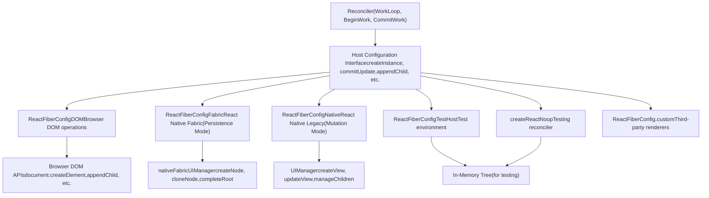
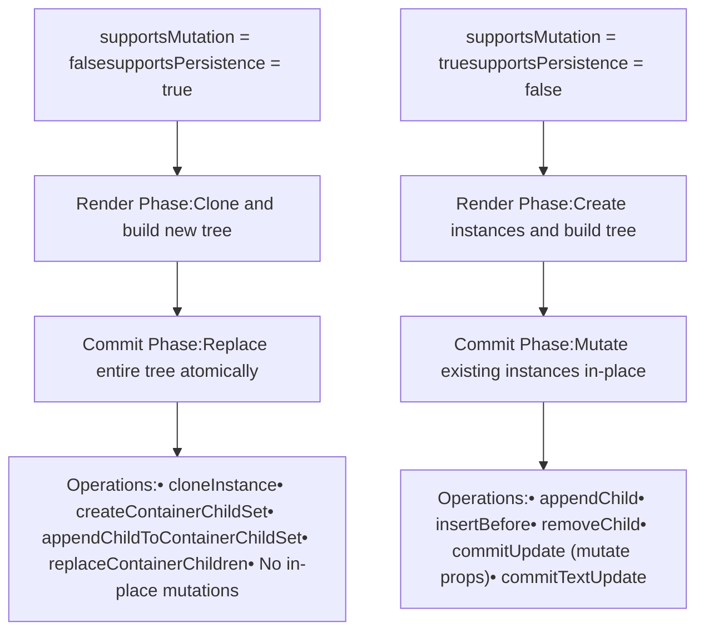
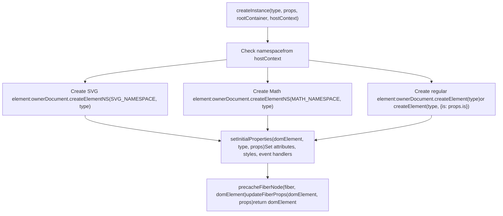
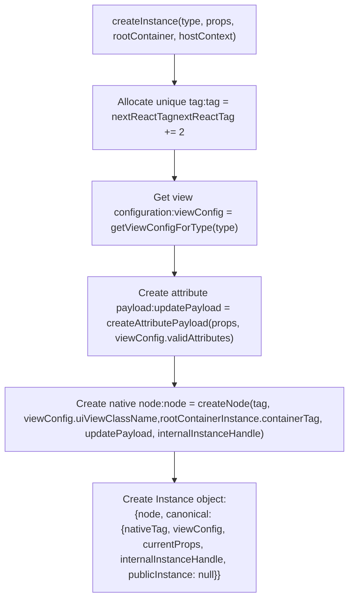
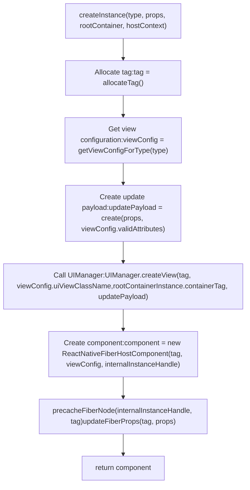
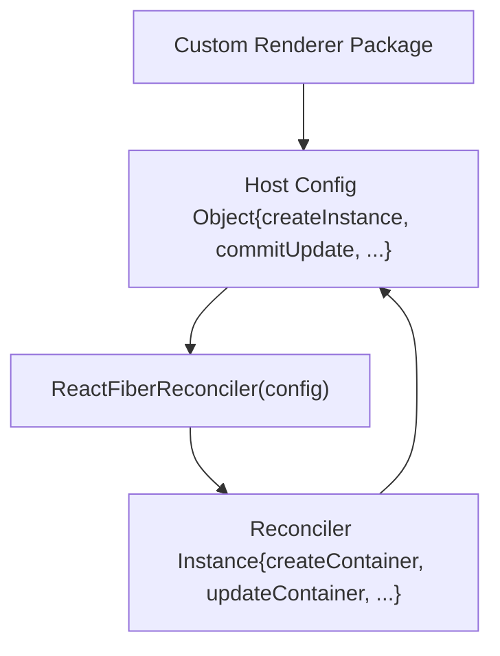

# 平台实现

相关源文件

-   [packages/react-art/src/ReactFiberConfigART.js](https://github.com/facebook/react/blob/65eec428/packages/react-art/src/ReactFiberConfigART.js)
-   [packages/react-dom-bindings/src/client/ReactFiberConfigDOM.js](https://github.com/facebook/react/blob/65eec428/packages/react-dom-bindings/src/client/ReactFiberConfigDOM.js)
-   [packages/react-native-renderer/src/ReactFiberConfigFabric.js](https://github.com/facebook/react/blob/65eec428/packages/react-native-renderer/src/ReactFiberConfigFabric.js)
-   [packages/react-native-renderer/src/ReactFiberConfigNative.js](https://github.com/facebook/react/blob/65eec428/packages/react-native-renderer/src/ReactFiberConfigNative.js)
-   [packages/react-noop-renderer/src/createReactNoop.js](https://github.com/facebook/react/blob/65eec428/packages/react-noop-renderer/src/createReactNoop.js)
-   [packages/react-reconciler/src/ReactFiberConfigWithNoMutation.js](https://github.com/facebook/react/blob/65eec428/packages/react-reconciler/src/ReactFiberConfigWithNoMutation.js)
-   [packages/react-reconciler/src/ReactFiberGestureScheduler.js](https://github.com/facebook/react/blob/65eec428/packages/react-reconciler/src/ReactFiberGestureScheduler.js)
-   [packages/react-reconciler/src/\_\_tests\_\_/ReactFiberHostContext-test.internal.js](https://github.com/facebook/react/blob/65eec428/packages/react-reconciler/src/__tests__/ReactFiberHostContext-test.internal.js)
-   [packages/react-reconciler/src/forks/ReactFiberConfig.custom.js](https://github.com/facebook/react/blob/65eec428/packages/react-reconciler/src/forks/ReactFiberConfig.custom.js)
-   [packages/react-test-renderer/src/ReactFiberConfigTestHost.js](https://github.com/facebook/react/blob/65eec428/packages/react-test-renderer/src/ReactFiberConfigTestHost.js)

## 目的与范围

本节记录了 **宿主配置（Host Configuration）抽象层**，该抽象层使得 React 的 Reconciler 无需修改即可渲染到不同的平台。宿主配置（host config）提供了特定于平台的操作实现，如创建实例、更新属性和管理树结构。这种抽象允许 React 使用相同的 Reconciler 逻辑渲染到浏览器 DOM、React Native、基于 Canvas 的渲染器、测试环境和自定义目标。

关于 Reconciler 的架构及其处理 Fiber 树的方式，请参阅 [React Reconciler](/facebook/react/4-react-reconciler)。关于 DOM 渲染和资源管理的具体细节，请参阅 [React DOM 实现](/facebook/react/6.1-react-dom-implementation)。关于 React Native 平台细节，请参阅 [React Native 渲染器](/facebook/react/6.2-react-native-renderers)。关于服务端渲染内容的水合，请参阅 [水合系统](/facebook/react/6.3-hydration-system)。

## 宿主配置架构

宿主配置接口定义了 Reconciler 与平台之间的契约。Reconciler 在渲染和提交阶段调用宿主配置方法以执行特定于平台的操作。每个渲染器（react-dom, react-native-renderer, react-test-renderer 等）都提供了该接口的自有实现。


**来源：** [packages/react-dom-bindings/src/client/ReactFiberConfigDOM.js1-292](https://github.com/facebook/react/blob/65eec428/packages/react-dom-bindings/src/client/ReactFiberConfigDOM.js#L1-L292) [packages/react-native-renderer/src/ReactFiberConfigFabric.js1-160](https://github.com/facebook/react/blob/65eec428/packages/react-native-renderer/src/ReactFiberConfigFabric.js#L1-L160) [packages/react-native-renderer/src/ReactFiberConfigNative.js1-115](https://github.com/facebook/react/blob/65eec428/packages/react-native-renderer/src/ReactFiberConfigNative.js#L1-L115) [packages/react-test-renderer/src/ReactFiberConfigTestHost.js1-59](https://github.com/facebook/react/blob/65eec428/packages/react-test-renderer/src/ReactFiberConfigTestHost.js#L1-L59) [packages/react-noop-renderer/src/createReactNoop.js1-111](https://github.com/facebook/react/blob/65eec428/packages/react-noop-renderer/src/createReactNoop.js#L1-L111)

## 核心宿主配置方法

宿主配置接口由几类方法组成，Reconciler 会在渲染过程的不同阶段调用这些方法。

```mermaid
flowchart TD
    cloneInstance["cloneInstance(instance, type, oldProps, newProps)"]
    createContainerChildSet["createContainerChildSet"]
    replaceContainerChildren["replaceContainerChildren(container, newChildren)"]
    appendChild["appendChild(parent, child)"]
    insertBefore["insertBefore(parent, child, beforeChild)"]
    removeChild["removeChild(parent, child)"]
    commitMount["commitMount(instance, type, props)"]
    commitUpdate["commitUpdate(instance, type, oldProps, newProps)"]
    commitTextUpdate["commitTextUpdate(textInstance, oldText, newText)"]
    appendInitialChild["appendInitialChild(parent, child)"]
    finalizeInitialChildren["finalizeInitialChildren(instance, type, props)"]
    getRootHostContext["getRootHostContext(rootContainer)"]
    getChildHostContext["getChildHostContext(parentContext, type)"]
    createInstance["createInstance(type, props, rootContainer, hostContext)"]
    createTextInstance["createTextInstance(text, rootContainer, hostContext)"]
    createHoistableInstance["createHoistableInstance(type, props, rootContainer)(DOM only)"]
```


**来源：** [packages/react-dom-bindings/src/client/ReactFiberConfigDOM.js484-608](https://github.com/facebook/react/blob/65eec428/packages/react-dom-bindings/src/client/ReactFiberConfigDOM.js#L484-L608) [packages/react-native-renderer/src/ReactFiberConfigFabric.js176-220](https://github.com/facebook/react/blob/65eec428/packages/react-native-renderer/src/ReactFiberConfigFabric.js#L176-L220) [packages/react-native-renderer/src/ReactFiberConfigNative.js130-169](https://github.com/facebook/react/blob/65eec428/packages/react-native-renderer/src/ReactFiberConfigNative.js#L130-L169) [packages/react-reconciler/src/forks/ReactFiberConfig.custom.js56-188](https://github.com/facebook/react/blob/65eec428/packages/react-reconciler/src/forks/ReactFiberConfig.custom.js#L56-L188)

## 平台类型定义

每个平台实现都为实例、容器和其他平台特定的数据结构定义了自己的类型：

| 类型 | ReactFiberConfigDOM | ReactFiberConfigFabric | ReactFiberConfigNative | ReactFiberConfigTestHost |
| --- | --- | --- | --- | --- |
| **Type** | `string` (元素标签名) | `string` (视图类型) | `string` (视图类型) | `string` |
| **Instance** | `Element` (DOM 元素) | `{node: Node, canonical: {...}}` (shadow 节点) | `ReactNativeFiberHostComponent` | `{type, props, children, tag: 'INSTANCE'}` |
| **TextInstance** | `Text` (DOM 文本节点) | `{node: Node}` (文本 shadow 节点) | `number` (文本标签) | `{text, tag: 'TEXT'}` |
| **Container** | `Element | Document | DocumentFragment` | `{containerTag: number, publicInstance}` | `{containerTag: number, publicInstance}` | `{children: [], createNodeMock, tag: 'CONTAINER'}` |
| **HostContext** | `HostContextNamespace` (0=None, 1=SVG, 2=Math) | `{isInAParentText: boolean}` | `{isInAParentText: boolean}` | `Object` (NO\_CONTEXT) |
| **UpdatePayload** | `Array<mixed>` (属性更新) | `Object` (属性 payload) | `Object` (未使用) | `Object` |
| **Mode** | 突变 (Mutation) | 持久化 (Persistence) | 突变 (Mutation) | 突变 (Mutation) |

**来源：** [packages/react-dom-bindings/src/client/ReactFiberConfigDOM.js153-250](https://github.com/facebook/react/blob/65eec428/packages/react-dom-bindings/src/client/ReactFiberConfigDOM.js#L153-L250) [packages/react-native-renderer/src/ReactFiberConfigFabric.js93-139](https://github.com/facebook/react/blob/65eec428/packages/react-native-renderer/src/ReactFiberConfigFabric.js#L93-L139) [packages/react-native-renderer/src/ReactFiberConfigNative.js59-73](https://github.com/facebook/react/blob/65eec428/packages/react-native-renderer/src/ReactFiberConfigNative.js#L59-L73) [packages/react-test-renderer/src/ReactFiberConfigTestHost.js26-58](https://github.com/facebook/react/blob/65eec428/packages/react-test-renderer/src/ReactFiberConfigTestHost.js#L26-L58)

## 突变 (Mutation) vs 持久化 (Persistence) 模式

根据平台的能力，宿主配置可以在两种不同的模式下运行：


**突变模式 (Mutation Mode)** (DOM, React Native Legacy)：实例可以就地突变。Reconciler 创建实例一次，然后通过调用 `commitUpdate`, `appendChild`, `removeChild` 等方法更新它们。这更节省内存，但需要小心的同步。

**持久化模式 (Persistence Mode)** (React Native Fabric)：实例是不可变的。Reconciler 克隆实例以创建修改后的版本，构建完整的像新树，并原子地替换旧树。这提供了更好的并发特性，并与 React Native 的新架构保持一致。

**来源：** [packages/react-dom-bindings/src/client/ReactFiberConfigDOM.js811](https://github.com/facebook/react/blob/65eec428/packages/react-dom-bindings/src/client/ReactFiberConfigDOM.js#L811-L811) [packages/react-native-renderer/src/ReactFiberConfigFabric.js449](https://github.com/facebook/react/blob/65eec428/packages/react-native-renderer/src/ReactFiberConfigFabric.js#L449-L449) [packages/react-native-renderer/src/ReactFiberConfigNative.js377](https://github.com/facebook/react/blob/65eec428/packages/react-native-renderer/src/ReactFiberConfigNative.js#L377-L377) [packages/react-reconciler/src/ReactFiberConfigWithNoMutation.js22](https://github.com/facebook/react/blob/65eec428/packages/react-reconciler/src/ReactFiberConfigWithNoMutation.js#L22-L22)

## 平台特定的实例创建

每个平台根据其底层渲染 API 以不同的方式创建实例：

### DOM 实例创建


**来源：** [packages/react-dom-bindings/src/client/ReactFiberConfigDOM.js484-608](https://github.com/facebook/react/blob/65eec428/packages/react-dom-bindings/src/client/ReactFiberConfigDOM.js#L484-L608)

### React Native Fabric 实例创建


**来源：** [packages/react-native-renderer/src/ReactFiberConfigFabric.js176-220](https://github.com/facebook/react/blob/65eec428/packages/react-native-renderer/src/ReactFiberConfigFabric.js#L176-L220)

### React Native Legacy 实例创建


**来源：** [packages/react-native-renderer/src/ReactFiberConfigNative.js130-169](https://github.com/facebook/react/blob/65eec428/packages/react-native-renderer/src/ReactFiberConfigNative.js#L130-L169)

## 宿主上下文管理

宿主上下文在渲染期间向下流动，并提供实例创建所需的命名空间/环境信息。不同的平台将其用于不同的目的：

**DOM**：跟踪命名空间（None, SVG, Math）以使用正确的命名空间创建元素。SVG 和 MathML 元素需要 `createElementNS`。

```
getRootHostContext: 确定根元素的初始命名空间
getChildHostContext: 在进入/离开 <svg>, <math>, 或 <foreignObject> 时更新命名空间
```
**React Native**：跟踪渲染是否发生在 Text 组件内，这会影响验证（文本字符串必须在 `<Text>` 内）。

```
getRootHostContext: 返回 {isInAParentText: false}
getChildHostContext: 根据组件类型更新 isInAParentText (RCTText, AndroidTextInput 等)
```
**Test/Noop 渲染器**：返回一个常量的 `NO_CONTEXT` 对象，因为不需要特殊的上下文。

**来源：** [packages/react-dom-bindings/src/client/ReactFiberConfigDOM.js302-406](https://github.com/facebook/react/blob/65eec428/packages/react-dom-bindings/src/client/ReactFiberConfigDOM.js#L302-L406) [packages/react-native-renderer/src/ReactFiberConfigFabric.js259-291](https://github.com/facebook/react/blob/65eec428/packages/react-native-renderer/src/ReactFiberConfigFabric.js#L259-L291) [packages/react-native-renderer/src/ReactFiberConfigNative.js264-287](https://github.com/facebook/react/blob/65eec428/packages/react-native-renderer/src/ReactFiberConfigNative.js#L264-L287)

## 优先级与事件管理

宿主配置提供了管理更新优先级和跟踪事件的方法：

| 方法 | 用途 | DOM 实现 | React Native 实现 |
| --- | --- | --- | --- |
| `setCurrentUpdatePriority` | 设置当前更新优先级 | 存储在模块变量中 | 存储在模块变量中 |
| `getCurrentUpdatePriority` | 获取当前更新优先级 | 返回存储的优先级 | 返回存储的优先级 |
| `resolveUpdatePriority` | 解析一批工作的优先级 | 返回当前优先级或推迟到事件优先级 | 返回当前优先级或默认优先级 |
| `trackSchedulerEvent` | 跟踪当前浏览器事件 | 存储 `window.event` | 空操作 |
| `resolveEventType` | 获取当前事件类型 | 返回 `window.event.type` | 返回 null |
| `resolveEventTimeStamp` | 获取当前事件时间戳 | 返回 `window.event.timeStamp` | 返回 -1.1 |
| `shouldAttemptEagerTransition` | 检查是否应同步渲染过渡 | 检查是否为 `popstate` 事件 | 返回 false |

**来源：** [packages/react-dom-bindings/src/client/ReactFiberConfigDOM.js709-747](https://github.com/facebook/react/blob/65eec428/packages/react-dom-bindings/src/client/ReactFiberConfigDOM.js#L709-L747) [packages/react-native-renderer/src/ReactFiberConfigFabric.js386-433](https://github.com/facebook/react/blob/65eec428/packages/react-native-renderer/src/ReactFiberConfigFabric.js#L386-L433) [packages/react-native-renderer/src/ReactFiberConfigNative.js343-371](https://github.com/facebook/react/blob/65eec428/packages/react-native-renderer/src/ReactFiberConfigNative.js#L343-L371)

## 提交生命周期方法

Reconciler 在提交阶段调用这些方法以完成更改：

**`prepareForCommit(containerInfo)`**：在突变开始前调用。返回一个将传递给 `resetAfterCommit` 的对象。DOM 使用它来禁用事件并捕获选择状态。React Native 返回 null（空操作）。

**`resetAfterCommit(containerInfo)`**：在突变完成后调用。DOM 恢复事件处理和选择。React Native 是空操作。

**`commitMount(instance, type, props, internalInstanceHandle)`**：对从 `finalizeInitialChildren` 返回 `true` 的实例调用。用于实现在实例进入树之后应该发生的效果（例如，自动聚焦，触发图像加载事件）。

**`commitUpdate(instance, type, oldProps, newProps, internalInstanceHandle)`**：调用以使用新 props 更新现有实例。DOM 调用 `updateProperties` 来 diff 并应用属性更改。React Native 使用 diff 后的 payload 调用 `UIManager.updateView`。

**`commitTextUpdate(textInstance, oldText, newText)`**：调用以更新文本节点。DOM 设置 `nodeValue`，React Native 调用 `UIManager.updateView`。

**来源：** [packages/react-dom-bindings/src/client/ReactFiberConfigDOM.js412-450](https://github.com/facebook/react/blob/65eec428/packages/react-dom-bindings/src/client/ReactFiberConfigDOM.js#L412-L450) [packages/react-dom-bindings/src/client/ReactFiberConfigDOM.js813-872](https://github.com/facebook/react/blob/65eec428/packages/react-dom-bindings/src/client/ReactFiberConfigDOM.js#L813-L872) [packages/react-dom-bindings/src/client/ReactFiberConfigDOM.js917-942](https://github.com/facebook/react/blob/65eec428/packages/react-dom-bindings/src/client/ReactFiberConfigDOM.js#L917-L942) [packages/react-native-renderer/src/ReactFiberConfigNative.js317-467](https://github.com/facebook/react/blob/65eec428/packages/react-native-renderer/src/ReactFiberConfigNative.js#L317-L467)

## 测试与第三方渲染器

### 测试渲染器 (Test Renderer)

测试渲染器创建一个内存中的树表示，而不渲染到任何实际表面。实例是带有 `tag: 'INSTANCE'` 或 `tag: 'TEXT'` 的普通对象。这用于快照测试以及在没有 DOM 的情况下断言 React 的输出。

**来源：** [packages/react-test-renderer/src/ReactFiberConfigTestHost.js158-174](https://github.com/facebook/react/blob/65eec428/packages/react-test-renderer/src/ReactFiberConfigTestHost.js#L158-L174) [packages/react-test-renderer/src/ReactFiberConfigTestHost.js216-227](https://github.com/facebook/react/blob/65eec428/packages/react-test-renderer/src/ReactFiberConfigTestHost.js#L216-L227)

### Noop 渲染器 (Noop Renderer)

Noop 渲染器类似于测试渲染器，但提供了突变和持久化模式的实现。它主要用于测试 Reconciler 本身，并在没有平台特定复杂性的情况下验证 Reconciler 的行为。

**来源：** [packages/react-noop-renderer/src/createReactNoop.js111-452](https://github.com/facebook/react/blob/65eec428/packages/react-noop-renderer/src/createReactNoop.js#L111-L452)

### 自定义渲染器（第三方）

`react-reconciler` 包允许第三方通过将宿主配置对象传递给 Reconciler 工厂函数来创建自定义渲染器。`ReactFiberConfig.custom.js` 文件作为一个垫片 (shim)，从 `$$$config` 变量（作为参数传递给 Reconciler 包）转发所有宿主配置方法。


**来源：** [packages/react-reconciler/src/forks/ReactFiberConfig.custom.js1-285](https://github.com/facebook/react/blob/65eec428/packages/react-reconciler/src/forks/ReactFiberConfig.custom.js#L1-L285) [packages/react-reconciler/src/\_\_tests\_\_/ReactFiberHostContext-test.internal.js41-121](https://github.com/facebook/react/blob/65eec428/packages/react-reconciler/src/__tests__/ReactFiberHostContext-test.internal.js#L41-L121)

## 可选特性与能力

宿主配置可以通过实现特定方法或设置标志来选择启用或禁用各种能力：

| 特性 | 标志/方法 | DOM | Fabric | Native Legacy | Test |
| --- | --- | --- | --- | --- | --- |
| **突变 (Mutation)** | `supportsMutation` | ✓ | ✗ | ✓ | ✓ |
| **持久化 (Persistence)** | `supportsPersistence` | ✗ | ✓ | ✗ | ✗ |
| **水合 (Hydration)** | `supportsHydration` | ✓ | ✗ | ✗ | ✗ |
| **微任务 (Microtasks)** | `supportsMicrotasks` | ✓ | ✗ | ✗ | ✗ |
| **资源 (Resources)** | `supportsResources` | ✓ | ✗ | ✗ | ✗ |
| **单例 (Singletons)** | `supportsSingletons` | ✓ | ✗ | ✗ | ✗ |
| **测试选择器 (Test Selectors)** | `supportsTestSelectors` | ✗ | ✗ | ✗ | ✗ |
| **片段实例 (Fragment Instances)** | `createFragmentInstance` | ✓ | ✓ | 空操作 | 空操作 |
| **视图过渡 (View Transitions)** | `startViewTransition` | 计划中 | 空操作 | 空操作 | 空操作 |

大多数平台从 `ReactFiberConfigWithNoHydration`, `ReactFiberConfigWithNoResources` 等模块导入默认实现，这些模块提供空操作实现或抛出错误。

**来源：** [packages/react-dom-bindings/src/client/ReactFiberConfigDOM.js292](https://github.com/facebook/react/blob/65eec428/packages/react-dom-bindings/src/client/ReactFiberConfigDOM.js#L292-L292) [packages/react-native-renderer/src/ReactFiberConfigFabric.js160-165](https://github.com/facebook/react/blob/65eec428/packages/react-native-renderer/src/ReactFiberConfigFabric.js#L160-L165) [packages/react-native-renderer/src/ReactFiberConfigNative.js115-121](https://github.com/facebook/react/blob/65eec428/packages/react-native-renderer/src/ReactFiberConfigNative.js#L115-L121) [packages/react-reconciler/src/ReactFiberConfigWithNoMutation.js22-60](https://github.com/facebook/react/blob/65eec428/packages/react-reconciler/src/ReactFiberConfigWithNoMutation.js#L22-L60)

## 总结

宿主配置抽象是 React 平台无关性的基础。通过在 Reconciler 和平台特定代码之间定义清晰的接口，React 能够：

-   渲染到截然不同的目标（DOM、原生移动端、Canvas、终端等）
-   支持不同的渲染范式（突变 vs 持久化）
-   针对平台特定能力进行优化（水合、资源、单例）
-   无需分叉 Reconciler 即可启用第三方渲染器

每个平台实现都根据其约束进行权衡——DOM 使用突变以获得效率和水合支持，Fabric 使用持久化以获得更好的并发性，测试渲染器优先考虑简单性和确定性。宿主配置接口在保持 Reconciler 核心逻辑平台无关的同时，适应了所有这些方法。
