# React DOM 实现

相关源文件

-   [packages/react-art/src/ReactFiberConfigART.js](https://github.com/facebook/react/blob/65eec428/packages/react-art/src/ReactFiberConfigART.js)
-   [packages/react-dom-bindings/src/client/ReactFiberConfigDOM.js](https://github.com/facebook/react/blob/65eec428/packages/react-dom-bindings/src/client/ReactFiberConfigDOM.js)
-   [packages/react-native-renderer/src/ReactFiberConfigFabric.js](https://github.com/facebook/react/blob/65eec428/packages/react-native-renderer/src/ReactFiberConfigFabric.js)
-   [packages/react-native-renderer/src/ReactFiberConfigNative.js](https://github.com/facebook/react/blob/65eec428/packages/react-native-renderer/src/ReactFiberConfigNative.js)
-   [packages/react-noop-renderer/src/createReactNoop.js](https://github.com/facebook/react/blob/65eec428/packages/react-noop-renderer/src/createReactNoop.js)
-   [packages/react-reconciler/src/ReactFiberConfigWithNoMutation.js](https://github.com/facebook/react/blob/65eec428/packages/react-reconciler/src/ReactFiberConfigWithNoMutation.js)
-   [packages/react-reconciler/src/ReactFiberGestureScheduler.js](https://github.com/facebook/react/blob/65eec428/packages/react-reconciler/src/ReactFiberGestureScheduler.js)
-   [packages/react-reconciler/src/\_\_tests\_\_/ReactFiberHostContext-test.internal.js](https://github.com/facebook/react/blob/65eec428/packages/react-reconciler/src/__tests__/ReactFiberHostContext-test.internal.js)
-   [packages/react-reconciler/src/forks/ReactFiberConfig.custom.js](https://github.com/facebook/react/blob/65eec428/packages/react-reconciler/src/forks/ReactFiberConfig.custom.js)
-   [packages/react-test-renderer/src/ReactFiberConfigTestHost.js](https://github.com/facebook/react/blob/65eec428/packages/react-test-renderer/src/ReactFiberConfigTestHost.js)

## 目的与范围

本文档描述了 React DOM 宿主配置（Host Configuration）实现（`ReactFiberConfigDOM`），它是 React 协调器（Reconciler）与浏览器 DOM API 之间的桥梁。此实现定义了 React 在渲染和提交过程中如何创建、更新和管理 DOM 元素。

有关宿主配置抽象本身的信息，请参阅 [Host Configuration Abstraction](/facebook/react/4.6-host-configuration-abstraction)。有关 Hydration 特有的功能，请参阅 [Hydration System](/facebook/react/6.3-hydration-system)。有关视图过渡协调，请参阅 [View Transitions and Gesture Scheduling](/facebook/react/6.4-view-transitions-and-gesture-scheduling)。

**来源：** [packages/react-dom-bindings/src/client/ReactFiberConfigDOM.js1-150](https://github.com/facebook/react/blob/65eec428/packages/react-dom-bindings/src/client/ReactFiberConfigDOM.js#L1-L150)

## 架构概述

DOM 宿主配置实现了 React 协调器所期望的接口，将协调器操作转换为浏览器的 DOM 操作。它以变动模式（Mutation mode）运行，在更改发生时直接修改 DOM 树。

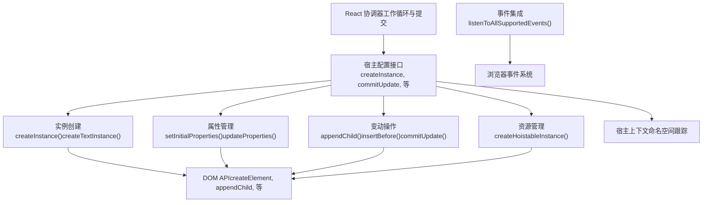
**来源：** [packages/react-dom-bindings/src/client/ReactFiberConfigDOM.js1-292](https://github.com/facebook/react/blob/65eec428/packages/react-dom-bindings/src/client/ReactFiberConfigDOM.js#L1-L292)

## 类型系统

ReactFiberConfigDOM 定义了协调器中表示 DOM 结构的核心类型。

### 核心类型

| 类型 | 定义 | 描述 |
| --- | --- | --- |
| `Type` | `string` | 元素类型（例如，'div', 'span'） |
| `Props` | `object` | 带有 DOM 特定属性的 React props 对象 |
| `Container` | `Element | Document | DocumentFragment` | 带有 `_reactRootContainer` 字段的根容器元素 |
| `Instance` | `Element` | 一个 DOM 元素实例 |
| `TextInstance` | `Text` | 一个 DOM 文本节点 |
| `HostContext` | `HostContextDev | HostContextProd` | 命名空间上下文（SVG, MathML, 或 HTML） |
| `UpdatePayload` | `Array<mixed>` | 包含交替的属性键和值的数组 |

**来源：** [packages/react-dom-bindings/src/client/ReactFiberConfigDOM.js153-248](https://github.com/facebook/react/blob/65eec428/packages/react-dom-bindings/src/client/ReactFiberConfigDOM.js#L153-L248)

### 实例类型图

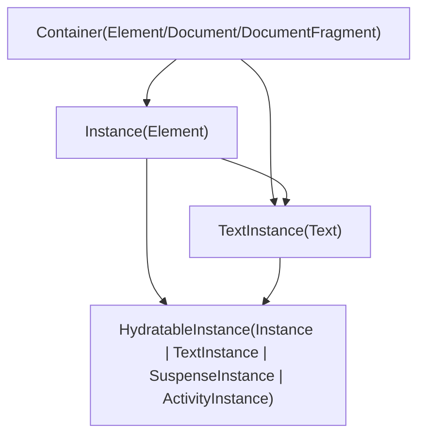
**来源：** [packages/react-dom-bindings/src/client/ReactFiberConfigDOM.js211-237](https://github.com/facebook/react/blob/65eec428/packages/react-dom-bindings/src/client/ReactFiberConfigDOM.js#L211-L237)

## 宿主上下文（Host Context）管理

宿主上下文跟踪当前的命名空间（HTML, SVG, MathML），以确保使用正确的命名空间 URI 创建元素。这对于在 HTML 文档中正确渲染 SVG 和 MathML 元素至关重要。

### 命名空间常量

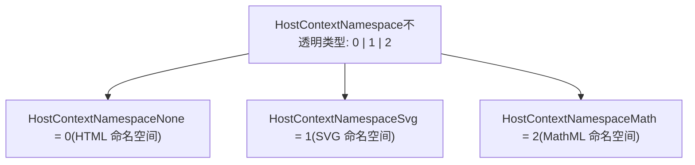
### 上下文流

协调器在进入根容器时调用 `getRootHostContext`，然后为每个子元素调用 `getChildHostContext` 以确定适当的命名空间。

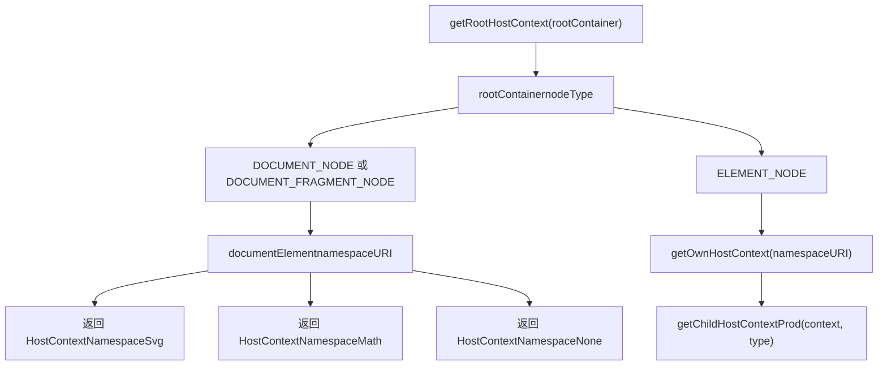
关键函数：

-   `getRootHostContext(rootContainerInstance)` [packages/react-dom-bindings/src/client/ReactFiberConfigDOM.js302-355](https://github.com/facebook/react/blob/65eec428/packages/react-dom-bindings/src/client/ReactFiberConfigDOM.js#L302-L355)
-   `getChildHostContext(parentHostContext, type)` [packages/react-dom-bindings/src/client/ReactFiberConfigDOM.js391-406](https://github.com/facebook/react/blob/65eec428/packages/react-dom-bindings/src/client/ReactFiberConfigDOM.js#L391-L406)
-   `getChildHostContextProd(parentNamespace, type)` [packages/react-dom-bindings/src/client/ReactFiberConfigDOM.js368-389](https://github.com/facebook/react/blob/65eec428/packages/react-dom-bindings/src/client/ReactFiberConfigDOM.js#L368-L389)

### 命名空间转换

针对命名空间转换存在特殊处理：

-   从 HTML 进入 `<svg>` 会切换到 SVG 命名空间
-   从 HTML 进入 `<math>` 会切换到 MathML 命名空间
-   SVG 内部的 `<foreignObject>` 会返回 HTML 命名空间

**来源：** [packages/react-dom-bindings/src/client/ReactFiberConfigDOM.js284-406](https://github.com/facebook/react/blob/65eec428/packages/react-dom-bindings/src/client/ReactFiberConfigDOM.js#L284-L406)

## 实例创建

DOM 实例在协调器的 Render 阶段（渲染阶段）创建，并在 Commit 阶段（提交阶段）完成。

### 普通实例创建

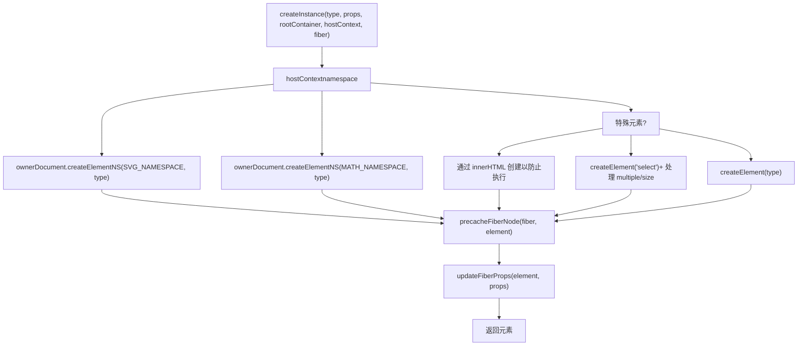
`createInstance` 函数：

1.  从根容器确定 owner document（所属文档）。
2.  使用适当的命名空间创建元素。
3.  通过 `precacheFiberNode` 缓存 Fiber 到 DOM 的映射。
4.  通过 `updateFiberProps` 将 props 存储在 DOM 节点上。
5.  *不*调用 `setInitialProperties`（该操作发生在 `finalizeInitialChildren` 中）。

**来源：** [packages/react-dom-bindings/src/client/ReactFiberConfigDOM.js484-608](https://github.com/facebook/react/blob/65eec428/packages/react-dom-bindings/src/client/ReactFiberConfigDOM.js#L484-L608)

### 可提升实例（Hoistable Instance）创建

Hoistable instances 是一些特殊的 DOM 元素（如 `<link>`, `<style>`, `<script>`），它们可以被“提升”到文档头部（head）进行资源管理。

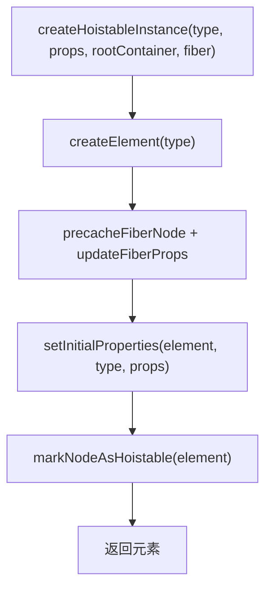
**来源：** [packages/react-dom-bindings/src/client/ReactFiberConfigDOM.js452-468](https://github.com/facebook/react/blob/65eec428/packages/react-dom-bindings/src/client/ReactFiberConfigDOM.js#L452-L468)

### 文本实例创建

文本节点较为简单：

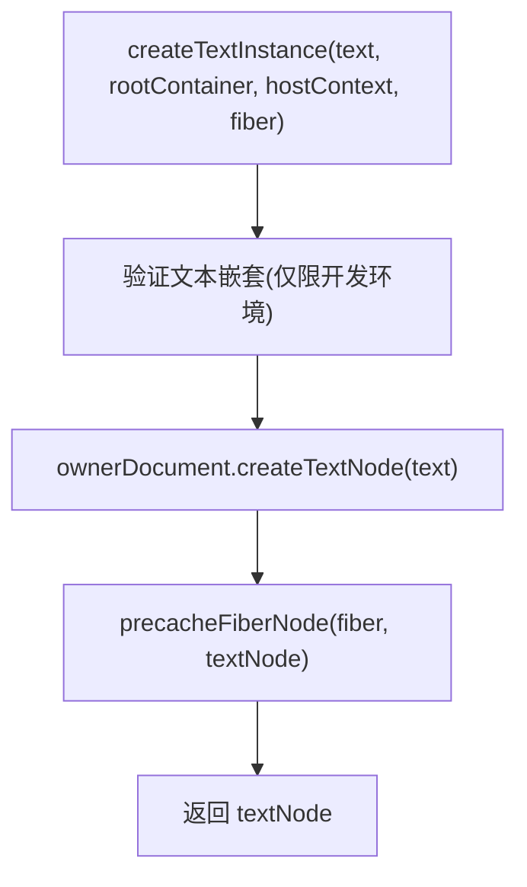
**来源：** [packages/react-dom-bindings/src/client/ReactFiberConfigDOM.js679-701](https://github.com/facebook/react/blob/65eec428/packages/react-dom-bindings/src/client/ReactFiberConfigDOM.js#L679-L701)

## 属性管理

属性（React props）通过专门的辅助模块转换为 DOM 特性和属性。

### 属性应用流程

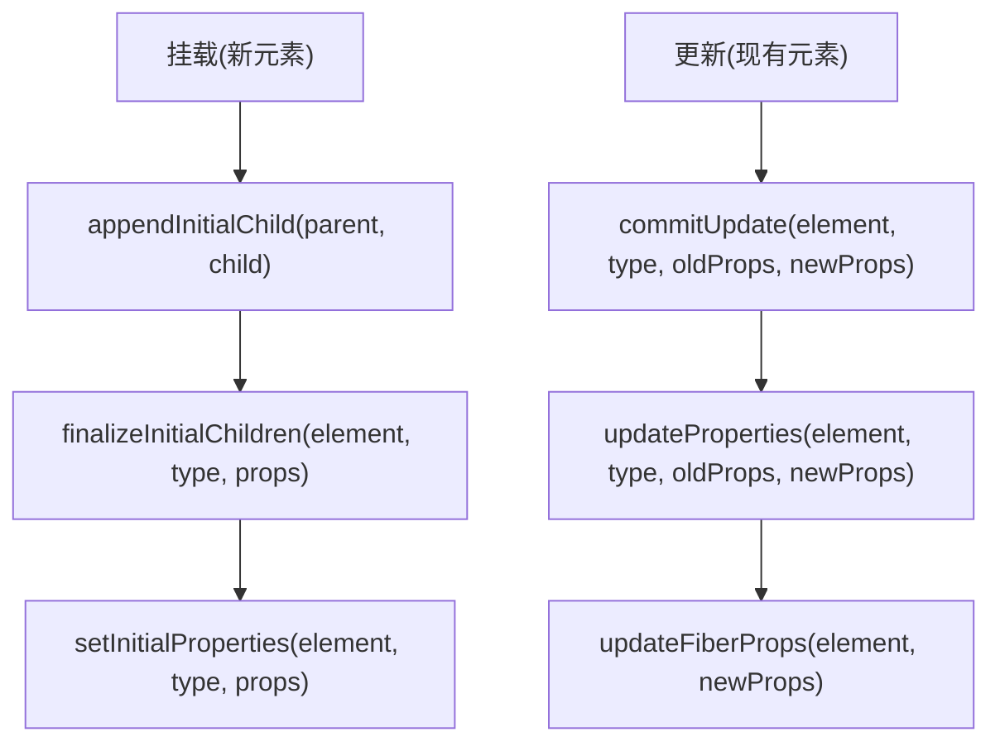
来自 `ReactDOMComponent` 的关键函数：

-   `setInitialProperties(domElement, tag, props)` - 在完成阶段应用 [packages/react-dom-bindings/src/client/ReactDOMComponent.js](https://github.com/facebook/react/blob/65eec428/packages/react-dom-bindings/src/client/ReactDOMComponent.js)
-   `updateProperties(domElement, tag, lastProps, nextProps)` - 在 commit 更新期间应用 [packages/react-dom-bindings/src/client/ReactDOMComponent.js](https://github.com/facebook/react/blob/65eec428/packages/react-dom-bindings/src/client/ReactDOMComponent.js)

特殊的属性处理包括：

-   `dangerouslySetInnerHTML` - 设置 innerHTML
-   `children`（当为字符串/数字时） - 设置 textContent
-   `style` - 将对象转换为 CSS 字符串
-   `autoFocus` - 在 `commitMount` 中处理
-   事件处理程序 - 在事件系统中注册
-   `value`, `checked`, `selected` - 特殊的表单控件属性

**来源：** [packages/react-dom-bindings/src/client/ReactFiberConfigDOM.js78-86](https://github.com/facebook/react/blob/65eec428/packages/react-dom-bindings/src/client/ReactFiberConfigDOM.js#L78-L86) [packages/react-dom-bindings/src/client/ReactFiberConfigDOM.js917-930](https://github.com/facebook/react/blob/65eec428/packages/react-dom-bindings/src/client/ReactFiberConfigDOM.js#L917-L930)

## 变动操作（Mutation Operations）

ReactFiberConfigDOM 以变动模式（`supportsMutation = true`）运行，直接修改 DOM 树。所有变动操作在可用时都支持 `moveBefore` API。

### 核心变动方法

| 方法 | 目的 | 何时调用 |
| --- | --- | --- |
| `appendChild(parent, child)` | 在末尾追加子节点 | 更新期间的重新定位 |
| `appendChildToContainer(container, child)` | 追加到根容器 | 挂载根内容 |
| `insertBefore(parent, child, before)` | 在兄弟节点前插入子节点 | 重新排序、插入 |
| `insertInContainerBefore(container, child, before)` | 在根节点兄弟前插入 | 根级别的插入 |
| `removeChild(parent, child)` | 从父节点移除子节点 | 删除 |
| `removeChildFromContainer(container, child)` | 从根节点移除 | 根级别的删除 |

### moveBefore 特征检测

React 会检测并在可用时使用 `moveBefore` DOM API，以实现更高效的重新定位：

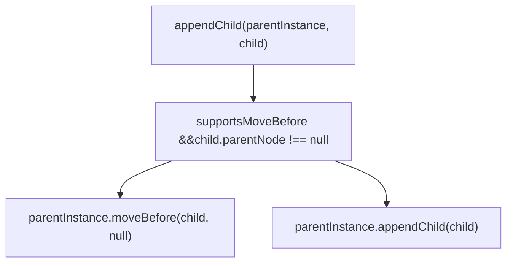
**来源：** [packages/react-dom-bindings/src/client/ReactFiberConfigDOM.js944-960](https://github.com/facebook/react/blob/65eec428/packages/react-dom-bindings/src/client/ReactFiberConfigDOM.js#L944-L960)

### Commit 操作

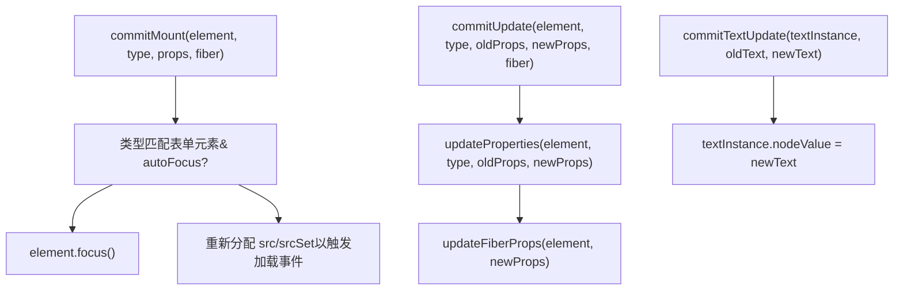
**来源：** [packages/react-dom-bindings/src/client/ReactFiberConfigDOM.js813-872](https://github.com/facebook/react/blob/65eec428/packages/react-dom-bindings/src/client/ReactFiberConfigDOM.js#L813-L872) [packages/react-dom-bindings/src/client/ReactFiberConfigDOM.js917-942](https://github.com/facebook/react/blob/65eec428/packages/react-dom-bindings/src/client/ReactFiberConfigDOM.js#L917-L942)

## 事件系统集成

ReactFiberConfigDOM 通过几个关键函数与 React 的合成事件系统集成。

### 事件设置

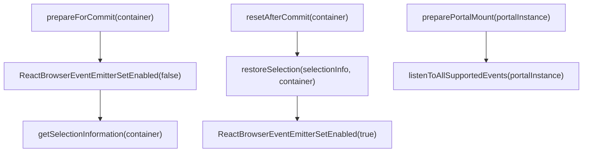
事件系统在提交（commit）期间会暂时禁用，以防止在修改 DOM 时触发不必要的事件分发。

**来源：** [packages/react-dom-bindings/src/client/ReactFiberConfigDOM.js412-450](https://github.com/facebook/react/blob/65eec428/packages/react-dom-bindings/src/client/ReactFiberConfigDOM.js#L412-L450) [packages/react-dom-bindings/src/client/ReactFiberConfigDOM.js767-769](https://github.com/facebook/react/blob/65eec428/packages/react-dom-bindings/src/client/ReactFiberConfigDOM.js#L767-L769)

### 优先级与事件跟踪

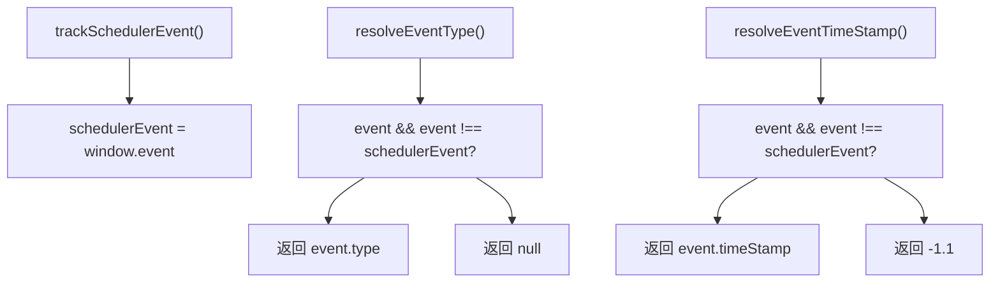
这些函数帮助协调器确定当前事件的优先级和性质，以便进行调度。

**来源：** [packages/react-dom-bindings/src/client/ReactFiberConfigDOM.js734-747](https://github.com/facebook/react/blob/65eec428/packages/react-dom-bindings/src/client/ReactFiberConfigDOM.js#L734-L747)

### 急切过渡 (Eager Transitions)

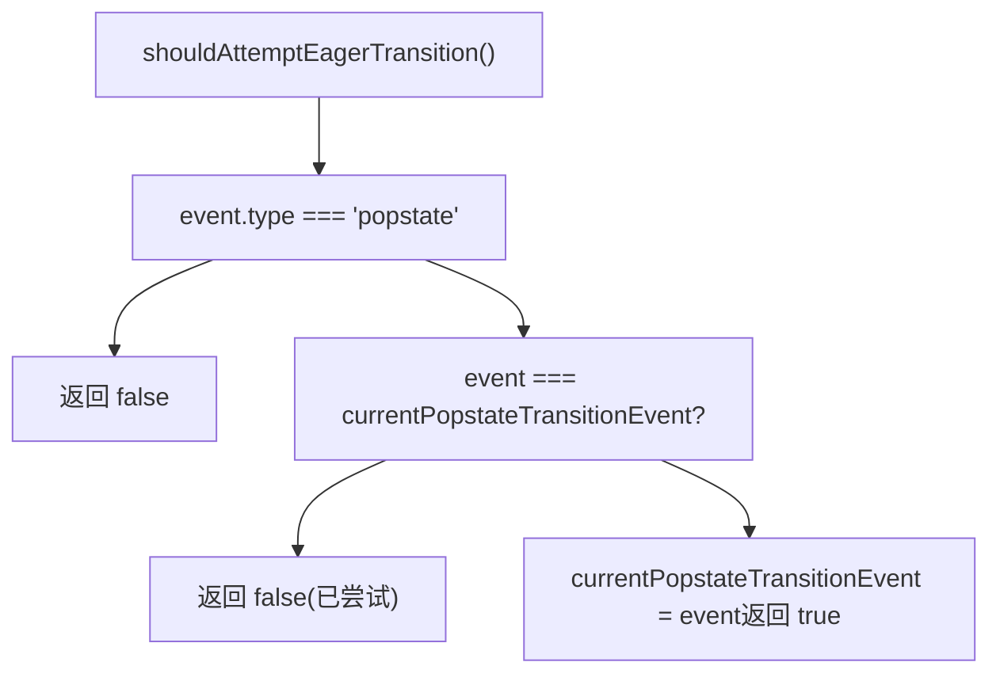
该优化尝试同步渲染 `popstate` 过渡，以避免在浏览器历史导航期间出现闪烁。

**来源：** [packages/react-dom-bindings/src/client/ReactFiberConfigDOM.js709-732](https://github.com/facebook/react/blob/65eec428/packages/react-dom-bindings/src/client/ReactFiberConfigDOM.js#L709-L732)

## 资源管理

ReactFiberConfigDOM 针对“可提升”（hoistable）资源实现了特殊处理——诸如样式表和脚本之类的元素，它们应该是文档头部（head）中的单例实例。

### 可提升元素

资源通过 `markNodeAsHoistable` 函数被标记为可提升，该函数在 DOM 节点上设置一个内部标记：

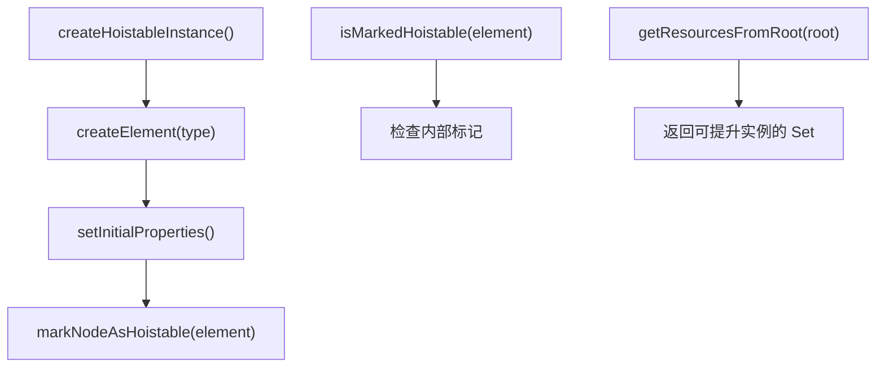
提升机制确保：

-   多个相同的 `<link>` 或 `<script>` 元素会被去重。
-   资源会被移动到文档的 `<head>`。
-   如果资源仍保留在树中，它们会在重新渲染时持久存在。

**来源：** [packages/react-dom-bindings/src/client/ReactDOMComponentTree.js56-59](https://github.com/facebook/react/blob/65eec428/packages/react-dom-bindings/src/client/ReactDOMComponentTree.js#L56-L59) [packages/react-dom-bindings/src/client/ReactFiberConfigDOM.js452-468](https://github.com/facebook/react/blob/65eec428/packages/react-dom-bindings/src/client/ReactFiberConfigDOM.js#L452-L468)

### 资源验证

对于样式表链接，React 会验证 props 以确保正确的资源语义：

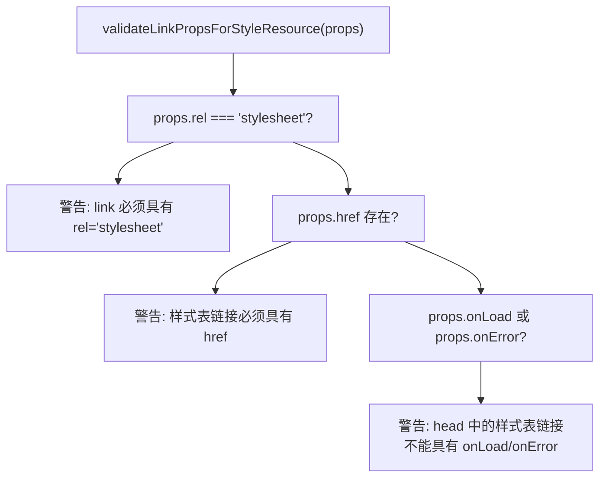
**来源：** [packages/react-dom-bindings/src/shared/ReactDOMResourceValidation.js138](https://github.com/facebook/react/blob/65eec428/packages/react-dom-bindings/src/shared/ReactDOMResourceValidation.js#L138-L138)

## 特殊元素处理

几种元素类型除了标准的属性应用外，还需要特殊处理。

### 脚本元素（Script Elements）

必须以防止执行的方式创建脚本标签：

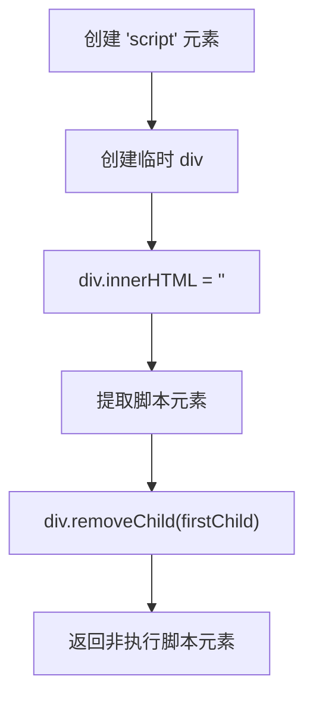
这确保脚本在渲染期间不会执行，只有在显式挂载的提交期间才会执行。

**来源：** [packages/react-dom-bindings/src/client/ReactFiberConfigDOM.js523-542](https://github.com/facebook/react/blob/65eec428/packages/react-dom-bindings/src/client/ReactFiberConfigDOM.js#L523-L542)

### Select 元素

Select 元素对 `multiple` 和 `size` props 进行特殊处理：

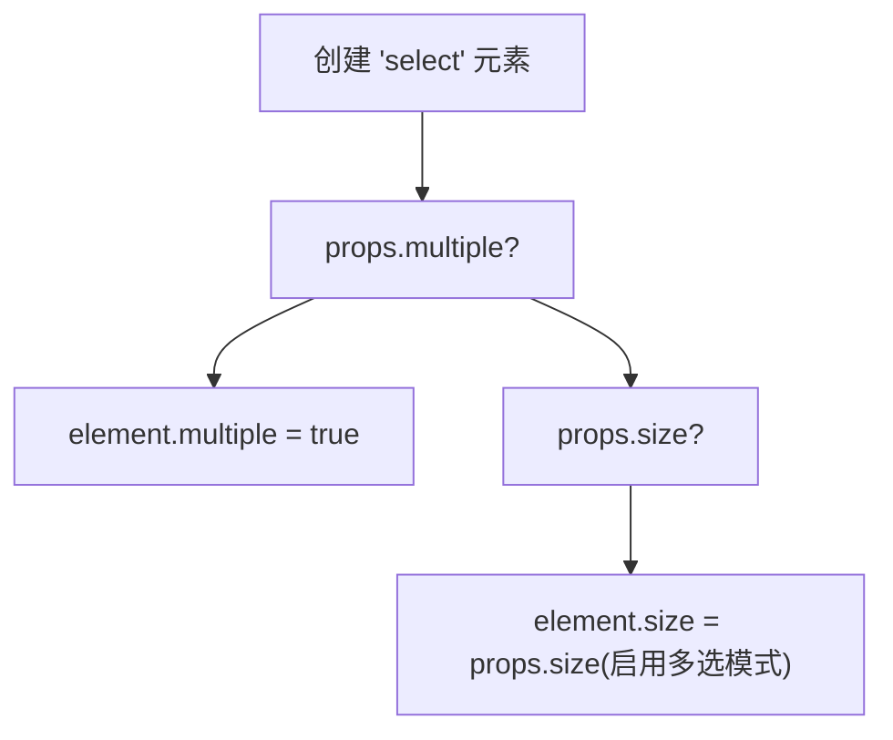
**来源：** [packages/react-dom-bindings/src/client/ReactFiberConfigDOM.js544-562](https://github.com/facebook/react/blob/65eec428/packages/react-dom-bindings/src/client/ReactFiberConfigDOM.js#L544-L562)

### 表单控件 (Input, Textarea, Select)

表单控件具有专门的 prop 处理：

-   `finalizeInitialChildren` 为 input, select, textarea 返回 `true`，以调度 `commitMount`。
-   `commitMount` 通过调用 `element.focus()` 处理 `autoFocus`。
-   专门的模块处理受控与非受控状态：`ReactDOMInput`, `ReactDOMTextarea`, `ReactDOMSelect`。

**来源：** [packages/react-dom-bindings/src/client/ReactFiberConfigDOM.js625-643](https://github.com/facebook/react/blob/65eec428/packages/react-dom-bindings/src/client/ReactFiberConfigDOM.js#L625-L643) [packages/react-dom-bindings/src/client/ReactFiberConfigDOM.js813-872](https://github.com/facebook/react/blob/65eec428/packages/react-dom-bindings/src/client/ReactFiberConfigDOM.js#L813-L872)

### 图像元素（Image Elements）

图像在 `commitMount` 中接收特殊处理，以确保 `onLoad` 事件正确触发：

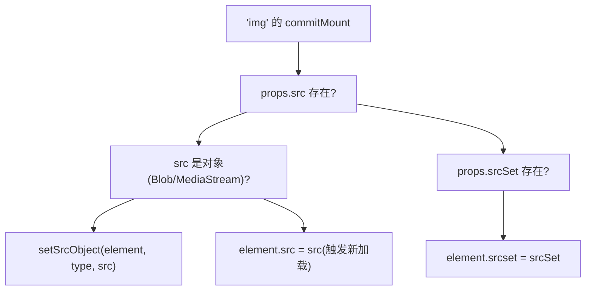
重新分配确保即使图像已经加载，`onLoad` 处理程序也会被再次调用。

**来源：** [packages/react-dom-bindings/src/client/ReactFiberConfigDOM.js838-869](https://github.com/facebook/react/blob/65eec428/packages/react-dom-bindings/src/client/ReactFiberConfigDOM.js#L838-L869)

## Hydration 支持

ReactFiberConfigDOM 提供 Hydration 函数，在客户端 Hydration 期间将服务器渲染的 HTML 与 React 的虚拟 DOM 匹配。这是一个大课题，在 [Hydration System](/facebook/react/6.3-hydration-system) 中有详细介绍。

导出的关键 Hydration 函数：

-   `hydrateProperties(domElement, tag, props)` - 匹配并验证 props
-   `hydrateText(textInstance, text)` - 验证文本内容
-   `diffHydratedProperties(domElement, tag, props)` - 为不匹配项产生更新载荷（update payload）
-   `diffHydratedText(textInstance, text)` - 检查文本不匹配

Hydration 还处理特殊情况：

-   脱水的（Dehydrated）Suspense 边界（用注释节点标记）。
-   表单状态标记，用于跨 SSR 保留表单数据。
-   通过 `hydrateInput`, `hydrateTextarea`, `hydrateSelect` 实现 input/textarea/select 状态同步。

**来源：** [packages/react-dom-bindings/src/client/ReactFiberConfigDOM.js81-89](https://github.com/facebook/react/blob/65eec428/packages/react-dom-bindings/src/client/ReactFiberConfigDOM.js#L81-L89) [packages/react-dom-bindings/src/client/ReactFiberConfigDOM.js874-915](https://github.com/facebook/react/blob/65eec428/packages/react-dom-bindings/src/client/ReactFiberConfigDOM.js#L874-L915)

## 视图过渡（View Transitions）与调度

ReactFiberConfigDOM 包含视图过渡的存根（stubs）和部分实现，可实现状态之间的动画过渡。完整详情见 [View Transitions and Gesture Scheduling](/facebook/react/6.4-view-transitions-and-gesture-scheduling)。

### 视图过渡生命周期

宿主配置提供在视图过渡期间由协调器调用的函数：

| 函数 | 目的 |
| --- | --- |
| `measureInstance(instance)` | 在过渡前捕获实例测量值 |
| `cloneRootViewTransitionContainer(root)` | 克隆根节点以捕获“旧”状态 |
| `startViewTransition(...)` | 开始协调过渡动画 |
| `applyViewTransitionName(instance, name, className)` | 应用 CSS view-transition-name |
| `stopViewTransition(transition)` | 结束过渡 |

### 手势调度 (Gesture Scheduling)

手势时间轴集成（用于擦除过渡）也是存根式的：

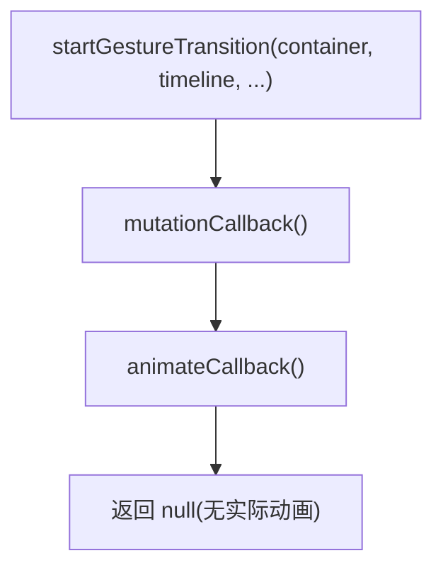
**来源：** [packages/react-dom-bindings/src/client/ReactFiberConfigDOM.js1094-1358](https://github.com/facebook/react/blob/65eec428/packages/react-dom-bindings/src/client/ReactFiberConfigDOM.js#L1094-L1358)

## 组件树映射

ReactFiberConfigDOM 维护 DOM 节点与 React Fiber 之间的映射，以支持：

-   事件分发（查找 DOM 节点的 React 实例）。
-   React DevTools（检查组件树）。
-   公共实例访问（refs）。

### 映射函数

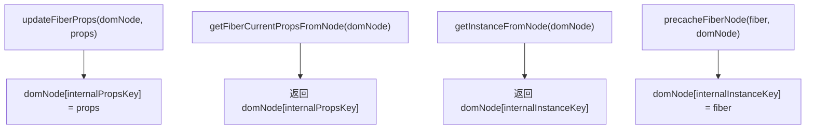
这些映射在实例创建期间建立，并在整个生命周期中用于事件处理和内省（introspection）。

**来源：** [packages/react-dom-bindings/src/client/ReactDOMComponentTree.js47-60](https://github.com/facebook/react/blob/65eec428/packages/react-dom-bindings/src/client/ReactDOMComponentTree.js#L47-L60)

## 总结

ReactFiberConfigDOM 作为 React 平台无关协调器与浏览器 DOM 之间的关键桥梁。它：

-   使用正确的命名空间（HTML, SVG, MathML）**创建 DOM 实例**。
-   通过将 React props 转换为 DOM 特性/属性来**管理属性**。
-   使用原生 DOM API（配合 `moveBefore` 优化）高效地**执行变动**。
-   通过与 React 合成事件系统配合来**集成事件**。
-   通过样式表和脚本的提升机制来**处理资源**。
-   通过将服务器渲染的 HTML 与 React 树匹配来**支持 Hydration**。
-   为动画状态更改启用**视图过渡**（实验性）。

该实现是基于变动的（Mutation-based，不同于 React Native 的持久化模式），并针对浏览器环境进行了优化，对表单控件、脚本、图像和其他 HTML 特定元素进行了特殊处理。

**来源：** [packages/react-dom-bindings/src/client/ReactFiberConfigDOM.js1-1500](https://github.com/facebook/react/blob/65eec428/packages/react-dom-bindings/src/client/ReactFiberConfigDOM.js#L1-L1500)
